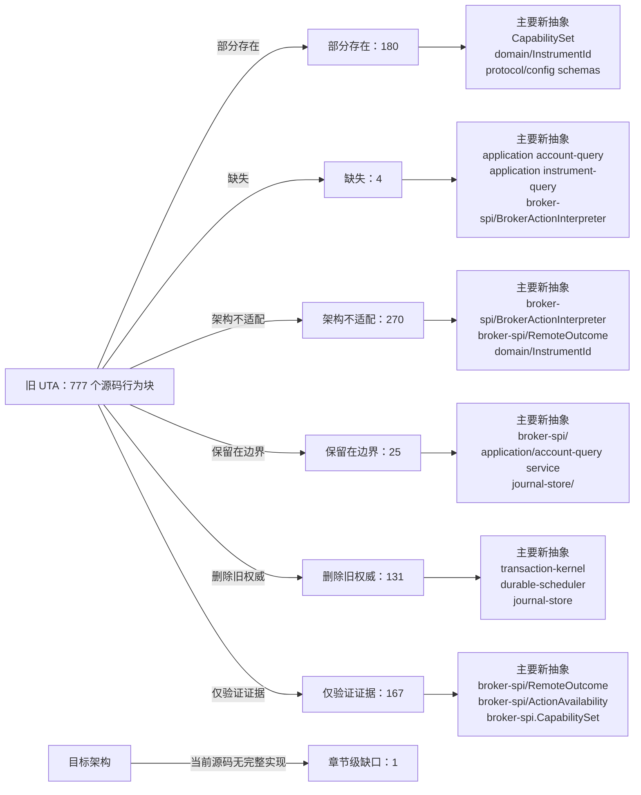

<!-- Auto-generated by scripts/uta-effect-runtime-map.mjs from mapping.json. Do not edit by hand. -->
<!-- Regenerate with `node scripts/uta-effect-runtime-map.mjs`. -->

# UTA 功能替代关系：第 19 章 Architectural prohibitions

目标架构原文：[`docs/uta-effect-runtime-architecture.md:1474-1490`](../uta-effect-runtime-architecture.md#L1474-L1490)。

## 结论

部分存在 180；缺失 4；架构不适配 270；保留在边界 25；删除旧权威 131；仅验证证据 167。状态只描述当前实现相对于目标架构的关系，不表示迁移已经落地。

## 替代关系图

## 章节级目标缺口

| 依据 | 目标义务 | 当前缺口 | 必须补充或调整 |
|---|---|---|---|
| docs/uta-effect-runtime-architecture.md:1474-1489 | No process-external database, queue, or workflow requirement | Existing SQLite/scheduler recommendations do not explicitly forbid introducing an external database, durable queue, or workflow service as a runtime prerequisite. | Keep UTA self-contained with embedded SQLite and in-process Effect runtime; external infrastructure may not become required execution authority or recovery state. |

## 源码映射

| 映射 ID | 当前源码 | 符号或行为块 | 当前功能 | 替代状态 | 新 UTA 抽象与做法 | 不适配位置与原因 | 必须补充或调整 | 重复索引 |
|---|---|---|---|---|---|---|---|---|
| `MAP-9AD9951502` | [`packages/uta-broker-alpaca/src/index.ts:1-1`](../../packages/uta-broker-alpaca/src/index.ts#L1-L1) | AlpacaBroker import | The release wrapper imports the concrete AlpacaBroker from services/uta/src/domain/trading/brokers/alpaca, binding the pack to the legacy domain/trading IBroker implementation rather than to a target brokers/alpaca interpreter. | 删除旧权威 | 3.7 brokers/<broker>/；9.1 Connection Layer；9.2 Typed action interpreter；16 Target source layout；17 Migration sequence / Slice 4: first real broker；19 Architectural prohibitions services/uta/src/brokers/alpaca/；services/uta/src/broker-spi/BrokerConnectionService；services/uta/src/broker-spi/BrokerActionInterpreter；services/uta/src/main.ts Remove the legacy import when the target pack contract becomes authoritative. Import the pack-local Alpaca adapter entrypoint under services/uta/src/brokers/alpaca instead, and expose a typed BrokerConnectionService Layer plus BrokerActionInterpreter descriptor for registration by services/uta/src/main.ts. The wrapper may assemble the adapter but must not own transaction state or kernel decisions. | The current import reaches the old domain/trading broker class, so the release module has no target connection Layer, typed action map, broker-spi failure channel, remote observation contract, or compensation capability to register. | Delete the legacy class dependency and move Alpaca SDK request/response schemas, error mapping, dispatch identity/idempotency, observation, and compensation compilation behind the target broker-spi adapter. Register that adapter only at the composition root; keep transaction-kernel ownership in the kernel. | **DUP-001** |
| `MAP-6496594BF0` | [`packages/uta-broker-alpaca/src/index.ts:7-9`](../../packages/uta-broker-alpaca/src/index.ts#L7-L9) | createBroker | Accepts an id, optional label, and Record<string, unknown> brokerConfig; calls AlpacaBroker.fromConfig and uses Object.assign to add brokerEngine. The result is a legacy IBroker object, not an Effect Layer or typed broker-spi interpreter. | 架构不适配 | 3.7 brokers/<broker>/；4 Effect model；9.1 Connection Layer；9.2 Typed action interpreter；9.3 Remote outcome；9.4 Capability derivation；12.2 Unknown-outcome protocol；16 Target source layout；17 Migration sequence / Slice 4: first real broker；19 Architectural prohibitions services/uta/src/brokers/alpaca/；services/uta/src/broker-spi/BrokerConnectionService；services/uta/src/broker-spi/BrokerActionInterpreter；services/uta/src/broker-spi/RemoteOutcome；services/uta/src/durable-scheduler/；services/uta/src/main.ts Replace this legacy factory export with the target versioned pack entrypoint: validate the typed Alpaca configuration, return the adapter's scoped BrokerConnectionService Layer and action-specific BrokerActionInterpreter, and let main.ts register it for durable-scheduler dispatch. Dispatch must carry a DispatchIdentity, persist outcomes through the scheduler/journal path, and expose compensation compilation; no wrapper-created object may become transaction-kernel state. | The current factory performs immediate legacy object construction, erases configuration as Record<string, unknown>, adds an ad-hoc brokerEngine property, and supplies none of the target availability, dispatch, observation, unknown-outcome, idempotency, or compensation contracts. It therefore cannot satisfy the Alpaca typed-interpreter migration or crash-recovery protocol. | Implement and export the Alpaca target interpreter/connection descriptor, including native request compilation, typed broker failures, paper/live capability derivation, remote order observation, idempotency proof or reconcile-before-retry, and compensation programs. Register it through the composition root and durable scheduler; delete the old Alpaca dispatcher path once this adapter owns the account mutation. | **DUP-005** |
| `MAP-B40F4C1C42` | [`packages/uta-broker-ccxt/src/index.ts:1-1`](../../packages/uta-broker-ccxt/src/index.ts#L1-L1) | CcxtBroker import | The release wrapper imports the concrete CcxtBroker from services/uta/src/domain/trading/brokers/ccxt, binding the pack to the legacy domain/trading IBroker implementation rather than to a target brokers/ccxt interpreter. | 删除旧权威 | 3.7 brokers/<broker>/；9.1 Connection Layer；9.2 Typed action interpreter；16 Target source layout；17 Migration sequence / Slice 5: heterogeneous brokers；19 Architectural prohibitions services/uta/src/brokers/ccxt/；services/uta/src/broker-spi/BrokerConnectionService；services/uta/src/broker-spi/BrokerActionInterpreter；services/uta/src/main.ts Remove the legacy import when the target pack contract becomes authoritative. Import the pack-local CCXT adapter entrypoint under services/uta/src/brokers/ccxt instead, and expose a typed BrokerConnectionService Layer plus BrokerActionInterpreter descriptor for registration by services/uta/src/main.ts. The wrapper may assemble the adapter but must not own transaction state or kernel decisions. | The current import reaches the old domain/trading broker class, so the release module has no target connection Layer, typed action map, broker-spi failure channel, remote observation contract, or compensation capability to register. | Delete the legacy class dependency and move CCXT SDK request/response schemas, exchange error mapping, dispatch identity/idempotency, observation, and compensation compilation behind the target broker-spi adapter. Register that adapter only at the composition root; keep transaction-kernel ownership in the kernel. | **DUP-006** |
| `MAP-9D3DC42AC9` | [`packages/uta-broker-ccxt/src/index.ts:7-9`](../../packages/uta-broker-ccxt/src/index.ts#L7-L9) | createBroker | Accepts an id, optional label, and Record<string, unknown> brokerConfig; calls CcxtBroker.fromConfig and uses Object.assign to add brokerEngine. The result is a legacy IBroker object, not an Effect Layer or typed broker-spi interpreter. | 架构不适配 | 3.7 brokers/<broker>/；4 Effect model；9.1 Connection Layer；9.2 Typed action interpreter；9.3 Remote outcome；9.4 Capability derivation；12.2 Unknown-outcome protocol；16 Target source layout；17 Migration sequence / Slice 5: heterogeneous brokers；19 Architectural prohibitions services/uta/src/brokers/ccxt/；services/uta/src/broker-spi/BrokerConnectionService；services/uta/src/broker-spi/BrokerActionInterpreter；services/uta/src/broker-spi/RemoteOutcome；services/uta/src/durable-scheduler/；services/uta/src/main.ts Replace this legacy factory export with the target versioned pack entrypoint: validate typed CCXT configuration, return the adapter's scoped BrokerConnectionService Layer and action-specific BrokerActionInterpreter, and let main.ts register it for durable-scheduler dispatch. Dispatch must carry a DispatchIdentity, persist outcomes through the scheduler/journal path, and expose compensation compilation; no wrapper-created object may become transaction-kernel state. | The current factory performs immediate legacy object construction, erases configuration as Record<string, unknown>, adds an ad-hoc brokerEngine property, and supplies none of the target availability, dispatch, observation, unknown-outcome, idempotency, or compensation contracts. It cannot prove CCXT sub-account or venue-specific capability derivation. | Implement and export the CCXT target interpreter/connection descriptor, including exchange-native request compilation, typed broker failures, sub-account or wallet capability derivation, remote order/position observation, idempotency proof or reconcile-before-retry, and compensation programs. Register it through the composition root and durable scheduler; delete the old CCXT dispatcher path once this adapter owns account mutations. | **DUP-010** |
| `MAP-1E5FD0A690` | [`packages/uta-broker-ibkr/src/index.ts:1-1`](../../packages/uta-broker-ibkr/src/index.ts#L1-L1) | IbkrBroker import | The release wrapper imports the concrete IbkrBroker from services/uta/src/domain/trading/brokers/ibkr, binding the pack to the legacy domain/trading IBroker implementation rather than to a target brokers/ibkr interpreter. | 删除旧权威 | 3.7 brokers/<broker>/；9.1 Connection Layer；9.2 Typed action interpreter；16 Target source layout；17 Migration sequence / Slice 5: heterogeneous brokers；19 Architectural prohibitions services/uta/src/brokers/ibkr/；services/uta/src/broker-spi/BrokerConnectionService；services/uta/src/broker-spi/BrokerActionInterpreter；services/uta/src/main.ts Remove the legacy import when the target pack contract becomes authoritative. Import the pack-local IBKR adapter entrypoint under services/uta/src/brokers/ibkr instead, and expose a typed BrokerConnectionService Layer plus BrokerActionInterpreter descriptor for registration by services/uta/src/main.ts. The wrapper may assemble the adapter but must not own transaction state or kernel decisions. | The current import reaches the old domain/trading broker class, so the release module has no target connection Layer, typed action map, broker-spi failure channel, remote observation contract, or compensation capability to register. | Delete the legacy class dependency and move IBKR SDK request/response schemas, callback/connection error mapping, dispatch identity/idempotency, observation, and compensation compilation behind the target broker-spi adapter. Register that adapter only at the composition root; keep transaction-kernel ownership in the kernel. | **DUP-011** |
| `MAP-3392948A39` | [`packages/uta-broker-ibkr/src/index.ts:7-9`](../../packages/uta-broker-ibkr/src/index.ts#L7-L9) | createBroker | Accepts an id, optional label, and Record<string, unknown> brokerConfig; calls IbkrBroker.fromConfig and uses Object.assign to add brokerEngine. The result is a legacy IBroker object, not an Effect Layer or typed broker-spi interpreter. | 架构不适配 | 3.7 brokers/<broker>/；4 Effect model；9.1 Connection Layer；9.2 Typed action interpreter；9.3 Remote outcome；9.4 Capability derivation；12.2 Unknown-outcome protocol；16 Target source layout；17 Migration sequence / Slice 5: heterogeneous brokers；19 Architectural prohibitions services/uta/src/brokers/ibkr/；services/uta/src/broker-spi/BrokerConnectionService；services/uta/src/broker-spi/BrokerActionInterpreter；services/uta/src/broker-spi/RemoteOutcome；services/uta/src/durable-scheduler/；services/uta/src/main.ts Replace this legacy factory export with the target versioned pack entrypoint: validate typed IBKR configuration, return the adapter's scoped BrokerConnectionService Layer and action-specific BrokerActionInterpreter, and let main.ts register it for durable-scheduler dispatch. Dispatch must carry a DispatchIdentity, persist outcomes through the scheduler/journal path, and expose compensation compilation; no wrapper-created object may become transaction-kernel state. | The current factory performs immediate legacy object construction, erases configuration as Record<string, unknown>, adds an ad-hoc brokerEngine property, and supplies none of the target availability, dispatch, observation, unknown-outcome, idempotency, or compensation contracts. It cannot represent IBKR callback-stream health or linked-account identity in the target SPI. | Implement and export the IBKR target interpreter/connection descriptor, including scoped callback streams, linked-account and native-order identity, typed broker failures, remote observation, idempotency proof or reconcile-before-retry, and compensation programs. Register it through the composition root and durable scheduler; delete the old IBKR dispatcher path once this adapter owns account mutations. | **DUP-015** |
| `MAP-AE59785B88` | [`packages/uta-broker-leverup/src/index.ts:1-1`](../../packages/uta-broker-leverup/src/index.ts#L1-L1) | LeverupBroker import | The release wrapper imports the concrete LeverupBroker from services/uta/src/domain/trading/brokers/others/leverup, binding the pack to the legacy domain/trading IBroker implementation rather than to a target brokers/leverup interpreter. | 删除旧权威 | 3.7 brokers/<broker>/；9.1 Connection Layer；9.2 Typed action interpreter；16 Target source layout；17 Migration sequence / Slice 5: heterogeneous brokers；19 Architectural prohibitions services/uta/src/brokers/leverup/；services/uta/src/broker-spi/BrokerConnectionService；services/uta/src/broker-spi/BrokerActionInterpreter；services/uta/src/main.ts Remove the legacy import when the target pack contract becomes authoritative. Import the pack-local LeverUp adapter entrypoint under services/uta/src/brokers/leverup instead, and expose a typed BrokerConnectionService Layer plus BrokerActionInterpreter descriptor for registration by services/uta/src/main.ts. The wrapper may assemble the adapter but must not own transaction state or kernel decisions. | The current import reaches the old domain/trading broker class, so the release module has no target connection Layer, typed action map, broker-spi failure channel, remote observation contract, or compensation capability to register. | Delete the legacy class dependency and move LeverUp SDK/relayer request and response schemas, relayer error mapping, dispatch identity/idempotency, observation, and compensation compilation behind the target broker-spi adapter. Register that adapter only at the composition root; keep transaction-kernel ownership in the kernel. | **DUP-016** |
| `MAP-50C8158380` | [`packages/uta-broker-leverup/src/index.ts:7-9`](../../packages/uta-broker-leverup/src/index.ts#L7-L9) | createBroker | Accepts an id, optional label, and Record<string, unknown> brokerConfig; calls LeverupBroker.fromConfig and uses Object.assign to add brokerEngine. The result is a legacy IBroker object, not an Effect Layer or typed broker-spi interpreter. | 架构不适配 | 3.7 brokers/<broker>/；4 Effect model；9.1 Connection Layer；9.2 Typed action interpreter；9.3 Remote outcome；9.4 Capability derivation；12.2 Unknown-outcome protocol；16 Target source layout；17 Migration sequence / Slice 5: heterogeneous brokers；19 Architectural prohibitions services/uta/src/brokers/leverup/；services/uta/src/broker-spi/BrokerConnectionService；services/uta/src/broker-spi/BrokerActionInterpreter；services/uta/src/broker-spi/RemoteOutcome；services/uta/src/durable-scheduler/；services/uta/src/main.ts Replace this legacy factory export with the target versioned pack entrypoint: validate typed LeverUp configuration, return the adapter's scoped BrokerConnectionService/relayer Layer and action-specific BrokerActionInterpreter, and let main.ts register it for durable-scheduler dispatch. Dispatch must carry a DispatchIdentity, persist outcomes through the scheduler/journal path, and expose compensation compilation; no wrapper-created object may become transaction-kernel state. | The current factory performs immediate legacy object construction, erases configuration as Record<string, unknown>, adds an ad-hoc brokerEngine property, and supplies none of the target availability, dispatch, observation, unknown-outcome, idempotency, or compensation contracts. It cannot reconcile a relayer-accepted mutation after a lost process or network boundary. | Implement and export the LeverUp target interpreter/connection descriptor, including relayer-native request compilation, typed relayer failures, dispatch identity, explicit observation/reconciliation after timeout, capability derivation, idempotency proof or reconcile-before-retry, and compensation programs. Register it through the composition root and durable scheduler; delete the old LeverUp dispatcher path once this adapter owns account mutations. | **DUP-020** |
| `MAP-75B61EBF36` | [`packages/uta-broker-longbridge/src/index.ts:1-1`](../../packages/uta-broker-longbridge/src/index.ts#L1-L1) | LongbridgeBroker import | The release wrapper imports the concrete LongbridgeBroker from services/uta/src/domain/trading/brokers/longbridge, binding the pack to the legacy domain/trading IBroker implementation rather than to a target brokers/longbridge interpreter. | 删除旧权威 | 3.7 brokers/<broker>/；9.1 Connection Layer；9.2 Typed action interpreter；16 Target source layout；17 Migration sequence / Slice 5: heterogeneous brokers；19 Architectural prohibitions services/uta/src/brokers/longbridge/；services/uta/src/broker-spi/BrokerConnectionService；services/uta/src/broker-spi/BrokerActionInterpreter；services/uta/src/main.ts Remove the legacy import when the target pack contract becomes authoritative. Import the pack-local Longbridge adapter entrypoint under services/uta/src/brokers/longbridge instead, and expose a typed BrokerConnectionService Layer plus BrokerActionInterpreter descriptor for registration by services/uta/src/main.ts. The wrapper may assemble the adapter but must not own transaction state or kernel decisions. | The current import reaches the old domain/trading broker class, so the release module has no target connection Layer, typed action map, broker-spi failure channel, remote observation contract, or compensation capability to register. | Delete the legacy class dependency and move Longbridge SDK request/response schemas, jurisdiction/currency-aware error mapping, dispatch identity/idempotency, observation, and compensation compilation behind the target broker-spi adapter. Register that adapter only at the composition root; keep transaction-kernel ownership in the kernel. | **DUP-021** |
| `MAP-E52D407CDC` | [`packages/uta-broker-longbridge/src/index.ts:7-9`](../../packages/uta-broker-longbridge/src/index.ts#L7-L9) | createBroker | Accepts an id, optional label, and Record<string, unknown> brokerConfig; calls LongbridgeBroker.fromConfig and uses Object.assign to add brokerEngine. The result is a legacy IBroker object, not an Effect Layer or typed broker-spi interpreter. | 架构不适配 | 3.7 brokers/<broker>/；4 Effect model；9.1 Connection Layer；9.2 Typed action interpreter；9.3 Remote outcome；9.4 Capability derivation；12.2 Unknown-outcome protocol；16 Target source layout；17 Migration sequence / Slice 5: heterogeneous brokers；19 Architectural prohibitions services/uta/src/brokers/longbridge/；services/uta/src/broker-spi/BrokerConnectionService；services/uta/src/broker-spi/BrokerActionInterpreter；services/uta/src/broker-spi/RemoteOutcome；services/uta/src/durable-scheduler/；services/uta/src/market-and-accounting/；services/uta/src/main.ts Replace this legacy factory export with the target versioned pack entrypoint: validate typed Longbridge configuration, return the adapter's scoped BrokerConnectionService Layer and action-specific BrokerActionInterpreter, and let main.ts register it for durable-scheduler dispatch. Dispatch must carry a DispatchIdentity, persist outcomes through the scheduler/journal path, and expose compensation compilation; no wrapper-created object may become transaction-kernel state. | The current factory performs immediate legacy object construction, erases configuration as Record<string, unknown>, adds an ad-hoc brokerEngine property, and supplies none of the target availability, dispatch, observation, unknown-outcome, idempotency, or compensation contracts. It cannot express Longbridge's jurisdiction and currency boundaries as typed broker/market observations. | Implement and export the Longbridge target interpreter/connection descriptor, including native request compilation, typed broker failures, account and jurisdiction metadata, currency-qualified observations, remote order/exposure reconciliation, idempotency proof or reconcile-before-retry, and compensation programs. Register it through the composition root and durable scheduler; delete the old Longbridge dispatcher path once this adapter owns account mutations. | **DUP-025** |
| `MAP-CC2177368A` | [`packages/uta-protocol/src/brokers/preset-catalog.ts:1-14`](../../packages/uta-protocol/src/brokers/preset-catalog.ts#L1-L14) | broker preset catalog setup | Declares the catalog as the single source for wizard account types, imports Zod for per-preset validation, and imports node crypto for deterministic/random UTA id helpers. | 部分存在 | 2. System boundary；3.7 brokers/<broker>/；3.9 transport/ and protocol/；7.1 Embedded database；9.1 Connection Layer；14. Public protocol；15. Security and authority；19. Architectural prohibitions protocol/config schemas；application/；broker-spi/；brokers/<broker>/；BrokerConnectionService Treat the catalog as configuration/presentation input only; validate each broker connection with named schemas and let UTA-owned adapter Layers consume sealed configuration. | A shared package owns wizard configuration and identity minting, but this setup does not separate Alice presentation from UTA credential authority or broker-spi capability/connection ownership. | Split config/presentation declarations from runtime broker adapters, define explicit config codecs and secret references, and ensure catalog identity helpers cannot become execution or persistence authority. | **DUP-026** |
| `MAP-00030A134A` | [`packages/uta-protocol/src/brokers/preset-catalog.ts:16-18`](../../packages/uta-protocol/src/brokers/preset-catalog.ts#L16-L18) | BrokerEngine | Defines a six-member string union for ccxt, alpaca, ibkr, leverup, longbridge, and mock engine names. | 部分存在 | 3.6 broker-spi/；3.7 brokers/<broker>/；9.1 Connection Layer；9.2 Typed action interpreter；14. Public protocol；17.4 Slice 4: first real broker；19. Architectural prohibitions；17.1 Slice 1: durable kernel with MockBroker；17.5 Slice 5: heterogeneous brokers BrokerActionTypeMap；BrokerConnectionService；brokers/<broker>/；CapabilitySet Keep adapter selection in composition/application configuration, but associate each engine with a typed BrokerConnectionService and action-interpreter set rather than using a bare engine string. | The union identifies implementation labels only; it does not close the action/result/error/observation/compensation contract or broker connection requirements. | Replace runtime reliance on BrokerEngine strings with typed adapter registration/composition and compile-time BrokerActionTypeMap coverage. | **DUP-027** |
| `MAP-601F6E2834` | [`packages/uta-protocol/src/brokers/preset-catalog.ts:37-98`](../../packages/uta-protocol/src/brokers/preset-catalog.ts#L37-L98) | BrokerPresetDef | Defines preset metadata, Zod config schema, optional modes/subtitle/write-only fields, string fingerprint fields, a `toEngineConfig` function returning Record<string, unknown>, and optional isPaper callback accepting Record<string, unknown>. | 部分存在 | 2.1 Alice owns；2.2 UTA owns；3.7 brokers/<broker>/；3.9 transport/ and protocol/；7.1 Embedded database；9.1 Connection Layer；9.4 Capability derivation；14. Public protocol；15. Security and authority；17. Migration sequence；19. Architectural prohibitions protocol/config schemas；BrokerConnectionService；BrokerActionTypeMap；CapabilitySet；brokers/<broker>/；application/ Use BrokerPresetDef only to describe presentation/config entry points, then parse into broker-specific typed connection config and secret references before constructing scoped adapter Layers. | The schema itself is generic ZodType, engine translation and paper detection use raw Record<string, unknown>, fingerprints are string field names, and no action capability/connection/jurisdiction contract is attached. | Introduce broker-specific config ADTs/codecs, remove raw Record-based runtime handoff, separate secret storage from public metadata, and derive capabilities through broker-spi ActionContext rather than preset metadata. | **DUP-030** |
| `MAP-E745F1370E` | [`packages/uta-protocol/src/brokers/preset-catalog.ts:100-106`](../../packages/uta-protocol/src/brokers/preset-catalog.ts#L100-L106) | defaultIsPaper | Converts an arbitrary config record's mode to a lowercase string and returns true for demo/testnet/paper, treating all other values as non-paper. | 部分存在 | 3.7 brokers/<broker>/；3.9 transport/ and protocol/；9.4 Capability derivation；14. Public protocol；15. Security and authority；19. Architectural prohibitions broker-specific connection config；ActionContext；CapabilitySet；protocol/config schemas Derive account environment from a validated broker-specific config variant and expose it as typed context/capability metadata. | A generic mode string and boolean conflates venue-specific demo/testnet/paper semantics and can classify unknown values silently. | Replace with exhaustive per-preset config parsing and an explicit environment variant; reject unknown mode values at the boundary. | **DUP-031** |
| `MAP-EBB7846E5F` | [`packages/uta-protocol/src/brokers/preset-catalog.ts:108-154`](../../packages/uta-protocol/src/brokers/preset-catalog.ts#L108-L154) | BINANCE_PRESET | Declares Binance live/demo modes, API key/secret Zod fields, write-only metadata, mode/API-key fingerprinting, and a raw engine config with demoTrading semantics. | 部分存在 | 3.7 brokers/<broker>/；3.9 transport/ and protocol/；7.1 Embedded database；9.1 Connection Layer；9.4 Capability derivation；14. Public protocol；15. Security and authority；17.5 Slice 5: heterogeneous brokers；19. Architectural prohibitions brokers/Alpaca-style adapter config；BrokerConnectionService；CapabilitySet；protocol/config schemas Parse Binance connection config into a UTA-owned secret/config value, construct a scoped adapter Layer, and derive per-wallet/action capabilities from account, venue, instrument, and mode context. | The UI schema and toEngineConfig expose a generic record carrying credentials and a boolean-like demo mode; no typed connection identity, sub-account context, action availability, idempotency, or compensation contract is present. | Replace raw engine handoff with a broker-specific config codec/secret reference and broker-spi capability derivation; keep preset data presentation-only. | **DUP-032** |
| `MAP-BB8EAF65B0` | [`packages/uta-protocol/src/brokers/preset-catalog.ts:156-189`](../../packages/uta-protocol/src/brokers/preset-catalog.ts#L156-L189) | OKX_PRESET | Declares OKX live/demo modes, API key/secret/passphrase fields, write-only metadata, mode/API-key fingerprinting, and raw sandbox engine config. | 部分存在 | 3.7 brokers/<broker>/；3.9 transport/ and protocol/；7.1 Embedded database；9.1 Connection Layer；9.4 Capability derivation；14. Public protocol；15. Security and authority；17.5 Slice 5: heterogeneous brokers；19. Architectural prohibitions brokers/<broker>/；BrokerConnectionService；CapabilitySet；protocol/config schemas Validate OKX connection credentials/config in UTA, construct its scoped adapter, and derive action/sub-account capabilities rather than treating demo as a generic sandbox boolean. | Credentials and venue mode are passed through generic preset data, while no typed connection/capability/interpreter association or jurisdiction/sub-account contract is represented. | Introduce an OKX-specific config ADT and secret boundary, then register typed BrokerActionInterpreter availability/dispatch/observe/compensation implementations. | **DUP-033** |
| `MAP-6E3C5642E6` | [`packages/uta-protocol/src/brokers/preset-catalog.ts:191-224`](../../packages/uta-protocol/src/brokers/preset-catalog.ts#L191-L224) | BYBIT_PRESET | Declares live/testnet/demo modes, API credentials, write-only fields, fingerprints, and raw engine config with separate sandbox/demoTrading booleans. | 部分存在 | 3.7 brokers/<broker>/；3.9 transport/ and protocol/；7.1 Embedded database；9.1 Connection Layer；9.4 Capability derivation；14. Public protocol；15. Security and authority；17.5 Slice 5: heterogeneous brokers；19. Architectural prohibitions brokers/<broker>/；BrokerConnectionService；CapabilitySet；ActionAvailability；protocol/config schemas Represent Bybit environment as a validated config variant and derive capabilities/idempotency/compensation for each account and venue mode through broker-spi. | Separate booleans can express invalid mode combinations and raw engine config is untyped; no target action contract or typed unavailable reason is attached. | Replace booleans/Record handoff with an exhaustive Bybit config ADT, adapter Layer, and CapabilitySet registration. | **DUP-034** |
| `MAP-2F4E92A2AE` | [`packages/uta-protocol/src/brokers/preset-catalog.ts:226-257`](../../packages/uta-protocol/src/brokers/preset-catalog.ts#L226-L257) | HYPERLIQUID_PRESET | Declares live/testnet mode, walletAddress/privateKey fields, write-only private key, wallet/mode fingerprinting, and raw sandbox engine config. | 部分存在 | 3.7 brokers/<broker>/；3.9 transport/ and protocol/；7.1 Embedded database；9.1 Connection Layer；9.4 Capability derivation；14. Public protocol；15. Security and authority；17.5 Slice 5: heterogeneous brokers；19. Architectural prohibitions brokers/<broker>/；BrokerConnectionService；CapabilitySet；protocol/config schemas；domain/AccountId Keep wallet credentials in UTA-owned sealed config, construct a scoped Hyperliquid adapter, and derive wallet/venue/instrument action capabilities via broker-spi. | A raw record carries a private key and mode with no typed secret reference, account/connection identity, jurisdiction, availability, idempotency, or compensation contract. | Add a Hyperliquid-specific config/secret codec and typed adapter registration; never expose private-key fields through generic protocol/catalog payloads. | **DUP-035** |
| `MAP-B9545FA731` | [`packages/uta-protocol/src/brokers/preset-catalog.ts:259-292`](../../packages/uta-protocol/src/brokers/preset-catalog.ts#L259-L292) | BITGET_PRESET | Declares live/demo mode, API key/secret/passphrase fields, write-only metadata, mode/API-key fingerprints, and raw engine config with demoTrading. | 部分存在 | 3.7 brokers/<broker>/；3.9 transport/ and protocol/；7.1 Embedded database；9.1 Connection Layer；9.4 Capability derivation；14. Public protocol；15. Security and authority；17.5 Slice 5: heterogeneous brokers；19. Architectural prohibitions brokers/<broker>/；BrokerConnectionService；CapabilitySet；protocol/config schemas Parse Bitget credentials/environment into a typed UTA-owned connection config, then derive separate-wallet/action capability and typed unavailable results in the adapter. | The preset does not express Bitget wallet/account scope or action contracts and passes secrets/mode through a generic engine record. | Introduce typed Bitget configuration and broker-spi registration, with secret isolation and capability derivation from account/sub-account/venue context. | **DUP-036** |
| `MAP-F62E863C78` | [`packages/uta-protocol/src/brokers/preset-catalog.ts:294-333`](../../packages/uta-protocol/src/brokers/preset-catalog.ts#L294-L333) | CCXT_CUSTOM_PRESET | Provides an escape-hatch Zod object with optional exchange/sandbox/demo/credential/wallet fields and loops over defined fields to pass them through a Record<string, unknown>. | 架构不适配 | 3.7 brokers/<broker>/；3.9 transport/ and protocol/；7.1 Embedded database；9.4 Capability derivation；14. Public protocol；15. Security and authority；17.5 Slice 5: heterogeneous brokers；19. Architectural prohibitions broker-spi/；BrokerActionTypeMap；CapabilitySet；protocol/config schemas；brokers/<broker>/ Replace the open-ended custom config with an explicitly parsed exchange-specific config/plugin boundary; no generic route or kernel may accept pass-through credential/action bags. | Nearly every field is optional, exchange semantics are delegated to an untyped Record, and the preset is an untyped registry escape hatch; this violates the prohibition on permissive fallback states and untyped registries. | Remove CCXT_CUSTOM as a kernel/runtime contract, require a concrete adapter/config schema per supported exchange, and return typed CapabilityUnavailable for unsupported actions instead of silently passing fields through. | **DUP-037** |
| `MAP-2862195456` | [`packages/uta-protocol/src/brokers/preset-catalog.ts:337-367`](../../packages/uta-protocol/src/brokers/preset-catalog.ts#L337-L367) | ALPACA_PRESET | Declares paper/live mode, API key/secret fields, write-only metadata, mode/API-key fingerprints, and raw engine config with paper boolean. | 部分存在 | 3.7 brokers/<broker>/；3.9 transport/ and protocol/；7.1 Embedded database；9.1 Connection Layer；9.4 Capability derivation；14. Public protocol；15. Security and authority；17.4 Slice 4: first real broker；19. Architectural prohibitions brokers/Alpaca；BrokerConnectionService；BrokerActionTypeMap；CapabilitySet；protocol/config schemas Use an Alpaca-specific validated config/secret boundary and typed action interpreter, then make the new path authoritative before deleting its legacy dispatcher path. | Preset mode/credentials are generic form data and do not carry typed connection identity, action capability, dispatch idempotency, observation, or compensation semantics. | Add Alpaca adapter Layer and BrokerActionInterpreter contracts, keep credentials UTA-owned, and migrate the preset to reference validated config rather than pass a raw record. | **DUP-038** |
| `MAP-DE2769E2F7` | [`packages/uta-protocol/src/brokers/preset-catalog.ts:369-398`](../../packages/uta-protocol/src/brokers/preset-catalog.ts#L369-L398) | IBKR_PRESET | Declares host/port/clientId/accountId form fields, default ports, fingerprints, raw engine config, and paper detection based on port numbers. | 部分存在 | 3.7 brokers/<broker>/；3.9 transport/ and protocol/；7.1 Embedded database；9.1 Connection Layer；9.4 Capability derivation；10.2 Market and jurisdiction owns；14. Public protocol；15. Security and authority；17.5 Slice 5: heterogeneous brokers；19. Architectural prohibitions brokers/IBKR；BrokerConnectionService；ConnectionId；CapabilitySet；protocol/config schemas Validate an IBKR connection config, construct the scoped SDK Layer inside brokers/IBKR, and derive linked-account/market/jurisdiction capabilities through broker-spi. | Port-number paper detection and raw host/account strings do not encode connection identity, account jurisdiction, linked-account context, health stream, action capability, or typed failure. | Replace generic engine config with an IBKR connection ADT/secret/config codec and typed BrokerConnectionService/capability registration; keep port defaults presentation/config only. | **DUP-039** |
| `MAP-42A8E8BFCC` | [`packages/uta-protocol/src/brokers/preset-catalog.ts:400-433`](../../packages/uta-protocol/src/brokers/preset-catalog.ts#L400-L433) | LONGBRIDGE_PRESET | Declares live/paper mode and appKey/appSecret/accessToken fields, marks all credentials write-only, fingerprints mode/appKey, and passes a raw engine config. | 部分存在 | 3.7 brokers/<broker>/；3.9 transport/ and protocol/；7.1 Embedded database；9.1 Connection Layer；9.4 Capability derivation；10.2 Market and jurisdiction owns；14. Public protocol；15. Security and authority；17.5 Slice 5: heterogeneous brokers；19. Architectural prohibitions brokers/Longbridge；BrokerConnectionService；CapabilitySet；market-and-accounting/；protocol/config schemas Use Longbridge-specific validated secret/config input and derive region/jurisdiction/instrument capabilities in the typed adapter before transaction preparation. | The form config has raw credentials and mode but no typed jurisdiction/region/account context or broker action/interpreter contract; access-token lifecycle is only prose. | Define typed Longbridge connection/credential and market-jurisdiction metadata, then register its BrokerActionInterpreter and capability/unavailable results. | **DUP-040** |
| `MAP-FA8441EFDE` | [`packages/uta-protocol/src/brokers/preset-catalog.ts:437-468`](../../packages/uta-protocol/src/brokers/preset-catalog.ts#L437-L468) | LEVERUP_PRESET | Declares live/testnet mode and a regex-validated private key, marks it write-only, fingerprints mode/privateKey, and passes network/privateKey through a raw engine record. | 部分存在 | 3.7 brokers/<broker>/；3.9 transport/ and protocol/；7.1 Embedded database；9.4 Capability derivation；14. Public protocol；15. Security and authority；17.5 Slice 5: heterogeneous brokers；19. Architectural prohibitions brokers/LeverUp；BrokerConnectionService；CapabilitySet；protocol/config schemas；domain/AccountId Keep the wallet secret in UTA-owned sealed configuration, validate a typed network/account context, and expose LeverUp through a typed interpreter with explicit relayer reconciliation/compensation capability. | Fingerprinting a private key and passing it through a generic record does not establish nominal account identity, idempotency, remote outcome, or compensation; network is only a string union in form data. | Replace raw config handoff with a typed wallet/relayer adapter boundary and broker-spi capability/reconciliation contract; do not expose secret-derived identity fields in public protocol data. | **DUP-041** |
| `MAP-9A17C2A8CC` | [`packages/uta-protocol/src/brokers/preset-catalog.ts:497-522`](../../packages/uta-protocol/src/brokers/preset-catalog.ts#L497-L522) | BROKER_PRESET_CATALOG | Exports an ordered array of all broker preset definitions for wizard rendering, grouped as recommended/crypto/testing and including the simulator and custom CCXT escape hatch. | 保留在边界 | 2.1 Alice owns；3.7 brokers/<broker>/；3.9 transport/ and protocol/；9.4 Capability derivation；14. Public protocol；15. Security and authority；17. Migration sequence；19. Architectural prohibitions；20. First falsifier Alice UI presentation projection；application/；broker-spi/；brokers/<broker>/；CapabilitySet Keep the ordered catalog for Alice's account-picker presentation, but runtime broker registration/capabilities must come from typed broker-spi adapters and the durable kernel, not this array. | The catalog is a UI registry and does not prove adapter capability, connection health, transaction durability, or recovery; custom/permissive/simulator entries must not become generic runtime fallback. | Mark the catalog presentation-only, separate it from adapter composition, and gate each selectable preset through a validated config and typed capability/connection service. | **DUP-043** |
| `MAP-E954ABE476` | [`packages/uta-protocol/src/brokers/preset-catalog.ts:524-531`](../../packages/uta-protocol/src/brokers/preset-catalog.ts#L524-L531) | getBrokerPreset | Finds a preset by raw string id and throws a generic Error listing known ids when absent. | 部分存在 | 4. Effect model；5.7 Complete type contract — error channels；9.4 Capability derivation；14. Public protocol；15. Security and authority；19. Architectural prohibitions protocol/config parser；CapabilityUnavailable；QueryFailure；application/ Parse preset identifiers at the configuration/application boundary into a closed preset/config ADT and return a typed unknown-preset failure. | Unknown external input throws a generic Error/string list rather than returning a named failure; the list itself can expose registry details and no capability context. | Replace getBrokerPreset's throw with a typed Result/Effect failure and schema-decoded preset id; keep registry lookup outside domain and never use it as capability proof. | **DUP-044** |
| `MAP-4FEAB1D03E` | [`packages/uta-protocol/src/brokers/preset-catalog.ts:533-537`](../../packages/uta-protocol/src/brokers/preset-catalog.ts#L533-L537) | isPaperPreset | Looks up a raw preset id and invokes an optional custom isPaper callback or generic mode heuristic over Record<string, unknown>. | 部分存在 | 4. Effect model；7.1 Embedded database；9.4 Capability derivation；14. Public protocol；15. Security and authority；19. Architectural prohibitions broker-specific config ADT；ActionContext；CapabilitySet；protocol/config schemas Derive environment/account mode from each validated broker config ADT and make it part of connection/capability context, not a generic callback result. | An optional callback plus raw config record can silently classify unknown or incompatible modes and is disconnected from actual broker connection/venue state. | Remove generic isPaper behavior from runtime decisions, use exhaustive config variants and adapter-observed environment metadata, and expose uncertainty as a typed capability result. | **DUP-045** |
| `MAP-ED0CF2A5B8` | [`packages/uta-protocol/src/brokers/preset-catalog.ts:539-555`](../../packages/uta-protocol/src/brokers/preset-catalog.ts#L539-L555) | canonicalize | Recursively traverses unknown values, treats arrays specially, casts objects to Record<string, unknown>, sorts keys, and returns a new unknown value for JSON stringification. | 架构不适配 | 3.1 domain/；3.4 journal-store/；3.9 transport/ and protocol/；5.7 Complete type contract — nominal identities and financial values；7.3 Authoritative tables；14. Public protocol；19. Architectural prohibitions domain/ branded identity constructors；journal-store/；protocol/ schemas；AccountId；ConnectionId Construct branded identities from validated typed fields and use named codecs for any persistence serialization; do not canonicalize arbitrary unknown records as domain identity. | The implementation is an untyped JSON cast/traversal and can hash arbitrary values, contrary to the target ban on untyped JSON casts and permissive persistence shapes. | Delete canonicalize from kernel-facing identity logic, parse config into concrete ADTs first, and serialize only named versioned values through protocol/journal schemas. | **DUP-046** |
| `MAP-4E1058C577` | [`packages/uta-protocol/src/brokers/preset-catalog.ts:557-580`](../../packages/uta-protocol/src/brokers/preset-catalog.ts#L557-L580) | deriveUtaId | Filters arbitrary presetConfig fields named by fingerprintFields, fills missing values with null, canonicalizes them, hashes preset id plus JSON to eight hex characters, and returns `${preset.id}-${hash}`. | 部分存在 | 2.2 UTA owns；3.1 domain/；3.4 journal-store/；3.7 brokers/<broker>/；5.7 Complete type contract — nominal identities and financial values；7.1 Embedded database；9.1 Connection Layer；11. Approval and Git audit projection；14. Public protocol；15. Security and authority；17.6 Slice 6: delete the legacy kernel；19. Architectural prohibitions AccountId；ConnectionId；InstrumentId；journal-store/；BrokerConnectionIdentity；protocol/config schemas Introduce typed, durable AccountId/ConnectionId construction from validated broker identity context; retain old ids only as explicit migration compatibility projections. | The current identity is an unbranded 32-bit string hash over generic fields (including secret-derived values for some presets), has no collision/identity evidence in the domain type, and couples account identity to UI preset ids. | Define nominal identity constructors and migration mapping, separate credential storage from identity metadata, persist identity/context in journal/config schemas, and stop using derived strings as transaction identity. | **DUP-047** |
| `MAP-21AAC99E0D` | [`packages/uta-protocol/src/brokers/presets.ts:1-16`](../../packages/uta-protocol/src/brokers/presets.ts#L1-L16) | broker preset serialization setup | Documents conversion of BrokerPresetDef Zod schemas to JSON Schema for the frontend and imports Zod plus catalog types. | 部分存在 | 2.1 Alice owns；3.9 transport/ and protocol/；7.1 Embedded database；14. Public protocol；15. Security and authority；19. Architectural prohibitions Alice UI presentation projection；protocol/config schemas；application/ Keep JSON Schema generation only for Alice's form presentation and pair it with UTA-owned named config codecs; do not treat generated form JSON as runtime domain/protocol schema. | The same shared package presents frontend JSON Schema as if it were the request/response contract, but the target separates presentation metadata from transport/persistence schemas and secret authority. | Separate presentation serialization from protocol codecs, ensure write-only/secret fields never become runtime payloads, and export named request/response/config schemas independently. | **DUP-049** |
| `MAP-F8525C7A99` | [`packages/uta-protocol/src/brokers/presets.ts:18-32`](../../packages/uta-protocol/src/brokers/presets.ts#L18-L32) | SerializedBrokerPreset | Defines the frontend serialized preset with metadata, engine/guard string unions, optional modes, subtitle fields, and `schema: Record<string, unknown>`. | 部分存在 | 2.1 Alice owns；3.7 brokers/<broker>/；3.9 transport/ and protocol/；7.1 Embedded database；9.4 Capability derivation；14. Public protocol；15. Security and authority；19. Architectural prohibitions Alice UI presentation projection；protocol/config schemas；BrokerConnectionService；CapabilitySet Retain as an explicitly presentation-only DTO, while runtime config/capability contracts use named schemas and typed adapter services. | The raw JSON Schema record and optional metadata are not a decoded connection config or capability ADT, and the public shape can be mistaken for broker runtime support. | Move SerializedBrokerPreset to a presentation module, replace raw runtime use with named config schemas, and prevent engine/guard metadata from authorizing actions. | **DUP-050** |
| `MAP-5C311A55C1` | [`packages/uta-protocol/src/brokers/presets.ts:34-54`](../../packages/uta-protocol/src/brokers/presets.ts#L34-L54) | buildJsonSchema | Calls z.toJSONSchema, casts the result and properties to Record types, rewrites mode enum to oneOf titles, and mutates writeOnly markers by field name. | 架构不适配 | 3.7 brokers/<broker>/；3.9 transport/ and protocol/；7.1 Embedded database；9.4 Capability derivation；14. Public protocol；15. Security and authority；19. Architectural prohibitions protocol/config schemas；Alice UI presentation projection；BrokerConnectionService；brokers/<broker>/ Generate presentation JSON Schema from a validated, broker-specific config definition without using it as the transport/persistence decoder; use named runtime codecs at every boundary. | The function relies on casts to untyped records and mutates arbitrary JSON Schema properties, violating the target prohibition on untyped JSON casts when the result is exported as a protocol-facing shape. | Constrain this helper to a presentation serializer, add explicit runtime schemas for each endpoint/config, and remove raw-record casts from kernel-facing code. | **DUP-051** |
| `MAP-1D576100CB` | [`packages/uta-protocol/src/brokers/presets.ts:56-72`](../../packages/uta-protocol/src/brokers/presets.ts#L56-L72) | BUILTIN_BROKER_PRESETS | Maps every catalog definition into a serialized frontend array, copying metadata and generated raw schema. | 保留在边界 | 2.1 Alice owns；3.7 brokers/<broker>/；3.9 transport/ and protocol/；9.4 Capability derivation；14. Public protocol；15. Security and authority；17. Migration sequence；19. Architectural prohibitions；20. First falsifier Alice UI presentation projection；application/；broker-spi/；CapabilitySet；MockBroker Keep this array for the account-picker UI only; runtime adapter registration, capability derivation, transaction execution, and MockBroker recovery must be independent typed services. | The serialized catalog is presentation metadata and therefore outside the new kernel, but its engine/schema fields cannot prove broker capability or durable execution and its raw schemas are not enough for transport validation. | Mark it non-authoritative, prevent callers from using it as a broker registry, and route selected presets through validated config plus BrokerConnectionService/CapabilitySet. | **DUP-052** |
| `MAP-41D1B056C8` | [`packages/uta-protocol/src/brokers/search-rules.ts:1-14`](../../packages/uta-protocol/src/brokers/search-rules.ts#L1-L14) | contract search heuristic boundary and AssetClassHint | Documents a deliberate heuristic bridge from data-vendor symbols to broker tickers and defines AssetClassHint as a five-member string union. | 保留在边界 | 2.1 Alice owns；3.1 domain/；3.9 transport/ and protocol/；9.4 Capability derivation；10.2 Market and jurisdiction owns；14. Public protocol；19. Architectural prohibitions application/account-query service；market-and-accounting/；broker-spi/；protocol/ search schema Keep vendor-to-broker search normalization at the application query boundary only; return normalized instrument identity and broker-observed metadata before any action can be prepared. | The heuristic is not a domain identity or capability proof and must not be imported by transaction-kernel/domain code; AssetClassHint is not a branded instrument/market observation. | Move/label the helper as an application search adapter, parse its input with a named query schema, and require broker/venue resolution before using a result in a TradeAction. | **DUP-053** |
| `MAP-819A30C052` | [`packages/uta-protocol/src/brokers/search-rules.ts:16-23`](../../packages/uta-protocol/src/brokers/search-rules.ts#L16-L23) | QUOTE_CURRENCIES and suffix regex | Defines an ordered list of quote currencies and a case-insensitive regex that strips a recognized suffix from an uppercase alphanumeric symbol. | 保留在边界 | 3.1 domain/；3.6 broker-spi/；9.4 Capability derivation；10.2 Market and jurisdiction owns；14. Public protocol；19. Architectural prohibitions application/account-query service；market-and-accounting/；broker-spi/；InstrumentId Use this deterministic normalization only to form a broker search query; broker adapter response and market/instrument metadata must establish the actual InstrumentId and quote currency. | A suffix regex cannot establish venue identity, instrument type, settlement currency, or jurisdiction and may not be used as the executable instrument identity or capability source. | Keep it outside domain/kernel, validate the query input, and require a typed broker search/market resolution step before returning or executing a contract. | **DUP-054** |
| `MAP-006AF2BF79` | [`packages/uta-protocol/src/brokers/search-rules.ts:25-55`](../../packages/uta-protocol/src/brokers/search-rules.ts#L25-L55) | normalizeBrokerSearchPattern | Trims a symbol; for crypto/currency strips a recognized quote suffix when a regex match exists; for equity/commodity/unknown returns the trimmed symbol, with a default switch branch returning it unchanged. | 保留在边界 | 3.1 domain/；3.6 broker-spi/；3.9 transport/ and protocol/；5.7 Complete type contract — nominal identities and financial values；9.4 Capability derivation；10.2 Market and jurisdiction owns；14. Public protocol；19. Architectural prohibitions application/account-query service；broker-spi/；market-and-accounting/；InstrumentId；protocol/ search schema Retain as a pure application search-query normalizer, then pass the result to a typed broker search port that returns normalized instrument/market metadata and explicit no-match/unsupported outcomes. | The function intentionally relies on symbol heuristics and a permissive fallback; it does not validate a market context or construct a nominal InstrumentId and therefore cannot be a domain action resolver. | Keep the function out of domain/transaction-kernel, add a decoded AssetClassHint/search request, remove fallback use for execution, and require broker-observed resolution before TradeAction construction. | **DUP-055** |
| `MAP-139EBB287C` | [`packages/uta-protocol/src/client/UTAClient.ts:1-11`](../../packages/uta-protocol/src/client/UTAClient.ts#L1-L11) | UTA client transport contract documentation | Describes a low-level HTTP helper with higher-level adapters layered elsewhere and explicitly says errors are normalized to JavaScript Errors; endpoint validation and WireBrokerError round-trip are future work. | 架构不适配 | 2.1 Alice owns；3.9 transport/ and protocol/；4. Effect model；9.2 Typed action interpreter；12.3 Defects and expected failures；14. Public protocol；15. Security and authority；19. Architectural prohibitions transport/http；protocol/；application/；TransactionFailure；QueryFailure Make the client SDK a typed proxy for the transaction-oriented public routes, decoding named success/failure schemas and preserving correlation/authorization context. | The module explicitly documents unvalidated endpoints and Error-based failures, contrary to the target requirement that every request/response use shared runtime schemas and typed expected failures. | Replace the generic low-level public contract with route-specific typed methods/codecs and typed failure mapping; keep any raw HTTP primitive private to transport/http. | **DUP-056** |
| `MAP-A458F81B6D` | [`packages/uta-protocol/src/client/UTAClient.ts:22-29`](../../packages/uta-protocol/src/client/UTAClient.ts#L22-L29) | UTAClient generic methods | Exposes arbitrary `request<T>` plus generic get/post/put/delete wrappers, all defaulting T to unknown and accepting raw method/path/body/query values. | 架构不适配 | 2.1 Alice owns；3.9 transport/ and protocol/；5.7 Complete type contract — public protocol envelopes；9.2 Typed action interpreter；14. Public protocol；15. Security and authority；19. Architectural prohibitions transport/http；protocol/；application/；PrepareTransactionResponse；GetTransactionResponse Expose typed methods for POST/PUT/GET transaction routes, capabilities, account state, events, and recovery, each paired with named request/response/failure schemas. | Any caller can send an arbitrary path/method and receive an unchecked unknown, so the client does not enforce the listed public routes or prevent broker-native payloads from entering generic endpoints. | Delete the generic public methods or make the raw primitive private; migrate every caller to route-specific typed proxy methods and exhaustive response decoding. | **DUP-058** |
| `MAP-06118417F5` | [`packages/uta-protocol/src/client/UTAClient.ts:31-35`](../../packages/uta-protocol/src/client/UTAClient.ts#L31-L35) | RequestOpts | Accepts an unknown body, string/number/undefined query record, and optional AbortSignal. | 架构不适配 | 3.9 transport/ and protocol/；4. Effect model；8.1 Admission；9.2 Typed action interpreter；14. Public protocol；19. Architectural prohibitions transport/http；protocol/ request schemas；TransactionCommand；QueryFailure Make each route's request type a decoded named schema and carry cancellation/timeout through the transport Effect boundary without weakening body/query types. | `body?: unknown` and a raw query map permit unvalidated commands, while no typed admission response or expected transport failure is represented. | Replace RequestOpts with route-specific request records/codecs; keep AbortSignal as an implementation boundary and map transport failures to typed protocol errors. | **DUP-059** |
| `MAP-7E1806AFC4` | [`packages/uta-protocol/src/client/UTAClient.ts:37-46`](../../packages/uta-protocol/src/client/UTAClient.ts#L37-L46) | UTAHttpError | Throws an Error subclass carrying HTTP status, unknown body, and a message string; it does not decode a failure envelope. | 架构不适配 | 1. Thesis and non-negotiable properties；4. Effect model；5.7 Complete type contract — error channels；9.2 Typed action interpreter；12.3 Defects and expected failures；14. Public protocol；19. Architectural prohibitions TransactionFailure；QueryFailure；DispatchFailure；ProtocolViolation；protocol/ failure schemas Return/decode route-specific TransactionFailure or QueryFailure ADTs, preserving HTTP transport metadata separately and treating malformed bodies as ProtocolViolation. | Unknown body plus message-based Error handling collapses expected failures and malformed responses; consumers cannot exhaustively handle validation/conflict/capability/storage/unknown outcomes. | Replace UTAHttpError with typed client failure decoding and a distinct malformed-response defect/protocol-violation path; update all callers to handle the ADTs. | **DUP-060** |
| `MAP-22C9C06082` | [`packages/uta-protocol/src/client/UTAClient.ts:48-61`](../../packages/uta-protocol/src/client/UTAClient.ts#L48-L61) | createUTAClient initialization and buildUrl | Normalizes a trailing slash, selects global/override fetch, defaults timeout, and constructs URLs from arbitrary paths and query entries by String conversion. | 部分存在 | 2.1 Alice owns；3.2 effect-runtime/；3.9 transport/ and protocol/；4. Effect model；8.1 Admission；14. Public protocol；15. Security and authority；19. Architectural prohibitions transport/http；effect-runtime/；protocol/；application/ Keep URL construction as a private transport helper, but bind it to the closed route table, authenticated transport layer, and typed query encoders. | Arbitrary path/query construction permits calls outside the public route contract and silently stringifies unvalidated values; auth and correlation handling are absent here. | Hide buildUrl behind route-specific client methods, validate/encode query parameters from named schemas, and compose transport authentication/correlation explicitly. | **DUP-061** |
| `MAP-8C22894ED4` | [`packages/uta-protocol/src/client/UTAClient.ts:63-88`](../../packages/uta-protocol/src/client/UTAClient.ts#L63-L88) | UTAClient.request | Builds a JSON request, creates an AbortController timeout, performs fetch, parses response text with safeJSON, extracts an `error` field by object cast on non-2xx, and casts successful body to T without validation. | 架构不适配 | 1. Thesis and non-negotiable properties；3.4 journal-store/；3.5 durable-scheduler/；3.9 transport/ and protocol/；4. Effect model；5.7 Complete type contract — public protocol envelopes；7.2 Single logical writer and group commit；8.1 Admission；9.2 Typed action interpreter；12.2 Unknown-outcome protocol；14. Public protocol；15. Security and authority；19. Architectural prohibitions transport/http；protocol/；TransactionCommand；PrepareTransactionResponse；GetTransactionResponse；TransactionFailure；QueryFailure Encode a named request, send it through authenticated transport, decode the exact success/failure schema, and preserve typed timeout/transport/protocol outcomes without generic casts. | Successful responses are body as T, errors are reduced to a string error field/message, and timeout/abort has no route-specific typed transport/auth/protocol representation. | Implement route-specific success and failure schema decoding plus typed transport/auth/protocol errors and correlation metadata. A public request timeout is not itself RemoteOutcome.Unknown; only a durable scheduler handling ambiguous broker dispatch may create that outcome. | **DUP-062** |
| `MAP-7A38B02DED` | [`packages/uta-protocol/src/client/UTAClient.ts:90-99`](../../packages/uta-protocol/src/client/UTAClient.ts#L90-L99) | UTAClient convenience methods | Returns generic get/post/put/delete closures that forward arbitrary paths and unknown bodies into request. | 删除旧权威 | 3.9 transport/ and protocol/；5.7 Complete type contract — public protocol envelopes；8.1 Admission；9.2 Typed action interpreter；14. Public protocol；19. Architectural prohibitions transport/http；protocol/；application/；TransactionCommand Replace generic closures with typed methods for each documented transaction/capability/account route; keep raw request private as an implementation detail if needed. | The public convenience surface erases route identity and schemas and lets callers send arbitrary native or malformed payloads. | Delete these generic exported methods, migrate callers to typed route methods, and make the client decode every response/failure before returning. | **DUP-063** |
| `MAP-E56045946F` | [`packages/uta-protocol/src/client/UTAClient.ts:101-103`](../../packages/uta-protocol/src/client/UTAClient.ts#L101-L103) | safeJSON | Attempts JSON.parse and returns either the parsed unknown value or the original response text on parse failure. | 架构不适配 | 3.9 transport/ and protocol/；4. Effect model；9.2 Typed action interpreter；12.3 Defects and expected failures；14. Public protocol；19. Architectural prohibitions protocol/ codecs；ProtocolViolation；QueryFailure；TransactionFailure Decode through the expected named schema and turn malformed JSON/schema into an explicit ProtocolViolation/typed transport failure with evidence. | Returning arbitrary text as unknown silently accepts malformed responses and prevents exhaustive protocol failure handling. | Remove safeJSON as the response contract; parse syntax then decode the route schema, fail loudly on malformed data, and preserve redacted evidence for diagnostics. | **DUP-064** |
| `MAP-AE04CD83E4` | [`packages/uta-protocol/src/index.ts:1-20`](../../packages/uta-protocol/src/index.ts#L1-L20) | UTA protocol package barrel | Re-exports the types barrel, empty schemas barrel, generic UTA client, broker preset catalog/serialization, and contract-search normalization from one public package. | 架构不适配 | 3.6 broker-spi/；3.9 transport/ and protocol/；14. Public protocol；19. Architectural prohibitions protocol/；transport/http；broker-spi/；application/ Make the barrel export only named request/response codecs and normalized public domain/protocol types; keep broker adapter implementations and presentation-only preset/search helpers behind explicit application or adapter boundaries. | The public surface leaks IBKR SDK values, legacy Git execution types, generic unknown payloads, and presentation registries, while the schemas export is empty. | Add the route schema/type exports for the transaction-oriented API, remove legacy broker/Git exports from the kernel-facing surface, and expose catalog/search data only as explicitly non-authoritative presentation projections. | **DUP-065** |
| `MAP-654966E128` | [`packages/uta-protocol/src/types/broker.spec.ts:1-3`](../../packages/uta-protocol/src/types/broker.spec.ts#L1-L3) | BrokerError test import | The spec imports the legacy BrokerError class directly from the broker wire-types module. | 仅验证证据 | 4. Effect model；9.2 Typed action interpreter；12.3 Defects and expected failures；18. Verification contract；19. Architectural prohibitions broker-spi/；BrokerRejection；DispatchFailure；protocol/ Use the spec as migration evidence only, then replace the import with the target broker failure and protocol-schema constructors. | This is evidence of a class-based legacy error contract, not proof of the target typed failure channel. | Retire the class-based fixture when BrokerRejection/DispatchFailure schemas and adapter mapping are available, and test exhaustive failure encoding instead. | **DUP-067** |
| `MAP-ACEFB58A14` | [`packages/uta-protocol/src/types/broker.spec.ts:5-19`](../../packages/uta-protocol/src/types/broker.spec.ts#L5-L19) | structured BrokerError preservation test | Builds an Error-like object with name BrokerError, code AUTH, and permanent true, then asserts BrokerError.from preserves the code, permanence, and original cause. | 仅验证证据 | 4. Effect model；9.2 Typed action interpreter；12.3 Defects and expected failures；18. Verification contract；19. Architectural prohibitions BrokerRejection；DispatchFailure；BrokerActionInterpreter；protocol/ failure schemas Replace this compatibility assertion with a boundary test that decodes a named broker rejection and exhaustively maps it to the corresponding DispatchFailure without relying on constructor identity or string metadata. | The test protects cross-package class-like string-code preservation, whereas the target requires typed failure variants and schema decoding. | Delete this legacy test once adapter failures are represented by the target ADTs; retain a test for lossless structured rejection fields and explicit unknown/protocol-violation handling. | **DUP-068** |
| `MAP-1A43E0FCC4` | [`packages/uta-protocol/src/types/broker.spec.ts:21-28`](../../packages/uta-protocol/src/types/broker.spec.ts#L21-L28) | unknown BrokerError code fallback test | Builds an Error-like object with an unrecognized string code and asserts BrokerError.from silently converts it to UNKNOWN. | 仅验证证据 | 4. Effect model；9.2 Typed action interpreter；12.3 Defects and expected failures；18. Verification contract；19. Architectural prohibitions ProtocolViolation；DispatchFailure；BrokerRejection；protocol/ failure schemas Replace silent code fallback with a schema/parser test proving that an unrecognized persisted or remote failure becomes an explicit ProtocolViolation/defect path, while expected broker failures remain exhaustive ADT variants. | The test enshrines permissive unknown-code coercion, which can hide malformed protocol data and violates the target distinction between expected failures and defects. | Remove the UNKNOWN fallback assertion and test loud preservation of malformed evidence plus typed recovery behavior. | **DUP-069** |
| `MAP-D4DBF6173C` | [`packages/uta-protocol/src/types/broker.ts:1-12`](../../packages/uta-protocol/src/types/broker.ts#L1-L12) | broker module native imports | Imports Contract, Order, OrderState, Execution, OrderCancel, and contract-description types from @traderalice/ibkr, imports Decimal, and side-effect imports contract-ext. | 架构不适配 | 3.6 broker-spi/；3.7 brokers/<broker>/；3.9 transport/ and protocol/；9.2 Typed action interpreter；14. Public protocol；19. Architectural prohibitions domain/；broker-spi/；brokers/<broker>/；protocol/ Keep SDK imports inside each brokers/<broker>/ adapter and translate at that boundary into domain actions, observations, branded identifiers, DecimalString, and named protocol schemas. | The shared protocol module directly depends on broker SDK object types and a runtime Decimal class, so native values cross the public and kernel boundaries. | Remove native SDK/Decimal imports from shared protocol types; define adapter-local codecs and normalized domain/protocol values for every crossing. | **DUP-070** |
| `MAP-6C0ADD0EA4` | [`packages/uta-protocol/src/types/broker.ts:14-20`](../../packages/uta-protocol/src/types/broker.ts#L14-L20) | BrokerErrorCode and code registry | Defines a closed string union of CONFIG/AUTH/NETWORK/EXCHANGE/MARKET_CLOSED/CONNECTING/UNKNOWN and a ReadonlySet used to validate structured codes. | 架构不适配 | 4. Effect model；9.2 Typed action interpreter；12.3 Defects and expected failures；19. Architectural prohibitions BrokerRejection；CapabilityFailure；ConnectionFailure；DispatchFailure；TransactionFailure Replace string codes with the closed broker/action failure ADTs and map adapter-specific errors to named variants carrying typed evidence. | A flat code set does not encode action, observation, capability, connection, or dispatch relationships and includes an UNKNOWN fallback rather than an explicit malformed-protocol defect. | Define exhaustive failure variants in broker-spi/domain, add boundary schemas, and make each adapter map native failures to those variants without a shared string classifier. | **DUP-071** |
| `MAP-710D1204ED` | [`packages/uta-protocol/src/types/broker.ts:22-42`](../../packages/uta-protocol/src/types/broker.ts#L22-L42) | BrokerError constructor and permanence flag | The BrokerError class stores a code and message, derives `permanent` from CONFIG/AUTH, and extends Error for normal JavaScript exception handling. | 架构不适配 | 4. Effect model；9.2 Typed action interpreter；12.3 Defects and expected failures；14. Public protocol；19. Architectural prohibitions TransactionFailure；DispatchFailure；BrokerRejection；protocol/ failure schemas Represent expected rejection, unavailable connection, unknown outcome, and protocol violation as tagged values carried by Effect failures and named public envelopes; reserve exceptions for defects/unexpected failures. | A single Error subclass with a boolean permanence flag collapses distinct expected failure channels and exposes message-oriented behavior across the wire. | Delete BrokerError as the domain/protocol error model and introduce exhaustive failure constructors plus schema encoders for HTTP, journal, scheduler, and broker boundaries. | **DUP-072** |
| `MAP-6ED1656D7F` | [`packages/uta-protocol/src/types/broker.ts:44-61`](../../packages/uta-protocol/src/types/broker.ts#L44-L61) | BrokerError.from cross-package wrapper | Accepts unknown input, trusts only an object named BrokerError with a recognized string code, otherwise classifies message text or uses a fallback, and copies an Error as cause. | 架构不适配 | 4. Effect model；9.2 Typed action interpreter；12.3 Defects and expected failures；14. Public protocol；19. Architectural prohibitions BrokerActionInterpreter；BrokerRejection；DispatchFailure；ProtocolViolation Decode untrusted adapter/transport input with a named schema and preserve structured rejection evidence; map unknown shape to ProtocolViolation or a defect rather than guessing from message text. | Unknown data is narrowed with casts and class/name checks, and message classification can turn malformed or ambiguous failures into the wrong expected variant. | Remove `BrokerError.from`; add explicit parser functions for native adapter errors and wire failures, with exhaustive mapping and loud malformed-record handling. | **DUP-073** |
| `MAP-9F0ED3057E` | [`packages/uta-protocol/src/types/broker.ts:63-79`](../../packages/uta-protocol/src/types/broker.ts#L63-L79) | BrokerError.classifyMessage | Lowercases arbitrary error text and applies regexes for market closed, network, authentication, forbidden, insufficient funds, and margin before returning a code. | 架构不适配 | 4. Effect model；9.2 Typed action interpreter；12.3 Defects and expected failures；19. Architectural prohibitions BrokerActionInterpreter；BrokerRejection；DispatchFailure；ProtocolViolation Have each broker adapter return typed failure variants from its native response/error schema; preserve the original evidence and classify only through explicit adapter code, not regex text. | The target explicitly prohibits string-regex error classification as the domain error model; regexes cannot distinguish action-specific rejection, unavailable connection, unknown remote outcome, and protocol defects reliably. | Delete the regex classifier and implement per-adapter typed error mapping plus exhaustive DispatchFailure/TransactionFailure handling. | **DUP-074** |
| `MAP-F59E470DFF` | [`packages/uta-protocol/src/types/broker.ts:83-106`](../../packages/uta-protocol/src/types/broker.ts#L83-L106) | PositionRisk | Models optional leverage, liquidation price, and cross/isolated margin mode as strings and an unbranded union, mainly for leveraged crypto derivatives. | 部分存在 | 3.1 domain/；5.7 Complete type contract — nominal identities and financial values；10.1 Accounting owns；14. Public protocol；19. Architectural prohibitions market-and-accounting/；domain/ExposureSnapshot；protocol/ position schema Move risk observations into the accounting/market projection with refined decimal values and explicit instrument/account identity, then expose a named read projection schema. | The concept is useful accounting/market data, but values are raw strings, optional fields are not schema-refined, and the type is not connected to branded account/instrument/currency identities or observation provenance. | Define a typed risk observation in market-and-accounting, attach account/instrument/observedAt context, validate decimal/currency values at the boundary, and expose it only through account-state projections. | **DUP-075** |
| `MAP-634E72490E` | [`packages/uta-protocol/src/types/broker.ts:108-155`](../../packages/uta-protocol/src/types/broker.ts#L108-L155) | Position | Defines a position around a broker-native Contract, a Decimal runtime quantity, raw currency text, long/short, string monetary fields, multiplier, optional cost-basis source, and optional risk metadata. | 架构不适配 | 3.1 domain/；5.7 Complete type contract — nominal identities and financial values；6. State tiers and snapshots；10.1 Accounting owns；14. Public protocol；19. Architectural prohibitions domain/；domain/Quantity；domain/Money；domain/InstrumentId；market-and-accounting/；projection-store/；protocol/ Translate broker observations into normalized position/exposure projections using InstrumentId, Quantity, CurrencyCode, DecimalString/Money, and explicit observation timestamps; keep native Contract conversion in adapters. | The public type embeds an IBKR Contract and runtime Decimal, uses interchangeable strings for identity/currency/money, and mixes broker observation with accounting projection state. | Replace Position with a named normalized projection/domain type, add boundary schemas and branded value constructors, and have adapters map SDK positions before journal/projection use. | **DUP-076** |
| `MAP-77D0297A77` | [`packages/uta-protocol/src/types/broker.ts:159-168`](../../packages/uta-protocol/src/types/broker.ts#L159-L168) | PlaceOrderLeg | Represents a protective child order with an unbranded string orderId and a takeProfit/stopLoss kind union. | 部分存在 | 5.7 Complete type contract — dispatch and durable-job records；5.7 Complete type contract — compensation programs；9.2 Typed action interpreter；9.3 Remote outcome；12.2 Unknown-outcome protocol；14. Public protocol；19. Architectural prohibitions DispatchIdentity；PlaceOrderAcknowledgement；CompensationStep；BrokerActionInterpreter；projection-store/ Return child-order identities as branded BrokerOrderId values inside a typed place-order acknowledgement and persist their dispatch/observation relationship in the journal. | The child relationship is present, but the ID is an arbitrary string and the result has no transaction/step/dispatch identity, remote outcome, or durable observation context. | Introduce a typed acknowledgement/observation contract keyed by DispatchIdentity and map child legs into broker-spi and journal records before exposing a normalized projection. | **DUP-077** |
| `MAP-FE024081BB` | [`packages/uta-protocol/src/types/broker.ts:170-180`](../../packages/uta-protocol/src/types/broker.ts#L170-L180) | PlaceOrderResult | Uses a success boolean plus optional orderId/error/message, native Execution/OrderState objects, and optional bracket legs for place/modify/close results. | 架构不适配 | 1. Thesis and non-negotiable properties；4. Effect model；5.7 Complete type contract — broker capability and interpreter association；9.2 Typed action interpreter；9.3 Remote outcome；12.2 Unknown-outcome protocol；14. Public protocol；19. Architectural prohibitions BrokerActionInterpreter；RemoteOutcome；DispatchFailure；PlaceOrderAcknowledgement；TransactionResult Use action-specific acknowledgement, observation, rejection, and unknown-outcome ADTs tied to DispatchIdentity; let the kernel persist the durable transition before and after dispatch. | Boolean success and optional error/message fields cannot distinguish accepted, working, filled, rejected, or unknown outcomes, and native SDK values leak through the public type. | Delete PlaceOrderResult, define the closed BrokerActionTypeMap contracts and RemoteOutcome/DispatchFailure variants, and expose only named protocol envelopes. | **DUP-078** |
| `MAP-BAD8B38E04` | [`packages/uta-protocol/src/types/broker.ts:184-202`](../../packages/uta-protocol/src/types/broker.ts#L184-L202) | ExpandContractFilters | Accepts optional expiry/right, numeric strike bounds, optional OPT/FUT secType, and an optional limit with a documented default/cap. | 架构不适配 | 5.7 Complete type contract — nominal identities and financial values；8.4 Fairness and backpressure；9.4 Capability derivation；14. Public protocol；19. Architectural prohibitions application/account-query service；broker-spi/；protocol/ contract-search request schema；domain/InstrumentId Define a named, validated contract-search/expansion query with branded instrument identity and decimal-safe strike/range values; let the broker adapter advertise expansion capability and explicit pagination semantics. | Optional-field combinations are not a discriminated query ADT, strike bounds use IEEE number values, and a broker-side silent default/cap is encoded in the public contract. | Replace this shape with a protocol schema and explicit expansion variants, validate decimal strings and limits, and return a truncation/page token or full-count contract without silent caps. | **DUP-079** |
| `MAP-403375E19B` | [`packages/uta-protocol/src/types/broker.ts:204-211`](../../packages/uta-protocol/src/types/broker.ts#L204-L211) | OptionGridEntry | Carries exchange/tradingClass/multiplier strings, expiration strings, and numeric strike arrays for an option-chain parameter grid. | 架构不适配 | 3.6 broker-spi/；5.7 Complete type contract — nominal identities and financial values；9.4 Capability derivation；10.2 Market and jurisdiction owns；14. Public protocol；19. Architectural prohibitions broker-spi/；market-and-accounting/；domain/InstrumentId；protocol/ contract-search response schema Keep native option-chain discovery inside the broker adapter, decode its response, and emit normalized market/instrument metadata with decimal-safe strike values through a named query projection. | Native exchange/trading-class values and number strikes cross the shared protocol without account/jurisdiction/currency identity or runtime schema validation. | Add adapter-local native schemas and a normalized contract-expansion response ADT; use DecimalString and refined instrument metadata at the public boundary. | **DUP-080** |
| `MAP-89DA5A834C` | [`packages/uta-protocol/src/types/broker.ts:213-223`](../../packages/uta-protocol/src/types/broker.ts#L213-L223) | ContractExpansion | Uses a `kind` string but leaves contracts, total, grid, and hint independently optional, with concrete results typed as broker-native Contract[]. | 架构不适配 | 3.1 domain/；3.6 broker-spi/；3.9 transport/ and protocol/；5.7 Complete type contract；9.2 Typed action interpreter；14. Public protocol；19. Architectural prohibitions domain/；broker-spi/；protocol/ contract-expansion ADT；application/account-query service Model contracts and option grids as separate tagged response variants with required fields, normalized identity, and explicit continuation/truncation information. | `kind` does not enforce which fields exist, and the concrete branch exposes IBKR Contracts directly; malformed partial states are representable. | Replace with a discriminated protocol ADT, decode every branch at transport, and map native contracts to normalized Instrument/Contract views before returning them. | **DUP-081** |
| `MAP-C6BE0A6EA7` | [`packages/uta-protocol/src/types/broker.ts:225-246`](../../packages/uta-protocol/src/types/broker.ts#L225-L246) | OpenOrder | Returns a broker-native Contract/Order/OrderState triplet with optional string orderId, average fill price, and TP/SL parameters. | 架构不适配 | 3.6 broker-spi/；3.8 projection-store/；5.7 Complete type contract — before-images, observations, and preconditions；6. State tiers and snapshots；9.3 Remote outcome；12.2 Unknown-outcome protocol；14. Public protocol；19. Architectural prohibitions OrderSnapshot；DispatchIdentity；projection-store/；broker-spi/；protocol/ Map broker order observations into OrderSnapshot and read projections keyed by branded BrokerOrderId/ClientOrderId, with explicit status, version, and observation provenance. | The type is an SDK-shaped object triplet, does not carry a typed order version or observation timestamp, and allows unbranded IDs and optional fields that cannot drive preconditions/reconciliation safely. | Delete the native triplet from the public contract, add adapter schemas and normalized OrderSnapshot/projection schemas, and persist remote observations through the journal. | **DUP-082** |
| `MAP-0422181E7C` | [`packages/uta-protocol/src/types/broker.ts:248-262`](../../packages/uta-protocol/src/types/broker.ts#L248-L262) | AccountInfo | Models account equity and margin fields as raw strings, optional values, and an unqualified baseCurrency string, with dayTradesRemaining as a number. | 部分存在 | 5.7 Complete type contract — nominal identities and financial values；6. State tiers and snapshots；10.1 Accounting owns；14. Public protocol；19. Architectural prohibitions market-and-accounting/；domain/Money；domain/CurrencyCode；projection-store/；protocol/ account-state schema Expose an account-state projection built from currency-qualified Money and typed accounting observations, preserving unknown/unsupported buckets explicitly. | The account query concept maps to the target projection, but monetary strings are not currency-qualified DecimalString values and optional fields have no named schema or uncertainty semantics. | Define normalized accounting/account-state types with CurrencyCode, Money, valuation uncertainty, and runtime schemas; map broker-native account tags only inside adapters. | **DUP-083** |
| `MAP-7E5E549A48` | [`packages/uta-protocol/src/types/broker.ts:298-313`](../../packages/uta-protocol/src/types/broker.ts#L298-L313) | Quote | Returns broker-native Contract plus string last/bid/ask/volume/high/low and a JavaScript Date timestamp. | 架构不适配 | 3.6 broker-spi/；3.8 projection-store/；6. State tiers and snapshots；9.3 Remote outcome；10.1 Accounting owns；14. Public protocol；19. Architectural prohibitions broker-spi/；domain/InstrumentId；domain/Instant；market-and-accounting/；protocol/ quote schema Decode quote observations in the adapter and expose normalized instrument/currency/DecimalString values with branded Instant and explicit observation provenance. | A native Contract and JavaScript Date cross the wire; numeric strings have no currency/decimal refinement, and the observation is not associated with a connection/instrument identity type. | Add a quote observation schema and adapter codec, replace Contract/Date/raw strings with normalized identities and branded values, and keep it in the read projection boundary. | **DUP-085** |
| `MAP-8C2153421E` | [`packages/uta-protocol/src/types/broker.ts:315-320`](../../packages/uta-protocol/src/types/broker.ts#L315-L320) | MarketClock | Represents market availability as an account-independent `isOpen` boolean with optional next-open/next-close/timestamp Dates. | 架构不适配 | 3.1 domain/；6. State tiers and snapshots；9.4 Capability derivation；10.2 Market and jurisdiction owns；14. Public protocol；19. Architectural prohibitions market-and-accounting/；MarketSession；ActionContext；protocol/ market-session schema Make market-session queries depend on venue, instrument, session type, jurisdiction, and branded Instant, returning a typed session observation rather than an account-wide boolean. | The architecture explicitly rejects an account-wide market-clock boolean; this shape cannot express venue/instrument/session/jurisdiction or distinguish observed session facts from capability. | Replace MarketClock with a market-and-accounting session query/observation ADT and use it as a typed precondition/capability input. | **DUP-086** |
| `MAP-FC2ABFBF22` | [`packages/uta-protocol/src/types/broker.ts:322-334`](../../packages/uta-protocol/src/types/broker.ts#L322-L334) | BarInterval and BarWhatToShow | Defines small string unions for normalized bar intervals and IBKR-oriented price streams, with comments that non-IBKR brokers ignore some values. | 部分存在 | 3.6 broker-spi/；9.4 Capability derivation；10.2 Market and jurisdiction owns；14. Public protocol；19. Architectural prohibitions broker-spi/；CapabilitySet；market-and-accounting/；protocol/ historical-bars schema Keep interval/price-stream variants as a query boundary only, and have broker-spi capabilities explicitly state supported subsets and quality semantics. | The enums are a useful normalized boundary but have no runtime schemas and the documented ignore behavior is permissive rather than an explicit unavailable/unsupported capability result. | Add named query schemas and typed capability derivation; reject unsupported values or return a precise CapabilityUnavailable reason instead of silently ignoring them. | **DUP-087** |
| `MAP-BFD66E07FA` | [`packages/uta-protocol/src/types/broker.ts:336-347`](../../packages/uta-protocol/src/types/broker.ts#L336-L347) | BarParams | Accepts a BarInterval, optional JavaScript Date start/end, optional numeric limit, and optional price-stream selector; comments define broker truncation and defaults. | 部分存在 | 3.6 broker-spi/；8.4 Fairness and backpressure；9.4 Capability derivation；10.2 Market and jurisdiction owns；14. Public protocol；19. Architectural prohibitions protocol/ historical-bars request schema；broker-spi/；market-and-accounting/ Validate a named historical-bars query with branded Instant, bounded explicit pagination, and capability-driven interval/stream support. | Optional Date/number fields and broker-derived windows/truncation make request semantics implicit and allow silent limits; no public runtime schema is present. | Replace Date/number inputs with decoded Instant/positive bounded values, expose explicit pagination/continuation, and map unsupported streams to typed capability failures. | **DUP-088** |
| `MAP-8C79F4D559` | [`packages/uta-protocol/src/types/broker.ts:349-364`](../../packages/uta-protocol/src/types/broker.ts#L349-L364) | Bar | Carries JavaScript Date timestamp and OHLCV strings, with no instrument or quote-currency identity in the value itself. | 架构不适配 | 5.7 Complete type contract — nominal identities and financial values；6. State tiers and snapshots；9.2 Typed action interpreter；10.1 Accounting owns；14. Public protocol；19. Architectural prohibitions market-and-accounting/；domain/Price；domain/Quantity；domain/Instant；protocol/ bar schema Emit normalized OHLCV observations carrying InstrumentId, CurrencyCode/Price, Quantity, and branded Instant, with adapter-native conversion hidden. | Raw strings and Date do not enforce decimal/currency/instrument identity, and the value is not tied to a broker observation context or named schema. | Introduce a decoded bar observation/projection type using target value objects and validate it at the broker/protocol boundary. | **DUP-089** |
| `MAP-609FF636E8` | [`packages/uta-protocol/src/types/broker.ts:428-443`](../../packages/uta-protocol/src/types/broker.ts#L428-L443) | HistoricalBarsCapability | Uses a supported boolean, optional quality union, and optional supportedBarSizes array to describe historical-bar entitlements. | 部分存在 | 3.6 broker-spi/；9.2 Typed action interpreter；9.4 Capability derivation；10.1 Accounting owns；14. Public protocol；19. Architectural prohibitions CapabilitySet；ActionAvailability；CapabilityFailure；protocol/ capability schema Represent historical-bar availability as an action/query capability derived from broker, account, jurisdiction, instrument, and session context, with explicit unavailable reasons and quality. | Quality is useful metadata, but optional arrays and a boolean do not identify the full context or express a precise unavailable reason; unsupported intervals can still be silently ignored by consumers. | Make capability results a discriminated Available/Unavailable ADT with a validated supported subset and context, then expose it through the capabilities protocol. | **DUP-092** |
| `MAP-46669371C2` | [`packages/uta-protocol/src/types/broker.ts:445-450`](../../packages/uta-protocol/src/types/broker.ts#L445-L450) | AccountCapabilities | Exposes supportedSecTypes and supportedOrderTypes as string arrays and an optional historicalBars object. | 架构不适配 | 3.1 domain/；3.6 broker-spi/；5.7 Complete type contract — broker capability and interpreter association；9.2 Typed action interpreter；9.4 Capability derivation；14. Public protocol；19. Architectural prohibitions BrokerActionTypeMap；ActionAvailability；CapabilitySet；ActionContext；protocol/ capabilities schema Replace static string arrays with a closed action-to-contract CapabilitySet whose availability includes the action schema, idempotency mode, compensation class, and precise unavailable reason. | The architecture explicitly says `supportedOrderTypes` is insufficient; this shape erases action/result/error/observation/compensation relationships and ignores account, venue, instrument, jurisdiction, and session context. | Implement BrokerActionTypeMap and CapabilitySet in broker-spi, derive per-action availability from ActionContext, and encode the ADT at the public boundary. | **DUP-093** |
| `MAP-0647BF0194` | [`packages/uta-protocol/src/types/broker.ts:452-466`](../../packages/uta-protocol/src/types/broker.ts#L452-L466) | BrokerConfigField | Describes dynamic frontend form fields with primitive type strings, optional defaults/options/descriptions, an unknown default value, and a sensitive flag. | 部分存在 | 3.7 brokers/<broker>/；3.9 transport/ and protocol/；7.1 Embedded database；9.1 Connection Layer；14. Public protocol；15. Security and authority；19. Architectural prohibitions protocol/config schemas；BrokerConnectionService；brokers/<broker>/；application/ Keep form metadata as a presentation projection, but validate connection configuration with named broker-specific schemas and pass credentials through UTA-owned sealed configuration into scoped adapter Layers. | The descriptor is presentation-oriented and can be retained outside the kernel, but `default: unknown` and primitive string options are not a typed connection configuration or capability contract; sensitive is only a UI flag. | Separate UI field descriptors from broker connection config ADTs, prohibit secret defaults/echoes, and make adapter Layers consume validated UTA-owned secret/config inputs. | **DUP-094** |
| `MAP-AE61B1C6B0` | [`packages/uta-protocol/src/types/broker.ts:468-473`](../../packages/uta-protocol/src/types/broker.ts#L468-L473) | TpSlParams | Represents take-profit and stop-loss as independently optional nested objects, with optional stop-loss limitPrice. | 架构不适配 | 5.7 Complete type contract — order and trading action ADTs；5.7 Complete type contract — compensation capability；9.2 Typed action interpreter；14. Public protocol；19. Architectural prohibitions OrderSpec；TradeAction；BrokerActionTypeMap；protocol/ order schema Encode order variants and protective behavior in explicit OrderSpec/TradeAction ADTs with required fields for each variant and action-specific broker capability. | Independent optional TP/SL fields permit invalid combinations and are not linked to a tagged order/action variant or compensation policy. | Replace TpSlParams with explicit order/action variants and adapter-level bracket acknowledgement/compensation contracts; reject unsupported combinations through typed capability failures. | **DUP-095** |
| `MAP-25118F5AFA` | [`packages/uta-protocol/src/types/broker.ts:475-498`](../../packages/uta-protocol/src/types/broker.ts#L475-L498) | IBroker lifecycle methods | The generic IBroker interface exposes id/label/brokerEngine/meta, Promise-based init/close, and an optional callback listener for connection state. | 删除旧权威 | 2.2 UTA owns；3.2 effect-runtime/；3.6 broker-spi/；4. Effect model；9.1 Connection Layer；12.1 Startup sequence；15. Security and authority；17.6 Slice 6: delete the legacy kernel；19. Architectural prohibitions BrokerConnectionService；effect-runtime/；Scope；Layer；ConnectionHealthEvent Replace lifecycle callbacks with a scoped BrokerConnectionService supplied by an Effect Layer; keep connection identity/health inside broker-spi and adapter scope, not transaction state. | Promise<void>, optional listeners, and a generic metadata bag cannot express Effect requirements/failures, Scope ownership, supervision, or typed health streams. | Delete this lifecycle portion of IBroker as adapters migrate, implement BrokerConnectionService/Layers, and expose typed connection/capability failures to the scheduler and application. | **DUP-096** |
| `MAP-781BB54D06` | [`packages/uta-protocol/src/types/broker.ts:500-522`](../../packages/uta-protocol/src/types/broker.ts#L500-L522) | IBroker contract search and catalog methods | Provides Promise-based searchContracts/getContractDetails, optional expandContract, and optional refreshCatalog, all using broker-native Contract/ContractDescription types and optional behavior. | 删除旧权威 | 3.6 broker-spi/；3.7 brokers/<broker>/；3.8 projection-store/；3.9 transport/ and protocol/；9.2 Typed action interpreter；9.4 Capability derivation；14. Public protocol；17.6 Slice 6: delete the legacy kernel；19. Architectural prohibitions application/account-query service；broker-spi/；brokers/<broker>/；projection-store/；protocol/ search schemas Move search/expansion into an application query service backed by broker adapter ports; adapters decode native responses and return normalized instrument/query projections. | Search, expansion, and catalog refresh are mixed into a generic broker facade, native SDK values cross the boundary, and optional methods make capability absence implicit. | Remove these methods from IBroker, define typed broker-spi query ports and explicit capability/unavailable results, and keep catalog projections separate from execution authority. | **DUP-097** |
| `MAP-255335BC1C` | [`packages/uta-protocol/src/types/broker.ts:524-529`](../../packages/uta-protocol/src/types/broker.ts#L524-L529) | IBroker trading mutation methods | Defines placeOrder, modifyOrder with Partial<Order>, cancelOrder, and closePosition as direct Promise mutations returning PlaceOrderResult. | 删除旧权威 | 1. Thesis and non-negotiable properties；3.3 transaction-kernel/；3.5 durable-scheduler/；3.6 broker-spi/；4. Effect model；5.3 Two-phase transaction protocol；5.7 Complete type contract — order and trading action ADTs；8. Scheduling, ordering, and concurrency；9.2 Typed action interpreter；12.2 Unknown-outcome protocol；17.6 Slice 6: delete the legacy kernel；19. Architectural prohibitions transaction-kernel/；durable-scheduler/；TradeAction；PreparedStep；BrokerActionInterpreter；DispatchIdentity；RemoteOutcome Make application commands enter transaction-kernel prepare/approve/execute; scheduler dispatches typed broker-spi actions only after DispatchPlanned durability and reconciles unknown outcomes. | Direct Promise mutation bypasses prepare, before-images, compensation proof, durable outbox/job admission, dispatch identity, typed remote outcomes, and backpressure. | Delete generic write methods and PlaceOrderResult when migration lands; implement action-specific BrokerActionInterpreter ports consumed by transaction-kernel and durable-scheduler. | **DUP-098** |
| `MAP-3AB8DE4D1E` | [`packages/uta-protocol/src/types/broker.ts:531-551`](../../packages/uta-protocol/src/types/broker.ts#L531-L551) | IBroker sub-account methods | Provides optional listSubAccounts and optional subAccountForContract string selectors, with documented implicit-default/ignored-selector behavior for most brokers. | 删除旧权威 | 3.1 domain/；3.5 durable-scheduler/；3.6 broker-spi/；5.7 Complete type contract — order and trading action ADTs；8.2 Partitioning；9.4 Capability derivation；10.2 Market and jurisdiction owns；15. Security and authority；17.6 Slice 6: delete the legacy kernel；19. Architectural prohibitions ActionContext；ConflictKey；AccountId；ConnectionId；CapabilitySet；broker-spi/ Carry explicit branded account/sub-account/connection context through TradeAction, ActionContext, capability derivation, and conflict-key partitioning; reject ambiguous writes before preparation. | Optional discovery and ignored selectors allow invalid/ambiguous target selection to be represented and hide whether a broker truly supports compartments. | Replace these selectors with typed account context and capability results, migrate callers, and remove the methods from the generic facade after broker-spi ownership is established. | **DUP-099** |
| `MAP-BAFF102815` | [`packages/uta-protocol/src/types/broker.ts:553-584`](../../packages/uta-protocol/src/types/broker.ts#L553-L584) | IBroker account/order query methods | Defines Promise-based getAccount/getPositions/getOrders/getOrder and optional getOpenOrders, returning AccountInfo, Position, and OpenOrder values, with symbol hints and empty-array fallback semantics. | 删除旧权威 | 3.6 broker-spi/；3.8 projection-store/；6. State tiers and snapshots；9.2 Typed action interpreter；9.3 Remote outcome；10.1 Accounting owns；12.2 Unknown-outcome protocol；14. Public protocol；17.6 Slice 6: delete the legacy kernel；19. Architectural prohibitions application/account-query service；projection-store/；OrderSnapshot；ExposureSnapshot；RemoteOutcome；broker-spi/ Have broker adapters provide typed observations to application query/projection services; use the journal and reconciliation protocol for order state rather than direct SDK-shaped reads in the public facade. | Queries return native objects and optional/empty fallback semantics with no typed QueryFailure, projection checkpoint, observation identity, or branded precondition values. | Define normalized account/order/position query ports and QueryFailure schemas, migrate all callers, and remove these methods from IBroker once projection-store/application services are authoritative. | **DUP-100** |
| `MAP-7056B295D1` | [`packages/uta-protocol/src/types/broker.ts:585-605`](../../packages/uta-protocol/src/types/broker.ts#L585-L605) | IBroker market-data and historical methods | Defines getQuote/getMarketClock, optional getHistorical, and optional venue-decided assetClassFor, all as direct Promise calls with native Contract inputs and string-union outputs. | 删除旧权威 | 3.6 broker-spi/；3.8 projection-store/；6. State tiers and snapshots；9.2 Typed action interpreter；9.4 Capability derivation；10.2 Market and jurisdiction owns；14. Public protocol；17.6 Slice 6: delete the legacy kernel；19. Architectural prohibitions market-and-accounting/；application/account-query service；broker-spi/；CapabilitySet；protocol/ market-data schemas Move market/session/accounting observations behind typed broker-spi and market-and-accounting query services, with capability-derived support and normalized protocol projections. | Native contracts, JavaScript Dates, raw strings, optional method absence, and direct promises do not express market/jurisdiction context, typed failures, or explicit unsupported capability. | Delete these methods from IBroker after migration, add typed query/capability ports and schemas, and make unsupported historical/session operations return explicit typed failures. | **DUP-101** |
| `MAP-BC6607AA1D` | [`packages/uta-protocol/src/types/broker.ts:607-610`](../../packages/uta-protocol/src/types/broker.ts#L607-L610) | IBroker getCapabilities | Returns the static AccountCapabilities string-array shape synchronously, with no Effect failure, requirements, or action-specific availability. | 删除旧权威 | 3.2 effect-runtime/；3.6 broker-spi/；4. Effect model；9.2 Typed action interpreter；9.4 Capability derivation；14. Public protocol；17.6 Slice 6: delete the legacy kernel；19. Architectural prohibitions CapabilitySet；ActionAvailability；ActionContext；BrokerConnectionService；CapabilityFailure Expose Effectful, context-derived CapabilitySet/ActionAvailability from broker-spi and the public capabilities application service. | The static synchronous result cannot represent degraded/unavailable capabilities, requirements, context, idempotency, compensation class, or schema. | Replace getCapabilities with BrokerConnectionService and action-interpreter availability ports returning typed Effect failures/results, then remove the legacy method. | **DUP-102** |
| `MAP-40929B6DB6` | [`packages/uta-protocol/src/types/broker.ts:611-620`](../../packages/uta-protocol/src/types/broker.ts#L611-L620) | IBroker native identity methods | Uses string getNativeKey and resolveNativeKey around broker-native Contract values for Alice's `aliceId` convention. | 删除旧权威 | 2.3 Brokers own；3.1 domain/；3.7 brokers/<broker>/；3.9 transport/ and protocol/；5.7 Complete type contract — nominal identities and financial values；9.2 Typed action interpreter；10.2 Market and jurisdiction owns；14. Public protocol；17.6 Slice 6: delete the legacy kernel；19. Architectural prohibitions InstrumentId；BrokerOrderId；AccountId；broker-spi/；brokers/<broker>/；protocol/ Keep native-key resolution inside each broker adapter and expose only branded InstrumentId/BrokerOrderId/AccountId values in domain and protocol types. | Identity is an arbitrary string convention attached to an optional SDK augmentation; no nominal identity type or broker/account/venue context is enforced. | Introduce domain identity constructors/codecs, migrate aliceId consumers to InstrumentId and related branded IDs, and remove the generic methods from IBroker. | **DUP-103** |
| `MAP-A27D9FADF9` | [`packages/uta-protocol/src/types/contract-ext.ts:1-31`](../../packages/uta-protocol/src/types/contract-ext.ts#L1-L31) | IBKR Contract aliceId declaration augmentation | Imports @traderalice/ibkr and globally adds optional `aliceId?: string` to its Contract interface, documenting broker-specific native keys and `stampAliceId` construction. | 删除旧权威 | 2.3 Brokers own；3.1 domain/；3.7 brokers/<broker>/；3.9 transport/ and protocol/；5.7 Complete type contract — nominal identities and financial values；9.2 Typed action interpreter；10.2 Market and jurisdiction owns；14. Public protocol；17.6 Slice 6: delete the legacy kernel；19. Architectural prohibitions InstrumentId；BrokerOrderId；brokers/<broker>/；broker-spi/；domain/；protocol/ Keep each broker's native key and SDK augmentation inside its adapter, then construct branded InstrumentId and other domain identities at the adapter boundary. | A shared optional field mutates a broker SDK type and treats a string concatenation convention as system identity; consumers can observe a partial/native identity with no schema or domain brand. | Remove the public declaration merge and side-effect import, add explicit identity constructors/codecs in domain/broker-spi, and migrate all aliceId consumers before deleting the compatibility field. | **DUP-104** |
| `MAP-430A3CCB4D` | [`packages/uta-protocol/src/types/errors.ts:1-19`](../../packages/uta-protocol/src/types/errors.ts#L1-L19) | WireBrokerError | Defines the failure wire shape used by every endpoint as string code, human message, transient boolean, and optional hint; comments promise lossless reconstruction of the in-process BrokerError. | 架构不适配 | 1. Thesis and non-negotiable properties；4. Effect model；5.7 Complete type contract — error channels；9.2 Typed action interpreter；12.3 Defects and expected failures；14. Public protocol；15. Security and authority；19. Architectural prohibitions；3.1 domain/；3.9 transport/ and protocol/ TransactionFailure；QueryFailure；DispatchFailure；BrokerRejection；ProtocolViolation；protocol/ failure schemas Encode named TransactionFailure, QueryFailure, DispatchFailure, capability, connection, and broker-rejection variants with exhaustive schemas and redacted structured evidence. | `code: string`, `message: string`, and `transient: boolean` collapse expected failure variants, do not preserve action/dispatch/transaction identity, and make Error.message the effective protocol model. | Delete WireBrokerError as the universal error envelope; define route-specific failure ADTs/codecs, map them exhaustively in transport/CLI/UI, and redact native payloads/secrets. | **DUP-105** |
| `MAP-D32AED6801` | [`packages/uta-protocol/src/types/git.ts:1-11`](../../packages/uta-protocol/src/types/git.ts#L1-L11) | Trading-as-Git native imports | Imports IBKR Contract/Order/OrderCancel/Execution/OrderState and Decimal, then imports the global Contract augmentation; these values are used in the public Git wire types. | 架构不适配 | 3.8 projection-store/；3.9 transport/ and protocol/；11. Approval and Git audit projection；14. Public protocol；17.6 Slice 6: delete the legacy kernel；19. Architectural prohibitions projection-store/；protocol/；journal-store/；domain/TradeAction Keep Git export/summary projection types normalized and make SQLite journal events the authority; translate any native broker values before projection. | The shared Git types directly embed broker SDK objects and Decimal, so a human-readable audit projection is also a native execution payload boundary. | Remove native imports from protocol types, define normalized transaction/audit projection values, and isolate adapter-native codecs under brokers/<broker>/. | **DUP-106** |
| `MAP-89E53C0637` | [`packages/uta-protocol/src/types/git.ts:13-16`](../../packages/uta-protocol/src/types/git.ts#L13-L16) | CommitHash | Defines CommitHash as an unconstrained string while documenting an 8-character short SHA-256 hash. | 保留在边界 | 5.7 Complete type contract — nominal identities and financial values；11. Approval and Git audit projection；14. Public protocol；17.6 Slice 6: delete the legacy kernel；19. Architectural prohibitions Git audit projection；journal-store/；Branded<TransactionId>；protocol/ Retain a validated Git hash only as an optional human-readable audit/export pointer; use branded TransactionId/TransactionRevision for execution identity. | Git hashes are not transaction identity, and the current alias has no runtime validation, but the architecture explicitly permits Git audit projections. | Keep CommitHash out of kernel identity and persistence authority, add a hash schema for projection/export only, and source the projection from journal events. | **DUP-107** |
| `MAP-298D6BB247` | [`packages/uta-protocol/src/types/git.ts:18-54`](../../packages/uta-protocol/src/types/git.ts#L18-L54) | Operation discriminated union | Defines place/modify/close/cancel/sync, external-order observation, and balance-reconciliation operations; several variants carry IBKR Contract/Order/OrderCancel or Decimal, while modifyOrder uses Partial<Order>. | 删除旧权威 | 3.1 domain/；3.3 transaction-kernel/；3.8 projection-store/；5.1 Commands, events, effects, and state；5.7 Complete type contract — order and trading action ADTs；6. State tiers and snapshots；10.1 Accounting owns；11. Approval and Git audit projection；14. Public protocol；17.6 Slice 6: delete the legacy kernel；19. Architectural prohibitions TradeAction；TransactionCommand；TransactionEvent；transaction-kernel/；journal-store/；projection-store/；market-and-accounting/ Replace executable operation staging with TransactionCommand/CreateDraft/ReplaceDraft carrying the closed TradeAction and OrderSpec ADTs; represent broker observations and balance reconciliation as typed events/projection inputs rather than Git operations. | The union mixes commands, external facts, sync, and accounting events, exposes native broker values, permits Partial<Order> and optional-field soup, and has no transaction revision, precondition, compensation, or durable identity. | Delete Operation as execution authority, migrate all stage/commit/sync callers to transaction-kernel commands/events and broker observation protocols, and retain only normalized audit projection variants. | **DUP-108** |
| `MAP-4B40267FF6` | [`packages/uta-protocol/src/types/git.ts:56-58`](../../packages/uta-protocol/src/types/git.ts#L56-L58) | OperationStatus | Defines submitted/filled/rejected/cancelled/user-rejected as a flat string status union for Git operation results. | 删除旧权威 | 5.2 Transaction state；5.7 Complete type contract — dispatch and durable-job records；6. State tiers and snapshots；9.3 Remote outcome；11. Approval and Git audit projection；12.2 Unknown-outcome protocol；14. Public protocol；17.6 Slice 6: delete the legacy kernel；19. Architectural prohibitions TransactionState；DispatchState；RemoteOutcome；TransactionResult；projection-store/ Replace the flat label with the complete TransactionState ADT: Draft, Preparing, AwaitingApproval, Queued, Executing, Reconciling, Aborting, Compensating, Committed, Compensated, and RecoveryRequired, each with its canonical payload; model DispatchState and RemoteOutcome separately. | The status list cannot represent the complete transaction lifecycle and payloads, durable dispatch/reconciliation/abort/compensation progress, recovery-required ownership, or the distinction between venue acceptance and final commit criterion. | Remove OperationStatus from kernel/API contracts. Evolve the complete TransactionState exhaustively from journal events and derive legacy history labels only in a typed read projection. | **DUP-109** |
| `MAP-DE16B51F52` | [`packages/uta-protocol/src/types/git.ts:60-77`](../../packages/uta-protocol/src/types/git.ts#L60-L77) | OperationResult | Combines action, success boolean, flat status, optional native Execution/OrderState, optional string error, child legs, symbol attribution, and raw unknown payload. | 删除旧权威 | 1. Thesis and non-negotiable properties；4. Effect model；5.7 Complete type contract — broker capability and interpreter association；6. State tiers and snapshots；9.2 Typed action interpreter；9.3 Remote outcome；11. Approval and Git audit projection；12.2 Unknown-outcome protocol；14. Public protocol；17.6 Slice 6: delete the legacy kernel；19. Architectural prohibitions BrokerActionTypeMap；RemoteOutcome；DispatchFailure；TransactionResult；ProjectionName；projection-store/ Persist action-specific acknowledgement/rejection/observation/unknown variants keyed by DispatchIdentity, and expose a transaction result/projection with typed failures. | `success`, optional error text, and `raw?: unknown` erase the relation among action, acknowledgement, observation, error, compensation, and remote outcome; native SDK values leak into the contract. | Delete OperationResult, migrate result handling to BrokerActionTypeMap/RemoteOutcome/TransactionFailure, and generate Git history summaries from journal/projection events. | **DUP-110** |
| `MAP-FEF9B7F5AE` | [`packages/uta-protocol/src/types/git.ts:79-89`](../../packages/uta-protocol/src/types/git.ts#L79-L89) | GitState | Stores raw string account totals plus arrays of Position and OpenOrder values as the state snapshot after a Git commit. | 部分存在 | 6. State tiers and snapshots；7.4 Snapshot and compaction policy；10.1 Accounting owns；11. Approval and Git audit projection；14. Public protocol；17.6 Slice 6: delete the legacy kernel；19. Architectural prohibitions projection-store/；market-and-accounting/；domain/Money；GetTransactionResponse；journal-store/ Retain a read-only account/order projection if needed for compatibility, rebuilt from journal and broker reconciliation; use normalized accounting types and make it non-authoritative. | A commit embeds mutable-looking account state and native Position/OpenOrder arrays, with unqualified strings and no projection checkpoint/version or rebuild semantics. | Move state authority to journal-store/projection-store, replace fields with normalized account-state projections, and mark any Git state export as rebuildable compatibility output. | **DUP-111** |
| `MAP-BDE3556BBA` | [`packages/uta-protocol/src/types/git.ts:91-102`](../../packages/uta-protocol/src/types/git.ts#L91-L102) | GitCommit | Models a Git hash/parent/message with Operation[]/OperationResult[] and a raw stateAfter snapshot, timestamp, and optional round. | 部分存在 | 3.4 journal-store/；3.8 projection-store/；5.1 Commands, events, effects, and state；7.3 Authoritative tables；11. Approval and Git audit projection；14. Public protocol；17.6 Slice 6: delete the legacy kernel；19. Architectural prohibitions TransactionEvent；journal-store/；projection-store/；Git audit projection；TransactionId Generate a Git audit commit projection from append-only journal events and transaction summaries; store execution facts, dispatches, jobs, and projections in SQLite instead. | The shape makes Git commit contents look like execution authority and includes native operations/results and embedded mutable state; it lacks transaction id/revision, journal sequence, dispatch identity, and durability boundaries. | Stop persisting/reading GitCommit as the execution source, define a normalized audit projection with optional CommitHash, and rebuild it from journal/projection checkpoints. | **DUP-112** |
| `MAP-DC3A63D407` | [`packages/uta-protocol/src/types/git.ts:104-110`](../../packages/uta-protocol/src/types/git.ts#L104-L110) | AddResult | Returns a staged operation with an index and `staged: true`. | 删除旧权威 | 5.1 Commands, events, effects, and state；7.2 Single logical writer and group commit；8.1 Admission；11. Approval and Git audit projection；14. Public protocol；17.2 Slice 2: transaction and approval protocol；19. Architectural prohibitions TransactionCommand；ReplaceDraft；journal-store/；transaction-kernel/；protocol/ Replace staging responses with durable draft transaction identity/version and a typed ReplaceDraft/transaction projection response. | An array index and boolean staged flag are not a durable transaction identity or version and do not prove journal admission. | Delete AddResult and return TransactionId/TransactionVersion after durable draft creation or replacement. | **DUP-113** |
| `MAP-B611B25F33` | [`packages/uta-protocol/src/types/git.ts:112-117`](../../packages/uta-protocol/src/types/git.ts#L112-L117) | CommitPrepareResult | Returns `prepared: true`, a Git CommitHash/message, and operationCount for pre-commit preparation. | 删除旧权威 | 5.3 Two-phase transaction protocol；7.3 Authoritative tables；11. Approval and Git audit projection；14. Public protocol；17.2 Slice 2: transaction and approval protocol；19. Architectural prohibitions PrepareTransactionResponse；PreparedPlan；TransactionRevision；journal-store/；transaction-kernel/ Return PrepareTransactionResponse with PreparedPlan or a typed rejected/conflict variant, including transaction revision, digest, preconditions, compensation, and commit criterion. | Git hash/message/count do not expose a prepared plan, before-images, preconditions, compensation capability, expiry, or durable transaction revision. | Delete CommitPrepareResult and migrate prepare callers to the target `/transactions/:id/prepare` response schema. | **DUP-114** |
| `MAP-C39C98EBC8` | [`packages/uta-protocol/src/types/git.ts:119-125`](../../packages/uta-protocol/src/types/git.ts#L119-L125) | PushResult | Returns a Git hash/message/count plus submitted and rejected OperationResult arrays from a push. | 删除旧权威 | 1. Thesis and non-negotiable properties；5.2 Transaction state；5.3 Two-phase transaction protocol；7.3 Authoritative tables；8.1 Admission；9.3 Remote outcome；11. Approval and Git audit projection；12.2 Unknown-outcome protocol；14. Public protocol；17.6 Slice 6: delete the legacy kernel；19. Architectural prohibitions TransactionState；EffectJob；DispatchRecord；RemoteOutcome；TransactionResult；durable-scheduler/；journal-store/ Replace push with approve/admission followed by durable job identity and queryable transaction state; report typed confirmed/rejected/unknown outcomes asynchronously. | Push synchronously bundles Git persistence and broker mutations, has no durability acknowledgement/job lease/dispatch identity, and collapses partial/unknown work into submitted/rejected arrays. | Delete PushResult and migrate to `/transactions/:id/approve`, durable scheduler jobs, and GetTransactionResponse/event queries. | **DUP-115** |
| `MAP-FC6B6B08DC` | [`packages/uta-protocol/src/types/git.ts:127-131`](../../packages/uta-protocol/src/types/git.ts#L127-L131) | RejectResult | Returns a Git hash/message/count for rejecting a pending commit. | 删除旧权威 | 5.2 Transaction state；7.3 Authoritative tables；11. Approval and Git audit projection；14. Public protocol；17.2 Slice 2: transaction and approval protocol；19. Architectural prohibitions TransactionCommand Reject；TransactionEvent TransactionRejected；journal-store/；protocol/ Use the canonical Reject { transactionId, reason } command and durable TransactionRejected event; transaction state determines that rejection is valid only before dispatch. | Git hash and operation count do not identify the transaction or enforce rejection-before-dispatch semantics. The canonical Reject command itself does not carry revision or actor. | Delete RejectResult and migrate to POST /transactions/:id/reject with a typed command acknowledgement. If transport uses an optimistic version header/precondition, validate it before constructing the canonical Reject command rather than adding fields to the ADT. | **DUP-116** |
| `MAP-DC943FF022` | [`packages/uta-protocol/src/types/git.ts:133-139`](../../packages/uta-protocol/src/types/git.ts#L133-L139) | GitStatus | Reports staged Operation[], pending message/hash, Git head hash, and commit count. | 保留在边界 | 5.2 Transaction state；6. State tiers and snapshots；7.3 Authoritative tables；11. Approval and Git audit projection；14. Public protocol；17.6 Slice 6: delete the legacy kernel；19. Architectural prohibitions GetTransactionResponse；projection-store/；journal-store/；TransactionState；TransactionVersion Retain a GitStatus-shaped read-only compatibility schema only while the current public SDK consumes it; derive it from transaction and Git-audit projections, never execution state. | Git staging/head fields cannot control execution. Deleting the type immediately would contradict the retained public status boundary, so it must be an explicitly temporary projection contract. | Make the SDK and route consume a typed projection backed by durable events; remove only when the public compatibility contract is deliberately retired. | **DUP-117** |
| `MAP-2DA6BBE2CF` | [`packages/uta-protocol/src/types/git.ts:141-158`](../../packages/uta-protocol/src/types/git.ts#L141-L158) | OperationSummary | Summarizes a symbol, OperationAction, textual change, flat status, and optional string order terms for review surfaces. | 部分存在 | 5.7 Complete type contract — order and trading action ADTs；6. State tiers and snapshots；11. Approval and Git audit projection；14. Public protocol；17.6 Slice 6: delete the legacy kernel；19. Architectural prohibitions projection-store/；TradeAction；TransactionState；Git audit projection；protocol/ Keep a normalized review projection derived from TransactionCommand/PreparedPlan and journal events, with exact action/order variants and transaction revision/digest. | The review concept is compatible with an audit/read projection, but symbol/change strings and optional untyped order terms lose the closed action/order relationship and transaction identity. | Replace OperationAction/string terms with a typed transaction summary projection; retain textual change only as presentation generated from typed data. | **DUP-118** |
| `MAP-18E2D21F66` | [`packages/uta-protocol/src/types/git.ts:160-167`](../../packages/uta-protocol/src/types/git.ts#L160-L167) | CommitLogEntry | Represents a Git log row with hash/parent/message/timestamp/round and OperationSummary[] only. | 部分存在 | 6. State tiers and snapshots；7.4 Snapshot and compaction policy；11. Approval and Git audit projection；13. Observability；14. Public protocol；17.6 Slice 6: delete the legacy kernel；19. Architectural prohibitions Git audit projection；projection-store/；journal-store/；TransactionId；JournalSequence Expose Git log as a rebuildable audit projection annotated or correlated with transaction ids/revisions and journal sequences, never as recovery authority. | The row has no transaction/revision/state/sequence and assumes Git's narrative is sufficient for execution history, while target recovery reads SQLite journal and broker observations. | Build CommitLogEntry-compatible output only from projection-store checkpoints and journal events, with a typed compatibility schema and no execution writes. | **DUP-119** |
| `MAP-601583B467` | [`packages/uta-protocol/src/types/git.ts:169-174`](../../packages/uta-protocol/src/types/git.ts#L169-L174) | GitExportState | Exports all GitCommit values and a Git head hash. | 保留在边界 | 7.3 Authoritative tables；7.4 Snapshot and compaction policy；11. Approval and Git audit projection；14. Public protocol；17.6 Slice 6: delete the legacy kernel；19. Architectural prohibitions Git audit projection；projection-store/；journal-store/；protocol/ export schema Retain an explicit Git export for human-readable audit compatibility, generated from SQLite journal/projection state and excluded from recovery or authorization. | The export is a valid compatibility boundary only if Git remains a projection; current type does not state or enforce its rebuildable/non-authoritative source. | Keep the export endpoint as a typed projection, source it from journal events, and ensure Git hashes cannot be used as transaction identity or dispatch/retry authority. | **DUP-120** |
| `MAP-ED7DB561BF` | [`packages/uta-protocol/src/types/git.ts:176-186`](../../packages/uta-protocol/src/types/git.ts#L176-L186) | OrderStatusUpdate | Carries order id/symbol, previous/current flat OperationStatus, and optional decimal-string fill fields for sync updates. | 删除旧权威 | 5.2 Transaction state；6. State tiers and snapshots；9.3 Remote outcome；11. Approval and Git audit projection；12.2 Unknown-outcome protocol；14. Public protocol；17.6 Slice 6: delete the legacy kernel；19. Architectural prohibitions RemoteOutcome；OrderSnapshot；DispatchIdentity；TransactionEvent；projection-store/ Represent broker observation/reconciliation as typed RemoteOutcome and TransactionEvent records keyed by DispatchIdentity and native observation evidence; derive history updates as projections. | Sync status deltas have no dispatch identity, observation timestamp/version/evidence, unknown state, or durable reconciliation checkpoint and reuse a flat Git status. | Delete OrderStatusUpdate from the execution/sync contract and migrate sync polling to durable scheduler observation jobs and journal events. | **DUP-121** |
| `MAP-A9AE528869` | [`packages/uta-protocol/src/types/git.ts:188-192`](../../packages/uta-protocol/src/types/git.ts#L188-L192) | SyncResult | Returns a Git hash, updatedCount, and an array of OrderStatusUpdate values after synchronizing orders. | 删除旧权威 | 7.3 Authoritative tables；8.3 Durable jobs and leases；9.3 Remote outcome；11. Approval and Git audit projection；12.1 Startup sequence；12.2 Unknown-outcome protocol；14. Public protocol；17.6 Slice 6: delete the legacy kernel；19. Architectural prohibitions durable-scheduler/；EffectJob；RemoteOutcome；journal-store/；projection-store/ Schedule typed observation/reconciliation jobs, persist checkpoints and outcomes, and query updated transaction/account projections separately from audit export. | A synchronous hash/count response treats sync as Git persistence and has no durable job/lease/checkpoint or explicit unknown-outcome protocol. | Delete SyncResult as the scheduler contract and expose durable reconciliation job/event identities and typed query responses. | **DUP-122** |
| `MAP-B2851598C6` | [`packages/uta-protocol/src/types/git.ts:248-282`](../../packages/uta-protocol/src/types/git.ts#L248-L282) | StagePlaceOrderParams | Defines AI/SDK staging input with aliceId/symbol, optional subAccountId, string order terms, optional TP/SL, and many IBKR-shaped fields; comments require callers to stringify numbers and say subAccountId is validated but not persisted. | 删除旧权威 | 3.1 domain/；3.3 transaction-kernel/；3.6 broker-spi/；5.3 Two-phase transaction protocol；5.7 Complete type contract — order and trading action ADTs；8.2 Partitioning；9.4 Capability derivation；14. Public protocol；15. Security and authority；17.2 Slice 2: transaction and approval protocol；19. Architectural prohibitions TradeAction；OrderSpec；TransactionCommand ReplaceDraft；ActionContext；CapabilitySet；protocol/ transaction draft schema Decode a tagged TradeAction/OrderSpec into ReplaceDraft with branded account/instrument/order identities, explicit sub-account context, preconditions, and typed capability checks. | The stage input is an optional-field IBKR-shaped bag, uses arbitrary strings for identity/order terms, and explicitly does not persist the target sub-account, so the prepared action cannot prove its write target. | Delete StagePlaceOrderParams, migrate AI/SDK callers to the transaction draft schema, and make decimal/order variants and multi-wallet target selection explicit and durable. | **DUP-127** |
| `MAP-36EE24CDBE` | [`packages/uta-protocol/src/types/git.ts:284-294`](../../packages/uta-protocol/src/types/git.ts#L284-L294) | StageModifyOrderParams | Defines a staging bag keyed by string orderId with optional quantity/prices/orderType/tif fields, mirroring Partial<Order> semantics. | 删除旧权威 | 3.1 domain/；3.3 transaction-kernel/；3.6 broker-spi/；5.7 Complete type contract — order and trading action ADTs；9.2 Typed action interpreter；14. Public protocol；17.6 Slice 6: delete the legacy kernel；19. Architectural prohibitions TradeAction ModifyOrder；OrderSpec；BrokerOrderId；TransactionCommand ReplaceDraft；protocol/ Use a ModifyOrder TradeAction with branded BrokerOrderId and a complete replacement OrderSpec variant validated against an order before-image. | Optional mutable fields permit invalid/incomplete replacements and the order id is not nominal; no before-image, order version, compensation, or capability contract is carried. | Delete the staging bag and translate callers to typed ModifyOrder actions with OrderVersion preconditions and broker-spi compensation/interpreter contracts. | **DUP-128** |
| `MAP-011C785E0E` | [`packages/uta-protocol/src/types/git.ts:296-306`](../../packages/uta-protocol/src/types/git.ts#L296-L306) | StageClosePositionParams | Defines a staging bag keyed by aliceId/symbol with optional quantity and optional subAccountId, where empty quantity closes the full position. | 删除旧权威 | 3.1 domain/；3.3 transaction-kernel/；3.6 broker-spi/；5.3 Two-phase transaction protocol；5.7 Complete type contract — order and trading action ADTs；8.2 Partitioning；9.4 Capability derivation；10.1 Accounting owns；14. Public protocol；17.6 Slice 6: delete the legacy kernel；19. Architectural prohibitions TradeAction ClosePosition；Quantity；ExposureSnapshot；ConflictKey；ActionContext；transaction-kernel/ Use ClosePosition with branded AccountId/InstrumentId and an explicit Quantity\|'All' variant, bind ExposureSnapshot/preconditions, and compile compensation before dispatch. | Optional identity/quantity fields and an optional wallet target permit ambiguous writes; no exposure before-image, conflict key, commit criterion, or compensation capability is represented. | Delete StageClosePositionParams and migrate to typed ClosePosition actions in transaction drafts, with mandatory multi-sub-account context and durable exposure preconditions. | **DUP-129** |
| `MAP-A774AC84F2` | [`packages/uta-protocol/src/types/git.ts:308-322`](../../packages/uta-protocol/src/types/git.ts#L308-L322) | getOperationSymbol | Switches over legacy Operation variants and returns contract.symbol/aliceId where available, otherwise the literal `unknown`; modify/cancel/sync have no symbol. | 删除旧权威 | 3.1 domain/；3.8 projection-store/；5.7 Complete type contract — nominal identities and financial values；9.4 Capability derivation；10.2 Market and jurisdiction owns；11. Approval and Git audit projection；14. Public protocol；17.6 Slice 6: delete the legacy kernel；19. Architectural prohibitions InstrumentId；TradeAction；projection-store/；market-and-accounting/；Git audit projection Derive display identity from typed TradeAction/instrument projection fields; do not infer identity from native symbol/aliceId fallbacks or return an untyped unknown sentinel. | The helper depends on legacy/native fields, loses identity for several action variants, and uses a permissive string fallback instead of a nominal InstrumentId or explicit absence variant. | Delete the helper with Operation, migrate consumers to typed action/projection mappers, and require explicit instrument identity where the target contract needs it. | **DUP-130** |
| `MAP-29B08BE41B` | [`packages/uta-protocol/src/types/history.ts:15-30`](../../packages/uta-protocol/src/types/history.ts#L15-L30) | HistoryContract | Defines an IBKR-superset compact contract with all identity/market fields optional, including optional string aliceId, symbol/localSymbol/secType/currency/exchange and derivative fields. | 部分存在 | 3.8 projection-store/；3.9 transport/ and protocol/；6. State tiers and snapshots；10.2 Market and jurisdiction owns；11. Approval and Git audit projection；14. Public protocol；19. Architectural prohibitions projection-store/；domain/InstrumentId；market-and-accounting/；Git audit projection；protocol/ history schema Keep history as a read projection with a normalized instrument identity and explicit derivative/instrument variants; map IBKR/venue-native fields only in adapters. | The projection intent is compatible with the target read/audit boundary, but an optional-field IBKR superset and optional aliceId cannot guarantee instrument identity, currency, venue, or derivative validity. | Define a normalized HistoryInstrument/InstrumentId projection schema, preserve broker-native details as redacted adapter metadata only, and validate required fields per instrument variant. | **DUP-131** |
| `MAP-8CE1592385` | [`packages/uta-protocol/src/types/history.ts:32-34`](../../packages/uta-protocol/src/types/history.ts#L32-L34) | OrderHistoryStatus and OrderHistorySource | Uses flat string unions for submitted/filled/cancelled/rejected/user-rejected and alice/external source labels. | 部分存在 | 5.2 Transaction state；6. State tiers and snapshots；9.3 Remote outcome；11. Approval and Git audit projection；12.2 Unknown-outcome protocol；14. Public protocol；19. Architectural prohibitions TransactionState；RemoteOutcome；OrderSnapshot；Git audit projection；protocol/ history schema Derive history labels from typed TransactionState, DispatchState, and RemoteOutcome, retaining source as a projection dimension rather than execution truth. | The labels omit prepared/queued/executing/reconciling/unknown/compensating/recovery states and cannot encode observation evidence or transaction identity. | Replace execution use of these unions with typed state/outcome mappers; keep compatibility labels only in a validated history projection. | **DUP-132** |
| `MAP-732B845474` | [`packages/uta-protocol/src/types/history.ts:36-59`](../../packages/uta-protocol/src/types/history.ts#L36-L59) | OrderHistoryEntry | Collapses an order lifecycle into one row with optional broker order id/order terms/fills, flat status/source, Git commit hash/message, and optional string error. | 部分存在 | 5.7 Complete type contract — before-images, observations, and preconditions；6. State tiers and snapshots；7.4 Snapshot and compaction policy；9.3 Remote outcome；11. Approval and Git audit projection；12.2 Unknown-outcome protocol；13. Observability；14. Public protocol；17.6 Slice 6: delete the legacy kernel；19. Architectural prohibitions OrderSnapshot；TransactionId；DispatchIdentity；projection-store/；Git audit projection；journal-store/；protocol/ history schema Build order history from journal events, normalized order/remote observations, and projection checkpoints; expose transaction/revision/dispatch correlation and retain CommitHash only as audit pointer. | The row is a useful read projection, but optional order terms, flat status, commit hash/message authority, and free-form error omit order version, observation timestamp/evidence, transaction identity, and unknown/reconciliation state. | Redesign the history projection schema around typed OrderSnapshot/RemoteOutcome and journal correlation, then keep only presentation-compatible fields as derived output. | **DUP-133** |
| `MAP-56C6192DB1` | [`packages/uta-protocol/src/types/history.ts:61-76`](../../packages/uta-protocol/src/types/history.ts#L61-L76) | TradeHistorySource and TradeHistoryEntry | Represents fill/reconcile rows with optional order id, HistoryContract, side, decimal-string quantity/price/value, source order/external/reconcile, and Git commit hash. | 部分存在 | 5.7 Complete type contract — nominal identities and financial values；6. State tiers and snapshots；7.4 Snapshot and compaction policy；10.1 Accounting owns；11. Approval and Git audit projection；12.2 Unknown-outcome protocol；14. Public protocol；17.6 Slice 6: delete the legacy kernel；19. Architectural prohibitions market-and-accounting/；Fill；ExposureSnapshot；RemoteOutcome；projection-store/；Git audit projection；journal-store/ Generate trade history from typed broker acknowledgements/observations and accounting fill/reconciliation events, with currency-qualified Money/Quantity and journal correlation. | The read-only fill projection is directionally valid, but quantity/price/value lack branded instrument/currency context, optional order identity is not linked to dispatch, and Git hash remains the only audit pointer. | Move authority to journal/accounting projections, add typed Fill/Reconciliation records and observation timestamps, and retain CommitHash only as optional derived audit metadata. | **DUP-134** |
| `MAP-33B2356199` | [`packages/uta-protocol/src/types/index.ts:1-22`](../../packages/uta-protocol/src/types/index.ts#L1-L22) | wire types barrel and contract augmentation side effect | Describes the exports as narrow wire types, then re-exports BrokerError/broker SDK-shaped types, Git types, manager types, and history types; importing the barrel also executes contract-ext declaration augmentation. | 架构不适配 | 3.1 domain/；3.6 broker-spi/；3.9 transport/ and protocol/；14. Public protocol；17. Migration sequence；19. Architectural prohibitions domain/；broker-spi/；protocol/；projection-store/ Split normalized protocol DTOs from adapter-native and compatibility projections. Export transaction commands, envelopes, failure ADTs, capability views, and query projections from protocol/, while moving native contract augmentation and legacy Git execution types out of the shared barrel. | The declared wire boundary is not narrow in practice: it exports native IBKR types, Decimal-bearing values, `Partial<Order>` shapes, and Git-as-execution types; it also registers a global native SDK augmentation on import. | Replace these exports with named target protocol schemas/types, remove the side-effect augmentation from the public barrel, and retain Git only as an explicit projection/export boundary backed by the journal. | **DUP-135** |
| `MAP-864224E5A6` | [`packages/uta-protocol/src/types/manager.ts:1-10`](../../packages/uta-protocol/src/types/manager.ts#L1-L10) | manager native imports | Imports AccountCapabilities/BrokerHealth/BrokerHealthInfo from broker.ts and ContractDescription from @traderalice/ibkr for manager-level summaries and search results. | 架构不适配 | 3.6 broker-spi/；3.8 projection-store/；3.9 transport/ and protocol/；9.4 Capability derivation；10.1 Accounting owns；14. Public protocol；19. Architectural prohibitions application/；projection-store/；broker-spi/；market-and-accounting/；protocol/ Make manager query services consume normalized account/capability projections and adapter-decoded instrument metadata, not shared IBKR types. | The manager wire module directly imports a broker-native ContractDescription and re-exports capability/health shapes that are not target ADTs. | Remove native imports from public manager types, define named account/capability/search projection schemas, and isolate SDK conversion inside broker adapters. | **DUP-136** |
| `MAP-02219D5749` | [`packages/uta-protocol/src/types/manager.ts:21-37`](../../packages/uta-protocol/src/types/manager.ts#L21-L37) | AggregatedEquity | Aggregates total equity/cash/PnL as strings, optional string FX warnings, and anonymous per-account rows with raw id/currency/health fields. | 部分存在 | 3.8 projection-store/；6. State tiers and snapshots；7.4 Snapshot and compaction policy；10.1 Accounting owns；13. Observability；14. Public protocol；19. Architectural prohibitions market-and-accounting/；Money；CurrencyCode；FX observation；projection-store/；protocol/ account-state schema Serve aggregated accounting as a projection over currency-qualified Money and explicit FX observations/uncertainty, with per-account identity and projection checkpoints. | Raw monetary strings and warning text do not encode currency, FX source/timestamp, valuation uncertainty, or typed accounting failure; anonymous nested objects are not named domain/protocol types. | Define accounting aggregation/projection types with Money, CurrencyCode, FX observation and typed warning/failure variants, then expose them through a named account-state schema. | **DUP-138** |
| `MAP-6EAA6A8F74` | [`packages/uta-protocol/src/types/manager.ts:39-42`](../../packages/uta-protocol/src/types/manager.ts#L39-L42) | ContractSearchResult | Groups broker-native ContractDescription[] under a raw string accountId. | 架构不适配 | 3.6 broker-spi/；3.8 projection-store/；3.9 transport/ and protocol/；9.4 Capability derivation；10.2 Market and jurisdiction owns；14. Public protocol；19. Architectural prohibitions application/account-query service；broker-spi/；domain/InstrumentId；market-and-accounting/；protocol/ search response schema Return a named normalized contract/instrument search response keyed by branded AccountId/ConnectionId, with adapter-native details decoded before crossing protocol. | ContractDescription is imported directly from the IBKR SDK and account identity is an interchangeable string; no runtime schema or venue/instrument/jurisdiction context is guaranteed. | Replace ContractDescription[] with normalized instrument/contract projection variants and decode/validate them at the application protocol boundary. | **DUP-139** |
| `MAP-6BAF8CB0BF` | [`packages/uta-protocol/src/types/manager.ts:44-58`](../../packages/uta-protocol/src/types/manager.ts#L44-L58) | ContractSearchHit | Flattens an aggregated search hit into a raw source string, broker-native contract, string derivative security types, and optional venue-decided asset class. | 架构不适配 | 3.6 broker-spi/；3.8 projection-store/；3.9 transport/ and protocol/；9.4 Capability derivation；10.2 Market and jurisdiction owns；14. Public protocol；19. Architectural prohibitions application/account-query service；broker-spi/；domain/InstrumentId；market-and-accounting/；protocol/ search response schema Use a normalized search hit containing branded account/instrument identity, explicit venue/jurisdiction/instrument metadata, and a validated asset-class variant derived by the broker/application boundary. | The hit exposes ContractDescription['contract'], raw derivative secType strings, optional assetClass fallback semantics, and no branded identity or schema; consumers can feed broker-native data directly to later routes. | Define a closed normalized search response ADT and adapter codecs; make asset-class/context resolution explicit and prevent generic routes from accepting native contract payloads. | **DUP-140** |
| `MAP-4AFBEA2B00` | [`services/uta/src/__tests__/trading-tools.spec.ts:27-36`](../../services/uta/src/__tests__/trading-tools.spec.ts#L27-L36) | asSDK | Casts an in-process UTAManager to UTAManagerSDK because the tool accepts an HTTP-adapter-shaped interface; the comments document that getFxRates is absent and silently falls through to empty rates. | 仅验证证据 | §2 System boundary；§3.9 transport/ and protocol/；§4 Effect model；§14 Public protocol；§19 Architectural prohibitions typed UTA client/proxy；transport/http；protocol (@traderalice/uta-protocol)；application/account-query；application/capability Replace the structural cast and missing-method fallback fixture with a typed client/protocol adapter. Tests should decode named requests and responses and represent unavailable FX/capability data explicitly instead of relying on a method superset and empty fallback. | — | — | **DUP-143** |
| `MAP-68FD1B154A` | [`services/uta/src/domain/trading/__test__/e2e/ccxt-bybit.e2e.spec.ts:58-91`](../../services/uta/src/domain/trading/__test__/e2e/ccxt-bybit.e2e.spec.ts#L58-L91) | Bybit raw diagnostic plus generic placeOrder | Searches ETH, calls the internal raw CCXT createOrder for diagnostics, closes through the broker closePosition method, then places a market order via generic IBroker and asserts success/orderId and optional execution values. | 部分存在 | 9.2 Typed action interpreter；9.3 Remote outcome；12.2 Unknown-outcome protocol；13 Observability；18.3 Real broker acceptance；19 Architectural prohibitions brokers/ccxt/Bybit adapter；broker-spi DispatchIdentity/RemoteOutcome；durable-scheduler；observability redaction Move raw response inspection into adapter-only diagnostics and route the acceptance mutation through a typed Bybit interpreter with durable dispatch identity and reconciliation. | The scenario bypasses the abstraction with an any-cast Exchange call, then uses generic IBroker; it has no durable intent, typed unknown outcome, compensation, or target redaction proof. | Remove raw SDK calls from the target mutation scenario, define boundary schemas/error mapping, and add journal/scheduler/restart assertions. | **DUP-171** |
| `MAP-E5356E684D` | [`services/uta/src/domain/trading/__test__/e2e/ccxt-bybit.e2e.spec.ts:186-234`](../../services/uta/src/domain/trading/__test__/e2e/ccxt-bybit.e2e.spec.ts#L186-L234) | Bybit conditional/trigger order diagnostic | Opens a position, creates a trigger order through raw CCXT, mutates the broker's internal orderSymbolCache via any, queries the raw order ID through generic getOrder, cancels it, and closes the position. | 架构不适配 | 9.2 Typed action interpreter；9.3 Remote outcome；12.2 Unknown-outcome protocol；13 Observability；19 Architectural prohibitions broker-spi DispatchIdentity/RemoteOutcome；brokers/ccxt/Bybit adapter；durable-scheduler；observability Expose conditional order compilation, stable dispatch identity, observation, and cancellation through the typed Bybit broker-spi interpreter; keep internal symbol caches private and non-authoritative. | The test directly calls raw SDK createOrder and writes an internal cache through any, bypassing the adapter boundary and relying on in-memory state. It cannot prove durable observation/reconciliation or safe recovery. | Remove raw/cache mutation from the target path; implement typed trigger action schemas, native error/observation decoding, journaled dispatch identity, and reconciliation/cancellation jobs. | **DUP-175** |
| `MAP-7DAC2704FB` | [`services/uta/src/domain/trading/__test__/e2e/ccxt-okx.e2e.spec.ts:173-195`](../../services/uta/src/domain/trading/__test__/e2e/ccxt-okx.e2e.spec.ts#L173-L195) | isCashModeError and tryPerpBuy | Classifies OKX failures by searching raw error strings for code 51010/account-mode text and wraps a generic placeOrder result into an orderId/cashMode boolean. | 架构不适配 | 9.2 Typed action interpreter；9.4 Capability derivation；12.3 Defects and expected failures；19 Architectural prohibitions broker-spi ActionAvailability；typed CapabilityFailure/BrokerRejection；brokers/ccxt/OKX error decoder Have the OKX adapter decode native failures into typed capability/rejection variants and return ActionAvailability; keep account-mode restrictions as structured data rather than regex classification or a boolean flag. | The architecture prohibits string-message classification as the domain error model; this helper uses substring matching on raw error text, returns a cashMode boolean, and hides the typed reason from callers. | Implement a CCXT/OKX boundary schema/error decoder and exhaustive broker-spi availability/rejection ADTs, then remove substring-based isCashModeError and the flag soup. | **DUP-188** |
| `MAP-0A7103653D` | [`services/uta/src/domain/trading/__test__/e2e/ccxt-okx.e2e.spec.ts:197-230`](../../services/uta/src/domain/trading/__test__/e2e/ccxt-okx.e2e.spec.ts#L197-L230) | OKX derivative buy/position/close | Attempts a 0.01 ETH perpetual buy, skips Cash-mode accounts, checks a separate ETH/USDT:USDT position identity, and closes it while treating mode/empty-position errors as skips. | 部分存在 | 9.2 Typed action interpreter；9.3 Remote outcome；9.4 Capability derivation；10.2 Market and jurisdiction owns；12.2 Unknown-outcome protocol；18.3 Real broker acceptance；19 Architectural prohibitions broker-spi ActionAvailability；brokers/ccxt/OKX interpreter；market-and-accounting instrument identity；durable-scheduler Express OKX Cash/Margin availability and separate spot/perp identities as typed capability and instrument ADTs; dispatch and close through target durable jobs with reconciliation. | The scenario provides useful account-mode and contract-identity evidence but uses string matching, generic IBroker calls, and skip branches rather than target availability/rejection/unknown-outcome types. | Replace skip/error-string handling with exhaustive typed capability/rejection outcomes and add journaled dispatch/observation plus baseline cleanup. | **DUP-189** |
| `MAP-58AE86AEDD` | [`services/uta/src/domain/trading/__test__/e2e/ccxt-raw-diagnostic.e2e.spec.ts:29-54`](../../services/uta/src/domain/trading/__test__/e2e/ccxt-raw-diagnostic.e2e.spec.ts#L29-L54) | raw createOrder response diagnostic | Calls CCXT createOrder directly for an ETH perpetual, prints selected normalized/raw response fields, and best-effort closes with a reduce-only raw order. | 仅验证证据 | 9.2 Typed action interpreter；9.3 Remote outcome；12.2 Unknown-outcome protocol；13 Observability；19 Architectural prohibitions brokers/ccxt/Bybit adapter；broker-spi DispatchIdentity/RemoteOutcome；observability redaction Use only as temporary adapter investigation; once the native mapping is known, encode it in typed broker-spi boundary schemas and observe through the target interpreter. | It bypasses UTA/journal/scheduler, logs raw native payloads including info, and does not assert durable identity, redaction, unknown outcomes, or compensation. | Remove raw native response logging or pass it through a broker-specific redaction schema; replace the diagnostic mutation path with a typed interpreter scenario that persists dispatch identity, outcome, and cleanup evidence without logging complete native payloads. | **DUP-192** |
| `MAP-47ED37A445` | [`services/uta/src/domain/trading/__test__/e2e/ccxt-raw-diagnostic.e2e.spec.ts:56-90`](../../services/uta/src/domain/trading/__test__/e2e/ccxt-raw-diagnostic.e2e.spec.ts#L56-L90) | raw closed/open order diagnostics | Directly fetches closed and open orders from CCXT and prints selected IDs/status/symbol/amount fields without assertions beyond successful calls. | 仅验证证据 | 9.2 Typed action interpreter；9.3 Remote outcome；12.2 Unknown-outcome protocol；13 Observability；19 Architectural prohibitions broker-spi observation schema；brokers/ccxt/Bybit adapter；observability redaction Retain as diagnostic evidence only; convert stable findings into typed adapter tests for broker-spi observation and reconciliation. | Printed raw SDK observations are not a target contract and provide no durable/recovery or redaction proof. | — | **DUP-193** |
| `MAP-E4B0D38A44` | [`services/uta/src/domain/trading/__test__/e2e/ccxt-raw-diagnostic.e2e.spec.ts:126-158`](../../services/uta/src/domain/trading/__test__/e2e/ccxt-raw-diagnostic.e2e.spec.ts#L126-L158) | closed orders since-filter diagnostic | Compares unbounded and since-filtered closed-order fetches, places a new order, checks whether it appears in a recent query, and best-effort closes it. | 仅验证证据 | 9.2 Typed action interpreter；9.3 Remote outcome；12.2 Unknown-outcome protocol；18.3 Real broker acceptance；19 Architectural prohibitions broker-spi remote observation；durable-scheduler reconciliation；brokers/ccxt/Bybit adapter Use this investigation to implement typed native observation/reconciliation semantics keyed by DispatchIdentity, with target scheduler checkpoints and no blind redispatch. | Time-window list inspection is not durable reconciliation and does not establish absent/working/confirmed outcome semantics or idempotency. | — | **DUP-196** |
| `MAP-2B14BC2DD9` | [`services/uta/src/domain/trading/__test__/e2e/ibkr-paper.e2e.spec.ts:128-217`](../../services/uta/src/domain/trading/__test__/e2e/ibkr-paper.e2e.spec.ts#L128-L217) | IbkrBroker canonical conId routing | Fetches canonical USD.CHF contract details, records positions/open-order baselines, submits a deliberately polluted conId-based what-if order, records result evidence, cancels any accidental order, and asserts final positions/open-order IDs match baseline. | 部分存在 | 5.3 Two-phase transaction protocol；9.2 Typed action interpreter；9.4 Capability derivation；10.2 Market and jurisdiction owns；12.2 Unknown-outcome protocol；13 Observability；18.3 Real broker acceptance；19 Architectural prohibitions broker-spi IBKR action interpreter；market-and-accounting jurisdiction/instrument service；transaction-kernel preconditions；journal-store；projection-store；observability redaction Keep the canonical identity and baseline assertions as an adapter/acceptance case, but route the action through typed broker-spi identity normalization and target journal/scheduler evidence. | This directly calls generic IBroker with SDK Contract/Order values and a what-if flag; it proves routing and cleanup but not durable intent, dispatch identity, typed capability, unknown outcome, or target journal/projection semantics. | Define canonical IBKR action and observation schemas, persist target dispatch/evidence fields, and add restart/reconciliation variants while keeping the exact baseline invariant. | **DUP-201** |
| `MAP-8800585703` | [`services/uta/src/domain/trading/__test__/e2e/live-paper-evidence.ts:40-52`](../../services/uta/src/domain/trading/__test__/e2e/live-paper-evidence.ts#L40-L52) | runStamp/runId/currentCommit/gitCommit | Creates a per-run timestamp/process identifier, allows an environment-provided run id, and records the current Git commit or 'unknown' for evidence metadata. | 保留在边界 | 11 Approval and Git audit projection；13 Observability；19 Architectural prohibitions projection-store Git audit projection；observability metadata Keep Git commit/run metadata only as an external test artifact; target transaction identity must come from journal transaction/revision/dispatch IDs. | The helper uses Git metadata for evidence, but target architecture forbids Git hashes as transaction identity; no production authority is claimed by this file. | — | **DUP-206** |
| `MAP-C2F022975E` | [`services/uta/src/domain/trading/__test__/e2e/live-paper-evidence.ts:68-87`](../../services/uta/src/domain/trading/__test__/e2e/live-paper-evidence.ts#L68-L87) | recordLivePaperEvidence | Creates an ignored data/uta-live-paper-runs directory by default and appends one JSONL record containing schemaVersion, timestamp, Git commit, paper flag, broker name, and scenario evidence. | 保留在边界 | 7 Durability architecture；11 Approval and Git audit projection；13 Observability；18.3 Real broker acceptance；18.4 Packaging and storage acceptance；19 Architectural prohibitions test evidence sink；observability；projection-store acceptance artifact Retain only as a clearly non-authoritative paper-test artifact; target journal-store remains the sole trading authority, and acceptance records should reference journal/dispatch identities without persisting secrets or native payloads. | No assigned e2e file exercises source/Docker/Electron package migration, abrupt termination, backup/restore, relocation, or corrupt journal/schema handling required by 18.4. This JSONL helper is not evidence of SQLite durability and must never replace it. | — | **DUP-208** |
| `MAP-47B29B6218` | [`services/uta/src/domain/trading/__test__/e2e/uta-ccxt-bybit.e2e.spec.ts:182-216`](../../services/uta/src/domain/trading/__test__/e2e/uta-ccxt-bybit.e2e.spec.ts#L182-L216) | sentinel status/show/export boundary | Stages a market order, asserts a large Decimal sentinel is absent from status, pushes it, asserts the sentinel is absent from show/exportGitState/log, and closes the resulting position. | 部分存在 | 3.8 projection-store/；6 State tiers and snapshots；11 Approval and Git audit projection；13 Observability；14 Public protocol；17.2 Slice 2: transaction and approval protocol；19 Architectural prohibitions projection-store；protocol codecs and schemas；journal-store；observability redaction schemas Retain the boundary invariant as a projection/protocol test: decode and encode named schemas from journal-derived projections and verify financial sentinel/default values cannot cross public or audit boundaries. | The current assertions cover legacy status/show/export/log JSON only; they do not exercise named protocol schemas, journal-derived rebuilds, redaction, transaction/dispatch identifiers, or target projection authority. | Move the sentinel check to projection-store and protocol integration tests and remove legacy exportGitState persistence once the journal is authoritative. | **DUP-229** |
| `MAP-AF81F62711` | [`services/uta/src/domain/trading/__test__/uta-health.spec.ts:1-22`](../../services/uta/src/domain/trading/__test__/uta-health.spec.ts#L1-L22) | health test fixtures flush / createUTA | Imports UnifiedTradingAccount and MockBroker, extends the contract, advances fake timers by zero to settle constructor-triggered _connect, and constructs a UTA with an optional MockBroker. | 仅验证证据 | §3.2 effect-runtime/；§3.7 brokers/<broker>/；§4 Effect model；§9.1 Connection Layer；§12.1 Startup sequence；§18 Verification contract；§19 Architectural prohibitions effect-runtime Layer/Scope/Fiber；broker-spi/BrokerConnectionService；brokers/Mock；main composition root；verification harness Retain MockBroker as a scoped connection fixture, but construct it through effect-runtime Layers and supervised Fibers and observe typed health events; do not use constructor fire-and-forget as the target lifecycle or treat timer flushing as durable recovery evidence. | — | — | **DUP-244** |
| `MAP-7D71DB21A0` | [`services/uta/src/domain/trading/__test__/uta-health.spec.ts:69-91`](../../services/uta/src/domain/trading/__test__/uta-health.spec.ts#L69-L91) | UTA health exponentialBackoff | Keeps MockBroker down across recovery attempts at five, ten, and twenty seconds, asserting offline throughout, recovering=true, and explicit close cleanup. | 仅验证证据 | §4 Effect model；§8 Scheduling, ordering, and concurrency；§9.1 Connection Layer；§12.1 Startup sequence；§12.3 Defects and expected failures；§13 Observability；§19 Architectural prohibitions effect-runtime/Schedule；effect-runtime/Fiber；broker-spi/BrokerConnectionService；durable-scheduler；observability Preserve exponential reconnect policy as an explicit typed Schedule with observable attempt state, while separating connection retries from broker-mutation retries; the target must never use this policy to blindly redispatch an unknown mutation. | — | — | **DUP-248** |
| `MAP-02559D426B` | [`services/uta/src/domain/trading/__test__/uta-health.spec.ts:224-241`](../../services/uta/src/domain/trading/__test__/uta-health.spec.ts#L224-L241) | UTA health offlineStageCommit | After broker failure, verifies that stagePlaceOrder and commit still succeed as local in-memory operations and that commit reports prepared=true without contacting the broker. | 仅验证证据 | §5 Transaction algebra；§6 State tiers and snapshots；§7 Durability architecture；§8.1 Admission；§12.1 Startup sequence；§14 Public protocol；§18 Verification contract；§19 Architectural prohibitions domain transaction proposal；transaction-kernel；journal-store；durable-scheduler；application/transaction；protocol transaction schemas Interpret staging as an editable proposal snapshot and commit/prepare as a durable journal transaction in the target. The current in-memory success while offline is migration evidence only; it does not establish SQLite durability, admission acknowledgement, or crash recovery. | — | — | **DUP-257** |
| `MAP-A1F54D2BA5` | [`services/uta/src/domain/trading/__test__/uta-health.spec.ts:244-258`](../../services/uta/src/domain/trading/__test__/uta-health.spec.ts#L244-L258) | UTA health closeCleanup | Starts recovery with a permanently failing broker, asserts recovering=true, closes the UTA, and verifies that the recovery timer is cancelled and recovering becomes false. | 仅验证证据 | §4 Effect model；§9.1 Connection Layer；§12.1 Startup sequence；§18 Verification contract；§19 Architectural prohibitions effect-runtime/Scope；broker-spi/BrokerConnectionService；durable-scheduler；main composition root；supervised recovery Fiber Map close to scoped shutdown of connection resources and recovery/health fibers, proving no timer or worker remains after shutdown; keep finalizers as resource cleanup and not as durable business compensation. | — | — | **DUP-258** |
| `MAP-6BB04953AD` | [`services/uta/src/domain/trading/brokers/alpaca/alpaca-contracts.ts:29-40`](../../services/uta/src/domain/trading/brokers/alpaca/alpaca-contracts.ts#L29-L40) | resolveSymbol | Accepts any nonempty Contract.symbol, rejects only explicit non-STK secType, uppercases the symbol, and returns null when symbol is absent. | 架构不适配 | §5.3 Two-phase transaction protocol；§5.7 Before-images, observations, and preconditions；§9.4 Capability derivation；§10.2 Market and jurisdiction owns；§19 Architectural prohibitions InstrumentResolver；InstrumentId；CapabilityUnavailable；ValidationFailed；PreconditionFailed Resolve a validated InstrumentId through catalog and account/market context; return a typed resolution/capability failure for unknown, stale, unauthorized, or unsupported instruments instead of accepting a symbol string. | Symbol presence plus an optional STK check is not broker observation or instrument validation and permits guessed/unlisted symbols into preparation and dispatch. | Add runtime instrument resolution against the catalog, enforce venue/jurisdiction/account permissions, and remove null/string resolution from action preparation. | **DUP-262** |
| `MAP-EAC4E9DC46` | [`services/uta/src/domain/trading/brokers/alpaca/alpaca-contracts.ts:42-65`](../../services/uta/src/domain/trading/brokers/alpaca/alpaca-contracts.ts#L42-L65) | mapAlpacaOrderStatus | Collapses Alpaca status strings into IBKR Filled, Submitted, Cancelled, or Inactive; partially filled remains Submitted and unknown statuses default to Submitted. | 架构不适配 | §5.7 Before-images, observations, and preconditions；§6 State tiers and snapshots；§9.2 Typed action interpreter；§9.3 Remote outcome；§12.2 Unknown-outcome protocol；§19 Architectural prohibitions AlpacaOrderStatusSchema；OrderSnapshot；RemoteOutcome<OrderSnapshot>；BrokerRejection；ProtocolViolation Decode native statuses exhaustively into typed order observations and RemoteOutcome variants. Preserve PartiallyFilled/Working, Rejected, Cancelled, Expired, and unknown protocol evidence rather than mapping them to a single legacy string. | The default-to-Submitted branch can treat a new or malformed native status as working, and status collapse loses rejection/expiry/partial-fill semantics needed for commit and reconciliation. | Add a runtime status schema and exhaustive mapping to OrderSnapshot/RemoteOutcome; unknown native values must be ProtocolViolation or explicit observation failure. | **DUP-263** |
| `MAP-D50CF7C166` | [`services/uta/src/domain/trading/brokers/alpaca/alpaca-types.ts:32-51`](../../services/uta/src/domain/trading/brokers/alpaca/alpaca-types.ts#L32-L51) | AlpacaOrderRaw | Describes order rows with optional quantity/notional/prices/fill fields, native status, timestamps, reject reason, optional order class, and recursive legs; all provider strings are unconstrained. | 架构不适配 | §5.7 Before-images, observations, and preconditions；§5.7 Dispatch and durable-job records；§6 State tiers and snapshots；§9.2 Typed action interpreter；§9.3 Remote outcome；§12.2 Unknown-outcome protocol；§13 Observability；§19 Architectural prohibitions AlpacaOrderSchema；OrderSnapshot；OrderObservation；DispatchIdentity；OrderLegObservation；BrokerRejection Replace the interface with a versioned native response schema and map quantity/notional as distinct variants, native UUID/version/status/timestamps/fills/legs into OrderSnapshot and RemoteOutcome evidence. | No runtime decoder or branded identity exists; nullable quantity/notional is semantically conflated by the mapper, statuses are open strings, and no broker-order version or observation identity is defined. | Implement AlpacaOrderSchema/leg schema, exhaustive status and order-type codecs, native ID/version preservation, and typed leg/fill observations used by dispatch reconciliation. | **DUP-268** |
| `MAP-4C741F2512` | [`services/uta/src/domain/trading/brokers/alpaca/AlpacaBroker.spec.ts:1-24`](../../services/uta/src/domain/trading/brokers/alpaca/AlpacaBroker.spec.ts#L1-L24) | Alpaca SDK mock | Mocks the SDK with a constructor using any and only supplies selected account/order/market methods; getAssets and getBarsV2 are omitted from the default mock and tests mutate the private client through any. | 仅验证证据 | §4 Effect model；§9.1 Connection Layer；§9.2 Typed action interpreter；§18.3 Real broker acceptance；§19 Architectural prohibitions AlpacaTestLayer；AlpacaNativeSchemas；BrokerConnectionService；BrokerActionInterpreter Retain the scenarios as adapter evidence, but migrate the fixture to a typed Alpaca test Layer/native boundary and avoid private-client/any mutation; add typed failure/outcome fixtures. | — | — | **DUP-273** |
| `MAP-451B66A518` | [`services/uta/src/domain/trading/brokers/alpaca/AlpacaBroker.spec.ts:81-94`](../../services/uta/src/domain/trading/brokers/alpaca/AlpacaBroker.spec.ts#L81-L94) | searchContracts tests | Verifies empty input returns no results and unloaded catalog input is uppercased and echoed as one STK contract. | 仅验证证据 | §5.3 Two-phase transaction protocol；§9.4 Capability derivation；§10.2 Market and jurisdiction owns；§18.3 Real broker acceptance；§19 Architectural prohibitions InstrumentResolver；InstrumentCatalogProjection；CapabilityUnavailable；InstrumentId Preserve the empty-query case if the public query contract requires it, but replace the echo assertion with validated catalog resolution and an explicit unavailable/unknown result when the catalog cannot be trusted. | — | — | **DUP-275** |
| `MAP-D25F93A942` | [`services/uta/src/domain/trading/brokers/alpaca/AlpacaBroker.spec.ts:359-402`](../../services/uta/src/domain/trading/brokers/alpaca/AlpacaBroker.spec.ts#L359-L402) | modifyOrder tests | Verifies replaceOrder receives mapped qty/limit/TIF fields and API failure becomes a false PlaceOrderResult with an error string. | 仅验证证据 | §5.3 Two-phase transaction protocol；§5.7 Before-images, observations, and preconditions；§9.2 Typed action interpreter；§9.3 Remote outcome；§12.2 Unknown-outcome protocol；§18.3 Real broker acceptance；§19 Architectural prohibitions PreparedModifyOrder；OrderVersion；ModifyOrderAcknowledgement；RemoteOutcome<OrderSnapshot>；ModifyOrderFailure Rewrite around a complete typed replacement action, before-image/version precondition, persisted dispatch identity, typed rejection/Unknown outcome, and state-restoring compensation. | — | — | **DUP-280** |
| `MAP-3C0F790B85` | [`services/uta/src/domain/trading/brokers/alpaca/AlpacaBroker.spec.ts:404-455`](../../services/uta/src/domain/trading/brokers/alpaca/AlpacaBroker.spec.ts#L404-L455) | modifyOrder null-check tests | Verifies Partial<Order> with only selected fields does not send undefined patch properties and maps explicit limit/stop changes. | 仅验证证据 | §5.3 Two-phase transaction protocol；§5.7 Order and trading action ADTs；§5.5 Compensation capability；§12.2 Unknown-outcome protocol；§19 Architectural prohibitions ModifyOrderAction；OrderSpec；PreparedModifyOrder；RestoreOrder Replace optional-field patch assertions with exhaustive OrderSpec variant/request-schema assertions; retain absence-of-undefined coverage at the native encoder boundary rather than preserving Partial<Order>. | — | — | **DUP-281** |
| `MAP-A99C29C26A` | [`services/uta/src/domain/trading/brokers/alpaca/AlpacaBroker.spec.ts:457-484`](../../services/uta/src/domain/trading/brokers/alpaca/AlpacaBroker.spec.ts#L457-L484) | cancelOrder tests | Verifies a successful void cancel call yields locally constructed Cancelled status and an API error yields false result/error string. | 仅验证证据 | §5.3 Two-phase transaction protocol；§9.2 Typed action interpreter；§9.3 Remote outcome；§12.2 Unknown-outcome protocol；§18.3 Real broker acceptance；§19 Architectural prohibitions PreparedCancelOrder；CancelOrderAcknowledgement；RemoteOutcome<OrderSnapshot>；DispatchFailure Rewrite to verify durable intent, typed acknowledgement, observation-confirmed cancellation, explicit rejection, and Unknown reconciliation after timeout or restart; do not assert local success from a void SDK response. | — | — | **DUP-282** |
| `MAP-4AF53E630B` | [`services/uta/src/domain/trading/brokers/alpaca/AlpacaBroker.spec.ts:641-767`](../../services/uta/src/domain/trading/brokers/alpaca/AlpacaBroker.spec.ts#L641-L767) | getOrder tests | Covers direct string UUID argument, filled order mapping, null on any not-found error, numeric orderId=0 compatibility, bracket/stop-limit TP/SL extraction, and no TP/SL on simple orders. | 仅验证证据 | §5.7 Before-images, observations, and preconditions；§6 State tiers and snapshots；§9.2 Typed action interpreter；§9.3 Remote outcome；§12.2 Unknown-outcome protocol；§17 Slice 4: first real broker；§18.3 Real broker acceptance；§19 Architectural prohibitions OrderSnapshot；BrokerOrderId；OrderLegObservation；RemoteOutcome<OrderSnapshot>；NativeAtomicGroup Keep UUID/native-leg evidence but remove the numeric-zero assertion from the execution contract; test branded BrokerOrderId preservation, typed not-found versus observation failure, and bracket/OTO group reconciliation. | — | — | **DUP-286** |
| `MAP-CDB6B2021B` | [`services/uta/src/domain/trading/brokers/alpaca/AlpacaBroker.spec.ts:807-869`](../../services/uta/src/domain/trading/brokers/alpaca/AlpacaBroker.spec.ts#L807-L869) | getHistorical tests | Verifies async bar draining, adjusted timeframe/limit options, bounded-window tail slicing, unresolved-contract errors, and the legacy iex capability quality. | 仅验证证据 | §6 State tiers and snapshots；§9.2 Typed action interpreter；§10.2 Market and jurisdiction owns；§18.3 Real broker acceptance；§19 Architectural prohibitions HistoricalBarsObservation；AlpacaBarSchema；MarketDataQuality；ObservationFailure Retain window and precision scenarios, then assert schema-decoded bars and explicit actual feed/data quality; replace legacy static iex and generic Error expectations with typed availability/failure variants. | — | — | **DUP-288** |
| `MAP-A1FCB75450` | [`services/uta/src/domain/trading/brokers/alpaca/AlpacaBroker.spec.ts:895-904`](../../services/uta/src/domain/trading/brokers/alpaca/AlpacaBroker.spec.ts#L895-L904) | getCapabilities tests | Asserts static supported security type and order type arrays. | 仅验证证据 | §9.4 Capability derivation；§10.2 Market and jurisdiction owns；§14 Public protocol；§18.3 Real broker acceptance；§19 Architectural prohibitions CapabilitySet；ActionAvailability；CapabilityUnavailableReason；CapabilitiesResponse Replace flat-array assertions with contextual Available/Unavailable ADTs, idempotency and compensation classes, data-feed quality, and degraded connection capabilities. | — | — | **DUP-290** |
| `MAP-63A967FD50` | [`services/uta/src/domain/trading/brokers/alpaca/AlpacaBroker.spec.ts:906-946`](../../services/uta/src/domain/trading/brokers/alpaca/AlpacaBroker.spec.ts#L906-L946) | historical feed handling tests | Verifies SIP is requested first, a specific recent-SIP 403 triggers IEX fallback, and a non-SIP 500 propagates without fallback. | 仅验证证据 | §9.2 Typed action interpreter；§9.3 Remote outcome；§10.2 Market and jurisdiction owns；§12.3 Defects and expected failures；§13 Observability；§18.3 Real broker acceptance；§19 Architectural prohibitions TypedFeedAvailability；HistoricalBarsObservation；ObservationFailure；MarketDataQuality Retain provider-specific fallback coverage but drive it from decoded feed-denial variants and assert the returned data-quality/source metadata and structured evidence, not message text. | — | — | **DUP-291** |
| `MAP-ECD2F82DA3` | [`services/uta/src/domain/trading/brokers/alpaca/AlpacaBroker.ts:54-64`](../../services/uta/src/domain/trading/brokers/alpaca/AlpacaBroker.ts#L54-L64) | ibkrOrderTypeToAlpaca | Maps string IBKR order type codes to Alpaca request strings and lowercases unknown codes by default. | 架构不适配 | §5.7 Order and trading action ADTs；§9.2 Typed action interpreter；§12.2 Unknown-outcome protocol；§19 Architectural prohibitions OrderSpec；AlpacaPlaceOrderRequestSchema；ActionAvailability；BrokerRejection Compile each exhaustive OrderSpec variant to a validated Alpaca request schema. Unsupported variants must produce a typed CapabilityUnavailable or ValidationFailed result rather than a lowercased permissive fallback. | A raw string switch with a default silently manufactures a native request for an unrecognized order type, so the action schema and capability relationship is erased. | Replace the string mapper with exhaustive OrderSpec pattern matching and typed native request construction, including explicit availability for each supported Alpaca order variant. | **DUP-296** |
| `MAP-0F3A295D51` | [`services/uta/src/domain/trading/brokers/alpaca/AlpacaBroker.ts:66-76`](../../services/uta/src/domain/trading/brokers/alpaca/AlpacaBroker.ts#L66-L76) | ibkrTifToAlpaca | Maps string TIF codes to Alpaca values and defaults an empty or unknown value to day. | 架构不适配 | §5.7 Order and trading action ADTs；§9.2 Typed action interpreter；§19 Architectural prohibitions TimeInForce；AlpacaPlaceOrderRequestSchema；ValidationFailed Parse the closed TimeInForce ADT and compile only valid Alpaca-supported values; a missing or unsupported TIF should be a typed validation/capability failure, not an implicit Day. | The default silently changes caller intent and creates the permissive fallback state explicitly prohibited by the target architecture. | Make TIF required in the action schema, validate it before preparation, and map it exhaustively in the Alpaca interpreter. | **DUP-297** |
| `MAP-B9801A7C06` | [`services/uta/src/domain/trading/brokers/alpaca/AlpacaBroker.ts:78-99`](../../services/uta/src/domain/trading/brokers/alpaca/AlpacaBroker.ts#L78-L99) | alpacaErrorMessage and isRecentSipDenied | Converts unknown SDK failures to strings by inspecting axios-like response data, and classifies the SIP fallback using HTTP status plus a case-insensitive error-message regex. | 架构不适配 | §4 Effect model；§9.2 Typed action interpreter；§9.3 Remote outcome；§12.3 Defects and expected failures；§13 Observability；§19 Architectural prohibitions AlpacaFailureSchema；DispatchFailure；ObservationFailure；RemoteOutcome；RedactedNativeResponse Decode Alpaca error bodies into tagged adapter failures and map them to broker rejection, connection failure, protocol violation, or observation failure. Represent data-feed denial as a typed provider condition with explicit data-quality metadata, not as domain error classification by regex. | Expected failures are reduced to Error.message strings, and a regex over a rendered message controls behavior; this loses error variants and conflates provider protocol with domain failure. | Add runtime schemas for Alpaca error responses and feed-denial responses, exhaustive mapping to broker-spi failure ADTs, and redacted structured logging with dispatch/account context. | **DUP-298** |
| `MAP-F52A496199` | [`services/uta/src/domain/trading/brokers/alpaca/AlpacaBroker.ts:235-257`](../../services/uta/src/domain/trading/brokers/alpaca/AlpacaBroker.ts#L235-L257) | searchContracts | Returns no results for an empty pattern, otherwise uses a fuzzy-ranked catalog when loaded; if catalog loading has not happened or failed, it echoes the uppercased input as a guessed STK contract. | 架构不适配 | §5.3 Two-phase transaction protocol；§5.7 Before-images, observations, and preconditions；§9.4 Capability derivation；§10.2 Market and jurisdiction owns；§19 Architectural prohibitions InstrumentResolver；InstrumentId；CapabilityUnavailable；PreconditionFailed；InstrumentCatalogProjection Resolve an input against validated instrument metadata and return a typed instrument-resolution result. If the catalog is unavailable or the symbol is unknown, surface CapabilityUnavailable/ValidationFailed rather than fabricating a contract. | The pre-catalog echo can produce an unverified instrument and bypasses broker observation, catalog freshness, and capability checks; it is a permissive fallback state. | Remove the echo fallback, require a validated InstrumentId/catalog match during prepare, and carry market/jurisdiction/instrument permissions into the action availability decision. | **DUP-305** |
| `MAP-CFEE6FFFEA` | [`services/uta/src/domain/trading/brokers/alpaca/AlpacaBroker.ts:273-347`](../../services/uta/src/domain/trading/brokers/alpaca/AlpacaBroker.ts#L273-L347) | placeOrder | Resolves a legacy Contract to a ticker, builds an untyped Alpaca request from mutable Order fields, supports qty or notional, prices, trailing fields, extended hours, and bracket/OTO legs, calls createOrder directly, then returns PlaceOrderResult with the parent/leg IDs or a string error. | 架构不适配 | §1 Thesis and non-negotiable properties；§3.3 transaction-kernel/；§5.3 Two-phase transaction protocol；§5.5 Compensation capability；§5.7 Order and trading action ADTs；§5.7 Dispatch and durable-job records；§9.2 Typed action interpreter；§9.3 Remote outcome；§12.2 Unknown-outcome protocol；§13 Observability；§17 Slice 4: first real broker；§18.3 Real broker acceptance；§19 Architectural prohibitions；§20 First falsifier；2.2 UTA owns；2.3 Broker adapters own PreparedPlaceOrder；AlpacaPlaceOrderRequestSchema；DispatchIdentity；PlaceOrderAcknowledgement；RemoteOutcome<OrderSnapshot>；CompensationCapability；NativeAtomicGroupConfirmed Compile a typed PlaceOrder action and compensation capability during prepare, persist DispatchPlanned with a client/dispatch identity before calling Alpaca, dispatch through the interpreter, and persist Confirmed/Rejected/Unknown outcomes. Map bracket/OTO to a declared native atomic-group capability only when the venue observation proves the group criterion; otherwise track parent and child observations separately. | The method mutates the broker directly without a durable intent barrier, dispatch identity/idempotency key, before-image/precondition, commit criterion, compensation proof, or unknown-outcome observation. It also builds Record<string, unknown> payloads and converts attached prices through parseFloat. | Add Alpaca place-request/ack/observation schemas, clientOrderId/DispatchIdentity compilation, `dispatch` and `observe` SPI methods, typed rejection mapping, and compensation compilation for working orders/native groups. Remove PlaceOrderResult as the execution authority. | **DUP-307** |
| `MAP-E8E6E71EFB` | [`services/uta/src/domain/trading/brokers/alpaca/AlpacaBroker.ts:349-368`](../../services/uta/src/domain/trading/brokers/alpaca/AlpacaBroker.ts#L349-L368) | modifyOrder | Accepts Partial<Order>, copies whichever optional quantity/price/trailing/TIF fields are present into an untyped patch, calls replaceOrder, and returns success or stringified error. | 架构不适配 | §5.3 Two-phase transaction protocol；§5.5 Compensation capability；§5.7 Order and trading action ADTs；§5.7 Before-images, observations, and preconditions；§8.5 Isolation；§9.2 Typed action interpreter；§12.2 Unknown-outcome protocol；§19 Architectural prohibitions PreparedModifyOrder；OrderVersion；RestoreOrder；ModifyOrderAcknowledgement；RemoteOutcome<OrderSnapshot> Use a closed ModifyOrder action containing a complete replacement OrderSpec, load an ExistingOrder before-image and OrderVersion precondition, compile a RestoreOrder capability with semantic-loss metadata, then dispatch and observe through the SPI. | Partial<Order> is the optional-field soup prohibited by the target, and direct replacement has no version guard, logical order lock, durable dispatch identity, compensation, or unknown-outcome reconciliation. | Add typed replacement schemas and Alpaca replace request/ack/observation mappings; persist plan and dispatch records before replaceOrder and reconcile by broker/client identity after timeout or restart. | **DUP-308** |
| `MAP-D276945617` | [`services/uta/src/domain/trading/brokers/alpaca/AlpacaBroker.ts:370-379`](../../services/uta/src/domain/trading/brokers/alpaca/AlpacaBroker.ts#L370-L379) | cancelOrder | Calls cancelOrder and returns a locally constructed Cancelled OrderState with the requested string ID; any SDK failure becomes a string error. | 架构不适配 | §5.3 Two-phase transaction protocol；§5.7 Dispatch and durable-job records；§9.2 Typed action interpreter；§9.3 Remote outcome；§12.2 Unknown-outcome protocol；§13 Observability；§19 Architectural prohibitions PreparedCancelOrder；CancelOrderAcknowledgement；RemoteOutcome<OrderSnapshot>；OrderVersion；DispatchFailure Prepare cancellation against an observed order/version, persist dispatch intent, dispatch a typed cancel action, and observe the order until cancellation is confirmed or a typed Unknown/Rejected outcome is durable. | A successful SDK call is treated as a terminal cancellation without an acknowledgement or remote observation; a timeout can leave the remote state unknown and the method cannot reconcile it. | Implement CancelOrder interpreter/observation schemas, cancellation commit criteria, dispatch identity lookup, typed broker rejection, and reconciliation jobs; remove local success construction as authoritative state. | **DUP-309** |
| `MAP-BEC8B440B3` | [`services/uta/src/domain/trading/brokers/alpaca/AlpacaBroker.ts:482-489`](../../services/uta/src/domain/trading/brokers/alpaca/AlpacaBroker.ts#L482-L489) | getOrders | Fetches each requested ID sequentially through getOrder and silently omits any ID for which getOrder returns null. | 架构不适配 | §6 State tiers and snapshots；§8.3 Durable jobs and leases；§9.3 Remote outcome；§12.2 Unknown-outcome protocol；§19 Architectural prohibitions ObserveOrderJob；RemoteOutcome<OrderSnapshot>；QueryFailure；BrokerOrderId Use typed observation jobs keyed by BrokerOrderId/DispatchIdentity and preserve a distinct NotFound, unavailable, protocol, or Unknown result for each requested order; update projections from observed facts. | Missing orders, connection failures, and unknown outcomes collapse into omission, so reconciliation cannot distinguish conclusive absence from an observation failure. | Replace nullable sequential reads with a typed batch observation service and durable reconciliation/checkpoint handling; never silently drop requested IDs. | **DUP-314** |
| `MAP-C2CA1F9078` | [`services/uta/src/domain/trading/brokers/alpaca/AlpacaBroker.ts:491-498`](../../services/uta/src/domain/trading/brokers/alpaca/AlpacaBroker.ts#L491-L498) | getOrder | Calls getOrder and maps the response, but catches every exception and returns null, including authentication, transport, malformed-response, and unknown-outcome failures. | 架构不适配 | §4 Effect model；§6 State tiers and snapshots；§9.3 Remote outcome；§12.2 Unknown-outcome protocol；§12.3 Defects and expected failures；§19 Architectural prohibitions observe；RemoteOutcome<OrderSnapshot>；ObservationFailure；BrokerOrderNotFound；ConnectionFailure Implement an observe(identity) SPI operation that decodes the order and returns Confirmed, StillWorking, Rejected, or Unknown; return a typed not-found only when Alpaca provides conclusive absence. | The catch-all null is the permissive fallback prohibited by the architecture and can turn an unavailable or malformed broker into a false not-found result. | Classify Alpaca responses into typed observation outcomes/failures, preserve evidence, and schedule reconciliation for indeterminate reads instead of returning null. | **DUP-315** |
| `MAP-21C40C002D` | [`services/uta/src/domain/trading/brokers/alpaca/AlpacaBroker.ts:531-591`](../../services/uta/src/domain/trading/brokers/alpaca/AlpacaBroker.ts#L531-L591) | getHistorical | Maps a BarInterval to Alpaca timeframe, drains getBarsV2, requests SIP first, retries IEX only for a regex-classified recent-SIP 403, tail-slices bounded results to preserve most-recent-N semantics, and returns legacy Bar strings. | 部分存在 | §6 State tiers and snapshots；§9.2 Typed action interpreter；§9.3 Remote outcome；§10.2 Market and jurisdiction owns；§12.3 Defects and expected failures；§13 Observability；§19 Architectural prohibitions HistoricalBarsObservation；AlpacaBarSchema；MarketDataQuality；ObservationFailure；TypedFeedAvailability Retain the timeframe/window semantics behind a typed historical-bars interpreter. Decode every bar, carry feed/source/data quality and request bounds, and represent SIP denial/IEX fallback as explicit typed availability/data-quality metadata rather than a message-regex branch. | Bars and generator responses are cast without runtime schemas; SIP/IEX quality is not returned with the data, getCapabilities always reports iex even after SIP success, and the fallback is driven by regex text. | Define AlpacaBarSchema and feed-denial variants, return a typed MarketDataObservation with actual feed quality, and map malformed/transport/permission failures to explicit query failures. | **DUP-318** |
| `MAP-0A1AF127FE` | [`services/uta/src/domain/trading/brokers/alpaca/AlpacaBroker.ts:593-601`](../../services/uta/src/domain/trading/brokers/alpaca/AlpacaBroker.ts#L593-L601) | getCapabilities | Returns a flat AccountCapabilities object with STK, five order type strings, and historicalBars quality set to iex regardless of current feed/account/session context. | 架构不适配 | §5.7 Broker capability and interpreter association；§8.4 Fairness and backpressure；§9.4 Capability derivation；§10.2 Market and jurisdiction owns；§14 Public protocol；§19 Architectural prohibitions；2.2 UTA owns；2.3 Broker adapters own CapabilitySet；ActionAvailability；CapabilityUnavailableReason；BrokerConnectionService.capabilities Derive a closed CapabilitySet per action from broker/SDK version, connection/account mode, jurisdiction, venue session, instrument, and permissions. Each action must be Available with schema/idempotency/compensation or Unavailable with a precise reason. | Flat string arrays cannot express contextual availability, idempotency strategy, compensation class, connection degradation, or data-feed quality; the static iex claim can contradict the actual request. | Implement the broker-spi capability service and map capabilities from validated account/market context, including dispatch identity strategy and compensation availability for every action. | **DUP-319** |
| `MAP-2C63E4B337` | [`services/uta/src/domain/trading/brokers/alpaca/AlpacaBroker.ts:630-656`](../../services/uta/src/domain/trading/brokers/alpaca/AlpacaBroker.ts#L630-L656) | mapOpenOrder | Maps an Alpaca order row to a legacy Contract/Order/OpenOrder, conflates qty and notional into totalQuantity, uppercases native strings, sets numeric orderId to 0 because Alpaca uses UUIDs, and preserves the UUID only in an optional outer field; it attaches filled quantity/average price and mapped status. | 架构不适配 | §5.7 Before-images, observations, and preconditions；§5.7 Dispatch and durable-job records；§6 State tiers and snapshots；§9.2 Typed action interpreter；§9.3 Remote outcome；§10.1 Accounting owns；§12.2 Unknown-outcome protocol；§13 Observability；§19 Architectural prohibitions OrderSnapshot；BrokerOrderId；OrderObservation；PlaceOrderAcknowledgement；RemoteOutcome<OrderSnapshot>；FillObservation Decode into an OrderSnapshot/OrderObservation with branded BrokerOrderId, broker order version/status, exact quantity versus notional semantics, fill details, timestamps, rejection reason, and native evidence. Produce an IBKR-compatible OpenOrder only as a rebuildable compatibility projection. | The numeric ID is intentionally discarded, notional is interpreted as units, raw status/type/TIF strings are not validated, created/filled timestamps and version are dropped, and the mapper cannot represent StillWorking/Unknown/reconciliation evidence. | Add AlpacaOrderSchema and exhaustive native-status/order-spec mapping, preserve UUID identity and order version, model quantity/notional as distinct variants, and emit typed order/fill observations for reconciliation and accounting. | **DUP-322** |
| `MAP-1767B100E0` | [`services/uta/src/domain/trading/brokers/ccxt/ccxt-contracts.spec.ts:105-112`](../../services/uta/src/domain/trading/brokers/ccxt/ccxt-contracts.spec.ts#L105-L112) | ccxtTypeToSecType tests | Pins spot, swap, future, and option mappings to CRYPTO, CRYPTO_PERP, FUT, and OPT. | 仅验证证据 | 5.7 Complete type contract；9.2 Typed action interpreter；18 Verification contract；19 Architectural prohibitions domain/Instrument；brokers/ccxt/NativeMarketSchema；broker-spi/ProtocolViolation Convert to exhaustive native market-type decoding tests and add an explicit unknown-type failure case instead of a default CRYPTO mapping. | — | — | **DUP-328** |
| `MAP-F0A14EF839` | [`services/uta/src/domain/trading/brokers/ccxt/ccxt-contracts.ts:24-53`](../../services/uta/src/domain/trading/brokers/ccxt/ccxt-contracts.ts#L24-L53) | ccxtTypeToSecType, mapOrderStatus, and makeOrderState | Maps spot/swap/future/option to legacy security strings, maps a small CCXT status set to Filled/Submitted/Cancelled/Inactive, and defaults all unknown statuses to Submitted in OrderState. | 架构不适配 | 5.7 Complete type contract；6 State tiers and snapshots；9.2 Typed action interpreter；9.3 Remote outcome；12.2 Unknown-outcome protocol；19 Architectural prohibitions；3.7 brokers/<broker>/ domain/OrderSnapshot；broker-spi/RemoteOutcome；domain/OrderStatus；domain/ObservationFailure Replace string mappings with exhaustive schemas for instrument and order status, preserving PendingSubmit/Working/PartiallyFilled/Filled/Cancelled and explicit unknown/rejected evidence. | Unknown or newly introduced CCXT statuses silently become Submitted, and security/status types are legacy strings with no exhaustive failure or remote-outcome representation. | Define total native-to-domain decoders with a ProtocolViolation/UnknownStatus variant and map status plus fills to OrderSnapshot/RemoteOutcome without permissive defaults. | **DUP-330** |
| `MAP-63CF278660` | [`services/uta/src/domain/trading/brokers/ccxt/ccxt-contracts.ts:55-111`](../../services/uta/src/domain/trading/brokers/ccxt/ccxt-contracts.ts#L55-L111) | marketToContract | Builds an IBKR Contract from CcxtMarket, preserving CCXT wire symbol as localSymbol, maps market type, quote, expiry, contractSize, strike, and option right, and relies on buildContract validation. | 部分存在 | 5.7 Complete type contract；6 State tiers and snapshots；9.2 Typed action interpreter；10.2 Market and jurisdiction owns；19 Architectural prohibitions；3.7 brokers/<broker>/ domain/Instrument；domain/InstrumentId；market-and-accounting/InstrumentMetadata；brokers/ccxt/NativeMarketSchema Decode native CCXT markets into target Instrument/InstrumentMetadata with branded identity, venue, settlement, expiry, multiplier, and jurisdiction facts while retaining the wire symbol only inside the adapter. | The output is a mutable external IBKR Contract, casts raw market metadata, and leaves missing expiry/contract information to legacy validation; target domain types must not depend on broker SDK objects. | Introduce a CCXT market response schema and pure mapper to target instrument ADTs/nominal identifiers, with explicit invalid-market errors and settlement/currency semantics. | **DUP-331** |
| `MAP-50D001548B` | [`services/uta/src/domain/trading/brokers/ccxt/ccxt-contracts.ts:113-144`](../../services/uta/src/domain/trading/brokers/ccxt/ccxt-contracts.ts#L113-L144) | contractToCcxt | Resolves a Contract by direct localSymbol lookup, then symbol lookup, then a unique base/security-type/currency search; ambiguous or missing results return null. | 部分存在 | 5.7 Complete type contract；6 State tiers and snapshots；9.2 Typed action interpreter；14 Public protocol；19 Architectural prohibitions；3.7 brokers/<broker>/ domain/InstrumentId；broker-spi/NativeIdentity；market-and-accounting/InstrumentCatalog；protocol/ValidationIssue Resolve a branded InstrumentId/native key through a typed catalog query returning Found, Ambiguous, or NotFound variants; only the CCXT adapter translates it to a wire symbol. | Resolution accepts mutable Contract strings and collapses missing versus ambiguous identity into null; exchangeName is not used to encode a typed venue identity. | Make identity resolution total and nominal, preserve venue/settlement distinctions, and return explicit validation failures before action preparation. | **DUP-332** |
| `MAP-9A16EE1A3C` | [`services/uta/src/domain/trading/brokers/ccxt/ccxt-tools.ts:1-18`](../../services/uta/src/domain/trading/brokers/ccxt/ccxt-tools.ts#L1-L18) | CCXT AI tool broker boundary | Defines a CcxtDataBroker interface with legacy Contract inputs and Record<string, unknown> outputs for funding and order-book tools, and imports UnifiedTradingAccount/UTAManager. | 架构不适配 | 2.1 Alice owns；3.9 transport/ and protocol/；9.2 Typed action interpreter；14 Public protocol；19 Architectural prohibitions application/MarketDataService；protocol/MarketDataCodec；broker-spi/MarketDataInterpreter；application/CapabilityService Make tools call application market-data services through named protocol schemas; do not let AI tools depend on UnifiedTradingAccount or return adapter-native records. | The tool layer reaches through legacy UTA objects and uses untyped Record results, contrary to the target boundary where Alice/tools call protocol/application services and never see adapter-native values. | Replace CcxtDataBroker with typed application service ports and protocol envelopes for FundingObservation and OrderBookObservation. | **DUP-338** |
| `MAP-0F3B0FE1A7` | [`services/uta/src/domain/trading/brokers/ccxt/ccxt-types.ts:31-40`](../../services/uta/src/domain/trading/brokers/ccxt/ccxt-types.ts#L31-L40) | CcxtMarket | Models a subset of native market metadata as unbranded strings, optional settle/active values, and optional numeric price/amount precision. | 架构不适配 | 5.7 Complete type contract；9.2 Typed action interpreter；10.2 Market and jurisdiction owns；19 Architectural prohibitions；3.7 brokers/<broker>/ brokers/ccxt/NativeMarketSchema；domain/Instrument；domain/InstrumentId；market-and-accounting/InstrumentMetadata Keep CcxtMarket as an adapter-local decoded native type and map it to branded domain instrument/precision/settlement types before crossing the broker boundary. | `id`, `symbol`, `base`, `quote`, and `type` are interchangeable strings; metadata omits jurisdiction/session/capability and uses floating-point precision. | Define a complete native response schema plus target DecimalString/nominal identity mapping and explicit unsupported/incomplete market variants. | **DUP-343** |
| `MAP-0694EDABFF` | [`services/uta/src/domain/trading/brokers/ccxt/ccxt-types.ts:42-53`](../../services/uta/src/domain/trading/brokers/ccxt/ccxt-types.ts#L42-L53) | envInt and initialization retry constants | Reads positive integer retry settings from process.env and exports fixed retry count/base delay defaults for market initialization. | 架构不适配 | 4 Effect model；8.4 Fairness and backpressure；9.1 Connection Layer；12.1 Startup sequence；19 Architectural prohibitions；3.7 brokers/<broker>/ effect-runtime/Schedule；brokers/ccxt/ConnectionLayer；durable-scheduler/ConnectionWorker；domain/CapabilityFailure Move retry/backoff policy into an injected typed Effect Schedule/connection policy with observable limits and no hidden mutation retry semantics. | Process environment and constants own retry timing outside runtime policy; the same pattern is adjacent to broker mutation paths and cannot express unknown-outcome safety or reach degradation. | Inject a named reconnect/catalog schedule and persist/emit typed retry/reach state; prohibit this policy from deciding mutation redispatch. | **DUP-344** |
| `MAP-F137AC7009` | [`services/uta/src/domain/trading/brokers/ccxt/CcxtBroker.spec.ts:1-46`](../../services/uta/src/domain/trading/brokers/ccxt/CcxtBroker.spec.ts#L1-L46) | CCXT unit-test mock setup | Mocks the entire CCXT module and initializes all exchange methods as vi.fn, so the unit suite exercises CcxtBroker logic without real SDK/network behavior. | 仅验证证据 | 4 Effect model；9.2 Typed action interpreter；18 Verification contract；19 Architectural prohibitions brokers/ccxt/CcxtInterpreter；broker-spi/NativeResponseSchema；effect-runtime/Layer Keep deterministic mapping tests but add target interpreter, durability, and real-SDK integration evidence; mocks cannot prove the runtime contract. | — | — | **DUP-350** |
| `MAP-F873979BCA` | [`services/uta/src/domain/trading/brokers/ccxt/CcxtBroker.spec.ts:51-93`](../../services/uta/src/domain/trading/brokers/ccxt/CcxtBroker.spec.ts#L51-L93) | CCXT broker test fixtures | Builds spot/swap market objects, account configs, and a helper that forcibly marks a broker initialized and injects its markets for isolated method tests. | 仅验证证据 | 6 State tiers and snapshots；9.1 Connection Layer；18 Verification contract；19 Architectural prohibitions brokers/ccxt/ConnectionLayer；market-and-accounting/InstrumentCatalog；broker-spi/BrokerActionInterpreter Replace private-state injection with scoped connection/catalog fixtures and prepared target domain values; retain only behavior assertions. | — | — | **DUP-351** |
| `MAP-42D6C92810` | [`services/uta/src/domain/trading/brokers/ccxt/CcxtBroker.spec.ts:222-253`](../../services/uta/src/domain/trading/brokers/ccxt/CcxtBroker.spec.ts#L222-L253) | cancelOrder cache tests | Tests cancellation with uncached undefined symbol, error conversion on failed cancel, and cached symbol forwarding with synthetic Cancelled state. | 仅验证证据 | 5.3 Two-phase transaction protocol；9.2 Typed action interpreter；12.2 Unknown-outcome protocol；18 Verification contract；19 Architectural prohibitions domain/CancelOrder；broker-spi/RemoteOutcome；durable-scheduler/EffectJobWorker Replace direct-call assertions with durable CancelOrder dispatch, observation, and unknown-outcome tests; retain symbol identity coverage. | — | — | **DUP-354** |
| `MAP-DA97124E26` | [`services/uta/src/domain/trading/brokers/ccxt/CcxtBroker.spec.ts:339-470`](../../services/uta/src/domain/trading/brokers/ccxt/CcxtBroker.spec.ts#L339-L470) | Bybit getOrder tests | Tests Bybit open/closed/conditional endpoint fallback, missing-cache and not-found nulls, and extraction of complete, partial, or absent TP/SL fields. | 仅验证证据 | 6 State tiers and snapshots；9.2 Typed action interpreter；9.3 Remote outcome；12.2 Unknown-outcome protocol；18 Verification contract；19 Architectural prohibitions brokers/ccxt/BybitInterpreter；broker-spi/OrderObservation；broker-spi/RemoteOutcome；projection-store/OrdersProjection Preserve endpoint coverage and TP/SL mapping while changing null/error assertions to typed observation outcomes and reconciliation evidence. | — | — | **DUP-357** |
| `MAP-030151E268` | [`services/uta/src/domain/trading/brokers/ccxt/CcxtBroker.spec.ts:556-636`](../../services/uta/src/domain/trading/brokers/ccxt/CcxtBroker.spec.ts#L556-L636) | quantity-based placeOrder tests | Tests MKT and LMT symbol/type/side/amount/price forwarding and failed contract resolution through legacy PlaceOrderResult. | 仅验证证据 | 5.3 Two-phase transaction protocol；9.2 Typed action interpreter；12.2 Unknown-outcome protocol；18 Verification contract；19 Architectural prohibitions domain/PlaceOrder；broker-spi/BrokerActionInterpreter；domain/DispatchIdentity；durable-scheduler/EffectJobWorker Replace direct createOrder forwarding assertions with prepared-plan, durable dispatch, native request, and typed outcome tests. | — | — | **DUP-360** |
| `MAP-7EAA877DA1` | [`services/uta/src/domain/trading/brokers/ccxt/CcxtBroker.spec.ts:638-682`](../../services/uta/src/domain/trading/brokers/ccxt/CcxtBroker.spec.ts#L638-L682) | modifyOrder tests | Tests original-order lookup, editOrder field mapping, returned edited id/status, and an unknown cache error. | 仅验证证据 | 5.2 Transaction state；5.3 Two-phase transaction protocol；9.2 Typed action interpreter；12.2 Unknown-outcome protocol；18 Verification contract；19 Architectural prohibitions domain/ModifyOrder；domain/OrderSnapshot；transaction-kernel/TransactionCompiler；broker-spi/BrokerActionInterpreter Preserve before-image and field mapping assertions in typed ModifyOrder preparation/dispatch tests, adding version conflicts and recovery. | — | — | **DUP-361** |
| `MAP-9A09519EAE` | [`services/uta/src/domain/trading/brokers/ccxt/CcxtBroker.spec.ts:684-762`](../../services/uta/src/domain/trading/brokers/ccxt/CcxtBroker.spec.ts#L684-L762) | modifyOrder Partial<Order> forwarding tests | Tests fallback to original price and forwarding of auxPrice, trailing fields, tif, and omission of undefined params through Partial<Order>. | 仅验证证据 | 5.2 Transaction state；5.7 Complete type contract；9.2 Typed action interpreter；12.2 Unknown-outcome protocol；19 Architectural prohibitions domain/OrderSpec；domain/ModifyOrder；domain/OrderSnapshot；broker-spi/NativeRequestSchema Replace optional-field forwarding tests with exhaustive replacement OrderSpec variants and native schema tests; add invalid-combination rejection. | — | — | **DUP-362** |
| `MAP-96DFCD8720` | [`services/uta/src/domain/trading/brokers/ccxt/CcxtBroker.spec.ts:891-983`](../../services/uta/src/domain/trading/brokers/ccxt/CcxtBroker.spec.ts#L891-L983) | getAccount tests | Tests wallet-equity net liquidation, stablecoin aggregation, spot valuation, credential failure, Binance multi-wallet aggregation/tolerated delivery failure, and initial margin/PnL rollups. | 仅验证证据 | 6 State tiers and snapshots；9.2 Typed action interpreter；10.1 Accounting owns；12.2 Unknown-outcome protocol；18 Verification contract；19 Architectural prohibitions market-and-accounting/AccountingProjection；broker-spi/AccountObservation；domain/ValuationUncertainty；projection-store/AccountingProjection Preserve accounting invariants but assert journaled observations, incomplete-wallet evidence, valuation uncertainty, and typed query failures in target projections. | — | — | **DUP-365** |
| `MAP-13B4870B11` | [`services/uta/src/domain/trading/brokers/ccxt/CcxtBroker.spec.ts:1155-1245`](../../services/uta/src/domain/trading/brokers/ccxt/CcxtBroker.spec.ts#L1155-L1245) | CCXT derivative position mapping tests | Verifies derivative quantity, side, cost/mark/PnL, leverage, liquidation price, and margin mode mapping, including omission of absent or zero risk fields. | 仅验证证据 | 6 State tiers and snapshots；9.2 Typed action interpreter；9.3 Remote outcome；10.1 Accounting owns；12.2 Unknown-outcome protocol；18 Verification contract；19 Architectural prohibitions broker-spi/PositionObservation；market-and-accounting/ExposureProjection；projection-store/PositionsProjection；domain/ValuationUncertainty Port to typed derivative PositionObservation decoding with explicit missing/uncertain fields and provenance. | Tests current value mapping but not durable observation identity, timestamp/completeness, or uncertainty instead of zero/default omission. | Assert typed observation schemas and reconciliation/projection behavior. | **DUP-367** |
| `MAP-941D4989E1` | [`services/uta/src/domain/trading/brokers/ccxt/CcxtBroker.spec.ts:1247-1292`](../../services/uta/src/domain/trading/brokers/ccxt/CcxtBroker.spec.ts#L1247-L1292) | CCXT zero-size and unknown-market position tests | Verifies zero-size derivative rows and rows without loaded market metadata are silently omitted. | 仅验证证据 | 6 State tiers and snapshots；9.2 Typed action interpreter；9.3 Remote outcome；10.1 Accounting owns；12.2 Unknown-outcome protocol；18 Verification contract；19 Architectural prohibitions broker-spi/PositionObservation；market-and-accounting/ExposureProjection；projection-store/PositionsProjection；domain/ValuationUncertainty Define explicit omission/completeness policy and retain unknown-instrument evidence for reconciliation. | Silent dropping can make broker exposure appear complete and zero when source rows were unrecognized. | Return typed partial observations with raw/native identity and operational evidence. | **DUP-368** |
| `MAP-13B0841BEB` | [`services/uta/src/domain/trading/brokers/ccxt/CcxtBroker.spec.ts:1294-1446`](../../services/uta/src/domain/trading/brokers/ccxt/CcxtBroker.spec.ts#L1294-L1446) | CCXT spot synthesis and identity tests | Verifies spot positions synthesized from balances, free+used quantity, no-market/zero/stablecoin filtering, distinct spot/perp local symbols, and per-symbol ticker fallback. | 仅验证证据 | 6 State tiers and snapshots；9.2 Typed action interpreter；9.3 Remote outcome；10.1 Accounting owns；12.2 Unknown-outcome protocol；18 Verification contract；19 Architectural prohibitions broker-spi/PositionObservation；market-and-accounting/ExposureProjection；projection-store/PositionsProjection；domain/ValuationUncertainty Separate signed balance observations, instrument identity, quote observations, and valuation projections under market/accounting policy. | Adapter tests encode stablecoin valuation/filtering and ticker fallback as complete positions without durable observation provenance or uncertainty. | Test signed balance buckets, peg/FX observations, catalog completeness, timestamp quality, and projection rebuild. | **DUP-369** |
| `MAP-EFA3DC1861` | [`services/uta/src/domain/trading/brokers/ccxt/CcxtBroker.spec.ts:1448-1471`](../../services/uta/src/domain/trading/brokers/ccxt/CcxtBroker.spec.ts#L1448-L1471) | getOpenOrders strict/permissive tests | Tests Bitget namespace failure propagation and Binance permissive empty-list fallback when open-order enumeration fails. | 仅验证证据 | 9.2 Typed action interpreter；9.3 Remote outcome；12.2 Unknown-outcome protocol；13 Observability；18 Verification contract；19 Architectural prohibitions broker-spi/OrderObservation；broker-spi/RemoteOutcome；durable-scheduler/ReconciliationWorker；projection-store/OrdersProjection Retain strict no-false-empty coverage, but replace permissive empty-list assertion with typed unavailable evidence and explicit reconciliation scheduling. | — | — | **DUP-370** |
| `MAP-A6AEF5E71C` | [`services/uta/src/domain/trading/brokers/ccxt/CcxtBroker.spec.ts:1662-1677`](../../services/uta/src/domain/trading/brokers/ccxt/CcxtBroker.spec.ts#L1662-L1677) | getMarketClock test | Asserts crypto market clock always reports open with a timestamp between before/after Date.now calls. | 仅验证证据 | 9.4 Capability derivation；10.2 Market and jurisdiction owns；18 Verification contract；19 Architectural prohibitions market-and-accounting/MarketSessionService；broker-spi/CapabilitySet；protocol/MarketClockCodec Replace unconditional-open assertion with venue/instrument/session query tests covering 24/7 crypto and unavailable/stale session metadata. | — | — | **DUP-374** |
| `MAP-23A28BDB57` | [`services/uta/src/domain/trading/brokers/ccxt/CcxtBroker.spec.ts:1679-1688`](../../services/uta/src/domain/trading/brokers/ccxt/CcxtBroker.spec.ts#L1679-L1688) | getCapabilities test | Pins static CRYPTO/CRYPTO_PERP supported security types and MKT/LMT order types. | 仅验证证据 | 9.4 Capability derivation；14 Public protocol；18 Verification contract；19 Architectural prohibitions broker-spi/CapabilitySet；application/CapabilityService；protocol/CapabilityCodec Replace static-array assertion with context-derived ActionAvailability tests covering idempotency, compensation, account, venue, and instrument differences. | — | — | **DUP-375** |
| `MAP-C1097A9D6C` | [`services/uta/src/domain/trading/brokers/ccxt/CcxtBroker.spec.ts:1690-1697`](../../services/uta/src/domain/trading/brokers/ccxt/CcxtBroker.spec.ts#L1690-L1697) | close lifecycle test | Asserts CcxtBroker.close resolves undefined because the current implementation is a no-op. | 仅验证证据 | 9.1 Connection Layer；12.1 Startup sequence；18 Verification contract；19 Architectural prohibitions effect-runtime/Scope；broker-spi/BrokerConnectionService；effect-runtime/Supervision Replace the no-op assertion with scoped connection shutdown, worker cancellation, and durable recovery lifecycle tests. | — | — | **DUP-376** |
| `MAP-8240582100` | [`services/uta/src/domain/trading/brokers/ccxt/CcxtBroker.ts:1-54`](../../services/uta/src/domain/trading/brokers/ccxt/CcxtBroker.ts#L1-L54) | CcxtBroker imports and legacy IBroker surface | Imports CCXT Exchange, Order, and Position SDK types and implements the generic IBroker surface through Contract, OrderState, PlaceOrderResult, and the exchange override registry. | 删除旧权威 | 3.7 brokers/<broker>；9.2 Typed action interpreter；17 Migration sequence；19 Architectural prohibitions brokers/ccxt/CcxtInterpreter；broker-spi/BrokerActionInterpreter；domain/TradeAction；transaction-kernel/TransactionCoordinator Replace the generic IBroker class with a CCXT interpreter that accepts typed domain actions and returns typed acknowledgements, observations, failures, and compensation programs; keep CCXT SDK imports confined to that adapter. | The current class is the legacy execution owner and its method/result types are not the broker SPI action contract; SDK and IBroker concepts are coupled to the facade. | Delete this execution surface after CcxtInterpreter and the transaction-kernel scheduler path are authoritative, retaining only adapter-local SDK translation. | **DUP-377** |
| `MAP-DEA8D0FAE0` | [`services/uta/src/domain/trading/brokers/ccxt/CcxtBroker.ts:329-398`](../../services/uta/src/domain/trading/brokers/ccxt/CcxtBroker.ts#L329-L398) | init fetchMarkets wrapper and retry policy | Overrides fetchMarkets to iterate CCXT-declared market types while excluding options, retries each type with exponential setTimeout delays, fails initialization if any type cannot load, then calls loadMarkets and marks the broker initialized. | 架构不适配 | 8.4 Fairness and backpressure；9.1 Connection Layer；12.1 Startup sequence；19 Architectural prohibitions brokers/ccxt/ConnectionLayer；market-and-accounting/InstrumentCatalog；effect-runtime/Schedule；durable-scheduler/ConnectionWorker Load and refresh venue catalog through the scoped connection/interpreter using typed schedules and catalog observations; expose degraded reach instead of embedding ad hoc retry in the broker facade. | Retries use process timers, console warnings, mutable CCXT options, and an untyped thrown Error; market loading is not an Effect service, durable job, health event, or typed capability transition. | Remove local retry ownership, implement an explicit Effect Schedule/connection worker policy, parse market responses, persist catalog/reach evidence, and classify partial venue availability as a typed capability state. | **DUP-387** |
| `MAP-DD87586D0B` | [`services/uta/src/domain/trading/brokers/ccxt/CcxtBroker.ts:509-560`](../../services/uta/src/domain/trading/brokers/ccxt/CcxtBroker.ts#L509-L560) | placeOrder preflight, sizing, and attached TP/SL gate | Resolves the symbol, derives size from totalQuantity or cashQty divided by a limit/ticker price, rejects missing sizing, and refuses attached TP/SL unless a venue override is registered. | 部分存在 | 5.3 Two-phase transaction protocol；9.2 Typed action interpreter；10.1 Accounting owns；17 Migration sequence；19 Architectural prohibitions transaction-kernel/TransactionCompiler；domain/TradeAction；broker-spi/ActionAvailability；brokers/ccxt/TpSlCapability Compile PlaceOrder into a prepared typed action with explicit quantity/notional semantics, TP/SL capability, preconditions, compensation class, and commit criterion before any broker request. | Sizing and TP/SL decisions occur inside a legacy method; notional conversion performs a live ticker read, params are untyped, and capability refusal is an error string rather than ActionAvailability. | Move sizing/precondition and attached-protection validation into prepare, use DecimalString/Money/Quantity, and let the interpreter expose venue-verified TP/SL availability and compensation semantics. | **DUP-392** |
| `MAP-D8B89D3086` | [`services/uta/src/domain/trading/brokers/ccxt/CcxtBroker.ts:563-626`](../../services/uta/src/domain/trading/brokers/ccxt/CcxtBroker.ts#L563-L626) | placeOrder direct CCXT dispatch | Builds raw params for TP/SL and triggerPrice, maps MKT/LMT/STP/STP LMT, refuses trailing types, calls an override or createOrder directly, caches orderId to symbol, and returns PlaceOrderResult or an error string. | 删除旧权威 | 5.3 Two-phase transaction protocol；7.2 Single logical writer and group commit；8.3 Durable jobs and leases；9.2 Typed action interpreter；12.2 Unknown-outcome protocol；19 Architectural prohibitions；17.5 Slice 5: heterogeneous brokers；17.6 Slice 6: delete the legacy kernel broker-spi/BrokerActionInterpreter；domain/DispatchIdentity；journal-store/JournalWriter；durable-scheduler/EffectJobWorker；domain/RemoteOutcome The scheduler must persist DispatchPlanned and a durable job, wait for the journal acknowledgement, dispatch through CcxtInterpreter with a DispatchIdentity, and persist Confirmed, Rejected, or Unknown outcomes. | A broker mutation starts directly from placeOrder with no write-ahead intent, durable dispatch identity, lease, acknowledgment boundary, compensation proof, or unknown-outcome path. | Delete this mutating method as an authority; implement typed dispatch/observation/compensation in broker-spi plus transaction-kernel and durable-scheduler, with raw params sealed/redacted at the adapter boundary. | **DUP-393** |
| `MAP-B3682B35F1` | [`services/uta/src/domain/trading/brokers/ccxt/CcxtBroker.ts:628-645`](../../services/uta/src/domain/trading/brokers/ccxt/CcxtBroker.ts#L628-L645) | cancelOrder | Looks up an in-memory order symbol, invokes an override or default cancel fallback, and returns a synthetic Cancelled OrderState or an error string. | 删除旧权威 | 5.5 Compensation capability；8.3 Durable jobs and leases；9.2 Typed action interpreter；12.2 Unknown-outcome protocol；17 Migration sequence；19 Architectural prohibitions；17.5 Slice 5: heterogeneous brokers；17.6 Slice 6: delete the legacy kernel domain/TradeAction；broker-spi/BrokerActionInterpreter；domain/CompensationProgram；domain/RemoteOutcome；durable-scheduler/EffectJobWorker Represent cancellation as a typed CancelOrder or compensation action with a persisted dispatch identity and observe the remote order until a confirmed terminal state. | Cancellation is a direct side effect and reports success solely from the call returning; cache miss passes undefined symbol and timeout/error cannot be distinguished from remote rejection or unknown outcome. | Remove legacy cancelOrder execution ownership and route CancelOrder/compensation through durable dispatch, typed failure mapping, and observation/reconciliation. | **DUP-394** |
| `MAP-5444AEA948` | [`services/uta/src/domain/trading/brokers/ccxt/CcxtBroker.ts:647-689`](../../services/uta/src/domain/trading/brokers/ccxt/CcxtBroker.ts#L647-L689) | modifyOrder | Requires an in-memory symbol, fetches the original order, combines Partial<Order> changes with original amount/price/type/side, forwards stop/trailing/time-in-force params, and calls editOrder directly. | 删除旧权威 | 5.2 Transaction state；5.3 Two-phase transaction protocol；9.2 Typed action interpreter；12.2 Unknown-outcome protocol；17 Migration sequence；19 Architectural prohibitions；17.5 Slice 5: heterogeneous brokers；17.6 Slice 6: delete the legacy kernel domain/ModifyOrder；domain/OrderSnapshot；transaction-kernel/TransactionCompiler；broker-spi/BrokerActionInterpreter；domain/Precondition Prepare ModifyOrder from a typed replacement OrderSpec and broker-observed before-image, bind OrderVersion/preconditions and compensation, then dispatch and reconcile through the SPI. | Partial<Order> permits invalid field combinations, the before-image is fetched inside execution, and editOrder is invoked without durable planning, lock, version check, or remote-outcome classification. | Delete this legacy mutator; introduce typed ModifyOrder preparation with an OrderSnapshot, explicit field-complete replacement, conflict key, compensation capability, and durable outcome handling. | **DUP-395** |
| `MAP-8BB5475313` | [`services/uta/src/domain/trading/brokers/ccxt/CcxtBroker.ts:691-726`](../../services/uta/src/domain/trading/brokers/ccxt/CcxtBroker.ts#L691-L726) | closePosition | Reads current positions, matches a position by CCXT symbol or symbol/secType fallback, creates a reverse market Order, and adds reduceOnly only for derivatives before delegating to placeOrder. | 删除旧权威 | 5.3 Two-phase transaction protocol；5.5 Compensation capability；9.2 Typed action interpreter；10.1 Accounting owns；12.2 Unknown-outcome protocol；17 Migration sequence；17.5 Slice 5: heterogeneous brokers；17.6 Slice 6: delete the legacy kernel domain/ClosePosition；domain/ExposureSnapshot；transaction-kernel/TransactionCompiler；broker-spi/BrokerActionInterpreter；domain/CompensationCapability Compile ClosePosition against an ExposureSnapshot with an explicit target quantity, venue reduce-only capability, precondition, commit criterion, and economic/state-restoring compensation policy. | Position close performs a remote read and mutation in one legacy call, uses fallback identity matching, and has no durable exposure lock, before-image, compensation class, or unknown-result recovery. | Delete closePosition execution ownership and implement ClosePosition in the transaction kernel with CCXT-specific reduce-only mapping and observation-driven settlement. | **DUP-396** |
| `MAP-35AC3BA580` | [`services/uta/src/domain/trading/brokers/ccxt/CcxtBroker.ts:782-889`](../../services/uta/src/domain/trading/brokers/ccxt/CcxtBroker.ts#L782-L889) | fetchAssetHoldings | Aggregates non-stable positive wallet totals by coin, prices holdings from preferred spot markets using bulk tickers with per-symbol fallback, and builds long wallet positions with markPrice as a wallet-ledger placeholder cost. | 部分存在 | 6 State tiers and snapshots；9.2 Typed action interpreter；10.1 Accounting owns；12.2 Unknown-outcome protocol；19 Architectural prohibitions market-and-accounting/BalanceObservation；projection-store/PositionsProjection；domain/ExposureSnapshot；journal-store/JournalWriter Emit validated wallet balance and valuation observations into accounting projections; retain mark-price fallback only as explicit valuation uncertainty and reconcile quantities against the durable wallet ledger. | Raw balance records, ticker fallback, skipped assets, and avgCost placeholder are assembled in the broker facade; skipped data and valuation uncertainty are warnings rather than typed projection facts. | Define balance/valuation schemas and uncertainty ADTs, persist observation timestamps/evidence, and let accounting own cost basis, FX/quote treatment, and reconciliation. | **DUP-399** |
| `MAP-6455883050` | [`services/uta/src/domain/trading/brokers/ccxt/CcxtBroker.ts:891-930`](../../services/uta/src/domain/trading/brokers/ccxt/CcxtBroker.ts#L891-L930) | gatherWalletBalances | When walletTypes is empty, awaits one unscoped fetchBalance outside the per-wallet try and any failure propagates. With wallet types, fetches sequentially; permissive modes skip a failed wallet while strictPrivateReads rethrows. Accumulates raw balances and totalInitialMargin. | 部分存在 | 7.3 Authoritative tables；8.4 Fairness and backpressure；9.4 Capability derivation；10.1 Accounting owns；12.3 Defects and expected failures；19 Architectural prohibitions broker-spi/AccountObservation；market-and-accounting/MarginObservation；domain/QueryFailure；projection-store/AccountingProjection Fetch account namespaces through typed observation jobs with per-wallet evidence and an explicit strict/permissive policy derived from capabilities, then write accounting projections through journal-backed services. | The unscoped branch fails as a whole; the per-wallet branch may silently omit failed wallets. Raw Record<string, unknown> data and conditional omission can produce incomplete account truth without typed completeness evidence. | Decode each wallet response, classify unavailable versus partial versus complete observations, persist evidence, and make strictness a typed capability/policy rather than an optional override flag. | **DUP-400** |
| `MAP-7A96BC3C72` | [`services/uta/src/domain/trading/brokers/ccxt/CcxtBroker.ts:932-1031`](../../services/uta/src/domain/trading/brokers/ccxt/CcxtBroker.ts#L932-L1031) | getAccount | Returns zeroed USD data for keyless mode; otherwise drops every balance with total <= 0, treats a hard-coded stablecoin set as exact 1:1 USD cash, prices remaining positive assets, rolls derivative PnL/margin, and wraps failures as BrokerError. | 部分存在 | 6 State tiers and snapshots；9.2 Typed action interpreter；10.1 Accounting owns；12.3 Defects and expected failures；14 Public protocol；19 Architectural prohibitions market-and-accounting/AccountValuation；projection-store/AccountingProjection；broker-spi/AccountObservation；protocol/AccountStateCodec；domain/QueryFailure Move account valuation to market-and-accounting/accounting projections fed by typed broker observations; represent keyless as unavailable-account capability rather than synthetic zero cash. | Negative balances/liabilities are discarded, stablecoins are valued at 1:1 without an FX observation or peg-quality marker, unpriceable assets are omitted, and keyless mode looks like valid zero equity. | Preserve signed balance buckets; model stablecoin/USD conversion as timestamped FxObservation with peg quality/uncertainty; retain unpriceable liabilities/assets as typed unknown valuation, and prevent incomplete reads from masquerading as zero/complete equity. | **DUP-401** |
| `MAP-452BD82D18` | [`services/uta/src/domain/trading/brokers/ccxt/CcxtBroker.ts:1033-1097`](../../services/uta/src/domain/trading/brokers/ccxt/CcxtBroker.ts#L1033-L1097) | getPositions | Skips keyless reads, fetches derivative positions and wallet-synthesized spot holdings, converts size with Decimal, replaces missing markPrice, entryPrice, and unrealizedPnl with zero, maps risk, skips zero-size/unknown-market rows, and returns the combined list. | 部分存在 | 6 State tiers and snapshots；9.2 Typed action interpreter；9.3 Remote outcome；10.1 Accounting owns；12.2 Unknown-outcome protocol；19 Architectural prohibitions broker-spi/PositionObservation；market-and-accounting/ExposureProjection；projection-store/PositionsProjection；domain/ExposureSnapshot Validate and persist derivative and wallet position observations, then let accounting/projection services build immutable exposure snapshots with explicit unknown or omitted-data evidence. | Missing valuation/PnL becomes an apparently valid zero; unknown markets and zero quantities are dropped and keyless returns empty. Live observations have no durable reconciliation/provenance state. | Use typed unavailable/uncertain price, cost, and PnL observations instead of zero defaults; preserve unknown instruments as evidence and rebuild projections from journaled observations. | **DUP-402** |
| `MAP-43A1221FB0` | [`services/uta/src/domain/trading/brokers/ccxt/CcxtBroker.ts:1112-1130`](../../services/uta/src/domain/trading/brokers/ccxt/CcxtBroker.ts#L1112-L1130) | getOrder remote lookup | Uses an in-memory orderId-to-symbol cache or caller hint, calls a venue override/default fetcher, converts the result, and catches every lookup failure as null. | 架构不适配 | 6 State tiers and snapshots；9.2 Typed action interpreter；9.3 Remote outcome；12.2 Unknown-outcome protocol；19 Architectural prohibitions broker-spi/RemoteOutcome；broker-spi/OrderObservation；durable-scheduler/ReconciliationWorker；domain/DispatchIdentity Implement observe(dispatchIdentity) returning Confirmed, Rejected, StillWorking, or Unknown with typed evidence; never translate timeout, transport loss, or missing symbol into null. | All exceptions, including transport interruption and an indeterminate remote mutation, are collapsed to null; the cache is process-local and cannot establish durable identity after restart. | Persist native/client dispatch identity and symbol context, map endpoint responses to RemoteOutcome, and schedule reconciliation instead of returning an untyped empty result. | **DUP-404** |
| `MAP-03894C09ED` | [`services/uta/src/domain/trading/brokers/ccxt/CcxtBroker.ts:1132-1169`](../../services/uta/src/domain/trading/brokers/ccxt/CcxtBroker.ts#L1132-L1169) | convertCcxtOrder | Maps native symbol, side, amount, type, limit price, filled amount, parsed integer orderId, status, average fill, and optional take-profit/stop-loss prices into legacy OpenOrder and Order objects; unknown market returns null. | 架构不适配 | 5.7 Complete type contract；6 State tiers and snapshots；9.2 Typed action interpreter；9.3 Remote outcome；10.1 Accounting owns；19 Architectural prohibitions domain/OrderSnapshot；domain/BrokerOrderId；domain/ClientOrderId；broker-spi/OrderObservation；projection-store/OrdersProjection Decode native orders into a versioned OrderObservation/OrderSnapshot with nominal broker/client IDs, exhaustive status, fill, protection, and instrument variants. | Native IDs are parsed to a numeric legacy field and may become zero, status mapping defaults unknown states to Submitted, and the result is a mutable IBKR object rather than a typed observation. | Remove integer ID coercion and permissive status default; define branded IDs, exhaustive status/rejection mapping, fill/protection schemas, and explicit malformed-response failures. | **DUP-405** |
| `MAP-B1984D4EF6` | [`services/uta/src/domain/trading/brokers/ccxt/CcxtBroker.ts:1171-1205`](../../services/uta/src/domain/trading/brokers/ccxt/CcxtBroker.ts#L1171-L1205) | getOpenOrders external listing | Lists all orders through an override/default fetcher and converts each; strict adapters propagate failures, while permissive venues warn once and return an empty list when listing is unavailable. | 架构不适配 | 6 State tiers and snapshots；9.2 Typed action interpreter；9.3 Remote outcome；12.2 Unknown-outcome protocol；13 Observability；19 Architectural prohibitions broker-spi/OrderObservation；domain/RemoteOutcome；durable-scheduler/ReconciliationWorker；projection-store/OrdersProjection Expose complete/partial/unavailable order-list observations as typed results with evidence and reconciliation checkpoints; do not convert inability to enumerate into an authoritative empty set. | The permissive fallback erases external-order uncertainty and can hide real orders; strictness is an optional override rather than a capability/observation contract. | Delete empty-list degradation for trading truth, require venue-specific enumeration coverage or explicit Unavailable evidence, and persist reconciliation state and diagnostics. | **DUP-406** |
| `MAP-30D23E468A` | [`services/uta/src/domain/trading/brokers/ccxt/CcxtBroker.ts:1281-1288`](../../services/uta/src/domain/trading/brokers/ccxt/CcxtBroker.ts#L1281-L1288) | assetClassFor | Returns crypto for every CCXT venue instrument and documents that venue-level asset class is distinct from spot/perp/future/option security type. | 保留在边界 | 9.4 Capability derivation；10.2 Market and jurisdiction owns；14 Public protocol；19 Architectural prohibitions domain/AssetClass；brokers/ccxt/native identity Retain venue-decided crypto asset-class classification in the CCXT adapter and preserve security type separately. | No architectural mismatch in the venue-level rule; migrate the primitive string into the canonical AssetClass codec. | Return the canonical typed AssetClass while keeping product/security type separate. | **DUP-409** |
| `MAP-1FEC8E666F` | [`services/uta/src/domain/trading/brokers/ccxt/CcxtBroker.ts:1290-1296`](../../services/uta/src/domain/trading/brokers/ccxt/CcxtBroker.ts#L1290-L1296) | getCapabilities | Returns static account-wide CRYPTO/CRYPTO_PERP and MKT/LMT arrays plus historicalBars { supported:true, quality:realtime }. | 架构不适配 | 9.4 Capability derivation；10.2 Market and jurisdiction owns；14 Public protocol；19 Architectural prohibitions broker-spi/CapabilitySet；application/CapabilityService Derive action-indexed capabilities from connection, venue, account permission, instrument, jurisdiction, and session context. | Static arrays cannot express per-action availability, native schema, idempotency, compensation, or contextual degradation. | Implement typed CapabilitySet derivation and explicit CapabilityUnavailable evidence. | **DUP-410** |
| `MAP-4107F398E7` | [`services/uta/src/domain/trading/brokers/ccxt/CcxtBroker.ts:1298-1303`](../../services/uta/src/domain/trading/brokers/ccxt/CcxtBroker.ts#L1298-L1303) | getMarketClock | Always returns isOpen:true with the local current time. | 架构不适配 | 9.4 Capability derivation；10.2 Market and jurisdiction owns；14 Public protocol；19 Architectural prohibitions market-and-accounting/MarketSessionService；broker-spi/MarketDataInterpreter Query or derive typed venue/session observations with source time and availability. | An unconditional open clock fabricates session truth and conflates local observation time with venue state. | Return typed session status/provenance or Unavailable; do not synthesize open=true. | **DUP-411** |
| `MAP-6BEC79DD1A` | [`services/uta/src/domain/trading/brokers/ccxt/CcxtBroker.ts:1305-1326`](../../services/uta/src/domain/trading/brokers/ccxt/CcxtBroker.ts#L1305-L1326) | getNativeKey and resolveNativeKey | Uses Contract.localSymbol or symbol as the native key, directly looks up CCXT market symbols, maps found markets back to Contracts, and creates a skeletal Contract for unknown keys. | 部分存在 | 5.7 Complete type contract；6 State tiers and snapshots；9.2 Typed action interpreter；19 Architectural prohibitions domain/InstrumentId；domain/BrokerOrderId；broker-spi/NativeIdentity；market-and-accounting/InstrumentCatalog Use branded broker-native InstrumentId/dispatch identities with schema validation and explicit UnknownInstrument evidence; preserve CCXT wire symbols only inside the adapter. | Identity is interchangeable string data, depends on mutable Contract fields, and fabricates a skeletal contract for unknown keys that later fails downstream. | Define nominal native identity types and total decode results; remove skeletal fallback and preserve unknown native keys as typed unavailable observations. | **DUP-412** |
| `MAP-A80A70DAA5` | [`services/uta/src/domain/trading/brokers/ccxt/exchanges/bybit.ts:1-31`](../../services/uta/src/domain/trading/brokers/ccxt/exchanges/bybit.ts#L1-L31) | Bybit fetchOrderById override | Looks up an order through open regular, open conditional, closed regular, and closed conditional endpoints in sequence, using stop:true for conditional paths, and throws a generic not-found Error after all fail. | 部分存在 | 9.2 Typed action interpreter；9.3 Remote outcome；12.2 Unknown-outcome protocol；19 Architectural prohibitions；3.7 brokers/<broker>/ brokers/ccxt/BybitInterpreter；broker-spi/OrderObservation；broker-spi/RemoteOutcome；domain/ObservationFailure Keep Bybit endpoint ordering as native observation logic, but decode each response and classify absence, rejection, transport failure, and indeterminate outcome explicitly. | The override uses untyped casts, catches every failure, and ends in a generic Error; endpoint fallback is not connected to durable dispatch identity or reconciliation. | Implement a typed Bybit order observer with endpoint-specific error classification, evidence, and scheduler-driven reconciliation for unknown results. | **DUP-431** |
| `MAP-DD56DE539D` | [`services/uta/src/domain/trading/brokers/ccxt/exchanges/hyperliquid.ts:20-41`](../../services/uta/src/domain/trading/brokers/ccxt/exchanges/hyperliquid.ts#L20-L41) | hyperliquidOverrides.placeOrder | For a market order without a supplied price, fetches ticker.last or ticker.close, rejects when neither exists, and passes the reference price to default createOrder. | 架构不适配 | 5.3 Two-phase transaction protocol；7.2 Single logical writer and group commit；9.2 Typed action interpreter；12.2 Unknown-outcome protocol；19 Architectural prohibitions；3.7 brokers/<broker>/ brokers/ccxt/HyperliquidInterpreter；domain/PreparedAction；broker-spi/DispatchIdentity；domain/RemoteOutcome Prepare a Hyperliquid native request with an explicit reference-price/slippage precondition, persist dispatch intent, then dispatch and reconcile the IOC-limit result through the SPI. | The ticker read and direct order call happen inside the legacy mutation path; the reference price can change between preparation and dispatch and no durable identity or unknown-outcome handling exists. | Move price acquisition/validation to prepare, bind it to the prepared plan, and make the scheduler/interpreter own dispatch, acknowledgment, and reconciliation. | **DUP-434** |
| `MAP-ED742AC7B1` | [`services/uta/src/domain/trading/brokers/ccxt/overrides.ts:31-144`](../../services/uta/src/domain/trading/brokers/ccxt/overrides.ts#L31-L144) | CcxtExchangeOverrides and CcxtSubAccountDef interfaces | Defines optional strict-read flags and optional hooks for balance, order lookup/cancel, placement, positions, attached TP/SL, open-order enumeration, and sub-account wallet definitions; hooks receive raw Exchange and Record params. | 架构不适配 | 3.7 brokers/<broker>；5.7 Complete type contract；9.2 Typed action interpreter；9.4 Capability derivation；12.2 Unknown-outcome protocol；19 Architectural prohibitions broker-spi/BrokerActionInterpreter；broker-spi/ActionAvailability；broker-spi/RemoteOutcome；domain/AccountMetadata；domain/CompensationCapability Replace optional method hooks with a closed action type map associating each action with request, acknowledgement, observation, failure, availability, idempotency, and compensation. | An optional-method bag plus raw Record params erases the relation among actions and their results; strictness, wallet types, and TP/SL support are untyped booleans/strings. | Define exhaustive per-action interpreter contracts and typed capability/observation ADTs; make native parameters schema-bound and retain venue policy in adapter implementations. | **DUP-438** |
| `MAP-663AADE476` | [`services/uta/src/domain/trading/brokers/ccxt/overrides.ts:146-167`](../../services/uta/src/domain/trading/brokers/ccxt/overrides.ts#L146-L167) | defaultFetchBalance and defaultFetchOrderById | Preserves unscoped fetchBalance calls and tries fetchOrder first, then fetchOrder with stop:true, throwing a generic not-found Error if both fail. | 架构不适配 | 9.2 Typed action interpreter；9.3 Remote outcome；12.2 Unknown-outcome protocol；19 Architectural prohibitions broker-spi/OrderObservation；broker-spi/RemoteOutcome；domain/ObservationFailure；brokers/ccxt/NativeResponseSchema Decode balance/order responses through native schemas and return typed observation/failure variants; select regular versus conditional endpoints from the prepared action and capability contract. | Endpoint fallback catches all failures and emits a generic Error, so transport loss or an accepted-but-unacknowledged operation is not distinguishable from absence. | Map classified SDK/network failures to RemoteOutcome and ObservationFailure, preserving evidence and scheduling reconciliation instead of generic throw/not-found behavior. | **DUP-439** |
| `MAP-5B4370AB4D` | [`services/uta/src/domain/trading/brokers/ccxt/overrides.ts:169-183`](../../services/uta/src/domain/trading/brokers/ccxt/overrides.ts#L169-L183) | defaultCancelOrderById | Calls cancelOrder with the symbol and, after any failure when a symbol exists, retries with stop:true; rethrows only the first error if the fallback fails. | 架构不适配 | 5.5 Compensation capability；9.2 Typed action interpreter；12.2 Unknown-outcome protocol；19 Architectural prohibitions broker-spi/BrokerActionInterpreter；broker-spi/RemoteOutcome；domain/CompensationProgram；durable-scheduler/ReconciliationWorker Compile cancel/compensation actions with explicit idempotency and observe the remote order after ambiguous cancellation; only use a fallback endpoint when the adapter proves safe semantics. | A failed cancel call is immediately followed by another remote mutation path without durable outcome classification; the original error is rethrown without evidence of remote state. | Move fallback selection into a typed interpreter with dispatch identity, classify timeout/lost socket as Unknown, and reconcile before any redispatch. | **DUP-440** |
| `MAP-F032485592` | [`services/uta/src/domain/trading/brokers/ccxt/overrides.ts:185-196`](../../services/uta/src/domain/trading/brokers/ccxt/overrides.ts#L185-L196) | defaultPlaceOrder | Directly forwards symbol, string type, side, amount, optional price, and raw params to exchange.createOrder and returns the raw CCXT order. | 架构不适配 | 1 Thesis and non-negotiable properties；7 Durability architecture；9.2 Typed action interpreter；10.1 Accounting owns；12.2 Unknown-outcome protocol；19 Architectural prohibitions broker-spi/BrokerActionInterpreter；broker-spi/DispatchIdentity；journal-store/JournalWriter Keep createOrder only inside the CCXT action interpreter after durable dispatch intent and exact native request decoding. | A direct SDK mutation with arbitrary type/params and no durable dispatch identity, acknowledgement, observation, or unknown-outcome path. | Compile a typed PlaceOrder action, journal DispatchPlanned/EffectJob, then dispatch with stable identity and reconcile RemoteOutcome before projections. | **DUP-441** |
| `MAP-6AAB1AB711` | [`services/uta/src/domain/trading/brokers/ccxt/overrides.ts:198-201`](../../services/uta/src/domain/trading/brokers/ccxt/overrides.ts#L198-L201) | defaultFetchPositions | Directly forwards an unscoped fetchPositions call and returns raw CCXT position rows. | 部分存在 | 1 Thesis and non-negotiable properties；7 Durability architecture；9.2 Typed action interpreter；10.1 Accounting owns；12.2 Unknown-outcome protocol；19 Architectural prohibitions broker-spi/PositionObservation；market-and-accounting/ExposureProjection Decode raw positions into typed, provenance-bearing observations at the CCXT boundary. | The pass-through has no response schema, completeness evidence, account partition, or typed query failure. | Add a native response codec, account/sub-account scope, observation timestamp/completeness, and typed QueryFailure. | **DUP-442** |
| `MAP-A1AE3F307F` | [`services/uta/src/domain/trading/brokers/ccxt/overrides.ts:203-213`](../../services/uta/src/domain/trading/brokers/ccxt/overrides.ts#L203-L213) | defaultFetchAllOpenOrders | Uses one unscoped fetchOpenOrders call. Comments record live OKX evidence that it returned spot plus swap orders and explicitly warn that CCXT does not generalize this completeness to other venues. | 部分存在 | 1 Thesis and non-negotiable properties；7 Durability architecture；9.2 Typed action interpreter；10.1 Accounting owns；12.2 Unknown-outcome protocol；19 Architectural prohibitions broker-spi/OpenOrderObservation；projection-store/OrdersProjection；broker-spi/CapabilitySet Retain the OKX-specific evidence in an OKX adapter policy; every venue must declare and verify its own listing scope/completeness. | One venue-specific live observation cannot prove account-wide completeness for arbitrary exchanges; incomplete enumeration can corrupt reconciliation truth. | Require per-venue capability/evidence for complete listing or return typed Partial/Unavailable observation and reconcile by known order identity. | **DUP-443** |
| `MAP-ACEFA5D60A` | [`services/uta/src/domain/trading/brokers/contract-builder.spec.ts:1-3`](../../services/uta/src/domain/trading/brokers/contract-builder.spec.ts#L1-L3) | test imports and SDK fixture dependency | Imports Vitest, Decimal.js, and the shared builders; the entire specification exercises the IBKR Contract-shaped boundary directly. | 仅验证证据 | 3.1 domain；3.7 brokers/<broker>；18 Verification contract；19 Architectural prohibitions brokers/ibkr contract codec tests；domain position-math tests；broker-spi typed observation tests Use these imports as migration evidence, then split the suite into SDK-specific adapter codec tests and SDK-free domain math/observation tests. | — | — | **DUP-445** |
| `MAP-4FA5723DDD` | [`services/uta/src/domain/trading/brokers/contract-builder.spec.ts:5-58`](../../services/uta/src/domain/trading/brokers/contract-builder.spec.ts#L5-L58) | buildContract validation behavior tests | Covers STK universal fields and localSymbol/multiplier defaults; OPT required expiry/strike/right/multiplier; valid OPT; FUT expiry/multiplier; unknown SecType rejection; and CRYPTO/CRYPTO_PERP minimal fields. | 仅验证证据 | 3.1 domain；3.7 brokers/<broker>；5.7 Complete type contract；9.2 Typed action interpreter；18 Verification contract domain Instrument parser；brokers/ibkr contract boundary schema；broker-spi actionSchema Preserve the SecType boundary cases as adapter/domain regression evidence, but assert typed Instrument/schema results and typed validation failures after the SDK conversion moves into brokers/ibkr. | — | — | **DUP-446** |
| `MAP-C3F4ACD09F` | [`services/uta/src/domain/trading/brokers/contract-builder.spec.ts:60-205`](../../services/uta/src/domain/trading/brokers/contract-builder.spec.ts#L60-L205) | buildPosition pass-through, derivation, multiplier, and risk behavior tests | Covers derived marketValue/PnL, pass-through upstream values, multiplier inheritance and override, avgCostSource preservation, OPT/FOP multiplier-loss guards, and the allowed STK multiplier default. | 仅验证证据 | 3.1 domain；5.3 Two-phase transaction protocol；9.3 Remote outcome；12.3 Defects and expected failures；18 Verification contract domain position-math；broker-spi observation decoder；domain ProtocolViolation Retain the arithmetic and derivative-multiplier cases as pure-domain and adapter-observation tests; replace plain Error assertions with the typed failure/observation contract and remove SDK Contract construction from shared tests. | — | — | **DUP-447** |
| `MAP-D0EA3C0CF2` | [`services/uta/src/domain/trading/brokers/contract-builder.ts:1-23`](../../services/uta/src/domain/trading/brokers/contract-builder.ts#L1-L23) | module boundary, imports, and IBKR-as-truth contract/position funnel | Documents and implements a shared output funnel that every broker is expected to use; imports the concrete @traderalice/ibkr Contract, Decimal.js, the protocol Position type, contract-discipline validation, and position math. | 架构不适配 | 3.1 domain；3.6 broker-spi；3.7 brokers/<broker>；19 Architectural prohibitions domain/Instrument and Position value objects；broker-spi/BrokerActionInterpreter；brokers/<broker> boundary codecs Keep only SDK-free deterministic normalization in domain; move Contract construction and native response decoding into each broker adapter (for example brokers/ibkr/contract-codec), with broker-spi carrying named domain observations and native-request contracts. | The shared domain/trading/brokers module hard-codes an IBKR SDK value as the cross-broker output type. The target forbids broker SDK values in domain, transaction, and public protocol types, and requires adapters—not a generic funnel—to interpret native effects. | Split the pure multiplier/math portion from vendor conversion, define typed domain instrument/position observations, and make each adapter validate its native boundary before producing those values; do not expose Contract from broker-spi or domain. | **DUP-448** |
| `MAP-E748A339C5` | [`services/uta/src/domain/trading/brokers/contract-builder.ts:27-47`](../../services/uta/src/domain/trading/brokers/contract-builder.ts#L27-L47) | BuildContractInput | Defines a single optional-field input record with raw symbol, SecType, exchange, currency, optional derivative expiry/strike/right/multiplier, and optional IBKR-specific identity/description fields. | 部分存在 | 3.1 domain；3.6 broker-spi；5.7 Complete type contract；19 Architectural prohibitions domain/Instrument；domain/InstrumentId and nominal value objects；broker-spi actionSchema；brokers/<broker> native contract compiler Replace the universal record with a refined domain Instrument/InstrumentId plus derivative-specific tagged variants; let an adapter-specific compiler accept the venue's validated catalog identity and produce its native request. | Optional fields form an invalid-state-permitting contract record and mix IBKR identity fields with cross-broker data. The target action model uses closed ADTs and nominal identifiers rather than optional-field combinations or raw SDK-shaped records. | Introduce parser/constructors that return typed validation failures, model derivative requirements as variants, and keep conId/tradingClass/IBKR expiry encoding inside the IBKR adapter rather than the generic broker domain. | **DUP-449** |
| `MAP-BD0C97191F` | [`services/uta/src/domain/trading/brokers/contract-builder.ts:49-74`](../../services/uta/src/domain/trading/brokers/contract-builder.ts#L49-L74) | buildContract | Constructs a new IBKR Contract, copies supplied fields, defaults localSymbol to symbol, and calls assertContract; invalid SecType/derivative fields throw synchronously before returning the SDK object. | 架构不适配 | 3.7 brokers/<broker>；5.7 Complete type contract；9.2 Typed action interpreter；12.3 Defects and expected failures；19 Architectural prohibitions brokers/ibkr native contract codec；domain validation Result/ValidationIssue；broker-spi actionSchema Implement an IBKR-only boundary codec that parses an adapter response/request schema and returns a typed Instrument or NativeRequest; use a named validation/protocol failure at the application boundary instead of exporting a vendor Contract from shared domain code. | The function both constructs a concrete SDK object and throws Error through assertContract. It cannot serve the SDK-free broker SPI, and malformed broker data is not represented as a typed validation/protocol failure. | Move this function under the IBKR adapter, replace the generic input with a broker boundary schema, and map invalid output to a typed ProtocolViolation/ValidationFailed path while preserving the useful SecType checks. | **DUP-450** |
| `MAP-4D036C0223` | [`services/uta/src/domain/trading/brokers/contract-builder.ts:78-100`](../../services/uta/src/domain/trading/brokers/contract-builder.ts#L78-L100) | BuildPositionInput | Defines the position-builder input around a concrete Contract, Decimal quantity, string monetary values, long/short side, optional multiplier override, optional precomputed marketValue/unrealizedPnL, avgCostSource, and PositionRisk. | 部分存在 | 3.1 domain；5.7 Complete type contract；9.3 Remote outcome；9.4 Capability derivation；10.1 Accounting owns；19 Architectural prohibitions domain/Position and ExposureSnapshot；market-and-accounting/DecimalString and Money；broker-spi remote observation schema；brokers/<broker> response decoder Define a SDK-free PositionObservation/ExposureSnapshot with nominal account/instrument/currency identifiers and validated decimal values; adapters map native responses into it and the domain derives deterministic values from explicit observation variants. | The input combines a vendor Contract with raw strings and optional pass-through fields, so the type does not distinguish validated broker observations from locally derived values or make account/currency/instrument identity explicit. | Move native Contract decoding to adapters, parse monetary values into domain value objects, make upstream-reported versus derived valuation a tagged observation choice, and keep venue risk metadata in a typed broker/domain observation. | **DUP-451** |
| `MAP-5BDBD294C0` | [`services/uta/src/domain/trading/brokers/contract-builder.ts:102-161`](../../services/uta/src/domain/trading/brokers/contract-builder.ts#L102-L161) | buildPosition | Chooses an explicit or Contract-derived multiplier, rejects OPT/FOP multiplier 1 or empty with a plain Error, trusts both supplied marketValue and unrealizedPnL when present, otherwise derives missing values with derivePositionMath, and returns a Position containing the concrete Contract and optional risk/provenance. | 部分存在 | 3.1 domain；5.3 Two-phase transaction protocol；9.3 Remote outcome；12.3 Defects and expected failures；19 Architectural prohibitions domain pure position evolution/math；broker-spi Observation and ObservationFailure；domain ProtocolViolation；transaction-kernel typed failure mapping Retain the deterministic multiplier-aware calculation as a domain function over typed observations, but have adapters validate broker-reported valuation and emit a typed observation/protocol failure. The transaction kernel consumes the result without any SDK Contract. | The pure calculation is reusable, but this implementation trusts an untagged pair of optional upstream values, embeds an SDK object in the returned domain Position, and reports a malformed derivative multiplier through untyped Error rather than a typed protocol/observation failure. | Split `derivePositionMath`-style pure logic from adapter decoding, model upstream valuation versus derivation explicitly, and map multiplier loss to the broker SPI's typed observation/ProtocolViolation channel before persistence or dispatch. | **DUP-452** |
| `MAP-093F5766C9` | [`services/uta/src/domain/trading/brokers/factory.ts:26-40`](../../services/uta/src/domain/trading/brokers/factory.ts#L26-L40) | createBroker preset parsing, engine resolution, and generic creation | Looks up presetId, parses presetConfig, casts the parsed value to Record<string, unknown>, translates it to another Record, loads a generic engine entry, parses engine config but discards the parsed result, and creates an IBroker with id/label/brokerConfig plus keyless flag. | 架构不适配 | 3.2 effect-runtime；3.6 broker-spi；4 Effect model；9.1 Connection Layer；9.2 Typed action interpreter；19 Architectural prohibitions；2.2 UTA owns protocol named account-config schema；BrokerAdapterDefinition<Engine>；broker-spi BrokerConnectionService；application typed construction failure Parse the account connection intent once into an engine-indexed ADT, pass the refined config to a typed adapter definition, and construct its scoped Layer/interpreters. Preserve the parsed schema value instead of erasing it and map failures to named typed errors. | `as Record<string, unknown>` and `entry.configSchema.parse(engineConfig)` followed by an ignored result erase config types. The returned IBroker erases action/result/error/observation/compensation relationships, and all parse/loader failures escape as thrown errors. | Define a typed engine-to-config/adapter map, make preset and engine schemas produce named types, return `Effect<BrokerConnectionService, BrokerConfigFailure \| BrokerPackUnavailable, Requirements>`, and eliminate the generic IBroker factory result. | **DUP-455** |
| `MAP-E010E516DB` | [`services/uta/src/domain/trading/brokers/factory.ts:42-47`](../../services/uta/src/domain/trading/brokers/factory.ts#L42-L47) | optional setFxService duck typing | Checks for a runtime property named setFxService through an unknown cast and invokes a second unknown cast when present; brokers without the method silently skip FX injection. | 架构不适配 | 3.2 effect-runtime；4 Effect model；9.1 Connection Layer；9.4 Capability derivation；10.1 Accounting owns；19 Architectural prohibitions effect-runtime service Layer；market-and-accounting FX observation service；broker-spi ActionContext Make FX/currency requirements part of the typed adapter Layer or ActionContext and derive availability from whether those requirements are satisfied; do not mutate an opaque broker object after creation. | Runtime method probing and `unknown as` casts explicitly erase the dependency contract and can create a broker that appears constructed while lacking required currency behavior. | Remove the setter and unknown casts; require the named FX service in the adapter's Effect requirements or make the absence an explicit typed unavailable capability. | **DUP-456** |
| `MAP-5A77E2D561` | [`services/uta/src/domain/trading/brokers/fuzzy-rank.spec.ts:1-17`](../../services/uta/src/domain/trading/brokers/fuzzy-rank.spec.ts#L1-L17) | ranking test fixture helper | Builds each fixture by constructing an IBKR Contract, populating symbol/localSymbol/description/secType, and attaching optional base/quote/name hints; the result helper reads ContractDescription.contract.symbol. | 仅验证证据 | 3.1 domain；3.7 brokers/<broker>；18 Verification contract；19 Architectural prohibitions domain InstrumentSummary fixtures；application catalog-search tests；brokers/<broker> native catalog decoder tests Port fixtures to the SDK-free catalog entry schema and reserve Contract construction for adapter-specific codec tests. | — | — | **DUP-457** |
| `MAP-BD469BCA6D` | [`services/uta/src/domain/trading/brokers/fuzzy-rank.spec.ts:71-101`](../../services/uta/src/domain/trading/brokers/fuzzy-rank.spec.ts#L71-L101) | limit, stability, quote fallback, and missing-field tests | Tests explicit/default limits (5 and 50), stable source-order tie breaking, quote-only low-priority matching, and graceful missing Contract fields. | 仅验证证据 | 8.1 Admission；9.4 Capability derivation；14 Public protocol；18 Verification contract；19 Architectural prohibitions application paginated CatalogSearchResult；protocol explicit truncation metadata；domain catalog entry parser Retain tie and fallback cases; replace silent-limit assertions with explicit pagination/truncation behavior and replace missing SDK fields with boundary-schema rejection or typed optional catalog fields. | — | — | **DUP-459** |
| `MAP-FBB735D928` | [`services/uta/src/domain/trading/brokers/fuzzy-rank.ts:1-18`](../../services/uta/src/domain/trading/brokers/fuzzy-rank.ts#L1-L18) | catalog-ranking module boundary and SDK imports | Defines a shared ranking utility for full-catalog brokers (Alpaca, CCXT, Mock), while server-side IBKR search bypasses it; imports ContractDescription and Contract from the IBKR SDK. | 架构不适配 | 3.1 domain；3.6 broker-spi；3.7 brokers/<broker>；14 Public protocol；19 Architectural prohibitions application catalog-search service；broker-spi search/catalog capability；domain InstrumentSummary Keep deterministic ranking at a catalog/query boundary over SDK-free InstrumentSummary entries; let each adapter choose enumeration versus venue-side search and convert its native results before ranking or protocol encoding. | A supposedly cross-broker domain utility exposes concrete SDK catalog objects and couples all enumerating brokers to IBKR's ContractDescription representation. | Move SDK mapping into adapters, define a named catalog/search result schema in application/protocol, and keep the ranking function independent of vendor classes. | **DUP-460** |
| `MAP-1D24B84F9B` | [`services/uta/src/domain/trading/brokers/fuzzy-rank.ts:20-29`](../../services/uta/src/domain/trading/brokers/fuzzy-rank.ts#L20-L29) | FuzzyRankInput | Accepts a Pick of IBKR Contract fields plus optional raw base, quote, and name hints; missing fields are intentionally tolerated for catalog entries. | 部分存在 | 3.1 domain；3.6 broker-spi；9.2 Typed action interpreter；14 Public protocol；19 Architectural prohibitions domain InstrumentSummary；broker-spi catalog entry schema；protocol named search result Define a closed catalog entry type with canonical instrument identity, display label, venue, asset class, and optional normalized base/quote fields; adapters parse their own native catalog rows into it. | The input is an SDK-shaped Pick with optional strings and no nominal instrument/venue/account identity, so invalid or venue-specific catalog states remain representable. | Replace Pick<Contract> and free-form hints with a refined SDK-free catalog entry schema and make adapter boundary decoders responsible for missing/invalid native fields. | **DUP-461** |
| `MAP-A4E9FFB7DA` | [`services/uta/src/domain/trading/brokers/fuzzy-rank.ts:31-34`](../../services/uta/src/domain/trading/brokers/fuzzy-rank.ts#L31-L34) | FuzzyRankOptions | Defines an optional numeric limit with a documented default of 50, but no cursor, total, truncation marker, or explicit pagination contract. | 架构不适配 | 8.1 Admission；9.4 Capability derivation；14 Public protocol；19 Architectural prohibitions application CatalogSearchResult；protocol pagination/truncation schema；broker-spi catalog capability Use an explicit query/pagination schema whose response reports total/continuation or an explicit bounded result policy; keep any broker/UI limit visible to the caller and never silently discard matches. | The default cap is silent and the return type cannot report truncation. The architecture explicitly prohibits silent caps/truncation and requires named protocol schemas at boundaries. | Replace FuzzyRankOptions with typed page/cursor limits and return a result envelope carrying total/continuation/truncation semantics; validate limits at the protocol boundary. | **DUP-462** |
| `MAP-41607450D3` | [`services/uta/src/domain/trading/brokers/fuzzy-rank.ts:75-99`](../../services/uta/src/domain/trading/brokers/fuzzy-rank.ts#L75-L99) | fuzzyRankContracts | Trims the query, scores and filters entries, stable-sorts by descending score and source order, silently slices to limit/default 50, then creates new IBKR ContractDescription objects by Object.assign from input contracts. | 架构不适配 | 3.1 domain；3.6 broker-spi；8.1 Admission；9.2 Typed action interpreter；14 Public protocol；19 Architectural prohibitions application CatalogSearchResult；broker-spi catalog/search port；protocol named result schema Return SDK-free ranked catalog results in a named application/protocol envelope with score/order metadata and explicit page/truncation information; adapters perform native-to-domain decoding before this function. | The function creates vendor SDK objects in a shared module and silently truncates results, while the target has no SDK values in SPI/public types and forbids dropped or silently capped work/results. | Remove ContractDescription/Contract construction, add an explicit pagination/result schema, and route native search/enumeration through broker-spi catalog capabilities. | **DUP-464** |
| `MAP-1E12763B4D` | [`services/uta/src/domain/trading/brokers/ibkr/ibkr-contracts.ts:32-45`](../../services/uta/src/domain/trading/brokers/ibkr/ibkr-contracts.ts#L32-L45) | classifyIbkrError | Converts a numeric TWS error code/message into a legacy BrokerError code and constructs an Error whose message embeds the raw code and text. | 架构不适配 | 4 Effect model；9.2 Typed action interpreter；9.3 Remote outcome；12.3 Defects and expected failures；13 Observability；19 Architectural prohibitions brokers/ibkr/errors.ts；broker-spi/errors；domain/errors DispatchFailure；protocol/schemas Decode native IBKR errors into a versioned IbkrError value and exhaustively map them to typed ConnectionFailure, BrokerRejection, ObservationFailure, CapabilityUnavailable, or health-hint variants while preserving structured evidence. | The result is a legacy Error/BrokerError with message-based semantics, cannot distinguish request/read/write/connection context, and cannot preserve a mutation's unknown remote outcome. | Replace BrokerError construction with schema-backed broker error ADTs, include reqId/dispatch context and redacted evidence, and persist typed rejection/unknown transitions through the scheduler/journal. | **DUP-468** |
| `MAP-E39D85CC2A` | [`services/uta/src/domain/trading/brokers/ibkr/ibkr-contracts.ts:47-77`](../../services/uta/src/domain/trading/brokers/ibkr/ibkr-contracts.ts#L47-L77) | classifyCode | Classifies connectivity/auth/exchange/market failures with numeric branches and regular-expression matching against free-form messages, collapsing all unrecognized codes to UNKNOWN. | 架构不适配 | 4 Effect model；9.2 Typed action interpreter；9.3 Remote outcome；12.3 Defects and expected failures；13 Observability；19 Architectural prohibitions brokers/ibkr/errors.ts；broker-spi/errors；domain/errors BrokerRejection and ConnectionFailure；protocol/schemas Use explicit native-code tables plus structured IBKR error fields and context-specific mapping; message text may be retained as redacted evidence but must not be the domain classification mechanism. | Regex classification and a broad UNKNOWN bucket violate the prohibition on string-regex error models and erase whether an error is expected rejection, unavailable connection, capability/entitlement, protocol violation, or defect. | Define exhaustive/checked code mappings and typed fallback ProtocolViolation/UnknownNativeError, route 1100/1101/1102 through ConnectionHealthEvent, and preserve actionable rejection/observation evidence without string inference. | **DUP-469** |
| `MAP-58696726F2` | [`services/uta/src/domain/trading/brokers/ibkr/ibkr-types.ts:28-33`](../../services/uta/src/domain/trading/brokers/ibkr/ibkr-types.ts#L28-L33) | PendingRequest | Models pending callbacks as resolve/reject functions plus a raw timer, with a generic default unknown result. | 架构不适配 | 4 Effect model；5.7 Complete type contract；9.2 Typed action interpreter；19 Architectural prohibitions effect/Deferred；brokers/ibkr/request-codecs.ts；broker-spi/action-interpreter；domain/errors Replace with closed request-family ADTs and Effect Deferred/Scope cancellation, so each request has a statically known acknowledgement/observation/failure type. | Generic unknown and Error callbacks erase the action/result/error relationship and make malformed callback values indistinguishable from expected failures. | Define typed pending variants keyed by BrokerActionTypeMap/request family, decode callbacks with Schema before completion, and represent timeout/interruption with explicit typed failures or unknown dispatch evidence. | **DUP-472** |
| `MAP-0CE70CB540` | [`services/uta/src/domain/trading/brokers/ibkr/ibkr-types.ts:35-44`](../../services/uta/src/domain/trading/brokers/ibkr/ibkr-types.ts#L35-L44) | TickSnapshot | Represents quote snapshots as an object whose bid, ask, last, volume, high, low, and timestamp are all optional unvalidated numbers. | 架构不适配 | 4 Effect model；6 State tiers and snapshots；9.2 Typed action interpreter；10.1 Accounting owns；19 Architectural prohibitions brokers/ibkr/market-data-schema.ts；domain/accounting QuoteObservation；broker-spi/errors ObservationFailure；protocol/schemas Model quote observations as a named schema/ADT with contract identity, currency, observedAt, live/delayed quality, field availability, and explicit unavailable/partial states. | Optional-field soup and raw numbers cannot distinguish absent ticks from zero, delayed versus live quality, invalid payloads, or an observation failure/valuation uncertainty. | Replace TickSnapshot with Schema-decoded QuoteObservation and typed quality/failure variants; keep serialization DecimalString/Instant semantics across the SPI and accounting projection. | **DUP-473** |
| `MAP-BB811E09D4` | [`services/uta/src/domain/trading/brokers/ibkr/ibkr-types.ts:46-50`](../../services/uta/src/domain/trading/brokers/ibkr/ibkr-types.ts#L46-L50) | AccountDownloadResult | Stores account download values in Map<string,string> and positions in a mutable Position array. | 架构不适配 | 6 State tiers and snapshots；7.3 Authoritative tables；9.2 Typed action interpreter；10.1 Accounting owns；19 Architectural prohibitions projection-store/accounting.ts；market-and-accounting/fx.ts；domain/accounting AccountObservation；protocol/schemas Replace with versioned AccountObservation/AccountingSnapshot schemas containing typed cash/margin/FX buckets, account identity, source, observedAt, and projection checkpoint metadata. | Raw string maps and mutable arrays are an untyped read cache, not a rebuildable projection or accounting value model; they lose currency provenance, FX uncertainty, timestamps, and durable authority. | Decode account rows into named ADTs, persist/project them through journal/projection stores, and keep in-memory subscription buffers explicitly rebuildable and non-authoritative. | **DUP-474** |
| `MAP-DD39DF4F2F` | [`services/uta/src/domain/trading/brokers/ibkr/ibkr-types.ts:52-59`](../../services/uta/src/domain/trading/brokers/ibkr/ibkr-types.ts#L52-L59) | CollectedOpenOrder | Carries raw SDK Contract, Order, and OrderState objects with optional avgFillPrice captured from orderStatus. | 架构不适配 | 5.7 Complete type contract；6 State tiers and snapshots；9.2 Typed action interpreter；9.3 Remote outcome；12.2 Unknown-outcome protocol；19 Architectural prohibitions domain/orders OrderSnapshot；broker-spi/action-interpreter；broker-spi/remote-outcome；projection-store/orders.ts；protocol/schemas Decode native order callbacks into OrderSnapshot, BrokerReceipt, FillObservation, and RemoteOutcome ADTs with branded BrokerOrderId/ClientOrderId, version, status, and observedAt. | Raw SDK values and optional fill price cross the internal boundary without schema or identity/provenance, and the type cannot express still-working, rejected, unknown, or compensation-relevant outcomes. | Replace CollectedOpenOrder with separate validated native callback and domain observation types; persist order/fill observations and correlate them to DispatchIdentity for reconciliation. | **DUP-475** |
| `MAP-18B5B86E3E` | [`services/uta/src/domain/trading/brokers/ibkr/IbkrBroker.ts:169-180`](../../services/uta/src/domain/trading/brokers/ibkr/IbkrBroker.ts#L169-L180) | interval heartbeat | Starts a 45-second setInterval currentTime probe, logs a warning and marks the connection dead on failure, and calls unref so the timer does not keep the process alive. | 架构不适配 | 4 Effect model；8 Scheduling, ordering, and concurrency；9.1 Connection Layer；12.1 Startup sequence；13 Observability；19 Architectural prohibitions effect-runtime/supervision.ts；effect-runtime/runtime.ts；broker-spi/connection-health；effect/Schedule Implement heartbeat as a supervised scoped fiber using the runtime Clock/Schedule, with typed health events and reconnect policy; finalization must cancel it deterministically. | A detached raw timer is not a supervised fiber or explicit Schedule, has no connection/account correlation fields, and only marks dead without scheduling/reconciling unfinished work. | Remove setInterval/unref from the adapter lifecycle, add a scoped heartbeat/reconnect supervisor, and persist or trigger recovery classification for dispatches affected by liveness loss. | **DUP-496** |
| `MAP-786C1F3DCE` | [`services/uta/src/domain/trading/brokers/ibkr/IbkrBroker.ts:269-287`](../../services/uta/src/domain/trading/brokers/ibkr/IbkrBroker.ts#L269-L287) | CASH hub expansion | Builds a CASH query, requests details, maps raw ContractDetails to ContractDescription, and catches every error by logging a warning and returning an empty result. | 架构不适配 | 9.2 Typed action interpreter；10.2 Market and jurisdiction owns；12.3 Defects and expected failures；19 Architectural prohibitions brokers/ibkr/contract-resolver.ts；protocol/schemas；domain/errors ObservationFailure；market-and-accounting/jurisdiction.ts Return a typed expansion result or a typed ContractResolutionFailure/CapabilityUnavailable outcome; preserve the failure evidence so callers can distinguish no matching pair from unavailable IBKR data. | Returning [] for any transport, protocol, or venue failure silently turns an unavailable contract family into an empty successful search and loses the reason needed for recovery. | Decode the response, classify expected failure variants, and remove the catch-to-empty fallback; only return an explicit empty result when the broker conclusively reports no matching contracts. | **DUP-500** |
| `MAP-913C2331F4` | [`services/uta/src/domain/trading/brokers/ibkr/IbkrBroker.ts:294-313`](../../services/uta/src/domain/trading/brokers/ibkr/IbkrBroker.ts#L294-L313) | contractDetailsQuery | Clones a request Contract, applies STK-only SMART/USD defaults, registers a generic collector, calls reqContractDetails, remembers canonical contracts, and returns raw details. | 部分存在 | 6 State tiers and snapshots；9.2 Typed action interpreter；10.2 Market and jurisdiction owns；19 Architectural prohibitions brokers/ibkr/native-contract.ts；brokers/ibkr/native-contract-schema.ts；domain/instruments InstrumentId；market-and-accounting/jurisdiction.ts Keep routing-default logic as a native adapter mapper, but make the query input/output schemas explicit and map canonical details to nominal InstrumentId plus market/jurisdiction observations. | The clean-clone behavior is useful, but a generic collector and mutable native Contract are trusted, and defaulting/identity semantics are not represented in a typed resolver protocol. | Introduce versioned native schemas and an exhaustive query result ADT; keep defaults only for an explicitly tagged convenience query and never let them narrow conId/issuer identity. | **DUP-502** |
| `MAP-5F63915F5B` | [`services/uta/src/domain/trading/brokers/ibkr/IbkrBroker.ts:350-381`](../../services/uta/src/domain/trading/brokers/ibkr/IbkrBroker.ts#L350-L381) | resolveRoutableContract | Resolves conId identity without caller routing pollution, preserves aliceId, applies STK convenience defaults, and explicitly refuses non-STK contracts missing required routing fields. | 部分存在 | 5.7 Complete type contract；9.2 Typed action interpreter；10.2 Market and jurisdiction owns；19 Architectural prohibitions brokers/ibkr/native-contract.ts；broker-spi/action-interpreter；domain/instruments InstrumentId；market-and-accounting/jurisdiction.ts Keep this as a strict native routing mapper behind the interpreter; accept only validated domain InstrumentId/contract context and return a typed unavailable/invalid-routing outcome. | The loud missing-field guard is good, but the API accepts mutable SDK Contract and string/aliceId hints, and STK defaults can still encode an implicit instrument assumption outside the target action schema. | Compile routable native requests from typed action variants and resolved instrument metadata, make routing defaults an explicit capability policy, and prevent native Contract mutation beyond the adapter. | **DUP-505** |
| `MAP-2024564D67` | [`services/uta/src/domain/trading/brokers/ibkr/IbkrBroker.ts:384-476`](../../services/uta/src/domain/trading/brokers/ibkr/IbkrBroker.ts#L384-L476) | expandContract | Expands issuer directories to bonds, conId underlyings to option/futures leaves or option parameter grids, applies filters and an explicit limit, sorts results, and returns raw Contract/parameter structures with hints. | 部分存在 | 5.7 Complete type contract；9.2 Typed action interpreter；10.2 Market and jurisdiction owns；14 Public protocol；19 Architectural prohibitions brokers/ibkr/contract-resolver.ts；domain/instruments ExpansionQuery；protocol/schemas；market-and-accounting/jurisdiction.ts Retain IBKR-specific hub/leaf expansion as an adapter capability, but expose a typed ExpansionQuery/ExpansionResult ADT with nominal identities, explicit pagination/limits, and venue/jurisdiction metadata. | The grammar and explicit hint avoid silent truncation, yet nativeKey parsing, optional filter bags, raw SDK contracts, and unvalidated option-grid objects do not satisfy the target closed domain/protocol types. | Replace string/optional-field parsing with a validated expansion command, schema-decode every result, make limits/pagination part of the protocol, and refuse directory keys in trade actions through typed capability failure. | **DUP-506** |
| `MAP-86EFC621F8` | [`services/uta/src/domain/trading/brokers/ibkr/IbkrBroker.ts:478-507`](../../services/uta/src/domain/trading/brokers/ibkr/IbkrBroker.ts#L478-L507) | legacy placeOrder | Refuses attached TP/SL, resolves a routable native Contract, probes liveness, allocates a TWS order id, calls client.placeOrder directly, waits for an openOrder callback, and returns PlaceOrderResult or a string error. | 删除旧权威 | 5.3 Two-phase transaction protocol；7.3 Authoritative tables；8.3 Durable jobs and leases；9.2 Typed action interpreter；9.3 Remote outcome；12.2 Unknown-outcome protocol；17 Slice 6: delete the legacy kernel；19 Architectural prohibitions；20 First falsifier；2.2 UTA owns；2.3 Broker adapters own；17.5 Slice 5: heterogeneous brokers；17.6 Slice 6: delete the legacy kernel transaction-kernel/compiler.ts；journal-store/dispatch-attempts.ts；durable-scheduler/workers.ts；broker-spi/action-interpreter PlaceOrder；broker-spi/remote-outcome RemoteOutcome Make the new authority a typed PlaceOrder interpreter invoked only by a prepared/approved transaction job: persist DispatchPlanned and identity, dispatch after durable acknowledgement, map receipt/observation, and reconcile unknown outcomes. Keep the TP/SL capability refusal as a typed unavailable result until bracket compensation is implemented. | The method mutates IBKR before any durable intent, treats openOrder as confirmation, catches failures into PlaceOrderResult.error, has no client idempotency identity, and cannot recover if the process dies after venue acceptance. | Delete the generic write method when Slice 6 lands; route PlaceOrder through PreparedPlaceOrder, DispatchRecord, durable scheduler leases, BrokerRejection/OutcomeUnknown, and observation by native/client identity. | **DUP-507** |
| `MAP-39D2A7D5F0` | [`services/uta/src/domain/trading/brokers/ibkr/IbkrBroker.ts:509-543`](../../services/uta/src/domain/trading/brokers/ibkr/IbkrBroker.ts#L509-L543) | legacy modifyOrder | Fetches an open/completed order, mutates the original native Order in place from Partial<Order> changes, resolves its contract, probes liveness, reuses numeric orderId in client.placeOrder, and returns a string-based PlaceOrderResult. | 删除旧权威 | 5.3 Two-phase transaction protocol；5.7 Complete type contract；7.3 Authoritative tables；8.2 Partitioning；9.2 Typed action interpreter；12.2 Unknown-outcome protocol；17 Slice 6: delete the legacy kernel；19 Architectural prohibitions；17.5 Slice 5: heterogeneous brokers；17.6 Slice 6: delete the legacy kernel domain/action ModifyOrder；transaction-kernel/compiler.ts；domain/orders OrderSnapshot；domain/identifiers BrokerOrderId；broker-spi/action-interpreter ModifyOrder Replace with a typed ModifyOrder action containing a BrokerOrderId and complete OrderSpec, capture an ExistingOrder before-image/version, compile compensation, and dispatch/reconcile through the durable interpreter. | Partial<Order> is an optional-field soup, the cached order is mutated in place, no order-version precondition or before-image is bound, and remote acceptance/unknown outcome is not durable. | Remove this IBroker method under Slice 6; use PreparedModifyOrder plus OrderVersion precondition, DispatchIdentity, typed acknowledgement/observation, and compensation compilation. | **DUP-508** |
| `MAP-661D1A0287` | [`services/uta/src/domain/trading/brokers/ibkr/IbkrBroker.ts:545-559`](../../services/uta/src/domain/trading/brokers/ibkr/IbkrBroker.ts#L545-L559) | legacy cancelOrder | Calls client.cancelOrder directly after a write liveness probe, waits on the order pending map, synthesizes a Cancelled OrderState, and returns PlaceOrderResult or a string error. | 删除旧权威 | 5.3 Two-phase transaction protocol；5.7 Complete type contract；7.3 Authoritative tables；8.3 Durable jobs and leases；9.2 Typed action interpreter；12.2 Unknown-outcome protocol；17 Slice 6: delete the legacy kernel；19 Architectural prohibitions；17.5 Slice 5: heterogeneous brokers；17.6 Slice 6: delete the legacy kernel domain/action CancelOrder；transaction-kernel/compiler.ts；broker-spi/action-interpreter CancelOrder；broker-spi/remote-outcome；journal-store/dispatch-attempts.ts Use PreparedCancelOrder with an ExistingOrder before-image/version and a typed cancellation interpreter; persist dispatch intent before cancelOrder and observe the native order until the declared criterion is reached. | Cancellation is a direct mutation with no durable dispatch/barrier, synthetic local state can be returned before venue confirmation, and connection loss is collapsed into a generic error. | Delete the generic method when the new interpreter is authoritative; schedule cancel dispatch/observation jobs, map confirmed/rejected/unknown outcomes, and compile state-restoring compensation where policy permits. | **DUP-509** |
| `MAP-2992D9D142` | [`services/uta/src/domain/trading/brokers/ibkr/IbkrBroker.ts:724-757`](../../services/uta/src/domain/trading/brokers/ibkr/IbkrBroker.ts#L724-L757) | fetchOptionMark | Requests a bid/ask snapshot, validates positive values, computes a midpoint and multiplier-aware value/PnL overlay, caches success, and catches every error to cache null and preserve the old broker values. | 架构不适配 | 6 State tiers and snapshots；9.2 Typed action interpreter；9.3 Remote outcome；10.1 Accounting owns；12.3 Defects and expected failures；19 Architectural prohibitions market-and-accounting/valuation.ts；broker-spi/errors ObservationFailure；domain/accounting ValuationUncertainty；projection-store/accounting.ts Map positive bid/ask to a typed valuation observation, but return explicit entitlement/closed-market/unavailable variants and preserve stale-mark evidence in accounting; do not erase all failures into null. | The catch-all fallback hides protocol, network, and programmer defects alike, turns unavailable data into a successful unchanged position, and has no typed evidence or uncertainty state for downstream consumers. | Replace catch-all null caching with exhaustive typed failure mapping and explicit stale/unavailable valuation projection; only suppress repeated polling through a typed capability/degradation policy. | **DUP-515** |
| `MAP-9747579870` | [`services/uta/src/domain/trading/brokers/ibkr/IbkrBroker.ts:800-839`](../../services/uta/src/domain/trading/brokers/ibkr/IbkrBroker.ts#L800-L839) | getQuote and requestSnapshot | Resolves a routable Contract, registers a snapshot request, calls reqMktData with snapshot and non-regulatory flags, and converts optional ticks into Quote strings using zero defaults for absent last/bid/ask/volume. | 架构不适配 | 6 State tiers and snapshots；9.2 Typed action interpreter；9.3 Remote outcome；10.1 Accounting owns；19 Architectural prohibitions brokers/ibkr/market-data.ts；protocol/schemas；domain/accounting QuoteObservation；broker-spi/errors ObservationFailure Expose a typed market observation interpreter with delayed/live quality, timestamp, currency, and explicit missing fields; retain regulatory-snapshot policy as a capability decision rather than embedding it in a legacy Quote conversion. | Raw SDK ticks are returned through legacy Quote, absent values become the numeric string 0, and request timeout/entitlement state is not represented; direct EClient dispatch is not supervised or schema-validated. | Define QuoteObservation/MarketDataAvailability schemas, map missing/entitlement/timeout outcomes explicitly, and route snapshots through the scoped broker service with declared rate/concurrency limits. | **DUP-518** |
| `MAP-6D904561E8` | [`services/uta/src/domain/trading/brokers/ibkr/IbkrBroker.ts:841-870`](../../services/uta/src/domain/trading/brokers/ibkr/IbkrBroker.ts#L841-L870) | getMarketClock | Uses TWS currentTime when available, falls back to local Date on any error, computes a fixed weekday 09:30-16:00 America/New_York window, and returns a boolean isOpen plus timestamp. | 架构不适配 | 9.2 Typed action interpreter；10.2 Market and jurisdiction owns；12.3 Defects and expected failures；19 Architectural prohibitions market-and-accounting/market-sessions.ts；domain/market SessionQuery；broker-spi/errors ObservationFailure Replace the account-wide NYSE baseline with a typed market-session query over venue, instrument, session type, jurisdiction, holidays, and observed clock; return explicit clock-unavailable/degraded outcomes. | A local-time fallback and fixed NYSE schedule can report open for a non-NYSE instrument or hide a clock failure, violating the target market/jurisdiction boundary and typed failure model. | Implement MarketSessionQuery in market-and-accounting, map IBKR ContractDetails.tradingHours/session data, and propagate unavailable clock/session evidence instead of silently substituting local time. | **DUP-519** |
| `MAP-C44B9CCD9F` | [`services/uta/src/domain/trading/brokers/ibkr/IbkrBroker.ts:872-879`](../../services/uta/src/domain/trading/brokers/ibkr/IbkrBroker.ts#L872-L879) | flat getCapabilities | Returns fixed arrays of supported security types and order type strings for every IBKR account/context. | 架构不适配 | 9.4 Capability derivation；10.2 Market and jurisdiction owns；15 Security and authority；19 Architectural prohibitions；2.2 UTA owns；2.3 Broker adapters own broker-spi/capabilities.ts；broker-spi/ActionAvailability；domain/account AccountIdentity；market-and-accounting/jurisdiction.ts Implement CapabilitySet/ActionAvailability derivation using IBKR SDK version, connection/account type, account permissions, jurisdiction, venue/session, instrument, and sub-account context; expose usable action schemas and idempotency/compensation class. | Static string arrays do not express per-action availability, account permission/read-only status, market/jurisdiction constraints, idempotency, or compensation capability. | Delete this flat method in favor of typed capabilities from the broker SPI and return precise CapabilityUnavailable reasons for each action/context. | **DUP-520** |
| `MAP-D932C26FEF` | [`services/uta/src/domain/trading/brokers/ibkr/request-bridge.spec.ts:124-133`](../../services/uta/src/domain/trading/brokers/ibkr/request-bridge.spec.ts#L124-L133) | 10xxx request-error routing test | Registers a snapshot request, injects IBKR error 10089, and verifies the pending request rejects with the actionable subscription message instead of silently timing out. | 仅验证证据 | 9.2 Typed action interpreter；9.3 Remote outcome；12.3 Defects and expected failures；18.3 Real broker acceptance；19 Architectural prohibitions brokers/ibkr/errors.spec.ts；broker-spi/errors ObservationFailure；protocol/schemas Port as a native-error codec test asserting structured entitlement/CapabilityUnavailable mapping and preserved code/request evidence, not message-text matching. | — | — | **DUP-527** |
| `MAP-FA3A258F67` | [`services/uta/src/domain/trading/brokers/ibkr/request-bridge.spec.ts:313-319`](../../services/uta/src/domain/trading/brokers/ibkr/request-bridge.spec.ts#L313-L319) | single-send account tag test | Sends a NetLiquidation value with one USD line and no BASE line, verifying the plain key is retained and no ExchangeRate:USD value is invented. | 仅验证证据 | 6 State tiers and snapshots；10.1 Accounting owns；18.3 Real broker acceptance；19 Architectural prohibitions market-and-accounting/fx.spec.ts；domain/accounting Money；protocol/schemas Retain as evidence that a single-send tag is not treated as an FX observation and that the mapper never invents a missing rate or implicit conversion. | — | — | **DUP-543** |
| `MAP-845E2E1907` | [`services/uta/src/domain/trading/brokers/ibkr/request-bridge.ts:50-60`](../../services/uta/src/domain/trading/brokers/ibkr/request-bridge.ts#L50-L60) | request registries | Uses Map<number, PendingRequest> with generic default unknown, Map<number, unknown[]> collectors, and a separately typed orderPending map keyed by native orderId. | 架构不适配 | 4 Effect model；5.7 Complete type contract；9.2 Typed action interpreter；19 Architectural prohibitions broker-spi/action-interpreter；domain/identifiers DispatchId and StepId；brokers/ibkr/request-codecs.ts Replace the generic maps with an action/request-tagged registry whose key and result type are closed by BrokerActionTypeMap, backed by Effect Deferred or scoped fibers. | unknown[] and generic PendingRequest erase the relationship among request, acknowledgement, observation, failure, and compensation; a native orderId is also being used as an execution identity. | Define one typed request variant per IBKR callback family, decode at registration/resolve time, carry DispatchIdentity separately from native ids, and make malformed callback payloads ProtocolViolation defects or typed observation failures. | **DUP-547** |
| `MAP-C907FECB22` | [`services/uta/src/domain/trading/brokers/ibkr/request-bridge.ts:61-90`](../../services/uta/src/domain/trading/brokers/ibkr/request-bridge.ts#L61-L90) | batch collectors and account/fill caches | Maintains single-slot openOrders/completedOrders collectors, mutable account cache buffers, and an in-memory fillData map keyed by native numeric orderId. | 架构不适配 | 6 State tiers and snapshots；7.3 Authoritative tables；8.3 Durable jobs and leases；8.4 Fairness and backpressure；9.3 Remote outcome；19 Architectural prohibitions projection-store/accounting.ts；projection-store/orders.ts；durable-scheduler/partitions.ts；journal-store/journal.ts；broker-spi/remote-outcome Move account/order data to rebuildable projections and make every collection request a typed, independently keyed observation job. Use durable scheduler partitions and explicit backpressure for order work; only use in-memory refs as rebuildable subscriptions. | Concurrent callers can overwrite the single-slot batch collectors, while account/fill caches are neither durable nor associated with transaction/dispatch identity. There is no durable queue, lease, or remote-observation record. | Replace singleton collectors with per-request typed handles and scheduler admission; persist dispatch/observation identities and project account/order updates from journal events and reconciled broker observations. | **DUP-548** |
| `MAP-39C8BA9947` | [`services/uta/src/domain/trading/brokers/ibkr/request-bridge.ts:200-218`](../../services/uta/src/domain/trading/brokers/ibkr/request-bridge.ts#L200-L218) | generic request and collector registration | Registers a single-value request or an array collector in local maps; timeout removes related maps and rejects with BrokerError NETWORK. | 架构不适配 | 4 Effect model；8.3 Durable jobs and leases；9.2 Typed action interpreter；12.2 Unknown-outcome protocol；19 Architectural prohibitions brokers/ibkr/request-codecs.ts；broker-spi/action-interpreter；broker-spi/remote-outcome；effect-runtime/supervision.ts Use action-specific Effect requests for read observations and typed dispatch handles for mutations. A timeout after a durable dispatch must create an unknown-outcome checkpoint and schedule observation rather than reject as a generic network error. | The registry is untyped and local, and every timeout becomes the same BrokerError regardless of whether a mutation crossed the broker boundary; no durable identity or reconciliation job is created. | Separate read-request failure from DispatchFailure, attach request schemas and correlation identities, and persist/requeue observation work through the durable scheduler for any ambiguous mutation result. | **DUP-554** |
| `MAP-96642209F5` | [`services/uta/src/domain/trading/brokers/ibkr/request-bridge.ts:233-275`](../../services/uta/src/domain/trading/brokers/ibkr/request-bridge.ts#L233-L275) | order and batch request APIs | Waits for openOrder callbacks for place/modify/cancel, starts single-slot reqOpenOrders/reqCompletedOrders collectors directly on EClient, and exposes cached fill data. | 架构不适配 | 5.3 Two-phase transaction protocol；7.3 Authoritative tables；8.3 Durable jobs and leases；9.2 Typed action interpreter；12.2 Unknown-outcome protocol；17 Slice 6: delete the legacy kernel；19 Architectural prohibitions transaction-kernel/compiler.ts；durable-scheduler/workers.ts；broker-spi/action-interpreter；broker-spi/remote-outcome；projection-store/orders.ts Remove these write-facing Promise APIs from the generic bridge. The new IBKR interpreter should compile typed actions, dispatch with DispatchIdentity, map an acknowledgement, and expose observe by native id/client identity; listing queries belong to rebuildable order projections. | An openOrder callback is treated as a write acknowledgement, batch requests can collide, and fill data is an ephemeral native-id cache. No DispatchPlanned durability barrier, broker receipt schema, unknown outcome, or reconciliation path exists. | Implement typed Place/Modify/Cancel interpreters behind the scheduler, persist attempts/observations, support native order id plus client/perm identity, and replace singleton listing collectors with independently scheduled observations. | **DUP-556** |
| `MAP-78A465AAC0` | [`services/uta/src/domain/trading/brokers/ibkr/request-bridge.ts:351-395`](../../services/uta/src/domain/trading/brokers/ibkr/request-bridge.ts#L351-L395) | request resolution helpers | Resolves or rejects generic reqId and orderId waiters, pushes unknown callback items into collectors, and clears maps/timers when a response arrives. | 架构不适配 | 4 Effect model；5.7 Complete type contract；9.2 Typed action interpreter；12.2 Unknown-outcome protocol；19 Architectural prohibitions brokers/ibkr/request-codecs.ts；broker-spi/action-interpreter；broker-spi/remote-outcome；domain/errors Replace these helpers with exhaustive request-family handlers that decode a callback before completing an Effect Deferred and preserve dispatch state when completion is ambiguous. | resolveRequest accepts unknown values and collector resolution is inferred from callback order; no type-level association among action, ack, observation, error, or compensation survives the bridge. | Introduce a closed callback/request ADT and per-family codecs, return ProtocolViolation for malformed responses, and route mutation resolution through persisted DispatchConfirmed/Rejected/Unknown events. | **DUP-559** |
| `MAP-5E70703666` | [`services/uta/src/domain/trading/brokers/ibkr/request-bridge.ts:397-440`](../../services/uta/src/domain/trading/brokers/ibkr/request-bridge.ts#L397-L440) | rejectAll connection teardown | Rejects all pending request/order/batch/current-time Promises, clears account caches and subscription state, and discards local in-flight observations when the socket fails. | 架构不适配 | 6 State tiers and snapshots；7.3 Authoritative tables；9.3 Remote outcome；12.1 Startup sequence；19 Architectural prohibitions durable-scheduler/recovery-worker.ts；broker-spi/remote-outcome；journal-store/journal.ts；projection-store/accounting.ts On connection loss, fail read observations as typed unavailable errors but persist each dispatched mutation as OutcomeUnknown with evidence and schedule native-id/client-identity reconciliation after reconnect. | Rejecting and clearing all state treats socket loss as a local network failure even when IBKR may have accepted an order; it destroys the evidence needed to distinguish no dispatch, accepted, rejected, or still-working remote outcomes. | Stop clearing mutation identity on teardown, persist/retain dispatch attempts outside the connection object, and have startup/recovery classify them into Observe, Requeue, or Compensation work. | **DUP-560** |
| `MAP-C4E36D3BF5` | [`services/uta/src/domain/trading/brokers/ibkr/request-bridge.ts:488-517`](../../services/uta/src/domain/trading/brokers/ibkr/request-bridge.ts#L488-L517) | IBKR error callback routing | Ignores 2100-2199 farm-status messages, classifies system connectivity loss codes as dead, emits restored for 1101/1102 without claiming full readiness, classifies request errors into BrokerError, and rejects reqId or orderId pending maps. | 架构不适配 | 4 Effect model；9.2 Typed action interpreter；9.3 Remote outcome；12.3 Defects and expected failures；13 Observability；19 Architectural prohibitions；9.1 Connection Layer；12.1 Startup sequence；15 Security and authority；17.5 Slice 5: heterogeneous brokers brokers/ibkr/errors.ts；broker-spi/errors；domain/errors DispatchFailure；broker-spi/connection-health；brokers/ibkr/ConnectionLayer；broker-spi/ConnectionHealthEvent；effect-runtime/supervision Decode each native error callback into a structured IbkrError with code, reqId, timestamp, severity, and message, then exhaustively map it to ConnectionFailure, BrokerRejection, ObservationFailure, CapabilityUnavailable, or a restored health hint. | Native-code decoding is adapter-local, but hard-coded ranges and string-oriented BrokerError produce coarse health/failure state. Rejecting a local waiter cannot preserve ambiguous mutation evidence, and events lack connection/account/attempt/capability context. | Create versioned exhaustive IBKR error mappings and structured ConnectionHealthEvent with identity/evidence; persist broker rejection or unknown mutation evidence separately, and let Scope/supervision own reconnect and subscription restoration. | **DUP-562** |
| `MAP-2CC312D952` | [`services/uta/src/domain/trading/brokers/ibkr/request-bridge.ts:521-538`](../../services/uta/src/domain/trading/brokers/ibkr/request-bridge.ts#L521-L538) | symbol and contract detail callbacks | Resolves symbolSamples directly and pushes contractDetails/bondContractDetails into a generic collector until contractDetailsEnd. | 部分存在 | 6 State tiers and snapshots；9.2 Typed action interpreter；10.2 Market and jurisdiction owns；19 Architectural prohibitions brokers/ibkr/native-contract-schema.ts；brokers/ibkr/contract-resolver.ts；domain/instruments InstrumentId；protocol/schemas Keep these SDK callbacks inside the IBKR adapter, but decode ContractDescription/ContractDetails with schemas and map them to typed instrument identity, market, jurisdiction, and expansion observations. | Raw SDK objects enter generic collector arrays with no runtime validation, versioning, or explicit distinction between tradeable leaves and issuer/family directories. | Add named native response schemas and an exhaustive resolver result ADT for leaf versus hub; only return domain InstrumentId/contract metadata beyond the adapter boundary. | **DUP-563** |
| `MAP-812E5F3DBE` | [`services/uta/src/domain/trading/brokers/ibkr/request-bridge.ts:542-563`](../../services/uta/src/domain/trading/brokers/ibkr/request-bridge.ts#L542-L563) | option-chain callback collection | Converts Set expirations/strikes to sorted arrays and pushes a structurally inferred option-chain object into the generic collector. | 部分存在 | 6 State tiers and snapshots；9.2 Typed action interpreter；10.2 Market and jurisdiction owns；19 Architectural prohibitions brokers/ibkr/option-chain-schema.ts；domain/instruments OptionChain；market-and-accounting/market-sessions.ts Decode option-chain parameters into a named schema that preserves venue/exchange, underlying InstrumentId, trading class, multiplier, expiry set, and strike set, then return a typed expansion result. | The collector payload is an anonymous object and callback values are trusted without Schema; no market/jurisdiction metadata or identity relation is enforced. | Define a versioned OptionChainObservation codec and mapper, reject malformed callback data as ProtocolViolation, and keep only typed expansion data in the interpreter output. | **DUP-564** |
| `MAP-47D85C4ABA` | [`services/uta/src/domain/trading/brokers/ibkr/request-bridge.ts:565-580`](../../services/uta/src/domain/trading/brokers/ibkr/request-bridge.ts#L565-L580) | accountSummary callback map | Stores accountSummary values by tag by casting the generic unknown[] collector slot to Map<string,string>, then resolves the same slot at accountSummaryEnd. | 架构不适配 | 4 Effect model；6 State tiers and snapshots；9.2 Typed action interpreter；10.1 Accounting owns；19 Architectural prohibitions brokers/ibkr/account-schema.ts；projection-store/accounting.ts；domain/accounting Money；protocol/schemas Decode account-summary rows into a typed AccountObservation collection with currency-qualified Money/FX fields and project it through the accounting store. | The cast makes a Map occupy an unknown[] registry slot, violating the no-untyped-registry rule and allowing malformed tags/values to cross the adapter without validation. | Give accountSummary its own typed request channel and Schema, preserve account/currency/tag provenance, and map missing or invalid values to explicit observation failures instead of an erased cast. | **DUP-565** |
| `MAP-3AB2C8FA44` | [`services/uta/src/domain/trading/brokers/ibkr/request-bridge.ts:682-734`](../../services/uta/src/domain/trading/brokers/ibkr/request-bridge.ts#L682-L734) | market-data snapshot callbacks | Maps live and delayed tick codes into an optional TickSnapshot, optionally resolves once positive bid/ask arrive, records volume/timestamp, and resolves ordinary snapshots at tickSnapshotEnd. | 部分存在 | 6 State tiers and snapshots；9.2 Typed action interpreter；9.3 Remote outcome；10.1 Accounting owns；19 Architectural prohibitions brokers/ibkr/market-data-schema.ts；domain/accounting QuoteObservation；broker-spi/action-interpreter；broker-spi/errors ObservationFailure Retain live/delayed tick mapping and early bid/ask completion as adapter behavior, but Schema-decode each tick and return QuoteObservation with explicit quality, timestamp, currency, and unavailable/partial variants. | Optional numeric fields and magic tick type 45 are trusted, with no runtime codec or explicit delayed/entitlement/partial-data state; generic timeout cleanup can erase observation evidence. | Add exhaustive tick-code mapping and versioned snapshot schema, preserve delayed quality and missing values, and map timeout/entitlement to typed observation/capability failures. | **DUP-569** |
| `MAP-EDE0047578` | [`services/uta/src/domain/trading/brokers/ibkr/request-bridge.ts:738-798`](../../services/uta/src/domain/trading/brokers/ibkr/request-bridge.ts#L738-L798) | order observation callbacks | Pushes openOrder rows into pending write waiters and batch collectors, caches positive fills from orderStatus, resolves cancel waiters on Cancelled, and closes open/completed order batches at their end callbacks. | 架构不适配 | 5.3 Two-phase transaction protocol；6 State tiers and snapshots；8.3 Durable jobs and leases；9.2 Typed action interpreter；9.3 Remote outcome；12.2 Unknown-outcome protocol；17 Slice 6: delete the legacy kernel；19 Architectural prohibitions broker-spi/action-interpreter；broker-spi/remote-outcome RemoteOutcome；domain/orders OrderSnapshot；durable-scheduler/workers.ts；journal-store/dispatch-attempts.ts Separate streaming order observations from dispatch acknowledgements. The typed interpreter must map native order/perm/client identities to OrderSnapshot and resolve a durable dispatch as Confirmed, Rejected, StillWorking, or Unknown; batch listings belong to a partitioned observation worker. | openOrder is accepted as the result of a place/modify request, cancellation synthesizes a local empty OrderState, and fill data is an ephemeral cache. A lost callback/socket cannot distinguish remote acceptance from rejection or still-working state. | Persist DispatchPlanned before mutation, decode receipts/observations, observe by native order id plus client/perm identity after timeout, and remove write completion from callback-side Promise maps when the new interpreter is authoritative. | **DUP-570** |
| `MAP-D914E7F49F` | [`services/uta/src/domain/trading/brokers/index.ts:1-13`](../../services/uta/src/domain/trading/brokers/index.ts#L1-L13) | generic broker type barrel | Re-exports IBroker, PlaceOrderResult, Position, account/query types, AccountCapabilities, and form metadata from the compatibility types module. | 删除旧权威 | 3.6 broker-spi；9.2 Typed action interpreter；14 Public protocol；17 Slice 6；19 Architectural prohibitions broker-spi BrokerActionInterpreter；broker-spi CapabilitySet；protocol transaction/query schemas Replace this generic barrel with SDK-free broker-spi service/interpreter/capability types and named protocol query projections. The new authority is broker-spi for execution ports and protocol/application for public account/query data; remove IBroker and PlaceOrderResult after caller migration. | The barrel makes the legacy generic IBroker and PlaceOrderResult reachable as if they were the broker contract, contrary to the migration requirement to remove generic write methods/results and the prohibition on type-erasing action relationships. | Migrate imports to broker-spi/domain/protocol types, then delete the generic re-exports and leave only explicit compatibility projections that serve a current public contract. | **DUP-572** |
| `MAP-4D0C34ED53` | [`services/uta/src/domain/trading/brokers/index.ts:18-33`](../../services/uta/src/domain/trading/brokers/index.ts#L18-L33) | preset catalog and serialization re-exports | Re-exports the shared user-facing preset catalog, lookup/paper helpers, serialized preset forms, BrokerPresetDef, BrokerEngine, mode/subtitle metadata, and schema-facing types. | 部分存在 | 3.1 domain；3.6 broker-spi；9.4 Capability derivation；14 Public protocol；15 Security and authority；16 Target source layout；19 Architectural prohibitions protocol AccountPreset/connection-intent schemas；application account configuration service；broker-spi typed adapter definitions Keep user-facing preset presentation at protocol/application setup boundaries, but export named validated account-connection schemas rather than making domain/trading/brokers the authority for Zod/Record-based engine config. | The re-export mixes UI/preset metadata and raw engine-config translation with broker execution types. BrokerPresetDef uses unparameterized Zod and Record<string, unknown>, so it is not a typed broker SPI or domain model. | Move preset catalog ownership to protocol/application, derive a typed connection-intent ADT, keep credentials only in UTA-owned runtime inputs, and stop exposing preset engine/config records through the broker domain barrel. | **DUP-574** |
| `MAP-E0B62F1C14` | [`services/uta/src/domain/trading/brokers/longbridge/longbridge-contracts.ts:9-25`](../../services/uta/src/domain/trading/brokers/longbridge/longbridge-contracts.ts#L9-L25) | SuffixInfo and SUFFIX_TABLE | Defines plain suffix metadata: HK→SEHK/HKD, US→SMART/USD, SH→SSE/CNY, SZ→SZSE/CNY, and SG→SGX/SGD. | 部分存在 | 3.7 brokers/<broker>/；9.4 Capability derivation；10.2 Market and jurisdiction owns；19 Architectural prohibitions domain/InstrumentId；CurrencyCode；market-and-accounting/venue identity；market-and-accounting/Jurisdiction；brokers/longbridge/native contract schema Retain broker-specific venue metadata at the Longbridge boundary, but represent suffix, listing venue, currency, jurisdiction, and instrument type as validated domain metadata rather than a loose string Record. | The table has no jurisdiction, account permission, instrument type, timezone, or SDK-version context, and unknown suffixes are handled by callers through a US fallback. | Introduce a schema-backed Longbridge instrument/venue registry that validates suffixes and supplies target market-and-accounting metadata before contract or capability derivation. | **DUP-577** |
| `MAP-CB5B6AC097` | [`services/uta/src/domain/trading/brokers/longbridge/longbridge-contracts.ts:27-43`](../../services/uta/src/domain/trading/brokers/longbridge/longbridge-contracts.ts#L27-L43) | makeContract | Parses a native suffixed symbol, looks up suffix metadata with unknown/bare symbols defaulting to US, and builds an IBKR STK Contract while preserving the native string as localSymbol. | 部分存在 | 3.7 brokers/<broker>/；5.7 Nominal identities and financial values；9.2 Typed action interpreter；10.2 Market and jurisdiction owns；19 Architectural prohibitions InstrumentId；CurrencyCode；market-and-accounting/Instrument；brokers/longbridge/native contract mapper；broker-spi/dispatch identity Construct a validated Longbridge instrument identity and target contract carrying native venue, currency, listing jurisdiction, and instrument type; only emit an IBKR compatibility Contract after that identity is resolved. | Every result is forced to STK and unknown/bare suffixes become US, so derivative and ambiguous instruments can be represented as a trade-ready contract without sufficient evidence. | Require a validated native instrument record, map derivative fields and jurisdiction, and reject unsupported or ambiguous suffixes rather than defaulting to US/STK. | **DUP-578** |
| `MAP-C517435305` | [`services/uta/src/domain/trading/brokers/longbridge/longbridge-contracts.ts:45-57`](../../services/uta/src/domain/trading/brokers/longbridge/longbridge-contracts.ts#L45-L57) | parseLbSymbol | Splits on the last period, uppercases the suffix, preserves the suffixed ticker casing, and treats any bare ticker as a US symbol. | 架构不适配 | 5.7 Nominal identities and financial values；9.2 Typed action interpreter；10.2 Market and jurisdiction owns；19 Architectural prohibitions InstrumentId；market-and-accounting/venue identity；brokers/longbridge/native symbol schema Parse a closed validated Longbridge native-symbol type requiring an explicit supported venue suffix or an independently resolved catalog identity; normalize ticker and suffix according to venue rules. | Bare symbols and arbitrary suffixes are accepted without validation, and bare input is assigned to US even though the same ticker can exist on multiple Longbridge markets. | Replace the permissive parser with a schema/refined constructor that rejects ambiguous or unknown symbols and produces a branded InstrumentId with venue metadata. | **DUP-579** |
| `MAP-CF32BE43EE` | [`services/uta/src/domain/trading/brokers/longbridge/longbridge-contracts.ts:59-92`](../../services/uta/src/domain/trading/brokers/longbridge/longbridge-contracts.ts#L59-L92) | resolveSymbol and inferSuffixFromCurrency | Prefers localSymbol, then parses the native suffix after the first aliceId separator, then constructs a suffix from contract currency; CNY and CNH collapse to SH and all other unknown currencies default to US. | 架构不适配 | 3.7 brokers/<broker>/；5.7 Nominal identities and financial values；9.2 Typed action interpreter；10.2 Market and jurisdiction owns；19 Architectural prohibitions InstrumentId；CurrencyCode；market-and-accounting/venue and jurisdiction；broker-spi/dispatch identity Resolve a branded Longbridge InstrumentId from explicit native identity and validated venue metadata; currency may corroborate an identity but must not select a venue when multiple listings are possible. | Currency inference loses SH versus SZ and defaults unknown currencies to US; parsing a free-form aliceId string is not a typed identity boundary and can route the same ticker to the wrong venue. | Remove lossy currency suffix inference, validate aliceId/native-key components with a schema, and require explicit market identity for all contract, observation, and dispatch paths. | **DUP-580** |
| `MAP-C9E3109EB0` | [`services/uta/src/domain/trading/brokers/longbridge/longbridge-contracts.ts:94-107`](../../services/uta/src/domain/trading/brokers/longbridge/longbridge-contracts.ts#L94-L107) | marketToSuffix | Maps numeric SDK market values US/HK/CN/SG to suffixes, collapses CN to SH, and defaults unknown values—including Crypto—to US; the helper has no current caller in the Longbridge directory. | 删除旧权威 | 9.4 Capability derivation；10.2 Market and jurisdiction owns；17 Slice 5: heterogeneous brokers；19 Architectural prohibitions market-and-accounting/MarketIdentity；market-and-accounting/Jurisdiction；domain/InstrumentId；brokers/longbridge/native response schema The replacement authority is the typed Longbridge instrument/market decoder in brokers/longbridge plus market-and-accounting venue metadata; it must preserve CN board identity and reject unknown SDK values. | This unused legacy helper invents US for unknown markets and collapses CN, so retaining it would preserve an unsafe fallback despite no current caller. | Delete marketToSuffix with the old adapter, and have target observation/contract mappers exhaustively decode the native market enum into validated market identity. | **DUP-581** |
| `MAP-D77E448B20` | [`services/uta/src/domain/trading/brokers/longbridge/longbridge-contracts.ts:109-136`](../../services/uta/src/domain/trading/brokers/longbridge/longbridge-contracts.ts#L109-L136) | mapLbOrderStatus | Maps Longbridge numeric status values to four coarse IBKR strings, treats partial-filled and pending states as Submitted, and defaults every unknown status to Submitted. | 架构不适配 | 5.7 Before-images, observations, and preconditions；6 State tiers and snapshots；9.2 Typed action interpreter；9.3 Remote outcome；12.2 Unknown-outcome protocol；19 Architectural prohibitions OrderSnapshot；RemoteOutcome<OrderSnapshot>；broker-spi/BrokerRejection；typed ProtocolViolation Decode native order status exhaustively into a typed OrderSnapshot status and RemoteOutcome; preserve still-working, rejected, cancelled, filled, expired, and unknown evidence for reconciliation. | The four-string projection cannot represent target remote outcomes or broker-specific rejection semantics, and the default Submitted branch hides unknown SDK values or protocol drift. | Remove the default, schema-validate the native status enum, and map status plus broker evidence into typed observation/rejection/unknown variants before compatibility projection. | **DUP-582** |
| `MAP-C75A8AB5E2` | [`services/uta/src/domain/trading/brokers/longbridge/longbridge-contracts.ts:138-144`](../../services/uta/src/domain/trading/brokers/longbridge/longbridge-contracts.ts#L138-L144) | makeOrderState | Creates an IBKR OrderState from the coarse status and only copies msg as rejectReason for numeric status 14 Rejected. | 架构不适配 | 5.7 Error channels；6 State tiers and snapshots；9.2 Typed action interpreter；9.3 Remote outcome；12.3 Defects and expected failures；19 Architectural prohibitions broker-spi/BrokerRejection；RemoteOutcome；OrderSnapshot；typed DispatchFailure Keep OrderState only as a compatibility projection from a typed Longbridge order observation; represent rejection, protocol violation, unavailable connection, and unknown outcome as closed error/outcome variants with redacted evidence. | A free-form message and coarse status cannot distinguish expected rejection from transport uncertainty or malformed data, and only one numeric status gets a reason. | Add schema-backed native error/rejection decoding and typed RemoteOutcome/DispatchFailure mapping, then remove this direct string-based state constructor from the authoritative path. | **DUP-583** |
| `MAP-93839B42CF` | [`services/uta/src/domain/trading/brokers/longbridge/longbridge-contracts.ts:146-151`](../../services/uta/src/domain/trading/brokers/longbridge/longbridge-contracts.ts#L146-L151) | echoContractDescription | Creates a ContractDescription containing makeContract(lbSymbol) without querying or proving that the symbol exists. | 架构不适配 | 3.7 brokers/<broker>/；9.4 Capability derivation；19 Architectural prohibitions broker-spi/catalog interpreter；domain/InstrumentId；typed catalog search result Replace echoContractDescription with a typed catalog result produced only after native lookup or explicit validated instrument resolution; no result should be emitted for an unverified search guess. | The helper manufactures a tradeable-looking description and inherits makeContract's US/STK fallback, violating the no-permissive-fallback rule. | Delete the echo helper and make contract search return only schema-decoded Longbridge metadata or an explicit no-match/unavailable result. | **DUP-584** |
| `MAP-1B0A73A8CA` | [`services/uta/src/domain/trading/brokers/longbridge/longbridge-types.ts:34-42`](../../services/uta/src/domain/trading/brokers/longbridge/longbridge-types.ts#L34-L42) | LongbridgeAccountBalanceLike | Models only currency and five numeric-like SDK balance fields via toString: totalCash, netAssets, buyPower, initMargin, and maintenanceMargin. | 部分存在 | 6 State tiers and snapshots；9.2 Typed action interpreter；10.1 Accounting owns；19 Architectural prohibitions；3.7 brokers/<broker>/ Money；CurrencyCode；broker-spi/account observation schema；market-and-accounting/FX observations；projection-store/accounting Schema-decode each native balance bucket into currency-qualified Money and named cash/margin observations with broker timestamp/source and account context; let accounting preserve buckets and FX uncertainty. | The interface provides no runtime validation, timestamp, source, account/sub-account, or typed CurrencyCode/Money relationship, so callers can trust malformed values and lose provenance. | Add an Effect Schema/native parser and a target account-observation type that carries currency, bucket semantics, observation time, and validation failures. | **DUP-586** |
| `MAP-06A331A1E5` | [`services/uta/src/domain/trading/brokers/longbridge/longbridge-types.ts:44-57`](../../services/uta/src/domain/trading/brokers/longbridge/longbridge-types.ts#L44-L57) | LongbridgeStockPositionLike and response | Models symbol, name, quantity, costPrice, currency, numeric market, and channel-grouped positions; accountChannel is retained only in the outer response shape and is discarded by getPositions. | 部分存在 | 6 State tiers and snapshots；9.2 Typed action interpreter；10.1 Accounting owns；10.2 Market and jurisdiction owns；12.2 Unknown-outcome protocol；19 Architectural prohibitions；3.7 brokers/<broker>/ ExposureSnapshot；InstrumentId；CurrencyCode；market-and-accounting/venue and jurisdiction；broker-spi/remote observation schema Parse stock positions into typed exposure observations retaining channel/sub-account, native market, instrument type, currency, observedAt, and cost-basis provenance; emit explicit incomplete metadata when enrichment is unavailable. | These are structural interfaces only, with unbranded strings/numbers and no observation timestamp, account identity, derivative discriminator, or schema-level quantity/value validation. | Replace the interfaces at the native boundary with runtime schemas and a typed Longbridge ExposureObservation that feeds accounting/projection-store without discarding channel or market context. | **DUP-587** |
| `MAP-34C03E3ABF` | [`services/uta/src/domain/trading/brokers/longbridge/longbridge-types.ts:59-74`](../../services/uta/src/domain/trading/brokers/longbridge/longbridge-types.ts#L59-L74) | LongbridgeSecurityQuoteLike and LongbridgeSecurityDepthLike | Models quote last/open/high/low/volume/timestamp and depth asks/bids with nullable price and numeric volume; depth has no timestamp, market identity, or feed-quality fields. | 部分存在 | 6 State tiers and snapshots；9.2 Typed action interpreter；10.2 Market and jurisdiction owns；13 Observability；19 Architectural prohibitions；3.7 brokers/<broker>/ broker-spi/market observation schema；Quote；market-and-accounting/venue and session；typed data-quality/ObservationFailure Decode quote/depth responses with validated Decimal strings, venue/instrument/session context, source/freshness, and explicit unavailable/degraded quality; map into the market observation boundary rather than a false numeric default. | No runtime schema or provenance exists, and depth prices can be null without a typed distinction between absent liquidity and unavailable data. | Introduce native response schemas and market observation types carrying observation time, feed quality, venue/session identity, and typed decode/transport failures. | **DUP-588** |
| `MAP-DE6DDE18C3` | [`services/uta/src/domain/trading/brokers/longbridge/longbridge-types.ts:76-90`](../../services/uta/src/domain/trading/brokers/longbridge/longbridge-types.ts#L76-L90) | LongbridgeOrderLike | Models native string orderId, numeric status/side/orderType/timeInForce, quantity and executedQuantity, optional prices, currency, and free-form msg. | 部分存在 | 5.7 Before-images, observations, and preconditions；6 State tiers and snapshots；9.2 Typed action interpreter；9.3 Remote outcome；12.2 Unknown-outcome protocol；19 Architectural prohibitions；3.7 brokers/<broker>/ BrokerOrderId；OrderSnapshot；broker-spi/native order schema；RemoteOutcome；broker-spi/BrokerRejection Schema-decode native orders into typed BrokerOrderId, order specification, filled quantity, broker version/status, currency/instrument metadata, and structured rejection evidence before producing compatibility OpenOrder values. | The interface does not refine numeric enums, does not model a broker order version or remote outcome, and leaves msg as untyped text; its executedQuantity relationship is not enforced by the type. | Add a runtime native order schema with exhaustive enum decoders and typed rejection/outcome evidence, then map to OrderSnapshot and projection-store orders. | **DUP-589** |
| `MAP-6BEB2F95EE` | [`services/uta/src/domain/trading/brokers/longbridge/longbridge-types.ts:92-101`](../../services/uta/src/domain/trading/brokers/longbridge/longbridge-types.ts#L92-L101) | LongbridgeStaticInfoLike | Models symbol, numeric stockDerivatives, and numeric lotSize; comments define option/warrant numeric tags and empty as plain equity/fund. | 部分存在 | 9.2 Typed action interpreter；9.4 Capability derivation；10.2 Market and jurisdiction owns；19 Architectural prohibitions；3.7 brokers/<broker>/ domain/InstrumentId；market-and-accounting/instrument metadata；broker-spi/CapabilitySet；Effect Schema native response Decode static metadata into a closed instrument-type and venue/jurisdiction record with validated lot and derivative contract metadata; unknown derivative tags must be protocol violations or explicit unknown observations. | Numeric derivative tags and lot size have no runtime validation, currency/venue/jurisdiction, contract multiplier, or account entitlement context. | Add schema-backed exhaustive derivative decoding and carry complete instrument metadata into capability derivation and exposure accounting. | **DUP-590** |
| `MAP-F13669001D` | [`services/uta/src/domain/trading/brokers/longbridge/longbridge-types.ts:103-115`](../../services/uta/src/domain/trading/brokers/longbridge/longbridge-types.ts#L103-L115) | LongbridgeOptionQuoteLike and LongbridgeWarrantQuoteLike | Models option contractMultiplier and warrant conversionRatio as toString-capable values keyed by symbol, with comments describing their economic meaning. | 部分存在 | 6 State tiers and snapshots；9.2 Typed action interpreter；10.1 Accounting owns；19 Architectural prohibitions；3.7 brokers/<broker>/ ExposureSnapshot；market-and-accounting/valuation；broker-spi/native response schema；DecimalString Parse multiplier and conversion ratio as validated DecimalString values tied to a typed InstrumentId and observation timestamp; make absence or invalid values explicit rather than defaulting to one. | The interfaces do not enforce positive/finite decimal values, instrument type, source/freshness, or a required relationship to the position observation. | Introduce runtime schemas and typed multiplier observations, then make accounting and capability consumers handle unavailable derivative metadata as uncertainty. | **DUP-591** |
| `MAP-878E4140F3` | [`services/uta/src/domain/trading/brokers/longbridge/longbridge-types.ts:117-125`](../../services/uta/src/domain/trading/brokers/longbridge/longbridge-types.ts#L117-L125) | LongbridgeMarketSessionLike | Models numeric market and an array of begin/end hour-minute-second values plus numeric tradeSession, but no venue timezone, calendar date, holiday, session type ADT, or next-boundary data. | 架构不适配 | 9.1 Connection Layer；10.2 Market and jurisdiction owns；12.1 Startup sequence；19 Architectural prohibitions；3.7 brokers/<broker>/ market-and-accounting/MarketSession；market-and-accounting/venue timezone and holiday calendar；typed MarketClock；Effect Schema native response Decode native session data into a timezone- and calendar-aware MarketSession observation keyed to venue/instrument/session type, then compute open state and next boundaries in market-and-accounting. | The shape is insufficient to evaluate venue-local sessions correctly and is consumed by a machine-local account-wide boolean; unknown market/session values are not refined. | Add schema validation and explicit venue timezone/calendar/session semantics, and make market-clock queries require instrument or venue context. | **DUP-592** |
| `MAP-F2F4CA1A39` | [`services/uta/src/domain/trading/brokers/longbridge/LongbridgeBroker.spec.ts:84-168`](../../services/uta/src/domain/trading/brokers/longbridge/LongbridgeBroker.spec.ts#L84-L168) | symbol parsing and contract resolution specs | Proves HK/US/SH/SZ/SG suffix parsing, bare-ticker US fallback, suffix-to-exchange/currency Contract construction, localSymbol round-trip, aliceId native-key fallback, HKD currency inference, and null for an empty contract. | 仅验证证据 | 3.7 brokers/<broker>/；5.7 Nominal identities and financial values；9.2 Typed action interpreter；10.2 Market and jurisdiction owns；19 Architectural prohibitions InstrumentId；CurrencyCode；market-and-accounting/venue identity；brokers/longbridge/native contract schema Preserve tests for validated native-key round trips, but add rejection cases for ambiguous/bare/unknown suffixes, board-specific CNY identity, derivative types, and mismatched currency/venue metadata. | The suite documents and locks in permissive US and lossy currency fallbacks that the target architecture forbids; it does not test typed identity validation or jurisdiction preservation. | Replace fallback assertions with target InstrumentId/schema behavior once the Longbridge identity interpreter is migrated. | **DUP-595** |
| `MAP-E1A5D342A5` | [`services/uta/src/domain/trading/brokers/longbridge/LongbridgeBroker.spec.ts:170-201`](../../services/uta/src/domain/trading/brokers/longbridge/LongbridgeBroker.spec.ts#L170-L201) | ibkrOrderTypeToLb specs | Asserts HK MKT→ELO, US MKT→MO, LMT→LO for both markets, STP→MIT, STP LMT→LIT, TRAIL→TSMPCT, and null for an unknown order type. | 仅验证证据 | 5.7 Order and trading action ADTs；9.2 Typed action interpreter；9.4 Capability derivation；17 Slice 5: heterogeneous brokers；19 Architectural prohibitions domain/OrderSpec；broker-spi/ActionAvailability；brokers/longbridge/native-request compiler Carry forward market-aware native mapping assertions behind typed OrderSpec fixtures, and add unsupported derivative/amount-trailing/account-permission cases that assert structured unavailability. | The tests prove only raw string-to-enum translation and do not exercise action schemas, capability context, idempotency, compensation, or typed failure variants. | Reframe these as interpreter contract tests after the new SPI is authoritative. | **DUP-596** |
| `MAP-4D504B3E91` | [`services/uta/src/domain/trading/brokers/longbridge/LongbridgeBroker.spec.ts:203-223`](../../services/uta/src/domain/trading/brokers/longbridge/LongbridgeBroker.spec.ts#L203-L223) | ibkrTifToLb specs | Asserts DAY and empty map to Day, GTC and FOK/IOC behavior, with IOC and FOK expected to return null. | 仅验证证据 | 5.7 Order and trading action ADTs；9.2 Typed action interpreter；9.4 Capability derivation；19 Architectural prohibitions domain/TimeInForce；broker-spi/ActionAvailability；CapabilityUnavailableReason Test typed TimeInForce decoding and per-market availability, including explicit rejection of unknown values rather than silently mapping them to Day. | No test covers unknown TIF strings, GTD semantics, or a structured unavailable reason; the current mapper's permissive default is untested. | Add target schema/interpreter cases that distinguish validation failure from venue capability unavailability. | **DUP-597** |
| `MAP-1FA8030A9B` | [`services/uta/src/domain/trading/brokers/longbridge/LongbridgeBroker.spec.ts:225-233`](../../services/uta/src/domain/trading/brokers/longbridge/LongbridgeBroker.spec.ts#L225-L233) | mapLbOrderStatus specs | Asserts Filled, Rejected→Inactive, Canceled→Cancelled, PartialFilled→Submitted, and New→Submitted mappings. | 仅验证证据 | 5.7 Before-images, observations, and preconditions；6 State tiers and snapshots；9.2 Typed action interpreter；9.3 Remote outcome；12.2 Unknown-outcome protocol；19 Architectural prohibitions OrderSnapshot；RemoteOutcome；broker-spi/BrokerRejection；typed ProtocolViolation Test exhaustive native status decoding into target order observations and RemoteOutcome, including unknown numeric values and evidence-preserving protocol violations. | The tests encode coarse IBKR status strings and do not cover still-working versus unknown, rejection evidence, broker version, or malformed status behavior. | Replace these assertions with typed observation/outcome contract tests during migration. | **DUP-598** |
| `MAP-4E3338B271` | [`services/uta/src/domain/trading/brokers/longbridge/LongbridgeBroker.spec.ts:277-336`](../../services/uta/src/domain/trading/brokers/longbridge/LongbridgeBroker.spec.ts#L277-L336) | getAccount specs | Tests no-FX HKD bucket selection, no-FX largest-netAssets selection, empty balances as zeros, and FX folding of HKD plus USD into HKD. | 仅验证证据 | 6 State tiers and snapshots；10.1 Accounting owns；10.3 Transaction kernel consumes, but does not own；12.3 Defects and expected failures；19 Architectural prohibitions Money；CurrencyCode；market-and-accounting/FX observations；valuation uncertainty；projection-store/accounting Test preservation of per-currency buckets, FX source/timestamp and stale/unknown states, explicit valuation uncertainty, account context, and projection rebuild behavior. | The suite locks in dropping non-HKD buckets and collapsing FX to AccountInfo; it does not test unknown FX, default-rate warnings, stale observations, margin buckets, or unrealized/realized accounting provenance. | Replace fallback assertions with target accounting observation/projection tests and a typed unknown-FX case. | **DUP-600** |
| `MAP-CB076F4422` | [`services/uta/src/domain/trading/brokers/longbridge/LongbridgeBroker.spec.ts:393-427`](../../services/uta/src/domain/trading/brokers/longbridge/LongbridgeBroker.spec.ts#L393-L427) | live quote and quote-failure position specs | Asserts live lastDone replaces costPrice for valuation, Decimal-derived market value and unrealized PnL, and quote failure falls back to costPrice with zero PnL. | 仅验证证据 | 6 State tiers and snapshots；9.2 Typed action interpreter；10.1 Accounting owns；12.2 Unknown-outcome protocol；19 Architectural prohibitions market-and-accounting/market observation；ExposureSnapshot；valuation uncertainty；typed ObservationFailure Keep live-mark arithmetic coverage, but change failure coverage to assert an explicit unavailable/stale valuation state and no fabricated cost mark; include observation source/time and projection behavior. | The test codifies the target-prohibited fallback from unavailable market data to cost basis and does not test valuation uncertainty or reconciliation. | Replace the fallback expectation with typed data-quality behavior in the target accounting boundary. | **DUP-603** |
| `MAP-AED659F1F2` | [`services/uta/src/domain/trading/brokers/longbridge/LongbridgeBroker.spec.ts:507-522`](../../services/uta/src/domain/trading/brokers/longbridge/LongbridgeBroker.spec.ts#L507-L522) | staticInfo failure position spec | Asserts staticInfo failure does not throw, leaves live quote intact, defaults multiplier to one, and returns an undercounted option-like Position. | 仅验证证据 | 6 State tiers and snapshots；9.2 Typed action interpreter；10.1 Accounting owns；12.2 Unknown-outcome protocol；19 Architectural prohibitions ExposureSnapshot；typed ObservationFailure；market-and-accounting/valuation；projection-store/accounting Replace this with an assertion that metadata failure is explicit, retains the instrument as unresolved, and prevents a false equity valuation while scheduling observation/reconciliation. | This test deliberately locks in silent derivative-to-equity coercion and multiplier one, directly documenting a target-prohibited permissive fallback. | Delete the fallback expectation and add typed incomplete-observation/projection behavior. | **DUP-606** |
| `MAP-BEFFDF63C5` | [`services/uta/src/domain/trading/brokers/longbridge/LongbridgeBroker.spec.ts:572-598`](../../services/uta/src/domain/trading/brokers/longbridge/LongbridgeBroker.spec.ts#L572-L598) | placeOrder validation specs | Asserts unresolvable contract, unknown order type, and corresponding string errors are returned without submitting an order. | 仅验证证据 | 5.7 Error channels；9.2 Typed action interpreter；9.4 Capability derivation；12.3 Defects and expected failures；19 Architectural prohibitions ValidationFailed；CapabilityUnavailable；broker-spi/ActionAvailability；domain/TradeAction Retain refusal coverage but assert closed typed ValidationFailed or CapabilityUnavailable variants carrying field/reason evidence, with no durable dispatch job created for rejected preparation. | The current tests only match error strings and do not distinguish invalid identity from unsupported capability or prove the transaction remains non-dispatched. | Add target preparation/error-envelope tests and remove string-only acceptance criteria. | **DUP-609** |
| `MAP-878575E9EE` | [`services/uta/src/domain/trading/brokers/longbridge/LongbridgeBroker.spec.ts:600-627`](../../services/uta/src/domain/trading/brokers/longbridge/LongbridgeBroker.spec.ts#L600-L627) | placeOrder TIF and quantity validation specs | Asserts IOC rejection and zero quantity rejection through failed PlaceOrderResult strings. | 仅验证证据 | 5.7 Order and trading action ADTs；5.7 Error channels；9.2 Typed action interpreter；12.3 Defects and expected failures；19 Architectural prohibitions domain/OrderSpec；ValidationFailed；CapabilityUnavailable；broker-spi/ActionAvailability Test schema-level OrderSpec validation and per-market TIF availability as typed preparation failures, and assert no dispatch identity/job is persisted for rejection. | String matching does not prove the requested action variant, venue capability, or durable rejection event; unknown TIF fallback is not covered. | Add target action-schema and prepare-response cases for invalid quantity and unsupported TIF. | **DUP-610** |
| `MAP-5350D6AC75` | [`services/uta/src/domain/trading/brokers/longbridge/LongbridgeBroker.spec.ts:648-662`](../../services/uta/src/domain/trading/brokers/longbridge/LongbridgeBroker.spec.ts#L648-L662) | placeOrder SDK-error spec | Mocks submitOrder rejection and asserts failed PlaceOrderResult exposes the SDK error message containing insufficient buying power. | 仅验证证据 | 5.7 Error channels；9.2 Typed action interpreter；9.3 Remote outcome；12.2 Unknown-outcome protocol；13 Observability；19 Architectural prohibitions PlaceOrderFailure；BrokerRejection；DispatchFailure；RemoteOutcome；redacted observability Test structured buying-power rejection separately from timeout/connection unknown outcome, and assert redacted typed evidence plus the correct journal transition. | The test treats all SDK exceptions as a string failure and cannot prove rejection versus accepted-but-unacknowledged unknown outcome. | Add typed error/outcome fixtures and durable journal assertions for dispatch failure classification. | **DUP-612** |
| `MAP-CCB1983C80` | [`services/uta/src/domain/trading/brokers/longbridge/LongbridgeBroker.spec.ts:667-685`](../../services/uta/src/domain/trading/brokers/longbridge/LongbridgeBroker.spec.ts#L667-L685) | cancelOrder specs | Asserts direct cancelOrder success returns success and direct SDK rejection returns a string failure containing order not found. | 仅验证证据 | 5.3 Two-phase transaction protocol；7.2 Single logical writer and group commit；9.2 Typed action interpreter；9.3 Remote outcome；12.2 Unknown-outcome protocol；17 Slice 6: delete the legacy kernel；19 Architectural prohibitions domain/CancelOrder；transaction-kernel/PreparedCancelOrder；broker-spi/RemoteOutcome；BrokerRejection；journal-store/DispatchRecord Replace direct-call assertions with prepared cancellation, durable dispatch, typed rejection/unknown outcome, and observation of the native order state. | No test covers before-image/version precondition, durable intent, cancellation accepted without acknowledgement, reconciliation, or compensation. | Add target CancelOrder interpreter/recovery scenarios and remove string-only expectations. | **DUP-613** |
| `MAP-B3AFB5C72C` | [`services/uta/src/domain/trading/brokers/longbridge/LongbridgeBroker.spec.ts:736-755`](../../services/uta/src/domain/trading/brokers/longbridge/LongbridgeBroker.spec.ts#L736-L755) | getQuote depth-failure spec | Mocks a valid quote and rejected depth call, then asserts last remains available while bid and ask become numeric strings zero. | 仅验证证据 | 6 State tiers and snapshots；9.2 Typed action interpreter；10.2 Market and jurisdiction owns；12.3 Defects and expected failures；19 Architectural prohibitions broker-spi/market observation schema；typed ObservationFailure；market-and-accounting/valuation/data quality Change the assertion to preserve quote with an explicit depth-unavailable quality/error variant rather than zero bid/ask, and test how the market projection represents partial data. | The test codifies a false numeric fallback and does not distinguish absent order-book liquidity from a failed depth request. | Replace zero assertions with target typed data-quality and redacted failure evidence. | **DUP-616** |
| `MAP-14E0507DE2` | [`services/uta/src/domain/trading/brokers/longbridge/LongbridgeBroker.spec.ts:776-798`](../../services/uta/src/domain/trading/brokers/longbridge/LongbridgeBroker.spec.ts#L776-L798) | getMarketClock closed-session spec | Overrides Date local hour/minute to noon, mocks a late-night HK session, and asserts isOpen false before restoring Date methods. | 仅验证证据 | 9.1 Connection Layer；10.2 Market and jurisdiction owns；18.3 Real broker acceptance；19 Architectural prohibitions market-and-accounting/MarketSession；market-and-accounting/venue timezone and holiday calendar；typed MarketClock Test deterministic instants in the venue timezone and explicit next session boundaries rather than mutating machine-local Date methods. | The test validates local-time arithmetic only and cannot detect venue timezone, calendar, cross-market, or session-type errors. | Move clock tests to market-and-accounting with injected Clock/venue calendar and keyed instrument context. | **DUP-618** |
| `MAP-965560EC86` | [`services/uta/src/domain/trading/brokers/longbridge/LongbridgeBroker.spec.ts:803-810`](../../services/uta/src/domain/trading/brokers/longbridge/LongbridgeBroker.spec.ts#L803-L810) | capabilities spec | Asserts static capabilities contain STK, MKT, and LMT. | 仅验证证据 | 9.4 Capability derivation；10.2 Market and jurisdiction owns；17 Slice 5: heterogeneous brokers；19 Architectural prohibitions broker-spi/CapabilitySet；broker-spi/ActionAvailability；ActionContext Test Available/Unavailable action ADTs across Longbridge account type, market, instrument, jurisdiction, session, and reach, including idempotency and compensation classes. | The test locks in only a global string list and cannot prove contextual capability or precise unavailability. | Replace static-array assertions with target CapabilitySet contract tests. | **DUP-619** |
| `MAP-149A0DE19D` | [`services/uta/src/domain/trading/brokers/longbridge/LongbridgeBroker.spec.ts:818-823`](../../services/uta/src/domain/trading/brokers/longbridge/LongbridgeBroker.spec.ts#L818-L823) | resolveNativeKey spec | Asserts resolving AAPL.US reconstructs symbol AAPL and exchange SMART. | 仅验证证据 | 5.7 Nominal identities and financial values；9.2 Typed action interpreter；10.2 Market and jurisdiction owns；19 Architectural prohibitions InstrumentId；market-and-accounting/venue identity；brokers/longbridge/native contract mapper Test schema-validated native identity reconstruction with venue, currency, instrument type, and unsupported-key rejection; retain compatibility Contract assertions only as projections. | The test confirms the US fallback path but not validation, derivative identity, account/jurisdiction context, or ambiguous symbol refusal. | Add target identity/schema cases and replace permissive fallback expectations. | **DUP-621** |
| `MAP-B35B59A740` | [`services/uta/src/domain/trading/brokers/longbridge/LongbridgeBroker.spec.ts:828-843`](../../services/uta/src/domain/trading/brokers/longbridge/LongbridgeBroker.spec.ts#L828-L843) | dec and mockBalance helpers | Provides a toString-only decimal mock and constructs unvalidated balance-like objects with default zero fields for account tests. | 仅验证证据 | 6 State tiers and snapshots；9.2 Typed action interpreter；10.1 Accounting owns；18.3 Real broker acceptance；19 Architectural prohibitions Effect Schema native response schemas；Money；CurrencyCode；broker-spi/account observation schema；market-and-accounting/FX observations Use schema-valid native fixtures with explicit currency, timestamps, source, and malformed-value cases; keep toString mocks only in isolated pure Decimal tests. | These helpers bypass runtime shape validation and cannot expose malformed SDK values, FX provenance, account context, or native response defects; the file also has no tests for closePosition, getOrders/getOrder, contract details/search, or unknown-outcome recovery. | Add missing target boundary and recovery scenarios and avoid using permissive helper objects as migration evidence. | **DUP-622** |
| `MAP-E02EBB0CE2` | [`services/uta/src/domain/trading/brokers/longbridge/LongbridgeBroker.ts:18-69`](../../services/uta/src/domain/trading/brokers/longbridge/LongbridgeBroker.ts#L18-L69) | Longbridge SDK boundary imports and derivative tags | Imports Zod and Decimal, IBKR Contract and Order values, the legacy IBroker and PlaceOrderResult surface, and Longbridge TradeContext and QuoteContext; mirrors the SDK numeric derivative tags Option=0 and Warrant=1. | 部分存在 | 3.6 broker-spi/；3.7 brokers/<broker>/；9.2 Typed action interpreter；19 Architectural prohibitions broker-spi/BrokerActionInterpreter；domain/TradeAction；brokers/longbridge/LongbridgeInterpreter；Effect Schema native boundary schemas Keep vendor SDK imports isolated in brokers/longbridge, but make LongbridgeInterpreter consume domain TradeAction and typed SPI identities at the adapter edge; decode native values with named schemas and expose action-specific acknowledgement, observation, failure, and compensation types. | The source is an IBroker facade over mutable IBKR-shaped objects and later relies on unchecked native casts; it establishes no action/acknowledgement/observation/error/compensation association. | Replace the legacy IBroker and PlaceOrderResult dependency with broker-spi interpreter contracts and runtime native-response schemas when the Longbridge slice becomes authoritative. | **DUP-623** |
| `MAP-9218DFF430` | [`services/uta/src/domain/trading/brokers/longbridge/LongbridgeBroker.ts:71-101`](../../services/uta/src/domain/trading/brokers/longbridge/LongbridgeBroker.ts#L71-L101) | ibkrOrderTypeToLb | Maps the legacy IBKR orderType string and market suffix to raw Longbridge enums: HK MKT becomes ELO, other MKT becomes MO, LMT becomes LO, stops become MIT or LIT, and trailing variants become percentage-based SDK types; unknown strings return null. | 部分存在 | 5.7 Order and trading action ADTs；9.2 Typed action interpreter；9.4 Capability derivation；17 Slice 5: heterogeneous brokers；19 Architectural prohibitions domain/OrderSpec；broker-spi/BrokerActionInterpreter；broker-spi/ActionAvailability；brokers/longbridge/native-request compiler Implement this as the Longbridge native-request compiler over typed OrderSpec variants, with market, instrument, account, and jurisdiction context supplied by ActionContext and an explicit unavailable capability for unsupported variants. | The mapper accepts arbitrary strings and returns a raw SDK enum or null; it has no typed action schema, account or jurisdiction context, idempotency identity, or structured reason. The amount-based trailing variants in the target ADT are not represented by this mapping. | Move mapping behind LongbridgeInterpreter.actionSchema and native request compilation, and return typed ActionAvailability or CapabilityUnavailable for every unsupported order combination instead of a bare null. | **DUP-624** |
| `MAP-A6705CD1ED` | [`services/uta/src/domain/trading/brokers/longbridge/LongbridgeBroker.ts:103-121`](../../services/uta/src/domain/trading/brokers/longbridge/LongbridgeBroker.ts#L103-L121) | ibkrTifToLb | Maps DAY and empty TIF to Day, GTC to GoodTilCanceled, GTD to GoodTilDate, rejects IOC/FOK/OPG with null, and silently defaults every other string to Day. | 架构不适配 | 5.7 Order and trading action ADTs；9.2 Typed action interpreter；9.4 Capability derivation；19 Architectural prohibitions domain/TimeInForce；broker-spi/ActionAvailability；broker-spi/CapabilityUnavailableReason；brokers/longbridge/native-request compiler Decode only the closed domain TimeInForce union and derive per-market availability; unsupported and unrecognized values must remain explicit typed failures before dispatch. | Unknown input is silently converted to Day, which can change the requested order semantics and is a permissive fallback rather than an unavailable action reason. | Remove the default-to-Day branch, validate the domain TIF at the boundary, and emit a precise CapabilityUnavailable or ValidationFailed variant for unsupported Longbridge TIFs. | **DUP-625** |
| `MAP-4DE673DCFE` | [`services/uta/src/domain/trading/brokers/longbridge/LongbridgeBroker.ts:174-228`](../../services/uta/src/domain/trading/brokers/longbridge/LongbridgeBroker.ts#L174-L228) | init | Checks credential strings, builds Longbridge Config, creates trade and quote contexts, probes accountBalance, retries up to five times with timer sleeps, classifies authentication by message regex after two attempts, logs connection status, and rethrows the final raw error. | 架构不适配 | 4 Effect model；9.1 Connection Layer；12.1 Startup sequence；12.3 Defects and expected failures；13 Observability；19 Architectural prohibitions；2.2 UTA owns；2.3 Broker adapters own broker-spi/BrokerConnectionService；BrokerConnectionStateEvent；effect-runtime/Scope and Layer；effect-runtime/Schedule；typed ConnectionFailure Wrap SDK acquisition, readiness, heartbeat, reconnect, and shutdown in a scoped BrokerConnectionService Layer. Use an explicit connection Schedule and typed ConnectionFailure variants, emit alive/dead/restored events with connection context, and let startup recovery classify unfinished work before admission. | The adapter owns mutable SDK handles and a one-shot private account read, uses sleep-based retries and message-regex auth classification, has no health stream or reconnect protocol, and may reject with an unclassified raw lastErr. | Replace init with scoped connection acquisition and typed readiness/recovery effects; remove regex-based domain classification and raw rethrow, and emit redacted correlated observability records instead of only broker-id console logs. | **DUP-628** |
| `MAP-7E1D54C751` | [`services/uta/src/domain/trading/brokers/longbridge/LongbridgeBroker.ts:235-244`](../../services/uta/src/domain/trading/brokers/longbridge/LongbridgeBroker.ts#L235-L244) | searchContracts | Returns an empty list only for an empty pattern; otherwise it never queries Longbridge and returns one echo ContractDescription, defaulting a bare pattern to a US contract. | 架构不适配 | 3.7 brokers/<broker>/；9.4 Capability derivation；19 Architectural prohibitions broker-spi/catalog interpreter；domain/InstrumentId；typed contract-search result Use the target catalog boundary only when Longbridge can resolve an exact or supported catalog item; otherwise return a typed no-match/unavailable result or leave the optional search operation absent, never a guessed tradeable contract. | An arbitrary search pattern is presented as a valid contract without remote evidence, and bare symbols are silently assigned to US. This is a permissive fallback that can route a mutation to the wrong market. | Delete echo fallback, decode exact native catalog responses with a schema, and require explicit instrument and venue identity before returning a tradeable contract description. | **DUP-630** |
| `MAP-6E47D8CD20` | [`services/uta/src/domain/trading/brokers/longbridge/LongbridgeBroker.ts:246-267`](../../services/uta/src/domain/trading/brokers/longbridge/LongbridgeBroker.ts#L246-L267) | getContractDetails | Resolves an IBKR Contract to a Longbridge symbol, calls exact-symbol staticInfo through an unchecked cast, maps exchange, currency, and lotSize, hardcodes orderTypes and COMMON stockType, and returns null for no result or any error. | 部分存在 | 3.7 brokers/<broker>/；9.2 Typed action interpreter；9.4 Capability derivation；10.2 Market and jurisdiction owns brokers/longbridge/native response schemas；domain/InstrumentId；market-and-accounting/venue and jurisdiction；broker-spi/CapabilitySet Decode static instrument metadata into a typed Longbridge instrument record carrying venue, listing jurisdiction, currency, instrument type, lot constraints, and action availability; use it to compile contracts and capabilities. | The response is unchecked, derivative/instrument metadata is discarded, order types are hardcoded rather than derived from context, and all failures collapse to null without distinguishing unavailable, invalid, or transport outcomes. | Add a runtime schema and typed catalog failure mapping, preserve native derivative and jurisdiction metadata, and derive order availability from the resolved instrument/account/session context. | **DUP-631** |
| `MAP-4472AC0A90` | [`services/uta/src/domain/trading/brokers/longbridge/LongbridgeBroker.ts:269-313`](../../services/uta/src/domain/trading/brokers/longbridge/LongbridgeBroker.ts#L269-L313) | placeOrder | Resolves a legacy Contract, maps its mutable IBKR Order type/TIF, validates quantity, casts Decimal values to never for SubmitOrderOptions, directly calls tradeCtx.submitOrder, immediately returns a New PlaceOrderResult, and converts any thrown error to a string. | 删除旧权威 | 5.3 Two-phase transaction protocol；5.4 Commit criteria；5.5 Compensation capability；7.2 Single logical writer and group commit；8.3 Durable jobs and leases；9.2 Typed action interpreter；9.3 Remote outcome；12.2 Unknown-outcome protocol；17 Slice 5: heterogeneous brokers；17 Slice 6: delete the legacy kernel；19 Architectural prohibitions；20 First falsifier；2.2 UTA owns；2.3 Broker adapters own；17.5 Slice 5: heterogeneous brokers；17.6 Slice 6: delete the legacy kernel transaction-kernel/PreparedPlaceOrder；domain/TradeAction and PreparedPlan；journal-store/DispatchRecord；durable-scheduler/EffectJob；broker-spi/BrokerActionInterpreter；broker-spi/RemoteOutcome；CompensationCapability The new authority is transaction-kernel preparation plus durable-scheduler dispatch through LongbridgeInterpreter.dispatch. It must persist DispatchPlanned and an EffectJob before the SDK call, carry DispatchIdentity, record Confirmed/Rejected/Unknown, observe after uncertain transport, and compile compensation before execution. | This generic write begins a broker mutation directly: no durable intent, before-image, preconditions, logical lock, idempotency identity, commit criterion, compensation proof, acknowledgement persistence, or unknown-outcome reconciliation exists. A timeout/error is returned as a string failure even when Longbridge may have accepted the order. | Remove this IBroker write method after the Longbridge target path is authoritative; route PlaceOrder actions through the prepared-plan/outbox protocol and replace PlaceOrderResult with action-specific acknowledgement and typed failure projections. | **DUP-632** |
| `MAP-8B830F55F5` | [`services/uta/src/domain/trading/brokers/longbridge/LongbridgeBroker.ts:315-335`](../../services/uta/src/domain/trading/brokers/longbridge/LongbridgeBroker.ts#L315-L335) | modifyOrder | Accepts Partial<Order>, requires totalQuantity, builds a ReplaceOrderOptions object with unchecked Decimal casts, directly calls replaceOrder, returns Replaced on any SDK acknowledgement, and stringifies all exceptions. | 删除旧权威 | 5.3 Two-phase transaction protocol；5.5 Compensation capability；7.2 Single logical writer and group commit；8.3 Durable jobs and leases；9.2 Typed action interpreter；9.3 Remote outcome；12.2 Unknown-outcome protocol；17 Slice 6: delete the legacy kernel；19 Architectural prohibitions；17.5 Slice 5: heterogeneous brokers；17.6 Slice 6: delete the legacy kernel domain/ModifyOrder；domain/OrderSnapshot；transaction-kernel/PreparedModifyOrder；broker-spi/BrokerActionInterpreter；broker-spi/RemoteOutcome；CompensationProgram The new authority is a PreparedModifyOrder step with an ExistingOrder before-image, OrderVersion precondition, declared compensation capability, durable dispatch identity, and Longbridge observe/remote-outcome mapping. | Partial mutable order fields erase the action invariant; there is no before-image or order version, durable dispatch barrier, idempotency/reconciliation path, compensation compiler, or typed modification failure. | Delete the generic modifyOrder implementation at cutover and expose only the target typed interpreter path; map replacement acknowledgement, observation, rejection, and unknown outcome into the transaction journal. | **DUP-633** |
| `MAP-8387D189AE` | [`services/uta/src/domain/trading/brokers/longbridge/LongbridgeBroker.ts:337-344`](../../services/uta/src/domain/trading/brokers/longbridge/LongbridgeBroker.ts#L337-L344) | cancelOrder | Directly calls Longbridge cancelOrder with a string order id, returns a synthetic Cancelled OrderState on acknowledgement, and returns a string error on any exception. | 删除旧权威 | 5.3 Two-phase transaction protocol；5.5 Compensation capability；7.2 Single logical writer and group commit；8.3 Durable jobs and leases；9.2 Typed action interpreter；9.3 Remote outcome；12.2 Unknown-outcome protocol；17 Slice 6: delete the legacy kernel；19 Architectural prohibitions；17.5 Slice 5: heterogeneous brokers；17.6 Slice 6: delete the legacy kernel domain/CancelOrder；domain/OrderSnapshot；transaction-kernel/PreparedCancelOrder；broker-spi/BrokerActionInterpreter；broker-spi/RemoteOutcome；CompensationProgram The new authority is PreparedCancelOrder executed by the durable scheduler through LongbridgeInterpreter, with an OrderVersion precondition, typed acknowledgement/observation/rejection, and reconciliation before any terminal state. | An SDK acknowledgement is treated as a terminal cancellation without observing the remote order, and a transport failure is treated as a plain error; no durable intent, identity, unknown state, or compensation contract is present. | Remove the generic write method after migration and route cancellation through the journal/outbox and typed action interpreter; preserve the broker-native order id as a branded identity. | **DUP-634** |
| `MAP-06A7A665B6` | [`services/uta/src/domain/trading/brokers/longbridge/LongbridgeBroker.ts:346-362`](../../services/uta/src/domain/trading/brokers/longbridge/LongbridgeBroker.ts#L346-L362) | closePosition | Resolves a symbol, fetches the current positions, finds a matching position, chooses the requested or full quantity, constructs a reverse DAY market Order, and delegates to placeOrder; missing positions become a string failure. | 删除旧权威 | 5.3 Two-phase transaction protocol；5.5 Compensation capability；7.2 Single logical writer and group commit；8.2 Partitioning；9.2 Typed action interpreter；9.3 Remote outcome；10.3 Transaction kernel consumes, but does not own；12.2 Unknown-outcome protocol；17 Slice 5: heterogeneous brokers；17 Slice 6: delete the legacy kernel；19 Architectural prohibitions；17.5 Slice 5: heterogeneous brokers；17.6 Slice 6: delete the legacy kernel domain/ClosePosition；ExposureSnapshot；transaction-kernel/PreparedClosePosition；ConflictKey Exposure；broker-spi/BrokerActionInterpreter；CompensationProgram The new authority is a typed ClosePosition action prepared from an ExposureSnapshot, guarded by an exposure precondition and conflict lock, then dispatched and reconciled by the durable scheduler through the Longbridge interpreter with an explicit compensation class. | The read-then-reverse-order sequence races external activity, loses the before-image and target exposure criterion, and delegates to the same non-durable placeOrder path. A replacement market order is not exact rollback and its result is not reconciled. | Remove this generic closePosition method after cutover; compile ClosePosition in transaction-kernel, preserve exposure/currency/instrument identity, and let the target compensation/recovery protocol own partial or uncertain closes. | **DUP-635** |
| `MAP-AE0972BE69` | [`services/uta/src/domain/trading/brokers/longbridge/LongbridgeBroker.ts:364-380`](../../services/uta/src/domain/trading/brokers/longbridge/LongbridgeBroker.ts#L364-L380) | getAccount | Casts accountBalance output to LongbridgeAccountBalanceLike[], then returns foldBalancesToBase without await inside the try block; accountBalance failures are wrapped by BrokerError.from, but asynchronous FX/folding failures can bypass that catch. | 部分存在 | 6 State tiers and snapshots；9.2 Typed action interpreter；10.1 Accounting owns；10.3 Transaction kernel consumes, but does not own；12.3 Defects and expected failures；19 Architectural prohibitions；2.2 UTA owns；2.3 Broker adapters own broker-spi/account observation schema；market-and-accounting/FX observations；application/account-query；projection-store/accounting；typed QueryFailure Make accountBalance a schema-decoded broker account observation and let application/account-query consume it into currency-qualified accounting projections; preserve typed connection, storage, and FX failures across the Effect boundary. | The adapter produces the legacy AccountInfo directly from an unchecked native array, drops observation provenance and sub-account context, and has a missing await that lets fold/FX rejection escape BrokerError mapping. | Add a named account-observation schema and typed failure channel, include observation time and account context, and await/propagate folding or move valuation to market-and-accounting/projection-store. | **DUP-636** |
| `MAP-B6320BAFF1` | [`services/uta/src/domain/trading/brokers/longbridge/LongbridgeBroker.ts:381-409`](../../services/uta/src/domain/trading/brokers/longbridge/LongbridgeBroker.ts#L381-L409) | foldBalancesToBase without FX | For an empty response returns zero HKD values; without FxService it chooses the HKD bucket or the largest netAssets bucket, reports that bucket as the base currency, and discards all other currency buckets. | 架构不适配 | 6 State tiers and snapshots；10.1 Accounting owns；10.3 Transaction kernel consumes, but does not own；12.3 Defects and expected failures；19 Architectural prohibitions Money；CurrencyCode；market-and-accounting/FX observations；valuation uncertainty；projection-store/accounting Preserve each broker-native cash, buying-power, and margin bucket as currency-qualified accounting observations. If conversion is unavailable, expose valuation uncertainty or an explicit typed degraded result rather than selecting one bucket as if it were the account total. | The no-FX branch loses non-base cash and may relabel a USD/CNY account as its base without a valuation marker; this silently discards exposure and conflicts with the requirement that unknown FX never become an implicit valuation. | Remove largest-bucket fallback, retain all currency buckets with CurrencyCode/Money values and timestamps, and make missing FX a typed uncertainty/degraded capability handled by market-and-accounting. | **DUP-637** |
| `MAP-E45F535798` | [`services/uta/src/domain/trading/brokers/longbridge/LongbridgeBroker.ts:437-447`](../../services/uta/src/domain/trading/brokers/longbridge/LongbridgeBroker.ts#L437-L447) | fxRate | Returns Decimal one for equal currencies; otherwise calls FxService.convertToUsd for one unit of each currency and divides the USD results to derive a cross-rate, reading only the usd field. | 架构不适配 | 6 State tiers and snapshots；10.1 Accounting owns；12.3 Defects and expected failures；19 Architectural prohibitions market-and-accounting/FX observations；CurrencyCode；Money；valuation uncertainty Consume a typed FX observation containing rate, source, timestamp, and stale/uncertain status; refuse or mark valuation when no valid rate exists, and keep the FX observation linked to the accounting projection. | The method discards FxService source and freshness warnings and inherits its unknown-currency 1:1 fallback, so a missing or unknown FX rate can silently produce a false cross-currency total. | Change the FX service contract to return typed rate observations/errors, propagate fxWarning or an uncertainty variant, and prohibit 1:1 conversion for unknown currencies in the Longbridge accounting path. | **DUP-639** |
| `MAP-F91287463C` | [`services/uta/src/domain/trading/brokers/longbridge/LongbridgeBroker.ts:449-509`](../../services/uta/src/domain/trading/brokers/longbridge/LongbridgeBroker.ts#L449-L509) | getPositions | Calls stockPositions through an unchecked cast, flattens all account channels, drops zero quantities, deduplicates symbols, fetches quotes and staticInfo in parallel, classifies derivatives by numeric tags, fetches option/warrant multipliers, and maps every raw position. | 部分存在 | 6 State tiers and snapshots；9.2 Typed action interpreter；9.3 Remote outcome；10.1 Accounting owns；10.2 Market and jurisdiction owns；12.2 Unknown-outcome protocol；13 Observability；19 Architectural prohibitions；2.2 UTA owns；2.3 Broker adapters own broker-spi/remote observation schemas；ExposureSnapshot；InstrumentId；market-and-accounting/venue and jurisdiction；projection-store/accounting；typed ObservationFailure Implement a schema-decoded Longbridge observation reader that preserves account channel, instrument/venue/jurisdiction, observation times, derivative metadata, and valuation quality, then emits observations for rebuildable projections. | The method trusts native shapes, discards channel/sub-account and market context, does not preserve observation provenance, and turns enrichment failures into defaults rather than typed unavailable/unknown observations. | Add boundary schemas and typed observation failures, carry account and market identity through the position pipeline, and make incomplete quote/static/multiplier data explicit to accounting and reconciliation instead of silently degrading. | **DUP-640** |
| `MAP-9763981047` | [`services/uta/src/domain/trading/brokers/longbridge/LongbridgeBroker.ts:511-541`](../../services/uta/src/domain/trading/brokers/longbridge/LongbridgeBroker.ts#L511-L541) | buildPosition | Builds an always-STK Contract from the native symbol, sets description, uses cost as a mark when no quote exists, defaults multiplier to one, derives market value and unrealized PnL with absolute quantity and Decimal, marks side from sign, and hardcodes realizedPnL to zero. | 部分存在 | 3.7 brokers/<broker>/；6 State tiers and snapshots；9.2 Typed action interpreter；10.1 Accounting owns；10.2 Market and jurisdiction owns；19 Architectural prohibitions ExposureSnapshot；InstrumentId；market-and-accounting/Instrument and valuation；projection-store/accounting；brokers/longbridge/observation mapper Emit a typed exposure observation with instrument type, currency, multiplier, cost-basis provenance, mark source/time, and valuation quality; let market-and-accounting and projection-store derive PnL and retain realized fills. | The mapper conflates every holding with STK, uses an unqualified fallback mark, loses mark provenance and market metadata, hardcodes realized PnL, and performs accounting projection inside the broker adapter. | Map native instrument metadata to a target InstrumentId/ExposureSnapshot, represent missing marks or multipliers as uncertainty, preserve cost/fill provenance, and move derived accounting to the accounting projection boundary. | **DUP-641** |
| `MAP-6B2FD586C2` | [`services/uta/src/domain/trading/brokers/longbridge/LongbridgeBroker.ts:543-557`](../../services/uta/src/domain/trading/brokers/longbridge/LongbridgeBroker.ts#L543-L557) | fetchQuoteMap | Batch-calls quote for symbols, stores lastDone as Decimal, and on any failure logs a warning and returns an empty map so buildPosition uses costPrice. | 架构不适配 | 6 State tiers and snapshots；9.2 Typed action interpreter；10.1 Accounting owns；13 Observability；19 Architectural prohibitions broker-spi/native response schema；market-and-accounting/market observation；valuation uncertainty；typed ObservationFailure Decode quote responses with a native schema and return a typed observation or explicit unavailable/stale valuation state; do not fabricate a current mark from cost basis. | A transport, schema, or rate-limit failure is swallowed and converted into a plausible-looking cost mark, hiding valuation uncertainty and violating the prohibition on permissive fallback states. | Replace the empty-map fallback with typed failure/quality data, record source and timestamp, and let accounting decide how an unavailable market observation affects projections. | **DUP-642** |
| `MAP-6D6AB93685` | [`services/uta/src/domain/trading/brokers/longbridge/LongbridgeBroker.ts:559-575`](../../services/uta/src/domain/trading/brokers/longbridge/LongbridgeBroker.ts#L559-L575) | fetchStaticInfoMap | Batch-calls staticInfo through an unchecked structural cast, records numeric stockDerivatives, and on failure logs a warning and returns an empty map, causing all symbols to be treated as plain equity. | 架构不适配 | 9.2 Typed action interpreter；9.4 Capability derivation；10.2 Market and jurisdiction owns；12.3 Defects and expected failures；13 Observability；19 Architectural prohibitions brokers/longbridge/native response schema；domain/InstrumentId；market-and-accounting/instrument metadata；typed ObservationFailure Schema-decode static instrument metadata and retain an explicit unknown instrument/derivative state when unavailable; capability and accounting consumers must not reinterpret unknown metadata as equity. | A failed metadata read changes an option or warrant into a plain equity silently, which can corrupt contract identity, multiplier, exposure, and available-action decisions. | Validate staticInfo responses, propagate typed metadata-unavailable evidence, and require a resolved instrument type before deriving derivative exposure or dispatch capability. | **DUP-643** |
| `MAP-7EC922FE58` | [`services/uta/src/domain/trading/brokers/longbridge/LongbridgeBroker.ts:577-593`](../../services/uta/src/domain/trading/brokers/longbridge/LongbridgeBroker.ts#L577-L593) | fetchOptionMultiplierMap | Batch-calls optionQuote through an unchecked cast, stores contractMultiplier as Decimal, and on failure logs a warning and returns an empty map so the multiplier defaults to one. | 架构不适配 | 6 State tiers and snapshots；9.2 Typed action interpreter；10.1 Accounting owns；12.2 Unknown-outcome protocol；13 Observability；19 Architectural prohibitions broker-spi/native response schema；ExposureSnapshot；market-and-accounting/valuation；typed ObservationFailure Decode and validate option multiplier observations as required instrument metadata; if unavailable, expose an explicit incomplete/uncertain exposure and schedule observation rather than valuing the contract as one share. | Missing multiplier data silently undercounts option exposure and PnL by using one, directly violating the target's prohibition on permissive fallback states. | Remove the empty-map-to-one behavior, add a typed multiplier-unavailable state/error, and prevent accounting projection or transaction preparation from treating an unresolved derivative multiplier as valid. | **DUP-644** |
| `MAP-F3E1B444EC` | [`services/uta/src/domain/trading/brokers/longbridge/LongbridgeBroker.ts:595-611`](../../services/uta/src/domain/trading/brokers/longbridge/LongbridgeBroker.ts#L595-L611) | fetchWarrantMultiplierMap | Batch-calls warrantQuote through an unchecked cast, stores conversionRatio as Decimal, and on failure logs a warning and returns an empty map so the multiplier defaults to one. | 架构不适配 | 6 State tiers and snapshots；9.2 Typed action interpreter；10.1 Accounting owns；12.2 Unknown-outcome protocol；13 Observability；19 Architectural prohibitions broker-spi/native response schema；ExposureSnapshot；market-and-accounting/valuation；typed ObservationFailure Decode and validate issuer-specific warrant conversion ratios and retain an explicit incomplete exposure when the ratio cannot be observed; reconciliation should retry the observation without inventing a one-to-one ratio. | A missing warrant conversion ratio silently values each warrant as one underlying unit, producing materially false market value and PnL. | Replace the one multiplier fallback with typed metadata-unavailable evidence and gate accounting/transaction decisions on a valid conversion-ratio observation. | **DUP-645** |
| `MAP-C2165A9F8E` | [`services/uta/src/domain/trading/brokers/longbridge/LongbridgeBroker.ts:622-629`](../../services/uta/src/domain/trading/brokers/longbridge/LongbridgeBroker.ts#L622-L629) | getOrder | Calls orderDetail through an unchecked cast, maps the result, and catches every error—including network, permission, malformed response, and not-found cases—to return null. | 架构不适配 | 6 State tiers and snapshots；9.2 Typed action interpreter；9.3 Remote outcome；12.2 Unknown-outcome protocol；13 Observability；19 Architectural prohibitions broker-spi/order observation schema；OrderSnapshot；RemoteOutcome；typed QueryFailure；projection-store/orders Decode orderDetail into a typed OrderSnapshot/RemoteOutcome observation and distinguish conclusive absence from unavailable or malformed responses; schedule reconciliation for an order whose remote outcome is indeterminate. | Catch-all null erases evidence and can make an unknown remote order look absent, while the native response itself is unchecked and no symbolHint or durable observation identity is used. | Replace catch-all null with typed failure mapping and redacted evidence, validate the native order response, and integrate order observation with the scheduler/projection rather than silently dropping it. | **DUP-647** |
| `MAP-C6EFEC85F5` | [`services/uta/src/domain/trading/brokers/longbridge/LongbridgeBroker.ts:631-657`](../../services/uta/src/domain/trading/brokers/longbridge/LongbridgeBroker.ts#L631-L657) | getQuote | Resolves a symbol, runs quote and depth in parallel, uses the first quote and first bid/ask prices, converts fields to strings, returns a Quote, substitutes empty depth with bid/ask zero when depth fails, and wraps the outer failure with BrokerError.from. | 架构不适配 | 6 State tiers and snapshots；9.2 Typed action interpreter；9.3 Remote outcome；10.2 Market and jurisdiction owns；12.3 Defects and expected failures；13 Observability；19 Architectural prohibitions broker-spi/market observation schema；market-and-accounting/venue and market session；Quote；typed QueryFailure；valuation/data quality Schema-decode quote and depth observations with venue/instrument/session context and explicit freshness/availability; expose absent depth as a typed data-quality condition rather than numeric zero, while preserving the quote observation timestamp. | The native quote/depth values are unchecked and depth failure becomes a false zero bid/ask, so consumers cannot distinguish no liquidity from an unavailable depth feed. | Add native response schemas and typed market-data failures/quality, remove zero substitution, and route observations through the market boundary with source and session metadata. | **DUP-648** |
| `MAP-F3BCDE7625` | [`services/uta/src/domain/trading/brokers/longbridge/LongbridgeBroker.ts:659-672`](../../services/uta/src/domain/trading/brokers/longbridge/LongbridgeBroker.ts#L659-L672) | getMarketClock | Fetches all Longbridge trading sessions, compares the local Date against every session, and returns one account-wide isOpen boolean and current timestamp; it does not return next-open or next-close boundaries. | 架构不适配 | 9.1 Connection Layer；10.2 Market and jurisdiction owns；12.1 Startup sequence；19 Architectural prohibitions market-and-accounting/MarketSession；market-and-accounting/Jurisdiction；market-and-accounting/venue calendar；typed MarketClock query Expose a market-clock query keyed by venue, instrument, session type, jurisdiction, and instant, returning typed open/closed state plus next boundaries and calendar evidence. | Any session for any Longbridge market makes the whole account open; the method has no instrument or venue selector and treats a coarse local-time result as authoritative market state. | Replace the account-wide boolean with a market-and-accounting session query that resolves venue timezone/holiday calendar and computes nextOpen/nextClose for the requested instrument. | **DUP-649** |
| `MAP-8E4DBDDD86` | [`services/uta/src/domain/trading/brokers/longbridge/LongbridgeBroker.ts:674-681`](../../services/uta/src/domain/trading/brokers/longbridge/LongbridgeBroker.ts#L674-L681) | getCapabilities | Returns a static AccountCapabilities object claiming STK and five standard IBKR order-type strings for every Longbridge account, market, instrument, session, and paper/live mode. | 架构不适配 | 9.4 Capability derivation；10.2 Market and jurisdiction owns；12.1 Startup sequence；17 Slice 5: heterogeneous brokers；19 Architectural prohibitions；2.2 UTA owns；2.3 Broker adapters own broker-spi/CapabilitySet；broker-spi/ActionAvailability；ActionContext；market-and-accounting/Jurisdiction Derive a closed CapabilitySet per account/connection, instrument, market, jurisdiction, permissions, SDK version, and current reach; expose Available with an action schema/idempotency/compensation class or Unavailable with a precise reason. | A string-array capability snapshot cannot express HK versus US differences, derivative permissions, account reach, session state, idempotency, compensation, or unavailable reasons, and it advertises STK only despite derivative position handling. | Replace getCapabilities with broker-spi CapabilitySet derivation and typed degraded/unavailable capabilities based on resolved Longbridge context. | **DUP-650** |
| `MAP-224C7730A0` | [`services/uta/src/domain/trading/brokers/longbridge/LongbridgeBroker.ts:683-692`](../../services/uta/src/domain/trading/brokers/longbridge/LongbridgeBroker.ts#L683-L692) | getNativeKey and resolveNativeKey | Uses resolveSymbol to extract a suffixed string or falls back to contract.symbol, and reconstructs a Contract from any nativeKey through makeContract. | 部分存在 | 3.7 brokers/<broker>/；5.7 Nominal identities and financial values；9.2 Typed action interpreter；10.2 Market and jurisdiction owns；19 Architectural prohibitions InstrumentId；BrokerOrderId；CurrencyCode；broker-spi/dispatch identity；market-and-accounting/venue identity Define a Longbridge-native InstrumentId/identity constructor that validates the suffix, venue, instrument type, and currency, and use it consistently in dispatch identities, observations, and contract reconstruction. | Native identity remains an unbranded string and delegates ambiguity to lossy currency inference; resolveNativeKey can reconstruct an unverified or wrong-market contract from arbitrary input. | Validate and brand native instrument identities at the broker boundary, preserve venue/listing metadata, and refuse ambiguous or unsupported keys instead of defaulting them through makeContract. | **DUP-651** |
| `MAP-FBC40DB2EA` | [`services/uta/src/domain/trading/brokers/longbridge/LongbridgeBroker.ts:694-714`](../../services/uta/src/domain/trading/brokers/longbridge/LongbridgeBroker.ts#L694-L714) | mapOpenOrder | Maps a raw Longbridge order to an IBKR Contract and mutable Order, maps side/type/TIF, copies quantity and optional price, sets order.orderId to numeric zero, creates a coarse OrderState, and copies executedPrice as avgFillPrice while ignoring executedQuantity and the raw native orderId field in OpenOrder.orderId. | 架构不适配 | 5.7 Before-images, observations, and preconditions；6 State tiers and snapshots；9.2 Typed action interpreter；9.3 Remote outcome；10.1 Accounting owns；12.3 Defects and expected failures；19 Architectural prohibitions OrderSnapshot；BrokerOrderId；broker-spi/order observation schema；RemoteOutcome<OrderSnapshot>；projection-store/orders Decode native orders into an OrderSnapshot carrying branded BrokerOrderId, full order specification, filled quantity, version/status, currency and instrument metadata; retain an IBKR-shaped OpenOrder only as an explicit compatibility projection. | The broker-native id is lost from OpenOrder.orderId and replaced with zero, filled quantity and version are discarded, derivatives are reconstructed as STK, and coarse status/error mapping cannot support reconciliation or optimistic preconditions. | Preserve and validate native order identity, map executed quantity and broker version, emit typed observations/outcomes, and remove the numeric-zero compatibility path once the target order projection is authoritative. | **DUP-652** |
| `MAP-6F32F8A928` | [`services/uta/src/domain/trading/brokers/longbridge/LongbridgeBroker.ts:716-734`](../../services/uta/src/domain/trading/brokers/longbridge/LongbridgeBroker.ts#L716-L734) | lbOrderTypeToIbkr | Reverse-maps Longbridge order enums to IBKR strings, including amount and percentage trailing variants, but defaults every unknown numeric enum to LMT. | 架构不适配 | 5.7 Order and trading action ADTs；6 State tiers and snapshots；9.2 Typed action interpreter；19 Architectural prohibitions domain/OrderSpec；OrderSnapshot；broker-spi/native response schema；typed ProtocolViolation Decode the closed native order-type union exhaustively into a typed OrderSpec or ProtocolViolation; preserve unknown enum evidence and never invent a limit order. | The default LMT branch hides SDK/version drift or malformed data and can misrepresent a remote order's semantics in projections and compensation. | Remove the fallback, validate the native enum at the boundary, and make every supported native variant map exhaustively or fail with a typed protocol violation. | **DUP-653** |
| `MAP-51D9E4799C` | [`services/uta/src/domain/trading/brokers/longbridge/LongbridgeBroker.ts:736-743`](../../services/uta/src/domain/trading/brokers/longbridge/LongbridgeBroker.ts#L736-L743) | lbTifToIbkr | Maps GoodTilCanceled and GoodTilDate to GTC/GTD and Day or every unknown numeric value to DAY. | 架构不适配 | 5.7 Order and trading action ADTs；6 State tiers and snapshots；9.2 Typed action interpreter；19 Architectural prohibitions domain/TimeInForce；OrderSnapshot；broker-spi/native response schema；typed ProtocolViolation Decode native TIF exhaustively into the domain TimeInForce union and preserve unknown values as a typed protocol violation or unknown observation. | Unknown native TIF values are rewritten as DAY, erasing evidence and potentially changing the semantics of an observed order. | Remove the default branch, validate the native enum, and make the compatibility projection fail loudly or carry an explicit unknown status. | **DUP-654** |
| `MAP-10B9DD48C9` | [`services/uta/src/domain/trading/brokers/longbridge/LongbridgeBroker.ts:745-761`](../../services/uta/src/domain/trading/brokers/longbridge/LongbridgeBroker.ts#L745-L761) | isWithinSession | Converts session begin/end to local minute values, compares against Date.getHours/getMinutes, treats endpoints inclusively, and handles a cross-midnight interval with a local-time OR check; seconds and venue timezone are ignored. | 架构不适配 | 9.1 Connection Layer；10.2 Market and jurisdiction owns；12.1 Startup sequence；19 Architectural prohibitions market-and-accounting/MarketSession；market-and-accounting/venue timezone and holiday calendar；typed MarketClock Move session evaluation into market-and-accounting with explicit venue timezone, calendar date, holidays, session type, and instant; return typed session state and next boundaries. | Machine-local time can disagree with the Longbridge venue, second precision is discarded, and no holiday/session-calendar or instrument context is considered. | Replace this local helper with a timezone-aware market-session service backed by venue calendars and use it from a keyed market-clock query. | **DUP-655** |
| `MAP-BF81183BD5` | [`services/uta/src/domain/trading/brokers/mock/index.ts:1-1`](../../services/uta/src/domain/trading/brokers/mock/index.ts#L1-L1) | Mock broker barrel exports | Re-exports MockBroker, legacy factory helpers, default account/capability constants, and MockBrokerOptions/CallRecord from the old implementation. | 删除旧权威 | 3.7 brokers/<broker>/；9. Broker service-provider interface；16. Target source layout；17. Migration sequence；19. Architectural prohibitions brokers/mock/MockInterpreter；broker-spi/BrokerActionInterpreter；broker-spi/CapabilitySet；brokers/mock/test-fixtures Replace the barrel with the target Mock interpreter, typed capability/observation schemas, and explicitly test-only fixtures. Export no generic IBroker write helpers, PlaceOrderResult, or untyped simulator state from the production broker surface. | The barrel makes legacy mutation APIs and SDK-shaped fixtures easy to consume, preserving the old authority and untyped capabilities. | Migrate imports to broker-spi/MockInterpreter and test fixture modules, then delete these legacy exports when the new Slice 1 path owns the account. | **DUP-656** |
| `MAP-5484E0ABE8` | [`services/uta/src/domain/trading/brokers/mock/MockBroker.spec.ts:203-229`](../../services/uta/src/domain/trading/brokers/mock/MockBroker.spec.ts#L203-L229) | cancelOrder behavior tests | Verifies cancellation of a pending order and failure for an unknown order ID through legacy PlaceOrderResult and OrderState. | 仅验证证据 | 5.3 Two-phase transaction protocol；5.5 Compensation capability；5.7 Complete type contract；9.2 Typed action interpreter；12.2 Unknown-outcome protocol；17. Migration sequence；19. Architectural prohibitions domain/TradeAction.CancelOrder；domain/OrderSnapshot；broker-spi/CancelOrderAcknowledgement；broker-spi/RemoteOutcome；transaction-kernel Rewrite as typed CancelOrder observation/acknowledgement tests with order-version preconditions and unknown outcome reconciliation, then include crash/lease recovery coverage. | No durable dispatch, typed missing-order/version failure, identity/idempotency, or compensation semantics are asserted. | Migrate to broker-spi CancelOrder contracts and transaction-kernel/scheduler integration tests. | **DUP-661** |
| `MAP-B20F6E5551` | [`services/uta/src/domain/trading/brokers/mock/MockBroker.spec.ts:231-261`](../../services/uta/src/domain/trading/brokers/mock/MockBroker.spec.ts#L231-L261) | modifyOrder behavior tests | Verifies quantity/limit-price changes on a pending order and returns a generic failure for an unknown order. | 仅验证证据 | 5.3 Two-phase transaction protocol；5.7 Complete type contract；9.2 Typed action interpreter；12.2 Unknown-outcome protocol；17. Migration sequence；19. Architectural prohibitions domain/TradeAction.ModifyOrder；domain/PreparedModifyOrder；domain/OrderSnapshot；broker-spi/ModifyOrderFailure Port to a typed replacement OrderSpec with ExistingOrder/OrderVersion before-image, capability/compensation declaration, durable dispatch, and observation reconciliation. | Tests pin mutable Partial<Order> and error strings rather than the target closed order ADTs and versioned preconditions. | Replace legacy fixtures and add typed conflict/unknown-outcome cases in the Mock interpreter integration suite. | **DUP-662** |
| `MAP-BDF7756398` | [`services/uta/src/domain/trading/brokers/mock/MockBroker.spec.ts:263-284`](../../services/uta/src/domain/trading/brokers/mock/MockBroker.spec.ts#L263-L284) | getOrder behavior tests | Verifies an existing order can be read by ID and an unknown ID returns null. | 仅验证证据 | 6. State tiers and snapshots；9.2 Typed action interpreter；9.3 Remote outcome；12.2 Unknown-outcome protocol；13. Observability；19. Architectural prohibitions domain/OrderSnapshot；broker-spi/OrderObservation；broker-spi/RemoteOutcome；projection-store/orders Retain lookup coverage but assert typed OrderSnapshot/OrderObservation with account/broker identity, version, timestamp, explicit absence, and Unknown/StillWorking outcome variants. | Null/native DTO assertions do not prove the target observation model, persistence, versioning, or unknown-outcome handling. | Port to broker-spi observation schemas and projection-store query tests. | **DUP-663** |
| `MAP-B4C7FEA646` | [`services/uta/src/domain/trading/brokers/mock/MockBroker.spec.ts:402-413`](../../services/uta/src/domain/trading/brokers/mock/MockBroker.spec.ts#L402-L413) | accountInfo constructor override test | Checks that constructor accountInfo overrides are returned by getAccount for selected string fields. | 仅验证证据 | 6. State tiers and snapshots；9.2 Typed action interpreter；10.1 Accounting owns；18. Verification contract；19. Architectural prohibitions domain/AccountSnapshot；broker-spi/AccountObservation；market-and-accounting/AccountProjection；brokers/mock/test fixtures Replace with a schema-validated account-observation fixture test and assert projection evolution/rebuild; do not preserve an unchecked override as runtime authority. | The test blesses a mutable bypass of computed/accounting state and has no source, timestamp, currency, or persistence semantics. | Port to AccountObservation fixture constructors and projection-store tests; delete the legacy override path from production execution. | **DUP-668** |
| `MAP-CDC7079D83` | [`services/uta/src/domain/trading/brokers/mock/MockBroker.spec.ts:415-447`](../../services/uta/src/domain/trading/brokers/mock/MockBroker.spec.ts#L415-L447) | factory helper behavior tests | Checks defaults and overrides for native Contract, Position, OpenOrder, and PlaceOrderResult helper factories. | 仅验证证据 | 3.1 domain/；3.7 brokers/<broker>/；5.7 Complete type contract；9.2 Typed action interpreter；17. Migration sequence；19. Architectural prohibitions domain/OrderSpec；domain/OrderSnapshot；domain/ExposureSnapshot；brokers/mock/test-fixtures Replace with typed domain and Mock native fixture constructor tests that reject invalid combinations and do not expose PlaceOrderResult. | These tests intentionally pin the old SDK/Partial shapes and do not test target action/type relationship, schema decoding, or typed failure behavior. | Migrate fixture tests with the new constructors before deleting legacy helper exports. | **DUP-669** |
| `MAP-9DFD3B9879` | [`services/uta/src/domain/trading/brokers/mock/MockBroker.ts:1-38`](../../services/uta/src/domain/trading/brokers/mock/MockBroker.ts#L1-L38) | MockBroker module imports and broker boundary | Declares an in-memory exchange that implements the legacy IBroker contract and imports Zod, Decimal, and IBKR SDK classes directly, alongside legacy broker DTOs and position helpers. | 架构不适配 | 3. Module graph and allowed dependencies；3.7 brokers/<broker>/；9. Broker service-provider interface；16. Target source layout；19. Architectural prohibitions brokers/mock/MockInterpreter；broker-spi/BrokerActionInterpreter；domain/TradeAction；domain/OrderSpec；domain/RemoteOutcome Move the implementation to the target brokers/Mock adapter as a BrokerActionInterpreter. Keep SDK classes and native mapping inside that adapter; expose only domain actions, typed acknowledgements, observations, failures, dispatch identities, and compensation capabilities to transaction-kernel and durable-scheduler. | The current module is under the legacy domain/trading/brokers path, exposes IBroker/PlaceOrderResult semantics, and lets SDK objects cross the old domain boundary. It has no Effect requirements, typed failure channel, dispatch identity, observe method, or compensation contract. | Introduce broker-spi action contracts and a MockInterpreter adapter, then migrate callers from IBroker writes to transaction-kernel prepared actions and scheduler dispatch. Remove the legacy module boundary after the Mock vertical slice owns the account mutation. | **DUP-673** |
| `MAP-0F7F332B24` | [`services/uta/src/domain/trading/brokers/mock/MockBroker.ts:54-76`](../../services/uta/src/domain/trading/brokers/mock/MockBroker.ts#L54-L76) | InternalPosition and InternalOrder | Stores mutable positions and orders with native Contract and Order objects, string status tags, and optional fill fields for submitted, filled, and cancelled state. | 架构不适配 | 3.1 domain/；5.7 Complete type contract；6. State tiers and snapshots；9.2 Typed action interpreter；19. Architectural prohibitions domain/OrderSnapshot；domain/ExposureSnapshot；domain/OrderSpec；broker-spi/RemoteOutcome；projection-store/orders Replace these internal mutable records with typed domain snapshots and broker-local native records. The adapter may hold native SDK state only as an interpreter detail, while transaction-kernel persists versioned OrderSnapshot/ExposureSnapshot observations and the scheduler records RemoteOutcome. | Optional fields and string statuses are not the closed ADTs required by the target; the records have no account identity, broker version, observedAt, dispatch identity, or explicit unknown outcome. | Define action-specific domain records and schemas, map native order/position observations at the broker boundary, persist them through journal-store/projection-store, and make every state transition exhaustive rather than mutating optional fields. | **DUP-675** |
| `MAP-26F708C6F8` | [`services/uta/src/domain/trading/brokers/mock/MockBroker.ts:110-160`](../../services/uta/src/domain/trading/brokers/mock/MockBroker.ts#L110-L160) | makeContract, makePosition, makeOpenOrder, makePlaceOrderResult | Provides exported test/factory helpers that build native IBKR Contract, Position, OpenOrder, and legacy PlaceOrderResult values through Partial overrides and mutable SDK instances. | 删除旧权威 | 3.1 domain/；3.7 brokers/<broker>/；5.7 Complete type contract；9.2 Typed action interpreter；16. Target source layout；17. Migration sequence domain/OrderSpec；domain/OrderSnapshot；domain/ExposureSnapshot；broker-spi/PlaceOrderAcknowledgement；brokers/mock/test-fixtures Replace the generic factories with schema-backed domain fixture constructors and Mock adapter native-fixture builders. The new fixtures should construct valid OrderSpec, OrderSnapshot, ExposureSnapshot, and action-specific acknowledgement/observation values; no target code should construct PlaceOrderResult. | Partial native objects and Partial<Contract> permit invalid combinations, and PlaceOrderResult is explicitly removed by Slice 6. These helpers encode the old SDK shape rather than the closed action/type relationships. | Create typed fixture constructors in domain and brokers/mock test support, migrate all specs, then delete the legacy helper exports with the IBroker write surface. | **DUP-677** |
| `MAP-B4CEC1AF32` | [`services/uta/src/domain/trading/brokers/mock/MockBroker.ts:164-215`](../../services/uta/src/domain/trading/brokers/mock/MockBroker.ts#L164-L215) | MockBroker constructor, config schema, and mutable state | Self-registers through static Zod configSchema/configFields/fromConfig, initializes id/label/cash, and owns in-memory position, order, mark-price, contract-registry, PnL, order-id, override, logging, and failure state. | 架构不适配 | 1. Thesis and non-negotiable properties；2. System boundary；3.7 brokers/<broker>/；4. Effect model；6. State tiers and snapshots；7. Durability architecture；9.1 Connection Layer；9.4 Capability derivation；12. Recovery model；17. Migration sequence — Slice 1: durable kernel with MockBroker；19. Architectural prohibitions；20. First falsifier effect-runtime/Layer；broker-spi/BrokerConnectionService；brokers/mock/MockInterpreter；transaction-kernel；journal-store；durable-scheduler；projection-store Use MockBroker only as a scoped broker interpreter/resource layer. Put transaction state, dispatch records, effect jobs, locks, and projections in SQLite through journal-store, and let transaction-kernel/scheduler own all durable mutation and recovery state. The adapter retains only broker/native simulation state and exposes typed observation and dispatch operations. | All execution authority is volatile in process memory; there is no journal, outbox, durable job, lease, logical lock, schema migration, Effect Layer/Scope, recovery state, or first-falsifier path. Static self-registration also does not derive capabilities from full context. | Implement the Slice 1 journal writer, prepared placeOrder transaction, durable job, Mock broker interpreter, and restart/reconciliation protocol. Rewire config construction through the composition root and scoped broker Layer, then remove this class as the account mutation authority. | **DUP-678** |
| `MAP-46ED6C273F` | [`services/uta/src/domain/trading/brokers/mock/MockBroker.ts:278-325`](../../services/uta/src/domain/trading/brokers/mock/MockBroker.ts#L278-L325) | MockBroker.placeOrder | Allocates mock-ord IDs; immediately applies market orders at mark/default price and mutates positions/cash; stores filled orders; stores limit/stop orders as Submitted and returns legacy PlaceOrderResult/OrderState values. | 架构不适配 | 1. Thesis and non-negotiable properties；3.7 brokers/<broker>/；4. Effect model；5.3 Two-phase transaction protocol；5.4 Commit criteria；5.5 Compensation capability；6. State tiers and snapshots；7.2 Single logical writer and group commit；8.3 Durable jobs and leases；9.2 Typed action interpreter；9.3 Remote outcome；12.2 Unknown-outcome protocol；17. Migration sequence — Slice 1: durable kernel with MockBroker；18.1 Kernel crash matrix；19. Architectural prohibitions；20. First falsifier domain/TradeAction.PlaceOrder；transaction-kernel/compiler；transaction-kernel/coordinator；broker-spi/BrokerActionInterpreter；broker-spi/DispatchIdentity；broker-spi/RemoteOutcome；journal-store/DispatchPlanned；durable-scheduler/EffectJob；domain/PlaceOrderAcknowledgement Compile a typed PlaceOrder action during prepare, capture before-image/preconditions and compensation capability, append TransactionPrepared/DispatchPlanned plus an EffectJob atomically, wait for the durability acknowledgement, then call MockInterpreter.dispatch with DispatchIdentity. Persist Confirmed, Rejected, or Unknown and reconcile by observation; map filled/working semantics to the declared CommitCriterion. | The broker mutation begins directly in a promise method before any durable intent, uses SDK objects and PlaceOrderResult, has no client/dispatch identity or idempotency contract, and cannot distinguish timeout/crash from rejection or recover after process death. | Move position/cash/order mutation behind broker-spi dispatch and journal-store events, implement durable scheduler recovery and Mock observation, and delete direct IBroker write ownership once Slice 1 is authoritative. | **DUP-683** |
| `MAP-5FA8553583` | [`services/uta/src/domain/trading/brokers/mock/MockBroker.ts:327-355`](../../services/uta/src/domain/trading/brokers/mock/MockBroker.ts#L327-L355) | MockBroker.modifyOrder | Directly mutates selected fields of a submitted native Order and returns a generic success/failure PlaceOrderResult; rejects missing or non-pending IDs with an error string. | 删除旧权威 | 3.7 brokers/<broker>/；5.3 Two-phase transaction protocol；5.7 Complete type contract；9.2 Typed action interpreter；12.2 Unknown-outcome protocol；17. Migration sequence；19. Architectural prohibitions domain/TradeAction.ModifyOrder；domain/PreparedModifyOrder；domain/OrderSnapshot；broker-spi/ModifyOrderAcknowledgement；transaction-kernel/compiler Replace this generic write method with a typed ModifyOrder action/interpreter path that requires an ExistingOrder before-image, OrderVersion precondition, declared compensation capability, dispatch identity, and typed acknowledgement/observation. Keep native field mapping only inside MockInterpreter. | Partial<Order> and mutable SDK fields erase the relationship among replacement, before-image, version, error, observation, and compensation; failure is an untyped message and there is no unknown-outcome path. | Add PreparedModifyOrder and ModifyOrderFailure/acknowledgement schemas to broker-spi/domain, route through transaction-kernel and scheduler, then remove the legacy method per Slice 6. | **DUP-684** |
| `MAP-F133CDF76E` | [`services/uta/src/domain/trading/brokers/mock/MockBroker.ts:357-367`](../../services/uta/src/domain/trading/brokers/mock/MockBroker.ts#L357-L367) | MockBroker.cancelOrder | Directly changes a submitted native order to Cancelled and returns generic PlaceOrderResult/OrderState, or returns an error string for an unknown/non-pending order. | 删除旧权威 | 3.7 brokers/<broker>/；5.3 Two-phase transaction protocol；5.5 Compensation capability；5.7 Complete type contract；9.2 Typed action interpreter；12.2 Unknown-outcome protocol；17. Migration sequence；19. Architectural prohibitions domain/TradeAction.CancelOrder；domain/PreparedCancelOrder；broker-spi/CancelOrderAcknowledgement；broker-spi/RemoteOutcome；transaction-kernel/coordinator Use a typed CancelOrder transaction step with ExistingOrder/OrderVersion before-image, cancellation compensation semantics, durable dispatch planning, and broker observation. The new action interpreter returns a CancelOrderAcknowledgement or typed failure, never a string result. | No durable dispatch intent, remote outcome, broker-native cancellation identity, or compensation declaration exists; the generic method is exactly the legacy write surface targeted for removal. | Implement PreparedCancelOrder and its interpreter/scheduler path, migrate callers, and delete MockBroker.cancelOrder and PlaceOrderResult handling after the new authority is active. | **DUP-685** |
| `MAP-09ABC1ADD4` | [`services/uta/src/domain/trading/brokers/mock/MockBroker.ts:369-383`](../../services/uta/src/domain/trading/brokers/mock/MockBroker.ts#L369-L383) | MockBroker.closePosition | Looks up a mutable position, constructs an opposite-side market Order, and delegates to placeOrder; missing positions return an error string. | 删除旧权威 | 3.7 brokers/<broker>/；5.3 Two-phase transaction protocol；5.4 Commit criteria；5.7 Complete type contract；9.2 Typed action interpreter；10.3 Transaction kernel consumes, but does not own；12.2 Unknown-outcome protocol；17. Migration sequence；19. Architectural prohibitions domain/TradeAction.ClosePosition；domain/PreparedClosePosition；domain/ExposureSnapshot；broker-spi/ClosePositionAcknowledgement；transaction-kernel/compiler Compile ClosePosition against an observed ExposureSnapshot with a typed quantity/'All' action, ExposureEquals and market-session preconditions, a declared compensation class, and an explicit target-exposure commit criterion. Dispatch and reconcile through the broker SPI rather than synthesizing a legacy order in the broker facade. | The method reads and mutates local broker state, has no exposure version/precondition, target exposure, compensation, durable intent, or typed missing-exposure failure, and hides close semantics as an opposite-side SDK order. | Add PreparedClosePosition and exposure observation/evolution types, route it through transaction-kernel and MockInterpreter, then remove the generic closePosition method. | **DUP-686** |
| `MAP-C0D557E0BD` | [`services/uta/src/domain/trading/brokers/mock/MockBroker.ts:437-476`](../../services/uta/src/domain/trading/brokers/mock/MockBroker.ts#L437-L476) | getOrders, getOrder, getOpenOrders, and _toOpenOrder | Reads mutable native order records, returns null or arrays for missing IDs, reports Submitted/Filled/Cancelled status, and mutates the native order to attach cumulative filled quantity before returning it. | 部分存在 | 3.7 brokers/<broker>/；5.7 Complete type contract；6. State tiers and snapshots；9.2 Typed action interpreter；9.3 Remote outcome；12.2 Unknown-outcome protocol；13. Observability；19. Architectural prohibitions domain/OrderSnapshot；broker-spi/OrderObservation；broker-spi/RemoteOutcome；projection-store/orders；journal-store/REMOTE_OBSERVATIONS Expose typed order observations keyed by BrokerOrderId/ClientOrderId and version, returning explicit absence or RemoteOutcome rather than null/native DTOs. Persist observations and evolve projections without mutating SDK records while reading them. | There is no broker order version, account identity, dispatch/client identity, observed timestamp, StillWorking/Unknown outcome, or typed query failure; read code mutates native objects and uses null for absence. | Add OrderSnapshot/OrderObservation schemas and broker-spi observe methods, persist observations through journal-store, and map missing/working/unknown states exhaustively in projection-store. | **DUP-689** |
| `MAP-BBC8C72572` | [`services/uta/src/domain/trading/brokers/mock/MockBroker.ts:514-517`](../../services/uta/src/domain/trading/brokers/mock/MockBroker.ts#L514-L517) | getMarketClock | Always returns `{ isOpen: true }` and records the call. | 架构不适配 | 3.7 brokers/<broker>/；5.3 Two-phase transaction protocol；9.2 Typed action interpreter；10.2 Market and jurisdiction owns；17. Migration sequence；19. Architectural prohibitions market-and-accounting/MarketSession；broker-spi/ActionAvailability；domain/Precondition；domain/CapabilityUnavailableReason Derive market-session availability from typed venue/instrument/session observations and include MarketSessionOpen or an explicit capability-unavailable reason in preparation. Mock should expose a configurable deterministic session fixture, not a perpetual boolean. | A hardcoded account-wide boolean cannot prove venue, instrument, timezone, holiday, or jurisdiction availability and would allow preparation when the target market precondition is false. | Move market-session logic to market-and-accounting, return typed availability/precondition failures, and have MockInterpreter derive capabilities from the session fixture. | **DUP-691** |
| `MAP-202708E052` | [`services/uta/src/domain/trading/brokers/mock/MockBroker.ts:519-521`](../../services/uta/src/domain/trading/brokers/mock/MockBroker.ts#L519-L521) | getCapabilities | Returns one process-constant AccountCapabilities object containing supported security/order type string arrays and historical-bar support. | 架构不适配 | 1. Thesis and non-negotiable properties；3.6 broker-spi/；5.7 Complete type contract；9.4 Capability derivation；15. Security and authority；19. Architectural prohibitions broker-spi/CapabilitySet；broker-spi/ActionAvailability；broker-spi/CapabilityFailure；domain/ActionTag；application/capability service Implement a typed CapabilitySet indexed by closed action tags. Each availability result must carry action schema, idempotency mode, compensation class, and a precise unavailable reason derived from broker/version/connection/account/jurisdiction/venue/instrument/session context. | String arrays cannot express action-specific schema, idempotency, compensation, or context-dependent degradation, and this method has no Effect requirement or failure channel. | Replace AccountCapabilities with broker-spi capability derivation and application capability queries; make transaction-kernel preparation consume the same typed availability result. | **DUP-692** |
| `MAP-5D79D1084D` | [`services/uta/src/domain/trading/brokers/mock/MockBroker.ts:525-543`](../../services/uta/src/domain/trading/brokers/mock/MockBroker.ts#L525-L543) | getNativeKey and resolveNativeKey | Uses localSymbol or symbol as a map key, remembers full native Contracts, and otherwise fabricates an STK Contract for unknown keys. | 部分存在 | 3.7 brokers/<broker>/；5.7 Complete type contract；6. State tiers and snapshots；9.2 Typed action interpreter；10.1 Accounting owns；19. Architectural prohibitions domain/InstrumentId；domain/BrokerOrderId；broker-spi/InstrumentMetadata；journal-store/versioned identifiers；brokers/mock/native identity mapping Define nominal InstrumentId/connection/account identities and a schema-validated native identity mapping in the Mock adapter. Persist the identity and instrument metadata with observations/actions so re-resolution never fabricates a mismatched security type. | Bare strings can collide across account/venue/sub-account and an unknown key silently becomes STK, losing contract identity and producing an invalid-but-usable native value. | Introduce typed identity constructors and explicit UnknownInstrument/ProtocolViolation failures; persist identity metadata in journal/projection records and remove fallback fabrication. | **DUP-693** |
| `MAP-AB61645548` | [`services/uta/src/domain/trading/brokers/mock/MockBroker.ts:630-663`](../../services/uta/src/domain/trading/brokers/mock/MockBroker.ts#L630-L663) | _buildContract and _rememberContract | Builds native Contracts from partial caller fields, carries derivative metadata, and caches the first Contract per native key for later re-resolution. | 部分存在 | 3.7 brokers/<broker>/；5.7 Complete type contract；9.2 Typed action interpreter；10.1 Accounting owns；19. Architectural prohibitions domain/Instrument；domain/InstrumentId；broker-spi/InstrumentMetadata；brokers/mock/native schema；market-and-accounting Keep native Contract construction inside the adapter, but decode caller input into a typed Instrument/InstrumentMetadata schema first and persist the chosen identity/metadata with observations. Domain actions receive InstrumentId and typed Quantity/Price, never Partial<Contract>. | Partial native input and an in-memory first-write cache permit invalid or conflicting metadata and are not durable/rebuildable. The cast to SecType bypasses boundary validation. | Add an Effect Schema/native response decoder and explicit metadata conflict failure, then move registry persistence to journal/projection data or reconstruct it from broker observations. | **DUP-696** |
| `MAP-F0F4E26989` | [`services/uta/src/domain/trading/brokers/mock/MockBroker.ts:757-797`](../../services/uta/src/domain/trading/brokers/mock/MockBroker.ts#L757-L797) | getSimulatorState | Builds a UI-oriented snapshot of cash, mark prices, positions, native derivative metadata, wallet source, and submitted orders from mutable maps. | 保留在边界 | 6. State tiers and snapshots；10.1 Accounting owns；11. Approval and Git audit projection；13. Observability；16. Target source layout；19. Architectural prohibitions projection-store/accounting；projection-store/orders；application/account-query service；protocol/GetAccountStateResponse；brokers/mock/test harness Keep a simulator read view only as a rebuildable projection or test fixture. The public/application query path should expose named protocol schemas backed by projection-store; the view must not become an alternate trading authority or serialize native adapter objects. | It is assembled directly from volatile adapter state, has ad hoc arrays/optional strings, and is not journal-derived, schema-versioned, or separated from UI presentation. | Create a projection-store/application query model with named schemas and rebuild semantics; narrow getSimulatorState to test/dev use and remove it from transaction decisions. | **DUP-698** |
| `MAP-89456D4461` | [`services/uta/src/domain/trading/brokers/mock/MockBroker.ts:799-839`](../../services/uta/src/domain/trading/brokers/mock/MockBroker.ts#L799-L839) | _matchPendingOrders | Scans submitted orders by native key, applies limit/stop/stop-limit trigger rules, and calls fillOrder at current mark price; stop-limit behavior is intentionally collapsed for simulation. | 部分存在 | 3.7 brokers/<broker>/；5.3 Two-phase transaction protocol；9.2 Typed action interpreter；9.3 Remote outcome；10.2 Market and jurisdiction owns；12.2 Unknown-outcome protocol；18.1 Kernel crash matrix；19. Architectural prohibitions brokers/mock/MockInterpreter；domain/OrderSpec；domain/OrderSnapshot；broker-spi/RemoteObservation；market-and-accounting/MarketSession Move trigger matching into the Mock interpreter/market simulator as a deterministic native behavior that emits typed order observations. Preserve precise action variants and declared commit criteria; model unsupported stop-limit semantics as explicit capability unavailability rather than an undocumented collapse in production paths. | Matching is volatile and directly settles orders, has no durable event or observation identity, and silently approximates stop-limit semantics, which cannot prove a target action contract. | Define supported OrderSpec variants/capabilities, typed trigger/fill observations, and scheduler/journal settlement; reject unsupported variants explicitly in preparation. | **DUP-699** |
| `MAP-5729FF3D09` | [`services/uta/src/domain/trading/brokers/mock/MockBroker.ts:846-856`](../../services/uta/src/domain/trading/brokers/mock/MockBroker.ts#L846-L856) | setQuote and fillPendingOrder legacy aliases | Provides number-only aliases for setMarkPrice and fillOrder for legacy tests, without exposing new trigger/fill semantics. | 删除旧权威 | 3.7 brokers/<broker>/；9.2 Typed action interpreter；17. Migration sequence — Slice 6: delete the legacy kernel；19. Architectural prohibitions brokers/mock/test harness；broker-spi/RemoteObservation Migrate tests and simulator callers to the typed Mock observation/fill harness, then remove these aliases. The new authority is MockInterpreter plus broker observation fixtures, not legacy number-only helpers. | Aliases preserve an untyped compatibility surface and obscure whether a price change is an observation or an execution mutation. | Update callers to typed mark-price/fill event helpers and delete both aliases during legacy-kernel removal. | **DUP-701** |
| `MAP-67B9817A3D` | [`services/uta/src/domain/trading/brokers/mock/MockBroker.ts:858-888`](../../services/uta/src/domain/trading/brokers/mock/MockBroker.ts#L858-L888) | setPositions and setOrders compatibility injectors | Clears and directly repopulates mutable position/order maps from legacy Position/OpenOrder arrays, including an unchecked cast from native status to InternalOrder status. | 删除旧权威 | 5.7 Complete type contract；6. State tiers and snapshots；9.2 Typed action interpreter；12. Recovery model；17. Migration sequence — Slice 6: delete the legacy kernel；19. Architectural prohibitions brokers/mock/test fixtures；domain/OrderSnapshot；domain/ExposureSnapshot；broker-spi/Observation Replace direct map injection with schema-validated Mock observation fixtures or explicit initial broker state in a test-only scoped adapter. The target state is reconstructed from typed observations/journal events, not arbitrary legacy DTOs. | These methods bypass action validation, durable state, broker observation identity, and status exhaustiveness; the cast can create impossible internal state. | Migrate specs to typed fixture constructors, remove direct mutable-state injectors from the runtime adapter, and keep any fixture API outside the production SPI. | **DUP-702** |
| `MAP-38E8988911` | [`services/uta/src/domain/trading/brokers/mock/MockBroker.ts:904-913`](../../services/uta/src/domain/trading/brokers/mock/MockBroker.ts#L904-L913) | setAccountInfo | Mutates an account override object, merging partial string fields and bypassing computed position/cash values for subsequent getAccount calls. | 保留在边界 | 5.7 Complete type contract；6. State tiers and snapshots；9.2 Typed action interpreter；10.1 Accounting owns；12. Recovery model；19. Architectural prohibitions domain/AccountSnapshot；market-and-accounting/AccountProjection；broker-spi/AccountObservation；brokers/mock/test fixtures Keep account overrides only as validated Mock observation fixtures for tests. Runtime account state must come from broker observations and journal/projection evolution, with currency-qualified Money and explicit valuation uncertainty. | Partial account info can override authoritative computed state without a version, source, timestamp, or typed currency/valuation model. | Replace with schema-backed AccountObservation fixtures and projection inputs; remove override mutation from any production execution path. | **DUP-704** |
| `MAP-CF5A1A7070` | [`services/uta/src/domain/trading/brokers/mock/MockBroker.ts:968-978`](../../services/uta/src/domain/trading/brokers/mock/MockBroker.ts#L968-L978) | _cloneOrder | Copies selected native Order fields, parses a mock order ID, and omits other native fields while constructing a mutable SDK object. | 部分存在 | 3.7 brokers/<broker>/；5.7 Complete type contract；9.2 Typed action interpreter；19. Architectural prohibitions domain/OrderSpec；broker-spi/native request schema；brokers/mock/MockInterpreter；domain/ClientOrderId Compile domain OrderSpec into a fully schema-validated native request inside MockInterpreter and decode native receipts into typed acknowledgements/observations. Keep any SDK clone helper private to that adapter and do not use it as a domain order snapshot. | The clone is lossy, mutable, SDK-specific, and derives identity by parsing a string; omitted fields can silently change order semantics. | Define complete native request/receipt schemas and explicit ClientOrderId/BrokerOrderId mapping, then remove reliance on this lossy clone in target transaction code. | **DUP-706** |
| `MAP-63F62A28BF` | [`services/uta/src/domain/trading/brokers/others/leverup/decimals.ts:13-20`](../../services/uta/src/domain/trading/brokers/others/leverup/decimals.ts#L13-L20) | LeverUp decimal constants | Defines QTY_DECIMALS=10, PRICE_DECIMALS=18, and USDC_DECIMALS=6 as global numeric constants for protocol quantity, price, and collateral conversion. | 部分存在 | 3.1 domain；5.7 Complete type contract；6 State tiers and snapshots；10.1 Accounting owns；19 Architectural prohibitions domain/DecimalString；domain/Quantity；domain/Price；domain/Money；market-and-accounting/CurrencyMetadata Retain protocol scale metadata inside the LeverUp adapter, but construct branded DecimalString/Quantity/Price/Money values with instrument and currency context and obtain collateral decimals from validated token metadata. | Scales are unbranded global numbers: USDC is hardcoded for every collateral path, price/quantity scales are not tied to InstrumentId, and no runtime range/precision policy is represented. | Make scale metadata part of a validated LeverUp instrument/collateral descriptor and prevent raw numbers from crossing domain/accounting boundaries. | **DUP-707** |
| `MAP-93BB15270F` | [`services/uta/src/domain/trading/brokers/others/leverup/decimals.ts:22-28`](../../services/uta/src/domain/trading/brokers/others/leverup/decimals.ts#L22-L28) | decimalToWei | Accepts Decimal or string, multiplies by 10^decimals, truncates excess precision with ROUND_DOWN, and converts the result to bigint. | 部分存在 | 3.1 domain；5.7 Complete type contract；7.3 Authoritative tables；9.2 Typed action interpreter；10.1 Accounting owns；19 Architectural prohibitions domain/DecimalString；domain/Quantity；domain/Price；domain/Money；protocol/Schema Use a pure, schema-backed conversion over refined DecimalString values and return a typed precision/range failure when the native field cannot represent the domain amount. | Strings/Decimal values are accepted without finite/sign/range validation; silent truncation can change a requested order, and the generic decimals argument has no currency/instrument meaning or uint-width check. | Validate and brand input values, make rounding policy explicit in the prepared action, enforce native integer bounds, and surface truncation as a typed validation issue instead of silently changing intent. | **DUP-708** |
| `MAP-CA68AA9D2A` | [`services/uta/src/domain/trading/brokers/others/leverup/decimals.ts:30-32`](../../services/uta/src/domain/trading/brokers/others/leverup/decimals.ts#L30-L32) | weiToDecimal | Converts bigint or decimal string to an unbranded Decimal by dividing by 10^decimals. | 部分存在 | 3.1 domain；5.7 Complete type contract；6 State tiers and snapshots；10.1 Accounting owns；19 Architectural prohibitions domain/DecimalString；domain/Quantity；domain/Price；domain/Money；market-and-accounting/AccountingObservation Decode native integers into branded Quantity/Price/Money values using the validated instrument/currency scale and preserve source/as-of metadata when producing observations. | The reverse conversion loses what the integer represents and returns a mutable-library value without a nominal identity, currency, instrument, or scale provenance. | Replace generic reverse conversion at broker boundaries with typed constructors that require the expected native field and reject invalid/unknown scale metadata. | **DUP-709** |
| `MAP-B6898CEF97` | [`services/uta/src/domain/trading/brokers/others/leverup/decimals.ts:34-40`](../../services/uta/src/domain/trading/brokers/others/leverup/decimals.ts#L34-L40) | qtyToWei and weiToQty | Converts base-asset quantity using the fixed protocol 10-decimal scale in both directions. | 部分存在 | 3.1 domain；5.7 Complete type contract；6 State tiers and snapshots；9.2 Typed action interpreter；10.1 Accounting owns；19 Architectural prohibitions domain/Quantity；domain/InstrumentId；broker-spi/native request compiler；market-and-accounting/PositionProjection Keep this deterministic adapter helper behind a typed Quantity constructor requiring InstrumentId and validated LeverUp scale; use it only when compiling/decoding native fields. | A raw quantity has no instrument identity or sign/range policy, so the helper cannot prevent applying 10dp to a different native field or using an invalid value in a prepared plan. | Thread nominal Quantity through the conversion API and validate native width/precision before dispatch and before building position projections. | **DUP-710** |
| `MAP-EB598077BB` | [`services/uta/src/domain/trading/brokers/others/leverup/decimals.ts:42-48`](../../services/uta/src/domain/trading/brokers/others/leverup/decimals.ts#L42-L48) | priceToWei and weiToPrice | Converts prices with a fixed 18-decimal scale using Decimal arithmetic, without quote currency, instrument, oracle source, confidence, or freshness context. | 部分存在 | 3.1 domain；5.7 Complete type contract；6 State tiers and snapshots；9.2 Typed action interpreter；10.1 Accounting owns；10.2 Market and jurisdiction owns；12 Recovery model；19 Architectural prohibitions domain/Price；market-and-accounting/PriceObservation；broker-spi/native request compiler；domain/Precondition Represent Price as instrument/quote-qualified DecimalString and attach source/publish time/confidence when converting a Pyth observation to a native uint128 field. | The conversion itself cannot enforce quote currency or oracle freshness and is used with JavaScript-number Pyth values upstream, allowing precision and stale-price errors to become signed payloads. | Use Decimal end-to-end, validate native uint128 bounds and market observation freshness before conversion, and bind the resulting price observation as a prepare precondition. | **DUP-711** |
| `MAP-98D8B226B2` | [`services/uta/src/domain/trading/brokers/others/leverup/decimals.ts:50-56`](../../services/uta/src/domain/trading/brokers/others/leverup/decimals.ts#L50-L56) | amountInToWei and weiToAmountIn | Converts collateral amount using a caller-supplied tokenDecimals number, but current broker callers always pass the hardcoded USDC_DECIMALS constant. | 部分存在 | 3.1 domain；5.7 Complete type contract；6 State tiers and snapshots；9.2 Typed action interpreter；10.1 Accounting owns；15 Security and authority；19 Architectural prohibitions domain/Money；domain/CurrencyCode；market-and-accounting/CurrencyMetadata；broker-spi/native request compiler Require a currency-qualified Money/collateral descriptor with validated token address and decimals; keep conversion internal to the LeverUp interpreter and persist only redacted native request data. | A bare decimals argument permits wrong-token/wrong-scale conversions and has no currency/address binding, balance or buying-power precondition, or lossless DecimalString contract. | Replace tokenDecimals as an unconstrained number with validated CurrencyMetadata/CollateralAsset and typed Money conversion, then derive USDC/LVUSD choices from account capabilities. | **DUP-712** |
| `MAP-A8F11986D4` | [`services/uta/src/domain/trading/brokers/others/leverup/eip712.ts:1-11`](../../services/uta/src/domain/trading/brokers/others/leverup/eip712.ts#L1-L11) | EIP-712 schema ambiguity module comment | States that LeverUp documentation conflicts between flat and nested EIP-712 schemas, exports both, defaults to nested, and promises a future testnet confirmation before deleting the loser. | 架构不适配 | 3.7 brokers/<broker>；5.7 Complete type contract；9.2 Typed action interpreter；12.2 Unknown-outcome protocol；15 Security and authority；17 Migration sequence；19 Architectural prohibitions broker-spi/NativeRequest；protocol/Schema；domain/DispatchIdentity；journal-store/DispatchRecord Verify one canonical schema against the live/testnet contract, version it explicitly if necessary, and compile/sign only that schema inside the LeverUp interpreter. | The active schema is unresolved and the code has no implemented relayer-rejection fallback despite the comment. Signing a different primary type changes the dispatch payload and invalidates outcome/idempotency evidence. | Complete a controlled protocol verification, delete the losing definitions and mutable variant path, and persist protocol/schema version with any native dispatch record. | **DUP-713** |
| `MAP-351C6A94E7` | [`services/uta/src/domain/trading/brokers/others/leverup/eip712.ts:16-39`](../../services/uta/src/domain/trading/brokers/others/leverup/eip712.ts#L16-L39) | OpenDataInput and position message interfaces | Models native open/close EIP-712 messages with raw addresses, bigint protocol fields, trader address, bytes32 salt, and bigint deadline; these types are not runtime schemas or domain actions. | 部分存在 | 3.1 domain；3.7 brokers/<broker>；5.7 Complete type contract；7.3 Authoritative tables；9.2 Typed action interpreter；15 Security and authority；19 Architectural prohibitions domain/TradeAction；broker-spi/NativeRequest；protocol/Schema；journal-store/RedactedNativeRequest Keep these as private adapter-native representations, but derive them from a validated domain action and encode/decode them with named runtime schemas before signing or redacted persistence. | Raw native interfaces can be constructed without address/checksum, uint-width, deadline, quantity, or schema validation and are easy to confuse with the target domain action/dispatch records. | Make native messages adapter-private, add schemas/redaction and exhaustive conversion from PreparedStep, and prohibit their use in transaction/public protocol types. | **DUP-714** |
| `MAP-73F74DC466` | [`services/uta/src/domain/trading/brokers/others/leverup/eip712.ts:43-50`](../../services/uta/src/domain/trading/brokers/others/leverup/eip712.ts#L43-L50) | buildDomain | Builds the fixed OneClickAgent EIP-712 domain from numeric chainId and verifying-contract address and returns a const object. | 保留在边界 | 3.7 brokers/<broker>；9.2 Typed action interpreter；15 Security and authority；19 Architectural prohibitions broker-spi/NativeRequest；BrokerConnectionIdentity；protocol/Schema Retain this pure domain builder inside the LeverUp adapter, fed only by validated connection identity/configuration; it must not be exported as a domain or public-protocol type. | The function has no runtime validation of chainId/agent relationship, but that concern belongs at the adapter connection boundary rather than the transaction kernel. | Keep it private to the interpreter and validate chain/network/verifying contract when constructing the scoped connection Layer. | **DUP-715** |
| `MAP-518E08C180` | [`services/uta/src/domain/trading/brokers/others/leverup/eip712.ts:54-75`](../../services/uta/src/domain/trading/brokers/others/leverup/eip712.ts#L54-L75) | OPEN_TYPES_NESTED | Defines the nested OneClickOpenDataInput/OpenDataInput primary type and native uint/address/bool field layout used by the default signer. | 架构不适配 | 3.7 brokers/<broker>；5.7 Complete type contract；7.3 Authoritative tables；9.2 Typed action interpreter；12.2 Unknown-outcome protocol；15 Security and authority；19 Architectural prohibitions broker-spi/NativeRequestSchema；domain/PreparedPlaceOrder；journal-store/RedactedNativeRequest；domain/DispatchIdentity After protocol verification, retain exactly one canonical native schema in the adapter and compile it from PreparedPlaceOrder; persist a redacted/versioned representation tied to DispatchId. | Nested is only a guess based on an example, while the target requires a closed action/result/error/observation association and reproducible native request identity. | Validate the nested layout against the deployed contract, remove schema ambiguity, enforce field widths/deadline/addresses, and record schema version with dispatch evidence. | **DUP-716** |
| `MAP-6E2E6F9904` | [`services/uta/src/domain/trading/brokers/others/leverup/eip712.ts:79-97`](../../services/uta/src/domain/trading/brokers/others/leverup/eip712.ts#L79-L97) | OPEN_TYPES_FLAT | Defines a second flat OneClickOpenPosition primary type with the same native fields hoisted into one struct. | 架构不适配 | 3.7 brokers/<broker>；5.7 Complete type contract；7.3 Authoritative tables；9.2 Typed action interpreter；12.2 Unknown-outcome protocol；15 Security and authority；17 Migration sequence；19 Architectural prohibitions broker-spi/NativeRequestSchema；domain/PreparedPlaceOrder；journal-store/DispatchRecord Delete this alternate schema once the deployed contract is verified; if upstream has a protocol version transition, model versions explicitly in the broker adapter and capability metadata rather than selecting at runtime. | Keeping both schemas lets the same logical action produce incompatible signatures and makes retries/reconciliation unable to identify the exact native operation. | Remove the loser and add a one-time fixture/live verification that the surviving schema's signature is accepted and observable by the relayer. | **DUP-717** |
| `MAP-A9DB1F677B` | [`services/uta/src/domain/trading/brokers/others/leverup/eip712.ts:101-117`](../../services/uta/src/domain/trading/brokers/others/leverup/eip712.ts#L101-L117) | CLOSE_TYPES_NESTED and CLOSE_TYPES_FLAT | Defines two close primary type names for the same positionHash/deadline fields and selects between them through SchemaVariant. | 架构不适配 | 5.7 Complete type contract；7.3 Authoritative tables；9.2 Typed action interpreter；12.2 Unknown-outcome protocol；15 Security and authority；17 Migration sequence；19 Architectural prohibitions domain/TradeAction.ClosePosition；broker-spi/NativeRequestSchema；journal-store/DispatchRecord；broker-spi/RemoteOutcome Use one canonical close schema and compile it from a prepared ClosePosition action whose positionHash is a validated broker observation and whose dispatch identity is durable. | The alternate primary type is unresolved and close requests are not linked to a transaction/step/dispatch record; a timeout cannot be reconciled from this module's type information. | Verify and collapse to one schema, validate positionHash/deadline, and associate native close payload/version with DispatchIdentity and observation/reconciliation jobs. | **DUP-718** |
| `MAP-12314DC5A5` | [`services/uta/src/domain/trading/brokers/others/leverup/eip712.ts:121-124`](../../services/uta/src/domain/trading/brokers/others/leverup/eip712.ts#L121-L124) | generateOpenSalt | Hashes a string containing Date.now and Math.random to make a 32-byte open salt. | 架构不适配 | 5.3 Two-phase transaction protocol；5.7 Complete type contract；7.3 Authoritative tables；8.3 Durable jobs and leases；9.2 Typed action interpreter；12.2 Unknown-outcome protocol；13 Observability；15 Security and authority；19 Architectural prohibitions domain/DispatchIdentity；domain/ClientOrderId；journal-store/DispatchRecord；durable-scheduler/EffectJob；broker-spi/IdempotencyContract Generate or derive a stable native idempotency value from a durable DispatchId/attempt, using a CSPRNG only for an opaque nonce created after durable intent and persisting the mapping before POST. | Math.random is not a secure identity source and the salt is never persisted before dispatch. A process restart or lost response cannot prove that a retry is the same operation or that a new salt is safe. | Move identity allocation to journal-store/transaction-kernel, use branded DispatchId/ClientOrderId, and allow redispatch only under a declared native idempotency contract or after observe-before-retry. | **DUP-719** |
| `MAP-2D927BE0BD` | [`services/uta/src/domain/trading/brokers/others/leverup/eip712.ts:128-136`](../../services/uta/src/domain/trading/brokers/others/leverup/eip712.ts#L128-L136) | SchemaVariant and SignOpenInput | Allows a caller to select nested or flat signing and passes a credential-bearing PrivateKeyAccount plus raw chain/agent/message values into the signer. | 架构不适配 | 3.7 brokers/<broker>；5.7 Complete type contract；9.2 Typed action interpreter；12.2 Unknown-outcome protocol；15 Security and authority；19 Architectural prohibitions broker-spi/BrokerActionInterpreter；effect-runtime/Layer；domain/PreparedStep；sealed credential service Make schema/version and signer requirements private implementation details of the scoped broker interpreter; accept PreparedAction plus DispatchIdentity and return typed native acknowledgement/failure. | Public signing input exposes mutable protocol choice and a native account object, while no relation to transaction/step/dispatch identity or credential service is encoded. | Remove SchemaVariant from runtime callers, inject a signer inside the Connection Layer, and make all native signing failures typed and associated with the durable dispatch record. | **DUP-720** |
| `MAP-6D6A28953D` | [`services/uta/src/domain/trading/brokers/others/leverup/eip712.ts:138-163`](../../services/uta/src/domain/trading/brokers/others/leverup/eip712.ts#L138-L163) | signOpenPosition | Builds the domain, signs either nested or flattened typed data, and lets viem exceptions escape as generic promise rejection; the flat path spreads openData into another unvalidated object. | 架构不适配 | 4 Effect model；5.3 Two-phase transaction protocol；5.7 Complete type contract；7.3 Authoritative tables；9.2 Typed action interpreter；12.2 Unknown-outcome protocol；13 Observability；15 Security and authority；19 Architectural prohibitions broker-spi/BrokerActionInterpreter；broker-spi/NativeRequest；domain/DispatchIdentity；journal-store/RedactedNativeRequest；typed SigningFailure Have the interpreter compile and validate one native request, sign it within the scoped credential boundary, and return a typed Sign/Protocol failure plus redacted request metadata tied to DispatchId. | Signing is a free function over a native credential object with unresolved schema variant and no typed failure, payload redaction, dispatch identity, deadline policy, or durability barrier. | Move signing behind BrokerActionInterpreter.dispatch requirements, canonicalize the type map, validate every field, redact stored/logged data, and persist intent before invoking it. | **DUP-721** |
| `MAP-CAE8A402AD` | [`services/uta/src/domain/trading/brokers/others/leverup/eip712.ts:165-190`](../../services/uta/src/domain/trading/brokers/others/leverup/eip712.ts#L165-L190) | signClosePosition | Signs close data through the nested or flat primary type and returns the raw signature, with no native schema validation, typed failure, dispatch identity, or credential boundary. | 架构不适配 | 4 Effect model；5.3 Two-phase transaction protocol；5.7 Complete type contract；7.3 Authoritative tables；9.2 Typed action interpreter；12.2 Unknown-outcome protocol；13 Observability；15 Security and authority；19 Architectural prohibitions domain/TradeAction.ClosePosition；broker-spi/BrokerActionInterpreter；domain/DispatchIdentity；journal-store/RedactedNativeRequest；typed SigningFailure Compile/sign close only as a broker interpreter operation after a durable prepared step and before dispatch, with canonical schema/version and typed result/error mapping. | A close signature is indistinguishable from an ad hoc request and cannot be reconciled or proven safe after an interrupted relayer call; a schema toggle can invalidate the signature. | Delete the free-function public signing boundary, inject a constrained signer into the adapter Layer, and bind close signatures to durable dispatch/position observation evidence. | **DUP-722** |
| `MAP-14017B6DD3` | [`services/uta/src/domain/trading/brokers/others/leverup/eip712.ts:194-196`](../../services/uta/src/domain/trading/brokers/others/leverup/eip712.ts#L194-L196) | accountFromPrivateKey | Converts a raw template-literal private key directly into a viem PrivateKeyAccount. | 部分存在 | 3.7 brokers/<broker>；9.1 Connection Layer；15 Security and authority；19 Architectural prohibitions effect-runtime/Layer；sealed credential service；broker-spi/BrokerConnectionService Keep account construction inside the scoped LeverUp connection Layer and consume a secret-store credential requirement rather than exposing a reusable raw-key helper. | The helper's type is only a string prefix and can be called independently of account/network validation; credential lifecycle and redaction are not represented. | Make it adapter-private, receive a validated secret from the UTA credential service, validate derived address/network/permissions at Layer acquisition, and never return the account object through public/debug APIs. | **DUP-723** |
| `MAP-7B2ED6A111` | [`services/uta/src/domain/trading/brokers/others/leverup/index.ts:1-2`](../../services/uta/src/domain/trading/brokers/others/leverup/index.ts#L1-L2) | LeverUp barrel exports | Exports only the legacy LeverupBroker class and its network/config types; no broker-spi interpreter, connection Layer, capability descriptor, observation decoder, or recovery adapter is exported. | 缺失 | 3.7 brokers/<broker>；9 Broker service-provider interface；16 Target source layout；17 Migration sequence；19 Architectural prohibitions brokers/leverup/LeverupInterpreter；broker-spi/BrokerActionInterpreter；broker-spi/BrokerConnectionService；broker-spi/CapabilitySet；durable-scheduler/ObserveJob Make the barrel expose the executable LeverUp adapter boundary: scoped connection Layer, typed action interpreter, capability derivation, native observation/reconciliation services, and only safe config/domain types. | The target migration has no importable interpreter/service entry point; composition can only instantiate the generic legacy IBroker class. | Add the target adapter exports and update the composition root/scheduler to use them, then remove the legacy class export when the new path becomes authoritative. | **DUP-724** |
| `MAP-E00D066E13` | [`services/uta/src/domain/trading/brokers/others/leverup/LeverupBroker.spec.ts:50-59`](../../services/uta/src/domain/trading/brokers/others/leverup/LeverupBroker.spec.ts#L50-L59) | MockFetchOptions | Defines unvalidated test options for Pyth bytes/price, unknown position arrays, relayer open/close responses, and boolean status responses, including unknown[] positions. | 仅验证证据 | 4 Effect model；6 State tiers and snapshots；9 Broker service-provider interface；10 Accounting and market boundaries；12 Recovery model；18 Verification contract；19 Architectural prohibitions protocol/Schema fixtures；broker-spi/RemoteOutcome；market-and-accounting/PriceObservation；journal-store/RemoteObservation Replace boolean/unknown test fixtures with schema-valid action-specific acknowledgements, observations, typed failures, and explicit Confirmed/Rejected/StillWorking/Unknown cases. | — | — | **DUP-729** |
| `MAP-DD63DE7255` | [`services/uta/src/domain/trading/brokers/others/leverup/LeverupBroker.spec.ts:61-116`](../../services/uta/src/domain/trading/brokers/others/leverup/LeverupBroker.spec.ts#L61-L116) | installFetchMock | Routes global fetch by URL substring to mocked Hermes, reader, open/close relayer, status, and 404 responses; it parses submitted open JSON in one test but otherwise trusts arbitrary JSON. | 仅验证证据 | 4 Effect model；6 State tiers and snapshots；7.3 Authoritative tables；9.2 Typed action interpreter；9.3 Remote outcome；10 Accounting and market boundaries；12.2 Unknown-outcome protocol；13 Observability；15 Security and authority；18.1 Kernel crash matrix；19 Architectural prohibitions；20 First falsifier broker-spi/NativeRequestSchema；broker-spi/RemoteOutcome；journal-store/DispatchRecord；durable-scheduler/ObserveJob；redaction test utilities Retain mock transport for adapter boundary tests, then add durable integration fixtures that simulate POST accepted/response lost, status still working, rejection, malformed response, reader pagination, and process restart without redispatch. | — | — | **DUP-730** |
| `MAP-C78F741F42` | [`services/uta/src/domain/trading/brokers/others/leverup/LeverupBroker.spec.ts:219-239`](../../services/uta/src/domain/trading/brokers/others/leverup/LeverupBroker.spec.ts#L219-L239) | native key roundtrip and synthetic fallback tests | Tests known pair roundtrip and explicitly expects resolveNativeKey('FAKE/USD') to synthesize a CRYPTO_PERP Contract instead of returning a typed not-found result. | 删除旧权威 | 3.1 domain；5.7 Complete type contract；9.4 Capability derivation；10.2 Market and jurisdiction owns；14 Public protocol；17 Migration sequence；19 Architectural prohibitions domain/InstrumentId；market-and-accounting/InstrumentCatalog；typed InstrumentNotFound；broker-spi/ActionAvailability Delete the synthetic-fallback expectation and test branded catalog resolution plus explicit InstrumentNotFound/CapabilityUnavailable; keep known-key roundtrip only as a compatibility projection test. | This assertion pins the target-forbidden permissive fallback in which an unsupported instrument looks valid until write time. | Rewrite the test against the target catalog/query boundary and remove fallback behavior when the new interpreter becomes authoritative. | **DUP-735** |
| `MAP-F8AC526698` | [`services/uta/src/domain/trading/brokers/others/leverup/LeverupBroker.spec.ts:241-267`](../../services/uta/src/domain/trading/brokers/others/leverup/LeverupBroker.spec.ts#L241-L267) | placeOrder validation tests | Tests rejection of non-market order types, unknown pairs, and missing totalQuantity through legacy PlaceOrderResult.error strings. | 仅验证证据 | 4 Effect model；5.1 Commands, events, effects, and state；5.7 Complete type contract；9.2 Typed action interpreter；14 Public protocol；18.3 Real broker acceptance；19 Architectural prohibitions domain/TradeAction.PlaceOrder；transaction-kernel/ValidationFailed；broker-spi/ActionAvailability；protocol/Schema Port these cases to runtime-schema/action-prepare tests asserting typed ValidationFailed/CapabilityUnavailable and zero broker mutation before prepare succeeds. | — | — | **DUP-736** |
| `MAP-D61B8CB8B4` | [`services/uta/src/domain/trading/brokers/others/leverup/LeverupBroker.spec.ts:303-313`](../../services/uta/src/domain/trading/brokers/others/leverup/LeverupBroker.spec.ts#L303-L313) | relayer submission error test | Mocks a 503 and expects placeOrder to return success=false with an error string containing status/body text. | 仅验证证据 | 4 Effect model；5.3 Two-phase transaction protocol；9.2 Typed action interpreter；9.3 Remote outcome；12.2 Unknown-outcome protocol；13 Observability；19 Architectural prohibitions broker-spi/DispatchFailure；broker-spi/RemoteOutcome；typed ConnectionFailure；journal-store/RemoteObservation Split pre-dispatch unavailable failure from post-dispatch unknown outcome in tests and assert typed failure persistence/reconciliation rather than string matching. | — | — | **DUP-738** |
| `MAP-50F8D30457` | [`services/uta/src/domain/trading/brokers/others/leverup/LeverupBroker.spec.ts:361-375`](../../services/uta/src/domain/trading/brokers/others/leverup/LeverupBroker.spec.ts#L361-L375) | modify and cancel rejection tests | Pins generic modifyOrder/cancelOrder methods returning false/error text for unsupported operations. | 删除旧权威 | 5.5 Compensation capability；5.7 Complete type contract；9.2 Typed action interpreter；9.4 Capability derivation；12 Recovery model；17 Migration sequence；19 Architectural prohibitions broker-spi/ActionAvailability；domain/CompensationCapability；transaction-kernel/CompensationProgram Remove these generic method tests and test typed unavailable capabilities plus whatever close/cancel compensation classes the LeverUp interpreter actually declares. | The tests preserve the old IBroker write surface and cannot prove compensation or capability semantics. | Delete after migrating to the target action map and add exhaustive capability/NonCompensatable tests. | **DUP-740** |
| `MAP-AC1BAD4D60` | [`services/uta/src/domain/trading/brokers/others/leverup/LeverupBroker.spec.ts:377-391`](../../services/uta/src/domain/trading/brokers/others/leverup/LeverupBroker.spec.ts#L377-L391) | getQuote tests | Tests Pyth numeric parsing, bid=ask=last mid semantics, and unknown-pair throw; no confidence/freshness/precision/source/session or typed market failure is covered. | 仅验证证据 | 6 State tiers and snapshots；9.2 Typed action interpreter；9.3 Remote outcome；10.1 Accounting owns；10.2 Market and jurisdiction owns；12 Recovery model；13 Observability；18.3 Real broker acceptance；19 Architectural prohibitions market-and-accounting/PriceObservation；domain/Price；market-and-accounting/MarketSession；typed ObservationFailure Add market-observation tests for Decimal precision, feed binding, confidence/age rejection, session state, source timestamp, and typed unavailable/stale outcomes; do not assert fabricated liquidity. | — | — | **DUP-741** |
| `MAP-B9BAFEC82F` | [`services/uta/src/domain/trading/brokers/others/leverup/LeverupBroker.spec.ts:393-431`](../../services/uta/src/domain/trading/brokers/others/leverup/LeverupBroker.spec.ts#L393-L431) | getAccount and getPositions tests | Tests USDC cash conversion and one mocked position mapping, asserting USD account and long side but not units for fees/PnL, complete pagination, unknown records, as-of observations, or accounting projection rebuild. | 仅验证证据 | 6 State tiers and snapshots；9.2 Typed action interpreter；10.1 Accounting owns；10.2 Market and jurisdiction owns；11 Approval and Git audit projection；12 Recovery model；13 Observability；18.3 Real broker acceptance；19 Architectural prohibitions market-and-accounting/AccountingProjection；projection-store/PositionProjection；broker-spi/Observation；journal-store/RemoteObservation Test schema-decoded multi-page observations, currency/scale/cost-basis/PnL handling, unknown valuation, projection rebuild from journal, and reconciliation after remote mutation. | — | — | **DUP-742** |
| `MAP-CA4DC0FDF9` | [`services/uta/src/domain/trading/brokers/others/leverup/LeverupBroker.spec.ts:473-486`](../../services/uta/src/domain/trading/brokers/others/leverup/LeverupBroker.spec.ts#L473-L486) | capabilities and always-open clock tests | Asserts static CRYPTO_PERP/MKT string capabilities and that getMarketClock always reports true. | 仅验证证据 | 9.4 Capability derivation；10.2 Market and jurisdiction owns；14 Public protocol；17 Migration sequence；18.3 Real broker acceptance；19 Architectural prohibitions broker-spi/CapabilitySet；broker-spi/ActionAvailability；market-and-accounting/MarketSession；protocol/query schema Rewrite against context-derived CapabilitySet and venue/instrument/session queries, including unavailable/degraded testnet and stale-oracle states. | — | — | **DUP-744** |
| `MAP-B100B9C54C` | [`services/uta/src/domain/trading/brokers/others/leverup/LeverupBroker.spec.ts:488-552`](../../services/uta/src/domain/trading/brokers/others/leverup/LeverupBroker.spec.ts#L488-L552) | EIP-712 signature determinism tests | Uses the fixed key to assert nested and flat signatures differ and close nested signatures are deterministic for identical input; it proves signing mechanics but preserves unresolved schema duality and no dispatch identity. | 仅验证证据 | 5.7 Complete type contract；7.3 Authoritative tables；9.2 Typed action interpreter；12.2 Unknown-outcome protocol；13 Observability；15 Security and authority；17 Migration sequence；18.3 Real broker acceptance；19 Architectural prohibitions broker-spi/NativeRequestSchema；domain/DispatchIdentity；journal-store/RedactedNativeRequest；broker-spi/IdempotencyContract Keep deterministic vectors for the verified canonical schema, then add tests for native request redaction, durable identity/schema version, relayer acceptance, and observe-before-retry semantics. | — | — | **DUP-745** |
| `MAP-B04EEC79F3` | [`services/uta/src/domain/trading/brokers/others/leverup/LeverupBroker.spec.ts:556-567`](../../services/uta/src/domain/trading/brokers/others/leverup/LeverupBroker.spec.ts#L556-L567) | decimal conversion tests | Asserts qty 10dp, price 18dp, and USDC amount 6dp expected bigint values. | 仅验证证据 | 3.1 domain；5.7 Complete type contract；6 State tiers and snapshots；10.1 Accounting owns；18.3 Real broker acceptance；19 Architectural prohibitions domain/Quantity；domain/Price；domain/Money；market-and-accounting/CurrencyMetadata Retain vectors but add boundary tests for invalid/negative/over-precision/overflow values, token metadata mismatch, and branded instrument/currency association. | — | — | **DUP-746** |
| `MAP-50F0F7A825` | [`services/uta/src/domain/trading/brokers/others/leverup/LeverupBroker.spec.ts:569-575`](../../services/uta/src/domain/trading/brokers/others/leverup/LeverupBroker.spec.ts#L569-L575) | generateOpenSalt test | Asserts two immediate generateOpenSalt calls produce distinct lowercase 32-byte hex strings. | 仅验证证据 | 5.3 Two-phase transaction protocol；7.3 Authoritative tables；8.3 Durable jobs and leases；9.2 Typed action interpreter；12.2 Unknown-outcome protocol；15 Security and authority；18.1 Kernel crash matrix；19 Architectural prohibitions domain/DispatchIdentity；journal-store/DispatchRecord；durable-scheduler/EffectJob；broker-spi/IdempotencyContract Replace uniqueness-only coverage with durable identity/restart tests proving a retried dispatch reuses the same allowed native idempotency identity or reconciles before any new mutation. | — | — | **DUP-747** |
| `MAP-D1A1D77A33` | [`services/uta/src/domain/trading/brokers/others/leverup/LeverupBroker.ts:1-9`](../../services/uta/src/domain/trading/brokers/others/leverup/LeverupBroker.ts#L1-L9) | LeverupBroker module contract comment | The module comment documents a direct sign-EIP712, POST-to-relayer, then status-poll flow under the legacy others broker tree. This cited comment does not prove when placeOrder returns or where polling occurs; those implementation ranges are mapped separately. | 架构不适配 | 3.7 brokers/<broker>；5.3 Two-phase transaction protocol；9.2 Typed action interpreter；12.2 Unknown-outcome protocol；17 Migration sequence；19 Architectural prohibitions；17.5 Slice 5: heterogeneous brokers；17.6 Slice 6: delete the legacy kernel brokers/leverup/LeverupInterpreter；transaction-kernel/PreparedPlan；durable-scheduler/EffectJob；broker-spi/RemoteOutcome Replace the legacy flow with a LeverUp broker interpreter invoked by durable scheduler jobs: prepare native open/close actions without mutation, persist dispatch identity, dispatch once, and schedule observation/reconciliation until a typed remote outcome is durable. | The documented direct-adapter ownership omits a durable prepare/dispatch boundary, compensation proof, and restart-safe outcome protocol. | Make the Slice 5 typed interpreter and scheduler authoritative, with durable DispatchPlanned/EffectJob before POST and observed Confirmed/Rejected/StillWorking/Unknown outcomes; then delete the legacy path in Slice 6. | **DUP-748** |
| `MAP-CB02240E08` | [`services/uta/src/domain/trading/brokers/others/leverup/LeverupBroker.ts:11-65`](../../services/uta/src/domain/trading/brokers/others/leverup/LeverupBroker.ts#L11-L65) | legacy IBroker and SDK imports | Imports @traderalice/ibkr Contract/Order/result classes and the generic IBroker interface, then wires native pair, decimal, EIP-712, Pyth, relayer, reader, and viem account values directly into the legacy adapter. | 架构不适配 | 3 Module graph and allowed dependencies；3.7 brokers/<broker>；4 Effect model；9 Broker service-provider interface；14 Public protocol；19 Architectural prohibitions domain/TradeAction；broker-spi/BrokerActionInterpreter；broker-spi/BrokerConnectionService；protocol/runtime schemas Keep viem and relayer-native values behind a broker adapter boundary, but expose only domain TradeAction, PreparedStep, DispatchIdentity, typed acknowledgements/observations, and BrokerFailure through broker-spi; remove direct IBroker/IBKR values from the target path. | The class is itself a legacy IBroker surface: transport/application callers can pass SDK Order/Contract values and receive SDK result objects. This violates the target prohibition on broker SDK values in domain, transaction, and public protocol types and prevents compiler-checked action/result/error/observation associations. | Introduce a LeverUp BrokerActionInterpreter and Connection Layer with runtime schemas and adapters from legacy Contract/Order only at the compatibility edge; migrate every caller, then remove these generic imports and IBroker write methods. | **DUP-749** |
| `MAP-796C0C5B19` | [`services/uta/src/domain/trading/brokers/others/leverup/LeverupBroker.ts:192-203`](../../services/uta/src/domain/trading/brokers/others/leverup/LeverupBroker.ts#L192-L203) | pairToContract | Converts a LeverupPair into a legacy Contract, forces every crypto/forex/stock/commodity pair to CRYPTO_PERP, uses quote as currency, and embeds a display description/high-leverage marker. | 部分存在 | 3.1 domain；3.7 brokers/<broker>；5.7 Complete type contract；9 Broker service-provider interface；10.2 Market and jurisdiction owns；14 Public protocol；19 Architectural prohibitions domain/InstrumentId；domain/Price/Quantity；market-and-accounting/MarketMetadata；broker-spi/ActionContext Map each validated pair to a branded InstrumentId plus explicit venue, category, quote currency, synthetic-perp semantics, jurisdiction, and market metadata; create legacy Contract only in the compatibility projection. | The mapping loses the distinction between crypto, forex, stocks, and commodities by forcing CRYPTO_PERP and uses unbranded strings. The target requires instrument/market context for capability derivation and accounting, not a display Contract as the domain identity. | Add typed instrument metadata and preserve the synthetic/underlying category in market-and-accounting; prohibit pairToContract output from crossing kernel/SPI boundaries except through a named legacy projection. | **DUP-758** |
| `MAP-D8C97E1870` | [`services/uta/src/domain/trading/brokers/others/leverup/LeverupBroker.ts:205-209`](../../services/uta/src/domain/trading/brokers/others/leverup/LeverupBroker.ts#L205-L209) | resolvePair | Resolves a pair solely from contract.localSymbol or contract.symbol through exact symbol lookup; missing/empty keys become undefined. | 部分存在 | 3.1 domain；3.7 brokers/<broker>；5.7 Complete type contract；9.4 Capability derivation；10.2 Market and jurisdiction owns；14 Public protocol；19 Architectural prohibitions domain/InstrumentId；broker-spi/ActionAvailability；market-and-accounting/MarketMetadata；typed ValidationFailed Resolve a branded InstrumentId through a network/account/venue-aware catalog and return a typed instrument-resolution failure or unavailable capability when it is not supported. | Symbol text is not a nominal instrument identity and resolution ignores network, account permissions, jurisdiction, session, and pair-base version; undefined is later converted into generic error strings. | Decode and validate an InstrumentId/catalog key at the boundary and make resolution exhaustive with explicit NotFound/CapabilityUnavailable variants. | **DUP-759** |
| `MAP-90178E421A` | [`services/uta/src/domain/trading/brokers/others/leverup/LeverupBroker.ts:213-227`](../../services/uta/src/domain/trading/brokers/others/leverup/LeverupBroker.ts#L213-L227) | placeOrder validation | Requires initialization, rejects every non-MKT order with a string error, resolves a pair, and rejects only the IBKR UNSET_DECIMAL quantity sentinel before dispatch logic begins. | 架构不适配 | 4 Effect model；5.1 Commands, events, effects, and state；5.7 Complete type contract；9.2 Typed action interpreter；14 Public protocol；19 Architectural prohibitions domain/TradeAction.PlaceOrder；domain/OrderSpec；transaction-kernel/TransactionFailure；broker-spi/ActionAvailability；protocol/Schema Decode a typed PlaceOrder action with explicit order variant, side, Quantity, TimeInForce, instrument, account, and validation issues; return ValidationFailed/CapabilityUnavailable before any broker call. | Validation is tied to legacy IBKR objects and a market-only string policy, accepts no positive/range/quote-currency/session/account guards, and returns PlaceOrderResult error text instead of a typed failure ADT. | Replace this method boundary with runtime Schema decoding and exhaustive action validation in prepare; derive LeverUp market-order capability from account/instrument context and reject malformed quantities as typed domain failures. | **DUP-760** |
| `MAP-5EDC8088C6` | [`services/uta/src/domain/trading/brokers/others/leverup/LeverupBroker.ts:229-256`](../../services/uta/src/domain/trading/brokers/others/leverup/LeverupBroker.ts#L229-L256) | placeOrder Pyth read and OpenDataInput construction | Fetches a single Pyth price, treats BUY as long, hardcodes USDC/LVUSD, assumes quote USD, computes 1x notional as amountIn, and converts quantity/price/TPSL to protocol integers with broker=0. | 架构不适配 | 3.7 brokers/<broker>；5.3 Two-phase transaction protocol；5.4 Commit criteria；5.7 Complete type contract；9.2 Typed action interpreter；10.1 Accounting owns；10.2 Market and jurisdiction owns；12 Recovery model；15 Security and authority；19 Architectural prohibitions transaction-kernel/PreparedPlan；domain/PreparedPlaceOrder；market-and-accounting/PriceObservation；market-and-accounting/Money；broker-spi/native request compiler Compile a prepared native open action from a validated domain PlaceOrder and immutable price/accounting/market observations. Bind the exact commit criterion, collateral, leverage/margin rules, preconditions, and compensation capability before dispatch. | Native mutation payload is built inside the legacy write method after the Pyth call, with a USD-only/1x assumption, hardcoded collateral, no stale/confidence/market-session checks, no account buying-power precondition, no quantity or uint-width bounds, and no prepared before-image/compensation. | Move payload compilation into BrokerActionInterpreter.compile/prepare, use typed Money/Quantity/Price and validated PriceObservation, resolve collateral and leverage from account context, bind preconditions/commit criterion, and persist only a redacted native request. | **DUP-761** |
| `MAP-6786905A37` | [`services/uta/src/domain/trading/brokers/others/leverup/LeverupBroker.ts:258-274`](../../services/uta/src/domain/trading/brokers/others/leverup/LeverupBroker.ts#L258-L274) | placeOrder signing input | Generates a Date.now/Math.random salt, uses a five-minute deadline, builds a native message with trader address and BigInt fields, and selects a mutable nested/flat schema variant for EIP-712 signing. | 架构不适配 | 5.3 Two-phase transaction protocol；5.7 Complete type contract；7.3 Authoritative tables；8.3 Durable jobs and leases；9.2 Typed action interpreter；12.2 Unknown-outcome protocol；13 Observability；15 Security and authority；19 Architectural prohibitions domain/DispatchIdentity；journal-store/DispatchRecord；durable-scheduler/EffectJob；broker-spi/NativeRequest；broker-spi/IdempotencyContract Derive a stable native request from a durable DispatchIdentity/attempt and one canonical EIP-712 schema; generate any native salt with a CSPRNG and persist its relationship to the dispatch before crossing the relayer boundary. | The identity is generated in memory at mutation time, is not tied to a transaction/step/job, uses Math.random, and has an unresolved schema variant. A retry cannot prove whether the same native operation was already accepted. | Choose and validate one protocol schema, derive/persist dispatch identity and idempotency data before signing/sending, enforce deadline/chain/agent checks, and never expose account/secret material outside the adapter signing boundary. | **DUP-762** |
| `MAP-AFEC8DA518` | [`services/uta/src/domain/trading/brokers/others/leverup/LeverupBroker.ts:276-317`](../../services/uta/src/domain/trading/brokers/others/leverup/LeverupBroker.ts#L276-L317) | placeOrder relayer submission and tracking | Serializes the signed native payload and Pyth binary data to POST, receives inputHash, immediately stores Submitted in an in-memory Map, returns a legacy success with that hash, and collapses all thrown failures to a string error. | 架构不适配 | 4 Effect model；5.3 Two-phase transaction protocol；5.7 Complete type contract；6 State tiers and snapshots；7.3 Authoritative tables；8.3 Durable jobs and leases；9.2 Typed action interpreter；9.3 Remote outcome；12.2 Unknown-outcome protocol；13 Observability；15 Security and authority；18.1 Kernel crash matrix；18.3 Real broker acceptance；19 Architectural prohibitions；20 First falsifier；17.5 Slice 5: heterogeneous brokers；17.6 Slice 6: delete the legacy kernel journal-store/DispatchPlanned；journal-store/DispatchOutcomeUnknown；durable-scheduler/EffectJob；broker-spi/RemoteOutcome；transaction-kernel/TransactionState Persist TransactionPrepared/StepQueued/DispatchPlanned and a redacted native request atomically, await durability, dispatch via the scheduler, append Confirmed/Rejected/OutcomeUnknown, and keep reconciliation/compensation jobs durable across restart. | The relayer mutation starts before any durable intent is acknowledged; only inputHash and a lossy Submitted record survive in process memory. If POST succeeds but the response is lost, callers receive a failure and may retry blindly. There is no observation job, unknown state, receipt evidence, compensation, or crash-matrix path. | Delete direct POST and Map tracking from the generic method, implement typed dispatch/observe/compensation interpreter operations, persist redacted request/receipt, and map HTTP/network failures after the dispatch boundary to OutcomeUnknown rather than PlaceOrderResult.error. | **DUP-763** |
| `MAP-04032EFDC4` | [`services/uta/src/domain/trading/brokers/others/leverup/LeverupBroker.ts:319-325`](../../services/uta/src/domain/trading/brokers/others/leverup/LeverupBroker.ts#L319-L325) | modifyOrder and cancelOrder | Always returns unsuccessful PlaceOrderResult strings; modification is unsupported and cancellation is described as unavailable for market orders, with no native action or capability object. | 删除旧权威 | 5.5 Compensation capability；5.7 Complete type contract；9.2 Typed action interpreter；9.4 Capability derivation；12 Recovery model；17 Migration sequence；19 Architectural prohibitions；17.5 Slice 5: heterogeneous brokers；17.6 Slice 6: delete the legacy kernel broker-spi/ActionAvailability；domain/CompensationCapability；domain/CancelOrder；transaction-kernel/CompensationProgram Remove generic IBroker modify/cancel methods; advertise typed ModifyOrder/CancelOrder availability as unavailable where appropriate and compile close/cancel compensation for an accepted open action through the transaction kernel. | Unsupported operations are represented as ad hoc legacy write calls and error strings, not as capability derivation or a declared compensation class. Telling callers to cancel-and-replace is not exact rollback. | Delete these methods with the legacy IBroker path and add LeverUp ActionAvailability/NonCompensatable reasons plus explicit compensation rules for a prepared or accepted action. | **DUP-764** |
| `MAP-B53E29D3CC` | [`services/uta/src/domain/trading/brokers/others/leverup/LeverupBroker.ts:327-374`](../../services/uta/src/domain/trading/brokers/others/leverup/LeverupBroker.ts#L327-L374) | closePosition | Resolves a pair, fetches the first matching open REST position, ignores the requested quantity, signs a close message, POSTs to the relayer, and returns Submitted/inputHash immediately without inserting any order-tracking record. | 架构不适配 | 5.3 Two-phase transaction protocol；5.5 Compensation capability；5.7 Complete type contract；6 State tiers and snapshots；7.3 Authoritative tables；8.5 Isolation；9.2 Typed action interpreter；9.3 Remote outcome；10.1 Accounting owns；12.2 Unknown-outcome protocol；15 Security and authority；17 Migration sequence；18.1 Kernel crash matrix；18.3 Real broker acceptance；19 Architectural prohibitions；20 First falsifier；17.5 Slice 5: heterogeneous brokers；17.6 Slice 6: delete the legacy kernel domain/TradeAction.ClosePosition；domain/ExposureSnapshot；transaction-kernel/PreparedClosePosition；journal-store/DispatchRecord；broker-spi/RemoteOutcome；durable-scheduler/compensation worker Prepare a ClosePosition action against a broker-observed ExposureSnapshot, honor quantity/all semantics, bind order/exposure preconditions and compensation capability, then use the same durable dispatch/observe/reconcile protocol as open. | The read-before-write is an unversioned REST snapshot and the requested quantity is discarded. Submission has no durable intent, conflict lock, dispatch identity association, tracking, receipt, unknown outcome, compensation, or restart recovery; a lost response can produce a duplicate close. | Implement typed close action preparation and native compilation, persist dispatch/identity before POST, reconcile by positionHash/client identity and chain/REST observations, and record confirmed/rejected/unknown plus residual risk. | **DUP-765** |
| `MAP-123F8DBC3D` | [`services/uta/src/domain/trading/brokers/others/leverup/LeverupBroker.ts:378-414`](../../services/uta/src/domain/trading/brokers/others/leverup/LeverupBroker.ts#L378-L414) | getAccount | Reads USDC balance and open positions concurrently, converts cash and margin using hardcoded 6 decimals, subtracts funding/holding fee strings, and returns an approximate USD AccountInfo with realizedPnL fixed to 0 and comments acknowledging unconfirmed units. | 部分存在 | 6 State tiers and snapshots；9.3 Remote outcome；10.1 Accounting owns；10.2 Market and jurisdiction owns；10.3 Transaction kernel consumes；12 Recovery model；13 Observability；17 Migration sequence；19 Architectural prohibitions market-and-accounting/Money；market-and-accounting/AccountingObservation；projection-store/AccountingProjection；domain/CurrencyCode；broker-spi/typed observations Expose typed broker-observed cash/margin/fee/fill observations and derive read-only accounting projections with currency-qualified Money, source timestamps, cost basis, valuation uncertainty, and explicit FX/unknown values. | Net liquidation is an approximation: fee units are treated as Decimal strings without a declared scale, only open positions are included, realized PnL is fabricated as 0, base currency is forced to USD, and no observation source/time or reconciliation checkpoint is retained. | Move aggregation to market-and-accounting/projection-store, validate all native scales and currencies, preserve unknown valuation/FX as typed uncertainty, and never let an approximate query mutate or stand in for the authoritative journal. | **DUP-766** |
| `MAP-0233341AE8` | [`services/uta/src/domain/trading/brokers/others/leverup/LeverupBroker.ts:416-448`](../../services/uta/src/domain/trading/brokers/others/leverup/LeverupBroker.ts#L416-L448) | getPositions | Fetches open REST records, silently skips unknown pairBase values, converts qty/entry/margin, uses entryPrice as marketPrice, reports margin as marketValue, and hardcodes both PnL fields to zero before building legacy Position objects. | 部分存在 | 6 State tiers and snapshots；9.3 Remote outcome；10.1 Accounting owns；10.2 Market and jurisdiction owns；12 Recovery model；13 Observability；17 Migration sequence；19 Architectural prohibitions broker-spi/Observation；market-and-accounting/PositionProjection；market-and-accounting/PriceObservation；projection-store/ProjectionCheckpoint；domain/InstrumentId Decode complete broker position observations into domain positions and accounting projections with native position identity, as-of timestamps, current market observations, fees/PnL/cost basis, and typed unknown-instrument evidence. | Unknown pair data is discarded, market value/PnL are knowingly placeholders, and no position version or observed-at identity is carried. This cannot serve as a before-image or prove that a relayer mutation changed remote exposure. | Replace silent skip and placeholder fields with schema validation and typed observation failures/retained evidence; reconcile positions by native positionHash and derive valuation/PnL through accounting projections. | **DUP-767** |
| `MAP-5D7C69A184` | [`services/uta/src/domain/trading/brokers/others/leverup/LeverupBroker.ts:450-492`](../../services/uta/src/domain/trading/brokers/others/leverup/LeverupBroker.ts#L450-L492) | getOrders and getOrder | Looks up only the in-memory orderTracking Map, polls relayer status on demand while status is Submitted, maps executed success to Filled and executed failure to Inactive, suppresses status network errors by retaining the prior state, and returns a legacy OpenOrder. | 架构不适配 | 6 State tiers and snapshots；7.3 Authoritative tables；8.3 Durable jobs and leases；9.2 Typed action interpreter；9.3 Remote outcome；12.2 Unknown-outcome protocol；13 Observability；17 Migration sequence；18.1 Kernel crash matrix；19 Architectural prohibitions；20 First falsifier projection-store/OrderProjection；journal-store/RemoteObservation；broker-spi/RemoteOutcome；durable-scheduler/ObserveJob；domain/OrderSnapshot Query rebuildable order projections and schedule durable Observe jobs keyed by DispatchIdentity/native inputHash; preserve StillWorking/Unknown and evidence rather than overwriting with Filled/Inactive or swallowing failures. | Orders disappear after restart or process replacement, close submissions are not tracked, and a failed GET leaves a stale Submitted state without a reconciliation checkpoint. The two booleans executed/success cannot distinguish working, rejected, absent, and unknown outcomes. | Remove the Map lookup as authority, add durable order/observation projections and reconciliation leases, map status exhaustively, and expose typed QueryFailure/ProjectionUnavailable rather than stale success-shaped objects. | **DUP-768** |
| `MAP-481A2438E0` | [`services/uta/src/domain/trading/brokers/others/leverup/LeverupBroker.ts:494-514`](../../services/uta/src/domain/trading/brokers/others/leverup/LeverupBroker.ts#L494-L514) | getQuote | Fetches Pyth's numeric price and returns it as last, bid, and ask with volume 0 and Pyth publishTime; it has no confidence interval, staleness guard, venue/session context, or bid/ask source. | 部分存在 | 6 State tiers and snapshots；9.3 Remote outcome；10.1 Accounting owns；10.2 Market and jurisdiction owns；12 Recovery model；13 Observability；19 Architectural prohibitions market-and-accounting/PriceObservation；market-and-accounting/MarketSession；domain/Price；broker-spi/ObservationFailure；projection-store/MarketProjection Return a typed Pyth market observation with feed identity, Decimal price/confidence, publish time, source, freshness policy, venue/instrument/session, and explicit unavailable/stale failure; do not fabricate bid/ask or volume. | Pyth is converted to JavaScript number upstream and this method presents a mid as both bid and ask and zero volume, so downstream accounting cannot tell an oracle mid from executable liquidity or stale/unavailable data. | Decode and validate price observations at the adapter boundary, preserve Decimal precision/confidence/source/time, and let the market service decide session/freshness and quote semantics. | **DUP-769** |
| `MAP-47A0790F1B` | [`services/uta/src/domain/trading/brokers/others/leverup/LeverupBroker.ts:516-518`](../../services/uta/src/domain/trading/brokers/others/leverup/LeverupBroker.ts#L516-L518) | getMarketClock | Always returns isOpen=true with the current local Date, regardless of venue, instrument, network, session, holidays, or oracle freshness. | 架构不适配 | 9.4 Capability derivation；10.2 Market and jurisdiction owns；14 Public protocol；19 Architectural prohibitions market-and-accounting/MarketSession；market-and-accounting/SessionCalendar；broker-spi/ActionAvailability Delegate market-open/session queries to market-and-accounting using venue, instrument, jurisdiction, session type, and query time; expose a typed capability/session result. | The account-wide boolean directly contradicts the target market boundary, and it can authorize trades while the relevant synthetic market/oracle is unavailable or stale. | Delete this implementation and require the market session service to derive open/closed/degraded state from explicit metadata and time. | **DUP-770** |
| `MAP-4AD307691B` | [`services/uta/src/domain/trading/brokers/others/leverup/LeverupBroker.ts:522-527`](../../services/uta/src/domain/trading/brokers/others/leverup/LeverupBroker.ts#L522-L527) | getCapabilities | Advertises only string arrays supportedSecTypes=['CRYPTO_PERP'] and supportedOrderTypes=['MKT'] for every network, account, pair category, jurisdiction, and session. | 架构不适配 | 5.7 Complete type contract；9.2 Typed action interpreter；9.4 Capability derivation；10.2 Market and jurisdiction owns；14 Public protocol；17 Migration sequence；19 Architectural prohibitions broker-spi/CapabilitySet；broker-spi/ActionAvailability；domain/CapabilityUnavailableReason；application/capability service Derive a closed CapabilitySet per account/connection/instrument/market context, including canonical action schema, idempotency mode, compensation class, and precise unavailable/degraded reason. | String arrays cannot express whether a particular pair, account, collateral, market session, or relayer schema is usable, and the advertised CRYPTO_PERP class hides the static registry's forex/stock/commodity instruments. | Implement the typed capability derivation contract and remove generic AccountCapabilities from the target path; make unsupported order/close/modify behavior a capability result, not an error string. | **DUP-771** |
| `MAP-17D90B12AC` | [`services/uta/src/domain/trading/brokers/others/leverup/LeverupBroker.ts:531-547`](../../services/uta/src/domain/trading/brokers/others/leverup/LeverupBroker.ts#L531-L547) | getNativeKey and resolveNativeKey | Uses localSymbol or symbol as a plain native key, reconstructs known pairs, and synthesizes an apparently valid CRYPTO_PERP Contract for unknown keys so aliceId remains constructible while trade-time resolution later fails. | 架构不适配 | 3.1 domain；3.7 brokers/<broker>；5.7 Complete type contract；9 Broker service-provider interface；10.2 Market and jurisdiction owns；14 Public protocol；19 Architectural prohibitions domain/InstrumentId；application/account-query service；market-and-accounting/MarketMetadata；typed QueryFailure/ValidationFailed Use branded InstrumentId/native catalog identities and return an explicit not-found or unavailable result; keep any legacy Contract reconstruction as a read-only compatibility projection only. | The synthetic fallback creates a target-forbidden permissive state: an unsupported instrument looks valid until a later write. Plain strings also cannot preserve network, pairBase version, venue, or jurisdiction identity. | Remove fallback synthesis from execution resolution, validate catalog membership at the boundary, and make unknown/stale catalog entries visible as typed failures with evidence. | **DUP-772** |
| `MAP-406869F527` | [`services/uta/src/domain/trading/brokers/others/leverup/LeverupBroker.ts:551-555`](../../services/uta/src/domain/trading/brokers/others/leverup/LeverupBroker.ts#L551-L555) | _account test/e2e exposure | Exposes the initialized viem PrivateKeyAccount object through an internal-looking public method for tests and e2e harnesses. | 架构不适配 | 3.7 brokers/<broker>；9.1 Connection Layer；13 Observability；15 Security and authority；19 Architectural prohibitions effect-runtime/Layer；sealed credential service；broker-spi/BrokerConnectionService Remove the account accessor; test signing through a constrained interpreter fixture or injected signer capability that never exports a credential-bearing account object to callers. | Even without directly returning the raw key, this exposes a signing-capable native account object across the adapter API and bypasses the target rule that credentials remain inside UTA's broker connection boundary. | Delete _account from production exports and inject a test-only signer at the scoped adapter boundary, with assertions that credentials/native payloads never reach logs, protocol, journal, or projections. | **DUP-773** |
| `MAP-96C363D9C7` | [`services/uta/src/domain/trading/brokers/others/leverup/LeverupBroker.ts:557-560`](../../services/uta/src/domain/trading/brokers/others/leverup/LeverupBroker.ts#L557-L560) | _setSchemaVariant | Provides a mutable internal hook that changes the active EIP-712 nested/flat schema at runtime. | 架构不适配 | 5.7 Complete type contract；9.2 Typed action interpreter；12.2 Unknown-outcome protocol；15 Security and authority；17 Migration sequence；19 Architectural prohibitions broker-spi/NativeRequest；domain/DispatchIdentity；journal-store/DispatchRecord；protocol/Schema Select one validated native schema in the adapter implementation and version it explicitly if the upstream protocol changes; schema selection must be part of capability/version metadata, not mutable test state. | A runtime toggle can make the signed payload and relayer interpretation diverge and invalidates idempotent reconciliation evidence; the comment's promised automatic flip on rejection is not implemented. | Remove the mutation hook after a canonical schema is verified, add boundary schema/version tests, and persist the selected protocol version with the dispatch identity when versioning is unavoidable. | **DUP-774** |
| `MAP-BC7663242A` | [`services/uta/src/domain/trading/brokers/others/leverup/LeverupBroker.ts:562-566`](../../services/uta/src/domain/trading/brokers/others/leverup/LeverupBroker.ts#L562-L566) | _fetchOpenPositionsRaw | Exposes the reader's raw RestPositionRecord array as an internal async method for tests and future debug tools. | 部分存在 | 3.7 brokers/<broker>；6 State tiers and snapshots；9.2 Typed action interpreter；9.3 Remote outcome；12 Recovery model；13 Observability；15 Security and authority；19 Architectural prohibitions broker-spi/Observation；protocol/Schema；projection-store/PositionProjection；journal-store/RemoteObservation Keep raw REST decoding private to the adapter and expose only validated, redacted broker observations through the SPI/projection query service. | The method crosses an unvalidated native REST shape and makes it available to test/debug callers; raw records lack schema version, source/as-of identity, and reconciliation linkage. | Delete the raw accessor, decode with a named runtime schema, retain rejected payload evidence under redaction, and expose typed position observations keyed by native position identity. | **DUP-775** |
| `MAP-6528AEB1B4` | [`services/uta/src/domain/trading/brokers/others/leverup/pairs.ts:14-27`](../../services/uta/src/domain/trading/brokers/others/leverup/pairs.ts#L14-L27) | LeverupPair | Defines pair symbol/base/quote, raw pairBase and Pyth feed addresses, optional highLeverage marker, and a four-value category union; all identifiers are unbranded strings except address template literals. | 部分存在 | 3.1 domain；5.7 Complete type contract；9.2 Typed action interpreter；9.4 Capability derivation；10.2 Market and jurisdiction owns；14 Public protocol；19 Architectural prohibitions domain/InstrumentId；domain/CurrencyCode；market-and-accounting/MarketMetadata；broker-spi/ActionContext；broker-spi/CapabilitySet；protocol/Schema Model a validated LeverUp InstrumentDescriptor with branded InstrumentId/CurrencyCode/PairBase/PythFeedId, venue/jurisdiction/session metadata, collateral/leverage policy, and network/version identity. | The registry type omits account permissions, operating/listing jurisdiction, session type, decimals/collateral, contract version, and capability conditions; raw strings can be mixed across fields. | Decode/version the catalog at the adapter boundary and expose typed instrument/market metadata to capability derivation and accounting rather than passing LeverupPair through kernel/protocol. | **DUP-776** |
| `MAP-D33182231F` | [`services/uta/src/domain/trading/brokers/others/leverup/pairs.ts:29-60`](../../services/uta/src/domain/trading/brokers/others/leverup/pairs.ts#L29-L60) | MAINNET_PAIRS | Hardcodes a static mainnet list across crypto, high-leverage placeholders, forex, stocks, and commodities; the comment says only 20 of 23 documented pairs are captured and 500x pairBase values are placeholders. | 部分存在 | 3.7 brokers/<broker>；6 State tiers and snapshots；9.4 Capability derivation；10.2 Market and jurisdiction owns；12 Recovery model；14 Public protocol；17 Migration sequence；18.3 Real broker acceptance；19 Architectural prohibitions market-and-accounting/InstrumentCatalog；domain/InstrumentId；broker-spi/CapabilitySet；protocol/Schema；projection-store/catalog snapshot Replace the ad hoc array with a versioned, schema-validated instrument catalog whose entries carry deployed addresses/feed IDs, network availability, jurisdiction/session/collateral metadata, and capability status. | The catalog is incomplete by its own comment, includes placeholder addresses, and has no source/version/checksum or runtime validation. Capability and execution can therefore advertise instruments that cannot be safely dispatched. | Populate and verify every supported network-specific entry from authoritative deployed metadata, fail closed for absent/placeholder pairs, persist catalog version in prepared plans, and add real broker acceptance/reconciliation coverage. | **DUP-777** |
| `MAP-ACD640430F` | [`services/uta/src/domain/trading/brokers/others/leverup/pairs.ts:62-68`](../../services/uta/src/domain/trading/brokers/others/leverup/pairs.ts#L62-L68) | TESTNET_PAIRS | Aliases TESTNET_PAIRS to MAINNET_PAIRS while comments state testnet pair addresses are undocumented and relayer calls may fail later. | 架构不适配 | 3.7 brokers/<broker>；9.4 Capability derivation；10.2 Market and jurisdiction owns；12 Recovery model；14 Public protocol；17 Migration sequence；18.3 Real broker acceptance；19 Architectural prohibitions；9.1 Connection Layer；12.1 Startup sequence；15 Security and authority；17.5 Slice 5: heterogeneous brokers market-and-accounting/InstrumentCatalog；broker-spi/ActionAvailability；domain/CapabilityUnavailableReason；broker-spi/RemoteOutcome；brokers/leverup/network descriptor；broker-spi/CapabilitySet；typed ConnectionFailure Use an explicit testnet catalog; mark unsupported instruments Unavailable with a precise reason before prepare/dispatch instead of reusing mainnet addresses. | Mainnet native addresses are presented as available testnet catalog data. The configuration mismatch is deferred until remote mutation, where rejection, unsupported address, timeout, and unknown outcome can be conflated. | Remove the alias, supply independently verified/versioned testnet pair/feed descriptors, validate network coherence, and return CapabilityUnavailable before signing or dispatch when metadata is absent. | **DUP-778** |
| `MAP-902BBDA309` | [`services/uta/src/domain/trading/brokers/others/leverup/pairs.ts:70-76`](../../services/uta/src/domain/trading/brokers/others/leverup/pairs.ts#L70-L76) | getPairs and findPairBySymbol | Selects the network array and performs exact case-sensitive symbol lookup; missing symbols return undefined. | 部分存在 | 3.1 domain；5.7 Complete type contract；9.4 Capability derivation；10.2 Market and jurisdiction owns；14 Public protocol；19 Architectural prohibitions domain/InstrumentId；market-and-accounting/InstrumentCatalog；broker-spi/ActionAvailability；typed InstrumentNotFound Expose immutable validated catalog queries returning branded InstrumentId/descriptors or typed InstrumentNotFound/CapabilityUnavailable results. | The function returns mutable arrays and undefined, has no normalized identity/version/account/network/session context, and exact symbol matching is not a complete instrument-resolution contract. | Make catalog data immutable/schema-backed, normalize and brand symbols, require network/account context, and make resolution exhaustive at the application/SPI boundary. | **DUP-779** |
| `MAP-6690E83E34` | [`services/uta/src/domain/trading/brokers/others/leverup/pairs.ts:78-81`](../../services/uta/src/domain/trading/brokers/others/leverup/pairs.ts#L78-L81) | findPairByPairBase | Lowercases a raw pairBase string and searches the selected network array, returning undefined for unknown addresses. | 部分存在 | 3.1 domain；5.7 Complete type contract；9.2 Typed action interpreter；9.3 Remote outcome；10.2 Market and jurisdiction owns；12 Recovery model；19 Architectural prohibitions domain/PairBaseId；domain/InstrumentId；broker-spi/Observation；market-and-accounting/InstrumentCatalog Decode pairBase as a branded native instrument identity tied to catalog version/network and return typed resolution/observation failures with evidence. | A lowercased string lookup cannot establish that a pairBase is deployed/current, that its feed and token metadata match, or that an observed remote position belongs to the expected instrument. | Validate pairBase/address/feed consistency at catalog load and carry catalog version/native identity into position observations and prepared actions. | **DUP-780** |
| `MAP-970DB739F5` | [`services/uta/src/domain/trading/brokers/others/leverup/pyth.ts:14-23`](../../services/uta/src/domain/trading/brokers/others/leverup/pyth.ts#L14-L23) | HERMES_BASE and PythUpdateResponse | Defines a fixed public Hermes URL and an interface with binary update hex strings plus optional parsed prices/confidence/exponent/publish time; JSON is not decoded by a runtime schema. | 部分存在 | 3.7 brokers/<broker>；6 State tiers and snapshots；9.2 Typed action interpreter；9.3 Remote outcome；10.1 Accounting owns；10.2 Market and jurisdiction owns；12 Recovery model；13 Observability；19 Architectural prohibitions protocol/Schema；market-and-accounting/PriceObservation；broker-spi/ObservationFailure；journal-store/RedactedNativeRequest Keep Hermes as an adapter boundary, but decode its response with a named schema into a typed PriceObservation/update payload carrying feed identity, confidence, exponent, publish time, source, and freshness status. | The optional parsed shape and raw `string` fields are trusted through a cast; no schema version, response size/field validation, feed-to-instrument binding, timeout, or staleness policy is represented. | Add runtime boundary decoding, typed network/parse failures, freshness/confidence checks, redaction rules for persisted update data, and source/as-of metadata for accounting/market projections. | **DUP-781** |
| `MAP-C5F7182D33` | [`services/uta/src/domain/trading/brokers/others/leverup/pyth.ts:31-48`](../../services/uta/src/domain/trading/brokers/others/leverup/pyth.ts#L31-L48) | fetchPythUpdateData | Builds a multi-feed Hermes URL, performs fetch, limits error text, casts JSON to PythUpdateResponse, and checks only that binary.data is nonempty before returning the raw response. | 部分存在 | 4 Effect model；6 State tiers and snapshots；9.2 Typed action interpreter；9.3 Remote outcome；10.1 Accounting owns；10.2 Market and jurisdiction owns；12 Recovery model；13 Observability；15 Security and authority；19 Architectural prohibitions effect-runtime/typed network effect；protocol/Schema；broker-spi/Observation；market-and-accounting/PriceObservation；journal-store/RedactedNativeRequest Implement as an Effect adapter service with bounded request policy, schema-decoded response, typed NetworkUnavailable/ProtocolViolation failures, and feed-specific observation metadata; use binary data only inside native request compilation. | Fetch has no timeout/cancellation/backpressure/retry policy, no URL/feed validation, no response schema decode, and throws Error strings. It returns native update bytes without proving freshness or matching parsed price to each requested instrument. | Move network I/O behind the scoped broker/market Layer, validate all fields and feed IDs, keep expected failures typed, and persist/log only redacted identifiers and hashes where evidence is needed. | **DUP-782** |
| `MAP-6966FD8244` | [`services/uta/src/domain/trading/brokers/others/leverup/pyth.ts:54-73`](../../services/uta/src/domain/trading/brokers/others/leverup/pyth.ts#L54-L73) | fetchPythPrice | Fetches one feed, selects parsed[0], converts the integer price with Number and Math.pow(10, expo), returns a JavaScript number/Date/raw updateData, and does not check confidence or age. | 架构不适配 | 3.1 domain；5.7 Complete type contract；6 State tiers and snapshots；9.2 Typed action interpreter；9.3 Remote outcome；10.1 Accounting owns；10.2 Market and jurisdiction owns；12 Recovery model；13 Observability；19 Architectural prohibitions market-and-accounting/PriceObservation；domain/Price；domain/DecimalString；domain/Precondition；broker-spi/ObservationFailure Return a schema-validated PriceObservation with DecimalString price/confidence, feed/instrument/currency identity, publish Instant, source, freshness decision, and update bytes kept for the native interpreter. | Number conversion loses precision for signed large oracle integers; parsed[0] is not checked against feedId; confidence, future/old publish times, negative/zero validity, and session/jurisdiction are ignored before the price is signed into an order. | Use Decimal/string arithmetic, validate feed binding and exponent, apply an explicit freshness/confidence policy, and bind the observation as a prepare precondition rather than an implicit current price. | **DUP-783** |
| `MAP-A94BD9AD27` | [`services/uta/src/domain/trading/brokers/others/leverup/reader-client.ts:15-22`](../../services/uta/src/domain/trading/brokers/others/leverup/reader-client.ts#L15-L22) | ReaderClient viem imports and ERC20_ABI | Creates a viem PublicClient/HTTP transport and parses a minimal ERC-20 ABI for USDC balance and decimals reads. | 保留在边界 | 3.7 brokers/<broker>；4 Effect model；9.1 Connection Layer；12.1 Startup sequence；15 Security and authority；19 Architectural prohibitions broker-spi/BrokerConnectionService；effect-runtime/Layer；protocol/Schema；typed ConnectionFailure Keep viem and the ABI private to the LeverUp adapter boundary, but acquire the transport through a scoped connection Layer and map SDK/network failures to typed SPI failures. | The native SDK use is appropriate only at the adapter edge; this module currently constructs an unscoped client and exposes a PublicClient field to the broker class. | Hide the PublicClient behind BrokerConnectionService operations, add lifecycle/health/cancellation policy, and prevent SDK values from crossing the SPI/domain boundary. | **DUP-784** |
| `MAP-4996C21AA2` | [`services/uta/src/domain/trading/brokers/others/leverup/reader-client.ts:31-57`](../../services/uta/src/domain/trading/brokers/others/leverup/reader-client.ts#L31-L57) | RestPositionRecord | Models raw REST position fields as strings/booleans/number timestamp, includes protocol-scale comments, and optionally carries closeInfo with close price/PnL/fee strings; no runtime decoder or observation/version identity exists. | 部分存在 | 3.7 brokers/<broker>；5.7 Complete type contract；6 State tiers and snapshots；9.2 Typed action interpreter；9.3 Remote outcome；10.1 Accounting owns；12 Recovery model；13 Observability；19 Architectural prohibitions protocol/Schema；broker-spi/Observation；domain/ExposureSnapshot；market-and-accounting/PositionProjection；journal-store/RemoteObservation Decode REST records into a typed broker observation with branded PositionId/InstrumentId, currency/scale metadata, status ADT, version/as-of/source, fee/PnL fields, and retained unknown evidence. | The interface is trusted via JSON cast, uses raw strings and number timestamp, does not model position versions or reconciliation by dispatch/position identity, and does not distinguish valuation/accounting uncertainty. | Add runtime schemas and native-to-domain decoders; preserve all fields/unknown statuses, source time, and positionHash in RemoteObservation/PositionProjection instead of exposing this raw shape. | **DUP-785** |
| `MAP-6CE514231C` | [`services/uta/src/domain/trading/brokers/others/leverup/reader-client.ts:59-65`](../../services/uta/src/domain/trading/brokers/others/leverup/reader-client.ts#L59-L65) | PaginatedPositions | Defines a pagination envelope with content and page counters but has no runtime validation or cursor/next-page semantics. | 部分存在 | 6 State tiers and snapshots；9.2 Typed action interpreter；9.3 Remote outcome；12 Recovery model；13 Observability；19 Architectural prohibitions protocol/Schema；broker-spi/Observation；projection-store/ProjectionCheckpoint；durable-scheduler/ObserveJob Decode and exhaust pagination/cursor responses in the adapter and attach an observation checkpoint/as-of marker to the resulting position snapshot. | Although totalPages exists, the client only requests page 0; positions beyond the first page silently disappear, making account/exposure observations incomplete and unsafe for close/recovery decisions. | Implement bounded pagination with typed checkpoint/partial-result handling, or explicitly fail when the complete remote snapshot cannot be acquired; never treat page 0 as authoritative. | **DUP-786** |
| `MAP-68B42E34DB` | [`services/uta/src/domain/trading/brokers/others/leverup/reader-client.ts:80-90`](../../services/uta/src/domain/trading/brokers/others/leverup/reader-client.ts#L80-L90) | fetchOpenPositions | Requests exactly page=0 with caller limit, casts JSON to PaginatedPositions, filters to status OPEN, and turns non-2xx responses into truncated Error strings. | 架构不适配 | 4 Effect model；6 State tiers and snapshots；8.4 Fairness and backpressure；9.2 Typed action interpreter；9.3 Remote outcome；10.1 Accounting owns；12.2 Unknown-outcome protocol；13 Observability；19 Architectural prohibitions broker-spi/Observation；market-and-accounting/PositionProjection；durable-scheduler/ObserveJob；typed ReaderFailure；protocol/Schema Expose a typed, complete position observation operation used by account queries, prepare before-images, and reconciliation; paginate durably and distinguish unavailable/partial/unknown remote state. | First-page-only/open-only filtering cannot prove a complete account or close outcome; after a relayer timeout a missing/open position observation is not classified, and string errors/casts lose protocol evidence. | Schema-decode and exhaust all pages, retain closed/unknown records needed for reconciliation, return typed failures/partial observations, and make observation jobs resumable through the durable scheduler. | **DUP-788** |
| `MAP-1F4643BAB5` | [`services/uta/src/domain/trading/brokers/others/leverup/reader-client.ts:94-101`](../../services/uta/src/domain/trading/brokers/others/leverup/reader-client.ts#L94-L101) | getUsdcBalance | Calls ERC20 balanceOf for a supplied address and casts the viem result to Promise<bigint>, with no account/currency/as-of wrapper or typed failure mapping. | 部分存在 | 3.1 domain；6 State tiers and snapshots；9.1 Connection Layer；9.3 Remote outcome；10.1 Accounting owns；12 Recovery model；13 Observability；19 Architectural prohibitions domain/Money；domain/AccountId；market-and-accounting/AccountingObservation；broker-spi/BrokerConnectionService；typed QueryFailure Return a currency-qualified cash observation with token/currency identity, account identity, block/as-of time, source, and typed RPC failure; let accounting projection consume it. | The raw bigint is not tied to the configured account/currency/token metadata or observation time and SDK errors escape untyped, so a balance read cannot be a durable accounting observation. | Validate result type/address/token/network, wrap in an AccountingObservation/Money decoder, and map RPC failure/degraded reach into typed query/capability states. | **DUP-789** |
| `MAP-2B8DD3E4BD` | [`services/uta/src/domain/trading/brokers/others/leverup/reader-client.ts:103-110`](../../services/uta/src/domain/trading/brokers/others/leverup/reader-client.ts#L103-L110) | getUsdcDecimals | Reads token decimals from chain but returns a raw number; current broker accounting and payload conversion use hardcoded USDC_DECIMALS instead of this method. | 部分存在 | 3.1 domain；5.7 Complete type contract；6 State tiers and snapshots；9.2 Typed action interpreter；10.1 Accounting owns；12 Recovery model；15 Security and authority；19 Architectural prohibitions market-and-accounting/CurrencyMetadata；domain/Money；broker-spi/NativeRequest；protocol/Schema Validate and cache token/currency metadata in the connection/catalog Layer and use that metadata consistently for Money conversion and prepared native requests. | The method is disconnected from the actual conversion path, returns an unbranded number, and does not verify the token address/network or a supported decimals range. | Make currency metadata a typed prerequisite of account/action preparation; reject disagreement between chain metadata and configured catalog instead of silently using 6dp. | **DUP-790** |
| `MAP-D8B1941723` | [`services/uta/src/domain/trading/brokers/others/leverup/relayer-client.ts:13-52`](../../services/uta/src/domain/trading/brokers/others/leverup/relayer-client.ts#L13-L52) | Relayer request and status interfaces | Defines native open/close request fields as raw strings, signatures and hashes as template strings, and status as executed/success booleans with optional txnHash/reason. | 架构不适配 | 3.7 brokers/<broker>；5.7 Complete type contract；7.3 Authoritative tables；9.2 Typed action interpreter；9.3 Remote outcome；12.2 Unknown-outcome protocol；13 Observability；15 Security and authority；19 Architectural prohibitions；20 First falsifier；17.5 Slice 5: heterogeneous brokers broker-spi/DispatchIdentity；broker-spi/RemoteOutcome；journal-store/DispatchRecord；journal-store/RemoteObservation；protocol/Schema；broker-spi/RedactedNativeRequest Replace these unvalidated response/request interfaces at the SPI boundary with named runtime schemas and an action-specific map: NativeRequest, Ack, Observation, Failure, and RemoteOutcome with Confirmed/Rejected/StillWorking/Unknown. | The booleans cannot distinguish pending/working/rejected/unknown, requests have no dispatch/attempt/idempotency identity, and native payload/receipt redaction/versioning is absent. | Decode every request/response, preserve inputHash/txnHash/evidence in journal records, model unknown explicitly, and associate open/close status with the typed action contract and compensation capability. | **DUP-791** |
| `MAP-339E61F930` | [`services/uta/src/domain/trading/brokers/others/leverup/relayer-client.ts:54-63`](../../services/uta/src/domain/trading/brokers/others/leverup/relayer-client.ts#L54-L63) | RelayerClient constructor and submit methods | Stores a base URL, POSTs open/close payloads to fixed MONAD query endpoints, and returns only the opaque inputHash; no durable dispatch identity, timeout/cancellation, or typed failure is involved. | 架构不适配 | 4 Effect model；5.3 Two-phase transaction protocol；7.3 Authoritative tables；8.3 Durable jobs and leases；9.2 Typed action interpreter；12.2 Unknown-outcome protocol；15 Security and authority；19 Architectural prohibitions；20 First falsifier；17.5 Slice 5: heterogeneous brokers；17.6 Slice 6: delete the legacy kernel broker-spi/BrokerActionInterpreter；domain/DispatchIdentity；journal-store/DispatchPlanned；durable-scheduler/EffectJob；broker-spi/RemoteOutcome Make submit an adapter operation invoked only after durable DispatchPlanned acknowledgement; pass a typed DispatchIdentity and return an action-specific acknowledgement/evidence value to the scheduler. | A successful POST is not linked to transaction/step/job state, and a timeout or lost response after relayer acceptance is treated as an ordinary thrown error by the caller. The client cannot guarantee no duplicate submission. | Wrap HTTP in typed Effect requirements with deadline/cancellation and map post-boundary failures to OutcomeUnknown; persist inputHash and native request before any retry or caller success. | **DUP-792** |
| `MAP-25EDC2AA39` | [`services/uta/src/domain/trading/brokers/others/leverup/relayer-client.ts:65-72`](../../services/uta/src/domain/trading/brokers/others/leverup/relayer-client.ts#L65-L72) | getStatus | GETs a status URL by inputHash, truncates non-2xx body text into an Error, and casts arbitrary JSON to RelayerStatusResponse. | 架构不适配 | 4 Effect model；6 State tiers and snapshots；7.3 Authoritative tables；9.2 Typed action interpreter；9.3 Remote outcome；12.2 Unknown-outcome protocol；13 Observability；19 Architectural prohibitions；20 First falsifier；17.5 Slice 5: heterogeneous brokers；17.6 Slice 6: delete the legacy kernel broker-spi/RemoteOutcome；journal-store/RemoteObservation；durable-scheduler/ObserveJob；protocol/Schema；typed ObservationFailure Schema-decode status into an exhaustive RemoteOutcome/Observation and append it as a durable remote observation keyed by DispatchId/inputHash; retain protocol evidence on malformed/unknown response. | A cast trusts untrusted JSON and exposes no observation timestamp/version/evidence. HTTP failure is not distinguishable from remote rejection or unknown reach, so reconciliation cannot make a justified transition. | Add response Schema and typed status mapping, preserve raw data only under redaction, and have the scheduler retry observations under explicit policy without redispatching the mutation. | **DUP-793** |
| `MAP-96515A5FA2` | [`services/uta/src/domain/trading/brokers/others/leverup/relayer-client.ts:74-93`](../../services/uta/src/domain/trading/brokers/others/leverup/relayer-client.ts#L74-L93) | pollUntilExecuted | Uses an in-memory timer loop with default 1.5-second interval/30-second timeout, returns the first executed status, and represents timeout as executed=false/success=false/reason='poll timeout'. | 架构不适配 | 4 Effect model；5.3 Two-phase transaction protocol；5.7 Complete type contract；6 State tiers and snapshots；7.3 Authoritative tables；8.3 Durable jobs and leases；9.2 Typed action interpreter；9.3 Remote outcome；12.2 Unknown-outcome protocol；13 Observability；18.1 Kernel crash matrix；19 Architectural prohibitions；20 First falsifier；17.5 Slice 5: heterogeneous brokers；17.6 Slice 6: delete the legacy kernel durable-scheduler/ObserveJob；journal-store/RemoteObservation；broker-spi/RemoteOutcome；domain/TransactionState.Reconciling；effect-runtime/Schedule Delete polling as the recovery authority; schedule durable Observe jobs with leases/backoff/checkpoints, classify each result as Confirmed/Rejected/StillWorking/Unknown, and resume expired work after restart. | The timer is lost on process death, timeout is indistinguishable from rejection to existing callers, there is no reconciliation checkpoint/evidence, and no observation path continues beyond 30 seconds. A relayer-accepted mutation can remain an untracked blind retry hazard. | Implement scheduler-owned observation and reconciliation with bounded backoff, lease expiry handling, native inputHash/positionHash lookup, terminal commit/abort/compensation transitions, and explicit RecoveryRequired when evidence remains insufficient. | **DUP-794** |
| `MAP-A283DD30CA` | [`services/uta/src/domain/trading/brokers/others/leverup/relayer-client.ts:95-106`](../../services/uta/src/domain/trading/brokers/others/leverup/relayer-client.ts#L95-L106) | post | Accepts an untyped body, serializes it directly with JSON.stringify, performs fetch POST, truncates error text, and casts any successful JSON to a caller-selected generic type. | 架构不适配 | 4 Effect model；6 State tiers and snapshots；7.3 Authoritative tables；9.2 Typed action interpreter；13 Observability；15 Security and authority；19 Architectural prohibitions protocol/Schema；broker-spi/NativeRequest；broker-spi/DispatchFailure；journal-store/RedactedNativeRequest Use action-specific runtime schemas, typed Effect network failures, bounded/cancellable transport, and redacted native request/receipt codecs at the adapter boundary. | `unknown` body and generic JSON cast erase the relation among action, request, acknowledgement, error, observation, and compensation; full signed payloads are sent without a redaction/persistence policy and failures collapse to Error text. | Replace the generic helper with schema-indexed POST operations, classify pre-dispatch versus post-dispatch failures, and ensure logs/journal store only redacted/sealed native payloads and correlation metadata. | **DUP-795** |
| `MAP-09A529447A` | [`services/uta/src/domain/trading/brokers/others/leverup/types.ts:8-22`](../../services/uta/src/domain/trading/brokers/others/leverup/types.ts#L8-L22) | LeverupNetwork and LeverupBrokerConfig | Defines live/testnet network tags and a config containing optional id/label, network, and a raw template-literal privateKey; comments warn that the key controls wallet funds. | 部分存在 | 3.1 domain；3.7 brokers/<broker>；4 Effect model；9.1 Connection Layer；15 Security and authority；16 Target source layout；17 Migration sequence；19 Architectural prohibitions effect-runtime/Layer；broker-spi/BrokerConnectionService；sealed credential service；domain/AccountId；protocol/Schema Use a named LeverUp connection configuration with network identity and a secret-store credential requirement; derive AccountId/address inside the scoped connection Layer and never pass raw key strings through generic config/public protocol. | The private key is only syntactically branded and is carried as a plain config field; no secret reference, account permission/read-only mode, credential lifecycle, or network/account identity is modeled. | Replace privateKey in public config with an injected sealed credential/secret requirement, validate derived account/network/Trader Agent authorization at Layer acquisition, and keep warnings out of runtime logs/protocol payloads. | **DUP-796** |
| `MAP-B24803E3AD` | [`services/uta/src/domain/trading/brokers/others/leverup/types.ts:24-36`](../../services/uta/src/domain/trading/brokers/others/leverup/types.ts#L24-L36) | NetworkConstants interface | Defines chainId, RPC and native contract addresses, relayerBase, and readerBase as raw numbers/strings without endpoint health, connection identity, deployed-version, jurisdiction, token metadata, or feed catalog. | 部分存在 | 3.1 domain；3.7 brokers/<broker>；6 State tiers and snapshots；9.1 Connection Layer；9.4 Capability derivation；10.2 Market and jurisdiction owns；12 Recovery model；15 Security and authority；19 Architectural prohibitions broker-spi/BrokerConnectionIdentity；broker-spi/BrokerConnectionService；market-and-accounting/MarketMetadata；protocol/Schema；domain/NetworkIdentity Model validated network/connection metadata with branded chain/contract/feed/token identities, endpoint capabilities, jurisdiction/session metadata, and adapter protocol version. | Raw endpoint/address strings can be mixed or stale and do not prove that RPC, relayer, reader, token decimals, pair catalog, and EIP-712 verifying contract refer to one deployed network. | Decode/version constants at startup, verify chain and contract/network consistency, expose health/degraded reach as typed connection state, and bind catalog/protocol version to the connection identity. | **DUP-797** |
| `MAP-7DDADCCAD1` | [`services/uta/src/domain/trading/brokers/others/leverup/types.ts:38-61`](../../services/uta/src/domain/trading/brokers/others/leverup/types.ts#L38-L61) | NETWORK_CONSTANTS | Hardcodes live/testnet RPC and contract addresses; both networks use the same production relayerBase and readerBase. This cited range does not define pair metadata. | 架构不适配 | 3.7 brokers/<broker>；9.1 Connection Layer；9.4 Capability derivation；10.2 Market and jurisdiction owns；12.1 Startup sequence；15 Security and authority；17 Migration sequence；18.3 Real broker acceptance；19 Architectural prohibitions broker-spi/BrokerConnectionService；market-and-accounting/InstrumentCatalog；broker-spi/CapabilitySet；protocol/Schema；typed ConnectionFailure Use verified per-network deployment descriptors and explicit relayer/reader environment configuration; mark a network degraded/unavailable when its required reach or catalog is not verified. | Production service endpoints are reused for testnet without an explicit environment contract or validation that chain, contracts, tokens, relayer, and reader are coherent. The separate pairs.ts alias must be mapped independently. | Replace the hardcoded record with validated/versioned descriptors, verify chainId/verifying contract/token/feed/relayer/reader coherence during connection acquisition, and fail closed before signing when any required network component is unsupported. | **DUP-798** |
| `MAP-6E311CAABB` | [`services/uta/src/domain/trading/brokers/presets.spec.ts:1-32`](../../services/uta/src/domain/trading/brokers/presets.spec.ts#L1-L32) | preset catalog test imports and stated round-trip contract | Tests the shared BROKER_PRESET_CATALOG and imports every concrete preset, isPaper/deriveUtaId helpers, serialized presets, and the broker engine registry; the test description treats Zod preset data and engine config records as the round-trip contract. | 仅验证证据 | 3.1 domain；3.6 broker-spi；14 Public protocol；16 Target source layout；18 Verification contract；19 Architectural prohibitions protocol account-connection schemas；application preset service；broker-spi typed adapter definition Use as migration evidence for setup metadata; move the assertions to protocol/application account-config tests and add separate typed adapter/SPI capability tests. | — | — | **DUP-799** |
| `MAP-D74564C976` | [`services/uta/src/domain/trading/brokers/presets.spec.ts:34-52`](../../services/uta/src/domain/trading/brokers/presets.spec.ts#L34-L52) | SAMPLE_CONFIGS | Stores minimal fixture data for every preset in Record<string, Record<string, unknown>>, including fake credential fields, engine-specific mode flags, and a Mock cash value. | 仅验证证据 | 3.1 domain；14 Public protocol；15 Security and authority；18 Verification contract；19 Architectural prohibitions protocol typed connection-intent variants；application config fixtures；broker-spi adapter config schemas Retain fake fixtures only at the protocol/config boundary, replacing raw Records with one typed sample per connection-intent variant and keeping credential-bearing values out of shared domain tests. | — | — | **DUP-800** |
| `MAP-076B691F74` | [`services/uta/src/domain/trading/brokers/presets.spec.ts:54-71`](../../services/uta/src/domain/trading/brokers/presets.spec.ts#L54-L71) | BROKER_PRESET_CATALOG integrity tests | Checks preset IDs are unique, every catalog entry has a sample config, and unknown preset IDs throw an Error containing Unknown broker preset. | 仅验证证据 | 3.1 domain；14 Public protocol；18 Verification contract；19 Architectural prohibitions protocol preset catalog schema；application typed preset lookup；protocol ValidationIssue/ConfigFailure Preserve uniqueness and fixture coverage as protocol/application evidence, but make unknown lookup return or encode a typed configuration failure rather than relying on Error.message matching. | — | — | **DUP-801** |
| `MAP-F4B8428675` | [`services/uta/src/domain/trading/brokers/presets.spec.ts:73-88`](../../services/uta/src/domain/trading/brokers/presets.spec.ts#L73-L88) | per-preset schema-to-engine round-trip tests | For every preset, asserts the sample passes preset.zodSchema and that toEngineConfig output is accepted by the target engine configSchema obtained from loadBrokerEngine. | 仅验证证据 | 3.2 effect-runtime；3.6 broker-spi；4 Effect model；9.2 Typed action interpreter；14 Public protocol；18 Verification contract；19 Architectural prohibitions protocol named account-config schemas；broker-spi BrokerAdapterDefinition；effect-runtime adapter Layer Keep round-trip coverage at the adapter packaging boundary, but use typed adapter definitions and named schema outputs; separately verify the action/interpreter/capability contract rather than only config parsing. | — | — | **DUP-802** |
| `MAP-923D3E5DC8` | [`services/uta/src/domain/trading/brokers/presets.spec.ts:220-243`](../../services/uta/src/domain/trading/brokers/presets.spec.ts#L220-L243) | BUILTIN_BROKER_PRESETS serialization tests | Checks serialized preset IDs match the catalog, mode renders as oneOf with human-readable titles, and credential fields receive writeOnly markers via casts over generic schema properties. | 仅验证证据 | 3.1 domain；14 Public protocol；15 Security and authority；18 Verification contract；19 Architectural prohibitions protocol named form schema；transport credential redaction；application account setup projection Keep these UI/protocol serialization assertions at the transport setup boundary, with generated named schemas and explicit redaction metadata rather than casts over generic schema objects. | — | — | **DUP-805** |
| `MAP-F45EE8D4C7` | [`services/uta/src/domain/trading/brokers/presets.spec.ts:245-302`](../../services/uta/src/domain/trading/brokers/presets.spec.ts#L245-L302) | deriveUtaId deterministic identity tests | Checks stable preset-prefixed IDs, canonical object-key ordering, fingerprint-field filtering, differing fingerprint values/presets, undefined-versus-null normalization, and Mock _instanceId behavior. | 仅验证证据 | 2.2 UTA owns；3.1 domain；5.7 Complete type contract；14 Public protocol；17 Migration sequence；19 Architectural prohibitions domain AccountId nominal identifier；application account identity service；transaction-kernel TransactionId/DispatchIdentity Preserve deterministic account identity behavior as an account/application test, but keep it distinct from transaction/dispatch identity and represent the output as a nominal AccountId rather than a generic string. | — | — | **DUP-806** |
| `MAP-964B3CADF0` | [`services/uta/src/domain/trading/brokers/registry.spec.ts:30-56`](../../services/uta/src/domain/trading/brokers/registry.spec.ts#L30-L56) | activateCcxtModule test fixture | Writes a release entrypoint, package metadata, broker-pack manifest, and active.json pointer under the temporary runtime directory to simulate an activated CCXT pack. | 仅验证证据 | 3.2 effect-runtime；3.6 broker-spi；9.1 Connection Layer；16 Target source layout；18.4 Packaging and storage acceptance；19 Architectural prohibitions versioned BrokerAdapterModule manifest；effect-runtime pack loader；broker-spi adapter package Keep activated-release/pointer coverage as packaging evidence, expanding the fixture manifest to identify the typed adapter module and its SPI version/capability contract. | — | — | **DUP-808** |
| `MAP-2E9FCB05D5` | [`services/uta/src/domain/trading/brokers/registry.spec.ts:58-65`](../../services/uta/src/domain/trading/brokers/registry.spec.ts#L58-L65) | validModuleSource test fixture | Builds module source text exporting only API version, string engine identity, an untyped parse method, and a generic createBroker returning a plain object. | 仅验证证据 | 3.6 broker-spi；4 Effect model；9.2 Typed action interpreter；19 Architectural prohibitions broker-spi BrokerAdapterModule；BrokerActionTypeMap；effect-runtime Layer Replace this minimal source with a typed adapter-module fixture that exports connection Layer, action interpreter, capability derivation, remote observation, and compensation contracts. | — | — | **DUP-809** |
| `MAP-1729810891` | [`services/uta/src/domain/trading/brokers/registry.spec.ts:82-91`](../../services/uta/src/domain/trading/brokers/registry.spec.ts#L82-L91) | activated pack load and config validation test | Activates a valid CCXT source, loads it through the registry, calls generic createBroker, and separately checks the untyped configSchema parser accepts a sample object. | 仅验证证据 | 3.2 effect-runtime；3.6 broker-spi；4 Effect model；9.2 Typed action interpreter；16 Target source layout；18 Verification contract；19 Architectural prohibitions typed BrokerAdapterModule；broker-spi BrokerConnectionService；effect-runtime scoped Layer Port this to validate a versioned typed adapter definition, scoped connection lifecycle, action capability set, and boundary schemas rather than generic object creation. | — | — | **DUP-811** |
| `MAP-E2F6BC0E7E` | [`services/uta/src/domain/trading/brokers/registry.spec.ts:93-107`](../../services/uta/src/domain/trading/brokers/registry.spec.ts#L93-L107) | invalid module rejection tests | Checks API-version mismatch, engine-identity mismatch, and missing configSchema/createBroker exports are wrapped as BrokerPackUnavailableError with actionable message text. | 仅验证证据 | 3.6 broker-spi；4 Effect model；9.2 Typed action interpreter；12.3 Defects and expected failures；18 Verification contract；19 Architectural prohibitions typed pack validation failure；broker-spi BrokerAdapterModule decoder；protocol/application failure mapping Retain invalid-pack coverage but assert exhaustive structured failure variants and missing typed SPI surfaces, not Error.message regexes. | — | — | **DUP-812** |
| `MAP-507FF8C434` | [`services/uta/src/domain/trading/brokers/registry.spec.ts:122-134`](../../services/uta/src/domain/trading/brokers/registry.spec.ts#L122-L134) | corrupt active pointer test | Writes malformed active.json and asserts the registry wraps pointer parse failure as BrokerPackUnavailableError with engine/code and an actionable invalid message. | 仅验证证据 | 3.2 effect-runtime；4 Effect model；16 Target source layout；18 Verification contract；19 Architectural prohibitions pack manifest decoder；effect-runtime PackLoadFailure；application typed availability error Preserve corrupt-pointer packaging evidence while asserting a structured decoder failure that cannot be mistaken for a broker rejection or unknown remote outcome. | — | — | **DUP-814** |
| `MAP-D47789CDE0` | [`services/uta/src/domain/trading/brokers/registry.ts:8-21`](../../services/uta/src/domain/trading/brokers/registry.ts#L8-L21) | pack-loader imports and infrastructure coupling | Uses Node URL/path utilities, unparameterized Zod types, the generic IBroker, built-in MockBroker, BrokerEngine/pack resolver types, and app resource paths. | 部分存在 | 3.1 domain；3.2 effect-runtime；3.6 broker-spi；9.1 Connection Layer；16 Target source layout；19 Architectural prohibitions main composition root；effect-runtime/BrokerPackLoader；broker-spi BrokerAdapterModule Move Node filesystem/module-resolution code into the composition/runtime pack loader and import only SDK-free adapter module contracts from broker-spi; adapters themselves remain under brokers/<broker>. | The loader currently lives under a domain/trading path and imports/returns the legacy IBroker, while target domain must be pure and the SPI must contain no concrete SDK or infrastructure dependencies. | Relocate loader ownership to main/effect-runtime, replace IBroker imports with a typed adapter-module contract, and keep Node module loading outside domain and transaction code. | **DUP-816** |
| `MAP-D74C77540F` | [`services/uta/src/domain/trading/brokers/registry.ts:23-26`](../../services/uta/src/domain/trading/brokers/registry.ts#L23-L26) | BrokerEngineEntry | Defines an engine registry entry as unparameterized z.ZodType plus createBroker(config with Record<string, unknown>) returning generic IBroker. | 架构不适配 | 3.6 broker-spi；4 Effect model；9.2 Typed action interpreter；9.4 Capability derivation；19 Architectural prohibitions broker-spi BrokerAdapterDefinition<Config, Actions>；broker-spi BrokerConnectionService；broker-spi CapabilitySet Replace with an engine-indexed discriminated BrokerAdapterDefinition that binds a named config schema, scoped connection Layer, action interpreter type map, capability derivation, observation/reconciliation, and compensation compilation. | The registry signature erases config type and every action/result/error/observation/compensation relationship, exactly the untyped-registry shape prohibited by the architecture. | Make the registry generic over a closed broker-engine definition map and expose typed Schema/Effect services; eliminate Record<string, unknown> and generic IBroker from the entry contract. | **DUP-817** |
| `MAP-D37C32D3D3` | [`services/uta/src/domain/trading/brokers/registry.ts:28-33`](../../services/uta/src/domain/trading/brokers/registry.ts#L28-L33) | BrokerPackModule dynamic export contract | Requires only numeric API version, string engine identity, unparameterized configSchema, and generic createBroker exports from a dynamically imported module. | 架构不适配 | 3.2 effect-runtime；3.6 broker-spi；4 Effect model；9.2 Typed action interpreter；16 Target source layout；19 Architectural prohibitions effect-runtime versioned adapter module；broker-spi BrokerAdapterModule；broker-spi BrokerActionTypeMap Version and validate a module contract that exports the typed adapter Layer, connection identity, action schemas/interpreters, capability derivation, native request/observation codecs, error mapping, and compensation/outcome-resolution rules. | API/version and engine strings protect only pack loading; the module contract contains no typed connection lifecycle, action availability, dispatch identity/idempotency, remote observation, reconciliation, or compensation surface. | Define a versioned SDK-free BrokerAdapterModule schema/type whose engine discriminant binds all SPI capabilities and whose boundary loader validates the exported shape without raw casts. | **DUP-818** |
| `MAP-3BB0EF71F5` | [`services/uta/src/domain/trading/brokers/registry.ts:35-42`](../../services/uta/src/domain/trading/brokers/registry.ts#L35-L42) | BrokerPackUnavailableError | Wraps unavailable/invalid pack details in a class extending Error with a code string and installable engine field; callers must inspect name/code/message. | 部分存在 | 3.2 effect-runtime；3.6 broker-spi；4 Effect model；9.3 Remote outcome；12.3 Defects and expected failures；19 Architectural prohibitions effect-runtime PackLoadFailure；broker-spi CapabilityFailure/ConnectionFailure；application typed account availability Keep a packaging-layer unavailable-pack variant, then translate it at the application/broker boundary into a named capability or connection failure; preserve structured causes without making Error.message the domain error model. | The loader's failure is expected operational state but is represented as a generic Error with free-form detail. It cannot distinguish invalid pack, unavailable connection, unavailable action, or protocol violation for typed consumers. | Define an exhaustive pack/connection failure ADT, retain engine/release/cause fields structurally, and map it to broker-spi/application error channels before transaction scheduling. | **DUP-819** |
| `MAP-30B07B33AF` | [`services/uta/src/domain/trading/brokers/registry.ts:44-50`](../../services/uta/src/domain/trading/brokers/registry.ts#L44-L50) | workspaceEntries | Maps each installable engine to a source path under appResourcesHome for workspace development loading. | 部分存在 | 3.2 effect-runtime；3.6 broker-spi；9.1 Connection Layer；16 Target source layout；18.4 Packaging and storage acceptance；19 Architectural prohibitions main composition root pack manifest；effect-runtime adapter loader；brokers/<broker> package entry Keep workspace-pack lookup only as an explicit development packaging concern; resolve a typed pack manifest to a BrokerAdapterModule and do not expose source paths as the broker registry's runtime type. | A string path table is not a typed adapter registry and has no relation between engine, config, action schemas, capabilities, and interpreters; it also places workspace fallback policy beside domain imports. | Move path resolution to the composition root, validate a versioned pack manifest/module, and have the registry return a typed adapter Layer/definition keyed by the closed BrokerEngine union. | **DUP-820** |
| `MAP-AD49E3FECC` | [`services/uta/src/domain/trading/brokers/registry.ts:52-55`](../../services/uta/src/domain/trading/brokers/registry.ts#L52-L55) | broker-engine definition cache | Caches in-flight/resolved BrokerEngineEntry promises by engine and exposes clearBrokerEngineCache to reset the process-local cache. | 保留在边界 | 3.2 effect-runtime；3.6 broker-spi；9.1 Connection Layer；12.1 Startup sequence；19 Architectural prohibitions effect-runtime Layer memoization；broker-spi adapter definition cache；durable-scheduler connection lifecycle A process-local cache of immutable adapter definitions may remain at composition time, provided it never owns connection state or durable jobs; actual connections must be Scope-managed Layers and cache invalidation must not affect transaction durability. | — | — | **DUP-821** |
| `MAP-D0D9F4AA44` | [`services/uta/src/domain/trading/brokers/registry.ts:58-67`](../../services/uta/src/domain/trading/brokers/registry.ts#L58-L67) | loadBrokerEngine cached public loader | Returns a Promise<BrokerEngineEntry>, memoizes by BrokerEngine, and deletes the cache entry when loading rejects so a subsequent repair can retry. | 架构不适配 | 3.2 effect-runtime；3.6 broker-spi；4 Effect model；9.1 Connection Layer；12.1 Startup sequence；19 Architectural prohibitions effect-runtime Layer acquisition；broker-spi BrokerAdapterModule；application PackLoadFailure Expose typed Effect Layer/module acquisition with structured pack failures and explicit lifecycle; memoize definitions using Effect Layer semantics, not a Promise that resolves to generic IBroker construction. | The public loader erases requirements/failures into Promise rejection and returns a registry entry with no action interpreter, capability, outcome, or compensation typing. | Return an Effect service/typed adapter definition, model retry/reload as a composition policy, and keep connection acquisition/reconnect/shutdown in the scoped adapter Layer. | **DUP-822** |
| `MAP-5C8AA54A45` | [`services/uta/src/domain/trading/brokers/registry.ts:69-111`](../../services/uta/src/domain/trading/brokers/registry.ts#L69-L111) | loadBrokerEngineUncached | Special-cases MockBroker, resolves an active installed pack, dynamically imports it, optionally falls back to workspace source paths, wraps failures in BrokerPackUnavailableError, and otherwise reports the pack absent. | 部分存在 | 2.2 UTA owns；3.2 effect-runtime；3.6 broker-spi；9.1 Connection Layer；12.1 Startup sequence；16 Target source layout；17 Migration sequence；19 Architectural prohibitions main composition root；effect-runtime scoped adapter Layers；broker-spi BrokerConnectionService and BrokerActionInterpreter；durable-scheduler worker requirements Retain lazy pack selection and Mock as a composition-root vertical slice, but have each branch yield a typed adapter Layer/module. The scheduler/kernel should receive only broker-spi services and never import this loader or a concrete adapter. | The loading policy is a useful boundary, but both the Mock branch and dynamic branch resolve the legacy generic IBroker entry; no typed connection resource, action availability, observation/reconciliation, or compensation is provided. | Implement a typed MockBroker SPI interpreter first, make installed/workspace modules satisfy the same versioned BrokerAdapterModule, and move this orchestration outside domain/trading. | **DUP-823** |
| `MAP-D804E25471` | [`services/uta/src/domain/trading/brokers/registry.ts:113-124`](../../services/uta/src/domain/trading/brokers/registry.ts#L113-L124) | validateModule | Checks raw import is object, casts it to Partial<BrokerPackModule>, compares API version and engine strings, checks configSchema/createBroker presence, and returns those values without validating schema parameterization or adapter capabilities. | 架构不适配 | 3.2 effect-runtime；3.6 broker-spi；4 Effect model；9.2 Typed action interpreter；16 Target source layout；19 Architectural prohibitions effect-runtime pack boundary decoder；broker-spi BrokerAdapterModule；Schema.Schema and BrokerActionTypeMap Decode the module export at the pack boundary into a concrete, versioned BrokerAdapterModule and reject any module lacking typed layers/interpreters/capability/outcome/compensation contracts. | The `raw as Partial<BrokerPackModule>` cast bypasses the type system, and presence checks accept an untyped parser/constructor pair that cannot prove the closed SPI relationship or broker SDK isolation. | Replace raw casts and presence checks with a boundary parser for the versioned module manifest/exports, bind engine-specific types exhaustively, and return a typed validation failure. | **DUP-824** |
| `MAP-13ABF99986` | [`services/uta/src/domain/trading/brokers/registry.ts:126-131`](../../services/uta/src/domain/trading/brokers/registry.ts#L126-L131) | workspacePacksAllowed | Allows workspace pack loading when an explicit environment variable is 1, disallows it at 0, otherwise enables it in test or launcher=dev environments. | 保留在边界 | 3.2 effect-runtime；4 Effect model；16 Target source layout；18.4 Packaging and storage acceptance；19 Architectural prohibitions main composition root environment policy；effect-runtime packaging configuration Keep development/test workspace-pack policy outside domain and transaction code, with explicit packaging configuration and tests; production must resolve installed, versioned adapter packs only. | — | — | **DUP-825** |
| `MAP-24015C5378` | [`services/uta/src/domain/trading/brokers/types.ts:1-7`](../../services/uta/src/domain/trading/brokers/types.ts#L1-L7) | canonical protocol re-export compatibility shim | Re-exports every broker type from @traderalice/uta-protocol so existing relative imports continue to resolve until the directory is physically moved; this exposes the generic IBroker and PlaceOrderResult contract through a legacy path. | 删除旧权威 | 3.1 domain；3.6 broker-spi；9.2 Typed action interpreter；14 Public protocol；17 Slice 6；19 Architectural prohibitions broker-spi BrokerConnectionService；broker-spi BrokerActionInterpreter and BrokerActionTypeMap；protocol transaction/query schemas；domain nominal positions/instruments The new authorities are broker-spi for typed connection/action/capability ports and protocol/application for public account/query projections. Migrate callers away from the protocol IBroker/PlaceOrderResult surface, retain only explicitly required compatibility projections, then delete this shim. | The shim preserves a generic vendor-shaped broker facade whose canonical protocol file imports IBKR SDK types and exposes raw string/boolean result/error fields; it does not provide the target closed action map or typed remote outcome/compensation contract. | Replace relative imports with broker-spi/domain/protocol types during the Slice 6 cutover and remove the compatibility re-export once no caller depends on it. | **DUP-826** |
| `MAP-B7395F4C42` | [`services/uta/src/domain/trading/contract-discipline.spec.ts:10-22`](../../services/uta/src/domain/trading/contract-discipline.spec.ts#L10-L22) | makeContract test fixture | Constructs a mutable IBKR Contract from Partial<Contract>, fills universal defaults, and conditionally copies native derivative/display fields. This fixture establishes the SDK object and optional-field assumptions used by all tests. | 仅验证证据 | 3.1 domain/；3.7 brokers/<broker>/；5.7 Complete type contract — nominal identities and financial values；18 Verification contract；19 Architectural prohibitions domain.InstrumentDescriptor fixture；domain.InstrumentId；brokers/<broker>/ native fixture decoder；protocol runtime Schema Rewrite fixtures around precise domain instrument variants and a broker-boundary decode fixture. Use explicit derivative constructors instead of Partial<Contract>, and keep any SDK sentinel setup confined to adapter tests. | — | — | **DUP-827** |
| `MAP-99C18EAB60` | [`services/uta/src/domain/trading/contract-discipline.spec.ts:24-44`](../../services/uta/src/domain/trading/contract-discipline.spec.ts#L24-L44) | SecType taxonomy test cluster | Asserts the exact IBKR taxonomy plus CRYPTO_PERP and verifies case-sensitive runtime narrowing for valid, invalid, empty, and null values. | 仅验证证据 | 3.1 domain/；3.7 brokers/<broker>/；5.7 Complete type contract — nominal identities and financial values；9.4 Capability derivation；10.2 Market and jurisdiction owns；18 Verification contract；19 Architectural prohibitions domain.InstrumentKind；brokers/<broker>/ SecType codec；broker-spi.CapabilitySet；market-and-accounting.MarketContext Retain an adapter codec test for the native allowlist, and add domain tests for broker-neutral instrument variants, nominal InstrumentId, venue/listing jurisdiction, and context-dependent capability derivation. Do not use this list as the kernel's instrument model. | — | — | **DUP-828** |
| `MAP-36F0A228A0` | [`services/uta/src/domain/trading/contract-discipline.spec.ts:46-76`](../../services/uta/src/domain/trading/contract-discipline.spec.ts#L46-L76) | universal contract validation test cluster | Covers a valid STK, missing symbol, an unknown SecType injected through a forced cast, and empty exchange/currency rejection. The unknown-value case explicitly models old JSON loading into an SDK object. | 仅验证证据 | 3.1 domain/；3.7 brokers/<broker>/；4 Effect model；5.7 Complete type contract — nominal identities and financial values；5.7 Complete type contract — error channels；9.4 Capability derivation；10.2 Market and jurisdiction owns；14 Public protocol；18 Verification contract；19 Architectural prohibitions protocol runtime Schema；brokers/<broker>/ response decoder；domain.InstrumentDescriptor；domain.ValidationIssue；market-and-accounting.MarketContext Move malformed/legacy-record coverage to boundary Schema decode tests that yield typed ValidationFailed issues. Add identity, venue, listing/account jurisdiction, and market-session cases; remove forced casts once persistence and transport decoders construct refined values. | — | — | **DUP-829** |
| `MAP-3562FB9C00` | [`services/uta/src/domain/trading/contract-discipline.spec.ts:78-108`](../../services/uta/src/domain/trading/contract-discipline.spec.ts#L78-L108) | OPT/FOP validation test cluster | Verifies missing expiry/strike/right/multiplier rejection, a complete OPT acceptance, and invalid option-right rejection. | 仅验证证据 | 3.1 domain/；3.7 brokers/<broker>/；5.7 Complete type contract — nominal identities and financial values；9.4 Capability derivation；10.2 Market and jurisdiction owns；18 Verification contract；19 Architectural prohibitions domain derivative instrument variants；brokers/<broker>/ option codec；broker-spi.CapabilitySet；market-and-accounting.MarketContext Preserve these structural cases as native adapter decode tests, then test typed domain option values and broker availability under account, venue, jurisdiction, and session context. Assert structured failures rather than error-message regexes. | — | — | **DUP-830** |
| `MAP-B82909F33A` | [`services/uta/src/domain/trading/contract-discipline.spec.ts:122-136`](../../services/uta/src/domain/trading/contract-discipline.spec.ts#L122-L136) | STK/CRYPTO/CRYPTO_PERP validation test cluster | Accepts STK, CRYPTO, and CRYPTO_PERP with only universal fields, including BYBIT and USDT examples; it treats crypto classification as a SecType/native-contract property. | 仅验证证据 | 3.1 domain/；3.7 brokers/<broker>/；5.7 Complete type contract — nominal identities and financial values；9.4 Capability derivation；10.2 Market and jurisdiction owns；15 Security and authority；18 Verification contract；19 Architectural prohibitions domain.InstrumentDescriptor；domain.InstrumentId；market-and-accounting.MarketContext；broker-spi.CapabilitySet Retain the structural adapter cases, but test that venue and listing/account jurisdiction determine the domain instrument context and that keyless/read-only accounts expose data capability without executable transaction authority. Do not infer asset class from SecType alone. | — | — | **DUP-832** |
| `MAP-73CA066D9E` | [`services/uta/src/domain/trading/contract-discipline.spec.ts:138-147`](../../services/uta/src/domain/trading/contract-discipline.spec.ts#L138-L147) | assertContract test cluster | Expects invalid OPT output to throw a joined Error message and valid STK output not to throw. | 仅验证证据 | 4 Effect model；5.7 Complete type contract — error channels；9.2 Typed action interpreter；14 Public protocol；18 Verification contract；19 Architectural prohibitions domain.ValidationIssue；TransactionFailure.ValidationFailed；brokers/<broker>/ boundary decoder；protocol named failure schema Replace message-based throw assertions with exhaustive typed-failure assertions at the adapter/application boundary, and keep a separate defect test only for impossible invariant violations. | — | — | **DUP-833** |
| `MAP-4D916C23A7` | [`services/uta/src/domain/trading/contract-discipline.ts:1-19`](../../services/uta/src/domain/trading/contract-discipline.ts#L1-L19) | module contract-discipline documentation | Documents the intended canonical SecType taxonomy, per-SecType field requirements, and a future broker-output enforcement phase. The comments are design claims; this range performs no runtime validation. | 仅验证证据 | 3.1 domain/；3.6 broker-spi/；3.7 brokers/<broker>/；5.7 Complete type contract — nominal identities and financial values；17 Slice 6: delete the legacy kernel；19 Architectural prohibitions domain.InstrumentId；domain.InstrumentDescriptor；broker-spi typed ports；brokers/<broker>/ boundary schemas Use the target module map as the source of truth: describe native-contract validation as an adapter-boundary concern and describe the domain in terms of nominal instrument values, market context, and typed failures. Remove phase-status prose that can diverge from the executable ownership. | — | — | **DUP-834** |
| `MAP-8AF74BCDDF` | [`services/uta/src/domain/trading/contract-discipline.ts:21-28`](../../services/uta/src/domain/trading/contract-discipline.ts#L21-L28) | IBKR Contract import and SecType re-export | Imports the broker SDK Contract class, UNSET_DOUBLE sentinel, and SecType type directly into domain/trading, then re-exports the broker-native SecType for internal callers. No domain-owned instrument identity is introduced. | 架构不适配 | 3.1 domain/；3.6 broker-spi/；3.7 brokers/<broker>/；5.7 Complete type contract — nominal identities and financial values；14 Public protocol；19 Architectural prohibitions domain.InstrumentId；domain.InstrumentDescriptor；broker-spi instrument metadata；brokers/<broker>/ native contract decoder Remove broker SDK imports from domain. Define domain instrument records and branded InstrumentId values in domain, decode native contracts inside each brokers/<broker> adapter, and expose only broker-spi/domain values to the kernel and protocol. Keep any SecType translation local to the adapter. | The target domain must not import broker SDKs, while this module's validation types and implementation are keyed directly to the IBKR Contract class and its native sentinel. | Introduce a broker-neutral InstrumentDescriptor/InstrumentId domain contract, add native-to-domain codecs in each broker adapter, migrate callers, and delete this SDK import and compatibility re-export. | **DUP-835** |
| `MAP-0093FE974C` | [`services/uta/src/domain/trading/contract-discipline.ts:30-36`](../../services/uta/src/domain/trading/contract-discipline.ts#L30-L36) | SEC_TYPES | Defines the IBKR-native allowlist plus the OpenAlice CRYPTO_PERP extension as a readonly array typed by the SDK SecType union. | 保留在边界 | 3.1 domain/；3.6 broker-spi/；3.7 brokers/<broker>/；5.7 Complete type contract — nominal identities and financial values；9.4 Capability derivation；10.2 Market and jurisdiction owns；17 Slice 5: heterogeneous brokers；19 Architectural prohibitions brokers/ibkr native SecType decoder；domain.InstrumentDescriptor；market-and-accounting.MarketContext；broker-spi.CapabilitySet Retain the native allowlist only in the relevant broker boundary as a decoder/encoder guard. Map it to a broker-neutral instrument kind plus venue, listing jurisdiction, and account context before the kernel or public protocol sees it; it must not remain a domain authority. | — | — | **DUP-836** |
| `MAP-41CDC6BAAB` | [`services/uta/src/domain/trading/contract-discipline.ts:38-42`](../../services/uta/src/domain/trading/contract-discipline.ts#L38-L42) | SEC_TYPE_SET; isSecType | Builds a runtime Set from SEC_TYPES and narrows an unknown value by string membership; the predicate is case-sensitive and accepts only the native allowlist. | 保留在边界 | 3.1 domain/；3.7 brokers/<broker>/；5.7 Complete type contract — nominal identities and financial values；9.4 Capability derivation；14 Public protocol；19 Architectural prohibitions brokers/<broker>/ boundary Schema；domain.InstrumentKind；protocol runtime codecs Keep this check, if needed, in the bytes/native-response boundary as a named Schema decoder that yields a precise domain instrument variant or a typed protocol violation. Internal domain code should receive constructed values and should not repeat permissive unknown-string narrowing. | — | — | **DUP-837** |
| `MAP-880959554F` | [`services/uta/src/domain/trading/contract-discipline.ts:66-66`](../../services/uta/src/domain/trading/contract-discipline.ts#L66-L66) | ValidationResult | Represents validation success or failure, but failure is an array of unstructured strings. | 架构不适配 | 4 Effect model；5.7 Complete type contract — error channels；9.2 Typed action interpreter；14 Public protocol；19 Architectural prohibitions domain.ValidationIssue；TransactionFailure.ValidationFailed；protocol named failure schema；broker-spi typed boundary failures Replace string[] with a closed ValidationIssue ADT and return it through the domain/application Result or the target TransactionFailure.ValidationFailed channel. Encode the same variants at protocol boundaries. | Expected failures are collapsed into message strings instead of precise variants carrying the invalid field, instrument context, or observed value. | Define exhaustive validation failure variants, update all callers to handle them structurally, and reserve thrown defects for impossible invariants rather than ordinary invalid contracts. | **DUP-840** |
| `MAP-933E16B57D` | [`services/uta/src/domain/trading/contract-discipline.ts:68-100`](../../services/uta/src/domain/trading/contract-discipline.ts#L68-L100) | validateContract | Mutates no state and checks truthiness of universal fields, runtime SecType membership, the static per-SecType field list, and OPT/FOP right values. It accepts a mutable IBKR Contract and returns plain error strings; it does not validate nominal identity, venue/jurisdiction, market session, or broker capability. | 架构不适配 | 3.1 domain/；3.7 brokers/<broker>/；4 Effect model；5.7 Complete type contract — nominal identities and financial values；5.7 Complete type contract — error channels；9.4 Capability derivation；10.2 Market and jurisdiction owns；14 Public protocol；19 Architectural prohibitions domain.InstrumentDescriptor parser；domain.InstrumentId；domain.ValidationIssue；brokers/<broker>/ response Schema；market-and-accounting.MarketContext；broker-spi.CapabilitySet Make boundary decoding construct a broker-neutral InstrumentDescriptor/InstrumentId or return a typed ValidationFailed result. Keep native sentinel and SecType checks in the adapter, then validate context-dependent availability through broker-spi with venue, jurisdiction, account, instrument, and session inputs. | The validator is coupled to a broker SDK object, uses a permissive field bag, returns unstructured strings, and treats static field presence as sufficient instrument validity. It cannot enforce the target identity and market/capability boundaries. | Replace this API with named domain constructors/Schema decoders and typed validation failures; migrate buildContract and broker response paths to decode at the adapter boundary and pass only constructed domain values onward. | **DUP-841** |
| `MAP-7B846115CB` | [`services/uta/src/domain/trading/contract-discipline.ts:102-112`](../../services/uta/src/domain/trading/contract-discipline.ts#L102-L112) | assertContract | Calls validateContract and throws a generic Error whose message joins all validation strings when the contract is invalid. | 架构不适配 | 4 Effect model；5.7 Complete type contract — error channels；9.2 Typed action interpreter；14 Public protocol；19 Architectural prohibitions TransactionFailure.ValidationFailed；broker-spi typed boundary failure；brokers/<broker>/ contract decoder Use a typed Result/Either at the broker boundary and map ordinary invalid native output to a structured protocol/broker failure. Only defects such as impossible post-decode invariants may throw or terminate a supervised component. | Ordinary contract rejection is represented as Error.message, contrary to the target's exhaustive expected-failure channels. | Delete the throwing validation API from the domain path, return a typed failure ADT, and migrate broker output funnels and protocol/application mappings to exhaustively handle it. | **DUP-842** |
| `MAP-BA4B6EEB3B` | [`services/uta/src/domain/trading/contract-discipline.ts:114-124`](../../services/uta/src/domain/trading/contract-discipline.ts#L114-L124) | hasContractField | Interprets empty strings, the IBKR UNSET_DOUBLE number, and nullish values as absent for a dynamically selected Contract key. | 保留在边界 | 3.1 domain/；3.7 brokers/<broker>/；5.7 Complete type contract — nominal identities and financial values；9.2 Typed action interpreter；19 Architectural prohibitions brokers/ibkr native response decoder；domain refined instrument values；broker-spi boundary schemas Retain sentinel interpretation only in the broker-native decoder, where the SDK's default conventions are known. Emit refined domain fields or a typed decode failure; do not expose a generic keyof Contract helper to the new domain/kernel. | — | — | **DUP-843** |
| `MAP-C6D66D3913` | [`services/uta/src/domain/trading/contract-ext.ts:1-7`](../../services/uta/src/domain/trading/contract-ext.ts#L1-L7) | Contract.aliceId compatibility barrel | Side-effect imports @traderalice/uta-protocol so its module augmentation adds optional aliceId to the IBKR Contract class. The file creates no identity and has no runtime validation. | 删除旧权威 | 3.1 domain/；3.7 brokers/<broker>/；5.7 Complete type contract — nominal identities and financial values；9.2 Typed action interpreter；14 Public protocol；15 Security and authority；17 Slice 6: delete the legacy kernel；19 Architectural prohibitions domain.InstrumentId；domain.InstrumentDescriptor；broker-spi.DispatchIdentity；brokers/<broker>/ native-key mapper；protocol named contract-search schema Delete the SDK declaration-merge shim after callers migrate. Each adapter should map its native key to a branded domain InstrumentId, and the protocol search result should carry an explicit typed identity/display descriptor rather than attaching aliceId to a broker SDK object. | — | — | **DUP-844** |
| `MAP-CF1FF8D3C3` | [`services/uta/src/domain/trading/contract-search-rules.spec.ts:4-39`](../../services/uta/src/domain/trading/contract-search-rules.spec.ts#L4-L39) | crypto/currency quote-suffix normalization tests | Checks trimming/case handling, longer USDT matching before USD, known USD/USDC suffix removal, preservation of unknown BTC quotes, and a two-character base floor for LUSD. | 仅验证证据 | 3.1 domain/；3.6 broker-spi/；9.4 Capability derivation；10.2 Market and jurisdiction owns；14 Public protocol；18 Verification contract；19 Architectural prohibitions domain.InstrumentSearchPattern；market-and-accounting.CurrencyCode；broker-spi instrument search port；protocol contract-search request Schema Move these deterministic cases with the normalizer into the target domain/market search module. Add structured query context and venue/jurisdiction cases, while preserving the rule that heuristic vendor symbols are search hints and never become a cross-venue InstrumentId. | — | — | **DUP-845** |
| `MAP-D9BFDA8A15` | [`services/uta/src/domain/trading/contract-search-rules.spec.ts:56-64`](../../services/uta/src/domain/trading/contract-search-rules.spec.ts#L56-L64) | unknown/default normalization tests | Checks that omitted or unknown asset-class hints pass BTCUSD through without speculative stripping. | 仅验证证据 | 3.1 domain/；9.4 Capability derivation；10.2 Market and jurisdiction owns；14 Public protocol；18 Verification contract；19 Architectural prohibitions domain.InstrumentSearchPattern；market-and-accounting.MarketContext；protocol request decoder Keep conservative pass-through for an unresolved query, but make the unresolved asset-class/market context explicit in the typed request and require the application/broker resolver to return typed no-match or capability information rather than infer identity. | — | — | **DUP-847** |
| `MAP-6CEBFDFFDD` | [`services/uta/src/domain/trading/contract-search-rules.spec.ts:66-74`](../../services/uta/src/domain/trading/contract-search-rules.spec.ts#L66-L74) | normalization edge-case tests | Checks empty input remains empty and surrounding whitespace is trimmed before crypto normalization. | 仅验证证据 | 3.1 domain/；4 Effect model；14 Public protocol；18 Verification contract；19 Architectural prohibitions domain.InstrumentSearchPattern parser；protocol request Schema；domain.QueryFailure Retain the deterministic empty/trim boundary in the target parser and add an explicit typed empty-query response at application/protocol boundaries; do not let an empty pattern turn into a silent broad broker sweep. | — | — | **DUP-848** |
| `MAP-9890D2522D` | [`services/uta/src/domain/trading/contract-search-rules.ts:1-7`](../../services/uta/src/domain/trading/contract-search-rules.ts#L1-L7) | normalizeBrokerSearchPattern compatibility barrel | Re-exports every search-rule symbol from @traderalice/uta-protocol solely to preserve relative imports under domain/trading; no normalization implementation exists in this file. | 删除旧权威 | 3.1 domain/；3.6 broker-spi/；3.9 transport/ and protocol/；9.4 Capability derivation；10.2 Market and jurisdiction owns；14 Public protocol；16 Target source layout；17 Slice 6: delete the legacy kernel；19 Architectural prohibitions domain.InstrumentSearchPattern；application/account-query；market-and-accounting.MarketContext；protocol/contract-search request schema Delete the relative compatibility export after migration. Keep the deterministic normalization/parser in a target domain or market-search module, have application/account-query invoke it once for every caller, and leave protocol responsible for request/response codecs rather than business heuristics. | This is an internal relocation shim, not an authority for instrument identity or search semantics. | Migrate callers to the target domain search helper and remove the barrel; preserve one pure implementation and one named protocol schema at the process boundary. | **DUP-849** |
| `MAP-30D95BD47F` | [`services/uta/src/domain/trading/contract-search.spec.ts:9-14`](../../services/uta/src/domain/trading/contract-search.spec.ts#L9-L14) | makeDesc search fixture | Creates an IBKR ContractDescription, fills its native Contract through makeContract, sets aliceId/symbol, and initializes derivativeSecTypes to an empty string array. | 仅验证证据 | 3.1 domain/；3.7 brokers/<broker>/；5.7 Complete type contract — nominal identities and financial values；9.2 Typed action interpreter；14 Public protocol；18 Verification contract；19 Architectural prohibitions domain.InstrumentId；domain.InstrumentDescriptor；brokers/<broker>/ response decoder；protocol named search schema Replace this fixture with a decoded broker-neutral search hit carrying branded InstrumentId, structured derivative information, venue/jurisdiction, and display data. Keep native Contract construction in adapter-specific tests only. | — | — | **DUP-850** |
| `MAP-6C47FFB1F4` | [`services/uta/src/domain/trading/contract-search.spec.ts:32-42`](../../services/uta/src/domain/trading/contract-search.spec.ts#L32-L42) | explicit source override test | Adds only an asVendor:false UTA, passes its raw id as source, and verifies explicit source search still invokes that broker and returns its hit. | 仅验证证据 | 2. System boundary；3.1 domain/；3.6 broker-spi/；3.9 transport/ and protocol/；9.4 Capability derivation；10.2 Market and jurisdiction owns；14 Public protocol；15 Security and authority；18 Verification contract；19 Architectural prohibitions application/account-query；domain.AccountId；broker-spi.CapabilitySet；market-and-accounting.MarketContext；protocol authenticated query schema Retain the ability to query a non-default data source only through a decoded nominal AccountId and application authorization. The test must verify that explicit read access does not bypass keyless/read-only capability restrictions or authorize executable plans, and should cover typed source failures. | — | — | **DUP-852** |
| `MAP-97CB3270A6` | [`services/uta/src/domain/trading/contract-search.ts:1-14`](../../services/uta/src/domain/trading/contract-search.ts#L1-L14) | contract-search module identity documentation | Claims this function is shared by AI and HTTP surfaces, returns one common shape, treats search as trading-side identity, and regards contract.aliceId as the downstream canonical identifier. These are comments, not enforcement; the AI tool currently has a separate fan-out implementation. | 仅验证证据 | 2. System boundary；3.1 domain/；3.9 transport/ and protocol/；9.4 Capability derivation；10.2 Market and jurisdiction owns；14 Public protocol；15 Security and authority；19 Architectural prohibitions application/account-query；domain.InstrumentId；market-and-accounting.MarketContext；protocol named search schema Replace the prose with one explicit application query contract used by every caller: vendor symbols are untrusted search hints, broker adapters resolve them to typed domain identities, and protocol output contains no SDK Contract or augmented aliceId. | — | — | **DUP-853** |
| `MAP-75A64813DC` | [`services/uta/src/domain/trading/contract-search.ts:16-25`](../../services/uta/src/domain/trading/contract-search.ts#L16-L25) | search manager/protocol dependencies | Imports legacy UTAManager and the protocol AssetClassHint, re-exports ContractSearchHit from @traderalice/uta-protocol, and imports it for the return type. The protocol hit currently embeds ContractDescription['contract'], which is an IBKR SDK object type. | 架构不适配 | 3.1 domain/；3.6 broker-spi/；3.9 transport/ and protocol/；5.7 Complete type contract — nominal identities and financial values；9.2 Typed action interpreter；14 Public protocol；19 Architectural prohibitions application/account-query；domain.InstrumentId；broker-spi instrument-search port；protocol named search schema；brokers/<broker>/ response decoder Move the orchestration dependency to application/account-query and make the protocol type a broker-neutral schema containing InstrumentId, display fields, venue/jurisdiction, capability/availability, and typed query errors. Adapters decode SDK objects before this boundary. | A domain/trading module is coupled to a legacy manager, and its public type re-export leaks an IBKR Contract through the shared protocol, directly violating the no-SDK-in-domain/protocol rule. | Define the broker-neutral search request/response schemas and application service, migrate HTTP/AI/UI callers, and remove the SDK-derived ContractSearchHit import/re-export from this path. | **DUP-854** |
| `MAP-68DA0FDCA7` | [`services/uta/src/domain/trading/contract-search.ts:27-42`](../../services/uta/src/domain/trading/contract-search.ts#L27-L42) | searchTradeableContracts normalization and source selection | Accepts a raw pattern, optional raw source string, and AssetClassHint; normalizes the pattern, returns [] for empty input, resolves one source or all UTAs, and filters default searches by the legacy asVendor boolean. | 架构不适配 | 2. System boundary；3.1 domain/；3.6 broker-spi/；3.9 transport/ and protocol/；9.4 Capability derivation；10.2 Market and jurisdiction owns；14 Public protocol；15 Security and authority；19 Architectural prohibitions application/account-query；domain.InstrumentSearchPattern；domain.AccountId；market-and-accounting.MarketContext；broker-spi.CapabilitySet；protocol request Schema Decode a named protocol search request into an InstrumentSearchPattern plus nominal AccountId/source selector and route it through application/account-query. Resolve venue, account type, jurisdiction, sub-account/wallet, instrument context, and current capability through broker-spi; keep only the normalization function pure in domain. | This function performs asynchronous manager/account resolution from domain code, accepts unbranded strings, and uses asVendor participation instead of typed capability and authorization/context decisions. | Move source resolution and broker I/O out of domain, add authenticated application authorization and typed source/capability resolution, and pass constructed domain query values to adapters. | **DUP-855** |
| `MAP-A999864CD2` | [`services/uta/src/domain/trading/contract-search.ts:44-65`](../../services/uta/src/domain/trading/contract-search.ts#L44-L65) | searchTradeableContracts fan-out and hit projection | Runs broker searches concurrently with Promise.allSettled, silently drops rejected sources, flattens native descriptions, copies raw derivativeSecTypes, and optionally asks the broker for assetClassFor. It performs no cross-source score, deterministic rank, deduplication, result limit, or typed source-failure reporting. | 架构不适配 | 3.1 domain/；3.8 projection-store/；3.9 transport/ and protocol/；6 State tiers and snapshots；9.2 Typed action interpreter；9.4 Capability derivation；10.2 Market and jurisdiction owns；13 Observability；14 Public protocol；18 Verification contract；19 Architectural prohibitions application/account-query；projection-store query views；domain.InstrumentId；brokers/<broker>/ native response Schema；broker-spi typed search/capability port；market-and-accounting.MarketContext；protocol named search schema Have each adapter return decoded InstrumentDescriptor values with branded InstrumentId, venue/listing/account jurisdiction, and typed capability/availability. The application query may fan out concurrently, but must preserve typed degraded-source/query failures, define deterministic ranking/dedup/limit semantics, and encode a named broker-neutral protocol response rather than returning SDK objects. | Promise.allSettled prevents one failure from aborting the sweep but hides the failure entirely; the flattened response leaks native SDK values and an optional heuristic asset class, so consumers cannot distinguish no match, unavailable source, or protocol failure. | Replace native ContractSearchHit construction with an application/projection query model and protocol Schema; add adapter boundary decoding, typed failure/availability fields, explicit identity mapping, market context, and an observable ranking contract. | **DUP-856** |
| `MAP-977FF0C895` | [`services/uta/src/domain/trading/cost-basis.spec.ts:89-265`](../../services/uta/src/domain/trading/cost-basis.spec.ts#L89-L265) | recomputeCostBasisFromCommits test cluster | Tests null for empty or unrelated history; weighted-average buys; average-preserving partial sells; zero reset on full or oversell; fresh basis after a full sell; reconcileBalance mark-price bootstrap and negative drift; failed or missing-price results being ignored; aliceId filtering; closePosition sells; and Decimal quantity precision. | 仅验证证据 | §5.1 Commands, events, effects, and state；§5.7 Complete type contract；§6 State tiers and snapshots；§7.3 Authoritative tables；§10.1 Accounting owns；§11 Approval and Git audit projection；§17 Slice 5: heterogeneous brokers；§17 Slice 6: delete the legacy kernel；§19 Architectural prohibitions domain/CostBasisState；domain/FillEvent；domain/ReconciliationEvent；journal-store/DomainJournal；projection-store/accounting；domain/ValidationFailure Port the valid WAC arithmetic cases to pure CostBasisState evolution and add journal-backed projection rebuild tests. Replace null/skip expectations with explicit empty, unavailable, invalid, and provenance-bearing states; add typed currency/instrument identity and the selected short/lot/oversell policy. | The assertions intentionally lock in legacy behaviors that treat empty history or malformed fields as null/no-op and treat first observation at a mark as an acquisition cost; they also cannot prove durable recovery or event ordering. | Rewrite these cases around typed journal events and projection-store/accounting; retain only policy assertions that the target accounting design explicitly adopts. | **DUP-858** |
| `MAP-68C7EFD89F` | [`services/uta/src/domain/trading/cost-basis.spec.ts:302-374`](../../services/uta/src/domain/trading/cost-basis.spec.ts#L302-L374) | sync-fill attribution test cluster | Tests execution-price attribution for delayed fills, deduplication when the originating result already had execution data, filtering by aliceId and filled status, external-order observation attribution, and sell-side quantity reduction without moving WAC. | 仅验证证据 | §5.1 Commands, events, effects, and state；§6 State tiers and snapshots；§7.3 Authoritative tables；§9.2 Typed action interpreter；§10.1 Accounting owns；§11 Approval and Git audit projection；§12.2 Unknown-outcome protocol；§17 Slice 5: heterogeneous brokers；§19 Architectural prohibitions broker-spi/RemoteOutcome；domain/FillEvent；domain/CostBasisState；journal-store/DomainJournal；projection-store/accounting；domain/DispatchId Keep the execution-price, idempotent-fill, external-observation, and sell-policy invariants, but drive them from durable DispatchId/order identity and typed remote observations. Add unknown-outcome/reconciliation cases and prove a journal replay cannot double-apply a fill. | The tests show the desired execution-price behavior but encode it through Git sync commits; they do not prove crash recovery, durable deduplication, typed remote outcome handling, or protection against blind redispatch. | Move the scenarios to broker-spi and journal-store integration boundaries and make the accounting projection consume only confirmed, uniquely identified fill events. | **DUP-860** |
| `MAP-D807137749` | [`services/uta/src/domain/trading/cost-basis.ts:1-24`](../../services/uta/src/domain/trading/cost-basis.ts#L1-L24) | module documentation and declared cost-basis scope | Documents replaying GitCommit operations for CCXT spot holdings, WAC-only long-spot accounting, reconcileBalance mark-price bootstrap, and explicit exclusion of shorts, splits, token migrations, FIFO lots, and true pre-Alice acquisition cost. | 删除旧权威 | §3.1 domain；§10.1 Accounting owns；§11 Approval and Git audit projection；§16 Target source layout；§17 Slice 6: delete the legacy kernel；§19 Architectural prohibitions market-and-accounting/CostBasisProjection；journal-store/DomainJournal；projection-store/accounting；domain/FillEvent；domain/ReconciliationEvent Delete GitCommit replay and mark-price bootstrap as the accounting authority. Implement a journal-derived CostBasisProjection/evolution over typed fill and reconciliation events with explicit acquisition provenance and an explicit long/short/lot policy; retain Git only as a rebuildable human-readable audit projection. | The documented source of truth is the legacy Git log, and a missing history is expected to become a current-mark acquisition. The stated spot-only WAC limitations leave short exposure, acquisition provenance, and other accounting policies unrepresented. | Make journal events and the accounting projection authoritative, represent unavailable or unattributed basis as a typed state requiring an explicit reconciliation event, and remove the Git/file-backed execution path when the new projection becomes authoritative. | **DUP-861** |
| `MAP-EBE3DF37DD` | [`services/uta/src/domain/trading/cost-basis.ts:38-134`](../../services/uta/src/domain/trading/cost-basis.ts#L38-L134) | recomputeCostBasisFromCommits | Runs a two-pass in-memory replay over the caller-provided commit array. It builds an orderId-to-origin map, handles syncOrders separately, applies successful filled quantities/prices using WAC buys and average-preserving sells, clamps zero or oversold positions to zero, increments fillCount, and returns null when no fill was applied. | 删除旧权威 | §3.1 domain；§5.1 Commands, events, effects, and state；§5.7 Complete type contract；§6 State tiers and snapshots；§7.3 Authoritative tables；§10.1 Accounting owns；§11 Approval and Git audit projection；§17 Slice 5: heterogeneous brokers；§17 Slice 6: delete the legacy kernel；§19 Architectural prohibitions journal-store/DomainJournal；projection-store/accounting；domain/CostBasisState；domain/FillEvent；domain/ReconciliationEvent；domain/Quantity；domain/Price Replace this function with a pure, exhaustive cost-basis evolution over typed journal events and a durable projection-store/accounting writer. The projection must use journal sequence and event identity for ordering/idempotency, preserve execution and reconciliation provenance, return typed unavailable/corrupt states instead of null or silent skips, and evolve through an explicit policy for sells, shorts, and oversells. | GitCommit[] is the only input authority and its array order is trusted as chronology; mutable Map/Set/local state performs ad hoc sync attribution; unsuccessful, malformed, or missing-price records are silently ignored; a mixed commit containing syncOrders skips paired non-sync operations; no durable event sequence, source timestamp, currency, or remote observation is represented; null delegates to a mark-price bootstrap; oversells erase possible short exposure. | Move accounting evolution behind journal-store events and projection-store/accounting, decode and validate each fill/reconciliation at the boundary, use typed event identity and durable sequence for deduplication, preserve explicit source/price provenance, and emit typed failure or unavailable variants for incomplete/corrupt history rather than treating it as empty history or inventing a mark-price basis. | **DUP-863** |
| `MAP-FE7C71CD03` | [`services/uta/src/domain/trading/cost-basis.ts:136-148`](../../services/uta/src/domain/trading/cost-basis.ts#L136-L148) | matchesAliceId | Selects legacy operations by comparing an unbranded composite aliceId string against contract.aliceId for order-like operations or op.aliceId for reconcileBalance; every other operation returns false. | 删除旧权威 | §3.1 domain；§5.7 Complete type contract — Nominal identities；§10.1 Accounting owns；§11 Approval and Git audit projection；§16 Target source layout；§17 Slice 6: delete the legacy kernel；§19 Architectural prohibitions domain/AccountId；domain/InstrumentId；domain/FillEvent；domain/ReconciliationEvent；journal-store/DomainJournal Remove the string matcher with Git replay. Typed journal events should carry branded account and instrument identities, and the accounting projection should select only event variants whose schema already proves the relevant ownership. | Composite strings and optional broker Contract fields are used as identity, while unknown operation variants are silently treated as unrelated. This cannot enforce the target nominal identity relationships or distinguish malformed persisted events from an unrelated account. | Decode branded AccountId/InstrumentId and explicit event variants in the journal schema; make unsupported or malformed variants typed failures and retain Git only as an export projection. | **DUP-864** |
| `MAP-EB2F40AA83` | [`services/uta/src/domain/trading/cost-basis.ts:150-167`](../../services/uta/src/domain/trading/cost-basis.ts#L150-L167) | fillDirection | Treats an order as a sell only when its action uppercases exactly to SELL; every other placeOrder/observeExternalOrder action becomes a buy, closePosition always sells, and reconcileBalance uses the sign of quantityDelta. | 架构不适配 | §3.1 domain；§5.7 Complete type contract — Order and trading action ADTs；§10.1 Accounting owns；§12.3 Defects and expected failures；§19 Architectural prohibitions domain/Side；domain/FillEvent；domain/ReconciliationEvent；domain/ValidationFailure；domain/CostBasisState Use a validated Side ADT on a typed FillEvent and an explicit reconciliation direction variant. The parser must accept only declared Buy/Sell semantics and return ValidationFailed or a domain-specific accounting failure for missing, unknown, or contradictory order actions; close operations must be interpreted from typed exposure state rather than an unconditional sell rule. | Unknown, missing, or malformed order actions silently become buys. The function also cannot represent a short open/close transition and assumes every closePosition is a long-spot sell, which is incompatible with exhaustive typed state evolution and the requirement that corruption fail loudly. | Remove the buy default and `default` branch, validate side/direction at the boundary, model short exposure and close semantics explicitly in the cost-basis state, and preserve a typed error for unsupported actions. | **DUP-865** |
| `MAP-556EBB388B` | [`services/uta/src/domain/trading/cost-basis.ts:169-173`](../../services/uta/src/domain/trading/cost-basis.ts#L169-L173) | isCostBasisRelevant | Returns false for unsuccessful or missing filledQty/filledPrice results and recognizes only placeOrder, closePosition, and reconcileBalance; it omits observeExternalOrder even though the replay function handles that operation and sync attribution. | 架构不适配 | §3.1 domain；§5.1 Commands, events, effects, and state；§6 State tiers and snapshots；§7.3 Authoritative tables；§10.1 Accounting owns；§11 Approval and Git audit projection；§12.3 Defects and expected failures；§19 Architectural prohibitions domain/FillEvent；domain/ReconciliationEvent；journal-store/DomainJournal；projection-store/accounting；domain/ValidationFailure Replace the boolean helper with one exhaustive journal-event decoder used by both normal-fill and asynchronous-observation paths. It should include observed external fills when their schema proves side, quantity, price, and provenance; reject malformed or incomplete records as typed failures; and use durable event identity for deduplication. | The relevance predicate and replay implementation disagree about observeExternalOrder, so valid observed fills can be excluded from one pipeline and later reintroduced through a mark-price drift reconciliation. Missing fields are silently classified as irrelevant instead of exposing corrupt or incomplete persisted state. | Delete the split predicate/replay authority, centralize event decoding and validation in the accounting domain, include external-order observations, and persist explicit reconciliation or failure events rather than silently dropping records. | **DUP-866** |
| `MAP-592DD5394C` | [`services/uta/src/domain/trading/fx-service.spec.ts:13-28`](../../services/uta/src/domain/trading/fx-service.spec.ts#L13-L28) | USD passthrough test | Asserts USD returns rate 1 with source live and a newly generated timestamp without calling the currency client. | 仅验证证据 | §3.1 domain；§5.7 Complete type contract — Money；§10.1 Accounting owns；§16 Target source layout；§19 Architectural prohibitions market-and-accounting/FxObservation；domain/Money；domain/CurrencyCode Retain the identity-conversion invariant as a typed CurrencyCode/Money case, but do not claim a synthetic current timestamp is a live market observation; assert an explicit identity/no-FX provenance variant. | The test locks in a fabricated live source/timestamp for USD rather than a distinguished identity conversion. | Rewrite the assertion against the target valuation ADT and its explicit USD identity semantics. | **DUP-868** |
| `MAP-A6935CF652` | [`services/uta/src/domain/trading/fx-service.spec.ts:45-62`](../../services/uta/src/domain/trading/fx-service.spec.ts#L45-L62) | fresh cache and TTL tests | Asserts the second request uses an in-memory cache and that a 100 ms TTL triggers a new vendor request after a timer delay. | 仅验证证据 | §6 State tiers and snapshots；§7 Durability architecture；§8 Scheduling, ordering, and concurrency；§10.1 Accounting owns；§16 Target source layout；§19 Architectural prohibitions market-and-accounting/FxObservationCache；effect-runtime/Clock；market-and-accounting/FxRateObservation Retain cache efficiency only as a boundary optimization tested with an injected Clock; separately assert that cache entries cannot become durable accounting authority and retain their observation age/source. | Wall-clock sleeps test mutable process-local behavior and do not prove explicit freshness semantics or the durable projection boundary. | Use deterministic clock injection and target cache/observation types, plus an integration assertion that accounting records the observation rather than the cache entry itself. | **DUP-870** |
| `MAP-F57EB058EB` | [`services/uta/src/domain/trading/fx-service.spec.ts:64-80`](../../services/uta/src/domain/trading/fx-service.spec.ts#L64-L80) | stale cache fallback test | After TTL expiry and a vendor failure, asserts the old rate is returned as source cached with stale true. | 仅验证证据 | §6 State tiers and snapshots；§10.1 Accounting owns；§12.2 Unknown-outcome protocol；§19 Architectural prohibitions market-and-accounting/FxRateObservation；market-and-accounting/ValuationUncertainty；domain/UnknownFx Retain stale-observation coverage only if the target policy explicitly allows it, and require an age/uncertainty ADT plus an explicit caller decision before valuation. | The current assertion treats stale data as an acceptable ordinary rate and the conversion test later suppresses a warning for it; it does not prove valuation uncertainty is recorded. | Expect an explicit stale/uncertain result or typed unavailable outcome and test that account valuation cannot silently treat it as confirmed. | **DUP-871** |
| `MAP-1B24CAB86B` | [`services/uta/src/domain/trading/fx-service.spec.ts:82-102`](../../services/uta/src/domain/trading/fx-service.spec.ts#L82-L102) | default-table fallback tests | Asserts vendor failure or a missing snapshot falls back to hardcoded dated rates with source default. | 仅验证证据 | §10.1 Accounting owns；§16 Target source layout；§19 Architectural prohibitions market-and-accounting/DefaultFxObservation；market-and-accounting/ValuationUncertainty；domain/Money Test default rates only as explicit estimates with source/version/freshness metadata, and test the policy that authoritative accounting rejects or records their uncertainty. | The current tests treat a release-maintained estimate as a normal successful rate and omit any accounting-consumer decision. | Replace expected ordinary FxRate values with typed estimate/uncertain outcomes and target policy assertions. | **DUP-872** |
| `MAP-5159E38E38` | [`services/uta/src/domain/trading/fx-service.spec.ts:104-120`](../../services/uta/src/domain/trading/fx-service.spec.ts#L104-L120) | offline and unknown-currency tests | Asserts no client can use the default table and an unknown currency returns source default, rate 1, and a 1970 timestamp. | 仅验证证据 | §10.1 Accounting owns；§12.3 Defects and expected failures；§19 Architectural prohibitions market-and-accounting/UnknownFx；market-and-accounting/ValuationUncertainty；domain/ValidationFailure Replace offline-known-currency assertions with explicit default-estimate policy and replace unknown-currency 1:1 with a typed UnknownFx/unavailable result. | The unknown-currency test directly codifies the prohibited implicit 1:1 fallback and fake epoch provenance. | Rewrite the case to require exhaustive handling of unknown FX before any valuation is produced. | **DUP-873** |
| `MAP-1CA6BEB099` | [`services/uta/src/domain/trading/fx-service.spec.ts:122-133`](../../services/uta/src/domain/trading/fx-service.spec.ts#L122-L133) | default warning deduplication test | Spies on console.warn and asserts repeated default-rate requests warn only once per currency using mutable per-service Set state. | 仅验证证据 | §3.1 domain；§10.1 Accounting owns；§13 Observability；§19 Architectural prohibitions market-and-accounting/ValuationUncertainty；observability/TradingContext；domain/ExpectedFailure Replace console warning deduplication with structured valuation uncertainty/events carrying account, currency, observation, and transaction context; if notification deduplication remains, test it in observability rather than accounting. | A mutable warning Set and plain console output are not durable evidence and cannot inform the accounting or transaction context required by the target. | Move warning/uncertainty handling to typed result and structured observability paths. | **DUP-874** |
| `MAP-1955CFFDB9` | [`services/uta/src/domain/trading/fx-service.spec.ts:135-166`](../../services/uta/src/domain/trading/fx-service.spec.ts#L135-L166) | convertToUsd warning and zero tests | Asserts live conversion has no warning, default conversion emits an fxWarning string, stale cache conversion emits no warning, and zero amount returns immediately without warning. | 仅验证证据 | §5.7 Complete type contract — Money；§6 State tiers and snapshots；§10.1 Accounting owns；§13 Observability；§14 Public protocol；§19 Architectural prohibitions market-and-accounting/ValuationService；market-and-accounting/ValuationUncertainty；protocol/ValuationResult；domain/Money Test a typed ValuationResult that preserves FX source, timestamp, age, and uncertainty for live/stale/default/identity cases and requires explicit handling of unknown FX; do not use warning presence as the contract. | The tests lock in silent stale use and zero/prose-warning behavior while the caller aggregates the returned USD strings into account totals. | Rewrite around currency-qualified Money and exhaustive uncertainty outcomes, including the policy for zero amounts and default/stale observations. | **DUP-875** |
| `MAP-946AA65B76` | [`services/uta/src/domain/trading/fx-service.spec.ts:177-228`](../../services/uta/src/domain/trading/fx-service.spec.ts#L177-L228) | hub FX table test cluster | Stubs global fetch and tests hub precedence over the vendor, whole-table caching, vendor fallback after HTTP failure, and rejection of zero/negative hub rates. | 仅验证证据 | §3.1 domain；§9.2 Typed action interpreter；§10.1 Accounting owns；§12.3 Defects and expected failures；§16 Target source layout；§19 Architectural prohibitions market-and-accounting/FxObservationService；broker-spi/MarketDataPort；protocol/FxRateSchema；market-and-accounting/ValuationUncertainty Keep provider precedence and boundary sanity cases at a market-data adapter seam, add schema failures/missing timestamps/stale outage evidence, and assert that fallback produces typed uncertainty rather than a live-looking rate. | Global fetch and ad hoc Response fixtures exercise implementation details but not named runtime schemas, provider identity, typed outage states, or the stale-table promotion bug. | Move these tests to the adapter/protocol boundary with injected clock/fetch and test the target FX observation ADT through accounting consumers. | **DUP-877** |
| `MAP-C3F063DA6A` | [`services/uta/src/domain/trading/fx-service.ts:1-10`](../../services/uta/src/domain/trading/fx-service.ts#L1-L10) | FX module policy documentation | Defines a lookup chain of fresh live data, stale cache, developer-maintained defaults, and a final 1:1 fallback, promising operation without network connectivity. | 架构不适配 | §3.1 domain；§10.1 Accounting owns；§16 Target source layout；§19 Architectural prohibitions market-and-accounting/FxObservation；market-and-accounting/ValuationUncertainty；domain/Money；domain/CurrencyCode Move the policy to a market-and-accounting boundary service. Known fallback observations may be used only when their source, timestamp, and valuation uncertainty are explicit; unknown currency must produce a typed UnknownFx/ValuationUncertain result, never an implicit 1:1 conversion. | The documented final fallback is precisely the implicit unknown-FX conversion forbidden by §10.1 and §19, and the service is located under domain/trading despite owning network/cache behavior. | Remove the 1:1 policy from accounting conversion, expose an explicit FX observation/uncertainty ADT, and place network/cache orchestration in market-and-accounting or a broker/market-data adapter. | **DUP-878** |
| `MAP-3FBA652916` | [`services/uta/src/domain/trading/fx-service.ts:12-40`](../../services/uta/src/domain/trading/fx-service.ts#L12-L40) | FX rate and conversion result types | Imports CurrencyClientLike directly and defines FxRateTable/FxRate using string keys, number rates, plain timestamp strings, a three-way source union, optional stale, and ConvertResult containing only a USD string plus optional warning text. | 部分存在 | §3.1 domain；§5.7 Complete type contract — Nominal identities and financial values；§9.2 Typed action interpreter；§10.1 Accounting owns；§16 Target source layout；§19 Architectural prohibitions market-and-accounting/FxRateObservation；domain/CurrencyCode；domain/Money；domain/DecimalString；market-and-accounting/ValuationResult；market-and-accounting/ValuationUncertainty Define branded CurrencyCode/Instant/DecimalString values and an FX observation/result ADT carrying from/to currencies, Decimal rate, provider or observation identity, observedAt, freshness, and explicit uncertainty. Return currency-qualified Money or a typed unavailable/uncertain variant rather than a bare USD string and warning. | Raw Record<string,...>, number, and string fields erase currency identity and provenance; `cached` and `default` are not modeled as distinct observation evidence, and ConvertResult cannot carry source, timestamp, or uncertainty to accounting callers. | Move these schemas to market-and-accounting, decode external responses at the boundary, use Decimal for rate arithmetic and branded serialized values, and make conversion results exhaustive over confirmed, stale/estimated, and unknown states. | **DUP-879** |
| `MAP-A46E156A09` | [`services/uta/src/domain/trading/fx-service.ts:42-71`](../../services/uta/src/domain/trading/fx-service.ts#L42-L71) | DEFAULT_RATES | Stores developer-maintained numeric fiat-to-USD rates with a common release date and supplies the default source table when live data is unavailable. | 部分存在 | §3.1 domain；§10.1 Accounting owns；§16 Target source layout；§19 Architectural prohibitions market-and-accounting/DefaultFxObservation；market-and-accounting/ValuationUncertainty；domain/CurrencyCode；domain/DecimalString Retain a versioned default-rate dataset only as an explicit market-data boundary observation for display or policy-approved estimates, with Decimal values, release/provider provenance, and freshness/uncertainty propagated into every valuation. It must not become authoritative account equity without an explicit policy. | The table is numeric, developer-maintained, and not a journal observation; current callers use it for account aggregation, so a dated estimate can silently become total equity/cash/PnL rather than a typed uncertain valuation. | Version and schema-validate default observations, carry their source and uncertainty through market-and-accounting, and reject or explicitly mark default-derived values at authoritative accounting boundaries. | **DUP-880** |
| `MAP-A66387BED8` | [`services/uta/src/domain/trading/fx-service.ts:73-79`](../../services/uta/src/domain/trading/fx-service.ts#L73-L79) | LiveCacheEntry | Keeps a rate, provider timestamp string, and Date.now-based fetchedAt in an in-memory cache entry used for TTL decisions. | 部分存在 | §3.1 domain；§6 State tiers and snapshots；§7 Durability architecture；§10.1 Accounting owns；§16 Target source layout；§19 Architectural prohibitions market-and-accounting/FxObservationCache；market-and-accounting/FxRateObservation；projection-store/accounting；journal-store Keep an ephemeral cache only as a non-authoritative market-data boundary optimization, outside the domain kernel and accounting projection. Every rate consumed by valuation must be a typed observation with its actual observedAt/fetchedAt, freshness classification, and explicit uncertainty; durable accounting state must be journal/projection-backed. | The mutable cache has no durable observation identity or uncertainty and can feed accounting directly; fetchedAt is process-local and is not an authoritative state tier. | Move the cache behind a market-and-accounting service boundary, prevent it from masquerading as durable accounting state, and persist/propagate typed observations when valuation is recorded. | **DUP-881** |
| `MAP-20D6995F44` | [`services/uta/src/domain/trading/fx-service.ts:81-103`](../../services/uta/src/domain/trading/fx-service.ts#L81-L103) | FxService state and constructor | Owns mutable liveRates/defaultWarned maps/sets, a cached hub table, hub outage backoff, an optional CurrencyClientLike, optional hub configuration, and a caller-supplied TTL; it can run with no client. | 部分存在 | §3.1 domain；§6 State tiers and snapshots；§7 Durability architecture；§9.1 Connection Layer；§10.1 Accounting owns；§16 Target source layout；§19 Architectural prohibitions market-and-accounting/FxObservationService；effect-runtime/Layer；broker-spi/MarketDataPort；projection-store/accounting；journal-store Make FX acquisition a market-and-accounting service supplied by a typed Layer/port. Keep process-local caches and warn deduplication private to that boundary if useful, but never make optional absence or mutable cache state the accounting authority; inject a typed provider and explicit unavailable policy. | Mutable cache, warning, hub-backoff, and client ownership live in a domain/trading class, while target domain code is pure and accounting state is durable/rebuildable. Optional client absence changes semantics to fallback estimates rather than a typed capability/unavailable state. | Move the class and its side effects to market-and-accounting/Effect composition, use a typed market-data/broker port and typed capability failure, and ensure accounting projections record the observation or explicit unavailable result. | **DUP-882** |
| `MAP-7B53178995` | [`services/uta/src/domain/trading/fx-service.ts:105-138`](../../services/uta/src/domain/trading/fx-service.ts#L105-L138) | hubRate | Fetches a whole FX table with global fetch and a five-second timeout, casts JSON to an ad hoc shape, checks counter/rates and finite positive rows, substitutes the current time for missing updatedAt, caches the table for 30 minutes, and on errors returns an older table during a one-minute outage backoff. | 架构不适配 | §3.1 domain；§9.2 Typed action interpreter；§10.1 Accounting owns；§12.3 Defects and expected failures；§19 Architectural prohibitions market-and-accounting/FxObservationService；broker-spi/MarketDataPort；protocol/FxRateSchema；market-and-accounting/ValuationUncertainty；domain/ValidationFailure Move HTTP acquisition to a market-data adapter/port and decode the response with a named runtime schema. Preserve provider timestamp and source identity, classify outage/stale data explicitly, and return typed failure or uncertain observation; do not synthesize missing timestamps or silently reuse an old table as fresh evidence. | Network IO and untyped `as` JSON casting sit in the trading domain; missing provider timestamps become `new Date()`, and an outage returns an old hub table without an uncertainty marker. No typed failure distinguishes malformed data, provider outage, or stale-but-usable evidence. | Introduce protocol/schema decoding and a typed market-data port, retain actual observation metadata, represent stale/outage results as explicit ADTs, and keep the hub client outside the pure domain and authoritative accounting projection. | **DUP-883** |
| `MAP-B7DBA0C5CB` | [`services/uta/src/domain/trading/fx-service.ts:140-205`](../../services/uta/src/domain/trading/fx-service.ts#L140-L205) | getRate | Normalizes the code, bypasses the client for USD with a current timestamp and source live, then tries fresh in-memory cache, hub table, vendor snapshots, stale vendor cache, a hardcoded default, and finally an unknown-currency 1:1 result. Vendor errors are silently swallowed; hub-derived stale data can be returned as live after getRate refreshes fetchedAt. | 架构不适配 | §3.1 domain；§6 State tiers and snapshots；§7 Durability architecture；§9.2 Typed action interpreter；§10.1 Accounting owns；§12.3 Defects and expected failures；§16 Target source layout；§19 Architectural prohibitions；2.2 UTA owns market-and-accounting/FxObservationService；market-and-accounting/FxRateObservation；market-and-accounting/ValuationUncertainty；domain/CurrencyCode；domain/UnknownFx；effect-runtime/Schedule Replace priority/fallback return with an exhaustive typed lookup result: a confirmed provider observation, an explicitly stale/default estimate carrying uncertainty and age, or UnknownFx/unavailable. Reconciliation or valuation callers must decide whether an uncertain result is admissible; the function must not label reused data live or invent 1:1. | Unknown currencies become rate 1 with source default and a 1970 timestamp; stale data can be promoted to live; provider/hub errors disappear; source identity and age are not durable; and the API has no typed distinction between unavailable, malformed, stale, default, and confirmed rates. | Remove implicit 1:1 and silent catch/freshness promotion, validate all provider rates as finite positive Decimal values, preserve observation metadata, and make uncertainty/unavailability explicit at the market-and-accounting boundary before any account valuation. | **DUP-884** |
| `MAP-2683B949E2` | [`services/uta/src/domain/trading/fx-service.ts:207-220`](../../services/uta/src/domain/trading/fx-service.ts#L207-L220) | convertToUsd | Parses a raw amount with Decimal, returns zero before looking up FX, multiplies by the selected numeric rate, and emits only a warning string for default-source rates. It exposes no source/timestamp/uncertainty in the result. | 架构不适配 | §3.1 domain；§5.7 Complete type contract — Money and DecimalString；§6 State tiers and snapshots；§10.1 Accounting owns；§14 Public protocol；§16 Target source layout；§19 Architectural prohibitions market-and-accounting/ValuationService；domain/Money；market-and-accounting/FxRateObservation；market-and-accounting/ValuationUncertainty；protocol/ValuationResult Expose a typed currency-qualified valuation operation that returns Money plus its FX observation or an explicit uncertain/unavailable variant. Preserve provenance for zero amounts as a policy decision, reject malformed amounts, and require callers aggregating account equity/PnL to handle default/stale/unknown outcomes exhaustively rather than reading a warning string. | The zero early return bypasses FX provenance, and non-zero conversions can use unknown 1:1 or default rates while returning only a bare USD string. The actual UtaManager aggregation adds these values to total equity/cash/PnL, so the display warning is not an accounting safeguard. | Replace ConvertResult with a schema-backed ValuationResult/Money ADT, remove the hidden zero/unknown shortcuts, and make account projection/aggregation consume only an explicitly accepted FX observation with uncertainty recorded. | **DUP-885** |
| `MAP-26E3CBF3C8` | [`services/uta/src/domain/trading/git-persistence.ts:1-10`](../../services/uta/src/domain/trading/git-persistence.ts#L1-L10) | Git persistence module boundary | Defines Git state persistence as pure helpers plus direct Node filesystem IO and imports GitExportState as a castable shape plus dataPath. | 架构不适配 | 3.1 `domain/`；3.4 `journal-store/`；3.8 `projection-store/`；6. State tiers and snapshots；7.1 Embedded database；11. Approval and Git audit projection；16. Target source layout；17. Migration sequence；19. Architectural prohibitions journal-store SQLite schema/migrations；projection-store Git audit projection；Effect Schema persistence codecs；application audit export Remove filesystem persistence from domain/trading. Journal-store should own typed SQLite records; a projection-store Git exporter may materialize human-readable commits from journal events without becoming execution or recovery authority. | The module is a direct file-backed authority in the trading domain and uses unvalidated JSON casts, contrary to the target single SQLite store and schema-decoded journal/projection boundaries. | Delete this persistence module after migration to journal-store/projection-store. Introduce versioned Effect Schema codecs and durable SQLite transactions, and keep Git export strictly rebuildable/read-only. | **DUP-886** |
| `MAP-BE3B808F2D` | [`services/uta/src/domain/trading/git-persistence.ts:14-16`](../../services/uta/src/domain/trading/git-persistence.ts#L14-L16) | gitFilePath | Maps each account to data/trading/<accountId>/commit.json as the primary completed-commit state file. | 删除旧权威 | 6. State tiers and snapshots；7.1 Embedded database；7.4 Snapshot and compaction policy；11. Approval and Git audit projection；16. Target source layout；17. Migration sequence；19. Architectural prohibitions journal-store uta.sqlite；projection-store Git audit projection；domain AccountId Use the single <OPENALICE_HOME>/data/trading/uta.sqlite journal/projection database as local authority; if Git output remains, write it as an explicit projection from journal events. | Per-account commit.json files are treated as persisted trading state and cannot atomically coordinate transactions, jobs, locks, outcomes, and projections across accounts. | Remove gitFilePath and migrate callers to journal-store transaction/event APIs. Keep any Git export path in projection-store as a non-authoritative, rebuildable output with explicit checkpoint/retention policy. | **DUP-887** |
| `MAP-0D11241FE8` | [`services/uta/src/domain/trading/git-persistence.ts:18-23`](../../services/uta/src/domain/trading/git-persistence.ts#L18-L23) | LEGACY_GIT_PATHS | Maintains hard-coded fallback paths for bybit-main and Alpaca ids under crypto-trading/securities-trading, explicitly labeled backward compatibility with a TODO to remove before v1.0. | 删除旧权威 | 6. State tiers and snapshots；7.1 Embedded database；7.4 Snapshot and compaction policy；11. Approval and Git audit projection；16. Target source layout；17. Migration sequence；19. Architectural prohibitions journal-store migrations；projection-store Git audit exporter；domain AccountId migration Replace legacy fallback reads with a journal-store migration/import performed at the migration boundary, then expose only the current Git audit projection if a public compatibility contract still requires it. | The fallback preserves multiple JSON authorities and makes path selection part of runtime recovery, whereas the target has one SQLite authority and explicit migrations. | Remove LEGACY_GIT_PATHS and the fallback branch after persisted-shape migration is established; import any shipped records into the journal once, validate them with named schemas, and record migration evidence. | **DUP-888** |
| `MAP-9E51B81D73` | [`services/uta/src/domain/trading/git-persistence.ts:27-40`](../../services/uta/src/domain/trading/git-persistence.ts#L27-L40) | loadGitState | Reads primary JSON, casts JSON.parse output directly to GitExportState, catches every error, falls back to a legacy path for selected ids, and returns undefined when parsing or IO fails. | 架构不适配 | 1. Thesis and non-negotiable properties；3.4 `journal-store/`；3.8 `projection-store/`；6. State tiers and snapshots；7.1 Embedded database；11. Approval and Git audit projection；12.1 Startup sequence；12.3 Defects and expected failures；19. Architectural prohibitions；20. First falsifier journal-store startup replay；Effect Schema Git/audit decoder；projection-store rebuild；typed StorageFailure/CorruptJournal Startup should migrate/open SQLite, decode versioned journal records with Effect Schema, verify invariants, and rebuild projections. Git audit state can be regenerated from valid journal events and must never determine whether execution resumes. | Malformed JSON, permission errors, and corruption are indistinguishable from no saved state; the direct cast bypasses runtime schema validation, and fallback can silently select a different authority. This violates the explicit corruption and permissive-fallback prohibitions. | Remove loadGitState from execution initialization. Implement typed journal-store replay/migration with CorruptJournal/StorageFailure outcomes, fail loudly while preserving evidence, and derive Git/audit projections only after authoritative state is valid. | **DUP-889** |
| `MAP-D1C7BFF02C` | [`services/uta/src/domain/trading/git-persistence.ts:42-49`](../../services/uta/src/domain/trading/git-persistence.ts#L42-L49) | createGitPersister | Returns an async callback that creates the account directory and writes pretty-printed JSON to commit.json whenever a legacy Git commit callback runs. | 删除旧权威 | 1. Thesis and non-negotiable properties；3.4 `journal-store/`；3.8 `projection-store/`；6. State tiers and snapshots；7.1 Embedded database；11. Approval and Git audit projection；16. Target source layout；17. Migration sequence；19. Architectural prohibitions journal-store append-only journal；projection-store Git audit writer；durable-scheduler acknowledgement barrier；Effect Schema export codec Persist accepted transaction events, dispatch records, and projections transactionally in journal-store before remote mutation; generate Git commits asynchronously from a durable projection checkpoint and never use them for recovery or authorization. | The callback writes a second file-backed representation after the legacy Git operation and provides no SQLite transaction, journal sequence, projection checkpoint, schema version, or failure policy. | Delete createGitPersister as execution wiring. Add a journal writer with post-commit projection export, typed export failures/lag, and rebuild support; ensure a Git write cannot authorize, repeat, or compensate broker work. | **DUP-890** |
| `MAP-02A55B62AE` | [`services/uta/src/domain/trading/git/index.ts:1-25`](../../services/uta/src/domain/trading/git/index.ts#L1-L25) | Git barrel exports | Exports TradingGit, ITradingGit/TradingGitConfig, and the full legacy Git operation/commit/state/sync/simulation type surface. | 删除旧权威 | 3 Module graph and allowed dependencies；11 Approval and Git audit projection；16 Target source layout；17 Slice 6: delete the legacy kernel；19 Architectural prohibitions application/transaction；journal-store；projection-store/git-audit；durable-scheduler Replace the barrel with explicit transaction application, journal/projection query, and Git-audit projection exports; keep no barrel path that makes TradingGit the execution authority. | The barrel makes the legacy Git kernel and its broker-facing types the default import surface, preserving the exact authority the migration says to remove. | Migrate callers to target module barrels, retain only an explicit compatibility Git-audit projection if a current public contract needs it, then delete TradingGit exports. | **DUP-891** |
| `MAP-C65E9CB2ED` | [`services/uta/src/domain/trading/git/interfaces.ts:1-26`](../../services/uta/src/domain/trading/git/interfaces.ts#L1-L26) | legacy Git boundary imports | Imports Decimal and broker SDK Contract/Order types together with Git operation, result, commit, state, sync, and simulation types from the local Git boundary. | 架构不适配 | 3.1 domain/；9.2 Typed action interpreter；15 Security and authority；19 Architectural prohibitions domain/TradeAction；broker-spi/BrokerActionInterpreter；protocol runtime schemas Replace SDK-bearing interface imports with branded domain transaction ADTs and named protocol schemas; keep Contract/Order conversion only inside brokers/<broker> interpreters. | The current boundary makes IBKR SDK values part of the Git/domain contract and has no typed action/acknowledgement/observation/error relationship. | Define domain TradeAction and transaction failure types, expose broker-spi typed ports, and decode public/persisted values with runtime schemas before they reach application or kernel code. | **DUP-892** |
| `MAP-C2C9449357` | [`services/uta/src/domain/trading/git/interfaces.ts:28-34`](../../services/uta/src/domain/trading/git/interfaces.ts#L28-L34) | ITradingGit proposal and execution methods | Combines add, commit, push, and reject in one Git-styled contract. | 架构不适配 | 3.3 transaction-kernel/；3.4 journal-store/；3.5 durable-scheduler/；3.8 projection-store/；5 Transaction algebra；6 State tiers and snapshots；11 Approval and Git audit projection；17 Slice 6: delete the legacy kernel；19 Architectural prohibitions transaction-kernel/commands；application/transaction service；journal-store Use Draft/ReplaceDraft/Prepare/Approve/Reject transaction commands with durable events; remove push as broker-mutation authority. | Proposal editing, approval identity, rejection, and broker execution share one interface and Git hash semantics. | Migrate callers to typed transaction commands and journal-backed state transitions; retain Git only as an audit projection. | **DUP-893** |
| `MAP-E712DEE4C8` | [`services/uta/src/domain/trading/git/interfaces.ts:36-44`](../../services/uta/src/domain/trading/git/interfaces.ts#L36-L44) | ITradingGit synthetic balance reconciliation | Accepts an aliceId, Decimal quantity delta and mark price, complete stateAfter, and optional message to synthesize a commit. | 架构不适配 | 3.3 transaction-kernel/；3.4 journal-store/；3.5 durable-scheduler/；3.8 projection-store/；5 Transaction algebra；6 State tiers and snapshots；11 Approval and Git audit projection；17 Slice 6: delete the legacy kernel；19 Architectural prohibitions market-and-accounting/observation；transaction-kernel/reconciliation；projection-store Persist broker/account observations and explicit reconciliation events, then derive audit/history projections. | A synthetic Git commit takes computed state as authority without observation provenance, typed discrepancy, or durable reconciliation job. | Model reconciliation input/outcome as typed events and jobs; never accept stateAfter as execution authority. | **DUP-894** |
| `MAP-78D27998B6` | [`services/uta/src/domain/trading/git/interfaces.ts:46-50`](../../services/uta/src/domain/trading/git/interfaces.ts#L46-L50) | ITradingGit audit query methods | Exposes log, show, and status as synchronous Git-shaped reads. | 保留在边界 | 3.3 transaction-kernel/；3.4 journal-store/；3.5 durable-scheduler/；3.8 projection-store/；5 Transaction algebra；6 State tiers and snapshots；11 Approval and Git audit projection；17 Slice 6: delete the legacy kernel；19 Architectural prohibitions projection-store/GitAuditProjection；application/query services；protocol/read schemas Retain compatible read-only Git-shaped views as typed projections of journal events. | The current reads are backed by in-memory execution authority rather than rebuildable checkpointed projections. | Serve these views from projection-store with typed query failures and documented compatibility semantics. | **DUP-895** |
| `MAP-E5FDCD5D01` | [`services/uta/src/domain/trading/git/interfaces.ts:52-65`](../../services/uta/src/domain/trading/git/interfaces.ts#L52-L65) | ITradingGit order synchronization and observation | Accepts externally supplied order-status updates/current state, exposes pending and known ids, and synthesizes commits for observed open orders. | 架构不适配 | 3.3 transaction-kernel/；3.4 journal-store/；3.5 durable-scheduler/；3.8 projection-store/；5 Transaction algebra；6 State tiers and snapshots；11 Approval and Git audit projection；17 Slice 6: delete the legacy kernel；19 Architectural prohibitions durable-scheduler/reconciliation workers；broker-spi/observe；journal-store/remote observations；projection-store/orders Schedule durable observe/reconcile jobs by dispatch/order identity, persist RemoteObservation and typed outcomes, and rebuild order projections. | Polling, identity memory, externally supplied state, and synthetic audit commits are combined without durable lease, attempt, completeness, or unknown-outcome protocol. | Move observation to scheduler workers; persist attempts/results and make listing completeness explicit before updating projections. | **DUP-896** |
| `MAP-470C74976B` | [`services/uta/src/domain/trading/git/interfaces.ts:67-70`](../../services/uta/src/domain/trading/git/interfaces.ts#L67-L70) | ITradingGit serialization and round tagging | Exports legacy Git state and mutates a process-local current-round integer. | 架构不适配 | 3.3 transaction-kernel/；3.4 journal-store/；3.5 durable-scheduler/；3.8 projection-store/；5 Transaction algebra；6 State tiers and snapshots；11 Approval and Git audit projection；17 Slice 6: delete the legacy kernel；19 Architectural prohibitions journal-store/schema migrations；projection-store/checkpoints；observability/ExecutionContext Persist canonical events with schema versions; derive export/audit projections and carry round as structured context where required. | A serialized in-memory aggregate and mutable tag are treated as recoverable state without journal verification or checkpoint provenance. | Replace exportState restoration with journal recovery/projection rebuild and typed migration; do not make round metadata execution authority. | **DUP-897** |
| `MAP-D40EA86F40` | [`services/uta/src/domain/trading/git/interfaces.ts:72-74`](../../services/uta/src/domain/trading/git/interfaces.ts#L72-L74) | ITradingGit price simulation | Runs price-change simulation through the same Git authority interface. | 架构不适配 | 3.3 transaction-kernel/；3.4 journal-store/；3.5 durable-scheduler/；3.8 projection-store/；5 Transaction algebra；6 State tiers and snapshots；11 Approval and Git audit projection；17 Slice 6: delete the legacy kernel；19 Architectural prohibitions market-and-accounting/simulation query service；application/query service Expose deterministic simulation as a separate read/query service over explicit snapshots. | Simulation is coupled to mutable trading authority and has no explicit input snapshot/version or typed uncertainty. | Move it to market-and-accounting/application and bind results to input projection version and valuation assumptions. | **DUP-898** |
| `MAP-F70A1BBFEE` | [`services/uta/src/domain/trading/git/interfaces.ts:77-81`](../../services/uta/src/domain/trading/git/interfaces.ts#L77-L81) | TradingGitConfig | Injects an untyped executeOperation callback, an asynchronous getGitState callback, and an optional onCommit callback receiving exported Git state. | 架构不适配 | 4 Effect model；5.7 Complete type contract；7.2 Single logical writer and group commit；9.2 Typed action interpreter；11 Approval and Git audit projection；12 Recovery model；19 Architectural prohibitions effect-runtime Layers；broker-spi/BrokerActionInterpreter；journal-store writer；projection-store/git-audit Replace callbacks with Effect services carrying typed failures and requirements: broker interpreter dispatch/observe ports, journal append with post-commit acknowledgement, and projection update/export services. | executeOperation returns unknown and can mutate a broker directly; onCommit makes an external callback the persistence path; neither callback carries durable dispatch identity, typed failure, lease, or acknowledgement semantics. | Introduce typed Effect service dependencies, persist intent and jobs through journal-store before dispatch, and emit Git projection updates from committed journal events rather than a caller-supplied JSON callback. | **DUP-899** |
| `MAP-F54308897B` | [`services/uta/src/domain/trading/git/TradingGit.spec.ts:1-59`](../../services/uta/src/domain/trading/git/TradingGit.spec.ts#L1-L59) | TradingGit test fixtures | Builds IBKR Contract/Order fixtures, legacy GitState fixtures, untyped executeOperation/getGitState callbacks, and place/close Operation values used by all TradingGit tests. | 仅验证证据 | 3.1 domain/；5.7 Complete type contract；9.2 Typed action interpreter；18 Verification contract；19 Architectural prohibitions domain/TradeAction fixtures；broker-spi MockBroker interpreter；protocol schemas Retain the scenarios as migration evidence but rebuild fixtures around domain TradeAction, PreparedPlan, typed broker acknowledgements/observations, and MockBroker vertical-slice services. | — | — | **DUP-900** |
| `MAP-FA38762FE7` | [`services/uta/src/domain/trading/git/TradingGit.spec.ts:563-647`](../../services/uta/src/domain/trading/git/TradingGit.spec.ts#L563-L647) | sentinel projection tests | Verifies status/show/export projections strip IBKR UNSET_DECIMAL fields, preserve real Decimal values, avoid projection mutation leakage, and omit sentinel literals from JSON. | 仅验证证据 | 3.8 projection-store/；9.2 Typed action interpreter；11 Approval and Git audit projection；13 Observability；14 Public protocol；15 Security and authority；19 Architectural prohibitions broker redaction schemas；projection-store Git audit/order views；protocol runtime schemas Retain boundary assertions as schema/redaction tests: SDK sentinels and complete native payloads must never enter public projections/logs, while typed DecimalString values round-trip. | — | — | **DUP-915** |
| `MAP-6897B55067` | [`services/uta/src/domain/trading/git/TradingGit.spec.ts:651-754`](../../services/uta/src/domain/trading/git/TradingGit.spec.ts#L651-L754) | export/restore tests | Verifies GitExportState round-trip, Decimal rehydration for current and legacy numeric fields, reconcileBalance persistence, and log stability after JSON serialization. | 仅验证证据 | 6 State tiers and snapshots；7.3 Authoritative tables；12 Recovery model；17 Slice 6: delete the legacy kernel；18.4 Packaging and storage acceptance；19 Architectural prohibitions journal-store migrations；Effect Schema persistence decoding；transaction-kernel recovery；projection-store rebuild Replace file export/restore tests with SQLite migration, corruption, backup/restore, startup recovery, and projection rebuild tests; retain legacy fixtures only as explicit migration inputs. | — | — | **DUP-916** |
| `MAP-0043603515` | [`services/uta/src/domain/trading/git/TradingGit.ts:1-36`](../../services/uta/src/domain/trading/git/TradingGit.ts#L1-L36) | TradingGit imports and DERIVATIVE_SECTYPES | Imports Node crypto, Decimal, IBKR Contract/Order/sentinel values, OrderHelper, and legacy Git types; defines a hard-coded derivative secType set used by price simulation. | 架构不适配 | 3.1 domain/；9.2 Typed action interpreter；10.2 Market and jurisdiction owns；19 Architectural prohibitions brokers/<broker> SDK boundary；broker-spi；market-and-accounting price simulation Move broker SDK conversion and sentinel handling into adapter boundary schemas; move derivative-aware valuation rules into market-and-accounting/application query code. | The legacy class is coupled directly to an IBKR SDK and embeds market-instrument behavior in a Git execution/persistence authority. | Remove SDK imports from transaction/Git domain code, define instrument and price behavior as typed domain values, and provide broker-specific decoding plus a market/accounting valuation service. | **DUP-923** |
| `MAP-515C919214` | [`services/uta/src/domain/trading/git/TradingGit.ts:38-43`](../../services/uta/src/domain/trading/git/TradingGit.ts#L38-L43) | generateCommitHash | Serializes an arbitrary object, hashes it with SHA-256, and truncates the digest to eight hexadecimal characters for a commit hash. | 部分存在 | 5.7 Complete type contract；7.3 Authoritative tables；11 Approval and Git audit projection；19 Architectural prohibitions domain/PlanDigest；domain/TransactionId；journal-store sequence allocation；projection-store/git-audit Use a full, named PlanDigest over a canonical prepared plan for approval binding, while allocating TransactionId, revision, and journal sequence independently; expose any Git hash only in the audit projection. | The function resembles a digest but currently generates a short Git identity from mutable SDK-shaped operations and timestamps; it is neither a branded plan digest nor a durable transaction identity. | Canonicalize and schema-encode PreparedPlan for a branded digest, persist transaction revision/plan digest in journal-store, and stop using the Git hash as execution or recovery identity. | **DUP-924** |
| `MAP-CA6C7E648F` | [`services/uta/src/domain/trading/git/TradingGit.ts:45-52`](../../services/uta/src/domain/trading/git/TradingGit.ts#L45-L52) | PendingHashConflictError | Defines an Error subclass with a string code and name for stale or concurrent pending-commit writes. | 架构不适配 | 4 Effect model；5.7 Error channels；8.5 Isolation；12.3 Defects and expected failures；19 Architectural prohibitions TransactionFailure.VersionConflict；typed admission failure；effect-runtime typed errors Replace this exception with a typed VersionConflict or admission failure returned by the transaction decision/kernel boundary; reserve defects for impossible invariants. | Expected optimistic-concurrency failure is represented as a JavaScript Error with string matching rather than a precise failure ADT carrying expected and actual versions. | Add versioned transaction commands and typed VersionConflict failures, then exhaustively map them in protocol, CLI/UI, and metrics consumers. | **DUP-925** |
| `MAP-0CBE2FB0D9` | [`services/uta/src/domain/trading/git/TradingGit.ts:54-59`](../../services/uta/src/domain/trading/git/TradingGit.ts#L54-L59) | isPendingHashConflict | Recognizes the custom error by instanceof or by checking arbitrary unknown object's code/name strings. | 架构不适配 | 4 Effect model；5.7 Error channels；8.5 Isolation；12.3 Defects and expected failures；19 Architectural prohibitions TransactionFailure ADT；protocol error schemas Pattern-match the typed transaction failure variant at the Effect boundary and encode/decode it with a named schema; remove string-regex/error-name classification. | The predicate erases error provenance and accepts ad hoc objects, directly conflicting with the target's exhaustive tagged error channels and prohibition on string-based classification. | Delete the classifier after callers consume typed VersionConflict/Storage/Dispatch failures from transaction-kernel and journal-store services. | **DUP-926** |
| `MAP-B9BBBF4697` | [`services/uta/src/domain/trading/git/TradingGit.ts:77-117`](../../services/uta/src/domain/trading/git/TradingGit.ts#L77-L117) | add and commit | add appends an Operation to an in-memory staging array after conflict checks; commit computes a timestamped eight-character hash, stores a message/hash, and returns a preparation result without validating a plan, before-image, compensation, locks, or expiry. | 部分存在 | 5.2 Transaction state；5.3 Two-phase transaction protocol；5.5 Compensation capability；6 State tiers and snapshots；8.5 Isolation；11 Approval and Git audit projection；17 Slice 2: transaction and approval protocol；19 Architectural prohibitions ProposalSnapshot；transaction-kernel/compiler；TransactionCommand.Prepare；PreparedPlan；journal-store Map add to editing a Draft proposal and commit to a typed Prepare command that loads before-images, validates actions, determines conflict keys, compiles compensation, and durably records TransactionPrepared. | The current methods provide a useful editable/staged UX but treat a Git message/hash as preparation; they do not create TransactionId/revision, typed PreparedStep, preconditions, compensation capability, locks, commit criterion, or durable acknowledgement. | Introduce draft replacement and prepare commands with optimistic version checks and durable journal/projection writes; retain message only as audit metadata, not as approval authority. | **DUP-928** |
| `MAP-2DD4753D43` | [`services/uta/src/domain/trading/git/TradingGit.ts:119-185`](../../services/uta/src/domain/trading/git/TradingGit.ts#L119-L185) | push and executePush | push checks the expected pending hash, then executes each staged operation through executeOperation, catches exceptions into rejected results, reads getGitState, appends an in-memory GitCommit, invokes onCommit, clears staging, and returns submitted/rejected arrays. | 架构不适配 | 4 Effect model；5.3 Two-phase transaction protocol；5.5 Compensation capability；7.2 Single logical writer and group commit；7.3 Authoritative tables；8.1 Admission；8.3 Durable jobs and leases；9.2 Typed action interpreter；9.3 Remote outcome；11 Approval and Git audit projection；12.2 Unknown-outcome protocol；17 Slice 6: delete the legacy kernel；19 Architectural prohibitions；20 First falsifier；1 Thesis and non-negotiable properties transaction-kernel/coordinator；journal-store/effect outbox；durable-scheduler/worker；broker-spi/BrokerActionInterpreter；RemoteOutcome Replace push with approve/queue commands: atomically append approval, DispatchPlanned, and EffectJob; wait for journal durability, let durable-scheduler dispatch typed broker actions, then persist confirmed/rejected/unknown outcomes and evolve terminal or compensation state. | push executes broker mutations before any durable intent/job acknowledgement. It then appends an in-memory commit and awaits onCommit before clearing staging; if onCommit fails, pending staging remains and retry can dispatch the same operations again. Exceptions become rejected, with no unknown/reconciliation, and partial groups have no compensation. | Journal prepared/approved state, dispatch identity, and EffectJob before any broker call. Persist Ack/RemoteOutcome before projections; a Git projection failure must neither authorize nor repeat broker work. Add leases, reconciliation, compensation, and idempotent restart handling. | **DUP-929** |
| `MAP-C3E41E2B51` | [`services/uta/src/domain/trading/git/TradingGit.ts:241-258`](../../services/uta/src/domain/trading/git/TradingGit.ts#L241-L258) | beginWrite and assertPrepared | Guards push/reject against an in-flight write, requires a caller-supplied pending hash equal to the in-memory hash, and checks that staged operations and pending message/hash exist. | 部分存在 | 5.7 Complete type contract；8.5 Isolation；11 Approval and Git audit projection；12.3 Defects and expected failures；19 Architectural prohibitions TransactionVersion；Approval binding；typed VersionConflict；journal-store optimistic version check Replace hash equality and booleans with transaction revision/plan-digest/approval-expiry validation performed atomically by journal-store and transaction-kernel. | The guard provides a local stale-review check but cannot prevent cross-process races, cannot bind actor/revision/expiry, and reports expected conflict as an exception. | Persist and compare transaction version and plan digest in a single SQLite transition; return typed conflict failures and require durable approval when policy demands it. | **DUP-931** |
| `MAP-9540E06E03` | [`services/uta/src/domain/trading/git/TradingGit.ts:260-328`](../../services/uta/src/domain/trading/git/TradingGit.ts#L260-L328) | recordReconcile | Synthesizes a successful reconcileBalance operation/result from a quantity delta and mark price, appends it directly to the Git commit array, advances head, and calls onCommit without staging or broker dispatch. | 删除旧权威 | 5.1 Commands, events, effects, and state；7.3 Authoritative tables；9.3 Remote outcome；10 Accounting and market boundaries；11 Approval and Git audit projection；12 Recovery model；17 Slice 6: delete the legacy kernel；19 Architectural prohibitions journal-store/remote observations；market-and-accounting position projection；projection-store/git-audit；TransactionEvent Delete synthetic Git reconciliation commits; ingest broker/account observations as typed journal events and evolve accounting/position projections, with a Git audit row generated from those events if required. | An observed balance delta is asserted as a successful filled trading operation and Git becomes the durable-looking source of cost-basis history, although the target requires broker truth reconciliation and separate accounting projections. | Replace with a broker-observation/reconciliation command and typed observation event carrying evidence and timestamp; derive accounting and Git audit projections without inventing a TradeAction result. | **DUP-932** |
| `MAP-595E9F79F1` | [`services/uta/src/domain/trading/git/TradingGit.ts:330-378`](../../services/uta/src/domain/trading/git/TradingGit.ts#L330-L378) | recordObservedOrders | Turns externally observed open orders into one synthetic observeExternalOrder commit with submitted results, advances the Git head, and invokes onCommit; later pending scanning treats those order IDs like Alice-placed orders. | 删除旧权威 | 5.1 Commands, events, effects, and state；7.3 Authoritative tables；9.2 Typed action interpreter；9.3 Remote outcome；11 Approval and Git audit projection；12 Recovery model；17 Slice 6: delete the legacy kernel；19 Architectural prohibitions broker-spi/observe；journal-store/REMOTE_OBSERVATIONS；projection-store/orders；durable-scheduler/reconciliation Record broker-observed orders and their native identities as observation events/projection rows; schedule reconciliation through durable-scheduler, and export a Git audit view without treating observation as a local commit. | The method folds broker truth into a synthetic Git commit and thereby uses the Git log to drive future polling; it has no observation evidence schema, dispatch identity, reconciliation state, or durable job. | Move external-order discovery to broker-spi observation and journal-store observations, then derive pending/reconciliation jobs from authoritative durable state. | **DUP-933** |
| `MAP-E516D05AD7` | [`services/uta/src/domain/trading/git/TradingGit.ts:416-453`](../../services/uta/src/domain/trading/git/TradingGit.ts#L416-L453) | buildOperationSummaries | Creates one summary per max(operation/result) row, attributes sync results by result symbol, formats operation changes, and includes structured order terms for placeOrder operations. | 部分存在 | 3.8 projection-store/；11 Approval and Git audit projection；13 Observability；14 Public protocol；19 Architectural prohibitions projection-store/git-audit；protocol/GitAuditEntry schema；domain/TradeAction projection Move this deterministic presentation mapping into the Git-audit projection/query layer, consuming typed transaction events and redacted action summaries rather than raw SDK Operation values. | The summary logic handles legacy Git operation/result arrays, including a synthetic one-operation/N-result sync shape, and is not backed by named persisted projection schemas. | Define versioned audit projection rows and exhaustive domain-to-view mapping; preserve sync attribution as projection logic over journal events, not as a special Git array convention. | **DUP-936** |
| `MAP-6A0302D45C` | [`services/uta/src/domain/trading/git/TradingGit.ts:455-524`](../../services/uta/src/domain/trading/git/TradingGit.ts#L455-L524) | formatOperationChange | Formats place, close, modify, cancel, sync, externally observed, and reconcile operations into human-readable strings, including order status, quantity, prices, and fill details. | 部分存在 | 3.1 domain/；3.8 projection-store/；5.7 Complete type contract；10 Accounting and market boundaries；11 Approval and Git audit projection；13 Observability；14 Public protocol；19 Architectural prohibitions projection-store/git-audit；domain/TradeAction；protocol audit schemas；market-and-accounting Keep human-readable formatting as a pure audit-view projection, but feed it typed TradeAction/TransactionEvent and accounting observations; redact native payloads and expose a schema-validated result. | Presentation is useful, but it is coupled to legacy action tags, broker SDK Order fields, and synthetic reconcile/sync records that are not target transaction events. | Define exhaustive view formatting for target transaction events and accounting/broker observations, with no SDK-native values crossing the projection/public boundary. | **DUP-937** |
| `MAP-63DDC83FC9` | [`services/uta/src/domain/trading/git/TradingGit.ts:526-529`](../../services/uta/src/domain/trading/git/TradingGit.ts#L526-L529) | formatOptionalDecimal | Omits absent or IBKR UNSET_DECIMAL values and renders present Decimal values with an optional prefix. | 部分存在 | 3.1 domain/；10.1 Accounting owns；11 Approval and Git audit projection；14 Public protocol；19 Architectural prohibitions Decimal value object；protocol runtime schema；projection-store audit formatter Use the domain DecimalString/Money/Price value objects and schema-level optional fields in the projection formatter; keep broker sentinel conversion at the adapter boundary. | The helper protects a legacy SDK sentinel but does not enforce currency/instrument-qualified financial values or runtime schema validation. | Normalize financial values at broker/domain boundaries and format only validated value objects in read projections. | **DUP-938** |
| `MAP-D89349A0F1` | [`services/uta/src/domain/trading/git/TradingGit.ts:536-544`](../../services/uta/src/domain/trading/git/TradingGit.ts#L536-L544) | status | Returns staged operations, pending message/hash, head hash, and in-memory commit count as the current Git status. | 架构不适配 | 5.2 Transaction state；6 State tiers and snapshots；7.3 Authoritative tables；11 Approval and Git audit projection；14 Public protocol；17 Slice 6: delete the legacy kernel；19 Architectural prohibitions ProposalSnapshot；GetTransactionResponse；projection-store/transactions；journal-store Split status into a proposal query backed by STM and durable transaction/projection queries backed by SQLite; expose transaction state/version/sequence instead of a Git head as execution status. | The method exposes process-local staging and commit history as the account's current state, omitting target transaction states, revisions, journal sequence, jobs, leases, unknown outcomes, and recovery risk. | Migrate status consumers to transaction/projection APIs and remove Git status as an execution authority; retain only a clearly named audit projection view. | **DUP-940** |
| `MAP-F6932D3C99` | [`services/uta/src/domain/trading/git/TradingGit.ts:546-561`](../../services/uta/src/domain/trading/git/TradingGit.ts#L546-L561) | projectOperation and projectCommit | Copies outward-facing operations and applies OrderHelper.toWire to place/observed/modify operations so IBKR sentinel defaults are stripped before UI/MCP/on-disk exposure. | 部分存在 | 3.8 projection-store/；9.2 Typed action interpreter；11 Approval and Git audit projection；13 Observability；14 Public protocol；15 Security and authority；19 Architectural prohibitions broker adapter redaction schemas；projection-store/git-audit；protocol runtime schemas Retain boundary projection/redaction as a schema-driven Git audit concern, but perform it on typed domain/projection rows and broker-specific redaction schemas rather than casting wire objects back to SDK Order. | Sentinel stripping is a useful outward boundary, yet the result is cast back to Partial<Order>/Order and still exposes a legacy SDK-shaped contract rather than a named protocol schema. | Define redacted native request/response schemas and public audit/order schemas; remove SDK casts from projection output. | **DUP-941** |
| `MAP-D8B8506C6C` | [`services/uta/src/domain/trading/git/TradingGit.ts:563-577`](../../services/uta/src/domain/trading/git/TradingGit.ts#L563-L577) | exportState and restore | Exports projected commits and head as GitExportState and restores a new TradingGit by assigning restored commits/head, leaving staging/pending state empty. | 删除旧权威 | 6 State tiers and snapshots；7 Durability architecture；11 Approval and Git audit projection；12 Recovery model；17 Slice 6: delete the legacy kernel；19 Architectural prohibitions journal-store/migrations；transaction-kernel/recovery；projection-store/git-audit；SQLite UTA database Delete GitExportState persistence as an authority; recover transactions, jobs, observations, and projections from SQLite journal/migrations, rebuilding Git audit output from events. | JSON export/restore is the only completed-history persistence exposed here and cannot recover in-flight prepared/approved/dispatch/reconciliation state or prove durable boundaries. | Implement versioned journal schemas, atomic projections/effect jobs, startup invariant checks, and recovery classification; remove file-backed completed-commit restore from execution paths. | **DUP-942** |
| `MAP-5478B3A377` | [`services/uta/src/domain/trading/git/TradingGit.ts:579-585`](../../services/uta/src/domain/trading/git/TradingGit.ts#L579-L585) | rehydrateCommit | Rehydrates each persisted commit's operations and GitState after JSON round-trip before assigning it to the restored Git instance. | 删除旧权威 | 6 State tiers and snapshots；7.3 Authoritative tables；12 Recovery model；17 Slice 6: delete the legacy kernel；19 Architectural prohibitions journal-store versioned payload schemas；transaction-kernel recovery；projection-store rebuild Replace ad hoc rehydration with versioned Effect Schema decoding of journal payloads and deterministic projection rebuild from validated events. | The code trusts a legacy JSON object and repairs selected fields after parsing; it does not validate schema versions, sequence invariants, or impossible transaction states. | Add named persistence schemas/migrations and fail loudly on malformed records; remove Git commit rehydration once journal recovery is authoritative. | **DUP-943** |
| `MAP-24879D4410` | [`services/uta/src/domain/trading/git/TradingGit.ts:588-604`](../../services/uta/src/domain/trading/git/TradingGit.ts#L588-L604) | rehydrateOperation | Switches over legacy operation tags and reconstructs Decimal quantity for closePosition or Order instances for place/observed operations; unknown tags pass through unchanged. | 架构不适配 | 3.1 domain/；5.7 Complete type contract；7.3 Authoritative tables；9.2 Typed action interpreter；12.3 Defects and expected failures；19 Architectural prohibitions domain/TradeAction；Effect Schema decoders；journal-store payload schemas；broker adapters Decode closed domain transaction/event unions exhaustively at persistence boundaries; map broker-native payloads through adapter schemas and reject unknown/malformed variants as defects. | The default branch silently accepts unknown operation variants and only repairs a few Decimal fields, violating closed ADTs and corruption-fails-loudly recovery. | Replace legacy operation rehydration with exhaustive versioned decoders and migration steps, preserving action/result/observation/compensation relationships. | **DUP-944** |
| `MAP-9D6D33CC94` | [`services/uta/src/domain/trading/git/TradingGit.ts:606-630`](../../services/uta/src/domain/trading/git/TradingGit.ts#L606-L630) | rehydrateOrder | Copies a parsed Order onto a new SDK Order instance and wraps several JSON string/number fields in Decimal, including legacy numeric values. | 架构不适配 | 3.1 domain/；7.3 Authoritative tables；9.2 Typed action interpreter；12 Recovery model；19 Architectural prohibitions broker adapter boundary schema；domain OrderSpec；journal-store redacted payload schema Decode a domain OrderSpec or broker-specific persisted request with a named schema; keep SDK Order construction inside the concrete broker interpreter. | Persistence restoration depends on mutable SDK class defaults and permissive field copying/casts rather than a closed OrderSpec ADT and versioned schema. | Persist validated serializable domain/order payloads, migrate legacy records explicitly, and reject malformed payloads rather than constructing SDK objects in the Git authority. | **DUP-945** |
| `MAP-31E8F89464` | [`services/uta/src/domain/trading/git/TradingGit.ts:654-690`](../../services/uta/src/domain/trading/git/TradingGit.ts#L654-L690) | sync | Creates a synthetic syncOrders Git commit from order status updates and current GitState, advances the head, invokes onCommit, and returns update count/hash; empty updates return the current head without a commit. | 架构不适配 | 5.1 Commands, events, effects, and state；7.3 Authoritative tables；8.3 Durable jobs and leases；9.3 Remote outcome；10.3 Transaction kernel consumes, but does not own；11 Approval and Git audit projection；12.2 Unknown-outcome protocol；17 Slice 6: delete the legacy kernel；19 Architectural prohibitions broker-spi/observe；journal-store/REMOTE_OBSERVATIONS；durable-scheduler/reconciliation jobs；projection-store/orders and Git audit Persist typed broker observations and dispatch outcomes as journal events, evolve order/transaction projections, and schedule further reconciliation durably until a RemoteOutcome is confirmed/rejected/unknown. | Sync promotes polled broker statuses into a successful Git commit and local head, with no dispatch identity, evidence, unknown outcome, lease, observation record, or accounting projection. | Delete syncOrders as a Git persistence path; implement broker observe/reconcile commands, durable observation checkpoints/jobs, and projection updates from journal events. | **DUP-948** |
| `MAP-87101B3109` | [`services/uta/src/domain/trading/git/TradingGit.ts:692-749`](../../services/uta/src/domain/trading/git/TradingGit.ts#L692-L749) | getPendingOrderIds | Scans commits newest-first to infer latest status per order and bracket leg, then scans operations/results to return submitted order IDs with symbol/localSymbol/aliceId lookup hints. | 删除旧权威 | 7.3 Authoritative tables；8.2 Partitioning；8.3 Durable jobs and leases；9.3 Remote outcome；11 Approval and Git audit projection；12 Recovery model；17 Slice 6: delete the legacy kernel；19 Architectural prohibitions journal-store/DISPATCH_ATTEMPTS；journal-store/EFFECT_JOBS；durable-scheduler/partitions and leases；broker-spi/observe；projection-store/orders Derive pending dispatch/reconciliation work from durable step, dispatch, observation, and EffectJob rows; partition by typed ConflictKey and claim with leases. | Pending work is inferred from a Git array and status strings; it cannot represent planned/claimed/unknown jobs, leases, conflict keys, or expired-work recovery and remains coupled to synthetic commits. | Persist order/leg identities, dispatch state, partition keys, and reconciliation jobs in journal-store; remove Git-log scanning as scheduler admission. | **DUP-949** |
| `MAP-9EF5070764` | [`services/uta/src/domain/trading/git/TradingGit.ts:899-925`](../../services/uta/src/domain/trading/git/TradingGit.ts#L899-L925) | parsePriceChange and applyPriceChange | Parses @absolute and percent-relative strings with parseFloat and applies either an absolute Decimal value or a percentage multiplier. | 保留在边界 | 3.1 domain/；10.1 Accounting owns；14 Public protocol；19 Architectural prohibitions market-and-accounting/PriceChange schema；Decimal value object；protocol runtime schema Retain as a pure market/accounting parser only after replacing string parsing with a schema/refined input type and Decimal-based validation. | The helper is deterministic but accepts unrefined strings/numbers and lives beside legacy broker/Git authority, with parseFloat precision/format behavior outside a named protocol schema. | Define a PriceChange ADT/runtime schema and Decimal parser in market-and-accounting; remove it from TradingGit when simulation moves. | **DUP-951** |
| `MAP-973EB4700E` | [`services/uta/src/domain/trading/git/TradingGit.ts:929-977`](../../services/uta/src/domain/trading/git/TradingGit.ts#L929-L977) | parseOperationResult and mapOrderStatus | Casts unknown callback output to a record, maps success/error/orderId/orderState/legs into OperationResult, and maps IBKR status strings Filled/Cancelled/Inactive/default to legacy operation statuses. | 架构不适配 | 3.1 domain/；4 Effect model；5.7 Complete type contract；9.2 Typed action interpreter；9.3 Remote outcome；12.3 Defects and expected failures；14 Public protocol；19 Architectural prohibitions broker-spi/BrokerActionInterpreter；RemoteOutcome；Effect typed failures；broker adapter response schemas Decode each broker response with an adapter-specific schema and map it to typed acknowledgement, observation, rejection, or unknown outcome; let the scheduler persist the mapping and transaction kernel evolve state. | Unknown broker output is handled by unchecked casts; status strings are collapsed into submitted/filled/cancelled/rejected and transport/SDK errors become generic result strings, with no typed rejection versus unknown distinction. | Implement exhaustive broker-specific response/error schemas and RemoteOutcome mapping, preserving dispatch identity and evidence; remove raw OperationResult parsing from TradingGit. | **DUP-952** |
| `MAP-110B9E5ED3` | [`services/uta/src/domain/trading/git/types.ts:1-6`](../../services/uta/src/domain/trading/git/types.ts#L1-L6) | Git protocol compatibility shim | Re-exports every Git/operation type from @traderalice/uta-protocol so relative imports under domain/trading continue to compile until a physical move. | 删除旧权威 | 3.1 domain/；5.7 Complete type contract；11 Approval and Git audit projection；14 Public protocol；16 Target source layout；17 Slice 6: delete the legacy kernel；19 Architectural prohibitions domain transaction types；protocol runtime schemas；projection-store/git-audit Move each consumer to its owning domain, broker-spi, journal, projection, or public protocol schema module; retain only named Git-audit view types where required by a current contract. | The wildcard re-export hides ownership and preserves a legacy operation/result union across domain, persistence, and protocol boundaries instead of enforcing target module dependencies. | Perform a type-by-type migration, delete the wildcard shim and stale aliases, and add versioned schemas for persisted/public target types. | **DUP-953** |
| `MAP-F123F6082F` | [`services/uta/src/domain/trading/guards/cooldown.ts:6-32`](../../services/uta/src/domain/trading/guards/cooldown.ts#L6-L32) | CooldownGuard.check | Maintains a mutable per-symbol lastTradeTime map, reads Date.now, skips non-placeOrder operations, rejects elapsed intervals with a string, and records the current time before dispatch when allowed. | 架构不适配 | 1. Thesis and non-negotiable properties；3.1 domain/；4. Effect model；5.3 Two-phase transaction protocol；8.5 Isolation；10.2 Market and jurisdiction owns；12.3 Defects and expected failures；19. Architectural prohibitions domain/ValidationIssue；domain/Precondition；transaction-kernel/compiler；effect-runtime/Clock；journal-store/last accepted event；market-and-accounting/MarketSession Make cooldown validation a pure function over typed action, current Instant, and journal/broker-observed prior activity. Return Either/Result<ValidationIssue> without mutating state; record the accepted action timestamp only as a durable transaction event after prepare/admission. | The guard is stateful, uses an ambient wall clock, mutates before dispatch succeeds, keys by an unbranded symbol instead of account/instrument conflict identity, and collapses rejection into a string. | Remove the mutable guard class from preparation, inject Effect Clock only at the application boundary, derive a durable conflict/precondition from journal events, and map failure to TransactionFailure.ValidationFailed. | **DUP-955** |
| `MAP-EC7E347D9E` | [`services/uta/src/domain/trading/guards/guard-pipeline.ts:1-37`](../../services/uta/src/domain/trading/guards/guard-pipeline.ts#L1-L37) | createGuardPipeline | Builds a wrapper around a direct dispatcher; fetches positions and account concurrently from IBroker, runs mutable guard instances in order, returns `{ success:false, error:string }` on first rejection, and calls dispatcher after all guards allow. | 架构不适配 | 1. Thesis and non-negotiable properties；3.1 domain/；3.3 transaction-kernel/；4. Effect model；5.3 Two-phase transaction protocol；6. State tiers and snapshots；7.2 Single logical writer and group commit；8.1 Admission；9.2 Typed action interpreter；12.3 Defects and expected failures；17. Migration sequence — Slice 1: durable kernel with MockBroker；19. Architectural prohibitions transaction-kernel/compiler；domain/BeforeImage；domain/Precondition；domain/ValidationIssue；broker-spi/BrokerActionInterpreter；journal-store；durable-scheduler Replace the wrapper with pure preparation validation in transaction-kernel/compiler. The compiler receives a typed proposal and immutable broker/account/market observations, returns a PreparedPlan or typed TransactionFailure, and emits no broker mutation. Execution begins only after journal-store durably records the plan/outbox job and durable-scheduler dispatches it. | The pipeline directly reads a legacy broker and then directly dispatches; it has no transaction revision, before-images, preconditions, capability/compensation proof, durable admission, typed failures, or Effect requirements. | Migrate every guard to a typed ValidationRule/decision function, make preparation return Either<PreparedPlan, TransactionFailure>, and move dispatch to broker-spi plus durable-scheduler after the durability barrier. Delete the direct dispatcher wrapper. | **DUP-956** |
| `MAP-3B189C535B` | [`services/uta/src/domain/trading/guards/guards.spec.ts:1-15`](../../services/uta/src/domain/trading/guards/guards.spec.ts#L1-L15) | guard spec imports and setup | Imports legacy guard classes/pipeline/registry types, IBKR SDK helpers, legacy Operation/AccountInfo/Position types, and MockBroker; loads contract extensions. | 仅验证证据 | 3.1 domain/；5.3 Two-phase transaction protocol；17. Migration sequence；18. Verification contract；19. Architectural prohibitions domain/ValidationIssue；transaction-kernel/compiler；broker-spi/MockInterpreter；verification/preparation harness Use these imports only for current behavior evidence; port the suite to domain action/observation fixtures and transaction-kernel preparation tests, with separate durable scheduler/crash coverage. | The suite is coupled to legacy IBroker/Operation and native SDK DTOs and cannot observe durable typed failure or recovery behavior. | Migrate setup to typed actions, observations, and schemas before deleting the legacy guard barrel/types. | **DUP-957** |
| `MAP-3921C05A55` | [`services/uta/src/domain/trading/guards/guards.spec.ts:54-119`](../../services/uta/src/domain/trading/guards/guards.spec.ts#L54-L119) | MaxPositionSizeGuard tests | Checks allowed/exceeding cash quantities, existing position value aggregation, default 25% behavior, non-placeOrder bypass, and permissive allowance when quantity-based size cannot be estimated for a new symbol. | 仅验证证据 | 1. Thesis and non-negotiable properties；5.3 Two-phase transaction protocol；5.7 Complete type contract；6. State tiers and snapshots；9.2 Typed action interpreter；10.1 Accounting owns；17. Migration sequence；18.2 Concurrency scenarios；19. Architectural prohibitions domain/ValidationIssue；domain/Precondition；domain/ExposureSnapshot；market-and-accounting/AccountProjection；transaction-kernel/compiler；broker-spi/ActionAvailability Keep the arithmetic cases as pure preparation-validation tests using typed Money/Quantity and observed exposure/account snapshots. Replace the permissive unknown-estimate case with an explicit capability/observation requirement or typed validation outcome, according to the prepared action contract. | The tests pin string rejection and a silent allow-on-unknown policy; they do not assert typed ValidationFailed, buying-power/exposure preconditions, capability derivation, or durable prepare semantics. | Port to transaction-kernel/compiler and add boundary cases for unavailable price/instrument valuation, currency, stale observations, and version conflicts. | **DUP-959** |
| `MAP-4933588230` | [`services/uta/src/domain/trading/guards/guards.spec.ts:121-162`](../../services/uta/src/domain/trading/guards/guards.spec.ts#L121-L162) | CooldownGuard tests | Checks first trade allowance, same-symbol rapid rejection, different-symbol allowance, and non-placeOrder bypass using the guard's mutable Date.now state. | 仅验证证据 | 4. Effect model；5.3 Two-phase transaction protocol；8.5 Isolation；10.2 Market and jurisdiction owns；17. Migration sequence；18.2 Concurrency scenarios；19. Architectural prohibitions effect-runtime/Clock；domain/Precondition；domain/ValidationIssue；transaction-kernel/compiler；journal-store/conflict keys Port to deterministic pure tests that pass explicit Instants and prior durable accepted-action observations; add concurrent transaction/conflict-key and restart cases. | The tests validate a mutable in-process map and ambient clock, not durable account/instrument conflict identity or typed precondition failure. | Replace with pure validation and journal-backed cooldown/precondition tests, then add scheduler/concurrency coverage. | **DUP-960** |
| `MAP-7409CE214D` | [`services/uta/src/domain/trading/guards/guards.spec.ts:164-191`](../../services/uta/src/domain/trading/guards/guards.spec.ts#L164-L191) | SymbolWhitelistGuard tests | Checks allowed and rejected symbols, constructor throws for missing/empty arrays, and allows operations where getOperationSymbol returns unknown. | 仅验证证据 | 3.1 domain/；5.3 Two-phase transaction protocol；5.7 Complete type contract；9.4 Capability derivation；17. Migration sequence；19. Architectural prohibitions domain/InstrumentId；domain/ValidationIssue；transaction-kernel/compiler；broker-spi/ActionAvailability Port to schema-decoded instrument/action validation tests. Decide through the typed action contract whether an absent instrument is a validation failure or an explicitly non-applicable rule; never silently authorize an unresolved target by string sentinel. | The suite blesses a throwing constructor, raw symbols, and unknown-symbol allowance; it does not test nominal identity or typed validation/capability failure. | Add schema and exhaustive rule tests for all action variants and unresolved instrument cases. | **DUP-961** |
| `MAP-909C3AD7DA` | [`services/uta/src/domain/trading/guards/guards.spec.ts:193-267`](../../services/uta/src/domain/trading/guards/guards.spec.ts#L193-L267) | createGuardPipeline tests | Checks identity passthrough when no guards, dispatcher call when guards allow, string rejection and no dispatch when one rejects, first-rejection short circuit, and concurrent account/position context fetching. | 仅验证证据 | 3.3 transaction-kernel/；4. Effect model；5.3 Two-phase transaction protocol；6. State tiers and snapshots；7.2 Single logical writer and group commit；8.1 Admission；9.2 Typed action interpreter；17. Migration sequence；18.1 Kernel crash matrix；19. Architectural prohibitions transaction-kernel/compiler；domain/ValidationIssue；broker-spi/Observation；journal-store；durable-scheduler；effect-runtime/Effect Replace wrapper identity/dispatcher assertions with preparation tests that prove no broker mutation occurs, typed failures short-circuit prepare, and execution is admitted only after durable plan/job acknowledgement. Add scheduler/recovery tests separately. | The tests treat direct dispatcher invocation as the success boundary and only observe legacy string results; they do not prove durable admission, before-images, capability/compensation checks, or crash recovery. | Migrate to typed compiler/coordinator tests and add the Slice 1 falsifier/crash matrix around MockInterpreter dispatch. | **DUP-962** |
| `MAP-97E0672862` | [`services/uta/src/domain/trading/guards/guards.spec.ts:269-293`](../../services/uta/src/domain/trading/guards/guards.spec.ts#L269-L293) | resolveGuards tests | Checks built-in string guard type resolution, warns and skips unknown types, and returns an empty list for empty config. | 仅验证证据 | 3.1 domain/；3.3 transaction-kernel/；5.7 Complete type contract；9.4 Capability derivation；16. Target source layout；17. Migration sequence；19. Architectural prohibitions domain/ValidationRule；transaction-kernel/compiler；broker-spi/CapabilitySet；Effect Schema；closed action/type maps Replace registry tests with schema/compile-time coverage for a closed, typed validation-rule set and explicit configuration failure. Unknown rules must not be silently skipped when they affect preparation authority. | Current tests codify an untyped Map and console.warn fallback, directly contrary to the prohibition on untyped registries and silent fallback states. | Port configuration decoding to Effect Schema/named rule constructors and test exhaustive failure mapping. | **DUP-963** |
| `MAP-4A48C821C3` | [`services/uta/src/domain/trading/guards/guards.spec.ts:295-306`](../../services/uta/src/domain/trading/guards/guards.spec.ts#L295-L306) | registerGuard tests | Registers an arbitrary custom guard factory in a process-global registry and resolves it by a string type. | 仅验证证据 | 3.1 domain/；5.7 Complete type contract；9.2 Typed action interpreter；16. Target source layout；19. Architectural prohibitions domain/ValidationRule；transaction-kernel/compiler；effect-runtime/Layer；closed typed registries If extension points remain, register typed rule implementations through composition-root Layers with declared action/failure schemas; otherwise delete dynamic registration and use compiler-checked built-in rule associations. | The test blesses process-global dynamic registration that can erase action/result/error relationships and alter preparation policy without schema or capability proof. | Replace with typed Layer composition or a closed map and add configuration/versioning tests. | **DUP-964** |
| `MAP-ADFBE7F5CF` | [`services/uta/src/domain/trading/guards/index.ts:1-6`](../../services/uta/src/domain/trading/guards/index.ts#L1-L6) | guards barrel exports | Exports the direct guard pipeline, dynamic registry, three mutable guard classes, and legacy GuardContext/OperationGuard/GuardRegistryEntry interfaces. | 删除旧权威 | 3.1 domain/；3.3 transaction-kernel/；5.3 Two-phase transaction protocol；9.2 Typed action interpreter；16. Target source layout；17. Migration sequence；19. Architectural prohibitions domain/ValidationRule；domain/ValidationIssue；transaction-kernel/compiler；broker-spi/CapabilitySet；effect-runtime/Layer Replace this barrel with pure typed validation constructors/rules consumed by transaction-kernel/compiler. Export no dispatcher wrapper, dynamic string registry, raw options, or string-returning guard interface. | The barrel preserves the old guard API and makes direct broker reads/dispatch and untyped registration part of the public domain surface. | Migrate imports to domain validation and transaction-kernel compiler modules, then delete the guards barrel once all callers use typed preparation. | **DUP-965** |
| `MAP-865F7C9623` | [`services/uta/src/domain/trading/guards/max-position-size.ts:7-49`](../../services/uta/src/domain/trading/guards/max-position-size.ts#L7-L49) | MaxPositionSizeGuard.check | For placeOrder operations, finds an existing same-symbol position, estimates added value from cashQty or quantity×marketPrice, computes projected equity percentage with Decimal, rejects above max with a string, and allows when estimation is impossible or operation is not placeOrder. | 架构不适配 | 1. Thesis and non-negotiable properties；3.1 domain/；5.3 Two-phase transaction protocol；5.7 Complete type contract；6. State tiers and snapshots；9.2 Typed action interpreter；10.1 Accounting owns；17. Migration sequence；18.2 Concurrency scenarios；19. Architectural prohibitions domain/ValidationIssue；domain/Precondition.BuyingPowerAtLeast；domain/ExposureSnapshot；market-and-accounting/AccountProjection；transaction-kernel/compiler；broker-spi/ActionAvailability Implement a pure typed exposure/preparation rule over OrderSpec, immutable ExposureSnapshot, currency-qualified account projection, multiplier/price observations, and policy. Return ValidationFailed/CapabilityUnavailable/PreconditionFailed ADTs and require explicit observation availability instead of silently allowing an unestimable new symbol. | It relies on legacy Operation/IBKR Order, compares bare symbols, ignores side/multiplier/currency/short exposure and unknown valuation policy, and turns rejection into a string while allowing missing data to bypass the limit. | Move sizing into transaction-kernel/compiler plus market-and-accounting valuation, model exposure and buying-power preconditions, and map all unavailable/invalid cases to typed failures before any dispatch. | **DUP-967** |
| `MAP-1D7814E6DD` | [`services/uta/src/domain/trading/guards/registry.ts:1-10`](../../services/uta/src/domain/trading/guards/registry.ts#L1-L10) | builtinGuards registry entries | Constructs a process-local array of three guard types identified by raw strings and factories accepting Record<string, unknown>. | 架构不适配 | 3.1 domain/；5.7 Complete type contract；9.2 Typed action interpreter；16. Target source layout；19. Architectural prohibitions domain/ValidationRule；transaction-kernel/compiler；Effect Schema；closed action/type maps Use a compiler-checked collection of typed ValidationRule implementations whose action applicability, option schema, issue ADT, and required observations are explicit. Compose it through the application/transaction-kernel Layer rather than raw string factories. | The registry erases the relationship between action, options, observations, result, and failure and is explicitly the untyped registry shape prohibited by the architecture. | Replace string/Record factories with named typed rules and schema decoding; make adding a rule update exhaustive action/failure mappings. | **DUP-968** |
| `MAP-381B0ECC7A` | [`services/uta/src/domain/trading/guards/registry.ts:12-19`](../../services/uta/src/domain/trading/guards/registry.ts#L12-L19) | registry map and registerGuard | Stores factory functions in a mutable global Map and permits arbitrary third-party replacement/registration by string type. | 架构不适配 | 3.2 effect-runtime/；3.3 transaction-kernel/；5.7 Complete type contract；9.4 Capability derivation；16. Target source layout；19. Architectural prohibitions effect-runtime/Layer；transaction-kernel/compiler；domain/ValidationRule；closed typed registries Use Effect Layer composition or a closed typed registry owned by transaction-kernel/compiler. Extension implementations must declare schemas and typed failures and be composed at the root, not mutate process-global preparation policy. | Global mutable registration permits runtime policy changes without durable/versioned configuration, exhaustive typing, capability evidence, or startup validation. | Delete registerGuard, introduce typed Layer/config composition, and validate the complete rule set before opening admission. | **DUP-969** |
| `MAP-CD34F7EFDA` | [`services/uta/src/domain/trading/guards/registry.ts:21-35`](../../services/uta/src/domain/trading/guards/registry.ts#L21-L35) | resolveGuards | Resolves `{type:string, options?:Record}` configs, warns and silently skips unknown types, creates mutable guard instances, and returns an array. | 架构不适配 | 3.3 transaction-kernel/；4. Effect model；5.3 Two-phase transaction protocol；8.1 Admission；9.4 Capability derivation；12.3 Defects and expected failures；16. Target source layout；19. Architectural prohibitions domain/ValidationRuleConfig；transaction-kernel/compiler；Effect Schema；TransactionFailure.ValidationFailed；CapabilityUnavailableReason Decode a named, versioned validation policy with Effect Schema at application admission; return typed configuration/validation failures for unknown or malformed rules. Compile rules into pure preparation decisions before creating PreparedPlan. | Unknown rule types are silently dropped, malformed options are deferred to constructors, and the result is an untyped mutable list; silent fallback is prohibited for trading preparation. | Make resolution return an explicit Result/Effect failure, decode each rule's schema, version policy, and wire the resulting typed rule set into transaction-kernel/compiler. | **DUP-970** |
| `MAP-2DA2B0FD1D` | [`services/uta/src/domain/trading/guards/symbol-whitelist.ts:1-3`](../../services/uta/src/domain/trading/guards/symbol-whitelist.ts#L1-L3) | SymbolWhitelistGuard imports | Imports legacy OperationGuard/GuardContext and resolves symbols from legacy Operation values via getOperationSymbol. | 架构不适配 | 3.1 domain/；5.7 Complete type contract；9.2 Typed action interpreter；19. Architectural prohibitions domain/TradeAction；domain/InstrumentId；domain/ValidationIssue；transaction-kernel/compiler Consume typed TradeAction/InstrumentId values from preparation; native symbol extraction belongs in the protocol/broker boundary decoder, not inside a domain guard. | The guard depends on a legacy operation union and a string symbol sentinel rather than nominal instrument identity and schema-validated actions. | Migrate callers to domain TradeAction and delete getOperationSymbol dependence from target validation. | **DUP-971** |
| `MAP-1CDFD8E4DA` | [`services/uta/src/domain/trading/guards/symbol-whitelist.ts:4-25`](../../services/uta/src/domain/trading/guards/symbol-whitelist.ts#L4-L25) | SymbolWhitelistGuard | Stores an allowed Set from an unchecked options cast, throws generic Error for missing/empty symbols, permits unknown-symbol operations, and returns a string rejection for disallowed symbols. | 架构不适配 | 1. Thesis and non-negotiable properties；3.1 domain/；5.3 Two-phase transaction protocol；5.7 Complete type contract；9.4 Capability derivation；16. Target source layout；19. Architectural prohibitions domain/ValidationRule；domain/InstrumentId；domain/ValidationIssue；transaction-kernel/compiler；Effect Schema Decode a non-empty whitelist schema at configuration admission and implement a pure rule over nominal InstrumentId/TradeAction. Return a typed ValidationIssue for disallowed or unresolved instruments and make applicability exhaustive across action variants. | Unchecked `as string[]`, constructor throws, raw symbol Set, string error, and unknown-symbol allow all violate boundary parsing and typed expected-failure requirements. | Add schema-backed policy construction and typed validation ADTs, decide unresolved-instrument behavior explicitly, and remove the mutable class from direct dispatch pipelines. | **DUP-972** |
| `MAP-E8C4D090C3` | [`services/uta/src/domain/trading/guards/types.ts:1-3`](../../services/uta/src/domain/trading/guards/types.ts#L1-L3) | guard type imports | Imports legacy Operation plus broker-specific Position and AccountInfo as the inputs to all guards. | 架构不适配 | 3.1 domain/；5.7 Complete type contract；6. State tiers and snapshots；9.2 Typed action interpreter；10.1 Accounting owns；19. Architectural prohibitions domain/TradeAction；domain/ExposureSnapshot；domain/AccountSnapshot；domain/ValidationIssue；broker-spi/Observation Make validation depend on domain TradeAction and immutable domain/accounting observations; keep broker DTO decoding at broker-spi boundaries. | The target domain cannot import broker-specific DTOs/legacy Git operations, and these types have no nominal identities, versions, timestamps, or schema boundary. | Replace imports with domain action/snapshot/error modules and adapt broker observations before preparation. | **DUP-973** |
| `MAP-38E91ECD6A` | [`services/uta/src/domain/trading/guards/types.ts:11-15`](../../services/uta/src/domain/trading/guards/types.ts#L11-L15) | OperationGuard | Defines a guard with a name and check method returning a nullable string or Promise of nullable string. | 架构不适配 | 1. Thesis and non-negotiable properties；3.1 domain/；4. Effect model；5.3 Two-phase transaction protocol；5.7 Complete type contract；9.2 Typed action interpreter；12.3 Defects and expected failures；19. Architectural prohibitions domain/ValidationRule；domain/ValidationIssue；TransactionFailure.ValidationFailed；Effect.Effect；transaction-kernel/compiler Define pure typed ValidationRule/Decision functions returning Either or Result of accepted preparation facts versus NonEmpty ValidationIssue; wrap effects only at the compiler/application boundary and map to TransactionFailure. | Expected rejection is collapsed into a string/null convention, rule requirements are untyped, async checks can perform uncontrolled effects, and no exhaustive failure mapping exists. | Replace OperationGuard with typed rules whose action applicability and required observations are explicit; make compiler failure exhaustive and prevent direct dispatch from the validation interface. | **DUP-975** |
| `MAP-ACA43262AC` | [`services/uta/src/domain/trading/guards/types.ts:17-21`](../../services/uta/src/domain/trading/guards/types.ts#L17-L21) | GuardRegistryEntry | Defines a string type plus a factory taking Record<string, unknown> and returning the string-based OperationGuard. | 架构不适配 | 3.1 domain/；5.7 Complete type contract；9.2 Typed action interpreter；16. Target source layout；19. Architectural prohibitions domain/ValidationRuleConfig；Effect Schema；transaction-kernel/compiler；closed typed rule map Replace with a typed/versioned rule configuration whose schema, applicable action tags, required observations, and ValidationIssue type are preserved through compilation. | Raw string/Record factory signatures erase all relationships among action, options, success, failure, and side effects and enable the prohibited untyped registry. | Delete GuardRegistryEntry and dynamic registry use; compose named typed rules through schema validation and the transaction-kernel/application Layer. | **DUP-976** |
| `MAP-3A811B60A0` | [`services/uta/src/domain/trading/index.ts:1-2`](../../services/uta/src/domain/trading/index.ts#L1-L2) | contract-ext side-effect import | Loads a global IBKR Contract extension as a side effect whenever the trading barrel is imported. | 架构不适配 | 3.1 `domain/`；3.7 `brokers/<broker>/`；3.9 `transport/` and `protocol/`；7.1 Embedded database；16. Target source layout；19. Architectural prohibitions brokers/<broker> adapter boundary schema；broker-spi InstrumentId；protocol contract codec Keep native Contract decoration/mapping inside the relevant broker adapter or protocol codec; domain and public barrels should expose SDK-free instrument identifiers and schemas. | A domain barrel performs a global SDK mutation, making adapter-native representation a process-wide prerequisite and violating the pure-domain/no-concrete-SDK boundary. | Remove the side-effect import from this barrel and replace it with explicit adapter-local conversion or schema construction; migrate callers to broker-spi/domain instrument values. | **DUP-977** |
| `MAP-7DD89036D6` | [`services/uta/src/domain/trading/index.ts:4-6`](../../services/uta/src/domain/trading/index.ts#L4-L6) | UnifiedTradingAccount exports | Reexports the execution-bearing UnifiedTradingAccount class and legacy stage parameter types from domain/trading. | 删除旧权威 | 3.1 `domain/`；3.3 `transaction-kernel/`；3.4 `journal-store/`；3.5 `durable-scheduler/`；5. Transaction algebra；6. State tiers and snapshots；7. Durability architecture；8. Scheduling, ordering, and concurrency；9. Broker service-provider interface；11. Approval and Git audit projection；14. Public protocol；16. Target source layout；17. Migration sequence；19. Architectural prohibitions domain TradeAction/OrderSpec；application transaction service；transaction-kernel compiler/coordinator；journal-store；durable-scheduler；broker-spi BrokerActionInterpreter Replace the public class/staging API with transaction-oriented application/protocol commands and pure domain TradeAction/OrderSpec values; broker effects go through transaction-kernel and durable-scheduler. | The barrel makes UnifiedTradingAccount and its staging API the public execution authority, exactly the legacy ownership the migration's Slice 6 requires removing. | Delete these runtime exports when the new transaction protocol is authoritative, migrate callers to application/protocol services, and retain only an explicit compatibility projection if a current read contract requires it. | **DUP-978** |
| `MAP-DD2FE66A82` | [`services/uta/src/domain/trading/index.ts:8-9`](../../services/uta/src/domain/trading/index.ts#L8-L9) | UTAManager runtime export | Reexports the in-memory, broker/Git-coupled UTAManager class as the trading domain's manager entry point. | 删除旧权威 | 2.2 UTA owns；3.2 `effect-runtime/`；3.3 `transaction-kernel/`；3.4 `journal-store/`；3.5 `durable-scheduler/`；3.6 `broker-spi/`；11. Approval and Git audit projection；12. Recovery model；14. Public protocol；16. Target source layout；17. Migration sequence；19. Architectural prohibitions application/account service；application/account-query service；transaction-kernel coordinator；effect-runtime composition root；journal-store；durable-scheduler Publish application account/query and transaction services from the composition/protocol boundary; keep runtime connection handles private to effect-runtime and do not expose a manager that owns Git execution. | The exported class aggregates lifecycle, broker factory, file persistence, query, tool registration, and legacy execution, so importing the barrel exposes incompatible authority. | Remove the UTAManager runtime export after callers migrate to application services and typed protocol clients; if a compatibility facade is unavoidable, make it read/query-only and non-authoritative. | **DUP-979** |
| `MAP-41FE208558` | [`services/uta/src/domain/trading/index.ts:17-24`](../../services/uta/src/domain/trading/index.ts#L17-L24) | generic broker execution type exports | Exports IBroker, Position, PlaceOrderResult, and OpenOrder types from the generic brokers barrel, alongside a comment warning against eager concrete SDK imports. | 删除旧权威 | 3.3 `transaction-kernel/`；3.4 `journal-store/`；3.5 `durable-scheduler/`；3.6 `broker-spi/`；3.7 `brokers/<broker>/`；5.7 Complete type contract；7.3 Authoritative tables；8.3 Durable jobs and leases；9.2 Typed action interpreter；11. Approval and Git audit projection；16. Target source layout；17. Migration sequence；19. Architectural prohibitions broker-spi BrokerActionInterpreter；broker-spi DispatchIdentity；domain TradeAction；transaction-kernel compiler；durable-scheduler worker；journal-store DispatchRecord Replace generic IBroker write methods and PlaceOrderResult with the closed broker-spi action/type map, typed acknowledgements, observations, failures, dispatch identity, and compensation compiler. Keep adapter implementations behind broker-spi. | The target explicitly requires removal of generic IBroker write methods and PlaceOrderResult; exporting them preserves an untyped relationship among action, result, error, observation, and compensation. | Delete these generic execution exports during Slice 6, migrate adapters and callers to BrokerActionInterpreter/ActionContract/RemoteOutcome, and expose only SDK-free domain/protocol types from the composition boundary. | **DUP-981** |
| `MAP-C466C2AC10` | [`services/uta/src/domain/trading/index.ts:31-33`](../../services/uta/src/domain/trading/index.ts#L31-L33) | createBroker export | Reexports the asynchronous concrete broker factory from the domain/trading barrel. | 删除旧权威 | 2.2 UTA owns；3.2 `effect-runtime/`；3.6 `broker-spi/`；3.7 `brokers/<broker>/`；4. Effect model；9.1 Connection Layer；12.1 Startup sequence；16. Target source layout；17. Migration sequence；19. Architectural prohibitions main composition root；effect-runtime adapter Layers；broker-spi BrokerConnectionService；brokers/<broker> interpreters Compose concrete broker adapters in main/effect-runtime and provide typed broker-spi Layers to application, kernel, and scheduler; do not export a generic factory from the domain barrel. | A domain-facing runtime factory couples callers to concrete adapter selection and bypasses the target Layer/Scope construction boundary. | Remove this barrel export, migrate composition callers to adapter Layers/service tags, and keep broker selection/config decoding at the composition root. | **DUP-983** |
| `MAP-C2848F848F` | [`services/uta/src/domain/trading/index.ts:35-58`](../../services/uta/src/domain/trading/index.ts#L35-L58) | TradingGit execution/persistence exports | Reexports TradingGit and its full staging, commit, push, status, operation, result, sync, simulation, and GitExportState type surface. | 删除旧权威 | 3.3 `transaction-kernel/`；3.4 `journal-store/`；3.5 `durable-scheduler/`；3.8 `projection-store/`；5. Transaction algebra；6. State tiers and snapshots；7. Durability architecture；8. Scheduling, ordering, and concurrency；11. Approval and Git audit projection；12. Recovery model；14. Public protocol；16. Target source layout；17. Migration sequence；19. Architectural prohibitions；20. First falsifier transaction-kernel transaction commands/events；journal-store authoritative journal；durable-scheduler EffectJob/DispatchRecord；projection-store Git audit projection；protocol approval/recovery schemas Move staging/prepare/approve/reject/execute/recover to transaction-kernel/application/protocol; retain only a projection-store Git audit exporter and read view generated from journal events. | TradingGit is exported as the execution, approval, sync, and persistence surface, while the target explicitly says Git hashes are not transaction ids and Git persistence is not recovery authority. | Delete the TradingGit runtime/export authority after protocol migration, remove file-backed completed-commit persistence, and generate any required human-readable Git projection from SQLite journal events. | **DUP-984** |
| `MAP-38D1A9619B` | [`services/uta/src/domain/trading/index.ts:60-74`](../../services/uta/src/domain/trading/index.ts#L60-L74) | snapshot service/scheduler/store exports | Reexports snapshot creation, scheduling, chunked store, builder, and snapshot types from domain/trading. | 部分存在 | 3.2 `effect-runtime/`；3.5 `durable-scheduler/`；3.8 `projection-store/`；6. State tiers and snapshots；7.4 Snapshot and compaction policy；8.3 Durable jobs and leases；12.1 Startup sequence；16. Target source layout；17. Migration sequence；19. Architectural prohibitions projection-store rebuildable snapshots；journal-store projection checkpoints；durable-scheduler snapshot worker；effect-runtime Scope Retain snapshot functionality only as a rebuildable projection/compaction concern: move store and query ownership to projection-store, scheduling to durable-scheduler, and supervision to effect-runtime, with journal checkpoint guards for unfinished/reconciling work. | The exported implementation lives under domain/trading and currently exposes a file-backed snapshot store/scheduler, while the target domain must be pure and the SQLite journal/projection boundary must remain authoritative. | Refactor exports to target owners, validate snapshot payloads, persist checkpoint/retention metadata durably, and ensure compaction never deletes data needed by unfinished or recovery-required transactions. | **DUP-985** |
| `MAP-0A182AEB30` | [`services/uta/src/domain/trading/index.ts:76-89`](../../services/uta/src/domain/trading/index.ts#L76-L89) | guard pipeline/registry exports | Reexports guard construction, a mutable string-keyed custom registry, built-in guards, and GuardContext/OperationGuard/GuardRegistryEntry types from the legacy Git/broker-backed path. | 架构不适配 | 3.1 `domain/`；3.3 `transaction-kernel/`；3.6 `broker-spi/`；5.3 Two-phase transaction protocol；5.7 Complete type contract；8.5 Isolation；9.4 Capability derivation；14. Public protocol；16. Target source layout；19. Architectural prohibitions domain ValidationIssue and pure guard decisions；transaction-kernel prepare/compiler；broker-spi ActionAvailability；typed guard registry Keep pure, deterministic guard rules in domain/transaction-kernel preparation, consuming typed before-images and accounting/market observations. Use a closed or schema-validated guard registry and return ValidationIssue ADTs. | The exported guard path is coupled to Git Operation and generic IBroker reads, returns strings, performs broker IO during dispatch, and silently skips unknown registry types; it cannot prove preparation-time validation or typed failure exhaustiveness. | Move guard evaluation into transaction-kernel/domain preparation, replace string errors and permissive registry skips with typed ValidationIssue/CapabilityUnavailable outcomes, and expose only schema-safe guard configuration through application/protocol. | **DUP-986** |
| `MAP-6AE1898715` | [`services/uta/src/domain/trading/keyless-data-sources.ts:24-36`](../../services/uta/src/domain/trading/keyless-data-sources.ts#L24-L36) | buildKeylessDataUTAs UTAConfig projection | Creates one UTAConfig per selected exchange with generated id/label, ccxt-custom presetConfig, enabled=true, empty guards, keyless=true, readOnly=true, asVendor=true, and editable=false. It carries no venue/jurisdiction/session metadata or typed capability set. | 部分存在 | 2.2 UTA owns；3.1 domain/；3.7 brokers/<broker>/；6 State tiers and snapshots；9.1 Connection Layer；9.4 Capability derivation；10.2 Market and jurisdiction owns；14 Public protocol；15 Security and authority；16 Target source layout；17 Slice 5: heterogeneous brokers；19 Architectural prohibitions application account-query/config service；domain read-only data account；broker-spi.ConnectionService；broker-spi.CapabilitySet；market-and-accounting.MarketContext；protocol account/capabilities schema Replace the config-object projection with a typed account/data-source registration that acquires a scoped broker connection Layer without credentials, declares historical-data availability, includes venue/timezone/listing and operating/account jurisdiction, and returns Unavailable for all executable transaction actions. Expose the capability and read-only state through named protocol schemas. | Boolean keyless/readOnly/asVendor/editable flags and an untyped presetConfig do not prove the target security boundary; no domain account ADT, capability ADT, venue/jurisdiction metadata, or protocol-visible unavailable actions is produced here. | Build a target account registration/capability record at the application boundary, derive broker-spi availability from full context, and enforce in application/transaction-kernel that data-only accounts cannot create executable plans rather than depending on downstream legacy guards. | **DUP-990** |
| `MAP-857191C07B` | [`services/uta/src/domain/trading/keyless-data-uta.spec.ts:11-17`](../../services/uta/src/domain/trading/keyless-data-uta.spec.ts#L11-L17) | cfgFor keyless UTA fixture | Builds a UTAConfig-shaped object from a raw exchange string and bypasses the UTAConfig schema with an unknown cast while setting keyless/readOnly/editable flags. | 仅验证证据 | 3.1 domain/；3.7 brokers/<broker>/；9.1 Connection Layer；9.4 Capability derivation；14 Public protocol；15 Security and authority；18 Verification contract；19 Architectural prohibitions protocol config Schema；application account registration；domain read-only data account；broker-spi.ConnectionService；broker-spi.CapabilitySet Replace the cast fixture with a decoded, closed keyless-source schema and a typed data-account registration. Assert the resulting capability ADT (historical data available, account/trading actions unavailable) rather than inspecting implementation flags. | — | — | **DUP-992** |
| `MAP-38975A9375` | [`services/uta/src/domain/trading/keyless-data-uta.spec.ts:34-44`](../../services/uta/src/domain/trading/keyless-data-uta.spec.ts#L34-L44) | per-exchange keyless broker construction tests | For each of binance, okx, and bybit, creates a broker from keyless config, checks the id, inspects the propagated keyless flag, and checks historical-bars capability is supported without network access. | 仅验证证据 | 3.7 brokers/<broker>/；9.1 Connection Layer；9.4 Capability derivation；10.2 Market and jurisdiction owns；15 Security and authority；17 Slice 5: heterogeneous brokers；18 Verification contract；19 Architectural prohibitions brokers/ccxt scoped connection Layer；broker-spi.CapabilitySet；market-and-accounting.VenueIdentity；protocol capability schema Keep adapter construction coverage, then exercise the real scoped connection/runtime path and assert a capability ADT: historical bars available, credentials absent, account reads explicitly unavailable or data-only, and every executable action unavailable. Include venue/jurisdiction derivation. | — | — | **DUP-996** |
| `MAP-DCAD63E801` | [`services/uta/src/domain/trading/keyless-data-uta.spec.ts:46-51`](../../services/uta/src/domain/trading/keyless-data-uta.spec.ts#L46-L51) | keyless venue asset-class test | For an OKX keyless broker, expects assetClassFor to return crypto even when the supplied native-looking contract says FUT or STK, using venue as the authority. | 仅验证证据 | 3.1 domain/；3.7 brokers/<broker>/；5.7 Complete type contract — nominal identities and financial values；9.4 Capability derivation；10.2 Market and jurisdiction owns；18 Verification contract；19 Architectural prohibitions market-and-accounting.MarketContext；domain.InstrumentDescriptor；broker-spi.CapabilitySet；brokers/<broker>/ native decoder Replace the SDK-contract heuristic assertion with a market/jurisdiction context test: the adapter decodes the venue's instrument/listing facts into a domain descriptor and derives capability from venue, account, jurisdiction, instrument, and session. Do not let a contradictory native SecType be silently reclassified without a typed decode rule. | — | — | **DUP-997** |
| `MAP-29525F619A` | [`services/uta/src/domain/trading/keyless-data-uta.spec.ts:53-64`](../../services/uta/src/domain/trading/keyless-data-uta.spec.ts#L53-L64) | keyless account-read fallback tests | Expects keyless Binance getAccount to return zero-valued cash/equity and getPositions/getOrders to return empty arrays without authentication or initialization. | 仅验证证据 | 3.1 domain/；6 State tiers and snapshots；9.1 Connection Layer；9.4 Capability derivation；10.1 Accounting owns；15 Security and authority；18 Verification contract；19 Architectural prohibitions domain.AccountState ADT；market-and-accounting accounting projections；broker-spi.CapabilitySet；protocol account-state schema；application account-query Replace zero/empty success fallbacks with an explicit typed data-only/unavailable account-state result. The target must distinguish no account capability from a real zero balance, keep accounting projections honest, and expose the capability through protocol/application queries while forbidding executable plans. | — | — | **DUP-998** |
| `MAP-3D1C0DC287` | [`services/uta/src/domain/trading/order-entry.spec.ts:1-23`](../../services/uta/src/domain/trading/order-entry.spec.ts#L1-L23) | makeFakeUta test double | Builds a minimal structural fake containing commit, push, and reject spies, with PushResult shape cast through unknown to exercise the one-shot helper without a real UTA. | 仅验证证据 | 4. Effect model；5.2 Transaction state；14. Public protocol；18. Verification contract；19. Architectural prohibitions application/transaction test harness；protocol transaction responses；transaction-kernel test interpreter Replace the fake with a MockBroker plus application/transaction and journal-store test harness that exercises typed command and event boundaries rather than structural UTA casts. | — | — | **DUP-999** |
| `MAP-9D7DDC4081` | [`services/uta/src/domain/trading/order-entry.spec.ts:40-95`](../../services/uta/src/domain/trading/order-entry.spec.ts#L40-L95) | one-shot phase-error tests | Asserts stage failure skips commit/push, commit failure returns without reject, an unused reject failure cannot replace the commit error, push failure is reported, and non-Error stage throws are stringified. | 仅验证证据 | 4. Effect model；5.2 Transaction state；5.3 Two-phase transaction protocol；12.2 Unknown-outcome protocol；12.3 Defects and expected failures；14. Public protocol；18.1 Kernel crash matrix；19. Architectural prohibitions transaction-kernel failure ADTs；application transaction commands；durable-scheduler remote outcome；protocol failure envelopes；effect-runtime defect handling Replace phase-string assertions with typed ValidationFailed, CapabilityUnavailable, StorageFailure, DispatchFailure, and OutcomeUnknown cases, including durable rejection/unknown recovery and no detached rollback. | — | — | **DUP-1001** |
| `MAP-82BEA44FEB` | [`services/uta/src/domain/trading/order-entry.ts:1-33`](../../services/uta/src/domain/trading/order-entry.ts#L1-L33) | OrderEntryPhase and OrderEntryResult | Defines a one-shot result union with a successful PushResult or a failed stage, commit, or push phase carrying a string error. | 架构不适配 | 4. Effect model；5.2 Transaction state；5.3 Two-phase transaction protocol；11. Approval and Git audit projection；14. Public protocol；17. Migration sequence；19. Architectural prohibitions；3.3 transaction-kernel/；3.9 transport/ and protocol/ application/transaction service；transaction-kernel TransactionState and failure ADTs；protocol transaction envelopes；projection-store/git-audit Expose transaction-oriented responses for draft, prepare, approve, reject, and recovery with typed TransactionFailure/QueryFailure variants; do not expose PushResult or string phase errors as the public contract. | The union encodes legacy Git phases and flattens all expected failures to Error.message, while target state and errors are transaction ADTs with durable identities and approval semantics. | Delete OrderEntryResult as the public mutation contract and replace it with shared protocol transaction response schemas. | **DUP-1002** |
| `MAP-684E054D47` | [`services/uta/src/domain/trading/order-entry.ts:35-73`](../../services/uta/src/domain/trading/order-entry.ts#L35-L73) | executeOneShotOrder | Invokes a caller stage callback, synchronously commits to TradingGit, then pushes the pending hash; catches stage, commit, and push exceptions separately and returns a phase-tagged string error. The comments state that a form submission bypasses manual approval. | 删除旧权威 | 4. Effect model；5.2 Transaction state；5.3 Two-phase transaction protocol；7.2 Single logical writer and group commit；8.1 Admission；11. Approval and Git audit projection；14. Public protocol；17. Migration sequence；19. Architectural prohibitions；3.3 transaction-kernel/；3.9 transport/ and protocol/ application/transaction service；transaction-kernel prepare/approve/coordinator；journal-store/writer；durable-scheduler/admission and workers；protocol transaction endpoints Replace with application CreateDraft/ReplaceDraft followed by Prepare and explicit Approve. The kernel durably records the plan and effect jobs before scheduler dispatch; user-supplied form intent may satisfy a policy decision only through a typed authorization event, never by bypassing approval state. | This helper couples staging, Git commit, and broker mutation in one call, bypasses the target approval transition, has no durability acknowledgement or dispatch identity, and cannot distinguish unknown remote outcome from rejection. | Delete executeOneShotOrder after transaction endpoints and policy-aware approval are available; migrate callers to typed application transaction commands and durable scheduler execution. | **DUP-1003** |
| `MAP-D69EDB1AEE` | [`services/uta/src/domain/trading/order-entry.ts:75-77`](../../services/uta/src/domain/trading/order-entry.ts#L75-L77) | errorMessage | Converts Error instances to message strings and all other thrown values with String(err). | 架构不适配 | 4. Effect model；12.3 Defects and expected failures；13. Observability；14. Public protocol；19. Architectural prohibitions；3.3 transaction-kernel/；3.9 transport/ and protocol/ domain/TransactionFailure ADT；protocol failure schemas；effect-runtime defect policy；observability mapping Map typed expected failures exhaustively at the application/protocol boundary; preserve structured fields and reserve defects for supervised runtime handling. | String coercion destroys failure tags, dispatch identity, precondition data, and distinction between programmer defects and expected domain/broker failures. | Remove errorMessage and require typed failure channels from stage/prepare/approve/dispatch services. | **DUP-1004** |
| `MAP-7DA6DF620B` | [`services/uta/src/domain/trading/order-history.spec.ts:8-41`](../../services/uta/src/domain/trading/order-history.spec.ts#L8-L41) | commit, contract, and limitBuy fixtures | Builds GitCommit fixtures with zeroed GitState snapshots and concrete IBKR Contract/Order values for projection tests. | 仅验证证据 | 3.1 domain/；6. State tiers and snapshots；7.3 Authoritative tables；11. Approval and Git audit projection；18. Verification contract；19. Architectural prohibitions journal-store event fixtures；projection-store reducers；domain/Instrument and OrderSpec；brokers/Mock interpreter Replace GitCommit/SDK fixtures with versioned journal event and typed domain-action fixtures; retain only projection compatibility assertions. | — | — | **DUP-1005** |
| `MAP-51B32EF77E` | [`services/uta/src/domain/trading/order-history.spec.ts:43-120`](../../services/uta/src/domain/trading/order-history.spec.ts#L43-L120) | projectOrderHistory behavior tests | Tests place-to-sync collapse into one filled row, external-order provenance plus cancel resolution, preservation of option contract fields, and rejected-before-submit anonymous rows. | 仅验证证据 | 6. State tiers and snapshots；7.3 Authoritative tables；9.2 Typed action interpreter；11. Approval and Git audit projection；12.2 Unknown-outcome protocol；14. Public protocol；18.3 Real broker acceptance；19. Architectural prohibitions projection-store/orders；projection-store/git-audit；journal-store/remote observations；broker-spi observation；protocol History schemas Retain these observable history cases as projection-store rebuild tests over journal events, adding unknown/still-working and restart checkpoint cases; preserve option instrument fields through typed domain projections. | — | — | **DUP-1006** |
| `MAP-2A6F3FE722` | [`services/uta/src/domain/trading/order-history.ts:24-44`](../../services/uta/src/domain/trading/order-history.ts#L24-L44) | toHistoryContract | Projects a concrete broker Contract to HistoryContract, preserving aliceId, symbols, security type, currency, exchange, expiry, strike, right, and multiplier while filtering unset option values. | 部分存在 | 3.1 domain/；3.8 projection-store/；9.2 Typed action interpreter；11. Approval and Git audit projection；14. Public protocol；19. Architectural prohibitions projection-store/orders；projection-store/git-audit；domain/Instrument；broker-spi/native response codec；protocol HistoryContract schema Keep the public HistoryContract projection shape if required, but build it from domain instrument/order events and typed broker observations; native Contract decoding remains in brokers/<broker>. | The projection helper accepts an adapter-native Contract in a domain module and relies on sentinel/unset semantics rather than a constructed domain Instrument value. | Move native Contract mapping to broker adapters and make projection-store consume typed instrument fields from journal/projection events. | **DUP-1008** |
| `MAP-66445C2610` | [`services/uta/src/domain/trading/order-history.ts:46-51`](../../services/uta/src/domain/trading/order-history.ts#L46-L51) | decStr | Accepts Decimal \| undefined \| null by declaration, suppresses UNSET_DECIMAL, and otherwise stringifies through new Decimal(String(value)); the stringification branch is an unchecked fallback for out-of-contract runtime input. | 架构不适配 | 3.1 domain/；4. Effect model；9.2 Typed action interpreter；14. Public protocol；19. Architectural prohibitions domain/DecimalString；broker adapter native decoder；protocol decimal schema；projection-store serialization Decode broker-native decimals at adapter boundaries into branded DecimalString or domain value objects and encode protocol values through named schemas. | The declared input is narrow, but the unchecked runtime fallback and broker SDK sentinel remain embedded in a projection helper; values are not qualified by instrument or currency. | Remove generic sentinel conversion from projection code and require typed adapter-decoded decimal values. | **DUP-1009** |
| `MAP-0BC39A0EFF` | [`services/uta/src/domain/trading/order-history.ts:53-68`](../../services/uta/src/domain/trading/order-history.ts#L53-L68) | orderFields | Maps an optional concrete Order to BUY/SELL side, order type, quantity, limit price, and stop price, defaulting missing or non-SELL action to BUY and suppressing sentinels. | 架构不适配 | 3.1 domain/；5.7 Complete type contract；9.2 Typed action interpreter；11. Approval and Git audit projection；14. Public protocol；19. Architectural prohibitions domain/OrderSpec；domain/Side；broker-spi/order observation codec；projection-store/orders；protocol History schemas Pattern-match exhaustive domain OrderSpec/OrderSnapshot variants and project side, quantity, and prices from already decoded values. Invalid or absent action data becomes a typed observation/projection issue, not an implicit BUY. | Optional Order and default-BUY behavior erase action invariants; Partial/SDK fields and unqualified decimal strings conflict with target closed ADTs. | Replace orderFields with exhaustive domain-to-history mapping after broker boundary decoding. | **DUP-1010** |
| `MAP-B34D1F5166` | [`services/uta/src/domain/trading/order-history.ts:71-131`](../../services/uta/src/domain/trading/order-history.ts#L71-L131) | projectOrderHistory | Folds Git commits newest/oldest iteration into one row per order, introduces place, externally observed, and close operations, resolves cancel and sync results, preserves rejected anonymous rows, sorts newest first, and applies an optional limit. | 部分存在 | 6. State tiers and snapshots；7.3 Authoritative tables；8.3 Durable jobs and leases；11. Approval and Git audit projection；12.2 Unknown-outcome protocol；14. Public protocol；17. Migration sequence；19. Architectural prohibitions projection-store/orders；projection-store/git-audit；journal-store event reader；durable-scheduler observation outcomes；application/order-query Retain one-row lifecycle projection semantics, but consume journal Transaction/Dispatch/RemoteObservation events and current order projection tables. Rebuild projection by checkpoint and expose typed order history protocol responses. | The fold uses Git commits/results as both history and execution state, keys lifecycle by unbranded orderId, and treats only successful cancel/sync results as terminal without the target unknown/reconciliation states. | Implement order-history projection-store reducer over journal events, including Prepared, Working, StillWorking, Unknown, Rejected, Filled, Cancelled, and external-observation provenance. | **DUP-1011** |
| `MAP-0C54B9142F` | [`services/uta/src/domain/trading/order-history.ts:134-251`](../../services/uta/src/domain/trading/order-history.ts#L134-L251) | projectTradeHistory | Indexes origin operations by orderId, emits sync or immediate fills and reconcileBalance foldings, computes Decimal value with multiplier, marks external source, deduplicates origin versus sync fills, sorts newest first, and limits output. | 部分存在 | 6. State tiers and snapshots；7.3 Authoritative tables；9.2 Typed action interpreter；10.1 Accounting owns；11. Approval and Git audit projection；12.2 Unknown-outcome protocol；14. Public protocol；19. Architectural prohibitions；20. First falsifier market-and-accounting/fills and cost basis；projection-store/accounting；projection-store/orders；journal-store/remote observations；broker-spi/RemoteOutcome Move fill and reconciliation projection to market-and-accounting/projection-store, joining typed journal events and broker observations by DispatchId/BrokerOrderId. Preserve deduplication and source labels, but qualify quantity, price, currency, multiplier, and valuation provenance. | The current fold trusts Git operation/result alignment, uses unbranded ids and raw decimal multiplication, and cannot represent unknown remote outcomes or currency-qualified valuation. | Define accounting projection reducers over journal events with typed fill identities, currency-aware Money, explicit reconcile source, and checkpoint/rebuild semantics. | **DUP-1012** |
| `MAP-9B65095C78` | [`services/uta/src/domain/trading/order-history.ts:254-263`](../../services/uta/src/domain/trading/order-history.ts#L254-L263) | commitSourceIsExternal | Scans Git commit operation/result pairs to decide whether an order id originated from observeExternalOrder. | 部分存在 | 7.3 Authoritative tables；9.3 Remote outcome；11. Approval and Git audit projection；12.2 Unknown-outcome protocol；19. Architectural prohibitions journal-store/remote observations；projection-store/orders provenance；broker-spi/observation identity Carry external provenance as a typed event/projection field from journaled broker observation; do not rescan Git commits at query time. | External provenance is inferred by a linear Git scan and can fail when the operation/result sequence is incomplete or a remote outcome is unknown. | Persist observation source and DispatchId/BrokerOrderId in journal events and project provenance directly. | **DUP-1013** |
| `MAP-8D05311B0B` | [`services/uta/src/domain/trading/order-sync-poller.ts:1-18`](../../services/uta/src/domain/trading/order-sync-poller.ts#L1-L18) | order-sync module contract | Documents a Git-based place/approve/poll/sync lifecycle, says pending order ids come from an in-memory Git log, and gates broker round trips on healthy accounts with pending orders. | 架构不适配 | 1. Thesis and non-negotiable properties；3.4 `journal-store/`；3.5 `durable-scheduler/`；3.8 `projection-store/`；5. Transaction algebra；6. State tiers and snapshots；7. Durability architecture；8. Scheduling, ordering, and concurrency；9. Broker service-provider interface；11. Approval and Git audit projection；12. Recovery model；17. Migration sequence；19. Architectural prohibitions；20. First falsifier；2.2 UTA owns durable-scheduler admission/leases/workers；transaction-kernel effect outbox；journal-store transaction and order projections；broker-spi RemoteOutcome；projection-store Git audit projection Replace the Git poll loop with durable-scheduler Observe/Dispatch jobs emitted by transaction-kernel and journal-store. Pending/unknown work must be discovered from durable job and dispatch state, while Git remains a rebuildable audit projection. | The stated source of pending work is an in-memory legacy Git log, and sync is a side effect that updates Git rather than a durable scheduler outcome. There is no dispatch identity, lease, journal event, or crash-recovery protocol. | Delete this legacy polling authority after the durable scheduler vertical slice is authoritative. Implement typed durable jobs, broker-spi observation, journaled remote outcomes, and projection updates with the no-blind-retry rule. | **DUP-1020** |
| `MAP-E32A9F0696` | [`services/uta/src/domain/trading/order-sync-poller.ts:39-51`](../../services/uta/src/domain/trading/order-sync-poller.ts#L39-L51) | startOrderSyncPoller setup | Accepts an iterable supplier of live UnifiedTradingAccount objects, derives slow-lane cadence by Math.round(interval ratio), and initializes process-local running/tickCount closure state used by the later timer callback. | 架构不适配 | 1. Thesis and non-negotiable properties；3.2 `effect-runtime/`；3.4 `journal-store/`；3.5 `durable-scheduler/`；4. Effect model；7.2 Single logical writer and group commit；8.1 Admission；8.3 Durable jobs and leases；9.1 Connection Layer；12.1 Startup sequence；13. Observability；16. Target source layout；19. Architectural prohibitions effect-runtime root Scope and Clock；durable-scheduler admission/lease store；journal-store SQLite writer；broker-spi BrokerConnectionService；durable-scheduler ObserveWorker Construct the durable scheduler from Layers, open its SQLite-backed job store, recover expired leases, and start supervised workers after startup classification. Use explicit partition/concurrency policies rather than a closure over live account objects. | Cadence and tick state are process-local and disappear on restart; the setup has no durable queue, lease, admission acknowledgement, or broker connection service boundary. | Move construction to durable-scheduler/effect-runtime composition and persist job state in journal-store. Start only after migrations/projection rebuild/recovery scan, then acquire broker Layers and supervise workers under root Scope. | **DUP-1023** |
| `MAP-BAF46FCF2F` | [`services/uta/src/domain/trading/order-sync-poller.ts:53-61`](../../services/uta/src/domain/trading/order-sync-poller.ts#L53-L61) | tick reentrancy and slow-lane schedule | Drops an invocation silently when running is true, increments an in-memory tick counter, and computes first/every-N external observation passes from modulo arithmetic. | 架构不适配 | 1. Thesis and non-negotiable properties；4. Effect model；8.1 Admission；8.3 Durable jobs and leases；8.4 Fairness and backpressure；12. Recovery model；19. Architectural prohibitions durable-scheduler admission/backpressure；effect-runtime Fiber supervision；effect-runtime Schedule；journal-store durable next-run state Use durable job admission with explicit capacity/backpressure and scheduler leases. Coalescing or wake-up suppression may be a documented typed policy, but accepted work must remain durably represented and restartable. | The running guard silently drops concurrent tick calls, and the modulo counter is lost on process restart; neither operation is represented as durable work or a reconciliation checkpoint. | Remove the boolean drop path and in-memory cadence counter from the authority. Persist Observe/Dispatch jobs and next-run times, apply typed coalescing only where allowed, and have worker claims/retries follow lease and unknown-outcome rules. | **DUP-1024** |
| `MAP-0F70BAA7CC` | [`services/uta/src/domain/trading/order-sync-poller.ts:62-75`](../../services/uta/src/domain/trading/order-sync-poller.ts#L62-L75) | external-order observation loop | Iterates live accounts, skips keyless/unhealthy accounts, calls observeExternalOrders only on the slow pass, logs positive counts, and catches observation failures as strings while continuing. | 架构不适配 | 3.5 `durable-scheduler/`；3.6 `broker-spi/`；3.8 `projection-store/`；5. Transaction algebra；7.3 Authoritative tables；8.3 Durable jobs and leases；9.2 Typed action interpreter；9.3 Remote outcome；11. Approval and Git audit projection；12.2 Unknown-outcome protocol；12.3 Defects and expected failures；13. Observability；19. Architectural prohibitions；20. First falsifier durable-scheduler Observe job；broker-spi BrokerActionInterpreter.observe；journal-store REMOTE_OBSERVATIONS；projection-store orders；typed ObservationFailure/RemoteOutcome Schedule durable Observe jobs partitioned by account/connection, dispatch through broker-spi observe, persist Confirmed/Rejected/StillWorking/Unknown outcomes and reconciliation checkpoints, then rebuild order projections. Keyless/unavailable capability decisions should be typed rather than silently skipped. | Observation is coupled to a timer and in-memory UTA, its result is delegated to Git-backed UTA behavior, and failures are only console strings; no remote observation record or durable next schedule exists. | Implement Observe jobs and leases in durable-scheduler/journal-store, use broker-spi RemoteOutcome and typed ObservationFailure, and let projection-store consume journal events. Preserve unknown outcomes and account degradation as state instead of dropping the pass. | **DUP-1025** |
| `MAP-60408331F8` | [`services/uta/src/domain/trading/OrderHelper.ts:1-44`](../../services/uta/src/domain/trading/OrderHelper.ts#L1-L44) | SENTINEL_DECIMAL_FIELDS | Documents the IBKR sentinel boundary and enumerates Decimal-valued Order fields whose UNSET_DECIMAL value must not cross JSON or UI boundaries. | 删除旧权威 | 3.1 domain/；4. Effect model；9.2 Typed action interpreter；14. Public protocol；19. Architectural prohibitions brokers/<broker>/native boundary schemas；broker-spi/native request compiler；protocol/order schemas Keep the field mapping inside each broker adapter's native boundary schema and explicitly encode absent values in named protocol/domain types; the domain module must not import IBKR Order or sentinels. | The single sentinel authority is located under domain/trading and is coupled to one SDK, violating the ban on broker SDK values in domain and public protocol types. | Move sentinel recognition and native serialization to brokers/ibkr or other adapter boundary modules, then remove this domain-level list. | **DUP-1028** |
| `MAP-AE40B3965B` | [`services/uta/src/domain/trading/OrderHelper.ts:46-70`](../../services/uta/src/domain/trading/OrderHelper.ts#L46-L70) | OrderView and unsetToUndef | Defines a narrow nullable broker-internal OrderView and converts UNSET_DECIMAL to undefined for selected action, quantity, price, fill, and order metadata fields. | 删除旧权威 | 3.1 domain/；5.7 Complete type contract；9.2 Typed action interpreter；14. Public protocol；19. Architectural prohibitions domain/OrderSpec；broker-spi/native response schema；brokers/<broker>/boundary codec；protocol/order observation schema Replace with broker-specific native response decoding into exhaustive domain OrderSpec/OrderSnapshot values; absent optional data should be represented by schema-defined variants, not a SDK-derived nullable view. | OrderView is still a partial SDK-shaped structure and exposes optional-field combinations instead of the target action/order ADTs. | Delete OrderView from domain/trading and add adapter boundary schemas plus explicit domain constructors. | **DUP-1029** |
| `MAP-7476DDDBBC` | [`services/uta/src/domain/trading/OrderHelper.ts:72-103`](../../services/uta/src/domain/trading/OrderHelper.ts#L72-L103) | OrderHelper.read and OrderHelper.toWire | Reads selected Order fields into a nullable view and shallow-copies Order or Partial<Order> to a Record, deleting sentinel Decimal properties before JSON serialization. | 删除旧权威 | 3.1 domain/；4. Effect model；5.7 Complete type contract；9.2 Typed action interpreter；14. Public protocol；19. Architectural prohibitions brokers/<broker>/native codec；broker-spi/action schemas；protocol/order serialization；domain/OrderSpec Implement explicit native-to-domain and domain-to-native codecs per broker adapter. Protocol encoding must use named schemas and typed fields, never shallow-copy Record<string, unknown>; JSON views come from protocol projections. | toWire returns an untyped Record and accepts Partial<Order>; read/toWire therefore preserve a generic SDK bag rather than proving action/result relationships or schema-valid serialization. | Remove the generic helper after adapter codecs and protocol schemas are in place; retain only typed boundary functions with exhaustive fields and redaction rules. | **DUP-1030** |
| `MAP-022335DA27` | [`services/uta/src/domain/trading/position-math.spec.ts:5-60`](../../services/uta/src/domain/trading/position-math.spec.ts#L5-L60) | derivePositionMath test cluster | Asserts stock, option, and futures multiplier arithmetic; long/short PnL sign; Decimal/string/number input equivalence; and the defensive zero-multiplier-to-one behavior. | 仅验证证据 | §3.1 domain；§5.7 Complete type contract — Financial values；§9.4 Capability derivation；§10.1 Accounting owns；§12.3 Defects and expected failures；§16 Target source layout；§19 Architectural prohibitions domain/Position；domain/Quantity；domain/Price；domain/ContractMultiplier；market-and-accounting/Valuation；domain/ValidationFailure Retain valid multiplier and side arithmetic as typed domain tests, add currency/instrument/mark provenance, and change missing/zero/invalid multiplier cases to typed validation or capability failures. | The tests codify raw heterogeneous input acceptance and an implicit multiplier fallback that can hide broker metadata defects. | Rewrite against constructed Quantity/Price/Position/ContractMultiplier values and assert exhaustive invalid-input handling. | **DUP-1032** |
| `MAP-1DD062830E` | [`services/uta/src/domain/trading/position-math.spec.ts:77-89`](../../services/uta/src/domain/trading/position-math.spec.ts#L77-L89) | multiplierToDecimal test cluster | Asserts missing/empty multipliers and zero all become one, while numeric strings including fractional values parse. | 仅验证证据 | §3.1 domain；§5.7 Complete type contract — Financial values；§9.4 Capability derivation；§10.1 Accounting owns；§12.3 Defects and expected failures；§19 Architectural prohibitions domain/ContractMultiplier；domain/InstrumentSpec；broker-spi/CapabilitySet；domain/ValidationFailure Replace fallback expectations with positive-multiplier construction tests and explicit failures for missing, zero, negative, malformed, or non-finite metadata. | This cluster intentionally locks in the prohibited zero/empty-to-one fallback. | Adopt the target instrument metadata and capability/validation error contract. | **DUP-1034** |
| `MAP-70D15B704F` | [`services/uta/src/domain/trading/position-math.spec.ts:91-138`](../../services/uta/src/domain/trading/position-math.spec.ts#L91-L138) | aggregateAccountFromPositions test cluster | Asserts cash-only, long-only, short-only, mixed long/short, and Decimal/string input equivalence under the positive-notional/side-sign convention. | 仅验证证据 | §3.1 domain；§5.7 Complete type contract — Money；§10.1 Accounting owns；§12.3 Defects and expected failures；§16 Target source layout；§19 Architectural prohibitions market-and-accounting/AccountValuation；market-and-accounting/CashBuckets；domain/Money；domain/PositionExposure；domain/ValidationFailure Retain economic short-notional invariants only after adding currency-qualified cash/margin and position exposure fixtures; add incompatible-currency, missing-FX, margin, fee, and invalid-side cases with typed outcomes. | The tests assume all raw amounts share a currency and that cash includes short proceeds; they do not test broker-native cash/margin buckets, FX provenance, valuation uncertainty, or invalid runtime variants. | Move the scenarios to the market-and-accounting projection boundary and make aggregation consume typed observations rather than raw strings/numbers. | **DUP-1035** |
| `MAP-D53569BA15` | [`services/uta/src/domain/trading/position-math.ts:1-18`](../../services/uta/src/domain/trading/position-math.ts#L1-L18) | position-math module contract documentation | Declares a broker-facing single source for multiplier-applied marketValue and unrealizedPnL and states that brokers, UTA reconcile, and UI consumers funnel through it; quantity, average cost, and mark are per-unit values with side sign applied only to PnL. | 部分存在 | §3.1 domain；§5.7 Complete type contract — Financial values；§10.1 Accounting owns；§16 Target source layout；§19 Architectural prohibitions domain/Position；domain/Quantity；domain/Price；market-and-accounting/Valuation；domain/DecimalString Retain the deterministic multiplier arithmetic as a domain/accounting function, but rewrite its contract around broker-neutral typed Position/Quantity/Price values and currency-qualified valuation. Broker adapters should map observations into the domain rather than the domain documenting an IBroker.Position contract. | The stated authority is an IBroker contract and the module is used as a cross-layer broker/UI helper; target domain functions must be broker-neutral, currency-qualified, and independent of adapter-native contracts. | Move the semantic contract to domain/accounting and market-and-accounting, keep broker mapping at adapters, and expose typed valuation/provenance rather than raw broker-shaped strings. | **DUP-1036** |
| `MAP-A901893CDA` | [`services/uta/src/domain/trading/position-math.ts:20-33`](../../services/uta/src/domain/trading/position-math.ts#L20-L33) | PositionMathInput and PositionMathOutput | Accepts quantity, marketPrice, and avgCost as Decimal\|string\|number, multiplier as raw string, side as a two-value string union, and returns marketValue/unrealizedPnL as unqualified strings. | 部分存在 | §3.1 domain；§5.7 Complete type contract — Nominal identities and financial values；§10.1 Accounting owns；§16 Target source layout；§19 Architectural prohibitions domain/Quantity；domain/Price；domain/Money；domain/InstrumentId；domain/CurrencyCode；domain/DecimalString；market-and-accounting/ValuationResult Model Quantity with InstrumentId, Price with InstrumentId and quote CurrencyCode, Money/DecimalString for outputs, and a validated instrument multiplier/Side ADT. Return a valuation result that preserves currency and mark/observation provenance. | The union accepts unparsed external values and the output loses instrument, currency, side/exposure identity, source, and uncertainty; a raw multiplier string can be absent or invalid at runtime. | Introduce boundary schemas/constructors for these values and change callers to pass constructed domain values; keep Decimal arithmetic internal and serialize only branded DecimalString at persistence/protocol boundaries. | **DUP-1037** |
| `MAP-948A6A2A73` | [`services/uta/src/domain/trading/position-math.ts:35-39`](../../services/uta/src/domain/trading/position-math.ts#L35-L39) | toDecimal | Coerces null, undefined, or empty string to Decimal(0); otherwise constructs Decimal or returns an already supplied Decimal, without finite/non-NaN validation. | 架构不适配 | §3.1 domain；§5.7 Complete type contract — Financial values；§12.3 Defects and expected failures；§19 Architectural prohibitions domain/DecimalString；domain/ValidationFailure；protocol/ValueSchema Decode and refine numeric values at the protocol/broker boundary, then let pure math receive a valid Decimal/DecimalString. Missing, empty, malformed, non-finite, or otherwise invalid financial values must produce a typed ValidationFailed/ProtocolViolation instead of becoming zero or propagating NaN. | An absent financial field is silently treated as zero, and the function does not prove finite values; this can turn incomplete broker observations into plausible valuations and violates the requirement that corrupt state fail loudly. | Remove the zero default, add a named numeric parser/schema with finite and domain-range checks, and make callers handle the typed failure before entering accounting math. | **DUP-1038** |
| `MAP-147386F739` | [`services/uta/src/domain/trading/position-math.ts:41-46`](../../services/uta/src/domain/trading/position-math.ts#L41-L46) | multiplierToDecimal | Parses a multiplier string but maps empty or missing values and exactly zero to Decimal(1); negative or otherwise invalid values are not constrained by a positive instrument contract. | 架构不适配 | §3.1 domain；§5.7 Complete type contract — Financial values；§9.4 Capability derivation；§10.1 Accounting owns；§12.3 Defects and expected failures；§19 Architectural prohibitions domain/InstrumentSpec；domain/ContractMultiplier；domain/ValidationFailure；broker-spi/CapabilitySet；market-and-accounting/Valuation Resolve a required positive ContractMultiplier from validated instrument metadata and carry it in the typed Position/InstrumentSpec. Missing, zero, negative, NaN, or malformed multipliers must be unavailable/invalid capability or validation failures, never an inferred one. | The function intentionally interprets broker omission or zero as one, so a missing contract multiplier silently changes market value and PnL; this is an implicit fallback state prohibited by the target. | Delete the 1 fallback, validate multiplier positivity and instrument applicability at the broker/domain boundary, and propagate CapabilityUnavailable or ValidationFailed when metadata is absent. | **DUP-1039** |
| `MAP-6033F222D1` | [`services/uta/src/domain/trading/position-math.ts:48-65`](../../services/uta/src/domain/trading/position-math.ts#L48-L65) | derivePositionMath | Computes marketValue as quantity × mark × multiplier and unrealizedPnL as quantity × (mark − avg) × multiplier × (+1 long/−1 short), returning decimal strings; any runtime side other than long is treated as short. | 部分存在 | §3.1 domain；§5.7 Complete type contract — Financial values；§10.1 Accounting owns；§12.3 Defects and expected failures；§16 Target source layout；§19 Architectural prohibitions domain/Position；domain/Quantity；domain/Price；domain/Money；domain/Side；market-and-accounting/ValuationResult Keep the pure Decimal formula as the core of a typed valuation function, but consume validated Position/Quantity/Price/ContractMultiplier/Side values and return currency-qualified Money/DecimalString plus mark observation and uncertainty. Exhaustively validate Side instead of using a ternary fallback. | The arithmetic is deterministic and generally matches the documented convention, but inputs are raw/unqualified, no valuation source or currency is returned, and unknown runtime side values silently become short. The output cannot distinguish observed valuation from stale/default/unknown marks. | Move the function into domain/accounting, use typed constructors and exhaustive side handling, and attach market observation/provenance/uncertainty at market-and-accounting before exposing the valuation. | **DUP-1040** |
| `MAP-C33457A353` | [`services/uta/src/domain/trading/position-math.ts:67-79`](../../services/uta/src/domain/trading/position-math.ts#L67-L79) | pnlOf | Repeats the PnL calculation independently from derivePositionMath for consumers that already have marketValue, using the same raw inputs and the same multiplier-to-one and non-long-side behavior. | 部分存在 | §3.1 domain；§5.7 Complete type contract — Financial values；§10.1 Accounting owns；§16 Target source layout；§19 Architectural prohibitions domain/Position；domain/Valuation；market-and-accounting/ValuationResult；domain/DecimalString Expose one typed pure valuation calculation and derive both market value and PnL from it, or make this a narrow projection of that function. Preserve Decimal precision and typed provenance while eliminating a second raw-input formula that can drift. | The repeated implementation duplicates the formula and its implicit multiplier/side fallbacks, and returns only an unqualified string, so reconcile and UI paths can diverge from the target accounting valuation contract. | Consolidate the calculation behind the typed domain valuation function and migrate callers to the same validated Position/Price/mark observation inputs. | **DUP-1041** |
| `MAP-B5B21108F4` | [`services/uta/src/domain/trading/position-math.ts:81-93`](../../services/uta/src/domain/trading/position-math.ts#L81-L93) | AggregateInput and AggregateOutput | Defines aggregation inputs as side plus a raw Decimal\|string\|number marketValue and outputs Decimal netLiquidation and signed totalMarketValue, with no currency, account, cash bucket, margin bucket, or valuation source. | 部分存在 | §3.1 domain；§5.7 Complete type contract — Money and Quantity；§10.1 Accounting owns；§16 Target source layout；§19 Architectural prohibitions domain/Money；domain/AccountId；domain/PositionExposure；market-and-accounting/CashBuckets；market-and-accounting/ValuationResult Model cash, margin, and position values as currency-qualified Money buckets keyed by AccountId and instrument exposure, then aggregate only compatible currencies or convert through a typed FX observation. | The types assume every amount is directly summable and carry no currency or account identity; they cannot represent broker-native cash/margin buckets or valuation uncertainty required by accounting. | Replace raw aggregate records with domain Money/PositionExposure and account-bucket types, and make FX conversion/uncertainty explicit before producing net liquidation. | **DUP-1042** |
| `MAP-A318FB662B` | [`services/uta/src/domain/trading/position-math.ts:95-106`](../../services/uta/src/domain/trading/position-math.ts#L95-L106) | aggregateAccountFromPositions contract documentation | Explains that marketValue is always-positive notional and that short positions must be subtracted because short-sale premium is already in cash, avoiding a 2× short-notional equity inflation. | 部分存在 | §3.1 domain；§5.7 Complete type contract — Financial values；§10.1 Accounting owns；§16 Target source layout；§19 Architectural prohibitions domain/PositionExposure；market-and-accounting/CashBuckets；market-and-accounting/Valuation；domain/Money Preserve the economic invariant in an explicit PositionExposure/CashBuckets projection with a documented signed-exposure convention and broker-specific margin treatment; do not infer account equity solely from unqualified notional values. | The contract assumes one positive-notional convention and that cash already contains short-sale proceeds, but it has no currency, margin, collateral, fees, or broker-observed account-balance boundary. | Move account equity semantics into market-and-accounting projections that consume broker-native cash/margin observations and typed position exposure, then apply the policy through currency-aware valuation. | **DUP-1043** |
| `MAP-A50E762BBD` | [`services/uta/src/domain/trading/position-math.ts:107-118`](../../services/uta/src/domain/trading/position-math.ts#L107-L118) | aggregateAccountFromPositions | Folds an iterable of raw position market values into a local Decimal total, negating only entries whose side equals short, and returns cash plus that total; every other runtime side is treated as long. | 架构不适配 | §3.1 domain；§5.7 Complete type contract — Money；§10.1 Accounting owns；§12.3 Defects and expected failures；§16 Target source layout；§19 Architectural prohibitions market-and-accounting/AccountValuation；market-and-accounting/CashBuckets；domain/Money；domain/PositionExposure；domain/ValidationFailure Implement a pure reducer over validated currency-qualified cash/margin and exposure observations, with explicit side/exposure variants and FX conversion decisions. Reject incompatible currencies, invalid sides, or missing valuation evidence rather than assuming long USD notional. | The reducer silently treats an unknown side as long, directly adds unqualified cash and notionals, ignores FX, fees, margin, and valuation uncertainty, and returns an in-memory total rather than evolving the durable accounting projection. | Replace raw AggregateInput with typed account and exposure observations, validate side and currency exhaustively, consume explicit FX/mark observations, and persist resulting accounting projections through journal-store/projection-store. | **DUP-1044** |
| `MAP-92BA447044` | [`services/uta/src/domain/trading/snapshot/builder.ts:1-12`](../../services/uta/src/domain/trading/snapshot/builder.ts#L1-L12) | snapshot builder boundary imports | Documents a null-on-unavailable snapshot policy and imports IBKR sentinel handling, UnifiedTradingAccount, and snapshot types. | 架构不适配 | 3.8 projection-store/；6 State tiers and snapshots；9 Broker service-provider interface；11 Approval and Git audit projection；14 Public protocol；19 Architectural prohibitions projection-store snapshot projector；BrokerConnectionService；protocol SnapshotView schema Move snapshot projection construction behind application/projection-store services consuming typed account/order/position observations and schemas, not a UnifiedTradingAccount/SDK object. | The boundary is explicitly tied to a legacy account object and SDK sentinel policy; it has no projection checkpoint, typed query failure, or schema decoder. | Define a versioned SnapshotView/read-model schema and make the builder consume projection rows or typed broker observations through services. | **DUP-1045** |
| `MAP-473BE32758` | [`services/uta/src/domain/trading/snapshot/builder.ts:20-31`](../../services/uta/src/domain/trading/snapshot/builder.ts#L20-L31) | buildSnapshot synchronization and account queries | Best-effort calls uta.sync(), reads pending order IDs from uta.git, then concurrently fetches account info, positions, and orders from the UnifiedTradingAccount. | 架构不适配 | 6 State tiers and snapshots；8.3 Durable jobs and leases；9.1 Connection Layer；9.3 Remote outcome；12.2 Unknown-outcome protocol；19 Architectural prohibitions broker-spi observation；durable-scheduler reconciliation；projection-store/orders/accounting Use broker observation/reconciliation workers and read-only projection queries; snapshot reads must not invoke Git sync or infer order state from local intent. | Snapshot creation triggers a legacy Git poll and explicitly swallows sync errors, then queries live UTA state; no dispatch identity, observation evidence, durable checkpoint, or typed failure is involved. | Remove uta.sync/getPendingOrderIds from the builder, schedule observation separately through durable-scheduler, and read validated journal-derived order/account/position projections. | **DUP-1047** |
| `MAP-2A00814D1F` | [`services/uta/src/domain/trading/snapshot/builder.ts:33-80`](../../services/uta/src/domain/trading/snapshot/builder.ts#L33-L80) | buildSnapshot projection assembly | Reads Git status and assembles account financial strings, positions with broker-derived identifiers and optional contract metadata, submitted/pre-submitted open orders, health, headCommit, and pendingCommits into a UTASnapshot. | 架构不适配 | 6 State tiers and snapshots；7.4 Snapshot and compaction policy；9.3 Remote outcome；10 Accounting and market boundaries；11 Approval and Git audit projection；13 Observability；14 Public protocol；15 Security and authority；19 Architectural prohibitions projection-store/accounting；projection-store/orders；projection-store/git-audit；market-and-accounting；protocol SnapshotView Build a read-only snapshot view from SQLite projection-store tables/checkpoints for account, positions, orders, health, and Git audit; keep broker-native identifiers and payloads behind typed/redacted schemas. | Current UTASnapshot mixes live broker facts, mutable Git staging/head hashes, and account state in a file-oriented model; Git intent is presented alongside broker truth and is not rebuildable from journal events. | Define separate projection rows/read models, derive Git audit fields from journal events, and expose snapshot queries through application/protocol schemas without UnifiedTradingAccount or raw SDK values. | **DUP-1048** |
| `MAP-69E23AB274` | [`services/uta/src/domain/trading/snapshot/builder.ts:81-85`](../../services/uta/src/domain/trading/snapshot/builder.ts#L81-L85) | buildSnapshot catch boundary | Logs a warning containing the account and error message, then returns null for any build failure. | 架构不适配 | 4 Effect model；6 State tiers and snapshots；9.3 Remote outcome；12.3 Defects and expected failures；13 Observability；14 Public protocol；19 Architectural prohibitions typed QueryFailure；ProjectionUnavailable；effect-runtime supervision；observability redaction Return typed expected query/capability/storage failures and let supervision handle defects; log structured redacted context without collapsing corruption or projection failure into empty/no-data. | All errors, including malformed data or storage defects, are converted to null after a string warning; callers cannot distinguish unavailable, projection failure, corruption, or expected no-data. | Introduce exhaustive failure variants and named protocol mapping, preserve evidence for defects, and prohibit catch-all null fallback for projection/storage corruption. | **DUP-1049** |
| `MAP-27667D4B9F` | [`services/uta/src/domain/trading/snapshot/index.ts:1-8`](../../services/uta/src/domain/trading/snapshot/index.ts#L1-L8) | snapshot barrel exports | Exports snapshot service, scheduler/config, JSONL store, builder, and plain snapshot/index types from one domain/trading barrel. | 部分存在 | 3.4 journal-store/；3.5 durable-scheduler/；3.8 projection-store/；6 State tiers and snapshots；16 Target source layout；17 Slice 6: delete the legacy kernel；19 Architectural prohibitions projection-store；journal-store；durable-scheduler；application/account-query Repoint exports to projection-store snapshot query/read models, journal-store migration/writer services, and durable-scheduler snapshot jobs; expose no direct JSONL writer as authority. | The barrel exposes a file-backed store and Pump scheduler as if they were the domain's snapshot authority, while the target separates rebuildable projections from journal and durable scheduling. | Migrate callers to target-owned modules, retain only compatible query contracts, and remove legacy store/scheduler exports once the SQLite projection path is authoritative. | **DUP-1050** |
| `MAP-F64B549F14` | [`services/uta/src/domain/trading/snapshot/scheduler.ts:1-18`](../../services/uta/src/domain/trading/snapshot/scheduler.ts#L1-L18) | snapshot scheduler legacy event boundary | Documents the migration from an internal cron.fire event consumer to a private interval Pump and states that UTA post-push/post-reject hooks call the service directly. | 架构不适配 | 3.5 durable-scheduler/；8 Scheduling, ordering, and concurrency；11 Approval and Git audit projection；12 Recovery model；17 Migration sequence；19 Architectural prohibitions durable-scheduler；transaction event subscription；projection-store Git audit Replace both legacy cron/event and private Pump paths with one durable scheduler/event-driven job model; trigger post-transaction snapshots from committed journal events. | The comments record a local timer/event workaround rather than a durable scheduler contract, and direct hooks remain coupled to legacy Git operation completion. | Implement durable jobs and event subscriptions from journal transitions, then remove the legacy timer/hook authority. | **DUP-1051** |
| `MAP-F7BC708300` | [`services/uta/src/domain/trading/snapshot/scheduler.ts:31-44`](../../services/uta/src/domain/trading/snapshot/scheduler.ts#L31-L44) | createSnapshotScheduler Pump construction | Creates a core Pump named snapshot, configured with the interval/enabled values, whose tick directly awaits snapshotService.takeAllSnapshots('scheduled'). | 架构不适配 | 4 Effect model；6 State tiers and snapshots；7.2 Single logical writer and group commit；7.4 Snapshot and compaction policy；8.1 Admission；8.3 Durable jobs and leases；12.1 Startup sequence；17 Migration sequence；19 Architectural prohibitions；2.2 UTA owns durable-scheduler/admission；durable-scheduler/worker；journal-store/EFFECT_JOBS；Effect Schedule Have a durable scheduler admit per-account snapshot jobs through journal-store, claim them with leases, execute projection reads under supervision, and resume expired work after restart. | Pump is an in-memory interval callback; a process stop drops scheduling state, there is no durable job identity/backpressure/lease, and the tick directly invokes account-wide work. | Delete Pump as snapshot authority and implement persistent jobs, partition/fairness policy, durable acknowledgements, and startup recovery classification. | **DUP-1053** |
| `MAP-B273D4875A` | [`services/uta/src/domain/trading/snapshot/service.ts:1-18`](../../services/uta/src/domain/trading/snapshot/service.ts#L1-L18) | snapshot service policy constants | Documents null-on-no-data behavior, one retry for failed accounts, and per-account store caching; defines a fixed three-second retry delay. | 架构不适配 | 6 State tiers and snapshots；7 Durability architecture；8 Scheduling, ordering, and concurrency；12 Recovery model；13 Observability；19 Architectural prohibitions durable-scheduler retry policy；projection-store query service；typed CapabilityUnavailable/QueryFailure Express no-fabrication, retry, and degraded-account policy as typed application/scheduler policies backed by durable jobs and explicit schedules, not comments plus setTimeout. | Policy is implemented through nulls, local timers, and cached file stores; it has no persisted admission or typed distinction among no-data, failure, and corruption. | Move policy into durable-scheduler/application services with typed outcomes and explicit observability. | **DUP-1055** |
| `MAP-FC05F3240D` | [`services/uta/src/domain/trading/snapshot/service.ts:20-25`](../../services/uta/src/domain/trading/snapshot/service.ts#L20-L25) | SnapshotService interface | Defines snapshot collection, all-account fan-out, recent-read, and timestamp-delete methods as Promise APIs. | 架构不适配 | 6 State tiers and snapshots；7.3 Authoritative tables；7.4 Snapshot and compaction policy；8 Scheduling, ordering, and concurrency；11 Approval and Git audit projection；14 Public protocol；16 Target source layout；19 Architectural prohibitions application/account-query；projection-store snapshot query；durable-scheduler；typed QueryFailure Split into read-only projection query, durable snapshot-job admission/worker, and explicit retention/compaction interfaces with typed Effect failures. | The interface combines collection, persistence, scheduling, query, and destructive deletion, returning null/boolean instead of typed unavailable/storage/authorization outcomes. | Define transaction/projection query schemas and scheduler commands separately; remove direct append/delete authority from the public service. | **DUP-1056** |
| `MAP-622FCFCD63` | [`services/uta/src/domain/trading/snapshot/service.ts:27-43`](../../services/uta/src/domain/trading/snapshot/service.ts#L27-L43) | createSnapshotService and account store cache | Captures UTAManager/EventLog/baseDir dependencies and caches one SnapshotStore per account in a process-local Map, constructing it lazily with an optional filesystem base directory. | 架构不适配 | 3.4 journal-store/；3.8 projection-store/；6 State tiers and snapshots；7.1 Embedded database；8.1 Admission；11 Approval and Git audit projection；16 Target source layout；19 Architectural prohibitions journal-store SQLite service；projection-store；application/account-query；durable-scheduler Inject shared journal/projection/database services through Effect Layers; account identity is a typed domain key, not a cache selecting independent JSONL stores. | Per-account store instances and baseDir make filesystem files the persistence authority, while target requires one SQLite database coordinating accounts, events, jobs, locks, and projections. | Remove the Map/filesystem store dependency, inject shared SQLite journal/projection services, and make event logging observability-only. | **DUP-1057** |
| `MAP-5BD7779096` | [`services/uta/src/domain/trading/snapshot/service.ts:45-76`](../../services/uta/src/domain/trading/snapshot/service.ts#L45-L76) | takeSnapshot | Looks up a UTA, builds a live snapshot, skips/stores no data with a snapshot.skipped event, appends successful snapshots to the cached store, logs snapshot.taken, and catches all errors into warning plus snapshot.error/null. | 架构不适配 | 4 Effect model；6 State tiers and snapshots；7.3 Authoritative tables；9 Broker service-provider interface；11 Approval and Git audit projection；12 Recovery model；13 Observability；14 Public protocol；19 Architectural prohibitions application/account-query；projection-store snapshot read model；journal-store writer；BrokerConnectionService；typed QueryFailure Query validated projections or admit a durable snapshot job; persist authoritative events/projection checkpoints through journal-store and emit structured observability separately, with typed errors for unavailable/corrupt/storage states. | The service directly writes JSONL through SnapshotStore, uses a UTA object as live authority, and swallows event-log/store/build errors into null; no SQLite durability acknowledgement or rebuildable projection is involved. | Replace with typed Effect service calls, shared SQLite writer/projection updates, and explicit failure mapping; ensure projection failure cannot alter already committed journal/broker facts. | **DUP-1058** |
| `MAP-19A41F635E` | [`services/uta/src/domain/trading/snapshot/service.ts:78-102`](../../services/uta/src/domain/trading/snapshot/service.ts#L78-L102) | takeAllSnapshots | Resolves all manager accounts, runs takeSnapshot for each with Promise.allSettled, collects fulfilled nulls, waits three seconds, and retries failed IDs once. | 架构不适配 | 6 State tiers and snapshots；8.1 Admission；8.4 Fairness and backpressure；9.1 Connection Layer；12 Recovery model；13 Observability；18.2 Concurrency scenarios；19 Architectural prohibitions durable-scheduler admission/partitions；Effect Schedule；BrokerConnectionService health；projection-store snapshot worker Admit one durable snapshot job per account or typed partition, apply configured backpressure/concurrency, and let supervised workers retry only according to explicit read/projection policy with restart recovery. | Promise fan-out and setTimeout retry are process-local and have no accepted durable job identity, capacity/backpressure, lease, partition policy, or restart classification. | Move fan-out/retry to durable-scheduler jobs backed by journal-store and typed schedules; expose per-account degraded capability instead of silently losing work. | **DUP-1059** |
| `MAP-226B693FB4` | [`services/uta/src/domain/trading/snapshot/service.ts:104-112`](../../services/uta/src/domain/trading/snapshot/service.ts#L104-L112) | getRecent and deleteSnapshot | Delegates account recent reads to SnapshotStore.readRange({limit}) and delegates timestamp deletion to SnapshotStore.deleteByTimestamp. | 架构不适配 | 6 State tiers and snapshots；7.4 Snapshot and compaction policy；11 Approval and Git audit projection；14 Public protocol；17 Slice 6: delete the legacy kernel；19 Architectural prohibitions projection-store snapshot query；journal-store checkpoint/retention policy；protocol read schema Keep getRecent as a read-only projection query; replace timestamp deletion with explicit operational retention/compaction over rebuildable projections that never removes journal evidence required for active recovery. | Both operations act on the file-backed snapshot index; deletion can remove the only local copy without journal-derived rebuild semantics or explicit retention policy. | Read from SQLite projection tables/checkpoints and route deletion/compaction through an authorized policy service separate from normal query APIs. | **DUP-1060** |
| `MAP-FAA33A98FD` | [`services/uta/src/domain/trading/snapshot/snapshot.spec.ts:139-225`](../../services/uta/src/domain/trading/snapshot/snapshot.spec.ts#L139-L225) | snapshot builder filtering and failure tests | Verifies only submitted/pre-submitted orders are included, disabled/offline/query-failing accounts return null, Git head/pending hashes and trigger are copied, and unavailable optional account fields remain undefined. | 仅验证证据 | 6 State tiers and snapshots；9.1 Connection Layer；9.3 Remote outcome；11 Approval and Git audit projection；12 Recovery model；13 Observability；14 Public protocol；18 Verification contract；19 Architectural prohibitions projection-store/orders；broker-spi BrokerConnectionService；QueryFailure/CapabilityUnavailable；protocol SnapshotView Replace null/error assertions with typed degraded capability/query failures and projection queries; assert Git audit is rebuildable and unavailable broker state never fabricates a snapshot. | — | — | **DUP-1063** |
| `MAP-DCBAABE629` | [`services/uta/src/domain/trading/snapshot/snapshot.spec.ts:227-261`](../../services/uta/src/domain/trading/snapshot/snapshot.spec.ts#L227-L261) | snapshot store fixture and lifecycle setup | Defines a plain UTASnapshot factory with account/position/order/health/Git fields, creates a per-test chunked file store under a temporary directory, and removes that directory after each test. | 仅验证证据 | 6 State tiers and snapshots；7.1 Embedded database；7.4 Snapshot and compaction policy；18.4 Packaging and storage acceptance；19 Architectural prohibitions journal-store SQLite schema/migrations；projection-store snapshot read model Replace JSONL fixture setup with a test SQLite database and projection checkpoint setup; use legacy file fixtures only for migration/backup acceptance. | — | — | **DUP-1064** |
| `MAP-DF2BB19B01` | [`services/uta/src/domain/trading/snapshot/snapshot.spec.ts:353-369`](../../services/uta/src/domain/trading/snapshot/snapshot.spec.ts#L353-L369) | snapshot empty/concurrent append tests | Verifies an empty store returns an empty list and concurrent append calls serialize safely through the store write chain. | 仅验证证据 | 7.2 Single logical writer and group commit；8.1 Admission；8.4 Fairness and backpressure；18.2 Concurrency scenarios；19 Architectural prohibitions journal-store bounded writer queue；SQLite transaction；projection-store writer Verify a configured-capacity journal queue blocks producers at capacity without dropping/rejecting trading commands, drains all currently available work into SQLite transactions without a silent batch cap, and completes per-command acknowledgement only after commit. | — | — | **DUP-1067** |
| `MAP-D073ACA66E` | [`services/uta/src/domain/trading/snapshot/snapshot.spec.ts:530-566`](../../services/uta/src/domain/trading/snapshot/snapshot.spec.ts#L530-L566) | scheduler serialization/stop/error tests | Verifies concurrent runNow calls coalesce, stop suppresses future execution, and one service error does not kill later scheduler runs. | 仅验证证据 | 4 Effect model；8.3 Durable jobs and leases；8.4 Fairness and backpressure；12 Recovery model；18.2 Concurrency scenarios；19 Architectural prohibitions supervised durable-scheduler worker；Effect failure channel；job lease/retry policy Replace in-memory coalescing/swallowed pump errors with durable idempotent job admission, typed failures, supervision, lease expiry, and explicit retry/reconciliation policy. | — | — | **DUP-1074** |
| `MAP-78D69C071D` | [`services/uta/src/domain/trading/snapshot/store.ts:1-24`](../../services/uta/src/domain/trading/snapshot/store.ts#L1-L24) | chunked JSONL storage layout | Declares per-account snapshot directories, index.json plus chunk-NNNN.jsonl files, a 50-record chunk size, and Node filesystem/dataPath dependencies; comments describe a Promise write chain for corruption avoidance. | 架构不适配 | 6 State tiers and snapshots；7.1 Embedded database；7.3 Authoritative tables；7.4 Snapshot and compaction policy；16 Target source layout；17 Migration sequence；19 Architectural prohibitions；3.8 projection-store/ journal-store SQLite schema/migrations；projection-store snapshot tables/checkpoints Treat snapshots as a rebuildable historical read projection in the single UTA SQLite database, with typed projection tables and checkpoints; SQLite WAL/ACID provides storage atomicity. | This historical projection is not execution authority, but it is a separate file store with no shared SQLite transaction/checkpoint boundary and is not demonstrably rebuildable from the authoritative journal and observations. | Migrate historical snapshots into rebuildable projection tables with checkpoints; preserve legacy files only as explicit migration inputs, then delete JSONL/index storage after cutover. | **DUP-1076** |
| `MAP-D9EDA3CFCA` | [`services/uta/src/domain/trading/snapshot/store.ts:26-34`](../../services/uta/src/domain/trading/snapshot/store.ts#L26-L34) | SnapshotStoreOptions and SnapshotStore | Exposes append, time-range/limit readRange, and timestamp deletion for a snapshot store, with an optional filesystem base directory. | 架构不适配 | 6 State tiers and snapshots；7.3 Authoritative tables；7.4 Snapshot and compaction policy；11 Approval and Git audit projection；14 Public protocol；17 Slice 6: delete the legacy kernel；19 Architectural prohibitions；3.8 projection-store/ journal-store writer；projection-store read model；retention/compaction policy；typed query protocol Split write/event projection, read-only query, and retention policy interfaces; inject shared SQLite services and return typed storage/query failures. | One interface grants ordinary callers direct append and delete authority over a file projection and uses unrefined strings for account/time identity. | Define domain/protocol schemas for snapshot queries and retention commands, with journal-store as sole write authority and projection-store as rebuildable read access. | **DUP-1077** |
| `MAP-D8989CCCCB` | [`services/uta/src/domain/trading/snapshot/store.ts:36-41`](../../services/uta/src/domain/trading/snapshot/store.ts#L36-L41) | createSnapshotStore paths and process write chain | Builds per-account snapshot/index paths and initializes an unbounded process-local Promise write chain. | 架构不适配 | 6 State tiers and snapshots；7.1 Embedded database；7.3 Authoritative tables；12.3 Defects and expected failures；18.4 Packaging and storage acceptance；19 Architectural prohibitions；3.8 projection-store/ journal-store SQLite service；Effect Schema/migrator；projection checkpoint；typed StorageFailure Use the single configured SQLite database plus supervised bounded writer admission; historical projections use tables/checkpoints. | Per-account files and a process-local chain are neither a shared database boundary nor crash-safe durable admission. | Move storage paths to the one embedded database and writer queue; remove per-account JSON authority. | **DUP-1078** |
| `MAP-CF8F8B0486` | [`services/uta/src/domain/trading/snapshot/store.ts:43-50`](../../services/uta/src/domain/trading/snapshot/store.ts#L43-L50) | readIndex | Reads/parses index.json and returns an empty version-1 index on every read or JSON error. | 架构不适配 | 6 State tiers and snapshots；7.1 Embedded database；7.3 Authoritative tables；12.3 Defects and expected failures；18.4 Packaging and storage acceptance；19 Architectural prohibitions；3.8 projection-store/ journal-store SQLite service；Effect Schema/migrator；projection checkpoint；typed StorageFailure Read typed projection/checkpoint rows and surface schema/corruption failures. | Missing, permission, I/O, and corrupt JSON are all silently treated as an empty history, destroying diagnostic evidence. | Differentiate not-found from typed storage/corruption defects; stop the affected worker on malformed persisted records. | **DUP-1079** |
| `MAP-22671716C7` | [`services/uta/src/domain/trading/snapshot/store.ts:52-57`](../../services/uta/src/domain/trading/snapshot/store.ts#L52-L57) | saveIndex | Writes formatted JSON to a process-id temp file and renames it over index.json. | 架构不适配 | 6 State tiers and snapshots；7.1 Embedded database；7.3 Authoritative tables；12.3 Defects and expected failures；18.4 Packaging and storage acceptance；19 Architectural prohibitions；3.8 projection-store/ journal-store SQLite service；Effect Schema/migrator；projection checkpoint；typed StorageFailure Commit projection rows and checkpoint atomically in SQLite through the logical writer. | Atomic rename covers one index file but not the preceding chunk append, so index/chunk updates are not one transaction. | Replace split file writes with one database transaction and post-commit acknowledgement. | **DUP-1080** |
| `MAP-88C7B6755F` | [`services/uta/src/domain/trading/snapshot/store.ts:59-61`](../../services/uta/src/domain/trading/snapshot/store.ts#L59-L61) | chunkName | Formats monotonically numbered chunk filenames with four-digit padding. | 删除旧权威 | 6 State tiers and snapshots；7.1 Embedded database；7.3 Authoritative tables；12.3 Defects and expected failures；18.4 Packaging and storage acceptance；19 Architectural prohibitions；3.8 projection-store/ projection-store/checkpoints Use database primary keys/checkpoints rather than filesystem chunk identities. | Filename sequencing is a file-store concern with no durable projection checkpoint semantics. | Delete after snapshot projection migration. | **DUP-1081** |
| `MAP-C7360CA0A4` | [`services/uta/src/domain/trading/snapshot/store.ts:63-86`](../../services/uta/src/domain/trading/snapshot/store.ts#L63-L86) | doAppend | Reads the index, creates or updates a chunk metadata record, appends one JSON line, then saves the index via temporary-file rename. | 删除旧权威 | 6 State tiers and snapshots；7.2 Single logical writer and group commit；7.3 Authoritative tables；7.4 Snapshot and compaction policy；11 Approval and Git audit projection；12 Recovery model；17 Migration sequence；19 Architectural prohibitions；3.8 projection-store/ journal-store writer/group commit；projection-store checkpoint；SQLite transaction Delete direct append authority; append a typed journal/projection command through the single logical writer and atomically update any execution-relevant projection/checkpoint in SQLite. | Appending snapshot JSON and then separately replacing index metadata is not one durable UTA transaction and can leave files/index inconsistent across crash boundaries. | Persist versioned rows and projection checkpoints in SQLite, acknowledge only after commit, and rebuild read projections from journal events where necessary. | **DUP-1082** |
| `MAP-CECC039853` | [`services/uta/src/domain/trading/snapshot/store.ts:88-125`](../../services/uta/src/domain/trading/snapshot/store.ts#L88-L125) | doDelete | Searches indexed chunks by time, rewrites/removes matching JSONL lines/files, updates chunk metadata, saves the index, and returns whether a timestamp was found. | 删除旧权威 | 6 State tiers and snapshots；7.3 Authoritative tables；7.4 Snapshot and compaction policy；11 Approval and Git audit projection；12 Recovery model；17 Slice 6: delete the legacy kernel；19 Architectural prohibitions；3.8 projection-store/ projection-store retention/compaction；journal-store append-only journal；SQLite checkpoint Delete this as a normal snapshot operation; implement explicit retention/compaction over rebuildable projections while retaining journal events required by unfinished/reconciling/compensating transactions. | Physical deletion/rewriting is performed directly against the only stored copy and can erase evidence; it has no journal sequence, retention policy, or active-transaction safety check. | Move compaction to an authorized operational service with SQLite/checkpoint semantics and enforce the target retention rule that unfinished recovery evidence is never deleted. | **DUP-1083** |
| `MAP-25F7996D49` | [`services/uta/src/domain/trading/snapshot/store.ts:127-139`](../../services/uta/src/domain/trading/snapshot/store.ts#L127-L139) | public append/delete serialization | Chains append and delete promises behind writeChain, advances the chain even after errors, and returns the underlying promise to each caller. | 架构不适配 | 7.2 Single logical writer and group commit；8.1 Admission；8.4 Fairness and backpressure；12 Recovery model；19 Architectural prohibitions；3.8 projection-store/ bounded journal Queue；journal writer Deferred acknowledgement；durable-scheduler admission Use a configured-capacity bounded Effect Queue and supervised single logical writer. Producers block at capacity; the writer drains all currently available work without a silent fixed batch cap and completes each Deferred only after SQLite commit. | The unbounded Promise chain serializes one process file calls but has no capacity, blocking backpressure, durable admission identity, group drain, or commit acknowledgement. It advances after errors and provides no no-drop/no-truncate guarantee. | Replace it with bounded blocking admission, all-available group drain, typed storage failure, and per-command Deferred acknowledgement after commit. Never drop, truncate, silently reject, or detach persistence after a broker call. | **DUP-1084** |
| `MAP-7CCB6F93A0` | [`services/uta/src/domain/trading/snapshot/store.ts:141-168`](../../services/uta/src/domain/trading/snapshot/store.ts#L141-L168) | readRange | Reads index chunks newest-first, skips chunks outside optional ISO-string bounds, parses JSONL lines newest-first, applies bounds/limit, and returns snapshots without schema validation. | 部分存在 | 6 State tiers and snapshots；7.3 Authoritative tables；7.4 Snapshot and compaction policy；11 Approval and Git audit projection；12 Recovery model；14 Public protocol；18 Verification contract；19 Architectural prohibitions；3.8 projection-store/ projection-store snapshot query；Effect Schema decoder；projection checkpoint；QueryFailure.ProjectionUnavailable Retain reverse-time/range/limit query behavior as a read-only SQLite projection query with runtime schema decoding and checkpoint/availability metadata. | The query shape is useful, but it trusts raw JSON casts and file index metadata; malformed lines can throw without typed query failure and the source is not rebuildable from the journal. | Read validated projection rows, map storage/projection errors to QueryFailure, and expose checkpoint/rebuild status; remove direct JSONL dependence after migration. | **DUP-1085** |
| `MAP-587333CEE9` | [`services/uta/src/domain/trading/snapshot/types.ts:14-66`](../../services/uta/src/domain/trading/snapshot/types.ts#L14-L66) | UTASnapshot | Defines a plain interface containing account financial strings, position/order arrays with string IDs and optional broker contract metadata, health, Git headCommit, and pendingCommits. | 架构不适配 | 3.1 domain/；3.8 projection-store/；6 State tiers and snapshots；7.3 Authoritative tables；9 Broker service-provider interface；10 Accounting and market boundaries；11 Approval and Git audit projection；13 Observability；14 Public protocol；15 Security and authority；19 Architectural prohibitions projection-store/accounting；projection-store/orders/positions；domain branded identifiers/Money/Quantity；protocol SnapshotView schema；Git audit projection Replace with versioned runtime schemas for separate accounting/order/position/health/Git-audit read models, using branded IDs, Money/Quantity/Instant, redacted native metadata, and projection checkpoint identity. | The interface uses interchangeable strings/numbers and optional-field soup, embeds Git pending/head state beside broker observations, has no schema/version/checkpoint, and leaves numeric strike unqualified. | Model snapshot views as named projection schemas and domain value objects; derive Git fields from journal events and keep broker-native data behind redaction/adapter schemas. | **DUP-1087** |
| `MAP-26E7DEFDF7` | [`services/uta/src/domain/trading/snapshot/types.ts:68-80`](../../services/uta/src/domain/trading/snapshot/types.ts#L68-L80) | SnapshotChunkEntry and SnapshotIndex | Defines version-1 chunk file/count/start/end metadata for the JSONL index. | 删除旧权威 | 6 State tiers and snapshots；7.3 Authoritative tables；7.4 Snapshot and compaction policy；11 Approval and Git audit projection；12 Recovery model；17 Migration sequence；19 Architectural prohibitions projection-store/checkpoint；journal-store schema/migrations；SQLite indexes Replace file chunk metadata with SQLite projection tables/indexes and named projection checkpoints; retain explicit retention/compaction metadata only in the operational projection layer. | The type encodes a home-grown JSONL storage engine and is not connected to journal sequence, schema migration, projection checkpoint, or active transaction retention safety. | Delete chunk/index types after migration, add versioned SQLite schemas/checkpoints, and make compaction/rebuild state explicit and durable. | **DUP-1088** |
| `MAP-FE83587457` | [`services/uta/src/domain/trading/UnifiedTradingAccount.spec.ts:392-431`](../../services/uta/src/domain/trading/UnifiedTradingAccount.spec.ts#L392-L431) | getAccount PnL invariant tests | Tests same-currency position PnL overriding a broker placeholder and mixed-currency positions preserving the broker-reported value. | 仅验证证据 | 6. State tiers and snapshots；10.1 Accounting owns；10.3 Transaction kernel consumes, but does not own；18.3 Real broker acceptance；19. Architectural prohibitions market-and-accounting/FX and valuation；projection-store/accounting；application/account-query；protocol Money schema Keep these as accounting projection tests, extending them to explicit currency-qualified Money and FX observations rather than a same-currency boolean guard. | — | — | **DUP-1097** |
| `MAP-BA5730BE0C` | [`services/uta/src/domain/trading/UnifiedTradingAccount.spec.ts:433-493`](../../services/uta/src/domain/trading/UnifiedTradingAccount.spec.ts#L433-L493) | aliceId expansion overlay tests | Tests that route-style Contract defaults do not overwrite broker-resolved conId/symbol/exchange and that explicit nondefault overrides survive quote delegation. | 仅验证证据 | 3.1 domain/；9.2 Typed action interpreter；14. Public protocol；18.3 Real broker acceptance；19. Architectural prohibitions protocol request schema；application/instrument resolver；broker-spi/native compiler；brokers/IBKR interpreter Replace dynamic Contract overlay tests with protocol decoder and broker-adapter boundary tests that construct typed instrument references and explicit override records without native default heuristics. | — | — | **DUP-1098** |
| `MAP-4221233892` | [`services/uta/src/domain/trading/UnifiedTradingAccount.spec.ts:495-532`](../../services/uta/src/domain/trading/UnifiedTradingAccount.spec.ts#L495-L532) | stagePlaceOrder action and order-type tests | Tests BUY and SELL staging, supported market/limit/stop/stop-limit/trailing orderType forwarding, and extraction of the staged IBKR Order from TradingGit status. | 仅验证证据 | 3.1 domain/；5.2 Transaction state；5.7 Complete type contract；14. Public protocol；18.2 Concurrency scenarios；19. Architectural prohibitions domain/OrderSpec exhaustive variants；application/transaction draft；protocol/order schemas；transaction-kernel/compiler Retain side and variant coverage as typed OrderSpec construction tests and assert drafts contain no broker SDK objects or optional-field bags. | — | — | **DUP-1099** |
| `MAP-27891FCB27` | [`services/uta/src/domain/trading/UnifiedTradingAccount.spec.ts:533-580`](../../services/uta/src/domain/trading/UnifiedTradingAccount.spec.ts#L533-L580) | stagePlaceOrder required-field gate tests | Tests rejection of missing quantities/prices, quantity and cash exclusivity, trailing field exclusivity, non-MKT cash quantity, and empty-string required values before Git staging. | 仅验证证据 | 3.1 domain/；4. Effect model；5.7 Complete type contract；14. Public protocol；18.2 Concurrency scenarios；19. Architectural prohibitions protocol/order schemas；domain/OrderSpec constructors；domain/ValidationIssue；transaction-kernel/prepare Convert to schema/domain validation tests asserting exhaustive tagged ValidationFailed issues and impossible invalid variants rather than regex matching Error.message. | — | — | **DUP-1100** |
| `MAP-079C9ED6FF` | [`services/uta/src/domain/trading/UnifiedTradingAccount.spec.ts:582-643`](../../services/uta/src/domain/trading/UnifiedTradingAccount.spec.ts#L582-L643) | stagePlaceOrder numeric construction and precision tests | Tests Decimal construction for quantity, cash, limit, stop, trailing fields, crypto-scale string precision, and JSON serialization of staged decimal values as strings. | 仅验证证据 | 3.1 domain/；5.7 Complete type contract；7.3 Authoritative tables；14. Public protocol；18.3 Real broker acceptance；19. Architectural prohibitions domain/DecimalString, Quantity, Price；protocol decimal schemas；journal-store versioned payload codecs；broker-spi/native compiler Keep precision and serialization tests at protocol, domain value-object, and journal schema boundaries; add currency/instrument qualification and forbid SDK Decimal objects in persisted payloads. | — | — | **DUP-1101** |
| `MAP-49119F272B` | [`services/uta/src/domain/trading/UnifiedTradingAccount.spec.ts:644-668`](../../services/uta/src/domain/trading/UnifiedTradingAccount.spec.ts#L644-L668) | stagePlaceOrder time-in-force and contract overlay tests | Tests default DAY and GTC overrides, outsideRth, and aliceId plus symbol fields on the staged native contract. | 仅验证证据 | 3.1 domain/；5.7 Complete type contract；9.2 Typed action interpreter；14. Public protocol；18.3 Real broker acceptance；19. Architectural prohibitions domain/TimeInForce and OrderSpec；protocol/order schema；broker-spi/native compiler；transaction-kernel/prepared action Assert TimeInForce is a closed domain variant and instrument identity is branded; test native field compilation only in the selected broker adapter. | — | — | **DUP-1102** |
| `MAP-8DFEA924F8` | [`services/uta/src/domain/trading/UnifiedTradingAccount.spec.ts:669-702`](../../services/uta/src/domain/trading/UnifiedTradingAccount.spec.ts#L669-L702) | stagePlaceOrder take-profit and stop-loss tests | Tests optional takeProfit, stopLoss, both together, and omission as nested tpsl fields on a staged placeOrder operation. | 仅验证证据 | 3.1 domain/；5.3 Two-phase transaction protocol；5.5 Compensation capability；9.2 Typed action interpreter；14. Public protocol；18.2 Concurrency scenarios；19. Architectural prohibitions domain/TradeAction and contingent-order types；transaction-kernel/compensation；broker-spi/action capability；protocol/order schema Model contingent orders as typed action steps or a broker capability with explicit compensation/idempotency semantics; test prepared plan relationships rather than optional nested Git fields. | — | — | **DUP-1103** |
| `MAP-062ABEC10D` | [`services/uta/src/domain/trading/UnifiedTradingAccount.spec.ts:704-736`](../../services/uta/src/domain/trading/UnifiedTradingAccount.spec.ts#L704-L736) | stageModifyOrder tests | Tests Decimal conversion for provided modification fields and omission of fields not provided in a Partial<Order> change object. | 仅验证证据 | 3.1 domain/；5.3 Two-phase transaction protocol；5.7 Complete type contract；14. Public protocol；18.2 Concurrency scenarios；19. Architectural prohibitions domain/ModifyOrder and OrderSpec；transaction-kernel ExistingOrder before-image；protocol/order schema；broker-spi/modify interpreter Replace optional-field assertions with complete replacement OrderSpec plus ExistingOrder version/precondition tests. | — | — | **DUP-1104** |
| `MAP-1F652F4091` | [`services/uta/src/domain/trading/UnifiedTradingAccount.spec.ts:738-772`](../../services/uta/src/domain/trading/UnifiedTradingAccount.spec.ts#L738-L772) | stageClosePosition tests | Tests Decimal partial-close staging, undefined full-close quantity, and rejection of zero, negative, infinite, and nonnumeric quantities before staging. | 仅验证证据 | 3.1 domain/；5.3 Two-phase transaction protocol；8.5 Isolation；10.3 Transaction kernel consumes, but does not own；18.2 Concurrency scenarios；19. Architectural prohibitions domain/ClosePosition Quantity or All；transaction-kernel ExposureSnapshot；protocol/quantity schema；broker-spi/close interpreter Keep quantity boundary tests as typed Quantity or All decoding, then test durable exposure precondition and conflict behavior separately. | — | — | **DUP-1105** |
| `MAP-7B3CD75E10` | [`services/uta/src/domain/trading/UnifiedTradingAccount.spec.ts:774-800`](../../services/uta/src/domain/trading/UnifiedTradingAccount.spec.ts#L774-L800) | contractFromAliceId tests | Tests native contract resolution and aliceId preservation, malformed identifier refusal, and cross-UTA ownership refusal. | 仅验证证据 | 3.1 domain/；3.6 broker-spi/；9.2 Typed action interpreter；14. Public protocol；18.3 Real broker acceptance；19. Architectural prohibitions domain/AccountId and InstrumentId；broker-spi/native identity resolver；application/instrument-catalog；protocol identifier schemas Retain identifier behavior as branded schema and broker adapter boundary tests with tagged InvalidIdentifier and WrongAccount failures. | — | — | **DUP-1106** |
| `MAP-6089771399` | [`services/uta/src/domain/trading/UnifiedTradingAccount.spec.ts:816-852`](../../services/uta/src/domain/trading/UnifiedTradingAccount.spec.ts#L816-L852) | Git flow edge-case tests | Tests empty-commit refusal, push-before-commit refusal, multiple operations in one Git push, and clearing Git staging after successful push. | 仅验证证据 | 5.2 Transaction state；5.3 Two-phase transaction protocol；7.2 Single logical writer and group commit；8.1 Admission；11. Approval and Git audit projection；17. Migration sequence；18.1 Kernel crash matrix；19. Architectural prohibitions application/transaction；transaction-kernel/coordinator；journal-store/writer；durable-scheduler/admission；projection-store/git-audit Replace Git lifecycle assertions with durable Draft to Prepared to Approved to Queued transitions, bounded admission, independent-batch policy, and crash/restart evidence. | — | — | **DUP-1108** |
| `MAP-58E656CE5A` | [`services/uta/src/domain/trading/UnifiedTradingAccount.spec.ts:904-933`](../../services/uta/src/domain/trading/UnifiedTradingAccount.spec.ts#L904-L933) | sync listing-mode tests | Tests open-order listing optimization, confirming only orders absent from the listing and avoiding repeated getOrder calls for still-working orders. | 仅验证证据 | 8.3 Durable jobs and leases；8.4 Fairness and backpressure；9.3 Remote outcome；12.2 Unknown-outcome protocol；18.1 Kernel crash matrix；19. Architectural prohibitions durable-scheduler/observation jobs；broker-spi/observe；journal-store/REMOTE_OBSERVATIONS；projection-store/orders Preserve the call-efficiency intent as scheduler and adapter tests, while requiring StillWorking/Unknown outcomes and durable next-observation schedules rather than local Git pending scans. | — | — | **DUP-1110** |
| `MAP-B3655A0EA7` | [`services/uta/src/domain/trading/UnifiedTradingAccount.spec.ts:934-978`](../../services/uta/src/domain/trading/UnifiedTradingAccount.spec.ts#L934-L978) | sync per-order fallback and backoff tests | Tests per-order polling when no listing API exists and fake-timer age-based backoff after two hours and five minutes. | 仅验证证据 | 4. Effect model；8.3 Durable jobs and leases；8.4 Fairness and backpressure；9.3 Remote outcome；12.2 Unknown-outcome protocol；18.1 Kernel crash matrix；19. Architectural prohibitions durable-scheduler/Schedule and leases；broker-spi/observe；journal-store/EFFECT_JOBS；effect-runtime/supervision Migrate timing assertions to durable scheduler schedule identities, persisted notBefore/lease fields, restart recovery, and no blind redispatch after unknown outcomes. | — | — | **DUP-1111** |
| `MAP-C735359708` | [`services/uta/src/domain/trading/UnifiedTradingAccount.spec.ts:979-1011`](../../services/uta/src/domain/trading/UnifiedTradingAccount.spec.ts#L979-L1011) | sync localSymbol hint and absent-order tests | Tests forwarding localSymbol as broker lookup hint and leaving a pending order unchanged when broker lookup returns no order. | 仅验证证据 | 6. State tiers and snapshots；9.2 Typed action interpreter；9.3 Remote outcome；12.2 Unknown-outcome protocol；14. Public protocol；18.3 Real broker acceptance；19. Architectural prohibitions broker-spi/native observation identity；durable-scheduler/reconciliation；journal-store/REMOTE_OBSERVATIONS；projection-store/orders Retain symbol-hint behavior inside adapter observation tests and assert absent evidence becomes StillWorking or Unknown, never an implicit terminal state. | — | — | **DUP-1112** |
| `MAP-92B40EBFD5` | [`services/uta/src/domain/trading/UnifiedTradingAccount.spec.ts:1083-1101`](../../services/uta/src/domain/trading/UnifiedTradingAccount.spec.ts#L1083-L1101) | savedState constructor restoration test | Pushes a Git commit, exports GitExportState, constructs a new UTA with savedState, and expects Git log restoration. | 仅验证证据 | 6. State tiers and snapshots；7.4 Snapshot and compaction policy；11. Approval and Git audit projection；12. Recovery model；17. Migration sequence；18.4 Packaging and storage acceptance；19. Architectural prohibitions journal-store/migrations and recovery；projection-store/rebuild；transaction-kernel/recovery；projection-store/git-audit Replace saved Git restoration with SQLite journal restart/rebuild tests that recover unfinished transactions, leases, projections, and audit export from authoritative events. | — | — | **DUP-1115** |
| `MAP-D3C71D3098` | [`services/uta/src/domain/trading/UnifiedTradingAccount.spec.ts:1205-1253`](../../services/uta/src/domain/trading/UnifiedTradingAccount.spec.ts#L1205-L1253) | UTA health success reset and offline mutation tests | Verifies a successful broker read resets failure counters, offline mode fails fast, and push is rejected while offline. | 仅验证证据 | 4. Effect model；8.3 Durable jobs and leases；9.1 Connection Layer；12.1 Startup sequence；12.3 Defects and expected failures；13. Observability；18.3 Real broker acceptance；19. Architectural prohibitions effect-runtime/Scope and supervision；broker-spi/connection；application/capability service；protocol health schema Model typed connection health/capability state and keep mutation admission behind durable recovery plus availability checks. | Mutable counters and generic throws do not distinguish expected query failure, connection loss, or transaction recovery state. | Test typed degraded/offline events and admission policy independently from durable job outcomes. | **DUP-1118** |
| `MAP-A0FAA65E2D` | [`services/uta/src/domain/trading/UnifiedTradingAccount.spec.ts:1255-1285`](../../services/uta/src/domain/trading/UnifiedTradingAccount.spec.ts#L1255-L1285) | UTA runtime reconnect and close-timer tests | Advances fake timers to verify auto-recovery after broker failures and that close cancels the recovery timer. | 仅验证证据 | 4. Effect model；8.3 Durable jobs and leases；9.1 Connection Layer；12.1 Startup sequence；12.3 Defects and expected failures；13. Observability；18.3 Real broker acceptance；19. Architectural prohibitions effect-runtime/Scope and supervision；broker-spi/connection；application/capability service；protocol health schema Supervise reconnect schedules in Scope and restore capabilities only after typed probes and durable recovery classification. | Timer-local recovery has no persisted attempt identity, startup scan, broker subscription restoration, or job reconciliation. | Test scoped cancellation, reconnect evidence, subscription restore, and restart classification. | **DUP-1119** |
| `MAP-AB9C95B763` | [`services/uta/src/domain/trading/UnifiedTradingAccount.spec.ts:1287-1312`](../../services/uta/src/domain/trading/UnifiedTradingAccount.spec.ts#L1287-L1312) | UTA health snapshot and cross-method counter tests | Verifies getHealthInfo fields and that failures across account/position reads share one counter which any successful market-clock call resets. | 仅验证证据 | 4. Effect model；8.3 Durable jobs and leases；9.1 Connection Layer；12.1 Startup sequence；12.3 Defects and expected failures；13. Observability；18.3 Real broker acceptance；19. Architectural prohibitions effect-runtime/Scope and supervision；broker-spi/connection；application/capability service；protocol health schema Expose structured connection/operation health projections with per-capability evidence and execution context. | One aggregate counter lets an unrelated successful method erase evidence for a failing capability and is not a durable operational view. | Track typed capability health and structured observations without cross-method false recovery. | **DUP-1120** |
| `MAP-5B98644210` | [`services/uta/src/domain/trading/UnifiedTradingAccount.spec.ts:1373-1427`](../../services/uta/src/domain/trading/UnifiedTradingAccount.spec.ts#L1373-L1427) | wallet cost-basis bootstrap tests | Tests wallet positions bootstrapping from broker avgCost when available, falling back to markPrice, creating reconcileBalance commits, and producing initial PnL. | 仅验证证据 | 7.3 Authoritative tables；10.1 Accounting owns；11. Approval and Git audit projection；12.2 Unknown-outcome protocol；18.3 Real broker acceptance；19. Architectural prohibitions market-and-accounting/cost-basis；journal-store/reconciliation event；projection-store/accounting and positions；durable-scheduler/reconciliation Retain accounting outcomes but assert journaled reconciliation events and rebuildable cost-basis projection, including source price provenance and no Git authority. | — | — | **DUP-1123** |
| `MAP-EE6C7F95C5` | [`services/uta/src/domain/trading/UnifiedTradingAccount.spec.ts:1483-1524`](../../services/uta/src/domain/trading/UnifiedTradingAccount.spec.ts#L1483-L1524) | wallet dust and missing-identity tests | Tests no reconcile commit for sub-dust quantity changes and successful defensive handling when broker contracts initially lack aliceId. | 仅验证证据 | 3.1 domain/；7.4 Snapshot and compaction policy；10.1 Accounting owns；18.2 Concurrency scenarios；19. Architectural prohibitions domain/Quantity and InstrumentId；journal-store/reconciliation event；market-and-accounting/cost-basis；broker-spi/native identity Retain tolerance and identity-boundary tests with branded identifiers and explicit accounting residual policy; do not silently synthesize missing identity in a domain SDK object. | — | — | **DUP-1125** |
| `MAP-58BE22469E` | [`services/uta/src/domain/trading/UnifiedTradingAccount.spec.ts:1526-1577`](../../services/uta/src/domain/trading/UnifiedTradingAccount.spec.ts#L1526-L1577) | cold-start connecting gate tests | Tests connecting=true until initial connect settles, fast CONNECTING failure after a slow 1.5 second grace without poisoning health, and normal reads after instant connection. | 仅验证证据 | 4. Effect model；8.3 Durable jobs and leases；9.1 Connection Layer；12.1 Startup sequence；13. Observability；18.3 Real broker acceptance；19. Architectural prohibitions effect-runtime/Scope and supervision；broker-spi/connection health；application/query admission；protocol CapabilityUnavailable Retain latency and non-poisoning intent in scoped connection/capability tests; replace Promise/timer assumptions with typed effect schedules and startup admission behavior. | — | — | **DUP-1126** |
| `MAP-DC4D7B4995` | [`services/uta/src/domain/trading/UnifiedTradingAccount.ts:1-37`](../../services/uta/src/domain/trading/UnifiedTradingAccount.ts#L1-L37) | UTA module dependencies | The domain module imports Decimal plus concrete IBKR Contract and Order classes, BrokerError and IBroker, TradingGit, cost-basis and Git-history projections, and guard-pipeline construction. These imports make the class a broker and persistence boundary rather than a pure domain module. | 架构不适配 | 3.1 domain/；3.6 broker-spi/；3.8 projection-store/；4. Effect model；17. Migration sequence；19. Architectural prohibitions domain/identifiers and domain/action types；broker-spi/action-interpreter；journal-store/writer；projection-store/git-audit；effect-runtime/layers Split pure action, identifier, error, and evolution types into domain/. Move native Contract and Order conversion into brokers/<broker>/ boundary schemas, move Git projections into projection-store/, and have application/transaction call transaction-kernel and durable-scheduler services. | Domain imports concrete broker SDK values, mutable Git persistence, and runtime guard construction, while the target domain may not import SDKs, Effect services, SQLite, filesystem APIs, timers, or broker adapters. | Remove these runtime dependencies from domain/trading; expose typed domain actions and broker-spi ports, with journal-store and projection-store supplied by the composition root. | **DUP-1127** |
| `MAP-2965B55AF1` | [`services/uta/src/domain/trading/UnifiedTradingAccount.ts:41-55`](../../services/uta/src/domain/trading/UnifiedTradingAccount.ts#L41-L55) | UnifiedTradingAccountOptions | Options combine untyped guard descriptors, saved Git state, commit and lifecycle callbacks, and readOnly, keyless, and asVendor booleans. Constructor behavior is selected by these options. | 架构不适配 | 3.1 domain/；5.2 Transaction state；9.4 Capability derivation；14. Public protocol；15. Security and authority；16. Target source layout；19. Architectural prohibitions domain/account and capability types；application/transaction service；broker-spi/capabilities；effect-runtime/supervision；protocol/schemas Model account identity, reach, authorization, and capability as named ADTs and services. Keep callbacks in application/effect-runtime supervision, replace saved Git state with journal-store recovery, and decode options through protocol/config schemas. | The options are flag soup and include persistence callbacks to Git state; they do not express typed transaction authorization, capability availability, versioned revisions, or durable recovery policy. | Replace the option bag with constructed AccountId, account capability, authorization, connection, and runtime-layer services; persist transaction state through journal-store instead of onCommit callbacks. | **DUP-1128** |
| `MAP-760AAF71FB` | [`services/uta/src/domain/trading/UnifiedTradingAccount.ts:59-78`](../../services/uta/src/domain/trading/UnifiedTradingAccount.ts#L59-L78) | StagePlaceOrderParams, StageModifyOrderParams, StageClosePositionParams | The module re-exports protocol staging parameter types and documents numeric values as decimal strings, preserving precision through staging before constructing broker Order objects. | 架构不适配 | 3.1 domain/；5.7 Complete type contract；14. Public protocol；19. Architectural prohibitions domain/OrderSpec；domain/TradeAction；protocol/schemas；broker-spi/action schemas Decode public requests into exhaustive PlaceOrder, ModifyOrder, ClosePosition, and CancelOrder TradeAction variants. Use Quantity, Price, Money, and DecimalString domain values, then let a broker adapter compile the action to native payloads. | The staging surface is a loose parameter bag whose values are later copied into a concrete SDK Order; target OrderSpec variants must make required fields and action relationships impossible to omit. | Delete the staging parameter re-export at the domain boundary and introduce schema-decoded TradeAction ADTs with typed identifiers, quantities, prices, and time-in-force variants. | **DUP-1129** |
| `MAP-076B11499E` | [`services/uta/src/domain/trading/UnifiedTradingAccount.ts:82-139`](../../services/uta/src/domain/trading/UnifiedTradingAccount.ts#L82-L139) | UnifiedTradingAccount state fields | The class stores broker and TradingGit references, account flags, mutable health counters, recovery timers, an initial-connect promise, a cached sub-account list, and transient staged sub-account IDs. | 删除旧权威 | 2.2 UTA owns；3.2 effect-runtime/；3.5 durable-scheduler/；3.6 broker-spi/；12. Recovery model；16. Target source layout；17. Migration sequence；19. Architectural prohibitions effect-runtime Scope and supervised fibers；broker-spi/connection；durable-scheduler/leases and partitions；transaction-kernel/coordinator；journal-store/transaction store Delete UTA execution state. Connection state belongs to scoped broker-spi layers and effect-runtime supervision; transaction state, staged proposals, locks, and dispatch identities belong to transaction-kernel and journal-store; sub-account capability is supplied by broker-spi. | One object currently owns broker lifecycle, transaction history, health scheduling, and staging metadata. Mutable in-memory fields cannot be the durable authority or the target separation of concerns. | Remove these fields with UnifiedTradingAccount execution ownership and inject typed services from the composition root; retain only an explicit compatibility query facade if a current public contract still requires one. | **DUP-1130** |
| `MAP-7ACD53B4BE` | [`services/uta/src/domain/trading/UnifiedTradingAccount.ts:141-156`](../../services/uta/src/domain/trading/UnifiedTradingAccount.ts#L141-L156) | constructor account flags and connection listener | Copies broker identity and account flags, installs health/post-push/post-reject callbacks, optimistically sets reach, and registers the broker connection-state listener. | 删除旧权威 | 3.3 transaction-kernel/；3.4 journal-store/；3.5 durable-scheduler/；3.6 broker-spi/；5.3 Two-phase transaction protocol；7.2 Single logical writer and group commit；11. Approval and Git audit projection；12.1 Startup sequence；17. Migration sequence；19. Architectural prohibitions application/account service；broker-spi/BrokerConnectionService；effect-runtime/Layer and Scope Acquire a typed broker connection Layer, derive account reach/capabilities from its state stream, and inject application callbacks through services rather than constructor fields. | Mutable reach and callback ownership are installed directly on the legacy account object before scoped acquisition or typed connection identity. | Move connection acquisition/listener lifetime to Scope and publish typed connection/account events to application and observability services. | **DUP-1131** |
| `MAP-8B7A06270E` | [`services/uta/src/domain/trading/UnifiedTradingAccount.ts:157-178`](../../services/uta/src/domain/trading/UnifiedTradingAccount.ts#L157-L178) | constructor live GitState reader | Builds a closure that reads pending ids from legacy Git, concurrently fetches broker account/positions/orders through _callBroker, stamps aliceId, filters pending statuses, and returns GitState. | 删除旧权威 | 3.3 transaction-kernel/；3.4 journal-store/；3.5 durable-scheduler/；3.6 broker-spi/；5.3 Two-phase transaction protocol；7.2 Single logical writer and group commit；11. Approval and Git audit projection；12.1 Startup sequence；17. Migration sequence；19. Architectural prohibitions broker-spi/query services；market-and-accounting；projection-store/account state Decode typed broker observations, journal reconciliation evidence, and serve account state from rebuildable projections. | A Git callback assembles authoritative-looking state from live mutable SDK reads with no persisted observation, completeness, provenance, or projection checkpoint. | Separate broker queries from projection reads; persist relevant observations and rebuild account/order/exposure views from journal plus observations. | **DUP-1132** |
| `MAP-124109541E` | [`services/uta/src/domain/trading/UnifiedTradingAccount.ts:180-200`](../../services/uta/src/domain/trading/UnifiedTradingAccount.ts#L180-L200) | constructor mutation dispatcher and guards | Switches legacy Operation actions into direct broker place/modify/close/cancel calls, performs a close-quantity live read, and wraps the dispatcher in an in-process guard pipeline. | 删除旧权威 | 3.3 transaction-kernel/；3.4 journal-store/；3.5 durable-scheduler/；3.6 broker-spi/；5.3 Two-phase transaction protocol；7.2 Single logical writer and group commit；11. Approval and Git audit projection；12.1 Startup sequence；17. Migration sequence；19. Architectural prohibitions transaction-kernel/compiler；durable-scheduler；broker-spi/BrokerActionInterpreter Compile typed actions/preconditions/compensation, durably plan jobs, then dispatch through exhaustive broker interpreters. | Direct broker mutation occurs behind a runtime switch and guards with no durable prepare/dispatch identity, lease, acknowledgement, compensation, or unknown-outcome reconciliation. | Delete this dispatcher after all actions use the journal/outbox/scheduler/interpreter path; persist preconditions and conflict keys before dispatch. | **DUP-1133** |
| `MAP-ABF83BBE4D` | [`services/uta/src/domain/trading/UnifiedTradingAccount.ts:201-209`](../../services/uta/src/domain/trading/UnifiedTradingAccount.ts#L201-L209) | constructor TradingGit configuration and restore | Constructs TradingGitConfig from the direct dispatcher, live state reader, and onCommit callback, then restores or creates TradingGit from optional saved state. | 删除旧权威 | 3.3 transaction-kernel/；3.4 journal-store/；3.5 durable-scheduler/；3.6 broker-spi/；5.3 Two-phase transaction protocol；7.2 Single logical writer and group commit；11. Approval and Git audit projection；12.1 Startup sequence；17. Migration sequence；19. Architectural prohibitions transaction-kernel/coordinator；journal-store；projection-store/GitAuditProjection Restore authority from verified SQLite journal events; generate Git audit state only as a rebuildable projection. | Serialized TradingGit state, callback persistence, and direct dispatcher are composed as execution authority without schema migration, journal verification, or recovery classification. | Open/migrate/verify the embedded database, recover non-terminal transactions, and replace savedState restoration with projection rebuild. | **DUP-1134** |
| `MAP-B4A46EAD8C` | [`services/uta/src/domain/trading/UnifiedTradingAccount.ts:211-224`](../../services/uta/src/domain/trading/UnifiedTradingAccount.ts#L211-L224) | constructor fire-and-forget broker connection | Starts _connect immediately, catches its promise only to suppress unhandled rejection, stores the raw promise for waitForConnect, and leaves UTA usable during the connection window. | 删除旧权威 | 3.3 transaction-kernel/；3.4 journal-store/；3.5 durable-scheduler/；3.6 broker-spi/；5.3 Two-phase transaction protocol；7.2 Single logical writer and group commit；11. Approval and Git audit projection；12.1 Startup sequence；17. Migration sequence；19. Architectural prohibitions effect-runtime/startup coordinator；effect-runtime/Scope and supervision；broker-spi/BrokerConnectionService Acquire connections in supervised scopes during ordered startup after journal verification/recovery classification, then open admission according to typed reach/capability state. | Fire-and-forget startup runs before durable recovery/admission ordering and represents failures only through a raw Promise and mutable health state. | Supervise acquisition/retry/cancellation as Effect fibers, expose typed readiness, and prevent mutation admission until recovery and required broker reach are established. | **DUP-1135** |
| `MAP-12EBFAE5E6` | [`services/uta/src/domain/trading/UnifiedTradingAccount.ts:285-311`](../../services/uta/src/domain/trading/UnifiedTradingAccount.ts#L285-L311) | _attemptReach | Probes broker.init, then optionally broker.getAccount, stopping at connected for keyless accounts and returning connected when a funded account's private read fails. Permanent BrokerError values disable the UTA. | 删除旧权威 | 3.2 effect-runtime/；3.6 broker-spi/；9.1 Connection Layer；9.4 Capability derivation；12.1 Startup sequence；15. Security and authority；19. Architectural prohibitions broker-spi/connection Layer；broker-spi/capabilities；effect-runtime/Schedule；application/account-query Let the broker adapter acquire its scoped connection and derive capabilities for public data, account reads, and writes. Application queries consume the typed availability rather than running UTA probes. | UTA directly orchestrates adapter initialization and account probing, conflating connection reach with action availability and making retry policy part of the domain entity. | Delete UTA probing and return typed ConnectionFailure or CapabilityUnavailable values from broker-spi/effect-runtime services. | **DUP-1138** |
| `MAP-00D45A7149` | [`services/uta/src/domain/trading/UnifiedTradingAccount.ts:313-328`](../../services/uta/src/domain/trading/UnifiedTradingAccount.ts#L313-L328) | _notePermanent and _noteFailure | Classifies permanent failures using BrokerError identity or a structural name/permanent check, and stores the exception's string message and failure timestamp. | 架构不适配 | 4. Effect model；9.1 Connection Layer；12.3 Defects and expected failures；13. Observability；19. Architectural prohibitions domain/typed failure ADTs；broker-spi/CapabilityFailure and ConnectionFailure；effect-runtime supervision；observability event schema Decode native adapter failures once into typed BrokerRejection, ConnectionUnavailable, CapabilityUnavailable, ProtocolViolation, or OutcomeUnknown variants; preserve structured fields through protocol and observability mappings. | Expected failure identity is inferred from class identity or object fields and then reduced to a string; target failures must remain tagged ADTs and defects must be distinguished from expected failures. | Remove string-based permanent/failure classification and make broker-spi boundary schemas construct exhaustive failure variants. | **DUP-1139** |
| `MAP-3714A83594` | [`services/uta/src/domain/trading/UnifiedTradingAccount.ts:354-393`](../../services/uta/src/domain/trading/UnifiedTradingAccount.ts#L354-L393) | _connect | Runs initial broker reach probing asynchronously, clears the connecting gate, warms sub-account cache, emits health changes, starts recovery when below target, and throws BrokerError for disabled or unreachable accounts. | 删除旧权威 | 3.2 effect-runtime/；3.4 journal-store/；3.5 durable-scheduler/；3.6 broker-spi/；9.1 Connection Layer；12.1 Startup sequence；13. Observability；17. Migration sequence；19. Architectural prohibitions effect-runtime/runtime and supervision；broker-spi/connection Layer；journal-store startup/recovery scan；durable-scheduler worker startup；application admission Implement the architecture startup sequence in the composition root: open/migrate and verify journal, rebuild projections, acquire broker Layers, scan unfinished transactions and leases, then open typed command admission. Connection recovery can continue in supervised fibers. | Initial connection is fire-and-forget from an account object and can expose the entity before durable journal validation or unfinished-work classification; its sub-account warming and recovery are not durable jobs. | Delete _connect and move startup, connection acquisition, and recovery scheduling into effect-runtime, journal-store, durable-scheduler, and application admission. | **DUP-1141** |
| `MAP-0A714E7908` | [`services/uta/src/domain/trading/UnifiedTradingAccount.ts:395-407`](../../services/uta/src/domain/trading/UnifiedTradingAccount.ts#L395-L407) | _awaitConnectOrGrace | Races the initial connect promise against a 1.5 second timer and clears the timer in a finalizer, allowing reads to fail fast with CONNECTING while initialization continues. | 删除旧权威 | 4. Effect model；8. Scheduling, ordering, and concurrency；9.1 Connection Layer；12.1 Startup sequence；19. Architectural prohibitions effect-runtime/Scope and Schedule；broker-spi/connection；application/query admission Use Effect-scoped connection acquisition and typed capability availability; unrelated account queries may proceed while a supervised connection fiber reports degraded reach, but trading admission must have durable transaction/job identity. | A raw timer and Promise.race provide local latency behavior but no typed schedule identity, scope supervision, or distinction between query availability and mutation admission. | Move cold-start grace and retry policy into effect-runtime/broker-spi schedules and expose typed Connecting or CapabilityUnavailable query results. | **DUP-1142** |
| `MAP-A0A0E5EBC7` | [`services/uta/src/domain/trading/UnifiedTradingAccount.ts:409-438`](../../services/uta/src/domain/trading/UnifiedTradingAccount.ts#L409-L438) | _callBroker | Rejects disabled or reconnecting accounts, waits for initial grace, invokes an arbitrary broker function, resets health on success, maps thrown values with BrokerError.from, and increments failure health on error. | 删除旧权威 | 4. Effect model；8. Scheduling, ordering, and concurrency；9.1 Connection Layer；9.2 Typed action interpreter；9.3 Remote outcome；12.3 Defects and expected failures；13. Observability；19. Architectural prohibitions broker-spi/query and action interfaces；Effect typed failure channels；durable-scheduler reconciliation workers；observability context Replace the arbitrary callback wrapper with separate typed query and action ports. Query effects return typed QueryFailure. BrokerActionInterpreter.dispatch returns Effect<Ack, DispatchFailure, Requirements>; observe returns Effect<RemoteOutcome<Observation>, ObservationFailure, Requirements>. | One helper wraps reads and mutations alike, catches every exception into BrokerError, and has no dispatch identity, durability barrier, unknown-outcome state, or typed requirements. | Delete _callBroker as the mutation boundary. Persist dispatch identity before calling dispatch, then schedule observe/reconciliation after ambiguous dispatch; reserve Confirmed/Rejected/StillWorking/Unknown for observe, not dispatch. | **DUP-1143** |
| `MAP-463948E2EB` | [`services/uta/src/domain/trading/UnifiedTradingAccount.ts:440-505`](../../services/uta/src/domain/trading/UnifiedTradingAccount.ts#L440-L505) | _emitHealthChange, _onSuccess, _onFailure, nudgeRecovery, _startRecovery, _scheduleRecoveryAttempt | Emits UTA health callbacks, resets or increments counters, starts exponential timer recovery, and retries broker reach until target or permanent disablement. | 删除旧权威 | 4. Effect model；8.3 Durable jobs and leases；8.4 Fairness and backpressure；9.1 Connection Layer；12.1 Startup sequence；13. Observability；19. Architectural prohibitions effect-runtime/Schedule and supervision；broker-spi/connection health；durable-scheduler/leases；application/capability projection Implement reconnect and health supervision as scoped Effect fibers using named schedules and typed events. Durable trading reconciliation and compensation schedules belong to durable-scheduler, not a UTA timer. | Recovery is a process-local setTimeout loop with no durable lease, schedule identity, backpressure, shutdown scope, or journal evidence; callbacks carry only account id and mutable snapshot. | Delete these UTA timers and counters; move connection supervision to effect-runtime and broker-spi, and move trading retry/reconcile work to durable-scheduler jobs. | **DUP-1144** |
| `MAP-7AF82C011B` | [`services/uta/src/domain/trading/UnifiedTradingAccount.ts:509-520`](../../services/uta/src/domain/trading/UnifiedTradingAccount.ts#L509-L520) | stampAliceId and parseAliceId | Constructs accountId\|nativeKey strings from broker.getNativeKey and parses the first separator into two unbranded strings, accepting empty components. | 架构不适配 | 3.1 domain/；3.6 broker-spi/；9.2 Typed action interpreter；14. Public protocol；19. Architectural prohibitions domain/AccountId and InstrumentId；broker-spi/native identity codec；protocol branded identifier schemas Use branded AccountId, InstrumentId, BrokerOrderId, and native identity values decoded by protocol schemas. Broker adapters own native-key encoding and decoding; domain actions never carry concatenated SDK identity strings. | Identity is an unvalidated delimiter string and is generated by a domain object through a concrete broker SDK; target identifiers are nominal and decoded at process boundaries. | Replace string concatenation/parsing with named identifier constructors and broker-spi identity codecs, including nonempty and cross-account validation. | **DUP-1145** |
| `MAP-6227B2AFB6` | [`services/uta/src/domain/trading/UnifiedTradingAccount.ts:522-545`](../../services/uta/src/domain/trading/UnifiedTradingAccount.ts#L522-L545) | contractFromAliceId | Validates the delimiter and owning UTA, resolves a native key through broker.resolveNativeKey, and mutates the resulting concrete Contract with the original aliceId. | 架构不适配 | 3.1 domain/；3.6 broker-spi/；9.2 Typed action interpreter；14. Public protocol；19. Architectural prohibitions application/instrument resolver；domain/InstrumentId；broker-spi/native request compiler；protocol contract schema Resolve a protocol InstrumentId through an application catalog/account-query service into a typed domain instrument reference; compile native contracts only inside the selected broker adapter. | The domain-facing class accepts raw strings, returns a native IBKR Contract, and treats malformed or cross-account data as generic thrown Errors. | Move native contract resolution behind broker-spi and return tagged InvalidIdentifier, WrongAccount, or CatalogUnavailable failures. | **DUP-1146** |
| `MAP-1F24B04239` | [`services/uta/src/domain/trading/UnifiedTradingAccount.ts:597-638`](../../services/uta/src/domain/trading/UnifiedTradingAccount.ts#L597-L638) | _validatePlaceOrderParams | Uses open string orderType and optional parameter fields to enforce quantity/cash exclusivity and required prices for market, limit, stop, stop-limit, and trailing orders, throwing interpolated Error messages. | 架构不适配 | 3.1 domain/；4. Effect model；5.7 Complete type contract；14. Public protocol；19. Architectural prohibitions domain/OrderSpec exhaustive union；protocol/order schemas；transaction-kernel/validation；domain/ValidationIssue Decode each order variant at the transport boundary into MarketOrder, LimitOrder, StopOrder, StopLimitOrder, or TrailingOrder. Domain constructors enforce required fields and return ValidationIssue ADTs; no runtime switch over optional bags is needed. | Partial optional fields and raw strings permit states the target explicitly forbids, and expected validation failures collapse into Error.message. | Delete this parameter-bag validator and replace it with exhaustive schema decoding and typed domain validation that produces ValidationFailed issues. | **DUP-1149** |
| `MAP-82E54D80F1` | [`services/uta/src/domain/trading/UnifiedTradingAccount.ts:657-689`](../../services/uta/src/domain/trading/UnifiedTradingAccount.ts#L657-L689) | _resolveWriteSubAccount | Synchronously resolves from this._subAccounts ?? [], rejects unknown or ambiguous ids only after the asynchronous connection warm-up has populated that cache, checks broker.subAccountForContract consistency, and returns an id for commit-message stamping. | 架构不适配 | 5.3 Two-phase transaction protocol；8.2 Partitioning；8.5 Isolation；9.4 Capability derivation；14. Public protocol；19. Architectural prohibitions domain/AccountId and InstrumentId；broker-spi/action availability；transaction-kernel/conflict keys；durable-scheduler/partitions；protocol capability response Resolve account and sub-account during prepare, derive capability from instrument and venue context, and bind Account, Exposure, or Connection conflict keys to the prepared step. Persist the selected sub-account as structured action data, not an audit-message suffix. | Writes can stage before asynchronous sub-account warm-up establishes whether the account is multi-wallet, bypassing the ambiguity guard. Selection is then stored as a plain Git-message suffix with no prepared-plan identity, capability, partition, or durable precondition. | Block prepare on completed typed account/sub-account discovery, make sub-account a branded TradeAction/PreparedStep field, persist it, derive capability from it, and partition by the resulting conflict key. | **DUP-1151** |
| `MAP-7864431508` | [`services/uta/src/domain/trading/UnifiedTradingAccount.ts:693-725`](../../services/uta/src/domain/trading/UnifiedTradingAccount.ts#L693-L725) | stagePlaceOrder | Rejects keyless proposals, validates a loose parameter bag, resolves an aliceId to a native Contract, constructs an IBKR Order with Decimal fields/default DAY and optional parent/OCA/TP-SL fields, then adds a placeOrder operation to TradingGit staging. | 架构不适配 | 3.1 domain/；5.2 Transaction state；5.3 Two-phase transaction protocol；5.7 Complete type contract；9.2 Typed action interpreter；11. Approval and Git audit projection；14. Public protocol；17. Migration sequence；19. Architectural prohibitions application/transaction draft service；domain/TradeAction PlaceOrder；domain/OrderSpec；transaction-kernel/compiler；broker-spi/action interpreter；journal-store Replace staging with application ReplaceDraft/CreateDraft commands containing typed PlaceOrder actions. Prepare resolves account/instrument and compiles a PreparedPlaceOrder with before-image, preconditions, compensation, and conflict keys before any broker mutation. | This function writes mutable Git staging and constructs a concrete IBKR Order with optional-field combinations; it has no durable draft revision, prepared plan, before-image, compensation capability, or write-ahead barrier. | Delete UTA staging and native Order construction; decode protocol input into domain OrderSpec and let transaction-kernel compile broker-neutral prepared steps. | **DUP-1152** |
| `MAP-100C8043F8` | [`services/uta/src/domain/trading/UnifiedTradingAccount.ts:727-740`](../../services/uta/src/domain/trading/UnifiedTradingAccount.ts#L727-L740) | stageModifyOrder | Builds Partial<Order> changes from optional decimal and order metadata fields and adds a modifyOrder operation keyed by an unbranded orderId to Git staging. | 架构不适配 | 3.1 domain/；5.2 Transaction state；5.3 Two-phase transaction protocol；5.7 Complete type contract；9.2 Typed action interpreter；14. Public protocol；19. Architectural prohibitions domain/ModifyOrder action；domain/OrderSpec；transaction-kernel before-image and compensation；broker-spi/action interpreter；protocol schemas Decode a complete replacement OrderSpec and branded BrokerOrderId into a ModifyOrder action. Prepare loads an ExistingOrder before-image, order version precondition, compensation capability, and Order conflict key. | Partial<Order> and optional changes erase the relationship between a modification and the existing order snapshot; the current code does not read version, before-image, or compensation information. | Delete Partial<Order> staging and implement typed ModifyOrder preparation with an existing-order snapshot and optimistic OrderVersion precondition. | **DUP-1153** |
| `MAP-603C98B3C5` | [`services/uta/src/domain/trading/UnifiedTradingAccount.ts:742-767`](../../services/uta/src/domain/trading/UnifiedTradingAccount.ts#L742-L767) | stageClosePosition | Resolves aliceId to a native Contract, parses optional quantity as Decimal, rejects nonpositive/nonfinite values, validates sub-account selection, and stages closePosition with undefined meaning full close. | 架构不适配 | 3.1 domain/；5.2 Transaction state；5.3 Two-phase transaction protocol；8.2 Partitioning；9.2 Typed action interpreter；10.3 Transaction kernel consumes, but does not own；14. Public protocol；19. Architectural prohibitions domain/ClosePosition action；domain/Quantity and ExposureSnapshot；transaction-kernel/preconditions；broker-spi/observe and interpreter；durable-scheduler/conflict partitions；protocol schemas Decode ClosePosition with Quantity or All, resolve the typed instrument and sub-account during prepare, load an ExposureSnapshot, and compile a broker-neutral prepared close step with preconditions and compensation. | The staged operation keeps a native Contract and mutable Decimal optional value in Git, while the current quantity check is deferred to dispatch and no exposure before-image or durable lock is created. | Replace this staging operation with a typed ClosePosition action and transaction-kernel prepare path; use broker observation only for immutable preconditions and adapters for native payloads. | **DUP-1154** |
| `MAP-A0C78D8C68` | [`services/uta/src/domain/trading/UnifiedTradingAccount.ts:769-772`](../../services/uta/src/domain/trading/UnifiedTradingAccount.ts#L769-L772) | stageCancelOrder | Checks keyless proposal policy and adds a cancelOrder operation containing only an unbranded orderId to Git staging. | 架构不适配 | 3.1 domain/；5.2 Transaction state；5.3 Two-phase transaction protocol；9.2 Typed action interpreter；14. Public protocol；19. Architectural prohibitions domain/CancelOrder action；transaction-kernel ExistingOrder before-image；broker-spi/cancel interpreter；protocol/transaction schemas Create a typed CancelOrder draft action with branded account and BrokerOrderId, then prepare it against an ExistingOrder snapshot and compile cancellation/compensation policy. | The operation is admitted to mutable Git staging without order existence, version, capability, conflict, or compensation data. | Move cancel validation and preparation into application/transaction and transaction-kernel; remove direct Git staging of raw ids. | **DUP-1155** |
| `MAP-DBBD7BE69C` | [`services/uta/src/domain/trading/UnifiedTradingAccount.ts:776-781`](../../services/uta/src/domain/trading/UnifiedTradingAccount.ts#L776-L781) | commit | Calls TradingGit.commit with a message, returns its prepared hash and operation count, and clears transient sub-account tracking after success. | 删除旧权威 | 5.2 Transaction state；5.3 Two-phase transaction protocol；7. Durability architecture；11. Approval and Git audit projection；14. Public protocol；17. Migration sequence；19. Architectural prohibitions application/transaction prepare service；transaction-kernel/compiler and coordinator；journal-store transaction events；protocol PrepareTransactionResponse；projection-store/git-audit Replace commit with a typed Prepare command that durably records a revision, plan digest, before-images, preconditions, compensation capabilities, and commit criterion. Git commit summaries are emitted only after journal events exist. | A Git commit hash is the only prepared token and persistence barrier; it is not a transaction identity, does not prove durability before dispatch, and does not include approval or undo proof. | Delete UTA commit ownership and have transaction-kernel/journal-store return branded TransactionId, revision, and plan digest. | **DUP-1156** |
| `MAP-7C856D1CDF` | [`services/uta/src/domain/trading/UnifiedTradingAccount.ts:784-791`](../../services/uta/src/domain/trading/UnifiedTradingAccount.ts#L784-L791) | _stampSubAccount | Deduplicates staged sub-account ids and appends them to the human commit message as a sub tag; the Operation and GitCommit schemas remain unchanged. | 删除旧权威 | 5.3 Two-phase transaction protocol；9.4 Capability derivation；11. Approval and Git audit projection；14. Public protocol；17. Migration sequence；19. Architectural prohibitions domain/TradeAction target account；transaction-kernel PreparedStep；journal-store transaction payload；projection-store/git-audit Persist the selected account and sub-account as typed action and prepared-step fields, derive scheduler partition/conflict keys from them, and include them in the Git audit projection from journal events. | A semantically required execution target is hidden in free-form text and is absent from operation and transaction schemas; audit text cannot drive dispatch, authorization, or partitioning. | Remove message stamping and extend typed action, prepared plan, journal, and projection schemas with the target sub-account. | **DUP-1157** |
| `MAP-E59A917F82` | [`services/uta/src/domain/trading/UnifiedTradingAccount.ts:793-804`](../../services/uta/src/domain/trading/UnifiedTradingAccount.ts#L793-L804) | push | Checks read-only, disabled, and offline status, then invokes TradingGit.push with a pending Git hash; post-push callbacks are launched without awaiting them. | 删除旧权威 | 4. Effect model；5.3 Two-phase transaction protocol；7.2 Single logical writer and group commit；8.3 Durable jobs and leases；9.2 Typed action interpreter；12.2 Unknown-outcome protocol；17. Migration sequence；19. Architectural prohibitions；20. First falsifier；1 Thesis and non-negotiable properties transaction-kernel/coordinator；journal-store/effect outbox；durable-scheduler/worker；broker-spi/action interpreter and remote outcome；effect-runtime/supervision After durable approval, journal-store creates a durable dispatch job. durable-scheduler claims it with a lease, dispatches through broker-spi using DispatchIdentity, and records Confirmed, Rejected, or Unknown before projection updates. | Broker mutation is reached through Git push without a durable DispatchPlanned event or acknowledgement barrier; a process crash or timeout can leave remote outcome unknown and no recovery identity. | Delete push as the mutation owner and implement the kernel-to-scheduler write-ahead protocol, including idempotency identity, observation, compensation, and typed dispatch failures. | **DUP-1158** |
| `MAP-502614A0DB` | [`services/uta/src/domain/trading/UnifiedTradingAccount.ts:815-825`](../../services/uta/src/domain/trading/UnifiedTradingAccount.ts#L815-L825) | log, show, status | Exposes TradingGit commit log, hash lookup, and staging/pending status directly through UTA. | 部分存在 | 6. State tiers and snapshots；11. Approval and Git audit projection；14. Public protocol；16. Target source layout；17. Migration sequence；19. Architectural prohibitions projection-store/git-audit；projection-store/transactions and orders；application/transaction query service；protocol/GetTransactionResponse Keep public audit/query compatibility only as read-only projection-store services generated from journal events. Use TransactionId, revision, state, and projection checkpoints as authority; retain Git hash only as an audit field. | These methods treat TradingGit as the live transaction and staging authority, expose Git hash lookup as a primary query, and return legacy status rather than transaction state ADTs. | Redirect queries to projection-store/application query services and remove their dependence on TradingGit persistence once the public compatibility projection is migrated. | **DUP-1160** |
| `MAP-C11719131D` | [`services/uta/src/domain/trading/UnifiedTradingAccount.ts:827-915`](../../services/uta/src/domain/trading/UnifiedTradingAccount.ts#L827-L915) | sync | Scans Git pending order ids, optionally delays, uses open-order listing or an in-memory per-order backoff, confirms absent orders with getOrder, maps statuses and fill data, fetches state, and writes a Git sync commit. | 删除旧权威 | 7. Durability architecture；8. Scheduling, ordering, and concurrency；8.3 Durable jobs and leases；8.4 Fairness and backpressure；9.2 Typed action interpreter；9.3 Remote outcome；12.2 Unknown-outcome protocol；17. Migration sequence；18. Verification contract；19. Architectural prohibitions；20. First falsifier durable-scheduler/observation jobs and leases；broker-spi/observe；broker-spi/RemoteOutcome；journal-store dispatch/outcome events；projection-store/orders Represent observation and reconciliation as durable Observe jobs linked to DispatchIdentity. Scheduler workers query broker-spi, persist Confirmed/Rejected/StillWorking/Unknown outcomes, and evolve order projections from journal events. | Polling is UTA-owned, backoff is in memory and resets after restart, status mapping is not exhaustive, and no dispatch identity or unknown-outcome event protects against blind redispatch. | Delete sync and _pollBackoffDue as execution authority; add durable scheduler leases, partition keys, typed remote outcomes, and crash/restart reconciliation. | **DUP-1161** |
| `MAP-CBFF2224B1` | [`services/uta/src/domain/trading/UnifiedTradingAccount.ts:931-951`](../../services/uta/src/domain/trading/UnifiedTradingAccount.ts#L931-L951) | _pollState and _pollBackoffDue | Stores first-seen and last-polled timestamps in an in-memory Map and applies immediate, one-minute, or five-minute polling intervals by order age. | 删除旧权威 | 4. Effect model；8.3 Durable jobs and leases；8.4 Fairness and backpressure；12.2 Unknown-outcome protocol；17. Migration sequence；19. Architectural prohibitions durable-scheduler/Schedule；durable-scheduler/leases；journal-store EFFECT_JOBS；broker-spi/remote observation Persist next-observation time, schedule identity, lease, attempt, and outcome state in EFFECT_JOBS; use durable scheduler policies with explicit backpressure and restart recovery. | The Map is lost on restart, cannot coordinate workers, and is presented as execution scheduling despite being non-durable. | Remove the in-memory poll state and schedule durable Observe jobs keyed by dispatch/order conflict identity. | **DUP-1164** |
| `MAP-1EF01B52AD` | [`services/uta/src/domain/trading/UnifiedTradingAccount.ts:983-989`](../../services/uta/src/domain/trading/UnifiedTradingAccount.ts#L983-L989) | simulatePriceChange and setCurrentRound | Delegates price simulation and simulation-round mutation directly to TradingGit, exposing test or mock controls through the production account facade. | 删除旧权威 | 3.1 domain/；6. State tiers and snapshots；10. Accounting and market boundaries；17. Migration sequence；18. Verification contract；19. Architectural prohibitions brokers/Mock interpreter；market-and-accounting/test observations；projection-store/checkpoints Keep simulation controls in the MockBroker vertical slice and test-specific market observation service, not in UTA execution or Git persistence. Production accounting consumes observed events only. | The methods mutate an in-process Git engine and current round without transaction journal semantics or a broker observation identity. | Delete these UTA methods from the production authority and expose explicit MockBroker/test-layer commands for deterministic verification. | **DUP-1166** |
| `MAP-E8B780DC9D` | [`services/uta/src/domain/trading/UnifiedTradingAccount.ts:1005-1024`](../../services/uta/src/domain/trading/UnifiedTradingAccount.ts#L1005-L1024) | getAccount | Reads broker account info, reads positions again, sums position unrealized PnL with Decimal when every position currency matches base currency, and otherwise preserves the broker-reported value. | 部分存在 | 6. State tiers and snapshots；10.1 Accounting owns；10.3 Transaction kernel consumes, but does not own；12.3 Defects and expected failures；14. Public protocol；19. Architectural prohibitions market-and-accounting/account projection；market-and-accounting/FX observations；projection-store/balances and positions；application/account-query；protocol Money schema Build account read projections from currency-qualified broker observations and accounting events. Use explicit FX observations and valuation uncertainty; expose broker-reported or derived values as typed valuation variants. | The UTA mutates an adapter AccountInfo object and sums decimal PnL only for same-currency positions; it has no currency-qualified Money, FX source/timestamp, valuation uncertainty, or projection checkpoint. | Move PnL aggregation into market-and-accounting and projection-store, reject unknown FX rather than implicit same-unit assumptions, and make account query failures typed. | **DUP-1167** |
| `MAP-044AE7B4DD` | [`services/uta/src/domain/trading/UnifiedTradingAccount.ts:1040-1106`](../../services/uta/src/domain/trading/UnifiedTradingAccount.ts#L1040-L1106) | _reconcileWalletPositions | For wallet-sourced positions, compares broker quantity with cost basis reconstructed from Git, suppresses drift recording while matching orders are pending, records reconcileBalance at broker avgCost or markPrice beyond 1e-8, then mutates avgCost and unrealizedPnL using pnlOf. | 部分存在 | 6. State tiers and snapshots；7.4 Snapshot and compaction policy；10.1 Accounting owns；10.3 Transaction kernel consumes, but does not own；11. Approval and Git audit projection；12.2 Unknown-outcome protocol；18. Verification contract；19. Architectural prohibitions；20. First falsifier market-and-accounting/cost-basis；journal-store/domain events；projection-store/accounting and positions；broker-spi/remote observation；durable-scheduler/reconciliation worker；transaction-kernel/preconditions Retain cost-basis and residual-exposure semantics in market-and-accounting, but consume fills/reconciliations from journal and broker observations. A durable reconciliation worker records quantity drift with typed evidence and projection checkpoints; in-flight dispatch identity prevents double counting. | Cost basis is reconstructed from Git commits and reconciliation writes Git directly during a read. Mark-price bootstrap, 1e-8 tolerance, and in-flight detection are not durable typed accounting events or broker-observation records. | Introduce journaled ReconcileBalance or residual-exposure events with currency/instrument metadata, durable scheduler reconciliation, and accounting projection evolution independent of UTA reads. | **DUP-1169** |
| `MAP-8DC763EDB9` | [`services/uta/src/domain/trading/UnifiedTradingAccount.ts:1126-1130`](../../services/uta/src/domain/trading/UnifiedTradingAccount.ts#L1126-L1130) | getOrders | Reads selected broker orders, stamps aliceId on each native Contract, and returns concrete OpenOrder objects. | 部分存在 | 6. State tiers and snapshots；9.2 Typed action interpreter；9.3 Remote outcome；14. Public protocol；19. Architectural prohibitions broker-spi/observe；projection-store/orders；application/order-query；protocol/order observation schemas Expose typed order observations through application/order-query and projection-store. Broker adapters decode native responses at their boundary and return domain OrderSnapshot values. | The method exposes adapter-native OpenOrder and Contract objects from a domain class and bypasses rebuildable order projections. | Add broker-spi observation schemas and map to named OrderSnapshot/protocol views before leaving the application boundary. | **DUP-1171** |
| `MAP-229EF12AA4` | [`services/uta/src/domain/trading/UnifiedTradingAccount.ts:1132-1155`](../../services/uta/src/domain/trading/UnifiedTradingAccount.ts#L1132-L1155) | getQuote, getHistorical, getMarketClock | Resolves optional aliceId-only Contracts, delegates quote, historical bars, and market clock reads through _callBroker, stamps returned Contracts where present, and throws CONFIG for unsupported historical bars. | 部分存在 | 9.1 Connection Layer；9.2 Typed action interpreter；9.4 Capability derivation；10.2 Market and jurisdiction owns；14. Public protocol；19. Architectural prohibitions application/market-query；broker-spi/market observation ports；market-and-accounting/session calendar；protocol market schemas Keep these read capabilities behind application market-query services and broker-spi typed ports. Derive historical support and market-session availability as CapabilitySet ADTs and return named quote/bar/MarketSession schemas. | The UTA directly exposes concrete SDK contracts and optional-method capability checks; market clock is a broker/account method rather than a venue/instrument/session query. | Move market reads to application/market-query and market-and-accounting, with broker adapters decoding native responses and typed unavailable reasons. | **DUP-1172** |
| `MAP-188B023F53` | [`services/uta/src/domain/trading/UnifiedTradingAccount.ts:1164-1178`](../../services/uta/src/domain/trading/UnifiedTradingAccount.ts#L1164-L1178) | expandContract | Checks optional broker expansion support, parses and validates aliceId ownership, passes the native key and filters to the broker, stamps returned contracts, and returns the concrete expansion result. | 部分存在 | 3.1 domain/；3.6 broker-spi/；9.2 Typed action interpreter；9.4 Capability derivation；14. Public protocol；19. Architectural prohibitions application/instrument-catalog；broker-spi/catalog and expansion；domain/InstrumentId；protocol/contract expansion schema Expose typed instrument-catalog expansion through application service; broker-spi adapters interpret venue-specific hub/leaf keys and return schema-decoded domain instruments with capability failures. | The UTA uses raw aliceId strings, concrete Contracts, an optional method check, and generic Errors for invalid ownership rather than typed catalog/capability outcomes. | Introduce a typed expansion request/result and broker-spi catalog port; keep hub keys in adapter-specific codecs. | **DUP-1173** |
| `MAP-36B15212DF` | [`services/uta/src/domain/trading/UnifiedTradingAccount.ts:1180-1184`](../../services/uta/src/domain/trading/UnifiedTradingAccount.ts#L1180-L1184) | searchContracts | Delegates a free-form pattern to broker.searchContracts, stamps aliceId on each returned ContractDescription, and exposes native descriptions. | 部分存在 | 3.1 domain/；3.6 broker-spi/；9.2 Typed action interpreter；14. Public protocol；19. Architectural prohibitions application/instrument-catalog；broker-spi/catalog search；protocol/instrument description schema；domain/InstrumentId Decode a typed catalog search request and map adapter-native results to domain InstrumentSummary values with branded ids and explicit unavailable/failure variants. | Pattern and result are untyped, and SDK ContractDescription escapes the broker boundary through UTA. | Move catalog search to application/instrument-catalog and add broker-spi boundary schemas. | **DUP-1174** |
| `MAP-ED33D20EB9` | [`services/uta/src/domain/trading/UnifiedTradingAccount.ts:1193-1196`](../../services/uta/src/domain/trading/UnifiedTradingAccount.ts#L1193-L1196) | refreshCatalog | Optionally calls broker.refreshCatalog and otherwise silently resolves for brokers without a catalog refresh method. | 部分存在 | 3.1 domain/；3.6 broker-spi/；9.4 Capability derivation；14. Public protocol；19. Architectural prohibitions application/instrument-catalog；broker-spi/catalog capability；effect-runtime/supervision；protocol capability response Model catalog refresh as an explicit broker capability and typed command/query; unsupported refresh should be represented as capability availability rather than an implicit no-op when callers require freshness. | Optional method presence determines support and the no-op can hide unavailable catalog state from callers. | Expose CatalogRefresh capability and typed outcome from broker-spi/application service, with explicit stale/fresh projection state. | **DUP-1175** |
| `MAP-EA70A361BF` | [`services/uta/src/domain/trading/UnifiedTradingAccount.ts:1198-1203`](../../services/uta/src/domain/trading/UnifiedTradingAccount.ts#L1198-L1203) | getContractDetails | Expands aliceId-only query Contracts, delegates getContractDetails, stamps returned native Contract, and returns a concrete ContractDetails or null. | 部分存在 | 3.1 domain/；3.6 broker-spi/；9.2 Typed action interpreter；14. Public protocol；19. Architectural prohibitions application/instrument-catalog；broker-spi/catalog details；protocol/contract-details schema；domain/Instrument Return a named ContractDetails domain/protocol value from application/instrument-catalog after broker adapter schema decoding; distinguish not-found, unavailable, and protocol failures as ADTs. | Null and concrete SDK response objects do not distinguish not found from unavailable or malformed adapter data. | Define typed catalog detail responses and move native request/response conversion to broker adapters. | **DUP-1176** |
| `MAP-D37BF3A34F` | [`services/uta/src/domain/trading/UnifiedTradingAccount.ts:1210-1235`](../../services/uta/src/domain/trading/UnifiedTradingAccount.ts#L1210-L1235) | _expandAliceIdIfNeeded | Resolves an aliceId-only Contract and dynamically overlays nondefault fields, skipping empty strings, nullish values, zero, and IBKR numeric sentinels to avoid clobbering broker-resolved fields. | 架构不适配 | 3.1 domain/；4. Effect model；9.2 Typed action interpreter；14. Public protocol；19. Architectural prohibitions protocol/request decoder；application/instrument resolver；broker-spi/native request compiler；domain/Instrument reference Decode request overrides with a named schema into a typed instrument reference and explicit override record; broker adapter compilers apply only schema-valid fields and own native sentinel handling. | Dynamic Record<string, unknown> casts and sentinel/zero heuristics copy concrete SDK defaults across a boundary; this is untyped JSON-like behavior and can silently reinterpret fields. | Remove dynamic overlay and require protocol boundary schemas plus typed override constructors; isolate native sentinel logic in each broker adapter. | **DUP-1177** |
| `MAP-C1727C9E38` | [`services/uta/src/domain/trading/UnifiedTradingAccount.ts:1237-1239`](../../services/uta/src/domain/trading/UnifiedTradingAccount.ts#L1237-L1239) | getCapabilities | Returns the broker's AccountCapabilities object directly without account, market, instrument, jurisdiction, session, or sub-account context transformation. | 架构不适配 | 3.6 broker-spi/；9.4 Capability derivation；14. Public protocol；19. Architectural prohibitions broker-spi/CapabilitySet；application/capability service；protocol capability schema Query broker-spi capability derivation with full action context and return an exhaustive CapabilitySet whose entries include schemas, idempotency, compensation, or precise unavailable reasons. | A single unexamined AccountCapabilities object cannot represent context-dependent action availability or the target action-to-ack/error/interpreter relationships. | Replace direct return with application/capability service over broker-spi CapabilitySet and protocol schemas. | **DUP-1178** |
| `MAP-7DA2BE5D55` | [`services/uta/src/domain/trading/UnifiedTradingAccount.ts:1253-1261`](../../services/uta/src/domain/trading/UnifiedTradingAccount.ts#L1253-L1261) | close | Unregisters broker connection listener, cancels the local recovery timer, clears recovering state, and closes the broker. | 删除旧权威 | 3.2 effect-runtime/；3.6 broker-spi/；9.1 Connection Layer；12.1 Startup sequence；16. Target source layout；17. Migration sequence；19. Architectural prohibitions effect-runtime/Scope；broker-spi/connection Layer；composition-root shutdown ordering Close broker connections through scoped Effect Layers and composition-root shutdown ordering; supervised fibers and scheduler workers should be interrupted and joined by runtime policy. | UTA manually manages listener and timer cleanup, and broker lifecycle is coupled to a domain entity rather than a scoped connection service. | Remove UTA lifecycle ownership and let effect-runtime Scope release broker adapters, workers, subscriptions, and scheduler resources. | **DUP-1181** |
| `MAP-E6F356C3B1` | [`services/uta/src/domain/trading/uta-manager.ts:1-21`](../../services/uta/src/domain/trading/uta-manager.ts#L1-L21) | module dependency boundary and ownership declaration | The file presents UTAManager as the owner of UTA lifecycle and cross-account operations, while importing Decimal, IBKR Contract types, concrete broker construction and preset lookup, CCXT tool construction, UnifiedTradingAccount, file-backed Git persistence, configuration, Alice EventLog/ToolCenter, FxService, and a side-effectful contract extension. | 架构不适配 | 1. Thesis and non-negotiable properties；2.2 UTA owns；3.1 `domain/`；3.2 `effect-runtime/`；3.6 `broker-spi/`；3.7 `brokers/<broker>/`；3.4 `journal-store/`；11. Approval and Git audit projection；16. Target source layout；19. Architectural prohibitions application/account service；application/account-query service；effect-runtime Layers and Scope；broker-spi BrokerConnectionService；journal-store SQLite journal；projection-store Git audit Move lifecycle and query orchestration into application services, compose broker adapters and runtime Layers from the main/effect-runtime boundary, and route durable state through journal-store and projection-store. Keep domain imports limited to pure branded identifiers, value objects, and deterministic decisions; adapt native contracts only inside broker adapters and protocol codecs. | A module under the current domain/trading boundary combines concrete SDK/adapter construction, configuration and Alice service dependencies, filesystem persistence, broker-facing objects, and cross-account decisions. This violates the target dependency graph and gives the manager responsibilities that belong to application, runtime, broker-spi, journal, and projection modules. | Replace this manager implementation with application/account and application/account-query services backed by broker-spi ports and typed protocol schemas. Remove concrete broker, IBKR SDK, EventLog/ToolCenter, and Git-file imports from domain; make journal-store the execution authority and projection-store the read/audit authority. | **DUP-1192** |
| `MAP-81F5FC7879` | [`services/uta/src/domain/trading/uta-manager.ts:61-80`](../../services/uta/src/domain/trading/uta-manager.ts#L61-L80) | initUTA | Creates a broker from config, loads GitExportState from disk, constructs UnifiedTradingAccount with guards/keyless/read-only/vendor flags and callbacks, registers it in the map, and returns without awaiting waitForConnect. | 架构不适配 | 2.2 UTA owns；3.2 `effect-runtime/`；3.3 `transaction-kernel/`；3.4 `journal-store/`；3.6 `broker-spi/`；3.7 `brokers/<broker>/`；6. State tiers and snapshots；7.1 Embedded database；9.1 Connection Layer；11. Approval and Git audit projection；12.1 Startup sequence；15. Security and authority；17. Migration sequence；19. Architectural prohibitions application/account service；effect-runtime Layers and Scope；broker-spi BrokerConnectionService；journal-store SQLite migrations and replay；transaction-kernel coordinator；projection-store Git audit projection At startup, open and verify uta.sqlite, rebuild stale projections, acquire the scoped broker connection Layer, then scan and classify unfinished durable work before admitting commands. Create account/query services over branded domain state; treat Git export as a rebuildable projection only. | Broker construction and UnifiedTradingAccount own the connection/execution object, while loadGitState and createGitPersister make a per-account JSON export part of initialization and execution. No journal migration, durable transaction replay, dispatch identity, job state, or startup recovery classification occurs here, and the method returns before connection verification. | Replace initUTA with an application/runtime account bootstrap that uses broker-spi connection services and effect-runtime Scope, persists transaction/account state in the single journal-store SQLite database, and derives Git/audit output asynchronously from projection-store. Remove UTA execution ownership and the file callback before enabling the new path. | **DUP-1197** |
| `MAP-C764A73F05` | [`services/uta/src/domain/trading/uta-manager.ts:82-123`](../../services/uta/src/domain/trading/uta-manager.ts#L82-L123) | reconnectUTA | Uses a raw-string Set to reject concurrent reconnects, rereads config, removes and closes the old UTA, creates a replacement, awaits its connection check, conditionally registers CCXT tools by inspecting the broker preset, and converts all failures to a string-based ReconnectResult after console logging. | 架构不适配 | 2.2 UTA owns；3.2 `effect-runtime/`；3.5 `durable-scheduler/`；3.6 `broker-spi/`；4. Effect model；7. Durability architecture；8.3 Durable jobs and leases；9.1 Connection Layer；12.1 Startup sequence；12.2 Unknown-outcome protocol；12.3 Defects and expected failures；13. Observability；15. Security and authority；17. Migration sequence；19. Architectural prohibitions；20. First falsifier effect-runtime supervision and reconnect Schedule；broker-spi BrokerConnectionService；durable-scheduler recovery worker；journal-store transaction/job state；typed ConnectionFailure and CapabilityFailure；application capability service Make reconnect a supervised scoped connection transition. Preserve account identity and durable jobs, classify leases and dispatches before replacing a connection, expose typed degraded capabilities, and schedule reconciliation for any dispatch that crossed the remote boundary. Surface typed failures instead of stringifying them or registering concrete vendor tools here. | The old connection is removed before unfinished work is inspected, so a failed replacement can leave the account absent from the registry. Reconnect has no durable lease/dispatch classification, no unknown-outcome handling, no typed failure channel, and couples lifecycle to the CCXT preset and ToolCenter. | Implement reconnect in effect-runtime/broker-spi with a scoped Layer and supervised Schedule, persist connection and recovery transitions through journal-store, and let durable-scheduler resume/reconcile work. Move capability publication to application/protocol and make shutdown/reconnect errors explicit ADTs. | **DUP-1198** |
| `MAP-B5DBB6EB27` | [`services/uta/src/domain/trading/uta-manager.ts:223-268`](../../services/uta/src/domain/trading/uta-manager.ts#L223-L268) | getAggregatedEquity accounting reduction and response | Aggregates Decimal strings, defaults missing baseCurrency to USD, optionally converts four values through FxService, collects only the equity conversion warning, passes through values without FxService, emits zero-valued account rows when info is null, and returns string totals/accounts. | 架构不适配 | 1. Thesis and non-negotiable properties；3.8 `projection-store/`；6. State tiers and snapshots；7.1 Embedded database；9.3 Remote outcome；10.1 Accounting owns；10.3 Transaction kernel consumes, but does not own；12.3 Defects and expected failures；14. Public protocol；19. Architectural prohibitions domain Money and CurrencyCode；market-and-accounting FxObservation；projection-store balances/positions；application/account-query service；protocol AggregatedEquity schema；typed valuation uncertainty Have market-and-accounting produce currency-qualified Money and timestamped FX observations, then project account totals with explicit valuation certainty. Aggregate only validated values; preserve missing/unknown currency and unavailable account state instead of defaulting to USD or zero. | Raw numeric strings lose currency/value provenance, missing info is represented as a successful USD zero, and the manager does not return FX source/timestamp or valuation uncertainty. The conversion service's fallback/warning is reduced to one optional string and cannot satisfy the target no-implicit-1:1 rule. | Define Money/CurrencyCode and valuation ADTs in domain, persist accounting and FX observations in projection-store/journal-store, and expose a schema-validated aggregation query. Unknown FX must remain explicit; aggregation must not silently pass through or zero failed accounts. | **DUP-1207** |
| `MAP-6FA0B99F88` | [`services/uta/src/http/routes-simulator.ts:17-22`](../../services/uta/src/http/routes-simulator.ts#L17-L22) | simulator transport dependencies | The HTTP module imports Hono/Zod, UTAEngineContext, the concrete MockBroker class, and SecType contract metadata, binding the transport directly to the in-process simulator implementation. | 部分存在 | 3.7 brokers/<broker>/；3.9 transport/ and protocol/；14 Public protocol；17 Migration sequence；19 Architectural prohibitions transport/http；protocol simulator-control schemas；brokers/mock；broker-spi Retain a separately named simulator/admin boundary only for MockBroker test control, but decode a simulator-control protocol and call an application simulator service; generic production transport must not import a concrete broker implementation. | The route boundary has a concrete MockBroker dependency and no shared named request/response protocol, so it is not the target transport-to-application dependency direction. | Introduce typed simulator-control codecs and an application/MockBroker control service; remove the concrete broker import from generic HTTP route composition and keep the boundary explicitly non-production. | **DUP-1211** |
| `MAP-631DC01624` | [`services/uta/src/http/routes-simulator.ts:24-41`](../../services/uta/src/http/routes-simulator.ts#L24-L41) | numericString, setMarkPriceSchema, tickPriceSchema, fillOrderSchema | Simulator price and fill bodies are validated with local Zod schemas; numericString accepts either a string or a number and normalizes both to String, while price movement and fill quantity remain unbranded primitive values. | 部分存在 | 3.9 transport/ and protocol/；5.7 Complete type contract；14 Public protocol；19 Architectural prohibitions protocol simulator-control codecs；DecimalString；Price；Quantity Define named simulator-control request schemas at the protocol boundary using DecimalString/Price/Quantity representations and preserve simulator-only command intent through the application service. | Local schemas accept ordinary numbers and erase nominal financial types during normalization; the target requires shared runtime schemas and branded decimal/domain values at the boundary. | Replace these local Zod-only shapes with shared protocol codecs that decode DecimalString and simulator command variants, then pass constructed values to the application service. | **DUP-1212** |
| `MAP-6A13EE36A7` | [`services/uta/src/http/routes-simulator.ts:43-77`](../../services/uta/src/http/routes-simulator.ts#L43-L77) | contractSchema, externalDepositSchema, externalWithdrawSchema, externalTradeSchema | The simulator accepts a permissive IBKR-like contract object plus nativeKey and wallet/external-trade fields; derivative metadata, secType, side, quantity, and price are validated locally but remain optional/native-key request fields. | 架构不适配 | 3.7 brokers/<broker>/；3.9 transport/ and protocol/；5.7 Complete type contract；9.2 Typed action interpreter；14 Public protocol；17 Migration sequence；19 Architectural prohibitions protocol simulator-control schemas；InstrumentId；TradeAction；brokers/mock；BrokerActionInterpreter Keep external activity and mark/fill controls as an explicitly simulator-only protocol, with broker-specific contract decoding inside brokers/mock; production trading requests must use TradeAction and domain InstrumentId rather than broker-native contract bags. | The public body shape is a permissive broker-specific contract surface and direct state-mutation command, not a named domain/protocol ADT. Optional fields allow invalid combinations that the target order/action contract forbids. | Create a simulator-control ADT with explicit command variants and typed DecimalString/contract metadata, validate it through shared protocol codecs, and ensure only the MockBroker interpreter/application service consumes broker-native fields. | **DUP-1213** |
| `MAP-3A43AEAF75` | [`services/uta/src/http/routes-simulator.ts:81-101`](../../services/uta/src/http/routes-simulator.ts#L81-L101) | resolveMock and parseBody | resolveMock looks up a UTA by path id, performs an instanceof MockBroker check, and emits ad hoc string errors; parseBody catches invalid JSON and returns Zod issue arrays in a local {error, issues} envelope. | 部分存在 | 3.9 transport/ and protocol/；4 Effect model；9.2 Typed action interpreter；12.3 Defects and expected failures；14 Public protocol；15 Security and authority；19 Architectural prohibitions transport/http；protocol runtime schemas；application/simulator service；TransactionFailure；QueryFailure Authenticate/authorize at transport, decode a named simulator protocol, resolve a typed application capability, and exhaustively encode protocol failure variants instead of returning Error.message/Zod-specific envelopes. | Resolution and validation are local imperative checks with concrete-class detection and unstructured errors; there is no typed authorization, capability, or protocol failure mapping. | Add the target transport authentication/authorization and shared codec layer, expose a typed MockBroker simulator capability through application/broker-spi, and map expected failures to named response variants. | **DUP-1214** |
| `MAP-DFB69CBAAD` | [`services/uta/src/http/routes-simulator.ts:167-179`](../../services/uta/src/http/routes-simulator.ts#L167-L179) | POST /uta/:id/orders/:orderId/cancel | Directly invokes MockBroker.cancelPendingOrder for a forced simulator cancellation and emits an unstructured 400 on failure. | 架构不适配 | 3.7 brokers/<broker>/；3.9 transport/ and protocol/；5.3 Two-phase transaction protocol；9.2 Typed action interpreter；11 Approval and Git audit projection；14 Public protocol；17 Migration sequence；19 Architectural prohibitions；15 Security and authority brokers/mock；TradeAction.CancelOrder；transaction-kernel；durable-scheduler；protocol simulator-control response Keep only as simulator/admin control for deterministic fixture cleanup; a real cancel is a typed TradeAction.CancelOrder prepared and dispatched by the transaction kernel/scheduler. | The forced cancellation has no transaction identity, before-image, precondition, dispatch record, approval state, or reconciliation outcome. The route has no authenticated transport principal or separate operation-authorization check; direct MockBroker mutation is mounted as an HTTP surface. | Do not route production cancellation through this handler; add a typed simulator-control command and use the target cancel transaction path for executable trading. Make the simulator/admin surface unavailable in deployed runtime or require authenticated transport plus distinct typed operation authorization; never expose it as production execution authority. | **DUP-1220** |
| `MAP-B198583232` | [`services/uta/src/http/routes-trading-wallet.spec.ts:16-39`](../../services/uta/src/http/routes-trading-wallet.spec.ts#L16-L39) | wallet push/reject missing expectedPendingHash tests | Asserts push and reject return 409 PENDING_HASH_REQUIRED and do not call mutation methods when the legacy pending hash is absent. | 仅验证证据 | 5.2 Transaction state；8.5 Isolation；11 Approval and Git audit projection；14 Public protocol；18 Verification contract；19 Architectural prohibitions TransactionRevision；PlanDigest；TransactionCommand.Approve；TransactionCommand.Reject；TransactionFailure.VersionConflict；application/transaction Migrate the behavioral assertion to stale/missing transaction revision or plan-digest approval commands, verifying typed Conflict/ValidationFailed responses and no journal mutation on rejected authorization. | — | For approve/push, test missing or stale transaction revision, planDigest, expiry, and actor/policy bindings. For reject, test the canonical { transactionId, reason } command and valid pre-dispatch state. In both cases assert typed conflicts and no journal mutation on failed boundary validation. | **DUP-1225** |
| `MAP-6AF6021791` | [`services/uta/src/http/routes-trading-wallet.spec.ts:41-57`](../../services/uta/src/http/routes-trading-wallet.spec.ts#L41-L57) | wallet push hash-conflict test | Stubs push to throw PendingHashConflictError and verifies a stale expected hash yields 409 PENDING_HASH_CONFLICT while push receives the stale hash. | 仅验证证据 | 5.2 Transaction state；8.5 Isolation；11 Approval and Git audit projection；12.3 Defects and expected failures；14 Public protocol；18 Verification contract；19 Architectural prohibitions TransactionVersion；TransactionRevision；PlanDigest；TransactionCommand.Approve；TransactionFailure.VersionConflict；journal-store Replace Git hash conflict coverage with transaction version/plan-digest conflict coverage and assert a typed VersionConflict plus unchanged durable transaction state. | — | — | **DUP-1226** |
| `MAP-F3C5E04898` | [`services/uta/src/http/routes-trading.ts:1-11`](../../services/uta/src/http/routes-trading.ts#L1-L11) | route module imports | The boundary imports Hono/Zod but also UnifiedTradingAccount, BrokerError, order-entry, TradingGit hash handling, order-history projections, and a domain contract-search helper; route composition therefore reaches legacy execution and Git persistence APIs directly. | 部分存在 | 3.3 transaction-kernel/；3.8 projection-store/；3.9 transport/ and protocol/；4 Effect model；11 Approval and Git audit projection；12.3 Defects and expected failures；14 Public protocol；19 Architectural prohibitions transport/http；protocol；application/transaction；transaction-kernel；projection-store；TransactionFailure；QueryFailure Make HTTP depend on protocol codecs and application services only. Application services should call transaction-kernel, projection-store, market-and-accounting, or broker-spi; legacy TradingGit/order-entry symbols should disappear when transaction authority migrates. | The HTTP module directly imports old UTA/Git execution and projection helpers rather than target application/protocol abstractions, and BrokerError is collapsed later into ad hoc HTTP fields. | Introduce transport-facing application service interfaces and shared protocol schemas, then migrate/remove direct UnifiedTradingAccount, TradingGit, and order-entry dependencies. | **DUP-1228** |
| `MAP-3CBE1C6172` | [`services/uta/src/http/routes-trading.ts:13-60`](../../services/uta/src/http/routes-trading.ts#L13-L60) | placeOrderSchema, closePositionSchema, cancelOrderSchema | Local Zod schemas validate the legacy wallet/order request shapes. Place-order uses optional quantity/cash/price/order fields with a free-form orderType and aliceId; close/cancel retain legacy ids and commit message requirements. | 架构不适配 | 3.9 transport/ and protocol/；5.7 Complete type contract；11 Approval and Git audit projection；14 Public protocol；19 Architectural prohibitions protocol TradeAction；TransactionCommand；TransactionFailure；DecimalString；application/transaction；transaction-kernel Decode shared transaction protocol schemas into closed TradeAction/TransactionCommand variants, with branded identifiers, DecimalString values, explicit order variants, revision/plan metadata, and no legacy Git commit message in the action payload. | Optional-field bags and free-form orderType violate the target closed action ADTs; aliceId/message are legacy surface concerns, and the route-local schema is not the shared runtime protocol schema. | Define and consume @traderalice/uta-protocol transaction schemas for draft/prepare/approve/reject and action variants; remove local one-shot wallet schemas and map validation failures to TransactionFailure/PrepareTransactionResponse. | **DUP-1229** |
| `MAP-75C6D069F1` | [`services/uta/src/http/routes-trading.ts:61-78`](../../services/uta/src/http/routes-trading.ts#L61-L78) | PHASE_STATUS and runOneShot | Maps executeOneShotOrder's stage/commit/push string error union to HTTP 400/500 and returns {error, phase}; successful requests return the push result directly. | 删除旧权威 | 4 Effect model；5.3 Two-phase transaction protocol；8.1 Admission；11 Approval and Git audit projection；12.3 Defects and expected failures；14 Public protocol；17 Migration sequence；19 Architectural prohibitions application/transaction；transaction-kernel；journal-store；durable-scheduler；TransactionFailure；PrepareTransactionResponse Replace this helper with application transaction commands: create/replace draft, prepare, approve/reject, and query transaction state. The new authority is transaction-kernel plus journal-store/durable-scheduler, which returns typed transaction envelopes rather than a stage/commit/push phase string. | — | — | **DUP-1230** |
| `MAP-0FC7B6DD68` | [`services/uta/src/http/routes-trading.ts:84-88`](../../services/uta/src/http/routes-trading.ts#L84-L88) | readExpectedPendingHash | Extracts and trims a legacy expectedPendingHash from an unknown request body, returning undefined for absent/non-string values. | 删除旧权威 | 5.7 Complete type contract；8.5 Isolation；11 Approval and Git audit projection；14 Public protocol；19 Architectural prohibitions TransactionRevision；PlanDigest；TransactionCommand.Approve；TransactionCommand.Reject；transaction-kernel The replacement authority is the transaction approval protocol, which binds transaction id, revision, plan digest, expiry, and actor; Git pending hashes are not transaction identity or approval authority. | — | — | **DUP-1232** |
| `MAP-5C97C6CC79` | [`services/uta/src/http/routes-trading.ts:97-125`](../../services/uta/src/http/routes-trading.ts#L97-L125) | queryAccount | Implements shared route query handling: offline accounts are nudged and return 503 with health info; broker errors are converted to {error, code, transient} and 500/503 based on a permanent boolean; successful values are serialized directly. | 部分存在 | 4 Effect model；6 State tiers and snapshots；9.1 Connection Layer；9.3 Remote outcome；12.3 Defects and expected failures；13 Observability；14 Public protocol；19 Architectural prohibitions BrokerConnectionService；CapabilitySet；QueryFailure；TransactionFailure；application/account-query；effect-runtime Have application query services return typed QueryFailure/connection capability variants and let the protocol encoder exhaustively map them. Recovery/reconnect should be supervised connection/application work, not an untyped nudge inside a query handler. | Health and broker failures are represented by local strings/booleans and direct side effects; expected failures are not the target ADTs and successful/native values have no named response schema. | Model offline/degraded/recovery states with broker-spi/effect-runtime services, remove string-based error mapping, and encode account queries through shared protocol schemas. | **DUP-1234** |
| `MAP-95C382B4F8` | [`services/uta/src/http/routes-trading.ts:167-190`](../../services/uta/src/http/routes-trading.ts#L167-L190) | GET /fx-rates | Walks each UTA; skips offline accounts and catches errors only around positions/account reads. It collects non-USD currencies, then calls ctx.fxService.getRate outside that catch, so FX failures escape. Returns primitive rate/source/timestamp records. | 部分存在 | 3.8 projection-store/；3.9 transport/ and protocol/；6 State tiers and snapshots；10.1 Accounting owns；12.3 Defects and expected failures；14 Public protocol；19 Architectural prohibitions market-and-accounting FX service；projection-store accounting view；CurrencyCode；Money；QueryFailure Query an accounting/FX application service backed by typed FX observations and projections; unknown/unavailable FX must remain explicit in the response rather than becoming omission or an implicit conversion. | Transport performs live aggregation, omits offline or failed account reads, lets FX failures escape as generic route failure, and returns primitive strings/numbers without currency-qualified values or typed uncertainty. | Move currency discovery and FX observation to market-and-accounting/projection-store, define a shared FX response/error schema, and preserve unknown or unavailable rates explicitly. | **DUP-1238** |
| `MAP-3D3861C921` | [`services/uta/src/http/routes-trading.ts:192-215`](../../services/uta/src/http/routes-trading.ts#L192-L215) | POST /test-connection | Parses an arbitrary request into utaConfigSchema, dynamically creates a broker, calls init/getAccount/getPositions directly, returns raw account/positions, and best-effort closes the broker in finally. | 架构不适配 | 3.7 brokers/<broker>/；3.9 transport/ and protocol/；9.1 Connection Layer；9.2 Typed action interpreter；12.3 Defects and expected failures；14 Public protocol；15 Security and authority；19 Architectural prohibitions BrokerConnectionService；CapabilitySet；effect-runtime Scope；application/connection service；protocol connection-test response Replace with an authenticated application connection/capability probe using the UTA-owned sealed configuration and a scoped BrokerConnectionService Layer. Return a named health/capability result, never native account/position objects or arbitrary caller-supplied broker configuration. | The HTTP handler directly constructs a concrete broker and invokes lifecycle/query methods, accepts arbitrary config at the process boundary, and exposes raw broker results; it bypasses application/broker-spi layering and shared protocol schemas. | Implement a typed connection-test application service over BrokerConnectionService/CapabilitySet, keep credentials in UTA configuration/secret storage, and encode success/failure through protocol ADTs. | **DUP-1239** |
| `MAP-3194C27217` | [`services/uta/src/http/routes-trading.ts:226-239`](../../services/uta/src/http/routes-trading.ts#L226-L239) | POST /uta/:id/sync | Accepts an unvalidated optional numeric delayMs and calls uta.sync directly to force broker state synchronization; all exceptions become a 500 string error. | 部分存在 | 3.3 transaction-kernel/；3.5 durable-scheduler/；3.9 transport/ and protocol/；5.3 Two-phase transaction protocol；8.3 Durable jobs and leases；9.3 Remote outcome；12.2 Unknown-outcome protocol；14 Public protocol；19 Architectural prohibitions transaction-kernel recovery coordinator；durable-scheduler Observe/Reconcile jobs；BrokerActionInterpreter.observe；RemoteOutcome；RequestRecovery；protocol recovery command Translate an authenticated sync/recovery request into a typed durable observation/reconciliation or RequestRecovery command. The scheduler should persist and execute observation jobs, not let HTTP invoke an imperative account sync with an arbitrary delay. | The route has no command schema, durable job identity, lease/reconciliation semantics, or unknown-outcome handling; it calls legacy in-memory UTA synchronization directly. | Add a protocol recovery/sync command and application service that schedules durable Observe/Reconcile work through durable-scheduler and records outcomes in journal-store. | **DUP-1241** |
| `MAP-44AA5A48AB` | [`services/uta/src/http/routes-trading.ts:241-259`](../../services/uta/src/http/routes-trading.ts#L241-L259) | POST /uta/:id/simulate-price | Accepts any array-valued changes field, calls uta.simulatePriceChange directly for all account types, and classifies thrown errors by regex matching 'simulate' or 'mock' to choose 400 versus 500. | 部分存在 | 3.9 transport/ and protocol/；4 Effect model；9.2 Typed action interpreter；10.1 Accounting owns；12.3 Defects and expected failures；14 Public protocol；19 Architectural prohibitions application/account-query；market-and-accounting valuation service；protocol price-simulation schema；QueryFailure；CapabilityUnavailable Model hypothetical pricing as a typed accounting/valuation query service with a shared request/response schema and explicit capability/unavailable failures; do not classify domain failures by message regex. | Input is only checked as Array, the route reaches a legacy UTA method, and error category is inferred from text, contrary to typed protocol/error channels. | Define typed price-change/valuation codecs, move simulation to application/account-query and market-and-accounting, and exhaustively map structured failures. | **DUP-1242** |
| `MAP-5FBCD3EE4E` | [`services/uta/src/http/routes-trading.ts:302-315`](../../services/uta/src/http/routes-trading.ts#L302-L315) | GET /uta/:id/quote/:symbol | Preserves a legacy symbol path, constructs an @traderalice/ibkr Contract in the HTTP handler, sets symbol, and calls account.getQuote directly through queryAccount. | 架构不适配 | 3.7 brokers/<broker>/；3.9 transport/ and protocol/；9.2 Typed action interpreter；10.2 Market and jurisdiction owns；14 Public protocol；19 Architectural prohibitions protocol InstrumentQuery；application/market query；broker-spi；brokers/<broker> quote interpreter；Quote schema Decode a typed InstrumentQuery/InstrumentId and call an application market-query service; broker adapters construct SDK Contracts internally and return a named quote schema. | The transport constructs and passes a concrete broker SDK object and exposes a legacy symbol-only query, violating the prohibition on broker SDK values in public protocol/transport. | Remove @traderalice/ibkr construction from HTTP, add shared quote request/response schemas, and move native contract compilation into broker-spi/broker interpreters. | **DUP-1248** |
| `MAP-8456875518` | [`services/uta/src/http/routes-trading.ts:317-328`](../../services/uta/src/http/routes-trading.ts#L317-L328) | POST /uta/:id/quote | Accepts arbitrary JSON, Object.assigns it into a native IBKR Contract, calls account.getQuote, and returns the native result or a string 500 error. | 架构不适配 | 3.7 brokers/<broker>/；3.9 transport/ and protocol/；9.2 Typed action interpreter；10.2 Market and jurisdiction owns；14 Public protocol；19 Architectural prohibitions protocol InstrumentQuery；application/market query；broker-spi/BrokerActionInterpreter；brokers/<broker>；Quote schema Accept only a shared typed quote/instrument request, compile native requests inside the selected broker adapter, validate the native response at that adapter boundary, and return a named protocol Quote. | Arbitrary caller fields become broker SDK state through Object.assign and the raw broker result crosses HTTP; no request/response runtime schema or typed capability/error mapping exists. | Define/consume protocol quote codecs, move Contract construction and native response decoding into broker adapters, and map QueryFailure/CapabilityUnavailable explicitly. | **DUP-1249** |
| `MAP-861915C783` | [`services/uta/src/http/routes-trading.ts:330-341`](../../services/uta/src/http/routes-trading.ts#L330-L341) | POST /uta/:id/contract/expand | Accepts arbitrary body fields, stringifies aliceId, passes unknown filters to account.expandContract, and returns the raw expansion or a string 500 error. | 部分存在 | 3.7 brokers/<broker>/；3.9 transport/ and protocol/；9.2 Typed action interpreter；9.4 Capability derivation；10.2 Market and jurisdiction owns；14 Public protocol；19 Architectural prohibitions protocol contract-expansion schemas；application/market query；broker-spi；brokers/<broker>；InstrumentId Decode a typed instrument-expansion request and call market/application services; native contract expansion remains an adapter concern and the response is a named, versioned protocol value. | The route accepts unknown filters and legacy aliceId text, then returns a native/domain expansion object without schema or jurisdiction/capability validation. | Add expansion request/response codecs, construct domain InstrumentId/filter values, and delegate broker-native expansion through broker-spi/application. | **DUP-1250** |
| `MAP-3C6243143F` | [`services/uta/src/http/routes-trading.ts:343-361`](../../services/uta/src/http/routes-trading.ts#L343-L361) | POST /uta/:id/historical | Accepts arbitrary contract/params JSON, constructs an IBKR Contract, revives start/end dates imperatively, calls account.getHistorical, and returns raw bars or a string 500 error. | 架构不适配 | 3.7 brokers/<broker>/；3.9 transport/ and protocol/；9.2 Typed action interpreter；10.2 Market and jurisdiction owns；14 Public protocol；19 Architectural prohibitions protocol HistoricalBarsRequest；application/market query；broker-spi；brokers/<broker>；Bar schema Decode a typed historical-bars request with InstrumentId, interval/limits, and validated Instant values; application/market query delegates to broker interpreters and returns a named Bar response. | Broker-native Contract construction and permissive params cross the transport boundary, and date revival is not a shared runtime schema; raw adapter values are exposed. | Define protocol historical-bars codecs, move native Contract/date handling to application/broker adapters, validate native responses, and map typed query failures. | **DUP-1251** |
| `MAP-2F790BE2E6` | [`services/uta/src/http/routes-trading.ts:363-378`](../../services/uta/src/http/routes-trading.ts#L363-L378) | POST /uta/:id/contracts/details | Builds an IBKR Contract from arbitrary body JSON, calls account.getContractDetails, returns a raw detail object/null, and maps all errors to a string 500. | 架构不适配 | 3.7 brokers/<broker>/；3.9 transport/ and protocol/；9.2 Typed action interpreter；10.2 Market and jurisdiction owns；14 Public protocol；19 Architectural prohibitions protocol contract-details schemas；application/market query；broker-spi；brokers/<broker>；InstrumentId Use typed instrument/contract-detail query codecs and an application market service; broker-specific Contract construction and response schemas stay in the adapter, with named detail/protocol errors. | The handler turns arbitrary JSON into a native SDK object and exposes raw broker details, which the target transport/protocol boundary forbids. | Replace body-to-SDK assignment with protocol decoding, move compilation/decoding into broker adapters, and exhaustively encode capability/query failures. | **DUP-1252** |
| `MAP-FC80F364B6` | [`services/uta/src/http/routes-trading.ts:380-388`](../../services/uta/src/http/routes-trading.ts#L380-L388) | GET /uta/:id/wallet/log | Reads a legacy TradingGit log directly from UnifiedTradingAccount, with ad hoc numeric limit/symbol query parsing, and returns commit records. | 部分存在 | 3.4 journal-store/；3.8 projection-store/；3.9 transport/ and protocol/；6 State tiers and snapshots；11 Approval and Git audit projection；14 Public protocol；17 Migration sequence；19 Architectural prohibitions journal-store；projection-store Git audit；application/audit query；TransactionEvent；protocol audit/log schema Retain the public audit view only as a compatibility projection sourced from journal events. The new authority is journal-store plus projection-store Git/audit projection; TradingGit cannot remain the execution or persistence authority. | The route reads UTA-owned TradingGit state directly, while target Git is rebuildable human-readable projection and SQLite journal is authoritative. | Create an application audit query over projection-store/journal-store with typed limits/filters and remove direct TradingGit reads after migration. | **DUP-1253** |
| `MAP-F42728FD63` | [`services/uta/src/http/routes-trading.ts:390-399`](../../services/uta/src/http/routes-trading.ts#L390-L399) | GET /uta/:id/order-history | Projects lifecycle-collapsed order rows from uta.exportGitState().commits using domain order-history logic and returns them as an exchange-frontend view. | 部分存在 | 3.4 journal-store/；3.8 projection-store/；3.9 transport/ and protocol/；6 State tiers and snapshots；11 Approval and Git audit projection；14 Public protocol；17 Migration sequence；19 Architectural prohibitions projection-store orders projection；journal-store；application/account-query；OrderSnapshot；protocol order-history schema Keep the endpoint only as an explicit compatibility projection, rebuilt from transaction journal events and broker observations; query projection-store order views rather than exportGitState commits. | Current order history treats Git commits as its source, contrary to the target journal authority and rebuildable projection contract. | Build order-history projection from TransactionEvent/Dispatch outcomes, expose a shared response schema, and remove Git export dependency once the new projection is authoritative. | **DUP-1254** |
| `MAP-B9C114CCA4` | [`services/uta/src/http/routes-trading.ts:408-414`](../../services/uta/src/http/routes-trading.ts#L408-L414) | GET /uta/:id/wallet/show/:hash | Looks up a Git commit by hash through uta.show and returns the commit or a 404 string error. | 部分存在 | 3.4 journal-store/；3.8 projection-store/；3.9 transport/ and protocol/；6 State tiers and snapshots；11 Approval and Git audit projection；14 Public protocol；17 Migration sequence；19 Architectural prohibitions projection-store Git audit；journal-store；application/audit query；TransactionEvent；protocol audit response If the current public audit contract requires it, retain a read-only audit projection lookup by projection key; transaction identity and recovery must come from journal-store, not Git commit hashes. | The route treats a Git hash as the lookup authority, while target Git hashes are not transaction identifiers and Git persistence is not recovery source. | Expose a typed audit-projection query keyed separately from TransactionId, and source it from journal events/projection checkpoints. | **DUP-1256** |
| `MAP-AC8C619E99` | [`services/uta/src/http/routes-trading.ts:416-420`](../../services/uta/src/http/routes-trading.ts#L416-L420) | GET /uta/:id/wallet/status | Returns uta.status(), exposing pending Git message/staging/head state as the wallet status response. | 保留在边界 | 5.2 Transaction state；6 State tiers and snapshots；11 Approval and Git audit projection；14 Public protocol；17 Migration sequence；19 Architectural prohibitions GetTransactionResponse；TransactionState；projection-store approval inbox；application/transaction query Temporarily serve the current wallet status contract as a read-only compatibility projection over durable transaction/Git-audit state. | The current route exposes live TradingGit authority. It cannot be deleted while UTAAccountSDK.status remains public, but it must not authorize execution. | Reimplement on projection-store with typed query failures; retire route and GitStatus together only after all public callers migrate. | **DUP-1257** |
| `MAP-F454EFC3B2` | [`services/uta/src/http/routes-trading.ts:422-441`](../../services/uta/src/http/routes-trading.ts#L422-L441) | POST /uta/:id/wallet/commit | Validates a nonempty message, calls uta.commit synchronously to finalize staged Git operations, and returns the prepared Git commit or a generic 500 string error. | 删除旧权威 | 5.2 Transaction state；5.3 Two-phase transaction protocol；7.2 Single logical writer and group commit；8.1 Admission；11 Approval and Git audit projection；14 Public protocol；17 Migration sequence；19 Architectural prohibitions TransactionCommand.Prepare；transaction-kernel；journal-store；application/transaction；PrepareTransactionResponse；protocol transaction schemas Replace Git commit with POST /transactions/:id/prepare: compile/validate a transaction, capture before-images/preconditions/compensation, append TransactionPrepared durably, and return PrepareTransactionResponse. Git may later receive an audit projection. | — | — | **DUP-1258** |
| `MAP-6BF94B5092` | [`services/uta/src/http/routes-trading.ts:443-469`](../../services/uta/src/http/routes-trading.ts#L443-L469) | POST /uta/:id/wallet/reject | Requires pending Git state and an expectedPendingHash, optionally accepts a reason, calls uta.reject, and maps hash conflicts to a 409 code while all other errors become 500 strings. | 删除旧权威 | 5.2 Transaction state；5.3 Two-phase transaction protocol；8.5 Isolation；11 Approval and Git audit projection；12.3 Defects and expected failures；14 Public protocol；17 Migration sequence；19 Architectural prohibitions TransactionCommand.Reject；TransactionState；TransactionRevision；application/transaction；transaction-kernel；TransactionFailure.VersionConflict Replace with POST /transactions/:id/reject carrying the canonical typed transaction id and optional reason. The kernel appends TransactionRejected only from a valid pre-dispatch state; no Git pending hash is required. | The route authorizes rejection with a process-local Git hash and returns string errors. It has no shared runtime schema or typed transaction-state conflict; revision/actor are not fields of the canonical Reject command. | Decode the canonical Reject { transactionId, reason } request and typed failure envelope. Any optimistic transport version precondition remains boundary metadata and must not be added to TransactionCommand.Reject or TransactionRejected. | **DUP-1259** |
| `MAP-7B9EA96B62` | [`services/uta/src/http/routes-trading.ts:471-496`](../../services/uta/src/http/routes-trading.ts#L471-L496) | POST /uta/:id/wallet/push | Requires pending Git state and expectedPendingHash, calls uta.push to execute staged operations, maps PendingHashConflictError to 409, and exposes push result or string 500. | 删除旧权威 | 1 Thesis and non-negotiable properties；5.3 Two-phase transaction protocol；7.2 Single logical writer and group commit；8.3 Durable jobs and leases；9.2 Typed action interpreter；11 Approval and Git audit projection；12.2 Unknown-outcome protocol；14 Public protocol；17 Migration sequence；19 Architectural prohibitions TransactionCommand.Approve；transaction-kernel；journal-store；durable-scheduler；BrokerActionInterpreter；DispatchIdentity；RemoteOutcome；GetTransactionResponse Replace with POST /transactions/:id/approve carrying transaction revision, planDigest, expiry, and actor/policy context. Validate all bindings, durably append TransactionApproved, then atomically plan dispatch/effect jobs; stale or mismatched approval returns a typed conflict. | — | Remove direct Git-hash push. Bind approval to transaction id, revision, immutable plan digest, expiry, and actor; persist TransactionApproved before DispatchPlanned/EffectJob and expose a typed transaction response. | **DUP-1260** |
| `MAP-58D4065C2F` | [`services/uta/src/http/routes-trading.ts:498-516`](../../services/uta/src/http/routes-trading.ts#L498-L516) | POST /uta/:id/wallet/stage-place-order | Stage-only route accepts arbitrary JSON and calls uta.stagePlaceOrder directly, returning TradingGit.add-like result or a string 400 error. | 删除旧权威 | 5.1 Commands, events, effects, and state；5.7 Complete type contract；8.1 Admission；11 Approval and Git audit projection；14 Public protocol；17 Migration sequence；19 Architectural prohibitions TransactionCommand.ReplaceDraft；TradeAction.PlaceOrder；transaction-kernel；application/transaction；protocol transaction schemas Replace with a typed draft replacement/create command carrying TradeAction.PlaceOrder. The new authority is application/transaction plus transaction-kernel/journal-store; staging is Draft state, not TradingGit staging. | — | — | **DUP-1261** |
| `MAP-9B42BF213C` | [`services/uta/src/http/routes-trading.ts:518-528`](../../services/uta/src/http/routes-trading.ts#L518-L528) | POST /uta/:id/wallet/stage-modify-order | Stage-only route accepts arbitrary JSON and directly calls uta.stageModifyOrder, returning a legacy Git add result or a string 400 error. | 删除旧权威 | 5.1 Commands, events, effects, and state；5.7 Complete type contract；8.1 Admission；11 Approval and Git audit projection；14 Public protocol；17 Migration sequence；19 Architectural prohibitions TransactionCommand.ReplaceDraft；TradeAction.ModifyOrder；PreparedStep.PreparedModifyOrder；transaction-kernel；protocol transaction schemas Replace with a typed draft/action command for TradeAction.ModifyOrder; application/transaction and transaction-kernel capture ExistingOrder before-image, preconditions, and compensation capability. | — | — | **DUP-1262** |
| `MAP-98CE02C334` | [`services/uta/src/http/routes-trading.ts:530-540`](../../services/uta/src/http/routes-trading.ts#L530-L540) | POST /uta/:id/wallet/stage-close-position | Stage-only route accepts arbitrary JSON and directly calls uta.stageClosePosition, returning a legacy Git add result or a string 400 error. | 删除旧权威 | 5.1 Commands, events, effects, and state；5.7 Complete type contract；8.1 Admission；10.1 Accounting owns；11 Approval and Git audit projection；14 Public protocol；17 Migration sequence；19 Architectural prohibitions TransactionCommand.ReplaceDraft；TradeAction.ClosePosition；PreparedStep.PreparedClosePosition；transaction-kernel；market-and-accounting；protocol transaction schemas Replace with a typed TradeAction.ClosePosition draft command whose quantity is Quantity or All; kernel preparation consumes exposure/accounting observations and proves compensation before approval. | — | — | **DUP-1263** |
| `MAP-D5B92C2A08` | [`services/uta/src/http/routes-trading.ts:542-555`](../../services/uta/src/http/routes-trading.ts#L542-L555) | POST /uta/:id/wallet/stage-cancel-order | Stage-only cancel route manually checks that orderId is a string, calls uta.stageCancelOrder, and returns a legacy Git add result or string 400 error. | 删除旧权威 | 5.1 Commands, events, effects, and state；5.7 Complete type contract；8.1 Admission；8.5 Isolation；11 Approval and Git audit projection；14 Public protocol；17 Migration sequence；19 Architectural prohibitions TransactionCommand.ReplaceDraft；TradeAction.CancelOrder；PreparedStep.PreparedCancelOrder；Precondition.OrderVersion；transaction-kernel；protocol transaction schemas Replace with a typed TradeAction.CancelOrder draft command and typed BrokerOrderId/version precondition; target preparation persists the action and required compensation/locks in transaction state. | — | — | **DUP-1264** |
| `MAP-52CB0F382D` | [`services/uta/src/http/routes-trading.ts:557-576`](../../services/uta/src/http/routes-trading.ts#L557-L576) | POST /uta/:id/wallet/place-order | One-shot handler validates the legacy place-order bag, strips message, calls uta.stagePlaceOrder, then runOneShot performs commit and push in one HTTP request. | 删除旧权威 | 1 Thesis and non-negotiable properties；5.3 Two-phase transaction protocol；8.1 Admission；11 Approval and Git audit projection；14 Public protocol；17 Migration sequence；19 Architectural prohibitions TradeAction.PlaceOrder；TransactionCommand.ReplaceDraft；TransactionCommand.Prepare；TransactionCommand.Approve；transaction-kernel；journal-store；durable-scheduler；protocol transaction schemas Delete the one-shot Git pipeline and expose transaction-oriented create/replace/prepare/approve routes. The target must durably prepare and approve before scheduling dispatch, with no HTTP convenience path bypassing approval or durable jobs. | — | — | **DUP-1265** |
| `MAP-32AD0C3DCD` | [`services/uta/src/http/routes-trading.ts:578-592`](../../services/uta/src/http/routes-trading.ts#L578-L592) | POST /uta/:id/wallet/close-position | One-shot close handler validates the legacy close body, strips message, preserves qty as a string, then stages/commits/pushes through runOneShot. | 删除旧权威 | 1 Thesis and non-negotiable properties；5.3 Two-phase transaction protocol；5.7 Complete type contract；8.1 Admission；10.1 Accounting owns；11 Approval and Git audit projection；14 Public protocol；17 Migration sequence；19 Architectural prohibitions TradeAction.ClosePosition；Quantity；TransactionCommand；transaction-kernel；market-and-accounting；durable-scheduler；protocol transaction schemas Replace with a typed ClosePosition transaction draft/prepare/approve flow. Quantity/All is decoded as a domain value, before-image and compensation are prepared, and scheduler execution follows durable approval. | — | — | **DUP-1266** |
| `MAP-AC5E619E59` | [`services/uta/src/http/routes-trading.ts:594-606`](../../services/uta/src/http/routes-trading.ts#L594-L606) | POST /uta/:id/wallet/cancel-order | One-shot cancel validates orderId/message, stages cancellation, and immediately commits/pushes through the Git pipeline. | 删除旧权威 | 1 Thesis and non-negotiable properties；5.3 Two-phase transaction protocol；5.7 Complete type contract；8.1 Admission；11 Approval and Git audit projection；14 Public protocol；17 Migration sequence；19 Architectural prohibitions TradeAction.CancelOrder；BrokerOrderId；TransactionCommand；transaction-kernel；durable-scheduler；protocol transaction schemas Replace with a typed CancelOrder transaction and explicit approval command; the kernel captures the order before-image/version and scheduler dispatches only after durable approval. | — | — | **DUP-1267** |
| `MAP-4D35581185` | [`services/uta/src/http/routes-trading.ts:608-630`](../../services/uta/src/http/routes-trading.ts#L608-L630) | per-account snapshot routes | GET snapshots reads an optional file-backed SnapshotService and silently returns an empty list on missing service/errors; DELETE decodes a timestamp and directly deletes a snapshot, returning simple success/not-found responses. | 部分存在 | 3.4 journal-store/；3.8 projection-store/；3.9 transport/ and protocol/；6 State tiers and snapshots；7.4 Snapshot and compaction policy；10.1 Accounting owns；14 Public protocol；19 Architectural prohibitions projection-store；journal-store；market-and-accounting；application/account-query；protocol snapshot schemas Migrate snapshot/read views to typed SQLite projection-store queries and explicit retention/compaction policy. Keep deletion as an authorized projection-retention command only if the public contract needs it; never make JSONL snapshots a transaction authority. | The route delegates to the current file-backed snapshot service, hides all read/delete failures as empty/simple responses, and has no shared schemas or projection checkpoint semantics. | Replace SnapshotService access with application/projection-store services backed by SQLite, define typed query/retention commands, and preserve explicit storage/projection failures. | **DUP-1268** |
| `MAP-8F1E449867` | [`services/uta/src/http/routes-trading.ts:632-694`](../../services/uta/src/http/routes-trading.ts#L632-L694) | GET /snapshots/equity-curve | Loads per-account snapshots, groups timestamps by minute, sums Number-converted net liquidation values, carries forward missing accounts, and silently returns {points:[]} on any failure. | 部分存在 | 3.8 projection-store/；3.9 transport/ and protocol/；6 State tiers and snapshots；7.4 Snapshot and compaction policy；10.1 Accounting owns；12.3 Defects and expected failures；14 Public protocol；19 Architectural prohibitions projection-store accounting/equity projection；journal-store；market-and-accounting；application/account-query；Money；QueryFailure；protocol equity-curve schema Query a durable accounting/equity projection with currency-qualified values and explicit valuation freshness/uncertainty; any carry-forward policy must belong to the projection service and be named, not recomputed with Number in transport. | Transport performs aggregation over file-backed snapshots, coerces financial values to JavaScript numbers, mutates intermediate records for carry-forward, and hides projection/storage failures as empty data. | Move equity-curve construction to market-and-accounting/projection-store, use Decimal/Money schemas, define explicit timestamp/account aggregation policy, and encode QueryFailure instead of silently returning no points. | **DUP-1269** |
| `MAP-8D000718DA` | [`services/uta/src/http/trading-order-entry.spec.ts:1-18`](../../services/uta/src/http/trading-order-entry.spec.ts#L1-L18) | one-shot route test contract and imports | Defines the current one-shot contract as one HTTP roundtrip wrapping stage→commit→push, with phase-specific errors, message validation, and numeric-string precision expectations, then imports createTradingRoutes. | 仅验证证据 | 5.3 Two-phase transaction protocol；11 Approval and Git audit projection；14 Public protocol；17 Migration sequence；18 Verification contract；19 Architectural prohibitions TransactionCommand；TransactionState；application/transaction；transaction-kernel；protocol transaction schemas Use this as evidence of the legacy one-shot contract; replace it with protocol/application integration tests for draft/prepare/approve/reject and durable job admission, because the target has no stage→Git commit→push authority. | — | — | **DUP-1279** |
| `MAP-6837C09018` | [`services/uta/src/http/trading-order-entry.spec.ts:20-69`](../../services/uta/src/http/trading-order-entry.spec.ts#L20-L69) | makeMockUTA | Builds a vi-stubbed UTA capturing stagePlaceOrder/stageClosePosition/stageCancelOrder, synchronous commit, async push, reject, and status calls; configured failures model stage, commit, or push phases and return a legacy PushResult. | 仅验证证据 | 4 Effect model；5.3 Two-phase transaction protocol；7.2 Single logical writer and group commit；8.3 Durable jobs and leases；9.2 Typed action interpreter；11 Approval and Git audit projection；12.2 Unknown-outcome protocol；18 Verification contract；19 Architectural prohibitions transaction-kernel；journal-store；durable-scheduler；BrokerActionInterpreter；DispatchIdentity；RemoteOutcome；TransactionFailure Replace stubs with a real application/transaction fixture and MockBroker interpreter. Verify durable journal acknowledgements before dispatch, typed failures, durable jobs, and unknown-outcome/recovery transitions rather than call order alone. | — | — | **DUP-1280** |
| `MAP-9CF3FC0756` | [`services/uta/src/http/trading-order-entry.spec.ts:116-142`](../../services/uta/src/http/trading-order-entry.spec.ts#L116-L142) | place-order validation tests | Verifies missing commit message and missing totalQuantity/cashQty return 400 without invoking stage, commit, or push. | 仅验证证据 | 3.9 transport/ and protocol/；5.7 Complete type contract；14 Public protocol；18 Verification contract；19 Architectural prohibitions protocol TradeAction schema；TransactionFailure.ValidationFailed；PrepareTransactionResponse；application/transaction Retain validation intent but assert shared protocol decoding and ValidationFailed issues for closed TradeAction variants; verify no draft/prepare journal mutation is admitted for invalid commands. | — | — | **DUP-1283** |
| `MAP-891F1FEA91` | [`services/uta/src/http/trading-order-entry.spec.ts:205-220`](../../services/uta/src/http/trading-order-entry.spec.ts#L205-L220) | place-order numeric precision test | Posts a high-precision totalQuantity and inspects captured stage arguments to ensure the exact string reaches legacy staging without float conversion. | 仅验证证据 | 5.7 Complete type contract；10.1 Accounting owns；14 Public protocol；18 Verification contract；19 Architectural prohibitions DecimalString；Quantity；TradeAction.PlaceOrder；protocol action schema；transaction-kernel Preserve this observable precision requirement in a target protocol/integration test, asserting decoded Quantity/DecimalString survives draft, prepared plan, journal serialization, and broker compilation without IEEE-754 conversion. | — | — | **DUP-1287** |
| `MAP-A034B94A3A` | [`services/uta/src/http/trading-order-entry.spec.ts:298-315`](../../services/uta/src/http/trading-order-entry.spec.ts#L298-L315) | cancel-order validation tests | Verifies empty orderId and empty commit message each return HTTP 400 for the one-shot legacy route. | 仅验证证据 | 3.9 transport/ and protocol/；5.7 Complete type contract；14 Public protocol；18 Verification contract；19 Architectural prohibitions protocol CancelOrder schema；BrokerOrderId；TransactionFailure.ValidationFailed；application/transaction Retain invalid identifier/intent coverage against shared CancelOrder codecs and typed ValidationFailed responses; do not retain the Git commit-message requirement as part of the action schema. | — | — | **DUP-1292** |
| `MAP-DFDC1D0116` | [`services/uta/src/main.ts:116-128`](../../services/uta/src/main.ts#L116-L128) | legacy order-sync poller | The root starts a raw interval poller with a fast pending-order lane and a slower external-order observation lane; it reads pending state from the legacy manager/Git model and invokes direct broker sync, with a duration fallback for malformed config. | 删除旧权威 | 3.5 durable-scheduler/；3.7 brokers/<broker>/；5.3 Two-phase transaction protocol；8 Scheduling, ordering, and concurrency；9.2 Typed action interpreter；9.3 Remote outcome；12.2 Unknown-outcome protocol；19 Architectural prohibitions；20 First falsifier durable-scheduler/EffectJob；durable-scheduler/LeaseWorker；broker-spi/RemoteOutcome；transaction-kernel/RecordDispatchOutcome；journal-store/TransactionEvent Delete the raw order-sync path as execution authority. DurableScheduler workers must claim durable Observe/Reconcile jobs, call broker-spi observe by dispatch/client identity, persist confirmed/rejected/unknown outcomes, and reschedule without blind redispatch. | The poller has no durable job identity, lease, dispatch identity, journal acknowledgement, or unknown-outcome state; it scans legacy in-memory/Git pending IDs, and the returned stop handle is not retained at this construction boundary. | Migrate pending and external-order observation into durable-scheduler and journal-store, implement typed RemoteOutcome reconciliation, and remove startOrderSyncPoller plus its legacy sync callers after the scheduler owns the path. | **DUP-1309** |
| `MAP-F0D5CAEC8A` | [`services/uta/src/main.ts:179-193`](../../services/uta/src/main.ts#L179-L193) | manual shutdown orchestration | SIGINT/SIGTERM invokes an idempotent shutdown that clears the catalog timer, stops snapshots, closes the HTTP server, closes all legacy UTAs and EventLog while swallowing close errors, then calls process.exit(0). | 架构不适配 | 3.2 effect-runtime/；3.5 durable-scheduler/；3.7 brokers/<broker>/；4 Effect model；7 Durability architecture；8 Scheduling, ordering, and concurrency；9.1 Connection Layer；12.1 Startup sequence；12.3 Defects and expected failures；13 Observability；17 Migration sequence；19 Architectural prohibitions effect-runtime/RootScope；effect-runtime/ShutdownCoordinator；durable-scheduler/DurableScheduler；journal-store/JournalWriter；brokers/<broker>/ScopedLayer；SupervisedFiber Replace manual handles and process.exit with root Scope/fiber supervision and explicit shutdown ordering: stop admission, quiesce/await durable workers, stop observation/reconciliation and adapter fibers, flush/commit journal state, release broker resources, then close transport. Preserve typed failures/evidence rather than swallowing all shutdown errors. | The root has no Effect Scope or durable scheduler, closes a legacy EventLog rather than JournalStore, swallows lifecycle failures, and cannot prove durable acknowledgements or worker quiescence. | Create ShutdownCoordinator over RootScope, DurableScheduler, BrokerConnectionService Layers, ProjectionStore, and JournalStore; retain every fiber/resource handle, await cancellation and durability barriers, and map defects according to runtime policy instead of force-exiting from the composition function. | **DUP-1315** |
| `MAP-02215F9630` | [`src/services/uta-client/index.ts:1-13`](../../src/services/uta-client/index.ts#L1-L13) | Alice adapter barrel contract | Describes the two SDK classes as replacements for in-process UTAManager/UnifiedTradingAccount, promises preserved public method shapes with only await changes, and states that UTA owns broker connections after main wiring. | 部分存在 | 2.1 Alice owns；2.2 UTA owns；3 Module graph and allowed dependencies；14 Public protocol；16 Target source layout；17 Migration sequence；19 Architectural prohibitions Alice typed UTA client/proxy；transport/http；protocol runtime schemas；application services；transaction-kernel Update the barrel contract to describe a thin typed proxy and retained read/audit projections, while explicitly removing legacy wallet/Git execution methods and native broker types as transaction migration lands. | The documentation promises the whole legacy public shape and consumer-only await edits, but target migration requires moving staging, approval, execution, recovery, and persistence authority into UTA's transaction protocol. | Rewrite the module contract after caller migration, list only retained compatibility projections, and make protocol schemas/failures—not legacy class identity—the public boundary. | **DUP-1330** |
| `MAP-0650F50CD7` | [`src/services/uta-client/index.ts:15-16`](../../src/services/uta-client/index.ts#L15-L16) | SDK barrel exports | Exports UTAManagerSDK and UTAAccountSDK classes, including all of their legacy compatibility methods and the manager's ContractDescription type re-export. | 部分存在 | 3.6 broker-spi/；3.7 brokers/<broker>/；3.9 transport/ and protocol/；9 Broker service-provider interface；10 Accounting and market boundaries；14 Public protocol；16 Target source layout；17 Migration sequence；19 Architectural prohibitions Alice typed UTA client/proxy；transport/http；protocol/；domain instrument schemas；application account-query；projection-store Git audit Keep the barrel only for the Alice proxy and explicitly retained query/audit projections, export neutral protocol/domain types, and remove exports that expose legacy wallet execution or IBKR-native ContractDescription. | The barrel is the public entry point for an API whose method shape remains legacy and whose manager export leaks a broker SDK type; it does not narrow the surface to target named protocol operations. | Migrate consumers, replace native type exports with neutral schemas, remove delete-legacy methods and error classes, and then adjust this barrel to the reduced target-compatible surface. | **DUP-1331** |
| `MAP-5574C0BEE4` | [`src/services/uta-client/UTAAccountSDK.ts:1-10`](../../src/services/uta-client/UTAAccountSDK.ts#L1-L10) | UTAAccountSDK module contract | Documents an Alice-side adapter that mirrors the legacy UnifiedTradingAccount surface, delegates to per-account HTTP routes, and throws a custom error for routes not yet wired. | 部分存在 | 2.1 Alice owns；2.2 UTA owns；3.9 transport/ and protocol/；14 Public protocol；17 Migration sequence；19 Architectural prohibitions Alice typed UTA client/proxy；transport/http；protocol runtime schemas；application services；transaction-kernel Keep a thin Alice proxy only for named protocol requests and explicitly retained read/audit projections; replace the legacy account-object mutation surface with transaction-oriented application and transport calls before wiring the proxy as authoritative. | The module promises the entire old account-object API and explicitly tolerates missing routes, while the target public boundary is schema-backed and transaction-oriented and the target kernel owns execution. | Define named request/response schemas and typed failure mapping for every retained proxy operation, migrate mutation callers to transaction commands, and remove route-stub compatibility methods before the SDK becomes the sole Alice path. | **DUP-1332** |
| `MAP-F1A6447C79` | [`src/services/uta-client/UTAAccountSDK.ts:13-45`](../../src/services/uta-client/UTAAccountSDK.ts#L13-L45) | UTA protocol type imports | Imports UTAClient plus account, market-data, health, capability, accounting, Git, staging, and contract-expansion wire types for compile-time generic HTTP calls. | 部分存在 | 3.9 transport/ and protocol/；4 Effect model；5.7 Complete type contract；6 State tiers and snapshots；9 Broker service-provider interface；10 Accounting and market boundaries；14 Public protocol；19 Architectural prohibitions protocol runtime schemas；transport/http；QueryFailure；TransactionFailure；CapabilitySet；domain value objects Replace compile-time-only generic payload assertions with named runtime schemas at the transport boundary, and map responses into neutral domain/projection ADTs before Alice receives them. | The imports support generic client type parameters but do not establish runtime decoding, branded identifiers, exhaustive expected failures, or a durable transaction protocol at this boundary. | Add endpoint-specific protocol codecs and typed error envelopes, then migrate each method to consume decoded AccountId, InstrumentId, Money, capability, projection, and transaction values rather than unchecked generic responses. | **DUP-1333** |
| `MAP-6D42D9249B` | [`src/services/uta-client/UTAAccountSDK.ts:46-46`](../../src/services/uta-client/UTAAccountSDK.ts#L46-L46) | IBKR contract type imports | Imports Contract, ContractDescription, and ContractDetails from the IBKR package and uses those types in Alice-facing method signatures. | 架构不适配 | 3.6 broker-spi/；3.7 brokers/<broker>/；3.9 transport/ and protocol/；9 Broker service-provider interface；10 Accounting and market boundaries；19 Architectural prohibitions domain InstrumentId and instrument descriptions；broker-spi；brokers/IBKR interpreter；protocol instrument schemas Decode IBKR-native values inside the IBKR broker interpreter and expose neutral instrument identifiers and named protocol schemas to Alice; remove IBKR SDK types from the proxy and shared public barrel. | Broker SDK values cross the Alice/protocol boundary, contrary to the rule that public protocol, domain, and kernel types must not expose adapter-native values. | Introduce neutral instrument/contract response schemas and explicit broker-adapter mapping, then change getQuote, getContractDetails, search, expansion, and re-export signatures to those schemas. | **DUP-1334** |
| `MAP-1072AF5B51` | [`src/services/uta-client/UTAAccountSDK.ts:48-53`](../../src/services/uta-client/UTAAccountSDK.ts#L48-L53) | NotImplementedInSDK | Constructs a JavaScript Error whose message embeds the method name, missing route, and a Step 6 follow-up claim. | 架构不适配 | 4 Effect model；5.7 Complete type contract；12.3 Defects and expected failures；14 Public protocol；19 Architectural prohibitions QueryFailure；TransactionFailure；CapabilityUnavailableReason；RemoteOutcome Delete this error class and make the protocol boundary decode named expected failure variants; reserve defects for impossible state or schema invariants rather than route availability. | Expected unavailability and unimplemented operations collapse into Error.message text instead of typed query, capability, transaction, or remote-outcome failures. | Define endpoint-specific failure ADTs and exhaustive transport/application mappings, including a precise unsupported-operation or capability-unavailable case where a compatibility projection is intentionally retained. | **DUP-1335** |
| `MAP-3516988AF1` | [`src/services/uta-client/UTAAccountSDK.ts:148-153`](../../src/services/uta-client/UTAAccountSDK.ts#L148-L153) | getOrders | Builds an optional comma-separated ids query parameter, GETs the per-account orders route, and unwraps OpenOrder[] from a generic response. | 部分存在 | 2.2 UTA owns；3.8 projection-store/；8 Scheduling, ordering, and concurrency；14 Public protocol；19 Architectural prohibitions projection-store orders and executions；application/account-query；domain BrokerOrderId；protocol order query schema Expose typed order/execution projections through the UTA application query service; decode order-id filters as a schema rather than comma-separated transport text. | The legacy route and comma-joined raw IDs do not model branded BrokerOrderId values, projection/version semantics, or target protocol failures, and the generic OpenOrder shape is not proven to be rebuildable projection data. | Introduce a named order-query request/response codec and typed filtering, with projection-store as the read authority and reconciliation events as its source. | **DUP-1345** |
| `MAP-0B349AB7E3` | [`src/services/uta-client/UTAAccountSDK.ts:155-163`](../../src/services/uta-client/UTAAccountSDK.ts#L155-L163) | getQuote | POSTs either a full IBKR Contract or a partial object with optional aliceId to a per-account quote route and returns Quote. | 部分存在 | 3.6 broker-spi/；3.7 brokers/<broker>/；3.9 transport/ and protocol/；9.2 Typed action interpreter；10.2 Market and jurisdiction owns；14 Public protocol；19 Architectural prohibitions broker-spi market observation；brokers/<broker> interpreter；domain InstrumentId；protocol quote schema Accept a neutral, schema-decoded instrument identity/query at the Alice boundary and obtain quote observations through a broker/market application service; keep native-key decoding inside the broker adapter. | The public signature accepts broker-native Contract values and a permissive partial/aliceId union, while the target forbids adapter-native public values and requires typed instrument/market context. | Define a quote query ADT with branded InstrumentId or an explicit resolution hint, add runtime codecs and typed observation failures, and remove Contract from the public method signature. | **DUP-1346** |
| `MAP-880396C5C9` | [`src/services/uta-client/UTAAccountSDK.ts:169-175`](../../src/services/uta-client/UTAAccountSDK.ts#L169-L175) | expandContract | POSTs aliceId and optional ExpandContractFilters to a per-account contract-expansion route and returns ContractExpansion for hub-to-leaf expansion. | 部分存在 | 3.6 broker-spi/；3.7 brokers/<broker>/；3.9 transport/ and protocol/；9.2 Typed action interpreter；10.2 Market and jurisdiction owns；14 Public protocol；19 Architectural prohibitions brokers/<broker> interpreter；domain instrument expansion；market-and-accounting；protocol instrument-expansion schema Keep expansion as a read-only broker/market query behind Alice if it remains a current public contract, but decode a neutral expansion request and response with native-key translation confined to the broker interpreter. | The legacy route and filters are only generic TypeScript shapes, and the operation's public types are coupled to broker contract concepts rather than the target neutral instrument/market boundary. | Define a versioned expansion schema, explicit instrument identity/refinement, and typed capability/market failures; move native-key decoding and venue-specific expansion behavior into brokers/<broker>. | **DUP-1348** |
| `MAP-849F3BB7E7` | [`src/services/uta-client/UTAAccountSDK.ts:197-210`](../../src/services/uta-client/UTAAccountSDK.ts#L197-L210) | searchContracts | GETs the aggregated contract-search route with pattern and source, then filters flat hits by this.id and strips source with an unchecked cast to ContractDescription. | 部分存在 | 3.7 brokers/<broker>/；3.8 projection-store/；3.9 transport/ and protocol/；9.4 Capability derivation；10.2 Market and jurisdiction owns；14 Public protocol；19 Architectural prohibitions application/account-query；broker-spi contract search；domain instrument descriptions；protocol ContractSearchHit schema Use a named, runtime-decoded contract-search query/projection whose neutral hit retains source/account identity and capability context; let broker interpreters own native search and remove the unchecked ContractDescription cast. | The source filter and flat-row assumption are legacy compatibility logic, `_assetClass`/other context is absent, and the cast relies on the aggregate response being correct without boundary validation. | Define and decode a versioned search envelope, preserve branded source/instrument identity, derive availability through the capability service, and map malformed or unavailable responses to typed failures. | **DUP-1350** |
| `MAP-896164C117` | [`src/services/uta-client/UTAAccountSDK.ts:214-224`](../../src/services/uta-client/UTAAccountSDK.ts#L214-L224) | getContractDetails | POSTs a Contract or permissive partial/aliceId hint to a per-account contract-details route and returns ContractDetails or null. | 部分存在 | 3.6 broker-spi/；3.7 brokers/<broker>/；3.9 transport/ and protocol/；9 Broker service-provider interface；10.2 Market and jurisdiction owns；14 Public protocol；19 Architectural prohibitions application/account-query；brokers/<broker> interpreter；domain instrument details；protocol instrument-details schema Expose neutral instrument details through a schema-backed application query and perform broker-native key decoding only inside the selected broker interpreter. | The operation uses a broker-native Contract input and legacy per-account route rather than the target named protocol/application query, with no runtime validation shown. | Replace Contract/partial input with an explicit instrument query ADT, add response/error codecs, and map null/not-found to a typed query result rather than relying on native SDK shapes. | **DUP-1351** |
| `MAP-0022C45125` | [`src/services/uta-client/UTAAccountSDK.ts:228-232`](../../src/services/uta-client/UTAAccountSDK.ts#L228-L232) | log | GETs wallet/log with optional limit and symbol filters and unwraps CommitLogEntry[] as the account's commit history. | 保留在边界 | 6 State tiers and snapshots；11 Approval and Git audit projection；14 Public protocol；17 Migration sequence；19 Architectural prohibitions projection-store Git audit；Git export projection；application audit query；protocol audit schema Retain only as a read-only compatibility projection because the target explicitly permits human-readable Git audit views; make projection-store/journal events authoritative and ensure the wallet route is not a TradingGit execution or recovery authority. | — | — | **DUP-1352** |
| `MAP-A0797DAD22` | [`src/services/uta-client/UTAAccountSDK.ts:234-240`](../../src/services/uta-client/UTAAccountSDK.ts#L234-L240) | show | GETs a wallet commit by hash and converts an Error whose message contains Commit not found into null while rethrowing other errors. | 架构不适配 | 4 Effect model；6 State tiers and snapshots；11 Approval and Git audit projection；12.3 Defects and expected failures；14 Public protocol；19 Architectural prohibitions projection-store Git audit；QueryFailure；typed not-found variant；protocol audit schema Keep the read-only audit projection only if needed, but decode a typed not-found/query-failure envelope; never classify errors by substring matching or expose Git as recovery state. | The method classifies Error.message with substring matching, which is not a typed domain error model, and its commit-hash lookup is not distinguished from typed storage/projection failure. | Add a typed CommitNotFound/ProjectionUnavailable/StorageFailure mapping at the protocol boundary and make the projection query exhaustive over those variants. | **DUP-1353** |
| `MAP-0CE77CE878` | [`src/services/uta-client/UTAAccountSDK.ts:242-244`](../../src/services/uta-client/UTAAccountSDK.ts#L242-L244) | status | GETs wallet/status and returns GitStatus directly as the account's current wallet status. | 保留在边界 | 6 State tiers and snapshots；11 Approval and Git audit projection；14 Public protocol；17 Migration sequence；19 Architectural prohibitions projection-store Git audit；application audit query；protocol audit/status schema Retain as an explicit compatibility/audit projection only; source it from rebuildable journal-derived projection state and do not let it authorize execution, determine recovery, or serve as the transaction state machine. | — | — | **DUP-1354** |
| `MAP-88D8077822` | [`src/services/uta-client/UTAAccountSDK.ts:246-252`](../../src/services/uta-client/UTAAccountSDK.ts#L246-L252) | orderHistory | GETs a wallet-independent per-account order-history route with a numeric limit in the URL and returns an orders projection. | 部分存在 | 6 State tiers and snapshots；8 Scheduling, ordering, and concurrency；14 Public protocol；18 Verification contract；19 Architectural prohibitions projection-store orders；application account-query；protocol order-history schema；durable-scheduler reconciliation Expose order history as a named, bounded, runtime-decoded projection query rebuilt from journal and broker reconciliation events; keep this proxy only as a read projection. | The route and limit interpolation are legacy/unvalidated transport behavior, and the method does not establish projection checkpoint, reconciliation, or typed query-failure semantics. | Define a schema-backed history request/response and ensure projection-store is rebuildable and independent of execution authority; test stale/unknown/reconciled order states. | **DUP-1355** |
| `MAP-4BD1D6E885` | [`src/services/uta-client/UTAAccountSDK.ts:254-260`](../../src/services/uta-client/UTAAccountSDK.ts#L254-L260) | tradeHistory | GETs a per-account trade-history route with an interpolated limit and returns fills/trades from a generic envelope. | 部分存在 | 6 State tiers and snapshots；8 Scheduling, ordering, and concurrency；9.3 Remote outcome；10.1 Accounting owns；14 Public protocol；18 Verification contract；19 Architectural prohibitions projection-store executions；market-and-accounting cost-basis projection；broker-spi remote observations；protocol trade-history schema Serve fills and reconciled executions from a typed projection fed by broker observations, carrying dispatch/order identity and accounting fields without making the read view an execution authority. | The generic legacy route has no runtime schema or explicit remote-outcome/reconciliation identity, and its history cannot by itself prove broker truth or accounting projection provenance. | Add a named trade-history schema with bounded query parameters, reconciliation metadata, and typed projection failures; derive it from journal and broker observations. | **DUP-1356** |
| `MAP-E46B6C1B23` | [`src/services/uta-client/UTAAccountSDK.ts:262-266`](../../src/services/uta-client/UTAAccountSDK.ts#L262-L266) | getState | Always throws NotImplementedInSDK because wallet status cannot yet be synthesized into the legacy GitState shape and the expected wallet-state route is absent. | 缺失 | 6 State tiers and snapshots；11 Approval and Git audit projection；14 Public protocol；17 Migration sequence；19 Architectural prohibitions projection-store transaction/account state；application account-query；GetTransactionResponse；Git audit projection Either remove this legacy GitState method or implement an explicit compatibility projection over journal-derived account/transaction state; the target authority must be transaction journal/projections, not wallet Git state. | The public method is guaranteed to fail and names a route that is not implemented; no target account/transaction state schema is returned. | Choose a current public compatibility contract, define its runtime schema and projection source, and replace the stub before retaining the export. | **DUP-1357** |
| `MAP-2D273CE5F0` | [`src/services/uta-client/UTAAccountSDK.ts:268-270`](../../src/services/uta-client/UTAAccountSDK.ts#L268-L270) | exportGitState | Always throws NotImplementedInSDK for a missing wallet/export route while exposing a synchronous GitExportState return shape. | 缺失 | 6 State tiers and snapshots；11 Approval and Git audit projection；14 Public protocol；17 Migration sequence；19 Architectural prohibitions projection-store Git audit；Git export projection；transport/protocol audit export Implement export only as a read-only, rebuildable Git audit projection generated from the SQLite journal, or remove this compatibility method if no current public contract requires it. | The target explicitly permits Git export as a projection, but this method has no route, always throws, and still presents a synchronous legacy state shape. | Add a named export query/schema backed by projection-store and journal events, with Git hashes excluded from transaction identity and recovery decisions. | **DUP-1358** |
| `MAP-5E17F0B590` | [`src/services/uta-client/UTAAccountSDK.ts:274-280`](../../src/services/uta-client/UTAAccountSDK.ts#L274-L280) | push | Checks the Alice readonly callback, then POSTs expectedPendingHash to wallet/push and returns PushResult. | 删除旧权威 | 1 Thesis and non-negotiable properties；2.2 UTA owns；5.2 Transaction state；5.3 Two-phase transaction protocol；7 Durability architecture；8 Scheduling, ordering, and concurrency；9.2 Typed action interpreter；11 Approval and Git audit projection；12.2 Unknown-outcome protocol；14 Public protocol；15 Security and authority；17 Migration sequence；19 Architectural prohibitions；20 First falsifier transaction-kernel；journal-store；durable-scheduler；broker-spi BrokerActionInterpreter；TransactionCommand Approve；DispatchIdentity；RemoteOutcome Replace the callback plus wallet push with POST /transactions/:id/approve. Persist approval bound to actor, policy, transaction revision, immutable planDigest, and expiry; reject stale/mismatched approval before DispatchPlanned or EffectJob. | The Alice callback and pending Git hash are not authorization authority. No durable approval binds actor/policy/revision/digest/expiry, and direct wallet mutation lacks write-ahead dispatch, compensation, conflict/precondition, lease, or unknown-outcome handling. | Migrate callers to typed prepare/approve APIs; enforce read-only/keyless policy in UTA; validate and durably record all approval bindings before scheduler admission, then make journal/job state the sole execution authority. | **DUP-1359** |
| `MAP-F58C379DB0` | [`src/services/uta-client/UTAAccountSDK.ts:282-290`](../../src/services/uta-client/UTAAccountSDK.ts#L282-L290) | reject | POSTs an optional reason and expectedPendingHash to wallet/reject without a readonly guard or canonical transaction identifier. | 删除旧权威 | 5.2 Transaction state；5.3 Two-phase transaction protocol；6 State tiers and snapshots；11 Approval and Git audit projection；12 Recovery model；14 Public protocol；17 Migration sequence；19 Architectural prohibitions TransactionCommand Reject；transaction-kernel；application transaction service；protocol POST /transactions/:id/reject；projection-store Git audit Replace the Git pending-hash operation with the typed Reject transaction command and POST /transactions/:id/reject; persist the rejection state in the journal and generate any audit projection from that event. | A process-local pending Git hash is used as identity/concurrency boundary, so rejection is not a durable TransactionCommand.Reject { transactionId, reason } transition and failures are not typed. | Migrate callers to POST /transactions/:id/reject with the named canonical command/response schemas and typed state conflicts. Any optimistic version precondition remains transport-envelope metadata; remove wallet/reject authority. | **DUP-1360** |
| `MAP-2078F71FB4` | [`src/services/uta-client/UTAAccountSDK.ts:299-304`](../../src/services/uta-client/UTAAccountSDK.ts#L299-L304) | stagePlaceOrder | POSTs StagePlaceOrderParams to wallet/stage-place-order and returns AddResult asynchronously for the old stage ceremony. | 删除旧权威 | 5.2 Transaction state；5.3 Two-phase transaction protocol；5.7 Complete type contract；6 State tiers and snapshots；11 Approval and Git audit projection；14 Public protocol；17 Migration sequence；19 Architectural prohibitions TransactionCommand ReplaceDraft；TradeAction PlaceOrder；ProposalSnapshot；transaction-kernel；journal-store Convert validated parameters into the domain PlaceOrder ADT and replace wallet staging with a typed draft replacement command, such as PUT /transactions/:id/draft; keep draft edits in proposal/durable transaction state, not Git wallet files. | The method mutates legacy wallet/Git staging state and accepts a compatibility parameter bag without target before-images, nominal IDs, preconditions, compensation capability, or transaction revision. | Migrate callers to draft transaction identity/version and PlaceOrder schema, then delete the wallet stage-place-order route as an execution authority. | **DUP-1361** |
| `MAP-9B517DECDC` | [`src/services/uta-client/UTAAccountSDK.ts:306-311`](../../src/services/uta-client/UTAAccountSDK.ts#L306-L311) | stageModifyOrder | POSTs StageModifyOrderParams to wallet/stage-modify-order and returns AddResult for the old staged modification ceremony. | 删除旧权威 | 5.2 Transaction state；5.3 Two-phase transaction protocol；5.7 Complete type contract；6 State tiers and snapshots；11 Approval and Git audit projection；14 Public protocol；17 Migration sequence；19 Architectural prohibitions TransactionCommand ReplaceDraft；TradeAction ModifyOrder；PreparedModifyOrder；BeforeImage；transaction-kernel Represent the modification as a typed ModifyOrder draft action, then prepare it through transaction-kernel with an ExistingOrder before-image, OrderVersion precondition, compensation capability, and durable revision. | Legacy wallet staging does not capture the target order before-image, broker order version, conflict key, compensation, or transaction state transition. | Introduce the typed ModifyOrder draft/prepare protocol and remove wallet/stage-modify-order once the application transaction service is authoritative. | **DUP-1362** |
| `MAP-B8EEA0928E` | [`src/services/uta-client/UTAAccountSDK.ts:313-318`](../../src/services/uta-client/UTAAccountSDK.ts#L313-L318) | stageClosePosition | POSTs StageClosePositionParams to wallet/stage-close-position and returns AddResult for the old staged position-close ceremony. | 删除旧权威 | 5.2 Transaction state；5.3 Two-phase transaction protocol；5.7 Complete type contract；9.4 Capability derivation；10.1 Accounting owns；11 Approval and Git audit projection；14 Public protocol；17 Migration sequence；19 Architectural prohibitions TransactionCommand ReplaceDraft；TradeAction ClosePosition；PreparedClosePosition；ExposureSnapshot；CompensationCapability；transaction-kernel Represent the close as a typed ClosePosition action with an Exposure before-image, market/accounting observations, conflict keys, commit criterion, and declared compensation, then submit it as a transaction draft. | The wallet stage call has no durable proposal/revision, exposure snapshot, jurisdiction/capability validation, compensation class, or target transaction state. | Migrate to the ClosePosition domain/protocol action and prepare service, then remove the legacy wallet staging route and AddResult ceremony. | **DUP-1363** |
| `MAP-C856390894` | [`src/services/uta-client/UTAAccountSDK.ts:320-325`](../../src/services/uta-client/UTAAccountSDK.ts#L320-L325) | stageCancelOrder | POSTs a raw orderId object to wallet/stage-cancel-order and returns AddResult for the old staged cancellation ceremony. | 删除旧权威 | 5.2 Transaction state；5.3 Two-phase transaction protocol；5.7 Complete type contract；8 Scheduling, ordering, and concurrency；9.2 Typed action interpreter；11 Approval and Git audit projection；14 Public protocol；17 Migration sequence；19 Architectural prohibitions TransactionCommand ReplaceDraft；TradeAction CancelOrder；PreparedCancelOrder；ConflictKey Order；transaction-kernel Use a typed CancelOrder draft action with branded BrokerOrderId, ExistingOrder before-image, order conflict key, preconditions, and a declared compensation capability; prepare it through the transaction application service. | The raw orderId wallet staging call cannot express transaction revision, order version, before-image, compensation, or durable scheduling semantics. | Migrate to the CancelOrder protocol and kernel path, then delete wallet/stage-cancel-order and its AddResult compatibility authority. | **DUP-1364** |
| `MAP-28B2A25500` | [`src/services/uta-client/UTAAccountSDK.ts:329-334`](../../src/services/uta-client/UTAAccountSDK.ts#L329-L334) | commit | POSTs a human message to wallet/commit and returns CommitPrepareResult, treating a Git commit-like operation as the stage-to-prepare transition. | 删除旧权威 | 5.2 Transaction state；5.3 Two-phase transaction protocol；7.3 Authoritative tables；11 Approval and Git audit projection；14 Public protocol；17 Migration sequence；19 Architectural prohibitions transaction-kernel prepare；TransactionPrepared event；PreparedPlan；journal-store；Git audit projection Replace this call with POST /transactions/:id/prepare returning PreparedPlan or typed rejection/conflict; write TransactionPrepared, before-images, locks, preconditions, compensation capability, and commit criterion to the authoritative journal, while optionally projecting the message into Git audit. | The Git commit/message route is not a target transaction prepare: it does not prove a plan, capture broker-observed before-images, acquire durable locks, or establish the target durable state. | Migrate commit callers to transaction id/revision and prepare schemas, make journal-store/transaction-kernel authoritative, and remove TradingGit commit execution authority. | **DUP-1365** |
| `MAP-8D25A7D9F1` | [`src/services/uta-client/UTAAccountSDK.ts:336-341`](../../src/services/uta-client/UTAAccountSDK.ts#L336-L341) | sync | POSTs an optional delayMs object to a generic per-account sync route and returns SyncResult. | 删除旧权威 | 8 Scheduling, ordering, and concurrency；9.3 Remote outcome；12 Recovery model；14 Public protocol；17 Migration sequence；19 Architectural prohibitions durable-scheduler；BrokerConnectionService；RemoteOutcome；reconciliation jobs；application recovery service Replace opaque sync with explicit typed observation/reconciliation or recovery commands handled by durable-scheduler and broker-spi; persist leases, unknown outcomes, observations, and next schedules in journal-store. | A generic delayed sync call has no durable job identity, partition/lease semantics, remote-outcome classification, or distinction between normal observation and recovery. | Define typed reconciliation/recovery protocol operations and migrate callers, then remove the wallet/account sync authority and delay-based compatibility route. | **DUP-1366** |
| `MAP-2EB2A80626` | [`src/services/uta-client/UTAAccountSDK.ts:343-349`](../../src/services/uta-client/UTAAccountSDK.ts#L343-L349) | simulatePriceChange | Checks the Alice readonly callback and POSTs a list of PriceChangeInput values to simulate-price, returning SimulatePriceChangeResult. | 删除旧权威 | 3.7 brokers/<broker>/；5.3 Two-phase transaction protocol；7 Durability architecture；9.2 Typed action interpreter；12 Recovery model；18 Verification contract；19 Architectural prohibitions brokers/Mock interpreter；market observation fixtures；transaction-kernel；journal-store；durable-scheduler Remove this production proxy mutation; provide deterministic price/observation control only through the MockBroker vertical slice and typed test fixture boundary, never as an unprepared broker mutation. | The method crosses the UTA boundary with a direct simulated mutation and no durable intent, dispatch identity, broker interpreter contract, reconciliation, or typed remote outcome. | Move simulation into MockBroker/test composition, cover crash/recovery through the target verification contract, and delete the Alice account method and route. | **DUP-1367** |
| `MAP-2F5EC699F7` | [`src/services/uta-client/UTAAccountSDK.ts:351-355`](../../src/services/uta-client/UTAAccountSDK.ts#L351-L355) | refreshCatalog | Resolves immediately and states that catalog refresh is internal to UTA's six-hour loop, intentionally avoiding a round trip. | 删除旧权威 | 2.2 UTA owns；3.7 brokers/<broker>/；8 Scheduling, ordering, and concurrency；9 Broker service-provider interface；10.2 Market and jurisdiction owns；17 Migration sequence；19 Architectural prohibitions durable-scheduler；brokers/<broker> catalog service；market-and-accounting；effect-runtime Schedule Delete the Alice compatibility hook once callers migrate; UTA's broker adapters and durable scheduler own catalog refresh policy, observation, and persistence. | The method exposes a legacy lifecycle hook that silently does nothing, rather than a typed scheduler/application command or a documented read projection. | Remove refreshCatalog from the Alice-facing execution shape and implement any required refresh as a UTA-owned scheduled job with durable state and typed failures. | **DUP-1368** |
| `MAP-721FF3395E` | [`src/services/uta-client/UTAAccountSDK.ts:359-364`](../../src/services/uta-client/UTAAccountSDK.ts#L359-L364) | contractFromAliceId | Always throws NotImplementedInSDK because constructing a Contract requires broker-specific lookup and a dedicated route; callers are told to re-derive from search. | 删除旧权威 | 3.1 domain/；3.7 brokers/<broker>/；3.9 transport/ and protocol/；9 Broker service-provider interface；10.2 Market and jurisdiction owns；14 Public protocol；17 Migration sequence；19 Architectural prohibitions domain InstrumentId；brokers/<broker> native-key decoder；application instrument-query；protocol instrument schema Remove the broker-native Contract-returning helper; resolve a branded InstrumentId or neutral instrument description through the application/broker query boundary, with native-key decoding confined to the broker adapter. | The method is unimplemented and its advertised return type is an IBKR SDK object that the target domain and public protocol must not carry. | Migrate callers to an explicit instrument-resolution query and neutral schema, then delete contractFromAliceId and NotImplementedInSDK usage. | **DUP-1369** |
| `MAP-A2AEF44B22` | [`src/services/uta-client/UTAAccountSDK.ts:366-369`](../../src/services/uta-client/UTAAccountSDK.ts#L366-L369) | nudgeRecovery | Silently does nothing because recovery is expected to happen autonomously in UTA reconnect logic. | 删除旧权威 | 5.7 Complete type contract；8 Scheduling, ordering, and concurrency；12 Recovery model；14 Public protocol；17 Migration sequence；19 Architectural prohibitions RequestRecovery transaction command；durable-scheduler reconciliation worker；application recovery service；protocol POST /transactions/:id/recover Remove this no-op and expose recovery only through a typed application/admin recovery command that records actor, transaction identity, evidence, and next durable action. | The method cannot request, observe, or prove recovery and silently hides whether an unknown or compensation-required transaction exists. | Migrate recovery callers to RequestRecovery and scheduler reconciliation endpoints, then delete the local nudge hook. | **DUP-1370** |
| `MAP-ED4E7C549B` | [`src/services/uta-client/UTAAccountSDK.ts:371-375`](../../src/services/uta-client/UTAAccountSDK.ts#L371-L375) | getPendingOrderIds | Always returns an empty array and explains that pending-order snapshot construction now lives in UTA, so Alice should not need it. | 删除旧权威 | 6 State tiers and snapshots；8 Scheduling, ordering, and concurrency；11 Approval and Git audit projection；14 Public protocol；17 Migration sequence；19 Architectural prohibitions projection-store orders；application account-query；durable-scheduler；Alice read proxy Delete the internal snapshot helper from Alice; when a public query is required, read a typed order projection from UTA, whose journal/reconciliation state is authoritative. | Returning [] is a silent fallback that can misrepresent pending work and is not a target projection/query contract. | Remove callers or migrate them to the typed order projection, then delete this no-op compatibility method. | **DUP-1371** |
| `MAP-D147414CA0` | [`src/services/uta-client/UTAAccountSDK.ts:377-379`](../../src/services/uta-client/UTAAccountSDK.ts#L377-L379) | setCurrentRound | Silently does nothing for a simulation round number because the heartbeat-driven round is treated as UTA-internal. | 删除旧权威 | 4 Effect model；8 Scheduling, ordering, and concurrency；12 Recovery model；17 Migration sequence；19 Architectural prohibitions effect-runtime clock；durable-scheduler；broker observation/test clock；MockBroker Delete the Alice setter; use an explicit clock/simulation service in the UTA composition root or MockBroker test layer, with scheduler state represented by durable jobs where applicable. | The compatibility setter has no effect and silently discards simulation/control input, while target scheduling and clocks are owned by UTA runtime composition. | Move simulation time/round control into target runtime/test dependencies and remove setCurrentRound from the proxy. | **DUP-1372** |
| `MAP-579425FCFE` | [`src/services/uta-client/UTAAccountSDK.ts:385-388`](../../src/services/uta-client/UTAAccountSDK.ts#L385-L388) | assertVenueWritable | Evaluates an optional dynamic callback and throws a plain Error when it returns a reason; only push and simulatePriceChange call this guard. | 架构不适配 | 1 Thesis and non-negotiable properties；4 Effect model；5.3 Two-phase transaction protocol；9.4 Capability derivation；14 Public protocol；15 Security and authority；19 Architectural prohibitions CapabilitySet；ActionAvailability；transaction-kernel；TransactionFailure CapabilityUnavailable；transport authorization Keep a local preflight only for UX, but enforce read-only/keyless and action capability rules in UTA during draft preparation, approval, and dispatch, returning typed CapabilityUnavailable or authorization failures. | A string callback in Alice guards only two legacy writes; stage/commit remain possible, direct callers bypass it, and failure is a generic Error rather than a target typed capability/transaction failure. | Move the authoritative guard into application/transaction-kernel and broker capability services, cover every executable action, and map failures through the protocol schema. | **DUP-1374** |
| `MAP-39D0CF621F` | [`src/services/uta-client/UTAManagerSDK.spec.ts:1-7`](../../src/services/uta-client/UTAManagerSDK.spec.ts#L1-L7) | spec module contract | States that resolve tier filtering is a compatibility behavior: no-source aggregates include all accounts by default, tradingOnly drops data-tier sources, and explicit data sources still resolve. | 仅验证证据 | 2.1 Alice owns；6 State tiers and snapshots；9.4 Capability derivation；14 Public protocol；17 Migration sequence；19 Architectural prohibitions Alice source-resolution compatibility projection；application/account-query；CapabilitySet Retain this as evidence for the Alice compatibility contract only if source resolution remains public; add separate protocol/application tests for typed account summaries and capability ADTs. | — | — | **DUP-1375** |
| `MAP-EBBB24441A` | [`src/services/uta-client/UTAManagerSDK.spec.ts:8-10`](../../src/services/uta-client/UTAManagerSDK.spec.ts#L8-L10) | spec imports | Uses Vitest and imports UTAManagerSDK plus UTATier/UTASummary shared wire types; no runtime protocol schema or transport decoder is exercised. | 仅验证证据 | 3.9 transport/ and protocol/；4 Effect model；14 Public protocol；18 Verification contract；19 Architectural prohibitions protocol runtime schemas；transport/http；application/account-query；typed QueryFailure Use typed boundary fixtures and runtime codec tests for the target protocol; retain these imports only for compatibility projection tests, not as proof of UTA architecture. | — | — | **DUP-1376** |
| `MAP-3EDA7CA17C` | [`src/services/uta-client/UTAManagerSDK.spec.ts:12-19`](../../src/services/uta-client/UTAManagerSDK.spec.ts#L12-L19) | summary test fixture | Builds legacy UTASummary fixtures with raw string ids, boolean asVendor, array capabilities, and healthy connected BrokerHealthInfo for all cases. | 仅验证证据 | 3.8 projection-store/；3.9 transport/ and protocol/；6 State tiers and snapshots；9.4 Capability derivation；14 Public protocol；15 Security and authority；18 Verification contract；19 Architectural prohibitions protocol account-summary schema；CapabilitySet；ActionAvailability；projection-store；typed health Keep as a compatibility fixture only; target tests should construct decoded branded identities, observed health/degraded variants, and full capability availability ADTs rather than optimistic legacy summaries. | — | — | **DUP-1377** |
| `MAP-2817C64BCD` | [`src/services/uta-client/UTAManagerSDK.spec.ts:21-33`](../../src/services/uta-client/UTAManagerSDK.spec.ts#L21-L33) | fakeClient test transport | Stubs only GET /api/trading/uta and POST stage-place-order/push, throws for all other paths, and casts the object to never instead of validating the UTAClient boundary. | 仅验证证据 | 3.9 transport/ and protocol/；4 Effect model；5.3 Two-phase transaction protocol；7 Durability architecture；8 Scheduling, ordering, and concurrency；12 Recovery model；14 Public protocol；18 Verification contract；19 Architectural prohibitions typed transport/http test client；transaction-kernel；journal-store；durable-scheduler；RemoteOutcome Replace or supplement with a schema-valid transport fixture that exercises named account/capability/transaction responses, typed failures, durability acknowledgements, and unknown-outcome protocols; retain this stub only for the narrow compatibility tests. | — | — | **DUP-1378** |
| `MAP-D176AC7146` | [`src/services/uta-client/UTAManagerSDK.spec.ts:68-93`](../../src/services/uta-client/UTAManagerSDK.spec.ts#L68-L93) | data-source participation test | Asserts getBarCapabilities includes enabled vendor sources, excludes asVendor false, skips unsupported bars, and defaults a missing quality to realtime. | 仅验证证据 | 2.1 Alice owns；3.8 projection-store/；9.4 Capability derivation；10.2 Market and jurisdiction owns；14 Public protocol；18 Verification contract；19 Architectural prohibitions application/capability service；CapabilitySet；market-and-accounting historical-data capability；projection-store Retain as evidence for current Alice bar-source presentation behavior; add target tests for contextual ActionAvailability, explicit quality uncertainty, typed degraded reach, and broker-observed capability derivation. | — | — | **DUP-1384** |
| `MAP-78D1F29BC2` | [`src/services/uta-client/UTAManagerSDK.spec.ts:95-115`](../../src/services/uta-client/UTAManagerSDK.spec.ts#L95-L115) | unavailable carrier test | Asserts unavailable mode returns empty lists/maps for reads, returns a shaped reconnect failure, silently resolves remove, and throws plain errors for equity and contract details without touching the HTTP client. | 架构不适配 | 2.1 Alice owns；4 Effect model；6 State tiers and snapshots；9.4 Capability derivation；12 Recovery model；14 Public protocol；15 Security and authority；19 Architectural prohibitions typed QueryFailure；CapabilitySet degraded state；application availability service；transport/http error envelope Replace the expectations with explicit typed offline/Lite versus UTA-unavailable outcomes: no broker call is correct for intentionally disabled product mode, but callers must not interpret unavailable as an empty authoritative account/projection set; lifecycle operations must return typed results rather than silently succeed. | The test enshrines permissive empty fallbacks and plain Error rejection, contrary to typed expected failures, degraded capabilities, preserved evidence, and the prohibition on silent fallback states. | Define availability/query/reconnect/remove ADTs and update the manager and this spec to assert exhaustive variants, explicit offline semantics, and failure evidence. | **DUP-1385** |
| `MAP-5E72A7392C` | [`src/services/uta-client/UTAManagerSDK.spec.ts:117-128`](../../src/services/uta-client/UTAManagerSDK.spec.ts#L117-L128) | readonly product-mode test | Asserts local stagePlaceOrder remains allowed while account.push rejects with Trading mode is readonly through the Alice callback. | 仅验证证据 | 1 Thesis and non-negotiable properties；5.2 Transaction state；5.3 Two-phase transaction protocol；9.4 Capability derivation；14 Public protocol；15 Security and authority；17 Migration sequence；18 Verification contract；19 Architectural prohibitions TransactionCommand ReplaceDraft；transaction-kernel；CapabilitySet；CapabilityUnavailableReason；transport/http authorization Retain only as legacy UX evidence; replace with a target test that permits editable Draft if policy allows, rejects prepare/approve for read-only or keyless accounts with a typed capability failure, and proves no executable job is persisted. | — | — | **DUP-1386** |
| `MAP-434E6812E0` | [`src/services/uta-client/UTAManagerSDK.ts:1-19`](../../src/services/uta-client/UTAManagerSDK.ts#L1-L19) | UTAManagerSDK module contract | Documents an HTTP adapter that mirrors the legacy UTAManager shape, turns sync methods into Promises, restarts the whole UTA process for mutations, and makes Alice setup hooks no-ops because UTA owns those concerns. | 部分存在 | 2.1 Alice owns；2.2 UTA owns；3 Module graph and allowed dependencies；14 Public protocol；17 Migration sequence；19 Architectural prohibitions Alice typed UTA client/proxy；transport/http；application services；transaction-kernel；durable-scheduler Keep only the Alice proxy/presentation responsibility and explicitly retained query projections; replace restart/file/Git compatibility mutations with typed UTA application commands and remove old shape promises as consumers migrate. | The documented manager surface remains a compatibility façade over legacy account lifecycle and Git operations, whereas target UTA owns durable lifecycle/execution and exposes a transaction-oriented protocol. | Inventory and migrate each legacy method below to named protocol operations, then update this module contract to describe only retained proxy boundaries and typed schemas. | **DUP-1387** |
| `MAP-1103449DFC` | [`src/services/uta-client/UTAManagerSDK.ts:21-26`](../../src/services/uta-client/UTAManagerSDK.ts#L21-L26) | UTA manager protocol imports | Imports generic UTAClient, UTASummary, AggregatedEquity, and ContractSearchHit wire types from the shared package. | 部分存在 | 3.9 transport/ and protocol/；4 Effect model；6 State tiers and snapshots；9 Broker service-provider interface；10 Accounting and market boundaries；14 Public protocol；19 Architectural prohibitions protocol runtime schemas；transport/http；application/account-query；CapabilitySet；QueryFailure Use named runtime codecs and neutral domain/projection ADTs for manager queries, with exhaustive typed failures instead of generic client type assertions. | These are compile-time shapes consumed through UTAClient's generic methods; the manager does not prove runtime decoding, branded identity, projection authority, or typed query failure. | Define and use endpoint schemas for summaries, account state, equity, capabilities, and search, and map transport/application failures exhaustively. | **DUP-1388** |
| `MAP-A12828EECA` | [`src/services/uta-client/UTAManagerSDK.ts:27-30`](../../src/services/uta-client/UTAManagerSDK.ts#L27-L30) | IBKR and Guardian dependencies | Imports IBKR contract types, Alice ReconnectResult, Guardian restart trigger, and the account proxy/error class; manager behavior is directly coupled to Alice's supervisor and broker-native values. | 架构不适配 | 2.1 Alice owns；2.2 UTA owns；3.7 brokers/<broker>/；3.9 transport/ and protocol/；9.1 Connection Layer；12 Recovery model；14 Public protocol；15 Security and authority；17 Migration sequence；19 Architectural prohibitions transport/http admin boundary；BrokerConnectionService；application account-lifecycle service；protocol reconnect/recovery ADTs；domain instrument types Route account lifecycle and recovery through typed UTA application/admin protocol commands; keep IBKR-native mapping inside brokers/IBKR and remove direct Guardian restart authority from this proxy. | Alice directly triggers a whole-process Guardian restart and exposes IBKR contract types, rather than sending a typed command to UTA's connection/recovery owners through the protocol boundary. | Introduce protocol account/recovery operations with typed results and evidence, migrate reconnect/remove callers, and eliminate the direct restart-trigger dependency and native type exposure. | **DUP-1389** |
| `MAP-476FF8B5A1` | [`src/services/uta-client/UTAManagerSDK.ts:52-55`](../../src/services/uta-client/UTAManagerSDK.ts#L52-L55) | setSnapshotHooks | Accepts an unknown hook object and silently no-ops because UTA owns its snapshot scheduler. | 删除旧权威 | 2.2 UTA owns；3.5 durable-scheduler/；6 State tiers and snapshots；8 Scheduling, ordering, and concurrency；17 Migration sequence；19 Architectural prohibitions；17.6 Slice 6: delete the legacy kernel durable-scheduler；projection-store；effect-runtime Schedule Delete this Alice-side no-op compatibility method after confirming no current public caller requires it; UTA process composition owns the corresponding lifecycle directly. | The method does nothing and no current Alice caller uses it, so it is not a read-only compatibility projection serving a public contract. Retaining it obscures the Slice 6 ownership cut. | Remove the no-op method and migrate any future lifecycle need to the UTA process composition or an explicit typed public query/command contract. | **DUP-1392** |
| `MAP-F6D21D0013` | [`src/services/uta-client/UTAManagerSDK.ts:57-58`](../../src/services/uta-client/UTAManagerSDK.ts#L57-L58) | setFxService | Accepts an unknown FX service and silently no-ops because UTA owns FxService. | 删除旧权威 | 2.2 UTA owns；10 Accounting and market boundaries；10.1 Accounting owns；10.3 Transaction kernel consumes, but does not own；17 Migration sequence；19 Architectural prohibitions；17.6 Slice 6: delete the legacy kernel market-and-accounting FX service；projection-store accounting；typed FX observation Delete this Alice-side no-op compatibility method after confirming no current public caller requires it; UTA process composition owns the corresponding lifecycle directly. | The method does nothing and no current Alice caller uses it, so it is not a read-only compatibility projection serving a public contract. Retaining it obscures the Slice 6 ownership cut. | Remove the no-op method and migrate any future lifecycle need to the UTA process composition or an explicit typed public query/command contract. | **DUP-1393** |
| `MAP-51667E4DF0` | [`src/services/uta-client/UTAManagerSDK.ts:63-69`](../../src/services/uta-client/UTAManagerSDK.ts#L63-L69) | initUTA | Claims to be a no-op but actually always throws NotImplementedInSDK, directing callers to write accounts.json and trigger a Guardian restart outside the manager. | 删除旧权威 | 2.2 UTA owns；3.4 journal-store/；3.7 brokers/<broker>/；3.9 transport/ and protocol/；7 Durability architecture；9.1 Connection Layer；12.1 Startup sequence；14 Public protocol；15 Security and authority；17 Migration sequence；19 Architectural prohibitions application account-lifecycle service；BrokerConnectionService；journal-store；transport/http admin boundary；typed account mutation command Delete this file/restart bootstrap path and provide a typed UTA account-lifecycle command/application service that persists account configuration in UTA's declared authority, acquires broker Layers, and returns a schema-backed result. | The method is guaranteed to fail, depends on Alice writing accounts.json, and delegates lifecycle to process restart; target UTA owns connections and forbids alternate file-backed trading authority. | Define the account add/update lifecycle protocol and durable storage boundary, migrate configuration callers, and remove accounts.json-plus-Guardian as the manager's operational contract. | **DUP-1395** |
| `MAP-CA91A83359` | [`src/services/uta-client/UTAManagerSDK.ts:71-75`](../../src/services/uta-client/UTAManagerSDK.ts#L71-L75) | add and remove | Both manager mutators silently no-op because Alice has no in-process broker connections to add or remove. | 删除旧权威 | 2.1 Alice owns；2.2 UTA owns；3.7 brokers/<broker>/；9.1 Connection Layer；12 Recovery model；17 Migration sequence；19 Architectural prohibitions application account-lifecycle service；BrokerConnectionService；effect-runtime Layer/Scope；transport/http admin boundary Remove these in-process mutators; use typed UTA account-lifecycle commands and scoped broker connection Layers for add/remove/reload, with durable state and explicit failure/evidence. | No-op methods preserve a legacy manager shape without a target protocol, and callers cannot know whether account lifecycle work was accepted, rejected, or unavailable. | Migrate all lifecycle callers to UTA application/admin operations and delete add/remove from the Alice compatibility surface. | **DUP-1396** |
| `MAP-59F02D72BB` | [`src/services/uta-client/UTAManagerSDK.ts:83-87`](../../src/services/uta-client/UTAManagerSDK.ts#L83-L87) | listUTAs | Returns [] whenever unavailableReason is set; otherwise GETs /api/trading/uta and unwraps utas from a generic response. | 部分存在 | 2.1 Alice owns；2.2 UTA owns；3.8 projection-store/；3.9 transport/ and protocol/；6 State tiers and snapshots；9.4 Capability derivation；12.1 Startup sequence；14 Public protocol；19 Architectural prohibitions application/account-query；projection-store account summary；CapabilitySet；protocol account-list schema；QueryFailure Keep account listing as Alice presentation only if it is a current public projection, but decode a named account-summary schema and distinguish explicit Lite/offline mode from UTA query failure or typed degraded capability. | Unavailable UTA is silently represented as an empty account list, and the HTTP response is unchecked; target requires authoritative UTA projections and typed degraded/failure semantics rather than permissive empty fallback. | Add a schema-backed account-list/query service with explicit availability variants, then update consumers so an unavailable service cannot be mistaken for no configured accounts. | **DUP-1398** |
| `MAP-3DBEF5B1DA` | [`src/services/uta-client/UTAManagerSDK.ts:110-119`](../../src/services/uta-client/UTAManagerSDK.ts#L110-L119) | resolveOne | Resolves a source through prefix matching, then throws plain Error text for zero hits or ambiguous hits and returns the sole proxy otherwise. | 部分存在 | 4 Effect model；6 State tiers and snapshots；9.4 Capability derivation；14 Public protocol；19 Architectural prohibitions application/account-query；QueryFailure；typed AccountNotFound/AmbiguousAccount variants；domain AccountId Keep the helper only as an Alice convenience, but have the underlying application query return named not-found/ambiguous variants and map them exhaustively at the protocol boundary. | Expected resolution failures collapse into Error.message strings, and raw prefix strings are used instead of a typed account-resolution query with explicit ambiguity semantics. | Define AccountNotFound and AmbiguousAccount query failures, decode account identity, and replace generic throws with exhaustive typed mapping while preserving the compatibility messages only at the outer UI layer if needed. | **DUP-1400** |
| `MAP-9D5D973F76` | [`src/services/uta-client/UTAManagerSDK.ts:132-146`](../../src/services/uta-client/UTAManagerSDK.ts#L132-L146) | getBarCapabilities | Returns an id-to-quality record from UTA summaries, skips asVendor false and unsupported historical bars, and defaults missing quality to realtime; unavailable mode returns {}. | 部分存在 | 2.1 Alice owns；3.8 projection-store/；10 Accounting and market boundaries；9.4 Capability derivation；10.2 Market and jurisdiction owns；12 Recovery model；14 Public protocol；19 Architectural prohibitions application/capability service；CapabilitySet；ActionAvailability；market-and-accounting historical-data capability；projection-store Preserve source participation as a read projection if needed, but obtain a runtime-decoded capability set derived by UTA from broker/version/account/jurisdiction/market/instrument context; represent unavailable quality explicitly rather than defaulting silently. | A flat string-to-quality record, asVendor flag, realtime fallback, and empty unavailable result do not implement the target ADT capability model or typed degraded behavior. | Add a capability query schema/service and map historical-bar entitlement to an explicit availability ADT, retaining the current vendor filtering only as presentation policy. | **DUP-1403** |
| `MAP-B7BA614FC2` | [`src/services/uta-client/UTAManagerSDK.ts:155-158`](../../src/services/uta-client/UTAManagerSDK.ts#L155-L158) | getAggregatedEquity | Throws a plain Error when unavailable, otherwise GETs /api/trading/equity and returns AggregatedEquity. | 部分存在 | 2.2 UTA owns；4 Effect model；6 State tiers and snapshots；7.3 Authoritative tables；10.1 Accounting owns；12.3 Defects and expected failures；14 Public protocol；19 Architectural prohibitions market-and-accounting accounting service；projection-store accounting；Money；QueryFailure；protocol equity projection Expose aggregate equity through a typed accounting/projection query with currency-qualified values, FX provenance/warnings, freshness, and typed unavailable/storage failures; keep aggregation outside Alice's authority. | The method relies on a legacy route and generic response and turns unavailability into a generic Error, without proving the target accounting projection, valuation uncertainty, or typed query failure. | Define the aggregate accounting schema and application query, decode it at transport, and map unavailable/FX/projection/storage variants exhaustively. | **DUP-1405** |
| `MAP-C7EDABAD8A` | [`src/services/uta-client/UTAManagerSDK.ts:160-167`](../../src/services/uta-client/UTAManagerSDK.ts#L160-L167) | getFxRates | Returns [] in unavailable mode; otherwise GETs flat rates from /api/trading/fx-rates and returns currency/rate/source/updatedAt records. | 部分存在 | 2.2 UTA owns；6 State tiers and snapshots；7 Durability architecture；10.1 Accounting owns；12.3 Defects and expected failures；14 Public protocol；19 Architectural prohibitions market-and-accounting FX service；FX observation；projection-store accounting；protocol FX schema；QueryFailure Query versioned, runtime-decoded FX observations/projections with source and timestamp, preserving unknown/unavailable FX explicitly; do not equate unavailable mode with an empty rate set. | The flat generic response and empty fallback do not establish typed FX observations, durable provenance, or the target prohibition against implicit/unknown conversion and permissive fallback. | Add an FX observation/query schema and typed availability/failure mapping, with accounting projection ownership in UTA and no Alice-side 1:1 fallback semantics. | **DUP-1406** |
| `MAP-54B73EF7D3` | [`src/services/uta-client/UTAManagerSDK.ts:169-185`](../../src/services/uta-client/UTAManagerSDK.ts#L169-L185) | reconnectUTA | Ignores the requested account id, invokes triggerUTARestart for the whole UTA process, waits for Guardian readiness, and returns a ReconnectResult success/error object. | 架构不适配 | 2.2 UTA owns；3.2 effect-runtime/；3.5 durable-scheduler/；9.1 Connection Layer；12 Recovery model；14 Public protocol；15 Security and authority；17 Migration sequence；19 Architectural prohibitions BrokerConnectionService；effect-runtime supervised Scope；application account-lifecycle/recovery service；transport/http admin boundary；typed connection failure Send a typed reconnect/account-lifecycle command through UTA's authenticated application/admin protocol; UTA's scoped broker Layer should reconnect the requested connection/account and report typed state/evidence without Guardian process orchestration in Alice. | Whole-process restart is coarse, ignores account identity, bypasses the UTA protocol and connection service, and cannot express typed connection/recovery state or per-account capability degradation. | Implement scoped UTA reconnect semantics and protocol response, migrate callers, and remove direct triggerUTARestart from Alice manager code. | **DUP-1407** |
| `MAP-BBC590EFEB` | [`src/services/uta-client/UTAManagerSDK.ts:187-196`](../../src/services/uta-client/UTAManagerSDK.ts#L187-L196) | removeUTA | Ignores the account id, skips in unavailable mode, otherwise triggers a whole-process restart and catches failures as a console warning after an external accounts.json deletion. | 架构不适配 | 2.2 UTA owns；3.4 journal-store/；3.5 durable-scheduler/；9.1 Connection Layer；12 Recovery model；13 Observability；14 Public protocol；15 Security and authority；17 Migration sequence；19 Architectural prohibitions application account-lifecycle service；journal-store；BrokerConnectionService；transport/http admin boundary；typed domain failure；observability Replace file deletion plus restart with an authenticated, typed UTA account-removal command that durably records lifecycle state, closes the scoped broker Layer, handles unfinished work/recovery, and returns an explicit result. | The method relies on Alice-side accounts.json authority, ignores the target id, restarts unrelated brokers, and swallows restart failure into best-effort logging; target persistence and lifecycle remain inside UTA and expected failures retain evidence. | Define durable account lifecycle/removal semantics and protocol, migrate configuration callers, preserve unfinished transaction/recovery evidence, and remove the restart-and-warning implementation. | **DUP-1408** |
| `MAP-16E271C335` | [`src/services/uta-client/UTAManagerSDK.ts:198-212`](../../src/services/uta-client/UTAManagerSDK.ts#L198-L212) | searchContracts | GETs aggregated flat ContractSearchHit results with pattern, returns [] in unavailable mode, ignores the optional assetClass argument, and returns all results unchanged. | 部分存在 | 2.1 Alice owns；3.7 brokers/<broker>/；3.9 transport/ and protocol/；9.4 Capability derivation；10.2 Market and jurisdiction owns；12 Recovery model；14 Public protocol；19 Architectural prohibitions application/account-query；broker-spi contract search；market-and-accounting；CapabilitySet；protocol search schema；QueryFailure Keep contract search as a read-only Alice proxy if required, but decode a named neutral search schema, honor typed market/asset context, derive participation from UTA capability services, and represent unavailable/failure states explicitly. | The assetClass parameter is discarded, unavailable UTA becomes an empty result, and generic flat hits expose no runtime validation or full market/jurisdiction/capability context. | Add a versioned search request/response codec and application service, map broker-native search inside adapters, and replace empty fallback with typed query/degraded semantics. | **DUP-1409** |
| `MAP-852ABCC448` | [`src/services/uta-client/UTAManagerSDK.ts:214-223`](../../src/services/uta-client/UTAManagerSDK.ts#L214-L223) | getContractDetails | Checks unavailable mode, then always throws NotImplementedInSDK for the requested account/aliceId/query combination; no HTTP route is called. | 缺失 | 3.7 brokers/<broker>/；3.9 transport/ and protocol/；9 Broker service-provider interface；10.2 Market and jurisdiction owns；12.3 Defects and expected failures；14 Public protocol；17 Migration sequence；19 Architectural prohibitions application instrument-query；brokers/<broker> interpreter；protocol instrument-details schema；QueryFailure Implement a typed account/instrument details query through application and broker interpreters, or remove this manager method if no current compatibility contract requires it; unavailable and not-found must be named query outcomes. | The method has no route or implementation and always fails after only an availability check, so manager-level callers cannot obtain contract details through the SDK. | Add runtime request/response/failure schemas and the UTA route/interpreter path, then replace the stub before retaining the public method. | **DUP-1410** |
| `MAP-CED1F6DB38` | [`src/services/uta-client/UTAManagerSDK.ts:225-228`](../../src/services/uta-client/UTAManagerSDK.ts#L225-L228) | assertAvailable | Throws a plain Error containing unavailableReason when the local product-mode guard is set. | 架构不适配 | 4 Effect model；5.7 Complete type contract；12.3 Defects and expected failures；14 Public protocol；15 Security and authority；19 Architectural prohibitions QueryFailure；CapabilityUnavailableReason；transport/http error envelope；application availability service Map unavailable/offline/lite state to a named protocol/application failure or an explicit product-mode variant, and let UI presentation choose wording after exhaustive decoding. | Expected unavailability is collapsed to Error.message, contrary to typed failure channels and the requirement to distinguish unavailable connection, capability degradation, projection failure, and defects. | Define and decode availability/query failure ADTs and remove plain Error as the manager's transport-facing failure model. | **DUP-1411** |
| `MAP-9E4130600B` | [`src/services/uta-client/UTAManagerSDK.ts:246-246`](../../src/services/uta-client/UTAManagerSDK.ts#L246-L246) | ContractDescription re-export | Re-exports ContractDescription from the manager module, making the IBKR-native contract description part of the Alice-facing SDK barrel surface. | 架构不适配 | 3.6 broker-spi/；3.7 brokers/<broker>/；3.9 transport/ and protocol/；9 Broker service-provider interface；10 Accounting and market boundaries；14 Public protocol；19 Architectural prohibitions domain instrument description；protocol instrument schemas；brokers/IBKR interpreter Stop re-exporting the IBKR type; export a neutral protocol/domain instrument description codec or keep the type private to the broker adapter. | The manager public surface leaks a broker SDK type, which the target explicitly forbids in public protocol, domain, and kernel boundaries. | Introduce a neutral instrument description type, migrate all Alice imports, and remove this re-export. | **DUP-1414** |
| `MAP-9D3F24C206` | [`src/services/uta-supervisor/url.ts:13-15`](../../src/services/uta-supervisor/url.ts#L13-L15) | resolveUTAUrl local fallback | Trims OPENALICE_UTA_PORT, falls back to literal 47333 when absent/empty, and interpolates the raw value into http://127.0.0.1:${port}. | 部分存在 | 2. System boundary；3.9 `transport/` and `protocol/`；7.1 Embedded database；14 Public protocol；16 Target source layout；19 Architectural prohibitions Alice process Proxy endpoint；services/uta/src/transport/http endpoint configuration；Zod-backed configuration parser Retain the stable 127.0.0.1:47333 default for standalone Alice when the port is absent, but construct it from a refined 1–65535 port value and share the resulting endpoint with all process-boundary clients. | The port is never parsed or range-checked, so malformed injected values produce invalid endpoints; the intentional absent-port default is not separated from invalid configuration. | Validate the injected port, reject malformed values instead of silently constructing a URL, and make the conventional default an explicit configuration value. | **DUP-1433** |

## 重复索引说明

`DUP-*` 表示同一源码行范围也被其他章节引用。重复是跨架构关注点，不计入覆盖率两次；完整交叉表见 [覆盖率与重复索引报告](coverage.md)。
