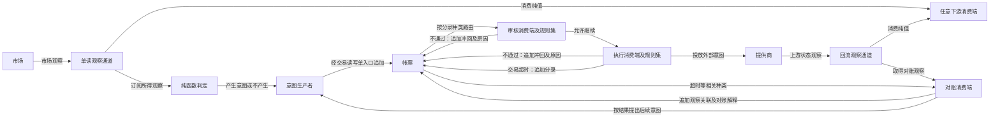

# 新 UTA 核心设计契约

本文约定新 UTA 必须保持的架构不变量，不是旧 UTA 的修补方案，也不是实现方案。核心依据是设计对话中用户给出的命题及后续纠正；旧系统调查只用于反例，Haskell 参考设计只在 §7 列出的采纳边界内进入契约。

“必须”和“禁止”是约束；“不约定”表示不能从本文推出该项选择。本文不约定模块、部署形态、传输协议、存储格式、库或完整操作清单。细节约束不得改变以下公理。

## 1. 核心公理

### A1 真相只能来自上游

**上游是真相的来源，下游只能投放意图和取得观察，禁止以本地状态生成上游事实。**

市场和提供商的状态不以 Alice 的读取节奏为准；一次读取是下游与上游的局部状态对齐。UTA、适配和消费行为都在下游，不能把下游快照回写的成功当作上游世界已经如此。这里的“事实”指被观察的上游世界状态；本地当然可以记录自己提出了什么意图、作出了什么审核决定，但这些记录不能证明远端已经成交、拒绝或撤销。

排除：以 Alice 为信息时间线的中心；本地账面自称交易真相；借“模仿 Git”把本地提交与远端完成等同；另造一条“依赖轴”解释上下游。

### A2 抽象以运行时交换的 IO 为锚点

**必须提前约定运行时交换的 IO，而不以数据形状、消费对象或提供商实现作为抽象中心。**

需要先知道交换承担什么读写语义，才能约束一次交互；不需要先猜出所有数据字段、哪个程序会消费、或者提供商如何完成交互。具体类型仍须准确表达已经接入的语义，但不能反过来要求未知提供商服从某个已知提供商的对象形状。新 UTA 的范围也不能收缩为交易执行：非交易的单读服务同样由 IO 契约解释。

排除：统一账户对象包办全部能力；以 IBKR 或“所有提供商的最小字段交集”作为公共模型；先规定消费者名单，再据此定义 IO。

### A3 通道由类型组合特化而成

**通道必须是 IO 的类型特化，其类型必须由可复用的类型构造器与类型参数组合出来。**

`T` 是参与特化的类型；帐票本身可以是 `T`，并不是先创建一个通道对象，再往其中装一份帐票。不同特化必须保留各自契约，同时允许下游通过组合定义新类型。读写类型必须允许副作用种类持续扩展，类型定义的重点是副作用类型及其 `handler` 之间的关系，而不是维护一个封闭的提供商方法总表。

每一种能力必须是独立的类型与 `handler` 配对，新增能力 = 新增一对，而不是给既有类型追加一个 constructor/可选方法。效应系统的经验（[12 §2.1](../report/12-haskell-effect-systems.md)、[§4.3](../report/12-haskell-effect-systems.md)）是：一个大 GADT 每加一个 constructor，所有 interpreter 都要补分支，最终退化成 `IBroker` 的可选成员矩阵；effectful 官方把 `State` 拆成 `Get`/`Put` 两个独立效应，正是单读/读写分离在类型层的形态。程序对通道的需求以"需要哪些能力"声明，组合根必须为每个被声明的能力装配 `handler`，缺失在类型层暴露，而不是运行时空实现。

排除：把各条通道分别写死成互不组合的独立类型；新增能力必须修改中央完整枚举、公共父对象及所有提供商；用同一个无差别 IO 类型抹掉特化语义；用一个总 GADT/接口加可选成员表示能力差异。

### A4 单读与读写必须在类型上分离

**IO 的读写方向必须决定其能力边界：单读可被程序任何部分消费，读写必须经单一受约束入口使用。**

单读向下游提供观察，不授予改变被观察对象的写能力；读写允许投放引发状态变化的意图。多个消费方可以使用单读，多个意图生产者也可以提出交易意图，但不能因此获得绕过读写入口的执行权。单入口不等于帐票只有一个消费端，也不等于所有不同类型的 IO 共用一个交易入口。

发起查询或订阅仍是不纯动作，查询得到的值可以是纯值。消费这个值后再触发副作用，必须由承担该副作用的 IO 表达，不能将它偷偷塞进单读能力。市场消息驱动交易必须保持为“订阅单读、纯函数产生意图、投放意图”的薄包装，不另设可绕过契约的执行路径。

排除：用 `readOnly` 一类布尔开关掩盖本来不同的能力类型；将只读误解为完全没有 IO；借读操作隐式对账写入；以“任何部分可消费”推出无需身份或数据访问保护。

### A5 帐票是交易 IO 的 T

**交易 IO 必须以可延伸的帐票作为 `T`，以 append-only 分录记录意图及其后续作用，并通过回放得到可解释的数据。**

帐票必须保留数值的语义，而不只保留一个计算结果：这笔是什么、有什么特殊含义、为什么记下。多种副作用可以作用于同一帐票，分录种类必须可以扩展；更正必须保留原有记录。回放所重建的是帐票数据及其解释，不是把过去的外部交易再执行一次。帐票对上游状态的解释仍受 A1 限制，不能将未证实的意图算作上游已经发生的事实。

排除：只保存余额、持仓或终态；只凭当前内存赋值改变账面；把“可回放”解释成重放远端副作用；把所有 IO 的 `T` 一律改成帐票。

### A6 分录按种类消费，规则拒绝以冲回表达

**帐票分录必须按动作种类路由到消费端，消费端的规则不允许继续时必须追加可解释的冲回分录。**

消费端可以具有自己的规则集，表达实际运作中的部门审核。执行只是其中一种消费行为，不能代表全部帐票消费；审核也不是帐票外的布尔闸门。冲回必须指向被否定的账面含义并说明原因，不得删除原分录、覆盖历史或假装远端副作用从未发生。后续外部动作仍必须通过相应副作用完成，并依赖上游观察确认。

规则不通过的理由必须是结构化变体，且可以嵌套保留来源：子规则的失败被父规则包住时保留其 constructor，而不是压成字符串或布尔。这是 cardano-ledger STS 的 `PredicateFailure`/`Embed`/`InjectRuleFailure` 形态（[14 §2.1](../report/14-haskell-ledgers-and-consistency.md)）。同样来自该设计：补偿是**新的意图/信号**，走完整的帐票→审核→执行路径；冲回只表达本地"不再继续"，永不声称远端已回滚。

交易超时必须沿同一模型处理：记录分录，由对账消费端消费，再依据对账结果触发后续副作用。它不是需要另造一套架构的特殊例外，超时本身也不能证明上游未写入。

排除：所有种类直接交给一个万能执行对象；规则拒绝只抛异常却不在帐票表达；将冲回等同远端事务回滚；针对超时绕过帐票另开隐式修正路径。

### A7 接口在下游定义与实现，可用性不得虚构

**面对不可知的提供商，接口必须在下游定义和实现，并允许只存在部分可用能力。**

提供商可能以 gateway、REST、TCP 加 SDK 或脚本宿主交互；这些差异不能成为统一对象的先验字段。下游必须围绕实际交换的 IO 实现接口，不要求上游实现下游的类型体系，也不要求一家提供商填满所有接口。可用的能力必须满足其契约；缺少能力不能伪装成成功空值或具备完整读写能力的对象。

提供商相关的类型按提供商参数化：`Operation
`、`Receipt
`、`Observation
` 由 `P` 索引，各家自己定义，核心只在 existential 边界处理统一信封（时间、来源、种类、幂等键、`why`）。这是 Haxl 每家一个 `req a` GADT、cardano `EraRule rule era` 按索引解析类型的形态（[13 §2.1](../report/13-haskell-provider-adapters.md)、[14 §2.1](../report/14-haskell-ledgers-and-consistency.md)）。

"可用性"有两个不可互相替代的层次（[12 §4.1](../report/12-haskell-effect-systems.md)）：**静态需求**——程序声明需要哪些通道，组合根必须装配 `handler`，缺失编译失败；**运行时能力**——配置加载后得到的提供商能力描述，决定该实例实际能填哪些通道、接受哪些种类。存在 `handler` 不证明提供商支持；只读提供商在类型层就不能构造写 `handler`，细粒度能力则由运行时描述回答。

排除：以某一家 SDK 的对象作为所有人的领域真理；为统一形状填造默认业务数据；将存在 `handler` 误当成提供商在运行时必然支持、接受或完成操作；把静态 row 当能力矩阵，或把运行时能力表当类型保证。

### A8 持久化 IO 决定归属，配置与帐票分离

**需要持久化的状态必须由其持久化 IO 明确来源与写入归属，配置持久化与帐票持久化必须保持为不同契约。**

归属首先是“谁经由哪次持久化 IO 改变了什么”，不能靠应用内共享可变状态和额外的对象所有权叙述补救竞态。配置已经有自身的持久化意义，不属于帐票；帐票通过追加保留解释，两者不能互相冒充。这个原则不要求把每一份瞬时值都持久化，也不意味着写进持久化介质就能自动获得跨系统原子性。

排除：所有状态变化都追加交易分录；为了说明归属而把配置、心跳、健康、重连混入帐票；忽略 Alice 已有配置持久化而重新宣称配置无人拥有。

## 2. 类型层形态

### 2.1 类型构造器应用，而非通道对象装配

组合关系必须满足“类型构造器 × `T` = 通道类型”。以下仅表示类型层关系，不约定最终 API 名称、泛型参数排列或实现：

- `IO : Type -> Type`：动作与其结果类型分离。
- `C<T>`：`C` 表示保留所需 IO 约束的类型构造器，应用到 `T` 才得到一种通道类型。
- `ReadOnly<IO, Heartbeat>`：普通单读 IO 的特化，承载 `Heartbeat` 值的取得。
- `ReadWrite<E, IO, Ledger>`：交易读写 IO 的特化，`Ledger` 是帐票自身，`E` 表示可组合扩展的副作用类型集合。
- `Operation
` / `Receipt
` / `Observation
`：按提供商 `P` 索引的局部类型，核心只经统一信封与 existential 边界触及。

`ReadOnly` 与 `ReadWrite` 在这里是组合性质的记号，禁止将这组记号直接解释成预选的 transformer 栈。组合必须保留 IO 的方向、可作用的类型及相应 `handler` 的约束；开放扩展不等于任意组合都有效。

### 2.2 普通 IO 与帐票 IO 的区别

`IO<Heartbeat>` 表达取得心跳的动作，不纯的是发起查询或订阅，`Heartbeat` 本身是纯值。它可以被消费，并由消费方触发其他 IO；这既不要求把心跳写入帐票，也不禁止心跳驱动重连。本文不把心跳固定为“上一条行情的时间戳”，也不规定心跳没有历史价值。

交易的帐票 IO 必须额外满足 A5、A6 的类型约束：可延伸分录、解释性回放、种类路由和规则冲回。不能仅把普通 IO 的返回值由 `Heartbeat` 换成 `Ledger`，就宣称这些保证自动成立；也不能把它们解释为某个值里面装有待执行 IO 函数。差别必须由组合类型的契约承载，不由字段命名或额外运行层的比喻代替。

### 2.3 TypeScript 必须承担的保证

TypeScript 中必须有可检查的类型机制承担上述区别，而不能只保留 Haskell 术语：

1. **泛型组合与类型区分**：方向、副作用集合、`T` 和 `handler` 的关联必须贯通；结构相似不能使读写能力自动混入单读上下文。
2. **开放扩展与局部完整性**：下游必须能定义新副作用及处理关系；对某次组合已经声明的种类，类型检查必须暴露遗漏或不匹配，不能靠无类型载荷或忽略分支逃过检查。
3. **边界解析与可用性检查**：外部数据和运行时能力必须经过实际检查后才能作为对应类型使用；静态类型不能证明远端状态，类型断言不能补造能力。
4. **动作与值的边界**：纯计算不得暗中执行 IO；`handler` 必须承担它所声明的副作用语义，不能把一个异步返回类型当作全部契约的证明。
5. **只读提供商的静态不可写**：只声明单读能力的提供商，其类型必须使写 `handler` 不可构造（Beam `ViewEntity` 对 DML 不可构造、capability `HasSource` 无 `yield` 的形态，[13 §2.4](../report/13-haskell-provider-adapters.md)、[12 §2.6](../report/12-haskell-effect-systems.md)）；运行时 `readOnly` 检查只能是纵深防御，不能是唯一防线。

本节不选类型品牌、编码风格、效应库或注册机制。参考调查对静态契约与远端真实支持的区分见 [效应系统报告 §1.1](../report/12-haskell-effect-systems.md#11-目标问题) 与 [提供商适配报告 §1.2](../report/13-haskell-provider-adapters.md#12-筛选标准)；其中的实现建议不是本节要求。

## 3. 数据流总图

图中的节点是 IO 角色，不是模块、进程或固定部署拓扑。审核和执行的连线表示该次消费必须满足的规则，不约定全局唯一审核序列；所有交易写入仍受单入口约束。

普通市场观察和心跳不因存在这张图而必须先落帐。图中的回流可以支持交易帐票解释，但只有与这笔帐票相关的记录才受帐票契约；配置持久化不在这条交易流中。

## 4. 非契约与常见误读

| 误读 | 为什么不成立 |
|---|---|
| 所有状态或所有 IO 都必须经过帐票 | 帐票只是交易 IO 的 `T`；配置有独立持久化，心跳等普通 IO 不承担交易分录语义。 |
| 心跳只是纯时间戳，所以不属于 IO | 把取得值的动作与值混淆；发起订阅不纯，得到的值可以纯。心跳也不必由行情推导。 |
| 心跳触发副作用，就必须走交易审批和帐票 | 一个 IO 的消费可以触发另一种 IO；存在副作用不能推出它属于交易帐票。 |
| 帐票与心跳的差别只是返回值一个累积、一个瞬时 | 忽略类型组合所承担的契约；路由、审核与冲回不能由返回值形状自动获得。 |
| 必须在 IO 上加 `WriterT`、`StateT` 或新运行层 | 对话没有选择 transformer；把类型包装偷换为运行层或库选择，不能解释组合契约。 |
| 特化就是在值里放一个待执行的 IO 函数 | 将类型关系改成值的布局，既没有说明类型如何组合，也没有保证能力边界。 |
| 每条通道都是独立类型，彼此不能组合 | 下游无法借共同构造器扩展，只能修改写死的核心清单，违反 A3。 |
| 上下游有“数据流”和“代码依赖”两条轴 | 此处上下游只解释真相来源与观察、意图的关系；类型构造器不是另一个真相上游。 |
| 单读无副作用，所以订阅是纯函数、读可以无条件重试 | 单读不授予业务写能力，不等于发起 IO 没有作用、成本或失败；重试策略不能由名称推出。 |
| 类型正确或本地返回成功就代表上游完成 | 类型只约束下游交互，不能制造远端事实；提供商可以拒绝、不写入或使结果暂时不可知。 |
| 超时需要独立一致性引擎才能解释 | 超时分录、对账消费与后续副作用已经能表达处理关系；具体处理不能绕过同一契约。 |
| 河流原则要求常驻 daemon、统一快照或固定流式协议 | 河流原则约束真相和数据方向，不替部署、读取方式、同步机制作决定。 |

## 5. 与旧 UTA 的对照

以下只定位旧要素在新模型中的角色，不构成逐项迁移计划。旧事实依据 [综合总览 §1、§4](../report/00-overview.md)；对照不能反过来成为新设计的功能边界。

| 旧要素 | 新模型中的角色 | 违反的公理或必须纠正的解释 |
|---|---|---|
| `UnifiedTradingAccount` 包办交易、行情和健康 | 按 IO 能力组合，不以账户对象统摄 | A2、A3、A4：对象和开关不能代替 IO 类型边界。 |
| `IBroker` 与 IBKR `Contract`、`Order` | 下游针对实际 IO 的接口与类型 | A2、A7：不能让未知提供商填入 IBKR 的对象世界。 |
| `TradingGit` 的提交、投放与拒绝 | 帐票中的意图及后续分录 | A1、A5、A6：本地提交不是真相；有限工作流不能封死种类与冲回。 |
| `sync`、`reconcile`、外部订单观察 | 观察和对账消费，追加相关解释 | A4、A8：旧路径虽会追加记录，却绕过共同写入约束；问题不是“完全没有 append”。 |
| `push` 的本地执行状态 | IO 返回值及从上游取得的观察，按来源区分 | A1：不能由本地成功推定远端结果；上游响应若确实携带观察，也不能仅因它是返回值而抹掉。 |
| cost basis 的纯函数重算 | 帐票回放产生的派生值 | 本身符合 A5；输入必须保留完整语义，纯函数不能补出缺失的上游事实。 |
| snapshots、equity curve | 观察或派生数据的持久化、消费 | A1、A8：不能成为第二份交易真相；独立存储本身不等于违约，也不要求改成分录。 |
| guards、人工审批、`allowAiTrading` | 消费端规则及可解释的审核决定 | A6：规则不能只保护某条调用路径，否决不能只剩无记录的门禁结果。 |
| keyless、tier、`asVendor`、行情与 FX 绑定账户 | 单读 IO 的实际可用能力 | A2、A4、A7：不得为读取伪造交易账户或完整读写能力。 |
| health 状态机与重连 | 普通心跳 IO 的消费与相应副作用 | A2、A4：必须区分动作、值和后续副作用；存在状态机本身不是错误，更不能强制帐票化。 |
| Alice 持久化账户配置，UTA 读取 | 独立配置持久化 IO | A8：已有配置持久化不能被说成全是内存态；跨方读写不自动意味着归属不明。 |

## 6. 待决问题

对话已确定的公理不再列为候选。参考设计读后仍真正未决、且会改变契约形态的分叉：

1. **文件持久化下的帐票追加原子性与单写者实现**：Alice 现有配置写非原子、事件流无跨进程保护（[10 §3.2](../report/10-alice-config-persistence.md)、[11 §9.2](../report/11-alice-event-flow.md)）；eventful 明确"预期位置 CAS 要求底层事务性"（[14 §2.2](../report/14-haskell-ledgers-and-consistency.md)）。append-only JSONL、目录级 rename、锁或 WAL 的组合尚未选定，且崩溃窗口（意图写入前/投放后/回执写入前）的恢复语义依赖这个选择。
2. **动态加载提供商包与类型安全的边界**：existential 边界在哪一层擦除 `P`，manifest/能力描述如何校验，是运行时插件（如现有 Broker Pack）还是编译期扩展（cardano era 模式）。两者对 A7 的"静态需求 / 运行时能力"分层给出不同实现代价。
3. **`Unknown` 回执的自动重试许可**：14 §5.3 指出只有提供商具备幂等键或按键回读能力时才允许有限重试；否则必须停在人工审核。这要求能力描述包含"幂等投放"与"回读"两项，是否作为所有提供商接入的必填声明尚未决定。

具体的类型编码、存储和投递机制、规则编排与部署方式仍属后续细化。

## 7. 参考设计的采纳边界

以下机制只在服务对应公理时被采纳；同一库的其他部分不自动进入契约。

| 机制 | 来源 | 服务的公理 | 不采纳的部分 |
|---|---|---|---|
| 每能力一个独立效应 + `handler`；缺 `handler` 编译失败 | effectful / polysemy / freer（12 §2.1–2.4） | A3、A4、A7 | 选定某个效应库；`IOE`/`Embed IO` 式宽 escape hatch 进入业务层 |
| `Get`/`Put` 拆分、`HasSource`/`HasSink` 粒度 | effectful 文档、capability（12 §2.2、§2.6） | A4 | capability 的 `unsafeCoerce` dictionary 机制 |
| 横切层（审计/规则/重试）以 `interpose` 包在真实 IO 外，顺序由组合根固定 | effectful / polysemy（12 §4.4） | A6 | 提供商包自由排列 handler 顺序 |
| 按提供商索引的类型 `req a` / `EraRule rule era` | Haxl、cardano-ledger（13 §2.1、14 §2.1） | A7 | cardano 封闭的 era 世界（`EraHasName` injectivity）；Haxl 缓存错误值 |
| 结构化嵌套规则失败、补偿为新信号 | cardano STS（14 §2.1） | A6 | STS 无读写区分；`VoidEraRule` 当通用 unavailable |
| append-only stream + 预期位置 CAS + projection = seed + fold | eventful（14 §2.2） | A5、A8 | `ProcessManager` 当可靠 outbox；serializer `Maybe` 静默丢事件；冲突路径 `error` |
| Intent / Attempt / Receipt / Observation 四分，reconcile 只比对 intent+attempt 与 observation | 14 §2.8 | A1、A5、A6 | 追求跨提供商 exactly-once |
| 契约解释与传输执行分离（`HasClient` / `RunClient`） | servant（13 §2.2） | A7 | 把非 HTTP 提供商强行投影成 HTTP Request |
| 错误三分：传输 / 解析 / 服务拒绝；非幂等写不自动重试 | amazonka（13 §2.3） | A1、A7 | AWS 专属的描述生成器 |
| 观察流携带 cursor/checkpoint 与结束原因；连接资源 acquire/release 成对 | streaming / conduit（13 §2.5–2.6）、RON VV（14 §2.5） | A1、A4 | 把流的形状当副作用契约；CRDT merge 当远端确认 |
| 同一状态机模型驱动帐票、适配器与对账的测试，覆盖 Unsupported/Rejected/Unknown/崩溃恢复 | qsm / Hedgehog（14 §2.6–2.7） | 验证手段 | 把 property 通过当生产保证 |
