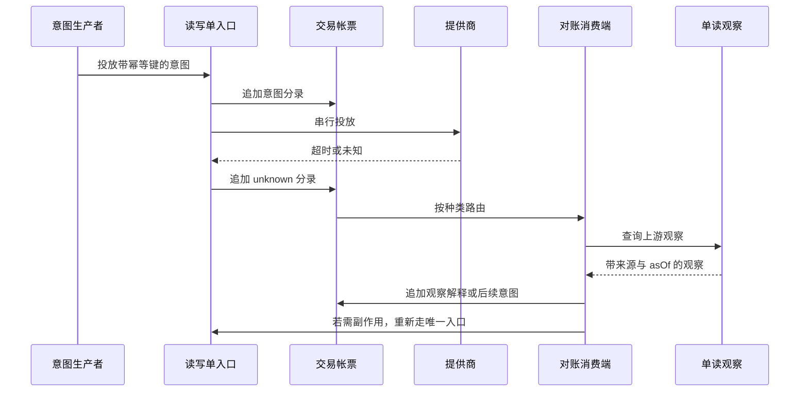
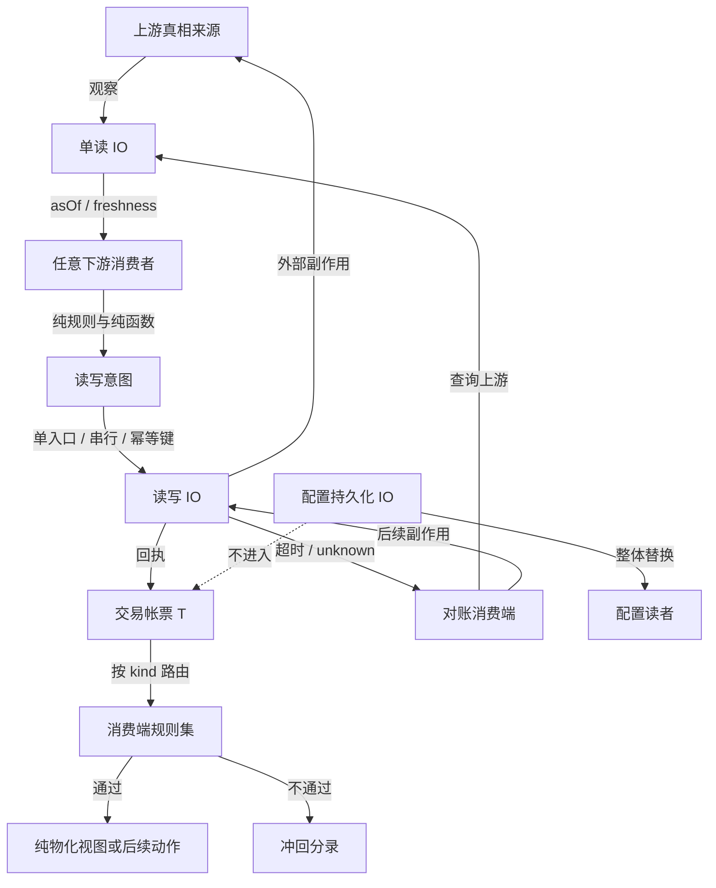

# UTA 细节约束

> 本文是 `00-core-contract.md` 的细节层。它规定实现必须保持的可观察语义与边界，不决定模块划分、文件名、库、传输协议或进程部署形态。
>
> 本文中的“必须”“禁止”“不约定”是契约用语。每条规范末尾都标出它服务的核心公理；公理正文以 `00-core-contract.md` 为唯一准据。
>
> 本文只把用户已经确定的细节落成约束；幂等键、串行入口、原始数据保留、原子写盘等是本层实现必须遵守的规则，不应被误读为新增的核心公理。

## 0. 公理索引与适用范围

为便于审查，本文沿用核心契约的八条公理：

| 编号 | 公理 | 本文主要落点 |
| --- | --- | --- |
| **A1** | 真相只能来自上游 | 观察、意图、回执、未知状态、对账与禁止本地生成事实 |
| **A2** | 抽象以运行时交换的 IO 为锚点 | IO 边界、开放种类、不透明 payload、提供商未知性 |
| **A3** | 通道由类型组合特化而成 | `IO<T>`、通道方向、心跳与帐票的分离 |
| **A4** | 单读与读写必须在类型上分离 | 单读的开放消费与新鲜度；读写的单入口、串行与回执 |
| **A5** | 帐票是交易 IO 的 `T` | append-only 分录、意图回放、解释性、纯物化视图 |
| **A6** | 分录按种类消费，规则拒绝以冲回表达 | 订阅声明、规则集、冲回、未消费分录、对账消费端 |
| **A7** | 接口在下游定义与实现，可用性不得虚构 | provider 部分能力、显式不支持、局部翻译 |
| **A8** | 持久化 IO 决定归属，配置与帐票分离 | 单写者、原子写、配置整体替换、帐票追加、传播与回放 |

下文的约束只适用于它所声明的领域。帐票约束不能自动扩展到心跳、配置、连接当前态或一般单读结果；读写约束也不能自动扩展到普通单读 IO。**[对应公理：A2、A3、A5、A8]**

## 1. 术语边界与总规则

### 1.1 以 IO 交换为锚点

- 抽象必须首先说明运行时交换的 IO：交换的方向、是否造成外部状态变化、顺序、时间和确认语义；不得以“对象长什么样”、调用者是谁或某个 provider 的实现类作为抽象起点。**[对应公理：A2]**
- payload 的字段形状不是公共抽象的前提。公共契约只规定 IO 的边界与语义，payload 可在提供商接入后才按消费需求解析。**[对应公理：A2、A7]**
- 消费者不属于 IO 的定义。一个 IO 可以有多个消费者，也可以暂时没有消费者；实现方式同样不属于 IO 的定义。**[对应公理：A2、A6]**
- 通道不是先验的“账户对象”或“provider 对象”。通道是某个类型在 IO 方向上的特化；类型能够组合出通道语义，不能再用一个预设的完整对象接口把所有通道封死。**[对应公理：A2、A3]**
- 方向和副作用性质必须成为类型边界，而不是依靠 `readOnly`、`keyless`、`tier`、`asVendor` 等调用方标志在运行时猜测。**[对应公理：A3、A4]**

### 1.2 两种 IO 的边界

- **单读 IO** 只取得上游观察，不向外部世界投放改变状态的意图；发起查询、建立订阅或维持读取连接本身仍然是动作，不得因此把读结果误称为纯计算。**[对应公理：A3、A4]**
- **读写 IO** 投放可能改变上游状态的意图；调用动作有副作用，返回值只能是该动作边界上的回执，不能冒充之后的上游事实。**[对应公理：A3、A4、A5]**
- 读写 IO 的种类集合必须开放：核心只约定种类标识、意图身份、时间、来源、解释和不透明 payload 等边界，不能把 `place`、`modify`、`cancel` 等有限集合写成永远完整的中心枚举。**[对应公理：A2、A4、A7]**
- 任何动作的外部结果都必须沿其约定的观察或帐票路径回流；实现不得把观察结果冒充读写动作的回执，或把读动作包装成隐含写入。若 provider 响应同时携带真实观察，必须按观察语义保留并关联，不能为满足“仅回执”而抹掉。**[对应公理：A1、A4、A5]**

### 1.3 明确排除的常见误读

以下内容不是本契约：

- 不把心跳、当前健康、连接状态、重连动作、配置或物化快照自动塞进交易帐票；帐票不是所有状态和所有 IO 的万能容器。**[对应公理：A3、A5、A8]**
- 不因为交易帐票存在，就为每一种普通单读值增加帐票分录、路由、冲回或回放语义。`IO<Heartbeat>` 与交易帐票 IO 是同一 `IO` 形式下性质不同的类型，不得混同。**[对应公理：A3、A5]**
- 不以 transformer、额外的统一包裹层或“把所有 IO 变成帐票 IO”的术语替代已经约定的类型边界；本契约不规定这类架构形态。**[对应公理：A2、A3、A5]**
- 不另造“两条上下游轴”来替代真相关系。系统只需要表达上游提供观察、下游投放意图和观察结果回流的方向；不因此复制两套相互竞争的真相或时间轴。**[对应公理：A1、A2]**
- 不把 provider 预先投影为 IBKR、HTTP、REST、TCP、SDK 或 MQL 的公共对象模型；这些只是可能的接入方式，不是核心契约。**[对应公理：A2、A7]**
- 不把“暂时没有实现”写成空成功、空列表、空方法、吞掉异常或不完整分支；不可用必须可观察且有结构化语义。**[对应公理：A7]**

## 2. 帐票与分录约束

### 2.1 帐票的范围

- 帐票是交易 IO 的 `T`：它承载交易意图、交易边界上的回执/未知状态、上游交易观察及对这些记录的解释；帐票不是裸 `IO` 本身，也不是所有单读 IO 的共同返回类型。**[对应公理：A3、A5]**
- 帐票必须是 append-only。已经追加的分录不可编辑、覆盖、删除或在原位置改写；纠正必须追加新分录。**[对应公理：A5、A8]**
- 帐票只记录已经发生的 IO 语义：下游可以记录“投放了什么意图”“观察到了什么”“为什么接受/拒绝/待对账”，但不得把本地推算的余额、成交或健康状态写成上游事实。**[对应公理：A1、A5]**
- 每条分录都必须能被追问“为什么记下它”。`why` 是分录的必需语义，不得以空字符串、泛化的 `sync`、无上下文的日志消息或仅依赖代码位置替代。**[对应公理：A5、A6]**

### 2.2 分录最小字段语义

分录的具体序列化字段名不由本文规定，但每条分录必须具有以下最小语义：

- **时间（time）**：表达意图产生、观察发生或 provider 报告的时间。若上游时间与本地追加时间不同，两者不得互相覆盖；追加顺序由独立的顺序标识表达，不能把本地 `now` 伪装成上游发生时间。**[对应公理：A1、A5]**
- **来源（source）**：说明记录来自哪个上游、提供商、通道、消费者或人工主体。来源不得由当前进程的默认名称隐式猜出；跨来源合并时仍要保留原始来源。**[对应公理：A1、A5、A8]**
- **种类标识（kind）**：标识分录的语义种类，并属于可扩展的名称空间。种类标识不得被一个预设的交易动作闭集取代。**[对应公理：A2、A5、A6、A7]**
- **幂等键（idempotency key）**：标识这次意图或记录在重试、重放和重复投递中的身份。重试同一意图必须复用同一键；超时或未知之后不得生成新键来掩盖同一次投放。**[对应公理：A1、A4、A5]**
- **为什么（why）**：说明记录的意图、观察缘由、规则判定或纠正理由。它必须随分录持久化，而不是只存在日志、异常消息或调用方内存中。**[对应公理：A5、A6]**
- **不透明 payload**：承载 provider 或种类自己的数据。帐票核心不得按某一家 provider 的字段解释、重写或补造 payload；payload 必须在未知种类、未消费或延迟翻译时保持可保留、可追溯的边界。**[对应公理：A2、A5、A7]**

分录还必须有可稳定引用的分录身份或序列位置，以便冲回、路由游标、回放和对账引用。该身份不能只依赖数组下标或当前内存地址。**[对应公理：A5、A6、A8]**

意图、尝试、回执、观察是四种不同的分录种类，不得合并成一条可选字段随阶段填充的记录：**意图**是稳定的业务要求；**尝试**是对提供商的一次具体投放（同一意图的每次重试/重投都是新的尝试分录，共享同一幂等键）；**回执**是提供商对某次尝试的回答；**观察**是之后从上游读到的事实。对账只比对意图/尝试与观察，不把回执当事实。**[对应公理：A1、A5、A6]**

以下关系只作为类型关系示意，不规定字段名或实现：`LedgerEntry = { time, source, kind, idempotencyKey, why, payload, entryId }`。**[对应公理：A2、A5]**

### 2.3 分录字段的禁止项

- 禁止把 provider 的完整响应或本地物化状态当作交易事实直接写入分录，除非该内容确实是带来源的上游观察；本地计算值必须标明其派生性质。**[对应公理：A1、A5]**
- 禁止让 payload 代替 `kind`、`source`、`why` 或幂等键；“把全部信息塞进 JSON 后再猜”不构成契约。**[对应公理：A2、A5、A7]**
- 禁止用缺省值、空对象、空数组或 provider 特有哨兵填补不知道的字段，并由此制造一个看似成功的事实。未知必须保持未知或进入显式不支持/解析失败语义。**[对应公理：A1、A7]**
- 禁止用分录追加顺序替代事件发生时间，也禁止用时间戳替代幂等身份。两者是不同的约束。**[对应公理：A1、A5]**
- 禁止把同一意图的每次重试作为新的业务意图追加，除非确实产生了新的意图并说明其原因；常规重试必须能通过幂等键回到原始分录。**[对应公理：A1、A4、A5]**

### 2.4 冲回分录

- 冲回必须是新追加的分录，不能删除、修改或覆盖被冲回的分录；原分录和冲回理由必须都能在回放中看到。**[对应公理：A5、A6、A8]**
- 冲回必须显式引用被冲回分录的身份，并说明冲回来源、时间、种类和 `why`；冲回不是一个无来源的 `cancelled: true` 标记。**[对应公理：A5、A6]**
- 冲回的 payload 必须说明作用范围。部分冲回不能伪装成整条意图消失；若要产生新的补偿意图，应以新的意图分录表达。**[对应公理：A1、A5、A6]**
- 规则拒绝、人工否决、能力不支持和对账发现的本地纠正，都必须区分其来源与理由；不得统一压成没有上下文的“失败”。**[对应公理：A6、A7]**
- 冲回只表达本地交易语义的撤销/不再继续，不能声称它已经回滚了上游的不可逆副作用。上游已经发生的事实仍必须由观察记录；必要的补偿动作是新的读写意图。**[对应公理：A1、A5、A6]**

### 2.5 回放与物化视图

- 帐票回放必须是纯、确定、可重复的折叠：给定同一分录序列和同一明确输入，结果必须相同；回放不得读取 provider、当前时间、随机数、环境变量或隐式可变单例。**[对应公理：A5、A8]**
- 交易帐票的物化视图必须是帐票及明确的上游观察输入的纯派生结果。视图可以缓存、分片或落盘，但不能绕过帐票另设一个事实写者；普通单读视图仍遵守其自身的 IO 契约。**[对应公理：A1、A5、A8]**
- 视图落盘失败不能改变已经追加的分录，也不能回头修改帐票；下次可从帐票和输入重新物化。**[对应公理：A5、A8]**
- 回放必须按分录的持久顺序处理，并显式处理冲回关系；不能按消费者到达顺序、文件目录顺序或本地时间排序来改变交易语义。**[对应公理：A5、A6、A8]**
- 未知种类或暂时没有消费者的分录不得在回放时静默丢弃。实现可以把它留在不透明的未解析集合、报告为未消费，或仅跳过其对某一视图的贡献，但必须保留原记录并使该状态可观察。**[对应公理：A2、A5、A6、A7]**
- 纯物化视图不能反向生成上游事实。若视图计算产生后续动作，只能生成明确的意图，且遵守读写通道和消费端规则。**[对应公理：A1、A4、A5、A6]**

## 3. 单读通道约束

### 3.1 读动作与读值

- 发起查询、拉取快照、建立订阅、读取心跳的动作是不纯的 IO；动作执行可能占用连接、产生请求或注册回调。查询返回的 `T` 是纯值，不能因动作不纯就把 `T` 当作交易帐票。**[对应公理：A2、A3、A4、A5]**
- 单读通道的类型必须表达“只取得观察，不改变上游外部状态”；本地缓存、读取游标或物化视图的更新不能偷偷改变这一方向。**[对应公理：A3、A4]**
- 单读结果必须带有来源时间或 `asOf` 语义。`asOf` 表示这份观察截至何时成立，不能用客户端收到响应的时间替代。**[对应公理：A1、A4]**
- 订阅式或分页式单读必须携带可恢复的游标/检查点，并在流结束时给出结束原因（正常耗尽、断连、取消、超时）；"已交付 N 项后中断"必须能从检查点继续，不得靠重新全量拉取假装连续。**[对应公理：A1、A4]**
- 维持读取的连接、会话、订阅句柄等资源必须成对 acquire/release；异常或取消时释放必须发生，且释放不改变已交付观察的有效性。**[对应公理：A4、A8]**

### 3.2 新鲜度与失败

- 新鲜度必须是读结果的显式信息，而不是把陈旧值包装成“成功”或把陈旧值一律变成异常。至少要能区分新鲜、陈旧、缺少可用观察等状态；具体阈值由消费端决定。**[对应公理：A1、A4]**
- 读失败与“已有值但已陈旧”必须在语义上分离。传输层完全没有值时可以报告读取失败；只要有可用的旧观察，就必须保留其 `asOf` 与陈旧性，不得以无时间的空值覆盖。**[对应公理：A1、A4]**
- 单读可以缓存、重试、并发读取和重复消费；这些行为不得被解释为重复投放交易意图，也不得要求帐票幂等键。**[对应公理：A3、A4、A5]**
- 单读的重试不得因为“可能成功”而追加交易冲回或未知分录；只有该读被某个交易消费端用来形成意图时，才进入读写/帐票约束。**[对应公理：A4、A5]**
- 市场消息驱动交易必须保持为薄包装：订阅单读通道，交给纯函数计算“意图或无”，再把意图投放到唯一读写入口；不得因为触发源是市场消息而另造执行通道、绕过规则或把市场观察直接当作成交事实。**[对应公理：A1、A4、A5、A6]**

### 3.3 单读的开放消费

- 单读通道可由程序的任何部分消费，包括 UI、工具、连接器、调度任务和其他下游；消费资格不能由交易审批、交易模式或账户写权限门禁。**[对应公理：A4]**
- “任何部分可消费”不等于取消身份、权限、数据脱敏或审计要求；它只表示单读消费不受交易写门禁垄断。**[对应公理：A4、A8]**
- 同一单读结果可以有多个独立消费者，消费者之间不得通过修改共享内存来宣称所有权；需要共享当前态时，应共享读结果或可重建的派生视图。**[对应公理：A1、A4、A8]**
- 单读消费者可各自决定缓存期限、采样频率、并发度和容忍的陈旧度；不得以一个中心化健康枚举替所有消费者做出同一阈值判定。**[对应公理：A3、A4]**

### 3.4 心跳是普通单读 IO

- 心跳必须遵守普通单读语义：订阅/查询心跳是非纯动作，返回的 `Heartbeat` 是纯值；不得把“心跳值”误写成一个自带副作用的状态机。**[对应公理：A3、A4]**
- 心跳值至少能被消费端用于判断最近观察时间；“多久算失活”属于消费端的规则和阈值，不属于心跳类型的全球常量。**[对应公理：A4]**
- 心跳可以被多个消费端消费。某消费端根据心跳触发重连、拒绝投放或其他动作时，动作属于该消费端自己的 IO；不得因此把重连、退避、当前健康计数或心跳历史强行变成交易帐票分录。**[对应公理：A3、A4、A5]**
- 心跳和帐票的区别不是“一个有 IO、一个没有 IO”，而是返回/承载的 `T` 及其语义不同：心跳是瞬时观察值，交易帐票是可追加、可回放、可解释的累积结构。**[对应公理：A3、A5]**

## 4. 读写通道约束

### 4.1 单入口与串行性

- 每个读写通道必须有一个逻辑上的消费入口。其他程序部分只能投放意图，不能绕过该入口直接调用 provider mutation、写入同一外部账户或另建一条“紧急”写路径。**[对应公理：A4、A7]**
- 同一读写通道的外部变更必须串行化；后一个意图不能与前一个意图并发触达同一写端点。串行范围以该通道的副作用边界为准，不扩展成所有单读或所有进程的全局锁。**[对应公理：A3、A4]**
- 单入口必须统一执行适用的规则、能力判断、幂等处理、回执记录和未知状态处理；不能让 UI、AI、连接器各自拥有不同的规则旁路。**[对应公理：A4、A6、A7]**
- 横切层（审计记录、规则审核、重试、翻译到提供商、对账）的叠放顺序由组合根固定，提供商接入只提供末端 `handler`，不得自行排列或跳过某一层。层之间传递的是同一意图身份与幂等键，任何一层不得改写意图内容。**[对应公理：A4、A6、A7]**

### 4.2 开放意图与幂等键

- 读写意图的核心契约只固定意图身份、种类标识、时间、来源、`why` 与不透明 payload 等边界；新增副作用种类不得要求修改既有种类的消费者或中心分派闭集。**[对应公理：A2、A4、A7]**
- 每个读写意图必须带稳定的幂等键，且该键在一次意图的所有重试、超时确认和回放中保持不变。键的作用域必须明确，不能用普通描述文本或数组位置代替。**[对应公理：A1、A4、A5]**
- 幂等键只保证系统能识别同一意图及其重复投放；它不能被用来声称 provider 已经接受、执行或成交。事实仍由上游观察确认。**[对应公理：A1、A4]**
- 未知种类默认拒绝。没有明确声明该种类的规则、能力和处理者时，不得默认放行、调用猜测的 provider 方法或把空实现当成功。拒绝必须留下结构化理由，并遵守冲回规则。**[对应公理：A6、A7]**

### 4.3 返回值只有回执

- 读写动作对其调用者返回的业务结果只能是回执：至少能关联本次意图及其幂等键，并说明已接收、已排队、明确拒绝或结果未知等动作边界；它不是成交、余额、持仓或最终订单状态。provider 响应中若确有上游观察，必须在适配边界另按观察语义保留，而不能让调用者把它误认作回执已经证明的事实。**[对应公理：A1、A4、A5]**
- 回执不得把“当前已成交多少”“最终价格”“最新余额”等需要随后观察才能知道的事实当作回执字段；即使 provider 恰好在同一次响应里返回这些字段，也必须把它们作为带来源和时间的观察处理。**[对应公理：A1、A4]**
- 结果必须通过单读观察或帐票消费端回流。调用者不得以一次 `await` 返回的字段替代观察流，也不得把“没有收到回执”自动解释为“没有发生副作用”。**[对应公理：A1、A4、A5]**

### 4.4 超时与未知

- 超时、连接中断、响应丢失或 provider 不说明是否写入时，结果必须进入显式 `unknown` 语义；不得压成 rejected、not-written 或成功。**[对应公理：A1、A4、A7]**
- 未知状态必须以分录记录意图、幂等键、来源、时间与 `why`，以便后续消费端继续处理；分录不得被删除或被重试覆盖。**[对应公理：A1、A5、A6]**
- 对账路径必须是“未知/超时分录 → 对账消费端 → 查询上游观察 → 追加观察或后续意图/补偿动作”。对账消费端的后续动作仍须经过读写单入口；不得在超时处理器中直接重复调用 provider。**[对应公理：A1、A4、A5、A6]**
- 重试许可由回执变体与提供商能力共同决定，不由通用退避策略决定：传输层失败且尚无投放证据时可按幂等键重投；`unknown` 只有在提供商声明支持幂等投放或按键回读时才允许有限次重投，否则进入显式待人工审核状态；明确拒绝不重投同一尝试；不允许对不可安全重放的投放（流式 body、无幂等键）做自动重试。**[对应公理：A1、A4、A7]**

## 5. 消费端与规则集

### 5.1 订阅种类

- 每个消费端必须声明自己订阅的分录种类或种类集合；声明是可检查的契约，不得仅以运行时“收到就试”来决定消费范围。**[对应公理：A6、A7]**
- 订阅声明按 `kind` 路由，不能按 provider 类名、调用者路径或 payload 中碰巧存在的字段路由。种类命名空间必须允许新增种类而不改变既有消费端的已声明语义。**[对应公理：A2、A6]**
- 同一种类可以被多个消费端订阅；每个消费端有自己的游标、规则与失败处理，不得要求所有消费者共用一个可变“已处理”标志。**[对应公理：A6、A8]**
- 执行端也是消费端之一，而不是帐票或分录的拥有者；它只能消费自己声明的意图种类。**[对应公理：A5、A6、A7]**

### 5.2 规则集

- 规则集必须是消费端的局部规则，不得由全局交易开关替代。规则可以组合，但每条规则的输入、结论和理由必须可识别。**[对应公理：A6、A7]**
- 规则判定必须是纯函数：给定分录、明确的观察上下文和明确的判定时间，结果可重复；规则不得隐式读取当前时间、修改 provider、写文件或依赖共享可变计数。**[对应公理：A5、A6]**
- 若规则需要新鲜度、余额或其他外部状态，必须将带 `asOf` 的观察作为显式输入；规则不能在判定中暗中发起写操作或把缺失观察当作通过。**[对应公理：A1、A4、A6]**
- 规则结果必须是结构化判定。至少要能区分通过、拒绝及理由；需要人工等待或资料不足时，必须有显式未决语义，不得返回普通 `false` 后消失。**[对应公理：A6、A7]**

### 5.3 不通过与冲回

- 消费端规则不通过时，必须追加带消费端身份、规则标识、时间、原分录引用和 `why` 的冲回分录；不得删除原分录、静默跳过、抛异常后让调用方猜测，或直接修改物化余额。**[对应公理：A5、A6、A8]**
- 不通过的冲回必须阻止该分录在当前消费端继续产生外部副作用；其他消费端是否继续消费原分录由各自订阅与规则决定，不能把一个部门的拒绝伪装成全局事实。**[对应公理：A1、A6]**
- 冲回理由必须可供人审计和机器后续路由；“规则失败”或“guard error”这类没有具体原因的字符串不满足约束。**[对应公理：A5、A6]**

### 5.4 未被消费的分录

- 已追加但没有订阅者的分录仍然是有效帐票内容，必须保留、可回放、可查询；无人消费不等于无效，也不允许物理删除。**[对应公理：A5、A6、A8]**
- 消费端暂时不可用、未知种类或解析延迟时，必须保留分录和未消费状态；不得为了让某个视图“看起来完整”而丢弃原始分录。**[对应公理：A2、A5、A6、A7]**
- 某消费端不能处理某种类时，应明确报告 `Unsupported`/未订阅或保持未消费，不得生成虚假的成功分录。**[对应公理：A6、A7]**
- 消费端的投影或规则失败不得回滚帐票追加；它可以在自己的消费进度或错误记录中留下可重试状态，但不能修改已持久化的事实/意图分录。**[对应公理：A5、A6、A8]**

## 6. 提供商接入约束

### 6.1 能力声明与下游接口

- 接口在下游定义：下游先声明它需要交换的 IO、种类与结果语义，provider 再声明自己能填哪些单读通道、能接受哪些读写种类。**[对应公理：A2、A7]**
- provider 不需要、也不允许实现一份预先猜定的完整接口。一个 provider 可以只提供公共行情读取、只提供某些私有观察，或只实现部分读写种类。**[对应公理：A4、A7]**
- 能力声明必须可按通道/种类观察，并且不能用“对象存在”或“方法被定义”推断能力；不存在的能力必须显式缺席或返回结构化 `Unsupported`。**[对应公理：A4、A7]**
- provider 的 gateway、REST/OpenAPI、自造 TCP+SDK、脚本宿主等传输和会话机制不进入公共抽象；接入层不得要求所有 provider 先变成同一种对象。**[对应公理：A2、A7]**
- 提供商接入分成三件互相独立的工作：**能力声明**（能填哪些通道、接受哪些种类、是否支持幂等投放与按键回读、是否有增量观察游标）、**翻译**（原始数据 ↔ 已声明通道类型）、**传输执行**（gateway/REST/TCP/脚本宿主的实际收发与会话生命周期）。传输执行必须可替换而不触碰翻译与声明；翻译不得依赖具体传输。**[对应公理：A2、A7]**
- 幂等投放与按键回读是能力声明的必填项（支持/不支持二选一，不允许缺省）；它们直接决定 `unknown` 回执的处理策略（见 §4.4）。**[对应公理：A1、A7]**

### 6.2 原始数据与局部翻译

- provider 原始响应、事件、回调或脚本输出必须在进入翻译边界时原样保留，至少保留可重新解析和追溯所需的来源、时间、原始内容与关联身份；翻译不能成为唯一数据副本。**[对应公理：A1、A2、A7]**
- 翻译是 provider 与具体通道/种类局部相关的工作。它只把原始数据映射为某个下游已声明的 IO，不得强迫其他 provider 共享同一组外来字段。**[对应公理：A2、A7]**
- 翻译不完整时必须保留“已翻译部分”和“不支持/无法解释部分”的边界；不得静默丢字段、填默认值、返回空成功或通过异常消息让调用方猜测。**[对应公理：A1、A7]**
- provider 不能回答某个下游问题时，必须显式表达不支持；未实现的通道/种类不能以空实现、`undefined`、空列表或无条件 `throw` 伪装成可用。**[对应公理：A7]**
- provider 的明确拒绝、传输错误、解析失败与写入未知必须保持不同语义；它们不能都映射成同一字符串错误或同一成功/失败布尔值。拒绝必须保留提供商的错误码与请求标识；传输错误必须区分"请求未发出"与"已发出但无响应"，后者只能进入 `unknown`。**[对应公理：A1、A7]**

## 7. 持久化与归属

### 7.1 持久化决定归属

- 归属由发生持久化 IO 的写者决定，而不是由哪个模块持有一份内存对象决定。需要改变持久状态时必须经过明确的持久化写路径；直接给共享内存字段赋值不能成为跨边界真相。**[对应公理：A8]**
- 每种持久化数据必须有明确写者、读者和传播语义。读者可以热读持久化内容，也可以通过约定的重新加载/重启读新版本；不能隐含存在多个可写内存副本。**[对应公理：A8]**
- 配置写者与帐票写者相互独立。配置的写者不能直接改帐票，帐票消费端也不能把配置当作交易分录追加。**[对应公理：A5、A8]**

### 7.2 配置与帐票必须分离

- **配置**是声明当前期望状态的持久化 IO：按配置边界整体替换，写入前先做完整边界解析，写者拥有该配置，读者按约定重新加载。配置不需要意图回放，也不属于交易帐票。**[对应公理：A8]**
- **帐票**是交易 IO 的 append-only 持久化：追加分录、保持顺序、支持回放、路由和冲回。帐票不承担配置整体替换语义。**[对应公理：A5、A8]**
- 配置变更可以触发读者重新加载或重启，但“重启/重连动作”本身不是配置分录，也不是交易帐票事实；传播机制不能改变两类持久化的语义。**[对应公理：A3、A5、A8]**
- 当前健康、心跳、连接句柄、缓存和物化视图可以有自己的当前态存储或只留在运行时；除非它们确实是交易 IO 的分录，不得因“也要持久化”就并入帐票。**[对应公理：A3、A5、A8]**

### 7.3 单写者与原子写

- 配置文件和帐票文件都必须有明确的单写者边界。多个进程或任务不得无协调地共享同一配置替换写者或同一帐票追加写者；并发消费不等于并发写帐票。**[对应公理：A5、A8]**
- 配置整体替换必须使用不会暴露半份内容的原子提交语义；进程在写入中断后，读者只能看到旧版本或完整新版本，不能看到截断 JSON。**[对应公理：A8]**
- 帐票单次追加必须有明确、可恢复的完整记录边界；半条或损坏的尾部不得被当作有效分录，也不得在恢复时静默当作不存在。修复只能通过显式恢复结果或新的分录表达，不能覆盖既有记录。**[对应公理：A5、A8]**
- 帐票追加必须串行分配持久顺序，并在向消费者暴露新分录前完成约定的持久化步骤；追加失败必须让写者和消费端知道失败，不能静默吞掉。**[对应公理：A5、A6、A8]**
- 帐票追加必须携带写者的预期位置（或等价版本），与当前持久位置不符时必须显式失败并返回冲突，不得覆盖、静默重排或在冲突时 `throw` 后由调用方猜测；冲突是可恢复的结构化结果。**[对应公理：A5、A8]**
- 单写者不表示可以依赖内存数组作为永久真相。重启后必须能够从帐票恢复顺序并重建纯物化视图；缓存只是加速，不改变归属。**[对应公理：A5、A8]**
- 配置与帐票之间不要求一个跨两类持久化的隐式联合事务；若两者需要关联，必须通过可观察的版本、来源或后续读取表达，不能假设一次内存赋值同时提交两者。**[对应公理：A1、A8]**

### 7.4 可沿用的 Alice 惯例与必须新增的帐票约定

以下是可沿用的持久化惯例，而非对目录、模块或库的规定：

- 配置可以沿用 Alice 的“配置边界/section 有明确 schema、明确写者和读者、写前解析、写后按热读或重新加载传播”的做法；需要改善的原子性和单写者纪律必须作为本契约保留。**[对应公理：A8]**
- 帐票可以沿用 Alice 事件流已有的“单 home 单写者、append-only 行记录、单调顺序、启动时恢复与回放、按游标读取”的持久化惯例。**[对应公理：A5、A8]**
- Alice 既有事件流没有冲回记录和可靠的订阅侧种类路由；UTA 帐票必须新增这两条约定：冲回是新分录，路由由消费端声明订阅种类并可独立推进。**[对应公理：A5、A6]**
- Alice 的某条事件流没有消费者，不能作为“无人消费即可丢弃”的先例；UTA 必须保留未消费分录以支持未来消费、审计和回放。**[对应公理：A5、A6]**
- Alice 的事件流中“共享实现”不等于共享归属；每条流仍应由自己的写者和持久化边界负责，不能因为数据都长得像事件就把配置、心跳或帐票合并。**[对应公理：A3、A5、A8]**

## 8. TypeScript 落地的类型约束

本节只规定类型必须保护的语义，不规定使用哪一个库或代码组织方式。

### 8.1 身份与边界类型

- 时间、`asOf`、来源、种类标识、provider 标识、分录身份、幂等键、序列位置、回执身份和不透明 payload 必须使用彼此不可混用的 branded/phantom 类型或等价的名义类型；不得让裸 `string`/`number` 在边界上互相替代。**[对应公理：A1、A2、A5、A7]**
- 交易意图、交易回执、上游观察、规则结果、冲回引用、配置值和心跳值必须是不同的领域类型；结构相似不等于可以互相赋值。**[对应公理：A1、A3、A5、A8]**
- provider 原始输入、网络 JSON、文件内容和环境变量只能先进入 `unknown` 等待边界解析；解析成功后必须进入命名的领域类型，不能把未解析值在内部到处传递。**[对应公理：A2、A7、A8]**
- 不透明 payload 必须有明确的 opaque 边界和来源/种类关联；`Record<string, unknown>` 不能被当成已经理解的交易 payload，也不能在没有 kind-specific parser 的情况下直接参与规则或物化。**[对应公理：A2、A5、A7]**

### 8.2 判别联合与穷尽处理

- 新鲜度、读失败、读写回执、未知状态、能力可用性、规则结论和冲回关系必须使用判别联合或等价的显式变体；不能用一组可任意组合的布尔值表达互斥状态。**[对应公理：A1、A4、A6、A7]**
- 消费端路由、规则结果、回放折叠、provider 能力和错误映射必须穷尽处理所有已知变体；TypeScript 必须通过 `never`/等价断言让新增变体暴露未更新位置。**[对应公理：A2、A6、A7]**
- 禁止使用 `default` 把未知种类、未知回执或新增变体静默归入成功、忽略或通用分支。真正的未知必须进入显式 `Unknown`/`Unsupported`/未消费语义。**[对应公理：A1、A6、A7]**
- 类型只证明本地组合合法，不能证明 provider 已接受意图或远端事实已经发生；类型检查之外仍必须保留回执、观察和对账边界。**[对应公理：A1、A2、A7]**

### 8.3 禁止用宽类型掩盖契约

- 禁止 `any`、`Object`、`{}`、无约束的 raw map/dictionary 作为领域类型或跨边界协议。确实未知的数据只能停留在明确的 `unknown`/opaque 边界，直到解析或保留。**[对应公理：A2、A5、A7]**
- 禁止使用 `as`、非空断言或等价强制转换掩盖 provider 能力缺失、kind 不匹配、读写方向错误、回执/观察混用或分录字段缺失。**[对应公理：A1、A3、A4、A7]**
- 边界解析必须返回结构化解析结果或显式错误；不得用只返回 `boolean` 的 validator 通过后再让内部代码重新猜字段，也不得在解析失败时静默丢行。**[对应公理：A2、A7、A8]**
- 序列化/反序列化必须保留未知种类和原始 payload 的可追溯性；不能为了让旧类型通过而把新分录降级成空对象或删除。**[对应公理：A2、A5、A7]**

### 8.4 类型组合而非类型复制

- `IO<T>` 的 `T` 必须来自实际交换的数据/语义类型；通道方向再对该类型做单读或读写特化。不得先复制一套按消费者或 provider 命名的对象，再把它们假装成通道契约。**[对应公理：A2、A3]**
- 帐票相关类型只能约束交易通道；`Heartbeat`、配置、连接当前态和普通行情值不能为了“统一”而继承帐票字段、路由、冲回或幂等语义。**[对应公理：A3、A5、A8]**
- 读写开放种类必须以可扩展的 kind/opaque payload 组合表达，而不是不断修改一个中央接口并迫使所有 provider、消费者和测试实现一起补方法。**[对应公理：A2、A4、A7]**

### 8.5 验证约束

- 每个提供商接入与每个帐票消费端必须有基于同一模型的状态机测试：模型显式包含本地意图状态、待决尝试、已知回执、已观察远端状态与对账游标；命令至少包含投放意图、轮询回执、查询上游、对账。**[对应公理：A1、A5、A6、A7]**
- 模型测试必须覆盖：只读提供商对所有写种类返回 `Unsupported`；明确拒绝不产生已确认；投放前超时进入 `unknown` 且不推进成交/余额；已接受但回读延迟不重复投放；接受后进程崩溃从尝试分录恢复继续查询；回读无匹配进入 `MissingRemote`；部分执行的观察与补偿意图；重复投递被幂等键去重；并发改单/撤单有可解释的线性化或显式冲突。**[对应公理：A1、A4、A5、A6]**
- 模型测试通过不构成交付证据；真实提供商 sandbox/paper 路径的观察结果与帐票落盘仍是验收所需。**[对应公理：A1]**

## 9. 约束关系总览

- 图中的箭头是数据/动作的语义方向，不是模块、进程、文件或库的规定；同一运行时可以用不同实现承载这些边界。**[对应公理：A2、A3、A8]**
- 单读路径不因进入纯函数就变成帐票路径；只有纯函数产生读写意图并投放到唯一入口时，才进入交易帐票的约束。**[对应公理：A4、A5]**
- 读写回执、上游观察和物化视图必须保持三者区分；任何一个都不能代替另外两个。**[对应公理：A1、A4、A5]**
- 配置持久化、交易帐票和运行时当前态可以分别有归属与生命周期；“都落盘”不构成合并理由。**[对应公理：A3、A5、A8]**
