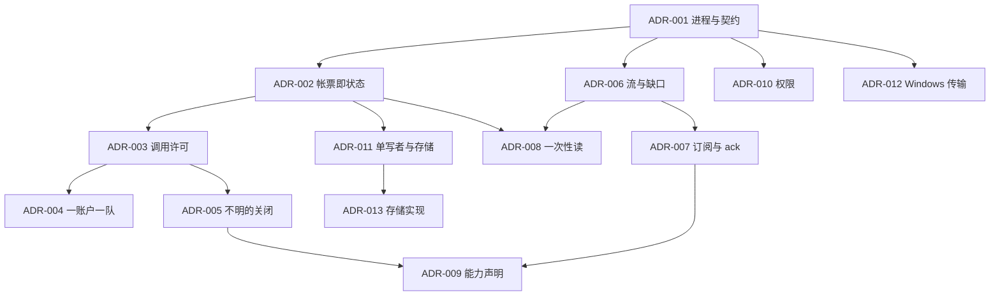

# ADR 索引

每条 ADR：背景（引用 `uta-design.md` 的 K / F / N / Q / R）、决定、被否决的替代与理由、后果、验证。状态 Accepted 或 Provisional（待 §6 实验）。

|编号|标题|状态|依赖|
|---|---|---|---|
|ADR-001|独立 Rust 进程；集成按账户独立进程；一份跨语言 RPC 契约|Accepted|—|
|ADR-002|状态是"手里有哪些帐票"的函数，帐票不可变只追加|Accepted|001|
|ADR-003|调用许可是安全边界：先许可后调用，许可落盘即结果不明边界，不明不再许可|Accepted|002|
|ADR-004|同账户写一队；头不明则等待|Accepted|003|
|ADR-005|结果不明只由回票 / 能力声明的查询 / 人工凭证关闭；集成 SDK 禁自动重试|Accepted|003|
|ADR-006|流 = 来源内 (代数, seq)；缺口是记录；跨流不排序不对齐|Accepted|001|
|ADR-007|订阅由核心持有；至少一次 + 显式 ack；慢消费者得投递缺口|Accepted|006|
|ADR-008|一次性读是转发，不是订阅；持仓 / 订单 / 账户响应留为对账响应|Accepted|002、006|
|ADR-009|能力声明决定能否下发、怎么查、订阅是否接受；不为 broker 假设能力|Accepted|005、007|
|ADR-010|权限在核心一处强制；身份来自传输认证；fail-closed|Accepted|001|
|ADR-011|单写者：文件锁 + 接管 fence；版本化只追加记录 + 迁移日志|Accepted|002|
|ADR-012|Windows 传输|Provisional（X1）|001|
|ADR-013|存储实现（手写分段追加 vs 现成库）|Provisional（X2）|011|

