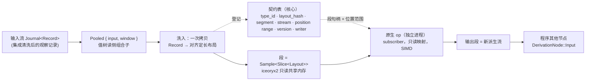

# 行情派生高性能计算子系统：`Pooled` → 段池 → 原生 op

状态：子系统设计 v1，闭合。**定位：可选项，独立于核心，不属于核心**——核心在没有它时完整可运行；它与核心的唯一接口是 `DerivationNode::Pooled`（`uta-core-design.md` §5.3）。依赖核心概念：§0.2 值树与五个 fold、§7.0 注册表、`Journal`/`LogPosition`（§2）。裁决：D11/D12，`decision-log.md` E1–E9。证据：`research/fp-07`（类型导出与外部编译）、`research/fp-08`（段池选库）。标注：**[证据]** / **[设计]** / **[spike]** 同核心设计。

---

## 0. 一句话

**`Pooled` 把一条线性行情派生洗入类型化只读共享内存段；原生 op 在独立进程里按导出的对齐布局对整段做向量化计算；输出是一条新的派生流。** 核心只维护契约表与位置映射，库（iceoryx2）承担映射、生命周期与三 OS。

---

## 1. 边界与不做

| 在子系统内 | 在子系统外 |
|---|---|
| `Pooled` 节点、洗入、布局推导与导出、契约表、段生命周期、原生 op 装载与握手、触发与预算 | 输入流的 `Journal` 与持久化（§2/§6.1）、程序其他节点、效应侧一切、集成进程 |
| 观察侧（§0.3） | 效应侧永不进段池 |
| 行情类流（前置条件四条） | 余额/持仓/订单状态/新闻——不满足前置条件，不能应用 `Pooled` |

明确不做：段池不持久（§5.3 E6/E7）；不提供 hostile-code sandbox（D11）；不自研映射层（E7）；不把段池概念泛化到 `Journal`（E3/E6）。

---

## 1.1 为什么存在，为什么是组合子

- **场景**（`native-computation-design-handoff.md`）：维护者要求一种**黑盒闭包**计算——UTA 不理解其算法，只把已注册的行情读数据与触发信号交给它，把它产生的值交给程序中已约定的消费者；每次触发可见指定输入的**完整最新窗口**而非 delta。**[设计：维护者约束]**
- **零拷贝的精确含义**：要求的是**同一物理页**，不是同一地址空间——只读共享内存映射让计算在独立进程里，既零拷贝又有故障域；交接稿的"同地址空间"方向由此取代（D12）。
- **`Pooled` 是进入高性能计算模式的边界**：进入这种内存等同于要求高度对齐的布局，边界上发生的**一次拷贝就是洗入**（raw → 对齐布局），有意为之；零拷贝指洗入之后每次调用不再搬窗口。**[设计：E5]**
- **值与 schema 分离**：段里只有值，布局在契约表。原始流的杂音在洗入时去掉——RFC 3339 字符串 vs `i64` 纳秒、十进制字符串 vs 定点、枚举字符串 vs `u8`、可空 vs 哨兵/位图——对布局的要求完全不同。**[设计：E5]**
- **为行情定制，不泛化**：前置条件四条限定了适用范围；段池、洗入、布局约束都不上升为核心通用类型的约束。**[设计：E3]**

## 1.2 存储模型：行情段池，不是堆，也不是 `Journal`

段池与 `Journal` **没有关系**——两套存储：`Journal` 是记录的载体（持久于 SQLite）；段池是为高性能计算设计的**运行期快照**，由 `Pooled` 从输入流洗入。段池不是 `Journal` 的缓存、热层或索引；`Journal` 也不从段池重建；共同点只有 `LogPosition` 标定。**[设计：E6]**

- **无堆**：共享内存是可分配边界的大内存池，池内无 malloc/free、无指针，只有按行情类型切出的段。
- **写在哪由类型决定**：每个行情派生读类型声明自己的扁平布局并据此拥有段；布局是该类型的一部分。
- **地址即位置**：段内 `base + (pos - from) * stride`；跨段由契约表（§4）。
- **线性即可拼接**：ring 回绕、段满、进程重启只是把流切成若干段，按位置区间拼回即原数据。
- **IPC 只交接段**：计算输入 = 段句柄列表 + 位置范围；输出也是一个段 = 一条派生流。
- **快照与有效期**：段是某一时刻输入窗口的快照，有内部有效期，不外泄——计算只见"这一版窗口"。段池不持久；重启由 `Pooled` 重洗；持久化行情归 `Journal`（S15）。**[设计：E6/E7]**

## 1.3 预算与计算形态

- **50 ms**：默认内部所有计算在 50 ms 内产生，是段有效期与调度的隐含上界；超过即该 op 的失败观察，不是等待。**[设计：E7]**
- **延迟**：IPC 延迟以 `iceoryx2` 主页基准为准，本文不复述；50 ms 预算下这一层不需关心。**[设计：E7]**
- **向量化优先**：行情计算是典型向量化场景——超大数组同构数值运算，末尾少量 map；对齐交给类型映射（洗入按 SIMD 通道宽度对齐），作者面对对齐定长数组。GPU 是同一形态的更远延伸，代价大，现在不做。**[设计：E8]**

## 1.4 代价，显式接受

- **信任边界在安装期**：只读映射让计算不能写核心内存，但仍可任意 syscall——是故障域，不是 sandbox（"uta 不保证程序无毒，在追求性能的前提下无法保证"）。原生 artifact 由 principal 经控制面安装，安装即授权；值树程序仍不可信、受预算。**[D11]**
- **故障域**：计算 panic/OOM 只死计算进程，核心记失败观察；核心死则计算成孤儿，靠 H10 fence 回收。
- **扁平布局约束**：无指针无 `Vec`；定长逐秒记录是自然形状，变长字段由 typed SDK 承担。
- **zero-copy 的范围**：只指从已物化段到调用不发生完整窗口传输；不覆盖网络、解码、洗入。
- **用库不自研**：映射、回收与生命周期簿记由 `iceoryx2` 承担；自研只在 S12 闸门失败时启用（§8）。**[E7]**

---

## 2. 前置条件与判定（装载期）

`Pooled { input, window }` 合法当且仅当 `input` 的记录类型满足：**定长**（洗入后每条记录字节数固定）、**位置线性**（`LogPosition` 单调、相邻记录相邻）、**无指针**（`repr(C)` 无引用/`Vec`/字符串）、**可容忍 ring 回收**（旧位置被回收只产生 `BeyondRetention`，不产生错误结果）。四条由输出类型 fold 在装载期判定，不满足即拒绝该程序。**[设计：§5.3]**

---

## 3. 布局：推导、对齐、导出、身份

### 3.1 推导（fold）
`Pooled` 之前的组合子树（`field::<T>` 访问器 + 转换算子）经 §0.2"输出类型" fold 得到记录布局 `Layout`：字段名、基类型、偏移、宽度、记录 stride、对齐。fold 必须**确定性**且输出**规范化**描述（字段顺序稳定、不含默认值、不含名字以外的语言细节）——这是 hash 的输入。**[spike S13①：无外部先例，需自证确定性]** **[证据：fp-07 S13 关闭建议 ①]**

### 3.2 对齐
洗入时按 SIMD 通道宽度对齐（记录 stride 与段基址均对齐到目标平台向量宽度；默认 64 字节覆盖 AVX-512/NEON）。对齐是 `Layout` 的一部分，进入 hash。**[设计：E8]**

### 3.3 导出格式
语言无关的布局描述，形状取 Arrow `ArrowSchema` format 码 + NumPy dtype offsets：每字段 `(name, format, offset)`，format 码覆盖洗入映射（`'l'` i64、`'tsn:'` ns 时间戳、`'d:19,10'` 定点、`'C'` u8 枚举）；附 `stride`、`alignment`、`layout_hash`。Rust 源（`#[repr(C, align(64))] struct`）与 C 头是它的两种渲染，由工具生成。**[证据：fp-07 命题 2；S13 关闭建议 ②]**

### 3.4 身份
`layout_hash = SHA256(规范化布局描述)`（RIHS01 式）。**不依赖 iceoryx2 的 `is_compatible_to`**——它只比 `type_name + size + alignment`，同尺寸同对齐、字段语义不同会误配。**[证据：fp-07 命题 1；fp-08 §3.3]**

---

## 4. 契约表（核心维护，唯一的跨段真相）

| 字段 | 含义 |
|---|---|
| `type_id` | 输出类型 fold 给出的类型身份 |
| `layout_hash` | §3.4 |
| `service` / `segment` | iceoryx2 service 名 + sample 句柄（段） |
| `stream` | 输入 `StreamId` |
| `position_range` | 该段覆盖的 `LogPosition` 区间 `[from, to)` |
| `version` | 契约版本（布局变 = 新版本 = 新 service） |
| `writer` | 写者（核心洗入器或某原生 op） |

**为什么必须有它**：iceoryx2 的段槽由 `PoolAllocator` 自由列表分配，**没有流内全局位置算术**；"地址即位置"只在一个段（一个 `Sample<Slice<Layout>>`）内成立（`base + (pos - from) * stride`），跨段靠此表把无序 allocator offset 归一到有序位置区间。窗口 = 按 `position_range` 排序的段句柄列表。**[证据：fp-08 §3.1/§3.9、推荐 1]** **[设计]**

**ABA 纪律**：iceoryx2 无 per-slot generation。核心与原生 op 只经 `Sample` 借用访问段，**禁止缓存裸 offset 跨释放复用**；段回收后其 `position_range` 从表中删除，旧位置查表即 `BeyondRetention`。**[证据：fp-08 推荐 2]**

---

## 5. 段生命周期

- **写者**：核心洗入器（或原生 op 对其输出段）是 publisher；`loan_slice_uninit(n) → 写 → send`。每段一次性写满即发，不原地追加（段是快照）。**[证据：fp-08 §3.2]**
- **读者**：原生 op 进程是 subscriber port：payload 段 OS 只读映射（`AccessMode::Read` → `PROT_READ` / `PAGE_READONLY`），控制面（连接队列、refcount）可写但是 iceoryx2 内部结构，不是核心内存。**接受"计算进程是可写控制面 subscriber，不是零协议只读附着"**。**[证据：fp-08 §3.5、推荐 3]** **[设计：显式接受]**
- **借用**：`Sample` 持有即 refcount>0，chunk 不回收；`subscriber_max_borrowed_samples` 上限防慢读者拖垮池。窗口 = 核心持有的一组 `Sample` 的有序列表（history 是回放队列不是随机访问，随机访问由核心保留引用集实现）。**[证据：fp-08 §3.4、推荐 4]**
- **回收**：ring 深度与 overflow 由 iceoryx2 配置（`history_size`、`subscriber_max_buffer_size`、`enable_safe_overflow`）；safe overflow 只回收无人借用的 chunk。**[证据：fp-08 §3.4]**
- **有效期**：段是输入窗口的快照，有效期是段池内部的事，不外泄；计算只见"这一版窗口"。**[设计：E7]**
- **崩溃**：原生 op 进程死 → 其借用经 `retrieve_returned_chunks` + H10 fence 回收；核心死 → op 成孤儿，fence 回收。**[证据：fp-08 §7.1 第 3 项]**

---

## 6. 原生 op：装载、握手、执行

### 6.1 注册项（§7.0 注册表）
`{ op_id, inputs: [(stream, layout_hash)], output: (stream, layout_hash), code_version, artifact, principal }`。`required_inputs` fold 对 `Pooled` 输入解析到契约表得段句柄。

### 6.2 装载 = 启动进程 + 握手
1. 核心启动 op 进程（或 op 自行启动并连接），传入 service 名与期望的 `layout_hash` 集。
2. op 进程 open service；iceoryx2 校验 `type_name/size/alignment`；**核心再比对契约表 `layout_hash` 与 op 编译时携带的 hash**，不等即 fail-closed，op 不进入运行。**[证据：fp-07 命题 3、S13 ⑤]**
3. 握手通过后 op 是 subscriber；触发经 iceoryx2 事件或核心的触发通道（S14）。

### 6.3 执行
op 收到触发 → 借用当前窗口的段列表 → 按导出布局做向量化计算（SIMD 对齐已由布局保证）→ `loan_slice_uninit` 输出段 → 写 → `send` → 释放借用。默认 **50 ms** 内完成；超时即该 op 的失败观察记录，不等待。**[设计：E7]**

### 6.4 替换
布局变 = 新 `layout_hash` = 新 service；旧 op 继续读旧 service 直到被停止；新 op 连新 service。不存在原地改布局。未决：调用中持有的段何时可回收（借用释放后自然回收，S12 实测）。

---

## 7. 外部编译与迭代

- **作者面**：typed SDK 从契约表导出 Rust 源（`#[repr(C, align(N))]` 结构 + `const LAYOUT_HASH`）；作者写一个小 crate，依赖 SDK，实现 `fn compute(windows: &[&[Input]]) -> impl Iterator<Item = Output>` 形状的入口；`zerocopy`/`bytemuck` 派生宏作为"导出布局确实可零拷贝访问"的编译期校验。**[证据：fp-07 组四；fp-08 §3.3]**
- **迭代**：改一个 op 只重编译一个小 crate，warm rebuild 亚秒级（实测 0.94 s → 0.12 s，单 OS 最小 crate）；替换走 §6.4。**[证据：fp-07 命题 5]**
- **交付**：source 或预编译均可；三 OS 产物按 target triple 矩阵构建（cargo-dist 式），Windows 需 MSVC、macOS 需 SDK——工具链缺口是独立条件，不是子系统能消掉的。**[证据：fp-07 组四]**
- **不做**：宿主内嵌编译器（Cranelift 实验性、rustc 作库不稳定）。**[证据：fp-07 案例 4.5]**

---

## 8. 选库裁决

**首选 `iceoryx2`**（维持 D12）。理由：唯一同时满足 Rust 一等、三 OS（CI + 本机 macOS 实测跨进程）、`repr(C)` 类型校验、`Slice<T>` 定长数组样本、单写多读、payload OS 只读映射、ring 深度可配、refcount 借用生命周期，且由库承担映射与簿记的候选。**[证据：fp-08 §7]**

**核心侧显式接受的五条补齐**（fp-08 推荐）：① 自建契约表做跨段位置映射；② 只经 `Sample` 访问、禁缓存裸 offset；③ 计算进程是可写控制面 subscriber；④ 随机访问历史由核心持引用集；⑤ 跨语言时 `type_name` 需覆写且以 `layout_hash` 补强。

**备选 `memmap2` + 自研**：只在 S12 实测 iceoryx2 在 macOS/Windows 跨独立进程不可靠、或"可写控制面 subscriber"被判不可接受、或必须把裸 offset 导出给 op 做零协议随机寻址时启用；启用即违反"不自研"，须记入 S12 并列出自写清单（命名段生命周期、契约表、位置算术、seqlock、ring + generation、借用簿记、控制/数据面分离）。**[证据：fp-08 §7]**

不选：Aeron（可写 `MmapMut`、需 media driver、CI 仅 Linux）、disruptor-rs（进程内）、Chronicle（持久、查表、付费 Rust 绑定）、ipc-channel/shm_ringbuf/shared_memory（三门 FAIL）。Arrow `FFI_ArrowSchema` 只作布局导出面，不作数据面。

---

## 9. 实测闸门（S12，落地前必过；macOS + Windows 各一遍）

1. 跨独立进程只读消费：publisher 发 `Sample<Slice<Layout>>`，另一进程 subscriber 按 `&[Layout]` 算术遍历；写 payload 触发段错误。
2. 借用期回收安全：长持最老 `Sample` 的 reader 与正常 reader 并存，publisher 超发 `buffer + history` 条；长持仍有效，overflow 行为符合配置。
3. reader 崩溃回收：持借用的 op 进程异常退出，chunk 经 fence 回收，不泄漏不死锁。
4. Slice 动态重分配：非 Static 策略下超 `max_slice_len` 扩容，快照不丢样本。
5. 契约表归一：无序 `PointerOffset` 归一到有序 `LogPosition` 区间并跨段拼接；不同 subscriber 对同一位置得同一内容（跨独立进程复验）。
6. 布局 fold 确定性：同一组合子树多次 fold 得同一规范化描述与 hash；字段顺序扰动不改变 hash（S13①）。

任一失败 → §8 备选条件。

---

## 10. 与核心 spike 的对应

| 核心 spike | 本文处理 |
|---|---|
| S12 | §5 生命周期 + §9 闸门 1–5；选库已裁决，剩实测 |
| S13 | ②导出 ③交付 ⑤校验已由 §3/§6/§7 关闭；剩 ① fold 确定性（§9 闸门 6）与三 OS 工具链缺口（§7，外部条件） |
| S14 | 触发语义（edge/level、合并、冷却）、背压、失败观察的形状——§6.3 给了 50 ms 预算与失败观察，触发通道的具体形式仍开放 |
| S15 | 不在本文：输入流的持久化归 `Journal` |

---

## 11. 来源

- `research/fp-07-type-export-and-external-compilation.md`：24 案例，pinned iceoryx2 `aec1ed8` / arrow `b274238` / rosidl `00d13c5`。
- `research/fp-08-segment-pool-libraries.md`：14 库，三淘汰门 + 12 维；本机 macOS 实测 iceoryx2 跨进程 pub/sub 与 `Slice` 连续性。
- `native-computation-design-handoff.md`：场景与约束来源；其"同地址空间"方向已被 D12 取代。
- `decision-log.md` E1–E9。
