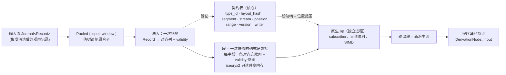

# 行情派生高性能计算子系统：`Pooled` → 段池 → 原生 op

状态：子系统设计 v1，闭合。**定位：可选项，独立于核心，不属于核心**——核心在没有它时完整可运行；它与核心的唯一接口是 `DerivationNode::Pooled`（`uta-core-design.md` §5.3）。依赖核心概念：§0.2 值树与五个 fold、§7.0 注册表、`Journal`/`LogPosition`（§2）。裁决：D11/D12，`decision-log.md` E1–E9。证据：`research/fp-07`（类型导出与外部编译）、`research/fp-08`（段池选库）、`research/fp-09`（算法层与 VectorTA、AoS/SoA、Rust SIMD 现状、50 ms 容量）、`research/fp-10`（数组中间层、真实 SPY 实测、autovec 对照）。标注：**[证据]** / **[设计]** / **[spike]** 同核心设计。

---

## 0. 一句话

**`Pooled` 把一条线性行情派生洗入类型化只读共享内存段；原生 op 在独立进程里按导出的对齐布局对整段做向量化计算；输出是一条新的派生流。** 核心只维护契约表与位置映射，库（iceoryx2）承担映射、生命周期与三 OS。

---

## 1. 边界与不做

| 在子系统内 | 在子系统外 |
|---|---|
| `Pooled` 节点、洗入、布局推导与导出、契约表、段生命周期、原生 op 装载与握手、触发与预算 | 输入流的 `Journal` 与持久化（§2/§6.1）、程序其他节点、效应侧一切、集成进程 |
| 观察侧（§0.3） | 效应侧永不进段池 |
| 行情类流（前置条件四条） | 余额/持仓/订单状态/新闻——不满足前置条件，不能应用 `Pooled` |

明确不做：段池不持久（§5.3 E6/E7）；不提供 hostile-code sandbox（D11）；不自研映射层（E7）；不把段池概念泛化到 `Journal`（E3/E6）。

---

## 1.1 为什么存在，为什么是组合子

- **场景**（`native-computation-design-handoff.md`）：维护者要求一种**黑盒闭包**计算——UTA 不理解其算法，只把已注册的行情读数据与触发信号交给它，把它产生的值交给程序中已约定的消费者；每次触发可见指定输入的**完整最新窗口**而非 delta。**[设计：维护者约束]**
- **零拷贝的精确含义**：要求的是**同一物理页**，不是同一地址空间——只读共享内存映射让计算在独立进程里，既零拷贝又有故障域；交接稿的"同地址空间"方向由此取代（D12）。
- **`Pooled` 是进入高性能计算模式的边界**：进入这种内存等同于要求高度对齐的布局，边界上发生的**一次拷贝就是洗入**（raw → 对齐布局），有意为之；零拷贝指洗入之后每次调用不再搬窗口。**[设计：E5]** 洗入产出四件事：连续列、`f64`、validity 位图、对齐——前三件是计算侧全部 kernel（autovec 的 `Zip`、增量窗口、单调队列、位图传播）的前提，第四件不是（§3.2）。洗入每快照一次：按 fp-09 融合转换折算 8465 行 4 列约 14 µs [推断]，相对单次计算 50–200 µs 与 50 ms 预算均为小项，进闸门 7 实测。
- **值与 schema 分离**：段里只有值，布局在契约表。原始流的杂音在洗入时去掉——RFC 3339 字符串 vs `i64` 纳秒、十进制字符串 vs 定点、枚举字符串 vs `u8`、可空 vs 哨兵/位图——对布局的要求完全不同。**[设计：E5]**
- **为行情定制，不泛化**：前置条件四条限定了适用范围；段池、洗入、布局约束都不上升为核心通用类型的约束。**[设计：E3]**

## 1.2 存储模型：行情段池，不是堆，也不是 `Journal`

段池与 `Journal` **没有关系**——两套存储：`Journal` 是记录的载体（持久于 SQLite）；段池是为高性能计算设计的**运行期快照**，由 `Pooled` 从输入流洗入。段池不是 `Journal` 的缓存、热层或索引；`Journal` 也不从段池重建；共同点只有 `LogPosition` 标定。**[设计：E6]**

- **无堆**：共享内存是可分配边界的大内存池，池内无 malloc/free、无指针，只有按行情类型切出的段。
- **写在哪由类型决定**：每个行情派生读类型声明自己的扁平布局并据此拥有段；布局是该类型的一部分。
- **地址即位置**：段内每列 `column_base + (pos - from) * element_size`；跨段由契约表（§4）。
- **线性即可拼接**：ring 回绕、段满、进程重启只是把流切成若干段，按位置区间拼回即原数据。
- **IPC 只交接段**：计算输入 = 段句柄列表 + 位置范围；输出也是一个段 = 一条派生流。
- **快照与有效期**：段是某一时刻输入窗口的快照，有内部有效期，不外泄——计算只见"这一版窗口"。段池不持久；重启由 `Pooled` 重洗；持久化行情归 `Journal`（S15）。**[设计：E6/E7]**

## 1.3 预算与计算形态

- **50 ms**：默认内部所有计算在 50 ms 内产生，是段有效期与调度的隐含上界；超过即该 op 的失败观察，不是等待。**[设计：E7]** 预算按 `T_ipc + T_convert + T_compute + T_writeback` 分项核算：本机 M4 标量实测单指标 100 k 样本 25–154 µs、每列 i64→f64 转换 14 µs、AoS→SoA 转置 98 µs/3 列——若按触发做转置/转换，物化占合计 34–65 %，与计算同量级；§3 的列式段与洗入期转换把 `T_convert` 从每触发降为零，剩余 `T_ipc` 与真实链路 [需实测]（§9 闸门 7）。**[证据：fp-09 §7]**
- **延迟**：IPC 延迟以 `iceoryx2` 主页基准为准，本文不复述；其在 50 ms 内可忽略是待验假设，不是前提。**[设计：E7]** **[spike：§9 闸门 7]**
- **向量化是自然收益，不是目标**：不追求 SIMD 利用率或高度向量化 **[设计：E11]**。行情计算的主体是超大浮点数组的同构数值运算，末尾少量 map；对齐交给类型映射，作者面对对齐定长数组，**作者不碰 SIMD**（E10）。**[设计：E8]** **平台优先级：aarch64 NEON 首要（OpenAlice 用户主流是 ARM macOS），x86 AVX2 第二，AVX-512 不作目标** **[设计：E12]**——AVX2/NEON 对浮点有大幅加速、对整数收益小，故段内数值列取 `f64`（§3.5）。收益条件 **[证据：fp-09 §3.1 问四、§6]**：窗口/归约类指标（SMA、Bollinger、rolling 统计）沿时间可向量化；递归类（EMA/RSI/ATR）有 loop-carried 依赖，沿时间不可平行化，走标量是合理的（VectorTA 对 RSI 即便在 x86 AVX 也走标量）；递归指标若要并行，维度是跨流/跨参数，不是跨时间。平台事实：`std::simd` 仍 nightly-only（#86656 open）；Apple M4 只有 128-bit NEON（f64 = 2 lane）；**现成指标库在 aarch64 上无显式 NEON 内核**，"库自带 SIMD"在首要平台上不成立；但 release 默认基线里 elementwise/密集窗口已被 LLVM autovec 成 NEON `.2d`，显式 SIMD 的增量收益只在朴素 rolling max/min 显著（3.3×，且 O(n) 单调队列标量可能反超）——"作者不碰 SIMD"在首要平台靠惯用写法 + 中间层即可达成（§8.1）**[证据：fp-10 §4.3]**。GPU 是同一形态的更远延伸，代价大，现在不做。

## 1.4 代价，显式接受

- **信任边界在安装期**：只读映射让计算不能写核心内存，但仍可任意 syscall——是故障域，不是 sandbox（"uta 不保证程序无毒，在追求性能的前提下无法保证"）。原生 artifact 由 principal 经控制面安装，安装即授权；值树程序仍不可信、受预算。**[D11]**
- **故障域**：计算 panic/OOM 只死计算进程，核心记失败观察；核心死则计算成孤儿，靠 H10 fence 回收。
- **扁平布局约束**：无指针无 `Vec`；段内每字段一条定长对齐列，变长字段由 typed SDK 承担。
- **zero-copy 的范围**：只指从已物化段到调用不发生完整窗口传输；不覆盖网络、解码、洗入。
- **用库不自研**：映射、回收与生命周期簿记由 `iceoryx2` 承担；自研只在 S12 闸门失败时启用（§8）。**[E7]**

---

## 2. 前置条件与判定（装载期）

`Pooled { input, window }` 合法当且仅当 `input` 的记录类型满足：**定长**（洗入后每个字段元素字节数固定）、**位置线性**（`LogPosition` 单调、同一列内相邻位置相邻）、**无指针**（无引用/`Vec`/字符串）、**可容忍 ring 回收**（旧位置被回收只产生 `BeyondRetention`，不产生错误结果）。四条由输出类型 fold 在装载期判定，不满足即拒绝该程序。**[设计：§5.3]**

---

## 3. 布局：列式段、推导、对齐、导出、身份

### 3.0 段是列式记录批，不是记录数组

**一段 = 一次快照的所有字段，每字段一条连续对齐列，外加每列一张 validity 位图；不是 `repr(C)` 记录的数组。** **[设计：fp-09 后裁决，待维护者确认（decision-log F5）]**

依据 **[证据：fp-09 §3.1、§4、§5]**：(1) 全部成熟算法库——VectorTA、TA-Lib、Tulip、polars——的输入形状都是连续单列 `&[f64]`/`double*`，无一接受记录 stride 视图；记录数组要用它们必须每次触发转置（M4 实测 3 列 × 100 k = 98 µs，与单指标计算同量级），击穿"洗入后不再搬窗口"。(2) Intel/Arm 优化手册：跨样本同字段的 vertical SIMD 要连续列；Arm 明确警告运行期重排整个数据集代价高。(3) Arrow/DataFusion 列式的核心收益正是"只扫所需列"。

为什么代价为零：洗入本来就是那一次拷贝（§1.1，E5），把 raw 记录写到列的地址而不是记录的地址，字节数相同；段"一次性写满即发"（§5），写时已知 `n`，列块边界确定。E2 的"地址即位置"逐列成立；E8 的"作者面对对齐定长数组"字面即列。

不取"列即段"（每列独立 service）：那要另立跨段时间轴/长度/缺失一致性协议；一段内含全部列则一次快照天然一致。多字段同点访问（如单根 K 线的 OHLC）退化为四次不同地址加载——该模式属核心值树的 `On(pattern)`，不是原生 op 的向量路径。

### 3.1 推导（fold）
`Pooled` 之前的组合子树（`field::<T>` 访问器 + 转换算子）经 §0.2"输出类型" fold 得到段布局 `Layout`：字段列表，每字段 `(name, format, element_size, column_offset)`；段级 `capacity`、`alignment`、validity 位图位置。fold 必须**确定性**且输出**规范化**描述（字段顺序稳定、不含默认值、不含名字以外的语言细节）——这是 hash 的输入。**[spike S13①：无外部先例，需自证确定性]** **[证据：fp-07 S13 关闭建议 ①]**

### 3.2 对齐
段基址与每列起点对齐到 **64 B（cache line）**，它同时满足目标向量宽度：aarch64 NEON 为 16 B（首要平台），x86 AVX2 为 32 B。**AVX-512 不是设计目标**——64 B 只是 cache-line 对齐，不暗示 512-bit 向量路径。对齐是 `Layout` 的一部分，进入 hash。**[设计：E8、E11、E12]** **[证据：fp-09 §6、修正 1]**

**对齐不是自动向量化的前提。** fp-10 的标量基线数据是普通 `Vec<f64>`（分配器 16 B 对齐），release 汇编已出现 `fadd/fmul/fmla.2d` **[证据：fp-10 §4.3]**；NEON/AVX2 非对齐向量加载无故障、惩罚仅在跨 cache line 时 [推断]。fp-11 实测 64 B 对齐 vs 起点错位 8/24/40 B vs 普通 `Vec`，3 指标 × 2 实现 × 7 pass 差异全在 ±2% 噪声内 **[证据：fp-11 §5]**——对齐不能用性能辩护；保留 64 B 的理由只剩 cache line 边界、避免相邻列 false sharing、布局身份规范化。真正决定 Rust kernel 能否被 LLVM 向量化的是四条写法纪律，集中在原语 crate 内（§8.1），不要求 op 作者掌握：① 连续 stride-1 访问且无别名（`&`/`&mut` 已保证）；② 消掉边界检查（`Zip`/迭代器或循环前 `assert_eq!(len)`）；③ 无循环携带依赖（递归类永远标量）；④ 浮点归约默认不向量化（Rust 无 fast-math，LLVM 不重结合 `fadd`），`sum` 类要手动多累加器——fp-10 朴素 rolling max/min 未被 autovec 即此类。

### 3.3 导出格式
语言无关的布局描述，形状取 Arrow `ArrowSchema` format 码 + 列偏移：每字段 `(name, format, column_offset, element_size)`，format 码覆盖洗入映射（`'g'` f64、`'l'` i64、`'tsn:'` ns 时间戳、`'C'` u8 枚举）；附 `capacity`、`alignment`、validity 位图布局、`layout_hash`。列式段与 Arrow 的对应比记录数组直接：每列就是一条 Arrow buffer。Rust 源（列切片视图结构，见 §7）与 C 头是它的两种渲染，由工具生成。**[证据：fp-07 命题 2；S13 关闭建议 ②；fp-09 §5.3]**

### 3.4 身份
`layout_hash = SHA256(规范化布局描述)`（RIHS01 式），描述必须覆盖**全部物理布局**：字段名、format、元素宽度、列偏移、容量、对齐、padding、validity 表示——"字段名 + 偏移"不足以唯一标定列式段。**不依赖 iceoryx2 的 `is_compatible_to`**——它只比 `type_name + size + alignment`，同尺寸同对齐、字段语义不同会误配。**[证据：fp-07 命题 1；fp-08 §3.3；fp-09 修正 7]**

### 3.5 数值表示与 gap：两条独立于布局的契约轴

- **段里的价格与数量列是 `f64`，定点不进段。** 行情本质上是浮点；AVX2/NEON 的大幅加速只对浮点成立，整数收益小 **[设计：E11]**；全部现成算法库与数组库价格类型也是 `f64` **[证据：fp-09 §3.1 问五、§5.4]**。核心侧若以定点承载价格（§9 基类型），`Pooled` 洗入时一次转换为 `f64`，成本落在洗入那一次拷贝，不落在每次触发；精度语义（定点 → 53 位尾数）是进入 `Pooled` 的已知代价，随前置条件在装载期显式接受。时间戳列 `i64` 纳秒、枚举列 `u8` 不受影响。
- **gap 显式，op 声明策略。** 输入流缺位在段里以 validity 位图表示，不伪造连续、不填哨兵。递归指标遇 gap 的行为在现成库里各异且静默——VectorTA RSI 遇 NaN 平台化后继续输出错误值、batch 与 stream 对同一序列输出不同 **[证据：fp-09 §3.1 问三]**——所以由子系统契约定：op 注册项声明 `gap_policy ∈ { Reset, Hold, Missing }`（gap 后重新预热 / 保持上一态 / 输出缺失直到新预热完成）；op 输出的 validity 位图必须把预热区与 `Missing` 区标为无效；不声明即拒绝装载。跨触发保留库的 streaming 状态会悄悄固定未声明的语义，禁止。**[设计]**

---

## 4. 契约表（核心维护，唯一的跨段真相）

| 字段 | 含义 |
|---|---|
| `type_id` | 输出类型 fold 给出的类型身份 |
| `layout_hash` | §3.4 |
| `service` / `segment` | iceoryx2 service 名 + sample 句柄（段） |
| `stream` | 输入 `StreamId` |
| `position_range` | 该段覆盖的 `LogPosition` 区间 `[from, to)` |
| `version` | 契约版本（布局变 = 新版本 = 新 service） |
| `writer` | 写者（核心洗入器或某原生 op） |

**为什么必须有它**：iceoryx2 的段槽由 `PoolAllocator` 自由列表分配，**没有流内全局位置算术**；"地址即位置"只在一个段（一个 `Sample<Slice<Layout>>`）内成立（`base + (pos - from) * stride`），跨段靠此表把无序 allocator offset 归一到有序位置区间。窗口 = 按 `position_range` 排序的段句柄列表。**[证据：fp-08 §3.1/§3.9、推荐 1]** **[设计]**

**ABA 纪律**：iceoryx2 无 per-slot generation。核心与原生 op 只经 `Sample` 借用访问段，**禁止缓存裸 offset 跨释放复用**；段回收后其 `position_range` 从表中删除，旧位置查表即 `BeyondRetention`。**[证据：fp-08 推荐 2]**

---

## 5. 段生命周期

- **写者**：核心洗入器（或原生 op 对其输出段）是 publisher；`loan_slice_uninit(n) → 逐列写 → send`。每段一次性写满即发，不原地追加（段是快照）；写时已知 `n`，列块边界与 validity 位图一并落定。**[证据：fp-08 §3.2]**
- **读者**：原生 op 进程是 subscriber port：payload 段 OS 只读映射（`AccessMode::Read` → `PROT_READ` / `PAGE_READONLY`），控制面（连接队列、refcount）可写但是 iceoryx2 内部结构，不是核心内存。**接受"计算进程是可写控制面 subscriber，不是零协议只读附着"**。**[证据：fp-08 §3.5、推荐 3]** **[设计：显式接受]**
- **借用**：`Sample` 持有即 refcount>0，chunk 不回收；`subscriber_max_borrowed_samples` 上限防慢读者拖垮池。窗口 = 核心持有的一组 `Sample` 的有序列表（history 是回放队列不是随机访问，随机访问由核心保留引用集实现）。**[证据：fp-08 §3.4、推荐 4]**
- **回收**：ring 深度与 overflow 由 iceoryx2 配置（`history_size`、`subscriber_max_buffer_size`、`enable_safe_overflow`）；safe overflow 只回收无人借用的 chunk。**[证据：fp-08 §3.4]**
- **有效期**：段是输入窗口的快照，有效期是段池内部的事，不外泄；计算只见"这一版窗口"。**[设计：E7]**
- **崩溃**：原生 op 进程死 → 其借用经 `retrieve_returned_chunks` + H10 fence 回收；核心死 → op 成孤儿，fence 回收。**[证据：fp-08 §7.1 第 3 项]**

---

## 6. 原生 op：装载、握手、执行

### 6.1 注册项（§7.0 注册表）
`{ op_id, inputs: [(stream, layout_hash)], output: (stream, layout_hash), gap_policy, code_version, artifact, principal }`。`required_inputs` fold 对 `Pooled` 输入解析到契约表得段句柄；`gap_policy` 见 §3.5。

### 6.2 装载 = 启动进程 + 握手
1. 核心启动 op 进程（或 op 自行启动并连接），传入 service 名与期望的 `layout_hash` 集。
2. op 进程 open service；iceoryx2 校验 `type_name/size/alignment`；**核心再比对契约表 `layout_hash` 与 op 编译时携带的 hash**，不等即 fail-closed，op 不进入运行。**[证据：fp-07 命题 3、S13 ⑤]**
3. 握手通过后 op 是 subscriber；触发经 iceoryx2 事件或核心的触发通道（S14）。

### 6.3 执行
op 收到触发 → 借用当前窗口的段列表 → 按导出布局取各列切片做向量化计算（对齐已由布局保证，无转置无转换）→ `loan_slice_uninit` 输出段 → 逐列写 + validity → `send` → 释放借用。默认 **50 ms** 内完成（分项见 §1.3）；超时即该 op 的失败观察记录，不等待。**[设计：E7]**

### 6.4 替换
布局变 = 新 `layout_hash` = 新 service；旧 op 继续读旧 service 直到被停止；新 op 连新 service。不存在原地改布局。未决：调用中持有的段何时可回收（借用释放后自然回收，S12 实测）。

---

## 7. 外部编译与迭代

- **作者面 = 列视图 + 原语集 + 标量逃逸口，作者不碰 SIMD**（E10；裁决见 §8.1）：typed SDK 从契约表导出 Rust 源——列视图结构（`struct Window<'a> { ts: &'a [i64], close: ArrayView1<'a, f64>, …, valid: &'a Bitmap }`，每字段一列，`ndarray` 视图零拷贝借自段）+ 输出段的可写列（`ArrayViewMut1<f64>` + 可写位图）+ `const LAYOUT_HASH`；作者写一个小 crate，依赖 SDK，实现**批量**入口 `fn compute(window: &Window, out: &mut OutputColumns) -> Written { len, first_valid }`——与 `xxx_into(&mut [f64])` / TA-Lib `outBegIdx` 家族同形，不是逐条 iterator。输出列**必须是连续 `&mut [f64]`**：只返回新 `Array`/`Series`/`Tensor` 的库（arrow-rs、polars、candle、burn）过不了这个 ABI，不得作数据面。**[证据：fp-10 §3、修正 1]** `zerocopy`/`bytemuck` 派生宏作为"导出布局确实可零拷贝访问"的编译期校验。**[证据：fp-07 组四；fp-08 §3.3；fp-09 修正 5/8]**
- **迭代**：改一个 op 只重编译一个小 crate，warm rebuild 亚秒级（实测 0.94 s → 0.12 s，单 OS 最小 crate）；替换走 §6.4。**[证据：fp-07 命题 5]**
- **交付**：source 或预编译均可；三 OS 产物按 target triple 矩阵构建（cargo-dist 式），Windows 需 MSVC、macOS 需 SDK——工具链缺口是独立条件，不是子系统能消掉的。**[证据：fp-07 组四]**
- **不做**：宿主内嵌编译器（Cranelift 实验性、rustc 作库不稳定）。**[证据：fp-07 案例 4.5]**

---

## 8. 选库裁决

**首选 `iceoryx2`**（维持 D12）。理由：唯一同时满足 Rust 一等、三 OS（CI + 本机 macOS 实测跨进程）、`repr(C)` 类型校验、`Slice<T>` 定长数组样本、单写多读、payload OS 只读映射、ring 深度可配、refcount 借用生命周期，且由库承担映射与簿记的候选。**[证据：fp-08 §7]**

**核心侧显式接受的五条补齐**（fp-08 推荐）：① 自建契约表做跨段位置映射；② 只经 `Sample` 访问、禁缓存裸 offset；③ 计算进程是可写控制面 subscriber；④ 随机访问历史由核心持引用集；⑤ 跨语言时 `type_name` 需覆写且以 `layout_hash` 补强。

**备选 `memmap2` + 自研**：只在 S12 实测 iceoryx2 在 macOS/Windows 跨独立进程不可靠、或"可写控制面 subscriber"被判不可接受、或必须把裸 offset 导出给 op 做零协议随机寻址时启用；启用即违反"不自研"，须记入 S12 并列出自写清单（命名段生命周期、契约表、位置算术、seqlock、ring + generation、借用簿记、控制/数据面分离）。**[证据：fp-08 §7]**

不选：Aeron（可写 `MmapMut`、需 media driver、CI 仅 Linux）、disruptor-rs（进程内）、Chronicle（持久、查表、付费 Rust 绑定）、ipc-channel/shm_ringbuf/shared_memory（三门 FAIL）。Arrow `FFI_ArrowSchema` 只作布局导出面，不作数据面。

### 8.1 中间层裁决：子系统拥有的原语集，建在 `ndarray` 视图上

**结论（[设计：fp-10 假设，已由 fp-11 闸门 9 demo 实证：作者代码降 57–73%，SuperTrend 快过手写 NEON、Squeeze 1.25×，Ichimoku 2.23× 需 `rolling.min/max` 内部 SIMD；decision-log F7 待维护者确认]）**：不选任何现成指标库作算法层（E10，fp-09）；也不把某个数组库整个 bless 给作者了事。中间层 = **`ndarray` 视图作容器 + 子系统自有的、词汇取自 pandas/numpy 的一小组原语 + 标量逃逸口**。作者写数组表达式与惯用 `for` 循环，不写 SIMD。

三条一手事实决定了这个形状 **[证据：fp-10 §1、§4、§6]**：
1. **没有单一 Rust 库同时满足**"numpy 式 + 作者不碰 SIMD + 借外部列/写调用方列 + 有 rolling/ewm/validity"：`ndarray` 过 ABI、词汇最近 numpy，但无 rolling/scan/ewm/where/validity；`polars` 词汇最近 pandas、有 `rolling_*`/`ewm`/位图，但 kernel 只能返回新 `Series`，复杂指标慢 1.5–2.3× 且分配；`arrow-rs`/`candle`/`burn` 同样违 ABI；`faer`/`pulp` 分工最自然但要作者写 `WithSimd`。
2. **aarch64 上"作者不碰 SIMD"已由 LLVM autovec 达成**：release 默认基线里 elementwise/密集窗口已是 NEON `.2d`（禁 autovec 对照：Squeeze 慢 14 %）；显式 SIMD 的增量收益按指标——SuperTrend 递推 ≈ 1.0×、Squeeze 1.36×、朴素 rolling max/min 3.3×（且后者换单调队列 O(n) 标量可能反超）。中间层真正要拥有的不是 SIMD，而是**窗口/递归/validity 的语义**。
3. **loop-carried 状态机（SuperTrend 类）在所有先例（numpy/pandas/Arrow/Polars/numexpr）都强制退回 scalar/custom**——任何"只写表达式"的中间层都必须留标量逃逸口。

**原语集（词汇取 pandas/numpy，签名取 Rust 惯用；输入 `ArrayView1<f64>` + 位图，输出写调用方列 + 位图）**：

| 原语 | 语义契约（显式，不沿用任何库默认） | 实现形态 |
|---|---|---|
| `rolling(w).{sum, mean, std(ddof), var, min, max}` | `min_periods = w`，前 `w-1` 无效；`std` 的 `ddof` 必填 | sum/mean/std 增量窗口（Neumaier/Welford）；min/max 是**唯一允许内部 SIMD 的 kernel**——单调队列 O(n) 在小窗口上是显式 NEON 的 2.2×（fp-11），作者面不变 |
| `ewm(alpha, seed)` | `seed` 必填：`First` / `MeanOf(n)`（EMA 的 idx n-1 均值 seed）/ `Wilder(n)`；`adjust=false`；无效输入按 op 的 `gap_policy`（§3.5） | 顺序标量（递归沿时间不可平行，E11） |
| `shift(k)` / `diff(k)` | 位移后无效区显式进位图 | 视图偏移，零拷贝 |
| `where(cond, a, b)` / elementwise ufunc / `cumsum` / `reduce` | validity 逐元素与运算同步传播 | `Zip` 惯用循环，autovec 已成 NEON（fp-11 §4）；不用显式 SIMD |
| `linreg(w)` | 窗口线性回归端点值（Pine `ta.linreg`） | 代数展开为 rolling sum 组合 |
| **标量逃逸口** | 作者对列切片写惯用 `for` 循环（状态机、自定义递推），自己写 `first_valid` 与位图 | 无框架；autovec 自然适用 |

**不做**：不自造行业 DSL（E10）——上表词汇是 pandas/numpy 已有认知；不提供 SIMD 类型给作者；不实现完整 DataFrame；不承诺全向量化（E11）。

**代价，显式接受**：子系统自己实现并维护约十个 kernel 与 validity 传播规则（Polars `rolling/no_nulls` 借 `&[T]+Bitmap` 的内部形状是直接设计参考，fp-10 命题 5）；原语的 `first_valid`/ddof/seed/`gap_policy` 语义由子系统定义并成为契约（§3.5）——这正是选 (b) 而非"bless `ndarray` 让作者手写一切"的理由：validity 传播若由每个 op 自己写，`gap_policy` 无法保证。

**开发难易度（E13，fp-11 §3）[证据]**：同口径作者 LOC，SuperTrend/Ichimoku/Squeeze = 原语集 43/36/36 vs `ndarray` 手写 62/78/128 vs pulp 手写 114/99/212；逃逸口只剩 SuperTrend 状态机（~18 行，不可消除）与 Squeeze 的 i8 分类（~6 行），Ichimoku 零逃逸口。零优化普通写法（`Vec` + 朴素 O(n·w) + 分配）Ichimoku/Squeeze 慢原语版 3×，SuperTrend 不慢——原语层的价值在窗口类指标的 O(n) 算法与语义，不在 SIMD。原语 crate 自身 428 行。

**SDK 内部（不面向作者）**：stable Rust 运行期 ISA 派发若需要用 `pulp`（aarch64 NEON / x86 V3；`Arch::new().dispatch`），多版本化用 `multiversion`；`wide` 仅 build-time 检测，`std::simd` 稳定化前不用。**[证据：fp-09 §6；fp-10 §3.5]** 指标语义（预热长度、seed、零分母、NaN 传播）不凭同名假定一致，作者以可手算序列逐指标对照后才注册。

**排除记录 [证据：fp-09 §8；fp-10 §6]**：VectorTA（aarch64 全标量、gap 静默污染、E10 否决）；TA-Lib/Tulip（C FFI、标量、分列 double）；`ta`/`yata`（逐值状态机，无批量列路径）；polars/arrow-rs/candle/burn（新数组，违 ABI）；`numrs`/`numrs2`（owned 存储）；`nalgebra`（矩阵词汇，索引循环慢）；`mdarray`（可用但 unsafe 面最大、实验性）；`faer`（线代词汇；其 `pulp` 分工范式被原语层内部采用）。

---

## 9. 实测闸门（S12，落地前必过；macOS + Windows 各一遍）

1. 跨独立进程只读消费：publisher 发列式段，另一进程 subscriber 按各列 `column_base + (pos - from) * element_size` 遍历；写 payload 触发段错误。
2. 借用期回收安全：长持最老 `Sample` 的 reader 与正常 reader 并存，publisher 超发 `buffer + history` 条；长持仍有效，overflow 行为符合配置。
3. reader 崩溃回收：持借用的 op 进程异常退出，chunk 经 fence 回收，不泄漏不死锁。
4. Slice 动态重分配：非 Static 策略下超 `max_slice_len` 扩容，快照不丢样本。
5. 契约表归一：无序 `PointerOffset` 归一到有序 `LogPosition` 区间并跨段拼接；不同 subscriber 对同一位置得同一内容（跨独立进程复验）。
6. 布局 fold 确定性：同一组合子树多次 fold 得同一规范化描述与 hash；字段顺序扰动不改变 hash（S13①）。
7. 端到端 50 ms：真实 iceoryx2 链路上以真实 SPY 窗口跑闸门 9 的三个指标，分项记录 `T_ipc / T_compute / T_writeback` 的 p99；`T_ipc` 占比给出 §1.3"IPC 可忽略"成立或否的结论。
8. 列式段对比：同一窗口在记录数组段与列式段上各跑闸门 9 的指标集，验证 §3.0"零转置"的实际收益并记录多字段同点访问的退化幅度。
9. 原语集实证（E13）：**已做，fp-11**——LOC 降 57–73%，SuperTrend 0.73×、Squeeze 1.25× 手写 pulp，Ichimoku 2.23×（不过）。**补测项**：给 `rolling.min/max` 加内部 SIMD 后 Ichimoku 是否 ≤1.5×；人造 gap × `gap_policy` 端到端（SPY 无缺口，`ewm` 的 Hold/Reset/Missing 未触发）；中间列物化的内存流量占比。对齐对照已测：64 B vs 错位 ±2% 噪声内，无可测效应。

任一失败 → §8 备选条件。

---

## 10. 与核心 spike 的对应

| 核心 spike | 本文处理 |
|---|---|
| S12 | §5 生命周期 + §9 闸门 1–5、7–9；选库已裁决，剩实测 |
| S13 | ②导出 ③交付 ⑤校验已由 §3/§6/§7 关闭；剩 ① fold 确定性（§9 闸门 6）与三 OS 工具链缺口（§7，外部条件）；列式布局与 gap 策略进 hash 与注册项（§3.4/§3.5）；原语集实现与语义契约（§8.1，闸门 9） |
| S14 | 触发语义（edge/level、合并、冷却）、背压、失败观察的形状——§6.3 给了 50 ms 预算与失败观察，触发通道的具体形式仍开放 |
| S15 | 不在本文：输入流的持久化归 `Journal` |

---

## 11. 来源

- `research/fp-07-type-export-and-external-compilation.md`：24 案例，pinned iceoryx2 `aec1ed8` / arrow `b274238` / rosidl `00d13c5`。
- `research/fp-08-segment-pool-libraries.md`：14 库，三淘汰门 + 12 维；本机 macOS 实测 iceoryx2 跨进程 pub/sub 与 `Slice` 连续性。
- `research/fp-09-hpc-compute-layer-and-vectorta.md`：VectorTA 0.3.1（tarball SHA-256 `b530eecc…`，git `802518e2`）+ 6 对照库 + Intel/Arm/Arrow 一手依据 + 4 个 Rust SIMD 派发库；本机 M4 实测计时、gap 观测、AoS→SoA 转置成本。
- `research/fp-11-gate9-primitives-demo.md`（+ 三份附录）：闸门 9 demo——原语集 vs ndarray 手写 vs pulp 手写 vs 零优化普通写法四份并排、对齐/cache line 对照、debug 量级；§8.1 结论的实证。
- `research/fp-10-array-middle-layer.md`：11 个数组/张量/SIMD 库过 ABI 往返闸门 + 本机 M4 真实 SPY 三个 Pine 级指标实测（golden 1e-9）+ LLVM autovec 对照 + 六个跨生态放置先例；§8.1 中间层裁决的证据。
- `native-computation-design-handoff.md`：场景与约束来源；其"同地址空间"方向已被 D12 取代。
- `decision-log.md` E1–E13；F5–F7 待确认。
