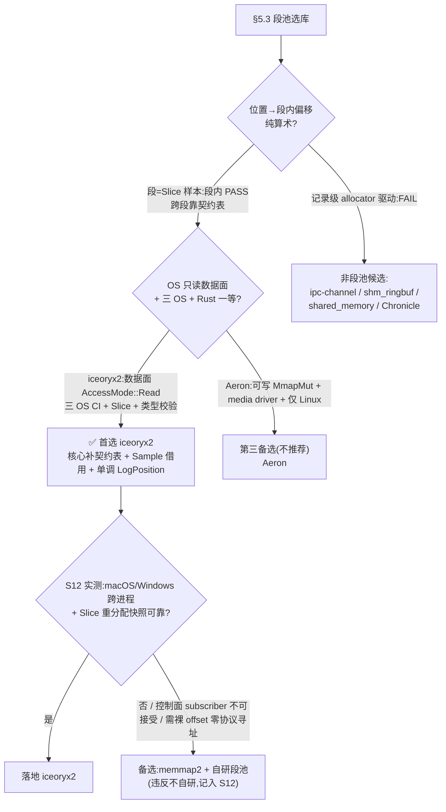

# fp-08 类型化共享内存段池选库（§5.3 / D12 / S12）

> 目的：为 UTA 核心设计 §5.3「类型化共享内存段池」在现成库中定选（**不自研**，D12/维护者约束）。逐库一手核对能否承载 §5.3 的存储模型，产出可直接决策的对比。
> 证据纪律：论断标 **[OBSERVED]**（源码 / 官方文档 / 运行结果直接证明）/ **[INFERRED]**（从 API/实现推导）/ **[UNKNOWN]**（无证据；写「未找到」）。行号均相对来源清单（§8）的 pinned commit。crates.io/docs.rs 的 URL 抓取在本环境被禁，凡未 clone 的库（Chronicle）以官方 web 文档为据并显式标注、不作主要依据。
> 分工：iceoryx2 深挖（含本机 macOS 实测）由主笔核对，三个 task:high 子代理分轨调查（iceoryx 家族 / Rust 原生 crate / 替代抽象），横向表、§5.3 逐条对照与推荐由主笔裁定。

---

## 1. 摘要（≤10 行）

**首选 `iceoryx2`；最大风险：它不提供「流内全局 位置→偏移 纯算术」，段槽由 `PoolAllocator` 自由列表选取，§5.3 的「地址即位置」只在「段 = 一个 `Slice<Record>` 样本」粒度成立（段内算术 + 核心侧契约表跨段），且无 per-slot generation，裸 offset 复用会 ABA。**

- iceoryx2 在其余维度全面达标：Rust 一等纯 Rust 核、三 OS（CI `sdk-stable-debug` 三 OS × {stable,1.89.0} 跑全量 nextest）、`repr(C)` 定长类型校验（`TypeDetail` name/size/align + `unsafe trait ZeroCopySend`）、定长 + `Slice<T>`、单写多读广播、payload **数据面 OS 只读映射**（`AccessMode::Read`）、history/ring 深度可配、借用生命周期由 chunk refcount 簿记、库替核心做三 OS 映射与生命周期。本机 macOS 实测 build + 跨进程 pub/sub + Slice 连续性全部通过。
- 「地址即位置」按 §5.3 的**段=定长数组样本**语义读即成立（`Sample<[T]>` Deref 到连续 `&[T]`，段内 `base+i*stride`；跨段由 §5.3 早已规定的**契约表**承载）。iceoryx2 的样本队列（传递 `PointerOffset`）恰是契约表的天然底座。
- 唯一在源码层证明「position→offset 纯位运算」的候选是 **Aeron**（`term_offset = position & (term_len-1)`），但它数据面是可写 `MmapMut`（非 OS 只读）、必须 C media driver 控制面、变长 framing 需跟随 header、CI 仅 Linux、无类型 —— 综合劣于 iceoryx2。
- 唯一能满足「数据面 OS 只读 + 纯位置算术 + generation 防 ABA + 控制/数据面分离」全部前置的替代是 **memmap2 + 自研段池**，但它违反「不自研」，仅列为成本基线与触发式备选。
- 其余 Rust crate（shared_memory / shm_ringbuf / ipc-channel / raw_sync）与对照组（disruptor-rs 进程内、Arrow 同进程 FFI、Chronicle JVM 持久日志）均非「类型化跨进程段池」，详见 §4。

---

## 2. 范围与评估维度

### 2.1 §5.3 段池的硬需求（评判标尺）
1. `repr(C)` 无指针定长记录（flat, no-heap, fixed-size payload）；
2. **地址=位置**：段覆盖某流一个 `LogPosition` 区间，位置→段内偏移是纯算术（`base+(pos-seg_start)*stride`），窗口=若干段的有序列表，跨段经**契约表**（类型 id/布局 hash/段 id/流 id/位置范围/版本/写者）；
3. 单写者多读者；
4. 只读映射给独立进程（计算在独立进程、只读、故障域隔离，非 sandbox）；
5. history/ring 深度可配；
6. 段回收（ring 回绕/段满/替换）与「调用中借用」生命周期：借用未结束前地址内容不被复用，回收后旧位置明确失效、不 alias 新记录（避免 modulo wrap 的 ABA）；
7. 三 OS：macOS / Linux / Windows（官方声明 + CI 证据）；
8. Rust 一等支持。
段池是运行期快照、永不持久、50 ms 计算预算、值与 schema 分离、布局由组合子树推导导出（§5.3、D11/D12）。

### 2.2 先于评分的三个淘汰门（采纳 PlanReview）
把不同抽象层的库放进同一张 12 维表会制造虚假可比性，故先过三门；任一 fail 即标「非段池候选」，不靠其他维度加权补回：
- **G1 确定性编址**：给段描述 + stride + 位置，读者能否**不查索引 / 不 dequeue / 不调 allocator**，纯算术得记录地址？
- **G2 有序窗口**：能否把一组段解释为互不重叠、顺序明确的位置区间并**确定性遍历**（随机访问，非破坏性消费）？
- **G3 回收安全**：段/槽复用时旧借用是否仍有效，旧位置回收后是否 alias 新记录（防 modulo ABA，需 generation/epoch 或借用 pin）？
> 粒度分辨：若「段=单条记录」多半 allocator 驱动、G1 fail；若「段=一个定长数组样本 `Slice<Record>`」则段内算术成立、跨段走契约表。每库显式标其满足粒度。

### 2.3 12 个固定维度（每库一行，缺证据写「未找到」）
Rust 一等 ｜ 三 OS（声明 + CI 证据等级：仅编译 / 单测 / 跨进程集成）｜ 类型化 payload 与校验（name/size/align）｜ 定长/变长(Slice) ｜ 单写多读 ｜ 借用生命周期与回收 ｜ history/ring 深度 ｜ 位置→偏移算术 ｜ 跨进程只读映射（数据面 OS 只读 vs 控制面可写、是否物理分离、独立进程能否仅凭段描述 open）｜ 维护活跃度 ｜ 许可证 ｜ 已知痛点（作者原话）+ 并发发布内存一致性（publish-before-visible 的 happens-before）。

### 2.4 候选分类
- **A 数据面段池 / IPC 消息所有权**：iceoryx2、iceoryx C++ + iceoryx-rs、ipc-channel、shm_ringbuf、shared_memory。
- **B 位置索引 ring / 日志（对照）**：Aeron(aeron-rs)、disruptor-rs、Chronicle Queue。
- **C 映射 / 同步原语与自研基线**：memmap2、raw_sync。
- **D 类型 / 布局构件（导出布局校验器，非段池）**：zerocopy、bytemuck、rkyv。
- **E 列式交换格式（对照）**：Apache Arrow(arrow-rs) + C Data Interface。

---

## 3. 首选深挖：iceoryx2（`aec1ed8`，v0.9.999-dev，MIT OR Apache-2.0）

### 3.1 三门结论
| 门 | 结论 | 关键 pinned 证据 |
|---|---|---|
| **G1 确定性编址** | **跨记录 FAIL / `Slice` 段内 PASS** | 分配走 lock-free 自由列表：`iceoryx2-bb/memory/src/pool_allocator.rs:214` `buckets.acquire_raw_index()`，offset=`v*bucket_size`（`:216-220`）；`iceoryx2-bb/lock-free/src/mpmc/unique_index_set.rs:389-429` LIFO 出栈。段内连续：`iceoryx2/src/sample.rs:113-125` `slice_from_raw_parts` → `&[T]`，stride=`align(payload.size,align)`（`message_type_details.rs:200-212`）。读者算术翻译：`data_segment.rs:294-311` `offset.offset()+payload_start_address()`。 |
| **G2 有序窗口** | **FAIL（无位置区间/契约表概念）** | 样本以 FIFO 队列逐条传递（`port/details/sender.rs:246/271` 推 `chunk.offset()`；`safely_overflowing_index_queue.rs`）；`history` 是发布侧回放队列（`port/publisher.rs:206`），非按 `LogPosition` 排序的可随机访问窗口。 |
| **G3 回收安全** | **借用期内安全 / 释放后裸 offset 会 alias（无 per-slot generation）** | 借用期保护：`sender.rs:547-553` `release_chunk` 仅 refcount `1→0` 才 `deallocate_bucket`；`segment_state.rs:20-23` 仅 `chunk_reference_counter: Vec<AtomicU64>`，**无 generation**；自由列表复用同一 index（`unique_index_set.rs:404/452/464`，`aba` 计数仅护 head CAS）。 |

**裁定**：iceoryx2 不提供「流内全局位置→偏移算术」，但满足 §5.3 实际指定的**段=定长数组样本**粒度：`Sample<[T]>` 内部是连续 `repr(C)` 数组、段内寻址纯算术；跨段由 §5.3 本就要求的**契约表**承载（iceoryx2 的 `PointerOffset` 样本队列即其底座）。G3 的 ABA 只在「核心绕过 Sample 句柄、缓存裸 offset 直接寻址」时发生；只要核心经 `Sample` 借用（持有即 refcount>0，chunk 不回收）访问、并以单调 `LogPosition` + 契约表版本标定段，借用期内安全。

### 3.2 G1 全链路源码追踪 [OBSERVED]
发布侧：`publisher.rs:855 loan_slice(n)` / `:909 loan_slice_uninit(n)` → `:919 impl` → `:654-661 loan_chunk` = `sender.allocate(chunk_layout(slice_len))`（`chunk_layout` = header + `align(payload.size,align)*n`，`message_type_details.rs:200-212`，即 n 个等 stride 元素连续数组）→ `sender.rs:472/482 data_segment.allocate` → `data_segment.rs:169` → `iceoryx2-cal/src/shm_allocator/pool_allocator.rs:82-97`（`:94-96 PointerOffset::new(chunk_ptr-start_address)`，offset=相对段起始字节距离）→ `iceoryx2-bb/memory/src/pool_allocator.rs:214 acquire_raw_index()`（bucket 由自由列表栈顶决定，非位置推导）。
读者侧：subscriber 从连接队列收 `PointerOffset`（`sender.rs:246/271`），地址翻译 `data_segment.rs:299` Static 段 `offset.offset()+payload_start_address()`（纯加法）；`segment_state.rs:46-49 chunk_index(distance)=distance/payload_size()` 佐证 offset 恒为 bucket_size 整数倍。`sample.rs:113-125` slice Deref = `slice_from_raw_parts(payload_ptr, n)`，第 i 元素 = `payload_ptr+i*stride`。

**本机 macOS 实测**（`/tmp/fp08-seg/track1-priv/slice_exp`，rc=0）[OBSERVED]：发布 `Sample<[u64]>`（8 元素），`PUB base=0x100d840b8`、`elem[i]==base+i*8`（8/8 命中）；两个独立 subscriber 各自 `receive()` 到 `SUB_A base=0x100d8c0b8`/`SUB_B base=0x100d940b8`（**虚拟基址各异** → relocatable `PointerOffset`），内容逐元素相同。含义：iceoryx2 用「本地 base + 位置无关 offset」还原到同一物理字节，base 每映射者私有、offset 由控制面携带，**非由 `LogPosition` 推导**。

### 3.3 类型化 payload 与校验 [OBSERVED]
`message_type_details.rs:71-77 TypeDetail{variant,type_name,size,alignment}`，`:82-97 new::<T>` 用 `size_of/align_of` 填 size/align、`type_name` 取 `ZeroCopySend::type_name()`；`TypeVariant`（`:41-62`）区分 `FixedSize`（doc:「self-contained structs（without pointer members or heap-usages）」）与 `Dynamic`（slice）。open 时校验：`service/builder/publish_subscribe.rs:513-517 is_compatible_to`，不兼容 → `IncompatibleTypes`（`:58/115/142`）；`message_type_details.rs:214-224` 逐字段比较 payload 的 `type_name==`、`variant==`、`size==`、`alignment<=`。payload 必须 `unsafe trait ZeroCopySend`（`iceoryx2-bb/elementary-traits/src/zero_copy_send.rs:35`），safety 契约（`:20-33`）要求 self-contained、无 pointer/reference/fd、`repr(C)`；derive 经 `__is_zero_copy_send`（`:47-50`）编译期确保所有字段 impl。
**两处需自证的语义**：① 默认 `type_name()`=`core::any::type_name`（`:43-45`，Rust 内部字符串，跨语言须覆写；仅比 size/align/name，**不比字段偏移**）；② derive 不校验 `repr(C)` 与无指针，由用户在 `unsafe` 下自证 → 见 §5.3 对照的补强建议（zerocopy/bytemuck 可作导出布局的编译期校验器）。

### 3.4 history / Slice / overflow / 回收 [OBSERVED]
- history=**每 publisher** 回放队列（`publisher.rs:206`，默认 0，`config.rs:355`）；late-join 时 `deliver_sample_history`（`:335-368`）重投最近 `min(history,buffer)` 条 → 「订阅即重放」，非可随机访问的 retained ring [INFERRED]。
- `subscriber_max_buffer_size`（默认 2，`config.rs:356`）= 订阅端 FIFO 深度；`history_size`/`subscriber_max_buffer_size`/`enable_safe_overflow`/`subscriber_max_borrowed_samples` builder 于 `publish_subscribe.rs:567/576/549/560`。
- Slice：`service/port_factory/publisher.rs:258 initial_max_slice_len`（默认 1）；`AllocationStrategy::Static` 下超限 `ExceedsMaxLoanSize`，非 Static 触发段动态扩容（`data_segment.rs:139-167`）。
- overflow：`enable_safe_overflow` 默认 true=覆盖最旧（`sender.rs:342-348 release_chunk(old)`）；关闭则按 `BackpressureStrategy`（默认 `RetryUntilDelivered`=阻塞 / `DiscardData`=丢弃）；非 safe-overflow 且 `buffer<history` 直接创建失败（`publish_subscribe.rs:736-739`）。
- 借用/回收：refcount 在**发布侧** `SegmentState.chunk_reference_counter`（`segment_state.rs:20-23`），`borrow_chunk`/`release_chunk`（`sender.rs:511-553`），`retrieve_returned_chunks`（`:522-541`）从连接回收订阅者已释放 offset。**无 per-slot generation**。
- 多 subscriber=**广播**（`sender.rs:402-444` 遍历连接逐个投递，每连接独立 SPSC 队列），实测两 sub 同收印证。

### 3.5 只读映射：数据面 vs 控制面 [OBSERVED+INFERRED]
- **数据面 payload 段：订阅者 OS 只读**：`data_segment.rs:261`（Static）/`:286`（Dynamic）`open(AccessMode::Read)` → `iceoryx2-bb/posix/src/shared_memory.rs:198` → `memory_mapping.rs:147/164 Read=PROT_READ` → `:440-444 mmap(prot=PROT_READ)`（Windows 侧 `PAGE_READONLY`，`iceoryx2-pal/posix/src/windows/constants.rs:50-52`）。发布侧以 ReadWrite 映射。→ 计算进程写不了 payload，故障域上写者无法经此破坏读者数据。
- **控制面（连接队列/refcount/游标）：订阅者需可写、物理独立段**：连接是独立命名段 `DynamicStorage<SharedManagementData>`（`iceoryx2-cal/src/zero_copy_connection/common.rs:47-51`），`dynamic_storage/posix_shared_memory.rs:439-441` 恒以 `AccessMode::ReadWrite` open。
- **§5.3 需求 4 判定**：payload 数据面**可**给独立进程只读映射 ✓；但要跑完整「接收」，独立进程仍须作为一个 subscriber port 加入 service（可写控制面 + 订阅协议）——「仅凭导出段描述符、只读 open 即零协议直接算术寻址」在现有 API 下**不成立**（读者是主动订阅方，`receiver.rs` 连接协议 + `DynamicStorage` 可写要求）[INFERRED]。故障域仍隔离：控制面是 iceoryx2 内部结构、非核心内存。

### 3.6 三 OS / PAL / CI 证据等级 [OBSERVED+INFERRED]
- 官方声明 `README.md:126/129/136`：Linux/macOS/Windows 均 `done` tier-2 CI（另 FreeBSD/QNX）。PAL：`iceoryx2-pal/posix/src/{linux,macos,windows,freebsd,qnx}/` 各有实现，Windows 用 `windows_sys::Win32`。
- CI：`.github/workflows/build-test.yml:382 sdk-stable-debug` matrix `os:[ubuntu-latest,macos-latest,windows-latest] × toolchain:[stable,1.89.0]`（+`ubuntu-24.04-arm`），经 `reuse_stable.yml` 跑 `just build sdk`(--all-targets) + `cargo nextest`(--all-targets --no-fail-fast)。同 matrix 见 `:157/167/190/210/399/449`。
- **等级评定**：三 OS 均跑 nextest 全量单测 + 单进程多 port 集成；**真正跨独立进程/跨主机**证据来自 gateway `host-to-host-tests`（docker-compose，**仅 Linux**）→ macOS/Windows 的跨独立进程运行时证据弱于 Linux [INFERRED]。本机 macOS 实测跨进程 pub/sub 成功可补一分 macOS 证据。

### 3.7 unsafe / benchmark / 内存一致性 / 痛点 [OBSERVED]
- unsafe：`iceoryx2/src`=657，全仓库=8561；关键 unsafe=共享内存裸指针解引用/`slice_from_raw_parts`（`sample.rs`）、自由列表 `UnsafeCell`、`unsafe impl ZeroCopySend/Send/Sync`、`deallocate_bucket`。
- benchmark：`benchmarks/{event,publish-subscribe,queue,request-response}/` + `benchmarks/README.md`；README §Benchmark-System 附延迟/吞吐图（本文不复述数值，§5.3 明言 50 ms 预算下该层无需关心）。
- 内存一致性：连接队列 SPSC，发布 `safely_overflowing_index_queue.rs:346 store(Release)`、订阅 `:383 load(Acquire)` = publish-before-visible happens-before；refcount 用 `Relaxed`（仅计数）。
- 痛点（作者原话）：`FAQ.md:567-568`「Due to the decentralized nature of iceoryx2, and the fact that it does not use any background threads, the user must handle these edge cases explicitly.」（须显式 `update_connections()` 否则丢数据 `:559-575`）；`FAQ.md:579-582` slice 重分配后 sender 先退出会丢样本。
- 活跃度：pinned commit 2026-09-16（最新），多平台 CI + C/C++/C#/Python 绑定，**最活跃**。

### 3.8 iceoryx2 12 维汇总 [OBSERVED except noted]
1. **Rust 一等**：✅纯 Rust 核（`README.md:17`），C/C++/C#/Python 绑定。
2. **三 OS + CI 等级**：Linux/macOS/Windows 均 done；`build-test.yml:382` 三 OS × {stable,1.89.0} 跑 nextest 全量；跨独立进程/跨主机集成 CI 仅 Linux docker gateway，macOS/Windows 弱 [INFERRED]；本机 macOS 实测跨进程 pub/sub + Slice 连续性通过。
3. **类型化校验(name/size/align)**：✅`TypeDetail{variant,type_name,size,alignment}`（`message_type_details.rs:72-77`）+ open 时 `is_compatible_to`（`:214-224`）；`unsafe trait ZeroCopySend`（`zero_copy_send.rs:35`）；限制：默认 `type_name`=`core::any::type_name`、只比 name/size/align 不比字段偏移。
4. **定长/变长(Slice)**：✅`FixedSize` + `Slice<T>`（`TypeVariant`，`loan_slice`/`initial_max_slice_len`）。
5. **单写多读**：✅单 publisher 广播多 subscriber（`sender.rs:402-444`），实测两 sub 同收。
6. **借用生命周期/回收**：refcount（`segment_state.rs:20-23`），`release_chunk` 降 0 才归还（`sender.rs:547-553`）；**无 per-slot generation**。
7. **history/ring 深度**：✅可配（`history_size` 每 publisher 回放、`subscriber_max_buffer_size`、`max_borrowed_samples`、overflow=覆盖/阻塞/丢弃/扩容）；history 是回放队列非随机访问。
8. **位置→偏移算术**：`Slice` 段内 `base+i*stride`✅ / 跨样本 offset 由自由列表决定❌。
9. **跨进程只读映射**：payload 数据面 `AccessMode::Read`（OS 只读，`data_segment.rs:261/286`）✅；控制面连接段 ReadWrite 物理独立，计算进程须作可写控制面 subscriber。
10. **维护活跃度**：高（2026-09-16，多平台 CI + 多语言绑定）。
11. **许可证**：MIT OR Apache-2.0。
12. **痛点 + 内存一致性**：须显式 `update_connections`（`FAQ.md:567`）、slice 重分配 sender 先退出丢样本（`FAQ.md:579`）；连接队列 release/acquire happens-before（`safely_overflowing_index_queue.rs:346/383`）。

### 3.9 iceoryx2 → §5.3 段池的落地映射（决策相关）
把 iceoryx2 的原语对齐到 §5.3 的三处概念，可见「首选」是把库当**数据面 + 三 OS 映射 + 生命周期簿记**，核心补一层薄契约表：
- **段** = 一个 `Sample<Slice<Record>>`（一块连续 `repr(C)` 定长数组 chunk）；段内 `base+i*stride` 算术、`Sample<[T]>` Deref 到 `&[T]`。
- **契约表**（§5.3 已规定：类型 id/布局 hash/段 id/流 id/位置范围/版本/写者）= 核心维护的 `LogPosition 区间 → (service, sample handle)` 映射；iceoryx2 的 `PointerOffset` 样本队列是其底座，核心据此把无序 allocator offset 归一到有序 `LogPosition` 区间。
- **窗口** = 核心持有的一组 `Sample` 借用的有序列表；持有即 refcount>0，chunk 不被回收（借用期安全）。
- **回收** = ring 深度/overflow 由 iceoryx2 配置；回收后旧 `LogPosition` 由核心据契约表版本判 `BeyondRetention`（§5.3），核心不缓存裸 offset 跨释放复用即规避 ABA。
- **只读故障域** = payload 段 `AccessMode::Read`，计算进程写不了核心内存（D11：安装即授权、非 sandbox）。

---

## 4. 逐库分析（其余候选）

### 4.A2 iceoryx C++ 一代 + iceoryx-rs（`61f740c`，v0.1.0，Apache-2.0）[OBSERVED]
薄绑定 Eclipse iceoryx C++ **v2.0.3**（`iceoryx-sys/build.rs:16` cmake hoofs+posh；内含 `v2.0.3.tar.gz`）；通信前须起 **RouDi** 中心 daemon（去中心化的反面）。仅 pub-sub，缺 user-header/req-resp/WaitSet/ServiceDiscovery。CI `rust.yml` matrix `os:[ubuntu-latest,macOS-latest] #Todo add windows-latest` → **仅 Linux/macOS，Windows 未支持**。最近 commit 2024-04-22 停滞。被 iceoryx2「纯 Rust 核 + 去中心化」重写取代（`iceoryx2 FAQ.md:567`、`README.md:17`）。淘汰门（对照，均 INFERRED，未同等深挖 C++ 源码）：chunk-pool + RouDi 分配 → G1 跨记录 FAIL、G2 FAIL、G3 借用期安全/回收后 alias（同 iceoryx2 构造）。**结论：Rust 支持是 WIP 薄绑定、需中心 daemon、无 Windows、已停滞 —— 仅确认 lineage，不入选。**

**12 维（iceoryx-rs）** [OBSERVED except noted]：Rust 一等=⚠️薄绑定核心为 C++；三 OS+CI=仅 Linux/macOS，Windows TODO（`rust.yml`），等级=编译+单测（依赖 RouDi）；类型化校验=C++ posh 按 type name 校验，Rust 层未找到独立校验源码（未找到/[UNKNOWN]）；定长/变长=定长 typed topic，slice 未找到（[UNKNOWN]）；单写多读=pub-sub 1:n 广播[INFERRED]；借用/回收=C++ chunk header refcount，无位置级 generation[INFERRED]；history/ring=C++ 有 subscriber queue+publisher history，绑定层配置未找到（[UNKNOWN]）；位置→偏移算术=跨记录非算术（中心内存池）[INFERRED]；跨进程只读映射=经 RouDi+posh，只读/控制面分离细节未找到（[UNKNOWN]）；维护活跃度=低（2024-04-22 停滞，v0.1.0 WIP）；许可证=Apache-2.0；痛点（原话）=`README.md:31-33`「The Rust bindings are a work in progress and currently support only the pub-sub messaging pattern.」+ 依赖 RouDi 中心 daemon；内存一致性=绑定层未找到（[UNKNOWN]）。

### 4.A3 ipc-channel（`v0.23.0`，MIT OR Apache-2.0）[OBSERVED]
Rust channel 的多进程传输替代品；`IpcSharedMemory` Deref→`[u8]`（`ipc.rs:547-575`），随消息传一段 shm blob。G1 FAIL（仅 `[u8]`，blob 绑消息传递无常驻位置区间）/ G2 FAIL（FIFO 消息非位置区间集）/ G3 FAIL（region 级分配释放，无 ring）。数据面**非 OS 只读**（Windows `MapViewOfFile(...,FILE_MAP_ALL_ACCESS,...)`，`platform/windows/mod.rs:2023`），handle 经 pipe/socket 传递，独立进程不能仅凭段描述 open。**CI 是全组最强之一**：`main.yml:42-72` 三 OS（mac arm+intel / linux / windows msvc x64+i686）全 `cargo test` 含跨进程 fork/spawn 集成。痛点（原话）：Windows 大小上限「we can fix this just by upping the header to be 2x u64 if we really want to.」（`windows/mod.rs:1395-1397` + `assert!(len<=u32::MAX)`）。**结论：传输构件，非段池；无类型、无位置寻址、数据面可写 —— 不入选。**

### 4.A4 shm_ringbuf（crate `shm-ringbuf`，`cde847e`，v0.1.0，Apache-2.0）[OBSERVED]
共享内存**变长字节 IPC 队列**（灵感自 linux bpf ringbuf），多 producer（各自 memfd）→ 单 consumer，控制面走 gRPC/UDS + fd passing。`DataBlock<T>` 的 T 是 DropGuard 非 payload（`ringbuf.rs:232`），payload 是裸字节。G1 FAIL（consume_offset dequeue + `%data_part_len` 回绕，`ringbuf.rs:275-290,357-381`）/ G2 FAIL（破坏性消费，无随机访问历史）/ G3 部分弱（满时背压 `NotEnoughSpace` 不覆盖，`ringbuf.rs:246-253`；但 `DropGuard` 只守 mmap 不守槽，借用跨消费点可 alias）。数据面 `PROT_READ|PROT_WRITE` 双方可写；独立进程须经 gRPC 握手 + UDS fd 传递取 memfd，不能仅凭段描述 open。CI **仅 ubuntu-20.04**；Windows 因 nix/passfd/memfd 判定不支持。**结论：字节队列 + 重异步栈（tokio/tonic），非类型化定长段池 —— 不入选。**

### 4.A5 shared_memory（elast0ny，`fda4134`，MIT OR Apache-2.0）[OBSERVED]
OS 共享内存映射的**极薄封装**，数据面只暴露 `as_ptr()->*mut u8` / `as_slice()`（`lib.rs:262-277`），同步交给姊妹库 raw_sync。G1/G2/G3 全部落在自研层（无类型/ring/位置/同步）；生命周期仅到映射粒度（`Drop`/`set_owner`，`lib.rs:240-249`）。独立进程仅凭 os_id 即可 `open()`（`lib.rs:187-189`），但公开 API 无「以 PROT_READ 打开」显式开关（只读性 [UNKNOWN]，未在 lib.rs 层证明）。CI 三 OS 单测（跨线程语义，非多进程）。最近 commit 2023-01-30，依赖偏旧。痛点（原话）：`as_slice` doc「it is impossible to ensure the range of bytes is immutable」——把并发/可见性全推给使用者。**结论：命名跨进程字节段底座，非段池 —— 若走自研路线可作 mmap 层构件（与 memmap2 竞争，memmap2 有显式只读 API 更优）。**

### 4.B1 Aeron / aeron-rs（`66b8f25`，v0.1.8，Apache-2.0）—— 全报告唯一源码级证明「位置=算术地址」[OBSERVED]
可靠有序消息传输（UDP + IPC shm），数据面**无类型变长 frame**。log buffer=固定 3 个 term partition（`log_buffer_descriptor.rs:30 PARTITION_COUNT=3`），绝对 position 经纯位运算映射到 (partition, term_offset)：`image.rs:311 term_offset=position & term_length_mask`、`log_buffer_descriptor.rs:253-254 index_by_position=(position>>bits)%3`，与 §5.3 公式**逐字一致**；逆映射 `compute_position`（`:257-261`）纯算术互逆；同一模式在 `image.rs:355/423/511/680` 各 poll 变体重复，无查表/链表。
**但仍不给完整 G1**（三点 gap）：① 变长 frame + 逐帧 header 跟随——reader 必须读 `frame_length_volatile`（`image.rs:367`）并跳 padding frame（`:376`），position 定位的是 frame 边界非定长 stride；② term 边界 padding 破坏全局定 stride（`n*stride` 仅单 term 内成立，跨 term FAIL）；③ 3-term 轮转，物理内存复用，安全靠 flow-control + reader 校验 `term_id`，非算术保证。G2 PARTIAL（有序但窗口锁死 3 term、深度不可配；更深需 aeron-archive 持久化，违「永不持久」）。G3 PARTIAL（position 单调 i64 免逻辑 ABA=§5.3 想要的性质；但无读侧 borrow/reclaim 簿记，fragment_handler 借用仅 call-scoped，`image.rs:382-386`）。
**关键反证**：数据面映射**始终是可写 `MmapMut`**（`memory_mapped_file.rs:43,60`；`from_file_handle` 的 `_read_only` 参数被忽略 `:96`）——非 OS 只读；且需 **C media driver**（`aeronmd`）经 CnC 发布 image 元数据才能 open 段（`README.md:19-21,36-37`），控制面不可绕过。CI **仅 Linux**（`main.yml:15 os:[ubuntu] # linux-only`），无类型 payload。第三方 fork（UnitedTraders），活跃度中偏低。**采用要改 §5.3**：放弃数据面 OS 只读（或自改 mmap 只读）、接受 media driver 控制面进程、自建类型层、接受 framing 而非纯 stride、窗口深度锁 3 term。**结论：抽象最接近但工程代价高、故障域更差 —— 不推荐，仅作「位置=算术」模型的正例参照。**

### 4.B2 disruptor-rs（`08b4691`，v4.4.0，MIT）—— 证实「进程内、不跨进程」[OBSERVED]
`README.md:8` 逐字「low latency, **inter-thread** communication library」。存储=进程堆 `Box<[UnsafeCell<E>]>`（`ringbuffer.rs:8-11`），无 mmap/shm；处理器 state 可持 `Rc<RefCell>`（非 Send/Sync）。位置→slot=`sequence & (size-1)`（`ringbuffer.rs:46-50`，index_mask=size-1）纯算术但返回**本进程堆指针 `*mut E`**。G1 进程内 PASS / §5.3 跨进程 N/A；G2 进程内有序、跨段窗口 N/A；G3 消费者反压 gating（`free_slots`，`ringbuffer.rs:38-41`），物理 slot modulo 复用、无长借用簿记、跨进程失效。CI 仅 ubuntu。**结论：进程内线程间环，非共享内存段池 —— 只可借鉴「sequence&mask 编址」「消费者进度反压回收」两个设计思想。**

**12 维（disruptor-rs）** [OBSERVED]：Rust 一等=✅纯 Rust；三 OS+CI=仅 ubuntu（`build_and_test.yml:14,24` build+Miri），无 mac/Win（跨 OS 未验证）；类型化校验=定长泛型 `E`，无跨进程 type/size/align 校验；定长/变长=定长 `E`（`Sized`）；单写多读=多 producer（CAS）+ 多 consumer，均**进程内线程**；借用/回收=EventPoller guard scope-scoped，物理 slot modulo 复用无长借用簿记；history/ring=单 ring size（`Box<[UnsafeCell<E>]>`），非可配多段窗口；位置→偏移算术=`sequence & (size-1)` 进程内✅/跨进程 N/A；跨进程只读映射=❌堆内存不跨进程；维护活跃度=高（v4.4.0，2026-08-08）；许可证=MIT；痛点+一致性=inter-thread（README:8），非跨进程；sequence Acq/Rel gating 进程内 happens-before。

### 4.B3 Chronicle Queue（OpenHFT，JVM，未 clone）[web，非主要依据]
Java-native mmap **持久** 日志（`.cq4`），付费闭源 Rust 绑定（需 `CHRONICLE_KEY`）。逻辑 index（cycle+seq）→ 物理 byte offset 走 **tiered index 分层索引查表**（G1 FAIL，违「不查索引」）；append-only 持久、不回收（违「运行期快照、永不持久」）；Rust 一等只靠付费绑定。三条全反 §5.3。**结论：仅作「位置索引 mmap 持久日志」模型对照，不入选。**

**12 维（Chronicle Queue）** [web，非主要依据]：Rust 一等=❌仅付费闭源绑定（需 `CHRONICLE_KEY`）；三 OS+CI=JVM 跨平台，Rust 绑定 CI 未核（[UNKNOWN]）；类型化校验=应用自定（Java 序列化），无 §5.3 式 type/size/align（[web]）；定长/变长=变长 excerpt；单写多读=单写多读 tailer；借用/回收=append-only 持久不回收；history/ring=持久无界（可 roll-cycle），非运行期 ring；位置→偏移算术=❌tiered index 查表；跨进程只读映射=mmap 可跨进程读，但持久语义；维护活跃度=高（OpenHFT 活跃）；许可证=开源核心 Apache-2.0 + 商业企业版，Rust 绑定商业授权；痛点=JVM + 持久 + 付费 Rust，三条反 §5.3（Rust 一等/永不持久/纯算术编址）。

### 4.E Apache Arrow(arrow-rs) + C Data Interface（`8e51752`，Apache-2.0）[OBSERVED]
列式（SoA）内存格式 + 跨语言运行时零拷贝交换。`FFI_ArrowArray`（`arrow-data/src/ffi.rs:39-67`）含 `buffers: *mut *const c_void`（`:53`）、`children`/`dictionary` 裸指针、生产者 `release` 回调（`:59`）——**进程本地裸指针跨进程不可移植**（G1 跨进程 FAIL；同进程连续 primitive buffer 上 `base+i*width` OK）。G2 N/A（无位置区间/段模型）；G3=release 回调 + refcount 所有权，跨进程无法执行生产者 release。变长类型用 offset buffer（间接，与「无指针定长」冲突）；行 vs 列语义与 §5.3 的 AoS `repr(C)` record 相反。**定位**：非数据面段池；`FFI_ArrowSchema` 的 format 字符串（`arrow-schema/src/ffi.rs:79`）是**可跨进程移植的类型/布局描述**，可作 §5.3 契约表「布局描述」的导出面候选，与 iceoryx2 分工（数据面 vs 导出面），非竞争。高活跃。

**12 维（arrow-rs C Data Interface）** [OBSERVED except noted]：Rust 一等=✅Apache 官方；三 OS+CI=Apache 项目全平台 CI（作交换格式，非跨进程段池路径）；类型化校验=✅`FFI_ArrowSchema` format 字符串描述类型（可移植），值合法性由 Arrow 规范；定长/变长=定长 primitive 列无 offset buffer；变长(Utf8/List)用 offset buffer 间接（与无指针定长冲突）；单写多读=不适用（一次性 RecordBatch 快照）；借用/回收=`release` 回调 + refcount 所有权（跨进程不可执行）；history/ring=无（无位置区间/段模型）；位置→偏移算术=同进程连续 buffer `base+i*width`✅/跨进程❌（裸指针）；跨进程只读映射=❌C Data Interface 同进程 FFI，跨进程须 Arrow IPC 序列化；维护活跃度=高（2026-09-16）；许可证=Apache-2.0[INFERRED]；痛点+定位=非数据面段池，仅作布局/schema 导出面与 iceoryx2 分工。

### 4.C/D 构件层（非段池，不作 12 维完整评分）

**memmap2（`a02e2a4`，MIT/Apache）—— 自研成本基线，不参与推荐** [OBSERVED]：纯跨平台 mmap，提供 `Mmap`(只读 Deref→`[u8]`)、`MmapMut`、以及**数据面 OS 只读的现成能力** `map()`/`make_read_only()`（`lib.rs:469,1435-1438`）——这是相对 shared_memory 的关键优势。CI 覆盖极广、全 `cargo test --all-features`（三 OS + 多目标，**最强**）。但「命名/共享段生命周期、定长布局 + 类型校验、段=Slice 位置算术、单写多读 seqlock、ring 回收 + generation 防 ABA、借用簿记、控制/数据面物理分离、publish-before-visible」**全须自写**（成本清单见 §7 触发条件）；memmap2 只免除「跨平台 mmap + OS 只读开关」约 5–10%。

**raw_sync（`f1c7666`，MIT/Apache）** [OBSERVED]：跨进程同步原语薄封装（Mutex/Event/BusyEvent），**无 seqlock**；`RwLock` **Windows 不支持**（`README.md:17`）。G1/G2/G3 N/A。CI 三 OS **仅编译**（无 test）。同步字节须放**可写控制面**（正是 §5.3 控制/数据面分离的理由）。最近 commit 2021-11-12。作自研 seqlock 构件不足（须自写 seqlock）。

**12 维（raw_sync）** [OBSERVED]：Rust 一等=✅；三 OS+CI=unix+windows 声明，CI 三 OS **仅编译**（`rust.yml:42-46` 无 test），**RwLock 无 Windows**（`README.md:17`）；类型化/定长/位置/history=N/A（同步原语）；单写多读=`RwLock`(unix/mac) 但 Windows 缺，无 seqlock；借用/回收=`LockGuard`/`ReadLockGuard` RAII 锁级；跨进程只读映射=N/A——同步字节须可写，故须放**可写控制面**（正是控制/数据面分离理由）；维护活跃度=低（2021-11-12，依赖陈旧）；许可证=MIT OR Apache-2.0；痛点=RwLock 无 Windows、EventFd TODO、CI 不跑测试；一致性=由底层 pthread/Win 原语提供，不额外声明。

**zerocopy（`4fbb0b6`）/ bytemuck（`ea36161`）/ rkyv（`4845668`）—— 导出布局校验器** [OBSERVED]：
- **zerocopy** `#[derive(FromBytes,IntoBytes,Immutable(,KnownLayout))]` 联合可编译期把记录约束为：无 padding 确定布局（≈`repr(C)`，`IntoBytes` derive 强制）+ 无 Rust 指针/引用字段（`FromBytes`/`IntoBytes` 对裸指针不实现，`impls.rs:951-954` NOTE#170，「无指针」是字段约束传递结果）+ 无内部可变（`Immutable` 禁 `UnsafeCell`）。未覆盖：字节序、跨架构 `usize` 宽度、layout-hash、`usize` 是否为外部句柄；`KnownLayout`/`Immutable` doc 明言对 crate 外「不提供安全保证」（`lib.rs:738`）。
- **bytemuck** `#[derive(Pod,Zeroable)] #[repr(C)]` 单 trait 最贴合 §5.3 prose（`pod.rs:15-37` 显式禁指针/内部可变 + 强制 `repr(C)`/transparent + 无 padding + `Copy`+`'static`）；缺 slice-DST（只定长，变长 `Slice<Record>` 须自建或改 zerocopy）。陷阱：endian-dependent、`unsound_ptr_pod_impl` feature 可让 `*mut T:Pod`、手写 `unsafe impl` 可绕过。
- **rkyv** 非拒绝式校验器，不适：对 `Vec`/`Box` 照样成功 archive（生成 `RelPtr` 自相对 offset，`rel_ptr.rs:194-220`），不编译期拒绝含指针/变长类型；仅纯 POD root 退化为定长（此时增益仅剩强制 LE，与 bytemuck/zerocopy 重叠）。
- **与 iceoryx2 `ZeroCopySend` 配合**：`ZeroCopySend`（`unsafe trait`）derive 只查「字段递归 impl」，**不校验 `repr(C)` 也不校验无指针**（由用户 `unsafe` 自证），且接纳 `bool`/`char`。zerocopy/bytemuck 恰好提供这些编译期检查，可用 newtype + `where T: Pod`（或 `IntoBytes+FromBytes+Immutable`）在断言 `ZeroCopySend` 前先过校验，把散文义务转成编译期保证。**但**：无自动桥接（仍须显式 impl）；`usize` 外部句柄语义无 crate 能查；跨端/跨语言 layout-hash 不覆盖。三者**只解决 payload admissibility，不触及 G1/G2/G3**。

---

## 5. 横向对比表

### 5.1 三门 + 跨进程 + 数据模型
| 库 | G1 编址 | G2 有序窗口 | G3 回收安全 | 跨进程 | 数据模型 | 一句话定位 |
|---|---|---|---|---|---|---|
| **iceoryx2** | 跨记录 FAIL / `Slice` 段内 PASS | FAIL（无位置区间，有 FIFO+回放 history） | 借用期安全 / 裸 offset 释放后 alias（无 generation） | 是（数据面 OS 只读 + 可写控制面订阅协议） | 定长/`Slice<T>` repr(C) 样本 | **首选**；段=Slice 样本时段内算术成立，跨段靠核心契约表 |
| iceoryx1+iceoryx-rs | 跨记录 FAIL[INF] | FAIL[INF] | 借用安全/回收 alias[INF] | 是（需 RouDi） | 定长 typed topic | WIP 薄绑定、需 daemon、无 Windows、停滞 |
| ipc-channel | FAIL | FAIL | FAIL | 是（handle 经 pipe 传） | `[u8]` blob 随消息 | 传输构件，数据面可写、无类型 |
| shm_ringbuf | FAIL | FAIL | 部分弱 | 是（gRPC+UDS fd） | 变长字节 FIFO | 字节队列 + 重异步栈 |
| shared_memory | 自研层 | 自研层 | 自研层 | 是（os_id open） | `*mut u8` 命名段 | 字节段底座，只读性未证 |
| **aeron-rs** | PARTIAL（位运算成立，framing 拖累） | PARTIAL（锁 3 term） | PARTIAL（position 免 ABA，无 borrow 簿记） | 是（需 C media driver，MmapMut 可写） | 无类型变长 frame | 唯一源码级「位置=算术」，但可写映射/driver/framing |
| disruptor-rs | 进程内 PASS / §5.3 N/A | 进程内 / N/A | 进程内 gating / 跨进程失效 | 否（堆内存） | 进程内定长 `E` 环 | inter-thread，非跨进程 |
| Chronicle | FAIL[web] | PARTIAL[web] | N/A（持久不回收） | 是（mmap 持久） | 持久 mmap 日志 | JVM + 持久 + 付费 Rust，三条反 §5.3 |
| arrow-rs C Data | 跨进程 FAIL（裸指针） | N/A | N/A | 否（同进程 FFI） | 列式 SoA | 布局/schema 导出面，非数据面 |
| memmap2（基线） | 自研层 | 自研层 | 自研层 | 是 | `[u8]` + OS 只读开关 | 自研段池 mmap 层（有显式只读 API） |
| raw_sync | N/A | N/A | N/A | 是 | 同步原语 | 控制面锁；无 seqlock，RwLock 无 Windows |
| zerocopy/bytemuck | — | — | — | — | 布局校验器 | 导出布局的编译期无指针定长校验 |
| rkyv | — | — | — | — | zero-copy 序列化 | 非拒绝式校验器，含 RelPtr，不适 |

### 5.2 12 维（完整候选）
| 维度 | iceoryx2 | ipc-channel | shm_ringbuf | shared_memory | aeron-rs | memmap2(基线) |
|---|---|---|---|---|---|---|
| Rust 一等 | ✅纯 Rust 核 | ✅ | ✅（重 tokio/tonic） | ✅ | ⚠️仅 client | ✅ |
| 三 OS + CI 等级 | 三 OS×2 toolchain nextest 全量（跨独立进程仅 Linux docker） | **三 OS 全 test + 跨进程集成** | **仅 Linux**；Win 不支持 | 三 OS 单测（跨线程） | **仅 Linux** | 三 OS+多目标全 test（最强） |
| 类型化校验(name/size/align) | ✅`TypeDetail`+`ZeroCopySend`（不比字段偏移） | ❌`[u8]` | ❌（仅 CRC32） | ❌`[u8]` | ❌无类型 | ❌`[u8]` |
| 定长/变长(Slice) | ✅FixedSize + `Slice<T>` | 变长 blob（Win≤u32) | 变长字节块 | 单段字节 | 变长 frame | 无（`[u8]`) |
| 单写多读 | ✅广播 | 无角色 | SPSC/MPSC 汇聚 | 无角色 | ✅Exclusive+多 Image | 无 |
| 借用生命周期/回收 | refcount，无 generation | region 级 | DropGuard 守 mmap 不守槽 | 映射级 | call-scoped，无簿记 | 无 |
| history/ring 深度 | ✅可配（每 publisher 回放 + 订阅 FIFO；覆盖/阻塞/丢弃/扩容） | 无（unbounded 队列） | 可配长度，消费即弃，背压 | 无 | 锁 3 term | 无 |
| 位置→偏移算术 | 段内✅/跨段❌ | ❌ | ❌ | 自算 | 位运算到 frame 边界 | 自算 |
| 跨进程只读映射 | ✅payload 只读 / 控制面可写订阅协议 | ❌可写，handle 传递 | ❌可写，gRPC+fd | 可跨进程，只读性[UNKNOWN] | ❌MmapMut 可写 + driver | ✅显式只读 API |
| 维护活跃度 | 高（2026-09-16） | 高（2026-09-01） | 新但早期（0.1.0） | 低（2023-01） | 中低（第三方 fork） | 高（2026-08） |
| 许可证 | MIT OR Apache-2.0 | MIT OR Apache-2.0 | Apache-2.0 | MIT OR Apache-2.0 | Apache-2.0 | MIT OR Apache-2.0 |
| 痛点 + 内存一致性 | 须显式 update_connections（FAQ:567）；release/acquire happens-before | Windows 大小/API 限制；handle 传递即 barrier | 消费即弃 + 重异步；游标 Acq/Rel | 并发全推给用户；无保证 | 可写映射 + driver 依赖；length ordered-store gating | mmap unsafe；无并发语义 |

---

## 6. 与 §5.3 前置条件的逐条对照

| §5.3 前置 | **iceoryx2（首选）** | **备选：memmap2 + 自研段池** |
|---|---|---|
| ① `repr(C)` 无指针定长记录 | ✅`TypeVariant::FixedSize` doc=「无指针无堆自包含结构」；`ZeroCopySend` 契约要求 self-contained/无指针/`repr(C)`（`zero_copy_send.rs:20-33`），derive 递归查字段。**建议**用 zerocopy/bytemuck 补强编译期无指针/无 padding 校验 | ⚠️须自写「布局即类型」校验器（可直接用 bytemuck `Pod`/zerocopy `IntoBytes+FromBytes+Immutable`） |
| ② 地址=位置：位置→段内偏移算术 + 窗口=段列表 + 跨段契约表 | ⚠️**部分**：`Sample<[T]>` 段内 `base+i*stride` ✅（`sample.rs:113-125`）；跨段 offset 由 PoolAllocator 决定 ❌，无原生契约表——**核心须自建契约表**（类型 id/布局 hash/段 id/流 id/位置范围/版本/写者，§5.3 本就规定），把 iceoryx2 的 Sample/`PointerOffset` 映射到 `LogPosition` 区间 | ✅可自实现严格 `base+(pos-seg_start)*stride`（无中间 allocator），契约表 + 段布局全自控 |
| ③ 单写者多读者 | ✅单 publisher 广播多 subscriber（`sender.rs:402-444`，实测两 sub 同收） | ⚠️须自写单写多读 seqlock（raw_sync 无 seqlock，须自写；状态字放可写控制面） |
| ④ 只读映射给独立进程、故障域隔离 | ⚠️数据面 payload OS 只读 ✅（`AccessMode::Read`，`data_segment.rs:261/286`）；但计算进程须作 subscriber（可写控制面 + 订阅协议），非「零协议只读附着」。故障域仍隔离（写不了 payload） | ✅数据面 `Mmap::map()` 只读，控制面独立段 `map_mut()`；独立进程可仅凭段名只读 open payload |
| ⑤ history/ring 深度可配 | ✅`history_size`/`subscriber_max_buffer_size`/`max_borrowed_samples`/overflow 策略可配（`publish_subscribe.rs:567/576/560/549`）；但 history 是回放队列非随机访问，窗口=核心持有多个 Sample 借用 | ⚠️须自写 ring 深度/回绕/替换策略 |
| ⑥ 段回收 + 借用生命周期（防 ABA） | ⚠️refcount 保证「持有 Sample 期间 chunk 不回收」（`sender.rs:547-553`）→ 借用期安全 ✅；但**无 per-slot generation**，核心不得缓存裸 offset 跨释放复用，须经 Sample 句柄 + 单调 `LogPosition` 标定 → 回收后旧位置由核心判 `BeyondRetention`（§5.3 已规定） | ✅可自实现单调 generation/epoch，回收后旧位置显式失效不 alias |
| ⑦ 三 OS（声明 + CI） | ✅Linux/macOS/Windows 均 done + `build-test.yml:382` 三 OS nextest 全量；**跨独立进程集成 CI 仅 Linux** → S12 须实测 macOS/Windows 跨进程（本机 macOS 已实测通过） | ✅memmap2 三 OS + 多目标全 test（最强）；但自研 seqlock/ring 的三 OS 正确性须自测 |
| ⑧ Rust 一等 | ✅纯 Rust 核 | ✅纯 Rust |
| 运行期快照、永不持久、值与 schema 分离 | ✅段池非持久（进程重启重洗入）；schema 在 `TypeDetail`/契约表、值在段 | ✅同（自控） |
| 库不自研映射/回收/簿记（D12） | ✅库替核心做三 OS 映射 + refcount 生命周期 + 类型校验 | ❌**违反「不自研」**——映射只读开关外全自研，须记入 S12 |

**对照结论**：iceoryx2 满足 ①③⑤⑦⑧ 与快照/schema 分离/不自研；②④⑥ 为「部分满足 + 核心侧补齐」——补齐项（契约表、经 Sample 句柄访问、单调 LogPosition 标定）§5.3 本就规定，属核心正常职责而非库缺陷。memmap2 自研路线在 ②④⑥ 更严格可控，但以违反 D12「不自研」为代价，仅在 iceoryx2 实测不满足时启用。

---

## 7. 推荐

**首选：`iceoryx2`（维持 §5.3 / D12 实现方向）。**

- **理由**：唯一同时满足 Rust 一等、三 OS（含 CI 证据 + 本机 macOS 实测跨进程）、`repr(C)` 定长类型校验、`Slice<T>` 定长数组样本、单写多读、payload 数据面 OS 只读映射、history/ring 深度可配、chunk refcount 借用生命周期、并由库承担三 OS 映射与生命周期簿记（不自研）的候选；最活跃、双许可证宽松。§5.3 的「地址即位置」按其**段=定长数组样本**语义读即成立，跨段由 §5.3 本就要求的契约表承载。
- **它不满足、须核心侧补齐的前置条件**（决策须显式接受）：
  1. **无流内全局位置算术 / 无原生契约表**：核心必须自建契约表把 iceoryx2 Sample 映射到 `LogPosition` 区间；段内算术、跨段查表。
  2. **无 per-slot generation**：核心只经 `Sample` 借用访问段、以单调 `LogPosition` + 契约表版本标定，禁止缓存裸 offset 跨释放复用；回收后旧位置报 `BeyondRetention`。
  3. **计算进程是可写控制面 subscriber**：不是「零协议只读附着」；接受它作为 iceoryx2 subscriber port（payload 只读、控制面可写、跑订阅协议），故障域仍隔离。
  4. **history 是回放队列非随机访问**：窗口=核心持有多个 Sample 借用；随机访问历史由核心保留 Sample 引用集实现。
  5. **跨语言 type_name 只比 name/size/align 不比字段偏移**：需跨语言时核心用契约表 layout-hash + zerocopy/bytemuck 编译期校验补强。

- **备选：`memmap2` + 自研段池**（唯一能严格满足 ②④⑥ 全部前置的组合；zerocopy/bytemuck 作布局校验器，raw_sync 或自写 seqlock 作控制面）。**代价**：违反 D12「不自研」，须自写命名段生命周期、契约表、位置算术、seqlock、ring + generation、借用簿记、控制/数据面分离、happens-before（成本清单见 track2 §5，memmap2 仅免除约 5–10% 的 mmap 层）。
- **触发换备选的条件**（任一成立 → 启用 memmap2 自研，并记入 S12）：
  1. S12 实测 iceoryx2 在 **macOS/Windows 跨独立进程**运行时路径不可靠（现 CI 跨进程集成仅 Linux docker），或 `Slice` 动态重分配/`update_connections` 边界（`FAQ:579`）导致段池快照丢样本且无法规避；
  2. 「计算进程必须是可写控制面 subscriber」被判为不可接受的故障域/复杂度（要求真正的「独立进程仅凭段描述只读附着」）；
  3. 无 per-slot generation 导致的裸 offset ABA 无法用「只经 Sample 句柄访问」的纪律规避（例如需把裸 offset 导出给原生计算作零协议随机寻址）。
- Aeron 仅在「愿意采纳其 framing + 接受 media driver 进程 + 自改数据面为只读映射 + 容忍 CI 仅 Linux」时作第三备选，综合劣于前两者，**不推荐**。arrow-rs 的 `FFI_ArrowSchema` format 字符串可选作契约表跨语言**布局导出面**（非数据面），与 iceoryx2 分工。

### 7.1 S12 落地前必做的实测清单（决策闸门）
以下每项在 macOS + Windows 上各跑一遍，任一失败即触发上文换备选条件：
1. **跨独立进程只读消费**：两个独立进程（非同进程多 port），一个 publisher 发 `Sample<Slice<Record>>`，另一进程作 subscriber 只读接收并按 `&[Record]` 算术遍历；确认 payload 段确为 `PROT_READ`（尝试写触发段错误）。
2. **借用期回收安全**：一个 reader 长持最老 Sample，另一 reader 正常读，publisher 发超过 `subscriber_max_buffer_size + history_size` 条；确认长持借用仍有效（refcount 未回收其 chunk），writer 行为符合 overflow 配置。
3. **reader 崩溃回收**：持 loan 的 subscriber 进程异常退出，确认核心/publisher 侧 chunk 经 `retrieve_returned_chunks` + H10 fence 回收，不泄漏、不死锁。
4. **Slice 动态重分配快照**：`AllocationStrategy` 非 Static 下超 `max_slice_len` 触发段扩容，确认段池快照语义不丢样本（对照 `FAQ:579`）。
5. **契约表归一**：验证核心能把无序 allocator `PointerOffset` 归一到有序 `LogPosition` 区间并跨段拼接窗口，且不同 subscriber 对同一 `LogPosition` 得到同一记录内容（本机 macOS 同进程已验证 `same_content=true`，须跨独立进程复验）。

---

## 8. 未覆盖 / 证据缺口

- iceoryx2 **跨独立进程**（非同进程多 port）运行时在 **macOS/Windows** 的 CI 证据缺失（跨进程集成仅 Linux docker gateway）；本机仅实测 macOS，Windows 未实测 → S12 须补。
- iceoryx-rs 与 iceoryx C++ 一代的淘汰门为 [INFERRED]（未对 C++ 源码同等深挖）；因其停滞 + 无 Windows + 需 RouDi 已足以排除，未深入。
- Chronicle Queue 未 clone（JVM），全部依据官方 web 文档 [web]，非一手源码。
- shared_memory 的「数据面是否 OS 只读」在 lib.rs 层 [UNKNOWN]（未核 os_impl 的 mmap prot）。
- 各库 benchmark 具体数值未复述（§5.3 明言 50 ms 预算下该层无需关心；iceoryx2 benchmark 位置已给）。
- iceoryx2 `Slice` 动态重分配（`AllocationStrategy` 非 Static）在段池快照语义下的完整行为未实测，仅源码 + FAQ 记录。
- 段池「50 ms 预算 / 有效期」与 iceoryx2 IPC 延迟的量化匹配未测（S12/S14 范围）。

---

## 9. 来源清单

| # | 库 | URL | 打开状态 | 本地路径 / pinned commit |
|---|---|---|---|---|
| 1 | iceoryx2 | github.com/eclipse-iceoryx/iceoryx2 | 已 clone（一手源码 + 本机 build/run） | `/tmp/fp08-seg/iceoryx2` @ `aec1ed8554463488981d01e607cce81a0ed7fa2a`（v0.9.999-dev，2026-09-16，MIT OR Apache-2.0） |
| 2 | iceoryx-rs（绑 iceoryx C++ v2.0.3） | github.com/eclipse-iceoryx/iceoryx-rs | 已 clone | `/tmp/fp08-seg/track1-priv/iceoryx-rs` @ `61f740c800d435aebedbd180d1fdbf53cafcf778`（v0.1.0，2024-04-22，Apache-2.0） |
| 3 | shared_memory | github.com/elast0ny/shared_memory-rs | 已 clone | `/tmp/fp08-seg/track2-rust-priv/shared_memory` @ `fda413410857e295fa7440691a79296e84bed525`（0.12.5，2023-01-30，MIT OR Apache-2.0） |
| 4 | shm-ringbuf | github.com/fengys1996/shm-ringbuf | 已 clone | `/tmp/fp08-seg/track2-rust-priv/shm_ringbuf` @ `cde847ed3576fd83da9a6fb5f2028a8295b47792`（0.1.0，2025-12-26，Apache-2.0） |
| 5 | raw_sync | github.com/elast0ny/raw_sync-rs | 已 clone | `/tmp/fp08-seg/track2-rust-priv/raw_sync` @ `f1c7666337e9665999afd22896819d62bcd333a2`（0.1.5，2021-11-12，MIT OR Apache-2.0） |
| 6 | ipc-channel | github.com/servo/ipc-channel | 已 clone | `/tmp/fp08-seg/track2-rust-priv/ipc-channel` @ `6326a1a7f42320c5ce544d448f49ac3a19619962`（tag v0.23.0，2026-09-01，MIT OR Apache-2.0） |
| 7 | memmap2 | github.com/RazrFalcon/memmap2-rs | 已 clone | `/tmp/fp08-seg/track2-rust-priv/memmap2` @ `a02e2a48a56f6d4708fbbfa3ab6dbbc27d717148`（0.9.11，2026-08-20，MIT OR Apache-2.0） |
| 8 | zerocopy | github.com/google/zerocopy | 已 clone | `/tmp/fp08-seg/track2-rust-priv/zerocopy` @ `4fbb0b6cc6b4ab484a206d9c21f586dc6485d0f9`（0.8.57，2026-09-14，BSD-2 OR Apache-2.0 OR MIT） |
| 9 | bytemuck | github.com/Lokathor/bytemuck | 已 clone | `/tmp/fp08-seg/track2-rust-priv/bytemuck` @ `ea3616110b0134e9991fdb66be8892dbc427c5ac`（1.25.2，2026-09-11，Zlib OR Apache-2.0 OR MIT） |
| 10 | rkyv | github.com/rkyv/rkyv | 已 clone | `/tmp/fp08-seg/track2-rust-priv/rkyv` @ `4845668ae9730a3987966769f6872d86b822dc41`（0.8.18，2026-09-09，MIT） |
| 11 | aeron-rs | github.com/UnitedTraders/aeron-rs | 已 clone | `/tmp/fp08-seg/track3/aeron-rs` @ `66b8f252ac365360eb9b67309e61c3f58ea22e7a`（0.1.8，2026-04-08，Apache-2.0） |
| 12 | disruptor-rs | github.com/nicholassm/disruptor-rs | 已 clone | `/tmp/fp08-seg/track3/disruptor-rs` @ `08b469143ac8e2db9bdc7c1aba0b143fefd25807`（v4.4.0，2026-08-08，MIT） |
| 13 | arrow-rs | github.com/apache/arrow-rs | 已 clone | `/tmp/fp08-seg/track3/arrow-rs` @ `8e517524bcc7854587b49790ae87482f94420f3e`（2026-09-16，Apache-2.0） |
| 14 | Chronicle Queue | github.com/OpenHFT/Chronicle-Queue ; chronicle.software | **web 文档，未 clone**（JVM，只对照） | — |

> crates.io / docs.rs 的 URL 抓取在本环境被禁；所有一手论断来自本地 clone 的源码（含行号）与仓库内 README/CI/FAQ/doc。Chronicle 无一手源码，标 [web]。
