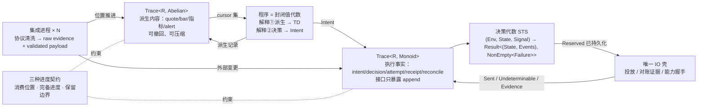

# UTA 核心设计：中心思维与设计中心

状态：核心设计 v1（已过两位讨论者压力测试与一次外部阅读评审）。读者：以后实现 UTA 的人。本文只定义**设计中心**——一切类型、模块、协议都必须能从这里的代数组合出来；不定义 crate、文件布局、传输细节。

证据边界：每条论断标 **[证据]**（来自 `research/fp-00..fp-05` 的条件式命题，编号可查）、**[设计]**（本文在证据条件下做的选择）、**[spike]**（研究无先例，实施前必须实验）。域事实只取 `uta-design.md` §1（F/H/C/P 编号）与附录 B；`uta-design.md` §3–§6 的模型与结构细节**不作依据**，本文取代其设计中心。

---

## 0. 中心思维（一句话）

**UTA 记录看到了什么，计算可以做什么，受控地执行一次，再用证据确认发生了什么。**

订单、持仓、审批流、策略行为全部是这四步的组合结果，不是核心实体。核心里不存在任何同时承载 provider 字段与业务状态的对象。**[证据：fp-00 §1 五十三案例无一以大对象为中心；fp-02 命题 12]**

四步各对应一个机制，机制之间只通过位置、键与日志记录关联：

| 步 | 机制 | 章节 |
|---|---|---|
| 看到了什么 | 载体 `Trace<R, D>`，派生侧可撤回 | §2 §3 |
| 可以做什么 | 程序 = 封闭值代数，两种解释 | §5 |
| 受控执行一次 | 决策代数 STS + 唯一 IO 壳 | §4 §8 |
| 证据确认发生了什么 | unknown 的证据 gate + 恢复协议 | §8 |



---

## 1. 第一边界：派生可更正，现实不可被重算撤销

研究里最稳定的边界不是"观察 | 效应"（那是 §1.5 的问题域分组），而是**可撤回/可压缩的派生内容 | 只追加的执行事实**。**[证据：fp-05 命题 12"不能把负 diff 当外部 Write 的补偿"；fp-03 命题 1 log+fold 只在不可丢/须审计条件下成立]**

| 内容 | 修正方式 | 例 |
|---|---|---|
| 派生计算结果（bar、指标、信号、alert） | 撤回旧贡献、加入新贡献、重算受影响子图 | 迟到 tick 修订 bar → 均线重算 → 旧信号撤回 |
| 已发生的决策与执行事实（意图、批准、预约、发出、回执、对账） | 只追加后续事实，永不改写为"从未发生" | 行情修订让信号消失，已发出的买单仍然存在；反向交易是新行为 |

撤回派生结果不等于删除原始输入证据；原始证据的保留义务由 §6 保留协议单独定义。**[设计]**

这条边界由三层分别保证，**任何一层都不能冒充另外两层**：

1. **代数能力**：`Diff`/`Abelian` 决定能否表达撤回（§2）。
2. **持久化接口**：执行事实侧的存储接口只暴露 `append`；替换、删除、快照是另外的、需授权的操作。
3. **保留协议**：哪些历史必须留、谁批准边界推进（§6）。

"无逆元"只约束第一层，不构成存储保证。**[设计；修正自阅读评审 §三]**

---

## 2. 载体：`Trace<R, D: Diff>`，一个形状两次实例化

```rust
trait Diff: Monoid { fn is_zero(&self) -> bool }        // fp-05 案例 12 difference.rs
trait Abelian: Diff { fn neg(&self) -> Self }            // 只有派生侧要求

struct Trace<R, D: Diff> { range: RangeId, ops: Vec<(Pos, D)> }
fn integral<R, D: Diff>(tr: &Trace<R, D>, at: Pos) -> State<R>   // state = 前缀和 = fold
fn compact<R, D: Abelian>(tr: &mut Trace<R, D>, f: Frontier)     // 只对 Abelian 存在
```

- `R`：该范围的记录词表，由集成侧在边界解析给出（§7）。`R` 必须是具体类型；退化成 `dyn Any` 即违反解析边界。**[证据：fp-04 命题 15/16]**
- `RangeId = (source × stream × epoch)`：每范围独立 `Pos` 单调；**不存在全局入口序**。**[证据：fp-04 命题 11；域 P2]**
- 派生侧 `D: Abelian`（可撤回多重集，正负 diff）；执行事实侧 `D: Monoid` 无逆元（§1 第一层）。
- 状态是 `integral` 的结果，可重建、可缓存；不是被规则原地修改的对象。**[证据：fp-03 命题 1；fp-01 M8]**
- 同一形状统一 differential 派生与 event-sourcing 执行历史，**研究中无一手系统做过** → **[spike S3]**：若实验证明两侧协议实质不同，拆成两个形状，边界（§1）不变。

### 2.1 位置作为关联（收窄）

`Pos` 集合用于两件事：**输入依据**（一项决策记录它看到的行情流 A@120、汇率流 B@57、账户流 C@90）与**重放位置**。它不取代外部订单身份、幂等键、causation id——这些是独立的名义关联（§11）。**[设计；修正自阅读评审 §六]**

---

## 3. 三种进度，互不替代

| 进度 | 含义 | 承载 |
|---|---|---|
| 消费位置（cursor） | 某消费者已读到哪 | 订阅状态 |
| 完备进度（frontier / watermark） | 哪些逻辑时间之前不再有新更新 | 范围元数据，由来源声明或推导 |
| 保留边界（retention） | 还能精确重建多早的历史 | 存储元数据 |

读到某序号不证明更早事件时间的数据不会迟到。await-all 按**完备进度**触发，不按消费位置。**[证据：fp-05 案例 10④/11⑤/13⑤；fp-04 命题 10]**

### 3.1 消费方式

`Pos` 的积序 `Map<RangeId, Seq>` 上一个比较子，三种策略：

| 方式 | 语义 | 损失 |
|---|---|---|
| await-all | 所有指定输入达到要求位置/完备进度后计算 | 无（等待） |
| ordered | 按单条范围顺序处理，不跳过中间记录 | 无（背压） |
| latest / conflated | 允许合并中间更新，只保留最新值 | **有**，DeliveryGap 原因增加 `conflated`，或消费者声明的窗口界即其可接受丢失界 |

latest 不是 frontier 消费，是传输层 conflation；UI 报价可接受，依赖中间路径的阈值策略不能默认接受。损失语义必须由消费者声明。**[证据：fp-05 命题 2/15；域 C6]** **[设计]**

---

## 4. 决策代数：STS 规则，不是订单对象

```rust
trait Rule {
    type Env;      // 本次判断依据：时钟、授权策略、能力证据
    type State;    // 规则必须记住的状态：冷却、待决集合版本、lane 阻塞头、过期
    type Signal;   // 本次输入：意图、决定、超时、回执、对账证据
    type Failure;  // 每规则封闭 sum，无 catch-all
    type Event;    // 接受转换产生的事实
    fn step(env: &Env, st: State, sig: Signal) -> Result<(State, Vec<Event>), NonEmpty<Failure>>;
}
```

- 授权、输入约束、审批、期限、lane、fail-closed 各是独立规则，用 `Embed` 显式嵌入子规则的 State/Event/Failure，不共同修改一个全局对象。**[证据：fp-01 M8 cardano STS；fp-04 命题 5]**
- 规则计算"允许执行"≠ 调用 venue：决定先成为持久记录，再由 §8 IO 壳执行。
- **核心只持有规则需要的状态**。订单投影、持仓投影是消费者侧对执行事实 `Trace` 的 fold；它们可以是具名数据结构，但**不作权威、不被规则修改**。**[证据：fp-03 命题 1]** **[设计；修正自阅读评审 §一/§九]**
- 记录类型**按 stream 参数化**：每条 lane/账户 stream 有自己的 Signal 集与 decider（Equinox `Category`/`StreamId` 模式），核心不定义一个全局 effect enum。**[证据：fp-03 条目 7]**
- 规则组合分两类并显式登记：**可交换集**（相互独立的 guard，用交换性测试）与**顺序固定链**（授权→审批→lane→过期，顺序由代码固定并测试）。不存在"任意装配顺序都不改变结果"的默认。**[证据：fp-03 命题 6]** **[设计；修正自阅读评审 §九]**
- 失败 `NonEmpty<Failure>` 保留依赖结构；`Validated` 式累积只用于相互独立的校验项。**[证据：fp-04 命题 8]**
- lane 的作用域键、并发协议、解除阻塞条件 → **[spike S7]**。

---

## 5. 程序（AI 写）：封闭值代数，两种解释

程序不是黑盒函数 `(State, Input) -> (State, Output)`——无法预算、无法静态检查、状态可序列化只是作者承诺。程序是 **deep embedding 的小闭合值**：

```rust
enum Node { Const(V), Input(Cursor), Op1(Op1, Id), Op2(Op2, Id, Id), Scan(ScanOp, Id), Window(Id, W), Join(JoinOp, Vec<Id>) }
enum Step { On(Pattern, Box<Step>), Emit(IntentT), Require(Guard, OnFail), Expire(Deadline, Box<Step>) }
struct Program { nodes: Vec<Node>, rules: Vec<Step>, state: Vec<NamedProj> }
```

- **解释①（派生）**：`nodes` → 增量 DAG，只重算受影响节点、cutoff 截断；输出写回派生侧 `Trace`——alert 就是派生观察，与外部观察同形。**[证据：fp-01 M3 Mu `Work_`；fp-05 案例 7 Incremental；域 B3/P2]**
- **解释②（决策）**：`rules` → 对日志的 fold，纯性由结构保证而非约定。**[证据：fp-01 M7 Mercury Workflow]**
- **输入 = 位置推进**（frontier + cursor 之后的记录），程序看得见 gap 与两种时间。**输出 = (Intent 集, 派生记录集)**。
- 状态分两类：**可安全重算的数据状态**（`Scan`/`Window` 累加器，属解释①）与**绑定不可逆外部行为的执行状态**（冷却、lane 等待、审批等待、过期，属解释②）。后者不进派生 DAG——Incremental 的 height/cycle 约束与 Salsa 的 cycle panic 禁止自反馈环。**[证据：fp-05 案例 7⑤/9⑤]** **[设计；修正自阅读评审 §五]**
- 程序**无写能力**：Intent 是值不是调用；capability token 只授权不执行。预算（C4）靠宿主隔离，不靠类型。**[证据：fp-03 命题 7；域 H2/H3]**
- 核心越小越封闭，穷尽/预算/静态分析越强（Marlowe 6 构造子、FPF 非图灵完备）；作者面语法朴素，类型级复杂度封在核心。构造子膨胀到 TradingView 当量即退化成 Pine-with-limits。**[证据：fp-01 M9/M10；fp-05 案例 14⑥]**
- 小语言能否表达真实策略且不膨胀 → **[spike S5]**；程序状态序列化/版本化/重放边界 → **[spike S4]**。

---

## 6. 保留协议

- 推进保留边界前必须处理仍被引用的 `Pos`：保留历史、保存必要证据，或明确缩小重放承诺（`AS OF ≥ retention frontier`）。**[证据：fp-05 案例 13⑤ Materialize]**
- 派生侧按 frontier 压缩（`compact` 只对 `Abelian` 存在）；执行事实侧按 §1 第二层只 append，快照只做加速。**[域 P15]**
- 谁登记引用、谁批准边界推进、原始证据与派生历史各留多久 → **[spike S8]**。

---

## 7. provider：开放实例，能力是有时效的证据

- provider = 开放实例（trait 实现 / 独立集成进程），核心对其多态；加 provider 不改核心（轴 A additive）。核心的**操作种类集合小且闭合**；加一种操作必然改所有 provider（轴 B），显式接受。**[证据：fp-03 命题 8；fp-01 M1 Haxl `DataSource`]**
- 能力 = **运行期握手获得的值**，带范围、来源、观察时间：
  ```rust
  struct Capability { op: OpKind, verdict: Verdict, scope: Scope, source: Source, observed_at: Instant }
  enum Verdict { Supported(Evidence), Unsupported, Unknown }
  ```
  F6"部分未文档化"的能力不可能是静态保证；八条目一致。写操作的 `Evidence` 含 unknown 证据渠道声明（by-key / listing+venue id / fills / 无）。**[证据：fp-03 命题 3；域 P1/C2]** 三值模型本身是新设计 → 与 §8 的结果未知**分开**：能力未知约束启动，结果未知约束恢复。**[设计；阅读评审 §七]**
- 集成输出两层：**raw evidence**（原始字节永远保留，C13）与 **validated payload**（入口解析成内部小词表；parse-don't-validate，构造器隐藏）。venue 状态映射按 venue 枚举输入，输出**必须保留 `Unmapped(raw)`**，不能靠"无 catch-all"伪造穷尽。**[证据：fp-04 命题 15/16；域 C13/F6]**
- 只读请求可批处理/去重的条件：无可观测副作用 + 稳定 identity + 幂等 + 可接受批窗口。写永不进这条路。**[证据：fp-03 命题 4；fp-02 命题 1/2]**
- venue 词汇不进核心。**[域 B6]**

---

## 8. 写与 unknown：受控执行一次，用证据确认

研究最大缺口：没有成熟案例直接建模"已发出、既非成功也非失败、不得盲重试"。可迁移的只有三条：**[证据：fp-01 M7 Mercury；fp-04 命题 12 Stripe/PayPal；fp-03 命题 5 Fowler]**

1. 决策是对日志的纯函数；投放是**唯一 IO 壳**。
2. 有幂等键的 venue 用键：key ↔ attempt ↔ latest status。
3. 重放只重算决策，IO 壳抑制外部写。

本文的选择：

- **发 IO 之前用 typestate**：`Reserved` 记录已持久化才允许调用投放（这段转移静态已知，满足 fp-04 命题 4 条件）。
- **发出之后是持久的运行期 enum + 证据 gate**：IO 壳写回 `Sent | Undeterminable`；`Undeterminable` 的唯一后继是携带 P1 声明渠道证据的 Reconciliation 记录（found / absent / inconclusive；无渠道或 inconclusive → 停在带 principal 的人工）。同 lane 在 `Undeterminable` 无后继时不产生新 Attempt。**[域 C1/C2/C12]**
- **恢复协议**：重启时任何 `Reserved` 且无 `Sent`/`Undeterminable` 后继的尝试**一律视为 `Undeterminable`** 进入证据 gate——发出与持久化之间的崩溃窗口无法区分，只能保守。"重放关闭 IO"不覆盖这个窗口。**[设计；修正自阅读评审 §八]**
- 不宣称"unknown 的可组合代数"——无先例。记录模型与恢复协议 → **[spike S1/S10]**。

### 8.1 场景：买入请求超时

1. 行情到达，形成带位置的输入。2. 增量计算产生突破信号（派生侧）。3. 程序产生买入意图，记录输入依据 `Pos` 集。4. STS 检查授权、输入约束、审批、期限、lane。5. 持久化 `Reserved`。6. IO 壳发送。7. 超时 → 记 `Undeterminable`，不记失败。8. 同 lane 阻塞。9. 按能力证据渠道查询幂等键 / 订单 / 成交，或进入人工。10. 追加对账证据，规则决定收敛与解除阻塞。
若行情随后修订：撤回旧信号，不抹去发送历史。若进程重启：重放恢复状态，不重发；`Reserved` 无后继者按恢复协议处理。

---

## 9. 基础类型

| 类型 | 设计 | 依据 |
|---|---|---|
| 金额 | 精确有理/定点 + 货币索引；离散化返回余数，不静默丢钱 | fp-04 命题 1 safe-money |
| 数量 | 精确数值；**不**做"数量带 instrument 尺度"（无证据） | — |
| 身份 | `(venue, native_id)` opaque + 智能构造；instrument 只在 venue 内有意义；换名不是安全，构造器隐藏才是 | fp-04 命题 16；域 F2 |
| 时间 | event_time / recv_time 分离；deadline 用单调钟；顺序只有 `(range, seq)` 偏序 | fp-04 命题 9/11；域 F11 |
| 错误 | 每规则封闭 sum；venue 映射保留 `Unmapped` | fp-04 命题 8；域 C13 |
| 外部写结果 | `Reserved | Sent | Undeterminable` + 证据记录，非 `Option`/字符串 | fp-01 M11 DAML 反例 |

---

## 10. Rust 映射（bounded spike，非可行性结论）

需要的机制都不依赖 HKT：reify-then-execute = enum + 解释器 trait；STS = 带 Env/State/Signal/Embed/Event 的 trait；`Trace<R, D>` 泛型；typestate 用泛型标记（只到 `Reserved`）；capability 用不可伪造 token 类型。增量引擎按指标是否可撤回选节点图（Incremental 式）或 differential，二者不是任选，都不能承载外部 unknown Write。不迁移 tagless-final 多态与 Haxl `<*>` 违反 `ap` 的技巧。reify/解释器的性能代价需实测 → **[spike S6]**。**[证据：fp-05 命题 8/12；fp-03 条目 2/4]**

---

## 11. "谁和谁能关联"：五种关系，五种承载

| 关系 | 承载 | 验证阶段 |
|---|---|---|
| operation ↔ capability | §7 能力证据值 | 运行期握手 |
| request/resource ↔ provider 身份 | `RangeId`、外部订单 id、幂等键 | 构造期 / 运行期 |
| 多 effect ↔ 同一作用域 | 单条 STS 事务 | 构造期 |
| program ↔ 解释器 | 解释选择（①派生 / ②决策） | 构造期 |
| intent ↔ 结果 / 审计 / 重放 | 执行事实日志的位置 + causation id | 运行期，持久 |

把这五种塞进一个对象的字段互指是反模式。**[证据：fp-03 命题 2]**

---

## 12. 明确不做

- 不存在 `UnifiedOrder`/`Account` 权威对象；不在核心枚举 venue；不把 venue 词汇带进核心。
- 不做类型级 capability；不把运行期未知冒充静态保证。
- 写不批处理、不去重、不由 replay 重发。
- 不假设 venue 时间单调；不承诺跨源全序。
- 不在 DAG 里放绑定不可逆行为的执行状态。

---

## 13. 验收标准

1. 代码库中不存在同时承载 provider 字段与业务状态的 struct；订单/持仓只作为对执行事实 `Trace` 的 fold 或非权威读模型出现。
2. 可交换规则集通过交换性测试；顺序固定规则链的顺序由代码显式固定并有测试。
3. 任一 `Undeterminable` 记录在没有 Reconciliation 后继时，同 lane 无新 Attempt；重启后无后继的 `Reserved` 被记为 `Undeterminable`。
4. 压缩后所有仍被引用的 `Pos` 均 ≥ 保留边界。
5. 新 provider 接入不改核心 crate；新操作种类必然改全部 provider。
6. latest 消费者的每次合并都可追溯到声明的窗口界或 `conflated` gap。

---

## 14. 未决 spike

| # | 问题 | 依据 |
|---|---|---|
| S1 | unknown 写结果 + 证据渠道的记录模型（无先例） | fp-01/02/04/05 未覆盖 |
| S2 | 运行期能力证据在 Rust 中是否值得抬进类型 | fp-03 未覆盖 |
| S3 | 同一 `Trace` 形状统一 differential 派生与 event-sourcing 执行历史 | fp-05 未覆盖末条 |
| S4 | 程序状态显式序列化 / 版本化 / 重放边界 | fp-01 M7 前提 |
| S5 | 小程序语言的表达力与膨胀 | fp-01 M9/M10 |
| S6 | enum + 解释器 + 增量引擎的性能与资源成本 | fp-03 条目 2/4 |
| S7 | lane 的作用域键、并发协议、解除阻塞条件 | 域 H4 |
| S8 | 保留边界、审计引用、原始证据与派生历史的所有权 | fp-05 命题 13 |
| S9 | 规则组合的可交换性分类表 | fp-03 命题 6 |
| S10 | 发出后-持久化前崩溃窗口的恢复协议实测（与 S1 合并） | 域 F5/C1 |

---

## 15. 与既有文档的关系

- `uta-design.md` §1（问题域）与附录 B 继续有效；其 §3–§6 的"五轴投影 + P6–P11 现象表照抄成类型"的设计中心被本文取代。
- `research/fp-00-synthesis.md` 是本文每条 **[证据]** 的索引；`fp-01`–`fp-05` 是一手出处。
- 讨论记录：两位讨论者（steady/divergent）的压力测试与一次外部阅读评审的修正已并入 §1 §2.1 §3 §4 §5 §8。
