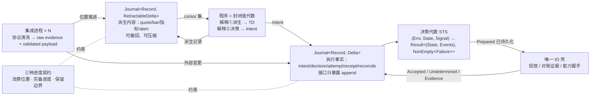

# UTA 核心设计：中心思维与设计中心

- **状态**：核心设计 v1（已通过两位讨论者压力测试与一次外部阅读评审）。
- **读者**：UTA 的实现者。
- **定位**：本文只定义**设计中心**——所有类型、模块、协议均须能从本文的代数组合出来；不涉及 crate 划分、文件布局与传输细节。

**证据边界**：
- 每条论断标注：
  - **[证据]**：源自 `research/fp-00..fp-06` 的条件式命题（编号可查）。
  - **[设计]**：在既有证据约束下做出的选择。
  - **[spike]**：研究无先例，实施前必须通过实验验证。
- **域事实依据**：只以 `problem-domain.md` 为准（迁移自原 `uta-design.md` §1 与附录 B，含 F/H/C/P 编号）；原 `uta-design.md` §3–§6 的模型与结构细节**不作依据**，本文取代其设计中心。

---

## 0. 中心思维（一句话）

**UTA 记录看到了什么，计算可以做什么，受控地执行一次，再用证据确认发生了什么。**

订单、持仓、审批流、策略行为均为这四步的组合结果，而非核心实体。核心中不存在任何同时承载 provider 字段与业务状态的对象。**[证据：fp-00 §1 五十三案例无一以大对象为中心；fp-02 命题 12]**

四步各对应一个机制，机制之间仅通过位置、键与日志记录关联：

| 步 | 机制 | 章节 |
|---|---|---|
| 看到了什么 | 载体 `Journal<Record, Delta>`，派生侧可撤回 | §2 §3 |
| 可以做什么 | 程序 = 封闭值代数，两种解释；出口是 effect 请求 | §5 |
| 受控执行一次 | 单据 → 决策代数 STS → 唯一 IO 壳 | §8.3 §4 §8.1 |
| 证据确认发生了什么 | unknown 的证据 gate + 恢复协议 | §8.1 |



### 0.1 进程身份与生命周期（维护者约束）

**UTA 是独立的核心进程，不随 Alice 生命周期绑定。** **[设计：维护者约束]**

- **独立生命周期**：UTA 独立启动、独立存活、独立停止；Alice 是其消费方与控制方，并非父进程或守护者。Alice 退出、崩溃或重启均不改变 UTA 的订阅、程序、lane 与日志（H5/C5 已要求订阅与程序由 UTA 拥有）。
- **单实例运行**：同一 `UTA_HOME` 仅允许单实例运行，由 OS 文件锁 + fence 保证（H10）；第二实例以专用退出码拒绝启动，不做接管。
- **状态同步与 gap 语义**：Alice 重连后拉取当前状态及 cursor 之后的记录；断连期间的投递损失按 §3 的 gap 语义显式标记，不伪造连续性。
- **控制面接入**：运维动作（装卸程序、更换凭据、重启指定集成、请求快照）仅通过控制面（P14）由认证 principal 传入，不经进程信号或 flag 文件。
- **裁决：共享配置落盘于统一路径。** 所有 UTA 与 Alice 共享的配置（账户封存信封、封存密钥引用、集成登记、策略/审批规则、程序装载清单）必须以文件形式持久化在同一个用户状态根（`OPENALICE_HOME`）下的统一路径，两个进程均从文件读取，不经进程间注入、环境变量或启动参数传递。**[设计：维护者裁决]**
  - **推论**：H3 的"Alice 拉起并注入"前提失效，凭据链调整为 `统一路径封存文件 → UTA 核心 → 该账户的集成进程`（维持 C7"程序与消费方只见账户身份"不变）。
  - **单写者契约**：每个文件有且仅有唯一写者（Alice 写入账户与规则，UTA 写入运行期登记），对端只读并依据控制面通知或文件变更重载；文件附带格式版本，升级只前进（C14）。
  - **边界划分**：Alice 侧的适配（密钥位置调整、移除 flag 重启，O8/O9）属于**接入阶段**，不在本设计范围内；本设计只定义 UTA 读取的文件契约。

### 0.2 谓词与组合子：判断的共同底层（维护者）

§4 的规则守卫、§5 的程序节点、§7.0 的处理器触发、§8.3 的单据检查项共用**同一个派生机制**，分属**两个类型宇宙**（§0.3）。谓词可以处理任意协议，因为它们是底层无关的纯组合子；组合子的核心意义是**让类型可以顺利派生**。**[设计：维护者定性]**

**底层无关的来源**：组合子从不提 venue，只接受三种输入——锚点、注册表里的具名字段（带类型）、经 `payload_schema` 访问器取得的载荷值。访问器本身是组合子（`field::<Price>("px")`），类型随访问器进入表达式。协议差异被压在访问器一层，谓词之上一律纯组合：`InBand(field("px"), lo, hi)` 对任何注册了 `px: Price` 的 venue 都成立。

**四个派生**（取代手写）：

| 派生出的东西 | 怎么派生 | 取代 |
|---|---|---|
| 输入需求 `required_inputs` | 组合树里所有 `field` 访问器的 stream kind 之并 | §7.0 推论 1 变为字面意义的推导，不是登记 |
| 输出类型 | `And<P, Q>: Pred`、`Map<P, F>: Comb<In, F::Out>`、`Scan<C, S>`——从组合形状得出，同 parser combinator | 手写的 `IntentAlignment` / `Event` 类型 |
| 失败 sum | 每个组合子贡献自己的失败变体，树的失败类型 = 各变体之并 | §4 "每规则封闭 sum"由树保证穷尽，不再手写 |
| 解释器 | 同一棵树至少四种解释：求值；提取 `required_inputs`；为审批人生成"为何否决"；静态检查"引用了没有集成提供的字段" | 每条规则各写一遍这些逻辑 |

一份项、多种解释。**[证据：fp-01 案例 3 Composing Contracts；fp-03 条目 5 Servant]**

**两个层级，同一个代数**：
- **编译期**：核心规则、处理器、钩子检查项是 Rust 泛型组合子，`required_inputs` / `Rejection` / 输出类型在编译期派生。
- **运行期**：AI 程序（D6）是同一代数的 JSON 值树，装载时做同样的派生——静态检查变成 schema 校验。**[证据：fp-01 M9 Marlowe 闭合构造子]**

**统一的**：处理器触发 = `Pred<Envelope>`；STS guard = `Pred<(Context, RuleState, Input)>`；`AlignmentCheck.eval` = `Comb<Observed, CheckResult>`；程序 `DerivationNode` = 派生流上的 `Comb`；订阅过滤 = `Pred<Envelope>`；投影 = `Fold`。

**不统一的**：顺序固定链（授权 → 审批 → lane → 过期）是对组合子结果的**顺序消费**，读的是前一步 append 的记录（§7.0 推论 3）；IO 壳的阶段链是协议驱动器；单据锁是责任持有。组合子是**判断**的底层，不是**控制流**的底层。

### 0.3 两套抽象：观察（不可写）与效应（可写）（维护者）

所有锁与对账机制都是为写操作存在的。为对账设计的类型若扩展到全体代码，会污染认知，并让组合子处理过多兼容项。因此可写对象与不可写对象是**两套独立的抽象**，不共享类型宇宙；§1 的边界不只是一个形状的两次实例化，而是两套类型。**[设计：维护者定性]**

| | 观察（不可写） | 效应（可写） |
|---|---|---|
| 主体 | range：`StreamId` / `LogPosition` / 进度 / 保留 | 可写对象：有 venue 侧身份、作用域键、能力证据、可能有幂等键 |
| 载体 | `Journal<RetractableDelta>`，可撤回可压缩（§2） | append-only 记录链（§8） |
| 组合子宇宙 | `Pred<Envelope>` / `Comb` / `Fold`：输出是值与派生记录，**没有失败 sum** | guard：`Pred<(Context, RuleState, Input)>` → `Result<_, Failure>`；`Check` 带 `required_inputs` 与 `IntentAlignment` |
| 处理器（§7.0） | `occurred_at`、`payload_schema` | `idempotency_key`、`attribution`、`cumulative_filled_quantity`、`deadline`、守卫字段、`venue_order_id` |
| 机制 | 订阅、派生 DAG、程序解释① | 单据锁、STS 链、lane、IO 壳、两阶段、证据 gate、程序解释② |

**唯一的边是单向的**：效应侧读观察侧——`basis` 引用观察位置，钩子读观察值，决议读带归因的订单状态观察。反向不存在：观察侧的任何类型、组合子、处理器都不引用效应侧。归因字段落在观察记录上，但它的处理器注册在效应侧——**记录归观察，响应归效应**。程序是值不是类型，同一个程序值可以跨两边（解释①在观察宇宙，解释②在效应宇宙）。

**协议 = 注册单元**。UTA 处理订单、新闻还是期权，只是协议不同的处理对象；协议改变的是 UTA 如何响应内部的值，不透明的部分交给下游。一个协议 = 它填的锚点 + 它注册的字段 + 这些字段触发的处理器 + 它的 `payload_schema` 集；`cumulative_filled_quantity = 100` 对核心没有意义，交易协议注册了"`cumulative_filled_quantity` 出现 → `Replace` 第二腿"，UTA 才对它有响应。协议 ≠ venue：一个 venue 实现一个或多个协议。每个协议至少有观察半边；只有可写协议才有效应半边。**[设计：维护者定性]**

| 处理对象 | 锚点 | 注册的字段与处理器 | 载荷交给谁 |
|---|---|---|---|
| 新闻 | 观察链路 | 可能只有 `occurred_at`；无效应半边 | 程序做派生、消费方展示 |
| 期权 | 观察 + 意图链路 | 与股票同一交易写协议；守卫要读 greeks/到期则注册 | 同交易 |
| 订单 | 观察 + 意图/尝试链路 | `attribution`、`cumulative_filled_quantity`、`venue_order_id`、`idempotency_key`、守卫字段 | 程序、钩子、投影 |

**本文里属于交易协议注册、不属于核心的内容**（标 [交易协议]）：§4 的 lane 键 (账户, 子账户)——核心只说"写通道作用域键是意图链路锚点，由协议提供"；§8.3.2 的撤单/改单/`Replace`/`cumulative_filled_quantity`；§7 的 `OperationKind` 具体集合——每协议一个闭合集，轴 B 的"改所有集成"收窄为"改实现该协议的所有集成"；§9 的 money/quantity——交易协议处理器用的值类型，不是信封类型。协议无关的核心：§1–3、§6 的载体与进度；§0.2 的派生机制；§7.0 的锚点与处理器机制；§4 的 STS 链形状；§5 的两种解释；§8 的两阶段 + `Undetermined` + 证据 gate（任何外部写都适用）；§8.3 的单据锁（任何效应意图都适用）。

"交给下游"的下游包括程序与钩子：它们解释载荷，但输出仍经过核心（派生记录、Intent、`IntentAlignment`）。不透明是对**核心的路由与存储**不透明；解释权在下游，记录权在核心。

---

## 1. 第一边界：派生可更正，现实不可被重算撤销

研究中确立的最稳定边界并非"观察 | 效应"（此为 §1.5 的问题域分组），而是**可撤回/可压缩的派生内容 | 只追加的执行事实**。**[证据：fp-05 命题 12"不能把负 diff 当外部 Write 的补偿"；fp-03 命题 1 log+fold 仅在不可丢/须审计条件下成立]**

| 内容 | 修正方式 | 例 |
|---|---|---|
| 派生计算结果（bar、指标、信号、alert） | 撤回旧贡献、加入新贡献、重算受影响子图 | 迟到 tick 修订 bar → 均线重算 → 旧信号撤回 |
| 已发生的决策与执行事实（意图、批准、预约、发出、回执、对账） | 仅追加后续事实，永不改写为"从未发生" | 行情修订导致信号消失，但已发出的买单仍然存在；反向交易属于新行为 |

撤回派生结果不等于删除原始输入证据；原始证据的保留义务由 §6 保留协议单独定义。**[设计]**

该边界由三层分别保证，**任何一层均不可替代其他两层**：

1. **代数能力**：`Delta`/`RetractableDelta` 决定能否在代数上表达撤回（§2）。
2. **持久化接口**：执行事实侧的存储接口仅暴露 `append`；替换、删除、快照属于独立且需显式授权的操作。
3. **保留协议**：明确哪些历史必须保留、谁有权批准边界推进（§6）。

"无逆元"仅约束第一层，不构成存储层面的不可变保证。**[设计]**

---

## 2. 载体：`Journal<Record, Delta: Delta>`，观察侧的载体；存储原语可与效应侧共享，抽象不共享

```rust
trait Delta: Monoid { fn is_zero(&self) -> bool }                  // fp-05 案例 12 difference.rs
trait RetractableDelta: Delta { fn neg(&self) -> Self }            // 只有派生侧要求

struct Journal<Record, Delta: Delta> { stream: StreamId, ops: Vec<(LogPosition, Delta)> }
fn fold_state<Record, Delta: Delta>(journal: &Journal<Record, Delta>, at: LogPosition) -> State<Record>   // state = 前缀和 = fold
fn compact_below_retention<Record, Delta: RetractableDelta>(journal: &mut Journal<Record, Delta>, frontier: Frontier)
```

- `Record`：该流的记录词表，由集成侧在边界处解析给出（§7）。`Record` 必须为具体类型；退化为 `dyn Any` 即违反解析边界。**[证据：fp-04 命题 15/16]**
- `StreamId = (source × stream × epoch)`：每个范围独立维持 `LogPosition` 单调递增；**系统内不存在全局入口序**。**[证据：fp-04 命题 11；域 P2]**
- **两侧的关系**：派生侧使用 `Delta: RetractableDelta`（可撤回多重集、正负 diff）；执行事实侧的 append-only 记录链在存储上可以复用同一原语（`Delta: Monoid`，无逆元，见 §1 第一层），但它属于效应抽象（§0.3），类型不与观察侧共享。
- **状态计算**：状态是 `fold_state` 的计算结果（前缀和折叠），可随时重建与缓存，而非由规则原地修改的对象。**[证据：fp-03 命题 1；fp-01 M8]**
- **共用存储、不共用类型**：以同一存储原语承载 differential 派生与 event-sourcing 执行历史，**在既有研究中尚无一手系统实践** → **[spike S3]**：实验只验证共用表结构的成本；无论结果如何，两侧的抽象保持独立（§0.3）。

### 2.1 位置作为关联（收窄）

`LogPosition` 集合仅用于两项语义：**输入依据**（例如记录某决策观察到的行情流 A@120、汇率流 B@57、账户流 C@90）与**重放位置**。它不替代外部订单身份、幂等键或 causation id——后者属于独立的名义关联（§11）。**[设计]**

---

## 3. 三种进度，互不替代

| 进度 | 含义 | 承载 |
|---|---|---|
| 消费位置（cursor） | 某消费者已读取到的位置 | 订阅状态 |
| 完备进度（frontier / watermark） | 哪些逻辑时间之前不再产生新更新 | 流元数据，由来源声明或推导 |
| 保留边界（retention） | 存储仍能精确重建的最早历史时间点 | 存储元数据 |

读取到特定序号并不保证更早事件时间的数据不会迟到。`await-all` 按**完备进度**触发，而非按消费位置。**[证据：fp-05 案例 10④/11⑤/13⑤；fp-04 命题 10]**

### 3.1 消费方式

在 `LogPosition` 的积序 `Map<StreamId, Seq>` 上定义比较子，支持三种策略：

| 方式 | 语义 | 损失 |
|---|---|---|
| await-all | 待所有指定输入均达到要求位置/完备进度后再行计算 | 无（引入等待） |
| ordered | 按单条流的顺序依次处理，不跳过中间记录 | 无（引入背压） |
| latest / conflated | 允许合并中间更新，仅保留最新值 | **有**：Gap{origin: Delivery} 原因记录为 `conflated`，或以消费者声明的窗口界作为其可接受丢失界 |

`latest` 属于传输层 conflation，而非 frontier 消费；UI 报价显示可接受 conflation，但依赖完整状态路径的阈值策略不能默认接受。损失语义必须由消费者显式声明。**[证据：fp-05 命题 2/15；域 C6]** **[设计]**

---

## 4. 决策代数：STS（State Transition System）规则，不是订单对象

```rust
trait Rule {
    type Context;    // 本次判断依据：时钟、授权策略、能力证据
    type RuleState;  // 规则必须记住的状态：冷却、待决集合版本、lane 阻塞头、过期
    type Input;      // 本次输入：意图、决定、超时、回执、对账证据
    type Rejection;  // 每规则封闭 sum，无 catch-all
    type Outcome;    // 接受转换产生的事实
    fn step(ctx: &Context, st: RuleState, input: Input) -> Result<(RuleState, Vec<Outcome>), NonEmpty<Rejection>>;
}
```

- **规则独立性与显式嵌入**：授权、输入约束、审批、期限、lane、fail-closed 各为独立规则，通过 `embed_subrule` 显式嵌入子规则的 RuleState/Outcome/Rejection，不共同修改单一全局对象。**[证据：fp-01 M8 cardano STS；fp-04 命题 5]**
- **执行解耦**：规则计算"允许执行" ≠ 调用 venue。所有决定先持久化为记录，再由 §8.1 IO 壳执行。
- **核心状态最小化**：**核心只持有规则运行所需的状态**。订单投影、持仓投影仅是消费侧对执行事实 `Journal` 的 fold，可表现为具名数据结构，但**不作权威、不被规则修改**。**[证据：fp-03 命题 1]** **[设计]**
- **记录类型按 stream 参数化**：每条 lane / 账户 stream 拥有独立的 Input 集与 decider（Equinox `Category`/`StreamId` 模式），核心不定义全局 effect enum。**[证据：fp-03 条目 7]**
- **规则组合分类与显式登记**：
  - **可交换集**：相互独立的 guard，以交换性测试保证。
  - **顺序固定链**：授权 → 审批 → lane → 过期，由代码固定执行顺序并测试。
  - 不存在"任意装配顺序均不改变结果"的默认前提。**[证据：fp-03 命题 6]** **[设计]**
- **失败类型结构**：`NonEmpty<Rejection>` 保留依赖结构；`Validated` 式累积仅用于相互独立的校验项。**[证据：fp-04 命题 8]**
- **lane（对 venue 写入通道的有序队列 = unknown 阻塞半径）**：核心只要求写通道作用域键是意图链路的锚点，由协议提供（§0.3）。
  - **键定义 [交易协议]**：`(账户, 子账户)`；无子账户的 venue 退化为账户。子账户须预先枚举（C10）。
  - **粒度权衡**：此粒度恰为 H4 要求的写全序范围。细于该粒度（如按 instrument）虽能防重复投放，却无法阻止"资金状态未知时继续加仓"（H1 本质：unknown 占用的 buying power 不按 instrument 隔离，且 venue 限流按账户生效）；粗于该粒度（整账户）则超出 H4 范围，导致单笔卡住的订单冻结无关子账户。**[设计]**
- **队首阻塞协议语义（维护者）**：
  - **队首阻塞是通讯协议的一部分，不是 UTA 选择的锁**。提交属于消费动作，仅在消费者自身有权消费时才存在加锁概念；UTA 无权决定是否消费，消费方始终是 venue。
  - **等待机理**：lane 队首处于 `Undetermined` 时后续操作必须等待，因为**后续写入的语义依赖队首结果**（同账户 buying power、待撤订单是否存在、venue 侧顺序）。此乃与 venue 的通讯协议语义，而非数据库层面的并发互斥。
  - **无第二类越顶队列**：队首仅允许执行决议动作（按键查询、listing、成交/持仓对账及作为决议手段的 cancel-by-key），这些动作属于 IO 壳的对账协议而非队列项。
  - **显式绕过**：带 principal 的显式绕过仍可存在，但必须记录为 Decision 并定性为**对协议的自觉违反**，不是队列的一种模式。**[设计]**
- lane 并发协议（多个 unknown 叠加、部分收敛）与解除阻塞条件 → **[spike S7]**。

---

## 5. 程序（AI 写）：封闭值代数，两种解释

程序不是黑盒函数 `(State, Input) -> (State, Output)`——无法预算、无法静态检查，且状态可序列化仅依赖作者承诺。程序是 **deep embedding 的小闭合值**：

```rust
enum DerivationNode { Const(V), Input(Cursor), Op1(Op1, Id), Op2(Op2, Id, Id), Scan(ScanOp, Id), Window(Id, W), Join(JoinOp, Vec<Id>) }
enum DecisionStep { On(Pattern, Box<Step>), Emit(EffectRequest), Require(Guard, OnFail), Expire(Deadline, Box<Step>) }   // Emit 见 §5.1
struct Program { nodes: Vec<DerivationNode>, rules: Vec<DecisionStep>, state: Vec<NamedProj> }
```

- **解释①（派生）**：`nodes` → 增量 DAG，仅重算受影响节点并通过 cutoff 截断；输出写回派生侧 `Journal`——alert 本质上是派生观察，与外部观察同形。**[证据：fp-01 M3 Mu `Work_`；fp-05 案例 7 Incremental；域 B3/P2]**
- **解释②（决策）**：`rules` → 对日志的 fold，其纯性由数据结构本身保证而非开发约定。**[证据：fp-01 M7 Mercury Workflow]**
- **输入与输出**：
  - **输入 = 位置推进**（frontier + cursor 之后的记录），程序可见 gap 与两种时间。
  - **输出 = (effect 请求集, 派生记录集)**；锚点经处理器成为 Intent 或读结果（§5.1）。
- **状态正交划分**：
  - **可安全重算的数据状态**（`Scan`/`Window` 累加器，归属解释①）。
  - **绑定不可逆外部行为的执行状态**（冷却、lane 等待、审批等待、过期，归属解释②）。
  - 执行状态不进入派生 DAG——Incremental 的 height/cycle 约束与 Salsa 的 cycle panic 均禁止自反馈环。**[证据：fp-05 案例 7⑤/9⑤]** **[设计]**
- **无写能力与预算约束**：程序无写能力；Intent 是值而非外部调用；capability token 仅用于授权而不执行动作。预算（C4）依赖宿主进程/沙箱隔离，而非类型系统。**[证据：fp-03 命题 7；域 H2/H3]**
- **封闭核心与语法界限**：核心越小且越封闭，穷尽验证、预算控制与静态分析能力越强（如 Marlowe 的 6 个构造子、FPF 非图灵完备特性）；作者面向的语法保持朴素，类型级复杂度封在核心内部。构造子膨胀至 TradingView 当量即退化为 Pine-with-limits。**[证据：fp-01 M9/M10；fp-05 案例 14⑥]**
- 小语言表达真实策略的能力与抗膨胀 → **[spike S5]**；程序状态序列化/版本化/重放边界 → **[spike S4]**。

### 5.1 未知副作用：程序发出请求，处理器决定响应（维护者）

程序需要请求**核心不认识的副作用**（发通知、拉一次历史 K 线、调一个外部模型、下单）。程序的唯一出口是一个 **effect 请求**，不是对每种副作用各加一个构造子：

```rust
Emit(EffectRequest { effect_kind: EffectKind, payload: Bytes, basis: Basis, key: Option<Key> })
```

- **请求是值，不是调用**（`IO a` 的纪律，§8.1）：被 append 为记录；核心不解释 `payload`。
- **响应由处理器决定**：注册了该 `EffectKind` 的副作用处理器接手；未注册则记录留在日志里为 `Unhandled`——有请求无处理器**不是错误**，与 §7.0 字段无处理器不触发同理。
- **处理器在注册时声明自己是读副作用还是写副作用**（§8.2）：
  - 读处理器：立即执行，结果作为观察记录 append（带 `LogPosition`），程序按位置推进看到它——闭环走观察侧。
  - 写处理器：请求被当作 Intent，进入单据 → STS → IO 壳的完整效应路径；结果是执行事实与决议记录。
- 核心不需要知道副作用是什么，只保证：写类走两阶段，读类可重试，两类都被记录、都带 `basis`。

**推论**：
1. **程序的封闭代数不随副作用种类膨胀**：`Emit(EffectRequest)` 是唯一出口，副作用的种类是注册表的事，`DerivationNode`/`DecisionStep` 不动——这是上文"构造子膨胀"红线的出路。
2. **对程序与核心同形，只有处理器不同**：下单 `trade.place`（写）、发通知 `notify.telegram`（写——对外部世界也是写）、拉历史 `fetch.bars`（读）三者对程序是同一个构造子。
3. **两个注册表对称**：入站字段 → 处理器（§7.0）；出站请求 → 处理器（本节）。都是"出现了什么，则做什么"。

**必须守住**：写处理器**不得**绕过效应路径。注册为写处理器即意味着经过规则链（至少授权与预算），不因"只是发个消息"就直通；否则程序拿到一条不经审批的外部写通道，H2 的不可信程序前提被破坏。**[设计：维护者定性]**

### 5.2 程序隔离运行时的前提（维护者约束）

**Wasm 仅在"三 OS（macOS / Linux / Windows）通用、开箱即用"的方案存在时才可选为隔离运行时。**[设计：维护者约束]** 开箱即用的判定标准：
1. 作为普通 Rust 依赖引入即可在三 OS 构建与运行，无需系统级安装、外部工具链或平台特判；
2. 预算手段（fuel / 内存上限）与 trap 语义在三 OS 上表现一致；
3. 打包为独立二进制时无平台差异。

- **已知事实**：Wasmtime 缺乏 live `Store` 快照/恢复 API，Component Model async ABI 尚未完成，fuel 虽能提供确定性指令预算但无法限制阻塞性 host 调用（`problem-domain.md` §1.4.2）。上述问题属于能力缺口而非三 OS 通用性缺口；通用性本身须在 spike 中按上述标准实测。
- **降级路径**：若判定不成立，程序隔离退回**受监督子进程**：预算由 OS 进程机制限制，状态经内部协议显式序列化；§5 的封闭值代数与两种解释保持不变——隔离运行时仅作为解释器的宿主，不进入设计中心。
- **运行时状态要求**：无论采用何种运行时，程序状态都必须显式可序列化（S4），不依赖运行时快照。

→ **[spike S11]**：依据判定标准实测 Wasm 在三 OS 上的开箱即用性与预算一致性，得出可/不可结论。

---

## 6. 保留协议

- **引用处理与边界推进**：推进保留边界前，必须显式处理仍被引用的 `LogPosition`——保留对应历史、保存必要证据，或明确缩小重放承诺（`AS OF ≥ retention frontier`）。**[证据：fp-05 案例 13⑤ Materialize]**
- **双侧保留策略**：派生侧依据 frontier 进行压缩（`compact_below_retention` 仅对 `RetractableDelta` 表存在）；执行事实侧依据 §1 第二层保持纯 append，快照仅用于加速。**[域 P15]**
- **权责与周期归属**：引用登记方、边界推进审批方，以及原始证据与派生历史的留存时长 → **[spike S8]**。

### 6.1 存储引擎：SQLite（维护者裁决）

两侧 `Journal` 与规则状态统一持久化于**单个 SQLite 文件**（WAL 模式），不手写分段日志与索引。**[设计：维护者裁决，理由"否则需要自己写索引"]**

- **表结构与索引**：每张 trace 表以 `(stream_id, log_position)` 为主键，`pos` 单调；`fold_state`、`AS OF` 以及 cursor 之后的记录查询均退化为引擎原生索引支持的范围扫描。
- **写入与压缩保证**：
  - §1 第二层"执行事实侧只 append"由 **Rust 侧存储接口**保证（对应表的模块 API 仅暴露 `append`），不依赖 SQL 权限约束。
  - 派生侧 `compact_below_retention` 实现为保留边界之下的 `DELETE`，仅适用于 `RetractableDelta` 表。
- **事务原子性**："决策 append + 投递 outbox + 规则状态更新"封装在同一个 SQLite 事务内，单文件事务消解了跨存储系统的原子性问题。
- **单写者**：核心进程独占持有该数据库文件（H10 的 OS 文件锁与 SQLite 锁同向生效）；集成进程与程序隔离域**不接触**数据库，仅通过内部协议与核心交换记录（满足 C7 凭据链与 H2 程序不可信要求）。
- **快照与版本演进**：快照仅用于加速状态恢复，状态随时可由 `fold_state` 重建；格式版本持久化于 schema 表，升级只前进（C14）。
- **对 spike 的收敛影响**：
  - 该裁决关闭 S8 的"引擎选型"部分，S8 仅保留"引用登记、边界推进审批、留存时长"三项归属。
  - S3（两侧是否共用同一 `Journal` 形状）在 SQLite 方案下退化为"两侧是否共用同一张表结构"，实验成本降低但仍保留为 spike。

---

## 7. provider：开放实例，能力是有时效的证据

- **开放实例与多态**：provider 为开放实例，核心对其多态；新增 provider 不改核心（轴 A additive）。核心的**操作种类集合保持小而闭合**；新增操作种类必然修改所有 provider（轴 B），该代价显式接受。**[证据：fp-03 命题 8；fp-01 M1 Haxl `DataSource`]**
- **能力定义**：能力为**运行期握手获得的值**，带范围、来源、观察时间：
  ```rust
  struct Capability { operation: OperationKind, verdict: Verdict, scope: CapabilityScope, source: Source, observed_at: Instant }
  enum Verdict { Supported(CapabilityProof), Unsupported, Unknown }
  ```
  F6"部分未文档化"的能力不可能是静态保证；fp-03 八个条目一致。写操作的 `CapabilityProof` 含 unknown 证据渠道声明（by-key / listing+venue id / fills / 无）。**[证据：fp-03 命题 3；域 P1/C2]**
- **能力未知 ≠ 结果未知**：三值模型属于新设计，与 §8 的"结果未知"分开：能力未知约束启动阶段，结果未知约束恢复阶段。**[设计]**
- **信封解析，载荷直通**：集成输出 = **信封字段**（锚点与已注册处理器要读的字段，入口解析并验证；parse-don't-validate，隐藏构造器）+ **载荷字节**（原封不动直通，永远保留，C13）。venue 状态映射只对被路由的少数字段做（订单状态的终态/非终态），按 venue 枚举输入，输出**必须保留 `Unmapped(raw)`**，不能靠"无 catch-all"伪造穷尽映射。**[证据：fp-04 命题 15/16；域 C13/F6]** 详见 §7.0。
- **只读批处理条件**：只读请求允许批处理/去重的条件：无可观测副作用 + 稳定 identity + 幂等 + 可接受的批窗口。写操作永不走此路径。**[证据：fp-03 命题 4；fp-02 命题 1/2]**
- venue 词汇不进核心。**[域 B6]**

### 7.0 反向代理原则：锚点 + 按字段触发的处理器（维护者）

UTA 是一个反向代理：它可以处理经过的协议的任何部分，但**只看自己代数要消费的字段**，其余原封不动打包转发。一个字段若没有任何进度/lane/规则/保留/钩子去读它，它就必须是不透明载荷——这条 litmus 本身就是防"业务对齐大对象"的机制：核心没有 30 条规则去读 30 个字段，`Order { 30 个字段 }` 就写不出来。**[设计：维护者定性]**

被核心读的字段分两类，性质不同：

**锚点**——没有它构不成链路（如上游端点与端口）。闭合、必填、入口即验；缺锚点不是规则否决（那是 fail-closed），是**畸形记录**，在集成边界拒绝。锚点只服务路由与关联（§11），不服务业务判断。锚点集合按链路种类不同，像 port 取决于 scheme：

| 链路 | 锚点 |
|---|---|
| 观察记录 | `StreamId(source, stream, epoch)`、`LogPosition`、`received_at` |
| 意图 | `principal`、`(账户, 子账户)`、`OperationKind`、`basis`（可为空集，但必须存在） |
| 撤单/改单意图 | 上述 + `target: VenueRef \| IdemKey`（§8.3.2 构造前提） |
| 尝试/决议 | `attempt_position`（`Prepared` 的 `LogPosition`）、lane 键 |
| 订阅 | stream 集、消费方式 |

**处理器**——"header 里出现了什么，则做什么"。非锚点字段的语义完全由注册的处理器定义：处理器 = (触发条件：某字段存在；`required_inputs`：读哪些字段；效果：append 什么记录或触发什么动作)。字段不存在 → 处理器不触发，**不是错误**。注册表按 §0.3 两侧分开；观察侧处理器只产生派生记录与进度，效应侧处理器才涉及 lane / 决议 / 规则。核心现有的全部副作用消费都是这个形状：

| 字段出现 | 侧 | 处理器 | 已在 |
|---|---|---|---|
| `occurred_at` | 观察 | 事件时间完备进度；缺席则按 `received_at` 保守推导 | D9 |
| `idempotency_key` | 效应 | key ↔ attempt 登记；`replay_by_key` 渠道可用 | §8.1 |
| `attribution: FromAttempt(position)` | 效应 | lane 决议匹配；投影归因 | P2/P11 |
| `cumulative_filled_quantity` | 效应 [交易协议] | `Replace` 第二腿数量 | §8.3.2 |
| `deadline` | 效应 | 过期规则 | §4 |
| 守卫字段（side / instrument / 名义金额） | 效应 [交易协议] | 输入约束、审批阈值 | §4 |
| `venue_order_id` | 效应 | 按 id 撤单路径 | §8.1 |
| `payload_schema` | 观察 | 程序 / 钩子解释器选择 | §5 §8.3.2 |

推论：
1. **"核心看哪些字段"是推导出来的**：`锚点 ∪ ⋃ handler.required_inputs`。没有处理器声明要读的字段自动是载荷。`AlignmentCheck.required_inputs`（§8.3.1）已是这个形状，推广到所有处理器。
2. **加处理器不改锚点**：这是 §7 轴 A 的 additive 扩展落到协议层——新 venue 带来的新字段只需注册处理器；轴 B（加 `OperationKind`）仍改所有集成，因为 `OperationKind` 是锚点。
3. **§4 两类规则组合的物理依据**：锚点驱动的是**顺序固定链**（授权 → 审批 → lane → 过期，每步读锚点）；处理器按字段触发、彼此独立，天然是**可交换集**。若一个处理器依赖另一个的输出，它读的不是入口字段而是前者 append 的记录——它属于链，不属于处理器集。
4. **解释载荷的不是核心**：程序（§5）与单据钩子（§8.3.2）按 `payload_schema` 解释载荷，核心只路由字节、存它们的输出——nginx 不看 body，filter 看。§9 的 money/quantity 精确类型只在核心**计算**的地方出现（守卫字段、`cumulative_filled_quantity`、程序/钩子解释器），信封不含价格。
5. **集成的义务随之收缩**：填锚点、填它认识的可选字段、其余原样装进载荷并打 `payload_schema`。集成不需要理解 UTA 的规则，只需要锚点表与字段注册表——"集成不一定用 Rust 写"由此成立。

内部协议文档因此只有三件东西：锚点表 × 链路种类、处理器字段注册表、`payload_schema` 登记。

### 7.1 集成 = 独立进程，协议 = JSON-RPC（维护者裁决）

- **每个集成均为独立 OS 进程**（每 venue × 账户一个），作为核心外部独立的故障域与凭据终点：凭据链为 `统一路径封存文件 → 核心 → 该集成进程`（§0.1、C7）；集成崩溃仅波及其负责的流（记录为 Gap{origin: Source}），核心不受影响。**[设计：维护者裁决（D1）]**
- **集成不限定使用 Rust 编写**。集成进程语言不受约束（venue SDK 是什么语言就用什么语言）；因此核心↔集成的契约必须跨语言：一份 IDL，任何语言按 IDL 实现即可接入。**[设计：维护者裁决]**
- **默认传输 JSON-RPC**（文本序列化，跨语言、可读、可录制回放）。**特定情况**（高频推送流的吞吐/延迟经实测不达标）**单独考虑二进制序列化 RPC**，定位为同一 IDL 的另一种编码而非第二套协议；触发条件与基准在 spike 中定。**[设计：维护者裁决（D2）]** Windows 缺少 UDS（§1.4.2），传输层按 OS 选择本地回环 + 本地令牌或命名管道，不改变 IDL。
- **集成的职责由 IDL 固定**：能力握手（§7 `Capability`）、按流位置推进观察记录、填锚点与已注册字段 + 载荷直通并打 `payload_schema`（§7.0）、响应投放与对账查询（仅限核心 IO 壳调用）、上报 Gap{origin: Source}。集成**不持有**规则状态、不做决策、不接触 SQLite。

---

## 8. 写边界的两阶段协议与对账：受控执行一次，用证据确认

**定性（维护者，已由 fp-06 证实）**：unknown 并非孤立的类型问题，其实质是一个**对账系统**；写边界协议即为**两阶段事务**（prepare = `Prepared` 持久化，commit = 发出并取得业务回执，in-doubt = `Undetermined`，resolution = 对账）。in-doubt 作为一等持久状态有直接先例：MongoDB `UnknownTransactionCommitResult` error label、Oracle `in-doubt` + `DBA_2PC_PENDING`、PostgreSQL/MySQL `PREPARED`、Kafka `PREPARE_COMMIT`、Seata `PhaseOne_Timeout`——不是 `Option`、字符串或普通 pending 状态。**[证据：fp-06 P1、修正 1]**

**"两阶段只在写边界"的裁定**：维护者的工作假设在**窄义成立、广义不成立**：
- **窄义成立**：prepare 记录的归属、持久化及协议驱动只在写边界（IO 壳），9 个先例案例完全一致。
- **广义不成立**：in-doubt **状态**无一例外泄漏到四个面：
  1. 串行化阻塞（PostgreSQL 持锁、Oracle `ORA-01591`、Kafka LSO）；
  2. 对账发起端（Oracle RECO、外部 TM、客户端 worker）；
  3. 审计投影（`DBA_2PC_PENDING`、`pg_prepared_xacts`、`serverStatus`）；
  4. 上游超时语义（`ORA-02050`、MongoDB label 直达 driver、Binance `-1007`）。

因此：**协议逻辑只在 IO 壳；`Prepared`/`SendBarrier`/`Undetermined` 作为记录对 lane 队列（§4）、投影、对账发起及审批人视图合法可见，且各方均须按"可能已发生"解释。** 这些面只是把状态读出去的通道，不把 prepare 逻辑复制至读/编排/对账层。**[证据：fp-06 修正 6]**

可迁移的先例（fp-06 P1–P6，另见 fp-01 M7、fp-04 命题 12、fp-03 命题 5）：
1. 决策是对日志的纯函数；投放是**唯一 IO 壳**。
2. 收敛依托稳定身份与独立证据；**无一系统把 timeout 当收敛终态**（P2）。
3. 有幂等键的 venue 用键：key ↔ attempt ↔ latest status；重放只重算决策，IO 壳抑制外部写。
4. 两阶段不假装原子化 venue 之外的世界（P6：Kafka EOS 仅限 Kafka 内部，Temporal 不掌握外部写结果）。

**不锁 ≠ 不要两阶段（维护者）**：两阶段协议的价值不在锁，而在**已经定义了中间态的副作用语义**：prepare 之后、resolution 之前，效果被定义为"可能已发生"——既非成功亦非未发生，不能重发，也不能当作没做过，只能由 resolution 用证据收敛。这正是 F5 所需的定义，故 `Prepared` → `SendBarrier` → (`VenueAccepted` | `VenueRejected` | `Undetermined`) → ResolutionEvidence* → Resolved 保持为两阶段协议，而非退化为"发一次、超时算失败"的单阶段调用。**[设计：维护者定性]**

**在 2PC 中的位置**：UTA 是协调者；venue 是**总是单方面决定的参与者**——不 prepare、不等协调者裁决，收到请求即自行 commit 或 reject，协调者事后只能发现结果。这在 2PC 语义中属于已定义的分支：参与者单方面完成（对应 XA heuristic 结果），协调者进入 in-doubt 并以查询/日志决议。UTA 的每次写都落在此分支上，决议出口只有 found / absent / inconclusive，协调者无 commit/rollback 可下达。名字保持"两阶段"，因为中间态语义与决议流程都来自它；只是 UTA 永远处在参与者已单方面决定的那一支。**[设计；先例由 fp-06 校验]**

### 8.1 IO 壳：效应侧的解释器，不是一个函数

IO 壳不是"调用 venue 的那个函数"，而是效应侧的解释器——`Prepared` 之后、决议之前发生的一切都在它里面。**[设计]**

**模型：与 Haskell 的 `IO` 同构——先定义，再运行（维护者）**。`IO a` 是描述动作的纯值，构造本身不触发任何副作用；仅当 runtime 在 `main` 处运行它时，效果才发生。UTA 与此同构：

| Haskell | UTA |
|---|---|
| `IO a` 值（纯，可构造、可组合、可检查） | `Prepared` 记录：已持久化的"将对 venue 做什么"的描述；构造过程（草稿 → 决策 → append）不接触 venue |
| `>>=` 组合：后一步依赖前一步的结果 | lane 队列：后一条 `Prepared` 的语义依赖队首结果，故按序执行（§4） |
| runtime 运行 `main` | IO 壳解释 `Prepared` 链：系统中唯一产生外部副作用的环节 |
| 效果发生后只剩结果值与外部状态变更 | 效果发生后只剩 append 的记录（`VenueAccepted`/`VenueRejected`/`Undetermined`/`ResolutionEvidence`）与 venue 侧变更 |
| `unsafePerformIO` 是禁忌 | 规则、程序、集成、消费方直接调用 venue 写接口是禁忌 |
| 纯代码可随意重算，`IO` 不能 | 派生侧与决策可以重放重算，`Prepared` 的实际执行不能重放（§8 可迁移先例第 3 条） |

二者唯一差异正是 F5：Haskell runtime 总能知道 `IO` 动作做完没有；UTA runtime 面对 venue 时可能不知道——因此 UTA 的"运行"多出 `Undetermined` 结果与配套对账，其余纪律与 `IO` 相同。**"先定义再运行"是 IO 壳的全部设计原则**：任何"运行"的东西先是一条记录；任何记录都不是运行。

**抽象**

- **位置**：单据（§8.3）与 STS 决策（§4）位于上游，产出 `Prepared` 记录；投影与消费方位于下游，只读记录。IO 壳是核心中**唯一**把记录变成 venue 动作、把 venue 响应变成记录的地方；核心内不存在第二处接触集成进程写接口的路径。
- **输入**：按 lane 顺序 tail 执行事实 `Journal` 上的 `Prepared` 记录，以及对账驱动所需的证据响应。
- **输出**：只有 append——`SendBarrier`、`VenueAccepted(venue_order_id)`、`VenueRejected(reason)`、`Undetermined(reason)`、`ResolutionEvidence(channel, found|absent|inconclusive, raw)`、`CapabilityObserved`、`Gap{origin: Channel}`。IO 壳**不修改**任何记录，不持有权威状态；重启后其全部状态由 `fold_state` 重建。
- **代数**：每个 Attempt 对应一条线性阶段链 `Prepared → SendBarrier → (VenueAccepted | VenueRejected | Undetermined) → ResolutionEvidence* → Resolved`。venue 无原子能力时，`Replace` 是该链上两个连续的 `SendBarrier` 腿（§8.3.2），腿间依赖由链的顺序保证。IO 壳是链的驱动器，每一步转移由 `venue 回应类型 × 该 (venue, op) 的能力证据 × 超时参数` 决定。链是闭合 sum，转移表穷尽，没有"其他"分支（C13）。
  - **`SendBarrier` 是发送屏障**：durable append（fsync）之后才允许调用 `submit`。它把崩溃窗口二分：`Prepared` 无 `SendBarrier` = **确未发出**；`SendBarrier` 无后继 = **可能已发出**（先例：PostgreSQL `EndPrepare` 先 `XLogFlush` 再 `MarkAsPrepared`）。**[证据：fp-06 修正 5]**
  - **`VenueAccepted` 只认 venue 业务级回执**（订单被受理并给出 venue 身份 / FIX application-level ExecutionReport）。传输 ACK、HTTP 5xx、超时、集成崩溃**都不是** `VenueAccepted`，全部落 `Undetermined`（先例：Helland "ACK says nothing about delivery, even less about processing"；FIX session 送达 ≠ application 确认；没有一个成熟协议让单个"已发送"同时表达送达、受理与回执）。因此集成的 `submit` 只在取得业务回执时返回 `Ack(venue_id)`，否则返回 `NoResponse`（§7.1 IDL 义务）。**[证据：fp-06 修正 3]**
- **对集成的操作集（IDL，小且闭合）**：
  - `handshake → Capabilities`
  - `submit(attempt) → Ack(venue_id) | Reject(reason) | NoResponse`
  - `query_by_key(key) → Found(state) | Absent | Unavailable`
  - `list_open(scope)`
  - `list_fills(scope, since)`
  - `cancel(venue_id | key)`
  - `replay_by_key(key) → Original(response) | Unavailable`（仅在能力证据声明的幂等键保留期内可用）

  新增任何操作 = 改所有集成（§7 轴 B，显式接受）。`NoResponse` 与 `Unavailable` 是一等返回值而非异常。
- **并发与驱动**：每 lane 一个驱动实例，lane 之间无共享状态；lane 内严格按 `Prepared` 位置顺序推进，队首未 `Resolved` 时不 `submit` 下一条（§4 队首阻塞）。
- **对账驱动的自动化边界**：进入 `Undetermined` 后，IO 壳按该 (venue, op) 能力证据声明的渠道**自动**依次取证（`by-key → listing + venue 身份 → fills/positions → 保留期内 replay-by-key`），每次取证 append 一条 `ResolutionEvidence`。渠道返回 `found` 或 `absent` 即**自动收敛**；渠道穷尽仍 `inconclusive`，append 后**停下等待带 principal 的人工 `ResolutionEvidence`**，IO 壳**永不 heuristic**。取证是读副作用，可以重试；`submit` 是写副作用，永不重试（§8.2 两类副作用）。**[证据：fp-06 修正 7；域 C1/C2/C12]**
  - **先例谱系**：能全自动收敛的系统同时拥有权威结果源与防重身份（Oracle RECO 有 commit record、Kafka 有 coordinator log、Seata 有 TC state）；权威源在系统外的（PostgreSQL/MySQL 外部 TM、Stripe、Binance、Temporal）自动化止于"重建状态 / 触发查询 / 一次安全重放"，决议交外部。UTA 因 F1 权威恒在外，属于后者。
  - **`replay_by_key`**：形式上似写，但保留期内同幂等键重放在语义上是查询（Stripe 同 key 拿回原响应）；保留期声明错误即重复下单（Longbridge 10 分钟缓存、IBKR 无键）。因此**默认关闭，按 venue 显式开启，且只在能力证据声明的保留期内调用**，渠道顺序里排最后。
- **崩溃恢复与重放**：恢复时 IO 壳从日志重建各 lane 的链状态：`Prepared` 无 `SendBarrier` 者仍是可安全发送的 `Prepared`；`SendBarrier` 无后继者 append `Undetermined(crash_window)` 进入对账驱动。IO 壳不 `submit` 任何已有 `SendBarrier` 的记录。

**现实参考**（fp-06 已逐条校验）：
- 券商侧：ack / reject / working / fill 回执形态、ClOrdID 查询（Binance `-1007` "send status unknown"、FIX Order Status Request）、幂等键保留期、drop copy；
- 支付侧：pending / settlement 与 idempotency key（Stripe）；
- 分布式事务：XA in-doubt 表与 RECO（Oracle）；
- MongoDB `UnknownTransactionCommitResult` 的 retry-commit-only 语义。

IO 壳的转移表与渠道顺序按这些先例校准，不自创。

**权衡**
- IO 壳是效应侧**最大**的组件而非最薄的；把它做薄（"就是个 HTTP 调用"）会让两阶段、unknown 与队列语义散落至规则与集成里。代价是内部转移表与渠道策略是设计重点，需走查与 spike（S1/S7/S10）。
- 它的一切状态都是记录：每一步取证都写日志（体积与噪音），换来重启零丢失与审计完整（S8）。
- 它与集成进程之间是 JSON-RPC（§7.1）：集成在 `submit` 中途崩溃 = `NoResponse` = `Undetermined`，不区分"集成挂了"和"venue 没回"——区分靠后续证据，不靠猜。
- **单据锁在它之外**（§8.3 属于意图形成期）；因此"UTA 唯一的锁"与"IO 壳内没有锁"两句同时成立。

**本文的选择**：
- **发 IO 之前用 typestate**：`Prepared → SendBarrier` 的转移静态已知（满足 fp-04 命题 4 条件）；写边界特指**第一次可能使 venue 持久变化的投放调用及其本地持久化交界**，不是任意接口边界。**[证据：fp-06 修正 2]**
- **发出之后是持久的运行期 enum + 证据 gate**：`Undetermined` 的**唯一恢复责任**归对账通道；`ResolutionEvidence` 是容纳 `{by-key | listing+身份 | fills-positions | 保留期内 replay | 人工}` 的 sum，其结论 `found` / `absent` 才是终态，`inconclusive` 停在人工。同 lane 在 `Undetermined` 未 `Resolved` 时不产生新 Attempt。**[证据：fp-06 修正 4；域 C1/C2/C12]**
- **恢复协议**：见上文"崩溃恢复与重放"——`SendBarrier` 屏障使"确未发出"与"可能已发出"可区分；只有后者升为 `Undetermined`。**[证据：fp-06 修正 5]**
- **不宣称"unknown 的可组合代数"**：本次 9 个一手案例未见"多个 unknown 组合成新 unknown"的运算，不写成行业无先例。记录模型细节 → **[spike S1/S10]**。

### 8.2 读副作用与写副作用是两类事；读→写依赖不是隔离问题，是依据的有效性问题（维护者）

**两类副作用（维护者）**。§0.3 分的是**对象**（可写 / 不可写）；这里分的是**动作**。读进来这个动作本身就改变了系统（多一条记录、进度推进、程序被唤醒）——这是读副作用；写副作用改变世界。两者完全不同：

| | 读副作用 | 写副作用 |
|---|---|---|
| 对外 | 不改变世界；可重复、可批处理、可并发、可丢 | 改变世界；一次；不可批、不可去重、不可重放 |
| 结果 | 总是可判定（拿到了或没拿到） | 可能不可判定（`Undetermined`） |
| 失败处理 | 重试、换渠道、标 gap | 对账，永不重试 |
| 对内的副作用 | append 观察记录、推进进度、触发处理器与 DAG 重算、唤醒程序、更新单据 `alignment` | append 执行事实、推进 lane、关闭单据 |
| 时间 | 事件时间 + 收到时间 | 只有发出时间（venue 的时间是回执的观察） |
| 发起者 | 任何人：集成推送、程序、钩子的 `InputMissing` 取证、消费方、IO 壳的对账取证 | 只有 IO 壳 |
| 机制 | 进度、保留、去重、批处理 | 单据锁、STS 链、lane、两阶段、证据 gate |

两轴正交，有意义的格子三个：观察对象 × 读（行情、新闻）；可写对象 × 读（`query_by_key`、`list_open`、`list_fills`——IO 壳的对账取证**是读副作用**，所以才能重试、按渠道依次做）；可写对象 × 写（`submit`、`cancel`）。观察对象 × 写不存在。推论：`Replace` 无原子能力时的链 `SendBarrier(cancel) → 终态证据 → SendBarrier(new)` 是**写 → 读 → 写**，中间可重试，两端各一次；`replay_by_key` 形式是写、语义是读，分类边界上的操作必须显式声明属于哪边（§8.1）。`Undetermined` 只属于写——读没有 in-doubt，只有"没拿到"；这就是为什么钩子的 `Unavailable` 可行动（再发一次读），而 IO 壳的 `inconclusive` 停人工（读已穷尽，写的结果仍未知）。**[设计：维护者定性]**

- **UTA 的副作用不是数据库写**：SQLite 是记录，不是效应；真正的副作用是对 venue 的写。而写是由**读副作用**产生的：AI 读了观察发出请求、程序读了观察满足规则产生 Intent、审批人读了待决集合作出决定——三者没有本质区别，都是"读的副作用消费为写"。这就是 §0 四步的因果方向：看到 → 决定 → 执行。**[设计：维护者定性]**
- **写边界两阶段的成立条件**：两阶段只在写边界成立的正常前提是写**不依赖一次新鲜的读**——Intent 的参数在意图形成时已固定，写边界只需保证"执行一次并取证"。
- 当**写依赖读**（限价单价格来自查询/最新报价、数量来自持仓读数、撤单目标来自订单 listing）时，读与写之间出现一个边界，**它与数据库事务的隔离要求完全不同**：venue 是外部世界，没有 serializable snapshot 可锁。能做的不是隔离，而是——
  1. **读即观察记录**：读本身是一条带 `LogPosition` 的观察记录（一次性查询也写入派生侧 `Journal`，与推送观察同形，§2/§3）；
  2. **记录依据集**：Intent 的 `basis` 记录它消费的 `LogPosition` 集与取值（§2.1）；
  3. **写边界判定**：进入 prepare（`Prepared` 之前）时，STS 规则读取单据的两层状态（§8.3.1）：
     - 第一层 `validity == Fresh`（依据滞后不超过该操作声明的窗口、未被撤回、未落到保留边界下）；
     - 第二层 `alignment` 中该账户 × 操作种类要求的检查项均为 `Aligned`；
     - `AwaitingDecision(current_version)` 与决定绑定的 head 一致（C11）。
     任一不满足则规则否决（`PredicateFailure`，fail-closed，C12），不发出。规则**不自己算**这些——它们是单据 fold 已经算好的状态字段；
  4. **有效性窗口参数化**：窗口是 `操作种类 × 账户策略` 的参数而非全局常量。未声明窗口的操作默认要求依据不晚于最近一次完备进度。
- **无锁与单据锁的定位（维护者）**：
  - **UTA 唯一的锁是单据（§8.3）；执行阶段与观察侧没有锁**。提交是消费动作，只有有权消费者才谈得上锁。
  - **venue 域事实无锁（F1）**：账户、持仓、订单、成交、价格由 venue 消费与裁决，UTA 无权决定是否消费，因此对它们**不存在 UTA 的锁**。
  - **UTA 自身记录的权威**：审批、意图、尝试、队列顺序、程序装载、订阅表是 UTA 说出的话，UTA 对它们有权威，但权威不是锁：append-only 日志上顺序就是位置本身——单写者（H10）、每次 append 原子、没有第二个写者争同一位置。
  - **唯一例外**：意图形成期的单据确实有多个编辑者争同一份东西，单据本身就是锁（§8.3）。过期读由 C11 的依据版本**可见**，不需要锁让它不可能。
  - **对 venue 的写入通道**：每 (账户, 子账户) 一条有序队列（H4）。其有序与队首阻塞来自**通讯协议**（后续写的含义依赖队首结果，见 §4），不是 UTA 抢占通道的锁；UTA 不能通过"先拿到通道"改变 venue 消费什么，只能决定自己以什么顺序把请求交给协议。
  - **记录追加与因果引用**：执行事实侧只 append，位置即顺序；SQLite 单写者是记录器的实现事实而非域语义。C11 的"待决集合版本期望"是决定对其所见日志位置的**因果引用**（决定时看到的 `LogPosition`）；不匹配 = 决定建立在过期的读上 = 依据有效性失败，归入上面第 3 条，不是版本锁。
  - **对外部状态无锁**："依据有效性"只是对证据新鲜度的有界赌注，不阻止世界在 prepare 与 venue 执行之间变化（那是 F5/对账的领域）。venue 若提供真正的锁（cancel/replace 引原单身份、条件单、expected-version 改单、幂等键唯一性、保证金预占），那把锁是 **venue 的**，经能力证据（§7）声明后由 IO 壳使用；未声明则不存在，不得假装。
  - **结论**：悲观锁由消费者自身持有、不侵入外部；乐观锁要比较的版本住在被消费状态的拥有者那里。UTA 不是消费者，既做不了悲观锁，做乐观校验时锁也不在它这里。DB 隔离级别的词汇（可重复读、串行化、悲观/乐观锁）不用于描述 UTA 自身。**[设计：维护者定性]**
- **推论**：§8 的工作假设收窄为——两阶段协议本身只在写边界；**写的前置条件（依据有效性）向读侧延伸出一条只读校验边界**。该校验不参与两阶段，只决定是否进入 prepare。fp-06 校验前者，后者由本节直接给出。
- **读触发的写同形；授权是规则不是记录种类**：AI 发请求、程序满足规则、审批人作决定都是"读的副作用消费为写"，记录形状相同（带 principal、带依据 `LogPosition`）。差别只在**哪些 principal 的记录足以让写进入 prepare**，这由授权规则（§4 顺序固定链）决定；S8 的"谁、何时、依据什么"由记录上的 principal 与依据字段满足，不需要为审批另设记录种类。**[设计]**

### 8.3 单据锁：意图形成期的抽象（不驱动 IO 壳）

草稿锁**不驱动 IO 壳，IO 壳不知道单据的存在**：它不是"事务发起时加的锁"，而是在事务之前就存在，覆盖整个意图形成期（起单 → 编辑 → 送审 → 决定 → 进入 `Prepared` 关闭）。IO 壳（§8.1）的模型是 Haskell `IO`，单据锁的模型是**责任持有**。单据**单向读取** IO 壳 append 的记录（能力证据、`VenueAccepted`、归因后的订单观察）作为依据，不存在反向耦合。**[设计：维护者定性]**

术语：本节的"偏离 / fit"回答"我的意图还对不对"；§8 的"决议 / resolution"回答"我的动作发生了没有"。两者不同名，不共用状态。

#### 8.3.1 抽象

```rust
/// 一张单据 = 一把锁 + 一条线性版本链 + 一个对账钩子。锁的持有者是单据的负责人。
struct Ticket<Intent> {
    id: TicketId,
    responsible: Principal,      // 当前负责人；锁 = 这个字段的存在
    current_version: Hash,       // 版本链末端（内容寻址，每版带父 hash）
    versions: Vec<Version<Intent>>, // 只追加；Intent = 意图类型（下单/改单/撤单…）
    basis: Basis,               // head 依据的位置集：可含派生侧（观察）与执行事实侧（Accepted / SendBarrier 的键 / 归因记录）
    basis_validity: BasisValidity, // 第一层：依据有效性（总有）
    alignment: IntentAlignment,   // 第二层：意图专属对账，逐项状态（可能全部 InputMissing）
    latest_revision: Option<Revision<Intent>>,  // 最近一次 Revise 的结构差（派生；见 §8.3.2 编辑 diff）
    state: Drafting | AwaitingDecision(Hash) | Closed(Outcome),
}

/// 第一层：依据有效性。任何单据都有，不依赖意图类型，不需要钩子。
/// 只回答"引用的记录还能重建吗"；"证据现在还够吗"是第二层各检查项自己的事。
fn basis_valid(basis: &Basis, world: &Observed, window: Lag) -> BasisValidity;
enum BasisValidity { Fresh, Stale(Lag), Retracted(LogPositions), BeyondRetention(LogPositions) }
// 按侧区分：Stale / Retracted 只对派生侧（RetractableDelta）位置；BeyondRetention 两侧都有；执行事实侧的引用不会因年龄变假。

/// 第二层：意图专属对账。一组检查，每项声明它需要哪些观察输入。
/// 由 (意图类型 × 该 venue 当前能力证据) 在评估时解析，不存在单据上；握手变了它就变。
struct AlignmentCheck<Intent> { name: CheckName, required_inputs: Set<StreamKind>, eval: fn(&Intent, &Observed) -> CheckResult }
type AlignmentChecks<Intent> = Vec<AlignmentCheck<Intent>>;
enum CheckResult { Aligned, Diverged(Divergence), Undecidable(Gap) }        // 输入齐全时的三种结果
type IntentAlignment = Map<CheckName, Aligned | Diverged(Divergence) | Undecidable(Gap) | InputMissing(Set<StreamKind>)>;
//                                                                   ^ 该项需要的输入观察侧没有

enum TicketAction<Intent> {
    Open   { by: Principal, initial: I, basis: Basis },   // 建立单据 = 取得锁 = 声明负责
    Edit   { by: Principal, next: I,   basis: Basis },    // 仅 owner；追加版本，head 前进
    Transfer{ from: Principal, to: Principal },               // 显式移交，记录，不静默
    SubmitForDecision { by: Principal, at: Hash },           // 送审：冻结 current_version，Drafting → AwaitingDecision
    SendBack { by: Principal, reason },                      // 审批退回：AwaitingDecision → Drafting，responsible 不变
    Close   { outcome: Prepared(LogPosition) | Withdrawn | DecisionRejected | Expired },  // 锁消失
}
```

- **锁的本质是 `responsible` 字段**：单据锁体现为 `responsible` 字段的存在而非互斥原语。`Draft` 即取锁，`Close` 即释放；持锁期间仅 `responsible` 可 `Revise`/`SubmitForDecision`，其他 principal 的 `Revise` 被拒绝（不排队、不产生分支）。
- **`TicketAction` 均为 append 记录**：每条操作带 principal 与依据 `LogPosition`；`Ticket` 自身是这些记录的 fold（§2 `fold_state`），不是原地修改的对象。"锁"因此也是记录的解释：`responsible` 由最近一次 `Draft`/`Transfer` 决定。
- **穷尽转移表**：`Drafting --Revise--> Drafting`、`Drafting --SubmitForDecision--> AwaitingDecision`、`AwaitingDecision --SendBack--> Drafting`、`AwaitingDecision --Close(Prepared)--> Closed`、任意 `--Close(Withdrawn|DecisionRejected|Expired)--> Closed`、`Drafting|AwaitingDecision --Transfer--> 同态`。`AwaitingDecision` 期间 `Revise` 被拒（决定绑定的 current_version 不能变，C11）。
- **与写边界的唯一接口**：决策链（§4）对 `AwaitingDecision(current_version)` 放行后 append `Prepared`，并在同一事务中 `Close(Prepared(position))`。这是单据锁与 IO 壳之间**唯一**的单向边（单据 → 记录），IO 壳不知道单据的存在。

#### 8.3.2 偏离状态、门、钩子与撤改单

- **偏离是状态，不是动作（维护者）**：`basis_validity` 与 `alignment` 均为单据 fold 的一部分（作为派生 DAG 节点，§5 解释①），在依据引用的流 推进、被撤回、出现 gap 或能力证据变化时重算，本身不是 `TicketAction`。因此**单据是否偏离是状态字段，不需要外部触发对账**；单据始终知道自己与世界的关系。§8.2 第 3 条退化为读取 `validity == Fresh` 及策略要求的检查项；`AwaitingDecision` 期间世界变了，审批人看到的就是一张 `Diverged` 单据，不需要另一套失效逻辑。
- **编辑 diff 是另一类派生副作用，与偏离不同（维护者）**：单据是不可变量的线性版本链，每次 `Revise` 都是一个 diff（`version_n → version_{n+1}`），而这个 diff 本身触发副作用。它与对账产生的偏离方向相反，必须分开收束：

  | | 编辑 diff | 偏离（对账 diff） |
  |---|---|---|
  | 变的是 | 单据（意图）变了，世界没变 | 世界变了，单据没变 |
  | 来源 | `TicketAction::Revise`（负责人主动） | 观察侧推进 → `basis_validity`/`alignment` 重算 |
  | 类型 | `Revision<Intent>`：两版意图的结构差（价格改了 / 数量改了 / 目标换了） | `IntentAlignment` 的变化：`Aligned → Diverged` |
  | 触发 | 变更通知（审批人看到"改了什么"）、守卫字段变更 → `AwaitingDecision` 自动 `SendBack`、限额差额校验、审计记录 | 偏离警告、自动 `Return`、fail-closed |

  - `Revision<Intent>` 是**派生**字段：`revision(versions[n], versions[n+1])` 由意图类型 `Intent` 定义（[交易协议] 提供 `Revision<PlaceOrder>`），核心不解释，与 `IntentAlignment` 同为单据 fold 的派生结果。
  - 编辑 diff 的处理器是 §7.0 意义上的字段处理器：触发条件是"diff 里出现某字段的变更"，读 `required_inputs`，效果是 append 记录或发写请求（§5.1）。守卫字段变更 → 自动 `Return` 是 §8.3.3 "决定绑定 current_version" 的机械化。
  - 它属于效应抽象（§0.3）但**不进入 IO 壳**：发生在 `Prepared` 之前，与两阶段无关；它触发的对外写（通知）自己作为新请求走完整路径。
  - 与 §2 的 `RetractableDelta` 撤回代数 不是一回事：那是观察侧的撤回代数；这里是意图版本间的结构差，无逆元需求——不会"撤回一次编辑"，只会再编辑一次。
  - 不收束的后果：审批人分不清"我要重看"（意图改了）与"市场跑了"（世界变了）；编辑 diff 的处理器散落到 UI/Alice 侧，核心没有"改了什么触发了什么"的记录。**[设计：维护者定性]**
- **门只看必要项，advisory 不参与门**：放行策略按 `(账户 × 操作种类)` 声明哪些检查项是**必要项**；仅必要项的 `Diverged`、`Undecidable` 或 `InputMissing` 触发 fail-closed（C12）。其余检查项为 **advisory**：结果对审批人可见并写入依据，但不参与门。不存在"所有 `Undecidable` 均阻断"的总门——那会让 advisory 在语义上重新变成 guard。**[设计]**
- **两层分开的原因**：第一层只依赖 `LogPosition`，对所有单据均可计算；第二层依赖意图类型与 venue 提供的观察。混成一层会让"不能做意图对账"的单据连新鲜度都丢掉。
- **钩子不一定存在，不一定能对账（维护者）**：第二层是多项独立检查的乘积而非单一函数。限价买单要对价格（报价流）、资金（余额流）、持仓（持仓流）、可交易性（能力证据）；venue 给报价不给持仓就是"价格能对、持仓不能对"，不是整个钩子消失。因此 `IntentAlignment` 逐项记 `InputMissing(缺哪些输入)`，不用 `Aligned` 冒充，也不设全局 `NoHook`。
- **`InputMissing` 是可行动的**：缺的输入若 venue 有一次性查询能力，发一次只读查询就产生一条观察记录（§8.2 第 1 条），该项随即可算——读是安全的、可批处理的（§7）。策略可选"先查后判"、"无该项对账则人工"、"无该项对账则不发"；真正的"不能对账"= 缺的输入没有任何渠道可得，这由能力证据说了算。
- **钩子的输入是观察值及其出处**：派生 `Journal` 的 `fold_state`、能力证据、归因后的订单观察。执行事实记录只作**身份与因果依据**（`basis` 中的 `VenueAccepted`/`SendBarrier` 位置），不进钩子的 `eval`。归因后的订单观察是**记录**（集成或 IO 壳产出并带出处），不是投影；D8 的"规则不引用投影"不放宽。**[设计]**
- **撤单与改单 [交易协议]：目标身份是构造前提，"仍在"是 advisory**：撤单/改单意图类型在构造时**必须**携带目标身份 `target: VenueRef | IdemKey`（parse-don't-validate），无目标即构造不出意图，不需要事后规则。身份来源三种，都进 `basis`：本地 `VenueAccepted(venue_order_id)`；本地 `SendBarrier` 的幂等键（无回执的提交）；归因观察记录中的 venue 身份（外部订单，F9/P11）。构造期只保证"目标存在且与账户作用域匹配"，**不**保证 venue 此刻支持按该身份撤单（那是运行期能力检查项：有幂等键 ≠ 有 cancel-by-key，F6）。"原单仍在"来自观察侧 listing，按 F10 只能是 advisory，永不作为撤单放行的必要项——否则最安全的动作在 listing 滞后时被 fail-closed。**[设计]**
- **改单是单一意图类型 `Replace` [交易协议]，不是两张单据**：venue 有原子 cancel/replace 能力就一个操作；没有，IO 壳在**同一条 Attempt 链**里解释为 `SendBarrier(cancel) → 目标订单终态证据 → SendBarrier(new)`，新单数量按意图声明的口径（剩余量或绝对量）从撤单腿的终态观察（含累计成交量）算出——这是 `>>=`，第二腿读第一腿的结果，发生在 IO 壳内，不是单据层的两次起单。撤单腿 `Undetermined` 时整条链停在对账，新单腿不发。**[设计]**
- **`ResolutionEvidence` 指尝试，终态与成交量是观察记录**：执行侧 `ResolutionEvidence` 的 found/absent 回答"我的提交到达了吗"；派生侧观察记录反映目标订单的终态与累计成交量（集成把撤单回执/订单状态同时产出为带出处的订单观察）。二者来自同一次 venue 交互，落两侧各一条记录；共享一次输入是设计事实，写入 S1。**[设计]**
- **检查是纯函数、按 `Intent` 分派**：下单看价格/资金/持仓/能力；撤单看能力（可按目标身份撤）+ advisory 仍在；`Replace` 看撤单项 + 新单项。新意图类型 = 新的检查集，核心不变。

#### 8.3.3 意义与产品规则（维护者）

- **锁最大的意义不是互斥，是入口**：它是 UTA 表达"**现在有一张单据，我是负责人**"的唯一方式。取得单据 = 单据存在 + 某 principal 从此负责；后续编辑、送审都以这个身份记账。没有负责人的单据不存在。S8 的"谁、何时、依据什么"从 `Draft` 开始有主语。
- **一份单据只有一种交易意图**：不分叉不合并（与代码协作不同，订单不能"同时想买又想卖两个价"）。版本链线性；`Revise` 在锁内追加，不需要 hash 期望比较。
- **产品层代价与协作边界**：两个 AI 不能同时处理同一张单据——合理，但不好用。核心有意接受这个代价，不用分叉/合并修补。协作在核心之外：`Transfer` 移交；第二个 AI 另起单据由决定者二选一；或把建议发给负责人。
- **决定绑定 current_version**：Decision 引用 `AwaitingDecision(current_version)` 的 hash；进入 `Prepared` 要求被决定的版本 = 当前 current_version。`SendBack` 后的 `Revise` 使 current_version 前进，旧 Decision 自然失效。
- **一张单据至多一次 `Close(Prepared)`**：之后的改动是新单据（改单/撤单各自 `Open`），各走各的写边界。

#### 8.3.4 权衡

- **`responsible` 字段替代互斥原语**：无死锁、无超时释放的复杂性；代价是"负责人失联"必须由策略层（§4）通过 `Expired` 或带 principal 的强制 `Transfer` 处理——责任归于规则而非锁机制。
- **单据锁不驱动 IO 壳**：意图形成期可以任意长、任意多次退回，IO 壳完全不感知；单据只单向读 IO 壳的记录作依据。唯一耦合点是 `Close(Prepared)` 与 `Prepared` 的 append 必须在同一 SQLite 事务（§6.1）内。
- **保护边界限于意图形成期**：这把锁保护的是意图形成期的线性与责任归属，不是任何 venue 域事实；执行阶段与观察侧仍然没有锁（§8.2）。

### 8.4 场景：买入请求超时

1. 行情到达，形成带位置的输入。
2. 派生侧增量计算产生突破信号。
3. 程序产生买入意图，记录输入依据 `LogPosition` 集。
4. STS 检查授权、输入约束、审批、期限、lane。
5. 持久化 `Prepared`。
6. IO 壳 durable append `SendBarrier`，调用 `submit`。
7. 超时或无业务回执 → 记 `Undetermined`，不记失败。
8. 同 lane 阻塞。
9. 按能力证据声明的渠道依次查询幂等键 / 订单状态 / 成交记录，或进入人工。
10. 追加对账 `ResolutionEvidence`，规则决定收敛与解除阻塞。

异常分支：
- 若行情随后修订：撤回旧信号，不抹去发送历史。
- 若进程重启：重放恢复状态；`Prepared` 无 `SendBarrier` 者仍可发，`SendBarrier` 无后继者升 `Undetermined` 进对账。

---

## 9. 基础类型（money/quantity 为 [交易协议] 处理器的值类型，不进信封）

| 类型 | 设计 | 依据 |
|---|---|---|
| 金额 | 精确有理数/定点数 + 货币索引；离散化返回余数，不静默丢钱 | fp-04 命题 1 safe-money |
| 数量 | 精确数值；**不**做"数量带 instrument 尺度"（无证据） | — |
| 身份 | `(venue, native_id)` opaque + 智能构造器；instrument 只在 venue 作用域内有意义；换名不是安全，隐藏构造器才是 | fp-04 命题 16；域 F2 |
| 时间 | `occurred_at` / `received_at` 分离；deadline 用单调钟；顺序只有 `(stream, seq)` 偏序 | fp-04 命题 9/11；域 F11 |
| 错误 | 每规则封闭 sum；venue 映射保留 `Unmapped` | fp-04 命题 8；域 C13 |
| 外部写结果 | `Prepared | SendBarrier | VenueAccepted | VenueRejected | Undetermined` + `ResolutionEvidence` 记录，非 `Option`/字符串 | fp-06 P1（MongoDB `UnknownTransactionCommitResult`、Oracle in-doubt）；fp-01 M11 DAML 反例 |

---

## 10. Rust 映射（bounded spike，非可行性结论）

所需机制均不依赖 HKT：
- **reify-then-execute**：`enum` + 解释器 `trait`；
- **STS**：带 `Context`/`RuleState`/`Input`/`embed_subrule`/`Outcome` 关联类型的 `trait`；
- **`Journal<Record, Delta>`**：泛型；
- **typestate**：泛型标记（只到 `Prepared → SendBarrier`）；
- **capability**：不可伪造的 token 类型。

增量引擎按指标是否可撤回选节点图（Incremental 式）或 differential，二者不是任选，都不能承载外部 unknown Write。不迁移 tagless-final 多态与 Haxl `<*>` 违反 `ap` 的技巧。reify/解释器的性能代价需实测 → **[spike S6]**。**[证据：fp-05 命题 8/12；fp-03 条目 2/4]**

---

## 11. "谁和谁能关联"：五种关系，五种承载

| 关系 | 承载 | 验证阶段 |
|---|---|---|
| operation ↔ capability | §7 能力证据值 | 运行期握手 |
| request/resource ↔ provider 身份 | `StreamId`、外部订单 id、幂等键 | 构造期 / 运行期 |
| 多 effect ↔ 同一作用域 | 单条 STS 事务 | 构造期 |
| program ↔ 解释器 | 解释选择（①派生 / ②决策） | 构造期 |
| intent ↔ 结果 / 审计 / 重放 | 执行事实日志的位置 + causation id | 运行期，持久 |

把这五种关系塞进一个对象的字段互指是反模式。**[证据：fp-03 命题 2]**

### 11.1 同名异义表：容易混淆的概念对

改名已消除大部分撞名；剩下的是**同一个词在不同层有不同所指**，或**两个概念形状相似但语义相反**。每行给出区分依据与所在节。

| 词 / 概念对 | 甲 | 乙 | 区分依据 | 节 |
|---|---|---|---|---|
| 意图的三个阶段 | `EffectRequest`：程序发出的**请求**，未定型、无负责人 | `Ticket` 的 `Version<Intent>`：**定型的意图**，有负责人与 `basis` | 第三阶段是 STS 的 `Input`：规则的输入，包含意图，也包含回执、超时、证据。三者是流水线上的三个位置，不是同义词 | §5.1 §8.3 §4 |
| `Prepared` | `Ticket.Close(Prepared(position))` 的**结果**：单据关闭 | IO 壳链的**起点**：`Prepared → SendBarrier → …` | 同一条记录，是观察→效应单向边的唯一接触点。单据侧只认它是"我已交出"；IO 壳只认它是"我该做的"。两边各认一半 | §0.3 §8.3.1 §8.1 |
| 对账 / 决议 | **对账（alignment）**：我的意图还对不对世界（`IntentAlignment`） | **决议（resolution）**：我的动作发生了没有（`ResolutionEvidence`） | 前者在 `Prepared` 之前、输入只有观察侧；后者在 `Prepared` 之后、由 IO 壳驱动。不共用状态 | §8.3 §8.1 |
| 修订 / 偏离 | **修订（`Revision<Intent>`）**：意图改了，世界没变 | **偏离（`Diverged`）**：世界变了，意图没变 | 来源不同（`Revise` vs 观察推进）；审批人对前者要重看，对后者要判断市场 | §8.3.2 |
| 修订 / 撤回 | `Revision<Intent>`：意图版本间的结构差，无逆元需求 | `RetractableDelta`：观察侧的撤回代数，有逆元 | 前者属效应宇宙，后者属观察宇宙 | §8.3.2 §2 |
| 三种"无法判断" | `InputMissing`：该检查项需要的观察流根本没有 | `Undecidable`：流存在但有 gap | 第三种 `inconclusive`：读渠道已穷尽而写结果仍未知。前两者属对账、可再发一次读；第三者属决议、停人工 | §8.3.2 §8.1 |
| 能力未知 / 结果未知 | `Verdict::Unknown`：venue 是否支持该操作不知道 | `Undetermined`：发出的写是否生效不知道 | 前者约束启动（能不能发），后者约束恢复（发了之后）。前者是握手结果，后者是链状态 | §7 §8.1 |
| `SendBarrier` / `AwaitingDecision` | IO 壳的发送屏障：`Prepared` 之后，外部动作即将发生 | 单据送审：`Prepared` 之前，无外部动作 | 二者相隔整条 STS 链 | §8.1 §8.3.1 |
| `basis` / `required_inputs` | **值**：这张单据实际引用了哪些 `LogPosition` | **类型**：这个检查/处理器要读哪些 `StreamKind` | `required_inputs` 从组合树派生；`basis` 从实际评估记录 | §8.3.1 §0.2 |
| `LogPosition` / `Hash` | 日志位置：顺序身份 | 内容寻址：版本身份 | `current_version` 是 `Hash`，`Prepared(position)` 是 `LogPosition`；一个版本可对应多个位置，一个位置只有一个内容 | §2 §8.3.1 |
| 三种"过期" | `Ticket.Close(Expired)`：负责人失联或审批超时（H6） | `DecisionStep::Expire(Deadline)`：程序规则的时限 | 第三种是 IO 壳超时，它不是终态，只是 `Undetermined` 的原因之一 | §8.3.1 §5 §8.1 |
| 两种"拒绝" | `VenueRejected`：写已发出，venue 拒了——**执行事实**、终态之一 | `DecisionRejected`：审批拒了——单据关闭，**从未进入** `Prepared` | 前者在链上，后者在单据上 | §8.1 §8.3.1 |
| 两种"证据" | `CapabilityProof`：venue 有这个能力（握手结果） | `ResolutionEvidence`：我的尝试发生了没（对账结果） | 前者进 `Capability.verdict`，后者进链 | §7 §8.1 |
| 投影 / 归因后的订单观察 | 消费侧对执行事实的 fold，**非权威**，规则不引用（D8） | 集成产出的带出处**记录**，钩子可读 | 都描述"订单现在什么状态"；区别在于一个是解释、一个是记录 | §4 §8.3.2 |
| 归因字段的归属 | **记录**归观察侧：`attribution` 落在订单/成交观察记录上 | **响应**归效应侧：读它的处理器（lane 决议匹配、投影归因）注册在效应侧 | 由谁**填**：集成填（它持有 venue 回执与 `idempotency_key` 的对应），IO 壳在 `VenueAccepted` 时补 `FromAttempt(position)`；集成填不出的为 `Unattributed`，由 IO 壳按键回读补 | §0.3 §7.0 |
| 锚点 / 处理器字段 | 锚点：缺失 = 畸形记录，链路不成立 | 处理器字段：缺失 = 处理器不触发，不是错误 | 前者闭合、入口即验；后者开放、按注册表 | §7.0 |
| 入站处理器 / 出站处理器 | §7.0：集成进来的**字段**出现 → 做什么 | §5.1：程序出去的**请求**出现 → 做什么 | 同一形状，方向相反；后者必须声明读/写 | §7.0 §5.1 |
| 读副作用 / 写副作用 | 读：不改变世界，可重试、可批、可丢，结果总可判定 | 写：改变世界，一次，可能 `Undetermined` | 与 §0.3 的对象轴正交；对账取证是**读** | §8.2 |
| `Program` 值 / 程序运行时 | JSON 值树，核心解释它 | Wasm 或子进程，解释器的宿主 | 运行时选择不改变值；预算靠宿主不靠类型 | §5 §5.2 |
| `Transfer` / 协作 | 换负责人：单据始终只有一个负责人 | 协作：核心之外（另起单据、给负责人建议） | 单据不支持共同编辑 | §8.3.3 |
| WriteLane 队首阻塞 / 锁 | 通讯协议语义：后续写的含义依赖队首结果 | 锁：消费者自己持有的互斥 | UTA 不是消费者；队列有序才重要 | §4 §8.2 |
| `Gap{origin}` 三种来源 | `Source`：集成断线，流有缺口 | `Delivery`：慢消费者或 conflated，投递有缺口 | 第三种 `Channel`：对账取证渠道不可用。同一形状，`origin` 区分 | §3.1 §7.1 §8.1 |

---

## 12. 明确不做

- 不存在 `UnifiedOrder`/`Account` 权威对象；核心不枚举 venue，不引入 venue 词汇。
- 不做类型级 capability；不把运行期未知冒充静态保证。
- 写不批处理、不去重、不由 replay 重发。
- 不假设 venue 时间单调；不承诺跨源全序。
- 不在 DAG 里放绑定不可逆外部行为的执行状态。

---

## 13. 验收标准

1. **结构**：代码库中不存在同时承载 provider 字段与业务状态的 `struct`；订单与持仓只作为对执行事实 `Journal` 的 `fold` 或非权威读模型存在。
2. **规则确定性**：可交换规则集通过交换性测试；顺序固定规则链的顺序由代码显式固定并有测试。
3. **写边界状态**：任一 `Undetermined` 记录在 `Resolved` 前，同 lane 无新 Attempt；重启后无后继的 `SendBarrier` 被记为 `Undetermined`，无 `SendBarrier` 的 `Prepared` 不被误升。
4. **保留边界**：压缩后所有仍被引用的 `LogPosition` 均 ≥ 保留边界。
5. **provider 正交性**：新 provider 接入不改核心 crate；新操作种类必然改全部 provider。
6. **窗口追溯**：latest 消费者的每次合并都可追溯到声明的窗口界或 `conflated` gap。

---

## 14. 未决 spike

| # | 问题 | 依据 |
|---|---|---|
| S1 | unknown 写结果与证据渠道的记录模型；同一次 venue 交互落执行侧 `ResolutionEvidence` 与派生侧观察两条记录的共享输入契约（§8.3.2） | fp-06 P1–P6 |
| S2 | 运行期能力证据在 Rust 中是否值得抬进类型 | fp-03 未覆盖 |
| S3 | 观察侧与效应侧共用同一存储原语/表结构的成本（§2、§6.1）；抽象已裁决为不共享（§0.3） | fp-05 未覆盖末条 |
| S4 | 程序状态显式序列化 / 版本化 / 重放边界 | fp-01 M7 前提 |
| S5 | 小程序语言的表达力与膨胀 | fp-01 M9/M10 |
| S6 | `enum` + 解释器 + 增量引擎的性能与资源成本 | fp-03 条目 2/4 |
| S7 | lane 的并发协议（多 unknown 叠加、部分收敛）与解除阻塞条件；键已裁决为 `(账户, 子账户)`（§4） | 域 H4 |
| S8 | 保留边界的引用登记、边界推进审批、原始证据与派生历史留存时长的归属（引擎已裁决为 SQLite，§6.1） | fp-05 命题 13 |
| S9 | 规则组合的可交换性分类表 | fp-03 命题 6 |
| S10 | 发出后-持久化前崩溃窗口的恢复协议实测（与 S1 合并） | 域 F5/C1 |
| S11 | Wasm 三 OS 开箱即用性与预算一致性实测；不成立则退回受监督子进程（§5.2） | 维护者约束；problem-domain §1.4.2 |

---

## 15. 与既有文档的关系

- **`problem-domain.md`**（迁移自原 `uta-design.md` §1 问题域与附录 B）：继续有效；原 `uta-design.md` §3–§6 的"五轴投影 + P6–P11 现象表照抄成类型"的设计中心被本文取代。
- **`research/fp-00-synthesis.md`**：本文 FP 案例 **[证据]** 的索引；`fp-01`–`fp-05` 是一手出处；`fp-06` 是 §8 写边界 / in-doubt / 对账的一手出处。
- **讨论记录**：两位讨论者（steady / divergent）的压力测试、一次外部阅读评审与 `discuss:astra` 两轮讨论的修正已并入正文；历史见 git log。

---

## 16. 裁决记录

标"维护者"的由维护者裁决；其余由本文在证据与域约束下决定，反对时改本表即可。

| # | 问题 | 裁决 | 落点 |
|---|---|---|---|
| D1 | 集成的进程边界 | 独立 OS 进程，每 `venue × 账户` 一个；语言不限（维护者） | §7.1 |
| D2 | 传输 | 一份 IDL；默认 JSON-RPC；高频流实测不达标时另加二进制编码，不引入第二套协议（维护者） | §7.1 |
| D3 | lane 键 | `(账户, 子账户)`，无子账户退化为账户；阻塞策略进规则不进键 | §4 |
| D4 | "宁重复不漏单"账户类别 | 不建模；H1 全域成立。若日后出现，是 lane 规则链里按账户的一条策略，不改键、不改 `Undetermined` 语义 | §4 §8 |
| D5 | 人类决定过期 | 维持 H6：过期 = 否决记录，不补偿 | §4 |
| D6 | 程序作者面形式 | 核心只接受 §5 值代数的**规范序列化形式**（按 schema 校验的 JSON 值树，与 `DerivationNode`/`DecisionStep` 一一对应）；任何面向 AI 的文本糖必须编译到同一值，且不是核心的一部分。表达力问题归 S5 | §5 |
| D7 | 统一路径文件清单 | 属结构文档的文件契约节，本文只定原则（§0.1）：每文件唯一写者、格式版本、升级只前进 | 结构文档 |
| D8 | 读模型位置 | UTA 进程内设**投影模块**：对执行事实 `Journal` 的可重建只读 fold，非权威、不被规则引用，经同一 JSON-RPC 暴露；消费方也可直接订阅原始记录自行 fold。理由：S10 要求 Alice 消费面可实现，且不应让每个消费方重复 fold | §4 |
| D9 | 时间权威 | 核心是 `LogPosition` 与完备进度的唯一权威；集成只提供证据（venue seq/cursor/事件时间）。有 venue 游标时完备进度由证据推进，无游标时由核心按声明的滞后界从 `received_at` 保守推导 | §3 |
| D10 | 归因由谁填 | 集成填 `attribution`（持有 venue 回执与 `idempotency_key` 对应）；IO 壳在 `VenueAccepted` 时补 `FromAttempt(position)`；集成填不出的记 `Unattributed`，IO 壳按键回读补。集成 IDL 因此含 `attribution` 字段 | §11.1 §7.1 |
