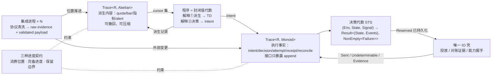

# UTA 核心设计：中心思维与设计中心

状态：核心设计 v1（已过两位讨论者压力测试与一次外部阅读评审）。读者：以后实现 UTA 的人。本文只定义**设计中心**——一切类型、模块、协议都必须能从这里的代数组合出来；不定义 crate、文件布局、传输细节。

证据边界：每条论断标 **[证据]**（来自 `research/fp-00..fp-05` 的条件式命题，编号可查）、**[设计]**（本文在证据条件下做的选择）、**[spike]**（研究无先例，实施前必须实验）。域事实只取 `problem-domain.md`（迁移自原 uta-design.md §1 与附录 B，含 F/H/C/P 编号）；原 uta-design.md §3–§6 的模型与结构细节**不作依据**，本文取代其设计中心。

---

## 0. 中心思维（一句话）

**UTA 记录看到了什么，计算可以做什么，受控地执行一次，再用证据确认发生了什么。**

订单、持仓、审批流、策略行为全部是这四步的组合结果，不是核心实体。核心里不存在任何同时承载 provider 字段与业务状态的对象。**[证据：fp-00 §1 五十三案例无一以大对象为中心；fp-02 命题 12]**

四步各对应一个机制，机制之间只通过位置、键与日志记录关联：

| 步 | 机制 | 章节 |
|---|---|---|
| 看到了什么 | 载体 `Trace<R, D>`，派生侧可撤回 | §2 §3 |
| 可以做什么 | 程序 = 封闭值代数，两种解释 | §5 |
| 受控执行一次 | 决策代数 STS + 唯一 IO 壳 | §4 §8 |
| 证据确认发生了什么 | unknown 的证据 gate + 恢复协议 | §8 |



### 0.1 进程身份与生命周期（维护者约束）

**UTA 是自己的核心进程，不随 Alice 生命周期绑定。**[设计：维护者约束]**

- UTA 独立启动、独立存活、独立停止；Alice 是它的一个消费方/控制方，不是它的父进程或守护者。Alice 退出、崩溃、重启都不改变 UTA 的订阅、程序、lane 与日志（H5/C5 已要求订阅与程序由 UTA 拥有）。
- 同一 `UTA_HOME` 单实例，由 OS 文件锁 + fence 保证（H10）；第二个实例以专用退出码拒绝启动，不做接管。
- Alice 重连拿到当前状态与 cursor 之后的记录；断连期间的投递损失按 §3 的 gap 语义显式标记，不伪造连续。
- 运维动作（装/卸程序、换凭据、重启某集成、请求快照）只经控制面（P14）以认证 principal 进入，不经进程信号或 flag 文件。
- **裁决：共享配置落盘于统一路径。** 所有 UTA 与 Alice 共享的配置（账户封存信封、封存密钥引用、集成登记、策略/审批规则、程序装载清单）必须以文件形式落在同一个用户状态根（`OPENALICE_HOME`）下的统一路径，两个进程都从文件读取；不经进程间注入、不经环境变量、不经启动参数传递。**[设计：维护者裁决]** 推论：H3 的"Alice 拉起并注入"前提失效，凭据链改为 `统一路径封存文件 → UTA 核心 → 该账户的集成进程`（C7 的"程序与消费方只见账户身份"不变）；每个文件有唯一写者（Alice 写账户与规则，UTA 写运行期登记），另一方只读并按控制面通知或文件变更重载；文件带格式版本，升级只前进（C14）。Alice 侧的适配（密钥位置、去掉 flag 重启，O8/O9）属于**接入阶段**，不在本设计范围；本设计只定 UTA 读取的文件契约。

---

## 1. 第一边界：派生可更正，现实不可被重算撤销

研究里最稳定的边界不是"观察 | 效应"（那是 §1.5 的问题域分组），而是**可撤回/可压缩的派生内容 | 只追加的执行事实**。**[证据：fp-05 命题 12"不能把负 diff 当外部 Write 的补偿"；fp-03 命题 1 log+fold 只在不可丢/须审计条件下成立]**

| 内容 | 修正方式 | 例 |
|---|---|---|
| 派生计算结果（bar、指标、信号、alert） | 撤回旧贡献、加入新贡献、重算受影响子图 | 迟到 tick 修订 bar → 均线重算 → 旧信号撤回 |
| 已发生的决策与执行事实（意图、批准、预约、发出、回执、对账） | 只追加后续事实，永不改写为"从未发生" | 行情修订让信号消失，已发出的买单仍然存在；反向交易是新行为 |

撤回派生结果不等于删除原始输入证据；原始证据的保留义务由 §6 保留协议单独定义。**[设计]**

这条边界由三层分别保证，**任何一层都不能冒充另外两层**：

1. **代数能力**：`Diff`/`Abelian` 决定能否表达撤回（§2）。
2. **持久化接口**：执行事实侧的存储接口只暴露 `append`；替换、删除、快照是另外的、需授权的操作。
3. **保留协议**：哪些历史必须留、谁批准边界推进（§6）。

"无逆元"只约束第一层，不构成存储保证。**[设计；修正自阅读评审 §三]**

---

## 2. 载体：`Trace<R, D: Diff>`，一个形状两次实例化

```rust
trait Diff: Monoid { fn is_zero(&self) -> bool }        // fp-05 案例 12 difference.rs
trait Abelian: Diff { fn neg(&self) -> Self }            // 只有派生侧要求

struct Trace<R, D: Diff> { range: RangeId, ops: Vec<(Pos, D)> }
fn integral<R, D: Diff>(tr: &Trace<R, D>, at: Pos) -> State<R>   // state = 前缀和 = fold
fn compact<R, D: Abelian>(tr: &mut Trace<R, D>, f: Frontier)     // 只对 Abelian 存在
```

- `R`：该范围的记录词表，由集成侧在边界解析给出（§7）。`R` 必须是具体类型；退化成 `dyn Any` 即违反解析边界。**[证据：fp-04 命题 15/16]**
- `RangeId = (source × stream × epoch)`：每范围独立 `Pos` 单调；**不存在全局入口序**。**[证据：fp-04 命题 11；域 P2]**
- 派生侧 `D: Abelian`（可撤回多重集，正负 diff）；执行事实侧 `D: Monoid` 无逆元（§1 第一层）。
- 状态是 `integral` 的结果，可重建、可缓存；不是被规则原地修改的对象。**[证据：fp-03 命题 1；fp-01 M8]**
- 同一形状统一 differential 派生与 event-sourcing 执行历史，**研究中无一手系统做过** → **[spike S3]**：若实验证明两侧协议实质不同，拆成两个形状，边界（§1）不变。

### 2.1 位置作为关联（收窄）

`Pos` 集合用于两件事：**输入依据**（一项决策记录它看到的行情流 A@120、汇率流 B@57、账户流 C@90）与**重放位置**。它不取代外部订单身份、幂等键、causation id——这些是独立的名义关联（§11）。**[设计；修正自阅读评审 §六]**

---

## 3. 三种进度，互不替代

| 进度 | 含义 | 承载 |
|---|---|---|
| 消费位置（cursor） | 某消费者已读到哪 | 订阅状态 |
| 完备进度（frontier / watermark） | 哪些逻辑时间之前不再有新更新 | 范围元数据，由来源声明或推导 |
| 保留边界（retention） | 还能精确重建多早的历史 | 存储元数据 |

读到某序号不证明更早事件时间的数据不会迟到。await-all 按**完备进度**触发，不按消费位置。**[证据：fp-05 案例 10④/11⑤/13⑤；fp-04 命题 10]**

### 3.1 消费方式

`Pos` 的积序 `Map<RangeId, Seq>` 上一个比较子，三种策略：

| 方式 | 语义 | 损失 |
|---|---|---|
| await-all | 所有指定输入达到要求位置/完备进度后计算 | 无（等待） |
| ordered | 按单条范围顺序处理，不跳过中间记录 | 无（背压） |
| latest / conflated | 允许合并中间更新，只保留最新值 | **有**，DeliveryGap 原因增加 `conflated`，或消费者声明的窗口界即其可接受丢失界 |

latest 不是 frontier 消费，是传输层 conflation；UI 报价可接受，依赖中间路径的阈值策略不能默认接受。损失语义必须由消费者声明。**[证据：fp-05 命题 2/15；域 C6]** **[设计]**

---

## 4. 决策代数：STS 规则，不是订单对象

```rust
trait Rule {
    type Env;      // 本次判断依据：时钟、授权策略、能力证据
    type State;    // 规则必须记住的状态：冷却、待决集合版本、lane 阻塞头、过期
    type Signal;   // 本次输入：意图、决定、超时、回执、对账证据
    type Failure;  // 每规则封闭 sum，无 catch-all
    type Event;    // 接受转换产生的事实
    fn step(env: &Env, st: State, sig: Signal) -> Result<(State, Vec<Event>), NonEmpty<Failure>>;
}
```

- 授权、输入约束、审批、期限、lane、fail-closed 各是独立规则，用 `Embed` 显式嵌入子规则的 State/Event/Failure，不共同修改一个全局对象。**[证据：fp-01 M8 cardano STS；fp-04 命题 5]**
- 规则计算"允许执行"≠ 调用 venue：决定先成为持久记录，再由 §8 IO 壳执行。
- **核心只持有规则需要的状态**。订单投影、持仓投影是消费者侧对执行事实 `Trace` 的 fold；它们可以是具名数据结构，但**不作权威、不被规则修改**。**[证据：fp-03 命题 1]** **[设计；修正自阅读评审 §一/§九]**
- 记录类型**按 stream 参数化**：每条 lane/账户 stream 有自己的 Signal 集与 decider（Equinox `Category`/`StreamId` 模式），核心不定义一个全局 effect enum。**[证据：fp-03 条目 7]**
- 规则组合分两类并显式登记：**可交换集**（相互独立的 guard，用交换性测试）与**顺序固定链**（授权→审批→lane→过期，顺序由代码固定并测试）。不存在"任意装配顺序都不改变结果"的默认。**[证据：fp-03 命题 6]** **[设计；修正自阅读评审 §九]**
- 失败 `NonEmpty<Failure>` 保留依赖结构；`Validated` 式累积只用于相互独立的校验项。**[证据：fp-04 命题 8]**
- **lane（对 venue 写入通道的有序队列 = unknown 阻塞半径）**：键 = **(账户, 子账户)**，无子账户的 venue 退化为账户。理由：这恰是 H4 要求的写全序范围；细于它（如按 instrument）防住了重复投放却防不住"资金状态未知时继续加仓"（H1 的真正含义：unknown 占用的 buying power 不按 instrument 隔离，venue 限流也按账户）；粗于它（整账户）超出 H4 且让一笔卡住的订单冻结无关子账户。子账户须先枚举（C10）。**[设计]**
- **队首阻塞是通讯协议的一部分，不是 UTA 选择的锁（维护者）**：提交是一种消费动作，只有消费者自己有权消费时才谈得上加锁；UTA 从头到尾都无权决定是否消费——消费的是 venue。lane 队首 `Undeterminable` 时后面等待，原因是**后续写的含义依赖队首的结果**（同账户的 buying power、被撤订单是否存在、venue 侧顺序），这是与 venue 的通讯协议语义，不是数据库里"我先提交"的互斥。因此**没有可越过队首的第二类队列**：能在队首发生的只有决议动作（按键查询、listing、成交/持仓对账、以及作为决议手段的 cancel-by-key），它们属于 IO 壳的对账协议，不是队列项。带 principal 的显式绕过仍可存在，但它记为 Decision 并被定性为**对协议的自觉违反**，不是队列的一种模式。**[设计：维护者修正]**
- lane 的并发协议（多个 unknown 叠加、部分收敛）与解除阻塞条件 → **[spike S7]**。

---

## 5. 程序（AI 写）：封闭值代数，两种解释

程序不是黑盒函数 `(State, Input) -> (State, Output)`——无法预算、无法静态检查、状态可序列化只是作者承诺。程序是 **deep embedding 的小闭合值**：

```rust
enum Node { Const(V), Input(Cursor), Op1(Op1, Id), Op2(Op2, Id, Id), Scan(ScanOp, Id), Window(Id, W), Join(JoinOp, Vec<Id>) }
enum Step { On(Pattern, Box<Step>), Emit(IntentT), Require(Guard, OnFail), Expire(Deadline, Box<Step>) }
struct Program { nodes: Vec<Node>, rules: Vec<Step>, state: Vec<NamedProj> }
```

- **解释①（派生）**：`nodes` → 增量 DAG，只重算受影响节点、cutoff 截断；输出写回派生侧 `Trace`——alert 就是派生观察，与外部观察同形。**[证据：fp-01 M3 Mu `Work_`；fp-05 案例 7 Incremental；域 B3/P2]**
- **解释②（决策）**：`rules` → 对日志的 fold，纯性由结构保证而非约定。**[证据：fp-01 M7 Mercury Workflow]**
- **输入 = 位置推进**（frontier + cursor 之后的记录），程序看得见 gap 与两种时间。**输出 = (Intent 集, 派生记录集)**。
- 状态分两类：**可安全重算的数据状态**（`Scan`/`Window` 累加器，属解释①）与**绑定不可逆外部行为的执行状态**（冷却、lane 等待、审批等待、过期，属解释②）。后者不进派生 DAG——Incremental 的 height/cycle 约束与 Salsa 的 cycle panic 禁止自反馈环。**[证据：fp-05 案例 7⑤/9⑤]** **[设计；修正自阅读评审 §五]**
- 程序**无写能力**：Intent 是值不是调用；capability token 只授权不执行。预算（C4）靠宿主隔离，不靠类型。**[证据：fp-03 命题 7；域 H2/H3]**
- 核心越小越封闭，穷尽/预算/静态分析越强（Marlowe 6 构造子、FPF 非图灵完备）；作者面语法朴素，类型级复杂度封在核心。构造子膨胀到 TradingView 当量即退化成 Pine-with-limits。**[证据：fp-01 M9/M10；fp-05 案例 14⑥]**
- 小语言能否表达真实策略且不膨胀 → **[spike S5]**；程序状态序列化/版本化/重放边界 → **[spike S4]**。

### 5.1 程序隔离运行时的前提（维护者约束）

**Wasm 只在"三 OS（macOS / Linux / Windows）通用、开箱即用"的方案存在时才可选。**[设计：维护者约束]** 开箱即用的判定：作为普通 Rust 依赖引入即可在三 OS 构建与运行，不需要系统级安装、外部工具链或平台特判；预算手段（fuel/内存上限）与 trap 语义在三 OS 一致；打包为独立二进制时无平台差异。

- 已知事实：Wasmtime 无 live `Store` 快照/恢复 API，Component Model async ABI 未完成，fuel 是确定性指令预算但管不住阻塞 host 调用（`problem-domain.md` §1.4.2）。这些是能力缺口，不是三 OS 通用性缺口；通用性本身需在 spike 中按上述判定实测。
- 若判定不成立，程序隔离退回**受监督子进程**：预算靠 OS 进程限制，状态经内部协议显式序列化；§5 的封闭值代数与两种解释不变——隔离运行时只是解释器的宿主，不进入设计中心。
- 无论哪种运行时，程序状态都必须显式可序列化（S4），不依赖运行时快照。

→ **[spike S11]**：按判定标准实测 Wasm 三 OS 开箱即用性与预算一致性，产出可/不可结论。

---

## 6. 保留协议

- 推进保留边界前必须处理仍被引用的 `Pos`：保留历史、保存必要证据，或明确缩小重放承诺（`AS OF ≥ retention frontier`）。**[证据：fp-05 案例 13⑤ Materialize]**
- 派生侧按 frontier 压缩（`compact` 只对 `Abelian` 存在）；执行事实侧按 §1 第二层只 append，快照只做加速。**[域 P15]**
- 谁登记引用、谁批准边界推进、原始证据与派生历史各留多久 → **[spike S8]**。

### 6.1 存储引擎：SQLite（维护者裁决）

两侧 `Trace` 与规则状态落在**一个 SQLite 文件**（WAL 模式），不手写分段日志与索引。**[设计：维护者裁决，理由"否则需要自己写索引"]**

- 每张 trace 表主键 `(range_id, pos)`，`pos` 单调；`integral`/`AS OF`/cursor 之后的记录都是范围扫描，索引由引擎给。
- §1 第二层"执行事实侧只 append"由**Rust 侧存储接口**保证（该表的模块 API 只暴露 `append`），不靠 SQL 权限；派生侧 `compact` = 在保留边界之下的 `DELETE`，只对 `Abelian` 表存在。
- "决策 append + 投递 outbox + 规则状态更新"是一个 SQLite 事务：单文件事务消解了跨存储原子性问题。
- 单写者：核心进程唯一持有该文件（H10 的 OS 文件锁与 SQLite 锁同向）；集成进程与程序隔离域**不接触**数据库，只经内部协议与核心交换记录（C7 凭据链、H2 程序不可信）。
- 快照只做加速：状态可随时由 `integral` 重建；格式版本存在 schema 表，升级只前进（C14）。
- 这项裁决关闭 S8 的"引擎"部分；S8 保留"引用登记、边界推进审批、留存时长"三项归属；S3（同一 `Trace` 形状是否两侧共用）在 SQLite 里退化为"两侧是否共用同一张表结构"，实验成本降低但仍是 spike。

---

## 7. provider：开放实例，能力是有时效的证据

- provider = 开放实例，核心对其多态；加 provider 不改核心（轴 A additive）。核心的**操作种类集合小且闭合**；加一种操作必然改所有 provider（轴 B），显式接受。**[证据：fp-03 命题 8；fp-01 M1 Haxl `DataSource`]**
- 能力 = **运行期握手获得的值**，带范围、来源、观察时间：
  ```rust
  struct Capability { op: OpKind, verdict: Verdict, scope: Scope, source: Source, observed_at: Instant }
  enum Verdict { Supported(Evidence), Unsupported, Unknown }
  ```
  F6"部分未文档化"的能力不可能是静态保证；八条目一致。写操作的 `Evidence` 含 unknown 证据渠道声明（by-key / listing+venue id / fills / 无）。**[证据：fp-03 命题 3；域 P1/C2]** 三值模型本身是新设计 → 与 §8 的结果未知**分开**：能力未知约束启动，结果未知约束恢复。**[设计；阅读评审 §七]**
- 集成输出两层：**raw evidence**（原始字节永远保留，C13）与 **validated payload**（入口解析成内部小词表；parse-don't-validate，构造器隐藏）。venue 状态映射按 venue 枚举输入，输出**必须保留 `Unmapped(raw)`**，不能靠"无 catch-all"伪造穷尽。**[证据：fp-04 命题 15/16；域 C13/F6]**
- 只读请求可批处理/去重的条件：无可观测副作用 + 稳定 identity + 幂等 + 可接受批窗口。写永不进这条路。**[证据：fp-03 命题 4；fp-02 命题 1/2]**
- venue 词汇不进核心。**[域 B6]**

### 7.1 集成 = 独立进程，协议 = JSON-RPC（维护者裁决）

- **每个集成是独立 OS 进程**（每 venue × 账户一个），是核心之外的独立故障域与凭据终点：凭据链 `统一路径封存文件 → 核心 → 该集成进程`（§0.1、C7）；集成崩溃只影响它拥有的 range（记 SourceGap），核心不受影响。**[设计：维护者裁决（D1）]**
- **集成不一定用 Rust 写。** 集成进程的语言不受限（venue SDK 是什么语言就用什么语言）；因此核心↔集成的契约必须是跨语言的：一份 IDL，任何语言按 IDL 实现即可接入。**[设计：维护者裁决]**
- **核心↔集成、核心↔消费方的传输默认 JSON-RPC**（序列化文本，跨语言、可读、可录制回放）。**特定情况**（高频推送流的吞吐/延迟经实测不达标）**单独考虑二进制序列化 RPC**，作为同一 IDL 的另一种编码，不是第二套协议；触发条件与基准在 spike 中定。**[设计：维护者裁决（D2）]** Windows 上无 UDS（§1.4.2），传输层按 OS 选本地回环 + 本地令牌或命名管道，不影响 IDL。
- 集成的义务由 IDL 固定：能力握手（§7 `Capability`）、观察记录按 range 位置推进、raw evidence + validated payload 双层输出、投放与对账查询（只由核心 IO 壳调用）、SourceGap 上报。集成**不持有**规则状态、不做决策、不接触 SQLite。

---

## 8. 写边界的两阶段协议与对账：受控执行一次，用证据确认

**定性（维护者）**：unknown 不是一个孤立的类型问题，是一个**对账系统**；写边界上的协议就是**两阶段事务**（prepare = `Reserved` 持久化，commit = 发出并取得回执，in-doubt = `Undeterminable`，resolution = 对账）。**工作假设**：两阶段**大体上**只存在于写操作的边界——STS、`Trace`、程序、消费方只见结果记录，不参与协议；维护者明言这条"不一定对，但大体应该如此"，由 `research/fp-06-reconciliation-and-in-doubt.md` 的先例（XA in-doubt 事务、支付 pending/settlement 对账、FIX 订单状态查询与重传、工作流平台 at-least-once activity）校验：若先例显示 prepare/in-doubt 状态必须被写边界之外的某层可见（例如 lane 阻塞、对账发起方、审计投影），则在此处收窄假设并写明哪一层、为什么。**[设计：维护者定性 + 待校验假设]**

fp-01–05 的 FP 案例集里没有把 in-doubt **类型化**的成熟先例（这是那组调查的范围限制，不是领域无先例）；可迁移的三条：**[证据：fp-01 M7 Mercury；fp-04 命题 12 Stripe/PayPal；fp-03 命题 5 Fowler]**

1. 决策是对日志的纯函数；投放是**唯一 IO 壳**。
2. 有幂等键的 venue 用键：key ↔ attempt ↔ latest status。
3. 重放只重算决策，IO 壳抑制外部写。

**不锁 ≠ 不要两阶段（维护者）**。两阶段协议照样需要，因为它的价值不在锁，而在**已经定义了中间态的副作用语义**：prepare 之后、resolution 之前，效果被定义为"可能已发生"——既不是成功也不是未发生，不能重发，也不能当作没做过，只能由 resolution 用证据收敛。这正是 F5 所需的那个定义，所以 `Reserved` → (`Sent` | `Undeterminable`) → Reconciliation 保持为两阶段协议，而不退化成"发一次、超时算失败"的单阶段调用。凡是能看见 `Reserved`/`Undeterminable` 记录的层（lane 队列、投影、对账发起、审批人视图）**都必须按"可能已发生"解释它**，这就是中间态语义从写边界向外可见的唯一方式；fp-06 校验的是各先例把这条可见性放到了哪些层。**[设计：维护者定性]**

**在 2PC 里的位置**：UTA 是协调者；venue 是一个**总是单方面决定**的参与者——它不 prepare、不等协调者裁决，收到请求即自行 commit 或 reject，协调者事后只能发现结果。这在 2PC 语义里不是缺失，而是已定义的分支：参与者单方面完成（XA 的 heuristic 结果），协调者进入 in-doubt 并以查询/日志决议。UTA 的每一次写都落在这个分支上，所以决议出口只有 found / absent / inconclusive，协调者没有 commit/rollback 可下达。名字保持"两阶段"，因为中间态语义与决议流程都来自它；只是 UTA 永远处在参与者已单方面决定的那一支。**[设计；先例由 fp-06 校验]**

本文的选择：

- **发 IO 之前用 typestate**：`Reserved` 记录已持久化才允许调用投放（这段转移静态已知，满足 fp-04 命题 4 条件）。
- **发出之后是持久的运行期 enum + 证据 gate**：IO 壳写回 `Sent | Undeterminable`；`Undeterminable` 的唯一后继是携带 P1 声明渠道证据的 Reconciliation 记录（found / absent / inconclusive；无渠道或 inconclusive → 停在带 principal 的人工）。同 lane 在 `Undeterminable` 无后继时不产生新 Attempt。**[域 C1/C2/C12]**
- **恢复协议**：重启时任何 `Reserved` 且无 `Sent`/`Undeterminable` 后继的尝试**一律视为 `Undeterminable`** 进入证据 gate——发出与持久化之间的崩溃窗口无法区分，只能保守。"重放关闭 IO"不覆盖这个窗口。**[设计；修正自阅读评审 §八]**
- 不宣称"unknown 的可组合代数"。记录模型与恢复协议按 fp-06 的对账先例校准 → **[spike S1/S10]**。

### 8.1 场景：买入请求超时

1. 行情到达，形成带位置的输入。2. 增量计算产生突破信号（派生侧）。3. 程序产生买入意图，记录输入依据 `Pos` 集。4. STS 检查授权、输入约束、审批、期限、lane。5. 持久化 `Reserved`。6. IO 壳发送。7. 超时 → 记 `Undeterminable`，不记失败。8. 同 lane 阻塞。9. 按能力证据渠道查询幂等键 / 订单 / 成交，或进入人工。10. 追加对账证据，规则决定收敛与解除阻塞。
若行情随后修订：撤回旧信号，不抹去发送历史。若进程重启：重放恢复状态，不重发；`Reserved` 无后继者按恢复协议处理。

### 8.2 副作用来自读；读→写依赖不是隔离问题，是依据的有效性问题（维护者）

- **UTA 的副作用不是数据库写**。SQLite 是记录，不是效应；真正的副作用是对 venue 的写。而写是由**读的动作**产生的：AI 读了观察发出请求、程序读了观察满足规则产生 Intent、审批人读了待决集合作出决定——三者没有本质区别，都是"读的副作用消费为写"。这就是 §0 四步的因果方向：看到 → 决定 → 执行。**[设计：维护者定性]**
- 因此**两阶段只在写边界**成立的正常情况是：写**不依赖一次新鲜的读**——Intent 的参数在意图形成时已固定，写边界只需保证"执行一次并取证"。
- 当写**依赖读**（限价单的价格来自查询/最新报价，数量来自持仓读数，撤单目标来自订单 listing）时，读与写之间出现一个边界，**它与数据库事务的隔离要求完全不同**：venue 是外部世界，没有 serializable snapshot 可锁；能做的不是隔离，而是——
  1. 读本身是一条带 `Pos` 的观察记录（一次性查询也写入派生侧 `Trace`，与推送观察同形，§2/§3）；
  2. Intent 的**依据**字段记录它消费的 `Pos` 集与取值（§2.1）；
  3. 写边界 prepare（`Reserved` 之前）由一条 STS 规则检查依据的**有效性**：依据位置相对当前完备进度的滞后不超过该操作声明的窗口，依据引用的记录未被撤回（派生侧负 diff），待决集合版本与决定时的期望一致（C11）。不满足 → 规则否决（`PredicateFailure`，fail-closed，C12），不发出；
  4. 有效性窗口是**操作种类 × 账户策略**的参数，不是全局常量；无窗口声明的操作默认要求依据不晚于最近一次完备进度。
- **UTA 唯一的锁是草稿（§8.3）；执行阶段与观察侧没有锁（维护者）**。提交是消费动作，只有有权消费者才谈得上锁。F1：venue 域事实（账户、持仓、订单、成交、价格）由 venue 消费与裁决，UTA 无权决定是否消费，因此对它们**不存在 UTA 的锁**。UTA 自己的记录（审批、意图、尝试、队列顺序、程序装载、订阅表）是 UTA 说出的话，UTA 对它们有**权威**，但权威不是锁：append-only 日志上顺序就是位置本身——单写者（H10）、每次 append 原子、没有第二个写者争同一位置。唯一例外是**意图形成期的草稿**：那里确实有多个编辑者争同一份东西，草稿本身就是锁（§8.3）。过期读由 C11 的依据版本**可见**，不需要锁让它不可能。
  - **对 venue 的写入通道**：每 (账户, 子账户) 一条有序队列（H4）。它的有序与队首阻塞来自**通讯协议**——后续写的含义依赖队首结果（见 §4"队首阻塞是通讯协议的一部分"），不是 UTA 抢占通道的锁；UTA 不能通过"先拿到通道"改变 venue 消费什么，只能决定自己以什么顺序把请求交给协议。
  - **记录的追加**：执行事实侧只 append，位置即顺序；SQLite 单写者是记录器的实现事实，不是域语义。C11 的"待决集合版本期望"是决定对它所见日志位置的**因果引用**（决定时看到的 `Pos`），不匹配 = 决定建立在过期的读上 = 依据有效性失败，归入上面第 3 条同一规则，不是版本锁。
  - **对外部状态无锁**："依据有效性"只是对证据新鲜度的有界赌注，不阻止世界在 prepare 与 venue 执行之间变化（那是 F5/对账的领域）。venue 若提供真正的锁（cancel/replace 引原单身份、条件单、expected-version 改单、幂等键唯一性、保证金预占），那把锁是 **venue 的**，经能力证据（§7）声明后由 IO 壳使用；未声明则不存在，不得假装。从 UTA（非消费者）的位置看，维护者的二分成立：悲观锁是消费者自己持有、不侵入外部；乐观锁要比较的版本住在被消费状态的拥有者那里，对 UTA 而言必然是外部系统的一部分——UTA 不是消费者，所以它既做不了悲观锁，做乐观校验时锁也不在它这里。
  - DB 隔离级别的词汇（可重复读、串行化、悲观/乐观锁）不用于描述 UTA 自身。**[设计：维护者修正]**
- 推论：§8 的工作假设收窄为——两阶段协议本身只在写边界；但**写的前置条件（依据有效性）向读侧延伸一条只读的校验边界**，它不参与两阶段，只决定是否进入 prepare。fp-06 校验的是前者，这一条由本节直接给出。
- **三种读触发的写同形；授权是规则不是记录种类**：AI 发请求、程序满足规则、审批人作决定都是"读的副作用消费为写"，记录形状相同（带 principal、带依据 `Pos`）。它们的差别只在**哪些 principal 的记录足以让写进入 prepare**，这由授权规则（§4 顺序固定链）决定；S8 的"谁、何时、依据什么"由记录上的 principal 与依据字段满足，不需要为审批另设记录种类。**[设计]**

### 8.3 草稿本身就是锁——UTA 里唯一加锁的地方（维护者）

场景：两个 AI 同时编辑同一个尚未决定的暂存订单。这不是数据库事务的锁问题（事务在 `Reserved` 才开始），但它**是** UTA 里唯一需要锁的地方，而且锁就是草稿本身：

- **草稿 = 锁 + 一条线性的版本链**。一份草稿只有一种交易意图（产品规则：订单草稿不能"同时想买又想卖两个价"，与代码协作不同，不分叉不合并）。持有草稿的 principal 才能编辑；第二个 AI 拿不到草稿就不能改——被拒绝或等待，由产品决定，不产生第二个版本。
- **这把锁最大的意义不是互斥，是入口（维护者）**：它是 UTA 系统表达"**现在有一张单据，我是负责人**"的唯一入口。取得草稿 = 单据从此存在 + 某个 principal 从此对它负责；锁的持有者就是这张单据的责任人，后续的编辑、送审、push 都以这个身份记账。责任可以移交（如 AI 起草、人接手），但移交是一条显式记录，不是静默换人；没有负责人的单据不存在。S8 的"谁、何时、依据什么"从这一刻开始有主语。
- **产品层代价（维护者）**：这意味着**两个 AI 不能同时处理同一张订单**——合理，但不好用。这是核心设计有意接受的代价，不在核心层用分叉/合并去修补。协作只能以核心之外的方式发生，且都不碰草稿锁：显式移交（换负责人）；第二个 AI 另起自己的草稿（另一张单据，由决定者二选一）；或把建议发给负责人而不是发给草稿。选哪种、怎么呈现是产品决定，不改变"一张单据一个负责人"。
- **push = 加锁并写入，一次完成**。把一个版本写进草稿的 commit 链，如同 git 更新 ref：在锁内追加、释放。链是线性的、内容寻址的（每版带父 hash），保留全部历史供审计（谁、何时、改了什么、依据哪些 `Pos`），但**不需要**每次编辑做 hash 期望比较——锁已经保证了线性。
- **决定绑定链末端**：Decision 引用草稿当前末端的 hash（C11 的"对待决集合版本的期望"就是这个末端）。进入 prepare 要求被 prepare 的版本 = 被决定的版本 = 链末端；草稿在决定后被编辑则决定失效，需重新决定。
- **一个草稿至多一个版本到达 `Reserved`**：到达即草稿关闭、锁消失；此后改动只能是新意图（改单/撤单），各走各的写边界。
- 这把锁保护的是**意图形成期的线性**，不是任何 venue 域事实；执行阶段（`Reserved` 之后）与观察侧仍然没有锁（§8.2）。**[设计：维护者定性]**

---

## 9. 基础类型

| 类型 | 设计 | 依据 |
|---|---|---|
| 金额 | 精确有理/定点 + 货币索引；离散化返回余数，不静默丢钱 | fp-04 命题 1 safe-money |
| 数量 | 精确数值；**不**做"数量带 instrument 尺度"（无证据） | — |
| 身份 | `(venue, native_id)` opaque + 智能构造；instrument 只在 venue 内有意义；换名不是安全，构造器隐藏才是 | fp-04 命题 16；域 F2 |
| 时间 | event_time / recv_time 分离；deadline 用单调钟；顺序只有 `(range, seq)` 偏序 | fp-04 命题 9/11；域 F11 |
| 错误 | 每规则封闭 sum；venue 映射保留 `Unmapped` | fp-04 命题 8；域 C13 |
| 外部写结果 | `Reserved | Sent | Undeterminable` + 证据记录，非 `Option`/字符串 | fp-01 M11 DAML 反例 |

---

## 10. Rust 映射（bounded spike，非可行性结论）

需要的机制都不依赖 HKT：reify-then-execute = enum + 解释器 trait；STS = 带 Env/State/Signal/Embed/Event 的 trait；`Trace<R, D>` 泛型；typestate 用泛型标记（只到 `Reserved`）；capability 用不可伪造 token 类型。增量引擎按指标是否可撤回选节点图（Incremental 式）或 differential，二者不是任选，都不能承载外部 unknown Write。不迁移 tagless-final 多态与 Haxl `<*>` 违反 `ap` 的技巧。reify/解释器的性能代价需实测 → **[spike S6]**。**[证据：fp-05 命题 8/12；fp-03 条目 2/4]**

---

## 11. "谁和谁能关联"：五种关系，五种承载

| 关系 | 承载 | 验证阶段 |
|---|---|---|
| operation ↔ capability | §7 能力证据值 | 运行期握手 |
| request/resource ↔ provider 身份 | `RangeId`、外部订单 id、幂等键 | 构造期 / 运行期 |
| 多 effect ↔ 同一作用域 | 单条 STS 事务 | 构造期 |
| program ↔ 解释器 | 解释选择（①派生 / ②决策） | 构造期 |
| intent ↔ 结果 / 审计 / 重放 | 执行事实日志的位置 + causation id | 运行期，持久 |

把这五种塞进一个对象的字段互指是反模式。**[证据：fp-03 命题 2]**

---

## 12. 明确不做

- 不存在 `UnifiedOrder`/`Account` 权威对象；不在核心枚举 venue；不把 venue 词汇带进核心。
- 不做类型级 capability；不把运行期未知冒充静态保证。
- 写不批处理、不去重、不由 replay 重发。
- 不假设 venue 时间单调；不承诺跨源全序。
- 不在 DAG 里放绑定不可逆行为的执行状态。

---

## 13. 验收标准

1. 代码库中不存在同时承载 provider 字段与业务状态的 struct；订单/持仓只作为对执行事实 `Trace` 的 fold 或非权威读模型出现。
2. 可交换规则集通过交换性测试；顺序固定规则链的顺序由代码显式固定并有测试。
3. 任一 `Undeterminable` 记录在没有 Reconciliation 后继时，同 lane 无新 Attempt；重启后无后继的 `Reserved` 被记为 `Undeterminable`。
4. 压缩后所有仍被引用的 `Pos` 均 ≥ 保留边界。
5. 新 provider 接入不改核心 crate；新操作种类必然改全部 provider。
6. latest 消费者的每次合并都可追溯到声明的窗口界或 `conflated` gap。

---

## 14. 未决 spike

| # | 问题 | 依据 |
|---|---|---|
| S1 | unknown 写结果 + 证据渠道的记录模型（无先例） | fp-01/02/04/05 未覆盖 |
| S2 | 运行期能力证据在 Rust 中是否值得抬进类型 | fp-03 未覆盖 |
| S3 | 同一 `Trace` 形状统一 differential 派生与 event-sourcing 执行历史（SQLite 下 = 是否共用同一表结构，见 §6.1） | fp-05 未覆盖末条 |
| S4 | 程序状态显式序列化 / 版本化 / 重放边界 | fp-01 M7 前提 |
| S5 | 小程序语言的表达力与膨胀 | fp-01 M9/M10 |
| S6 | enum + 解释器 + 增量引擎的性能与资源成本 | fp-03 条目 2/4 |
| S7 | lane 的并发协议（多 unknown 叠加、部分收敛）与解除阻塞条件；键已裁决为 (账户, 子账户)，见 §4 | 域 H4 |
| S8 | 保留边界的引用登记、边界推进审批、原始证据与派生历史留存时长的归属（引擎已裁决为 SQLite，§6.1） | fp-05 命题 13 |
| S9 | 规则组合的可交换性分类表 | fp-03 命题 6 |
| S10 | 发出后-持久化前崩溃窗口的恢复协议实测（与 S1 合并） | 域 F5/C1 |
| S11 | Wasm 三 OS 开箱即用性与预算一致性实测；不成立则退回受监督子进程（§5.1） | 维护者约束；problem-domain §1.4.2 |

---

## 15. 与既有文档的关系

- `problem-domain.md`（迁移自原 uta-design.md §1 问题域与附录 B）继续有效；原 uta-design.md §3–§6 的"五轴投影 + P6–P11 现象表照抄成类型"的设计中心被本文取代。
- `research/fp-00-synthesis.md` 是本文每条 **[证据]** 的索引；`fp-01`–`fp-05` 是一手出处。
- 讨论记录：两位讨论者（steady/divergent）的压力测试与一次外部阅读评审的修正已并入 §1 §2.1 §3 §4 §5 §8。

---

## 16. 裁决记录

维护者裁决标"维护者"；其余由本文在证据与域约束下决定，反对时改本表即可。

| # | 问题 | 裁决 | 落点 |
|---|---|---|---|
| D1 | 集成的进程边界 | 独立 OS 进程，每 venue × 账户一个；语言不限（维护者） | §7.1 |
| D2 | 传输 | 一份 IDL；默认 JSON-RPC；高频流实测不达标时另加二进制编码，非第二套协议（维护者） | §7.1 |
| D3 | lane 键 | (账户, 子账户)，无子账户退化为账户；阻塞策略进规则不进键 | §4 |
| D4 | "宁重复不漏单"账户类别 | 不建模；H1 全域成立。若日后出现，是 lane 规则链里按账户的一条策略，不改键、不改 `Undeterminable` 语义 | §4 §8 |
| D5 | 人类决定过期 | 维持 H6：过期 = 否决记录，不补偿 | §4 |
| D6 | 程序作者面形式 | 核心只接受 §5 值代数的**规范序列化形式**（JSON 值树，按 schema 校验，与 `Node`/`Step` 一一对应）；任何面向 AI 的文本糖必须编译到同一值，且不是核心的一部分。表达力问题归 S5 | §5 |
| D7 | 统一路径文件清单 | 属结构文档的文件契约节，本文只定原则（§0.1）；每文件唯一写者、格式版本、升级只前进 | 结构文档 |
| D8 | 读模型位置 | UTA 进程内设**投影模块**：对执行事实 `Trace` 的可重建 fold，只读、非权威、不被规则引用，经同一 JSON-RPC 暴露；消费方也可直接订阅原始记录自行 fold。理由：S10 要求 Alice 消费面可实现，且不应让每个消费方重复 fold | §4 |
| D9 | 时间权威 | 核心是 `Pos` 与完备进度的唯一权威；集成只提供证据（venue seq/cursor/事件时间）。有 venue 游标时完备进度由证据推进，无游标时由核心按声明的滞后界从 recv_time 保守推导 | §3 |
