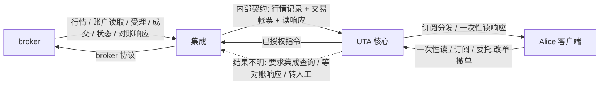
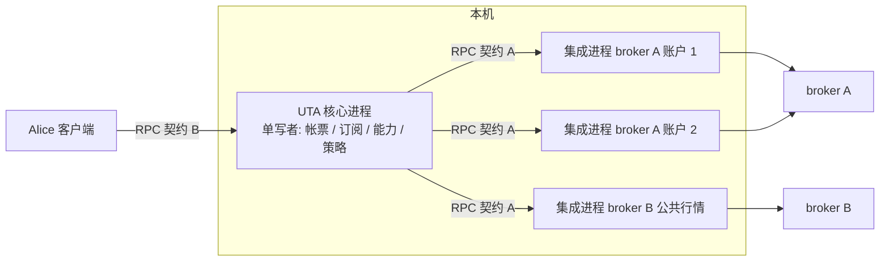

# 新 UTA 设计

读者：以后实现 UTA 的人。读完 §0 应能复述系统是什么、三条路径怎么走；§1 说要满足什么、证据在哪；§2 说概念和规则；§3 说进程、模块、存储；§4 指向契约；§5 走查；§6 风险与实验；§7 记录。

词汇只用四个来源：维护者原话（附录）、仓库类型与路径、`investigation/` 调查事实、broker 官方文档。**broker**（券商 / 交易所）、**集成**（洗协议的层）、**帐票**（指令、回票、对账响应、人工凭证这些单据）、**行情记录**、**委托 / 改单 / 撤单**、**受理 / 成交 / 状态**、**对账响应**、`aliceId`。不用 venue、ledger、账本、程序宿主。

---

## 0. 主线

### 定位

UTA 是 Alice 与其配置的各 broker 账户之间的独立守护进程。Alice 的客户端——AI 交易工具（经 SDK）、Web UI（经 BFF）、CLI、connector 审批桥（`investigation/alice-consumers.md` §1–§6）——通过它读 broker 数据、订阅行情和账户变动、下委托 / 改单 / 撤单。UTA 把指令交给对应 broker 的集成执行，把 broker 返回的每种结果按内部契约保真（原生身份、结果字段、来源都不丢，不同结果不压扁）后关联到指令并转发给订阅者。**broker 掌握交易事实；UTA 不拥有它**，UTA 手里的是自己开出的指令、递送进度和收回来的帐票。

### 四个角色

|角色|做什么|掌握什么|
|---|---|---|
|Alice 客户端|读、订阅、下指令、人工审批|账户选择与策略配置|
|UTA 核心|校验身份与权限；转发一次性读；按订阅分发行情记录与交易帐票；接指令、交集成、收回票、关联；结果不明时要求集成查询或转人工|指令、递送进度、帐票、订阅、各集成的能力声明、策略|
|集成（broker 专属）|把 broker 协议转成内部契约：行情、账户 / 持仓 / 订单读取、受理 / 成交 / 状态回票、对账响应、能力声明；只执行核心已授权的指令，不自行发起交易|broker 协议转换；凭据只在这个被授权边界内使用|
|broker|撮合、持仓、资金|交易事实（`docs/uta-live-testing.md:138` "Never trust the ledger over the venue"）|

### 两类数据、三条路径

**行情记录**（instrument 为主体）和**交易帐票**（指令、回票、对账响应，账户为主体）是两类东西，走同一条分发机制，但不互相套用主体。

**读**：两种。(1) **一次性读**——账户、持仓、订单、报价、合约搜索 / 详情 / 衍生品展开、盘口、市场时钟、历史 bar、钱包、历史记录（`src/services/uta-client/UTAAccountSDK.ts:127-279` 全部读面）：核心校验权限后转给对应集成，结果带 broker 来源与 typed 失败返回；其中持仓 / 订单 / 账户这类**对账响应**同时作为帐票保留，其余读响应不保留。(2) **订阅**——行情与账户变动：每个来源按其持久记录顺序转发；**来源之间不建立顺序、不对齐时间、不合并**（K5/K6；`src/domain/market-data/bars/bar-service.ts:3-13` 现状也只选一个来源）。

**写**：客户端提交委托 / 改单 / 撤单（带期望版本）→ 核心校验权限与参数、保留指令 → 交给该账户的集成 → 集成请求**调用许可**，核心落盘许可后回确认，集成拿到确认才调 broker → broker 返回受理 / 成交 / 状态 → 集成转成回票 → 核心用 broker 原生订单 id 或声明可靠的 client key 关联到指令（opaque、保真）→ 转发给订阅者。客户端看到的结果种类：受理、部分成交、成交、被拒、撤销、**结果不明**、对账结论、以及"broker 报了但关联不到任何本地指令的变动"（用户在 broker app 自己操作，`packages/uta-protocol/src/types/broker.ts:578-586`）。

**不明**：调用许可一旦落盘，核心就再也无法证明集成有没有调 broker——确认可能丢在传输里、集成可能拿到确认后崩溃、broker 可能受理了但回票丢了。所以：**许可已落盘且无确定回票 = 结果不明**（其中一部分其实没调用，这是避免重复下单的代价）；许可未落盘 = 集成拿不到确认、按约定不会调用 = 可证明未递。结果不明时核心要求集成按 `(broker, 指令种类)` 的能力声明去查（client key 回读 / 未成交列表 / 成交与持仓对账），查到就补票；能力声明证明不了的结论不下，直接转人工。**结果仍不明时不再发放新的调用许可**。

### broker 差异

集成在连接时声明能力：支持哪些指令与读 / 订阅种类及返回字段、是否有 broker 文档化幂等语义的 client key、结果不明时有哪些查询渠道、订阅配额、历史 bar 是否支持与 pacing。核心据此决定能否下发、怎么查、订阅是否接受；配额不够在订阅时明确拒绝。推送断线重连若无续传游标即为缺口，核心把缺口明确告诉订阅者，即使能回填也不掩盖。（调查十家 broker，当前实现六家；无一提供续传游标，`investigation/broker-capabilities.md:12`；幂等键仅三家明确，`:7`。）

### Alice 看到的契约

- **解析**：instrument 用带来源前缀的 `aliceId`（`bars/types.ts:6-15`）；四种解析语义分开：精确 source、provider 前缀、无 source 的全账户 fan-out、trading-only 过滤（`UTAManagerSDK.ts:81-129`）。
- **部分失败**：fan-out 时每个账户独立返回；失败是 typed 的（不可用 / 未找到 / 冲突 / 结果不明 / 过期），一个 broker 挂了不影响其他账户的结果，客户端可保留上次数据并标 stale。
- **能力与新鲜度**：读结果带来源与数据时刻；历史 bar 只在能力声明支持时可读，带质量 / 新鲜度元数据。
- **冲突**：写带期望版本；版本不匹配返回冲突、不执行；结果不明不当冲突也不当失败。
- **时限**：每个请求有 deadline；超时对客户端是 typed 结果，对已递出的写不代表失败。
- **重连**：核心独立于 Alice 生命周期；客户端断开重连后订阅按游标续接，缺口显式告知；配置变更走核心自己的重载，不要求 Alice 重启。
- **传输**：一份跨语言 RPC 契约（序列化文本 / IDL，K1），是 Alice 与 UTA 之间唯一边界；现状 HTTP JSON 是待替换的实现。

### 权限

读写权限在核心判定：会话身份 × 账户用途（data-only / read-only / 可交易）× Alice 策略（`allowAiTrading`、connector 人工审批）；策略或配置读不到 → 拒绝（fail-closed）。集成只能写回自己账户的帐票与行情。

### 非目标

不说任何 broker 协议；不做会计账本——不把本地计算当 broker 余额 / 持仓的真相，只规范化并转发 broker 数据；不合并行情、不对齐时间；核心内不运行用户程序（WASM 不在范围）；不做回测框架。

### 为什么重写

现状 `services/uta/` 的四类问题（`investigation/existing-capabilities.md:258-277`）：
1. **身份、授权、校验失守**：所有权检查可绕过、非法数量不拒、子账户选择可绕、guard 绕过健康记账且先记冷却再发（E1–E3、E18–E19）。
2. **先产生副作用再落盘，恢复信息丢失**：broker 调用之后才持久化，中间失败留下无法判定的批次；重启丢掉进行中的指令与审批上下文（E6、E20）。
3. **broker 结果与身份被压扁或丢失**：任何异常记成 rejected、无"不明"；成交字段解析时丢；状态只映射三种；broker 原生 id 与成交数据在部分集成丢失（E5、E7–E9、E13–E14、E16）。
4. **隔离与适配错误**：跨结果污染的元数据、模拟器与真实语义不一致、初始化顺序、paper / live 身份碰撞（E10–E12、E15、E17）。

---

## 1. 驱动

### 1.1 基线（维护者定下，不重新论证）

|#|基线|原话|
|---|---|---|
|K1|完全重写；独立进程、独立二进制；跨进程只有序列化文本或跨语言 RPC；不考虑打包|"UTA本次是完全重写，且必须是独立进程，而且不考虑打包问题，UTA应该是独立二进制被调用，跨进程通讯应该序列化文本或者跨语言的rpc"|
|K2|Rust 优先；只有 Rust 对某个具体技术点确实不可行时才用 TS|"现在是偏向rust，实在不行才有ts，其他一概不考虑"|
|K3|核心不处理 broker 协议；集成层洗协议后送内部协议；核心消费统一但可扩展的内部协议|"uta本身非常像反向代理，uta的核心不处理协议怎么交互，协议交互是集成层自己洗过了然后送到uta，uta然后再直接消费自己内部尽可能统一但是有扩展性的协议"|
|K4|核心职责是订阅后分发 effect；纯单线程不可接受|"UTA的核心职责是订阅后分发effect，纯单线程做这种事情并不好考虑"|
|K5|instrument 是唯一市场数据主体；关系在消费者的输入声明里；UTA 不组合数据|"不应该只把期权看作指令集合…最终难道你要组合数据吗"|
|K6|不做跨渠道时间对齐；只有先后顺序；消费是否有序由消费方决定|"时间不应该要求对齐，而是先后顺序一致"；"消费的时候是否要有序那是程序的事情"|
|K7|TradingView 式可组合性是消费方的事；UTA 不做每 bar 全量重跑的执行模型；本次核心内不运行用户程序|"tradingview式的做法需要巨大的运行时成本…"；本轮："wasm不在现在的实现范围"|
|K8|effect 抽象后必须能安全互相影响：副作用怎么消费、谁和谁能关联|"不管有没有wasm，副作用怎么消费，谁和谁能关联在一块，抽象怎么做"|

Rust 可行性（`investigation/rust-feasibility.md`）：未发现不可行点；tonic 在 Windows 不支持 UDS（`:165`）→ Windows 传输另选；目标平台 macOS / Windows / Linux（`README.md:32`；`docs/development-workflow.md:280,324`）。

### 1.2 外部事实（不能设计的）

|#|事实|证据|
|---|---|---|
|F1|broker 是交易事实的权威；本地记录是对它的解释|`docs/uta-live-testing.md:138`|
|F2|instrument 身份只在其 broker 内有意义|`broker.ts:615-621,600-606`|
|F3|写请求可能到达 broker 而调用方拿不到回执|gRPC/tonic deadline 语义（`rust-feasibility.md:175`）；网络固有|
|F4|broker 的能力、限额、幂等 / 回读 / 续传语义按 broker × 操作种类不同，且不少条目官方未文档化|`broker-capabilities.md:148-178`|
|F5|broker 会限流；历史 bar 有 pacing|`broker-capabilities.md` §2–§3；`ccxt/exchanges/hyperliquid.spec.ts:95-99`|
|F6|子账户 / 钱包是某些 broker 的结构|`broker.ts:535-553`|
|F7|用户可在 broker 自己的 app 下单、出入金；UTA 只能事后看到|`broker.ts:578-586`|
|F8|订单从未成交列表消失不等于终态；listing 可能滞后或不完整|`UnifiedTradingAccount.ts:853-877`；Longbridge `client_request_id` 仅缓存 10 分钟（`broker-capabilities.md:156`）|
|F9|推送流有自己的时钟；broker 事件时间与本地收到时间不同源|`bars/types.ts:92`|
|F10|现有十家 broker 无一提供通用续传游标；客户端幂等键只有 Longbridge / Alpaca / Bitget 明确重复语义|`broker-capabilities.md:12,7`|

### 1.3 客户端需求（`investigation/alice-consumers.md:196-207`，只保留用户可见语义，机制不继承）

|#|需求|用户可见语义|
|---|---|---|
|N1|来源限定的 instrument 身份|`aliceId` 带来源前缀；bars `{sourceId}\|{nativeSymbol}`|
|N2|显式解析语义|精确 source / provider 前缀 / 无 source 全账户 fan-out / trading-only 过滤是四条不同路径|
|N3|统一可扩展的读面|账户、持仓、订单、报价、衍生品发现、盘口、市场时钟、历史 bar、合约搜索 / 详情、钱包、历史记录|
|N4|部分失败与生命周期状态|fan-out 每账户独立成败；UI 可留 stale；connector 区分 unavailable / expired / not-found / conflict / delivery-failed|
|N5|bar 的能力与质量元数据|历史 bar 以能力为条件；带 quality / freshness|
|N6|无隐式跨渠道对齐|一次读选一个来源；组合在消费方|
|N7|写的进展可见|提交、决定、递送、回票各阶段可见，不压成一个结果|
|N8|冲突与不确定分开|带期望版本；冲突拒绝不执行；结果不明不自动重试|
|N9|只读与策略 fail-closed|read-only 账户、`allowAiTrading`、人工审批在 UTA 边界强制|
|N10|独立生命周期|UTA 独立重启；客户端重连续接；配置变更不要求 Alice 重启|
|N11|有界等待|每请求 deadline；健康探测快|
|N12|跨语言序列化边界|一份契约，Alice 侧生成客户端|

### 1.4 场景（每条：刺激 → 期望 → 怎么看出来）

|#|场景|刺激|期望|怎么看出来|
|---|---|---|---|---|
|Q1 正常下单|AI 工具在账户 X 下一笔委托|受理 → 部分成交 → 成交依次可见；每张回票带 broker 原生 id 与成交字段|订阅者收到三张回票，字段与 fixture broker 一致；指令视图最终 = 成交|
|Q2 许可后崩溃|调用许可已落盘、核心在收回票前被 kill -9。变体 ①：确认已进 socket 缓冲但集成日志无记录；② 集成拿到确认后调用前崩溃；③ **脑裂**：核心重启建立新会话 B 后，旧集成实例 A 才从缓冲读到它自己的合法确认并调用 broker|重启后该指令 = 结果不明；不再对该尝试发放任何许可；账户队头阻塞；③ 中 A 的回票带 client key / 原生 id → 关联到同一尝试并收敛，或进入对账|fixture broker 调用记录 ≤ 1；指令有恰一条许可记录；③ 中 A 的回票关联到原尝试，无第二次下单|
|Q3 不明收敛|Q2 之后，三种能力声明：client key 回读 / 未成交列表 / 无渠道|回读得到 → 补回票；列表查到 → 补回票；查不到但能力不能证明未递 → 人工；无渠道 → 人工|每种环境末态可枚举；人工态只能由带身份的人工凭证关闭|
|Q4 许可前崩溃|指令已保留、已交集成、集成请求许可但核心未落盘时 kill -9|集成收不到确认不调用；重启后判定未递，指令回到待递或按策略过期；不算不明|fixture 调用记录 = 0；无许可记录|
|Q5 结果保真|fixture 回 partially_filled(3/10) → filled；另一笔 broker 专有状态|三张回票原样保留；专有状态映射为非终态并保留原值；未列举状态 → 标不明 + 告警，不静默映射|指令视图成交量 = 回票累计；映射表无"其他 → rejected"|
|Q6 外部变动|指令 pending 期间 broker 报一笔成交，id 对不上任何指令|记为外部变动；不归因到 pending 指令；pending 状态不变|外部变动帐票存在且无指令引用；订阅者收到它|
|Q7 同账户并发|UI 与 AI 100ms 内各下一笔到同一账户；变体：第一笔结果不明|同账户按提交顺序递送；头一笔不明时后一笔等待并告警；其他账户不受影响|fixture 调用不重叠；不明期间无第二次调用|
|Q8 校验与权限|三笔：instrument 属他账户 / 数量 0 或 NaN / read-only 账户下单|创建时拒绝：指令与否决决定一次落盘，各带原因；权限类拒绝另记安全事件；无递送|fixture 调用为空；三对（指令, 否决）；一条安全事件|
|Q9 人工审批|策略要求人工；connector 审批带期望版本；另一笔审批过期|批准记录含身份、时间、依据、期望版本；过期 → 一条过期决定（终态"过期"），无递送|指令视图可答四问|
|Q10 期望版本冲突|两个客户端对同一指令用同一期望版本决定|第二个得冲突、不执行、不改状态|冲突记录存在；指令状态不变|
|Q11 行情订阅与断线|订阅 200 个 instrument 的 tick；集成断线 30s 重连；broker 无续传|断线前后各自连续；重连处新代数首条是缺口记录，说明前一段最后序号|订阅者收到缺口；无静默跳过|
|Q12 慢消费者|三个订阅者一个不 ack|慢者收到投递缺口且停投直到确认；其他两个不受影响|两快者延迟不变；慢者有缺口记录|
|Q13 配额|broker 限 500 symbol；第二个订阅使总数超限|订阅时明确拒绝，说明配额；已有订阅不受影响|拒绝为 typed 结果；集成未收到超限订阅|
|Q14 历史 bar 回填|订阅带回填 500 根；broker 有 pacing；中途断线|按 pacing 拉页；回填与实时进同一流、边界去重；就绪状态 backfilling → live 恰一次；断线后新代数从头回填|订阅者看到就绪切换一次；无重复 bar（同代数内）|
|Q15 一次性读 fan-out|无 source 读持仓，3 账户其一 broker 挂|其余两个返回；挂的返回 typed 不可用；deadline 内回|结果每账户独立；持仓响应作为对账响应留票|
|Q16 能力不支持|向声明无历史 bar 的集成读历史|typed `Unsupported`，不是空数组|响应类型可枚举|
|Q17 崩溃恢复|核心在 ① 追加帐票中途 ② 订阅表替换中途 被 kill -9|重启后只有完整记录；订阅与游标恢复；半写文件识别并丢弃|无半条记录；订阅者续接|
|Q18 配置热变更|① 改策略 ② 换一个 broker 的凭据|① 下一笔指令用新策略，不中断任何流；② 只该 broker 的流有缺口 / 会话重建，其他 broker 不受影响|其他 broker 序号连续|
|Q19 会话身份|① 请求体伪造身份 ② 未认证连接 ③ 已认证但无权的控制请求|① 以会话身份为准按权限拒绝 ② 拒绝连接 ③ 拒绝并记录|无递送、无配置变更；有安全事件记录|
|Q20 双实例|第二个核心对同一数据目录启动|拒绝启动并说明持有者；持有者死后可接管|退出码与诊断|
|Q21 格式升级|N+1 版二进制读 N 版目录；反向；迁移中途断电|迁移后等价；旧读新拒绝并说明；断电后无第三态|退出码 / 记录|

### 1.5 约束与优先级

- T1 传输：一份 IDL；macOS / Linux 用 UDS；Windows 另选（tonic 无 UDS）。
- 优先级：Q2/Q3/Q4/Q7（写的安全）> Q11/Q12/Q13（分发的不静默）> Q15/Q16（读面）> 其余。

---

## 2. 模型

只讲概念和规则，不讲 crate、文件、进程。

### 2.1 身份

- **账户** `AccountId`：Alice 配置里的一个 broker 账户；paper / live 是不同账户，永不共用记录（E17）。**子账户** `SubAccountId?`（F6）。
- **instrument**：`aliceId` = 来源前缀 + broker 原生身份（N1、F2）；市场数据的唯一主体（K5）。
- **指令** `InstructionId = (AccountId, 客户端幂等键)`：同键重复提交返回同一指令，不创建第二条。
- **broker 原生订单 id**：opaque 字符串，来自回票，保真不转换（E13）。**client key**：核心生成、随指令下发，仅当能力声明 broker 有文档化幂等语义时用于关联与回读。
- **身份**（会话）：`Client(名称) | Integration(AccountId) | Human(名称) | Core`。所有记录都带记录者身份；请求体不携带身份（Q19 ①）。
- **来源** `SourceId = (AccountId | PublicFeed(broker), 流种类)`；**流** = 来源内一条有序记录序列；**代数** `Generation`：每次连续性断裂加一。

### 2.2 帐票种类（K8 "谁和谁能关联"的答案）

|帐票|签发者|引用|
|---|---|---|
|指令（委托 / 改单 / 撤单）|Client / Human|改单 / 撤单引用目标指令或 broker 原生 id|
|决定（批准 / 否决 / 过期 / 冲突）|Human / Core / 规则|指令 + 期望版本|
|递送进度（已交集成 / 调用许可 / 结果不明 / 未递）|Core|指令 + 尝试号|
|回票·状态（受理 / 部分成交 / 成交 / 被拒 / 撤销 / 专有状态；累计成交量、平均成交价等**累计字段**）|Integration（转自 broker 的订单状态）|指令（经 broker 原生 id 或 client key）；关联不到 → 外部变动|
|回票·成交（**逐笔**：broker 成交 id、单笔数量、单笔价格、佣金、broker 时间）|Integration（转自 broker 的成交事件；只有 broker 提供逐笔成交时才有）|同上；一张状态回票可对应多张成交回票|
|对账响应（持仓 / 订单列表 / 账户 / 回读结果）|Integration|时点；回读结果引用指令|
|外部变动|Integration|无指令引用；说明为何关联不到|
|人工凭证|Human|指令；结论 = 已递(id, 状态) / 未递|
|缺口（来源缺口 / 投递缺口）|Core|流、前一段最后序号、原因|

所有帐票不可变、只追加；引用只能指向已存在的帐票。

### 2.3 指令的生命周期

状态不是可写字段，是"这条指令手里有哪些帐票"的函数：

|手里有|状态|
|---|---|
|指令，无决定|待决定|
|否决 / 过期|已否决（终态）|
|批准，无递送进度|待递|
|已交集成，无调用许可|递送中（崩溃恢复：可证明未递 → 回待递，重新派发同一指令）|
|调用许可已落盘，无回票，查询未得结论|**结果不明**|
|回票·状态|受理 / 部分成交 / 成交 / 被拒 / 撤销（按 broker 状态单调折叠）；成交回票不改变状态，只补充逐笔明细|
|人工凭证|人工结论（已递则按其给的状态继续接回票；未递则终态）|

规则：
- **R1 先许可后调用**：指令与"已交集成"在集成收到之前落盘。集成在调 broker 之前向核心请求**调用许可**；核心落盘许可（绑定 `指令 id + 尝试号 + 账户 + 集成会话 + 请求摘要`，同尝试号不同摘要拒绝）后回确认；集成**收到确认才调用，且同一许可只调用一次**；没收到确认不调用；会话断开丢弃待发项。许可是**安全边界，不是调用事实**：许可落盘后核心不再能证明是否调用，只能靠回票 / 查询 / 人工。一旦许可落盘，该尝试永不再许可给任何集成实例；"已交集成"阶段的指令可以重复投递给集成，集成按指令 id + 尝试号去重、无许可确认绝不碰 broker。集成使用的 broker SDK / HTTP 客户端**必须关闭对写请求的自动重试**；只有能力声明中 broker 文档化保证同 client key 幂等时，才允许按该能力规则重放同一尝试（这是 2.4 的一条渠道，不是通用重试）。
- **R2 一账户一队**：同账户（同子账户）的写按批准顺序递送；头一条结果不明时后面等待并告警（Q7）。跨账户互不等待。
- **R3 不明不重发**：结果不明期间不创建新的 broker 尝试；不明只能由回票、对账回读、或人工凭证关闭。
- **R4 折叠与去重**：**状态回票**按 broker 状态偏序折叠，迟到的旧状态不覆盖新状态，累计字段取最新；去重键 = broker 事件 id，或指纹 (broker 原生 id, 状态原值, 累计成交量)——不含时间戳，broker 服务端重复推送同一状态不产生第二张。**成交回票**逐笔保留、不折叠；去重键 = broker 成交 id：同 id 再到、数量与价格相同 → 丢弃；同 id 但佣金从无到有（broker 的佣金报告独立于成交事件到达，如 IBKR `CommissionReport`）→ 追加一张**佣金补录**回票引用该成交 id，不改原成交回票；同 id 数量或价格不同 → 追加"成交冲突"记录 + 告警，两张都保留、不折叠。broker 不给成交 id 的，集成**不得**输出成交回票（不能虚构逐笔），只输出状态回票的累计字段，并在能力声明标明"无逐笔成交"；违反者的提交被 typed 拒绝、不进流、计入健康读的"被拒记录数"。消费者算成交量用状态回票的累计字段，算明细（多笔成交、各自价格与佣金）用成交回票 + 佣金补录。
- **R5 保真**：状态回票保留 broker 原生 id、状态原值、累计字段、原始负载摘要；成交回票保留 broker 成交 id、逐笔字段、佣金；映射表按 broker 版本化，表外状态 → 标不明 + 告警，不落入被拒（E5、E7、E8）。现有代码里 IBKR `OrderStatus`（filled / remaining / avgFillPrice）是状态快照、`Execution`（execId / shares / price / cumQty）是逐笔（`packages/ibkr/src/protobuf/OrderStatus.ts`、`Execution.ts`）；`contracts/03-field-audit.md` 逐字段标明各自落点。
- **R6 期望版本**：决定携带期望版本 = 该指令当前帐票数；不匹配 → 冲突记录，不改状态（N8、Q10）。
- **R7 过期**：批准前的等待有 deadline；到期 → 一条**过期**决定（与否决不同的变体，终态显示"过期"）；已递出的指令不因客户端超时改变状态（N11）。
- **R8 创建期拒绝**：校验或权限不过 → 指令与否决决定作为一次写落盘（客户端能看到自己提交过什么、为何被拒）；权限类拒绝额外记安全事件，参数类不记。
- **R9 改单 / 撤单的目标**：目标指令处于结果不明或无 broker 原生 id → 创建时拒绝（原因：目标结果不明），不排队等待；客户端在目标收敛后重新提交。
- **R10 人工凭证与回票冲突**：broker 回票是事实，人工凭证是补充。人工凭证之后到达的回票按 R4 折叠为准；人工凭证保留为审计，并追加一条"人工结论与回票不一致"记录 + 告警；不再查询。
- **R11 回票与许可确认的先后**：回票由集成经账户变动流提交，与许可确认是两条路径、无顺序保证。回票携带 client key 或已知 broker 原生 id → 直接关联到指令（回票蕴含该尝试已调用），不依赖许可确认是否已被集成收到；两者都没有 → 2.5 外部变动。
- **R12 尝试号与会话**：核心每次把指令交给集成时分配新尝试号（"已交集成"记录）；无许可的旧尝试号在重启后不留独立帐票，客户端只看到新的"已交集成"。许可确认带集成会话号；**当前**集成实例收到非本会话的确认 → 丢弃不调用。核心**不能**保证一个仍存活的旧集成实例不会晚读到自己会话的合法确认并调用 broker——安全性只依赖：许可一旦落盘该尝试即"可能已调用"、核心永不向任何会话再许可同一尝试、该账户队头阻塞（R2）。旧实例的会话已失效，它提交的任何记录被拒（typed 会话无效），其回票**允许丢失**；该尝试的收敛不依赖旧实例，而靠新会话：broker 对同一账户的推送到达新会话的集成，或经 2.4 查询取回，取回的回票按 R11 关联同一尝试；新会话既无推送也无能力声明可证明的查询渠道时，按 R3 / 2.4 留在结果不明 → 人工，不承诺必然收敛。Q20 接管（新核心）与核心重启是同一情形。

### 2.4 结果不明的处理

按能力声明中 `(broker, 指令种类)` 的查询渠道依次：client key 回读 → 未成交列表（按 broker 原生 id 或指令特征）→ 成交 / 持仓对账。
- 查到 → 补回票，关联到指令。
- 渠道**证明**未递（broker 明确答"无此 client key"且能力声明该答复可信）→ 未递记录，指令回终态"未递"（不自动重下；客户端可发新指令）。
- 渠道用尽仍无结论、或能力声明没有可信渠道 → 转人工：告警 + 等待人工凭证。
- 人工凭证只能由 Human 身份签发，说明结论与依据。

### 2.5 外部变动

对账响应或回票关联不到任何指令（无匹配 broker 原生 id / client key；或指令已终态）→ 记外部变动帐票，转发给订阅者；不改任何指令状态。指令处于结果不明且 broker 原生 id 未知时，不能把这条变动排除也不能归因 → 变动仍记外部变动并标"存在未定指令"。之后 2.4 查询取回的回票给出该 broker 原生 id → 新回票关联到指令，并引用先前的外部变动帐票（"取代外部变动 X"）；外部变动帐票不改（不可变），订阅者由新回票的引用得知归因已变；同一 broker 事件再次到达按 R4 去重，不再产生第二张外部变动。

### 2.6 流、订阅、缺口

- **流**：来源内记录按 `(Generation, seq)` 编号；同代数 seq 连续；连续性断裂（断线且无续传游标、配额剥夺、入口溢出）→ 新代数，首条 = **来源缺口**（前一代数、其最后 seq、原因）。集成在重连时报告能否续接；能续接（broker 给了可信游标）→ 同代数继续。
- **订阅**：`Subscription(客户端身份, 选择器, 每流游标, 状态 ∈ {活跃, 挂起(原因)})`；核心持有，客户端断线不丢；接纳时按能力声明与配额整体接受或拒绝（Q13）；回填按能力，就绪状态 backfilling → live 恰一次。**退订**删除订阅及其游标、回填进度、待确认缺口；再订阅是新订阅：从当前 seq（或按回填声明从头回填）开始，就绪重新走一遍；不承诺跨退订续接。**挂起**（能力缩减、集成会话消失）：游标保留，投递流里发一条挂起通知（原因）；条件恢复（集成重新声明支持 / 会话重建）→ 自动恢复并通知，不需重订阅。
- **投递**：至少一次；客户端按 `(流, seq)` ack；慢消费者缓冲满 → **投递缺口**（from / to seq）并停投该流直到客户端 ack 缺口；缺口不可静默跳过。
- **顺序**：只承诺流内顺序；跨流不排序、不对齐（K6）。
- **两类流不混主体**：行情流按 instrument 选择；账户变动流（回票、对账响应、外部变动、递送进度）按账户选择。

### 2.7 一次性读
客户端读 → 核心解析目标（N2 四种语义）→ 权限 → 逐账户转给集成，带 deadline → 集成回响应或 typed 失败（不可用 / 未找到 / 不支持 / 超时）→ 核心逐账户汇总返回，不合并、不重排（Q15、Q16）。持仓 / 订单列表 / 账户响应同时记为对账响应帐票并进入账户变动流；其余（报价、盘口、搜索、时钟、历史 bar）不保留。响应带来源与数据时刻；历史 bar 带 quality / freshness（N5）。

### 2.8 能力声明

集成会话建立时声明；核心校验完备后才接受该会话：
- 指令种类 × {支持?, client key 幂等语义有无文档化, 回读渠道 ∈ {client key 回读, 未成交列表, 成交/持仓对账}, 各渠道可信结论}
- 读种类 × {支持?, 返回字段}
- 流种类 × {支持?, 续传游标有无, 配额, 是否可暂停}
- 历史 bar {支持?, pacing}
- 子账户枚举、状态映射表版本
能力缩减（重新声明）→ 受影响订阅挂起并通知（2.6）；核心不为任何 broker 假设未声明的能力（F4）。**凭据切换 / 会话重建**期间：在途一次性读返回 typed 不可用（会话重建）；在途写按 R1——无许可的尝试在新会话重新派发，有许可的进入结果不明。

### 2.9 会话与权限

会话 = 传输认证得到的身份 + 由策略推出的权限范围。范围 = 账户用途（data-only / read-only / 可交易）× 身份 × 策略（`allowAiTrading`、需人工审批的账户）。集成会话只能写回自己账户的帐票与行情、报告能力与递送进度，不能提交指令或决定。策略 / 配置读取失败 → 拒绝。未认证连接直接断开并记安全事件；已认证但越权 → 拒绝并记安全事件（Q19）。

### 2.10 持久与恢复

- 所有帐票、订阅、能力声明、策略变更、安全事件都是版本化的只追加记录；写入确认 = 介质确认（T2）。
- 单写者：数据目录文件锁（进程存活期间持有）+ 接管 fence（每次接管加一，写进各存储头）；第二实例锁不可得 → 拒绝启动并报告持有者（Q20）；持有者死后锁可得 → fence+1 落盘后才服务；复活的旧持有者写入时 fence 小于存储头 → 被拒并退出。
- 重启：重放记录 → 每条指令按 2.3 判定；"已交集成"无调用许可 → 未递（R1：集成没拿到确认不会调用；核心重启使旧会话作废，新会话重新派发用新尝试号）；调用许可已落盘、无回票 → 结果不明 → 2.4，永不再许可；订阅与游标恢复；集成重连后按 2.6 报告续接与否。
- 格式版本：每存储带版本；高于支持 → 拒绝启动并说明；低于 → 迁移日志 + 副本替换，断电后要么旧版完整要么新版完整（Q21）。

### 2.11 四类缺陷如何消失

|类|现状|新设计|
|---|---|---|
|身份授权校验失守|所有权 / 数量 / 子账户 / guard 各处分散且可绕|全部在核心 2.9 与指令创建校验一处强制；集成无写权限|
|副作用后落盘|先调 broker 再记|R1 先留后递；"已发 broker"在调用前落盘|
|结果压扁丢失|异常 = rejected；三种状态；丢成交字段与原生 id|R5 保真；结果不明是一等状态；映射表版本化|
|隔离适配错误|跨结果污染、paper/live 碰撞|账户为一等身份且不共用记录；集成按 broker 隔离进程|

---

### 2.12 走查与契约卡点的裁决

第一轮走查（`walkthrough/write-and-unknown.md` C1–C6、`walkthrough/streams-reads-recovery.md` C1–C6）与契约（`contracts/01-operations.md` C-01–C-18）返回的卡点，裁决如下并已回写到上文对应规则；契约据此更新。

|卡点|裁决|回写|
|---|---|---|
|写 C1 创建期拒绝的帐票|指令 + 否决一次落盘；权限类另记安全事件|R8、Q8|
|写 C2 过期 vs 否决|过期是独立决定变体，终态"过期"|R7、Q9|
|写 C3 / 流 C3 缓冲确认与旧会话待发项|确认带会话号，当前实例丢弃非本会话确认；核心不承诺仍存活的旧实例不会晚调用——安全只靠许可落盘即"可能已调用"、永不再许可、队头阻塞；重新派发用新尝试号，不留独立帐票|R12、2.10、Q2 ③|
|写 C4 回票先于确认|两条路径无顺序保证；回票按 client key / 原生 id 直接关联|R11|
|写 C5 人工凭证 vs 回票|回票为准；不一致记录 + 告警|R10|
|写 C6 改单目标不明|创建时拒绝，不排队|R9|
|流 C1 回填中退订再订阅|退订删全部状态；再订阅是新订阅从头|2.6 订阅|
|流 C2 能力缩减|订阅状态 挂起(原因)；游标保留；自动恢复并通知|2.6 订阅、2.8|
|流 C4 凭据切换在途请求|读 → typed 不可用；写按 R1|2.8|
|流 C5 fence 时序|锁不可得拒启；持有者死 → fence+1 落盘后服务；旧持有者写被拒退出|2.10|
|流 C6 公共 feed 配额|归 feed 会话，不计账户|3.1|
|C-01 / C-03 指令与读响应载荷|以 `packages/uta-protocol/src/types/broker.ts` 现有 `Order` / `Contract` / `Position` / `OpenOrder` 等类型为 IDL 起点，字段保留、类型收紧（数量与价格用 decimal 字符串），broker 原生 id 为必填字符串（E13）|契约 02|
|C-02 回票与外部变动的去重键|状态回票：broker 事件 id 或指纹 (broker 原生 id, 状态原值, 累计成交量)；成交回票：broker 成交 id（无 id 的 broker 不输出成交回票）；外部变动同状态回票；皆无 → 该记录被拒（typed），不进流|R4、2.5、契约 A|
|C-04 对账响应键|(账户, 种类, 集成会话, 集成序号)；同键重复 → 无操作|契约 A|
|C-05 续传游标|集成侧游标是集成给的 opaque 字节，核心只存不解释；客户端游标 = (流, 代数, seq)|2.6、契约 A/B|
|C-06 查询用的指令特征|= 请求摘要所覆盖的字段：instrument、方向、数量、价格、类型、提交时间|2.4、契约 A|
|C-07 回填页|集成返回 {记录[], 集成侧下一页游标 opaque, 是否最后一页}；核心按 pacing 拉；断代后从声明的回填窗口起点重来|2.6、契约 A|
|C-08 能力声明幂等|键 = 集成会话号；同会话重复声明 = 整体替换|2.8、契约 A|
|C-09 退订不存在|幂等成功（已退订）|契约 B|
|C-10 / C-11 决定与人工凭证幂等|客户端提供 决定 token / 凭证 token（永不复用）；同 token 同内容 → 返回既有记录；同 token 不同内容 → 冲突|R6、契约 B|
|C-12 帐票读|按账户 + 帐票种类 + (代数, seq) 区间；按追加顺序返回；分页游标 = 最后一条 seq|契约 B|
|C-13 健康读|每账户：集成会话是否建立、能力声明版本、最近一条帐票 / 行情记录时间、当前挂起的订阅数、本会话被拒记录数（无去重键 / 违反能力声明的提交）；无其他派生状态|契约 B|
|C-14 能力读|返回完整当前能力声明，不筛选|契约 B|
|C-15 / C-18 认证载荷、启动诊断|传输层与进程退出码，不是 RPC；见 3.4 与 §6 X1|—|
|C-16 映射表版本|= 集成制品版本字符串；表外状态告警 = 一条帐票（种类"未映射状态"，含原值）|R5、契约 A|
|C-17 请求摘要|sha256 over 规范化后的指令载荷（字段排序、decimal 规范形）|R1、契约 A|

## 3. 结构

### 3.1 进程

- **核心**：一个进程，持有数据目录锁与全部记录；实现 §2 全部规则。
- **集成进程**：每个配置账户一个（凭据、能力、会话、配额都按账户；一个账户的崩溃或轮换不影响同 broker 其他账户）；公共行情 feed 每 broker 一个，是独立来源，其订阅配额归 feed 会话按 broker 声明计，账户订阅行情走公共 feed 时计入 feed 配额而非账户。核心启动、注入凭据（只经启动环境，不经 RPC、不落日志）、监督重启。
- **客户端**：进程外，只经契约 B。

### 3.2 模块

|模块|负责|不负责|
|---|---|---|
|存储|只追加记录、锁与 fence、版本与迁移、写入确认|任何业务规则|
|会话与权限|认证映射到身份；范围推导；策略与配置的当前值与历史；安全事件；deadline 与时钟|执行指令|
|指令与帐票|2.2–2.5：指令创建校验、决定、递送队列（R2）、进度、回票关联与折叠、不明处理调度、外部变动、人工凭证|触碰 broker 协议|
|流与订阅|2.6：流编号与代数、缺口、订阅表、投递与 ack、回填就绪、配额判定|解释记录内容|
|读转发|2.7：解析目标、fan-out、deadline、汇总；把持仓 / 订单 / 账户响应交给指令与帐票模块留票|缓存以外的任何状态|
|集成端|集成进程生命周期、凭据注入、能力声明校验与保存、契约 A 服务端、把集成记录转成对上述模块的调用|任何 broker 词汇|
|客户端端|契约 B 服务端：传输、编解码、连接、把请求映射到上述模块|任何规则|

依赖：客户端端 / 集成端 → 会话与权限、指令与帐票、流与订阅、读转发 → 存储。无环。

### 3.3 存储与原子性

|记录类|一次写|写者|
|---|---|---|
|帐票（指令、决定、进度、回票、对账响应、外部变动、人工凭证）|一条 + 索引|指令与帐票|
|流记录 + 来源缺口|一批同流记录 / 单条缺口|流与订阅|
|订阅表（含游标、待确认缺口）|整体原子替换|流与订阅|
|能力声明、策略、配置、安全事件|一条|会话与权限 / 集成端|

跨记录的顺序（如"已发 broker"进度 → 集成实际调用；订阅缺口 → 停投）靠 R1 式"先落盘再行动"与幂等重做，不用跨存储事务。索引可重建。

### 3.4 传输

一份 IDL；契约 A（集成 ↔ 核心）、契约 B（客户端 ↔ 核心）见 `contracts/`。macOS / Linux：UDS，对端 uid 为认证；Windows：待 §6 实验（命名管道 vs 回环 + 令牌）。

---

## 4. 契约

`contracts/01-operations.md`：每个操作的方向、前置、请求、结果 ADT（穷尽）、幂等键、顺序保证。`contracts/02-idl-and-types.md`：IDL 与类型草图。契约只表达 §2，不添加规则。

---

## 5. 走查

由未参与设计的读者只读本文（契约同步中时不读契约）推演 Q1–Q21；卡点 = 未定义 / 矛盾 / 需发明；裁决回写 §2 后重走。

|轮|文件|trace|卡点|裁决|
|---|---|---|---|---|
|1|`walkthrough/write-and-unknown.md`（Q1–Q10 + 4 个注入）|25|6|§2.12|
|1|`walkthrough/streams-reads-recovery.md`（Q11–Q21 + 5 个注入）|31|6|§2.12|
|契约|`contracts/01-operations.md` 第一版|—|18|§2.12|
|2|`walkthrough/confirm.md`（§2.12 前 11 项确认 + Q2 三变体 / Q7 / Q11 / Q15 重跑 + socket 缓冲确认 / SDK 自动重试注入）|19|**0**|—|
|3|`walkthrough/split-brain.md`（Q2 ③ 脑裂、无 client key 的旧实例回票、重派发防护、Q20 接管时的集成会话、broker 服务端重复推送）|5|4|R4 两类回票与去重键、R12 旧实例回票允许丢失 / 收敛靠新会话且不承诺必然收敛、2.5 对账后再关联引用外部变动|
|4|`walkthrough/fills.md`（两笔部分成交 + 同成交 id 变时间戳 / 变佣金重复推送 + 无逐笔成交能力 + 状态乱序）|3|2|R4：同 id 同数量价格 → 丢弃；佣金从无到有 → 佣金补录；数量价格不同 → 成交冲突；无 id 成交 typed 拒绝并计入健康读|

**状态回票 vs 成交回票**是导师对"成交字段一律累计值"的否决结果：那是我为了让变键重复推送幂等而定的归一化，会丢掉多笔成交与佣金；改为按 broker 输入语义分两类。`contracts/03-field-audit.md` 的六集成矩阵显示**现有六个适配器无一取到 broker 逐笔成交 id**（各附 path:line）——所以首批集成只能输出状态回票，能力声明"无逐笔成交"；这是现状事实，不是设计缺口。

第一轮卡点全部是边界精化（拒绝帐票形状、过期变体、缓冲确认、回票与确认先后、人工凭证冲突、改单目标不明、退订再订阅、能力缩减、在途请求、fence 时序、公共 feed 配额），无一推翻主线或规则。第三轮（导师要求的脑裂注入）纠正了一处过度承诺：核心不能保证仍存活的旧集成实例不会晚调用 broker；安全性只靠许可落盘即"可能已调用"、永不再许可、队头阻塞（R12）。

**字段保真审计**（`contracts/03-field-audit.md`）：对 `broker.ts` / `git.ts` 及其 IBKR 形状的每个叶字段四选一（保留 / 规范化 / 明确 unavailable / 不在范围），并从 E7 / E8 / E13 / E14 反向穿过 IDL 写出消费者在回票、指令视图、帐票读里各看到哪个字段、重启后如何仍可读；broker 私有字段进 `TypedExtensions` + `RawEvidenceSummary`，核心不解释、不参与折叠。

---

## 6. 风险与实验

|#|内容|判据|
|---|---|---|
|X1 Windows 传输|命名管道 vs 回环 TCP + 令牌|1000 msg/s 无死锁、断开可检测、非本用户进程被拒|
|X2 存储实现|手写分段追加 vs 现成库|崩溃矩阵（torn write / fsync 前 / rename 前后）三文件系统全过|
|X3 Q11/Q12 吞吐|200 流 × 50 msg/s、3 订阅者一慢|快者 p99 不受慢者影响|
|R-A|`evidence` 无渠道的 broker 崩溃即人工|策略缺省要求人工审批；能力复核缩小集合|
|R-B|集成自报不可验证|集成是第一方；契约测试 fixture|
|R-C|幂等键语义多数未证实（F10）|未证实的不声明为可信回读渠道|

---

## 7. 记录

交付目录 `plans/uta-refactor/design/`：本文（唯一权威）、`contracts/01-operations.md`（A-01…A-11 集成↔核心、B-01…B-14 客户端↔核心）、`contracts/02-idl-and-types.md`、`contracts/03-field-audit.md`、`adr/`（13 条，11 Accepted / 2 Provisional）、`walkthrough/`（三轮）、`investigation/`（四份调查）、`research/`。变更规则：先改 §2/§3，再改契约与 ADR；新卡点走 §5 方法。实施顺序：§6 X1/X2 实验 → 写路径切片（Q1–Q10）→ 流与读切片（Q11–Q16）→ 恢复切片（Q17–Q21）→ 首个集成 + Alice 客户端迁移。

## 附录 维护者原话

K1–K8 引文见 §1.1；其余原话（现状分析、需求）保留在 `research/maintainer-quotes.md`。
