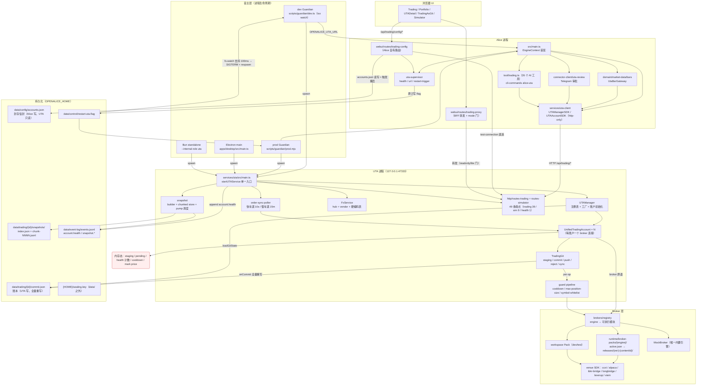
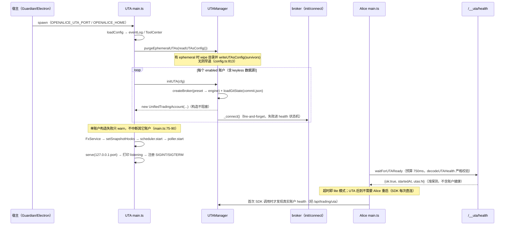
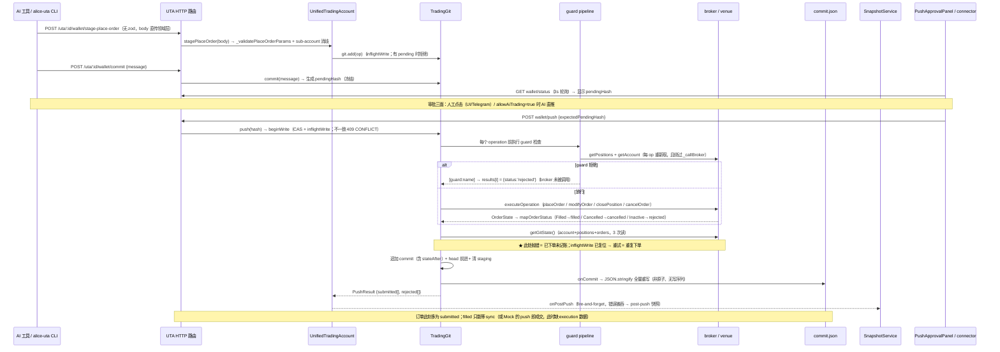
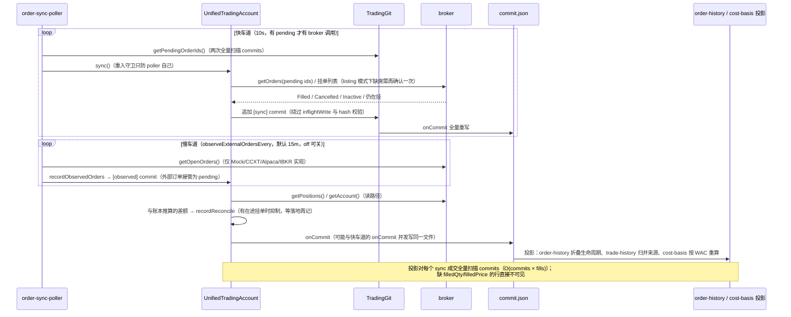
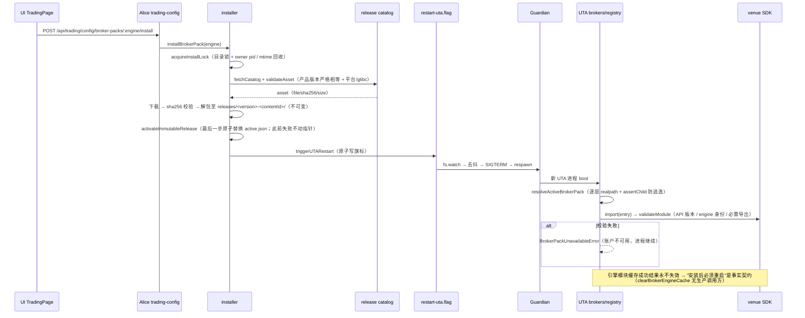

# 00 — UTA 重构综合总览

> 本文是九份区域调查报告（`01`–`09`，合计 5759 行）与 `docs/uta-live-testing.md`（407 行）的综合层。
> 它不重复各区域的功能清单与细节表，只回答四件事：**UTA 全貌是什么、跨区域的结构性问题在哪里、哪些行为契约必须守住、设计阶段必须先回答什么。**
> 事实以区域报告为主来源（引用格式 `[NN §x.y]`）；报告之间互相矛盾处已回源码核实并给出裁决（§6.9），裁决附 `path:line`。
> 本文件只读调查产物：撰写过程中未修改任何源码或 `01`–`09`。

---

## 1. 摘要

1. UTA 是一个独立 OS 进程（默认 `127.0.0.1:47333`，`services/uta/src/main.ts:41`），拥有全部 broker 连接与交易域状态；Alice 进程只通过 HTTP 消费（BFF 代理 + SDK + AI 工具 + CLI），浏览器 UI 不 import 协议包——两侧共享的只有 `@traderalice/uta-protocol` 的 wire 类型与 Alice 自己的 `src/services/uta-client/*`（`[02 §1][08 §1]`）。
2. 交易写入是一条四段式状态机：`stage`（内存）→ `commit`（冻结 + 生成 `pendingHash`）→ `push`/`reject`（CAS 审批）→ `sync`（唯一自动推进状态机的路径）；账本持久化为单文件 `data/trading/<id>/commit.json`，append-only、无 schema 校验、非原子写（`[05 §1][09 §2.1]`）。
3. 依赖方向已经腐化：`services/uta/src` 反向 import Alice 的 `src/**` 共 21 条 import 语句（20 条静态 + 1 条动态，另有 1 处仅注释引用），跨 11 个真实模块；`services/uta/tsconfig.json:14` 把 `@/*` 硬绑到 Alice 目录树——这是"UTA 已是独立进程、但尚未是独立代码库"的物理证据（`[08 §8.1][02 §9]`）。
4. 类型契约有多套并行真相：协议包 `schemas/index.ts` 是空的 `export {}`（`[02 §8.1]`）、UI 手抄 7 个类型族（`ui/package.json` 无协议包依赖，`[08 §8.3]`）、快照类型只有 UI 侧定义（`[06 §8.4-9]`）、`assetClass` 在 UI→SDK→UTA 链路上半途丢失（`[04 §8.3]`）。
5. 最危险的正确性缺口是把"已执行"与"已记账"分开的三段窗口：`executePush` 在 broker 调用之后才取 `getGitState()`（`git/TradingGit.ts:158`），此处抛错即产生"已下单未记账 + 可重试"，重试就是重复下单（`[03 §8.3][05 §8.2]`）。
6. 第二条高危线是静默失效的风控：`max-position-size` / `cooldown` 对非法参数取 `Number()` 后不校验（`NaN` 比较恒 false → 永久放行）、UI 暴露的 `max-leverage` 后端不存在（warn + skip → 零保护）、白名单可被调用方自由字段 `symbol` 伪装绕过——三者均已实测复现（`[06 §8.1-4/6/10]`）。
7. 安全面已实测存在路径穿越：`GET/DELETE /uta/:id/snapshots*` 的 `:id` 无存在性校验、store 直接 `resolve(base, accountId, …)`，可读写 `data/trading/` 之外的文件（`routes-trading.ts:642-661`、`snapshot/store.ts:36-37`，`[06 §8.1-1]`）。
8. 并发模型是"单一写锁覆盖不到全部写者"：`inflightWrite` 只保护 `add/commit/push/reject`，而 `sync`、`recordReconcile`、`recordObservedOrders` 直接追加 commit 并推进 `head`（`TradingGit.ts:78/95/125/193/242` vs `:272/:338/:654`，`[03 §6-10][05 §6.3]`）。
9. 测试覆盖与风险分布错位：域逻辑覆盖很密（74 个 spec / 1099 个 `it`），但最接近失败面的粘合层——`git-persistence.ts`、`restart-trigger.ts`、`purgeEphemeralUTAs` ——零直接测试；`smoke.ts` 把 UTA 重启验证显式降级为 SOFT（`[09 §7][01 §7.2]`）。
10. 以上问题可归并为 8 个主题聚类（§6.1–6.8，共 58 项，其中 12 项评为高）＋一节报告间矛盾裁决（§6.9，10 项）、一份必须守住的行为契约清单（§7）与 17 个设计阶段必须裁决的问题（§9）；已知 issue（`09 §5.2` 表列 14 条，关键词复核为 15 条，见 §6.9-10）已按聚类挂位（§8）。

---

## 2. UTA 全貌

### 2.1 系统结构

### 2.2 部件职责与边界（散文）

**宿主层**只负责"把 UTA 当进程管"：spawn、注入 `OPENALICE_UTA_PORT`/`OPENALICE_HOME`、watch `data/control/restart-uta.flag`、SIGTERM + respawn、把 `runtime.status` 里的 `components.uta` 反映给 UI。四套宿主（dev/prod/Electron/Bun）各自实现同一条"读旗标 → kill → respawn → 探活 → 设状态"链路，共享的只有 dev 使用的 `OptionalServiceController` 与 `killTree`（`[01 §1.3][01 §8.2]`）。崩溃容忍度不一致：dev 的 tsx watch 不重启崩溃的子进程，prod/Electron 只打日志标 offline——**只有 flag 会触发重启**（`[01 §8.1-3/4]`）。

**Alice 进程**是被授权的唯一人类/agent 入口。它不持有 broker 连接与账户状态缓存（`AGENTS.md:61-64` 的契约在代码层成立，`[08 §8.1]`），但保留三处权力：`accounts.json`（含凭据）的读写并由此成为凭据 schema 的权威定义、`data/trading/<id>/` 的删除权（`wipeUTATradingData`）、以及对 UTA 的"整进程重启"控制面（`[08 §8.1][09 §1.3]`）。`/api/trading/*` 与 `/api/simulator/*` 经 BFF 原样转发，转发前的 `lite`/`readonly` 门是浏览器侧唯一的能力边界；服务端侧 SDK 与工具走同一 HTTP 面（`[02 §1.3][08 §2]`）。

**UTA 进程**是交易域的唯一所有者：账户连接、staging/账本、guard、快照、FX、订单同步都在这里；`main.ts` 是唯一组合根，启动路径同时是重载路径（无 in-process 热重载，`services/uta/src/main.ts:1-11`）。它对 Alice 的契约面只有 HTTP：49 条端点、无鉴权、只绑 loopback（`[02 §1][02 §8]`）。

**Broker 层**由 `registry`（engine → 模块）与 `factory`（UTAConfig → preset → engine config）两段解析构成；除 Mock 外所有 live 引擎都必须经 Broker Pack 安装后加载，Pack 的产物是"UTA 源码的 tsup 打包结果 + 9 行 wrapper"（`[07 §8.1]`）。UTA 侧没有任何包管理能力，安装与版本协调全在 Alice（`[07 §6.1-1]`）。

**持久化**分三个 root：`data/config/`（Alice 拥有，accounts.json 封存 + `sealing.key` 刻意放在 `data/` 之外）、`data/trading/<id>/`（UTA 拥有：账本 + 快照）、`data/event-log/`（UTA 只写不读，四类事件）。**账本与 journal 之间没有一致性关系，也没有跨写事务**（`[05 §4.3][09 §2.1]`）。

**内存态**是当前最大的不可恢复面：staged/pending 操作、MockBroker 的持仓/挂单/现金、health 计数、cooldown 窗口、FX live 表全部只在进程内；重启后只剩 `commit.json` 里的已执行历史（`[09 §2.4]`，issue [#1313](https://github.com/TraderAlice/OpenAlice/issues/1313)）。

---

## 3. 报告导航

| 文件 | 覆盖范围 | 关键结论（3 条） | 行数 |
|---|---|---|---|
| [`01-process-lifecycle.md`](01-process-lifecycle.md) | UTA 进程的启动/监听/健康/崩溃/重启/关闭；四个启动宿主；账户连接生命周期状态机 | ① 端口解析把空串当 `0`、非数字当 `NaN`（fatal 退出），bind 失败无处理且日志先于 bind（`main.ts:38,172-177`，已实测）；② 每次 boot 都可能写 `accounts.json`（存在 ephemeral 时），与 Alice 配置写入共用一个文件；③ 崩溃恢复语义按宿主分裂，dev 不重启、prod 只报日志，smoke 把重启验证降级为 SOFT | 435 |
| [`02-http-api-and-protocol.md`](02-http-api-and-protocol.md) | 49 条运行时端点（逐条表）、错误体形状、幂等性/副作用、协议包导出清单与版本策略 | ① 协议包的 `schemas/index.ts` 是空壳，注释宣称的 zValidator 体系不存在（`:1-10`）；② 错误契约事实上未定义：6 种响应体形状并存，`WireBrokerError` 零引用；③ 校验强度按端点极不均匀：4 条 stage 路由与 expand/historical/details/quote/sync/simulate 完全无校验 | 808 |
| [`03-account-orders-positions.md`](03-account-orders-positions.md) | `UnifiedTradingAccount` 全部语义：账户/持仓/成本基础、订单两段式生命周期、历史投影、订单同步 | ① push 时若 broker 返回终态则成交数据缺失且**永不回补**（`parseOperationResult` 不读 execution，订单不进 pending，成本基础不可见）；② modify 不进入任何投影，且 CCXT/Alpaca 换 id 后旧 id 继续被追踪（幽灵挂单）；③ `executePush` 中 `getGitState()` 失败 = 已下单未记账，重试即重复下单 | 684 |
| [`04-market-data-contracts-fx.md`](04-market-data-contracts-fx.md) | aliceId 身份模型、合约纪律、搜索与归一化、keyless 数据源、FX 六级回退 | ① `assetClass` 链路半途断裂：UI 发送、UTA 接收、SDK 丢弃、UI 类型缺（`UTAManagerSDK.ts:205-217`）；② `buildContract` 是唯一出口漏斗，但 Mock/LeverUp/IBKR 的兜底合约绕过它；③ FX 硬编码表 21 币种全部标 `2026-04-08`，无过期告警，未知币 1:1 与过期表共用同一 warning 档 | 576 |
| [`05-staging-approval-ledger.md`](05-staging-approval-ledger.md) | TradingGit 四段状态机、pendingHash CAS、审批三面（UI/connector/AI）、账本持久化与投影 | ① `getGitState()` / `onCommit` 抛错都会让"已执行"与"已记账"脱钩，无补偿、无幂等键；② `sync`/`recordReconcile`/`recordObservedOrders` 绕过 `inflightWrite` 与 hash 校验，可并发写同一 `commit.json`；③ 审批无主体（`GitCommit` 无 actor）、无 TTL、无部分审批，`allowAiTrading=true` 时 AI 的 push 与人的 push 在账本中同形 | 558 |
| [`06-snapshots-and-guards.md`](06-snapshots-and-guards.md) | 快照 builder/service/store/pump 与 guard 管线、内置 guard 规则、两子系统的失败模式 | ① 快照端点 `:id` 未校验已实测路径穿越；chunk 命名冲突导致同一快照重复读出；② guard 静默失效三例：`max-leverage` 幽灵类型、`NaN` 参数永久放行、白名单被 `symbol` 字段伪装绕过（均已实测）；③ 启动顺序使常驻账户拿不到 post-push 快照钩子（`main.ts:76-108` 先建账户后设钩子，`uta-manager.ts:75-76` 构造期捕获） | 587 |
| [`07-brokers-and-packs.md`](07-brokers-and-packs.md) | `IBroker` 契约（29 成员）、六个适配器行为差异、Broker Pack 安装/激活/加载/升级链 | ① Pack wrapper 是 9 行源码转发壳，`BROKER_PACK_API_VERSION` 两端各自硬编码为 1，版本纪律靠文档；② 安装期要求产品版本严格相等、加载期只要求 API 版本兼容——两套判据用同一个词；③ `configFields` 四处死声明、`clearBrokerEngineCache` 无生产调用方（"安装必须重启"是被实现的契约） | 611 |
| [`08-alice-consumers-and-ui.md`](08-alice-consumers-and-ui.md) | Alice 侧 SDK/supervisor/BFF、26 个 AI 工具、`alice-uta` CLI、UI 五条页面族、类型漂移清单 | ① `services/uta/src` 反向 import Alice 的 `src/**` 是最大物理耦合（21 条 / 11 个模块）；② UI 手抄 7 个类型族且 `ui/package.json` 不含协议包，`Wallet*` 命名已与协议 `Git*` 分叉；③ SDK 层有 5 个 `NotImplementedInSDK`、`get health` 恒 `'healthy'`、`getCapabilities()` 空集——任何经 account 句柄读健康/能力的消费者都会拿到假数据 | 691 |
| [`09-persisted-state-tests-docs-issues.md`](09-persisted-state-tests-docs-issues.md) | 持久化全景表（18 条路径）、敏感文件保护、测试体系（lane/owner/逐个 spec）、文档与 15 条 open issue | ① 活跃迁移链 `0039`–`0043` 中没有任何 UTA 迁移，下一个可用号 44；② UTA 粘合层零测试：`git-persistence.ts`、`restart-trigger.ts`、`purgeEphemeralUTAs` 均无 spec；③ `accounts.json.backup-pre-preset` 是唯一已知绕过 sealing 的明文凭据副本 | 809 |

---
## 4. 核心概念词汇表

| 术语 | 定义 | 出处 |
|---|---|---|
| **UTA**（Unified Trading Account） | 一个 broker 连接 + 一条 commit 日志 + 一组 guard 的聚合实体；进程级含义指承载它的独立 OS 进程（loopback HTTP，无鉴权） | `[03 §1.1][01 §1][02 §1]` |
| **aliceId** | 合约的全局身份，格式 `{utaId}\|{nativeKey}`；`contractFromAliceId` 强制校验账户归属，跨账户抛错 | `[03 §6-1][04 §2.1]` |
| **nativeKey** | 各 broker 自定的原生键（IBKR=conId、CCXT=统一线格式 symbol、Alpaca=ticker）；`getNativeKey`/`resolveNativeKey` 必须互为逆运算 | `[04 §8.5][07 §6.2]` |
| **staging** | 已暂存但未提交的操作数组（内存）；四种操作：下单/改单/平仓/撤单；此时不触达 broker | `[05 §2.2]` |
| **commit** | 把 staging 冻结为一条待审批提交并生成 8 位 hash；提交前需非空 message | `[05 §2.3][03 §2.5]` |
| **pendingHash** | 待审批提交的令牌；push/reject 必须回传同一 hash（HTTP 缺失 409 `PENDING_HASH_REQUIRED`，不匹配 409 `PENDING_HASH_CONFLICT`）；`commit()` 本身不检查旧 pending，会静默覆盖 | `[05 §2.3][05 §6.1 I1]` |
| **push** | 唯一会修改外部账户的动作：逐 op 执行 → 取 `getGitState()` → 追加 commit → 清 staging；单账户内全有全无，多账户之间无事务 | `[05 §2.4][05 §6.2]` |
| **reject** | 审批的否决动作，写一条 `user-rejected` 记录；**不写 broker，但会读 broker**（`getGitState()` 触发 3 次读） | `[05 §6.1 I8][TradingGit.ts:216]` |
| **sync** | 把 `submitted` 推进到 `filled/cancelled/rejected` 的唯一自动路径；10s 快车道 + 15m 观察车道；绕过写锁与 hash 校验 | `[03 §2.7][05 §2.7]` |
| **reconcile / recordObservedOrders** | 两条合成提交路径：钱包持仓 drift 折价、外部订单观察（`[observed]`）；同样绕过写锁 | `[03 §8.4][05 §2.8/2.9]` |
| **snapshot** | 账户活状态的时间序列取证记录（account/positions/openOrders/health/git head）；15m 定时 + post-push + post-reject 触发；每 50 行滚动 chunk | `[06 §1.1][09 §2.1]` |
| **guard** | push 前的同步前置校验（`cooldown`/`max-position-size`/`symbol-whitelist`）；只能放行或拒绝，不能改写操作；只覆盖 4 类 order action | `[06 §6.1][06 §8.2-17]` |
| **Broker Pack** | 把 live 引擎打包为可选安装单元（`broker-pack.json` + `dist/index.js` + 依赖树）；UTA 只读加载，Alice 负责安装与自动更新 | `[07 §2.8][09 §2.1]` |
| **preset** | 用户可选的账户类型（11 个）→ 5 个引擎的映射，含 `toEngineConfig` 表单语义翻译与 `modes`（live/paper）呈现 | `[07 §2.2][07 §8.8]` |
| **keyless** | 无凭据的公共行情数据源 UTA（binance/okx/bybit 构造），不落盘、无账户语义、`keyless ⟹ readOnly`；tier 为 `data` | `[04 §2.11][03 §2.2]` |
| **lite / read-only** | 两种降级模式：`lite` = Alice 找不到 UTA（可选载体不可用）；`readonly` = 允许读与 stage，拒绝一切 venue 写（BFF 与 SDK 双侧实现，判定口径不完全一致） | `[08 §2.1/2.2][02 §8.14]` |
| **ephemeral** | 每次 UTA 启动即 wipe 的测试账户，zod 强制只能配 `mock-simulator`；boot purge 会写出 `accounts.json` | `[09 §2.3][config.ts:811-822]` |
| **tier / reach / health** | tier 是静态用途（`data`/`account`/`trading`）；reach 是目标阶梯（数据账户到 `connected` 即完成）；health 是运行态（`healthy`/`offline`/…），由失败计数驱动 | `[03 §2.2][01 §2.3]` |
| **commit.json / ledger** | 账本唯一持久真相：提交数组加单一 head 指针，每次写入全量重写，非原子、无 schema 校验、读失败静默 | `[05 §8.3][09 §2.1]` |
| **CAS（compare-and-swap）审批** | "一个 pending 只能被 push 或 reject 一次"的令牌协议，冲突保护在 `TradingGit`（`inflightWrite` + hash 比对）而非路由层 | `[02 §6-3][05 §6.1 I3]` |
| **`/__uta/health`** | 进程级浅探测：恒 `ok:true` + `startedAt` + 账户数；不反映任何账户健康（账户健康在 `/api/trading/uta`） | `[01 §6.1-2][main.ts:147-152]` |
| **hosted UTA（宿主）** | Guardian/Electron/Bun/Docker 之一，负责 spawn 与按 flag 重启；四套实现有细微差异 | `[01 §1.3][01 §8.2]` |
| **`allowAiTrading`** | `agent.allowAiTrading` 开关：false 时 `tradingPush` 工具拒绝，AI 只能 stage + 请用户在 UI 批准；true 时 AI 直接 push，账本不记录调用方身份 | `[05 §8.4][src/tool/trading.ts:206-211]` |
| **live-paper / external-readonly** | 两种 opt-in 测试 lane：前者可提交 demo/paper 订单并要求恢复基线，后者允许公网只读；IBKR 是唯一写 run record 的路径 | `[07 §7.5][09 §3.5]` |

---

## 5. 端到端关键流程

### 5.1 进程启动 → 账户就绪

**要点**：启动顺序本身就是契约的一部分。① `purgeEphemeralUTAs` 必须在 manager 初始化前完成，否则残留账户会被初始化；② **快照钩子装配晚于账户构造**，而 `initUTA` 在构造期把钩子复制进实例，导致 boot 时已存在的账户永远拿不到 post-push/post-reject 快照（`main.ts:104-108` vs `uta-manager.ts:75-76`，`[06 §8.1-3]`）；③ 账户连接是异步的，"进程 ready"与"账户 readable"之间隔着整个健康状态机（`[01 §6.2][03 §2.1]`）。

### 5.2 下单：staging → approval → push → broker → ledger/snapshot

**要点**：这是全系统唯一修改外部账户的路径，也是失败原子性最弱的路径——broker 写入发生在内存提交之前，落盘发生在两者之后，整条链没有事务边界（`[05 §6.2][03 §8.3]`）。审批面的一致性也不完整：`wallet/reject` 与 stage-* 不在 BFF 的 venue-mutation 名单内（与设计一致，它们是本地动作），但 `reject` 会因 `getGitState()` 读取 broker，在只读模式下依然可能因 broker 不可达而整体失败（`[05 §4.1][05 §6.1 I8]`）。

### 5.3 外部订单同步与对账

**要点**：三条合成提交路径（`sync`/`reconcile`/`observed`）都不参与写互斥，是当前并发模型的根本裂缝：它们能在 push 的 broker 循环期间推进 `head`，使批次提交的 `parentHash` 指向已被覆盖的节点（`[03 §8.4][05 §6.3-2]`）。另外 `getAccount()`/`getPositions()` 本身带写副作用（reconcile 落盘），GET 不再是纯读（`[03 §8.11]`）。成本基础的 WAC 仅做多、清零重置，撤单场景的部分成交会在投影层被丢弃（`[03 §8.5]`）。

### 5.4 Broker Pack：安装 → 生效

**要点**：Pack 生命周期是"Alice 安装、UTA 只读""单向数据流"，两个进程只通过 `active.json` 指针与重启衔接（`[07 §1][07 §6.2]`）。两处兼容性判据并存：安装期要求产品版本严格相等（`installer.ts:185`），加载期只要求 `BROKER_PACK_API_VERSION` 兼容且支持旧版本 Pack 继续服务（`broker-packs.ts:163-169`、`broker-packs.spec.ts:129`）——组合本身自洽，但重构时最容易混淆（`[07 §8.2]`）。

---

## 6. 跨区域结构性问题（聚类）

**严重度口径**：高 = 资金安全/重复下单/凭据或安全泄漏/阻塞整个重构目标；中 = 数据完整性、账本或状态一致性、可靠恢复；低 = 可维护性与认知成本。每项给出依据。

### 6.1 边界与耦合

| # | 问题 | 来源 | 严重度 | 依据 |
|---|---|---|---|---|
| 1.1 | `services/uta/src` 反向 import Alice `src/**`：21 条（含 1 动态、1 注释）/ 11 个真实模块；`tsconfig` paths 硬绑 `../../src/*` | `[08 §8.1-3][02 §9][09 §6.2]` | **高** | 非资金风险，但它是"UTA 能否离开 Alice 载体"的唯一硬阻塞：任何 `src/core/*` 移动都会破坏 UTA 构建；本次重构的核心目标（边界清晰）在此不成立 |
| 1.2 | Alice 拥有 `accounts.json`（凭据）的读写与删除权；UTA 只能在 boot 时读、在 purge 时写 | `[08 §8.1-1/2][09 §1.3]` | 中 | 凭据 schema 的权威定义在 `src/core/config.ts`，UTA 反向依赖它；`wipeUTATradingData` 可删 UTA 的状态目录（两端都能删） |
| 1.3 | Broker Pack wrapper 是 9 行源码转发壳；Pack 二进制 = UTA 源码的 tsup 产物；`BROKER_PACK_API_VERSION` 两端各自硬编码 | `[07 §8.1]` | 中 | "结构 API 边界"的防御实际是在补偿"源码同源、依赖树独立"的特殊形态；版本纪律靠文档而非机制 |
| 1.4 | UI 手抄 7 个类型族且不依赖协议包（`ui/package.json` 无 `@traderalice/uta-protocol`） | `[08 §8.3][06 §8.4-9]` | 中 | 类型漂移已有实例：`UTAConfig` 缺 `ephemeral`、`Position` 缺 `multiplier`、`Wallet*` 与 `Git*` 命名分叉；漂移的代价落在每次协议演进 |
| 1.5 | 宿主三份实现各自实现同一条重启链（去抖/轮询兜底/状态值域均有差异） | `[01 §8.2]` | 中 | 行为差异无法被单一测试覆盖；Bun/远程再叠一层 |

### 6.2 协议与类型漂移

| # | 问题 | 来源 | 严重度 | 依据 |
|---|---|---|---|---|
| 2.1 | 协议包 `schemas/index.ts` 是空壳；`zValidator` 全仓零使用；`WireBrokerError` 零引用 | `[02 §8.1/8.2]` | 中 | 注释构建了一个不存在的契约体系，误导所有新读者（含 AI）；错误契约因此事实上未定义 |
| 2.2 | 6 种错误响应体形状并存；同一语义映射到不同状态码（离线 503 / 跨账户 503 / 能力缺失 503 / CONFIG 500） | `[02 §8.2/8.3][05 §8.4]` | 中 | 调用方无法区分"该重试/该改配置/该改请求"；客户端因此做不了自动重试策略 |
| 2.3 | `assetClass` 链路断裂：协议有、UTA 产出、UI 发送、**SDK 丢弃**、UI 响应类型缺 | `[04 §8.3]` | 中 | 只有 CCXT 实现 `assetClassFor`；其余 broker 下 `secType` 启发式对"交易所上的合成股票/期货"已知错误 |
| 2.4 | 快照类型（`UTASnapshotSummary`/`EquityCurvePoint`）只有 UI 定义，协议包无对应导出 | `[06 §8.4-9][08 §8.6-3]` | 中 | 唯一没有共享契约的端点族；UI 已缺 `headCommit`/`pendingCommits`/`multiplier` 等字段 |
| 2.5 | `aliceId` 格式在四处文档中全部写成已废弃的形态（README、contract-search-rules.md、UI i18n 4 语言） | `[04 §8.1]` | 低 | 契约缺少单一可引用来源；历史 issue #208 同类 |
| 2.6 | `AggregatedEquity` 有 4 份定义（协议 1 + UI 3）；`ReconnectResult` 两份 | `[08 §8.3]` | 低 | 同一端点的消费形状漂移 |
| 2.7 | 快照 `health` 值域超出协议：`'disabled'` 不在 `BrokerHealth` 三值联合内，靠 UI 用 `string` 掩盖 | `[06 §8.2-20]` | 低 | 类型系统拒绝无效状态的能力被绕过 |

### 6.3 持久化一致性（账本与数据完整性）

| # | 问题 | 来源 | 严重度 | 依据 |
|---|---|---|---|---|
| 3.1 | push 时成交缺 execution 数据且永不回补：`parseOperationResult` 不读 `filledQty/filledPrice`，订单不进 pending，成本基础/成交列表不可见，drift 回填按市价记成本 | `[03 §8.1]` | **高** | 账本对"已成交"的记错且无自愈路径；违反 live-testing 的 "Never trust the ledger over the venue"（`docs/uta-live-testing.md:138`），S2 明确列为必须守住的边界 |
| 3.2 | modify 不进入投影，且换 id 后旧 id 继续被 pending 扫描追踪（幽灵挂单）、新 id 无人跟踪 | `[03 §8.2]` | **高** | 用户/agent 对"挂单在哪"的认知与交易所不一致；改单是常规操作（S4 场景），失败模式是静默的 |
| 3.3 | `git-persistence.ts` 非原子写 + 无写序列 + 读失败静默；与同仓库 `snapshot/store.ts` 的 `.tmp`+rename 纪律不一致 | `[05 §8.3][09 §6.3][09 §8.1 D4]` | **高** | 账本是"唯一持久真相"，损坏即历史丢失（且 `catch {}` 无法区分"没有文件"与"文件坏了"，损坏 = 静默清空 + 覆盖） |
| 3.4 | `accounts.json.backup-pre-preset` 是明文凭据副本且无清理 | `[09 §8.1 D2]` | **高** | 唯一已知绕过 sealing 的路径，直接破坏 at-rest 承诺 |
| 3.5 | staged/pending 与 MockBroker 内存态不落盘（`#1313`）；`getSimulatorState()` 无 restore 入口 | `[09 §2.4][09 §8.1 D5]` | 中 | 未审批提案丢失可重建（重新 stage），但 mock 无法作为 paper rehearsal；replay 方案缺 API 落点 |
| 3.6 | 账本无界增长：commits 无裁剪、每次全量重写且内联 `stateAfter` 全量持仓/挂单、`raw` 原样持久化 | `[03 §8.9][05 §8.3]` | 中 | 单次 commit 磁盘成本与日志大小线性增长；`getPendingOrderIds` 每次两趟全扫，被账户读与 poller 反复触发 |
| 3.7 | 快照 store：删除中间 chunk 后命名冲突（实测重复读出 152 行/101 唯一）、乱序写破坏 `startTime ≤ endTime`、index 损坏静默回空 | `[06 §8.1-2/12]` | 中 | 时间序列查询会给出错误结果且无告警；无 retention 策略 |
| 3.8 | `data/trading/<id>` 与账户 id 强绑定，重命名无迁移；`accounts.json` 与目录的对应关系无任何不变量与测试 | `[09 §6.2 T10][09 §8.1 D7/D8]` | 中 | 重命名账户 = 历史静默丢失 |
| 3.9 | legacy commit 路径（3 个硬编码 id）与 `TODO: remove before v1.0` 注释，零测试 | `[09 §8.1 D1]` | 低 | 读不到即静默返回 undefined——"历史消失"的另一种说法 |
| 3.10 | `data/_backup/` 无界增长（每次迁移全量拷贝 `data/config/`） | `[09 §8.1 D3]` | 低 | 运维成本，不立即影响正确性 |

### 6.4 并发、写锁与审批时序

| # | 问题 | 来源 | 严重度 | 依据 |
|---|---|---|---|---|
| 4.1 | `executePush` 失败原子性：`getGitState()`（`:158`）或 `onCommit`（`:174`）抛错 → 已执行未记账 + staging/pending 状态未清 → 重试即重复下单；无补偿、无幂等键 | `[03 §8.3][05 §8.2]` | **高** | 直接的资金安全缺口（重复下单），且 broker 侧没有 clientOrderId 去重约定进账本（`[05 §9.1-2]` 明确未验证） |
| 4.2 | `sync`/`recordReconcile`/`recordObservedOrders` 绕过 `inflightWrite` 与 hash 校验；可并发写同一 `commit.json`（交叠写入风险），`parentHash` 链失真 | `[03 §8.4][05 §6.3-2]` | **高** | 数据完整性：账本从线性历史变成有分叉序列；审计回溯能力被依赖（trade-provenance 以 hash 为决策身份） |
| 4.3 | `commit()` 不检查 `pendingHash !== null` → 重复 commit 静默覆盖旧令牌（I1/I7 缺口） | `[05 §6.1 I1][05 §8.5]` | 中 | 并发保护依赖调用纪律而非机制；旧审批令牌被静默作废 |
| 4.4 | pending 无 TTL、无过期，可跨小时/跨天；guard 只在 push 时跑一次 | `[05 §6.3-6][05 §8.4]` | 中 | 行情已变的旧提案仍可一键执行；风控窗口与审批窗口解耦 |
| 4.5 | HTTP 层无请求级互斥：两个并发 commit 都会成功（后者覆盖前者 hash） | `[05 §6.3-4][02 §6-7]` | 中 | 审批客户端（UI 3s 轮询 + connector + AI）并发进入时行为未定义 |
| 4.6 | 多进程/多 home 共写：flag 重启无文件锁；`writeChain` 只保护单 store 实例；事件 log 的 `seq` 为进程内计数 | `[05 §6.3-3][06 §6.2-2][09 §6.3]` | 中 | 依赖"Guardian 保证单一 home、单一 UTA"这一未被执行检查的假设 |
| 4.7 | cooldown 时钟在 dispatch 前写入且不持久化：失败/被拒的重试也消耗窗口；重启或 reconnect 即清零 | `[06 §6.2-5/6]` | 低 | 风控的时间语义与用户直觉不符；无 runtime 注入验证 |

### 6.5 错误建模与审计

| # | 问题 | 来源 | 严重度 | 依据 |
|---|---|---|---|---|
| 5.1 | "broker 拒绝"与"网络/连接错误"在账本中同形（`status` 同为 `rejected`，只差 `error` 文本）→ 无法据此做重试裁决 | `[05 §8.2][03 §8.6]` | **高** | 影响自动重试策略的正确性（错误重试 = 重复下单），且审计无法区分交易所拒绝与本地故障 |
| 5.2 | 审批无主体：`GitCommit` 无 actor/approver 字段；`allowAiTrading=true` 时 AI push 与人工 push 在账本中不可区分；一次性通道与表单审批同样无痕 | `[05 §8.4][packages/uta-protocol/src/types/git.ts:171-174]` | **高** | "谁批准了这笔交易"不可回答；与"AI 可被授权自动 push"的高风险组合直接相关 |
| 5.3 | guard 三种失败模式不可区分：`[guard:*]` 前缀拒绝、guard 抛裸异常（无前缀）、context 取数失败（整个 push 抛出且不留 commit） | `[06 §8.1-8/9][06 §8.2]` | 中 | 消费方只有 `PushResult.rejected[].error` 一条通道；重试语义完全模糊 |
| 5.4 | UTA 路由无请求日志、无审计面；审计信息只存在于 git 日志与 event-log | `[02 §6-10]` | 中 | 事后取证能力弱于资金系统的常规要求 |
| 5.5 | 状态码语义弱：`/reconnect` 用 200/500 表达业务结果、`/test-connection` 用 400 包裹业务失败、`/sync` 与 `/simulate-price` 的 body 解析失败按空输入继续 | `[02 §6-5]` | 低 | 静默做无用功；调用方误判 |
| 5.6 | `previousStatus` 在 sync 更新中硬编码 `'submitted'`；`OrderStatusUpdate` 字段形同虚设 | `[05 §8.5][03 §2.7]` | 低 | 依赖该字段的消费方会得到错误信息 |

### 6.6 安全与穿越

| # | 问题 | 来源 | 严重度 | 依据 |
|---|---|---|---|---|
| 6.1 | 快照端点 `:id` 未校验 + store 直接拼接路径 → 路径穿越（已实测可读写 `data/trading/` 之外文件） | `[06 §8.1-1]`，`routes-trading.ts:642-661`、`snapshot/store.ts:36-37` | **高** | 安全：任何能到达 loopback UTA 的本机进程或 BFF 转发请求可利用 |
| 6.2 | 白名单 guard 可被调用方自由字段 `symbol` 伪装绕过（实测：`aliceId='mk11\|TSLA'` + `symbol:'AAPL'` 通过 `symbols:['AAPL']` 白名单并真实下单） | `[06 §8.1-10]` | **高** | 风控失效且静默；`getOperationSymbol` 优先取调用方字段（`UnifiedTradingAccount.ts:698`） |
| 6.3 | guard 静默失效：非法参数 `Number()` 后不校验（`NaN` 比较恒 false → 永久放行）；UI 暴露的 `max-leverage` 后端不存在（warn+skip → 零保护） | `[06 §8.1-4/6]` | **高** | 用户配置了保护而系统实际无保护，且无任何可观测信号 |
| 6.4 | guard 覆盖面窄：只覆盖 4 类 order action；`sync`/`reconcile`/`observeExternalOrders`/simulator 路由（`externalDeposit`/`externalTrade`）全部绕过 | `[06 §8.2-17]` | 中 | 交易所侧成交与模拟器注资不受本地规则约束（对 mock 等于无门禁改数） |
| 6.5 | `max-position-size` 口径错误：忽略期权 `multiplier`（实测 10 张 @$5、mult=100 按 $50 计）；`marketValue`（持仓币种）直接除 `netLiquidation`（账户基准币种） | `[06 §8.1-11][06 §9.2-5]` | 中 | 多币种与衍生品下百分比无意义 |
| 6.6 | BFF 的 `isVenueMutation` 用路径子串匹配；`PASSTHROUGH_HEADERS` 白名单丢弃绝大多数头 | `[02 §8.14/8.15][08 §8.5]` | 中 | 新增写路由需人工记得同步名单；未来基于 header 的鉴权会静默失效 |
| 6.7 | UTA 零鉴权（只绑 127.0.0.1）；`test-connection` 动态 import Alice 配置 schema 形成反向依赖 | `[02 §1/§9][09 §8.1 D6]` | 中 | 当前信任边界内可接受，但任何"UTA 迁到另一载体"的方案都必须先补鉴权 |
| 6.8 | 空白名单炸账户：`symbol-whitelist` 构造抛错 + UI 默认 `symbols: []` → 保存后下次启动账户静默消失（只 warn） | `[06 §8.1-5]` | 中 | 配置错误导致账户不可用，且与"guard 未知类型静默跳过"叠加 |

### 6.7 测试缺口

| # | 问题 | 来源 | 严重度 | 依据 |
|---|---|---|---|---|
| 7.1 | 粘合层零测试：`git-persistence.ts`（含 legacy 回退/损坏文件/并发写）、`restart-trigger.ts`（四分支）、`purgeEphemeralUTAs` 均无 spec | `[09 §7][05 §7][01 §7.2]` | 中 | 风险与覆盖错位：域逻辑很密，而"数据可能损坏/丢失"的路径无回归保护 |
| 7.2 | HTTP 覆盖缺口 38/49 端点；工具层 spec 用 `asSDK` 强转绕开 HTTP → wire 形状漂移在测试中从不被验证 | `[02 §7]` | 中 | 协议契约（字段名/包装层/错误体）没有自动化守卫 |
| 7.3 | push 中途失败两条路径（`getGitState` 抛错、`onCommit` 抛错）无任何用例；`#91`（重复下单）类缺陷的护栏不在测试里 | `[05 §7][03 §7.2]` | 中 | 最高危缺口恰好零覆盖 |
| 7.4 | `expandContract` 全路径零测试（IBKR hub 展开、期权网格、期货月份、Alpaca 分页） | `[04 §7.2]` | 中 | 目录/叶子身份是 S13 的核心契约 |
| 7.5 | Longbridge / LeverUp 无 live-paper（115 个 hermetic 用例、零外部验证；LeverUp 还带未确认的 EIP-712 schema 变体） | `[07 §7.5][07 §8.15]` | 中 | "同一产品面不同引擎行为不同"的最大来源 |
| 7.6 | UTA 崩溃行为、bind 失败、关闭序列（`server.close()` 未 await、`process.exit(0)`）、端口解析边界均无测试 | `[01 §7.2]` | 中 | 进程级失败模式无诊断也无回归 |
| 7.7 | `smoke.ts` 把 UTA 重启验证降级为 SOFT（永不 fail） | `[01 §7.2][01 §8.1-3]` | 中 | "dev 重启路径坏了"不会让任何 CI 变红 |
| 7.8 | `auto-updater.ts` 无专属 spec；`triggerUTARestart` 分支（`auto-updater.ts:75-77`）无测试 | `[07 §7.6]` | 中 | 升级链的最后一跳无守卫 |
| 7.9 | UI demo handlers 与真实 UTA 形状的一致性无测试（demo `wallet/status` 恒空使审批流不可演示） | `[08 §7.2]` | 低 | demo 与真实行为分叉无人发现 |

### 6.8 死代码与重复实现

| # | 问题 | 来源 | 严重度 | 依据 |
|---|---|---|---|---|
| 8.1 | 两套 fan-out 搜索实现（UTA `searchTradeableContracts` 与 Alice 工具内联版）已出现行为差异（裁剪/expandable/assetClass） | `[04 §8.3]` | 中 | 同一产品面两条实现，注释自称"必须返回同一形状"但未共享代码 |
| 8.2 | `clearBrokerEngineCache` 无生产调用方；"安装后必须重启"是实现事实而非声明契约 | `[07 §8.4][07 §7.6]` | 中 | 死导出掩盖了真实生命周期约定 |
| 8.3 | workspace 门控逻辑在 `registry.ts` 与 `installer.ts` 逐行重复；两份引擎清单（`INSTALLABLE_BROKER_ENGINES` / `supportedBrokerPackEngines`）并行 | `[07 §8.3][07 §9.2-7]` | 中 | 任一处漂移 → "Alice 认为可用、UTA 认为不可用"的静默分叉 |
| 8.4 | `UTAManager.searchContracts`（分组形状）与 `ContractSearchResult` 无生产消费方；`UTAManagerSDK.getAggregatedEquity` 无调用者 | `[04 §8.3][08 §8.2]` | 低 | UTA-split 迁移遗留；清理前需确认无未来消费方 |
| 8.5 | `configFields` 四处死声明（背景是"文档承诺 A、实现走 B"：前端表单走 preset JSON Schema） | `[07 §8.5]` | 低 | 接口面承诺的表单自描述能力从未生效 |
| 8.6 | 零散死代码：legacy quote 路由（无调用方且动态 import `@traderalice/ibkr`）、`OrderHelper.read`、`isCostBasisRelevant`、`setCurrentRound`（SDK 空实现）、`walletShow`、`listUTAs`（UI 侧） | `[02 §8.8][03 §8.13][05 §8.5][08 §8.2/8.4]` | 低 | 认知成本与误用风险 |

### 6.9 报告间矛盾与裁决（已回源码核实）

| # | 争议点 | 分歧 | 裁决与证据 |
|---|---|---|---|
| 1 | UI `ReconnectButton` 走哪条重连路径 | `01 §2.8` 称 UI → SDK 整进程重启；`02 §2.2`、`08 §2.9` 记为进程内单账户重连 | **01 有误**。`ui/src/api/trading.ts:78-79` 发 `POST /api/trading/uta/:id/reconnect`；`src/webui/plugin.ts:258-262` 把 `/api/trading` 挂到 BFF 代理 → `services/uta/src/http/routes-trading.ts:221-225` 调**进程内** `ctx.utaManager.reconnectUTA(id)`（`uta-manager.ts:83-113`，单账户 remove+init+waitForConnect）。SDK 的"整进程重启"语义（`UTAManagerSDK.ts:184-192`）只被 Alice 自己的 config 路由使用（`trading-config.ts:246,295,299`）。附带裁决：`08 §8.4`"500 也走成功路径"概括过强——`ReconnectButton.tsx:20-27` 按响应体 `result.success` 分支，500 body 中 `success:false` 会走错误分支；真实缺口是缺 `res.ok` 检查（非 JSON 的 500 会 throw 进 catch） |
| 2 | `reject` 是否读 broker | `05 §6.1 I8` 称会（3 次读）；`03 §2.5/§4.3` 副作用表未列 | **05 正确**。`git/TradingGit.ts:197-237` 的 `executeReject` 在 `:216` 调 `this.config.getGitState()` → `UnifiedTradingAccount.ts:158-177` 执行 `getAccount`+`getPositions`+`getOrders` 三次 broker 读。03 的副作用表需补记（顺带：这也意味着只读/离线账户的 reject 可能因 broker 不可达而失败） |
| 3 | 4 条 `stage-*` 路由是否有 zod 校验 | `05 §4.1` 表格写"zod 校验/pydantic 风格 strictObject"；`02 §8.4` 称完全无校验 | **02 正确**。`routes-trading.ts:537-586` 四条路由均为 `const body = await c.req.json().catch(() => ({}))` 直传领域层，catch 一律 400；无任何 schema 引用 |
| 4 | push 能否产出 `filled` | `03` 摘要称"push 只能产出 submitted/rejected"；`05 §7` 测试表引用 e2e 断言 push 即 filled | **摘要措辞过强**。`git/TradingGit.ts:970-977` 的 `mapOrderStatus`：`Filled→filled`、`Cancelled→cancelled`、`Inactive→rejected`、default `submitted`（`:962` 调用）；e2e `uta-lifecycle.e2e.spec.ts:53-65` 断言市价单 push 时 `status:'filled'`。03 自身 §6-2 已修正为"市价单可能当场 filled"，两处需统一到 §6-2 的表述 |
| 5 | `purgeEphemeralUTAs` 是否算"UTA 写 accounts.json" | `09 §6.1 I5` 称"账户配置写入只在 Alice 侧"；`01 §8.2` 称"每次 UTA 启动时写" | **两者都不精确**。`services/uta/src/main.ts:69` 调 `purgeEphemeralUTAs(await readUTAsConfig())`；`src/core/config.ts:811-822`：`:813` 无 ephemeral 时早退（不写），`:820` `writeUTAsConfig(survivors)`。裁决：boot purge 是 UTA 侧**唯一**的 accounts.json 写路径，且只在存在 ephemeral 账户时发生——I5 的"只在 Alice 侧"不成立，01 的"每次"应改为"存在 ephemeral 时" |
| 6 | `assetClass` 链路是否断裂 | `04 §8.3` 全链路核对 | **成立**。UI 请求确实发送（`ui/src/api/trading.ts:291-298`）；UTA 路由接收并使用（`routes-trading.ts:161-164`，白名单 `:81`，非法静默降级 `'unknown'`）；聚合层产出（`contract-search.ts:60`）；`UTAManagerSDK.searchContracts` 丢弃（`UTAManagerSDK.ts:205-217`，`_assetClass?: unknown` 仅发 pattern）；UI 响应类型缺（`ui/src/api/trading.ts:13-27`）；协议类型有（`manager.ts:57`） |
| 7 | 快照端点路径穿越 | `06 §8.1-1` 实测结论 | **成立**。`routes-trading.ts:642-652`（GET）与 `:654-661`（DELETE）均无 `utaManager.get(id)` 校验；`snapshot/store.ts:36-37` 直接 `resolve(baseDir, accountId, 'snapshots')` 无编码/白名单 |
| 8 | UTA 反向 import 的计数 | `08 §8.1-3` 写"21 处 / 13 个模块" | **口径需拆分**。本次复核：生产代码 21 条 import（20 静态 + 1 动态 `routes-trading.ts:203`，另 1 条注释 `brokers/index.ts:20`），跨 **11** 个真实模块（`core/{config,paths,event-log,tool-center,types,duration,pump,broker-packs}` 8 个 + `domain/market-data/{client/types,client/typebb/index,credential-map}` 3 个）；另加 spec 12 条 → 含测试合计 13 个模块被触达。"21 处/13 模块"的表述应改为"生产 21 条/11 模块（含测试 13 模块）" |
| 9 | 健康探测的"矛盾" | `01 §8.2` 称双轨健康 + 750ms 与 15s 容忍度；`02 §7` 列 `/__uta/health` 无测试 | **非矛盾，而是四个预算并存**：Alice 启动 750ms（`src/main.ts:149`）、BFF status 1s（`trading-proxy.ts:25`）、restart-trigger 20s（`restart-trigger.ts:23-26`）、Guardian 探活 15s/200ms（`health.ts:32-42`）；`/__uta/health` 恒 `ok:true`（`main.ts:147-152`）且 `decodeUTAHealth` 严格校验三字段（`health.ts:24-30`）。总览按此为统一表述 |
| 10 | 09 的 issue 计数 | `09 §5.2` 标题"15 条" vs 表内 14 行 | **口径差异**。表列 14 行（含 `#1263`，不含 `#1161`/`#1347`）；本次以同一关键词复核 upstream open 集合为 15 条（含 `#1161`/`#1347`，不含 `#1263`）——差异来自相邻主题（市场数据/研究）的计入标准，对称差 3 条。§8 以报告表为分析基准，并注明该差异 |

---

## 7. 不变量清单（重构必须保持的行为契约）

图例：**✓ 当前满足** · **⚠ 部分/有条件满足** · **✗ 当前已被违反**。

### 7.1 进程与生命周期（来源 `[01 §6.1]`）

| 契约 | 现状 | 证据 |
|---|---|---|
| UTA 只绑定 loopback，端口由 `OPENALICE_UTA_PORT` 决定 | ✓ | `[01 §6.1-1][main.ts:175]` |
| 单账户初始化失败不影响其它账户与 HTTP 面 | ✓ | `[01 §6.1-3][main.ts:75-90]` + 启动韧性 spec |
| `startedAt` 进程内不变，是重启确认信号 | ✓ | `[01 §6.1-4][restart-trigger.ts:60-81]` |
| 跨进程重启的唯一信号是 `restart-uta.flag`；无 in-process 热重载 | ✓ | `[01 §6.1-5][main.ts:1-11]` |
| 账户 id 在 `UTAManager` 内唯一，重复 add 抛错 | ✓ | `[01 §6.1-6][uta-manager.ts:144-149]` |
| `/__uta/health` 只要在监听就 `ok:true`，**不是**就绪语义的充分条件 | ✓（契约本身如此） | `[01 §6.1-2][main.ts:147-152]`；消费方不得据此判断交易可用 |
| 账户连接与 HTTP 请求并发安全（1.5s grace + CONNECTING 快速失败） | ⚠ | `[01 §6.3]`：recovery 定时器与请求路径共享字段，无锁 |

### 7.2 协议（来源 `[02 §6]`）

| 契约 | 现状 | 证据 |
|---|---|---|
| 金额/数量一律字符串（`Decimal` 出口 `toFixed()`） | ✓ | `[02 §6-1][routes-trading.ts:16-20]`；例外见 7.5 的 equity-curve |
| `aliceId` 归属唯一，跨账户解析抛错 | ✓ | `[02 §6-2][UnifiedTradingAccount.ts:534-545]` |
| push/reject 必须携带当前 `pendingHash`；缺失/冲突均 409 | ✓ | `[02 §6-3][05 §6.1 I3]` |
| stage 抛错不入库；commit 失败不回滚 staging（注释明示） | ✓（按设计） | `[02 §6-4][order-entry.ts:52-59]` |
| GET 幂等；stage-*/commit/sync/push/reject/one-shot/simulator 非幂等 | ✓ | `[02 §6-8]` |
| 唯一近似幂等的是 `external-deposit`（覆盖式写入 = 重放即重置） | ⚠ 语义危险 | `[02 §6-8]` |
| 健康门只在 `queryAccount` 路径（9 条读路由触发 `nudgeRecovery`） | ⚠ 不一致 | `[02 §6-9]`：expand/historical/quote 等不触发恢复 |
| 路由原子性：多账户遍历读无事务/快照隔离 | ⚠ 契约即"不保证" | `[02 §6-6]` |

### 7.3 账户、订单与持仓（来源 `[03 §6]`）

| 契约 | 现状 | 证据 |
|---|---|---|
| aliceId 归属唯一；broker 返回的合约一律被 `stampAliceId` 覆写 | ✓ | `[03 §6-1]` |
| 缺席 ≠ 终态（listing 策略下订单消失必须二次确认） | ✓ | `[03 §6-3][UnifiedTradingAccount.ts:853-877]` |
| 一次只有一个待审批批次（`inflightWrite` + pending hash 双互斥） | ✗ | `[03 §6-4]` 但 `commit()` 无 `pendingHash` 检查（`[05 §6.1 I1]`）可静默覆盖令牌 |
| 每个 commit 携带 `stateAfter`（执行后 `getGitState()`） | ✓ | `[03 §6-5][TradingGit.ts:156-166]` |
| 账户级 `unrealizedPnL` = 持仓之和（同币种） | ⚠ | `[03 §6-6]`：`getState()` 不应用同一条规则，两个入口可能给出不同值（`[03 §8.11]`） |
| 持仓 math 单一实现（`derivePositionMath`/`pnlOf`） | ✓ | `[03 §6-7]` |
| 成本基础只在 wallet 持仓上重建 | ✓ | `[03 §6-8]` |
| 在途订单抑制 drift 记账 | ✓ | `[03 §6-9]` |
| sync/观察/reconcile **不**参与写互斥 | ✗（记录在案的违反） | `[03 §6-10]`：`inflightWrite` 仅 `:78/95/125/193/242`，而 `:272/:338/:654` 直接改 `head` |
| 提交不可变但头可变；`show(hash)` 只读 | ✓ | `[03 §6-12]` |

### 7.4 staging / approval / ledger（来源 `[05 §6.1]`）

| 契约 | 现状 | 证据 |
|---|---|---|
| I1/I7「有 pending 时禁止再 stage」「同账户同时只有一个 pending」 | ✗ | `add` 有检查（`:81-85`），但 `commit()` 可覆盖 pendingHash（`:94-100`） |
| I2「写入进行中禁止 stage/commit/push/reject」 | ⚠ | `inflightWrite` 覆盖四者，但**不**覆盖 sync/reconcile/observed |
| I3「push/reject 必须携带当前 pendingHash」 | ✓ | `beginWrite`（`:241-249`）+ HTTP 409 |
| I4「commit 只增不改」 | ✓ | 无 compaction、无修改历史 API |
| I5「HEAD 始终等于最后一条写入的 hash」 | ⚠ | 落盘失败时内存与磁盘不一致（窗口 B） |
| I6「账本金额/数量一律字符串」 | ⚠ | push 结果的 `orderId` 等为 broker 原文；legacy 文件可能含 number（靠 rehydrate 兜） |
| I8「审批不修改外部账户，push 才修改」 | ⚠ | reject 无 broker **写**，但会触发 3 次 broker **读**（`:216`），读失败则 reject 整体失败、pending 保留 |
| 失败原子性（"执行 → 快照 → 记账 → 落盘 → 清空"五段无事务） | ✗ | `[05 §8.2]`：孤儿子单/双花窗口存在且无补偿代码 |
| 审批主体与期限（谁批的、多久过期） | ✗（不存在） | `[05 §8.4]`：`GitCommit` 无 actor；pending 无 TTL；无部分审批/撤回 |

### 7.5 快照与 guard（来源 `[06 §6]`）

| 契约 | 现状 | 证据 |
|---|---|---|
| 快照只在能拿到真实数据时落盘（禁止零值占位） | ⚠ | keyless 账户返回 broker 侧的合法零值，语义上是"空账户快照"（`[06 §6.1-1]`） |
| 所有金额字段字符串 | ⚠ | `equity-curve` 的输出 `equity` 是 Number 相加后 String 化（`[06 §6.1-2]`） |
| `positions[].marketValue` 恒正，方向由 `side` 表达 | ✓ | `[06 §6.1-3]` |
| `openOrders` 只含活动订单；终态真相在 git 历史 | ✓ | `[06 §6.1-4]`；注意"拍快照"会触发 `sync` 副作用（`[06 §8.2-21]`） |
| chunk 行数 ≤ 50 | ✗ | 删除中间 chunk 后命名冲突、索引重复条目（已实测） |
| `index.chunks[].startTime ≤ endTime` | ✗ | 并行取时间戳导致乱序写入即可破坏（已实测：前序探针） |
| guard 只放行/拒绝，不能改写操作 | ✓ | `OperationGuard.check` 的返回只有"拒绝理由字符串"与"放行空值"两种，无 mutation 通道 |
| guard 短路顺序 = 配置数组顺序 | ✓ | `[06 §6.1-8][guard-pipeline.ts:28-33]` |
| guard 覆盖全部账户状态变更路径 | ✗（不存在） | sync/reconcile/observe/simulator 全面绕过（`[06 §8.2-17]`） |

### 7.6 Broker 与 Pack（来源 `[07 §6.1]`）

| 契约 | 现状 | 证据 |
|---|---|---|
| UTA 进程内不得执行包管理（只 readFile/realpath/import） | ✓ | `[07 §6.1-1][docs/broker-packs.md:94]` |
| Pack 兼容性由 API 版本决定，旧产品版本 Pack 仍可加载 | ✓ | `[07 §6.1-2][broker-packs.spec.ts:129]`；与安装期"版本严格相等"并存（`installer.ts:185`） |
| 不可变 release 永不被原地修改；损坏时新建 `-repair-` release | ✓ | `[07 §6.1-3]` |
| 安装失败必须让上一个可用 active 指针保持原样 | ✓ | `[07 §6.1-4][installer.ts:143-146]` + spec 逐条验证 |
| 同一 engine 的安装互斥（目录锁 + 回收） | ✓ | `[07 §6.1-5]` |
| 自动协调只更新已存在 Pack，从不新增安装 | ✓ | `[07 §6.1-6]` |
| Mock 是唯一内置引擎 | ✓ | `[07 §6.1-7]` |
| 跨 Pack 边界不得依赖类身份（用 `Decimal.isDecimal` + 稳定 code） | ✓（设计意图，靠纪律） | `[07 §6.1-9]` |
| bridge 侧写方法在连接不可用时必须抛错而非静默 no-op | ✓ | `[07 §6.1-10]`（IBKR `_ensureWriteAlive`；CCXT/Alpaca 依赖 SDK） |
| 搜索可用 ≠ 目录已加载（catalog 就绪度） | ⚠ | `[07 §6.2]`：Alpaca catalog 未就绪时回退 echo |

### 7.7 Alice 与 UI 消费面（来源 `[08 §6.1]`）

| 契约 | 现状 | 证据 |
|---|---|---|
| Alice 不持有 broker 连接与账户状态缓存 | ⚠ | 连接层成立；4 处边界渗漏（凭据持久化权、删除权、反向 import、e2e 反向依赖，`[08 §8.1]`） |
| git commit hash 是交易决策的唯一持久身份（broker order id 被排除） | ✓ | `[08 §6.1-2][trade-provenance.ts:42-43]` |
| Decimal 精度端到端（工具只接受字符串） | ✓ | `[08 §6.1-3]` |
| 审批墙不可绕过：所有真实下单路径经过 push | ⚠ | 工具级 push 拒绝是特性；但 `allowAiTrading=true` 时 AI 可直推且账本无主体记录（`[05 §8.4]`） |
| 模式的 env 优先级（`OPENALICE_TRADING_MODE` 一旦设置配置无效） | ✓ | `[08 §6.1-5]` |
| `unset = absent`：IBKR 哨兵值必须被裁掉 | ✓ | `[08 §6.1-6][trading-compact.ts:1-15]` |

### 7.8 持久化（来源 `[09 §6.1]`）

| 契约 | 现状 | 证据 |
|---|---|---|
| I1 `accounts.json` 磁盘上永远是封存信封或历史明文数组，一切写入经 `writeAccountsFile` | ✓ | `[09 §6.1 I1][config.ts:704-713]` + `config-accounts.spec.ts:44` |
| I2 `sealing.key` 不在 `data/` 子树内 | ✓ | `[09 §6.1 I2][sealing.ts:4-8]` |
| I3 迁移 body 幂等（journal + body 自检双层） | ✓ | `[09 §6.1 I3]` |
| I4 迁移失败时 journal 不更新且中止启动；快照只覆盖 `data/config/` | ✓ | `[09 §6.1 I4][runner.ts:5-13,153-158]` |
| I5「UTA 不读不写 `accounts.json`；账户配置写入只在 Alice 侧」 | ✗ | 见 §6.9-5：boot purge 会写（有条件）；I5 表述不成立 |
| I6 Pack release 不可变，激活只经原子替换 `active.json` | ✓ | `[09 §6.1 I6]` |
| I7 Pack 兼容性由 `BROKER_PACK_API_VERSION` 决定 | ✓（加载期） | `[09 §6.1 I7]` |
| I8 snapshot store 写入串行化 + index 原子替换 | ✓ | `[09 §6.1 I8][store.ts:40-41,52-57]` |
| I8′ **同一条纪律在 `git-persistence.ts` 上不成立** | ✗ | `[09 §6.3][git-persistence.ts:43-49]`：无串行化、无 `.tmp`+rename |
| I9 ephemeral UTA 只能建在 `mock-simulator` preset 上 | ✓ | `[09 §6.1 I9][config.ts:484-487]` |
| I10 live-paper run record 不含账户 id/余额/凭据/持仓 payload | ✓ | `[09 §6.1 I10][live-paper-evidence.ts:68-70]` |

### 7.9 交易验收不变量（来源 `docs/uta-live-testing.md`，行号为该文件）

| 契约 | 现状 | 证据 |
|---|---|---|
| 只用 demo/paper 账户；动手前核对 `mode` | ✓（策略） | `:131-132` |
| 只走 agent 面（`alice-uta`）；HTTP `wallet/push` 充当"用户点击批准"，工具级 push 故意拒绝 | ✓（设计） | `:133-137` |
| **Never trust the ledger over the venue**：重要订单后必须回交易所侧核对 | ✗（结构性违反） | `:138-142`；§6.3-3.1/3.2 正是"账本与 venue 不一致且无自动回补" |
| ccxt 是 SDK 不是语义层：一个 venue 可用不等于下一个可用 | ✓（纪律） | `:143-149`；S13/S14 与 "New-broker checklist" 是其制度化形式 |
| Balance routing 必须权威：mode 查询失败/未知必须让账户读失败，不得回退到部分账本 | ⚠ | `:150-154`；hyperliquid 历史缺陷的护栏 |
| 零余额是发现而非通过；与 venue UI 交叉核对 | ✓（纪律） | `:155-158` |
| 收尾必须放平账户（0 挂单、`git status` 干净、持仓回基线） | ⚠ | `:159-161`；pending 无 TTL + mock 重启丢失使基线恢复不可靠（§6.4-4.4、§6.3-3.5） |
| 限价必须落在 venue 价格带内（±0.3% 可成交 / 15–30% hanger），推送前重新报价 | ✓（纪律） | `:162-165` |
| 每个 bug 要么就地修复，要么开 issue；每个修复先补回归 spec | ✓（纪律） | `:166-168`；09 §5.5 显示部分 issue 的"声称修复载体"存在但 issue 仍 open（#294/#314） |

---

## 8. 已知问题与 issue 关联

来源 `[09 §5]`（上游 `TraderAlice/OpenAlice`，open 42 条中 15 条与 UTA 相关；fork `mouriya-s-lab/OpenAlice` 仅 `#9` 相关，其 Futu/OpenD 实现在本 checkout 中不存在——见 §10）。按 §6 聚类挂位：

| Issue | 主题 | 挂到聚类 | 备注 |
|---|---|---|---|
| [#1313](https://github.com/TraderAlice/OpenAlice/issues/1313) | mock UTA 持久化（pending/positions 重启丢失，请求 replay） | 6.3 持久化一致性 | 直接对应 §7.9 的"放平基线"与 3.5；无实现、无 spec；`MockBroker` 缺 restore API |
| [#294](https://github.com/TraderAlice/OpenAlice/issues/294) | IBKR 静默半开连接：健康仍 healthy、订单受理但未传输 | 6.5 错误建模与审计（健康真相） | 回归 spec 存在但 issue 仍 open；半开恢复目前只有人工只读验收（`docs/uta-live-testing.md:194-232`） |
| [#314](https://github.com/TraderAlice/OpenAlice/issues/314) | IBKR 用 broker NetLiquidation、期权 mark 刷新 | 6.2 协议/类型漂移（账户读保真） | 部分被 spec 覆盖；涉及 `updatePortfolio` 去重 |
| [#959](https://github.com/TraderAlice/OpenAlice/issues/959) | Longbridge 下单/改单 N-API Decimal 边界失败 | 6.2 协议/类型漂移（decimal 边界） | 与 §7.2 的"金额一律字符串"契约同族 |
| [#1126](https://github.com/TraderAlice/OpenAlice/issues/1126) | Longbridge GTC 被非交易时段 Expired 误判为 rejected | 6.5 错误建模（状态映射） | 同族：缺席≠终态（§7.3）在适配器层的缺口 |
| [#1029](https://github.com/TraderAlice/OpenAlice/issues/1029) / [#1022](https://github.com/TraderAlice/OpenAlice/issues/1022) | Binance / Bitget 单向/双向持仓模式（-4061 / 40774） | 6.5 错误建模（venue 语义协商） | 07 §9.2-5 的子账户/持仓模式泛化问题 |
| [#403](https://github.com/TraderAlice/OpenAlice/issues/403) | Hyperliquid `fetchMarkets(hip3)` 解析失败 | 6.2 协议漂移（上游数据形状） | 属 CCXT override 表覆盖不足（07 §8.16） |
| [#161](https://github.com/TraderAlice/OpenAlice/issues/161) / [#162](https://github.com/TraderAlice/OpenAlice/issues/162) | IBKR 配置向导说明不正确；EU live 账户解码崩溃 | 6.5 / 6.7 | #162 与已 closed #132 同族（`packages/ibkr` 解码在 §10 属盲区） |
| [#1468](https://github.com/TraderAlice/OpenAlice/issues/1468) | dev 升级：stale lease 回滚、同版本 Pack 激活缺口、`contentIdentity` 缺失 | 6.8（Pack 治理）+ 6.3 | 与 §5.4 的"两套兼容性判据 + 重启衔接"直接相关；`auto-updater` 无 spec |
| [#406](https://github.com/TraderAlice/OpenAlice/issues/406) | TWSE/TPEx 市场数据缺口 | 6.7（交界） | 属市场数据而非 UTA 核心；只作交界记录 |
| [#631](https://github.com/TraderAlice/OpenAlice/issues/631) | live FRED/BLS E2E 的日期对齐与网络故障加固 | 6.7 测试缺口 | 与 UTA external-readonly lane 同构 |
| [#1263](https://github.com/TraderAlice/OpenAlice/issues/1263) | 研究侧公开记分卡 | 6.7（文档/验收口径） | 呼应 `docs/uta-live-testing.md:363` 的 Scoreboard；其数字无自动化证据（`[09 §8.1 D10]`） |

**闭链 evidence**：部分已 closed 的 issue 有明确对应护栏（#90→S6 场景与 CCXT `{stop:true}` 用例、#91→幂等缺口的前身、#95→`allowAiTrading`/readOnly 由来、#225→Decimal-over-HTTP、#390→tier 过滤、#723→启动韧性 spec 超时）；`#1313` 与 `#1468` 无任何实现或测试载体（`[09 §5.5]`）。
**计数口径**：`09 §5.2` 标题写"15 条"、表内 14 行；本次关键词复核 upstream open 集合同为 15 条，但与表内集合有 3 条对称差：复核集合多 `#1161`/`#1347`，表内多 `#1263`（见 §6.9-10）。差异不影响逐条分析。

---

## 9. 设计阶段必须回答的开放问题（去重后按影响排序）

1. **失败原子性选哪条路？** 预写意图 + 对账收敛 / broker 幂等键 + 重试语义 / 显式补偿提交（把"回滚"建模成新提交）——三者对账本形状与消费方改动面差别巨大；必须先定，因为 §6.4-4.1 与 §6.3-3.1 的修法都取决于它（`[05 §9.2-3][03 §9.2-3]`）。
2. **pending 与 staging 的持久化边界**：staged/pending 是否落盘、以何种形状重启恢复、MockBroker 是否需要 restore/replay API（`#1313`）（`[05 §9.2-1][09 §9.2 Q3]`）。
3. **push 时成交的落账语义**：broker 返回终态时立即用响应数据落账（并让成本基础可见），还是坚持"sync 是唯一成交来源"而把 push-即-成交暂记为 pending（`[03 §9.2-1]`）。
4. **写锁的统一范围**：`sync`/`reconcile`/`observed` 是否纳入 `beginWrite`（允许无 pending 的合成提交），以及多进程场景的文件锁/陈旧锁策略（`[03 §9.2-4][05 §6.3-3]`）。
5. **审批模型升级与否**：是否需要审批主体（actor）、TTL、部分审批、撤回；若需要，`GitCommit` 与 HTTP/SDK 契约都要加字段并触发 `commit.json` 形状迁移（下一个可用迁移号 44）（`[05 §9.2-2][05 §8.4][09 §2.1]`）。
6. **崩溃恢复责任**：UTA 崩溃是否自动重启、谁重启、退避多少、健康判据是什么；进程健康与账户健康是否合并为一个契约；"重启"语义是否保留整进程（`[01 §9.2-1/2/3]`）。
7. **UTA 与 Alice 的代码边界**：`@/core/*` 反向依赖如何切断（下沉到协议包/新 shared 包）、凭据 schema 归属、`test-connection` 的反向引用（`[08 §9.2-5][09 §9.2 Q6][02 §9]`）。
8. **类型的单一来源**：UI 是否接入协议包或改为生成类型；快照类型补进协议包；`Wallet*` 与 `Git*` 命名的统一或别名决策（`[08 §8.6-2/3/4][06 §8.4-9]`）。
9. **guard 的契约与覆盖面**：失败语义（context 取数失败 = fail-closed 还是 per-op rejected）、覆盖哪些操作、类型/参数校验放哪层、`max-leverage` 是补实现还是删 UI、`symbol-whitelist` 空数组应拒绝保存（`[06 §9.2-4/6/7][06 §8.4-5/6]`）。
10. **安全边界**：快照路径穿越的修法（id 白名单/编码 + `utaManager.get(id)` 前置校验）、UTA 是否长期保持零鉴权、BFF mutation 判定是否从子串匹配改为显式路由清单（`[06 §8.4-1][02 §9][08 §8.5]`）。
11. **Pack 边界是否真实化**：wrapper 转发源码 vs 适配器独立成包；`configFields` 去留；两套兼容性判据是否统一；两份引擎清单是否合并；"不重启换 Pack"需求是否真实存在（`[07 §9.2-1/2/6/7/10]`）。
12. **账本与快照的容量策略**：`stateAfter`/`raw` 内联 vs 归档 chunk + 索引；`getPendingOrderIds` 是否下沉为索引；快照 retention（天/条数/总量）与 keyless 账户是否采集（`[05 §9.2-4][06 §8.4-3/10][03 §8.9]`）。
13. **合约身份与搜索语义**：跨 broker 去重责任归属、`assetClass` 是否升为必需 hook、hub/leaf 是否结构化为显式的目录/叶子判别字段、归一化幂等性契约（`[04 §9.2-1/4/5/6][04 §8.5]`）。
14. **能力协商**：`getCapabilities()` 是否成为 stage 阶段硬门禁（`supportedOrderTypes`/`cashQty`/TP/SL 映射语义）、`getOpenOrders` 缺失引擎的能力降级如何在 UI 显式可见（`[03 §9.2-6][07 §9.2-3/4/5]`）。
15. **FX 的过期语义**：`source` 三值是否扩展以区分"硬编码新鲜/过期/未知币 1:1"，`fxWarning` 是否分级；hub 响应是否校验新鲜度（`[04 §9.2-4][04 §8.4]`）。
16. **消费面收敛**：UI 6 种轮询间隔是否统一为可见性感知调度器；SDK 死方法与假状态（`get health`/`getCapabilities`/`getPendingOrderIds`/`getAggregatedEquity`）的清理或真实代理；demo 保真度（`[08 §8.6-5/7][08 §8.2]`）。
17. **范围裁决**：fork `#9`（Futu/OpenD）是否纳入本轮、其实现在哪个 checkout；legacy `data/crypto-trading`/`securities-trading` 与 `TODO: remove before v1.0` 是否本轮删除；本轮是否改 `accounts.json`/`commit.json` 形状（决定是否需要迁移 44 与 `_backup` 门槛）（`[09 §9.2 Q1/Q2/Q4][09 §8.1 D1/D12]`）。

---

## 10. 报告本身的盲区

### 10.1 各报告未探索区域的合集

- **进程/宿主**：Electron 打包产物与 `electron-builder` 配置未定位未运行；Bun standalone 的真实安装态未执行；远程 Runtime（SSH）下 `runtime.status` 未验证；Windows 路径假设未验证；`prod-ports.mjs` 的端口冲突策略只读片段（`[01 §9.1]`）。
- **协议**：`schemas/index.ts` 是"计划实现"还是"设计残留"未判定；协议包未来异构部署的版本协商未设计（`[02 §9]`）。
- **账户/订单**：`PENDING_HASH_CONFLICT` 的完整竞争路径未复现（UI 点击与 poller sync 并发）；本次为纯静态调查，§8 的缺口标注为"代码路径推断"，其中"push 即成交"与"push 中途快照失败"两条最值得在重构前用真实运行确认（`[03 §9.1]`）。
- **市场数据/FX**：IBKR live 行为（`reqMatchingSymbols` 形状、CASH hub 展开、entitlement 降级）未跑真实 TWS；CCXT 各交易所市场元数据质量未统计；Alpaca 期权分页上限未验证；`/api/data/fx-rates`（TraderHub）真实契约未独立核实（`[04 §9.1]`）。
- **staging/ledger**：没有真实 `commit.json` 样本（本机 home 与仓库 `data/` 均无实测文件），历史文件体积/`raw` 占比/`stateAfter` 粒度只有代码推断；broker 侧幂等能力（clientOrderId 等）未验证——它直接决定失败重试能否被兜住（`[05 §9.1-1/2]`）。
- **快照/guard**：event-log 的读取面与 UI 消费未核查；`wipeUTATradingData` 在 fork/transfer 路径的触发面未追；UI 快照渲染细节（`PortfolioPage`/`DevPage` 组件）未逐行读完；真实数据规模未实测（本机无 `data/trading/*/snapshots/`）（`[06 §9.1]`）。
- **broker/Pack**：`packages/ibkr`（245 文件 / 48,675 行）的 protobuf/帧解码/重连恢复未探索；Longbridge/LeverUp 的真实 SDK 能力只从 UTA 侧类型断言看到子集；release 流水线的四平台矩阵脚本只确认存在；`bun-broker-pack-fixture` 覆盖的契约维度未确认（`[07 §9.1]`）。
- **Alice/UI**：UI 完整表单逻辑（`CreateUTADialog`/`EditUTADialog`/`SchemaFormFields`）未读完；`PushApprovalPanel`（1112 行）的渲染部分与 `verification.failed` 呈现未确认；Connector 服务端侧（谁生产 `ConnectorUtaRequest`）未确认；桌面端是否另有交易入口未确认（`[08 §9.1]`）。
- **持久化/测试/文档**：Broker Pack wrapper 的打包边界未读；`packages/ibkr/tests` 逐条行为未读；fork 分支的 Futu/moomoo 实现在哪里未确认；历史 release 的 `commit.json` 形状未 diff；`data/_backup` 真实规模未统计；`system` lane 与 UTA 的交集未展开（`[09 §9.1]`）。

### 10.2 综合阶段发现的覆盖空白（无报告认领）

- **event-log 的消费侧**：UTA 只写不读，但 Alice/UI 是否有消费者、`seq` 冲突在真实 home 上的表现，两份报告都只作边界声明（`[01 §9.1-6][06 §9.1][09 附录]`）。
- **`control-server` / `runtime-lock` / 会话管理**：与 UTA 同属 Runtime 生命周期但被明确排除在 01 的范围外，无其它报告接手（`[01 §9.1-5]`）。
- **Connector 端到端审批流**：01/05/08 都只读 Alice 侧代码，Telegram 按钮 → 结果回传 → TTL/claim/ack 与 pending 状态的关系未实测（`[05 §9.1-4][08 §9.1]`）。
- **live-paper evidence 的消费与扩展**：run record 的 schema 只有 IBKR 写入、`broker` 字段硬编码 `'ibkr'`（`[09 §8.1 D13]`），但没有报告覆盖"谁读这些记录、如何进入验收"。
- **SIM/paper 与真实账户的行为差异面**：MockBroker 的撮合/故障注入语义在 07 与 03 分属两侧，没有任何报告把"mock 与真实 venue 的差异清单"当作独立对象——而 §7.9 的验收方法（agent 面 + demo 账户）正建立在这条差异之上。
- **docs/uta-live-testing.md 的 Scoreboard 与自动化**：S1–S14 与现有 live spec 的对应关系"只能靠读注释推断"（`[09 §9.2 Q8]`），且记分数字无自动化证据（`[09 §8.1 D10]`）。
- **本总览自身的边界**：结论全部来自 01–09 与源码静态核对，未运行任何 UTA 进程、测试或探针；§6.9 的十项裁决是本次综合新增的证据（`path:line` 已在表内给出），其余严重度评估基于报告证据强度而非运行时验证。若阶段二需要更强的排序证据，最小验证集是：一次真实 push 失败注入（4.1）、一次并发 sync/push（4.2）、一次快照穿越复现（6.1）、一次 guard NaN 复现（6.3）。
