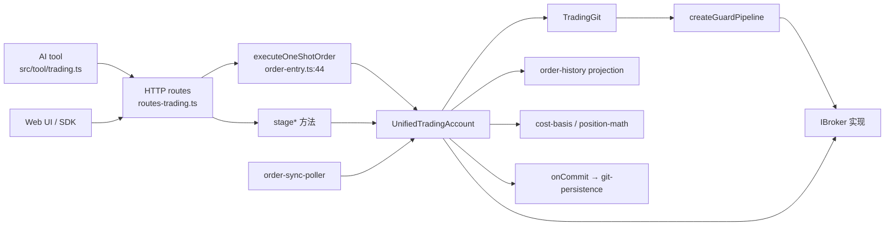
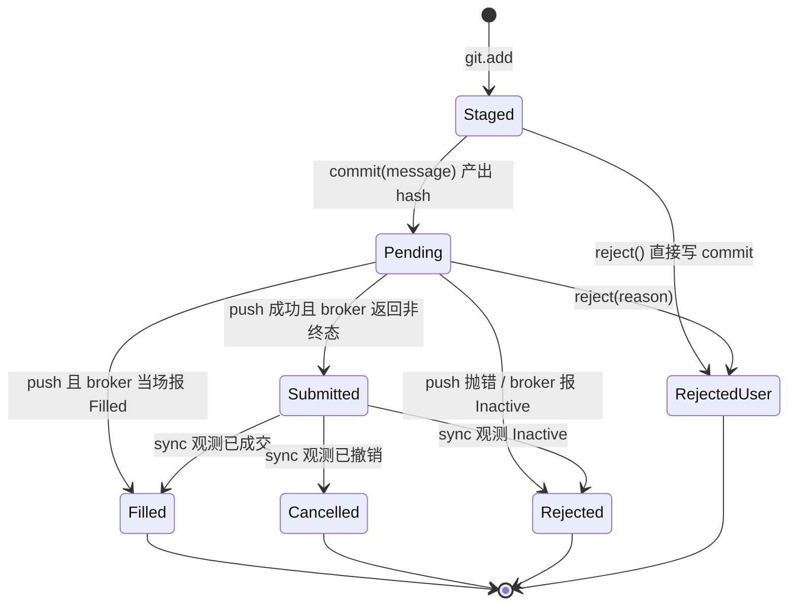

# 03 — 账户核心模型、订单生命周期、持仓与成本基础

> 摘要：`UnifiedTradingAccount`（`services/uta/src/domain/trading/UnifiedTradingAccount.ts`，1262 行）
> 是交易域的唯一业务实体：它把 broker、TradingGit（操作日志）、guard pipeline 和健康/重连状态机
> 捆在一个对象里，对外只暴露 stage / commit / push / sync / 查询这几类能力。订单生命周期是
> **两段式**的：`push` 只能产出 `submitted` 或 `rejected`，`sync` 是唯一能把订单推进到
> `filled` / `cancelled` 的路径；自动化由 `order-sync-poller`（10s 快车道 + 15m 观察车道）驱动。
> 持仓是 broker 权威的，但两类例外由 Alice 侧重建：`avgCostSource='wallet'`（CCXT 现货合成持仓）
> 用 commit 日志做加权平均成本（WAC，仅做多、清零即重置），差额通过 `reconcileBalance` 合成提交
> 折叠进成本基础。订单/成交历史是 commit 日志的投影，一行一单、生命周期折叠。
> 主要脆弱点集中在：push 时成交缺 execution 数据且永不回补、modify 不进入任何投影/可能产生幽灵挂单、
> push 过程中状态快照失败会导致「已下单但未记账」、以及 sync/reconcile 绕过 `inflightWrite` 并发保护。

---

## 1. 概览与职责边界

### 1.1 本区域负责什么

| 职责 | 证据 |
|---|---|
| UTA 实体本身：id / label / 读写属性 / tier / reach / health / recovery | `services/uta/src/domain/trading/UnifiedTradingAccount.ts:141`（constructor）、`:235`（tier）、`:242`（targetReach）、`:254`（health）、`:290`（_attemptReach）、`:355`（_connect）、`:409`（_callBroker） |
| aliceId 契约（`{utaId}\|{nativeKey}`）的生成、解析、跨账户校验 | `UnifiedTradingAccount.ts:510`、`:516`、`:534` |
| 订单生命周期状态机：stage → commit → push → sync | `UnifiedTradingAccount.ts:693/727/742/769/776/793/844`，`git/TradingGit.ts:77/94/119/654` |
| 子账户（wallet）写入消歧 | `UnifiedTradingAccount.ts:644/653/665`，commit message `[sub:…]` 戳记 `:788` |
| 订单参数校验矩阵（orderType × 必填字段、qty vs cashQty、TIF 默认值） | `UnifiedTradingAccount.ts:603`（_validatePlaceOrderParams）、`:693`（stage 装配） |
| 持仓读取及其钱包成本基础重建 | `UnifiedTradingAccount.ts:1026`（getPositions）、`:1040`（_reconcileWalletPositions）、`position-math.ts:52`、`cost-basis.ts:44` |
| 账户快照读模型（getAccount + PnL 不变量 + 币种可加性守卫） | `UnifiedTradingAccount.ts:1005` |
| 订单/成交历史投影 | `order-history.ts:71`、`:134`；UTA 门面 `UnifiedTradingAccount.ts:922/927` |
| 订单同步轮询（快车道 + 外部订单观察车道） | `order-sync-poller.ts:39`，装配点 `services/uta/src/main.ts:127` |
| 订单执行的分派（含 guard 与只读/无 key 拦截） | `UnifiedTradingAccount.ts:180`（dispatcher）、`:181`、`:189`、`:199`（guardedDispatcher） |

### 1.2 本区域不负责什么

- HTTP/IPC 路由的请求响应契约、状态码映射、SDK 与进程边界 → 见 `02-http-api-and-protocol.md`。
- 合约搜索、quote/bars、FX 换汇 → 见 `04-market-data-contracts-fx.md`。
- staging/approval/ledger 的完整 git 语义（pending hash、审批墙、commit 消息规范）→ 见 `05-staging-approval-ledger.md`；本文件只描述「账户侧如何调用」。
- guard 的判定语义与配置 → 见 `06-snapshots-and-guards.md`；本文件只描述调用点与绕过路径。
- 各 broker 适配器的内部实现、Broker Pack 加载 → 见 `07-brokers-and-packs.md`。
- Alice 侧 UI/SDK/supervisor 消费 → 见 `08-alice-consumers-and-ui.md`。
- `commit.json` 的路径、迁移、测试体系与已知 issue 清单 → 见 `09-persisted-state-tests-docs-issues.md`。

### 1.3 上下游

关键边界：**AI 与前端只与 UTA 交互，从不直接碰 broker**；UTA 自身是「一个 broker 连接 + 一条
commit 日志 + 一组 guard」的聚合（`services/uta/src/domain/trading/README.md`），仓库内明确写着
「AI 只与 UTA 交互，永远不直接碰 Broker」。

---

## 2. 功能清单

### 2.1 账户构造与 broker 绑定

- **触发**：`new UnifiedTradingAccount(broker, options)`；生产路径 `UTAManager.initUTA`
  （`services/uta/src/domain/trading/uta-manager.ts:75`）先 `createBroker(cfg)`、再 `loadGitState(cfg.id)`、
  最后注入 `guards / keyless / readOnly / asVendor / savedState / onCommit / onHealthChange / onPostPush / onPostReject`。
- **处理**：`id` 与 `label` 直接取自 broker（`UnifiedTradingAccount.ts:142-143`），因此**一个 broker 实例
  对应一个 UTA，UTA id 就是 broker id**；`readOnly` 由 `options.readOnly ?? options.keyless ?? false` 推导
  （`:144`），`asVendor` 默认 `true`（`:145`）；构造期乐观地把 `_currentReach` 设为 `targetReach`
  （`:147-150`），随后启动**不阻塞**的 `_connect()`（`:218`），并用 `p.catch(() => {})` 吞掉 rejection，
  真实 promise 通过 `waitForConnect()`（`:227`）暴露。
- **输出/副作用**：构造即开始连接；`_getState`（`:158`）与 `dispatcher`（`:180`）作为闭包注入 TradingGit。
  TradingGit 从 `savedState` 恢复（`:203-205`），否则新建。
- **错误与边界**：`_connect` 从不抛给构造方；连接失败通过 health 变化与 `waitForConnect()` 的 rejection 暴露。
  `_disabled`（永久配置错误）下所有 broker 调用抛 `BrokerError('CONFIG')`（`:410-412`）。

### 2.2 健康度、reach、tier 与恢复循环

- **tier**：keyless → `data`；readOnly → `account`；否则 `trading`（`:235-239`）。
- **targetReach**：`data` 停在 `connected`，其余要 `readable`（`:242-244`）；`_attemptReach` 逐级探测
  L1 `broker.init()`、L2 `broker.getAccount()`（`:290-311`），keyless 账户**永不**调 `getAccount`。
- **health** 判定优先级：`_disabled` → `offline`；`reach === 'down'` → `offline`；连续失败 ≥6 → `offline`；
  未达 target 或连续失败 ≥3 → `degraded`；否则 `healthy`（`:254-264`）。
- **失败计数与恢复**：`_onFailure`（`:456`）累加并在转为 offline 时启动恢复；`_scheduleRecoveryAttempt`（`:482`）
  用 `5s × 2^n` 退避、上限 60s（常量 `:104-106`）；`nudgeRecovery()`（`:468`）供读取路径要求立刻重试。
  broker 主动上报的 transport-dead 事件会把 reach 直接打到底并触发恢复（`:334-352`）。
- **冷启动保护**：初始连接期间（`_connecting`）读取最多等 1.5s（`CONNECT_GRACE_MS`，`:113`），超时抛
  `BrokerError('CONNECTING')`，**不计失败、不降级**（`:409-427`）。
- **边界**：`close()`（`:1253`）关闭监听、清理恢复定时器并关 broker；`getHealthInfo()`（`:270`）是全量快照字段来源。

### 2.3 stage 系列（下单 / 改单 / 平仓 / 撤单）

四处均以 `_assertCanCreateProposal()` 开头（`:550`）：keyless 账户**连本地提案都不允许**，抛 `CONFIG`。

**stagePlaceOrder**（`:693`）的固定顺序：

1. `_assertCanCreateProposal()`；
2. `_validatePlaceOrderParams(params)`（`:603`，见 2.4）；
3. `contractFromAliceId(params.aliceId)` 反解并校验归属（`:534`），`params.symbol` 只做覆盖；
4. `_resolveWriteSubAccount(contract, params.subAccountId)`（`:665`）并记录到 `_stagedSubAccountIds`；
5. 逐字段装配 IBKR `Order`：`action`、`orderType`、`tif ?? 'DAY'`，数值字段统一 `new Decimal(String(v))`
   （`:705-719`）；
6. `takeProfit`/`stopLoss` 组装为 `TpSlParams`，两者皆空则 `undefined`（`:721-725`）；
7. `git.add({action:'placeOrder', contract, order, tpsl})`。

**stageModifyOrder**（`:727`）：只把非 null 字段放入 `changes`（`totalQuantity / lmtPrice / auxPrice /
trailStopPrice / trailingPercent / orderType / tif / goodTillDate`），**不校验 orderId 是否存在、不校验
必填项**，直接 `git.add`。

**stageClosePosition**（`:742`）：解析 `qty` 为正的有限 Decimal（`<=0` 或非有限抛错，`:748-756`），
为空表示全平；同样做 aliceId 解析与子账户消歧。

**stageCancelOrder**（`:769`）：仅接收 `orderId`，无存在性校验。

**共同约束**：`git.add` 在 `inflightWrite` 或已有 pending commit 时抛 `PendingHashConflictError`
（`git/TradingGit.ts:77-89`）——即**一次只能有一批待审批操作**。

### 2.4 参数校验矩阵（stage 时同步拒绝）

`_validatePlaceOrderParams`（`:603-641`）使用「非 null 且非空串」的 `has()` 语义（LLM 输出的空串视为缺省）：

| orderType | 必填 | 互斥/禁用 | 证据 |
|---|---|---|---|
| 任意 | 恰好一个数量来源：`totalQuantity` 或 `cashQty` | 两者同时提供报错 | `:609-611` |
| MKT | 需要 `totalQuantity` 或 `cashQty`；不要求价格 | 非 MKT 使用 `cashQty` 报错 | `:612-618` |
| LMT | `totalQuantity` + `lmtPrice` | — | `:620-623` |
| STP | `totalQuantity` + `auxPrice`（触发价） | — | `:624-626` |
| STP LMT | `totalQuantity` + `auxPrice` + `lmtPrice` | — | `:627-630` |
| TRAIL | `totalQuantity` + （`auxPrice` 或 `trailingPercent` 二选一） | 两者同时提供报错 | `:631-638` |
| TRAIL LIMIT | 同 TRAIL + `lmtPrice` | — | `:637` |
| MOC / LOC / REL / 其它 | **无专门分支，落到 default，不做任何校验** | — | `:603-641` fall-through |

同一校验在 AI tool 层有等价的 zod 约束（`src/tool/trading.ts:672-710`：orderType 枚举
`MKT/LMT/STP/STP LMT/TRAIL/TRAIL LIMIT/MOC`，`tif` 枚举 `DAY/GTC/IOC/FOK/OPG/GTD` 且默认 `DAY`），
HTTP 路由层则**不限制** `orderType` 与 `tif` 取值（`services/uta/src/http/routes-trading.ts:28,35`）。
三层的严格程度不一致，见 8.6。

### 2.5 commit / push / reject（账户侧调用契约）

- **commit**（`:776`）：把 `_stampSubAccount(message)`（`:788`）交给 `git.commit`，成功后清空
  `_stagedSubAccountIds`。子账户信息**只**存在于 commit message 的 `[sub:…]` 后缀，Operation schema 不动。
  注意：若 `git.commit` 抛错（如 staging 为空），清空语句不执行，残留的 sub-account id 会渗到下一批 commit 消息里。
- **push**（`:793`）三层门禁：① `_assertCanMutateAccount('push')`（read-only/keyless 拒绝）；
  ② `_disabled` 抛 CONFIG；③ `health === 'offline'` 抛普通 Error。通过后调 `git.push(expectedPendingHash)`，
  随后 fire-and-forget 触发 `onPostPush`（错误被吞）。返回的 `PushResult` 同时含 `submitted` 与 `rejected` 两组。
- **reject**（`:806`）：透传 `git.reject(reason, expectedPendingHash)`，清空子账户暂存，触发 `onPostReject`。
  reject 会写入一条 `[rejected] …` commit，其 results 全部为 `success:false, status:'user-rejected'`
  （`git/TradingGit.ts:197-235`）。
- **dispatcher**（`:180-197`）：push 时每个 operation 依次执行，`op.action` 决定调 broker 的哪个方法；
  `closePosition` 带显式 `quantity` 时**先**重新拉取持仓校验不超量（`:189`、`:572-599`），
  再执行；未知 action 抛错。

### 2.6 平仓量的二次校验（防反向开仓）

`_assertCloseQuantityWithinPosition`（`:572-599`）在 dispatch 瞬间（而非 stage 时）执行：

- `quantity` 必须有限且 >0，否则 `closePosition: qty must be a positive finite number.`；
- 用 `broker.getNativeKey` 归一后按位置查找持仓，找不到持仓 →
  `closePosition: no open position found for …`；
- `quantity > |position.quantity|` → 拒绝并提示可用数量；
- 省略 qty（全平）不经过此校验。

设计意图（注释 `:565-571`）：stage 到 dispatch 之间持仓可能变化，且**不是所有 broker 都实现 reduce-only**，
超量反向单可能穿透零仓位变成新敞口。

### 2.7 sync（订单状态回填）——两种策略

`sync()`（`:844`）是所有成交感知的唯一入口：

1. `git.getPendingOrderIds()` 为空 → 立即返回 `{hash:'', updatedCount:0, updates:[]}`（不产生 commit）；
2. 可选 `opts.delayMs` 先等待（供「市价单刚提交」场景使用）；
3. **listing 策略**（broker 有 `getOpenOrders`）：一次列举，凡仍在列表中的挂单视为存活并跳过；
   只有**缺席**的才花一次 `getOrder` 确认，且确认结果若仍是 `Submitted`/`PreSubmitted` 则视为「仍在工作」
   （`git/TradingGit.ts` 的注释与 `UnifiedTradingAccount.ts:828-841` 说明算法命名空间差异会导致假缺席）；
4. **per-order 策略**（无列举能力）：逐个按年龄退避轮询（`:936`：<2min 每轮都查、<1h 每 60s、更久每 5min）；
5. 对每个候选，转成 `OrderStatusUpdate`：
   `currentStatus = Filled→filled / Cancelled→cancelled / 其它非活动→rejected`（`:884-886`），
   `filledQty` 取 `order.filledQuantity` 且不等于 UNSET 时 `toFixed()`，`filledPrice` 取 `avgFillPrice`；
   `previousStatus` 恒为 `'submitted'`（`:901`）；
6. `filled` 却缺 qty 或价格时打印 `console.warn`（`cost basis for this fill may be incomplete`，`:887-895`）——
   **只告警，仍推进状态机**；
7. 有更新时再读一次完整状态 `_getState()`，并调 `git.sync(updates, state)` 落一条 `[sync]` commit
   （`git/TradingGit.ts:654-687`，一条 syncOrders operation + N 条 per-order result）。

### 2.8 外部订单观察（faithful record）

`observeExternalOrders()`（`:964-980`）：broker 无 `getOpenOrders` 则返回 0；否则把列举结果与
`git.getKnownOrderIds()`（`git/TradingGit.ts:380`）求差，把未知订单压成**一条** `[observed]` commit
（`recordObservedOrders`，`git/TradingGit.ts:338`），并打印 warn。之后这些订单进入普通 pending 扫描被
sync 追踪。**已知边界**：记录时 status 一律写死 `submitted`，且没有把 `avgFillPrice/filledQuantity` 带进去。

### 2.9 查询面（broker 委托 + UTA 层加工）

| 能力 | 行为 | 证据 |
|---|---|---|
| `getAccount(subAccountId?)` | 拉 broker 账户 + `getPositions`；当所有持仓币种 == `baseCurrency` 时，把 `unrealizedPnL` 覆写为持仓 PnL 之和（账户与持仓两个界面按构造一致）；混合币种则保留 broker 原值 | `:1005-1023` |
| `getPositions(subAccountId?)` | 拉持仓 → 打 aliceId → 对 `avgCostSource==='wallet'` 的做成本基础重建（可能**写入** reconcile commit） | `:1026-1037` |
| `getOrders(ids)` / `getQuote` / `getHistorical` / `getMarketClock` / `searchContracts` / `expandContract` / `getContractDetails` / `refreshCatalog` | 纯委托，读回对象打 aliceId；`getHistorical` 等在 broker 不支持时抛 CONFIG 而非静默空数组 | `:1126`、`:1132`、`:1149-1156`、`:1168-1207` |
| `getState()` | 完整快照：账户字段 + 持仓 + 仅 `Submitted/PreSubmitted` 的挂单 | `:158-177`、`:1243` |
| `orderHistory(limit)` / `tradeHistory(limit)` | 对 `exportGitState().commits` 做投影 | `:922-929` |
| `getPendingOrderIds()` | 透传 git 结果（声明返回类型少了 `aliceId`，运行时实际带出） | `:917` |
| `simulatePriceChange` / `setCurrentRound` | 透传到 git，前者用于 PnL 探索 | `:983`、`:987` |

### 2.10 钱包持仓的成本基础重建（读写一体的关键路径）

`_reconcileWalletPositions`（`:1040`）只处理 `avgCostSource === 'wallet'` 的持仓：

1. 收集当前**在途**订单的 aliceId 集合（`:1055`）；
2. 对每个钱包持仓，按 `aliceId` 重放 commit 日志得到投影数量（`cost-basis.ts:44`）；
3. `drift = broker 数量 − 投影数量`；当 `|drift| > 1e-8` **且该 aliceId 无在途订单**时，
   追加一条 `reconcileBalance` 合成 commit（`git/TradingGit.ts:272`），
   bootstrap 价格优先用 broker 的 `avgCost`（>0），否则退回 `marketPrice`（`:1086-1096`）；
4. 无论是否记账，都用重放结果覆写 `p.avgCost`，并用 `pnlOf` 重算 `p.unrealizedPnL`（`:1099-1108`）。
   注释明确：在途抑制只抑制**记账**，不抑制投影，所以挂着长期止盈的持仓仍显示真实成本。

### 2.11 订单历史投影（一行一单）

`projectOrderHistory`（`order-history.ts:71`）规则：

- 引入行：`placeOrder` / `closePosition` / `observeExternalOrder`（`:80`）；行内 `side/orderType/quantity/
  limitPrice/stopPrice` 来自 operation；`closePosition` **硬编码 SELL + MKT**（`:85-87`）；
- `status` 取 result.status，缺省视为 `rejected`（`:88`）；有 orderId 的进 map（后写覆盖先写），
  无 orderId 的进 `anonymous` 数组（`:96-97`）；
- `cancelOrder` 成功时**回写**目标行的 `status='cancelled'` 与 `resolvedAt`（`:104-111`）；撤一个未知订单不产生行；
- sync commit 的每条 per-order result 按 orderId 回写 status / resolvedAt / filledQty / avgFillPrice（`:114-125`）；
- 最后合并 `anonymous` 与 map 值，按 timestamp 倒序，再切 limit（`:128-131`）。
- `source`：`observeExternalOrder` → `external`，其余 → `alice`（`:91`）。

### 2.12 成交历史投影（仅成交）

`projectTradeHistory`（`order-history.ts:134`）：

- 第一遍建立 orderId → 合约/方向/multiplier（来源 `placeOrder`、`observeExternalOrder`、`closePosition`，`:136-156`）；
- sync commit 的 `status==='filled'` result 才成行，`counted` 集合保证同一 orderId 只记一次（`:186-207`）；
- 普通 commit：`reconcileBalance` 一律成行并标 `source:'reconcile'`（方向由 `quantityDelta` 符号决定，`:215-227`）；
  `placeOrder/closePosition/observeExternalOrder` 需 `status==='filled'` 且有 qty/price（`:230-245`）；
- `value = qty × price × multiplier`（`:172`）。

### 2.13 价格模拟

`simulatePriceChange`（`git/TradingGit.ts:753-750+`）以 `stateAfter` 的持仓为基准：`all` 按各自市价缩放；
按 symbol 命中的持仓中，`OPT/FOP/WAR/IOPT/BAG` 等衍生品行**被排除**并列入 `excludedDerivatives`
（`git/TradingGit.ts:34-36` (exclusion branch `:806-811`)）；变化串支持 `@绝对价` 与 `±百分比`；无持仓时返回零变化摘要。

### 2.14 轮询器（成交感知循环）

`order-sync-poller.ts:39`：

- 快车道 `intervalMs` 默认 10s（`:43`）；观察车道 `observeIntervalMs` 默认 15m（`:44`），
  用 `Math.max(1, round(observe/interval))` 折算成 tick 数（`:46-48`），`<=0` 关闭；
- 观察车道在**第 1 个 tick 就跑**（`1 % N` 写法，`:58-61`），以便启动后尽快捕捉既存外部订单；
- 每个 tick：`running` 防重入（`:54-55`）；跳过 keyless 与 `health !== 'healthy'` 的账户（`:64`）；
- 观察失败与 sync 失败都只打日志，不影响其它账户（`:72-74`、`:86-91`）；`timer.unref()`（`:99`）；
- 装配：`services/uta/src/main.ts:122-128`，`observeRaw === 'off'` 则关观察车道，非法时长回退 15m。

---

## 3. 数据与状态

### 3.1 订单状态机

状态集合来自协议：`submitted | filled | rejected | cancelled | user-rejected`
（`packages/uta-protocol/src/types/git.ts:58`）。另有两个**只存在于 git 层、不出现在任何结果里**的中间态：
staging（已 add 未 commit）与 pending（已 commit 未 push）。

状态与驱动者对照：

| 状态 | 含义 | 由谁写入 | 持久位置 |
|---|---|---|---|
| 无 | 尚未 staged | — | — |
| staged | 已进 stagingArea，无 hash | `git.add`（`TradingGit.ts:77`） | 内存；`status()` 可读（经 `toWire` 清洗） |
| pending | 有 `pendingMessage` + `pendingHash` | `git.commit`（`:94`） | 内存 + `status()` |
| submitted | broker 已受理或结果不可判定 | `executePush` + `mapOrderStatus` 默认分支（`:970-977`） | commit.json |
| filled | 成交 | push 结果或 sync 更新 | commit.json |
| cancelled | 已撤销 | push 结果、sync 更新、`cancelOrder` 成功回写历史（`order-history.ts:104`） | commit.json |
| rejected | 失败/被拒/guard 拦截 | push 的 per-op catch（`TradingGit.ts:139-147`）、sync 的 Inactive | commit.json |
| user-rejected | 人工拒绝待审批批次 | `executeReject`（`:197-235`） | commit.json |

**转换表（含前置条件与失败形态）**：

| 起点 | 事件 | 终点 | 谁驱动 | 条件 / 边界 |
|---|---|---|---|---|
| staged | commit | pending | 人工或 AI（`UnifiedTradingAccount.ts:776`） | staging 非空；`inflightWrite` 为假；产出 8 位 hash |
| staged/pending | `git.add` | 报错 | 任何调用方 | 已有 pending commit 时抛 `PendingHashConflictError`（`TradingGit.ts:80-85`） |
| pending | push | submitted / filled / rejected / cancelled | 人工审批或 `allowAiTrading` 开时 AI（`src/tool/trading.ts:206-207`） | `expectedPendingHash` 必须匹配；**逐 operation try/catch**，一个失败不代表整批回滚 |
| pending | reject | user-rejected | 人工 | 写入一条 `[rejected]` commit，结果 success=false |
| submitted | sync（listing 缺席确认 / per-order 轮询） | filled / cancelled / rejected | `order-sync-poller` 或手动 `POST …/sync` | 仅对非 `Submitted/PreSubmitted` 状态产生更新；`filled` 缺 qty/price 时只告警 |
| submitted | sync 确认仍在列表或返回 Submitted | submitted（不变） | 同上 | 缺席不视为终态 |
| submitted | sync 查不到订单 | submitted（不变，本次跳过） | 同上 | `brokerOrder === null` 时 `continue`（`UnifiedTradingAccount.ts:872`） |
| 任意已成交/已撤销 | — | 终态 | — | 状态来源于 result 的**最新**一次写入；`getPendingOrderIds` 用「最新一次见到的 status」判定（`TradingGit.ts:692-750`） |
| 无（外部下单） | `observeExternalOrders` | submitted | 轮询器慢车道 | 记录时写死 submitted，且不校验是否已成交（`:970-977`） |

**状态判定的实现细节（易踩）**：pending 判定用「自新到旧扫描，最新一次遇到的 status 为准」，
TP/SL 括号腿在首次出现时按 `submitted` 出生（`TradingGit.ts:696-710`），这样 Alpaca 那种
「被 held、永不出现在列表里」的止损腿也能被追踪。

### 3.2 内存状态（UnifiedTradingAccount）

| 字段 | 含义 | 生命周期 |
|---|---|---|
| `_consecutiveFailures` / `_lastError` / `_lastSuccessAt` / `_lastFailureAt` | 健康计数与时间戳 | 进程内；成功即清零 |
| `_recoveryTimer` / `_recovering` | 恢复定时器与状态 | 进程内；`close()` 清理 |
| `_disabled` | 永久配置错误标记 | 一旦置位不再清除（`:315-323`） |
| `_connecting` | 初始连接进行中 | 连接 settle 后永久为假（`:355-362`） |
| `_currentReach` | 能力阶梯当前档 | 每次探测/调用结果更新 |
| `_subAccounts` / `_stagedSubAccountIds` | 子账户缓存与暂存戳记 | 首次探测后固定；暂存随 commit/reject 清空 |
| `_pollState` | `orderId → {firstSeenAt, lastPolledAt}` | **只增不删**（`:934-947`，全文无 delete） |
| `_getState` / `_connectPromise` | 注入闭包与连接 promise | 构造期确定 |

### 3.3 内存状态（TradingGit）

| 字段 | 含义 |
|---|---|
| `stagingArea: Operation[]` | 已 add 未 commit 的操作 |
| `pendingMessage` / `pendingHash` | 待审批批次 |
| `inflightWrite` | push/reject 互斥标志 |
| `commits: GitCommit[]` / `head` | 全量日志与头指针（无裁剪，见 8.9） |
| `currentRound` | 可选轮次标记，写入 commit（`setCurrentRound`，`TradingGit.ts:648`；生产调用链只到 `UnifiedTradingAccount.setCurrentRound:987`，SDK 侧是空实现） |

### 3.4 持久化格式

- 路径：`data/trading/<accountId>/commit.json`（`git-persistence.ts:14`），另有三处 legacy 回退路径（`:19-23`）。
- 写入时机：**每次 commit**（含 sync / reconcile / observed / reject）整体重写整个 `GitExportState`
  （`git-persistence.ts:43-48`）——O(全量) 写放大，无保留策略。
- `GitCommit` 字段：`hash / parentHash / message / operations / results / stateAfter / timestamp / round?`
  （`packages/uta-protocol/src/types/git.ts:100`）。
- `GitState` 字段：`netLiquidation / totalCashValue / unrealizedPnL / realizedPnL / positions / pendingOrders`
  （同文件 `:88`）。
- JSON 化前的清洗：`projectOperation` 用 `OrderHelper.toWire` 抹掉 IBKR sentinel（`TradingGit.ts:549-556`），
  字段清单在 `OrderHelper.ts:36-44`；恢复时 `rehydrateOrder` 重新包 Decimal、`rehydrateGitState` 补
  `multiplier ?? '1'`（`TradingGit.ts:580-646`）。

### 3.5 字段表：协议关键类型

**OperationResult**（`git.ts:60-79`）：`action`、`success`、`orderId?`、`status`（五值枚举）、`execution?`、
`orderState?`、`filledQty?`、`filledPrice?`、`error?`、`legs?`、`symbol?`、`raw?`。
其中 `filledQty/filledPrice` 是 Decimal 字符串（子聪精度不变形），`legs` 是 TP/SL 子单（`{orderId, kind}`）。
**实测 `execution` 从未被任何生产代码赋值**：`parseOperationResult` 不读它（`TradingGit.ts:929-968`），
三个非 mock broker 的 `placeOrder` 也不返回它（`CcxtBroker.ts:633-637`、`AlpacaBroker.ts:357-363`、
`IbkrBroker.ts:499-503`）。仅 `formatOperationChange` 在渲染 log 文本时读 `result.execution?.price`
（`TradingGit.ts:476/485/502`），因此该分支在所有真实路径下不可达。

**Position**（`broker.ts:112-155`）：`contract`、`currency`、`side`、`quantity`(Decimal)、`avgCost`、
`marketPrice`、`marketValue`、`unrealizedPnL`、`realizedPnL`、`multiplier`、`avgCostSource?`、`risk?`。
约定：monetary 字段全为字符串；`marketValue`/`unrealizedPnL` **已乘 multiplier**，消费方不得重复乘；
`avgCostSource` 缺省等价 `'broker'`。

**AccountInfo**（`broker.ts:251-262`）：`baseCurrency`、`netLiquidation`、`totalCashValue`、`unrealizedPnL`、
`realizedPnL?`、`buyingPower?`、`initMarginReq?`、`maintMarginReq?`、`dayTradesRemaining?`。

**OpenOrder**（`broker.ts:222-247`）：`contract`、`order`、`orderState`、`orderId?`（**字符串**，避免 19 位
id 被 IBKR 数字字段截断）、`avgFillPrice?`、`tpsl?`。

**Stage 参数**（`git.ts:256-306`）：全部数量/价格字段为字符串；`subAccountId?` 只在多钱包账户上是必需；
`parentId` 也是字符串（`stagePlaceOrder` 里 `parseInt` 回数字，`:717`）。

---

## 4. 外部交互

### 4.1 调用方向

| 方向 | 接口 | 契约要点 |
|---|---|---|
| 上层 → UTA | `stage*/commit/push/reject/sync/getAccount/getPositions/getOrders/orderHistory/tradeHistory/getState/…` | 见第 2 节；push 必须携带 `expectedPendingHash`（HTTP 层缺省返回 409 `PENDING_HASH_REQUIRED`，`routes-trading.ts:503-535`） |
| UTA → broker | `IBroker`：`placeOrder / modifyOrder / cancelOrder / closePosition`、`getAccount / getPositions / getOrders / getOpenOrders? / getOrder`、行情与合约面 | `packages/uta-protocol/src/types/broker.ts` 中 IBroker 声明；UTA 只经 `_callBroker` 包装（`:409`） |
| UTA → TradingGit | `executeOperation`（经 guard）、`getGitState`、`onCommit` | `git/interfaces.ts:77-81` |
| TradingGit → guard 管道 | `createGuardPipeline(dispatcher, broker, guards)` | `guards/guard-pipeline.ts:13`；**guard 直接持 broker**，不经 `_callBroker` |
| UTA → 磁盘 | `onCommit` → `createGitPersister` | 每次 commit 全量重写 |
| 轮询器 → UTA | `observeExternalOrders()` / `getPendingOrderIds()` / `sync()` / `health` / `keyless` | `order-sync-poller.ts:63-91` |
| 一shot 入口 | `executeOneShotOrder(uta, message, stage)` | `order-entry.ts:44`；阶段化错误 `{ok:false, phase, error}`，HTTP 映射 stage→400 / commit→400 / push→500（`routes-trading.ts:65-67,70-79`） |

### 4.2 错误传播

- broker 层错误统一经 `BrokerError.from`（`broker.ts:45-61`）分类为
  `CONFIG | AUTH | NETWORK | EXCHANGE | MARKET_CLOSED | CONNECTING | UNKNOWN`（`:16`），
  其中 `CONFIG/AUTH` 为 permanent（`:41`）；消息模式匹配见 `:64-78`（注意它会按正则把 `403` 归为 EXCHANGE、
  把 `429/5xx/timeout` 归为 NETWORK）。
- `_callBroker`（`:409-437`）是唯一入口：失败时 `BrokerError.from` → `_onFailure` → 抛出；
  读路径的 HTTP 包装把 permanent 映射 500、transient 映射 503（`routes-trading.ts:104-126`）。
- **push 的 per-operation 错误被降级为结果行**：`executePush` 里每个 op 独立 try/catch，异常写进
  `results[i].error` 并置 `rejected`（`TradingGit.ts:139-147`）；只有 push 之前的门禁错误才向上抛。
- **guard 拦截的表现形式是一条 rejected 结果**：`createGuardPipeline` 返回
  `{success:false, error:'[guard:<name>] <reason>'}`（`guard-pipeline.ts:31`），
  经 `parseOperationResult` 变成 `success:false, status:'rejected'`——从订单历史看与 broker 拒单同形。

### 4.3 副作用清单（读路径也可能写）

| 入口 | 副作用 |
|---|---|
| `getPositions()` / `getAccount()` | 可能追加 `reconcileBalance` commit（`:1040-1108`）→ 触发 `onCommit` 落盘、产生历史行（trade-history 里 `source:'reconcile'`） |
| `sync()` | 追加 `[sync]` commit |
| `observeExternalOrders()` | 追加 `[observed]` commit |
| `push()` | 追加批次 commit + `onPostPush` 钩子（快照等，见 06 文件） |
| `reject()` | 追加 `[rejected]` commit + `onPostReject` |
| `commit()` | 无落盘（只有 push/reject/sync/reconcile/observed 才写盘） |

---

## 5. 配置项、默认值、环境变量、feature 开关

| 配置 | 位置 | 默认 | 作用 |
|---|---|---|---|
| `trading.observeExternalOrdersEvery` | `src/core/config.ts:403` | `'15m'` | 外部订单观察节奏；`'off'` 关闭；非法值回退 15m（`main.ts:122-126`） |
| 快车道周期 | `order-sync-poller.ts:43` | 10000 ms | 仅测试可覆盖，生产未暴露配置 |
| 观察车道 | `order-sync-poller.ts:44` | 900000 ms | 由上一项折算 |
| `guards: [{type, options}]` | `utaConfigSchema`（`config.ts:454`）、`guardConfigSchema`（`:436`） | `[]` | 传给 `resolveGuards`；未知 type 跳过并 warn（`registry.ts:27-31`） |
| guard 内参 | `max-position-size.maxPercentOfEquity` = 25（`max-position-size.ts:5`）；`cooldown.minIntervalMs` = 60000（`cooldown.ts:4`）；`symbol-whitelist.symbols` 必填且非空（`symbol-whitelist.ts:11`） | — | 语义细节见 06 |
| `readOnly` / `keyless` / `asVendor` | `config.ts:469/473/476`，注入 `UnifiedTradingAccount.ts:144-145` | false / false / true | keyless ⇒ readOnly；keyless 不参与权益聚合 |
| `ephemeral` | `config.ts:465` + refine `:480` | 无 | 仅允许 `mock-simulator`；启动时清 `data/trading/<id>/` |
| 连接宽限 `CONNECT_GRACE_MS` | `UnifiedTradingAccount.ts:113` | 1500 ms | 冷启动读取的快速失败阈值 |
| 恢复退避 | `UnifiedTradingAccount.ts:104-106` | 5s 起、60s 上限 | `RECOVERY_BASE_MS / RECOVERY_MAX_MS` |
| 降级/离线阈值 | `UnifiedTradingAccount.ts:102-103` | 3 / 6 | 连续失败计数 |
| `OPENALICE_UTA_PORT` | `services/uta/src/main.ts:38` | 47333 | UTA 服务端口（不属本区域但影响联调） |
| `allowAiTrading` | `src/tool/trading.ts:204-211` | false | 关时 AI 只能 stage+commit，push 必须人工 |

无独立 feature flag 控制订单功能；`readOnly`/`keyless` 是唯一的功能性门禁。

---

## 6. 不变量、时序与并发假设

1. **aliceId 归属唯一**：`{utaId}|{nativeKey}`，跨 UTA 使用直接抛错（`:541-544`）；所有从 broker 回来的
   contract 都被 `stampAliceId` 覆写（`:158-176`、`:1028`、`:1127`、`:1170`、`:1182`、`:1201`）。
2. **push 只能产生 submitted/rejected 语义**：市价单可能当场 `filled`（Mock 即如此，`e2e/uta-lifecycle.e2e.spec.ts:53-65`），
   但架构上不依赖；`sync` 是唯一权威成交来源（`README.md` 的「push 只提交，sync 确认结果」）。
3. **缺席 ≠ 终态**：listing 策略下订单从列表消失必须再确认一次（`:853-877`）。
4. **一次一个待审批批次**：`inflightWrite` + pending hash 双重互斥（`TradingGit.ts:77-99`、`:241-249`）。
5. **状态快照是 push 的一部分**：每个 commit 都携带 `stateAfter`，取自执行后的 `getGitState()`（`TradingGit.ts:156-166`）。
6. **账户级 unrealizedPnL = 持仓之和**（同币种时）：`getAccount` 强制覆写（`:1007-1022`），
   混合币种时退化为 broker 原值并在注释中标为已知缺口。
7. **持仓 math 单一实现**：`derivePositionMath`/`pnlOf` 是唯一计算处，multiplier 空/零视为 1
   （`position-math.ts:42-46`）；`aggregateAccountFromPositions` 对 short 取负号以免把保证金收入重复计入
   （`:95-117`）。
8. **成本基础只在钱包持仓上重建**：broker 权威 `avgCost` 的持仓不进入重放路径（`:1041`）。
9. **在途订单抑制 drift 记账**：同一 aliceId 有 pending 订单时，数量差异不写 reconcile，等订单落地后下次再记
   （`:1049-1067`；spec 复现 `UnifiedTradingAccount.spec.ts:1015-1052`）。
10. **同步/观察/reconcile 不参与写互斥**：`inflightWrite` 只在 `add/commit/push/reject` 生效
    （`TradingGit.ts:78/95/125/193/242`），`sync:654`、`recordReconcile:272`、`recordObservedOrders:338`
    直接 push commit 并改 `head`。因此并发场景下 commit 的 `parentHash` 可能指向已被覆盖的 head。
11. **轮询器与人工 push 并发**：poller 的 `running` 只防自己重入（`order-sync-poller.ts:53-55`），
    不与 `sync()` 的手动调用互斥；`sync` 读到的 pending 列表到写 commit 之间若有新订单落地，会产生重复更新行
    （成本基础侧用 `counted` 去重，历史投影侧用「最后一次 write wins」掩盖）。
12. **提交不可变但头可变**：`show(hash)` 只读；`restore` 从磁盘恢复时补 multiplier（`TradingGit.ts:625-646`）。

---

## 7. 测试覆盖

### 7.1 覆盖矩阵（本区域行为 × 测试位置）

| 行为 | 覆盖 | 位置 |
|---|---|---|
| 只读/无 key 的账户变更拦截（stage 允许、push 拒绝、直接调 git 也被拦） | 有 | `UnifiedTradingAccount.spec.ts:27-85` |
| 子账户写入消歧（无选择器拒绝、未知 id 拒绝、与标的不一致拒绝、stamp 不外溢） | 有 | 同上 `:87-155` |
| dispatcher 分派四种 operation 及各 broker 调用参数 | 有 | 同上 `:157-333` |
| `_getState` 三方法聚合与空 pending 过滤 | 有 | 同上 `:335-392` |
| getAccount PnL 不变量 + 混合币种守卫 | 有 | 同上 `:394-433` |
| per-orderType 必填字段门禁（9 个分支 + 空串语义） | 有 | 同上 `:533-580` |
| stage 装配（数量/价格/精度/字符串保持/tif 默认/outsideRth/tpsl 三态） | 有 | 同上 `:497-704` |
| stageModifyOrder / stageClosePosition / stageCancelOrder 字段装配 | 有 | 同上 `:706-816` |
| commit/push 兜底错误、多 op 单批、staging 清空 | 有 | 同上 `:818-854` |
| sync：无 pending、单笔成交、累计成交加权均价、listing 模式 getOrder 只花在缺席订单、per-order 回退与退避、localSymbol hint、broker 查不到时不动 | 有 | 同上 `:856-1013` |
| 钱包 reconcile 在途抑制与残留补记 | 有 | 同上 `:1015-1052` |
| guard 拦截/放行（含 guard 直接读 broker） | 有 | 同上 `:1053-1083`；`guards/guards.spec.ts:195-270` |
| 从 savedState 恢复 | 有 | 同上 `:1085-1104` |
| 健康/恢复全套（自动重连、transport-dead、3/6 阈值、nudge、关定时器） | 有 | 同上 `:1105-1360` |
| 端到端生命周期（市价买入、push 即成交、限价→sync、部分/全部平仓、撤单、历史条数） | 有 | `__test__/e2e/uta-lifecycle.e2e.spec.ts:30-169` |
| TPSL 透传与精度端到端 | 有 | 同上 `:171-280` |
| 轮询器：全生命周期、跳过 keyless/不健康/无 pending、外部订单慢车道接管、单账户失败不影响其他 | 有 | `order-sync-poller.spec.ts:27-119` |
| 订单历史投影（折叠、外部来源、期权字段、无 orderId 行、撤单回写） | 有（仅投影函数） | `order-history.spec.ts:43-120` |
| 成交历史投影（sync 去重、reconcile 标注、来源归并） | 有（仅投影函数） | 同上 `:122-158` |
| 成本基础（单买、加权、部分卖、清仓重置、超卖重置、重买、Ame 例、reconcile、非 success/缺价跳过、aliceId 过滤、closePosition 当卖、子聪精度、sync 成交按执行价、去重、外部单） | 有 | `cost-basis.spec.ts:91-370` |
| 持仓 math（STK/OPT/FUT/short/multiplier 默认）与账户聚合（含 short 号） | 有 | `position-math.spec.ts:5-138` |
| Git 层：pending hash 冲突、sentinel 清洗、日志渲染、reconcile/observed 序列化、pending id 扫描（含括号腿）、round 标记、simulatePriceChange | 有 | `git/TradingGit.spec.ts:494-760,800-1132` |
| 一shot：三阶段 happy path、stage/commit/push 各自失败、不误调 reject | 有 | `order-entry.spec.ts:26-90` |

### 7.2 无测试的行为（对照第 8 节的风险）

| 未覆盖行为 | 说明 |
|---|---|
| UTA 门面 `orderHistory()` / `tradeHistory()` | 全仓 grep 无任何 spec 调用这两个方法；只有底层投影函数有测试 |
| modify 的完整链路 | 只有「参数透传」有测试（`UnifiedTradingAccount.spec.ts:317-333`），没有「改单后历史/挂单/成本基础如何变化」的测试 |
| push 时成交的 execution 缺失 | e2e 只断言 `status==='filled'` 与 `sync` 返回 0（`uta-lifecycle.e2e.spec.ts:53-65`），不断言成本基础后果 |
| 撤单时的部分成交 | 无任何用例 |
| push 过程中 `getGitState()` 抛错 | 无任何用例 |
| `stageModifyOrder` 对不存在 orderId 的行为 | 无 |
| 子账户列表探测失败后的回退（单 default） | 无 |
| `_pollState` 增长 | 无 |
| 混合币种账户的持仓级 PnL | 只测了「保留 broker 值」，未测长期方案 |
| `MOC/LOC/REL` 等未列分支的 orderType | 无（stage 放行到 broker） |
| 撤单对未知 orderId（不产生历史行） | 无 |

---

## 8. 观察到的问题、技术债、耦合与重构关注点

### 8.1 push 时成交缺 execution 数据，且永不回补（高）

`parseOperationResult`（`git/TradingGit.ts:929-968`）只抽 `orderId / orderState / legs`，**不读**
`filledQty / filledPrice / execution`；三个真实 broker 的 `placeOrder` 也不返回这些
（`CcxtBroker.ts:633-637`、`AlpacaBroker.ts:357-363`、`IbkrBroker.ts:499-503`，只有 Mock 内部记录
`filledQuantity/avgFillPrice`，`MockBroker.ts:308-310` 也不外传）。因此当 broker 在 createOrder 响应里
直接报 `Filled`（Mock 市价单即如此，`e2e/uta-lifecycle.e2e.spec.ts:53-65`）时：

- commit 里留下 `status:'filled'` 但 `filledQty/filledPrice` 缺失；
- 该订单**不是 pending**，`sync` 永远不会再看它（`getPendingOrderIds` 只收 `submitted`，`TradingGit.ts:744`）；
- `cost-basis` 与 `trade-history` 都要求 `filledQty && filledPrice`，于是这笔成交对成本基础与成交列表
  **完全不可见**（`cost-basis.ts:129-134`、`order-history.ts:230-231`）；
- 对 wallet 类持仓，后续 `getPositions` 会把缺失的数量当成 drift，用**观察时市价**折叠进来
  （`:1086-1096`），即成本价被记成市价。

对真实 broker 而言市价单通常返回 `accepted/new`（非 Filled），所以这条路径主要在 Mock/交易所同步返回终态时触发；
但「成交但未记录」的形态对任何「响应里带终态」的 broker 都成立。

### 8.2 modify 不进入投影，且可能产生幽灵挂单（高）

- `projectOrderHistory` 只处理五种 action（`order-history.ts:80-111`），`modifyOrder` 被完全忽略 →
  **改单后历史行仍显示旧参数**，用户看到的价/量与交易所不一致。
- `AlpacaBroker.modifyOrder` 走 `replaceOrder` 并返回**新 orderId**（`AlpacaBroker.ts:389-395`）；
  CCXT 的 `editOrder` 同样以返回 id 为准（`CcxtBroker.ts:692-701`），且**不更新** `orderSymbolCache`
  （对比 place 时 `:630` 会写）。UTA 层把这个新 id 只放进 per-op result（`TradingGit.ts:962` 的 `orderId`），
  但 `results[i].orderId` 的语义是「该 operation 产生的订单」——于是旧 orderId 在日志里保持 `submitted`、
  继续被 pending 扫描与 sync 追踪（`TradingGit.ts:744`），新 id 则无人跟踪。`order-sync-poller` 会持续对这个
  陈旧 id 调 broker（CCXT `getOrder` 命中缓存符号后 `fetchOrderById` 对已 replace 的 id 返回 null →
  每次 sync 静默跳过，`CcxtBroker.ts:1127-1145`）。

### 8.3 push 中途状态快照失败 = 已下单未记账（高）

`executePush` 的执行顺序是：逐 op 调 broker（`:136-149`）→ `getGitState()`（`:157-158`）→ 组装并追加 commit →
清空 staging（`:167-180`）。若 `getGitState()` 抛错（broker 读超时、账户被禁用、`_callBroker` 抛 CONNECTING），
则**operation 已经在交易所执行、commit 未写、staging 未清**；调用方看到 push 失败，重试会把同一批操作
再发一次。这是本区域最严重的正确性缺口（重复下单）。

### 8.4 sync / reconcile / observed 绕过写互斥与 hash 校验（中）

`inflightWrite` 与 `expectedPendingHash` 只保护 `add/commit/push/reject`（`TradingGit.ts:78/95/125/193/242`）；
`sync`（`:654`）、`recordReconcile`（`:272`）、`recordObservedOrders`（`:338`）直接追加 commit 并改写 `head`。
后果：① 批次 commit 的 `parentHash` 可能指向已被 sync 覆盖的 head，日志从线性历史变成有分叉的序列；
② `getPendingOrderIds` 的「自新到旧扫描」在这种交错下仍能给出正确最新状态（它按时间倒序扫 commits 数组），
但 `log()` 的 parentHash 链已不可用于审计回溯。

### 8.5 撤单时的部分成交会从成本基础消失（中）

`sync` 会把 Cancelled 订单的 `filledQty/filledPrice` 一并写入（`:881-905`），`git.sync` 也持久化
（`TradingGit.ts:670-676`），但 `cost-basis` 的 sync 分支要求 `result.status === 'filled'`（`cost-basis.ts:104`），
于是「部分成交后撤销」的成交量被丢弃；随后钱包持仓的数量差会在下次 `getPositions` 被当作 drift
按市价折叠（`:1086-1096`），成本价错误但不报错。`order-history` 侧同样只在 sync 时回写状态，
不再区分「已成交部分」。

### 8.6 三层参数校验不一致（中）

| 项 | AI tool | HTTP 路由 | UTA stage |
|---|---|---|---|
| `orderType` | 枚举 7 值 | 任意非空字符串（`routes-trading.ts:28`） | 仅对 6 个已知类型做必填校验，其余落 default |
| `tif` | 枚举 6 值且默认 DAY | 任意字符串（`:35`） | 默认 DAY，无取值校验 |
| 数量来源 | tool 描述 + 运行时门禁 | refine 要求 qty 或 cashQty（`:44-47`） | 精确到「恰好一个」 |
| `cashQty` | 允许（MKT） | 允许 | 仅 MKT，其余拒绝 |

同时 `getCapabilities().supportedOrderTypes`（`CcxtBroker.ts:1320-1326` 只有 MKT/LMT；`IbkrBroker.ts:874-879`
含 MOC/LOC/REL；`LeverupBroker.ts:524-526` 只有 MKT）**在 stage/push 路径上完全没有被使用**——全仓没有任何
消费点（仅 SDK 透传与测试）。也就是说：给 LeverUp 账户 stage 一个 LMT 会通过全部本地校验，最后在 broker 层
被拒（或更糟，被 broker 静默转换）。`cashQty` 同理：`LongbridgeBroker.ts:287-288` 与
`LeverupBroker.ts:225-226` 直接要求 `totalQuantity`，但 stage 阶段不知道这件事。

### 8.7 CCXT 下单丢失用户 TIF 与 outsideRth（中）

`CcxtBroker.placeOrder` 构造 `params` 时只处理 `extraParams`、TP/SL、`triggerPrice`
（`CcxtBroker.ts:577-601`），**从不读 `order.tif`**（全文件仅 `:684` 的 modifyOrder 分支写
`params.timeInForce`）。因此走 CCXT 的订单无论 stage 时声明 DAY/GTC/IOC 都被丢给交易所默认值；
`outsideRth` 同样只在 Alpaca 被映射（`AlpacaBroker.ts:329`）。这与 `StagePlaceOrderParams` 声明的字段集
（`git.ts:275,277`）不一致。

### 8.8 `_stagedSubAccountIds` 在 commit 失败时泄漏（低）

`commit()`（`:776-782`）先调 `git.commit(...)`，异常时不执行清空，残留的 id 会被下一批 commit 的
`[sub:…]` 戳记带上——审计信息指向了错误的钱包。reject 路径做了清空（`:806-810`），commit 路径没有 try/finally。

### 8.9 日志无界增长 + 全量重写 + O(n) 扫描（中）

- `commits` 无裁剪（`TradingGit.ts` 全文无 slice/splice 上限逻辑），`commit.json` 每次 commit 全量重写
  （`git-persistence.ts:45-48`），且 `stateAfter` 里带完整持仓与挂单快照——长期运行后单次 commit 的
  磁盘成本与日志大小线性增长。
- `projectTradeHistory` 对每个 sync 成交都调 `commitSourceIsExternal`（`order-history.ts:254-263`），
  内部再全量扫描所有 commits → 单次投影 O(commits × fills)。
- `getPendingOrderIds` 每次调用做两次全量扫描（`TradingGit.ts:696-748`），被 `sync`、`_getState`
  （`:159`）、`_reconcileWalletPositions`（`:1055`）、轮询器（`order-sync-poller.ts:77`）反复触发。

### 8.10 `_pollState` 只增不删（低）

`:934` 声明的 Map 只有 `set`（`:940`），没有 delete/clear；无列举 API 的 broker（Longbridge、LeverUp）
下，每个历史订单永久留一条记录。当前实现选择「重启即重置」，所以只是内存缓慢增长。

### 8.11 读路径有写副作用（中）

`getAccount()`/`getPositions()` 会触发 reconcile 写盘（`:1026-1037`、`:1040-1108`）。这带来两个问题：
① 一个 GET 可能产生新 commit 与新历史行（trade-history 里出现 `source:'reconcile'`），调用方难以预期；
② `getAccount` 内部调 `getPositions` 再覆盖 PnL，一次账户读在钱包账户上等于「读 broker 两次 + 可能写日志」；
注释自己承认「for the cost of one extra broker round-trip per account read」。另外 `_getState`
（`:158-177`）**没有**应用同一条 PnL 求和规则，所以 `getState().unrealizedPnL` 与 `getAccount().unrealizedPnL`
在同一时刻可能不同。

### 8.12 guard 绕过健康计数并只覆盖部分操作（中）

`createGuardPipeline` 直接用注入的 `broker` 取持仓与账户（`guard-pipeline.ts:21-24`），不走 `_callBroker`：
① 失败不进入健康统计与恢复（guard 读取失败会以异常形式冒泡到 `executePush` 的 per-op catch，
变成一条 `rejected` 结果）；② `MaxPositionSizeGuard`（`max-position-size.ts:16`）与
`CooldownGuard`（`cooldown.ts:16`）只处理 `placeOrder`，`closePosition`/`cancelOrder` 完全不受限；
③ 三个内置 guard 都不校验 `closePosition` 的数量（该职责由 UTA 的
`_assertCloseQuantityWithinPosition` 承担，见 2.6）。判定语义详见 `06-snapshots-and-guards.md`。

### 8.13 其它小问题

- `OrderHelper.read`（`OrderHelper.ts:74`）无任何调用点；`isCostBasisRelevant`（`cost-basis.ts:170`）同样零引用。
- `UnifiedTradingAccount.getPendingOrderIds()` 声明返回类型缺 `aliceId`（`:917`），运行时却透传（reconcile 依赖它）。
- `simulatePriceChange` 的调用面很窄：全仓唯一调用者是 HTTP 路由与 SDK 透传（`routes-trading.ts:246`），
  生产无人自动触发；`setCurrentRound` 在 SDK 里是空实现（`src/services/uta-client/UTAAccountSDK.ts:390-392`），
  只有 `git` 层有测试（`git/TradingGit.spec.ts:756-766`）。
- `docs/uta-live-testing.md:138` 明确「**Never trust the ledger over the venue**」，而 8.1/8.5 正是
  「账本与交易所不一致且无自动回补」的两个实例；该文档同时要求 S2/S3/S4 场景覆盖「成交感知 / 挂单稳定 /
  改单保持同一 orderId」，说明 8.1–8.2 是被文档视为必须守住的边界。

---

## 9. 未探索区域与开放问题

### 9.1 未探索区域

- **`PENDING_HASH_CONFLICT` 的完整竞争路径**：只核对了 HTTP 映射（`routes-trading.ts:517-535`）与
  `buildOperationSummaries` 的渲染，没有复现「人工在 UI 点 push 的同时轮询器 sync」的时序。
- **快照/事件系统对订单状态的消费**：`onPostPush`/`onPostReject` 钩子在
  `UTAManager.setSnapshotHooks`（`uta-manager.ts:67-70`）里连线，快照内容与触发时机归 06 文件；
  本文件只确认了「push/reject 完成后 fire-and-forget 调用」。
- **Alice 侧 supervisor 视角的 UTA 生命周期**（重启、purge、多实例）→ 见 08/09 文件。
- **各 broker 的 `getOrders` 语义差异**（IBKR 只返回本 clientId 的订单、CCXT 逐单查询）只做了表面核对，
  完整行为归 07 文件。
- **`docs/uta-live-testing.md` 的 S1–S14 场景与本文 8.x 缺口的逐条对照**未做（需要真实 demo 账户）。
- **本次为纯静态调查**：未运行任何测试或探针（`packages/ibkr`、`packages/uta-protocol` 未构建，`tsx` 直接加载源码失败；仓库 vitest 配置亦排除 `*.e2e.spec.*`）。第 8 节各项均为代码路径推断，标注位置为实际读取到的 `path:line`；其中「push 即成交导致成本基础不可见」与「push 中途快照失败」两条最值得在重构前用一次真实运行确认。
- **`_getState` 与 `getAccount` PnL 语义差异**是否有意为之：代码无注释说明，标 `[推断]` 为历史演进残留。

### 9.2 开放问题（按对重构的影响排序）

1. push 时若 broker 返回终态，是否应当**立即**用响应数据落账（并让成本基础可见）？如果坚持「sync 是唯一
   成交来源」，是否应把「push 即成交」也写成 pending 直到 sync 确认一次？（对应 8.1）
2. modify 是否应当作为**已追踪订单的替换语义**纳入投影与 pending 扫描（旧 id 替换为新 id），
   而不是产生一个孤儿 operation？（对应 8.2）
3. `executePush` 的状态快照失败应如何收口：先写 commit 再补快照、允许快照为 null、还是引入
   「已派发未记账」的恢复日志？（对应 8.3）
4. `sync/reconcile/observed` 是否应纳入同一把写锁与 hash 校验（例如统一走 `beginWrite` 但允许无 pending）？
   （对应 8.4）
5. 成本基础是否要支持短仓与部分成交撤销（当前 WAC 是 long-only、清零即重置、撤单部分成交丢失）？
   （对应 8.5）
6. `supportedOrderTypes` / `supportedSecTypes` 是否应在 stage 阶段成为硬门禁（当前完全未消费）？
   `cashQty` 是否需要按 broker 能力声明？（对应 8.6）
7. `order.tif` 与 `outsideRth` 在 broker 层的落点是否需要一个统一的「订单字段映射契约」，
   而不是每个 broker 各自处理？（对应 8.7）
8. 账户读是否应保持写副作用（reconcile），还是把记账变成显式的「对账」动作，让 GET 纯读？（对应 8.11）
