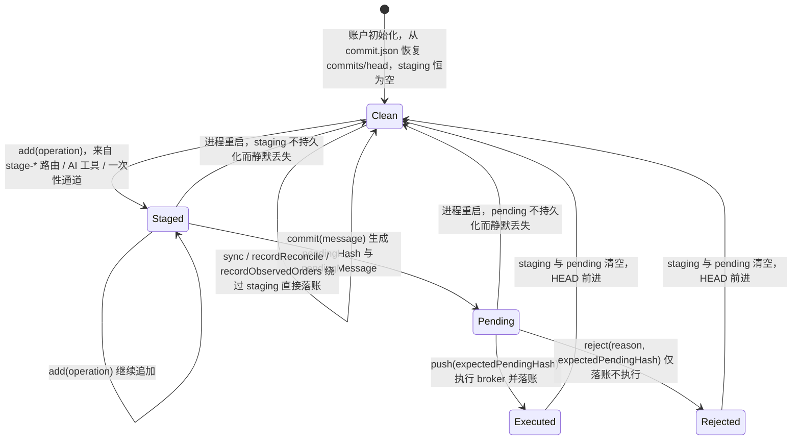

# 05 — Staging / Approval / Ledger（Trading-as-Git 模型）

> 摘要（≤10 行）
> 本区域是 UTA 的「交易写入状态机」：`TradingGit`（`services/uta/src/domain/trading/git/TradingGit.ts`，978 行）实现 stage → commit → push/reject → sync 四段流程，全部状态在一个 per-account 实例的内存里，持久化只有 `data/trading/<accountId>/commit.json` 一个文件（`{commits, head}`，全量重写、非原子、读失败静默）。它借用了 git 的**词汇**但不具备 git 的**能力**：没有 branch、checkout、diff、unstage、revert/reset/rollback，`reject` 是唯一的「撤销」且属于 append-only 记录（HEAD 前进到被拒 commit）。审批是「一个 pending commit 只能被 push 或 reject 一次」的 CAS 协议：`pendingHash` 由 `commit()` 生成，push/reject 必须回传同一个 hash（HTTP 层缺失即 409 `PENDING_HASH_REQUIRED`，不匹配即 409 `PENDING_HASH_CONFLICT`）。审批面有三个：Web UI（`PushApprovalPanel`，3s 轮询）、AI 工具（`tradingPush` 受 `agent.allowAiTrading` 默认 false 的闸门）、connector（Telegram，请求本身有 60s TTL）。审批**不记录审批人**，也没有 TTL/部分审批/撤回：push 对单个账户是全有全无，多账户推送之间没有事务。执行侧与账本侧耦合很松：broker 写入发生在 push 循环内，任何 broker 异常都被降级为一条 `rejected` 结果并照常生成 commit（`TradingGit.ts:143-155`），而 push 之后的失败窗口（`getGitState()` 抛错、`onCommit` 落盘抛错）没有任何补偿，可导致「已执行但无记录」或「重复执行」。
> 关键脆弱点集中在持久化与失败原子性：`git-persistence.ts` 无 tmp+rename、无写序列（对比 `snapshot/store.ts:52-57`）、`loadGitState` 吞掉一切异常（含 JSON 解析失败）；`sync` / `recordReconcile` / `recordObservedOrders` 三条「合成提交」路径完全绕过 staging、审批与 `inflightWrite` 锁。

---

## 1. 概览与职责边界

### 1.1 本区域负责什么

- **操作暂存（staging）**：四种可暂存操作（下单 / 改单 / 平仓 / 撤单）在内存数组中排队，此时不接触 broker。
- **提交准备（commit）**：把 staging 冻结成一个「待审批提交」，生成 8 位十六进制 hash（`pendingHash` / `pendingMessage`）。
- **执行（push）与取消（reject）**：唯一能消费待审批提交的两个动作；push 顺序调用 broker，reject 只写一条 `user-rejected` 记录。
- **不可变提交日志（ledger）**：`commits` 数组 + 单向 `head` 指针，含每条提交的 operations / results / stateAfter（执行后账户快照）。
- **三条绕过审批的合成提交**：`sync`（订单状态推进）、`recordReconcile`（余额漂移折价）、`recordObservedOrders`（外部订单观察）。
- **审批契约**：`expectedPendingHash` 的三方校验（领域层 + HTTP 层 + SDK/connector 层）与 409 语义。
- **账本持久化**：`git-persistence.ts` 的读写、legacy 路径回退、写回调装配（`uta-manager.ts:64,71`）。
- **账本投影供外部消费**：`log()` / `show()` / `status()` / `exportState()`，以及 `orderHistory` / `tradeHistory` 的输入（投影逻辑本身归 `order-history.ts`，见 `03-account-orders-positions.md`）。
- **UTA 层的账本前置校验**：stage 阶段的 params 校验、sub-account 消歧、`keyless` 禁提案、`readOnly` 禁 push（`UnifiedTradingAccount.ts:550-565, 603-638, 665-689`）。

### 1.2 不负责什么

- HTTP 端点全表、协议 schema 与错误码矩阵 → 见 `02-http-api-and-protocol.md`。
- 订单/持仓/账户的领域语义、broker 适配器与执行结果解释 → 见 `03-account-orders-positions.md`、`07-brokers-and-packs.md`。
- guard 管线的具体 guard 实现与快照 → 见 `06-snapshots-and-guards.md`。
- `data/` 目录全貌、迁移链、测试矩阵、文档与 issue 清单 → 见 `09-persisted-state-tests-docs-issues.md`。
- 市场数据与 FX → 见 `04-market-data-contracts-fx.md`。
- 消费端 UI/SDK/CLI 的完整清单 → 见 `08-alice-consumers-and-ui.md`（本文件只写与审批/账本状态机直接相关的部分）。

### 1.3 上下游

| 方向 | 对方 | 契约 |
|---|---|---|
| 下游（被调用） | `UnifiedTradingAccount`（`UnifiedTradingAccount.ts:693-825`） | `add/commit/push/reject/log/show/status/exportState/sync/recordReconcile/recordObservedOrders` |
| 上游（调用 broker） | `IBroker` 经 guard 管线（`UnifiedTradingAccount.ts:180-203`） | `executeOperation(op)` 逐 op 调用；返回值被 `parseOperationResult` 解释 |
| 上游（读状态） | `getGitState()` = `_getState()`（`UnifiedTradingAccount.ts:159-178`） | `{netLiquidation,totalCashValue,unrealizedPnL,realizedPnL,positions,pendingOrders}`，金额为字符串 |
| 下游（落盘） | `createGitPersister(accountId)`（`git-persistence.ts:43-49`） | `onCommit(GitExportState)` |
| 下游（钩子） | `onPostPush` / `onPostReject`（`UnifiedTradingAccount.ts:802,809`） | 快照服务；fire-and-forget，异常被吞 |
| 消费方 | HTTP 路由 `routes-trading.ts:413-637`、SDK `UTAAccountSDK.ts:241-347`、AI 工具 `src/tool/trading.ts:779-931`、CLI `src/server/cli-commands.ts:252-261`、connector `src/services/connector-client/uta-review.ts`、UI `ui/src/components/PushApprovalPanel.tsx` | 见 §2.11 |
| 无关 | `src/core/event-log.ts`（`data/event-log/events.jsonl`） | 账本**不**写 journal；journal 只承载 `account.health` / `snapshot.*`（`uta-manager.ts:73`、`snapshot/service.ts:55,64,73`） |

---

## 2. 功能清单

### 2.1 概念集合：工作区 / staging / commit / HEAD / 审批

| 概念 | 本仓库的含义 | git 类比 | 与 git 的差异 |
|---|---|---|---|
| 工作区（workspace） | 一个 UTA 账户 + 一个 `TradingGit` 实例 + 一个 `commit.json` | working tree | 没有「文件」，只有待执行的操作对象；工作区内容不由账本推导，而是实时读 broker（`_getState`） |
| staging area（`stagingArea`） | 内存里的 `Operation[]`，纯意图，未接触 broker | index / staging area | 只有追加（`add`），没有 `unstage` / `diff --staged`；一旦 `commit()` 就不能再追加（`TradingGit.ts:81-85`） |
| pending commit | `pendingHash` + `pendingMessage` 两个字符串，代表「已冻结、等待人类决定」的一批操作 | 尚无 git 对应物（介于 index 与 commit 之间） | git 里 commit 即落库；这里 commit 只是一个**审批令牌**，可能永远不被 push 也永远不被 reject |
| commit（`GitCommit`） | 一条不可变记录：hash、parentHash、message、operations、results、stateAfter、timestamp、round | commit | 没有 tree/blob；操作对象直接内联；`stateAfter` 内联全量账户快照，不做去重 |
| HEAD（`head`） | 最近一条写入 `commits` 的 hash；`null` 表示空前 | HEAD | 无 detached 概念（本来也无分支）；**reject 也让 HEAD 前进**，被拒批次成为历史的一部分 |
| branch | 不存在 | branch | 无分支、无 merge、无 cherry-pick；哈希链是单线 |
| 审批（approval） | 人类在 UI/connector 上对某个 `pendingHash` 执行 push 或 reject | 无对应物 | 无审批人身份、无 TTL、无部分审批、无撤回；审批与执行是同一次 HTTP 调用（不存在「先批准、后执行」的两阶段） |
| push | 「执行 + 记账 + 清空 staging」的一步合并动作 | push（推送到远端） | git push 不产生本地 commit；这里 push 才产生 commit 记录（commit() 时并无记录），且 push 失败/部分失败仍会落一条记录 |
| reject | 记录一批「用户否决」的操作，HEAD 前进 | 无（最接近 `git reset --hard` 的效果，但语义是追加） | 不改变过去，只追加一条全 `user-rejected` 的结果 |
| sync | 按订单状态更新追加 `[sync]` 提交 | pull / fetch | 不合并，只追加；不参与审批 |
| reconcile / observed | 余额漂移与外部订单的「无消息提交」 | 无对应物 | 完全绕过 staging 与审批（见 §2.7/§2.8） |

### 2.2 stage（暂存）

**触发方式**（四条入口，最终都落到 `TradingGit.add`）：

- AI 工具 `placeOrder` / `modifyOrder` / `closePosition` / `cancelOrder`（`src/tool/trading.ts:672-777`，可选 `commitMessage` 一步 commit）。
- HTTP `POST /uta/:id/wallet/stage-place-order | stage-modify-order | stage-close-position | stage-cancel-order`（`routes-trading.ts:537-586`）。
- 一次性下单路由（`/wallet/place-order` 等，见 §2.10）。
- SDK `UTAAccountSDK.stagePlaceOrder/…`（`UTAAccountSDK.ts:312-338`）。

**输入**：`StagePlaceOrderParams`（aliceId、action、orderType、totalQuantity/cashQty、lmtPrice/auxPrice/trail*、tif、goodTillDate、outsideRth、parentId、ocaGroup、takeProfit/stopLoss、subAccountId；`packages/uta-protocol/src/types/git.ts:256-285`）、`StageModifyOrderParams`、`StageClosePositionParams`（aliceId + 可选 qty + subAccountId）、`{orderId}`。

**处理步骤与规则**：

1. `_assertCanCreateProposal()`：`keyless` 账户直接拒绝（`UnifiedTradingAccount.ts:550-556`）。
2. 下单参数按 orderType 做必填校验（MKT 需 totalQuantity 或 cashQty 二者择一；LMT 需 lmtPrice；STP 需 auxPrice；STP LMT 需两者；TRAIL 需 auxPrice 或 trailingPercent 且互斥；`UnifiedTradingAccount.ts:603-638`）。这一步是「stage 期闸门」，防止 CLI 丢字段产生 quantity-less 的 LMT（`docs/uta-live-testing.md:373-375`）。
3. aliceId → 完整 `Contract` 解析（`contractFromAliceId`，跨账户 aliceId 拒绝）。
4. sub-account 消歧（仅当 broker 暴露 >1 子账户时；缺省/未知/与标的钱包不符均 loud-refuse，`UnifiedTradingAccount.ts:665-689`），解析结果被 push 进 `_stagedSubAccountIds` 供 commit 消息打标。
5. Decimal 化：所有数值经 `new Decimal(String(x))`；平仓 qty 必须为正有限数（`UnifiedTradingAccount.ts:747-757`）。
6. `TradingGit.add`：若 `inflightWrite` 为真或已有 pending commit（`pendingHash`/`pendingMessage` 非空）则抛 `PendingHashConflictError`（`TradingGit.ts:77-92`）；否则 push 进数组并返回 `{staged:true, index, operation}`。

**输出/副作用**：仅内存数组增长；返回 `AddResult`（含被投影的 operation）。`stageClosePosition` 不会在 stage 期校验持仓量（持仓量校验推迟到 dispatch 时，`UnifiedTradingAccount.ts:567-590`——刻意晚于 stage，防止 UI 里的旧提案越权）。

**错误与边界**：`keyless` → `/keyless public-data account/`；参数缺失 → `placeOrder (LMT): requires lmtPrice.`；多子账户缺 selector → `Re-issue this write with subAccountId`；已有 pending commit → `PendingHashConflictError('A commit is awaiting approval…')`；HTTP 层把 stage 错误一律映射为 400（`routes-trading.ts:544-545, 556-557, 568-569, 584-585`），**包括** `PendingHashConflictError`——即 stage 期的冲突在 HTTP 上是 400 而非 409，与 push/reject 的 409 不一致。

### 2.3 commit（提交准备）

**触发**：AI `tradingCommit`（`src/tool/trading.ts:779-797`）、HTTP `POST /uta/:id/wallet/commit`（`routes-trading.ts:458-472`，message 必填否则 400）、SDK `commit(message)`、`alice-uta git commit`。

**输入**：commit message（字符串，非空）。

**处理步骤**：

1. `inflightWrite` 为真 → `PendingHashConflictError`；staging 为空 → `Error('Nothing to commit: staging area is empty')`（`TradingGit.ts:94-100`）。
2. UTA 层先做 sub-account 打标：`_stampSubAccount(message)` → `"<msg> [sub:spot,derivatives]"`，随后清空 `_stagedSubAccountIds`（`UnifiedTradingAccount.ts:776-791`）。
3. 生成 hash：`sha256(JSON.stringify({message, operations: stagingArea, timestamp, parentHash: head})).slice(0,8)`（`TradingGit.ts:38-43, 102-108`）。**timestamp 进入哈希输入**，因此同一批操作 + 同一消息在不同时刻 commit 得到不同 hash（这是 CAS 的强度来源，也让 hash 不可复现）。
4. 写入 `pendingHash` / `pendingMessage`，返回 `{prepared:true, hash, message, operationCount}`。

**输出/副作用**：无 broker 调用、无落盘；仅内存两个字段与返回值。

**错误与边界**：

- 重复 `commit()` 会被第 1 步拦下（staging 非空但 pendingHash 已存在？不会——`commit()` 本身不检查 pendingHash，只有 `add()` 检查）。**实际上重复 commit 会覆盖 pendingHash 而产生新 hash**，此前发给 UI/connector 的 hash 立刻失效 → 后续 push/reject 全部 409。这是「pending commit 不可变」不变量的一个缺口：`commit()` 缺 `pendingHash === null` 前置检查，而 `add()` 有（`TradingGit.ts:81-85` vs `TradingGit.ts:94-100`）。→ §8.6。
- 打标副作用泄漏：若 `git.commit` 抛错（例如 staging 空），`_stagedSubAccountIds` 不会被清空（`UnifiedTradingAccount.ts:777-781` 的清理在调用之后），残留 id 会被打进**下一次**成功 commit 的消息里。

### 2.4 push（审批 + 执行 + 记账）

**触发**：UI `PushApprovalPanel` 的 Approve（`ui/src/components/PushApprovalPanel.tsx:412-431`）→ BFF → `POST /uta/:id/wallet/push`（`routes-trading.ts:503-527`）；AI `tradingPush`（仅在 `agent.allowAiTrading` 为真时真正执行，`src/tool/trading.ts:824-845`）；connector Approve 按钮（`uta-review.ts:190-200`）；`alice-uta git push`（→ `tradingPush`）。

**输入**：`expectedPendingHash`（HTTP body / AI 工具从 `status().pendingHash` 取 / connector 请求里的 `pendingHash`）。

**处理步骤**：

1. HTTP 层：UTA 不存在 → 404；`status().pendingMessage` 为空 → 400 `Nothing to push`；body 无 `expectedPendingHash` → 409 `PENDING_HASH_REQUIRED`（`routes-trading.ts:506-515`）。
2. UTA 层：`_assertCanMutateAccount('push')`（readOnly 拒绝，但**不**报 keyless 特例文案）；`_disabled` 配置错误账户拒绝；health 为 `offline` 拒绝（`UnifiedTradingAccount.ts:793-800`）。
3. `TradingGit.push`：`assertPrepared`（staging 空 / 未 commit → `Error`）→ `beginWrite(expectedPendingHash)`：`inflightWrite` 真 → 冲突；`expectedPendingHash` 空或 ≠ `pendingHash` → `PendingHashConflictError('Pending commit changed')`；否则置 `inflightWrite = true`（`TradingGit.ts:119-127, 241-249`）。
4. `executePush`：固化 `operations = [...stagingArea]`、`message`、`hash`；**顺序** for 循环逐 op 调 `executeOperation`，每个 op 单独 try/catch，异常降级为 `{success:false, status:'rejected', error}`（`TradingGit.ts:143-155`）。
5. 结果解析：`parseOperationResult` 把 broker 返回值映射为 `OperationResult`；`mapOrderStatus` 把 IBKR `OrderState.status` 映射为 `Filled→filled / Cancelled→cancelled / Inactive→rejected / 缺省→submitted`（`TradingGit.ts:929-977`）。
6. `stateAfter = await getGitState()`（第 158 行）→ 构造 `GitCommit{hash, parentHash: this.head, message, operations, results, stateAfter, timestamp: 新时间, round: currentRound}`。
7. `commits.push(commit)`；`head = hash`；`await onCommit(exportState())`（落盘，第 174 行）；**随后**清空 staging 与 pending 字段（第 176-179 行）。
8. 返回 `{hash, message, operationCount, submitted, rejected}`（submitted/rejected 按 `result.success` 划分）。

**输出/副作用**：真实 broker 写入（可能部分成交、部分被 guard 拒绝）；一条不可变提交；`HEAD` 前进；`commit.json` 全量重写；UTA 层随后 fire-and-forget 触发快照钩子 `onPostPush`（`UnifiedTradingAccount.ts:802`；异常被吞）。

**错误与边界**：

- `PENDING_HASH_CONFLICT` → HTTP 409（`routes-trading.ts:519-524`）、connector 映射为 `conflict`（`uta-review.ts:210-212`）、UI 显示错误并重新轮询。
- 单个 op 失败**不会**让整批失败：commit 照常落账（一条 `rejected` 结果 + N-1 条成功），调用方需从 `PushResult.rejected` 读失败。
- guard 拒绝（`[guard:max-position-size] …`）走的是 `{success:false}` 返回值路径，因此是「已记账的 rejected」，不是异常。
- **失败窗口 A**：若 `getGitState()`（第 158 行）抛错，此时 broker 侧可能已执行了部分/全部操作，但**没有 commit 落账**、staging 保留、`inflightWrite` 被 finally 复位（第 125 行）→ 用户重试会**重复执行**已成功的操作。测试仅覆盖 happy path 的 `getGitState`（`TradingGit.spec.ts:157-163` 只断言「push 后调用过」）。
- **失败窗口 B**：若 `onCommit` 抛错（第 174 行），commit 已在内存、HEAD 已前进，但 staging **未清空** → 重试 push 会再次执行同一批操作（内存里会出现两条同 hash 的提交）。spec 里 `onCommit` 只有成功用例（`TradingGit.spec.ts:249-261`）。
- 空批次：`assertPrepared` 已挡住；`executePush` 内还有二次防御（第 130-135 行）。
- 离线/readOnly：见 §6。

### 2.5 reject（否决 / 仅有的「撤销」）

**触发**：UI Reject（`PushApprovalPanel.tsx:433-445`，UI 不传 reason）；AI `tradingReject`（`src/tool/trading.ts:849-870`，描述为「the undo for a wrong stage (like git reset)」，会在没有 pendingHash 时**先自动 commit 一次**再 reject，第 862 行）；HTTP `POST /uta/:id/wallet/reject`（`routes-trading.ts:475-500`）；connector Reject（`uta-review.ts:202-207`，不传 reason）；`alice-uta git reject --reason`。

**输入**：可选 `reason` + 必填 `expectedPendingHash`。

**处理步骤**：同 push 的前置（`assertPrepared` + `beginWrite` CAS）→ `executeReject`：message 变为 `[rejected] <原消息> — <reason>`（`TradingGit.ts:206`），results 全部为 `{success:false, status:'user-rejected', error: reason ?? 'Rejected by user'}`，`stateAfter = getGitState()`，写入 commits、HEAD 前进、`onCommit` 落盘、清空 staging（`TradingGit.ts:197-239`）。UTA 层额外清 `_stagedSubAccountIds` 并触发 `onPostReject`（`UnifiedTradingAccount.ts:806-811`）。

**输出/副作用**：**无 broker 写入**，但仍会调用 `getGitState()`（`TradingGit.ts:216`）→ `_getState` 的 3 次 broker 读（`UnifiedTradingAccount.ts:159-166`：getAccount / getPositions / getOrders）；随后写一条 `user-rejected` 提交并落盘、触发快照钩子。

**错误与边界**：

- UTA 的 `reject` **没有** push 那样的 readOnly/offline/disabled 前置守卫（对比 `UnifiedTradingAccount.ts:793-800`）；但它的 `getGitState()` 经 `_callBroker` 走健康门控，账户处于 offline 且正在重连时会 fail-fast 抛 `CONNECTING`（`UnifiedTradingAccount.ts:426-428`）→ 此时 reject 整体失败（HTTP 500），**pending commit 保留、可重试**。readOnly 账户的 reject 在只读模式下仍可成功（本地动作，SDK 的 `reject` 也没有 `assertVenueWritable`，对比 `push` 的 `UTAAccountSDK.ts:288`）。
- HTTP 语义：缺 hash → 409 `PENDING_HASH_REQUIRED`；hash 不匹配 → 409 `PENDING_HASH_CONFLICT`；而 `pendingMessage` 为空 → 400 `Nothing to reject`（`routes-trading.ts:478`）。注意这层用 `pendingMessage` 而非哈希判空，与领域层的 `assertPrepared` 重复。
- 与 push 共用同一个 `pendingHash`：reject 后该 hash 已进入历史，再次 push 同一 hash 会因 `pendingHash === null` 而先被 `assertPrepared` 拦截（staging 已空）。
- reject **不产生「回滚」语义**：如果一批操作里已有部分在别处（例如上一次尝试）执行过，reject 只是记录否定；账本不尝试纠正外部状态。
- 无法 reject 「已 push」的提交：push 后该批次已执行，`reject` 只能作用于新 pending。真正的回滚（反向下单）不在模型内。

### 2.6 log / show / status（只读查询）

| 操作 | 实现 | 输入 | 输出 | 边界 |
|---|---|---|---|---|
| `log` | `TradingGit.log`（`TradingGit.ts:393-414`） | `{limit=10, symbol?}` | `CommitLogEntry[]`：hash/parentHash/message/timestamp/round/operations(摘要) | 默认只回 10 条；**倒序**返回；`symbol` 过滤按 `getOperationSymbol(op)`（modifyOrder/cancelOrder/syncOrders 均返回 `'unknown'`，见 `packages/uta-protocol/src/types/git.ts:311-321`） |
| 操作摘要 | `buildOperationSummaries`（416-453）+ `formatOperationChange`（455-524） | commit | 每行 `{symbol, action, change, status, order?}` | sync 提交按 `max(operations.length, results.length)` 展开为每订单一行，行内 symbol 取自 result（`git.ts:74-75`）；placeOrder 摘要内联结构化 `order` 字段（side/orderType/数量/价格/tif，`git.ts:146-157`） |
| `show` | `TradingGit.show`（531-534） | hash | `GitCommit \| null`（经 `projectOperation` 剥离 UNSET 哨兵） | 命中不到返回 null → HTTP 404（`routes-trading.ts:443`）；`show` 不做符号过滤 |
| `status` | `TradingGit.status`（536-544） | — | `{staged[], pendingMessage, pendingHash, head, commitCount}` | staged 已经过 `OrderHelper.toWire` 投影；**不含** base branch 或「落后/领先」概念 |
| HTTP/SDK 面 | `GET /wallet/log`（`routes-trading.ts:413-419`，limit 默认 20）、`GET /wallet/show/:hash`（439-445）、`GET /wallet/status`（447-451） | — | 同上 | log 的 HTTP 默认 20 与领域默认 10 不同 |

**副作用**：无（不触碰磁盘、不触碰 broker；`status()` 完全来自内存，因此进程重启后 pending 永远为 null —— 见 §3.4）。

### 2.7 sync（成交感知的合成提交）

**触发**：`order-sync-poller` 快车道（默认 10s，`order-sync-poller.ts:43`，仅在 `getPendingOrderIds()` 非空时发起，第 77 行）、AI `tradingSync`（`src/tool/trading.ts:912-931`，可带 `delayMs` 0-30s）、HTTP `POST /uta/:id/sync`（`routes-trading.ts:229-240`）。

**输入**：内部构造的 `OrderStatusUpdate[]`（orderId、symbol、previousStatus、currentStatus、filledQty、filledPrice）。

**处理步骤**（`UnifiedTradingAccount.ts:844-915`）：

1. `getPendingOrderIds()` 为空 → 直接返回 `{hash:'', updatedCount:0}`（不落账）。
2. 可选 `delayMs` 等待。
3. 若 broker 支持 `getOpenOrders`，用一次列表调用求差集；否则按 per-order 退避（<2min 每轮、<1h 每 60s、否则每 5min，`UnifiedTradingAccount.ts:1043-1051`）逐个 `getOrder(orderId, localSymbol)`。
4. 仍在 `Submitted/PreSubmitted` 的跳过；终态生成 update（`previousStatus` **硬编码 `'submitted'`**，第 901 行——不反映真实的历史状态）。
5. `state = await this._getState()` → `TradingGit.sync(updates, state)`：hash = `sha256({updates, timestamp, parentHash})`，message = `[sync] SYM status, …`（最多 3 个 + `+N more`），**operations 只有一条** `{action:'syncOrders'}`，results 为 N 条，`stateAfter = currentState`，落盘后返回 `{hash, updatedCount, updates}`（`TradingGit.ts:654-690`）。

**输出/副作用**：新 commit、HEAD 前进、落盘。**不**清空 staging、**不**检查 `inflightWrite`、**不**走审批（见 §6.3 并发）。

**错误与边界**：无 update → 返回而非落账；`getOrder` 返回 null（订单未知）→ 静默跳过该订单；filled 但缺 qty/price → `console.warn` 但照常推进（`UnifiedTradingAccount.ts:886-894`）；单账户失败不影响其他账户（poller catch，`order-sync-poller.ts:86-91`）。

### 2.8 recordReconcile（余额漂移 → 虚拟成交）

**触发**：`getPositions()` 内的 `_reconcileWalletPositions`（`UnifiedTradingAccount.ts:1026-1106`），仅对 `avgCostSource === 'wallet'` 的持仓（CCXT 现货合成）。

**规则**：以 `recomputeCostBasisFromCommits` 投影的持仓量为基准，漂移 >1e-8 且该 aliceId **没有在途订单**（`getPendingOrderIds` 的 aliceId 集合，第 1055-1057 行）时，追加一条 `reconcileBalance` 提交：方向由 `quantityDelta` 符号决定（正 = observed / 负 = released），价格优先取 broker avgCost，否则取 markPrice（第 1079-1080 行），`stateAfter` 用 `_buildReconcileStateAfter`（**账面数字全为 '0'**，只填 positions，`UnifiedTradingAccount.ts:1115-1125`）。

**副作用**：落盘、HEAD 前进、无审批；这条提交随后被 cost-basis 与 trade-history 当作虚拟成交消费（`cost-basis.ts` 头部注释；`order-history.spec.ts:144-145`）。

### 2.9 recordObservedOrders（外部订单观察）

**触发**：poller 慢车道（默认 15m，`observeExternalOrdersEvery`；首次 tick 立即跑一次，`order-sync-poller.ts:58-75`）→ `uta.observeExternalOrders()`（`UnifiedTradingAccount.ts:964-980`）。

**规则**：`getOpenOrders()` 列表对全历史 orderId 集合（`getKnownOrderIds()`，`TradingGit.ts:380-390`，含 bracket legs）求差；未知订单被**压缩成一条** `[observed] N external order(s) not placed through Alice` 提交，N 条 `observeExternalOrder` 操作 + N 条 `submitted` 结果。此后这些 orderId 进入常规 pending 扫描与 sync。

**边界**：broker 无 `getOpenOrders` → no-op；无未知订单 → no-op（0 次落账）。同样绕过审批/`inflightWrite`。

### 2.10 一次性下单（stage → commit → push 合并通道）

`executeOneShotOrder`（`services/uta/src/domain/trading/order-entry.ts:44-73`）：stage → commit → push 三步顺序执行，任一步失败返回 `{ok:false, phase, error}`（phase ∈ stage/commit/push）。被 `routes-trading.ts:594-637` 的三个路由使用，HTTP 映射见 `PHASE_STATUS`（`routes-trading.ts:62-67`：stage/commit → 400，push → 500）。

**设计意图**：用户手动填表 = 审批，因此刻意绕过 `allowAiTrading` 闸门（`order-entry.ts:26-30`）。**但记录里没有任何字段标明「这批 push 来自一次性通道」**——事后无法从 commit 区分「UI 表单」与「AI 在 allowAiTrading 下推送」。

**边界**：注释声称「commit 失败时回滚 staging（best-effort reject）」（`order-entry.ts:41-43`），但实现里**没有任何 reject 调用**（`order-entry.ts:57-64` 只在 commit 抛错时直接 return，参数里根本没有 reject 回调）；`order-entry.spec.ts:51-62` 断言 `reject` 未被调用，把这一行为固化为契约。也就是说「回滚」只存在于注释。

### 2.11 审批面（谁能让 pending 提交被执行）

| 审批面 | 入口 | 校验 | 身份/时效 | 备注 |
|---|---|---|---|---|
| Web UI | `PushApprovalPanel` 的 Approve/Reject（`ui/src/components/PushApprovalPanel.tsx:412-445`） | 把面板里看到的 `status.pendingHash` 原样回传 | 无身份记录；**无 TTL**；3s 轮询（第 399 行）刷新，故冲突窗口很小 | 面板把条目分 `pending`(awaitingApproval) / `staged`(未 commit) / `history` 三类（第 879-880 行）；Reject 不传 reason（第 443 行） |
| AI 工具 | `tradingPush`（`src/tool/trading.ts:798-847`） | 工具层闸门 `allowAiTrading()`（默认 false，`src/core/config.ts:249`；getter 装配 `src/main.ts:249-253`）→ false 时**不执行**，返回「让用户在 Web UI 批准」 | 无身份；无 TTL | 真时用 `status.pendingHash` 逐账户 push；`tradingReject` 无闸门（本地动作） |
| Connector（Telegram） | `/uta` 或 Approve/Reject 按钮（`uta-review.ts:129-219`） | 三层：请求级 60s TTL（`CONNECTOR_ACTION_TTL_MS`，`packages/connector-protocol/src/types.ts:232,282-285`，到期 → failure reason `expired`）；必须携带 `utaId` + `pendingHash`（缺 → `conflict`，第 166-168 行）；`policy.mode === 'readonly'` 拒绝 push（第 191-193 行） | 无审批人身份进账本；TTL 只作用于**请求**，不作用于 pending commit | 操作数 > 8（`MAX_CONNECTOR_UTA_OPERATIONS`）时不提供远端按钮，提示回 OpenAlice（第 182-188 行）；账户展示上限 8（`MAX_CONNECTOR_UTA_ACCOUNTS`） |
| CLI | `alice-uta git push|reject`（`src/server/cli-commands.ts:252-261`）→ 同名 AI 工具 | 与工具层相同 | 与工具层相同 | 工具层 `tradingPush` 的 allowAiTrading 闸门同样生效 |
| 一次性表单 | `/wallet/place-order` 等（§2.10） | 无 pending 校验（自己 commit + push） | 无 | 设计上「表单即审批」 |

**审批的时序特性**：审批与执行**不可分离**——`commit()` 只产生令牌，`push()` 同时完成「批准 + 执行 + 记账」。因此不存在「先批准、稍后执行」或「批准后参数被改」的窗口（参数被 `pendingHash` 的 CAS 保护），也不存在部分审批：要么全批执行，要么 reject 全批。跨账户没有联合审批：`tradingPush` 无 source 时逐账户独立 push，A 账户成功、B 账户 409 会导致部分落地（`src/tool/trading.ts:835-844`）。

### 2.12 操作总表（含缺席的 git 动词）

「状态变化」列描述内存状态（A=stagingArea，P=pendingHash+pendingMessage，C=commits，H=head，I=inflightWrite）；「副作用」列区分内部与外部。

| 操作 | 入口 | 前置条件 | 状态变化 | 副作用 | 主要失败 |
|---|---|---|---|---|---|
| stage（add） | `stage-*` 路由、四个 AI 工具、一次性通道 | 非 keyless；`I=false`；`P` 为空；orderType 必填字段齐；多子账户需 selector | A 追加；返回 index | 无（不落盘、不碰 broker） | keyless 拒绝；参数缺失；`PendingHashConflictError`（HTTP 映射为 **400**） |
| commit | `wallet/commit`、`tradingCommit` | `I=false`；A 非空；message 非空 | P 写入（新 hash，**可覆盖旧 P**）；UTA 层清 `_stagedSubAccountIds` | 无 | 空 staging；inflight；message 空（HTTP 400） |
| push（approve + execute） | `wallet/push`、`tradingPush`（`allowAiTrading`）、connector、一次性通道 | 非 readOnly/非 disabled/非 offline；A 非空且 P 已就绪；`expectedPendingHash` 存在且相等；`I=false` | I 置位→复位；C 追加执行提交；H 前进；A 与 P 清空 | **真实 broker 写入**；`commit.json` 全量重写；异步 `post-push` 快照 | 缺 hash→409 REQUIRED；不匹配→409 CONFLICT；offline/readOnly/disabled 抛错；逐 op 的 broker 失败降级为 rejected 结果（**整批仍成功记账**）；`getGitState` 或 `onCommit` 抛错→无记账、staging 保留（见 §6.3） |
| reject | `wallet/reject`、`tradingReject`、connector | A 非空且 P 已就绪；`expectedPendingHash` 存在且相等；`I=false` | C 追加 `[rejected]` 提交（结果全 `user-rejected`）；H 前进；A 与 P 清空 | **3 次 broker 读**（`getGitState`）；落盘；异步 `post-reject` 快照 | 缺 hash→409；不匹配→409；pending 为空→400；broker 读失败→500 且 **pending 保留** |
| log | `wallet/log`、`tradingLog` | 无 | 无 | 无（纯内存投影） | 无（空日志返回空数组） |
| show | `wallet/show/:hash`、`tradingShow` | 无 | 无 | 无 | hash 未命中→HTTP 404 / 工具返回 error 文本 |
| status | `wallet/status`、`tradingStatus` | 无 | 无 | 无（不读盘、不碰 broker） | 无 |
| sync | 10s poller、`tradingSync`、`/uta/:id/sync` | 存在 pending 订单；账户 healthy 且非 keyless | C 追加 `[sync]` 提交；H 前进 | broker 读（列表或逐单）；落盘 | 无 update→不落账；单账户失败被 poller 吞掉 |
| reconcileBalance（合成） | `getPositions()` 内联（`avgCostSource === 'wallet'`） | 漂移 >1e-8 且该 aliceId 无在途订单 | C 追加 `reconcileBalance` 提交；H 前进 | 落盘；`stateAfter` 账面数字为 0 | 无（异常向上冒泡到 `getPositions`） |
| observeExternalOrder（合成，压缩为一条） | 15m 慢车道 | broker 支持 `getOpenOrders`；存在未知 orderId | C 追加 `[observed]` 提交；H 前进 | 落盘 | 同上 |
| **unstage** | — | — | — | — | **无实现**；只能整批 reject 或重新 stage |
| **diff** | — | — | — | — | **无实现**；`status().staged` 是原始操作列表 |
| **rollback / revert / reset**（已 push 后） | — | — | — | — | **无实现**；账本 append-only，只能靠新交易纠正 |
| **branch / checkout / merge** | — | — | — | — | **无实现**；一个账户 = 一条直线 |
| **log 剪枝 / compaction** | — | — | — | — | **无实现**；`commits` 只增不减 |

---

## 3. 数据与状态

### 3.1 内存状态（`TradingGit` 私有字段，`TradingGit.ts:62-68`）

| 字段 | 类型 | 含义 | 生命周期 |
|---|---|---|---|
| `stagingArea` | `Operation[]` | 待提交操作 | add 追加；push/reject 成功后清空；**不持久化**（进程重启即丢） |
| `pendingMessage` | `string \| null` | 已提交待审批的消息 | commit 写入；push/reject 清空；不持久化 |
| `pendingHash` | `string \| null` | 已提交待审批的 hash（CAS 令牌） | 同上 |
| `inflightWrite` | `boolean` | push/reject 执行中的互斥标志 | push/reject 的 try/finally；不持久化 |
| `commits` | `GitCommit[]` | 全量提交日志（append-only） | 构造/restore 时灌入；此后只增不减（无 compaction/prune） |
| `head` | `string \| null` | 最新提交 hash | 与 `commits` 同步推进 |
| `currentRound` | `number \| undefined` | 写入每条 commit 的 `round` 标签 | `setCurrentRound`（648-650）；**生产代码无调用方**（仅 spec 与 SDK 空实现，`UTAAccountSDK.ts:390-392`）→ 持久化里该字段实际恒为 undefined |

UTA 层另有 `_stagedSubAccountIds: string[]`（`UnifiedTradingAccount.ts:139`）：stage 期累积、commit 时打进消息、commit/reject 后清空；**不做持久化**，是 sub-account 意图的唯一载体（`packages/uta-protocol/src/types/git.ts:259-266` 明确「不写入 Operation schema」）。

### 3.2 持久化对象字段（权威定义在 `packages/uta-protocol/src/types/git.ts`）

**Operation（联合，7 个变体，`git.ts:22-54`）**

| 变体 | 字段 | 含义 / 约束 |
|---|---|---|
| `placeOrder` | `contract`、`order`、`tpsl?` | 完整 IBKR Contract/Order 对象；`tpsl` = `{takeProfit?, stopLoss?}`（价格字符串） |
| `modifyOrder` | `orderId`、`changes`(Partial<Order>) | 缺 contract，故符号过滤/摘要符号退化为 `'unknown'` |
| `closePosition` | `contract`、`quantity?` | qty 为空 = 全平；qty > 0 且须 ≤ 当前持仓（在 dispatch 期校验） |
| `cancelOrder` | `orderId`、`orderCancel?` | — |
| `syncOrders` | 无字段 | 只出现在合成提交里；真实信息在 results 的 `symbol` |
| `observeExternalOrder` | `contract`、`order` | 与 placeOrder 同形，仅语义区分（source=external） |
| `reconcileBalance` | `aliceId`、`quantityDelta`(string)、`markPrice`(string) | 金额/数量一律 Decimal-as-string |

**OperationResult（`git.ts:60-77`）**

| 字段 | 含义 / 取值 |
|---|---|
| `action` | 与源操作一致 |
| `success` | push 阶段 `rawObj.success === true`；guard 拒绝时为 false |
| `status` | `submitted \| filled \| rejected \| cancelled \| user-rejected`（`git.ts:58`） |
| `orderId` / `execution` / `orderState` | broker 返回值透传（`orderState` 参与状态映射） |
| `filledQty` / `filledPrice` | Decimal-as-string，sub-satoshi 场景不可用 number |
| `error` | 失败原因（guard 前缀 `[guard:<name>]`） |
| `legs` | bracket TP/SL 子单，出生即 `submitted`（待 sync 接管） |
| `symbol` | 仅 sync 提交的逐订单行使用（op 本身不带） |
| `raw` | broker 原始响应（**进入 commit.json**，见 §8.5 体积问题） |

**GitCommit（`git.ts:93-102`）**：`hash`(8 hex)、`parentHash`(hash|null)、`message`、`operations[]`、`results[]`、`stateAfter`、`timestamp`(ISO)、`round?`。

**GitState（`git.ts:82-89`）**：`netLiquidation`/`totalCashValue`/`unrealizedPnL`/`realizedPnL`（全部字符串）、`positions: Position[]`、`pendingOrders: OpenOrder[]`（仅 `Submitted/PreSubmitted`，`UnifiedTradingAccount.ts:176`）。

**其他结果对象**：`AddResult`（106-110）、`CommitPrepareResult`（112-117）、`PushResult`（119-125）、`RejectResult`（127-131）、`GitStatus`（133-139）、`OperationSummary`（141-158）、`CommitLogEntry`（160-167）、`GitExportState`（171-174）、`OrderStatusUpdate`（178-186）、`SyncResult`（188-192）。

### 3.3 引用模型（如何寻址、如何串联）

- **唯一寻址手段是 8 位 short hash**：`sha256(JSON.stringify(input)).slice(0,8)`（`TradingGit.ts:38-43`）。输入分别是：
  - 正常提交/否决：`{message, operations, timestamp, parentHash}`（commit 时算，`94-108`）；
  - 否决时最终 message 被改写为 `[rejected] …`（206），**但 hash 仍基于原 message** —— 即「hash 不覆盖最终 message」；
  - sync：`{updates, timestamp, parentHash}`（659-663）；
  - reconcile：`{message, operations:[op], timestamp, parentHash}`（292-297）；
  - observed：`{message, operations, timestamp, parentHash}`（352）。
- **碰撞面**：8 hex = 32 bit；无碰撞检测，也无「同 hash 已存在」的校验。哈希输入含 ISO timestamp（毫秒），实际碰撞概率极低，但同批次同秒内**同一账户**不会重复；跨账户 hash 可重复（每个账户一个文件，不冲突）。
- **链**：`parentHash` 指向**当时**的 `head`。四条写入路径都在各自 await 完成前后读取 `this.head`，因此 `sync`/`reconcile` 插在 push 的 broker 循环与 `getGitState()` 之间时，链仍然自洽（它们各自向前推进），但 push 的 `parentHash`（第 162 行读 `this.head`）会指向那条插入的合成提交 —— 顺序上没有问题，**但推送提交的时间戳早于它的 parent**（push 在循环前记 timestamp？否，是循环后；见下）。
- **时间戳语义不一致**：`commit()` 为生成 hash 取了时间戳 T1 但**不保存**；`executePush` 在循环结束后另取 T2 写入 commit（第 167 行）。因此 `commit.timestamp` 不参与自身 hash，`log()` 展示的是执行完成时间而非提交时间；`reject` 同理（第 225 行）。
- **未持久化的引用**：`pendingHash` 不落盘 → 重启后 pending 消失，任何持有旧 hash 的审批面只能得到 409/400（HTTP 400 因 `pendingMessage` 为空；connector `conflict`/`error`）。

### 3.4 持久化文件

| 项 | 值 | 证据 |
|---|---|---|
| 主路径 | `<OPENALICE_HOME>/data/trading/<accountId>/commit.json` | `git-persistence.ts:14-16`、`paths.ts:42-44`（`dataPath`） |
| Legacy 回退读取路径 | `data/crypto-trading/commit.json`（`bybit-main`）、`data/securities-trading/commit.json`（`alpaca-paper`、`alpaca-live`） | `git-persistence.ts:19-23`（硬编码 id → 路径；注释 `TODO: remove before v1.0`） |
| 格式 | `JSON.stringify(GitExportState, null, 2)` — 顶层 `{commits: [...], head}`；无版本号、无尾换行、无 schema 校验 | `git-persistence.ts:47`、`git.ts:171-174` |
| 写入时机 | 每次 `onCommit`：push（174）、reject（231）、reconcile（325）、observed（374）、sync（687） | `TradingGit.ts` 各行 |
| 写入方式 | `mkdir(dirname, {recursive:true})` + 直接 `writeFile`（**全量重写**） | `git-persistence.ts:46-47` |
| 原子性 | **无** tmp+rename、无 fsync、无写序列/队列 | 对比快照存储 `snapshot/store.ts:52-57`（tmp + rename）与 `:40-41`（writeChain） |
| 读取时机 | 账户初始化一次：`initUTA` → `loadGitState(cfg.id)` → 构造参数 `savedState` → `TradingGit.restore` | `uta-manager.ts:64,70`；`UnifiedTradingAccount.ts:204-206` |
| 读取失败处理 | **全部静默吞掉**（主路径失败 → 试 legacy → 再失败返回 `undefined`），JSON 解析错误与 ENOENT 不可区分 | `git-persistence.ts:28-40` |
| 反序列化 | `restore` → `rehydrateCommit`：Decimal 字段重包（totalQuantity/lmtPrice/auxPrice/trailStopPrice/trailingPercent/cashQty）、`closePosition.quantity` 重包、`stateAfter.positions[].quantity` 重包、缺失 `multiplier` 补 `'1'` | `TradingGit.ts:572-646` |
| 删除 | `wipeUTATradingData(id)` = `rm -rf data/trading/<id>`，仅用于 `ephemeral: true` 的 mock 账户（boot 清理与 DELETE 端点共用） | `src/core/config.ts:797-800, 803-820` |
| 迁移 | 形状演进靠读路径容错 + 一次性脚本 `scripts/migrate-order-sentinels.ts`（剥离 legacy `UNSET_DOUBLE` 价格哨兵；幂等；手工运行） | 脚本头部注释；`TradingGit.ts:632-645` |

**损坏与异常边界**（均为代码可推断，spec 无覆盖）：

- 文件内容非法 JSON → 视为无历史（返回 `undefined`），账户以空账本启动，**下一次提交立即用新账本覆盖该文件** ⇒ 历史静默丢失。
- 文件可解析但形状不对（例如 `commits` 不是数组、commit 缺 `stateAfter`）→ `restore` 阶段的 `rehydrateGitState(state.positions.map)` 会抛 TypeError，冒泡到 `initUTA`；`services/uta/src/main.ts:82-89` 用 try/catch 记录一行 `failed to init "<id>"` 警告并**跳过该账户**（不启动、不重试、UI 里没有该账户）。
- 无备份、无 .bak、无乐观锁/版本戳：任何外部写入（用户手改、同步工具、另一进程）都不会被发现。

### 3.5 状态生命周期（staging 的三个状态）

要点：三态都只在内存；只有 `Executed` 与 `Rejected` 两态会在成功落盘后留下痕迹；`Staged` 与 `Pending` 在进程重启后**同时消失**（mock 账户的对应 issue 见 `09-persisted-state-tests-docs-issues.md` 所述 #1313）。`push` 与 `reject` 都只能从 `Pending` 出发，且都以同一个 `pendingHash` 作为一次性令牌，用过即废（`pendingHash` 置 null）。

---

### 3.6 端到端场景时间线（散文，不写代码）

以下两条时间线把 §2 的操作串成完整叙事，用于在设计阶段对照「用户看到什么 / 账本变成什么样 / 外部世界什么时候被改动」。

### 时间线 A：限价单从意图到成交（人工审批路径，走 Web UI）

某账户（健康的 alpaca-paper，可写）的持仓为空，现金 100000。AI 助手在对话里判断要做一笔限价买入，于是调用 `placeOrder` 工具：它先 `tradingStatus` 确认 staging 干净，然后把「AAPL，LMT，5 股，限价 145」写进 staging 并立即返回 `AddResult`（此时没有任何外部效果，`stagingArea` 长度 1）。工具描述已要求 AI 随后 `tradingCommit`，AI 调用它并附上理由「Entry: long AAPL on limit」，UTA 层把消息打上可能的 sub-account 标签后交给 `TradingGit.commit`，得到形如 `a1b2c3d4` 的 `pendingHash` 与 `pendingMessage`，返回给 AI 的消息里带上「Awaiting user approval — they approve in the Web UI」。注意这一步之后 staging 被冻结：如果 AI 再调用 `placeOrder` 想追加第二笔，`add()` 会立刻抛 `PendingHashConflictError`，AI 得到「已有提交等待审批，请先 push 或 reject」。

用户在 Trading as Git 页面看到这笔待审批提交（面板 3 秒轮询，条目类型是 `pending`，含义为 awaitingApproval），读到处方是 AAPL 限价 5 股 @145，点击 Approve。前端把面板里那份状态中的 `pendingHash` 原样发到 Alice 的 BFF，BFF 透传给 UTA 的 `POST /uta/:id/wallet/push`。UTA 层先做三项准入（非 readOnly、非 disabled、非 offline），随后 `TradingGit.push` 用 `beginWrite` 完成 CAS：回传的 hash 与内存里的 `pendingHash` 一致，于是置 `inflightWrite = true`。执行阶段逐条调用 `executeOperation`，经过 guard 管线（先读一次 positions 和 account 供 guard 判断，再交给 broker 的 `placeOrder`）。broker 受理并返回 orderId 与 `Submitted` 状态；`parseOperationResult` 映射出 `status: 'submitted'`。循环结束后再调 `getGitState()` 做一次账户快照（三读：getAccount / getPositions / getOrders）。此时才产生真正的 `GitCommit`：hash 沿用 pendingHash，`parentHash` 指向 push 前的 HEAD，`timestamp` 是**此刻**（不是 commit 时刻），`stateAfter` 是刚取到的快照。随后 `commits.push`、`head = hash`、`await onCommit` 把整个 `{commits, head}` 全量写成 `data/trading/alpaca-paper/commit.json`，最后清空 staging 与 pending 字段并返回 `PushResult`（submitted 一条、rejected 空）。

用户界面刷新后看到历史行：`Entry: long AAPL on limit`，状态 submitted。UTA 层在这之后异步触发 `post-push` 快照（失败也不影响账本）。十秒后 order-sync poller 的快车道 tick 到来，`getPendingOrderIds()` 从账本里扫出这条仍为 `submitted` 的订单（它带 orderId，且没有任何更新的 sync 结果覆盖它），于是 `sync()` 触发：broker 支持 `getOpenOrders`，一次列表调用发现该订单**不在**挂单列表里，说明它已终结，于是对这条 orderId 调 `getOrder` 确认，得到 `Filled` + 成交价 + 数量。UTA 构造 `OrderStatusUpdate`（注意 `previousStatus` 被硬编码为 `'submitted'`）并调用 `TradingGit.sync`，追加一条 hash 不同的 `[sync] AAPL filled` 提交，其 `operations` 只有一条 `syncOrders`、`results` 有一条带 orderId 的 filled 结果，`stateAfter` 是新鲜快照，落盘后 HEAD 前移。用户再次刷新时，`order-history` 投影（读 `exportGitState().commits`）把两条提交合并成一行：orderId 对应的订单状态从 submitted 变为 filled，带上成交价。整条链上外部世界只被改动一次（push 时的下单），账本被写两次（push 与 sync），快照被触发一次。

### 时间线 B：审批被否决，以及「已执行但未记账」的失败叙事

同样从 staging 开始：AI 暂存了一笔市价买入某加密资产的操作并 commit，得到 `pendingHash = 9f8e7d6c`。用户认为价格不合适，在 UI 点 Reject。前端回传同一个 hash，UTA 的 reject 先做同样的 CAS（hash 匹配、`inflightWrite` 置位），然后 `executeReject` 做三件事：把消息改写为 `[rejected] <原消息> — <reason>`（UI 不传 reason），把每个操作的结果标成 `user-rejected`，并调用 `getGitState()` 取当前快照。关键点是：**这一步会真的去问 broker**（getAccount / getPositions / getOrders），只是不写。如果此刻账户恰好处于 offline 且正在重连，`_callBroker` 会 fail-fast 抛 CONNECTING，整个 reject 以 500 失败，但 pending commit 原封不动地保留在内存里（staging 与 pending 都在 `executeReject` 抛错前没被清），用户可以稍后再点一次。

假设这次读取成功，账本追加一条 `9f8e7d6c` 的提交，HEAD 前进到它——**否决也是一次「提交」**，历史里从此多出一条 message 以 `[rejected]` 开头、结果全为 `user-rejected` 的记录；staging 与 pending 清空，UTA 层触发 `post-reject` 快照。要注意两个反直觉之处：一是这条提交的 hash 是基于**原始** message 计算的（改写发生在 hash 之后），所以从 hash 出发无法复现这条记录；二是用户如果误以为「reject = 撤销已发出的动作」，会失望——它只能作用于尚未 push 的批次，已经执行的操作在模型里没有回滚手段，只能靠新的交易对冲（而那是又一轮 stage → commit → 审批）。

失败叙事：另一天，AI 在 `allowAiTrading = true` 的账户上 push 一批两笔操作。第一笔 broker 受理成功，第二笔 broker 抛网络异常。领域层的逐 op try/catch 把异常记成一条 `rejected` 结果，第二笔的失败**不会**中断流程；随后 `getGitState()` 这次也失败了（同一网络问题），于是整个 push 以异常结束：内存里没有新提交、HEAD 未动、`onCommit` 未调用、staging 与 pending 因异常路径**未被清空**，`inflightWrite` 在 finally 里复位——用户可以再次点 Approve。此时系统处于最危险的状态：外部账户已经多了一笔真实持仓，而账本对此一无所知；用户重试会把**第一笔再次下单**（造成超买），或被 guard 拦下（这次失败才终于被记进账本）。整个流程里没有任何机制探测「broker 侧已存在但账本没有的成交」，直到下一次 `getPositions()` 触发 `recordReconcile` 把漂移折成一条 `reconcileBalance` 的虚拟成交——而它会用**当时的** markPrice 记账，与真实成交价不同。

---

## 4. 外部交互

### 4.1 HTTP（UTA 服务，127.0.0.1:47333）

| 方法/路径 | 作用 | 关键校验 | 证据 |
|---|---|---|---|
| `POST /uta/:id/wallet/commit` | 生成 pending commit | message 非空 → 否则 400 | `routes-trading.ts:458-472` |
| `POST /uta/:id/wallet/reject` | 否决 | `pendingMessage` 空 → 400；缺 hash → 409 REQUIRED；冲突 → 409 CONFLICT；其他 → 500 | `routes-trading.ts:475-500` |
| `POST /uta/:id/wallet/push` | 审批并执行 | 同上三种状态码 | `routes-trading.ts:503-527` |
| `POST /uta/:id/wallet/stage-*` | 暂存 | zod 校验/pydantic 风格 strictObject；错误 → 400（含冲突） | `routes-trading.ts:537-586` |
| `POST /uta/:id/wallet/place-order`、`close-position`、`cancel-order` | 一次性 stage→commit→push | zod `placeOrderSchema`（`numericString` 全字符串；totalQuantity|cashQty 至少一个） | `routes-trading.ts:16-60, 594-637` |
| `GET /uta/:id/wallet/log` | 日志 | limit 默认 20 | `routes-trading.ts:413-419` |
| `GET /uta/:id/wallet/show/:hash` | 单条 | 未命中 404 | `routes-trading.ts:439-445` |
| `GET /uta/:id/wallet/status` | 状态 | — | `routes-trading.ts:447-451` |
| `POST /uta/:id/sync` | 触发同步 | 可选 delayMs | `routes-trading.ts:229-240` |

**无鉴权**：UTA 只绑 127.0.0.1，路由层无 token/中间件（全文件无 auth 相关代码）；`src/webui/routes/trading-proxy.ts:6` 明确「两者之间没有鉴权，靠 loopback 绑定」。Alice BFF 侧唯一的写入门是 readonly 模式对 `wallet/push`、`wallet/place-order|close|cancel`、`simulate-price` 的拦截（`trading-proxy.ts:193-206`）——**注意 `wallet/reject`、`wallet/commit`、`wallet/stage-*` 不在该名单内**（只读模式下仍可暂存/否决，与设计一致，因为它们是本地动作）。

### 4.2 SDK / 工具 / CLI / connector / UI

- SDK：`UTAAccountSDK`（`src/services/uta-client/UTAAccountSDK.ts:241-347`）是 HTTP 的薄包装；`push` 额外调用 `assertVenueWritable()`（第 288 行）；`getState()`/`exportGitState()` 抛 `NotImplementedInSDK`（275-283，路由缺口）。
- AI 工具：`tradingLog/tradingShow/tradingStatus/tradingCommit/tradingPush/tradingReject/tradingSync`（`src/tool/trading.ts:610-931`）；工具层把 `pendingMessage` 重命名为 `awaitingApproval`（`src/tool/trading-compact.ts:178-187`），把 commit 压缩掉 raw/stateAfter 细节（`trading-compact.ts:214-237`）。
- CLI：`alice-uta git {status,log,show,commit,push,reject,sync}` → 同名工具（`src/server/cli-commands.ts:252-261`）。
- Connector：请求/响应 schema 在 `packages/connector-protocol/src/types.ts:329-368`；Alice 侧桥接 `src/services/connector-client/uta-review.ts`。契约文档：`docs/connector-service.md:161-172`（明确「pending commit 不可变」「写入期间拒绝 staging/recommit」）。
- UI：`PushApprovalPanel`（3s 轮询、Approved/Reject 按钮、`pendingHash` 回传、按账户分组）；页面宿主 `ui/src/pages/TradingAsGitPage.tsx`；API 包装 `ui/src/api/trading.ts:120-160`。

### 4.3 快照钩子与 journal 边界（重要）

- `onPostPush` / `onPostReject` 由 `services/uta/src/main.ts:105-108` 装配为 `snapshotService.takeSnapshot(id, 'post-push'|'post-reject')`；触发点在 UTA 层、**fire-and-forget**（`UnifiedTradingAccount.ts:802, 809`，`.catch(()=>{})`）→ 快照失败不影响被审批的写入（方向正确），但也没有任何重试/告警（详见 `06-snapshots-and-guards.md`）。
- **event-system 退役后的 journal 边界**：账本**从不**写 journal。`src/core/event-log.ts` 仍是通用 JSONL 追加工具（`data/event-log/events.jsonl`，`event-log.ts:111`），UTA 只往里写 `account.health`（`uta-manager.ts:73`）与 `snapshot.taken/skipped/error`（`snapshot/service.ts:55,64,73`）。`docs/event-system.md:19-25` 记录了这一收敛（「UTA currently uses it for account-health and snapshot records」），并明确「journal 失败绝不回滚领域工作」；产品活动流水（`state/agent-runtime.jsonl`）注册的 family 是 Agent/Inbox/News，**不含交易**（`docs/event-system.md:33-52`）。结论：**commit.json 是账本的唯一持久真相，journal 与它没有一致性关系，也没有任何跨写事务。**

### 4.4 订单同步轮询（账本的下游驱动者）

`startOrderSyncPoller`（`services/uta/src/main.ts:116-128` 装配）：快车道 10s、慢车道 `config.trading.observeExternalOrdersEvery`（默认 `15m`，`off` 关闭）；`tick` 有重入保护（`order-sync-poller.ts:53-55`）；跳过 `keyless` 与非 healthy 账户（第 64 行）；单账户异常不打断其他账户。这是让 `submitted` 订单最终变成 `filled/cancelled` 的唯一自动机制（手动路径是 AI `tradingSync` / HTTP `/sync`）。

---

## 5. 配置项、默认值、环境变量、feature 开关

| 名称 | 位置 | 默认 | 作用 |
|---|---|---|---|
| `agent.allowAiTrading` | `src/core/config.ts:249`（默认 false）；getter 装配 `src/main.ts:249-253` | `false` | `tradingPush` 的 AI 执行闸门；false 时工具返回「请用户去 Web UI 批准」 |
| UTA `readOnly` | `utaConfigSchema`（`src/core/config.ts:468-470`） | false | 允许 stage/commit（本地提案），push 在 UTA 层与 SDK 层双重拒绝 |
| UTA `keyless` | `src/core/config.ts:463-467` | false | `keyless ⟹ readOnly`；且**禁止 stage** |
| UTA `ephemeral` | `src/core/config.ts:465, 480-482` | — | 仅 mock-simulator 可设为 true；boot 与 DELETE 时 `rm -rf data/trading/<id>`（历史直接销毁） |
| `trading.mode` | `src/core/config.ts:390-393` | undefined = auto | `lite`（交易面不可用）/`readonly`（禁止 venue 写入）/`pro`；影响 connector review 与 BFF 拦截 |
| `trading.observeExternalOrdersEvery` | `src/core/config.ts:403` | `'15m'` | 慢车道观察周期；`off` 关闭；非法值回退 15m 并 warn（`services/uta/src/main.ts:122-127`） |
| `OPENALICE_HOME` | `src/core/paths.ts:37-39` | `~/.openalice` | 决定 `data/trading/...` 的根；可由 Guardian 注入 |
| `OPENALICE_UTA_PORT` | `services/uta/src/main.ts:36` | 47333 | UTA HTTP 端口 |
| `OPENALICE_UTA_LIVE_PAPER` | `docs/uta-live-testing.md:112` | 未设 | live-paper 测试的显式确认（不在本区域代码里读取） |
| Legacy 路径表 | `git-persistence.ts:19-23` | 固定三条 | `bybit-main` / `alpaca-paper` / `alpaca-live` 的只读回退 |
| Connector TTL / 上限 | `packages/connector-protocol/src/types.ts:232, 288-289` | 60s / 8 账户 / 8 操作 | 远端审批的时效与可操作性边界（不写进账本） |
| `log` 默认条数 | 领域 10（`TradingGit.ts:393-394`）、HTTP 20（`routes-trading.ts:416`）、order/trade history 50（428/435） | — | 三处默认值不统一 |
| `commit.json` 无开关 | — | — | 没有「持久化关闭」「账本大小上限」「压缩阈值」任何配置项 |

**环境变量不参与审批语义**：没有任何 env 能改变 pending commit 的 TTL、审批人、或 push 的原子性。

---

## 6. 不变量、时序与并发假设

### 6.1 不变量

| # | 不变量 | 执行者 | 被谁可能打破 |
|---|---|---|---|
| I1 | 「有 pending commit 时禁止再 stage」 | `add` 的 `pendingHash/pendingMessage` 检查（`TradingGit.ts:81-85`） | 直接调用 `commit()` 可覆盖 pendingHash（缺检查）→ 旧令牌全部失效但不报错 |
| I2 | 「写入进行中禁止 stage/commit/push/reject」 | `inflightWrite`（77-79, 94-97, 242-244） | **不覆盖** `sync`/`recordReconcile`/`recordObservedOrders`（§6.3） |
| I3 | 「push/reject 必须携带当前 pendingHash」 | `beginWrite`（241-249）+ HTTP 409 | 绕过 HTTP 直调领域层（如 UTA 进程内工具）只受同一 CAS 保护，语义一致 |
| I4 | 「commit 只增不改」 | `commits.push` 后从不修改/删除 | 无 compaction；没有 API 能改历史 |
| I5 | 「HEAD 始终等于最后一条写入的 hash」 | 四条写入路径末尾赋 `this.head = hash` | 落盘失败时内存与磁盘不一致（§6.3 窗口 B） |
| I6 | 「账本金额/数量一律字符串」 | `GitState` 注释 + `Decimal.toFixed()` 出口 | `push` 的结果里 `orderId` 等为 broker 原文；`legacy` 文件可能含 number（由 rehydrate 兜住） |
| I7 | 「同一账户同时只有一个 pending commit」 | 同 I1 | 同上 |
| I8 | 「审批不修改外部账户，push 才修改」 | reject 无 broker **写入** | reject 仍会因 `getGitState()` 触发 3 次 broker **读**（`TradingGit.ts:216`）；读失败则 reject 整体失败、pending 保留 |

### 6.2 时序（一次成功 push 的因果链）

`stage`（内存）→ `commit`（算 hash，冻结）→ HTTP 把 hash 交给审批面 → 审批面回传 hash → `beginWrite`（CAS + 置锁）→ 逐个 broker op（await，可能数千 ms）→ `getGitState`（额外 3 次 broker 读）→ 内存提交 + HEAD → `await onCommit`（全量写盘）→ 清空 staging → 返回 → UTA 触发 `onPostPush`（异步、被吞）。整条链**没有事务边界**：broker 写入发生在内存提交之前，落盘发生在两者之后。

### 6.3 并发与失败窗口（按风险排序）

1. **重试导致重复执行（窗口 A/B）**：`getGitState()` 抛错（158）或 `onCommit` 抛错（174）都会让「已执行」与「已记账」脱钩，而 staging/pending 的清理要么没发生要么发生在失败之后；由于 `inflightWrite` 在 finally 复位，重试是允许的。无补偿、无幂等键（broker 侧没有 clientOrderId 去重约定进账本）。spec 未覆盖这两条路径。
2. **合成提交与 push 并发**：`sync`（10s poller 自动触发）与 `recordReconcile`（`getPositions()` 内联触发）不被 `inflightWrite` 阻塞，可能在 push 的 broker 循环期间写入 commit 并推进 HEAD。链结构仍自洽，但（a）两个 `onCommit` 可能**并发**写同一个 `commit.json`（无写序列、非原子写，最后写入者覆盖前者的全量内容，存在交叠写入风险）；(b) push 的 `stateAfter` 与 reconcile 写入的 `stateAfter` 谁新谁旧无法判断。
3. **多进程**：Guardian 通过 `data/control/restart-uta.flag` + SIGTERM 重启 UTA（`services/uta/src/main.ts:9, 180-192`），没有文件锁或陈旧锁回收；理论上两个 UTA 实例可同时写同一 `commit.json`，无任何防护。
4. **HTTP 层并发铺开**：stage/commit 是同步路径但没有请求级互斥；两个并发 `commit` 请求都会成功（后者覆盖前者 hash），两个并发 `push` 中一个拿锁成功、另一个 409。
5. **健康门控的时序**：`offline` 时 push 直接失败（`UnifiedTradingAccount.ts:798-800`），但 `_callBroker` 在 `_connecting` 期间会「宽限等待」再抛 CONNECTING（409-425），因此 push 可能在「正在连接」的短暂窗口内进入执行并因 broker 抛错而降级为一条 `rejected` 结果 —— 即**网络问题会被记账成「交易被拒」**，两者在账本里不可区分（`error` 字段文本不同，但 `status` 同为 `rejected`）。
6. **审批时延**：pending commit 没有过期，可以跨小时/跨天存在；期间行情变化不会让审批面重新校验价格（guard 只在 push 时跑一次，`guard-pipeline.ts:20-35`）。connector 的 60s TTL 只保护请求本身。

---

## 7. 测试覆盖

| 测试文件 | 覆盖内容 | 与本区域相关的缺口 |
|---|---|---|
| `services/uta/src/domain/trading/git/TradingGit.spec.ts`（1132 行） | add（含 pending 不可变，88-106）、commit（112-134）、push（136-408：逐 op 调用、getGitState 调用、清空 staging、空 staging/未 commit 报错、**hash 不匹配拒绝**、**缺 hash 拒绝**、inflight 双写拒绝、inflight 期间 stage/commit 拒绝、`onCommit` 调用一次、broker 返回 success:false、broker 抛异常）、状态映射（301-408）、log（410-489：倒序、symbol 过滤、limit、摘要、限价条款保留）、reject 的 hash 校验（491-519）、show（520-540）、status（541-562）、哨兵剥离（563-650）、exportState/restore 往返与 Decimal 重水化（651-757，含 legacy number 形态）、setCurrentRound（758-771）、sync（772-801）、getPendingOrderIds（802-941，含 bracket legs、多 update sync 的启动崩溃回归）、log 的 sync 归因（943-965）、simulatePriceChange（967-1131） | **没有**：`getGitState` 抛错、`onCommit` 抛错、重复 `commit()` 覆盖 pendingHash、并发 `sync` vs `push`、commit 数量增长/大文件、hash 与最终 `[rejected]` message 的不一致、`currentRound` 缺省 |
| `services/uta/src/http/routes-trading-wallet.spec.ts`（79 行） | push/reject 的 `expectedPendingHash` 四种情形（缺失 409 REQUIRED、冲突 409 CONFLICT 且不视为成功、正常 200、不触发领域调用） | **没有**：`commit` 路由、stage-* 路由的 400 语义、一次性路由的 phase 映射、`wallet/status|log|show` |
| `services/uta/src/domain/trading/order-entry.spec.ts`（95 行） | 一次性通道三阶段 happy path、stage/commit/push 各自失败、未认证 reject 不被尝试（把「注释声称的回滚」反证为不调用 reject） | **没有**：真实 UTA 集成（全用替身）、push 成功但挂快照失败 |
| `services/uta/src/domain/trading/UnifiedTradingAccount.spec.ts`（1577 行） | readOnly 可 stage/commit 但 push 被拒且 broker 未被调用（45-57）、直调 `uta.git.push` 仍被 dispatch 守卫拦截（59-69）、keyless 禁 stage（71-75）、多子账户消歧（94-）、`savedState` 恢复 log（1086-1101）、reconcile 提交与外部成交（1374-1400 附近） | **没有**：sub-account 打标泄漏（commit 抛错后 `_stagedSubAccountIds` 残留）、restore 后再 stage/push 的完整往返、离线 reject |
| `services/uta/src/domain/trading/__test__/uta-health.spec.ts` | 离线时 `commit` 仍可用、`push` 抛 `/offline/`（191-220） | **没有**：离线 recover 后的 pending 是否能继续 push |
| `services/uta/src/domain/trading/__test__/e2e/uta-lifecycle.e2e.spec.ts`（282 行，MockBroker，属于 `test:integration:uta`） | 市价买入 → submitted + 持仓 + 现金（31-51）、市价即时 filled 不需 sync（53-64）、getState 反映持仓与挂单（66-82）、限价 → submitted → fill → sync 检出（83-109）、部分平仓、全平、撤单、历史按提交记录（139-170）、TPSL 透传、精度端到端（含 `lwallet status` JSON 字符串价格断言） | **没有**：reject/审批路径的端到端（e2e 全是直接 `commit` + `push`，不走 HTTP 也不走 UI）、重启后 staging 丢失、多账户并发 |
| `services/uta/src/domain/trading/order-sync-poller.spec.ts` | 外部订单观察 → 快车道接管（70-91）、重入/跳过规则 | — |
| `services/connector/src/adapters/telegram-uta.spec.ts`、`services/connector/src/core/delivery-manager.spec.ts` | connector 侧的 UTA 审批呈现与投递 | 本区域只关心其调用面；TTL 端到端未测 |
| `services/uta/src/__tests__/trading-tools.spec.ts` | 工具层薄覆盖（含一次 `commit`+push 的组合，第 144 行附近） | **没有**：`allowAiTrading` 两种取值的工具行为差异 |
| `git-persistence.ts` | **零覆盖**（全仓 `loadGitState|createGitPersister|git-persistence` 在 `*.spec.ts` 中无命中） | legacy 回退、损坏文件、并发写全部无测试 |
| `docs/uta-live-testing.md` 场景 | S12（staging undo：reject 后 status clean、历史有 `user-rejected` + reason；`--commitMessage` 一步到 awaitingApproval 后也能 reject，306-308）、「Leave accounts flat」把 `git reject` 当收尾动作（159-160）、`wallet/push` 充当「用户点击批准」（178-180） | 需要真实/演示账户，属 opt-in lane；S1-S12 中 **没有** 审批冲突（stale hash）场景 |

---

## 8. 观察到的问题、技术债、耦合与重构关注点

### 8.1 概念层：git 词汇带来错误预期

`docs`（`services/uta/src/domain/trading/README.md`）、工具描述（`src/tool/trading.ts:850`「like git reset」）与 CLI 命名都把用户引向「可以撤销」。实际能力缺口（全部经 grep 确认，`git/` 目录内无任何 `branch|checkout|unstage|reset|revert|diff` 实现）：

| git 能力 | 是否有 | 替代品 |
|---|---|---|
| branch / checkout | 无 | 无（只有「下一个账户」的物理隔离） |
| diff（未 push 前的差异视图） | 无 | `status().staged` 是原始操作列表，`log()` 是事后摘要；没有「这笔改动会让持仓怎么变」的视图 |
| unstage（撤出单个操作） | 无 | 只能整批 reject；单笔撤销需先 push 再反向下单（且反向下单是又一轮审批） |
| revert / reset / rollback（已 push 的回滚） | 无 | 无；账本 append-only，外部状态只能靠新交易纠正 |
| 幂等重放 / rebase | 无 | 无 |
| 提交历史剪枝 | 无 | 无（`commits` 只增） |

### 8.2 失败原子性（最高优先级的重构关注点）

- push 的「执行 → 快照 → 记账 → 落盘 → 清空」五段没有事务，任一中间失败都可能产生**孤儿子单**（broker 已受理、账本没有）或**双花**（重试再次执行）。证据：`TradingGit.ts:143-179`；无补偿代码（全仓无 rollback/compensate 逻辑，仅 `order-entry.ts:41-43` 注释提到回滚但未实现）。
- 「broker 异常」与「broker 拒绝」在账本里只差 `error` 文本，`status` 同为 `rejected`（`TradingGit.ts:147-154` vs `parseOperationResult:929-945`）→ 无法据此做自动重试决策。
- 部分成功批次没有「整体结果」字段（只有 N 个逐 op 结果），`PushResult.submitted/rejected` 需要消费方自己合成结论。

### 8.3 持久化层（可独立修复，风险最低）

- 非原子写 + 无写序列：`writeFile` 直接覆盖（`git-persistence.ts:47`）。对比同仓库已有的正确范式：`snapshot/store.ts:41`（writeChain）与 `52-57`（tmp+rename）。
- 读失败静默：`loadGitState` 的 `catch {}`（`git-persistence.ts:32,37`）无法区分「没有文件」与「文件坏了」。损坏 = 静默清空 + 立刻覆盖。
- 无 schema 校验（无 zod）：形状漂移只能靠 rehydrate 的手写兼容分支兜（`TradingGit.ts:588-646`），而兜不住的部分（如 `stateAfter` 缺失）会让账户在 boot 时被跳过（`services/uta/src/main.ts:82-89`）。
- 全量重写 + `stateAfter` 内联全量 positions/pendingOrders + `OperationResult.raw` 原样持久化 ⇒ 文件随时间线性膨胀（O(commits × 快照大小)），每条提交的落盘成本也线性增长。无 compaction、无上限、无归档。
- `data/trading/<id>/` 下没有账本版本号/校验和/备份，破坏性变更（如 `ephemeral` wipe）没有二次确认层。

### 8.4 审批模型

- **无审批人身份**：`GitCommit` 无 actor/approver 字段；HTTP 无鉴权；connector 身份不落账。事后审计只能靠时间与调用方日志反推。这与「AI 可被授权自动 push」的高风险组合尤其危险：`allowAiTrading=true` 时账本里 AI 的 push 与人的 push 完全同形。
- **无 TTL / 无过期**：pending commit 与 staged 操作永久有效（直到进程重启或下一次 commit/reject）。旧提案在市场大幅变动后仍可被一键执行（guard 是最后一道防线）。
- **无部分审批**：批次粒度只有「全执行/全否决」；想只批准其中一笔必须 reject 后重新 stage——而 reject/重新 stage 都会消耗一次审批来回。
- **撤回缺席**：UI 无法「撤回自己刚发出的 push」（执行是同步返回的，通常数百 ms 到数秒）。connector 的按钮点击同样不可撤回。
- **跨账户非原子**：无 source 的批量 push 逐账户独立（`src/tool/trading.ts:835-844`），批内部分成功没有汇总语义。
- **审批面语义不一致**：HTTP 冲突码 409，stage 冲突码 400；connector 对「超 8 条操作」用**提示性错误**而非拒绝（`uta-review.ts:182-188`）；UI Reject 不带 reason 而 CLI 带。
- **一次性通道无痕**：无法从账本区分「表单审批」与「AI 自动执行」。

### 8.5 领域层小缺陷（低风险、可顺手修）

- `commit()` 不检查 `pendingHash !== null`（`TradingGit.ts:94-100`）→ 重复 commit 静默失效旧令牌（I1 缺口）。
- UTA `commit()` 在 `git.commit` 抛错时不清 `_stagedSubAccountIds`（`UnifiedTradingAccount.ts:776-781`）→ 陈旧 sub-account 标签污染下一次提交消息。
- `reject` 的最终 message 与 hash 输入不一致（`TradingGit.ts:206` vs `103-108`）→ `show(hash).message` 与 hash 不构成可验证关系。
- `commit.json` 中的 `timestamp` 不参与 hash（167 vs 102）→ 无法用 hash 校验「何时准备」。
- `previousStatus` 在 sync 更新里硬编码 `'submitted'`（`UnifiedTradingAccount.ts:901`）→ `OrderStatusUpdate.previousStatus` 字段形同虚设（消费方若依赖它会得到错误信息）。
- `setCurrentRound` 无生产调用方（`TradingGit.ts:648-650`，SDK 空实现 `UTAAccountSDK.ts:390-392`）→ `round` 字段永远是 undefined。
- `recordReconcile` 写入的 `stateAfter` 账面全 0（`UnifiedTradingAccount.ts:1115-1125`）→ 若未来有消费方读取 `stateAfter`（当前只有 `cost-basis` 明说不读），会得到静默错误的数字。
- `getPendingOrderIds()` 每次对全部 commits 做两趟全扫（`TradingGit.ts:692-749`），且被 `_getState()` 每个账户读调用（`UnifiedTradingAccount.ts:159`）→ 历史越长，每次账户读越贵；poller 每 10s 触发一次。
- 8 位 hash 无碰撞检查（`TradingGit.ts:38-43`）。

### 8.6 同根因影响面（重构时的连带清单）

改「审批/账本」几乎必然牵动：HTTP 409 语义（`routes-trading.ts`）→ SDK（`UTAAccountSDK`）→ UI（`PushApprovalPanel` + `ui/src/api/trading.ts`）→ connector（`uta-review.ts` + `packages/connector-protocol`）→ AI 工具（`src/tool/trading.ts` + `trading-compact.ts`）→ CLI（`src/server/cli-commands.ts`）→ 文档（`docs/connector-service.md:161-172`、`docs/uta-live-testing.md`）→ 持久化迁移（`git-persistence.ts` + `docs/development-workflow.md` 的迁移链，见 `09-persisted-state-tests-docs-issues.md`）。

---

## 9. 未探索区域与开放问题

### 9.1 未探索区域

1. **真实 `commit.json` 样本**：本机 `~/.openalice/data/trading/` 与仓库 `data/` 下都没有实测文件（`ls`/`find` 均无命中），因此「历史文件的实际体积、`raw` 字段的实际占比、`stateAfter` 的真实粒度」只有代码推断，没有实测数据。
2. **broker 侧幂等能力**：`IBroker.placeOrder` 是否支持 clientOrderId 之类的去重键、各 broker 是否能在重复提交时拒单——属 `07-brokers-and-packs.md`，本区域未验证；这直接决定「窗口 A/B 重试」能否被 broker 兜住。
3. **UI 侧并发与乐观更新**：`PushApprovalPanel` 的 3s 轮询与真实用户点击的竞态（例如两个浏览器标签页同时批准）未实测；`ui/src/api/trading.ts` 的错误呈现未逐条核对。
4. **connector 的端到端审批流**：Telegram 侧 `/uta` → 按钮 → 结果回传的完整链路只读了 Alice 侧代码，未运行 connector（TTL、claim/ack 重试与 pending 状态的关系未实测）。
5. **多账户/多进程并发写**：本文 §6.3-2/3 的「两个 onCommit 并发写同一文件」是代码推断，未构造复现；Node `writeFile` 并发同路径的实际结果（截断/交错/后写胜）未实验。
6. **`reject` 之后的快照一致性**：`onPostReject` 触发 `post-reject` 快照，而 reject 不改动账户；快照内容与 reject 前是否只是重复（`06-snapshots-and-guards.md` 负责）。
7. **历史 issue/PR 语境**：本报告只读了 `docs/` 与代码；`docs/uta-live-testing.md:406` 提到 S2/S4/S6/S8/S9/S11/S12 已绿，但对应的补丁/PR 细节未追溯。
8. **`scripts/migrate-order-sentinels.ts` 在真实历史文件上的行为**（有无 `_backup`、异常路径）未实跑。

### 9.2 开放问题（给设计阶段的输入）

1. 目标模型是否需要**真正的分支/沙箱**（多套待审提案并存、账户级策略版本），还是维持「单 pending + 高频审批」就够？现有实现把 UTA 当成「一个账户 = 一条直线」的假设是否仍然成立？
2. 审批是否需要**主体与期限**（谁批的、多久过期、可否委托）？若答案是「需要」，`GitCommit` 与 HTTP/SDK 契约都要加字段（会触发 `commit.json` 形状迁移）。
3. 失败原子性选择哪条路：**预写意图 + 对账收敛**（先写 plan，执行后核对并补写结果）、**broker 幂等键 + 重试语义**，还是**显式 UNDO/补偿提交**（把「回滚」建模成新提交）？三者的账本形状与消费方改动面差别很大。
4. 账本容量策略：继续全量内联 `stateAfter` + `raw`，还是改成「归档 chunk + 索引」（对齐 `snapshot/store.ts` 的 chunk 模式）或「状态外置、提交只存增量」？`getPendingOrderIds` 的全扫是否随之下沉为索引？
5. 「已 push 提交的确定性回滚」是否进入范围？如果进入，需要一套反向操作生成器 + 二次审批语义（例如 `revert` 提交引用被回滚 hash），以及 broker 侧的 reduce-only 约束。
6. `allowAiTrading` 与审批的长期关系：保留「AI 可绕过人类批准」的开关，还是改成「AI 只能发起提案、审批永远由人（或策略引擎）执行」？前者需要在账本里至少能区分调用方。
7. `ephemeral` 账户整目录 `rm -rf` 与「账本是不可变记录」的冲突：是否需要「逻辑删除 + 保留 tombstone」？
