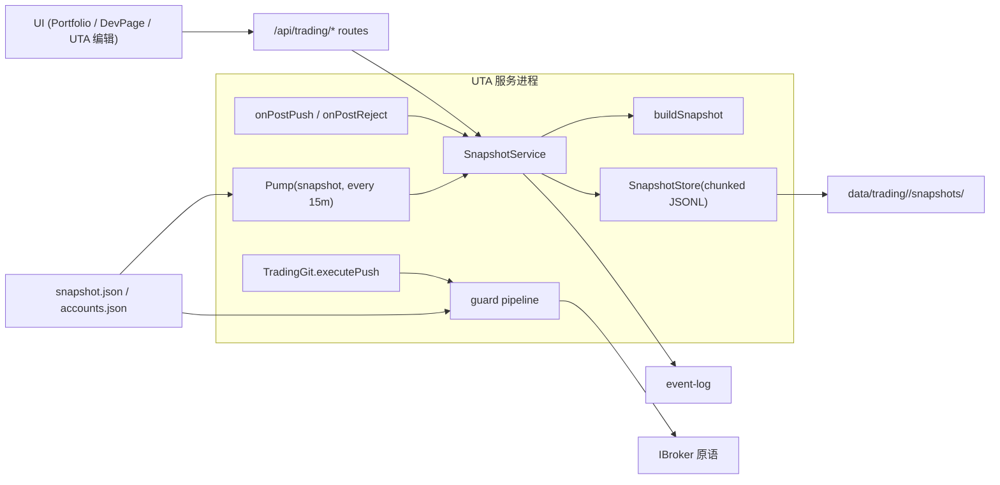

# 06 — Snapshots 与 Guards（UTA 重构调查报告）

> 摘要（≤10 行）
> 本区域覆盖 UTA Core 的两条横切机制：**快照子系统**（`services/uta/src/domain/trading/snapshot/`，builder + service + chunked-JSONL store + Pump 调度器）与 **guard 管线**（`services/uta/src/domain/trading/guards/`，3 个内置 guard + registry + pipeline）。
> 快照是"账户状态的时间序列取证记录"：定时（默认 15m）、push 后、reject 后各写一行记录；每 50 行滚动一个新 chunk，无裁剪、无压缩、无跨进程并发保护。**已实测确认** HTTP 路由 `:id` 参数未校验导致路径穿越（可读写 `data/trading/` 之外的目录）、删除 chunk 后新写入复用同一文件名导致同一快照被重复读出。
> Guard 是 push 前的**同步前置校验**：只在 `TradingGit.executeOperation` 单点接入，仅覆盖 placeOrder / modifyOrder / closePosition / cancelOrder；sync、reconcileBalance、observeExternalOrder、simulator 路由全部绕过。
> 两个子系统都有"静默失败"倾向：store 读失败返回空数组、index 损坏被当成空、UI 提供但后端不存在的 `max-leverage` guard 被静默丢弃、guard 选项不校验导致 NaN 时永久放行。

---

## 1. 概览与职责边界

### 1.1 本区域负责什么

- **快照采集**：`buildSnapshot(uta, trigger)` 把单个 UTA 的活状态（account/positions/openOrders/health/git head）压成一份不可变记录（`snapshot/builder.ts:13-85`）。
- **快照编排**：`createSnapshotService` 决定"何时跳过、何时存储、何时重试"，并写入 event log（`snapshot/service.ts:27-112`）。
- **快照持久化**：`createSnapshotStore` 的分块 JSONL + `index.json` 布局、`append` / `readRange` / `deleteByTimestamp`（`snapshot/store.ts:36-169`）。
- **快照调度**：`createSnapshotScheduler` 用共享 Pump 原语按 `snapshot.json` 的 `every` 触发全体账户采集（`snapshot/scheduler.ts:31-57`）。
- **push/reject 钩子接线**：UTA 的 `_onPostPush` / `_onPostReject`（`UnifiedTradingAccount.ts:96-97,153-154,802,809`）与 `UTAManager.setSnapshotHooks`（`uta-manager.ts:31-53`）。
- **guard 模型与注册表**：`GuardContext` / `OperationGuard` / `GuardRegistryEntry`（`guards/types.ts`）、内置注册表与 `registerGuard` / `resolveGuards`（`guards/registry.ts`）。
- **guard 执行**：`createGuardPipeline` 组装 context、顺序执行、短路（`guards/guard-pipeline.ts`）。
- **3 个内置 guard 的规则**：`cooldown`、`max-position-size`、`symbol-whitelist`。
- **guard 配置来源**：`accounts.json` 的 `guards` 字段（`src/core/config.ts:437-440,454`）→ `UTAManager.initUTA` → `UnifiedTradingAccount` 构造期一次性实例化。

### 1.2 不负责什么

- **账户/持仓/订单领域语义**（`getAccount` 的 PnL 不变量、`getPositions` 的 wallet 成本基础重建、aliceId 语义）→ 参见 `03-account-orders-positions.md`。
- **HTTP 端点全景与协议包**：本文件只在 §4 列出**快照/guard 相关**端点与它们的已知缺陷；端点总表见 `02-http-api-and-protocol.md`。
- **Alice 侧 SDK/UI 的完整消费面**：只写与快照/guard 直接相关的调用点；全景见 `08-alice-consumers-and-ui.md`。
- **账户配置的持久化 schema 与迁移**（`accounts.json`、`snapshot.json`）→ 参见 `09-persisted-state-tests-docs-issues.md`。
- **broker 适配器行为**（MockBroker 的 fill 语义、CCXT 的 wallet 成本）→ 参见 `07-brokers-and-packs.md`。

### 1.3 上下游

| 方向 | 对方 | 契约 |
|---|---|---|
| 上游 | `UTAManager` | `resolve()` 同步返回全部实例（`uta-manager.ts:181-187`）；`get(id)` 精确查找 |
| 上游 | `UnifiedTradingAccount` | `getAccount()` / `getPositions()` / `getOrders(orderIds)` / `git.status()` / `git.getPendingOrderIds()` / `sync()` / `disabled` / `health` / `broker`（原生 IBroker 引用） |
| 上游 | `src/core/pump.ts` | `createPump({name, every, enabled, onTick})`；setTimeout 链 + serial 丢弃 + 错误退避 |
| 上游 | `src/core/paths.ts` | `dataPath('trading')` → `$OPENALICE_HOME/data/trading`（默认 `~/.openalice`，`paths.ts:37-45`） |
| 上游 | `src/core/config.ts` | `snapshotSchema`（`enabled`/`every`）、`guardConfigSchema`；`snapshot.json` 改动经 `triggerUTARestart()` 触达 UTA（`src/webui/routes/config.ts:418-423`） |
| 下游 | HTTP `/api/trading/uta/:id/snapshots*`、`/api/trading/snapshots/equity-curve` | 见 §4 |
| 下游 | `event-log` | `snapshot.taken` / `snapshot.skipped` / `snapshot.error` 三类事件（`service.ts:55,64,73`） |
| 下游 | 磁盘 | `data/trading/<accountId>/snapshots/{index.json,chunk-NNNN.jsonl}` |
| 下游 | UI / Dev 工具 | Portfolio 配置面板与曲线、DevPage 快照浏览器；guard 编辑器在 UTA 编辑弹窗 |

调用关系：

---

## 2. 功能清单

### 2.1 Snapshot：构建一份快照（builder）

**触发方式**：`buildSnapshot(uta, trigger)` 被三处调用——service 的 `takeSnapshot`（手动/DELETE 之外的全部路径）、测试、以及 `snapshot/index.ts` 的包级导出。

**输入**：目标 `UnifiedTradingAccount`；`trigger` ∈ `'scheduled' | 'post-push' | 'post-reject' | 'manual'`。

**处理步骤**（`builder.ts:13-85`）：

1. 前置短路：`uta.disabled || uta.health === 'offline'` 直接返回 null（:18）。
2. 最佳努力 `await uta.sync().catch(() => {})`（:24）。**副作用**：这可能产生一条 `[sync]` commit（`TradingGit.sync` :654-690），也就是"拍快照"动作本身会改变 git 历史。
3. 取 pending 订单 id：`uta.git.getPendingOrderIds().map(p => p.orderId)`（:26）。
4. `Promise.all([getAccount(), getPositions(), getOrders(ids)])`（:27-31）。**注意**：`getAccount()` 内部会再调一次 `getPositions()`（`UnifiedTradingAccount.ts:1005-1020`），实测每次构建产生 **getPositions ×2、getAccount ×1、getOrders ×1** 四类 broker 往返（实测探针输出：`broker calls per snapshot: getPositions= 2 getAccount= 1 getOrders= 1`）。
5. 取 git 状态：`uta.git.status()`（:33）。
6. 组装对象，`timestamp = new Date().toISOString()` 在**所有读取完成之后**取值（:37）——即时间戳表示"读取完成时刻"，不是数据自身的市场时刻。
7. 失败时 `console.warn('snapshot: build failed for <id>')` 并返回 null，**不抛错**（:81-84）。

**输出**：`UTASnapshot | null`。字段表见 §3.1。

**错误与边界情况**：

| 情况 | 行为 | 证据 |
|---|---|---|
| disabled / offline | 返回 null，不取任何数据 | `builder.ts:18` |
| 任一 broker 读抛错 | 全部吞掉，返回 null，仅 warn（无 event，event 由 service 层补 `snapshot.skipped`） | `builder.ts:81-84`、`service.ts:53-61` |
| `sync()` 抛错 | 忽略；快照可能把已成交订单仍记为 `Submitted` | `builder.ts:24` |
| `realizedPnL` 缺失 | 用 `'0'` 兜底 | `builder.ts:44` |
| `multiplier === '1'` | **省略该字段**（不是写 '1'） | `builder.ts:60` |
| `strike === UNSET_DOUBLE`（2^127-1） | 省略 | `builder.ts:61`、`packages/ibkr/src/const.ts:13` |
| 非 Submitted/PreSubmitted 的订单 | 从 openOrders 中过滤掉（成交/撤销/拒绝不落快照） | `builder.ts:65-66` |
| keyless（无凭据公开数据源）账户 | 不特殊处理：`disabled=false` 且 health 通常 `healthy`（reach=connected 即达标），于是**照常落一份净值为 0 的空快照**。实测：模拟 keyless 读面时输出 `{"health":"healthy","net":"0","positions":0}` | 探针 `services/uta/src/domain/trading/snapshot/__probe3.spec.ts`（临时文件，已删） |
| 单份快照体积 | 2 个 STK 持仓约 652 字节/行（实测），IBKR 期权持仓会更长 | 同上探针 |

### 2.2 Snapshot：service 编排（take / takeAll / getRecent / delete）

**触发方式**：

| 路径 | 触发 | 代码 |
|---|---|---|
| 定时 | Pump onTick → `takeAllSnapshots('scheduled')` | `scheduler.ts:41-43` |
| push 后 | `UnifiedTradingAccount.push()` 内 fire-and-forget（**不 await**） | `UnifiedTradingAccount.ts:802` |
| reject 后 | `UnifiedTradingAccount.reject()` 内 fire-and-forget | `UnifiedTradingAccount.ts:809` |
| 手动 | 生产环境**不可达**：`'manual'` 只出现在测试与类型定义中；`scheduler.runNow()` 除测试外无调用者 | `scheduler.ts:28,53-55`；全仓 grep 无生产调用点 |

**takeSnapshot(accountId, trigger)**（`service.ts:46-76`）：

1. `utaManager.get(accountId)` 未命中 → 返回 null，**不写 event**（:47-48）。
2. `buildSnapshot` 返回 null → 写 `snapshot.skipped {accountId, trigger, reason:'no-data'}`，返回 null（:53-61）。
3. 成功 → `store.append(snapshot)` 后写 `snapshot.taken {accountId, trigger, timestamp}`，返回快照（:63-69）。
4. store.append 抛错 → warn + `snapshot.error {accountId, trigger, error}`，返回 null（:70-75）。

**takeAllSnapshots(trigger)**（`service.ts:78-102`）：

1. `utaManager.resolve()`（无参 → 全部已注册实例，**包含 disabled / offline / keyless**）。
2. `Promise.allSettled` 并行对每个账户调 `takeSnapshot`。
3. 把 `snap === null` 的账户视为失败集（:90-93）。
4. 失败集非空时 `await sleep(3000)`（`RETRY_DELAY_MS`，:18）后**再跑一轮**，结果丢弃（:98-101）。

**边界情况（关键）**：

- **重试语义过宽**：disabled/offline 账户必然返回 null，因此每次 tick 只要存在这类账户，就无条件多等 3 秒；无退避、无上限、无日志（探针确认 null 结果会进失败集）。
- **返回值丢失**：`takeAllSnapshots` 返回 `Promise<void>`，第二轮结果不检查，任何失败只体现为 event log 里的 `snapshot.skipped`。
- **`this` 依赖**：实现体内部用 `this.takeSnapshot(...)`（:85,:100）。把方法解构出来（`const {takeAllSnapshots} = svc`）会丢 `this`，`allSettled` 把内部 TypeError 当成 fulfillment 吃掉——实测：**零警告、零存储、零 event**（探针 `__probe12.spec.ts`，已删）。当前唯一生产调用方是 scheduler 的闭包调用，所以只是隐患而非现网故障。

**getRecent(accountId, limit=10)**（`service.ts:104-106`）：直接代理 store 的 `readRange({limit})`，**不接受时间范围**。

**deleteSnapshot(accountId, timestamp)**（`service.ts:108-110`）：直接代理 `store.deleteByTimestamp`。

### 2.3 Snapshot：store 持久化布局与查询

**布局**（`store.ts:1-16` 注释 + :36-38）：

| 位置 | 内容 |
|---|---|
| `<baseDir>/<accountId>/snapshots/index.json` | `SnapshotIndex`，`{version:1, chunks:[{file,count,startTime,endTime}]}` |
| `<baseDir>/<accountId>/snapshots/chunk-000N.jsonl` | 每行一个 `UTASnapshot`（JSON），chunk 上限 50 行 |
| `baseDir` | 默认 `dataPath('trading')` = `$OPENALICE_HOME/data/trading`；service 默认不传，测试注入 tmpdir |

**append(snapshot)**（`store.ts:63-86,128-133`）：

1. 读写通过模块级 `writeChain` Promise 链串行化（:41,:129-131）——**仅在单个 store 实例内有效**。
2. 读 index（失败 → 空索引）；最后一个 chunk 满 50 行或不存在 → 新建 chunk；文件名 = `chunk-` + `(chunks.length + 1)` 左补零 4 位（:69-70）。
3. `appendFile` 追加一行，然后 `saveIndex`（tmp 文件 + rename，原子替换，:52-57）。

**readRange({startTime?, endTime?, limit?})**（`store.ts:141-168`）：

1. 读 index；从最后一个 chunk 向前遍历（新→旧）。
2. chunk 级时间过滤：`startTime > chunk.endTime` 或 `endTime < chunk.startTime` 跳过。
3. chunk 内按行倒序解析，逐行再做时间过滤，命中即 push。
4. `limit` 达即刻返回。

**deleteByTimestamp(timestamp)**（`store.ts:88-125`）：按 chunk 的 `[startTime, endTime]` 字符串比较定位 chunk；读全文、过滤掉 **timestamp 字符串相等**的行；若 chunk 被清空则 `unlink` 文件并 `splice` 索引项，否则原子重写文件并回写该 chunk 的 `count/startTime/endTime`；未命中返回 false。

**错误与边界情况（全部实测确认）**：

| 情况 | 行为 | 证据 |
|---|---|---|
| index.json 损坏/不可读 | `readIndex` 吞掉异常返回空索引 → `readRange` 返回 `[]`；下一次 `append` 会把第一条写进 `chunk-0001.jsonl`（**可能已存在同名旧文件**），索引与实际文件分叉 | 探针：损坏后 `readRange` 返回 0；append 后目录里只有 `chunk-0001.jsonl` + 新 index |
| chunk 文件缺失 | `readFile` 抛 ENOENT → **readRange 整体抛出**（不是跳过该 chunk） | 探针：`readRange THREW: ENOENT` |
| 时间戳乱序写入 | 新行的 timestamp 小于该 chunk 的 `startTime` 时，`endTime` 仍被覆盖为它 → `chunk.startTime > chunk.endTime`，之后带 `startTime` 的查询会整块跳过 | 见 §6.2（前序验证） |
| 删除中间 chunk 后再 append | `nextNum = chunks.length + 1` 复用已存在的文件名 → 索引里出现**两个指向同一文件的条目**（实测 `chunk-0003.jsonl:50` 与 `chunk-0003.jsonl:1`），文件变 51 行，`readRange()` 读出 **152 行但只有 101 个唯一 timestamp** | 探针 `__probe5.spec.ts`（已删） |
| 同一 timestamp 多条 | `deleteByTimestamp` 删除**全部**同 timestamp 行（不是一条） | 前序验证（返回 true，剩余 0） |
| 两个 store 实例（两个进程 / 同进程重复创建）并发写 | `index.json.<pid>.tmp` 同名 + rename 竞态 → `ENOENT rename` 抛错，其中一个 append 失败 | 探针 `__probe4c.spec.ts`（已删） |
| accountId 含路径分隔/上跳 | `resolve(baseDir, accountId, 'snapshots')` 无校验 → **读写逃出 baseDir**（实测：`createSnapshotStore('../../vault')` 读到了外部目录的 `netLiquidation=999999`，append 也写到了外部文件） | 探针 `__probe19.spec.ts`（已删） |
| 无裁剪/无压缩/无归档 | 全仓 grep 无 retention/prune/maxSnapshots 实现；删除只能靠 HTTP DELETE 逐条 | §2.6、§8 |
| index 无版本迁移 | 类型写死 `version: 1`，无 migration 代码 | `types.ts:78` |

### 2.4 Snapshot：scheduler 与 Pump 时序

`createSnapshotScheduler({snapshotService, config})`（`scheduler.ts:31-57`）内部构造：

- 一个名为 `snapshot` 的 Pump：周期取 `config.every`，初始 enabled 取 `config.enabled`，每次 tick 调 `takeAllSnapshots('scheduled')`。
- `start()` → `pump.start()`（幂等：重复调用不重复计时，Pump 内部 `started` 标志，`pump.ts:82-85`）。
- `stop()` → `pump.stop()`（终态，此后 `runNow` 无效，`scheduler.ts:50-52` + `pump.ts:86-89,116-118`）。
- `runNow()` → `pump.runNow()`；若已有 tick 在飞则 await 它（`pump.ts:117-124`）。

**Pump 时序契约**（`src/core/pump.ts:20-30,73-131`）：

| 属性 | 行为 |
|---|---|
| 计时方式 | setTimeout 链；下一次 fire 总在上一次 onTick **完成之后**再排期 |
| serial（默认 true） | tick 在飞时到点的新 tick **被丢弃**并 `console.warn('pump[snapshot]: tick dropped (still processing previous)')` |
| 错误退避 | onTick 抛错 → `consecutiveErrors++`，下次延迟取 `[30s, 1m, 5m, 15m, 1h]` 的第 n-1 项（越界取末项）；成功一次即清零 |
| 周期解析 | `parseDuration` 只接受 `<H>h<M>m<S>s` 全数字组合；全零 → null（`src/core/duration.ts:13-22`） |
| 首次触发 | `start()` 时立即 arm，延迟 = `every`（不是立即跑一次） |
| 无 jitter/无对齐 | 每次漂移累积一个 tick 的执行耗时 |

**生产接线**（`services/uta/src/main.ts:104-113,185`）：service 与 scheduler 在**账户初始化之后**创建；`await snapshotScheduler.start()`；`config.snapshot.enabled` 为 false 时 Pump 不自动触发但 `runNow` 仍可用；shutdown 时 `snapshotScheduler.stop()`（:185）。

**配置热更新**：`snapshot.json` 由 Alice 侧 PUT 后调 `triggerUTARestart()`（`src/webui/routes/config.ts:418-423`），即改 `enabled`/`every` 必须重启 UTA 进程，不是 `pump.setEnabled` 热切。

### 2.5 Snapshot：post-push / post-reject 钩子

- UTA 构造参数 `onPostPush` / `onPostReject`（`UnifiedTradingAccount.ts:96-97,153-154`）。
- `push()` 成功返回后以 `Promise.resolve(...).catch(() => {})` 的方式触发 `_onPostPush(id)`（:802）——**不 await、不传播错误**；`push` 抛出（disabled/offline/委托冲突）时钩子不触发。
- `reject()` 同样（:809）。
- `UTAManager.initUTA` 在构造对象时**快照式捕获**钩子：`onPostPush: this._snapshotHooks?.onPostPush`（`uta-manager.ts:71-72`）。因此 `setSnapshotHooks` 之后再 `initUTA` 的账户才有钩子；**已构造的账户不会补挂**。
- **实测（探针 `__probe5.spec.ts`，已删）**：先 `initUTA` 再 `setSnapshotHooks` → `_onPostPush === undefined`（钩子未接）；`setSnapshotHooks` 之后再 `initUTA` → 已接。
- **与生产顺序的冲突**：`main.ts:76-87` 先跑完账户初始化循环，`:105-108` 才 `setSnapshotHooks`。⇒ **开机时初始化的账户在 push/reject 后不会拍快照**；只有之后经 `reconnectUTA`（改配置/重连）重建的账户才带上钩子。这是本区域最直接的一处接线缺陷，且没有测试覆盖（`snapshot.spec.ts:570-624` 只测 UTA 层钩子被调用，不测 manager 接线顺序）。

### 2.6 快照的两个 HTTP 面（详见 §4）

- `GET /api/trading/uta/:id/snapshots`（`routes-trading.ts:642-652`）：`limit` 默认 100；**忽略 `startTime`/`endTime`**（UI 会发送）；任何异常 → `{snapshots: []}`。
- `DELETE /api/trading/uta/:id/snapshots/:timestamp`（:654-661）：无 service → 503；未命中 → 404；否则 `{success:true}`。
- `GET /api/trading/snapshots/equity-curve`（:664-723）：跨账户分钟级汇总，见 §4.3。

### 2.7 Guard：pipeline 执行模型

**触发方式**：唯一入口是 `TradingGit.executePush` 的逐条 `await this.config.executeOperation(op)`（`git/TradingGit.ts:145`）；`config.executeOperation` 在 UTA 构造时被赋值为 guard pipeline（`UnifiedTradingAccount.ts:198-202`）。

**执行步骤**（`guard-pipeline.ts:13-36`）：

1. `guards.length === 0` → 直接返回原始 dispatcher（**零额外开销，完全不取 context**）。
2. 否则每个操作先 `Promise.all([broker.getPositions(), broker.getAccount()])`——注意是**原始 IBroker**，不是 UTA 包装层，因此**没有 aliceId 盖章、没有 wallet 成本基础重建、没有 health 失败计数**（`guard-pipeline.ts:21-24`）。
3. 顺序遍历 guards，逐个 `await guard.check(ctx)`。
4. 第一个返回非 null 的 guard 立即短路，返回 `{success: false, error: '[guard:<name>] <reason>'}`（:28-33）。
5. 全部通过 → `dispatcher(op)`（经 `_assertCanMutateAccount` 与 `broker.placeOrder/modifyOrder/closePosition/cancelOrder`，`UnifiedTradingAccount.ts:180-196`）。

**实测成本**：一次 push 内 N 个操作 → **N 次 `getPositions` + N 次 `getAccount`**（3-op push 实测 4 次各一：3 次 guard context + 1 次 dispatcher/state 读取路径）。无缓存、无按批取 context。

**结果表达与调用方消费**：

- 命中 guard → `{success:false, error}`（普通对象，**不是 Error 实例**，实测 `is Error: false`）。
- `TradingGit.parseOperationResult`（:929-964）把它翻译成 `OperationResult{success:false,status:'rejected',error,raw}`，最终出现在 `PushResult.rejected[]`。
- 抛异常的 guard：异常穿透 pipeline（不包 `[guard:...]` 前缀），但在 `executePush` 的 per-op try/catch（:145-154）里被截获 → 变成一条 `rejected` 结果，`error` 是原始 message。实测（自定义 `boom-probe` guard）：`submitted:0 rejected:1 error:"kaboom"`，commit 仍被记录。
- **context 取数失败**（如 `getAccount` 抛错）：发生在 guard 循环之前，异常穿透 `executePush` → **整个 push 抛出**，既不记录 commit，也没有 `rejected[]`（实测：`push THREW`、`commit log length after: 0`、`consecutiveFailures: 1`）。调用方（HTTP / AI tool）只能看到一个 500 / 通用错误，看不到"这是 guard 前置读失败"。

### 2.8 Guard：registry 与配置解析

- 内置 3 个类型：`max-position-size`、`cooldown`、`symbol-whitelist`（`registry.ts:6-10`）。
- `registerGuard(entry)` 导出但**全仓无生产调用者**（仅测试与 `domain/trading/index.ts:79` 的 re-export）——所谓"第三方扩展点"目前是空接口。
- `resolveGuards(configs)`：未注册类型 `console.warn('guard: unknown type "<t>", skipped')` 并跳过（:28-31）——**静默降级，不阻断账户创建**。
- 配置来源：`accounts.json` 的每账户 `guards` 数组（`src/core/config.ts:437-440` 的 `{type, options}`；:454 默认 `[]`）→ `initUTA` 透传（`uta-manager.ts:66`）→ 构造函数一次性 `resolveGuards`（`UnifiedTradingAccount.ts:198`）。
- **没有全局 guard 概念**：只有 per-account。`crypto.json` / `securities.json` 里虽然也定义了 `guards` 字段（`src/core/config.ts:288,306`），但全仓无消费者，属遗留 schema。

### 2.9 Guard：三个内置规则的完整规格

#### 2.9.1 `cooldown`

| 维度 | 取值 |
|---|---|
| 作用面 | 仅 `action === 'placeOrder'`；其它 action 一律放行（`cooldown.ts:16`） |
| 参数 | `minIntervalMs`（`Number(...)` 强转，`cooldown.ts:12`） |
| 默认 | `DEFAULT_MIN_INTERVAL_MS = 60_000`（:4） |
| 键 | `getOperationSymbol(op)`（:18）——placeOrder 取 `contract.symbol \|\| contract.aliceId \|\| 'unknown'`（`packages/uta-protocol/src/types/git.ts:311-322`） |
| 时钟源 | `Date.now()`（:19），**每 guard 实例一份内存 Map**（:9），无持久化 |
| 时序 | 放行时**立即写入** `lastTradeTime`（:30），即在 dispatcher 之前 |
| 拒绝文案 | `Cooldown active for <symbol>: <n>s remaining`（:26，`Math.ceil`） |
| 边界 | 选项非数字（如 `'soon'`）→ `NaN` 比较恒 false → **永久放行**（实测）；符号大小写敏感（`'aapl'` 与 `'AAPL'` 视为不同键，实测）；买卖方向不区分（同 symbol 的 BUY/SELL 共用冷却窗口，实测）；`modifyOrder`/`cancelOrder` 的符号恒为 `'unknown'` 但本 guard 不看这两个 action |

#### 2.9.2 `max-position-size`

| 维度 | 取值 |
|---|---|
| 作用面 | 仅 `placeOrder`（:16） |
| 参数 | `maxPercentOfEquity`（`Number(...)`，:12） |
| 默认 | `DEFAULT_MAX_PERCENT = 25`（:5） |
| 当前持仓 | `positions.find(p => p.contract.symbol === symbol)`——**只取第一个匹配**（:21-22） |
| 新增敞口估算 | `cashQty`（非 UNSET_DECIMAL 且 >0）优先，否则 `totalQuantity × existing.marketPrice`；新符号 + 纯数量模式 → `addedValue = 0` → **直接放行**（:26-37） |
| 单位 | 名义价值，账户计价货币；**期权 multiplier 未参与**新增敞口估算 |
| 分母 | `account.netLiquidation`；`<= 0` 时 percent 记 0 → **直接放行**（:41，实测 netLiq=0 + cashQty=999999 → 放行） |
| 判定 | `projectedValue / netLiquidation × 100 > maxPercent`（:43） |
| 拒绝文案 | `Position for <symbol> would be 
% of equity (limit: <m>%)`（:44） |
| 边界 | `marketValue` 为空串时 `new Decimal('')` 抛 DecimalError（实测 `[DecimalError] Invalid argument:`）→ 在 pipeline 内变成 op 级 rejected；`NaN` 参数 → 永不拒绝（实测）；`existing.marketPrice` 单位/币种未换算 |

#### 2.9.3 `symbol-whitelist`

| 维度 | 取值 |
|---|---|
| 作用面 | **所有 action**（不看 action 类型） |
| 参数 | `symbols: string[]` |
| 默认 | **无默认**：缺失或空数组时构造函数 `throw new Error('symbol-whitelist guard requires a non-empty "symbols" array in options')`（:9-12） |
| 匹配 | `getOperationSymbol` 结果对 `Set<string>` 精确匹配，**大小写敏感**（:20，实测 `'aapl'` vs `['AAPL']` → 拒绝） |
| 放行旁路 | `symbol === 'unknown'` → 放行（:18）：即 `modifyOrder` / `cancelOrder` / `syncOrders` 不受白名单约束 |
| 拒绝文案 | `Symbol <s> is not in the allowed list`（:21） |
| 边界 | 空数组会**炸掉整个账户初始化**（见 §8 第 5 条）；调用方可通过 `stagePlaceOrder` 的 `symbol` 参数伪装（见 §8 第 10 条） |

### 2.10 Guard 的覆盖面（谁被守、谁绕过）

| 写路径 | 是否经过 guards | 证据 |
|---|---|---|
| `git push` → `executeOperation` → dispatcher | ✅ | `git/TradingGit.ts:145`、`UnifiedTradingAccount.ts:202` |
| `git sync()`（成交/撤销回写） | ❌ | `TradingGit.sync` :654-690 直接 push commit |
| `git recordReconcile`（wallet 成本基础补记） | ❌ | `TradingGit.ts:272-330` |
| `git recordObservedOrders`（外部订单入账） | ❌ | `TradingGit.ts:338+` |
| `simulatePriceChange` | ❌（改 markPrice / 模拟成交） | `TradingGit.ts` 同族 |
| HTTP `/api/simulator/*`（mark-price / tick-price / fill / cancel / external-deposit / external-withdraw / external-trade） | ❌ 直接调 MockBroker 方法 | `routes-simulator.ts:120-216` |
| 一键下单 `POST /wallet/place-order` 等 | ✅（内部走 stage→commit→push） | `routes-trading.ts:70-79` → `order-entry.ts:44-73` |

⇒ guard 只覆盖"Alice 主动发往交易所的 4 类订单操作"，对**任何由交易所侧或本地同步产生的状态变更**都不设防。

---

## 3. 数据与状态

### 3.1 `UTASnapshot` 字段表（`snapshot/types.ts:14-66`）

| 字段 | 含义 | 取值/约束 |
|---|---|---|
| `accountId` | UTA id | string |
| `timestamp` | 快照时刻 | ISO 8601 字符串；构建完成时取值（`builder.ts:37`）；**同时是删除操作的主键** |
| `trigger` | 触发来源 | `'scheduled' \| 'post-push' \| 'post-reject' \| 'manual'` |
| `account.baseCurrency` | 账户计价货币 | string，如 `'USD'` |
| `account.netLiquidation` | 净清算价值 | string（Decimal 序列化） |
| `account.totalCashValue` | 现金 | string |
| `account.unrealizedPnL` | 未实现盈亏 | string；由 UTA 层从持仓重算（见报告 03） |
| `account.realizedPnL` | 已实现盈亏 | string；缺失时 `'0'` |
| `account.buyingPower` | 购买力 | 可选 string |
| `account.initMarginReq` | 初始保证金 | 可选 string |
| `account.maintMarginReq` | 维持保证金 | 可选 string |
| `positions[].aliceId` | 合约标识 | `contract.aliceId ?? broker.getNativeKey(contract)`（`builder.ts:50`） |
| `positions[].currency` | 计价货币 | string |
| `positions[].side` | 方向 | `'long' \| 'short'` |
| `positions[].quantity` | 数量 | string（`.toString()`） |
| `positions[].avgCost` | 成本价 | string，单份合约价（非总价） |
| `positions[].marketPrice` | 标记价 | string |
| `positions[].marketValue` | 市值 | string；**恒正名义价值，方向由 side 单独表达**（`position-math.ts:99-117`） |
| `positions[].unrealizedPnL` | 未实现盈亏 | string；已含 multiplier 与方向符号 |
| `positions[].realizedPnL` | 已实现盈亏 | string |
| `positions[].secType` | 证券类型 | 可选；`contract.secType` 存在才写 |
| `positions[].multiplier` | 合约乘数 | 可选；**`'1'` 时省略** |
| `positions[].strike` | 行权价 | 可选 number；`UNSET_DOUBLE`（1.7976931348623157e+308）时省略 |
| `positions[].right` | 看涨/看跌 | 可选 string（`'C'`/`'P'`） |
| `positions[].expiry` | 到期 | 可选 string（IBKR `lastTradeDateOrContractMonth`） |
| `openOrders[].orderId` | 订单号 | `String(o.order.orderId)` |
| `openOrders[].aliceId` | 合约标识 | 同上规则 |
| `openOrders[].action` | 方向 | string（`'BUY'`/`'SELL'`） |
| `openOrders[].orderType` | 类型 | string（`'MKT'`/`'LMT'`/…） |
| `openOrders[].totalQuantity` | 数量 | string |
| `openOrders[].limitPrice` | 限价 | 可选 string；`lmtPrice != null` 即写（MKT 单的 UNSET_DECIMAL 默认值已被上层 `OrderHelper.toWire`/broker 侧处理，实测 LMT 快照输出 `"limitPrice":"150"`） |
| `openOrders[].status` | 状态 | 只可能是 `'Submitted' \| 'PreSubmitted'` |
| `openOrders[].avgFillPrice` | 成交均价 | 可选 string |
| `health` | 账户健康 | `'healthy' \| 'degraded' \| 'offline' \| 'disabled'`；`uta.disabled ? 'disabled' : uta.health`——**'disabled' 是快照层新增的取值，BrokerHealth 本身只有 3 值**（`packages/uta-protocol/src/types/broker.ts:368`） |
| `headCommit` | git HEAD | string \| null（`git.status().head`，`TradingGit.ts:536-544`） |
| `pendingCommits` | 待执行 commit | string[]；`pendingHash` 存在则 `[hash]`，否则 `[]`——**实际容量恒为 0 或 1** |

### 3.2 `SnapshotIndex` / `SnapshotChunkEntry`（`types.ts:70-79`）

| 字段 | 含义 | 约束 |
|---|---|---|
| `SnapshotIndex.version` | 格式版本 | 字面量 `1`；无迁移代码 |
| `SnapshotIndex.chunks[]` | chunk 顺序表 | 顺序即写入顺序（`chunks.length + 1` 参与命名） |
| `chunks[].file` | 文件名 | `chunk-NNNN.jsonl` |
| `chunks[].count` | 行数 | 追加时 +1；删除时回写 |
| `chunks[].startTime` / `endTime` | 时间边界 | 追加时以首行/末行为准（**乱序写入会破坏单调性**）；删除时按剩余行首末重算 |

### 3.3 内存状态

| 状态 | 归属 | 生命周期 |
|---|---|---|
| `stores: Map<accountId, SnapshotStore>` | snapshot service（`service.ts:34-43`） | 进程生命周期；缓存 store 以保证同进程写入串行 |
| `writeChain` | 每个 store 实例（`store.ts:41`） | 实例生命周期；**不跨实例/跨进程** |
| `lastTradeTime: Map<symbol, number>` | 每个 cooldown guard 实例（`cooldown.ts:9`） | 随 UTA 实例；reconnect/重启即丢失，冷却窗口重置 |
| guard 实例数组 | UTA 构造期一次性 resolve（`UnifiedTradingAccount.ts:198`） | 修改 guards 配置**不会热生效**：`PUT /uta/:id` 会调 `reconnectUTA`（`trading-config.ts:275-299`）重建实例才生效 |
| Pump 计时器 | scheduler | `stop()` 后终态 |

### 3.4 持久化与生命周期

- 目录：`$OPENALICE_HOME/data/trading/<accountId>/snapshots/`（默认 `~/.openalice/data/trading/...`；`paths.ts:37-45`）。
- 该目录与 `commit.json`（git 历史）同级，同属"账户可搬迁状态"（`docs/broker-packs.md:208`）。
- **销毁**：`wipeUTATradingData(id)` 在 ephemeral UTA 的启动清理与 DELETE 时整体 `rm -rf data/trading/<id>`（`src/core/config.ts:790-799`，调用点 `src/webui/routes/trading-config.ts:322+`、`services/uta/src/main.ts:69`）。
- **无自动清理**：没有 TTL、容量上限、归档或压缩；唯一删除入口是逐条 HTTP DELETE（UI 的 DevPage 提供按钮）。
- 写入频率量级：默认 15m/账户 → 96 行/天 ≈ 每个账户每天 2 个 chunk（约 60–70 KB/天，按 652 B/行估），一年约 24 MB/账户。keyless 数据源也会被计入（见 §2.1）。

---

## 4. 外部交互

### 4.1 快照端点（本区域视角，总表见 `02-http-api-and-protocol.md`）

| 方法/路径 | 输入 | 处理 | 输出/副作用 | 错误 |
|---|---|---|---|---|
| `GET /api/trading/uta/:id/snapshots` | `limit`（默认 100）；**`startTime`/`endTime` 被忽略** | `snapshotService.getRecent(id, limit)` → `store.readRange({limit})` | `{snapshots: UTASnapshot[]}`，新→旧 | 无 service → `{snapshots: []}`；任何异常 → `{snapshots: []}`（`routes-trading.ts:649-651`，掩盖 ENOENT/解析错误） |
| `DELETE /api/trading/uta/:id/snapshots/:timestamp` | URL 参数（Hono 已解码，路由再 `decodeURIComponent` 一次） | `store.deleteByTimestamp` | `{success:true}`；文件重写/unlink + index 重写 | 无 service → 503；未命中 → 404；store 抛错 → 未捕获 → 500 |
| `GET /api/trading/snapshots/equity-curve` | `limit`（默认 200，**逐账户**上限）；`startTime`/`endTime` 被忽略 | 见 §4.3 | `{points:[{timestamp, equity, accounts}]}` | 任何异常 → `{points: []}` |

**实测（路径穿越，安全相关）**：`:id` 未做格式校验，也不与 `utaManager` 做存在性绑定；Hono 会把 `%2E%2E%2F%2E%2E%2Fvault` 解码为 `../../vault`（实测路由内 `c.req.param('id')` 得到 `../../vault`）。
- `GET .../uta/<编码后的 ../victim-store>/snapshots` → **200**，返回 baseDir 之外的快照内容（实测读出 `netLiquidation: "777"`）。
- `DELETE .../uta/<编码后的 ../victim-store>/snapshots/<ts>` → **200 `{"success":true}`**，目标目录的 index 被清空（实测）。
- BFF 代理会原样转发该路径（`src/webui/routes/trading-proxy.ts:150-160`），唯一前置门禁是交易模式（lite/readonly），readonly 只拦 venue 写（`isVenueMutation`，:193-206），快照 DELETE 不在其列。

### 4.2 `equity-curve` 的聚合规则（`routes-trading.ts:664-723`）

1. `utaManager.resolve()` 取**全部**账户（含 keyless、disabled、offline）。
2. 每个账户 `getRecent(id, limit)`：一次最多取 `limit` 条。
3. 按 `timestamp` 取整到分钟（`d.setSeconds(0,0)` 后 `toISOString()`）作为 key；同分钟内重复落点的账户值**后写覆盖前写**。
4. `equity` = 该 key 下所有账户 `Number(netLiquidation)` 之和——**无 FX 换算**，多币种账户直接按数字相加（对比：`/api/trading/equity` 走 `getAggregatedEquity` + `fxService`，`uta-manager.ts:204-240`）。
5. 时间升序遍历时对缺失账户做 carry-forward（用上次已知值补齐）后再求和，因此 `equity` 会因为"某账户当天没落点"而沿用旧值，且早期点位的账户集合与后期不同。
6. 返回值 `equity` 以 `String(number)` 输出（浮点，不是 Decimal 字符串）。

### 4.3 与 event log 的交互

`service.ts` 在四种情形写事件：`snapshot.taken` / `snapshot.skipped{reason:'no-data'}` / `snapshot.error{error}`（+ 未知名账户不写）。事件本身**无消费者**（全仓无 `snapshot.taken` 监听者；`docs/event-system.md:21` 说明 event log 已退化为纯 append-only journal）。

### 4.4 Guard 的外部可见面

- 没有 guard 专属 HTTP 端点（`routes-trading.ts` 无 guard 路由）。
- 配置读写经 Alice 侧 `/api/trading/config/uta(/:id)`（`trading-config.ts:235,275-299`）；新增/编辑后 `notifyUTAReload()` + `reconnectUTA()`。
- 拒绝反馈通道只有一条：`PushResult.rejected[].error` 里的 `[guard:<name>] <reason>` 前缀；一键下单路由会把它包成 `{error, phase:'push'}`（`routes-trading.ts:70-79`）。
- AI 工具面（`src/tool/trading.ts:840`）经 `compactPushResult` 透出同一字段。

---

## 5. 配置项、默认值、环境变量、feature 开关

| 配置 | 位置 | 默认 | 语义/约束 |
|---|---|---|---|
| `snapshot.enabled` | `data/config/snapshot.json`（schema `src/core/config.ts:373-375`） | `true` | Pump 初始 enabled；false 时仅不自动触发，`runNow` 仍有效 |
| `snapshot.every` | 同上（:376-381） | `'15m'` | `parseDuration` 校验（`<H>h<M>m<S>s`，全零 → 拒绝）；**由 schema refine 保证**，格式非法直接 400 |
| （热更新） | `snapshot.json` PUT | — | 触发 `triggerUTARestart()`，需重启 UTA 进程（`src/webui/routes/config.ts:418-423`） |
| `accounts[].guards` | `data/config/accounts.json`（:454） | `[]` | `{type, options}` 数组；顺序即执行顺序；**无 per-guard enable/disable 字段**（删除即禁用） |
| `max-position-size.options.maxPercentOfEquity` | 同上 | 25 | 数字；非数字 → NaN → 永久放行 |
| `cooldown.options.minIntervalMs` | 同上 | 60000 | 毫秒；UI 用秒输入再 ×1000（`ui/src/components/guards.tsx:296-311`） |
| `symbol-whitelist.options.symbols` | 同上 | 无（缺失即构造失败） | 字符串数组，精确匹配 |
| `crypto.guards` / `securities.guards` | `data/config/crypto.json`、`securities.json`（`src/core/config.ts:288,306`） | `[]` | **遗留 schema，无任何消费者** |
| `OPENALICE_HOME` | 环境 | `~/.openalice` | 快照存储根（`paths.ts:37`） |
| UI 侧 guard 类型表 | `ui/src/components/guards.tsx:19-33` | — | Crypto 预设暴露 `max-leverage`（后端不存在）；Securities 不暴露 |
| UI 侧默认值 | `guards.tsx:34-39` | `max-position-size 25`、`max-leverage 10`、`cooldown 60000`、`symbol-whitelist []` | 与后端默认一致（除 `max-leverage`） |

---

## 6. 不变量、时序与并发假设

### 6.1 不变量

1. 快照只在"能拿到真实数据"时落盘——约定上禁止写零值占位（`builder.ts:4-5` 注释、`service.ts:53-56`）。**但该不变量对 keyless 账户失效**（返回的是 broker 侧的合法零值而非占位，语义上是"空账户快照"）。
2. 所有金额字段以字符串保存，禁止浮点（`types.ts:7`）；`equity-curve` 的输出 `equity` 是唯一例外（Number 相加后 String 化）。
3. `positions[].marketValue` 恒正、方向由 `side` 表达（`position-math.ts:99-117`）。
4. `openOrders` 只含活动订单；终态订单的"真相"在 git 历史里，不在快照里。
5. chunk 的行数 ≤ 50（除非发生 §6.2-3 的命名冲突）。
6. `index.chunks[].startTime ≤ endTime`（在时间戳单调递增的假设下成立；乱序写入会破坏它）。
7. guard 只能"放行"或"拒绝"，不能改写操作——`OperationGuard.check` 返回 `string | null`，无 mutation 通道。
8. guard 短路顺序 = 配置数组顺序（`guard-pipeline.ts:28-33`），与 e2e 测试断言一致。

### 6.2 时序与并发假设

1. **快照时间戳非批对齐**：`takeAllSnapshots` 并行触发所有账户，每份快照的 `timestamp` 各自在构建完成时取（`builder.ts:37`）。同一 tick 的账户可能落到不同分钟，直接影响 `equity-curve` 的分桶。**已实测**：乱序写入会让某 chunk 的 `startTime > endTime`，之后带 `startTime` 的查询会整块跳过（前序探针 `__probe.spec.ts`）。
2. **写入串行化是进程内的**：`writeChain` 只保护单个 store 实例；service 用 `stores` Map 保证同进程每账户一个实例（`service.ts:34-43`），但**两个 UTA 进程指向同一 `OPENALICE_HOME` 时会互踩**（实测 rename ENOENT）。
3. **chunk 命名假设"chunk 数只增不减"**：删除中间 chunk 后 `nextNum = chunks.length + 1` 会复用已存在的文件名（实测索引出现重复条目、readRange 返回 152 行 / 101 唯一 timestamp）。
4. **guard context 的读是"操作时刻"的额外读**：同一 push 内的多个操作各读一次市场态，操作之间可能看到不同的持仓（无批量快照语义）。
5. **cooldown 的时钟在 dispatch 前写入**（`cooldown.ts:30`）：无论后续 dispatcher 成功还是失败，窗口都已被消费；重试需要等满 `minIntervalMs`。本项为代码事实，未在 runtime 注入 broker 失败验证（MockBroker 的 `_checkFail` 只覆盖 `init`/`getAccount`/`getPositions`，`MockBroker.ts:256,389,419`）。
6. **cooldown 时钟不持久化**：进程重启 / `reconnectUTA`（改配置、轮换凭据都会触发）后冷却窗口清零。
7. **guard 在 UTA 构造期实例化**：`resolveGuards` 的副作用（warn、throw）只发生一次；配置改动必须经 reconnect 生效。
8. **push 钩子是 fire-and-forget**：`push` 返回前不保证快照已写；进程在钩子完成前退出会丢快照（`UnifiedTradingAccount.ts:802`）。

---

## 7. 测试覆盖

### 7.1 已有覆盖

| spec | 覆盖行为 | 规模 |
|---|---|---|
| `snapshot/snapshot.spec.ts` | builder 正常构建/字符串化/aliceId 替换/OPT 元数据/STK 省略 multiplier/只含 Submitted 订单/disabled→null/offline→null/broker 抛错→null/headCommit+pendingCommits/trigger 透传/可选字段省略；store 首次建 chunk/50 行滚动/index 元数据/倒序返回/limit/时间过滤/跨 chunk 读/空 store/并发 append；service 写事件/未知名账户/跳过事件/takeAll 全账户/单点失败隔离/getRecent 代理；scheduler runNow/幂等 start/disabled/串行丢 tick/stop/onTick 抛错不崩；UTA 钩子 4 例 | 624 行，编号 #1–#35 |
| `guards/guards.spec.ts` | max-position-size 6 例（含默认值、跳过非 placeOrder、无法估算时放行）、cooldown 4 例、whitelist 4 例（含构造抛错、无符号放行）、pipeline 5 例（空 guards 直通、全通过、拒绝、短路、context 取数）、resolveGuards 3 例、registerGuard 1 例 | 306 行 |
| `UnifiedTradingAccount.spec.ts:1051-1073` | 两条端到端：whitelist 拦截 push（`rejected[0].error` 含 `guard`，且 `broker.placeOrder` 未被调用）与放行时被调用一次 | 2 例 |
| HTTP 路由 spec | `routes-trading-wallet.spec.ts:11`、`trading-order-entry.spec.ts:80` 传入 `snapshotService: undefined` —— **只验证"无 service 时优雅降级"，不验证快照端点行为** | — |

### 7.2 明确无测试的行为（清单）

**快照**
1. `store.deleteByTimestamp` 的**任何直接测试**（spec 里只有 service 层的 mock `deleteSnapshot` 返回 false）。
2. 三个 HTTP 端点（列表/删除/曲线）的端到端行为，包括 `startTime`/`endTime` 被忽略这一事实。
3. 删除 chunk 后的命名冲突与 `readRange` 重复读出。
4. index 损坏后的降级行为（静默空索引、索引分叉）。
5. chunk 文件缺失导致 `readRange` 抛错、路由把它吞成 `[]`。
6. 跨进程并发（两个 store 实例）。
7. `accountId` 路径穿越（store 层与 HTTP 层均无测试）。
8. keyless 账户会写出零值快照。
9. `takeAllSnapshots` 的重试轮（3s 等待、失败集筛选、第二轮结果丢弃）。
10. 解构调用导致 `this` 丢失时静默无效。
11. `headCommit` / `pendingCommits` 在 reconnect/restore 后的取值。
12. 快照的保留策略（不存在，自然无测试）。
13. `equity-curve` 的 carry-forward、分钟覆盖、无 FX 求和。
14. Pump 的真实计时/退避/串行丢弃在 snapshot 语境下的行为（`pump.spec` 只在 core 层测，snapshot spec 用 `runNow` 绕开计时）。

**Guard**
15. `max-leverage`（UI 暴露但后端不存在）不在任何测试中。
16. guard 选项非法值（`NaN`、字符串、负数）的行为。
17. 抛异常的 guard（穿透 → op 级 rejected）与 context 取数失败（穿透 → 整个 push 抛出）两种失败模式。
18. 每个操作都重新取 context 的成本与语义（多操作 push 的一致性）。
19. cooldown 的跨重启持久化（不存在）、时钟在 dispatch 前写入的后果。
20. 白名单的符号伪装（`stagePlaceOrder` 的 `symbol` 覆盖）、大小写敏感性。
21. max-position-size 的 multiplier 缺口、`find` 只取首个同符号持仓、`netLiquidation <= 0` 全放行。
22. guard 配置经 HTTP 保存 → reconnect → 生效的完整链路。
23. `registerGuard` 的第三方接入路径（仅测了注册本身）。
24. `accounts.json` 里 `guards` 的反序列化/迁移（`src/core/config.ts:613,622` 只保留字段）。

---

## 8. 观察到的问题、技术债、耦合与重构关注点

按"是否已实测/可复现"分为三档。

### 8.1 已实测确认（附探针证据）

1. **快照端点路径穿越（安全）**：`:id` 无校验 → 可读写 `data/trading/` 之外任意目录的 `index.json` / `chunk-*.jsonl`。读取实测返回外部文件内容；DELETE 实测成功清空外部索引。证据：`routes-trading.ts:642-661` + Hono 参数解码行为（`../../vault`）+ 探针 `__probe22/__probe23.spec.ts`（已删）；store 层同源问题见 `store.ts:37` 与探针 `__probe19.spec.ts`。
2. **chunk 命名冲突 → 重复读出**：删除中间 chunk 后 append 复用文件名，索引出现两个同文件条目；`readRange()` 实测返回 152 行而唯一 timestamp 仅 101 个。证据：`store.ts:69` + 探针 `__probe5.spec.ts`（已删）。
3. **启动顺序导致 post-push 快照钩子丢失**：`main.ts:76-87` 先建账户、`:105-108` 后设钩子；`initUTA` 在构造期快照捕获钩子（`uta-manager.ts:71-72`）。探针实测先 init 后 set → `_onPostPush === undefined`。影响：**开机时的常驻账户在 push/reject 后不会拍快照**，只有重连过的账户才会。
4. **UI 提供 `max-leverage` 但后端没有**：`ui/src/components/guards.tsx:19-24` 对 crypto 预设暴露该类型；`resolveGuards` 实测 `console.warn('guard: unknown type "max-leverage", skipped')` 并返回 0 个 guard——用户以为设了杠杆上限，实际零保护。同类问题：`guards.tsx:248` 有专门编辑器、`GUARD_DEFAULTS:36` 有默认值。
5. **空白名单炸账户**：`symbol-whitelist` 构造函数在 `symbols` 缺失/为空时抛错（`symbol-whitelist.ts:9-12`）；而 UI 的 `GUARD_DEFAULTS['symbol-whitelist'] = { symbols: [] }`（`guards.tsx:38`）——**用户点"+ Add Guard"选白名单但不填符号后保存，下次启动该账户会初始化失败**（`main.ts:84-86` 只 warn `failed to init`，账户静默消失）。探针实测构造抛 `requires a non-empty "symbols" array`。
6. **guard 选项不校验**：`Number(options.x ?? default)` 无 isFinite 检查（`max-position-size.ts:12`、`cooldown.ts:12`）→ 非法输入变 NaN → 比较恒 false → **永久放行**。实测：`max-position-size` 参数 `'abc'`、`cooldown` 参数 `'soon'` 均不再拒绝任何订单。
7. **guard context 每个操作取一次市场态**：3 个操作的 push 实测 `getPositions ×4`、`getAccount ×4`；且走的是**原始 broker 引用**（`guard-pipeline.ts:21-24`），没有 aliceId 盖章、没有 wallet 成本基础重建、不更新 health 统计。
8. **context 取数失败让整个 push 抛出且不留 commit**：实测 `getAccount` 失败时 `push THREW`，commit 数为 0，失败计数 +1；调用方无法区分"guard 前置读失败"与"券商拒绝"。
9. **抛异常的 guard 会以裸消息进入 rejected**：实测自定义 guard 抛 `kaboom` → `PushResult.rejected[0].error === "kaboom"`（无 `[guard:]` 前缀，与其它 guard 拒绝不可区分）。
10. **白名单可被调用方伪装的显示符号绕过**：`stagePlaceOrder({aliceId:'mk11|TSLA', symbol:'AAPL'})` 在 `symbols:['AAPL']` 白名单下**被放行并真的调用到 `broker.placeOrder`**（实测 submitted=1、broker 调用 1 次）。根因：`getOperationSymbol` 优先取 `contract.symbol`，而 `symbol` 是调用方自由字段（`UnifiedTradingAccount.ts:698` 会覆盖 `resolveNativeKey` 得到的结果）。
11. **max-position-size 忽略期权 multiplier**：新增敞口用 `qty × existing.marketPrice`（`max-position-size.ts:33`），未乘 `multiplier`；实测 10 张 @$5、multiplier=100 的期权按 $50 敞口计算（真实 $5000）→ 放行。现有持仓侧用的是含 multiplier 的 `marketValue`，故两侧口径不一致。
12. **store 的静默降级**：(a) index 损坏 → 空索引，下一次 append 可能覆盖/复用旧文件名；(b) chunk 缺失 → `readRange` 抛出，HTTP 层吞成 `{snapshots: []}`（`routes-trading.ts:649-651`），运维无法从接口分辨"没有快照"与"快照损坏"。
13. **无裁剪**：无 retention 代码；唯一的删除路径是逐条 DELETE（`store.ts:88-125`）。加上 keyless 账户也会被采集（§2.1），数据是单调增长的。
14. **`takeAllSnapshots` 解构即静默失效**：实测解构后调用零警告、零存储、零事件（`allSettled` 吞掉 `this` 相关的 TypeError）。
15. **cooldown 时钟在 dispatch 前写入且不持久化**（`cooldown.ts:30`、Map 无落盘）：被拒/失败的重试也要等满窗口；进程重启或 `reconnectUTA` 即清零。
16. **`equity-curve` 无 FX、无时间过滤**：跨币种 `netLiquidation` 直接 `Number` 相加（`routes-trading.ts:695`），与 `/api/trading/equity` 的 FX 口径分裂；`startTime`/`endTime` 客户端发送但服务端忽略（`ui/src/api/trading.ts:275-281` vs `routes-trading.ts:666`）。

### 8.2 代码可判定的缺口（未做 runtime 注入）

17. **guard 覆盖面窄**：sync / reconcileBalance / observeExternalOrders / simulatePriceChange / simulator 路由全部绕过 guard（§2.10）。核心风险是"交易所侧成交"和"模拟器注资"这类真实状态变化不受任何本地规则约束；对 MockBroker 的 `externalDeposit/externalTrade` 等端点（`routes-simulator.ts:188-216`）等于是无门禁的账户改数。
18. **`registerGuard` 是死扩展点**：无生产调用者、无加载第三方模块的机制；跨包场景下 `guard` 类型字符串是唯一契约，没有 schema 校验。
19. **guard 与账户模型脱节**：guard 只看 `IBroker` 原语，因此 `max-position-size` 的 `positions.find(symbol)` 在多子账户（同一 symbol 出现在 spot 与 perp 两个 natives key）时只算一条；对 IBKR 同 symbol 多合约（股票 + 期权）也无法区分。
20. **快照的 `health` 值域超出协议**：`'disabled'` 不在 `BrokerHealth` 三值联合里（`packages/uta-protocol/src/types/broker.ts:368`），UI 手写镜像用 `string`（`ui/src/api/types.ts:708`）掩盖了这个分叉。
21. **`builder` 的 sync 副作用**：`uta.sync()` 会写 `[sync]` commit 并可能触发 wallet 成本基础补记（`builder.ts:24` → `TradingGit.sync:654-690`），于是"拍快照"可能改变 git 历史与事件订阅方的观察结果。
22. **`getRecent` 的单次上限语义**：路由 `limit` 默认 100 直接当"取最新 N 条"，没有分页/游标；用户无法取更早的历史（除非提高 limit，而 store 的时间过滤在路由层被丢弃）。

### 8.3 文档与实现冲突

23. `safe/knowledge/architecture.md:136` 与 `safe/knowledge/config-files.md:28` 都写 `data/trading/<utaId>/snapshots/*.json`；**实际是 `index.json` + `chunk-000N.jsonl`**（`store.ts:1-16`）。
24. `safe/knowledge/endpoints.md:76` 写 `DELETE /api/trading/uta/:id/snapshots`（无 `:timestamp`），实际路由要求 `/:timestamp`（`routes-trading.ts:654`），否则 404。
25. `docs/testing.md` 没有快照/guard 的验证 lane；`docs/uta-live-testing.md` 出现的 "Guards:" 是散文标签（:238+:243），与本 guard 系统无关——**两个子系统都没有 live 验收路径**。
26. `services/uta/src/domain/trading/README.md:52` 说 push 的 `rejected` 包含 "guards 拦截或交易所拒绝"，与实际一致；但 README 未提及 guard 只覆盖 4 类 action、不覆盖 sync。

### 8.4 重构关注点（优先级排序）

1. **账户 id → 路径的绑定**：把 store 的目录解析改为"从 UTAManager 校验过的 id 集合里取值"，或在 store 入口做 id 白名单/编码校验；同时让 HTTP 路由在查 service 前先 `utaManager.get(id)` 判存在。（当前 UTA 只 bind 127.0.0.1，但仍会被任何本机进程/BFF 转发的请求利用。）
2. **存储层重写或加固**：命名冲突（用最大序号 + 1 或直接取索引最大值）、时间单调性（乱序时回退到文件扫描或拒绝写）、索引损坏可侦测（写入带 checksum 或至少保留 `.bak`）、跨进程锁（或显式声明"每账户单写者"并由 `guardian-runtime` 保证）。
3. **保留策略**：给 `snapshot.json` 增加 `retention`（按天/条数/总容量），在 append 路径顺带滚动删除旧 chunk；同时决定是否只对"有账户语义"的 UTA 采集（keyless 数据源跳过）。
4. **钩子接线的顺序契约**：把 `setSnapshotHooks` 移到账户初始化之前，或改成 `UTAManager` 持有钩子并在调用点 `this._snapshotHooks?.onPostPush?.()` 动态解析（不缓存进实例）。当前实现让"启动即有账户"与"运行期重连的账户"行为不同。
5. **guard 配置的校验与降级策略**：`resolveGuards` 的"未知类型 warn+skip"应至少升级为可观测（event/健康标记/接口回显）；`symbol-whitelist` 的空数组应改为"拒绝保存"而非"炸账户"；所有数值选项应在 schema 层做 `finite/positive` 校验，而不是 `Number()` 之后不闻不问。
6. **guard 的可见性与测试**：UI 的类型表应有单一来源（当前 `max-leverage` 是明证），并从后端（或协议包）导出；如果要做 `max-leverage`，它需要名义敞口 = `qty × price × multiplier` 与杠杆定义，而不是复用 `max-position-size` 的算法。
7. **guard context 的成本与语义**：一次 push 内应按需取一次 context（或在 dispatcher 前统一取），并明确"context 来自 UTA 包装层（含 aliceId / 成本基础）还是原始 broker"；当前两者都不是显然正确。
8. **失败模式的可区分性**：`[guard:*]` 前缀、context 取数失败（整 push 抛出）、券商拒绝三者应各有稳定错误码；`PushResult.rejected[].error` 目前是唯一通道。
9. **快照与账户身份**：协议包（`packages/uta-protocol`）没有 `UTASnapshot` 类型，UI 手写镜像（`ui/src/api/types.ts:675-715`）已缺 `headCommit`/`pendingCommits`/`multiplier`/`strike`/`right`/`expiry`/`avgFillPrice`/`buyingPower` 以外的多种字段。类型应回到协议包并让 UI 直接消费（与报告 08 §8.6-3 一致）。
10. **`equity-curve` 的归属**：它同时消费快照和 FX，且自带一套分桶/前向填充算法；重构时应决定是保留在 UTA（用 `fxService` 统一口径）还是移到 Alice 的展示层。

---

## 9. 未探索区域与开放问题

### 9.1 未探索区域

- **事件总线/订阅方**：本区域只确认了 event log 的三个写入点，未核查 `src/core/event-log.ts` 的读取面（`eventLog.recent`）与任何 UI/审计消费。
- **`wipeUTATradingData` 的完整触发面**：只确认 ephemeral 清理与 DELETE 两处；未追 fork/transfer（AliceProject）路径是否也会搬移或丢弃 `snapshots/`。
- **Alice 侧的 `UTAManagerSDK` / `UTAAccountSDK` 快照面**：未逐行读 SDK 是否有 snapshot 方法（`setSnapshotHooks` 是 no-op；`getPendingOrderIds` 返回 `[]`）——消费面全景归报告 08。
- **UI 的快照渲染细节**：`ui/src/pages/PortfolioPage.tsx` 的 `SnapshotDetail`/`EquityCurve` 组件与 `DevPage` 的 `SnapshotRow` 展开视图未逐行读完（只确认数据流与调用点）。
- **`snapshot.json` 的 UI 保存链路**：`PortfolioPage` 的 `useAutoSave` 行为、校验错误提示（`snapshot-interval-error`）未读实现。
- **broker 侧 `getOrders` 的语义**：快照只保留 Submitted/PreSubmitted，但各 broker（IBKR / CCXT / Alpaca）返回的状态字符串集合与 `orderState.status` 的对应未逐一核对（归报告 07）。
- **多子账户（subAccountId）**：快照 builder 不传 `subAccountId`（`builder.ts:27-31` 调无参重载），所以多子账户经纪商的快照是"默认 scope"的视图，未验证其确切语义。
- **`config.snapshot` 之外的启动参数**：未核查 Guardian/Docker 是否注入额外的快照开关。
- **性能量级**：未对真实 `~/.openalice` 数据做规模实测（本机当前无 `data/trading/*/snapshots/` 目录，见采集命令）。

### 9.2 开放问题

1. `'manual'` 触发器与 `scheduler.runNow()` 是保留能力还是可以删？如果保留，谁应该在 UI/AI 工具里触发它（当前无端点）。
2. `GET /uta/:id/snapshots` 的 `startTime`/`endTime`：UI 已经在发（`ui/src/api/trading.ts:265-266`），路由忽略。是补齐还是让 store 接口与 UI 一起收敛到"只有 limit"？
3. 快照是否应记录 `subAccountId` 维度？多子账户账户（CCXT）目前会被写成一份"默认 scope"状态，回看时无法区分。
4. guard 的失败语义：`context 取数失败 → 整个 push 抛出` 是期望的"fail-closed"，还是应该退化成 per-op rejected？两种选择对 UI 的呈现和 AI 的重试策略影响不同。
5. `max-position-size` 的币种问题：`marketValue` 是持仓币种，`netLiquidation` 是账户基准币种，二者直接相除（`max-position-size.ts:41`）——多币种账户下这个百分比没有意义，重构时是按 FX 折算还是按基准币种过滤？
6. cooldown 是否应该按 (symbol, side) 或按 aliceId 而非 symbol？当前同 symbol 的 BUY/SELL 互相压制（实测）。
7. guard 只覆盖 4 类 order action：`cancelOrder`/`modifyOrder` 完全不受任何内置规则约束（白名单也因 `'unknown'` 放行）。这是设计意图还是缺口？
8. 快照数据是否算"敏感"？`safe/knowledge/config-files.md:28` 标注为 Medium（competitive intel），但当前存储无加密、无权限收紧（与其他 `data/trading/` 文件同级）。
