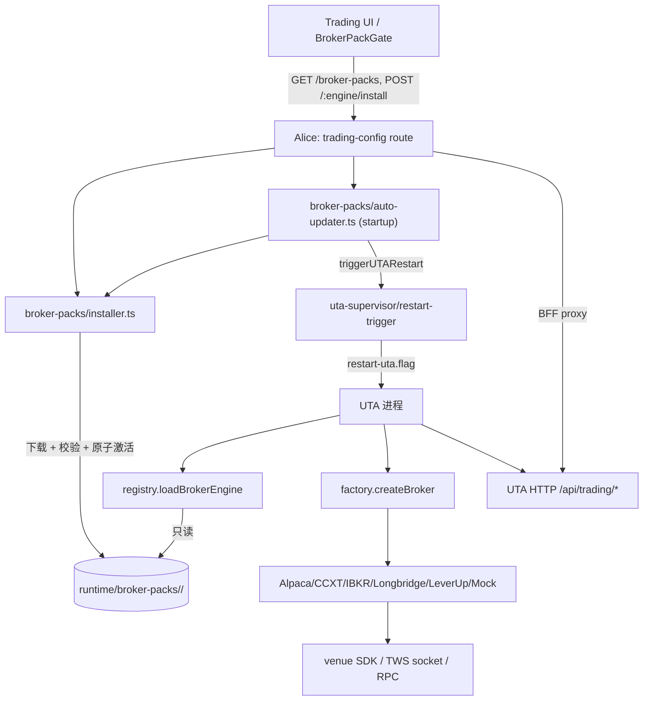

# 07 — Broker 抽象层、适配器与 Broker Pack（UTA 重构调查报告）

> 摘要（≤10 行）
> 本区域覆盖三件事：UTA 与 broker 之间的 `IBroker` 接口契约；六个内置适配器（Alpaca / CCXT / IBKR / Longbridge / LeverUp / Mock）的具体行为与能力差异；以及把前五个适配器打包成可选「Broker Pack」的安装、激活、加载、升级与验证链路。
> 核心事实：UTA Core 不内嵌任何 live broker SDK，Mock 是唯一内置引擎（`docs/broker-packs.md:8-27`）；Pack 的模块契约由 `BROKER_PACK_API_VERSION` 治理，而非产品版本相等（`src/core/broker-packs.ts:11`、`services/uta/src/domain/trading/brokers/registry.ts:118-128`）。
> 接口面在 `packages/uta-protocol/src/types/broker.ts:479-622`，共 29 个成员（19 个必需 + 10 个可选），另有一个不在这份接口里的 `BrokerResearch` 结构化扩展（`packages/uta-protocol/src/broker-research.ts:21`）。
> 适配器之间的能力差异远大于接口表面的同构性：只有 Mock/CCXT/Alpaca/IBKR 有 `getOpenOrders`，只有 Mock/CCXT/Alpaca 有 `getHistorical`，只有 IBKR/Alpaca 有 `expandContract`，只有 CCXT 声明多 sub-account。
> 潜在破坏性行为差异集中在 TP/SL：IBKR 与 CCXT 拒绝、Longbridge 静默丢弃、Mock 记录不使用、Alpaca/LeverUp 真正映射到 venue。
> Pack 生命周期是「Alice 安装 → UTA 只读解析」的单向数据流（`src/services/broker-packs/installer.ts:86`、`services/uta/src/domain/trading/brokers/registry.ts:86-107`），跨进程通过 `active.json` 指针与 UTA 重启衔接（`src/services/uta-supervisor/restart-trigger.ts`）。
> 最重的技术债：pack wrapper 是 9 行的源码转发壳（`packages/uta-broker-ccxt/src/index.ts:1-9`），Pack 的二进制内容其实是 UTA 源码的 tsup 打包结果，契约边界与实际耦合度不匹配。

---

## 1. 概览与职责边界

### 1.1 本区域负责什么

- **broker 接口契约的消费边界。** `IBroker` 及其全部伴生类型（`Position`、`OpenOrder`、`AccountInfo`、`Quote`、`MarketClock`、`BarParams`、`Bar`、`AccountCapabilities`、`BrokerError`、`SubAccountRef`、`BrokerConnectionStateEvent`、`PlaceOrderResult`、`PlaceOrderLeg`、`ContractExpansion`、`OptionGridEntry`、`ExpandContractFilters`、`TpSlParams`、`BrokerConfigField`）定义于 `packages/uta-protocol/src/types/broker.ts`，`services/uta/src/domain/trading/brokers/types.ts` 只是 re-export shim（该文件全文 7 行）。
- **六个适配器的行为。** Alpaca、CCXT、IBKR、Longbridge、LeverUp 五个 live 适配器与 Mock 一个内置适配器。目录总规模约 14,780 行（含 spec，`services/uta/src/domain/trading/brokers/**`）。
- **引擎注册与工厂。** `registry.ts` 负责「engine 标识 → 可执行模块」，`factory.ts` 负责「UTAConfig → preset 校验 → engine 配置 → IBroker 实例」。
- **Preset 目录（用户可选的账户类型）。** `packages/uta-protocol/src/brokers/preset-catalog.ts` 的 11 个 preset → 5 个引擎的映射，以及 `toEngineConfig` 这层「表单语义 → 引擎语义」翻译。
- **Broker Pack 的打包产出。** `packages/uta-broker-*` wrapper workspace、`scripts/build-broker-packs.ts`、`scripts/verify-broker-packs.ts`、`scripts/broker-pack-upgrade-smoke.ts`、Dockerfile 与 desktop 打包的 SDK 泄漏断言。
- **Alice 侧的安装与自动更新。** `src/services/broker-packs/{installer,auto-updater,requirements}.ts`、`src/core/broker-packs.ts`（共享的安装态契约）、`src/core/broker-pack-catalog.ts`（发布目录形状）、`src/webui/routes/trading-config.ts:92-172`（HTTP 面）。
- **共享的工具模块。** `contract-builder.ts`（`buildContract` 57、`buildPosition` 109）、`fuzzy-rank.ts`（`fuzzyRankContracts` 75）、`ccxt/ccxt-contracts.ts`、`ccxt/ccxt-types.ts`、`ccxt/overrides.ts`、`ccxt/exchanges/{bybit,bitget,hyperliquid}.ts`。

### 1.2 不负责什么

- **合约解析与 aliceId 语义的完整规则。** 本报告只描述每个 broker 的 `getNativeKey`/`resolveNativeKey` 形态与 hub 语义入口；aliceId 拼接、symbol 归一化规则、asset class 判定详见 `04-market-data-contracts-fx.md`。
- **订单状态机及同步轮询。** `OpenOrder`/`OrderState` 到 UTA git 层的转换、`[sync]`/`[observed]` 语义、pending 接管详见 `03-account-orders-positions.md`。
- **staging / commit / push / 审批。** 本报告只在与 broker 写路径交汇处（`_resolveWriteSubAccount`、sub-account 校验）提及，详见 `05-staging-approval-ledger.md`。
- **快照、guard 管线、健康状态机。** `_callBroker`、`UTAReach` 阶梯、`CONNECT_GRACEFUL` 等 UTA 内部机制详见 `06-snapshots-and-guards.md`。
- **Alice 客户端与 UI。** `src/services/uta-client/`、`ui/src/pages/TradingPage.tsx`、`ui/src/hooks/useBrokerPackReadiness.ts` 的消费者视角详见 `08-alice-consumers-and-ui.md`。
- **IBKR 协议实现的内部结构。** `packages/ibkr` 是 245 文件的 TWS API 端口，本报告只把它当作 IBKR 适配器的传输层，描述其对外行为（连接语义、请求超时、死连接信号），不展开 protobuf/帧解码细节。

### 1.3 上下游

| 方向 | 对方 | 契约 |
|---|---|---|
| 上游 | `packages/uta-protocol` | `IBroker` 接口、preset 目录、`BrokerResearch`、`BrokerError` 类 |
| 上游 | `@traderalice/ibkr` | `Contract`/`Order`/`OrderState`/`Execution`/`OrderCancel`/`ContractDetails` 数据模型 |
| 上游 | `src/core/{broker-packs,broker-pack-catalog,paths,config,sealing,version}.ts` | 安装态解析、路径、账户配置与封印 |
| 上游 | 各 broker 官方 SDK（ccxt / @alpacahq/alpaca-trade-api / longbridge / viem / TWS 自研端口） | venue 协议 |
| 下游 | `UnifiedTradingAccount` | 通过 `IBroker` 调用全部能力；负责 aliceId 盖章、健康跟踪、写前 sub-account 校验 |
| 下游 | `uta-manager` → `main.ts` | `createBroker` 装配、catalog 定时刷新（`services/uta/src/main.ts:133-141`，周期 6h 见 `:39`） |
| 下游 | Alice `installer` / `auto-updater` | 写入 `runtime/broker-packs/<engine>/` 并在必要时触发 UTA 重启 |
| 下游 | HTTP `/api/trading/*` | 经由 `routes-trading.ts` 暴露 search/quote/expand/order-book/option 研究等（如 `:330-346`、`:348-361`） |

---

## 2. 功能清单

### 2.1 IBroker 接口契约（每个成员的语义与可选性）

接口定义在 `packages/uta-protocol/src/types/broker.ts:479-622`（该类型文件共 622 行）的核心段落。契约表如下（「必需」= 接口上无 `?`；共 29 个成员 = 19 必需 + 10 可选）：

| 成员 | 行 | 必需 | 语义与约束 |
|---|---|---|---|
| `id` | 482 | 是 | 账户唯一 id，如 `alpaca-paper`；`readonly` |
| `label` | 485 | 是 | 展示名；`readonly` |
| `brokerEngine?` | 487 | 否 | 运行时适配器身份。**接口上是可选的**，但五个 live 适配器都在类字段上声明（如 `AlpacaBroker.ts:135`、`CcxtBroker.ts:227`、`IbkrBroker.ts:106`、`LongbridgeBroker.ts:155`、`LeverupBroker.ts:100`、`MockBroker.ts:181`） |
| `meta?` | 490 | 否 | broker 私有元数据；CCXT 用 `CcxtBrokerMeta`（`CcxtBroker.ts:230`），LeverUp 用 `{ engine: 'leverup' }`（`LeverupBroker.ts:103`） |
| `init()` | 494 | 是 | 建立连接并完成就绪握手；失败必须是 `BrokerError('CONFIG'|'AUTH')` 或可重试的 transient |
| `close()` | 495 | 是 | 释放资源。**六个适配器里有四个是空实现**：Alpaca 无 SDK close（`AlpacaBroker.ts:211-213`）、CCXT 注释说明通常无需关闭（`CcxtBroker.ts:415-417`）、Longbridge SDK context 随 Rust handle GC（`LongbridgeBroker.ts:230-233`）、LeverUp viem 无 close（`LeverupBroker.ts:157-159`） |
| `setConnectionStateListener?` | 498-500 | 否 | 推送式连接信号；**只有 IBKR 实现**（`IbkrBroker.ts:165`）。事件语义见 `broker.ts:423-428`：`dead` 权威、`restored` 只是重试提示、`alive` 必须完成重连握手后才发 |
| `searchContracts(pattern)` | 504 | 是 | 合约搜索，返回 `ContractDescription[]` |
| `getContractDetails(query)` | 505 | 是 | 单合约详情；查不到返回 `null`（而非抛错） |
| `expandContract?(nativeKey, filters?)` | 513 | 否 | Hub → leaves 展开：bond issuer、FX family、option chain、futures months。只有 IBKR（`IbkrBroker.ts:391`）与 Alpaca（`AlpacaBroker.ts:702`）实现 |
| `refreshCatalog?()` | 524 | 否 | 本地枚举缓存刷新；doc 明确「失败保留旧缓存并向上抛」。Alpaca（`:223`）、CCXT（`:425`）、Mock 未实现（MockBroker 无此方法）有实现差异——见 §8 |
| `placeOrder(contract, order, tpsl?)` | 528 | 是 | 下单；返回 `PlaceOrderResult`。**TP/SL 支持度是适配器间最大行为裂缝**，见 §2.3 |
| `modifyOrder(orderId, changes)` | 529 | 是 | 改单 |
| `cancelOrder(orderId, orderCancel?)` | 530 | 是 | 撤单；`OrderCancel` 来自 IBKR 模型 |
| `closePosition(contract, quantity?)` | 531 | 是 | 平仓；`quantity` 省略 = 全平 |
| `listSubAccounts?()` | 543 | 否 | 钱包枚举；省略即视为单一隐式 `default`。只有 CCXT 实现（`CcxtBroker.ts:751`） |
| `subAccountForContract?(contract)` | 553 | 否 | 工具 → 钱包的路由判定；只有 CCXT 实现（`:758`） |
| `getAccount(subAccountId?)` | 562 | 是 | 账户权益；省略 `subAccountId` = 聚合 |
| `getPositions(subAccountId?)` | 568 | 是 | 持仓；省略 = 全部钱包 |
| `getOrders(orderIds)` | 569 | 是 | 批量按 id 查（含已完成） |
| `getOrder(orderId, symbolHint?)` | 577 | 是 | 单笔查询。`symbolHint` 的用途写在 doc 里：CCXT 这类 symbol-scoped 查询需要它在进程重启后仍能查单 |
| `getOpenOrders?()` | 586 | 否 | 「该账户上所有未结订单」——外部订单观测面。**只有 CCXT（`:1193`）、Alpaca（`:539`）、IBKR（`:772`）、Mock（`:455`）实现**；Longbridge/LeverUp 未声明，观测能力自动降级为 off |
| `getQuote(contract)` | 587 | 是 | 报价 |
| `getMarketClock()` | 588 | 是 | 交易时钟 |
| `getHistorical?(contract, params)` | 597 | 否 | 历史 K 线。CCXT 在 doc 里被点名要求把 `BarParams.interval` 映到原生 bar size |
| `assetClassFor?(contract)` | 604 | 否 | venue 决定的资产类别；doc 明确 CCXT 必须一律返回 crypto（"a crypto exchange's AAPL is a synthetic / custodial token"）。**只有 CCXT 实现**（`:1316`，恒返回 `'crypto'`）——Alpaca/IBKR 未实现，消费方退回 secType 启发式 |
| `getCapabilities()` | 611 | 是 | 能力矩阵，见 §2.4 |
| `getNativeKey(contract)` | 617 | 是 | 合约 → broker 原生唯一键 |
| `resolveNativeKey(nativeKey)` | 621 | 是 | 原生键 → 可交易合约 |

接口外的结构扩展：`BrokerResearch`（`packages/uta-protocol/src/broker-research.ts:21-25`）声明 `getOptionContracts?`、`getOptionChain?`、`getOrderBook?`，并在同文件头注释中标为「Optional structural capabilities: old broker packs continue to load」——这是 Pack API 版本治理的显式体现。实现方：Alpaca（`AlpacaBroker.ts:695-698`、`:724`）、CCXT（`getOrderBook` `:1384`、`getFundingRate` `:1360` 不在 `BrokerResearch` 但在 `ccxt-tools.ts:13-17` 的鸭子类型里）。HTTP 层用 `as` 强转访问（`services/uta/src/http/routes-trading.ts:341`、`:355`），未命中时抛「is not supported by this broker pack.」。

### 2.2 引擎注册与工厂装配

**`loadBrokerEngine(engine)`**（`registry.ts:58-67`）带进程内缓存 `cache`（`:52`，`Map<BrokerEngine, Promise<BrokerEngineEntry>>`），失败时删除条目以便重试（`.catch(err => { cache.delete(engine); throw err })`）。`clearBrokerEngineCache()`（`:54`）**在生产代码中无调用方**，只有 spec 用（`registry.spec.ts:107`）——意味着安装/修复后必须重启 UTA 进程才能换掉已缓存的引擎，这也是 installer 每次安装都调 `triggerUTARestart` 的原因（见 §2.8）。

**`loadBrokerEngineUncached`**（`:69-107`）的解析顺序：

1. `engine === 'mock'` → 直接返回内置 `MockBroker`（`:70-76`），这是唯一不经过 Pack 的路径。
2. 引擎名不在 `INSTALLABLE_BROKER_ENGINES` → 抛 `Unknown broker engine`（`:77`）。
3. 若 `OPENALICE_BROKER_PACK_PREFER_WORKSPACE=1` **且** `OPENALICE_LAUNCHER=dev` 或 `NODE_ENV=test` **且** workspace 加载被允许 → 走源码 wrapper（`:78-82`）。
4. `resolveActiveBrokerPack(engine)`（`:85-93`）：指针/清单非法一律包成 `BrokerPackUnavailableError`，消息前缀 `Installed broker pack "<engine>" is invalid:`。
5. 有激活 release → 动态 `import(pathToFileURL(installed.entry).href)` + `validateModule`；导入失败包成 `BrokerPackUnavailableError`（`:94-101`）。
6. 无激活 release 但 workspace 允许 → `loadWorkspacePack`（`:103`、定义 `:109-116`），从 `appResourcesHome` + `workspaceEntries` 解析。
7. 否则 `throw new BrokerPackUnavailableError(engine)`（`:105`），消息由构造函数给出「not installed. Install it from the Trading screen.」（`:35-42`）。

**`validateModule`**（`:118-128`）四项检查，顺序固定：模块是对象 → `BROKER_PACK_API_VERSION` 相等（`:121`）→ `BROKER_ENGINE` 相等（`:124`）→ `configSchema` 与 `createBroker` 存在（`:125-127`）。检查失败的消息文本被 spec 逐个断言（`registry.spec.ts:107-124`）。

**`workspacePacksAllowed`**（`:131-136`）：`ALLOW_WORKSPACE=1` 强制 true、`=0` 强制 false，否则 `NODE_ENV=test || LAUNCHER=dev`。与之**逻辑重复**的还有 installer 侧的 `workspacePacksAvailable`（`installer.ts:304-310`），两者代码逐行等价但共 12 行重复——见 §8。

**`createBroker(config, services?)`**（`factory.ts:27-47`）流程：`getBrokerPreset(config.presetId)`（`:28`，未知 preset 抛错）→ `preset.zodSchema.parse(config.presetConfig)`（`:29`）→ `preset.toEngineConfig(presetData)`（`:30`）→ `loadBrokerEngine(preset.engine)`（`:32`）→ `entry.configSchema.parse(engineConfig)`（`:33`，第二道校验）→ `entry.createBroker({ id, label, brokerConfig: { ...engineConfig, keyless: config.keyless ?? false } })`（`:34-40`）→ 若传入了 `fxService` 且实例上有 `setFxService` 函数则调用（`:44-46`）。

这里的关键设计：**`UTAConfig.presetId` 是磁盘记录与引擎实现的唯一纽带**（文件头注释 `factory.ts:1-14` 明说「the engine identity is never serialized directly」）。`presetId` 是字符串而非枚举（`src/core/config.ts:454`），所以删掉一个 preset 会让旧账户变成「unsupported-preset」状态而不是启动失败（消费方处理见 `08-alice-consumers-and-ui.md`）。

### 2.3 TP/SL（`tpsl` 参数）的五种处理策略

这是适配器间最危险的行为分叉，逐项列出：

| 适配器 | 行为 | 证据 |
|---|---|---|
| Alpaca | **真映射**。两个 leg → `bracket`，单 leg → `oto`；`take_profit.limit_price` / `stop_loss.stop_price(+limit_price)`；并把子单 id 以 `legs` 回传（`PlaceOrderLeg`）。crypto 路径明确拒绝 TP/SL | `AlpacaBroker.ts:333-352`、crypto 拒绝在 `:300` |
| CCXT | **默认 loud-refuse**。没有 per-exchange `placeOrderWithTpSl` override 时返回 `success:false` 并解释「refusing rather than risking a silently unprotected position」；注释记录了 okx spot 上参数被 venue 静默丢弃的真实事故 | `CcxtBroker.ts:555-574`，attach 分支 `:618-621` |
| IBKR | **loud-refuse**：「attached TP/SL (bracket) is not implemented yet — refusing to place a naked entry」 | `IbkrBroker.ts:485-489` |
| Longbridge | **静默忽略**。签名是 `placeOrder(contract, order, _tpsl?)`，下划线前缀表明参数被丢弃 | `LongbridgeBroker.ts:271` |
| LeverUp | **真映射**。`stopLoss`/`takeProfit` 转 wei 进 `OpenDataInput`，由链上合约执行 | `LeverupBroker.ts:253-254`、`:286-287` |
| Mock | **记录但不兑现**。`_record('placeOrder', [contract, order, tpsl])` 只进调用日志，撮合逻辑不看 tpsl | `MockBroker.ts:278-279` |

对重构的含义：`TpSlParams` 是接口上所有适配器共享的参数，但「不支持的 venue」有两种截然不同的收场（拒绝 vs 静默），Longbridge 的静默丢弃会产生「账本说 protected、交易所说 naked」的失败模式——这正是 CCXT 注释里描述的同一类事故（`CcxtBroker.ts:555-560`）。

### 2.4 能力矩阵（`getCapabilities` 与可选方法）

| 能力 | Alpaca | CCXT | IBKR | Longbridge | LeverUp | Mock |
|---|---|---|---|---|---|---|
| `supportedSecTypes` | `STK, CRYPTO`（`:658-664`） | `CRYPTO, CRYPTO_PERP`（`:1320`） | `STK, OPT, FUT, FOP, CASH, WAR, BOND`（`:874`） | `STK`（`:676`） | `CRYPTO_PERP`（`:522`） | `DEFAULT_CAPABILITIES`：`STK, CRYPTO`（`MockBroker.ts:104-108`） |
| `supportedOrderTypes` | `MKT, LMT, STP, STP LMT, TRAIL` | `MKT, LMT` | `MKT, LMT, STP, STP LMT, TRAIL, MOC, LOC, REL` | `MKT, LMT, STP, STP LMT, TRAIL` | `MKT` | `MKT, LMT, STP, STP LMT` |
| `historicalBars` | `supported, quality:'iex', CRYPTO:'realtime'` | `supported, quality:'realtime'` | **未声明**（无 `getHistorical`） | **未声明** | **未声明** | `supported, quality:'realtime'` |
| `getHistorical` | 有（`:597`） | 有（`:1254`） | 无 | 无 | 无 | 有（`:492`，确定性上漂移数据） |
| `getOpenOrders` | 有（`:539`） | 有（`:1193`） | 有（`:772`，仅本 clientId） | 无 | 无 | 有（`:455`） |
| `expandContract` | 有（`:702`，仅 STK，必须 `expiry` 且 `YYYYMMDD`） | 无 | 有（`:391`，conId 或 `issuer:`） | 无 | 无 | 无 |
| `assetClassFor` | 无 | 有，恒 `'crypto'`（`:1316`） | 无 | 无 | 无 | 无 |
| `refreshCatalog` | 有（`:223`） | 有（`:425`） | 无 | 无 | 无 | 无 |
| `listSubAccounts` | 无 | 有（`:751`） | 无 | 无 | 无 | 无 |
| `setConnectionStateListener` | 无 | 无 | 有（`:165`） | 无 | 无 | 无 |
| `setFxService`（非接口，鸭子类型） | 无 | 无 | 无 | 有（`:170`） | 无 | 无 |
| `getOptionContracts/Chain` | 有（`:695-698`） | 无 | 无（改为 `expandContract` 的 grid） | 无 | 无 | 无 |
| `getOrderBook` | 有，仅 crypto（`:724`） | 有（`:1384`） | 无 | 无 | 无 | 无 |
| `getFundingRate` | 无 | 有（`:1360`） | 无 | 无 | 无 | 无 |
| `getNativeKey` 策略 | ticker（`:683`，`resolveSymbol ?? symbol`） | CCXT unified symbol（`:1337`，`localSymbol || symbol`） | conId，或 bond 的 `issuer:<id>`（`:891-895`） | symbol（`:685`） | `localSymbol || symbol`（`:531`） | `localSymbol || symbol`（`:525`，注释解释为什么优先 localSymbol：BTC spot 与 perp 共存） |
| `resolveNativeKey` 失败语义 | 构造合约（`:687`） | markets 查不到时给「skeletal contract」，下游 loud-fail（`:1341-1356`） | 构造（`:898`） | 构造（`:690`） | pair 表查不到时合成最小合约，交易时再报 unknown pair（`:535-540`） | 先查 `_contractRegistry`，保住 secType/strike/multiplier（`:533`） |

### 2.5 生命周期与连接行为

| 适配器 | `init()` 行为 | 重试策略 | 就绪判定 |
|---|---|---|---|
| Alpaca | 校验 apiKey/apiSecret（缺失 → `CONFIG`）；构造 SDK client；`getAccount()` 探活 | `MAX_INIT_RETRIES=5`、`MAX_AUTH_RETRIES=2`、`INIT_RETRY_BASE_MS=1000`、指数退避（`:159-161`、`:178-206`）；认证类错误在第 2 次直接抛 `AUTH` | 首账户读取成功；随后**非阻塞**触发 `refreshCatalog`，失败只 warn（`:185-189`） |
| CCXT | 非 keyless 时 `checkRequiredCredentials()`，失败消息列出 required/missing（`:331-343`）；包裹 `fetchMarkets` 并行化 types 与重试；`setSandboxMode`/`enableDemoTrading` 的失败转为 `CONFIG` | `MAX_INIT_RETRIES` 与 `INIT_RETRY_BASE_MS` 从 env 读，默认 8 / 500ms（`ccxt-types.ts:57-75`）；双重重试（外层每 type，内层每 attempt，`:365-391`） | `loadMarkets` 全部 type 成功 |
| IBKR | 若 `bridge.connectionDead` 且 socket 自称 connected → 强制 disconnect（处理 half-open，`:184-189`）；已连接则幂等返回（`:190`）；`waitForConnect`；`reqMarketDataType(3)` 开延迟数据兜底（`:203-206`）；解析 accountId，缺失 → `CONFIG`；`startAccountSubscription` + `waitForAccountReady` + `markAlive` + `startHeartbeat` | 无显式重试循环；失败经 `BrokerError.from(err,'NETWORK')` 交给 UTA 恢复环 | 账户订阅首轮下载完成 |
| Longbridge | 三段凭证非空校验（`CONFIG`）；`Config.fromApikey` + `TradeContext`/`QuoteContext`；`accountBalance()` 作最轻探针 | 同 Alpaca 的三常量（`:176-178`），认证错误第 2 次直接 `AUTH` 并提示 token ~90d 需手转（`:205-215`） | `accountBalance()` 成功 |
| LeverUp | `accountFromPrivateKey` 失败 → `AUTH`；构造 relayer/reader client；`publicClient.getChainId()` 探 RPC，失败 → `NETWORK`（`:142-147`） | 无重试；`ensureInit()` 在每次调用前 guard 未初始化（`:160-164`） | RPC 可达 |
| Mock | `_record('init')` + `_checkFail('init')`（`:256`） | 无 | 立即 |

IBKR 独有的存活机制：`_ensureAlive()`（`:141-145`）与 `_ensureWriteAlive()`（`:151-159`，写前在同一个有序 socket 上做 `requestCurrentTime`，超时 `WRITE_LIVENESS_TIMEOUT_MS=3000`，`:49`）。心跳定时器 45s（`:171-179`），失败调 `bridge.markDead`。这一层的设计动机写在 `IbkrBroker.ts:137-140` 与 `:149-150` 的注释里：账户面是缓存支撑的，没有这道闸门死 socket 会继续供旧数据并接受永不发出的订单（issue #294）。

`RequestBridge`（`ibkr/request-bridge.ts:43`）的三个超时常量：`DEFAULT_TIMEOUT_MS=10_000`（`:39`）、`SNAPSHOT_TIMEOUT_MS=12_500`（`:40`）、`ACCOUNT_READY_TIMEOUT_MS=20_000`（`:41`）。死连接状态由 `connectionDead_`（`:464`）配合 `markDead`（`:466`）/`markAlive`（`:471`）管理。

### 2.6 合约搜索（三种模型）

- **Alpaca = EnumeratingCatalog**：`refreshCatalog` 拉 `/v2/assets` 过滤 `tradable !== false` 存内存（`:223-239`）；`searchContracts` 用共享 `fuzzyRankContracts`（`fuzzy-rank.ts:75`）；catalog 尚未加载时回退到「echo 一个大写 symbol」的旧行为（`:241-250`）。排序分级写在 `fuzzy-rank.ts:52-71`（100 精确 / 80 前缀 / 70 名字词首 / 50 整词 / 30 子串 / 20 quote 币种）。
- **CCXT = EnumeratingCatalog + 严格预过滤**：候选集要求 `active !== false`、base/quote 均存在、quote ∈ {USDT, USD, USDC}（`CcxtBroker.ts:441-450`）；预排序 swap > future > spot > option、USDT > USD > USDC（`:456-465`）；然后交给 `fuzzyRankContracts`；单个 market 因缺 expiry/multiplier 无法构造合约时 warn 跳过而非整批失败（`:483-492`）；最后给所有结果统一附 `derivativeSecTypes`（`:497-508`）。
- **IBKR = SearchingCatalog**：依赖 `reqMatchingSymbols` 服务端模糊搜索，无本地 catalog 也无 `refreshCatalog`。
- **Longbridge = 无搜索端点**：`staticInfo()` 只接受精确 symbol，`searchContracts` 直接把 pattern echo 成一个契约猜测（默认补 `.US` 后缀）（`LongbridgeBroker.ts:237-244`）。
- **LeverUp = 静态 pair 表**：`getPairs(network)` 过滤 `base`/`symbol` 子串（`:169-181`）；pair 表在 `others/leverup/pairs.ts:34`（主网，22 个 pair 含 500x 高杠杆特殊 pair）。
- **Mock = 硬编码列表** + `_checkFail` 可注入失败。

### 2.7 订单与账户读路径的特殊处理

- **CCXT spot 持仓合成**：`fetchPositions()` 只返回衍生品；`fetchAssetHoldings` 从 `fetchBalance` 把非稳定币余额合成 `side:'long'` 的持仓，`avgCost` 用 markPrice 占位并标 `avgCostSource:'wallet'`，让 UTA 用 wallet ledger 覆盖（`CcxtBroker.ts:812` 起；同文件 `:813-816` 的注释说明 ANG-111 的同币聚合规则：同一资产在多个钱包只算一条）。
- **CCXT 未结订单读的「宽松 / 严格」开关**：override 上的 `strictOpenOrderReads`（`overrides.ts` 接口，bitget 启用 `bitget.ts:36-37`）决定 `fetchOpenOrders` 失败时抛错还是降级成 `[]` 并只 warn 一次（`CcxtBroker.ts:1209-1217`）。接口注释写明动机：「a partial list is actively unsafe for external-order observation」。
- **CCXT 子账户**：`resolveSubAccounts()`（`:747-749`）在 override 提供 `subAccounts` 时返回多钱包（binance spot/derivatives 定义在 `overrides.ts:223-229`、bitget 在 `exchanges/bitget.ts:39-42`），否则单 `UNIFIED_SUBACCOUNT`（`:58`）；`subAccountForContract` 依 `secType === 'CRYPTO_PERP' || 'FUT'` 选 derivatives 否则 spot（`:758-767`）；`scopedSubAccounts` 对未知 id 抛 `BrokerError('CONFIG')` 并列出合法 id（`:769-778`）。
- **Longbridge 多币种折叠**：`getAccount` 走 `foldBalancesToBase`（`:366-370`、`:379` 起），基准选 HKD；**无 FxService 时退化为「取最大单一币种桶」**（`:399-415`），注释承认「loses the small-currency tail but doesn't lie about the unit」。
- **LeverUp 订单追踪**：无 venue 端订单列表，靠 `orderTracking: Map<inputHash, OrderTrackingRecord>`（`:112`）；`getOrder` 只在 `Submitted` 时向 relayer 查状态并就地更新（`:461-476`）；网络故障时保留旧状态（`:472-475` catch 注释）。
- **Mock 模拟器控制面**：`setMarkPrice`（`:559`）、`tickPrice`（`:566`，无 markPrice 时抛错）、`fillOrder`（`:581`）、`cancelPendingOrder`（`:624`）、`externalDeposit`（`:675`）、`externalWithdraw`（`:701`）、`externalTrade`（`:718`）、`getSimulatorState`（`:761-799`，返回 cash/markPrices/positions/pendingOrders）。挂单在价格穿越时自动撮合（`:801` 起的 walk + `:835` 调 `fillOrder`）。故障注入：`_checkFail`（`:223-231`）支持按方法名与次数两种注入。HTTP 面在 `services/uta/src/http/routes-simulator.ts`（`:120` state、`:127-130` markPrice、`:141-144` tick、`:157-160` fill、`:174` cancel、`:185-188` deposit、`:199-202` withdraw）。

### 2.8 Broker Pack 的完整生命周期

这是本区域第二条主线。角色分工：**Alice 安装，UTA 只解析**（`docs/broker-packs.md:94`）。

**阶段 A — 构建（仓库内）**：`pnpm broker-packs:build`（`package.json:31`）= turbo 构建五个 wrapper → `tsx scripts/build-broker-packs.ts` → `pnpm broker-packs:verify`。构建脚本对每个 engine 执行 `pnpm deploy --prod --config.node-linker=hoisted`（`build-broker-packs.ts:101-113`），`sanitizeDeployment`（`:118` 起）删除 `pnpm-lock.yaml`/`pnpm-workspace.yaml`/`.modules.yaml`/`.pnpm-workspace-state-v1.json`/`node_modules/@traderalice` 与虚拟存储里的 `@traderalice+*`，并把 package.json 重写成只含非 `@traderalice` 依赖的发布形态（`:120-141`、`externalDependencies` `:145`）。用同步 tar 写包（`:59-66`，注释解释 Windows 上异步 tar 文件写入会留下未决 top-level await）。产出目录名由 `brokerPackCatalogFileName`/`brokerPackArchiveFileName` 决定（`src/core/broker-pack-catalog.ts:28`、`:32`），形状为 `OpenAlice-Broker-Packs-<version>-<platform>-<arch>.json` 与 `OpenAlice-Broker-<engine>-<version>-<platform>-<arch>.tgz`。`requirementsFor`（`:151-158`）在 Linux 上给 longbridge 打 glibc ≥ 2.39 标记。

**阶段 B — 校验（构建后）**：`scripts/verify-broker-packs.ts` 检查目录里每个 engine 恰好一次（`:33-40`）；带 `--compiled` 时用 `scripts/bun-compile-options.ts` 编一个探针，对每个 engine 用合成配置 `createBroker` 并断言 `getAccount` 存在（`:53-58`）；随后（`:180-186`）校验归档内不含 `@traderalice+*` 工作区路径；`verifyModuleInCleanProcess`（`:198-219`）在干净 Node 进程里 import entry 并核对三个导出。

**阶段 C — 安装（Alice 运行时）**：UI/HTTP `POST /broker-packs/:engine/install`（`src/webui/routes/trading-config.ts:162-172`）→ `installBrokerPack(engine)`（`installer.ts:86-157`）。步骤：

1. 建 engine 根目录并取 `.install.lock`（`:87-90`、`acquireInstallLock` `:331` 起，锁带 `owner.json` 记录 pid；可恢复判定见 `isRecoverableInstallLock` `:375` 起，含 pid 存活探测与 `INSTALL_LOCK_STALE_MS=10min` 兜底）。
2. 读「绑定目录」（dev CLI 场景，`readBoundCatalog` `:403-417`，读 `$OPENALICE_APP_HOME/broker-pack-source.json` 并校验 commit 是 40 位 hex 且与 catalog 的 `sourceCommit` 一致），否则用 `resolveCatalogUrl()`（`:296-302`）。
3. 取 catalog：`fetchCatalog`（`:160-165`，20s 超时）→ `validateCatalog`（`:167-181`，要求 `schemaVersion===1`、`openAliceVersion` 等于当前版本、platform/arch 匹配、packs 非空且 engine 不重复）。
4. `validateAsset`（`:183-191`）：engine 合法、**`asset.version === currentVersion`（`:185`）**、`apiVersion` 匹配、文件名无路径成分、sha256 为 64 位 hex、size 是安全整数且 ≤ `MAX_PACK_BYTES=512MiB`、entry 不以 `/` 开头且不含 `..`。
5. `assertBrokerPackRequirements`（`requirements.ts:8-24`）：只有 catalog 声明了 `requirements.libc` 才检查；非 Linux 或缺 glibc 或版本低于 `minVersion` 都拒绝，消息带实际报告值。
6. 下载：`download`（`:268-276`）用 `AbortSignal.timeout(120_000)`，先校验 `content-length` 不超过 `expectedSize + 1024`，再流式落到 `flags:'wx'` 的新文件，最后核对文件大小。
7. 校验 sha256（`:109-113`），失败即抛。
8. `tar.x` 解到 staging 的 `payload`（`:114-116`，`strict:true, preservePaths:false`）。
9. `validateExtractedPackage`（`:278-294`）：realpath 后 package.json 与 entry 都必须在解包根内、package 名严格等于 `@traderalice/uta-broker-<engine>`、版本等于 asset 版本。
10. 写 `broker-pack.json` 清单（`:122-132`，字段见 §3.2），`contentId` = sha256 前 16 位（`:119`）。
11. `activateImmutableRelease`（`:193-231`）：若当前 active 的 contentId/entry/version 全等则**复用**；否则若目标 release 目录已存在且 `releaseMatches`（`:233-247`）则复用；否则 `rename(extracted, preferredRoot)`；rename 因目标已出现而失败时，再确认一次是否匹配，若目标仍不存在则重抛；最后走 `nextRepairReleaseId`（`:249-257`，`<base>-repair-<ts>-<pid>-<n>`，最多试 100 次）生成全新不可变 release。注释明确「永远不原地修改损坏的不可变 release」。
12. 原子替换 `active.json`：写 `<active>.<pid>.tmp` 再 `rename`（`:143-146`）。
13. `finally` 清理 staging 与锁（`:154-156`）。

**阶段 D — 加载（UTA 进程内）**：见 §2.2 步骤 4-5。UTA 只读 `active.json` + `releases/<id>/broker-pack.json`，没有任何写路径。

**阶段 E — 自动更新（Alice 启动时）**：`scheduleInstalledBrokerPackReconciliation()`（`auto-updater.ts:86-118`）由 `src/main.ts:449` 调用，`setTimeout` 延迟 `STARTUP_RECONCILE_DELAY_MS=1500`（`:21`）。`reconcileInstalledBrokerPacks`（`:41-83`）先算 skip 原因（`:120-125`：`AUTO_UPDATE=0` / `NODE_ENV=test` / `LAUNCHER=dev`），再对全部 `INSTALLABLE_BROKER_ENGINES` 取状态，筛出 `updateAvailable && version` 的引擎，`Promise.allSettled` 并发安装，聚合 updated/failed；有更新且未禁用 restart 时调 `triggerUTARestart()`（`:75-77`）。**它只更新「已有 active 的 Pack」，从不静默新装**（`auto-updater.ts:1-8` 文件头注释 + `docs/broker-packs.md:110-119`）。

**阶段 F — 激活生效**：`notifyUTAReload()`（`trading-config.ts:29-40`）与 auto-updater 都走 `triggerUTARestart`（`src/services/uta-supervisor/restart-trigger.ts`，落 `data/control/restart-uta.flag`）。因为 `registry` 的模块缓存不会失效，**重启是契约的一部分，而不是实现细节**。

**阶段 G — 状态上报（UI 合同）**：`GET /broker-packs`（`trading-config.ts:92-155`）把持久化的 UTA 配置与「本机已装的 Pack」做 join，返回 `packs`（每个含 `requiredBy` 列表）与 `accounts`（每个精确一行）。账户状态机：`ready` / `needs-install` / `needs-repair` / `unsupported-preset`（`:110-140`）；`unsupported-preset` 分支在 `getBrokerPreset` 抛错时产生（`:132-145`）；`config.trading.keylessDataSources` 非空时把「<source> K-line vendor」计为 ccxt 的需求方（`:152-156`）。

### 2.9 发布与打包防线

- **release 工作流**：`.github/workflows/release.yml:836-889` 的 `build-broker-packs` job 跑 4 平台矩阵（macos-14 arm64 / macos-15-intel x64 / windows-latest x64 / ubuntu-latest x64），依次 `broker-packs:build`、`verify --compiled`、stable 渠道下 `upgrade-smoke --from <previous_tag>`，然后上传 artifacts（`if-no-files-found: error`）。
- **升级冒烟**：`scripts/broker-pack-upgrade-smoke.ts` 从上一 release 下载真实 Pack 作为种子（`:84-88`），断言它们被识别为可更新（`:91-98`），跑 `reconcileInstalledBrokerPacks({force:true, restart:false})`（`:99`），断言 updated 集合等于候选引擎集合（`:104-108`），断言每个 engine 的 active 已指向当前版本**且旧的不可变 release 目录仍存在**（`:110-121`），最后断言状态不再可更新（`:122-127`）。
- **desktop 包断言**：`scripts/assert-desktop-package.mjs:51-58` 的 `FORBIDDEN_BROKER_SDKS` 列出 `ccxt`、`longbridge`（4 个平台变体）、`@alpacahq/alpaca-trade-api`，与各自 pnpm 前缀。
- **Docker**：`Dockerfile:48-63` 先 `turbo run build --filter=!./packages/uta-broker-*`，再做三个 `pnpm deploy --prod` 闭包，最后 `find` 三个 node_modules 树里是否出现 ccxt / longbridge / @alpacahq 并 `exit 1`。
- **Bun 编译验收**：`docs/broker-packs.md:273-287` 说明 standalone 构建必须开 `autoloadPackageJson`（`scripts/bun-compile-options.ts`），否则编译后的可执行文件无法解析 Pack 物理 `node_modules`。

---

## 3. 数据与状态

### 3.1 Pack 的磁盘布局（Alice 写、UTA 读）

根路径为 `runtimePath('broker-packs')`（`src/core/paths.ts:51`），即 `<OPENALICE_HOME>/runtime/broker-packs/`。每个 engine 一个目录（`src/core/broker-packs.ts:74-77` 的 `brokerPackEngineRoot`/`brokerPackActivePath`/`brokerPackReleasesRoot`）：

| 路径 | 内容 | 生产者 |
|---|---|---|
| `<engine>/active.json` | 激活指针 | `installBrokerPack` 原子 rename（`installer.ts:143-146`） |
| `<engine>/releases/<openalice-version>-<content-id>/` | 不可变 release（`broker-pack.json` + `dist/index.js` + `package.json` + `node_modules/`） | `activateImmutableRelease` |
| `<engine>/releases/<...>-repair-<ts>-<pid>-<n>/` | 修复用独立 release | `nextRepairReleaseId`（`installer.ts:249-257`） |
| `<engine>/.install.lock/`（含 `owner.json`） | 安装互斥锁 | `createInstallLock`（`:357-366`） |
| `<engine>/.staging-<pid>-<ts>/` | 下载与解包的临时工作区 | `installBrokerPack`，`finally` 里删（`:93`、`:155-156`） |

### 3.2 三个 JSON 契约的字段表

**`active.json`（`BrokerPackActivePointer`，`src/core/broker-packs.ts:21-26`；校验 `parseActivePointer` `:138-149`）**：

| 字段 | 含义 | 约束 |
|---|---|---|
| `schemaVersion` | 契约版本 | 必须 `=== BROKER_PACK_SCHEMA_VERSION`（1，`:10`） |
| `engine` | 引擎名 | 必须等于所在目录名 |
| `release` | release 目录名 | 正则 `^[A-Za-z0-9._-]+$`（防路径穿越） |
| `activatedAt` | 激活时间（ISO 串） | 必须是字符串（不校验是否为合法时间） |

**`broker-pack.json`（`InstalledBrokerPackManifest`，`:28-37`；校验 `parseInstalledManifest` `:151-173`）**：

| 字段 | 含义 | 约束 |
|---|---|---|
| `schemaVersion` | 契约版本 | 必须 = 1 |
| `apiVersion` | Pack API 版本 | 必须 = `BROKER_PACK_API_VERSION`（1）；否则抛 `BrokerPackApiVersionMismatchError`（`:54-67`，`code=BROKER_PACK_API_VERSION_MISMATCH`，携带 `installedApiVersion`/`installedVersion`） |
| `engine` | 引擎名 | 必须匹配目录 |
| `version` | 产出该 Pack 的 OpenAlice 版本 | 非空字符串 |
| `entry` | 相对入口 | 非空字符串；解析后再做 child 检查 |
| `contentId` | 内容指纹 | 非空字符串，实测 = sha256 前 16 位（`installer.ts:119`） |
| `installedAt` | 安装时间 | 非空字符串 |
| `sourceUrl?` | 来源 URL | 可选（`installer.ts:130`） |

`resolveBrokerPackRelease`（`:100-136`）在解析时做四层防护：release id 正则、`assertChild` 校验 release 目录、realpath 后的二次 `assertChild`（防符号链接逃逸）、package.json 名与版本一致性（必须 `@traderalice/uta-broker-<engine>` 且版本 = manifest.version）、entry 必须在 release 内（同样 realpath 二次校验）。`assertChild`（`:175-179`）的判据是 `candidate === root || !candidate.startsWith(root + sep)` 即失败。

**发布目录（`BrokerPackReleaseCatalog`，`src/core/broker-pack-catalog.ts:18-25`；条目 `:7-16`）**：

| 字段 | 含义 | 约束 |
|---|---|---|
| `schemaVersion` | 固定 1 | `validateCatalog` 强制 |
| `openAliceVersion` | 目标产品版本 | 必须等于当前版本（`installer.ts:171`） |
| `platform` / `arch` | 目标平台 | 必须等于 `process.platform` / `process.arch` |
| `sourceCommit?` | dev 绑定提交 | 40 位 hex（`installer.ts:412`） |
| `generatedAt` | 生成时间 | — |
| `packs[]` | 资产数组 | engine 不得重复（`installer.ts:180`） |
| `packs[].{engine,version,apiVersion,file,sha256,size,entry}` | 单资产 | 见 `validateAsset` 的 8 条 |
| `packs[].requirements?.libc` | `{family:'glibc', minVersion}` | 仅 Linux 生效 |

### 3.3 适配器内存状态

| 适配器 | 关键内存态 | 生命周期 |
|---|---|---|
| Alpaca | `catalog` + `catalogBySymbol`（`:223-236`） | 进程内；6h cron 刷新（`services/uta/src/main.ts:133-141`） |
| CCXT | `markets`（loadMarkets 结果）、`orderSymbolCache: Map<orderId, symbol>`、`warnedOpenOrdersUnsupported` 一次告警标志、hyperliquid 的 `ABSTRACTION_MODE_TTL_MS = 5min` 模式缓存（`exchanges/hyperliquid.ts:48`） | 进程内；重启丢失（S8 场景专门验证此依赖，`docs/uta-live-testing.md:286-290`） |
| IBKR | `conIdContracts: Map<conId, Promise<Contract>>`（去重并发解析）、`optionMarkCache`（带 expiresAt 的 mark 与失败 entitlement 缓存）、`optionMarkRequests`、心跳定时器 | 进程内 |
| Longbridge | `fxService`（可选注入）、`tradeCtx`/`quoteCtx` | 进程内 |
| LeverUp | `orderTracking: Map<inputHash, OrderTrackingRecord>`、`schemaVariant: 'nested' \| 'flat'`（`:106` 附近） | 进程内；`schemaVariant` 是运行时自适应状态（见 §8） |
| Mock | `_positions`、`_orders`、`_markPrices`、`_contractRegistry`、`_cash`、`_realizedPnL`、`_nextOrderId`、`_accountOverride`、`_callLog`、`_failRemaining`、`_failMethods` | 进程内；dev server 重启即清空（`preset-catalog.ts:472-490` 的 preset hint 明说） |

**无任何适配器把自身状态写盘。** 所有持久化都在 UTA 层（git ledger、snapshot）或 Alice 层（Pack release、账户配置）。这条边界值得在重构中显式保留。

### 3.4 账户配置中与 broker 相关的字段

`utaConfigSchema`（`src/core/config.ts:448-480`）：

| 字段 | 含义 | 默认 | 与 broker 的关系 |
|---|---|---|---|
| `id` | UTA id | 必填 | 由 `deriveUtaId(preset, presetConfig)` 派生（`preset-catalog.ts:572-582`，格式 `<preset.id>-<8 hex>`） |
| `presetId` | preset 标识 | 必填 | 唯一连接账户记录与引擎实现的键 |
| `presetConfig` | 用户表单值 | `{}` | 先过 preset 的 zodSchema，再过 engine 的 configSchema |
| `keyless` | 仅公开数据 | `false` | 透传进 brokerConfig（`factory.ts:37-39`）；CCXT 用它跳过凭证校验（`CcxtBroker.ts:331`） |
| `readOnly` / `asVendor` / `editable` / `enabled` | 能力开关 | 见 `:456-478` | 由 UTA/Alice 层消费，broker 不可见 |
| `ephemeral` | 一次性账户 | 未设 | 与 broker 无关，但 refine 限制只能用于 `mock-simulator`（`:479-483`） |

账户文件写出时封印并设 0o600（`writeAccountsFile` `src/core/config.ts:709`），读取失败时隔离（`readUTAsConfig` `:719`）。封印实现为 AES-256-GCM 信封，密钥在 `userDataHome/sealing.key`（`src/core/sealing.ts`，位于 `data/` 之外）。

---

## 4. 外部交互

### 4.1 契约与调用方向

### 4.2 各适配器的外部依赖

| 适配器 | 外部依赖 | 认证 | 端点/协议 |
|---|---|---|---|
| Alpaca | `@alpacahq/alpaca-trade-api` SDK + 自研 `AlpacaData` REST helper | apiKey + apiSecret（header `APCA-API-KEY-ID`/`APCA-API-SECRET-KEY`，`alpaca-data.ts:38-40`） | data origin 恒为 `https://data.alpaca.markets`；trading origin 依 `paper` 切 `paper-api.alpaca.markets` / `api.alpaca.markets`（`alpaca-data.ts:29-32`） |
| CCXT | `ccxt` 4.5.x | 各交易所各异的凭证字段（`CCXT_CREDENTIAL_FIELDS` 10 个，`ccxt-types.ts:16-20`） | SDK 统一 API；可选 `setSandboxMode` / `enableDemoTrading`；`applyEnvProxy` 手动注入代理（`CcxtBroker.ts:104`，按 `HTTPS_PROXY` > `HTTP_PROXY` > `ALL_PROXY` 取单个） |
| IBKR | `@traderalice/ibkr`（自研 TWS API v10.44.01 端口，`packages/ibkr`，245 个 TS 文件）+ 本地 TWS/Gateway socket | 无 API key，靠 TWS/Gateway 登录 | 默认 `127.0.0.1:7497`（`IbkrBroker.ts:77-82`） |
| Longbridge | `longbridge` native SDK | appKey + appSecret + accessToken（~90d 手转） | 可选 `httpUrl`/`quoteWsUrl`/`tradeWsUrl` 覆盖（`:128-135`） |
| LeverUp | `viem` + Pyth Hermes + LeverUp relayer/reader REST | EIP-712 钱包签名（privateKey） | 主网 chainId 143 / 测试网 10143；relayer `oneclick-01-keeper.leverup.xyz`；reader `service.leverup.xyz`；Pyth `https://hermes.pyth.network`（`others/leverup/types.ts:34-56`、`pyth.ts:12`） |
| Mock | 无 | 无 | 无 |

### 4.3 Alice ↔ UTA 的进程间衔接

- **ACP → UTA**：安装完成后 Alice 不通知 UTA「有新 Pack」，而是重启 UTA 进程。`notifyUTAReload` 是 fire-and-forget（`trading-config.ts:27-40`，注释明说 UI 立即返回、Guardian 在后台翻进程）。
- **UTA → Alice**：UTA 完全不感知 Alice。Pack 缺失时它抛 `BrokerPackUnavailableError`，该错误在 `main.ts:78-88` 的 bootstrap 循环里被 catch 并 warn（「One account's init must never abort the whole bootstrap」），所以**缺 Pack 不会阻止 UTA 启动**，只让该账户缺席。
- **UI ↔ Alice**：`GET /broker-packs` 是唯一权威（`docs/broker-packs.md:194-198`）；浏览器侧不直接读 UTA（详见 `08-alice-consumers-and-ui.md`）。

---

## 5. 配置项、默认值、环境变量、feature 开关

### 5.1 每个适配器的 configSchema（engine 级）

| 适配器 | 字段 | 默认 | 备注 |
|---|---|---|---|
| Alpaca | `paper`（boolean）、`apiKey?`、`apiSecret?` | `paper: true` | `AlpacaBroker.ts:110-114`。apiKey 在 schema 里 optional 但 `init()` 强校验（`:164-169`） |
| CCXT | `exchange`（必填）、`keyless`、`sandbox`、`demoTrading`、`options`、10 个凭证字段 | 见 `ccxt-types.ts:1-14` | sandbox/demo 的真实可用性在构造期探测（`CcxtBroker.ts:274-313`） |
| IBKR | `host`、`port`、`clientId`、`accountId?`、`paper` | `127.0.0.1` / `7497` / `0` / 未设 / `true` | `IbkrBroker.ts:76-82`。**`paper` 是死字段**：`fromConfig`（`:92-103`）不把它传给构造函数，`IbkrBrokerConfig`（`ibkr-types.ts:14-25`）也没有该字段 |
| Longbridge | `appKey`/`appSecret`/`accessToken`（均 min(1)）、`paper`、`httpUrl?`/`quoteWsUrl?`/`tradeWsUrl?` | `paper: false` | `LongbridgeBroker.ts:128-135`。`paper` 只用于默认 id/label（`:165-167`），不切端点——原因写在 `longbridge-types.ts:24-31` |
| LeverUp | `network`（`live`/`testnet`）、`privateKey`（正则 `^0x[a-fA-F0-9]{64}$`） | 无默认（均必填） | `LeverupBroker.ts:83-86` |
| Mock | `cash`（coerce number） | `100_000` | `MockBroker.ts:167-169` |

### 5.2 Preset 级（用户表单）与两级校验

11 个 preset 定义在 `preset-catalog.ts:110-499`：binance（`:110`）、okx（`:156`）、bybit（`:191`）、hyperliquid（`:226`）、bitget（`:259`）、ccxt-custom（`:294`）、alpaca（`:337`）、ibkr-tws（`:369`）、longbridge（`:400`）、leverup-monad（`:437`）、mock-simulator（`:472`）。每条含 `id`/`label`/`description`/`category`/`hint`/`defaultName`/`badge`/`badgeColor`/`engine`/`guardCategory`/`zodSchema`/`modes?`/`subtitleFields`/`writeOnlyFields?`/`fingerprintFields`/`toEngineConfig`/`isPaper?`。

语义翻译的关键样本（这是 preset 层存在的全部理由）：

| preset | `toEngineConfig` 语义 |
|---|---|
| binance | `mode:'demo'` → `demoTrading:true`（**刻意不用 sandbox**，理由写在 `:120-131` 的长注释：binance futures testnet 已死、spot testnet 只支持 spot 而引擎全谱加载会失败） |
| okx | `mode:'demo'` → `sandbox:true` |
| bybit | `testnet` → `sandbox`，`demo` → `demoTrading`（两个不同环境） |
| hyperliquid | `testnet` → `sandbox:true`；凭证是 `walletAddress` + `privateKey` |
| ibkr-tws | 无 mode 字段；`isPaper` 用端口判定（`7497`/`4002`，`:398`） |
| longbridge | `mode:'paper'` → `paper:true`；`isPaper` 看 mode（`:435`） |
| leverup-monad | `mode` → `network`；**默认 mode 是 `testnet`**（`:460`） |
| mock-simulator | 只有 `cash`；`fingerprintFields: ['_instanceId']`，由 route 层铸随机 id（:485-487 注释 + `mintInstanceId` `:586-590`） |

`writeOnlyFields` 在序列化时打 `writeOnly` 标记（`presets.ts:48-50`），供前端渲染密码框；`BUILTIN_BROKER_PRESETS`（`:58`）是发给前端的形态。

### 5.3 环境变量全表

| 变量 | 值 | 作用点 |
|---|---|---|
| `OPENALICE_BROKER_PACK_PREFER_WORKSPACE` | `1` | 在 dev/test 且 workspace 允许时优先源码 wrapper（`registry.ts:78-82`） |
| `OPENALICE_BROKER_PACK_ALLOW_WORKSPACE` | `1`/`0` | 强制开/关源码加载（`registry.ts:132-133`、`installer.ts:305-306`，两处重复） |
| `OPENALICE_BROKER_PACK_AUTO_UPDATE` | `0` | 关闭启动自动协调（`auto-updater.ts:121`）；文档称「emergency kill switch」（`docs/broker-packs.md:133`） |
| `OPENALICE_BROKER_PACK_CATALOG_URL` | URL | 完全覆盖目录 URL（`installer.ts:298`）；设置后 `readBoundCatalog` 直接返回 null（`:404`） |
| `OPENALICE_BROKER_PACK_BASE_URL` | URL | 替换默认 base（`installer.ts:300`）；同样禁用绑定目录 |
| `OPENALICE_APP_HOME` | 路径 | 定位 `broker-pack-source.json`（`installer.ts:405-407`）；也被 `version.ts:31` 用于读 package.json |
| `OPENALICE_LAUNCHER` | `dev`/`electron`/`docker`/… | 决定 workspace 回退与自动协调是否启用（`registry.ts:79`、`installer.ts:308`、`auto-updater.ts:123`） |
| `NODE_ENV` | `test` | 同上门控（`registry.ts:134`、`installer.ts:309`、`auto-updater.ts:122`） |
| `CCXT_INIT_RETRIES` / `CCXT_INIT_RETRY_BASE_MS` | 正整数 | CCXT init 重试预算，默认 8 / 500ms（`ccxt-types.ts:57-75`）；被 E2E 用来把单 broker 耗时从 ~140s 压下来 |
| `HTTPS_PROXY` / `HTTP_PROXY` / `ALL_PROXY` | URL | `applyEnvProxy` 手动注入 ccxt（`CcxtBroker.ts:104`，issue #384） |
| `TWS_HOST` / `TWS_PORT` / `TWS_CLIENT_ID` | — | 仅 E2E helper（`packages/ibkr/tests/helpers/tws.ts:8-10`、`tests/e2e/setup.ts:21`） |
| `OPENALICE_UTA_LIVE_PAPER` | `1` | live-paper lane 的承认开关（`scripts/test-lanes.mjs:117`） |

硬编码常量（无 env 覆盖）：`DEFAULT_BASE_URL='https://download.openalice.ai'`（`installer.ts:32`）、`MAX_PACK_BYTES=512MiB`（`:33`）、`INSTALL_LOCK_STALE_MS=10min`（`:34`）、`STARTUP_RECONCILE_DELAY_MS=1500`（`auto-updater.ts:21`）、`CATALOG_REFRESH_MS=6h`（`services/uta/src/main.ts:39`）、catalog 20s / download 120s / AlpacaData 30s 三处 HTTP 超时（`installer.ts:161`、`:269`、`alpaca-data.ts:41`）、IBKR 三档请求超时（`request-bridge.ts:39-41`）、`WRITE_LIVENESS_TIMEOUT_MS=3000`（`IbkrBroker.ts:49`）。

---

## 6. 不变量、时序与并发假设

### 6.1 显式不变量

1. **UTA 进程内不得执行包管理。** `docs/broker-packs.md:94`（"UTE never runs a package manager"）。UTA 侧代码确实只做 `readFile`/`realpath`/动态 `import`。
2. **Pack 兼容性由 API 版本而非产品版本决定。** `src/core/broker-packs.ts:11` + `docs/broker-packs.md:68-77`；spec 断言「keeps an older app-version Pack loadable」（`broker-packs.spec.ts:129`）。**但 installer 在安装时要求资产版本严格等于当前产品版本**（`installer.ts:185`），两者不冲突但语义不同（见 §8）。
3. **不可变 release 永不被原地修改。** 损坏时另建 `-repair-` release（`installer.ts:216-230` 注释 + `:249`）。
4. **失败必须让上一个可用的 active 指针保持原样。** `activateImmutableRelease` 只在最后一步 rename 指针（`:143-146`），之前任何一步抛错都不动指针；installer spec 逐条验证（`installer.spec.ts:281-306`）。
5. **同一 engine 的安装互斥。** 目录锁 + 过期/死进程恢复（`installer.ts:331-373`）；spec 覆盖「不抢占活进程锁」（`:381`）、「并发安装只留一个有效 active」（`:391`）、「过期锁恢复」（`:409`）、「owner 进程已退出立即恢复」（`:422`）。
6. **自动协调只更新已存在的 Pack，从不新增安装。** `auto-updater.ts:1-8` + `docs/broker-packs.md:112-113`；spec `installer.spec.ts:224` 验证「上一版本遗留的兼容 Pack 会被协调」。
7. **Mock 是唯一内置引擎。** `registry.ts:9-10` 文件头 + `:70-76`；`getBrokerPackLocalStatus('mock')` 恒返回 `source:'builtin'`（`installer.ts:46`）。
8. **模块契约的三元组**：`BROKER_PACK_API_VERSION` + `BROKER_ENGINE` + (`configSchema`,`createBroker`)。前两者与目录名一致性在加载与构建两条路径各自校验（`registry.ts:118-128`、`verify-broker-packs.ts:198-219`）。
9. **跨 Pack 边界不得依赖类身份。** `docs/broker-packs.md:63-67`：用 `Decimal.isDecimal` 与稳定 error code 代替 `instanceof`；`BrokerError.from` 实现了对应的结构化还原（`broker.ts` 的 `from` 静态方法，读 `name === 'BrokerError'` + `code` 在集合内）。
10. **bridge 侧的写安全**：UTA 假定 `IBroker` 的写方法在连接不可用时会抛错而不是静默 no-op；IBKR 用 `_ensureWriteAlive` 兑现（`:151-159`），CCXT/Alpaca 依赖 SDK 自身抛错。

### 6.2 时序假设

- **安装 → 重启 → 生效**：安装完成后必须重启 UTA（`registry` 缓存不失效）。任何绕过重启的实现都会读到旧 `active.json`。
- **启动协调延迟 > UTA 自身启动**：`STARTUP_RECONCILE_DELAY_MS=1500` 让 Alice 先起再拉 Pack；协调成功后再次重启 UTA。
- **搜索可用性不等价于目录已加载**：Alpaca 在 catalog 未就绪时回退 echo（`:246-250`），CCXT 在 `ensureInit` 后使用 markets。
- **CCXT 的 symbol-scoped 查询依赖外部持久化的 hint**：重启后 `orderSymbolCache` 清空，`getOrder` 靠 `symbolHint`（操作上记录的 localSymbol）才能命中（`CcxtBroker.ts:1127-1136`）。
- **aliceId 的 `nativeKey` 半边必须稳定**：`getNativeKey` 的实现（§2.4 表）是 aliceId 格式 `<utaId>|<nativeKey>` 的另一半（`packages/uta-protocol/src/types/contract-ext.ts:5-8`）。CCXT 用 unified symbol、IBKR 用 conId——**换引擎会改变 nativeKey 空间**，虽然 preset 的注释声称「swapping CCXT for a native client later means changing the preset's engine field; on-disk account records stay valid」（`factory.ts:8-12`），但历史 aliceId 的可用性并未被这句话覆盖。

### 6.3 并发

| 位置 | 机制 | 风险 |
|---|---|---|
| Pack 安装 | 目录锁 + 原子 rename | 无跨机并发假设：锁基于本地文件系统 |
| `loadBrokerEngine` | `Map` 缓存 Promise，失败删除 | 并发首调用会被去重；但**成功结果永不失效** |
| IBKR conId 解析 | `conIdContracts` 缓存 Promise 去重并发同 conId 请求 | — |
| IBKR option mark | `optionMarkRequests` 去重 + `optionMarkCache` 带 TTL 缓存「失败 entitlement」，避免 UI 轮询放大 | — |
| Mock | 单进程内存态，无锁 | dev-only |
| CCXT init | 外层 type 循环 + 内层 attempt 指数退避串行 | init 期间读请求由 UTA 的 CONNECTING 语义兜住（见 `06-snapshots-and-guards.md`） |

---

## 7. 测试覆盖

### 7.1 hermetic spec 清单（`services/uta/src/domain/trading/brokers/**`）

| 文件 | 用例数 | 覆盖内容 |
|---|---|---|
| `alpaca/AlpacaBroker.spec.ts` | 52 | `@alpacahq/alpaca-trade-api` 全量 mock；init/下单/改单/撤单/平仓/读取/时钟 |
| `alpaca/alpaca-multi-asset.spec.ts` | 11 | crypto 身份保持、cash-notional 不误当数量、crypto 拒绝股票专用 flag、option 只读身份与 multiplier、分页、entitlement 失败传播、close/amend 边界 |
| `ccxt/CcxtBroker.spec.ts` | 96 | ccxt 模块 mock；搜索排序、cancelOrder 缓存、notional 转数量、构造期错误路径 |
| `ccxt/CcxtBroker.guard.spec.ts` | 5 | 构造期 demo/sandbox 组合的 CONFIG 错误（okx 无 demo 端点、binance 支持、demo+sandbox 互斥、无 testnet URL） |
| `ccxt/ccxt-contracts.spec.ts` | 9 | 类型映射 / 状态映射 / 合约解析 |
| `ccxt/ccxt-tools.spec.ts` | 5 | CCXT 专属 AI 工具 |
| `ccxt/exchanges/{bybit,bitget,hyperliquid}.spec.ts` | 2 / 8 / 11 | 三个交易所的 override 行为（含 bitget subAccounts 精确断言 `bitget.spec.ts:18-21`） |
| `ccxt/exchanges/bitget.ccxt.spec.ts` | 3 | 对真实 ccxt 类做离线形状校验 |
| `ibkr/IbkrBroker.spec.ts` | 26 | 用 `Object.create(IbkrBroker.prototype)` 绕开构造函数直测 guard（文件头注释说明这是刻意的），含用录制 fixture 驱动的合约解析用例 |
| `ibkr/request-bridge.spec.ts` | 18 | 请求桥的超时/收集/死连接 |
| `longbridge/LongbridgeBroker.spec.ts` | 77 | SDK mock |
| `others/leverup/LeverupBroker.spec.ts` | 38 | pair 表 / EIP-712 / relayer mock |
| `mock/MockBroker.spec.ts` | 46 | 撮合、模拟器控制面、故障注入 |
| `registry.spec.ts` | 5 | 见 §7.3 |
| `presets.spec.ts` | 38 | preset 目录一致性，含「toEngineConfig 输出被目标 engine schema 接受」（`:82`） |
| `contract-builder.spec.ts` / `fuzzy-rank.spec.ts` | 14 / 13 | 共享工具 |

**wrapper 包内没有任何 spec**（`packages/uta-broker-*` 下无 `*.spec.*`），唯一例外是 alpaca 的 `smoke-compiled.mjs`（编译 Bun 探针，`:1-34`）。

### 7.2 Pack 基础设施 spec

| 文件 | 用例数 | 覆盖内容 |
|---|---|---|
| `src/core/broker-packs.spec.ts` | 11 | 未激活返回 null、解析 version-matched release、跨 engine 指针拒绝、release 路径穿越拒绝（`:94`）、manifest API/engine 不兼容（`:108`）、API 版本不匹配报出安装版本（`:115`）、**旧产品版本 Pack 仍可加载**（`:129`）、entry 逃逸拒绝（`:138`）、缺失 entry / 包身份不符（`:145`）、entry 符号链接逃逸（`:155`）、release 目录符号链接逃逸（`:165`） |
| `src/core/broker-pack-catalog.spec.ts` | 2 | 文件名生成 |
| `src/services/broker-packs/installer.spec.ts` | 18 | 见 §7.4 |
| `src/services/broker-packs/requirements.spec.ts` | 4 | glibc 判定 |
| `src/webui/routes/trading-config.spec.ts` | 22 | 含 pack readiness join（`:85`、`:114`、`:138`、`:161`）、install 路由（`:179`、`:187`、`:196`）与账户 CRUD/masking |
| `ui/src/components/uta/BrokerPackGate.spec.tsx` | 5 | 点前不安装（`:16`）、不可上报时给 Retry（`:26`）、compact 只留原因与动作（`:35`）、安装失败不泄漏 rejected promise（`:43`）、**配置存在但缺包绝不显示 Connected**（`:54`） |
| `ui/src/hooks/useBrokerPackReadiness.spec.ts` | — | 就绪态选择与 fail-closed（实现见 `useBrokerPackReadiness.ts:30-60`） |

### 7.3 registry spec 的五个用例（`registry.spec.ts`）

1. `:66` Mock 内置 + 缺失 live engine 报 `BrokerPackUnavailableError`（并断言未加载 SDK）。
2. `:87` 只有显式 `PREFER_WORKSPACE=1` 且 workspace 允许时才用源码（用 `'safeParse' in configSchema` 区分源码 zod 与假模块）。
3. `:95` 加载并校验激活的模块，含 `createBroker` 产物的 id/label/brokerEngine。
4. `:106` 三类非法模块（API 版本 / engine 身份 / 缺导出）都被包成可操作的错误。
5. `:127` **失败加载被逐出缓存**，新激活的修复 release 无需重启进程即可加载——这条直接对应 §2.2 的 `cache.delete`。
6. `:133` 损坏的 active 指针报「is invalid」。

注意 spec 用 `vi.resetModules()` + 动态 import 来重置模块级 `cache`（`:17`、`:24`），说明**该缓存在生产代码里没有任何失效路径**。

### 7.4 installer spec 的 18 个用例覆盖面

源码/计划目录行为（`:151` 同版本 dev 字节更新 + 下载失败保 active）、状态分类（`:177` built-in/workspace/missing/broken）、端到端安装与幂等修复（`:202`）、跨版本协调并保留旧 release（`:224`）、API 不再支持时自动替换（`:255`）、校验和不符不激活并清理 staging+锁（`:281`）、修复下载失败保留旧 active（`:292`）、损坏的内容寻址 release 用新 release 修复而不原地改（`:307`）、不支持的 API 在下载前拒绝（`:343`）、资产版本与目录冲突（`:350`）、归档包身份不符（`:357`）、按 catalog size 拒绝截断/超大响应（`:365`）、缺失 engine 不创建 active 指针（`:373`）、不抢占活进程锁（`:381`）、并发安装串行化（`:391`）、过期不完整锁恢复（`:409`）、owner 进程已退出的锁立即恢复（`:422`）。

### 7.5 外部 / live-paper 车道

`scripts/test-lanes.mjs` 定义五个 lane（`:91-140`）。与 broker 相关的集合：

- **external-readonly**（`:64-76`）：只读、允许公网/本地 provider/TWS，永不提交订单。含 `ccxt-hyperliquid-markets.e2e.spec.ts`、`CcxtBroker.e2e.spec.ts`、`packages/ibkr/tests/e2e/{connect,contract-details}.e2e.spec.ts`。前提里明确「an all-skipped run is not acceptance evidence」（`:133`）。
- **live-paper**（`:78-90`）：可提交/撤销/平仓 demo-paper 订单，需要 `OPENALICE_UTA_LIVE_PAPER=1`（`:117`），且要求跑完后恢复仓位与挂单基线（`:118`）。includes 是通配 `__test__/e2e/*.e2e.spec.ts` + `order-precision.e2e.spec.ts`（`:80-83`），excludes 掉 `uta-lifecycle`（Mock 型）与 `ccxt-hyperliquid-markets`（纯只读）（`:85-88`）。
- **integration**（`:60-63`）：含 `uta-lifecycle.e2e.spec.ts`——MockBroker 驱动的纯内存生命周期，属常规非交易 E2E。
- 仓库脚本：`test:live:uta-paper` / `:ibkr-paper` / `:bybit-paper` / `:okx-paper` / `:alpaca-paper` / `:hyperliquid-paper` / `:bybit-diagnostic`（`package.json:76-82`）。
- `packages/ibkr/tests` 另有 15 个 hermetic spec 加 3 个 e2e（`connect`/`contract-details`/`order-precision`），TWS 不可达时由 `isTwsAvailable` 跳过（`tests/helpers/tws.ts:16`）。

**明确无 live-paper 覆盖的引擎：Longbridge、LeverUp**（`test-lanes.mjs` 的 `ownerSuites.uta.roots` 含两个 wrapper 目录 `:34-35`，但 lane 集合里没有任何 longbridge/leverup e2e spec）。两者各有 77 / 38 个 hermetic 用例与 SDK mock，即**从未与真实 venue 对过话**。

### 7.6 覆盖缺口（重要）

- **`clearBrokerEngineCache` 无生产调用方**，也没有 spec 验证「安装后不重启会怎样」。唯一相关用例是 `registry.spec.ts:127`，它用 `vi.resetModules` 绕过真实场景。
- **`auto-updater.ts` 没有专属 spec**；协调路径的覆盖全部在 `installer.spec.ts:224`、`:255` 里，且都传 `restart:false`——**`triggerUTARestart` 分支（`auto-updater.ts:75-77`）无测试**。
- **`setConnectionStateListener` 的事件语义无 spec**：IBKR 的 `markDead`/`markAlive` 有 bridge spec（`request-bridge.spec.ts`），但「dead 必须立刻把账户置离线」这条契约由 UTA 侧实现（`UnifiedTradingAccount.ts:155`、`:334`），不在本区域测试内。
- **`configFields` 零消费方、零测试**：`AlpacaBroker.ts:116`、`CcxtBroker.ts:194`、`IbkrBroker.ts:84`、`MockBroker.ts:170` 四处静态声明，全仓库 grep 无任何读取点（`BrokerConfigField` 类型本身定义于 `broker.ts:457-470`）。表单实际由 preset 的 zodSchema→JSON Schema 驱动（`presets.ts:38-56`）。
- **wrapper 包无 spec**：pack 入口只做 re-export，逻辑全在 UTA 源码；因此「Pack 内容 = UTA 源码」这层耦合没有任何局部测试，只能靠 `verify --compiled` 与升级冒烟在 release 阶段兜住。
- **Longbridge/LeverUp 无外部集成**：见 §7.5。

---

## 8. 观察到的问题、技术债、耦合与重构关注点

按严重度排列。

**8.1 Pack wrapper 是 9 行的源码转发壳，Pack 内容其实是 UTA 源码的 tsup 产物。**

`packages/uta-broker-ccxt/src/index.ts` 全文 9 行，第一行是 `import { CcxtBroker } from '../../../services/uta/src/domain/trading/brokers/ccxt/CcxtBroker.js'`，其余是 `BROKER_PACK_API_VERSION`/`BROKER_ENGINE`/`configSchema`/`createBroker` 四个导出。五个 wrapper 结构完全一致。`tsup.config.ts` 的 `noExternal: [/^@traderalice\//]` 把 `@traderalice/uta-protocol` 与 `@traderalice/ibkr` 打进产物，`skipNodeModulesBundle: true` 让 venue SDK 保持外部。这意味着：

- Pack 与 UTA Core 共享**同一份源码**，`BROKER_PACK_API_VERSION` 在两端各自硬编码为 1（`packages/uta-broker-*/src/index.ts:3` 与 `src/core/broker-packs.ts:11`），**没有任何机制强迫两者同步**——版本纪律靠文档（`docs/broker-packs.md:76-77`）与人工。
- 结果：即使 API 版本不变，Pack 也携带了 UTA 源码的全部实现细节与依赖闭包，`docs/broker-packs.md:63-67` 的「structural API boundary」防御（不得依赖跨包 `instanceof`）实际上是在为「源码同源但依赖树独立」这一特殊形态做补偿。
- 跨 workspace 边界的相对 import（`../../../services/uta/src/...`）在源码形态下可用，但包装配置里的 `esbuildOptions.conditions = ['openalice-source', ...]` 说明 `exports` 解析本身需要特殊条件才走源码。

**8.2 安装期严格版本相等 vs 加载期 API 版本宽松，两套兼容性判据并存。**

`installer.ts:185` 要求 `asset.version === currentVersion`，否则拒绝安装；而加载期只要求 `apiVersion` 匹配（`src/core/broker-packs.ts:163-169`），并明确支持旧产品版本的 Pack 继续服务（`broker-packs.spec.ts:129` 的用例名即 "keeps an older app-version Pack loadable when its Pack API is compatible"）。文档同时陈述了两者（`docs/broker-packs.md:68-77` 讲 API 治理，`:110-119` 讲 Alice 会在保留旧 Pack 可用的同时下载新版本）。这套组合本身自洽（旧 Pack 可用 → 新 Pack 下载 → 指针切换），但**判据分散在两个文件里且用词相同（"version"）**，是重构中最容易搞混的一处。

**8.3 workspace 门控逻辑在两个文件里逐行重复。**

`registry.ts:131-136` 与 `installer.ts:304-310` 的 `workspacePacksAllowed` / `workspacePacksAvailable` 是同一段逻辑（`ALLOW_WORKSPACE` 三态 + `NODE_ENV=test` + `LAUNCHER=dev`）。任一处修改而另一处不同步，就会出现「Alice 认为 workspace Pack 可用、UTA 认为不可用」的静默分叉。

**8.4 `clearBrokerEngineCache()` 是死代码，重启被当作契约。**

`registry.ts:54-56` 的导出在生产路径无调用方（grep 全仓仅 spec）。installer 每次安装都触发 UTA 重启（`trading-config.ts:29-40`、`auto-updater.ts:75-77`）来绕过它。可重构方向：把 `IBroker` 引擎注册改成可观察的、支持失效的注册表——但需同时解决「宿主进程正在使用该模块时不能卸载」的问题（`docs/broker-packs.md:107-109` 的 Windows 语义正是为此）。

**8.5 `configFields` 完全死代码。**

四处声明（`AlpacaBroker.ts:116`、`CcxtBroker.ts:194`、`IbkrBroker.ts:84`、`MockBroker.ts:170`），`BrokerConfigField` 类型定义在 `broker.ts:457-470` 并说明「used by the frontend to dynamically render forms」，但前端表单走的是 preset JSON Schema（`presets.ts:38-56`）。这是一条「文档承诺 A、实现走 B」的典型分叉。

**8.6 IBKR 的 `paper` 是 schema-only 死字段。**

`IbkrBroker.ts:81` 在 configSchema 里默认 `true`，`:89` 还配了 UI 描述，但 `fromConfig`（`:92-103`）不传递它，`IbkrBrokerConfig`（`ibkr-types.ts:14-25`）也没有该字段。与此同时 preset 层的 `isPaper` 用**端口号**判定（`preset-catalog.ts:398`：7497/4002 = paper），即 paper/live 的真实身份来自端口而非该字段。两套判据并存且其中一套是死的。

**8.7 Longbridge 静默丢弃 `tpsl`。**

`LongbridgeBroker.ts:271` 的 `_tpsl?` 参数被弃用。这与 CCXT 的 loud-refuse（`CcxtBroker.ts:567-574`，附真实事故注释）和 IBKR 的 loud-refuse（`IbkrBroker.ts:485-489`）形成对照，且 `docs/uta-live-testing.md:259-266` 的 S5 场景明确要求「on a ccxt venue WITHOUT a verified override this must REFUSE loudly (never place a naked entry)」——**Longbridge 是同一失败模式但未被该规则覆盖的缺口**。

**8.8 Longbridge 的 `paper` 不切端点。**

`longbridge-types.ts:24-31` 的注释承认：SDK 尚无独立 sandbox URL 集，`paper` 目前只翻转 label 与 isPaper 标记，实盘与纸面必须靠用户在 LB 后台生成匹配环境的凭证。preset 的 `modes` 却向用户呈现 Live/Paper 二选一（`preset-catalog.ts:405-408`），**UI 语义强于实现语义**。

**8.9 `getOpenOrders` 缺失使两个引擎失去外部订单观测能力。**

接口注释（`broker.ts:580-586`）说明省略即意味着该账户的外部订单观测降级为 off。Longbridge/LeverUp 未实现。这不是缺陷本身，但它是「同一产品面在不同引擎上行为不同」的最大来源之一，需要在重构时决定是补实现还是让能力降级在 UI 上显式可见。

**8.10 `assetClassFor` 只有 CCXT 实现，其余退回 broker-blind 启发式。**

接口注释（`broker.ts:598-603`）解释为什么需要这个 hook（CCXT 的 "AAPL" 是合成代币，「broker-blind and wrong for e.g. a CCXT dated future」）。只有 CCXT 实现（`:1316`）。IBKR 的真实多资产（`STK/OPT/FUT/FOP/CASH/WAR/BOND`，`:874`）与 Alpaca 的 `STK/CRYPTO` 都退回启发式；`contract-search.ts` 的注释也承认兜底逻辑的存在。

**8.11 `registry` 与 `factory` 引入 `@/core/*`，而 live 适配器不引入。**

`factory.ts:18`（`@/core/config.js`）、`registry.ts:20-21`（`@/core/broker-packs.js`、`@/core/paths.js`）。适配器目录内**没有任何** `@/core` 引用（grep 结果为空）。这条边界是当前 Pack 能独立打包的原因之一——若未来让适配器直接读 `broker-packs.ts`，Pack 与 Core 的耦合会立刻上升。重构时应把这条不变量从「事实」升级为「被检查的规则」。

**8.12 Pack 发布是四平台手工矩阵 + 大量脚本级断言，缺编译期契约。**

`.github/workflows/release.yml:836-889`、`desktop-package-smoke.yml:105-142`、`Dockerfile:48-63`、`assert-desktop-package.mjs:51-58`、`build-broker-packs.ts`、`verify-broker-packs.ts`（231 行）、`broker-pack-upgrade-smoke.ts`。防护很密，但**没有任何静态检查保证「新加一个引擎」时这些清单都被更新**（例如 `FORBIDDEN_BROKER_SDKS` 的注释说 "Adding a new Pack requires extending that assertion and the release matrix as appropriate"）。`supportedBrokerPackEngines`（`broker-pack-catalog.ts:47-51`）与 `INSTALLABLE_BROKER_ENGINES`（`broker-packs.ts:13-19`）是两份并行清单，前者多一条 win32-arm64 过滤——`build-broker-packs.ts:46` 用前者、`installer.ts:87` 用后者做校验，两者若漂移会产生「构建不产出但安装会查找」的空档。

**8.13 Alpaca 的打包策略与其他四个不同。**

`packages/uta-broker-alpaca/tsup.config.ts` 用 `skipNodeModulesBundle: false` + `noExternal: [/.*/]` 把整个纯 JS 依赖闭包打进 entry（含 CJS helper 的 `createRequire` banner），其余四个用 `skipNodeModulesBundle: true` + `noExternal: [/^@traderalice\//, /^@bufbuild\/protobuf(?:\/|$)/]`。原因是编译后 Bun 无法可靠解析部署的 SDK 树。这使 Alpaca 成为唯一有独立编译验收（`smoke-compiled.mjs`、`test:packaged`）的引擎，配置分叉需要在重构时保留理由。

**8.14 多引擎能力差异缺少统一的能力协商层。**

`getCapabilities()` 返回 `supportedSecTypes`/`supportedOrderTypes`/`historicalBars?`，但大量能力（是否支持 `expandContract`、`getOpenOrders`、`assetClassFor`、`refreshCatalog`、多 sub-account、TP/SL、`TrailingStop`、sandbox/demo）**只能用「方法是否存在」或「venue 是否在 override 表里」来判定**。`docs/uta-live-testing.md:311-345` 的「New-broker acceptance checklist」实际上是一份手工版的能力清单。

**8.15 LeverUp 的 EIP-712 schema 变体自适应是隐藏的运行时状态。**

`eip712.ts:1-11` 的注释记录：官方文档里 flat 与 nested 两版 schema 冲突，代码同时导出两者，broker 先试 nested、被 relayer 拒绝则回退 flat，并留了 TODO 说「Once a real testnet round-trip confirms which is correct, the loser gets deleted」。`LeverupBroker` 里的 `schemaVariant`（`:106` 附近）承载该状态。这是一个**「用回退掩盖未确认契约」的实例**，且该引擎没有 live-paper 覆盖（§7.5）——即确认它的测试路径当前不存在。

**8.16 CCXT override 表只有三个交易所，其余走默认。**

`overrides.ts:231-236` 的 `exchangeOverrides` 只注册 binance / bitget / bybit / hyperliquid。`ccxt-custom` preset 明确标注 "Untested; expect rough edges"（`preset-catalog.ts:296`）。`defaultFetchAllOpenOrders` 的注释（`overrides.ts:205-212`）警告「Do NOT assume that generalizes: ccxt has no semantics here」。

---

## 9. 未探索区域与开放问题

### 9.1 未探索区域

1. **IBKR 协议端口的内部实现**（`packages/ibkr/src`，245 文件 / 48,675 行）：只读了 `index.ts` 导出面与 `connection.ts` 头部。protobuf 解码、帧定界、重连恢复、文本/二进制双模式的具体行为未探索——这些是 `request-bridge.ts` 超时与 `markDead` 信号的下层依据。
2. **`longbridge` 与 `viem` 的真实 SDK 表面**：LongbridgeBroker / LeverupBroker 的 SDK 调用只从 UTA 侧类型断言（如 `LongbridgeBroker.ts:250-255` 的 `as unknown as { staticInfo: ... }`）看到子集，SDK 实际能力（是否有 native order 列表、是否有 attach 支持）未核实。
3. **`scripts/build-bun-runtime-feasibility.ts` 与 `scripts/bun-broker-pack-fixture.ts` 的完整逻辑**：只读了片段（`fixture.ts:19-32`、`:109-156`），未确认它构造的假 Pack 覆盖哪些契约维度。
4. **`ui/src/demo/handlers/trading.ts` 的 broker pack 模拟数据**：UI demo 模式下的 readiness 假数据未读。
5. **`src/services/uta-client/UTAAccountSDK.ts` 对 broker 特定端点的封装程度**：确认无 `brokerEngine` 引用，但未逐一核对 `getOptionChain`/`getOrderBook`/`expandContract` 是否被 SDK 暴露。
6. **`src/core/version.ts` 的版本/渠道判定全文**：只确认了 `OPENALICE_APP_HOME` 与 `OPENALICE_LAUNCHER` 的用法（`:31`、`:347`），渠道选择（dev/beta/stable、pinned/custom install 不做更新发现）的完整规则未读——它直接决定 installer 的 `getCurrentVersion()` 结果，从而决定 catalog URL 与版本相等判据。
7. **Alpaca 的 option 研究端点全文**（`alpaca-data.ts` 的 `optionContracts`/`optionSnapshots`）：只读了类头与两处调用，分页/feed 选择/OI 日期的具体实现未逐行确认。
8. **`apps/desktop` 与 Guardian 如何传递 `OPENALICE_LAUNCHER`**：只在 `scripts/guardian/prod.mjs:296`、`:333` 看到设置点，Electron 侧的等价路径未探索。
9. **`services/uta/src/domain/trading/__test__/e2e/live-paper-evidence.ts`**：live-paper 证据采集逻辑未读。
10. **`packages/connector-protocol` 与 broker 的潜在交集**：本报告确认当前无交集（`services/connector` 的 token 管理与 broker 无关；`src/core/connector-config.ts` 只共享封印模式），但未验证未来 connector 是否可能承载 broker 凭据。

### 9.2 开放问题（供重构决策）

1. **Pack 边界要不要真正切开？** 当前 wrapper 转发源码使 `BROKER_PACK_API_VERSION` 只是文档约定；若要让它成为真实契约，需要（a）把适配器及其依赖移出 `services/uta/src`，或（b）让 wrapper 通过 `@traderalice/uta-protocol` 只暴露接口并在 Pack 内自带实现。两条路的成本差异巨大，且（b）会与「跨包不得依赖类身份」规则（§6.1-9）交互。
2. **`configFields` 留还是删？** 若前端表单确认永久走 preset JSON Schema，应删掉四处声明与 `BrokerConfigField` 类型；若计划让 broker 自描述表单，则需在 Pack API 里显式声明并纳入版本治理。
3. **TP/SL 的失败语义要不要统一？** 现状有五种；Longbridge 的静默丢弃是唯一不可接受的（违反 S5 场景的精神）。统一为「要么真映射、要么 loud-refuse」需要接口层给出表达方式（例如 `AccountCapabilities` 增加 `attachedTpSl: 'native' | 'unsupported'`）。
4. **`assetClassFor` 要不要提升为必需？** 只有 CCXT 实现它，其余退回 broker-blind 启发式；若 Market workbench 依赖它做资产类别路由，缺口会随引擎增加而放大。
5. **子账户模型是否要泛化？** 目前只有 CCXT 一家有 `listSubAccounts`/`subAccountForContract`，UTA 侧的写前校验（`UnifiedTradingAccount.ts:662-690`）为它专门设计。IBKR 的 `accountId` 是多账户但走的是另一条路径（单账户语义 + `CONFIG` 错误提示）。
6. **`clearBrokerEngineCache` 与「不重启换 Pack」的需求是否真实存在？** 若不存在，应删除该导出并把「安装后必须重启」写成显式契约；若存在，需要设计模块卸载的安全边界（Windows 文件占用）。
7. **两份引擎清单是否该合并？** `INSTALLABLE_BROKER_ENGINES`（`broker-packs.ts:13`）与 `supportedBrokerPackEngines`（`broker-pack-catalog.ts:47`）的差异（win32-arm64 过滤 longbridge）是平台事实，但当前用「两份硬编码清单 + 一处过滤」表达，容易漂移。
8. **Longbridge/LeverUp 何时进入 live-paper？** 两个引擎共有 115 个 hermetic 用例但零外部验证，且 LeverUp 还带着未确认的 EIP-712 schema 变体（§8.15）。
9. **IBKR 的 `paper` 字段如何收场？** 三选一：删除 schema 字段并让端口成为唯一判据；或用它做展示/守卫但在 `fromConfig` 里真正传递；或保留现状并在 preset 层统一判据。当前状态是「schema 声称一个默认值、preset 用另一个判据、实现忽略 schema 字段」。
10. **Pack 安装的版本相等判据是否要放宽为「API 兼容即可安装」？** 现状是「安装严格相等、加载兼容即可」，两者组合的正确性依赖「旧 Pack 继续服务 + 后台下载新版本 + 指针切换 + 重启」这条链的每一步都不失败；若某一步失败（例如新版本 catalog 不可达），结果是「可用但一直显示 updateAvailable」的稳态——UI 上表现为持续的 Update 提示（`TradingPage.tsx:298-316` 的 Update/Repair 分支）。
