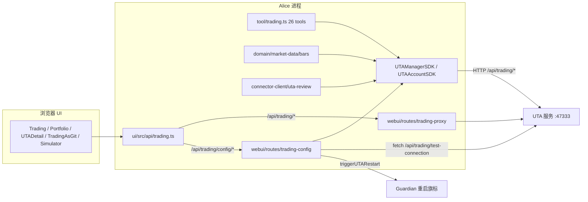

# 08 — Alice 消费方与 UI（UTA 重构调查报告）

> 摘要（≤10 行）
> 本区域覆盖 Alice 进程与 Web UI 如何消费 UTA 服务。核心是 `src/services/uta-client/`（`UTAManagerSDK` + `UTAAccountSDK`，纯 HTTP 适配器，共约 630 行）与 `src/services/uta-supervisor/`（URL 解析、健康探测、Guardian 重启触发）。Alice 通过 BFF 代理 `/api/trading/*` 与 `/api/simulator/*` 把浏览器流量转发给 UTA（`src/webui/routes/trading-proxy.ts`），同一个 UTA HTTP 面又被 SDK 用于服务端逻辑（AI trading tools、bar service、connector review）。对外能力有三条投影：AI 工具（26 个，`src/tool/trading.ts`）、Workspace CLI（`alice-uta` 全局 export，`src/server/cli-commands.ts:212`）、UI（Trading/Portfolio/UTA 详情/Trading-as-Git/Simulator 五条页面族）。trade-provenance 把 UTA 的 git commit hash 记成不可变决策身份。存在若干已确认的边界渗漏与模型漂移：Alice 仍持有 `UTAConfig`（含凭据）持久化权、SDK 有 5 个 `NotImplementedInSDK` 与多处乐观硬编码、UI 手写镜像协议类型、`src/core/types.ts:63` 的注释指向已不存在的 `ctx.fxService`/`ctx.snapshotService`。

---

## 1. 概览与职责边界

### 1.1 本区域负责什么

- Alice 进程内**一切**与 UTA 服务交互的客户端代码：`src/services/uta-client/`、`src/services/uta-supervisor/`、`src/services/trading-mode.ts`、`src/services/optional-carrier/health.ts`。
- Alice 为 UI 暴露的 UTA HTTP 面：`/api/trading/config`（Alice 自有，`src/webui/routes/trading-config.ts`）、`/api/trading/*` 与 `/api/simulator/*`（BFF 代理，`src/webui/routes/trading-proxy.ts`）。
- 面向 coding agent 的交易工具投影：`src/tool/trading.ts`（26 个 tool）及其注册与 CLI 映射。
- 面向 Workspace CLI 的 `alice-uta` export：`src/server/cli-commands.ts:212-286`、`src/workspaces/cli/bin/alice-uta`。
- trade-decision provenance：`src/server/trade-provenance.ts` + `src/server/cli.ts:344-370`。
- UI 侧所有交易面：`ui/src/pages/TradingPage.tsx`、`PortfolioPage.tsx`、`UTADetailPage.tsx`、`TradingAsGitPage.tsx`、`SimulatorPage.tsx`（Dev tab）、`ui/src/components/PushApprovalPanel.tsx`、`ui/src/components/uta/*`、`ui/src/components/market/TradeableContractsPanel.tsx`、`ui/src/api/trading.ts`、`ui/src/live/{trading-mode,trading-push,account-health}.ts`、`ui/src/hooks/{useTradingConfig,useAccountBroker...}.ts`、`ui/src/demo/handlers/trading.ts`。
- 注入给 Workspace agent 的交易相关上下文与技能：`src/workspaces/context-injector.ts`、`default/skills/alice-uta/`、`src/workspaces/templates/chat/files/instruction.md`。

### 1.2 不负责什么

- UTA 内部实现：broker 适配器、staging/commit/push 语义、快照存储、FX 计算、guard 管线（`services/uta/src/**`）。参见 `07-brokers-and-packs.md`、`05-staging-approval-ledger.md`、`06-snapshots-and-guards.md`。
- 协议类型与 schema 的**定义**：`packages/uta-protocol` 是唯一权威。参见 `02-http-api-and-protocol.md`、`04-market-data-contracts-fx.md`。
- 账户/订单/持仓的领域语义：参见 `03-account-orders-positions.md`。
- 持久化状态目录内容（`data/config/accounts.json` 的 schema 与 migration）：参见 `09-persisted-state-tests-docs-issues.md`。

### 1.3 上下游

| 方向 | 对方 | 契约 |
|---|---|---|
| 上游 | UTA 服务（`services/uta/src/main.ts`，127.0.0.1:47333 或 `OPENALICE_UTA_PORT`） | HTTP `/api/trading/*`、`/api/simulator/*`、`/__uta/health` |
| 上游 | Guardian（`scripts/guardian/prod.mjs`） | 注入 `OPENALICE_UTA_URL`/`OPENALICE_UTA_PORT`；监听 `data/control/restart-uta.flag` |
| 下游 | Alice 进程内消费者 | `EngineContext.utaManager`（`src/core/types.ts:66`） |
| 下游 | 浏览器 UI | `/api/trading/*`（代理）+ `/api/trading/config/*`（本地） |
| 下游 | Workspace coding agent | MCP server（127.0.0.1）+ `alice-uta` CLI（`/cli/:wsId/uta/invoke`） |
| 下游 | Connector Service | `claimUtaActions` / `presentUta` / `failUta`（`packages/connector-protocol`） |

调用总览：

---

## 2. 功能清单

### 2.1 UTA 发现与不可用处理（lite 模式）

**触发方式**：`src/main.ts:143-159` 在 Alice 启动时一次性解析。

**处理步骤**
1. `resolveTradingModePolicy(config)`（`src/services/trading-mode.ts`）读取优先级链：`OPENALICE_TRADING_MODE` 环境变量 → `OPENALICE_LITE_MODE`/`OPENALICE_UTA_DISABLED` 的 legacy 真值 → 持久化 `config.trading.mode` → 自动（存在 UTA 配置则 `pro`，否则 `lite`）。
2. `resolveUTAUrl()`（`src/services/uta-supervisor/url.ts:14`）：`OPENALICE_UTA_URL` 显式值优先；否则 `http://127.0.0.1:${OPENALICE_UTA_PORT || 47333}`。
3. `createUTAClient({ baseUrl })`（`packages/uta-protocol/src/client/UTAClient.ts:47`）。
4. 非 lite 时 `waitForUTAReady({ timeoutMs: 750 })` 探测一次 `GET /__uta/health`；成功打印账号数，失败打印 `uta: unavailable at … — continuing in lite mode`，**不阻塞启动**（`src/main.ts:148-153`）。
5. 构造 `UTAManagerSDK`，注入两个**动态** guard 回调：`unavailableReason` 与 `readonlyMutationReason`，均为 `() => …` 形式以便产品模式切换后无需重建 SDK（`src/main.ts:156-160`）。

**输出/副作用**：`utaManager` 进入 `EngineContext`；`utaDisabled` 时的启动告警日志。

**错误与边界**
- 显式 lite（env 锁定）后 `currentTradingModePolicy()` 永远返回 env 模式，配置写入不生效（`src/main.ts:134-136`）。
- 非显式 lite（auto）但 UTA 未起来：SDK 仍带 URL，后续调用会走真实 HTTP 并失败/空返回；只有 `lite` 模式才短路成本地空值。这是有意的「稍后 UTA 出现即可自动恢复」设计。
- `waitForUTAReady` 的 750ms 是启动期唯一等待；`__uta/health` 的 decode 校验 `ok===true`、`startedAt` 为 string、`utas` 为 number（`src/services/uta-supervisor/health.ts:29-34`）。

### 2.2 模式门禁：lite / readonly / pro

三档模式在**四个**地方各自实现一次拦截：

| 位置 | 机制 | 证据 |
|---|---|---|
| `UTAManagerSDK` 读路径 | `unavailableReason` 时返回空数组/空对象，不发起 HTTP | `src/services/uta-client/UTAManagerSDK.ts:84, 137, 169, 206` |
| `UTAManagerSDK.getAggregatedEquity` / `getContractDetails` | `assertAvailable()` 抛错 | `src/services/uta-client/UTAManagerSDK.ts:161, 218-231` |
| `UTAAccountSDK.push` / `simulatePriceChange` | `assertVenueWritable()` 抛错（只挡 venue 写入，staging/commit 仍允许） | `src/services/uta-client/UTAAccountSDK.ts:287-288, 356-357, 398-402` |
| `trading-proxy` | lite → 503 `{error:'UTA disabled'}`；readonly + venue mutation → 403 | `src/webui/routes/trading-proxy.ts:116-133` |

`isVenueMutation()`（`src/webui/routes/trading-proxy.ts:193-206`）按路径子串匹配：`/wallet/push`、`/wallet/place-order`、`/wallet/close-position`、`/wallet/cancel-order`、`/simulate-price`、`/api/simulator`、`/simulator`。**注意**：`/wallet/stage-*` 与 `/wallet/commit`、`/wallet/reject` 不在其中——readonly 下它们仍可写本地 git staging（与 `UTAAccountSDK` 的语义一致）。

UI 侧模式感知：`ui/src/live/trading-mode.ts` 以 15s 轮询 `GET /api/trading/status`，失败时回退到硬编码 `FALLBACK_STATUS`（lite + `reason:'status_unreachable'`）。`TradingModeGate`（`ui/src/components/TradingModeGate.tsx`）在 lite 时替换整页内容；`PortfolioSidebar` 在 lite 时隐藏账户下钻并显示说明文字（`ui/src/components/PortfolioSidebar.tsx:69-71`）。`TraderOnly`（`ui/src/tabs/UrlAdopter.tsx:176`）按产品形态（nano）把 `/settings/uta/:id`、`/market/*` 重定向走。

### 2.3 SDK 能力面

#### 2.3.1 `UTAManagerSDK`（`src/services/uta-client/UTAManagerSDK.ts`）

| 方法（行号） | 语义 | UTA 端点 | 调用者 |
|---|---|---|---|
| `setSnapshotHooks` (:55) | no-op | — | 无（UTA 自持） |
| `setFxService` (:58) | no-op | — | 无 |
| `registerCcxtToolsIfNeeded` (:61) | no-op | — | 无 |
| `initUTA` (:67) | 抛 `NotImplementedInSDK` | 无 | 无 |
| `add` / `remove` (:72,:75) | no-op | — | 无 |
| `closeAll` (:79) | no-op | — | 无 |
| `listUTAs` (:83) | 列账号摘要 | `GET /api/trading/uta` | trading tools（:159,:175,:217）、connector（`src/services/connector-client/uta-review.ts:87`） |
| `resolve(source?, {tradingOnly?})` (:99) | id 精确或前缀匹配；`tradingOnly` + 无 source 时过滤 `health.tier === 'data'` | 复用 `listUTAs` | trading tools ×15、trading-config spec |
| `resolveOne(source)` (:112) | 0 命中抛 `No UTA matched source`；>1 抛 ambiguous | 复用 | trading tools ×13 |
| `get(id)` (:121) | 单个账号句柄 | 复用 | `src/domain/market-data/bars/bar-service.ts:264`、`src/services/connector-client/uta-review.ts:170` |
| `has(id)` (:127) | 存在性 | 复用 | `src/domain/market-data/bars/bar-service.ts:426` |
| `getBarCapabilities(aliceId?)` (:135) | sourceId → 声明式 bars 质量；跳过 `asVendor===false` 与 `historicalBars.supported!==true`；带 aliceId 时 `|` 前缀匹配后查 `qualityBySecType` | `GET /api/trading/uta` + `POST …/contracts/details` | `src/domain/market-data/bars/bar-service.ts:269,271,314,321` |
| `size()` (:156) | 账号数 | 复用 | 无（仅 spec） |
| `getAggregatedEquity()` (:160) | 聚合权益 | `GET /api/trading/equity` | 无生产调用（`src/core/types.ts:64` 注释引用；Alice 内无人调用） |
| `getFxRates()` (:168) | USD 汇率表 | `GET /api/trading/fx-rates` | `src/tool/trading.ts:352`（getPortfolio） |
| `reconnectUTA(id)` (:184) | **整体进程重启**（忽略 id） | 无 HTTP；写 `data/control/restart-uta.flag` 并轮询 `/__uta/health` | `src/webui/routes/trading-config.ts:246,295,299` |
| `removeUTA(id)` (:194) | 同上，fire-and-forget | 同上 | `src/webui/routes/trading-config.ts:293,324` |
| `searchContracts(pattern, assetClass?)` (:205) | 跨账号扁平命中 | `GET /api/trading/contracts/search?pattern=` | `src/domain/market-data/bars/bar-service.ts:320` |
| `getContractDetails(aliceId, query)` (:219) | 抛 `NotImplementedInSDK` | 需 `GET /api/trading/uta/:id/contracts/details` | `src/services/uta-client/UTAManagerSDK.ts:146` 内部经 `account.getContractDetails` 绕开 |

#### 2.3.2 `UTAAccountSDK`（`src/services/uta-client/UTAAccountSDK.ts`）

| 方法（行号） | UTA 端点 | 备注 |
|---|---|---|
| `health` getter (:92) | — | **硬编码 `'healthy'`** |
| `disabled` getter (:96) | — | **硬编码 `false`** |
| `getHealthInfo()` (:100) | — | **硬编码乐观对象**（`status:'healthy'`, `reach:'readable'`, `tier:'trading'`） |
| `waitForConnect()` (:115) | — | 立即 resolve |
| `getCapabilities()` (:120) | — | **返回空能力集**（`TODO` 注释；调用者应查 `listUTAs()`） |
| `listSubAccounts()` (:131) | `GET …/uta/:id/subaccounts` | 返回 `r.subAccounts` |
| `getAccount(sub?)` (:138) | `GET …/uta/:id/account` | 透传 `subAccountId` |
| `getPositions(sub?)` (:143) | `GET …/uta/:id/positions` | |
| `getOrders(ids[])` (:149) | `GET …/uta/:id/orders`（`ids` 逗号连接） | 空数组时省略参数 ⇒ UTA 端用 pending 列表 |
| `getQuote(query)` (:159) | `POST …/uta/:id/quote` | 接受 `Contract` 或 `{aliceId}` |
| `getOptionContracts(request)` (:166) | `POST …/uta/:id/contract/option-contracts` | 返回 `Record<string, unknown>`（**无类型**） |
| `getOptionChain(request)` (:170) | `POST …/uta/:id/contract/option-chain` | 同上 |
| `getOrderBook(request)` (:174) | `POST …/uta/:id/contract/order-book` | 同上 |
| `getMarketClock()` (:178) | `GET …/uta/:id/market-clock` | |
| `expandContract(aliceId, filters?)` (:183) | `POST …/uta/:id/contract/expand` | |
| `getHistorical(query, params)` (:198) | `POST …/uta/:id/historical` | 注释称「Phase 1 前 404」但 UTA 已实现（`routes-trading.ts` 的 `/uta/:id/historical`） |
| `searchContracts(pattern)` (:210) | `GET /api/trading/contracts/search?pattern=&source=` | 客户端再 filter `row.source === this.id` |
| `getContractDetails(query)` (:230) | `POST …/uta/:id/contracts/details` | |
| `log(options)` (:241) | `GET …/uta/:id/wallet/log` | |
| `show(hash)` (:247) | `GET …/uta/:id/wallet/show/:hash` | 捕获含 `Commit not found` 的错误 → `null`（**按错误文本匹配**） |
| `status()` (:255) | `GET …/uta/:id/wallet/status` | |
| `orderHistory(limit=50)` (:260) | `GET …/uta/:id/order-history?limit=` | |
| `tradeHistory(limit=50)` (:268) | `GET …/uta/:id/trade-history?limit=` | |
| `getState()` (:275) | — | 抛 `NotImplementedInSDK` |
| `exportGitState()` (:281) | — | 抛 `NotImplementedInSDK` |
| `push(hash)` (:287) | `POST …/uta/:id/wallet/push` | 先过 `assertVenueWritable` |
| `reject(reason, hash)` (:295) | `POST …/uta/:id/wallet/reject` | |
| `stagePlaceOrder/ModifyOrder/ClosePosition/CancelOrder` (:312,:319,:326,:333) | `POST …/wallet/stage-*` | 从同步变 Promise |
| `commit(message)` (:342) | `POST …/wallet/commit` | |
| `sync(opts?)` (:349) | `POST …/uta/:id/sync` | |
| `simulatePriceChange(changes)` (:356) | `POST …/uta/:id/simulate-price` | 过 `assertVenueWritable` |
| `refreshCatalog()` (:364) | — | no-op（UTA 内部 6h 循环） |
| `contractFromAliceId` (:372) | — | 抛 `NotImplementedInSDK` |
| `nudgeRecovery` (:379) / `getPendingOrderIds` (:384) / `setCurrentRound` (:390) / `close` (:394) | — | 全部 no-op / 空数组 |

**SDK 方法 → 调用者汇总**（生产代码，非 spec）：

- `src/tool/trading.ts`：`listUTAs`、`resolve`、`resolveOne`、`getFxRates` + `UTAAccountSDK` 的约 20 个方法。
- `src/domain/market-data/bars/bar-service.ts`：`get`、`has`、`searchContracts`、`getBarCapabilities`（经结构类型 `UtaBarGateway`，`src/domain/market-data/bars/types.ts:154-165`）。
- `src/services/connector-client/uta-review.ts`：`listUTAs`、`get`、`status`、`push`、`reject`。
- `src/webui/routes/trading-config.ts`：`reconnectUTA`、`removeUTA`。
- 无生产调用者的 SDK 成员：`size`、`getAggregatedEquity`、`getContractDetails`(manager)、`setSnapshotHooks`、`setFxService`、`registerCcxtToolsIfNeeded`、`initUTA`、`add`、`remove`、`closeAll`、`getHealthInfo`、`waitForConnect`、`getCapabilities`、`getState`、`exportGitState`、`contractFromAliceId`、`refreshCatalog`、`nudgeRecovery`、`getPendingOrderIds`（仅被 tool 调用一次，见下）、`setCurrentRound`、`close`。

### 2.4 Alice 暴露给 coding agent 的交易 tools

注册点：`src/main.ts:249-254`，`toolCenter.register(createTradingTools(utaManager, () => config.agent.allowAiTrading), 'trading')`。**全局 registry**（`ToolCenter`），因此同时经 MCP server（127.0.0.1，无鉴权）与 CLI gateway 暴露。

`allowAiTrading` 的 getter 形式是刻意的：读取时刻实时求值，Settings 里改开关无需重启（`src/core/config.ts:249` 默认 `false`）。

Tool 表（行号 = `src/tool/trading.ts`）：

| Tool | 行 | 参数要点 | 走的 UTA 路径 | 门禁 |
|---|---|---|---|---|
| `listUTAs` | :214 | 无 | `listUTAs` → `GET /api/trading/uta` | 无 |
| `searchContracts` | :220 | `pattern`, `assetClass?`, `source?` | 逐账号 `searchContracts` → `GET /contracts/search` | 无 source 时按 `asVendor` 过滤 |
| `getContractDetails` | :280 | `source` 必填, `symbol/aliceId/secType/currency?` | `POST …/contracts/details` | 无 |
| `getAccount` | :311 | `source?`, `subAccountId?` | `GET …/account`（`tradingOnly` 解析） | 无 |
| `getPortfolio` | :333 | `source?`, `symbol?`, `subAccountId?` | `GET …/positions` + `…/account` + `getFxRates` | 无 |
| `getOrders` | :431 | `source?`, `orderIds?`, `groupBy?` | `getPendingOrderIds()`（SDK 恒 `[]`）+ `GET …/orders` | 无 |
| `getOptionContracts` | :474 | `optionResearchSchema`（协议包） | `POST …/contract/option-contracts` | `aliceId` 前缀定位账号 |
| `getOptionChain` | :486 | 同上 | `POST …/contract/option-chain` | 同上 |
| `getOrderBook` | :498 | `orderBookSchema` | `POST …/contract/order-book` | 同上 |
| `getQuote` | :511 | `aliceId`, `source?` | `POST …/quote` | `aliceId` 解析 |
| `expandContract` | :541 | `aliceId` + 过滤项 | `POST …/contract/expand` | 同上 |
| `getMarketClock` | :594 | `source?` | `GET …/market-clock` | 无 |
| `tradingLog` | :610 | `source?`, `limit?`, `symbol?` | `GET …/wallet/log` | 无 |
| `tradingShow` | :629 | `hash` | 遍历所有账号 `GET …/wallet/show/:hash` | 无 |
| `tradingStatus` | :641 | `source?` | `GET …/wallet/status` | 无 |
| `simulatePriceChange` | :651 | `source?`, `priceChanges[]` | `POST …/simulate-price` | readonly 抛错 |
| `placeOrder` | :671 | 见下 | `POST …/wallet/stage-place-order`（+ 可选 `commit`） | staging 无门禁；push 才需审批 |
| `modifyOrder` | :720 | `source` 必填 + `orderId` + 可选字段 | `POST …/wallet/stage-modify-order` | 同上 |
| `closePosition` | :744 | `aliceId`, `qty?`, `subAccountId?` | `POST …/wallet/stage-close-position` | 同上 |
| `cancelOrder` | :763 | `source` 必填, `orderId` | `POST …/wallet/stage-cancel-order` | 同上 |
| `tradingCommit` | :779 | `source?`, `message` | `GET …/wallet/status` + `POST …/wallet/commit` | 无 |
| `tradingPush` | :798 | `source?` | `GET …/wallet/status` + `POST …/wallet/push` | **`allowAiTrading()` 主开关**；关闭时只回待审批列表 |
| `tradingReject` | :849 | `source` 必填, `reason?` | `status` → 必要时 `commit` → `POST …/wallet/reject` | 无 |
| `orderHistory` | :872 | `source?`, `limit≤200` | `GET …/order-history` | 无 |
| `tradeHistory` | :892 | `source?`, `limit≤200` | `GET …/trade-history` | 无 |
| `tradingSync` | :912 | `source?`, `delayMs≤30000` | `POST …/uta/:id/sync` | 无 |

**审批门语义**（关键的写路径）
- `stageAndMaybeCommit`（:188-201）：stage 后若给 `commitMessage` 则立即 commit，返回 `nextStep: 'Awaiting user approval — they approve in the Web UI (push executes there).'`。**stage+commit 是 agent 可自完成的；push 不是。**
- `tradingPush` 关闭态（:824-833）返回 `message` + `pending[]`，明确要求用户去 Web UI（Trading as Git 或账号详情页）批准。
- `tradingPush` 开启态（:834-847）：逐账号 `uta.push(status.pendingHash)`，缺 `pendingHash` 时返回 `'Pending commit has no hash; refresh Trading as Git and approve there.'`。

**参数精度约束**：所有数量/价格用 `positiveNumeric`（:138-151）——**仅接受字符串**，经 `Decimal` 校验正有限值，空串归一为 `undefined`。理由在注释中写明：避免 LLM 走 float 丢精度路径进入持久化 git 记录。

**数值/形状压缩**：`src/tool/trading-compact.ts` 把 IBKR 超集对象（Order 约 120 字段）裁到「已设置字段」，并把三类 UNSET 哨兵（`1.7976931348623157e+308`、`2147483647`、`1.70141…e+38`）归一为「不存在」。原因写在文件头：哨兵会被 LLM 当真实约束读。

**降级语义**：`settlePerAccount`（:68-88）用 `Promise.allSettled` 逐账号隔离；`BrokerError.code === 'CONNECTING'` 分到 `connecting` 桶（数据 pending，不是故障），其余进 `failed`（`degraded`）。工具描述里明确要求 agent 把 `degraded` 的 `source` 报给用户并区分 permanent/transient（`handleBrokerError` :36-46）。

**错误处理**：`handleBrokerError` → `{error, code, transient, hint}` 结构化响应，`transient = !be.permanent`。

### 2.5 Workspace CLI：`alice-uta`

`src/server/cli-commands.ts:212-286` 定义 `BASE_EXPORTS.uta`：`binary: 'alice-uta'`、`scope: 'global'`。命令树（group → verb → tool）：

| Group | Verb → tool |
|---|---|
| `account` | `list→listUTAs`, `info→getAccount`, `portfolio→getPortfolio` |
| `contract` | `search→searchContracts`, `details→getContractDetails`, `quote→getQuote`, `expand→expandContract`, `option-contracts`, `option-chain`, `order-book` |
| `order` | `list→getOrders`, `history→orderHistory`, `trades→tradeHistory`, `place→placeOrder`, `modify→modifyOrder`, `cancel→cancelOrder` |
| `position` | `close→closePosition`（列出持仓复用 `account portfolio`） |
| `git` | `status/log/show/commit/push/reject/sync` |
| `market` | `clock→getMarketClock` |
| `sim` | `price-change→simulatePriceChange`（MockBroker only） |

调度路径：`POST /cli/:wsId/uta/invoke`（`src/server/cli.ts`）→ `exportCatalog` → **全局** `toolCenter.get(name)`（`scope: 'global'`，见 `src/server/cli-commands.ts:289-292` 的 `toolRegistryScope`）→ 与 MCP 完全相同的 `extractMcpShape` + `wrapToolExecute` 链。

校验细节：`z.strictObject(extractMcpShape(tool))`（`src/server/cli.ts:323`），未知 flag 直接 400，错误按字段列出。注释说明动因：一次 typo 的 `--quantity` 曾 stage 出无数量的订单且校验通过。

Manifest 端（`src/server/cli.ts:226-278`）用 `z.toJSONSchema(…, { io:'input', unrepresentable:'any' })` 生成 flag schema；`alice-uta` 未映射到任何 export 的工具会在 `unmapped` 里报告（防静默能力缺失）。

**按 Workspace 的开关**：`.alice/alice-harness-config.json`（`src/workspaces/alice-harness-policy.ts:15-21`）可整体禁用 binary 或按 group 禁用；`cliGroupEnabled` 在 manifest 与 invoke 两侧都生效。

### 2.6 trade-provenance：决策身份记录

**记录内容**（`src/server/trade-provenance.ts`）
- `TradeDecisionRef = { accountId, decisionId }`。`accountId` 取工具结果 JSON 的 `source` 字段；`decisionId` 取 `hash`，或内联提交时的 `committed.hash`。
- 识别工具集合：`tradingCommit`（取 `hash`，支持数组）+ 内联提交集合 `{placeOrder, modifyOrder, closePosition, cancelOrder}`（取 `committed.hash`）。
- **刻意忽略** broker order id / fill id：注释写明「Git commit hash 是持久化的交易决策身份」。
- 去重按 `${accountId}\0${decisionId}`。

**写入**（`src/server/cli.ts:344-370`）
- 仅当请求带权威 `x-openalice-run`（headless）或 `x-openalice-session`（interactive）头且能解析为 Product Session origin 时才记录；裸本地 CLI/API 调用**保持不归属**（`sessionOriginFromInboxOrigin` 返回 null ⇒ `decisionRefs = []`）。
- 写入 `provenanceStore.append({ artifact: {kind:'trade-decision', accountId, decisionId}, action:'decided', origin, at, fingerprint: 'trade-decision:<acc>:<id>:decided' })`。
- 失败仅告警（`trade_decision_provenance.append_failed`），**绝不把已成功的交易变成命令失败**。
- 头由 `src/workspaces/cli/bin/openalice-cli.cjs:159-162` 从 `AQ_RUN_ID`/`AQ_SESSION_ID` 注入；二者都要求 `AQ_WS_ID` 存在。

**用途/消费者**
- `provenance_show` 工具（`src/tool/provenance-show.ts`）接受 `kind:'trade-decision'` + `accountId` + `decisionId` 读回记录；`artifactKinds` 含 `trade-decision`（`src/tool/provenance-show.ts:11`）。
- `src/core/provenance-store.ts:41-44` 的 discriminated union 定义；:271-273 按 `accountId`/`decisionId` 匹配查询。
- `src/workspaces/conversation-control.ts:84-93` 允许反向：以 trade-decision 为 business target 发起对话。
- `src/workspaces/office-floor.ts:310,318` 生成 drawer label/key。
- `ui/src/api/agentConversations.ts:18`、`ui/src/pages/LogsPage.tsx:341`（`Trade decision <acc>/<id>`）、`ui/src/office/drawer-presentation.ts:55`、`ui/src/pages/OfficePage.tsx:466`（点击抽屉跳到 Trading-as-Git）。

### 2.7 context-injector 注入的 UTA 派生上下文

`src/workspaces/context-injector.ts` 本身**不注入任何 UTA 运行时状态**（无账号、无持仓、无订单）。它注入的是：

1. **Workspace 模板 instruction.md**（`injectInstructions` 为真时）——Chat 模板的正文（`src/workspaces/templates/chat/files/instruction.md`）以**静态文字**约束交易行为：第 44-46 行「Trading is a separate, approval-bearing act. Research may recommend or stage a decision; only `alice-uta` touches broker state. Never imply an order succeeded without the tool result.」；第 60 行的 surface 表格把 `Accounts, positions, orders, trading-as-git` 指向 `alice-uta` + `alice-uta` skill。
2. **Alice Harness skills**（`injectAliceHarnessSkills`，`src/workspaces/alice-harness-assets.ts:22-31`）——`ALICE_HARNESS_SKILLS = ['alice','alice-analysis','alice-uta','traderhub','self-scheduling','file-delivery']`（`src/workspaces/alice-harness-policy.ts:8`）。`injectTools` 为真或配置显式开启时写入 `.claude/skills` 与 `.agents/skills`。
3. **`.alice/alice-harness-config.json`**——默认 `{schemaVersion:1, cli:{}}`，即所有 CLI/group 默认启用。

`default/skills/alice-uta/SKILL.md` 是注入内容里**唯一**描述交易操作面与审批流（`git` group = trade-approval、`--commit-message-file` 规避 `$` 展开等）的文档。

模板 `injectTools` 现状：Chat = true、AutoQuant V2 = true、AutoPrediction = true（`src/workspaces/templates/*/template.json`）；`legacy` 合成模板 = false（`src/workspaces/service.ts:1006`）。

### 2.8 Alice HTTP 层对 UTA 的代理路由

**代理**（`src/webui/routes/trading-proxy.ts`）
- 挂载：`src/webui/plugin.ts:255-266`，`app.route('/api/trading', utaProxy)` 与 `app.route('/api/simulator', <同工厂的新实例>)`。
- `GET /status`：lite → `{available:false, reason:'lite_mode', …}`；未配置 URL → `reason:'not_configured'`；否则 `probeOptionalCarrier` 探测 `/__uta/health`（1s 超时），返回 `{available, state, mode, modeSource, envLocked, hasUTAConfig, startedAt?, utas?, reason?, detail?, hint}`。
- `app.all('*')`：模式门禁 → 无 base 时 503 → 拼 `${base}${c.req.path}${search}` 转发，透传 8 个白名单头（`accept`、`accept-language`、`content-type`、`content-length`、`user-agent`、`cache-control`、`pragma`、`x-request-id`），30s 总超时（`PROXY_TIMEOUT_MS`），响应体流式回传并重建 Headers（避免 WHATWG immutable guard 导致后续中间件 `set()` 抛错）。
- **注意**：`PASSTHROUGH_HEADERS` **不含** `x-openalice-run`/`x-openalice-session`；浏览器路径不参与 trade-decision provenance（符合设计，provenance 只走 CLI/MCP 的 invoke 路径）。

**Alice 自有配置路由**（`src/webui/routes/trading-config.ts`，挂 `/api/trading/config`）

| 路由 | 行为 |
|---|---|
| `GET /broker-presets` (:86) | 返回 `BUILTIN_BROKER_PRESETS`（协议包） |
| `GET /broker-packs` (:92) | 读 `accounts.json` + `loadConfig()` + 各 engine 本地 pack 状态，生成 `packs[]` 与 `accounts[]`（含 `state`/`operational`/`action`） |
| `POST /broker-packs/:engine/install` (:162) | 安装后 `notifyUTAReload()` |
| `GET /` (:176) | 读 `accounts.json`，`maskSecrets` 后返回 |
| `POST /uta` (:196) | 校验 `presetId`；mock preset 补 `_instanceId`；`deriveUtaId` 派生 id；重复 → 409 + `existing`；写盘 + `notifyUTAReload()` + fire-and-forget `reconnectUTA(id)`；回显 masked |
| `PUT /uta/:id` (:264) | 先 `unmaskSecrets` 还原 `****` 占位；id 必须匹配 URL；不存在 → 422；写盘 + reload；enabled 状态翻转时调 `removeUTA`/`reconnectUTA` |
| `DELETE /uta/:id` (:312) | 写盘 + reload + `removeUTA`；`ephemeral` 时额外 `wipeUTATradingData(id)` |
| `POST /test-connection` (:343) | lite → 503；否则直接 `fetch(`${utaUrl}/api/trading/test-connection`)` 转发 |

`notifyUTAReload()`（:29-41）fire-and-forget 调 `triggerUTARestart()`，失败只 console.warn，进度靠 UI 健康徽章体现。

**配置写触发的重启**（`src/webui/routes/config.ts:418-424`）：`PUT /api/config/trading` 或 `/api/config/snapshot` 持久化后触发 `triggerUTARestart()`——因为 `trading.json`/`snapshot.json` 是 UTA 启动期读取的。

### 2.9 UI：页面、组件、hook 与数据来源

**UI API 层**：`ui/src/api/trading.ts` 的 `tradingApi` 对象（35 个方法），统一经 `ui/src/api/client.ts` 的 `fetchJson`（401 派发 `app:unauthorized` 事件）。

| UI 方法（行号） | 端点 | 备注 |
|---|---|---|
| `status` (:52) | `GET /api/trading/status` | 代理 |
| `listUTAs` (:58) / `listUTASummaries` (:62) | `GET /api/trading/uta` | **两个方法同端点**，仅历史命名差异 |
| `equity` (:66) | `GET /api/trading/equity` | |
| `fxRates` (:72) | `GET /api/trading/fx-rates` | |
| `reconnectUTA` (:78) | `POST …/uta/:id/reconnect` | **不过 `fetchJson`**：无 `res.ok` 检查，直接 `res.json()`（500 也会被当成功解析） |
| `utaAccount` (:85) | `GET …/account` | |
| `utaPositions` (:90) | `GET …/positions` | |
| `utaSubAccounts` (:97) | `GET …/subaccounts` | |
| `utaOrders` (:101) | `GET …/orders` | 返回 `unknown[]` |
| `marketClock` (:106) | `GET …/market-clock` | |
| `orderHistory` (:111) / `tradeHistory` (:116) | `GET …/order-history`、`…/trade-history` | |
| `walletLog` (:120) / `walletShow` (:126) | `GET …/wallet/log`、`…/wallet/show/:hash` | `walletShow` **无调用者** |
| `walletStatus` (:132) | `GET …/wallet/status` | |
| `walletReject` (:136) / `walletPush` (:156) | `POST …/wallet/reject`、`…/wallet/push` | 手写 `res.ok` 检查 |
| `placeOrder` (:175) / `closePosition` (:179) / `cancelOrder` (:183) | `POST …/wallet/{place,close,cancel}-order` | `postOrder` 助手；失败抛 `OrderEntryError(status, {error, phase})` |
| `getBrokerPresets` (:189) | `GET /api/trading/config/broker-presets` | |
| `getBrokerPacks` (:193) / `installBrokerPack` (:197) | `GET /api/trading/config/broker-packs`、`POST …/:engine/install` | |
| `loadTradingConfig` (:206) | `GET /api/trading/config` | |
| `createUTA` (:216) | `POST /api/trading/config/uta` | 409 → `err.name='BrokerAlreadyExistsError'` + `err.existing` |
| `upsertUTA` (:239) | `PUT /api/trading/config/uta/:id` | |
| `deleteUTA` (:252) | `DELETE /api/trading/config/uta/:id` | |
| `snapshots` (:262) / `deleteSnapshot` (:270) | `GET …/uta/:id/snapshots`、`DELETE …/snapshots/:timestamp` | |
| `equityCurve` (:275) | `GET /api/trading/snapshots/equity-curve` | |
| `searchContracts` (:291) | `GET /api/trading/contracts/search` | 支持 `assetClass` + `source` |
| `testConnection` (:309) | `POST /api/trading/config/test-connection` | |

**Live stores（共享轮询）**

| Store | 文件 | 周期 | 数据 |
|---|---|---|---|
| `accountHealthLive` | `ui/src/live/account-health.ts:18`（`staleAfterMs` 在 :46） | 5s；`staleAfterMs: 15s` | `listUTASummaries()` → `{accountId: BrokerHealthInfo}` |
| `tradingPushLive` | `ui/src/live/trading-push.ts:33` | 15s | `listUTASummaries()` + 逐账号 `walletStatus` → `stagedCount` 求和 |
| `useTradingMode` | `ui/src/live/trading-mode.ts:29`（`FALLBACK_STATUS` 在 :10） | 15s（`ensureTradingModePolling`（`ui/src/live/trading-mode.ts:74-81`）） | `status()`；失败回退 `FALLBACK_STATUS` |

`createLiveStore`（`ui/src/live/createLiveStore.ts`）在首个订阅者挂载时打开、最后一个卸载时释放，多个组件共享一个 timer。

**Hooks**

| Hook | 文件 | 作用 |
|---|---|---|
| `useTradingConfig` | `ui/src/hooks/useTradingConfig.ts:19` | `loadTradingConfig` 列表 + create/save/delete/reconnect + `refresh`；`loading`/`error` |
| `useAccountHealth` | `ui/src/hooks/useAccountHealth.ts:10` | 读 `accountHealthLive` |
| `useBrokerPackReadiness` | `ui/src/hooks/useBrokerPackReadiness.ts:111` | `getBrokerPacks` + TTL 15s + focus/visibility 刷新；**fail-closed**：任何 refresh/error 都清空 data 并把账号置 `status-unavailable`；返回 `forAccount()`、`install()`、`installingEngine` |
| `deriveAccountInteractionPolicy` | 同文件 :64 | 纯函数，把 enabled/readiness/health/tradingMode 合成 `{canRead, canReconnect, canTrade, reason}`；`canTrade` 要求 pro 模式 + healthy + reach readable + tier trading |
| `usePendingPushCount` | `ui/src/live/trading-push.ts:77` | ActivityBar/PortfolioSidebar 徽章 |

**页面**

| 页面 | 文件 | 功能 | 端点 | 轮询 |
|---|---|---|---|---|
| Trading | `ui/src/pages/TradingPage.tsx:332` | 账号卡片列表（健康、权益行）、Add/Edit 对话框、Keyless data source 行、External order monitoring 行 | `getBrokerPresets`、`status`、`equity` | status 15s、equity 60s |
| Portfolio | `ui/src/pages/PortfolioPage.tsx:128` | 聚合权益 hero、per-account sparkline、持仓表、FX 面板、trade log、快照设置、点选快照详情 | `equity`、`fxRates`、`utaAccount`、`utaPositions`、`walletLog`、`snapshots`、`equityCurve` | 30s |
| UTA 详情 | `ui/src/pages/UTADetailPage.tsx:34` | 账户面板（NLV/现金/PnL/24h delta/市场时钟）、钱包选择器、持仓分组、订单三 tab（Open/History/Trades）、快照图、下单/平仓对话框入口 | `utaSubAccounts`、`utaAccount`、`utaPositions`、`utaOrders`、`snapshots`、`marketClock`、`orderHistory`、`tradeHistory` | live 15s、snapshots 60s、clock 60s、history/trades 15s（仅激活 tab） |
| Trading as Git | `ui/src/pages/TradingAsGitPage.tsx:9` | lite 时显示 `TradingModeGate`；否则 `PushApprovalPanel` | 见下 | 3s（panel 内） |
| Simulator（Dev tab） | `ui/src/pages/SimulatorPage.tsx:34` | MockBroker 控制台：标记价、持仓、挂单、操作面板、事件日志 | `/api/simulator/*` | 3s |

**关键组件**

- `PushApprovalPanel`（`ui/src/components/PushApprovalPanel.tsx`，1112 行）：3s `poll()` 逐账号取 `walletStatus` + `walletLog(10)`，把账号分成 staged / pending / history 三桶；`mergeAccountResults`（:282-297）保留上次成功的行，避免单账号失败清空全表；`verification` 状态（:319）记录 `{total, verified, failed, listUnavailable}`，并在 :521-551 渲染「哪些账号未验证」。push/reject 用 `expectedPendingHash` 做乐观并发控制（:412-450）。操作展示由 `operationDisplay`（:94+）把 `placeOrder/modifyOrder/closePosition/cancelOrder` 映射成 `+/-/~/` 标记与色调。**注意**：`walletReject` 调用传 `undefined` 作为 reason（:443），UI 无法提交拒绝理由。
- `OrderEntryDialog`（`ui/src/components/uta/OrderEntryDialog.tsx`）：两种模式 `place` / `close`；支持 `MKT`/`LMT`（**仅两档**，AI tool 支持 7 档）；数量/价格为自由文本，客户端用 `Decimal` 校验（`closeQuantityError` :544-560）但**无 `positiveNumeric` 等价约束**；多钱包时强制选钱包（`initialWallet` :136-140）；提交走一次性 `place-order`/`close-position`（stage→commit→push 在服务端合一）。
- `TradeableContractsPanel`（`ui/src/components/market/TradeableContractsPanel.tsx:26`）：在 K 线详情页搜「这个数据侧 symbol 在哪个券商可交易」，列 `aliceId` 并提供深链 `/uta/{source}?aliceId=…`（:137），UTADetailPage 读取 query 参数自动打开预填下单框（`ui/src/pages/UTADetailPage.tsx:174-184`）；`utasConfigured === 0` 时引导去 `/trading`。
- `HealthBadge`（`ui/src/components/uta/HealthBadge.tsx`）：把 `BrokerHealthInfo` 渲染成连接状态 pill；`connecting` 检查**先于** status switch（注释解释：连接窗口内 status 乐观为 healthy）。tier → 文案映射：`data`→"Data source"、`account`→"Connected, read-only"、`trading`→"Connected"。
- `BrokerPackGate`（`ui/src/components/uta/BrokerPackGate.tsx`）：`AccountReadinessBadge` + `BrokerSupportGate`，把「本机未安装该 broker pack」渲染为可操作提示（Install / Repair）。
- `SnapshotDetail`（`ui/src/components/SnapshotDetail.tsx`）：快照账户摘要 + 持仓表；由 PortfolioPage 在点选曲线点时打开。
- `EquityCurve`（`ui/src/components/EquityCurve.tsx`）：recharts 面积图 + 账户切换 + 时间范围（1H/6H/24H/7D/30D/All）。
- `TradingModeGate`（`ui/src/components/TradingModeGate.tsx`）：lite 模式占位卡，按钮跳到 `settings/agent-permissions`。
- `ReconnectButton`（`ui/src/components/ReconnectButton.tsx`）：调 `reconnectUTA`，成功后 3s 自复位。

**路由与导航**
- 路由：`/portfolio`、`/trading-as-git`、`/settings/trading`、`/settings/uta/:id`（+ 老路径 `/uta/:id` 重定向、`/trading` 重定向），见 `ui/src/tabs/UrlAdopter.tsx:95-150` 与 `ui/src/tabs/registry.tsx:119-137, 327-335`。
- 导航：`NAV_SECTIONS` 里 `page:'portfolio'`（labelKey `nav.item.trading`）是 Trading 面的 rail 入口；Trading as Git 与账号列表是它的 navigator 叶子（`ui/src/components/activity-navigation.ts:75-96`）。`ActivityBar` 在 `pendingPush > 0` 时给该 rail 项加徽章（`ui/src/components/ActivityBar.tsx:202-209`）。

### 2.10 Demo（MSW）覆盖度

`ui/src/demo/handlers/trading.ts` 覆盖 32 条路由（对照上文 UI API 表）：

| 已覆盖 | 缺失/mock 不实 |
|---|---|
| `status`（恒 `available:true, mode:'pro'`）、`uta` 列表、`equity`（由 fixtures 求和）、`fx-rates`（USDT/EUR 两条硬编码）、`reconnect`、`subaccounts`、`account`（含 crypto 按 wallet 分派）、`positions`、`orders`（**恒空数组**）、`order-history`、`trade-history`、`market-clock`（crypto 恒开、证券用相对 now 的合成时间）、`wallet/status`（**恒空 staged、`pendingMessage:null`**）、`wallet/log`（**恒空**）、`wallet/show`（**恒 404**）、`wallet/reject`、`wallet/push`、三个一次性下单端点、`config/*`（presets/packs/uta CRUD/test-connection）、`snapshots`、`deleteSnapshot`、`equity-curve`、`contracts/search`（**恒空结果**） | `wallet/push` 与 `wallet/status` 不一致：demo 的 push 永远返回 `demo-…-commit` 而 status 永远没 staged，因此 **Trading-as-Git 的完整审批流在 demo 中不可走通**；`contracts/search` 恒空 → `OrderEntryDialog` 的 ContractPicker 在 demo 中搜不出东西；`contracts/details`、`quote`、`expandContract`、`historical`、`order-book`、`option-*`、`sync`、`simulate-price` 无 handler（落到 `catchAll` 返回 `{}`） |

`SimulatorPage` 的 `/api/simulator/*` 由 `ui/src/demo/handlers/toolsSimulator.ts:63-73` 覆盖，恒返回空集合。

Fixtures 质量较高（`ui/src/demo/fixtures/trading.ts`）：3 个账号（`demo-paper`/`demo-ibkr`/`demo-crypto`）；`AccountInfo` 字段覆盖**刻意不均匀**以驱动 UI 的 omit-row 路径（paper 无 `realizedPnL`、ibkr 全超集、crypto 无 `buyingPower`）；order/trade history 含 `alice`/`external`/`reconcile` 三种 source 与真实长 id。

---

## 3. 数据与状态

### 3.1 Alice 侧内存状态

| 状态 | 位置 | 生命周期 |
|---|---|---|
| `EngineContext.utaManager` | `src/main.ts:156` → `src/core/types.ts:66` | 进程级，单例 |
| `EngineContext.tradingModePolicy()` | `src/main.ts:307` | 每调用重算（env 锁定时冻结） |
| `UTAManagerSDK.unavailableReason` / `readonlyMutationReason` | 构造注入的闭包 | 进程级 |
| `UTAAccountSDK.readonlyMutationReason` | 经 `accountFromSummary` 传递 | 每个账号句柄 |
| 无任何 broker 连接、broker 对象、持仓/订单缓存 | — | 确认不存在（见 §8.1） |

### 3.2 Alice 侧持久化

| 文件 | 归属 | 内容 | 证据 |
|---|---|---|---|
| `data/config/accounts.json` | **Alice 写、UTA 读** | sealed（AES-256-GCM）的 `UTAConfig[]`，含凭据；`0600` 权限；空时自动 seed | `src/core/config.ts:709-716, 719-780, 785-788` |
| `data/config/trading.json` | Alice 写、UTA 启动读 | `{mode?, observeExternalOrdersEvery, keylessDataSources[]}` | `src/core/config.ts:389-412` |
| `data/config/snapshot.json` | Alice 写、UTA 启动读 | `{enabled, every}` | `src/core/config.ts` snapshotSchema |
| `data/control/restart-uta.flag` | Alice 写、Guardian watch | ISO 时间戳；原子写（`.tmp` + rename） | `src/services/uta-supervisor/restart-trigger.ts:60-70` |
| `data/trading/<id>/` | **UTA 写**；Alice 只在删除 ephemeral 时 `rm -rf` | commit log、快照 | `src/core/config.ts:797-799`；UTA 侧 `services/uta/src/domain/trading/git-persistence.ts:15` |

`UTAConfig` 字段（`src/core/config.ts:447-478`）：`id`、`label?`、`presetId`、`enabled`(默认 true)、`guards[]`、`presetConfig`、`ephemeral?`（仅 mock-simulator）、`keyless`（默认 false，⟹ readOnly）、`readOnly`（默认 false）、`asVendor`（默认 true）、`editable`（默认 true）。

### 3.3 凭据处理

- `GET /api/trading/config` 返回前 `maskSecrets()`：字段名匹配 `/key|secret|password|token/i` 的字符串值显示为 `****<last4>`（`src/webui/routes/trading-config.ts:49-62`）。
- `PUT` 前 `unmaskSecrets()`：以 `****` 开头的值从既有配置还原（`src/webui/routes/trading-config.ts:65-77`）。
- `POST /uta` 与 `PUT /uta/:id` 的响应同样 masked（:249, :303）。
- 写盘路径只有一条（`writeAccountsFile`），sealed + `0600`（`src/core/config.ts:709-716`）。

---

## 4. 外部交互

### 4.1 Alice → UTA（SDK，服务端）

传输：`fetch` + `AbortController`，默认 15s 超时（`packages/uta-protocol/src/client/UTAClient.ts:49`）。错误统一成 `UTAHttpError(status, body, message)`，message 优先取 body 的 `error` 字段。响应体先读 text 再 `safeJSON`，非 JSON 时原样返回字符串。

调用链（调用者 → SDK → 端点）节选：

| 调用者 | SDK | 端点 |
|---|---|---|
| `src/tool/trading.ts` getAccount/getPortfolio | `manager.resolve(source, {tradingOnly:true})` → `uta.getAccount`/`getPositions` | `GET /api/trading/uta` → `GET …/uta/:id/{account,positions}` |
| `src/tool/trading.ts` getQuote | `manager.resolveOne(id)` → `uta.getQuote` | `POST …/uta/:id/quote` |
| `src/tool/trading.ts` tradingPush | `uta.status()` → `uta.push(hash)` | `GET …/wallet/status` → `POST …/wallet/push` |
| `src/tool/trading.ts` orderHistory | `uta.orderHistory(limit)` | `GET …/uta/:id/order-history?limit=` |
| `src/domain/market-data/bars/bar-service.ts` getUtaBars | `manager.get(sourceId)` + `getBarCapabilities(barId)` → `acct.getHistorical` | `GET /api/trading/uta` (+ 可能要 `POST …/contracts/details`) → `POST …/uta/:id/historical` |
| `domain/market-data/bars` searchBarSources | `manager.searchContracts` + `getBarCapabilities()` | `GET /api/trading/contracts/search` + `GET /api/trading/uta` |
| `src/services/connector-client/uta-review.ts` | `manager.listUTAs` / `get` → `uta.status` / `push` / `reject` | 对应端点 |
| `src/webui/routes/trading-config.ts` | `manager.reconnectUTA` / `removeUTA` | 无 HTTP（Guardian 旗标） |
| `src/webui/routes/trading-config.ts` test-connection | — | `POST {utaUrl}/api/trading/test-connection`（裸 fetch） |
| `src/services/uta-supervisor/restart-trigger.ts` | — | `GET {utaUrl}/__uta/health`（轮询） |

### 4.2 浏览器 → Alice → UTA

浏览器只调 Alice 单 origin（`/api/trading/*`），Alice 的 BFF 原样转发。**v1 无鉴权**：UTA 只 bind 127.0.0.1，信任边界是主机而非请求（`src/webui/routes/trading-proxy.ts:1-11`）。Alice 的 web 端口有 admin token 门禁（`src/webui/middleware/auth.ts`），代理位于其后。

### 4.3 Workspace agent → Alice → UTA

MCP server 监听 127.0.0.1（**无鉴权**，安全模型是 loopback + 无远程调用者，见 `src/server/mcp.ts:245-268` 的长注释）。工具表全量暴露，交易工具在内。CLI gateway 复用同一 app 与端口。

### 4.4 Guardian 边界

`scripts/guardian/prod.mjs`：UTA 子进程注入 `OPENALICE_UTA_PORT`（Alice 侧 `OPENALICE_UTA_URL`，:365）；watch `data/control/restart-uta.flag`（:608）；lite/nano 时忽略旗标（:495）。Alice 的 `triggerUTARestart` 协议：① 原子写旗标 ② Guardian debounce 100ms → SIGTERM → respawn ③ Alice 轮询 `/__uta/health` 直到 `startedAt` 变化或 20s 超时。返回 `{triggered, ready, oldStartedAt?, newStartedAt?, error?}`。

### 4.5 Connector Service

`src/services/connector-client/action-bridge.ts:41-128` 在有 `utaManager` + `tradingModePolicy` 时启用 UTA 通道：1.5s 间隔 claim `utaActions`，逐条 `processConnectorUtaRequests`。动作类型 `review` / `push` / `reject`；`lite` → `unavailable`，`readonly` + push → `readonly` 失败原因；`pendingHash` 缺失 → `conflict`。限制：最多 8 个账号（`MAX_CONNECTOR_UTA_ACCOUNTS`）、每账号最多 8 条操作（`MAX_CONNECTOR_UTA_OPERATIONS`），超出时提示去 Web UI。错误按 `/readonly/i` 文本匹配归类（`src/services/connector-client/uta-review.ts:213-214`）。

---

## 5. 配置项、默认值、环境变量、开关

| 名称 | 类型/默认 | 作用 | 证据 |
|---|---|---|---|
| `OPENALICE_UTA_URL` | string，默认 `http://127.0.0.1:${port}` | UTA base URL | `src/services/uta-supervisor/url.ts:14` |
| `OPENALICE_UTA_PORT` | string，默认 `47333` | 端口 | 同上 |
| `OPENALICE_LITE_MODE` | 真值（`1/true/yes/on`） | 强制 lite | `src/services/uta-supervisor/url.ts:22-24` |
| `OPENALICE_UTA_DISABLED` | 同上 | 强制 lite（legacy/别名） | 同上 |
| `OPENALICE_TRADING_MODE` | `lite`/`readonly`/`pro` | 强制模式，**env 锁定**（优先级最高，不可被配置覆盖） | `src/services/trading-mode.ts:24-27, 44-46` |
| `config.trading.mode` | 可选 enum | 持久化模式偏好 | `src/core/config.ts:391` |
| `config.trading.observeExternalOrdersEvery` | 默认 `'15m'` | UTA 扫描外部订单频率（`off` 关闭） | `src/core/config.ts:406` |
| `config.trading.keylessDataSources` | 默认 `[]`，可选 `binance`/`okx`/`bybit` | keyless 公共数据 UTA | `src/core/config.ts:411` |
| `config.snapshot.enabled` | 默认 `true` | 快照总开关 | `src/core/config.ts` snapshotSchema 的 `{enabled, every}`hotSchema |
| `config.snapshot.every` | 默认 `'15m'` | 快照间隔 | 同上 |
| `config.agent.allowAiTrading` | 默认 `false` | **AI 直接 push 的主开关** | `src/core/config.ts:249` |
| `OPENALICE_BACKEND_PORT`（UI 构建期） | — | Vite 代理目标 | `ui/vite.config.ts:19` |
| `.alice/alice-harness-config.json` | `{schemaVersion:1, cli:{}, skills?}` | 按 Workspace 禁用 `alice-uta` binary 或某个 group | `src/workspaces/alice-harness-policy.ts:11-20` |
| `VITE_DEMO_MODE` | — | 启用 MSW demo handlers | `ui/src/main.tsx:19` |

模式门禁矩阵（同一账号在不同模式下的可用性）：

| 模式 | 读（account/positions/orders） | stage + commit | push / 一次性下单 | UI 表现 |
|---|---|---|---|---|
| `lite` | 全部空值（SDK 短路）；代理 503 | 不可（无账号） | 不可 | `TradingModeGate` |
| `readonly` | 正常 | 允许（本地 git staging） | 403 / SDK 抛错 | 正常渲染，写按钮禁用 |
| `pro` | 正常 | 允许 | 视 `allowAiTrading`（AI）或用户点击（UI） | 正常 |

---

## 6. 不变量、时序与并发假设

### 6.1 不变量

1. **Alice 不持有 broker 连接**：`src/services/uta-client/index.ts:10-12` 与 `AGENTS.md:62` 的契约。代码层面已成立（见 §8.1 验证）。
2. **git commit hash 是交易决策的唯一持久身份**，broker order id 被刻意排除在 provenance 之外（`src/server/trade-provenance.ts:42-43`）。
3. **Decimal 精度端到端**：AI 工具数量/价格只接受字符串（`positiveNumeric`）；UI 走字符串字段；协议层所有金额为 string。
4. **审批墙不可绕过**：所有真实下单路径都经过 `push`，而 push 受 `allowAiTrading`（AI）或人工点击（UI）门禁。
5. **模式的 env 优先级**：`OPENALICE_TRADING_MODE` 一旦设置，配置写入无效。
6. **`unset = absent`**：工具边界上 IBKR 哨兵值必须被裁掉，不能作为数据出现（`src/tool/trading-compact.ts:1-15`）。

### 6.2 时序假设

- **启动**：Alice 探测 UTA 最多 750ms 后无论成败继续启动。UTA 随后可用时**不需要 Alice 重启**（SDK 无连接状态，每次调用直连）。
- **配置变更 → 重启**：`POST/PUT/DELETE /uta`、broker pack 安装、`PUT /api/config/trading|snapshot` 都触发 `triggerUTARestart()`；重启窗口内所有 `/api/trading/*` 请求会失败（UI 靠健康徽章呈现，不做重试）。
- **单账号 reconnect 实际重启整个 UTA 进程**（`src/services/uta-client/UTAManagerSDK.ts:176-183` 的 v1 trade-off 注释）：多账号用户会看到所有 broker 短暂断连。
- **Alice 无重试逻辑**：SDK/代理/UI 都没有自动重试；`handleBrokerError` 只是建议 LLM「等几秒再试」。

### 6.3 并发假设

- **UI latest-wins**：`ui/src/pages/UTADetailPage.tsx:99-137` 用 `reqSeq` 序号丢弃过期响应（注释说明场景：快速切换钱包 pill 时慢响应会画出错误钱包的数据）。
- **UI merge-on-partial-failure**：`PushApprovalPanel.mergeAccountResults`（:287-296）保留上次成功的账号行。
- **代理超时**：30s 总超时（含 connect），readonly/lite 判定在转发之前。
- **CLI invoke 无并发保护**：同一 workspace 的多个 agent 并发 invoke 会各自独立执行（无锁）。
- **staging 是 UTA 侧的 git 状态机**，Alice 侧无本地状态，因此 Alice 重启不影响 pending 决策。

---

## 7. 测试覆盖

### 7.1 有覆盖

| Spec | 覆盖行为 |
|---|---|
| `src/services/uta-client/UTAManagerSDK.spec.ts` | `resolve` 的 tier 过滤（4 例，#390）；`asVendor===false` 与 `historicalBars.supported!==true` 从 bar 能力中排除；**unavailable carrier 全套降级**（`listUTAs`→[], `resolve`→[], `getBarCapabilities`→{}, `getFxRates`→[], `searchContracts`→[], `reconnectUTA`→`{success:false}`, `getAggregatedEquity`/`getContractDetails` 抛错）；readonly 允许 stage 但 push 抛错；混合资产 `qualityBySecType` 走 `contracts/details` |
| `src/tool/trading.spec.ts`（18 例） | 逐账号降级：`getAccount`/`getPortfolio`/`getOrders` 在单账号 `NETWORK` 失败时保留健康账号；`CONNECTING` 分到 `connecting` 而非 `degraded`；空 `asVendor` 过滤 |
| `src/tool/trading-compact.spec.ts` | 三类哨兵归一；金额 2dp / 价格 8dp；`compactContract`/`compactOrderFields`/`compactOperation`/`compactStatus`/`compactResult` 的形状；bracket leg id 保留 |
| `src/server/trade-provenance.spec.ts` | `tradingCommit` 单/多 hash；内联 `committed.hash`；**不把 staged/push/order id 误判为决策**；畸形/非 JSON 内容忽略 |
| `src/services/connector-client/uta-review.spec.ts` | `compactUtaOperation`；review/push/reject 的 lite/readonly/expired/conflict 分支 |
| `src/webui/routes/trading-proxy.spec.ts`（10 例） | lite status 与 503；readonly 阻断 venue mutation（403）；mode 回显 |
| `src/webui/routes/trading-config.spec.ts` | 派生 id 的 create 流、edit-only PUT（422）、重复 409 |
| `src/webui/routes/config-snapshot.spec.ts` | `PUT /api/config/snapshot` 后触发 UTA 重启 |
| `src/services/trading-mode.spec.ts` | env 优先、legacy flag、config 优先、auto 判定 |
| `src/webui/middleware/auth.spec.ts` | 非 localhost 无 cookie 访问 `/api/trading/*` → 401；mutation 同样；localhost 放行 |
| `src/domain/market-data/bars/bar-service.spec.ts` | UTA bar 分支：`has()` 判别、string→number 转换、`barCapability`（realtime/iex）、日线 broker bar 的 date-only 渲染、start 窗口合成、UTA 与 vendor 命中合并 |
| `ui/src/components/PushApprovalPanel.spec.tsx`（8 例） | 部分账号失败时的保留语义；push/reject 流；中文 i18n |
| `ui/src/pages/UTADetailPage.{positions,orders-tabs,order-history,readiness}.spec.tsx` | 持仓渲染、tab 切换、订单详情披露（键盘可达 + 窄宽度卡片布局）、readiness 门 |
| `ui/src/pages/PortfolioPage.{positions,readiness,snapshot-settings}.spec.tsx` | 持仓表、readiness 门、快照间隔校验 |
| `ui/src/pages/TradingPage.broker-packs.spec.tsx`（8 例） | broker pack 缺失提示与安装 |
| `ui/src/pages/TradingAsGitPage.spec.tsx` | lite 模式的本地化入口 |
| `ui/src/components/uta/{CreateUTADialog,EditUTADialog,OrderEntryDialog,BrokerPackGate}.spec.tsx` | 表单、下单/平仓、pack 门 |
| `ui/src/components/SnapshotDetail.spec.tsx` | 快照摘要与持仓表 |
| `ui/src/lib/uta-account-filter.spec.ts` | tier 过滤、provider 推断、显示名回退 |
| `ui/src/demo/handlers/trading.spec.ts` | demo market clock（crypto 恒开 / 证券有排程）、模拟 push 响应、cancel 回显 orderId |
| `ui/src/api/trading.{broker-packs,contract-search}.spec.ts` | `searchContracts` 的 `source` 查询参数；install 失败的错误面 |

### 7.2 无覆盖（重要缺口）

- **`UTAAccountSDK` 没有任何直接 spec**。所有方法（除被 tool spec 间接驱动的那几个）无测试；`NotImplementedInSDK` 的 5 个方法、`show()` 的错误文本匹配、`searchContracts` 的 `row.source === this.id` 过滤都无回归保护。
- **Alice 的 `src/webui/routes/trading-config.ts` test-connection 转发**无 spec（`trading-config.spec.ts` 只覆盖 CRUD）。
- **UI live stores**（`account-health`、`trading-push`、`trading-mode`）无 spec。
- **`ui/src/api/trading.ts` 的多数方法**无 spec（仅 broker-packs 与 contract-search 两个文件）；`reconnectUTA` 不过 `fetchJson`、不做 `res.ok` 检查这一点无测试。
- **`useTradingConfig` / `useBrokerPackReadiness`** 无 spec（后者的 fail-closed 语义只在 `PortfolioPage.readiness.spec.tsx` 间接覆盖）。
- **demo handlers 与真实 UTA 形状的一致性**无测试：`wallet/status` 恒空导致 Trading-as-Git 流程不可走通，没有 spec 会发现。
- **simulator 路由**（`ui/src/pages/simulator/*`）无 UI spec。
- **trade-provenance 的端到端路径**（`src/server/cli.ts:344-370` 的 header→origin→append 链）无 spec，只有纯函数 `extractTradeDecisionRefs` 有测试。
- **Alice → UTA 的真实 HTTP 往返**无 spec（SDK spec 全部用 fake client）。

---

## 8. 观察到的问题、技术债、耦合与重构关注点

### 8.1 边界合规：AGENTS.md「Do not move broker state back into Alice」的核查

**结论：Alice 侧已无 broker 连接与账户状态缓存；但仍有 4 处边界渗漏。**

已确认**不存在**：
- `src/` 下无 `UnifiedTradingAccount`、`UTAManager`（除 SDK 注释外）、`FxService`、`SnapshotService`、`SnapshotScheduler` 的实现或实例化。
- `src/domain/trading/` 目录不存在（`ls src/domain/` 只有 analysis/market-data/news/thinking）。
- 无 `fxService`/`snapshotService` 字段（`grep -rn "fxService|snapshotService"` 仅命中 `src/core/types.ts:63` 的注释）。
- `UTAAccountSDK` 全部方法都是 HTTP 委托或 no-op，无本地缓存字段。

**存在的渗漏**：

| # | 渗漏 | 证据 |
|---|---|---|
| 1 | **Alice 持有 broker 凭据的持久化权**：`accounts.json`（含明文凭据的 sealed 信封）由 Alice 的 `src/core/config.ts` 读写，UTA 只读。凭据归 UTA 所有是 `AGENTS.md:62-63` 的表述，但写路径在 Alice。这是**设计使然**（配置 UI 在 Alice），但意味着 `src/core/config.ts` 的 `utaConfigSchema` 是凭据 schema 的权威定义，UTA 通过 `@/core/config.js` 别名反向 import。 | `src/core/config.ts:443-478, 709-716`；`services/uta/src/domain/trading/uta-manager.ts:16-19` import `@/core/config.js`、`@/core/event-log.js`、`@/core/tool-center.js`、`@/core/types.js` |
| 2 | **Alice 保留 broker 交易数据的删除权**：`wipeUTATradingData(id)` 删 `data/trading/<id>/`（UTA 的 state 目录）。`services/uta/src/main.ts:69` 也调 `purgeEphemeralUTAs`，即**两边都能删**。 | `src/core/config.ts:797-799, 811-820`；`services/uta/src/main.ts:15,69` |
| 3 | **UTA 反向 import Alice 源码**：`services/uta/src/` 有 21 处 `@/*` import，指向 `src/core/{config,paths,event-log,pump,tool-center,types,broker-packs,duration}.ts`、`src/domain/market-data/**`。tsconfig 用 `paths: {"@/*": ["../../src/*"]}` 硬绑到 Alice 目录树。**这是重构的核心耦合点**：任何 `src/core/` 的移动都会破坏 UTA 构建。 | `services/uta/tsconfig.json:14`；`grep -rhn "from '@/" services/uta/src/` 的 13 个唯一模块 |
| 4 | **UTA 的 e2e spec 反向 import Alice 的 tool 层**：`createTradingTools` 与 `UTAManagerSDK` 类型被 UTA 的 live-paper e2e 直接使用，即 UTA 测试依赖 Alice 的 agent 边界代码。 | `services/uta/src/domain/trading/__test__/e2e/uta-{alpaca,bybit}.e2e.spec.ts:14,15`；`services/uta/src/__tests__/trading-tools.spec.ts:13,14` |

### 8.2 SDK 层技术债

| 问题 | 证据 | 影响 |
|---|---|---|
| **5 个 `NotImplementedInSDK` 悬挂** | `src/services/uta-client/UTAAccountSDK.ts:275-283, 372-377`（`getState`/`exportGitState`/`contractFromAliceId`）、`src/services/uta-client/UTAManagerSDK.ts:67-69, 219-231`（`initUTA`/`getContractDetails`） | 错误消息仍写着「Tracked under Step 6 follow-up routes」，是 split 阶段的遗留；其中 `UTAManagerSDK.getContractDetails` 被自己的 `getBarCapabilities` 绕开（:146 走 account 的），成了死方法 |
| **乐观硬编码健康状态** | `UTAAccountSDK.get health()` = `'healthy'`(:92)、`get disabled()` = `false`(:96)、`getHealthInfo()` 返回固定 `{status:'healthy', reach:'readable', tier:'trading'}`(:100-113)、`getCapabilities()` 返回空集（:120-125，带 TODO） | 任何通过 account 句柄读健康的消费者都会拿到假数据；目前 UI 与 tool 都改读 `listUTAs()` 的 summary，但 SDK 仍暴露陷阱 |
| **`getPendingOrderIds()` 恒返回 `[]`** | `src/services/uta-client/UTAAccountSDK.ts:384-388` | `src/tool/trading.ts:450` 依赖它：`orderIds ?? uta.getPendingOrderIds().map(…)` —— 在 SDK 路径下 `getOrders()` 总是不带 `ids` 参数，退化为「UTA 端自己的 pending 列表」（恰好等价），但语义靠巧合 |
| **`show()` 按错误消息文本匹配** | `src/services/uta-client/UTAAccountSDK.ts:247-252`（`err.message.includes('Commit not found')`） | 服务端文案一改就失效 |
| **`reconnectUTA(id)` 忽略 id** | `src/services/uta-client/UTAManagerSDK.ts:184-192` + 注释 :176-183 | 单账号重连 = 全进程重启；API 形状撒了谎（接受 id 不用） |
| **`getHistorical` 的过期注释** | `src/services/uta-client/UTAAccountSDK.ts:190-196` 说「Phase 1 前 404」，但 UTA 已实现该路由（`services/uta/src/http/routes-trading.ts` 的 `POST /uta/:id/historical`） | 文档与代码冲突，以代码为准 |
| **多数返回 `Record<string, unknown>`** | `src/services/uta-client/UTAAccountSDK.ts:166,170,174`（option-contracts / option-chain / order-book） | 违反 ADT/精确类型偏好；消费端（tool）只能整体透传 |
| **Alice 侧 `getAggregatedEquity` 无调用者** | `src/services/uta-client/UTAManagerSDK.ts:160`；`grep` 生产代码零命中 | 死代码，但被 spec 覆盖（:112）；`src/core/types.ts:64` 的注释把它当作示例引用 |

### 8.3 类型/模型漂移（Alice ↔ UTA 边界）

**当前存在的重复定义**：

| 概念 | Alice 侧 | 权威定义 | 漂移风险 |
|---|---|---|---|
| `AccountInfo` | `ui/src/api/types.ts:317` | `packages/uta-protocol/src/types/broker.ts:251` | UI 文件注释自称「Mirrors … keep the two in lockstep」，但 UI **不 import** 协议包（`ui/package.json` deps 无 `@traderalice/uta-protocol`），靠人工同步 |
| `Position` | `ui/src/api/types.ts:337` | 协议 `packages/uta-protocol/src/types/broker.ts:112` | UI 版**缺失** `multiplier`（协议里为 required）、`avgCostSource`、`risk` 的 `leverage` 类型也不同（UI 是 `string`，协议是 `string`——此项一致）；UI 把 `contract` 内联展开，协议用 `Contract` |
| `OrderHistoryEntry` / `TradeHistoryEntry` / `HistoryContract` | `ui/src/api/types.ts:442-505` | `packages/uta-protocol/src/types/history.ts` | 注释明说「Hand-mirrors … the UI does not import uta-protocol, so keep these in lockstep」 |
| `UTASnapshotSummary` / `EquityCurvePoint` | `ui/src/api/types.ts:675,711` | **协议包中没有**（`grep` 零命中） | 这两个形状只有 UI 定义，UTA 侧无对应类型导出——**最大的漂移面** |
| `WalletStatus` / `WalletCommitLog` / `WalletPushResult` / `WalletRejectResult` / `WalletOperation` | `ui/src/api/types.ts:377-437` | 协议 `git.ts` 用 `GitStatus`/`CommitLogEntry`/`PushResult`/`RejectResult`/`Operation` | **命名已分叉**：协议叫 `GitStatus.staged/pendingMessage/pendingHash/head/commitCount`，UI 叫 `WalletStatus` 同名字段；协议 `PushResult.submitted[]` 是 `OperationResult[]`，UI 是手写的 `{action, success, orderId?, status, error?}` |
| `BrokerHealthInfo` / `UTATier` / `UTAReach` | `ui/src/api/types.ts:275-295` | 协议 `packages/uta-protocol/src/types/broker.ts:368-390` | 结构一致，仍是手写副本 |
| `TradingServiceStatus` | `ui/src/api/trading.ts:36` | Alice 自有（代理 status 端点） | 无外部权威，OK |
| `ReconnectResult` | `ui/src/api/types.ts:399` vs `src/core/types.ts:25` | Alice 自有，但**两份** | `UTAManagerSDK` 用 `src/core/types.ts` 的版本，UI 用 `ui/src/api/types.ts` 的版本，字段相同但无共享 |
| `AggregatedEquity` | UI 内联在 `ui/src/api/trading.ts:66`（无 `baseCurrency`/`unrealizedPnL`/`health`/`fxWarnings`）；`ui/src/pages/TradingPage.tsx:250` 又定义一份 `EquitySummary`；`ui/src/pages/PortfolioPage.tsx:44` 又一份（含 `fxWarnings`） | 协议 `manager.ts` 的 `AggregatedEquity` 有 `baseCurrency`/`unrealizedPnL`/`health`/`fxWarnings` | **三份 UI 定义 + 一份协议定义**，同一端点 |
| `UTAConfig` | `ui/src/api/types.ts:529` | `src/core/config.ts:447` | UI 版**缺失** `ephemeral` 与 `editable` 字段（`grep` 零命中）；Alice 版有 `ephemeral` 与 `editable`。`CreateSimulatorSection` 只能构造不含 `ephemeral` 的 payload |

**其它漂移**：
- `UTAAccountSDK.searchContracts` 的端点注释（:211-217）描述了「早前版本假设 grouped shape 导致静默返回 []」的**已修复 bug**——说明这类漂移历史上真实造成过「SOL 不可交易」的误判。
- `src/tool/trading.ts:6` 的文件头注释仍写「All business logic lives in UnifiedTradingAccount」——该类已不在 Alice 进程内。
- `src/tool/trading.ts:243` 注释指向 `src/domain/trading/contract-search-rules.md`，实际文件在 `services/uta/src/domain/trading/contract-search-rules.md`。
- `src/domain/market-data/__test__/e2e/setup.ts:4` 注释引用 `src/domain/trading/__test__/e2e/setup.ts`（**该路径已不存在**，注释未更新）。
- `src/core/types.ts:63` 注释：「FxService and SnapshotService live entirely inside UTA after Step 6; anything Alice used to read off `ctx.fxService` / `ctx.snapshotService` now goes through the SDK」——描述的是**已完成的迁移**，但语气像待办；且 `utaManager.getAggregatedEquity` 这个示例方法在 Alice 内无人调用。
- `docs/project-structure.md:93` 的目录树把 `src/domain/trading/` 列为 Alice 的目录，与 :344（「services/uta/src/domain/trading/ 包含 broker 实现」）自相矛盾；实际目录不存在。
- `services/uta/src/domain/trading/brokers/index.ts:20` 保留一条「importing `from '@/domain/trading/brokers/index.js'` keep working」的兼容注释。

### 8.4 UI 层问题

| 问题 | 证据 |
|---|---|
| `reconnectUTA` 无 HTTP 状态检查（500 也走成功路径） | `ui/src/api/trading.ts:78-81` 直接 `return res.json()`，未用 `fetchJson` |
| `listUTAs` 与 `listUTASummaries` 两个方法同端点 | `ui/src/api/trading.ts:58-64`；后者被 live stores 用，前者零调用 |
| `walletShow` 无调用者 | `ui/src/api/trading.ts:126` |
| `PushApprovalPanel` 的 reject 无法提交理由 | `ui/src/components/PushApprovalPanel.tsx:443` 传 `undefined`；面板也未渲染 reason 输入 |
| 下单表单只支持 MKT/LMT | `ui/src/components/uta/OrderEntryDialog.tsx:144`（`useState<'MKT'|'LMT'>`），而 AI tool 支持 7 档 |
| 轮询密集，且无退避 | 5s（health）+ 15s（mode/push/UTADetail live）+ 30s（Portfolio）+ 60s（equity/snapshots/clock）+ 3s（PushApprovalPanel）。标签页隐藏时不暂停（只有 `useBrokerPackReadiness` 检查 `visibilityState`） |
| 三处 `AccountInfo`/`EquitySummary` 形状重复定义 | `ui/src/api/trading.ts:66`、`ui/src/pages/TradingPage.tsx:250`、`ui/src/pages/PortfolioPage.tsx:44` |
| `equityCurve` 的 `startTime`/`endTime`/`limit` 参数中，`startTime`/`endTime` 在 UTA 端点未被读取 | `ui/src/api/trading.ts:275-289` 会发送，`services/uta/src/http/routes-trading.ts` 的 equity-curve handler 只读 `limit` |
| `snapshots` 的 `startTime`/`endTime` 同样未被 UTA 端点读取 | `ui/src/api/trading.ts:262-268`；UTA 只读 `limit` |
| `DevPage` 的 Snapshot tab 直接调 `deleteSnapshot`（破坏性）无语境确认 | `ui/src/pages/DevPage.tsx:109` |
| demo 与真实行为不一致（见 §2.10） | demo `wallet/status` 恒空使审批流不可演示；`contracts/search` 恒空使下单表单的合约选择器不可用 |
| `ui/src/theme/semanticColors.spec.ts:189,207` 把协议包的 `preset-catalog.ts` 拉进 UI 的颜色 lint | UI 的样式测试依赖 package 文件路径（脆耦合） |

### 8.5 代理与安全面问题

- **`isVenueMutation` 用路径子串匹配**（`src/webui/routes/trading-proxy.ts:193-206`）：任何未来的 venue-writing 路由若不含这些子串就会被 readonly 漏放。当前覆盖面与 `UTAAccountSDK.assertVenueWritable`（push + simulate-price）**不完全一致**——代理层多挡了 `/wallet/place-order`、`/wallet/close-position`、`/wallet/cancel-order`（这三个是 Alice 自持的下单路由），少挡了 `stage-*`（SDK 也不挡，一致）。
- **BFF 与 MCP 均无鉴权**：MCP 靠 loopback（`src/server/mcp.ts:245-268`），BFF 靠 Alice web 端口的 admin token 中间件 + UTA 只 bind 127.0.0.1（`src/webui/routes/trading-proxy.ts:1-11`）。
- **`PASSTHROUGH_HEADERS` 丢弃所有未知头**（`:29-34`），包括 `authorization` 与 `cookie` —— 有意为之且目前无影响（两者都无鉴权），但若未来加 header 鉴权会静默失效。
- **`reconnectUTA` 的 fire-and-forget 调用无 observability**：`src/webui/routes/trading-config.ts:246,295,299` 全部 `.catch(() => {})`，失败只能通过 UI 健康徽章间接发现。

### 8.6 重构关注点（优先级排序）

1. **`services/uta/src` 对 `src/core/**` 的反向 import**（21 处 / 13 个模块）是最大的物理耦合。若重构目标包含把 UTA 拆成独立包/进程，`config.ts`、`paths.ts`、`event-log.ts`、`tool-center.ts`、`broker-packs.ts`、`duration.ts`、`pump.ts` 都需要迁出或复制到协议/共享包。
2. **协议边界目前只有「UTA 实现 + 部分 Alice 消费」**：Alice 的 `src/services/uta-client/*` 用了 `@traderalice/uta-protocol`，但 `ui/` 完全不 import。UI 的手写镜像（7 个类型族）是一致性风险；把 UI 接上协议包（或生成类型）会消除整类漂移。
3. **`snapshot` 系列类型无协议定义**（`UTASnapshotSummary`、`EquityCurvePoint`）——它们只存在于 UI，UTA 侧无导出。这是唯一没有共享契约的端点族，重构时应补进协议包。
4. **`Wallet*` 命名 vs 协议 `Git*` 命名已分叉**，字段语义相同。统一命名或保留 UI 别名是显式决策点。
5. **SDK 的死方法与假状态**（`get health`/`disabled`/`getHealthInfo`/`getCapabilities`/`getPendingOrderIds`/`getAggregatedEquity`/`size`）应清理或改为真实代理，否则永远是新消费者的陷阱。
6. **`resolve(source)` 的前缀匹配语义**（`u.id === source || u.id.startsWith(`${source}-`)`）与 `tradingOnly` 过滤组合复杂，且两者在 UI 内各有一份平行实现（`ui/src/lib/uta-account-filter.ts` 的 `filterAccountTierUTAs` 过滤 `tier==='data'`）。两份语义必须同步，否则出现「AI 看到账号 A、UI 不显示账号 A」。
7. **无重试/退避的轮询面**：UI 有 6 种不同间隔且只在部分路径检查可见性；重构时值得统一为一个调度器 + 可见性感知。
8. **`utils/config` 的 `readonly` 与 `keyless` 双写**：`keyless` ⟹ `readOnly` 在 UTA 侧实现（`services/uta/src/domain/trading/UnifiedTradingAccount.ts:146`），Alice 的 `utaConfigSchema` 只是默认值。模式门禁分散在 4 个地方（§2.2），重构时可考虑集中成一个 policy 对象。

---

## 9. 未探索区域与开放问题

### 9.1 未探索区域

- `services/uta/src/**` 内部实现（staging/commit/push 的 git 状态机、guard 管线、broker 适配器、snapshot builder/store、FX 计算）——按要求属其它 agent 的范围。
- `packages/uta-protocol/src/schemas/index.ts` 的完整 schema 列表（只确认了 `optionResearchSchema`、`orderBookSchema` 被 `src/tool/trading.ts` 使用）。
- `src/services/optional-carrier/health.ts` 的 `waitForOptionalCarrier` 实现细节（只读了 `probeOptionalCarrier`）。
- `ui/src/components/uta/{CreateUTADialog,EditUTADialog,BrokerPackGate,SchemaFormFields,Dialog}.tsx` 的完整表单逻辑（只确认了 payload 字段与 readOnly/asVendor 开关）。
- Connector Service 服务端侧（`packages/connector-protocol` 的 UTA action 生产端，未确认谁在生成 `ConnectorUtaRequest`）。
- `src/workspaces/adapters/pi.ts:196` 提到的「full surface (data, trading, workspace, market)」注入细节，未读该文件的完整 env 组装。
- UI 的 i18n 键全集与 `tradingReview.*` 命名空间（只抽样看了 en/zh）。
- 桌面端（`apps/desktop/`）是否另有交易面入口。
- `scripts/onboarding-test-env.ts` 与 `scripts/build-bun-*.ts` 如何驱动交易/UTA 的 smoke 测试。

### 9.2 开放问题

1. `equityCurve` 与 `snapshots` 端点的 `startTime`/`endTime` 参数是**已废弃**还是**待实现**？UI 发送但 UTA 忽略（无报错），当前行为是「静默忽略过滤条件」。
2. Alice 的 `/api/trading/status` 探测用 1s 超时，而 SDK 默认 15s、代理 30s。三个超时值是否有意分层？未在任何注释中看到理由。
3. `UTAAccountSDK.getHealthInfo()` 的乐观形状是否曾被真实消费者依赖过？`grep` 显示零调用者，但 spec 也没有覆盖，无法从测试反推意图。
4. `PushApprovalPanel` 的 `verification.failed` 数组在 UI 上如何呈现？只看到状态被设置（:319, :358-374），未读全 1112 行的渲染部分确认可操作性。
5. `Alice 不持有 broker 状态` 与 `Alice 写 accounts.json（凭据）` 的边界在重构中如何重新划定——凭据 schema 是否应移入协议包/UTA？
6. UI 的 `tier` 过滤（`filterAccountTierUTAs`）与 SDK 的 `tradingOnly` 过滤是两套实现，是否存在「UI 显示但 AI 看不到」或反过来的具体场景？未做端到端验证。
