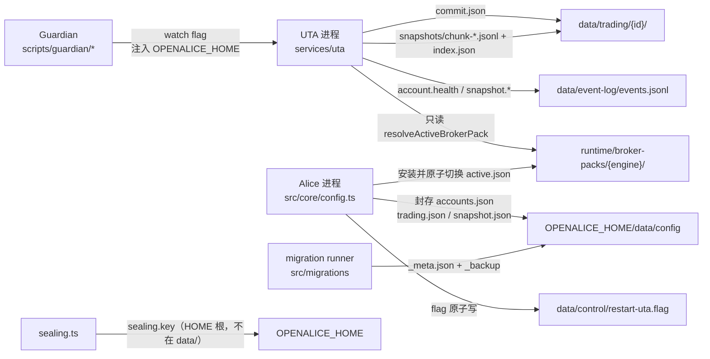

# 09 — 持久化状态、测试体系、文档与已知问题

> 摘要：UTA 的持久化面很小但分散在三个 root（`data/trading`、`data/event-log`、`data/config`）。
> 只有 `accounts.json`（封存）与 `data/config/*.json` 由 Alice 侧 `src/core/config.ts` 拥有；
> 真正的交易域状态（`commit.json`、`snapshots/`）由 UTA 进程自己写。
> 迁移链已在 0.89.2-beta 重置（活跃链 `0039`–`0043`，`NEXT_MIGRATION_NUMBER = 44`），
> 活跃链中**没有任何** UTA 迁移；两条历史 UTA 相邻迁移（`0009_seal_broker_credentials`、
> `0027_repair_snapshot_interval`）已随 `81fe1af88` 退役且不可达。
> 测试体系上，UTA 在 `test:select` 中是一个 owner（8 个 root）与一个 area；
> 实测 74 个 spec 文件（58 hermetic / 1 integration / 4 external-readonly / 11 live-paper、
> 合计 1099 个 `it(`），但几个关键持久化模块（`git-persistence.ts`、`purgeEphemeralUTAs`、
> `restart-trigger.ts`）**零直接测试**。文档层面 `docs/uta-live-testing.md` 是唯一的 UTA
> 行为验收文本，与当前选择器、evidence 覆盖面存在 7 处冲突。
> GitHub 上游 15 个 open issue 与 UTA 相关，最重要的是
> [#1313](https://github.com/TraderAlice/OpenAlice/issues/1313)（mock 状态不落盘）与
> [#294](https://github.com/TraderAlice/OpenAlice/issues/294)（IBKR 静默半开连接）。

---

## 1. 概览与职责边界

### 本区域负责什么

- **持久化全景**：`OPENALICE_HOME` 下所有 UTA 直接或间接读写的路径，标注拥有者模块、格式、
  写入/读取时机、是否已随 release 出货、迁移历史。
- **敏感文件与其保护机制**（只描述机制，不描述内容）。
- **测试体系**：UTA 在 `pnpm test:select` / `scripts/test-lanes.mjs` 中的 owner、lane、area、
  package 定义；各 lane 的环境变量与副作用契约；逐 spec 行为覆盖；行为 × 覆盖等级缺口表。
- **文档与历史决策**：UTA 相关 owner 文档的主张摘要、与代码的冲突、event-system 退役边界、
  `PLANS.md` 与 `plans/` 中的进行中/已完成 UTA 工作。
- **已知问题**：GitHub issue（上游 + fork）与 `docs/incidents/` 中的 UTA 事故。

### 本区域不负责什么

- 各 HTTP 路由的请求/响应契约细节 → 见 `02-http-api-and-protocol.md`。
- 账户/订单/持仓的领域语义、TradingGit 状态机语义 → 见 `03-account-orders-positions.md`。
- 市场数据契约与 FX 计算 → 见 `04-market-data-contracts-fx.md`。
- staging/approval/ledger 的完整状态机 → 见 `05-staging-approval-ledger.md`。
- snapshot 与 guard 的功能语义 → 见 `06-snapshots-and-guards.md`。
- broker 实现与 Broker Pack 加载细节 → 见 `07-brokers-and-packs.md`。
- Alice 侧 UI 与消费者 → 见 `08-alice-consumers-and-ui.md`。

### 上下游关系

关键边界：**UTA 进程不写 `accounts.json`**（`src/services/uta-client/UTAManagerSDK.ts:63-66`
明确 "UTA reads accounts.json on boot"）；账户配置的写入全部在 Alice 侧
`src/webui/routes/trading-config.ts`（`:243, :286, :321` 调用 `writeUTAsConfig`），
然后通过 `notifyUTAReload()`（`:29-38`）触发 Guardian 重启 UTA 生效。

---

## 2. 功能清单：(a) 持久化全景

### 2.1 全景表

相对路径均相对 `OPENALICE_HOME`（默认 `~/.openalice`，`src/core/paths.ts:37`；
env 覆盖在 `:39`；Guardian 显式注入：dev `scripts/guardian/dev.ts:77, :255`，
prod `scripts/guardian/prod.mjs:53, :294`）。
`dataPath(...)` = `<HOME>/data/...`（`src/core/paths.ts:43-49`），
`runtimePath(...)` = `<HOME>/runtime/...`（`src/core/paths.ts:51-57`），
`userDataHome` 导出在 `:97`。

| 路径（相对 `OPENALICE_HOME`） | 拥有者模块 | 格式 | 写入时机 | 读取时机 | 已 shipped？ | 迁移历史 |
|---|---|---|---|---|---|---|
| `data/config/accounts.json` | `src/core/config.ts:709-713`（Alice） | 封存信封 `{$sealed:1, alg, iv, tag, data}`（AES-256-GCM），JSON 缩进 2 + 换行，mode 0600 | `writeUTAsConfig`（`:785-788`）、`purgeEphemeralUTAs`（`:820`）、首次运行 seed（`:724`）、不可解封时重写空（`:745`）、preset 形状迁移后写回（`:778`）——**全部经由 `writeAccountsFile`**（`:709-713`） | 每次读 UTA 配置：`readUTAsConfig`（`:719-783`）、UTA boot（`services/uta/src/main.ts:69`）、Alice 侧 trading-config 路由、`trading-mode.ts`、e2e setup | ✅ 已 shipped（封存随 `0009_seal_broker_credentials` 引入，首个含它的 tag `v0.42.0-beta.1`） | `0009_seal_broker_credentials`（已退役）；preset 形状迁移是**读路径内的惰性代码**，不是 registry 迁移（`config.ts:748-780`） |
| `data/config/accounts.json.backup-pre-preset` | `src/core/config.ts:755-756` | 明文 JSON 数组（legacy 形状） | 检测到 pre-preset 记录时一次性写 | 无代码读取（仅人工恢复） | ✅ shipped（与 legacy 迁移同批） | 无 |
| `data/config/accounts.json.sealed-unreadable-<ts>` | `src/core/config.ts:738-739` | 原封存字节（不可解） | `unseal` 抛错时 `rename` 隔离；随后 `writeAccountsFile([])` 并返回 `[]`（`:745`） | 无代码读取 | ✅ shipped | 无 |
| `data/config/_meta.json` | `src/migrations/runner.ts:24-26, 85-98` | JSON `{appVersion, appliedMigrations:[{id, appliedAt, appVersion}]}` | 每个 pending 迁移成功后写（`runner.ts:143-149`） | 每次 boot：`loadConfig` → `runMigrations`（`config.ts:548`） | ✅ shipped | 迁移日志本身 |
| `data/_backup/<ISO-ts>-<label>/config/` | `src/migrations/runner.ts:102-114` | `data/config/` 的递归拷贝（`cp` recursive） | 每个 pending 迁移执行前（label = `pre-<migrationId>`） | 仅人工恢复 | ✅ shipped | 无 |
| `data/trading/<utaId>/commit.json` | `services/uta/src/domain/trading/git-persistence.ts:14-16, 43-49`（UTA） | JSON `GitExportState` = `{commits: GitCommit[], head: CommitHash\|null}`（`packages/uta-protocol/src/types/git.ts:171-174`），缩进 2，无尾换行 | 每次 `TradingGit` 触发 `onCommit`：`TradingGit.ts:174, 231, 325, 374, 687`；回调由 `createGitPersister` 提供（`uta-manager.ts:71`） | UTA 账户初始化：`loadGitState(cfg.id)`（`uta-manager.ts:64`） | ✅ shipped（`data/trading/<id>/` 路径由 cwd 相对改为 `dataPath()` 的 commit `a3ca28a97`，首个含该 commit 的 tag `v0.42.0-beta.1`） | 无 registry 迁移。形状演进靠读路径容错（`TradingGit.ts:632-645` 补 `multiplier`）+ 一次性脚本 `scripts/migrate-order-sentinels.ts` |
| `data/crypto-trading/commit.json`、`data/securities-trading/commit.json` | `git-persistence.ts:18-23`（UTA） | 同上（legacy） | **无写入路径**（只读 fallback） | `loadGitState` 主路径失败后按硬编码 id（`bybit-main` / `alpaca-paper` / `alpaca-live`）回退读取（`:33-38`） | ✅ shipped（legacy） | 注释明写 `TODO: remove before v1.0`（`:18`）；**无任何测试** |
| `data/trading/<utaId>/snapshots/index.json` | `snapshot/store.ts:23-24, 36-38, 52-57`（UTA） | JSON `SnapshotIndex` = `{version:1, chunks:[{file,count,startTime,endTime}]}` | 每次 append（`:85`）与 delete（末尾）后；原子写 = `${indexPath}.${pid}.tmp` + `rename`（`:52-57`） | `readIndex`（`:43-50`）——`doAppend`/`doDelete`/`readRange` 入口 | ✅ shipped（首个含 snapshot store 的 tag `v0.9.0-beta.8`） | 无 |
| `data/trading/<utaId>/snapshots/chunk-NNNN.jsonl` | `snapshot/store.ts:36-38, 59-61, 63-86` | JSONL，每行一个 `UTASnapshot`（金额字段全部是字符串），`CHUNK_SIZE = 50`，文件名 `chunk-0000` 起 | 每次 snapshot 落盘（`appendFile`，`:84`） | `readRange`（倒序读 chunk） | ✅ shipped | 无 |
| `data/event-log/events.jsonl` | `src/core/event-log.ts:111, 121, 141-149` | JSONL `{seq, ts, type, payload, causedBy?}`，append-only，disk-first 再进内存环形缓冲（默认 500，`DEFAULT_BUFFER_SIZE` 在 `:96`） | UTA 进程写四类：`account.health`（`uta-manager.ts:73`）、`snapshot.skipped`/`taken`/`error`（`snapshot/service.ts:55, 64, 73`） | `read()`（磁盘）、内存环形缓冲；UTA 内部**不消费**自己的 journal | ✅ shipped（`event-log.ts` 自 `v0.9.0-beta.1` 起存在；UTA 的四种事件类型见 `docs/event-system.md:20-22`） | 无 |
| `data/control/restart-uta.flag` | `src/services/uta-supervisor/restart-trigger.ts:53-72`（Alice 写，Guardian 读） | 单个 ISO 时间戳字符串；原子写 = `.tmp` + `rename`（`:66-71`） | 五处触发：config section 写入后（`src/webui/routes/config.ts:422-424`，仅 `trading`/`snapshot`）、trading-config 变更（`routes/trading-config.ts:29-38`）、`UTAManagerSDK.reconnectUTA/removeUTA`（`UTAManagerSDK.ts:187, 196`）、Broker Pack 安装后（`auto-updater.ts:76`）、broker 安装路由（`trading-config.spec.ts:187` 描述的路径） | Guardian `fs.watch(dirname(FLAG_PATH))`：dev `scripts/guardian/dev.ts:144`，prod `scripts/guardian/prod.mjs:584, 608` → SIGTERM UTA → respawn | ✅ shipped（`230aabe26`，首个 tag `v0.30.0-beta.1`） | 无 |
| `runtime/broker-packs/<engine>/active.json` | `src/services/broker-packs/installer.ts:137-146`（写）；`src/core/broker-packs.ts:78-80, 86-`（UTA 只读） | JSON `BrokerPackActivePointer` = `{schemaVersion, engine, release, activatedAt}` | Pack 安装完成后，原子替换（`activeTmp` + `rename`，`installer.ts:144-146`） | UTA 启动/加载 engine 时 `resolveActiveBrokerPack`（由 broker registry 调用） | ✅ shipped（`8a58abee0`，首个 tag `v0.81.0-beta`） | 无 |
| `runtime/broker-packs/<engine>/releases/<version>-<contentId>/` | `installer.ts:134-135` | 不可变目录：`broker-pack.json`、`dist/index.js`、`package.json`、`node_modules/` | 安装时：`mkdir` releases root → `activateImmutableRelease` | `resolveActiveBrokerPack` 逐层 `realpath` + `assertChild` 断言（`broker-packs.ts:108-120`） | ✅ shipped | 无；损坏时安装 `-repair-...` 新 release 而非覆盖（`docs/broker-packs.md:105-108`） |
| `runtime/broker-packs/<engine>/.install.lock/owner.json` | `installer.ts:88, 362-373` | JSON `{pid, startedAt}`；目录存在即锁 | `mkdir` 立即持锁，随后写 owner（`:363-368`） | `isRecoverableInstallLock`（`:375-389`）：owner 死进程或 mtime 超 `INSTALL_LOCK_STALE_MS` 视为可回收；写入失败时 `rm` 回滚（`:370`） | ✅ shipped | 无 |
| `<HOME>/sealing.key` | `src/core/sealing.ts:49-51, 79-90` | 32 字节随机 key 的 base64 单行 + 换行，mode 0600 | 首次 `seal()` 时自动生成（`loadOrCreateKey`，`:79-90`） | 每次 `seal`（`:95`）/ `unseal`（`:115`） | ✅ shipped（`71caa2c59`，首个 tag `v0.42.0-beta.1`） | 无 |
| `data/uta-live-paper-runs/<runId>.jsonl` | `live-paper-evidence.ts:71-84`（测试） | JSONL：`{schemaVersion:1, recordedAt, gitCommit, paper:true, broker:'ibkr', scenario, phase, contract?, ...}` | live-paper 测试显式调用 `recordLivePaperEvidence`：仅 `ibkr-paper.e2e.spec.ts:148, 174, 204` 与 `uta-ibkr.e2e.spec.ts:74` | 无代码读取（人工审阅） | ✅ shipped（`8e9522873`，首个 tag `v0.83.0-beta`） | 无 |
| `data/config/trading.json` | `src/core/config.ts:550, 1085`（Alice） | JSON：`mode?`（`lite\|readonly\|pro`，`:386-393`）、`observeExternalOrdersEvery`（默认 `'15m'`，`:403`）、`keylessDataSources: ('binance'\|'okx'\|'bybit')[]`（默认 `[]`，`:410`） | `parseAndSeed` 首次 seed（`loadConfig` 内，`:526, :568`），或 `PUT /api/config/:section`（`routes/config.ts:402-428`） | `loadConfig` 每次 boot；UTA 读 `observeExternalOrdersEvery`（`main.ts:119-131`）、`keylessDataSources`（`main.ts:71`） | ✅ shipped（`observeExternalOrdersEvery` 自 `b539eb511`，首个 tag `v0.42.0-beta.1`；`keylessDataSources` 首个 tag `v0.75.0-beta`） | `0027_repair_snapshot_interval` 只处理 `snapshot.json`，不处理本文件 |
| `data/config/snapshot.json` | `src/core/config.ts:373-382, 1084` | JSON：`{enabled: boolean（默认 true）, every: string（默认 '15m'，`.transform(trim)` + `parseDuration` 校验）}` | 首次 seed，或 `PUT /api/config/snapshot`（`routes/config.ts:422`）；UTA 重启后生效 | `loadConfig`；UTA 建 snapshot scheduler（`main.ts:110-114`） | ✅ shipped（首个 tag `v0.9.0-beta.8`） | **`0027_repair_snapshot_interval`**（appVersion `0.87.0-beta`）：修复非法/未 trim 的 `every`，已退役但仍记录在案的最近 UTA 相邻迁移 |

口径说明：

- **"已 shipped" 判定依据**：把引入该路径的 commit 用 `git tag --contains` 映射到最早的 release
  tag，再与 `gh release list` 交叉核对；对路径字符串额外用 `git ls-tree` 在每个候选 tag 的 tree
  里验证存在性（避免把 build 产物或 worktree-only 状态误判为 shipped）。
- **为什么活跃链没有 UTA 迁移**：`src/migrations/INDEX.md:6-10` 写明
  "Development-era migrations before `0039` are retired and are not runtime-reachable.
  Fresh baseline homes are seeded directly from current schemas and defaults."
  `src/migrations/registry.ts:4-7` 给出理由：退役链 "could be replayed by an old or isolated
  process against a newer Workspace root"。因此 0.89.2-beta 之前的任何 UTA shape 变更
  **没有**迁移代码可复用。
- **UTA 相关迁移历史**：退役链中与 UTA/trading 有关的只有
  `0009_seal_broker_credentials`（accounts.json 明文 → 封存 + 0600）与
  `0027_repair_snapshot_interval`（`snapshot.json` 的 `every` 修复）。
  活跃链 `0039`–`0043`（`registry.ts:24-30`）的 Affects 列分别是
  workspaces 会话绑定、会话记录、`.alice/issues/*.md` 的 connector flag、
  workspaces 默认 agent、`data/inbox/entries.jsonl`——**没有一个**触及
  `accounts.json`、`data/trading/` 或 `data/event-log/`。
- **下一个可用迁移号是 44**（`registry.ts:22`）。若本次重构要改 `accounts.json` 或
  `commit.json` 的形状，新迁移必须占用 44，且不能复用退役 id（`registry.ts:9-10`）。
- **`runner.ts` 的快照只覆盖 `data/config/`**（`:5-8, :102-114`），
  更大的树（`data/sessions/`、`data/trading/` 等）默认**不**快照；
  触及它们的迁移必须在 `affects` 里声明并自行提示用户。

### 2.2 敏感文件与其保护方式

| 文件 | 敏感性 | 保护机制 |
|---|---|---|
| `data/config/accounts.json` | broker API key / secret / wallet private key / access token 等，位于 `presetConfig` | 整体 AES-256-GCM 信封（`src/core/sealing.ts:28-30, 94-107`）：随机 12 字节 IV、32 字节 key、GCM auth tag；`$sealed: 1` 作为形状判据（`sealing.ts:53-60`）。**每个写入路径都经 `writeAccountsFile`**（`config.ts:704-713`，注释明写 "no code path can regress to plaintext credentials at rest"），写后 `chmod 0600`（file mode 在部分平台被忽略，故补 chmod）。key 存放在 `<HOME>/sealing.key`，**刻意放在 `data/` 之外**——`sealing.ts:4-8` 与 `docs/project-structure.md:428-430` 都明确"备份/同步 `data/` 不携带解密材料"。不可解封时文件被 `rename` 隔离而非删除，随后以空 store 继续启动并打印可操作指引（`config.ts:733-746`） |
| `<HOME>/sealing.key` | 解密上条的唯一材料 | 0600（`sealing.ts:87-88`，writeFile mode + best-effort chmod）；首次 `seal` 时 `randomBytes(32)` 生成；base64 文本；`readKey` 校验解码后恰好 32 字节，否则抛 `UnsealError`（`:63-71`）；`.gitignore:59-61` 显式排除仓库根的 `/sealing.key`（防 `OPENALICE_HOME=$PWD` 实验误提交）。**不做** OS keychain 绑定；信封带 `alg` 字段以保留以后迁到 `safeStorage` 而不破坏格式的可能（`sealing.ts:19-20`）。威胁模型诚实写在该文件头注释（`:10-17`）：防的是 `data/` 离开机器与随手 `grep`/截图/agent `cat`，**不防**同用户恶意软件或已被攻陷的 Alice 进程 |
| `data/config/accounts.json.backup-pre-preset` | 同上，**明文** | 无额外保护（只有 `accounts.json` 本身被封存）。这是唯一已知能绕过 sealing 的凭据副本面 |
| `data/config/auth.json`、`data/config/sessions.json` | Alice 认证材料 | 不在 UTA 范围，但同在 `data/config/`；本机实测 `auth.json` 为 `-rw-------` |
| `runtime/broker-packs/**` | 含第三方 SDK 与 OpenAlice 适配代码，不含凭据 | 安装时校验 SHA-256 + manifest/API 版本；release 目录不可变；`resolveActiveBrokerPack` 对 releases root、release、manifest、entry 逐层 `realpath` + `assertChild` 防目录逃逸（`broker-packs.ts:108-120, 133`） |
| `data/trading/**`、`data/event-log/events.jsonl` | 不含凭据，但含成交价、数量、持仓、账户健康史 | 无 at-rest 加密；防护依赖 `.gitignore:4` 的 `/data/*`。`live-paper-evidence.ts:68-70` 明确约定记录内**不得**含余额、凭据、账户 id、持仓 payload |

### 2.3 生命周期与清理

| 状态 | 创建 | 更新 | 删除/清理 |
|---|---|---|---|
| ephemeral UTA 的 `data/trading/<id>/` | `ephemeral: true` 账户（zod `.refine` 强制只能配 `mock-simulator`，`config.ts:484-487`） | 正常 commit/snapshot | boot 时 `purgeEphemeralUTAs`（`config.ts:811-822`）：逐个 `wipeUTATradingData` 后 `writeUTAsConfig(survivors)`；DELETE 路由也走 `wipeUTATradingData`（`routes/trading-config.ts:330-332`，仅当 `target.ephemeral`）。`wipeUTATradingData` 是 `rm(dir, {recursive:true, force:true})`，注释明确"never touches `data/config/`"（`config.ts:790-800`） |
| 不可解封的 `accounts.json` | — | — | rename 为 `.sealed-unreadable-<Date.now()>` 隔离 + 新建空 store；**永不删除**（`config.ts:733-746`） |
| `data/_backup/**` | 每个 pending 迁移前 | — | **无任何清理逻辑**（会随版本累积；每个迁移全量拷贝 `data/config/`） |
| snapshot chunk | 每 50 条一个新 chunk（`store.ts:68-76`） | 最后一个 chunk `appendFile` + 更新 index | `doDelete`（`store.ts:88-120`）删空 chunk 文件并 `splice` index entry，非空则 `.tmp`+`rename` 重写并更新元数据；route 是 `DELETE /uta/:id/snapshots/:timestamp`（`routes-trading.ts:654`） |
| Broker Pack releases | 安装时（`installer.ts:134-135`） | 激活指针切换 | 复用同 contentId 的 release；损坏时新建 `-repair-...`，**不覆盖**（避免 Windows 上 UTA 正持有的文件） |
| `.install.lock` | `mkdir`（`installer.ts:363`） | — | 正常结束移除；否则 owner pid 死亡或 mtime 过期后回收（`:375-389`） |

### 2.4 内存态 vs 持久态（重构关注点）

| 状态 | 位置 | 进程重启后 |
|---|---|---|
| broker 连接、health 计数、恢复定时器 | `UnifiedTradingAccount.ts` 实例字段 | 丢失，重新 `broker.init()` + 健康探测 |
| TradingGit 的 `commits` / `head` | `TradingGit.ts` 内存数组 | 从 `commit.json` 恢复（`loadGitState` → `savedState` → 构造 UTA） |
| **staged / awaitingApproval 的 pending commit** | 内存（`TradingGit`） | **丢失**；这是 issue [#1313](https://github.com/TraderAlice/OpenAlice/issues/1313) 的核心诉求 |
| MockBroker 的 `_positions` / `_orders` / `_markPrices` / `_cash` | `MockBroker.ts:185-197`（三个 `Map` + 一个 `Decimal`，初始 100 000） | **全部丢失**；`getSimulatorState()`（`MockBroker.ts:761-797`）是纯读快照，**没有** restore API，因此即使想做 replay 也没有恢复入口 [#1313] |
| Cost basis（WAC） | 纯函数从 commit log 重算（`cost-basis.ts:1-10`） | 自动重建，无需持久化 |
| FX live rates / hub table | `FxService` 内存 cache（`fx-service.ts:84-91`） | 丢失，重新按 TTL 拉取 |
| Guard cooldown 的 `lastTradeTime` | `cooldown.ts:9` 的 `Map` | 丢失（冷却窗口重置） |
| Order-sync poller 的 pending 追踪 | 由 `TradingGit` 的 `getPendingOrderIds` 派生 | 从 commit log 重建 |
| snapshot scheduler 定时器 | `createPump`（`scheduler.ts:37-44`） | 随进程重建 |

---

## 3. 功能清单：(b) 测试体系

### 3.1 UTA 在测试选择器中的定义

**Catalog 本体**：`scripts/test-lanes.mjs`。三个维度：
**owners**（`:6-`）= `alice, ui, uta, connector, runtime-cli, desktop, repo-tooling`；
**lanes**（`:84-124`）= `hermetic, integration, external-readonly, live-paper, system`；
**areas**（`:163-240`）= `workspace, uta, workflow, platform, connector-replay, market-data,
ibkr, bybit, okx, alpaca, hyperliquid, bybit-diagnostic, uta-paper`。

**Owner `uta`**（`scripts/test-lanes.mjs:25-37`，project = `node`），8 个 root：
`services/uta`、`packages/uta-protocol`、`packages/ibkr`、
`packages/uta-broker-{alpaca,ccxt,ibkr,leverup,longbridge}`。

**Area 中与 UTA 相关的**：

| area | 定义（`scripts/test-lanes.mjs`） |
|---|---|
| `uta`（`:168-171`） | roots = `ownerSuites.uta.roots` 全量 |
| `ibkr`（`:197-`） | roots `packages/ibkr`、`packages/uta-broker-ibkr`、`services/uta/src/domain/trading/brokers/ibkr` + includes `ibkr-paper.e2e.spec.ts`、`uta-ibkr.e2e.spec.ts` |
| `bybit`（`:205-`） | includes `ccxt-bybit`、`uta-bybit`、`uta-ccxt-bybit` 三个 e2e |
| `okx`（`:213-`） | includes `ccxt-okx.e2e.spec.ts` |
| `alpaca`（`:217-`） | includes `alpaca-paper.e2e.spec.ts`、`uta-alpaca.e2e.spec.ts` |
| `hyperliquid`（`:224-`） | includes `ccxt-hyperliquid-markets.e2e.spec.ts`、`ccxt-hyperliquid.e2e.spec.ts` |
| `bybit-diagnostic`（`:231-234`） | includes `ccxt-raw-diagnostic.e2e.spec.ts` |
| `uta-paper`（`:235-239`） | roots = 全量 uta roots，**excludes** `ccxt-raw-diagnostic.e2e.spec.ts` |
| `market-data` | roots `src/domain/market-data`、`packages/opentypebb` + includes 两个 UTA 侧 e2e（`ccxt-hyperliquid-markets`、`CcxtBroker.e2e`） |

注意后一行的**交叉归属**：`market-data` area 会把两个 UTA 文件拉进来，
因此 `pnpm test:external:readonly --area market-data` 会跑到 UTA 的 CCXT 只读验收。

**Package**：`@traderalice/uta-service`（`services/uta/package.json` 的 `test` script =
`node ../../scripts/run-tests.mjs --package @traderalice/uta-service`）、
`@traderalice/uta-protocol`、`@traderalice/ibkr`、`@traderalice/uta-broker-{alpaca,ccxt,ibkr,leverup,longbridge}`。
五个 `uta-broker-*` 包**没有** `test` script（只有 `build`/`typecheck`/`tsup.config.ts`；
alpaca 另有 `node smoke-compiled.mjs`），因此按 package 选它们会命中 0 个文件。

**命令**（根 `package.json:51-83`，契约由 `scripts/development-test-contract.spec.ts`
与 `scripts/test-lanes.spec.ts` 断言）：

| 命令 | 展开 |
|---|---|
| `pnpm test:owner:uta`（`:56`） | `node scripts/run-tests.mjs --owner uta` |
| `pnpm test:integration:uta`（`:63`） | `--lane integration --area uta` |
| `pnpm test:select`（`:52`） | `node scripts/run-tests.mjs`（可组合维度和 `--list/--explain/--json`） |
| `pnpm test:live:uta-paper`（`:76`） | `--lane live-paper --area uta-paper` |
| `pnpm test:live:{ibkr,bybit,okx,alpaca,hyperliquid}-paper`（`:77-81`） | `--lane live-paper --area <provider>` |
| `pnpm test:live:bybit-diagnostic`（`:82`） | `--lane live-paper --area bybit-diagnostic` |
| `pnpm test:external:readonly:ibkr`（`:75`） | `--lane external-readonly --area ibkr` |
| `pnpm -F @traderalice/uta-service test` | `--package @traderalice/uta-service`（hermetic only） |

选择器语义（`docs/testing.md:78-93`，实现 `scripts/run-tests.mjs`）：
同一维度内 OR、不同维度间 AND（`:78`）；默认 lane 是 `hermetic`；零命中 **fail closed**
（`run-tests.mjs:296`）；`--list`/`--explain`/`--json` 是 dry-run，不加载测试模块、不探测凭据，
最终打印 `[test-select] dry-run: no tests ran; credentials and prerequisites were not probed`
（`:263, :315`）；`system` lane 在通用选择器里是 inventory-only（`run-tests.mjs:226-228`）。
`run-tests.mjs:298-302` 还强制每个文件"恰好一个 lane + 恰好一个 owner"的不变量，违反即
`catalog ownership/lane invariant failed`。

**实测计数**（本机执行 `--owner uta --lane <lane> --list`）：

| lane | 文件数 | `it(` 合计 | 注释 |
|---|---|---|---|
| hermetic | 58 | 约 990 | 默认 lane；`--owner uta --list` 只列这一层 |
| integration | 1 | 15 | `uta-lifecycle.e2e.spec.ts`（MockBroker） |
| external-readonly | 4 | 14 | IBKR connect/contract-details + hyperliquid-markets + CcxtBroker.e2e |
| live-paper | 11 | 77 | 10 个 `__test__/e2e/*` + `packages/ibkr/tests/e2e/order-precision.e2e.spec.ts` |
| **合计** | **74** | **1099** | 含 hermetic 层里 16 个 `packages/ibkr/tests/*.spec.ts` 与 1 个 uta-protocol spec |

计数口径提醒：catalog 是**文件系统 glob**（`collectRepositorySpecFiles`，
`scripts/test-lanes.mjs:365-`），落在 owner root 下的任何 `*.spec.ts` 都会被计入。
因此重构期间由其他 agent 创建的临时探针文件（例如当时存在的
`snapshot/__probe6.spec.ts` 等）会让同一命令的计数暂时变大；本表的 74/58/1099
是**不含**这类探针的稳定基线。复现时请以 git 追踪的文件为准。

### 3.2 各 lane 的副作用契约与环境要求

| lane | config（`test-lanes.mjs:85/92/99/109/121`） | 副作用 | 覆盖前提 | 环境变量 |
|---|---|---|---|---|
| hermetic | `vitest.config.ts` | 仅临时本地文件与 test-owned 子进程 | workspace 依赖已安装 | `vitest.setup.ts:23-27` 强制把 `OPENALICE_HOME`、`AQ_LAUNCHER_ROOT`、`OPENALICE_GLOBAL_DIR` 指向同一 per-worker 临时树（`mkdtempSync`），除非测试自己 `vi.resetModules()` 后覆写 |
| integration | `vitest.e2e.config.ts` | 仅临时本地文件与 test-owned 本地进程 | 同上 | 同样加载 `vitest.setup.ts`；`fileParallelism: false`、`pool: 'forks'`、`singleFork: true`、`testTimeout: 60_000` |
| external-readonly | `vitest.external.config.ts` | 网络读取 + 读本地 provider 配置；**永不提交订单** | 选中 spec 自己声明网络/provider/TWS 前提；全 skip 不算通过 | `CCXT_E2E=1`、`TWSE_LIVE=1`、`CCXT_INIT_RETRIES=2`、`CCXT_INIT_RETRY_BASE_MS=250`。**刻意不加载** `vitest.setup.ts`（否则真实本地配置会被替换掉） |
| live-paper | `vitest.uta-live.config.ts` | 网络访问 + 对已核实的 demo/paper 账户写入 | 逐一核实账户是 demo/paper 并记录 pre-run 持仓与挂单；成功与失败后都要回到 baseline；全 skip 不算通过 | 同上 + `OPENALICE_UTA_LIVE_PAPER=1`。该 config 顶部直接调 `assertLivePaperAcknowledgement()`（`test-lanes.mjs:450-457`），**在收集测试之前**就抛错；可选 `OPENALICE_UTA_LIVE_RECORD_DIR`、`OPENALICE_UTA_LIVE_RUN_ID`。同样不加载 `vitest.setup.ts` |

**额外安全闸门**（`scripts/run-tests.mjs:229-234`）：若选中了
`ccxt-raw-diagnostic.e2e.spec.ts`（一个真实市价买入 + best-effort 平仓的诊断脚本）
而没有显式 `--area bybit-diagnostic`，选择器把它放进 `executionBlockers` 直接拒绝执行；
`uta-paper` area 通过 `excludes` 把它排除（`test-lanes.mjs:238`）。

`packages/ibkr/tests/e2e/order-precision.e2e.spec.ts` 被计入 live-paper 但不在任何 provider
area 中，只能被 `--area uta-paper` 或直接按 package 的 live 选择命中。

### 3.3 live-paper 场景目录（`docs/uta-live-testing.md:233-361`）

UTA 的 live 验收不是"跑测试文件"，而是人工 + AI 会话驱动的场景目录 S1–S14
（`S1` 在 `:240`，`S14` 在 `:349-361`），每场景标注它防的 bug 类别：

| 场景 | 内容 | 守卫的 bug 类 |
|---|---|---|
| S1 | 读态一致：account 级 unrealizedPnL == positions 求和；portfolio 行带 `secType` + `aliceId` | PnL 聚合漂移、同 symbol spot/perp 不可区分 |
| S2 | 简单生命周期：可成交限价（quote×1.003）→ `[sync]` commit 出现 → `order trades` → 卖回 | 成交感知缺失、execution 数据丢失 |
| S3 | Hanger 稳定：深价挂单 ≥3 个 poller 周期仍 `Submitted` → cancel 记录 `cancelled` | "absence as terminal" 误判、poller churn |
| S4 | 改单：hanger → modify（价格 AND 数量）→ 同精度 orderId → cancel | `editOrder` venue 差异、id 截断 |
| S5 | 附加 TP/SL：未验证 override 的 ccxt venue 必须**大声拒绝**；verified venue 必须两条保护腿都存在 | 静默无保护仓位（okx）与"账本盲于真实保护"（alpaca） |
| S6 | 独立止损：`STP` 深触发价 → 跨 pass 保持 `submitted`（algo 命名空间不可见）→ cancel | 条件单类型映射、algo 命名空间追踪 |
| S7 | 外部订单观测：直连 broker 下单（git 看不到）→ 观测节奏内出现 `[observed]` → pending takeover | 叙事缺口、listing 命名空间盲区 |
| S8 | 重启存活：hanger 在位时重启 UTA → 仍可追踪、同步、取消 | 对内存缓存的依赖 |
| S9 | 部分平仓：SPOT 必须**不**发 reduceOnly，perp 必须发 | 衍生品参数泄漏到现货 |
| S10 | 名义金额下单：`--orderType MKT --cashQty 30` | amount-vs-cost 语义（bybit market-buy）、换算漂移 |
| S11 | 错误人机工程：坏 aliceId、未知 `--source`、越界限价、改不存在的 id | 让 agent 卡死的错误 |
| S12 | Staging 撤销：stage → `git reject --reason` → 历史记 `user-rejected` | 审批流死胡同 |
| S13 | Hub/leaf 身份：目录行标 `expandable: true` 且 aliceId 必须**拒绝**交易 | symbol-key-assumes-STK 误解析 |
| S14 | 衍生品符号与单位四组合矩阵（long/short × call/put） | 单位不一致成本基础、symbol 碰撞重估、符号反转 |

计分板在 `docs/uta-live-testing.md:363-`：Round 1–5（2026-06-12，okx + bybit + alpaca demo）
约 20 个 bug，PR #325–#333；Round 6（alpaca 开盘）3 个 bug；Round 7（IBKR paper 首次验收）
5 个发现。这些数字是**文档主张**，未附可复现的自动化证据，`[推断]` 来自人工会话记录。

另有一套"新 broker 验收清单"（`:311-`），首条即
"`getOpenOrders` must SEE a real open order you placed — empty-without-error is the silent
failure mode"，说明这一类失败在历史上真实发生过（bybit spot 在 `defaultType 'swap'` 下返回 `[]`）。

### 3.4 逐 spec 行为覆盖

下表"测试数"是本机 `it(` 计数；"覆盖的行为"是 spec 内 `describe`/`it` 标题归纳的行为面。

**A. UTA 核心（`services/uta/src/domain/trading/`）**

| Spec | 测试数 | 覆盖的行为 |
|---|---|---|
| `UnifiedTradingAccount.spec.ts` | 109 | read-only/keyless 账户变更守卫、sub-account 写入消歧、operation dispatch、staging/commit/push/reject、health 状态机、aliceId 解析、TPSL 透传、精度 |
| `uta-manager.spec.ts` | 22 | add/remove UTA、listUTAs、`resolve`、`getAggregatedEquity`、`searchContracts`、reconnect 分支 |
| `__test__/uta-health.spec.ts` | 14 | 初始连接成功/失败、指数退避恢复、运行时断开 → degraded/offline、任意成功调用重置、离线时 fail-fast、staging/commit 在离线仍可用、`close()` 取消恢复定时器 |
| `git/TradingGit.spec.ts` | 66 | add / commit / push / log / reject / expected hash、状态转换、sync |
| `snapshot/snapshot.spec.ts` | 37 | 五个 describe（builder `:60`、store `:229`、service `:373`、scheduler `:481`、post-push/reject hooks `:570`）。builder：字符串金额、aliceId 而非完整 contract、OPT 元数据、只收 Submitted/PreSubmitted、离线返回 null；store：首 chunk、50 条滚动、index 元数据、倒序、limit、时间区间、跨 chunk、空 store、并发 append 的写锁；service：`snapshot.taken` 事件、未知账户返回 null、builder 失败记 `snapshot.skipped`、单账户失败不影响其他；scheduler：`runNow`、start 幂等（`:511`）、disabled 不自动触发（`:519`）、处理锁（`:531`）、`stop`、错误不崩 |
| `guards/guards.spec.ts` | 23 | MaxPositionSize、Cooldown、SymbolWhitelist、pipeline 组合、`resolveGuards` 未知类型、`registerGuard` |
| `cost-basis.spec.ts` | 22 | `recomputeCostBasisFromCommits` 全路径 + sync fills 折叠 |
| `position-math.spec.ts` | 16 | `derivePositionMath`、`pnlOf`、`multiplierToDecimal`、`aggregateAccountFromPositions` |
| `contract-discipline.spec.ts` | 15 | secType 分类法、universal 字段校验、OPT/FOP、FUT、STK/CRYPTO、`assertContract` |
| `contract-search-rules.spec.ts` | 15 | pattern 归一化：crypto/currency 去 quote 后缀、equity/commodity 恒等、unknown 默认、边界 |
| `fx-service.spec.ts` | 19 | hub FX 表、live cache TTL、优先级（fresh → hub → vendor → stale → default）、stale 标记 |
| `order-history.spec.ts` | 7 | `projectOrderHistory`、`projectTradeHistory` |
| `order-entry.spec.ts` | 6 | `executeOneShotOrder` |
| `order-sync-poller.spec.ts` | 4 | 全生命周期 push → pending → 价格穿越 → poller 记入 git；跳过 keyless/unhealthy/无 pending；外部订单先慢车道后被快车道接管；单账户失败不影响其他 |
| `contract-search.spec.ts` | 2 | `searchTradeableContracts` 数据源参与 |
| `keyless-data-uta.spec.ts` | 6 | keyless 数据 UTA 注入与去重 |

**B. Broker 实现**

| Spec | 测试数 | 覆盖的行为 |
|---|---|---|
| `brokers/alpaca/AlpacaBroker.spec.ts` | 47 | init 凭据校验与 401 重试、searchContracts、placeOrder（含 bracket/oto/bracket 三种 order_class、legs 返回、合约解析失败）、精度（含 IEEE trap 值）、getPositions 映射、getContractDetails、modifyOrder（null-check 不发未设置的 lmtPrice/auxPrice）、cancelOrder、closePosition（原生全平 vs 反向市价部分平） |
| `brokers/alpaca/alpaca-multi-asset.spec.ts` | 11 | 多资产身份与写入（分数数量、期权被拒）、只读数据端点（crypto snapshot 而非 stock、降序分页 crypto bars、provenance/feed/continuation token、OI 日期不全丢、entitlement 失败不静默切 feed）、close/amend 边界 |
| `brokers/ccxt/CcxtBroker.spec.ts` | 95 | constructor + env proxy 单一化、searchContracts 过滤/排序、cancelOrder cache、notional → size 换算、placeOrder 永不返回 execution（成交靠 sync）、`getOrder` 在 bybit/default 两种走法 + `{stop:true}` 条件单 fallback + tpsl 提取、getContractDetails |
| `brokers/ccxt/CcxtBroker.guard.spec.ts` | 4 | 构造期 demo/sandbox 守卫（okx 无 demo endpoint、binance 支持、demo+sandbox 组合被拒、sandbox 无 testnet） |
| `brokers/ccxt/ccxt-contracts.spec.ts` | 9 | CCXT 合约解析（详见 `07`） |
| `brokers/ccxt/ccxt-tools.spec.ts` | 5 | CCXT 工具注册（详见 `07`） |
| `brokers/ccxt/exchanges/bybit.spec.ts` | 2 | `fetchAllOpenOrders` 扫 spot+swap 并按 id 合并；某 category 失败必须抛（不能返回部分列表） |
| `brokers/ccxt/exchanges/bitget.spec.ts` | 8 | Classic 账户读法（spot/USDT-M 分离钱包、swap 余额 pin 到 USDT-FUTURES、positions pin、全命名空间 open orders、跨命名空间去重、不同 symbol 同 id 不碰撞、单命名空间失败即抛） |
| `brokers/ccxt/exchanges/bitget.ccxt.spec.ts` | 3 | CCXT 版本路由契约（默认 spot、显式 USDT-M、TP/SL plan 命名空间） |
| `brokers/ccxt/exchanges/hyperliquid.spec.ts` | 11 | unified/portfolioMargin 只读 spot clearinghouse、Standard 模式失败必须传播、仍 quoted 的字符串、显式 type 优先、不可读 mode 拒绝、`params.user` 优先、mode 缓存 TTL、不同 user 不复用缓存、`mergeBalanceLedgers`、真实 CCXT 路由 |
| `brokers/ibkr/IbkrBroker.spec.ts` | 26 | canonical conId 解析、附加 TP/SL 拒绝闸门、nativeKey 语法（hub/leaf）、混合币种数学（#295/#314）、期权持仓 snapshot mark overlay（#314）、死连接闸门（#294）、fixture corpus（`__fixtures__/contract-resolution.v1.json`：AAPL STK、USD.CHF CASH、SEHK 700） |
| `brokers/ibkr/request-bridge.spec.ts` | 18 | 连接握手、错误路由、socket 探测与快照、account cache delta 语义、currency-aware account values（#295） |
| `brokers/longbridge/LongbridgeBroker.spec.ts` | 69 | symbol 解析/构造/round-trip、order type & TIF 映射、状态映射、订单全操作 |
| `brokers/others/leverup/LeverupBroker.spec.ts` | 34 | config & lifecycle、searchContracts、nativeKey roundtrip、placeOrder、closePosition、modify/cancel 始终拒绝 |
| `brokers/mock/MockBroker.spec.ts` | 40 | 精度、placeOrder、closePosition、cancelOrder、modifyOrder、`getOrder`、simulator 状态 |
| `brokers/contract-builder.spec.ts` | 14 | `buildContract` 默认值与校验、`buildPosition` 透传 vs 推导 |
| `brokers/fuzzy-rank.spec.ts` | 13 | `fuzzyRankContracts` 排序 |
| `brokers/presets.spec.ts` | 38 | `BROKER_PRESET_CATALOG`、preset → engine 转换、`isPaperPreset`、内置 preset、`deriveUtaId` |
| `brokers/registry.spec.ts` | 5 | engine registry：Broker Pack 从 `runtime/broker-packs/` 解析（用 `OPENALICE_HOME` 临时树 + 手写 release 目录） |

**C. HTTP 边界（`services/uta/src/http/`）**

| Spec | 测试数 | 覆盖的行为 |
|---|---|---|
| `routes-trading-wallet.spec.ts` | 4 | wallet push/reject 的 expected-hash 契约 |
| `trading-order-entry.spec.ts` | 15 | `POST /uta/:id/wallet/place-order`、`close-position`、`cancel-order` 的参数校验与错误 |
| `simulator.spec.ts` | 10 | 只列 MockBroker UTA、完整 state 快照、mark-price 自动成交、malformed body 400、钱包来源持仓注入、外部成交标记、手工 fill、未知 orderId 400 |
| `broker-research.spec.ts` | 4 | Broker research HTTP 边界 |

**D. 协议、工具面与启动**

| Spec | 测试数 | 覆盖的行为 |
|---|---|---|
| `packages/uta-protocol/src/types/broker.spec.ts` | 2 | `BrokerError.from` |
| `services/uta/src/__tests__/trading-tools.spec.ts` | 20 | `UTAManager.resolve/resolveOne` 消歧、`createTradingTools` 的 listUTAs/searchContracts/getOrders 摘要/getQuote |
| `services/uta/src/uta-startup-resilience.spec.ts` | 1 | 真实子进程启动，一个 IBKR 账户在协议握手阶段失败时 UTA 仍持续服务（假 TWS server + `mkdtemp` home + 保留端口）。`STARTUP_READINESS_TIMEOUT_MS = 30_000`（`:13`），注释解释这是为老 Windows 主机从 10s 提高的结果（对应 issue #723） |
| `src/services/uta-client/UTAManagerSDK.spec.ts`（owner `alice`） | 8 | `resolve` tier 过滤（#390）、数据源参与、carrier 不可用、readonly 产品模式、混合资产历史质量 |

**E. live-paper / e2e（按 lane 归属）**

| Spec | 测试数 | lane | 覆盖的行为 |
|---|---|---|---|
| `__test__/e2e/uta-lifecycle.e2e.spec.ts` | 15 | integration | MockBroker 全生命周期：市价买 → push 返回 submitted → 持仓出现 → cash 减少；limit → submitted → fill → sync；部分/全部平仓；取消；trading history；TPSL 端到端透传与缺省；精度端到端 |
| `__test__/e2e/alpaca-paper.e2e.spec.ts` | 11 | live-paper | 连通性（account/clock/search/positions）、下单生命周期、开盘时段 fill + 持仓 |
| `__test__/e2e/ibkr-paper.e2e.spec.ts` | 11 | live-paper | 连通性、contract details with conId、币种追踪、canonical conId what-if 路由、下单生命周期、开盘时段 fill + 只平本测试创建的数量 |
| `__test__/e2e/ccxt-bybit.e2e.spec.ts` | 9 | live-paper | account/positions/search、市价买 → execution、持仓验证、reduceOnly 平仓、按 id 查单、TPSL 读回、条件单按 id 查（#90） |
| `__test__/e2e/ccxt-okx.e2e.spec.ts` | 10 | live-paper | account（demo 约 100k USDT）、positions（衍生品 + 现货合成）、spot/perp 搜索、现货买入/卖出、perp 买卖与 reduceOnly 平仓、按 id 查单 |
| `__test__/e2e/ccxt-hyperliquid.e2e.spec.ts` | 8 | live-paper | USD baseCurrency、positions、perp 搜索、市价买、持仓验证、reduceOnly 平仓、按 id 查单 |
| `__test__/e2e/uta-alpaca.e2e.spec.ts` | 5 | live-paper | limit 全生命周期、AI 工具 aliceId round-trip、contract details、TPSL bracket legs、AAPL 买卖平 |
| `__test__/e2e/uta-bybit.e2e.spec.ts` | 5 | live-paper | ETH perp 全生命周期、AI 工具 aliceId、getOrderBook/getFundingRate、contract details、TPSL |
| `__test__/e2e/uta-ccxt-bybit.e2e.spec.ts` | 5 | live-paper | 全生命周期、TPSL、reject 记 `user-rejected`、无原因 reject、sentinel 不越过 status/show/exportState 边界 |
| `__test__/e2e/uta-ibkr.e2e.spec.ts` | 4 | live-paper | FX leaf conId 身份（symbol 仅显示用）、limit 生命周期、TPSL 透传不中断下单、AAPL 买卖平（含 live-paper evidence 记录） |
| `__test__/e2e/ccxt-raw-diagnostic.e2e.spec.ts` | 6 | live-paper（需显式 area） | 原始 CCXT Bybit 诊断：createOrder 原始响应、fetchClosedOrders id 格式、fetchOpenOrders、spot vs perp id 格式、market.id vs symbol、有无 since 的差异 |
| `packages/ibkr/tests/e2e/order-precision.e2e.spec.ts` | 3 | live-paper | IBKR 精度端到端 |
| `__test__/e2e/ccxt-hyperliquid-markets.e2e.spec.ts` | 4 | external-readonly | testnet sandbox 连接、≥100 markets、spot **和** swap 都加载（回归）、能搜到 BTC perp |
| `brokers/ccxt/CcxtBroker.e2e.spec.ts` | 1 | external-readonly | keyless（无凭据）跨 Binance/OKX/Bybit 的 K 线新鲜度回归 |
| `packages/ibkr/tests/e2e/connect.e2e.spec.ts` | 4 | external-readonly | TWS/Gateway 连接 |
| `packages/ibkr/tests/e2e/contract-details.e2e.spec.ts` | 5 | external-readonly | conId / contract details |

**F. `packages/ibkr/tests/` 的 16 个 hermetic spec**（协议解码层，合计 102 个 `it(`）：
`account-summary-tags`(2)、`comm`(14)、`inbound-framing`(4)、`models`(8)、`order-condition`(4)、
`order-precision`(13)、`protobuf-decode`(6)、`reader-recovery`(2)、`text-account-decode`(6)、
`text-contract-decode`(2)、`text-execution-decode`(2)、`text-historical-decode`(4)、
`text-market-data-decode`(4)、`text-misc-decode`(6)、`text-order-decode`(2)、`utils`(23)。

**G. Alice 侧（owner `alice`）与 UTA 直接相关的 spec**

| Spec | 测试数 | 覆盖的行为 |
|---|---|---|
| `src/core/config-accounts.spec.ts` | 4 | accounts 封存 at-rest：写→信封 + 0600（`:44`）、首运行 seed 空 store + sealing key（`:62`）、仍可读 legacy 明文数组（`:69`）、隔离不可解封并空恢复（`:79`） |
| `src/core/sealing.spec.ts` | 8 | seal/unseal 往返、密文不含明文、首 seal 创建 owner-only key、跨 seal 复用同一 key、key 缺失/被换/格式错时抛 `UnsealError`、`isSealedEnvelope` 判据 |
| `src/core/config.spec.ts` | 37 | 其中 `readUTAsConfig` 块（`:205-265`）：空返回 + seed、preset 形状解析、legacy ccxt 自动迁移 + 备份原文件（`:228`）、legacy alpaca + ibkr（`:247`）、未知 ccxt exchange 回退 `ccxt-custom`（`:257`）；`writeUTAsConfig` 块（`:266-283`）：写校验、缺字段抛 ZodError；另有 snapshot interval 归一化（`:313`） |
| `src/core/event-log.spec.ts` | 35 | seq 恢复、环形缓冲、read 过滤、订阅 fan-out |
| `src/core/broker-packs.spec.ts` | 11 | active.json 解析、API 版本不匹配、realpath 逃逸断言 |
| `src/services/broker-packs/installer.spec.ts` | 17 | 安装事务、校验和、staging、原子指针、安装锁回收 |
| `src/webui/routes/trading-config.spec.ts` | 22 | 账户增删改、discover、test-connection、broker pack 安装触发 UTA 重启（`:187`）、安装失败不重启（`:196`） |
| `src/webui/routes/config-snapshot.spec.ts` | 1+ | 持久化 snapshot 设置后请求 UTA 重启（`:29-43`） |
| `src/webui/routes/trading-proxy.spec.ts` | 10 | Alice → UTA BFF 代理与 lite/readonly 拦截 |
| `src/services/trading-mode.spec.ts` | 4 | trading mode 解析（env > config > auto）、`isUTADisabled` |
| `src/services/optional-carrier/health.spec.ts` | 7 | `decodeUTAHealth` + carrier 健康判定 |
| `src/services/connector-client/uta-review.spec.ts` | 10 | 连接器审批路径（Telegram claim/push/reject、哈希不一致、过期） |
| `src/tool/trading.spec.ts` | 18 | AI 工具表面 schema 与错误路径 |
| `src/tool/trading-compact.spec.ts` | 11 | 压缩投影（contract/commit/pushResult） |

### 3.5 测试覆盖缺口表（行为 × 覆盖等级）

覆盖等级：**强**（有针对性 spec，覆盖主要分支与边界）/ **弱**（间接覆盖或只有 1–2 条路径）/
**仅 live**（只有需要真实账户的验收，无 hermetic 回归）/ **无**。

| 行为 | 覆盖等级 | 证据 / 缺口 |
|---|---|---|
| `accounts.json` 封存往返 + 0600 + legacy 明文可读 + 不可解封隔离 | 强 | `src/core/config-accounts.spec.ts:43-100`（4 例）、`src/core/sealing.spec.ts:34-100`（8 例） |
| `accounts.json` preset 形状惰性迁移（legacy ccxt/alpaca/ibkr、未知 exchange 回退） | 强 | `src/core/config.spec.ts:216-265` |
| 首次运行 seed 空封存 store 并提前物化 `sealing.key` | 强 | `config-accounts.spec.ts:62`、`config.spec.ts:206-214` |
| **ephemeral UTA 的 boot purge + `data/trading/<id>/` 递归删除** | **无** | `purgeEphemeralUTAs`（`config.ts:811-822`）与 `wipeUTATradingData`（`:797-800`）在全部 `*.spec.ts` 中**零命中**（全仓 grep 只命中定义与两处调用点）。`ephemeral` 的 zod refine（`:484-487`）也无 spec |
| **`git-persistence.ts`：主路径读、legacy 回退、写 callback** | **无** | 全仓 grep `loadGitState\|createGitPersister\|git-persistence` 在 spec 中**零命中**。三条硬编码 legacy 路径（`bybit-main`/`alpaca-paper`/`alpaca-live`）完全未测 |
| `commit.json` 的 rehydrate 容错（Decimal 转换、缺失 multiplier 补 `'1'`） | 弱 | `TradingGit.spec.ts`（66 例）覆盖 commit/restore 语义，但"老文件缺 multiplier"这一具体历史形状（`TradingGit.ts:632-645` 的注释描述的 Phase 1 之前形状）未见针对性用例；`scripts/migrate-order-sentinels.ts` 是一次性脚本、无测试 |
| snapshot store 全部行为（chunk 滚动、index 原子写、跨 chunk 读、并发 append） | 强 | `snapshot/snapshot.spec.ts:229-372` |
| snapshot scheduler 生命周期（start 幂等、stop、处理锁、错误不崩） | 强 | `snapshot.spec.ts:481-568` |
| `data/event-log/events.jsonl` 的 seq 恢复、环形缓冲、read 过滤 | 强 | `src/core/event-log.spec.ts`（35 例，owner `alice`） |
| UTA 侧四类 journal 事件的 payload 形状 | 弱 | `snapshot.spec.ts:398-432` 断言 `snapshot.taken`/`snapshot.skipped` 事件存在；`account.health` 的 payload 形状（`uta-manager.ts:73` 展开 health 对象）无专测 |
| `data/control/restart-uta.flag` 的原子写 + `startedAt` 变化轮询 | 弱 | `trading-config.spec.ts:187-203` 与 `config-snapshot.spec.ts:29-43` 用 mock 断言 `triggerUTARestart` 被调用一次/不被调用；真实 flag 写入与 Guardian watch 的联动由 `scripts/guardian/shared.spec.ts` 与 `scripts/guardian/smoke.ts` 覆盖（system 路径）。`restart-trigger.ts` 自身**无 spec** |
| `uta-supervisor/health.ts` 的 `decodeUTAHealth` + `waitForUTAReady` | 弱 | 通过 `src/services/optional-carrier/health.spec.ts`（7 例）间接覆盖；`health.ts` 自身无 spec |
| `uta-supervisor/url.ts` 的 URL/env 解析与 lite 判定 | 弱 | 被 `src/services/trading-mode.spec.ts`（4 例）间接覆盖 `isUTADisabled` |
| Broker Pack active.json 解析、API 版本不匹配、realpath 逃逸断言 | 强 | `src/core/broker-packs.spec.ts`（11 例）、`brokers/registry.spec.ts`（5 例） |
| Broker Pack 安装事务（校验和、staging、原子指针、安装锁回收） | 强 | `src/services/broker-packs/installer.spec.ts`（17 例） |
| Broker Pack 自动更新 reconcile | 弱 | `scripts/broker-pack-upgrade-smoke.ts` 是 system/CI 路径；`auto-updater.ts` 无 unit spec。issue [#1468](https://github.com/TraderAlice/OpenAlice/issues/1468) 正是这条路径的缺陷 |
| UTA 进程启动韧性（单账户握手失败不拖垮进程） | 弱 | `uta-startup-resilience.spec.ts` 只有 1 例，历史上因 Windows 争用超时（issue #723，已 closed，超时 10s → 30s） |
| Mock 状态跨重启存活 | **无** | `MockBroker` 只有 `getSimulatorState()` 读快照（`MockBroker.ts:761-797`），**没有** restore 入口；issue [#1313](https://github.com/TraderAlice/OpenAlice/issues/1313) |
| Guard 决策语义（仓位上限、冷却、白名单） | 强 | `guards/guards.spec.ts`（23 例） |
| Guard 状态的持久性 | **无**（设计上如此） | cooldown 只有内存 `Map`（`cooldown.ts:9`），重启即重置；没有任何 spec 声明这一语义 |
| 订单/TPSL 在真实 venue 的语义 | 仅 live | S2–S6、S14（`docs/uta-live-testing.md:233-361`）；`uta-lifecycle.e2e.spec.ts` 用 MockBroker 只覆盖协议流，不覆盖 venue 行为 |
| 精度端到端（stage → push → position） | 强（mock）+ 弱（live） | `uta-lifecycle.e2e.spec.ts`；各 broker spec 有独立精度例；IBKR 另有 live-paper `order-precision` |
| keyless UTA 只读边界 | 强 | `keyless-data-uta.spec.ts`（6 例）、`UnifiedTradingAccount.spec.ts` 的 read-only/keyless 守卫 |
| trading mode 解析（env > config > auto） | 强 | `src/services/trading-mode.spec.ts`（4 例） |
| Alice→UTA BFF 代理与 lite/readonly 拦截 | 强 | `src/webui/routes/trading-proxy.spec.ts`（10 例） |
| trading-config 路由（账户增删改、discover、test-connection） | 强 | `src/webui/routes/trading-config.spec.ts`（22 例） |
| AI trading 工具表面 | 弱 | `src/tool/trading.spec.ts`（18）+ `trading-compact.spec.ts`（11），但 `createTradingTools`（`src/tool/trading.ts:209-932`）实际返回 **26 个 tool**（`grep -c 'tool({'` = 26）。schema 校验有覆盖，工具级端到端语义主要靠 live |
| 连接器审批路径（Telegram claim/push/reject、哈希不一致、过期） | 强 | `src/services/connector-client/uta-review.spec.ts`（10 例） |
| 旧 `data/crypto-trading` / `data/securities-trading` 路径的兼容 | **无** | 无 spec；`TODO: remove before v1.0` 仍在（`git-persistence.ts:18`） |
| `data/_backup` 的无界增长 | **无** | 无清理逻辑也无测试 |
| `data/uta-live-paper-runs/` 的 evidence 记录格式 | 弱 | `recordLivePaperEvidence` 只在 IBKR 两个 live spec 中被调用，且 `broker` 字段**硬编码 `'ibkr'`**（`live-paper-evidence.ts:83`）；其他 venue 不写 run record，与 `docs/uta-live-testing.md:93-` 的"每次 live run 都要记录"要求存在落差 |
| UTA 与 Alice 之间的认证 | **无**（设计中缺失） | `services/uta/src/main.ts` 无任何 auth middleware；`CHANGELOG.md:32-34` 明确 "Not yet shipped: auth gate between Alice and UTA"。绑定 127.0.0.1（`main.ts:5-6`） |
| `accounts.json` 与 `data/trading/` 的对应关系（账户删除后目录残留等） | **无** | 全仓无 spec 覆盖这一对应；`data/trading/<id>` 的目录名就是账户 id（`git-persistence.ts:15`、`store.ts:37`、`config.ts:798`），因此重命名账户 = 历史静默丢失 |

**缺口汇总（按风险排序）**

1. **持久化的 commit 链只有间接覆盖**：`git-persistence.ts` 的路径选择、legacy fallback、
   写失败处理全部无测。任何重构动这个文件都是裸奔。
2. **ephemeral 清理无测**且是这个区域里唯一有数据破坏性的代码路径（`rm -rf` 语义），
   它的唯一守卫是一个 zod refine。
3. **Mock 状态无恢复路径**：既是 issue #1313 的诉求，也是"用 mock 做 paper rehearsal"
   的前置条件（#1313 正文明确这一点）。
4. **live-paper 的 run record 只在 IBKR 落地**，与文档要求不符。
5. **`uta-supervisor` 三文件无直接 spec**：`restart-trigger.ts` 是 Alice 唯一能重启 UTA 的手段，
   其失败模式（Guardian 没在跑、flag 被吞、health 一直返回旧 `startedAt`）没有回归。
6. **AI 工具表面（26 个）与 spec 覆盖不匹配**：schema 层有 18 例，工具级语义靠 live 兜底。

---

## 4. 功能清单：(c) 文档与历史决策

### 4.1 UTA 相关文档主张摘要

| 文档 | 主张摘要 | 与当前代码的关系 |
|---|---|---|
| `docs/uta-live-testing.md`（407 行） | 分层验证表（`:34-`）、live-paper run record 契约（`:91-118`）、ground rules（`:129-`）、setup（`:170-`）、S1–S14 场景目录（`:233-361`）、新 broker 验收清单（`:311-`）、计分板（`:363-`）、IBKR 半开与期权 mark 两条只读检查（`:194-`，明确"不授权任何下单，UTA 与 Gateway 都配成只读也安全"） | **大体一致**，见 4.2 冲突项 |
| `docs/testing.md`（168 行） | 命令命名空间表（`:18-28`）、7 个 owner（`:32-40`，UTA 行在 `:36`）、integration/contract 命令（`:42-45`）、system 边界（`:47-56`）、`test:select` 可组合性与选择语义（`:65-93`）、副作用与验收（`:95-`，live 门槛在 `:112`） | **与代码一致**（逐条核对了 `test-lanes.mjs`、`run-tests.mjs`、`package.json`）。唯一不精确处：UTA owner 行的 scope 描述是 "UTA service, protocol, broker packages, and IBKR package"，会把 `packages/uta-broker-*` 五个 wrapper 误读为"broker packages 之外的第三方"——属描述不完整而非错误 |
| `docs/event-system.md`（63 行） | 事件总线已退役（`:1`）；`src/core/event-log.ts` 保留为 domain-neutral append-only JSONL utility，**UTA 目前用它记 account-health 与 snapshot**（`:20-22`）；它不再校验 AgentWork 事件类型、不派发 Alice task listener、不启动 Workspace agent、不暴露 Alice automation 路由（`:22-24`）；`data/config/webhook.json` 是"无害的孤儿状态"，不再读/seed/rotate/delete（`:25-27`）；**禁止在 journal 上重建 task dispatch**（`:30-31`）；product activity journal 是另一条流（`:33-`） | **与代码一致**：`createEventLog` 只被 `services/uta/src/main.ts:63` 与 `src/workspaces/agent-runtime-log.ts` 调用；UTA 只写四类事件 |
| `docs/development-workflow.md`（677 行） | Risk Gates（`:655-`）；Persisted data 门槛（`:670`）："Establish whether the old shape shipped. If yes: idempotent migration + spec + regenerated index + backup behavior. If no: direct replacement and isolated-state verification." | **与代码一致**，且这条正是本报告 §2.1 shipped 判定的官方口径 |
| `docs/project-structure.md` | Persistent State 树：`data/trading/` = "account history and snapshots"（`:398`）、`data/event-log/` = "UTA account-health and snapshot journal"（`:401`）、`data/_backup/` = "migration snapshots"（`:404`）、`runtime/broker-packs/` = "replaceable, platform-specific broker SDK packs"（`:416`）、`sealing.key` = "machine-bound encryption key; not in data/"（`:418`）；`data/` 是 portable backup 单元，`sealing.key` 刻意住在它旁边（`:428-430`） | **与代码一致**；`data/trading/` 描述略宽（实际只有 `commit.json` 与 `snapshots/`），且未列出 legacy 的 `data/crypto-trading/`、`data/securities-trading/` |
| `docs/broker-packs.md` | Pack 边界（`:8-`）、Pack API 与源码布局（`:32-`）、兼容性由 `BROKER_PACK_API_VERSION` 而非产品版本相等决定（`:72-74`）、Pack payload 住在 portable user data 之外（`:81-`）、安装事务 7 步与失败语义（`:79-108`）、UI 契约（`:192-`）、验收（`:244-`） | **与代码一致**：`src/core/broker-packs.ts:10-11` 的 `BROKER_PACK_SCHEMA_VERSION = 1` / `BROKER_PACK_API_VERSION = 1` 与文档相符；`:105` 的"失败在指针替换前则保留上一个 active release"对应 `installer.ts:137-146` 的原子切换 |
| `docs/ibkr-contract-resolution.md` | conId 身份 vs canonical contract、`{conId}` 干净查询规则、live evidence `data/uta-live-paper-runs/`（`:143`）、tracked fixture 只放稳定字段 | **与代码一致**：fixture 在 `services/uta/src/domain/trading/brokers/ibkr/__fixtures__/contract-resolution.v1.json`，`IbkrBroker.spec.ts` 读取 |
| `services/uta/src/domain/trading/README.md` | UTA 设计理念：Contract 是金融工具唯一标识、Trading-as-Git 四步、push 只提交 sync 确认、Decimal.js 全程、衍生品平仓必须 reduceOnly、MockBroker 是内存交易所模拟器而非 stub | **一处冲突**：README `:31` 说 `aliceId` 格式是 `{exchange}-{market.id}`（如 `bybit-ETHUSDT`），但当前代码里是 `{utaId}|{nativeKey}`（`src/tool/trading.ts:29-33`，按 `indexOf('|')` 切分） |
| `CHANGELOG.md` | `[Unreleased]` 段记录 UTA-split v1：trading 域全部搬到 `services/uta/`、Alice 通过 `UTAManagerSDK`/`UTAAccountSDK` 走 HTTP、公开表面（`ctx.utaManager`、**19 AI trading tools**、`UnifiedTradingAccount` 方法形状）保持、`@traderalice/uta-protocol` 是长期边界契约；**未 ship**：Alice↔UTA auth gate、公网部署 + admin-token session cookie 路径、物理 UTA 迁移（`:32-35`） | **两处与代码不符**：① "19 AI trading tools"（`:14`），`src/tool/trading.ts` 实际有 **26** 个（`grep -c 'tool({'` = 26，`:213-930`）；② auth gate 仍未实现——这条不是过期而是持续有效的缺口。另：整段挂在 `## [Unreleased]` 下，但 UTA-split 已随 `v0.30.0-beta.1` 出货 |
| `AGENTS.md` | `services/uta/` 拥有 broker、账户、审批、snapshot、FX、所有交易写入（`:62-64`）；UTA 对非交易用途可选（`:69`）；UTA state/ledger/staging/sync 改动跑 `pnpm test:integration:uta` + 定向 spec（`:146`）；live 必须显式 `OPENALICE_UTA_LIVE_PAPER=1` + 已核实 demo/paper 账户（`:162`） | **与代码一致** |

### 4.2 文档冲突表

| # | 冲突点 | 文档主张 | 代码事实 | 证据 |
|---|---|---|---|---|
| C1 | `aliceId` 格式 | `{exchange}-{market.id}`，例 `bybit-ETHUSDT` | `{utaId}\|{nativeKey}`，由 `indexOf('\|')` 切分 | 文档 `services/uta/src/domain/trading/README.md:31` vs 代码 `src/tool/trading.ts:29-33` |
| C2 | AI 交易工具数量 | 19 个 | 26 个 | `CHANGELOG.md:14` vs `src/tool/trading.ts:209-930`（26 个 `tool({` 条目） |
| C3 | live-paper run record 覆盖面 | "For every live-paper run, record enough evidence…"，默认落 `data/uta-live-paper-runs/` | 只有 IBKR 的两个 spec 实际调用 `recordLivePaperEvidence`；且 `broker` 字段硬编码 `'ibkr'` | 文档 `docs/uta-live-testing.md:93-` vs 代码 `live-paper-evidence.ts:71-84`，调用点仅 `ibkr-paper.e2e.spec.ts:148, 174, 204`、`uta-ibkr.e2e.spec.ts:74` |
| C4 | area 列表完整性 | `docs/testing.md` 只举 `workspace` / `market-data` 等例子，从不列出 UTA 的 provider area | 实际有 13 个 area，其中 9 个与 UTA 相关 | `docs/testing.md:74` 与 `docs/uta-live-testing.md:120-127`（后者只演示 `--path` 用法）vs `scripts/test-lanes.mjs:163-240`。`pnpm test:select --help` 会打印完整列表 |
| C5 | Git ignore 覆盖方式 | 文档称 "ignored `data/uta-live-paper-runs/`"（暗示存在显式规则） | `.gitignore` 只有 `/data/*`（`:4`）与 `/sealing.key`（`:59-61`）——`/data/*` 覆盖 `data/` 下所有条目，结论**成立**，但依赖通配而非显式规则 | 文档 `docs/uta-live-testing.md:113`、`docs/ibkr-contract-resolution.md:143` vs `.gitignore:4` |
| C6 | `data/trading/` 的内容描述 | "account history and snapshots" | 实际是 `commit.json` + `snapshots/{index.json, chunk-*.jsonl}`；另有未在树中列出的 legacy 读取面 `data/crypto-trading/`、`data/securities-trading/` | 文档 `docs/project-structure.md:398` vs `git-persistence.ts:14-23`、`store.ts:36-38` |
| C7 | `event-log.ts` 的消费面 | 文档说它 "remains as a domain-neutral append-only JSONL journal utility"（暗示读写皆通） | UTA 侧**没有**任何 `read()` 调用路径：`main.ts` 只用 `eventLog.close()`（`:188`）；写入只有四类事件 | 文档 `docs/event-system.md:20-22` vs 代码 `services/uta/src/main.ts:63, 188` |

### 4.3 event-system 退役留下的边界

`docs/event-system.md` 的退役声明划出的边界，对 UTA 重构直接相关：

1. **不再有 Alice 侧事件总线**：UTA 不能通过"发事件"请求 Alice 调度工作；需要 Alice 侧动作
   时只能挂到 `.alice/issues/<id>.md` + headless run + Inbox 报告（`:30-31`）。
2. **`src/core/event-log.ts` 保留但语义收窄**：明确它 "does not validate AgentWork event
   types, dispatch Alice task listeners, start Workspace agents, or expose Alice automation
   routes"（`:22-24`）。UTA 现在只把它当 append-only 诊断流。
3. **`data/config/webhook.json` 是孤儿状态**：OpenAlice 不再读、seed、rotate 或删除它
   （`:25-27`）。这解释了为什么它可能出现在老 home 里而没有对应代码。
4. **product activity journal ≠ event bus**：物理文件仍是 `state/agent-runtime.jsonl`、
   读 API 仍是 `/api/agent-runtime`，但契约是更宽的产品活动 journal（`:33-`）。
   **它与 UTA 的 `data/event-log/events.jsonl` 是两条不同的流**，不要混用。
5. **明确禁止在 journal 上重建 task dispatch**（`:30-31`）。

### 4.4 `PLANS.md` 与 `plans/` 中的 UTA 工作

**`PLANS.md` 有 16 个 active plan，其中没有独立的 UTA plan**——`grep -i "uta\|trading"`
只命中了不相关的一句（`:63`）。plan 契约本身（`PLANS.md:5-30`）规定"完成即删除"：
完成后要移除 `plans/<topic>.md` 与 Active bullet，不留 tombstone、不留 `plans/archive/`。

与 UTA 有交集的条目：

| 位置 | 状态 | 与 UTA 的关系 |
|---|---|---|
| `plans/bun-cli-distribution.md` | active | 单 executable 多 role（含 `--internal-role`）；Broker Packs 与 UTA Core 的打包边界；记录了 UTA 重启死锁修复（`:1276` "existing UTA restart deadlock by clearing a signalled child reference"）与 compiled UTA role 的 keyless 账户验收（`:1303-1306`） |
| `plans/remote-project-fleet.md` | active | 远程 AliceProject 连接时把 UTA/Connector 作为 ready components 验证（`:846`）；明确 "No routine test runs `OPENALICE_UTA_LIVE_PAPER=1`"（`:924`） |
| `plans/broker-pack-release-safety.md` | deleted（`53991f797`，2026-08-13 "docs(plans): delete completed plans from the live index"） | Broker Pack 发布安全；正文提到 v0.85 回归、API 兼容边界，并把 `services/uta/src/domain/trading/brokers/registry.spec.ts` 列在影响面内。结论已进 `docs/broker-packs.md` 与 `docs/incidents/2026-07-28-broker-pack-upgrade-gap.md` |
| `plans/0892-migration-baseline.md` | deleted | 迁移基线重置；结论已进 `src/migrations/INDEX.md` 与 `docs/project-structure.md` |
| `plans/nano-alice.md` | deleted | 引入 `product: nano`，其语义是 "Nano never starts UTA"（正文 `:9`）与 "Guardian skip UTA when product is nano"（`:17`）——这是 `OPENALICE_LITE_MODE` / trading mode lite 之外**第二条**禁用 UTA 的路径，当前的判定链只在 `restart-trigger.ts:54-56` 检查 `isUTADisabled()` |
| `plans/development-test-optimization.md` 等其余 30 个已删除 plan | deleted | 无 UTA 交集 |

`plans/uta-refactor/` 是本轮报告本身的目录（含 `report/`），不是历史 plan。

### 4.5 `docs/incidents/` 中的 UTA 事故

**唯一一条**：`docs/incidents/2026-07-28-broker-pack-upgrade-gap.md`。

| 项 | 内容 |
|---|---|
| 影响版本 | `v0.85.0-beta` |
| 症状 | 桌面升级成功后，既有 OKX（CCXT）账户离线，报 `Installed broker pack ccxt targets OpenAlice 0.84.0-beta; 0.85.0-beta is running`；账户详情页的 Reconnect 重试同一个陈旧 Pack 并报同样错误；真正的恢复入口（Trading → Broker support → Repair）不在失败现场 |
| 影响面 | UTA Core 本身升级正确；单独下载的 CCXT Broker Pack 未升级；无 broker engine 加载 → 丧失交易可用性（**不是**非预期的交易写入） |
| 根因 | Pack 激活要求 `broker-pack.json#version === package.json#version`；桌面更新器替换了 OpenAlice 与内置 UTA Core，但未 reconcile `<OPENALICE_HOME>/runtime/broker-packs/` 下的 active Pack；`active.json` 仍指向 v0.84 的不可变 release |
| 为什么 release 检查漏掉 | ① release job 构建/校验/发布/镜像了 v0.85 artifacts；② 打包 Workspace 验收从隔离/全新状态启动；③ **没有任何 gate 先 seed 上一个 release 的 Packs**；④ 把产品版本相等当作兼容，而真正的模块边界是 `BROKER_PACK_API_VERSION`；⑤ 恢复 UI 存在于 Trading 概览而不在账户失败路径 |
| 缺失的测试 | **既有用户升级**测试，而非 fresh install |
| 永久防护（写入 `docs/broker-packs.md` + 代码） | ① Pack 在 `BROKER_PACK_API_VERSION` 支持期内跨产品版本可加载；② 生产启动只 reconcile 用户已安装的 Pack，绝不静默安装新的可选集成；③ 下载/校验失败保留上一个兼容 active 指针；④ UI 暴露 Update 与 Repair 并列出需要的账户；⑤ 每个 release 平台必须过真实的 N-1→N Pack 升级 smoke；⑥ API 变更必须显式升 `BROKER_PACK_API_VERSION` |
| release 不变量 | "A release is not accepted merely because its Broker Pack artifacts exist." |
| 关联 open issue | [#1468](https://github.com/TraderAlice/OpenAlice/issues/1468)（dev 远程升级中同类但不同触发路径的缺口） |

Broker Pack 加载与 engines 的实现细节见 `07-brokers-and-packs.md`。

---

## 5. 功能清单：(d) 已知问题（GitHub issues）

### 5.1 判定口径

- 采集方式：`gh issue list --repo TraderAlice/OpenAlice --state {open,closed} --limit 2000
  --json number,title,url,closedAt` 加关键词过滤（`uta|trading|broker|order|position|
  portfolio|tpsl|仓|交易|券商|snapshot|broker pack`），再对候选项读 body 确认是否真的触及
  UTA。**未用 `gh` 读源码**。
- 上游仓库是 `TraderAlice/OpenAlice`（open 42 / closed 96，非 PR）；fork 是
  `mouriya-s-lab/OpenAlice`（38 条，其中只有一条与 UTA 相关，见 5.4）。

### 5.2 Open issues（15 条）

| # | 标题 | 状态 | 链接 | 症状摘要 |
|---|---|---|---|---|
| [1313](https://github.com/TraderAlice/OpenAlice/issues/1313) | `[feature]` mock UTA: persist in-memory pending commits & positions so restarts don't wipe staged trades | OPEN | https://github.com/TraderAlice/OpenAlice/issues/1313 | mock paper 的 `positions` 与 `pending`（staged/awaitingApproval）只在进程内存；host 崩溃/重启后未审批的 staging 消失、持仓归零、现金回到初始；正文举了两次真实命中（2026-08-31 重启、2026-09-01 宿主 kernel crash），请求①持仓持久②pending 持久③启动时从 commit log 幂等 replay。**本区域直接相关**：对应 §2.4 表格里 pending 与 MockBroker 两行内存态 |
| [294](https://github.com/TraderAlice/OpenAlice/issues/294) | `[IBKR]` Dead Gateway connection reports health=healthy; orders accepted but never transmitted until manual reconnect (no keepalive) | OPEN | https://github.com/TraderAlice/OpenAlice/issues/294 | 健康度纯靠失败计数、无 keepalive；Gateway socket 静默死亡时 `account.health` 仍是 `healthy`；该窗口下的下单拿到 `orderId` 且 `submitted`，但只有手动 reconnect 才真正传输并立即成交；账户/持仓查询返回陈旧缓存。**注意**：`IbkrBroker.spec.ts` 已有 "dead-connection gate (issue #294)" 回归用例，但 issue 仍 open —— 可能只覆盖写边界闸门而未覆盖半开恢复（后者目前只有 `docs/uta-live-testing.md:194-232` 的人工只读检查） |
| [314](https://github.com/TraderAlice/OpenAlice/issues/314) | `[IBKR]` Use broker NetLiquidation and refresh option position marks from snapshots | OPEN | https://github.com/TraderAlice/OpenAlice/issues/314 | `getAccount()` 在有持仓时用 cash + 缓存市值重建 `netLiquidation`，而不是优先用 account summary 的权威值；`getPositions()` 直接返回 `updatePortfolio()` 缓存 mark，盘后会冻结；`RequestBridge.updatePortfolio()` 不去重导致重复行。**已部分覆盖**：spec 里有 "getAccount mixed-currency math (ANG-101 / issues #295 #314)" 与 "option position snapshot marks (issue #314)" |
| [959](https://github.com/TraderAlice/OpenAlice/issues/959) | Longbridge broker: order submit/replace fails at N-API boundary — decimal.js values passed to SDK's native Decimal fields | OPEN | https://github.com/TraderAlice/OpenAlice/issues/959 | 下单/改单在 N-API 边界失败：把 decimal.js 值直接传给 SDK 的原生 Decimal 字段 |
| [1126](https://github.com/TraderAlice/OpenAlice/issues/1126) | Longbridge GTC orders misreported as rejected after non-trading-hours Expired status | OPEN | https://github.com/TraderAlice/OpenAlice/issues/1126 | 非交易时段的 `Expired` 状态被当作 rejected，GTC 订单被误报 |
| [1029](https://github.com/TraderAlice/OpenAlice/issues/1029) | Binance：澄清或支持单向/双向持仓模式（-4061） | OPEN | https://github.com/TraderAlice/OpenAlice/issues/1029 | Binance 的 position mode 与 CCXT 调用不匹配，报 -4061 |
| [1022](https://github.com/TraderAlice/OpenAlice/issues/1022) | Bitget: clarify or support one-way vs hedge position mode (40774) | OPEN | https://github.com/TraderAlice/OpenAlice/issues/1022 | 同类的 Bitget position mode 问题（40774） |
| [403](https://github.com/TraderAlice/OpenAlice/issues/403) | CcxtBroker[hyperliquid]: fetchMarkets(hip3) fails with "Invalid response body" | OPEN | https://github.com/TraderAlice/OpenAlice/issues/403 | Hyperliquid `fetchMarkets` 在 hip3 场景返回无法解析的 body |
| [161](https://github.com/TraderAlice/OpenAlice/issues/161) | Incorrect configuration instructions for IBKR IB Gateway in UTA setup | OPEN | https://github.com/TraderAlice/OpenAlice/issues/161 | UTA 设置向导里 IBKR IB Gateway 的配置说明不正确（文档/引导缺陷，非代码缺陷） |
| [162](https://github.com/TraderAlice/OpenAlice/issues/162) | BKR broker crashes with BadMessage: "no more fields" on EU live account | OPEN | https://github.com/TraderAlice/OpenAlice/issues/162 | 连接 EU（IB-CE，德国）live 账户时 account 解码阶段崩溃；`decodeStr` 字段耗尽；多个 Gateway 版本可复现；怀疑 EU 账户特有字段。与已 closed 的 [#132](https://github.com/TraderAlice/OpenAlice/issues/132) 同类但不同字段 |
| [1468](https://github.com/TraderAlice/OpenAlice/issues/1468) | Dev remote upgrade: stale lease rollback and same-version Broker Pack activation gaps | OPEN | https://github.com/TraderAlice/OpenAlice/issues/1468 | 三段：① 容器重启后旧 lease 仍持有新心跳导致 EARLYEXIT 回滚（PID namespace 下的 lease identity）；② runtime 已换到新 content identity 但 Alpaca 仍 STK-only，因为 `getBrokerPackLocalStatus` 只比产品版本、滚动 dev pack 未绑定 dev content；③ runtime status 仍报 pending activation 因为 provider status 缺 `contentIdentity`。**与 2026-07-28 事故同根因族** |
| [406](https://github.com/TraderAlice/OpenAlice/issues/406) | TWSE/TPEx vendor — high-value data gaps for AI trading | OPEN | https://github.com/TraderAlice/OpenAlice/issues/406 | 台湾市场数据缺口（属 market-data 而非 UTA 核心；仅列作交界，细节见 `04`） |
| [631](https://github.com/TraderAlice/OpenAlice/issues/631) | Harden live FRED/BLS E2E against date alignment and network outages | OPEN | https://github.com/TraderAlice/OpenAlice/issues/631 | 外部只读 E2E 的稳定性（跨 lane，与 UTA 的 external-readonly 契约同构） |
| [1263](https://github.com/TraderAlice/OpenAlice/issues/1263) | A public scorecard for the research half of "your one-person Wall Street" | OPEN | https://github.com/TraderAlice/OpenAlice/issues/1263 | 研究侧的公开记分卡（呼应 `docs/uta-live-testing.md:363` 的 Scoreboard 一节；非缺陷） |

### 5.3 Closed issues 中与 UTA 直接相关（按主题）

| # | 标题 | closed | 链接 | 与 UTA 的关系 |
|---|---|---|---|---|
| [90](https://github.com/TraderAlice/OpenAlice/issues/90) | Conditional/stop orders invisible to getOrders — broker state blind spot | 2026-04-09 | https://github.com/TraderAlice/OpenAlice/issues/90 | 条件单不可见；现行护栏是 S6 场景 + `CcxtBroker.spec.ts` 的 `{stop:true}` fallback 用例 |
| [91](https://github.com/TraderAlice/OpenAlice/issues/91) | No order idempotency check — duplicate orders on retry | 2026-03-31 | https://github.com/TraderAlice/OpenAlice/issues/91 | 下单幂等 |
| [95](https://github.com/TraderAlice/OpenAlice/issues/95) | Permission to self execute trading | 2026-06-29 | https://github.com/TraderAlice/OpenAlice/issues/95 | `allowAiTrading` 与 readOnly 的由来（`config.ts:242-249` 的 schema 注释解释了两者关系） |
| [103](https://github.com/TraderAlice/OpenAlice/issues/103) | Support for A-share (China mainland stock market) trading integration | 2026-07-28 | https://github.com/TraderAlice/OpenAlice/issues/103 | A 股支持 |
| [129](https://github.com/TraderAlice/OpenAlice/issues/129) | Add Longbridge as a Broker | 2026-05-05 | https://github.com/TraderAlice/OpenAlice/issues/129 | Longbridge 接入 |
| [132](https://github.com/TraderAlice/OpenAlice/issues/132) | `[IBKR]` BadMessage "no more fields" — text decoder assumes msgId in fields | 2026-07-17 | https://github.com/TraderAlice/OpenAlice/issues/132 | 与 open 的 #162 同族 |
| [145](https://github.com/TraderAlice/OpenAlice/issues/145) | `[Bug]` Binance connector: "Cannot resolve contract to CCXT symbol" | 2026-05-03 | https://github.com/TraderAlice/OpenAlice/issues/145 | 合约解析失败 |
| [208](https://github.com/TraderAlice/OpenAlice/issues/208) | `[UX]` Positions page shows internal `connector\|conid` identifier | 2026-06-13 | https://github.com/TraderAlice/OpenAlice/issues/208 | `aliceId` 展示问题（与 §4.2 C1 的格式演化相关） |
| [225](https://github.com/TraderAlice/OpenAlice/issues/225) | getOrders fails on HTTP wire decimal fields and loses broker string order IDs | 2026-06-12 | https://github.com/TraderAlice/OpenAlice/issues/225 | Decimal-over-HTTP 与 order id 字符串化；对应 S4 与 `uta-ccxt-bybit.e2e.spec.ts` 的 sentinel 用例 |
| [276](https://github.com/TraderAlice/OpenAlice/issues/276) | 无法添加api | 2026-07-12 | https://github.com/TraderAlice/OpenAlice/issues/276 | 添加账户 API 失败 |
| [282](https://github.com/TraderAlice/OpenAlice/issues/282) | 希望通过命令或者配置能够修改默认端口 | 2026-06-10 | https://github.com/TraderAlice/OpenAlice/issues/282 | 端口配置（与 `data/config/ports.json`、`OPENALICE_UTA_URL` 相关） |
| [283](https://github.com/TraderAlice/OpenAlice/issues/283) | CCXT Custom connection test rejects Sandbox/Demo fields | 2026-06-25 | https://github.com/TraderAlice/OpenAlice/issues/283 | CCXT 配置表单 |
| [295](https://github.com/TraderAlice/OpenAlice/issues/295) | `[IBKR]` updateAccountValue ignores currency | 2026-06-13 | https://github.com/TraderAlice/OpenAlice/issues/295 | 多币种账户值覆盖；`request-bridge.spec.ts` 有 currency-aware 用例 |
| [384](https://github.com/TraderAlice/OpenAlice/issues/384) | Trading: Bitget/Binance cannot connect behind a working local proxy | 2026-06-28 | https://github.com/TraderAlice/OpenAlice/issues/384 | CCXT proxy 桥接（`CcxtBroker.spec.ts` 的 env proxy 用例、`main.ts:44-56` 的启动日志） |
| [387](https://github.com/TraderAlice/OpenAlice/issues/387) | 在 CCXT 获取持仓时包含合约的 leverage 字段 | 2026-06-28 | https://github.com/TraderAlice/OpenAlice/issues/387 | 持仓风险字段 |
| [390](https://github.com/TraderAlice/OpenAlice/issues/390) | alice-uta account portfolio fails completely if one account is offline | 2026-06-28 | https://github.com/TraderAlice/OpenAlice/issues/390 | 单账户离线拖垮整体读；`UTAManagerSDK.spec.ts` 有 tier 过滤用例 |
| [456](https://github.com/TraderAlice/OpenAlice/issues/456) | P2-A: Record approver identity on human-only trading routes | 2026-07-05 | https://github.com/TraderAlice/OpenAlice/issues/456 | 审批者身份记录 |
| [457](https://github.com/TraderAlice/OpenAlice/issues/457) | P2-B: trade.*/risk.* lifecycle events into the unified event log | 2026-07-05 | https://github.com/TraderAlice/OpenAlice/issues/457 | **与 §4.3 的 journal 边界直接相关**：把交易/风险生命周期事件放进统一 event log 的提案已 closed；当前 UTA 只写四类事件，未实现 `trade.*`/`risk.*` |
| [502](https://github.com/TraderAlice/OpenAlice/issues/502) | Retire legacy webhook task execution claims in favor of self-described issues | 2026-07-10 | https://github.com/TraderAlice/OpenAlice/issues/502 | **event-system 退役的实现 issue**（对应 §4.3 的 webhook.json 孤儿状态） |
| [620](https://github.com/TraderAlice/OpenAlice/issues/620) | Windows: broker-packs:build matches 0 packages then fails spawning pnpm.cmd | 2026-07-15 | https://github.com/TraderAlice/OpenAlice/issues/620 | Broker Pack 构建（Windows） |
| [627](https://github.com/TraderAlice/OpenAlice/issues/627) | Windows: pnpm-command wrapper misquotes args, breaking Electron smoke and broker deploy | 2026-07-15 | https://github.com/TraderAlice/OpenAlice/issues/627 | 同上 |
| [717](https://github.com/TraderAlice/OpenAlice/issues/717) | `[BUG]` UTA K线缓存不刷新：所有源(OKX/Binance)的 bars() 数据过期 | 2026-07-27 | https://github.com/TraderAlice/OpenAlice/issues/717 | K 线缓存；现行护栏是 `CcxtBroker.e2e.spec.ts` 的 keyless freshness 验收（external-readonly） |
| [723](https://github.com/TraderAlice/OpenAlice/issues/723) | Slow Windows full suite: UTA startup resilience test exhausts fixed 10s deadline | 2026-07-28 | https://github.com/TraderAlice/OpenAlice/issues/723 | 对应 §3.5 的启动韧性弱项；当前 spec 用 `STARTUP_READINESS_TIMEOUT_MS = 30_000`（`uta-startup-resilience.spec.ts:13`） |
| [873](https://github.com/TraderAlice/OpenAlice/issues/873) | Make account positions actionable on mobile without horizontal scrolling | 2026-07-30 | https://github.com/TraderAlice/OpenAlice/issues/873 | UI（细节见 `08`） |

### 5.4 Fork 仓库中的 UTA issue

| # | 标题 | 状态 | 链接 | 摘要 |
|---|---|---|---|---|
| [9](https://github.com/mouriya-s-lab/OpenAlice/issues/9) | UTA 接入 Futu/moomoo broker（经 OpenD 网关）：完整 `IBroker` + 动态账户发现 | CLOSED（2026-06-02） | https://github.com/mouriya-s-lab/OpenAlice/issues/9 | 要求 FUTU/Moomoo 完整 `IBroker`（连接/查询/下单/改单/撤单/平仓）、覆盖 HK/US/CN/SG/JP/AU/MY/CA、创建账户时经 OpenD 动态发现账户并回填、凭据不落 adapter（登录态由 OpenD 持有，live 写操作前用交易密码 unlock、simulate 免）、broker 代码只落 `services/uta/src/domain/trading/brokers/`、真机验证只做只读调用 |
| — | 其余 37 条 fork issue | — | — | 主题系统（#13–#75 系列）、上游同步（#7），与 UTA 无关 |

**关于 fork issue #9 的重要观察**：它在 fork 上已 closed，但**当前 checkout 的代码里不存在
任何 Futu/moomoo/OpenD 痕迹**——`packages/uta-protocol/src/brokers/preset-catalog.ts` 的 preset
只有 11 个（`binance`、`okx`、`bybit`、`hyperliquid`、`bitget`、`ccxt-custom`、`alpaca`、
`ibkr-tws`、`longbridge`、`leverup-monad`、`mock-simulator`，`preset-catalog.ts:111-473`）；
`BrokerEngine` 联合类型只有 `ccxt|alpaca|ibkr|leverup|longbridge|mock`（`preset-catalog.ts:18`），
`INSTALLABLE_BROKER_ENGINES` 只有前五个（`src/core/broker-packs.ts:13-19`）；
`services/uta/src/domain/trading/brokers/` 下只有
`alpaca/ ccxt/ ibkr/ longbridge/ mock/ others/` 六个目录，没有 futu 目录。`[推断]` 该实现存在于另一条未合并到此 worktree 的分支或另一个 checkout
（issue 正文里的 repo path 是 `/Users/mouriya/Ext/code/openalice`，不是本 worktree 的路径）。
重构前需向操作员确认，见 §9。

### 5.5 issue 与代码/测试的对应关系

| Issue | 声称的修复载体 | 当前状态 |
|---|---|---|
| #294 | `IbkrBroker.spec.ts` 的 "dead-connection gate (issue #294)" | spec 存在，issue 仍 open → 需确认是否只覆盖写边界（下单前先 `reqCurrentTime`）而半开恢复只由人工只读检查覆盖 |
| #314 | `IbkrBroker.spec.ts` 的 getAccount 混合币种与 option mark overlay 用例 | spec 存在，issue 仍 open |
| #295 | `request-bridge.spec.ts` 的 currency-aware account values | spec 存在，issue 已 closed |
| #390 | `UTAManagerSDK.spec.ts` 的 `resolve` tier 过滤 | spec 存在，issue 已 closed |
| #90 | `CcxtBroker.spec.ts` 的 `{stop:true}` conditional fallback | spec 存在，issue 已 closed；S6 场景对应 |
| #723 | `uta-startup-resilience.spec.ts` 的超时提升到 30s | spec 存在，issue 已 closed |
| #1313 | **无** | 无实现、无 spec；`MockBroker` 无 restore API |
| #1468 | **无** | `getBrokerPackLocalStatus` 仍只比产品版本；`auto-updater.ts` 无 unit spec |

---

## 6. 不变量、时序与并发假设

### 6.1 持久化不变量

| # | 不变量 | 依据 |
|---|---|---|
| I1 | `accounts.json` 在磁盘上**永远**是封存信封或（历史遗留的）明文数组，不会是第三种形状；一切写入经过 `writeAccountsFile` | `config.ts:704-713` 的 docblock 与实现；`config-accounts.spec.ts:44` 断言磁盘内容是信封且 0600 |
| I2 | `sealing.key` **不在** `data/` 子树内，因此拷走 `data/` 不携带解密材料 | `sealing.ts:4-8`；`docs/project-structure.md:428-430` |
| I3 | 迁移 body 必须幂等（journal 记录 + body 自检双层） | `src/migrations/types.ts:8-13, 43-47` |
| I4 | 迁移失败时 journal **不更新**，且抛错中止启动；快照只覆盖 `data/config/` | `runner.ts:5-13, 153-158` |
| I5 | UTA **不读也不写** `accounts.json` 之外的账户状态；账户配置写入只在 Alice 侧，通过 flag 触发重启生效 | `UTAManagerSDK.ts:63-66`；`routes/trading-config.ts` |
| I6 | Broker Pack release 目录不可变；激活只通过原子替换 `active.json` | `docs/broker-packs.md:100-108`；`installer.ts:137-146` |
| I7 | Pack 兼容性由 `BROKER_PACK_API_VERSION` 决定，**不是**产品版本相等 | `docs/broker-packs.md:72-74`；`broker-packs.ts:10-11` |
| I8 | snapshot store 的写入串行化（`writeChain`，`store.ts:40-41`），index 用 `.tmp` + `rename` 原子替换 | `store.ts:40-41, 52-57` |
| I9 | ephemeral UTA 只能建在 `mock-simulator` preset 上 | `config.ts:484-487` 的 `.refine`，message 明写 "would destroy real broker history at next boot" |
| I10 | live-paper run record 不含账户 id、余额、凭据、持仓 payload | `live-paper-evidence.ts:68-70` 注释 |

### 6.2 时序与进程假设

| # | 假设 | 依据 / 风险 |
|---|---|---|
| T1 | UTA 的重启协议是**唯一**的配置生效路径，没有 in-process hot reload | `services/uta/src/main.ts:8-10`："Startup path is also the reload path… There is no in-process hot-reload code path." |
| T2 | `restart-uta.flag` 的原子写（`.tmp` + `rename`）保证 Guardian 的 `fs.watch` 不会看到半写文件 | `restart-trigger.ts:66-71`，注释明写 "so Guardian's watcher never sees a half-written flag" |
| T3 | Alice 通过 poll `/__uta/health`（`main.ts:148-152`）的 `startedAt` 是否变化确认重启完成；总预算 20s、间隔 200ms | `restart-trigger.ts:23-26, 60, 74-81` |
| T4 | Alice 启动对 UTA 的等待只有 **750ms**，超时即进入 lite 模式（UTA 可选） | `src/main.ts:149-154` |
| T5 | UTA 的 `purgeEphemeralUTAs` 必须在 `UTAManager` 初始化之前完成 | `config.ts:802-806` 注释；`main.ts:69` 早于 `:104-114` 的 snapshot service |
| T6 | snapshot scheduler 的 `start()` 幂等；并发 tick 由处理锁挡住 | `snapshot.spec.ts:511, 531` |
| T7 | 迁移在 `loadConfig` 的最前面执行（`config.ts:548`），且 config bootstrap 由锁串行化 | `config.ts:540-548` |
| T8 | Broker Pack 安装锁：`mkdir` 语义的目录锁 + owner pid 检查 + mtime 过期回收；并发同一 engine 的第二次安装被拒绝（`installer.ts:355-359` 的 EEXIST → "Another `<engine>` broker-pack install is already running"） | `installer.ts:355-389` |
| T9 | live-paper 与 external-readonly 都串行执行（`fileParallelism: false`、`singleFork: true`），因为 broker API 与账户是共享资源 | 两个 vitest config；`__test__/e2e/README.md` |
| T10 | `data/trading/<id>/` 的目录名 = `UTAConfig.id`；因此重命名账户会丢失历史（无迁移） | `git-persistence.ts:15`、`store.ts:37`、`config.ts:798` |

### 6.3 已知薄弱点

- `git-persistence.ts` 的 `createGitPersister` **不做**写入串行化，也不做原子写
  （直接 `mkdir` + `writeFile`，无 `.tmp` + rename；`git-persistence.ts:43-49`），
  与 snapshot store 的做法不一致。若同一账户出现并发 commit（例如 sync poller 与用户 push
  同时），理论上可能写出交错内容。`[推断]` 实际依赖 `TradingGit` 的单线程事件顺序，
  但这一假设在代码里没有声明。
- `data/_backup/` 无上限、无清理；每次迁移都全量拷贝 `data/config/`。
- `event-log.ts` 的 `append` 先写盘再进内存缓冲，`seq` 是进程内计数器 + 启动时从文件
  tail 恢复（`:121`）；若两个进程同时写同一 `events.jsonl`（例如 Alice 与 UTA 在
  不同的 `OPENALICE_HOME` 解析下），`seq` 会重复。当前判据是 Guardian 保证单一 home。
- `restart-trigger.ts` 只检查 `isUTADisabled()`（`:54-56`，即 `OPENALICE_LITE_MODE`），
  但历史上还有第二条禁用路径（NanoAlice product，见 §4.4）——两条路径的判定没有统一入口。

---

## 7. 测试覆盖（横向结论）

- 全量 UTA owner = **74 个 spec 文件、1099 个 `it(`**（58 hermetic + 1 integration +
  4 external-readonly + 11 live-paper）。
- 最重的五个文件：`UnifiedTradingAccount.spec.ts`(109)、`CcxtBroker.spec.ts`(95)、
  `LongbridgeBroker.spec.ts`(69)、`TradingGit.spec.ts`(66)、`AlpacaBroker.spec.ts`(47)。
- 覆盖缺口集中在**持久化的粘合层**（`git-persistence`、`purgeEphemeralUTAs`、
  `restart-trigger`）而不是域逻辑层。域逻辑（git 状态机、cost basis、position math、
  guards、broker 适配、IBKR 协议解码）覆盖很密。
- live 层的可追溯性不完整：只有 IBKR 路径写 run record。
- lane 归属有一处交叉：`market-data` area 会把两个 UTA 的 external-readonly 文件也拉进来
  （`test-lanes.mjs` 的 `market-data` 定义）。

---

## 8. 观察到的问题、技术债、耦合与重构关注点

### 8.1 技术债清单

| # | 问题 | 证据 | 影响 |
|---|---|---|---|
| D1 | legacy commit 路径硬编码且无测试，注释明写 `TODO: remove before v1.0` | `git-persistence.ts:18-23` | 三个魔法 id（`bybit-main`/`alpaca-paper`/`alpaca-live`）读不到就静默返回 `undefined`，用户看到的是"历史消失" |
| D2 | `accounts.json.backup-pre-preset` 是**明文**凭据副本，且无清理 | `config.ts:755-756` | 破坏 §2.2 的 at-rest 承诺；这是唯一已知能绕过 sealing 的路径 |
| D3 | `data/_backup/` 无界增长 | `runner.ts:102-114` | 每次迁移全量拷贝 config；长期运行的 home 会累积 |
| D4 | `git-persistence.ts` 非原子写 vs snapshot store 原子写 | `git-persistence.ts:43-49` vs `store.ts:52-57` | 同一进程内两套持久化纪律 |
| D5 | MockBroker 有 `getSimulatorState()` 但无 restore | `MockBroker.ts:761-797` | #1313 无法在测试内闭环；mock 无法作为 paper rehearsal |
| D6 | UTA 无 auth（绑定 127.0.0.1） | `CHANGELOG.md:32-34`；`main.ts` 无 middleware | 已知且被记录的设计缺口；任何"UTA 迁到另一载体"的设想都要先补这一块 |
| D7 | `data/trading/<id>` 与账户 id 强绑定，无迁移 | §6.2 T10 | 重命名/迁移账户 = 历史丢失 |
| D8 | `accounts.json` 与 `data/trading/` 之间没有对应关系的不变量与测试 | 全仓 grep 无 spec | 账户被删但目录留下（或反之）的行为未定义；`purgeEphemeralUTAs` 是唯一处理这条关系的代码，且无测 |
| D9 | 迁移框架的 `affects` 只是声明，不驱动快照 | `runner.ts:5-13` 注释与 `:130` 的 `defaultSnapshot` 固定拷贝 `data/config/` | 若未来为 UTA 写迁移且涉及 `data/trading/`，快照机制不覆盖 |
| D10 | `docs/uta-live-testing.md` 的 Scoreboard 数字无自动化证据 | 文档 `:363-` | `[推断]` 来自人工会话；不宜作为验收口径 |
| D11 | `services/uta/src/domain/trading/README.md` 描述的 `aliceId` 格式已过期 | §4.2 C1 | 新读者会被误导 |
| D12 | `CHANGELOG.md` 的 UTA-split 段落挂在 `## [Unreleased]` 下，但功能已随 `v0.30.0-beta.1` 出货 | `CHANGELOG.md:1` 是唯一的 `##` 段；`git tag --contains b30007037` 给出 `v0.30.0-beta.1` | 读者无法判断 UTA-split 到底 ship 了没有；同时段内 "19 tools" 已过时（§4.2 C2） |
| D13 | `live-paper-evidence.ts` 的 `broker` 字段硬编码 `'ibkr'` | `live-paper-evidence.ts:83` | 若要扩展到其他 venue，record 的 broker 归属会错误 |

### 8.2 耦合点

| 耦合 | 说明 | 重构关注 |
|---|---|---|
| UTA → Alice 的 `@/core/*` | UTA 直接 import Alice 的 `@/core/config.js`（`main.ts:15`）、`@/core/paths.js`、`@/core/event-log.js`（`:63`）、`@/core/pump.js`（`scheduler.ts:17`）、`@/core/duration.js`、`@/core/tool-center.js` | 这些是**跨进程共享的源码依赖**而非协议依赖；`packages/uta-protocol` 只承担 wire 类型。若 UTA 挪到独立载体，这些 import 都会断 |
| Alice → UTA 的 `dataPath` 一致假设 | Alice 侧 `routes-trading-config.ts` 写 `accounts.json`，UTA 侧 `main.ts:69` 读同一文件；两侧都通过 `src/core/paths.ts` 解析 `OPENALICE_HOME`，Guardian 强制注入（`dev.ts:255`、`prod.mjs:294`） | 任何 split-root 或不同 home 的组合都会静默分叉 |
| `@traderalice/uta-protocol` 作为唯一共享包 | Alice（`src/services/uta-client`、`src/tool/trading.ts`）与 UTA 都依赖；`services/uta/src/domain/trading/git/types.ts` 是 UTA 侧的 re-export shim | `git/types.ts` 的 shim 说明物理迁移未完成 |
| `@traderalice/ibkr` 作为类型真理来源 | UTA 全域使用 `Contract`/`Order`/`Execution`/`OrderState`；Alice 的 `src/tool/trading.ts` 也 import；两者通过 vitest alias（`vitest.uta-live.config.ts` 的 `workspaceAliases`）指向源码 | 见 `03` 与 `07` |
| lane config 的 alias 表重复 | `vitest.uta-live.config.ts` 与 `vitest.external.config.ts` 各自维护一份 `workspaceAliases` | 新增 workspace package 时要记得改两处（hermetic 与 integration 走另一套解析） |

---

## 9. 未探索区域与开放问题

### 9.1 未探索区域

1. **`packages/uta-broker-*` 五个 wrapper 的内部实现**——本报告只确认了它们的目录内容
   （`src/`、`tsup.config.ts`、`package.json`，无 spec）与单行 re-export 入口，
   没有读 `tsup.config.ts` 与打包产物边界。Broker Pack 的编译/打包细节见 `07`。
2. **`packages/ibkr/tests/` 的 16 个 hermetic spec 的逐条行为**——只统计了数量与文件名，
   没有逐个读用例。协议解码细节见 `07`。
3. **UI 侧的 trading 相关 spec**——只列出文件名，未读内容。见 `08`。
4. **`scripts/broker-pack-upgrade-smoke.ts` 与 CI workflow 的 UTA 相关 job**——只确认存在，
   未展开 `.github/workflows/` 的完整矩阵。
5. **fork 分支上的 Futu/moomoo 实现**（§5.4）——本 worktree 无该代码，需要向操作员确认它
   在哪个 checkout/分支，以及是否属于本次重构范围。
6. **历史 release 的 `data/trading/commit.json` 实际形状**——只验证了路径与 `GitExportState`
   类型存在于 release tree，未 diff schema。若重构要改 commit 形状，需要做这个 diff。
7. **`data/_backup/` 在真实 home 上的规模**——未统计条目数与总大小。
8. **`docs/incidents/` 之外的事故记录渠道**——未查 GitHub Discussions、PR 评论或
   `CHANGELOG.md` 的 Bug Fixes 段来交叉印证历史事故。
9. **`system` lane 与 UTA 的交集**——`test-system-*` 脚本没有 UTA 专属入口，但
   `scripts/guardian/smoke.ts` 会起 UTA 进程；未展开该脚本对 UTA 的断言范围。

### 9.2 开放问题

| # | 问题 | 为什么重要 |
|---|---|---|
| Q1 | fork issue #9（Futu/OpenD）的实现现在在哪？是否需要被本轮重构吸收？ | 若它存在于另一分支，重构需要为它预留 broker 接口；若已废弃，spec 里不该有它的痕迹（当前确实没有） |
| Q2 | 本次重构是否要改 `accounts.json` 或 `data/trading/commit.json` 的形状？ | 决定是否需要 `0044` 迁移 + `INDEX.md` 重新生成 + `_backup` 门槛（`docs/development-workflow.md:670`） |
| Q3 | #1313 的持久化方案是否属于本次重构？如果是，需要先给 `MockBroker` 一个 restore API，否则无落点 | 决定 §2.4 两行"丢失"内存态是否有归属 |
| Q4 | legacy `data/crypto-trading/`、`data/securities-trading/` 与 `TODO: remove before v1.0` 是否在本轮删除？ | 删掉是 clean cutover，但要确认这两个目录在真实用户 home 上的存在率 |
| Q5 | `docs/uta-live-testing.md` 的 run record 要求是否要扩展到所有 venue？如果要，需要先给非 IBKR 的 e2e 加 `recordLivePaperEvidence` 调用点，并把硬编码的 `broker: 'ibkr'` 改成参数化 | 决定 §3.5 缺口 4 与 D13 是否关闭 |
| Q6 | UTA 直接 import Alice `@/core/*` 是否要在重构中切断（例如把这些模块下沉到 `packages/uta-protocol` 或新 shared 包）？ | 这是"UTA 能否离开 Alice 载体"的核心前置；也决定 `services/uta/tsconfig.json` 的 path alias 是否继续指向 `src/` |
| Q7 | `restart-trigger.ts` / `health.ts` / `url.ts` 是否需要补 spec？ | 它们是 Alice 与 UTA 之间唯一的控制面，且当前零直接测试 |
| Q8 | `docs/uta-live-testing.md` 的 S1–S14 与现有 live spec 的对应关系是否需要显式化（现在只能靠读注释推断）？ | 影响重构后如何证明"行为未回归" |
| Q9 | 是否需要把 `git-persistence.ts` 的写入改成原子写 + 串行化，与 snapshot store 对齐？ | 决定 D4 是否在本轮修，以及是否要顺手加它缺失的 spec（D1 的一条） |
| Q10 | `CHANGELOG.md` 的 UTA-split 段落该移到哪个已发布版本下？ | 决定 D12；也影响"19 tools"这类过期数字的定位 |

---

## 附录 A：采集命令与可复现证据

| 用途 | 命令 |
|---|---|
| UTA owner 全部 hermetic 文件 | `node scripts/run-tests.mjs --owner uta --list` |
| UTA owner 各 lane 计数 | `node scripts/run-tests.mjs --owner uta --lane <lane> --list \| grep -c '^[a-zA-Z]'` |
| 选择器完整帮助（含 area / package 列表） | `node scripts/run-tests.mjs --help`；`pnpm test:select --help` |
| lane/area/owner 枚举 | `node -e "import('./scripts/test-lanes.mjs').then(m=>console.log(Object.keys(m.laneSuites),Object.keys(m.areaSuites),Object.keys(m.ownerSuites)))"` |
| 迁移链 + journal | `src/migrations/INDEX.md`、`src/migrations/registry.ts:21-30`、`src/migrations/runner.ts:85-160` |
| 退役迁移内容 | `git show 81fe1af88^:src/migrations/registry.ts`（及同 commit 下的 `0009_seal_broker_credentials/index.ts`、`0027_repair_snapshot_interval/index.ts`） |
| path 出货判定 | `git tag --contains <commit> --sort=v:refname \| head -1` 配合 `gh release list --repo TraderAlice/OpenAlice` |
| 路径在历史 release 中存在性 | `git ls-tree -r --name-only <tag> \| grep <path>` |
| 全仓持久化路径枚举 | `grep -rn "dataPath(\|runtimePath(" src services packages --include=*.ts` |
| 无测试的模块判定 | `grep -rn "<symbol>" --include="*.spec.ts" .`（零命中即无直接覆盖） |
| 逐 spec 测试数 | `node -e "…readFileSync(f).match(/\bit\(/g).length…"`（本报告 §3.4 的计数方式） |
| issue 采集 | `gh issue list --repo TraderAlice/OpenAlice --state {open,closed} --limit 2000 --json number,title,url,closedAt`；fork 用 `mouriya-s-lab/OpenAlice` |
| 真实 home 形状核对 | `ls -la ~/.openalice/`、`ls -la ~/.openalice/data/config/`、`ls ~/.openalice/data/_backup/ \| wc -l`（只读，不解封） |

## 附录 B：关键 file:line 索引

- 路径解析：`src/core/paths.ts:34-40, 43-49, 51-57, 97`
- 封存：`src/core/sealing.ts:4-8, 10-20, 28-30, 42-47, 49-51, 53-60, 63-71, 79-90, 94-107, 111-136`
- accounts 读写：`src/core/config.ts:12, 242-249, 484-487, 526, 540-548, 550, 594-596, 704-713, 719-783, 785-788, 790-800, 802-822, 1084-1085`
- 迁移框架：`src/migrations/types.ts:1-48`、`src/migrations/runner.ts:1-14, 24-26, 85-98, 102-114, 127-160`、`src/migrations/registry.ts:1-30`、`src/migrations/INDEX.md:1-13`
- git 持久化：`services/uta/src/domain/trading/git-persistence.ts:14-16, 18-23, 28-40, 43-49`
- git 导出类型：`packages/uta-protocol/src/types/git.ts:93-99, 171-174`
- snapshot 持久化：`services/uta/src/domain/trading/snapshot/store.ts:23-24, 36-41, 43-50, 52-57, 59-61, 63-86, 88-120`
- UTA 组合根：`services/uta/src/main.ts:1-11, 44-56, 63-71, 104-114, 119-131, 145-152, 185-188`
- UTA manager 的持久化接线：`services/uta/src/domain/trading/uta-manager.ts:61-80`
- TradingGit 写回与 rehydrate：`services/uta/src/domain/trading/git/TradingGit.ts:174, 231, 325, 374, 632-645, 687`
- snapshot 事件：`services/uta/src/domain/trading/snapshot/service.ts:55, 63-64, 73`
- 重启标志：`src/services/uta-supervisor/restart-trigger.ts:18-27, 45-51, 53-58, 60, 66-81`
- Guardian 侧：`scripts/guardian/dev.ts:77, 144, 255`、`scripts/guardian/prod.mjs:53, 294, 584, 608`
- 事件日志：`src/core/event-log.ts:5, 96, 111, 121, 141-149`
- Broker Pack 核心：`src/core/broker-packs.ts:10-11, 55, 70-84, 86-120, 133`
- Broker Pack 安装：`src/services/broker-packs/installer.ts:86-92, 134-146, 193, 355-389`；自动更新 `src/services/broker-packs/auto-updater.ts:15, 76`
- MockBroker 内存态：`services/uta/src/domain/trading/brokers/mock/MockBroker.ts:185-197, 761-797`
- Guard 内存态：`services/uta/src/domain/trading/guards/cooldown.ts:9, 20, 30`
- FX 内存 cache：`services/uta/src/domain/trading/fx-service.ts:6-9, 84-91`
- 测试 lane：`scripts/test-lanes.mjs:6-37, 84-124, 163-240, 450-457`
- 测试运行器：`scripts/run-tests.mjs:126-131, 226-234, 263, 296, 298-302, 315, 328`
- 根命令：`package.json:51-83`
- hermetic 隔离：`vitest.setup.ts:1-27`；lane 配置 `vitest.config.ts`、`vitest.e2e.config.ts`、`vitest.external.config.ts`、`vitest.uta-live.config.ts`
- live-paper evidence：`services/uta/src/domain/trading/__test__/e2e/live-paper-evidence.ts:68-84`
- AI 工具：`src/tool/trading.ts:29-33, 209-213, 213-930`
- 配置路由触发重启：`src/webui/routes/config.ts:402-428`；trading-config：`src/webui/routes/trading-config.ts:29-38, 243, 286, 321, 330-332`
- SDK 边界：`src/services/uta-client/UTAManagerSDK.ts:63-69, 187, 196`
- 快照删除路由：`services/uta/src/http/routes-trading.ts:654`
- 文档：`docs/uta-live-testing.md:34, 91-118, 120-127, 129, 170, 194-232, 233-361, 311, 363`；`docs/testing.md:18-28, 32-40, 65-93, 112`；`docs/event-system.md:18-36`；`docs/project-structure.md:398, 401, 404, 416-418, 428-430`；`docs/broker-packs.md:72-74, 79-108`；`docs/development-workflow.md:655-670`；`AGENTS.md:61-64, 69, 146, 162`；`CHANGELOG.md:14, 32-35`；`services/uta/src/domain/trading/README.md:31`
