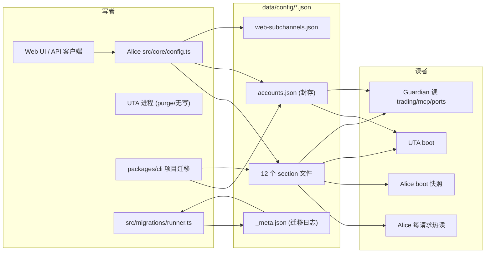
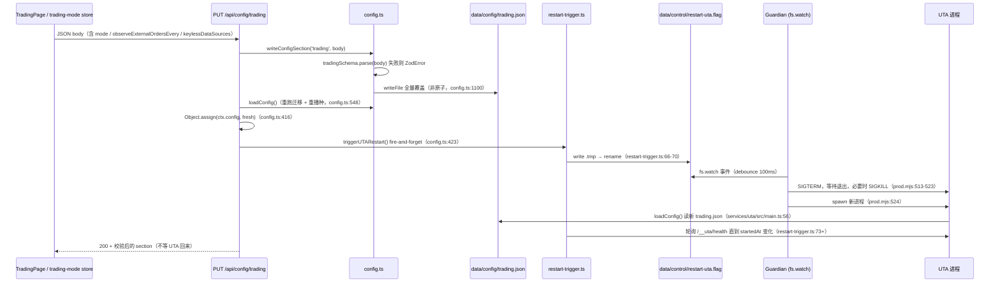

# 10 — Alice 进程自身的配置持久化链路

> 只读调查产物。范围：Alice 进程（`src/`，含 `services/uta` 复用 Alice `src/core` 的部分、`scripts/guardian` 与 `packages/cli` 中对同一批配置文件的读写）
> 的配置存储面——`data/config/*.json` 的加载、播种、校验、写入、加锁、加封、迁移，
> 以及一次配置变更如何流向各消费者（本进程内热读、UTA 子进程、Guardian、外部 CLI）。
> 目的是给 UTA 重构提供"状态如何落盘、变更如何流向消费者"的对照面，不评价实现优劣。
> 非目标：UTA 内部账本/快照形状（见 [`05-staging-approval-ledger.md`](05-staging-approval-ledger.md)、
> [`06-snapshots-and-guards.md`](06-snapshots-and-guards.md)）；Alice 的事件/journal 流（见 [`11-alice-event-flow.md`](11-alice-event-flow.md)）；
> 持久化全景表与测试体系总览（见 [`09-persisted-state-tests-docs-issues.md`](09-persisted-state-tests-docs-issues.md)，本文只补充其中的配置侧细节，不重复其全景表）。
> 所有结论来自静态阅读当前 `f0e37510d` 工作树（`v0.93.0`）加一次对真实 `~/.openalice` 的只读观察，未运行任何测试套件。

---

## 1. 概览与职责边界

### 1.1 本区域负责什么

Alice 的配置持久化由 `src/core/config.ts`（1119 行）单一模块承担：它既是 12 个 section 文件的 schema 定义者（`config.ts:69-432`），
又是加载器（`config.ts:540-581`）、播种器（`config.ts:526-538`）、通用写入器（`config.ts:1096-1106`），
还是 `accounts.json` 这个封存凭据库的唯一门房（`config.ts:709-788`）。
路径解析集中在 `src/core/paths.ts`，加封在 `src/core/sealing.ts`，跨进程启动锁在 `src/core/config-bootstrap-lock.ts`，
形状迁移在 `src/migrations/`（runner + registry）。

### 1.2 本区域不负责什么

- **不是唯一的 `data/config/` 写者**：`connectors.json`、`connector-service.json`（`src/core/connector-config.ts`）、
  `auth.json`（`src/services/auth/token-store.ts`）、`sessions.json`（`src/services/auth/session-store.ts`）
  是同目录下的兄弟文件，各自有独立的读写模块，不走 `config.ts`。本文只在"耦合与对照"处引用它们。
- **不负责 UTA 内部状态**：`data/trading/*`、`data/event-log/*` 由 UTA 进程自己写（见报告 09）。
- **不负责 UI**：UI 只是 HTTP 客户端，本文只说它写到哪个端点、页面是否有"需要重启"的提示。
- **不解释为什么这么设计**：文中对动机的描述均取自代码注释，标注为引用；我的推断标注 `[推断]`。

### 1.3 上下游关系

上游：Guardian（`scripts/guardian/*`）与 Electron/CLI 启动器注入 `OPENALICE_HOME`、端口 env，并在启动前自己读 `ports.json`/`mcp.json`/`trading.json`/`accounts.json`。
下游：Alice 自身的 boot 快照消费者、Alice 每个请求的热读消费者、UTA 子进程的 boot 消费者、外部 CLI（`openalice project copy-ai-creds` 等）。

---

## 2. 功能清单：section、文件、写者、读者

### 2.1 12 个 section 的映射表

`sectionSchemas`（`src/core/config.ts:1062-1075`）与 `sectionFiles`（`src/core/config.ts:1077-1090`）是两张按同一 `ConfigSection`
联合类型（`config.ts:1060`，即 `keyof Config`，`config.ts:491-504`）索引的表；`validSections`（`config.ts:1093`）由前者派生，
是 HTTP 层唯一的白名单来源。

| section | 文件 | schema 定义 | 写入路径（唯一写入点） | 读取路径 |
|---|---|---|---|---|
| `engine` | `engine.json` | `config.ts:69-73` | `writeConfigSection`（`config.ts:1096-1100`）；生产无调用者 | `loadConfigUnlocked`（`config.ts:554`）；Alice tick loop 读 `interval`（`main.ts:475`） |
| `agent` | `agent.json` | `config.ts:242-270` | `writeConfigSection`；`PUT /api/config/agent`（`ui/src/pages/AgentPermissionsPage.tsx:198`） | boot（`config.ts:555`）；`readAgentConfig()`（`config.ts:827-834`，零生产消费者）；`() => config.agent.allowAiTrading` 活 getter（`main.ts:253`） |
| `crypto` | `crypto.json` | `config.ts:272-292` | `writeConfigSection`；生产无调用者 | boot（`config.ts:556`）；`config.crypto` 无消费者 |
| `securities` | `securities.json` | `config.ts:294-310` | `writeConfigSection`；生产无调用者 | boot（`config.ts:557`）；`config.securities` 无消费者 |
| `marketData` | `market-data.json` | `config.ts:312-352` | `writeConfigSection` **且** `updateExtraVendors`（`config.ts:867-877`）；`PUT /api/config/marketData`（`MarketDataPage.tsx:162-165`） | 热读 `readMarketDataConfig()`（`config.ts:847-854`）；boot（`config.ts:558`）；compat 路由惰性 getter（`webui/plugin.ts:337-338`） |
| `aiProvider` | `ai-provider-manager.json` | `config.ts:204-238` | `writeConfigSection` **且** 9 个凭据/默认值写入函数（`config.ts:906-1055`） | 热读 `readAIProviderConfig()`（`config.ts:837-844`）；workspace 创建与注入链路 |
| `snapshot` | `snapshot.json` | `config.ts:373-382` | `writeConfigSection`；`PUT /api/config/snapshot`（`PortfolioPage.tsx:163`） | boot（`config.ts:560`）；UTA boot（`services/uta/src/main.ts:110`） |
| `trading` | `trading.json` | `config.ts:389-411` | `writeConfigSection`；`PUT /api/config/trading`（`ui/src/live/trading-mode.ts:54`、`TradingPage.tsx:56`） | boot（`config.ts:568`）；UTA boot（`services/uta/src/main.ts:71,122`）；Guardian（`guardian-runtime/src/trading-mode.ts:36-48`、`scripts/guardian/prod.mjs:117-124`）；Alice 模式闭包（`main.ts:132-142`） |
| `mcp` | `mcp.json` | `config.ts:355-358` | `writeConfigSection`；`PUT /api/config/mcp`（`MCPPage.tsx:19-22`） | boot（`config.ts:561`）；Alice 建 MCP/本地 tool 监听（`main.ts:338-367`）；Electron 主进程（`apps/desktop/src/main.ts:203-225`） |
| `ports` | `ports.json` | `config.ts:369-371` | `writeConfigSection`；**生产无程序化写入者**（Guardian/desktop/CLI 只读） | boot（`config.ts:565`，`persistDefaults:false`）；Guardian（`prod-ports.mjs:29-61`）；desktop（`main.ts:170`）；CLI（`local-start.mjs:277`） |
| `news` | `news.json` | `domain/news/config.ts:18-...`（由 `config.ts:5` 引入） | `writeConfigSection`；`PUT /api/config/news`（`NewsCollectorPage.tsx:23`） | boot（`config.ts:566`）；`NewsCollector` 构造（`main.ts:425-428`） |
| `tools` | `tools.json` | `config.ts:413-416` | `writeConfigSection`；`PUT /api/config/tools`（`webui/routes/tools.ts:26`） | 热读 `readToolsConfig()`（`config.ts:880-887`）→ `tool-center.ts:29` + `routes/tools.ts:15` |

### 2.2 不在这张表里的同目录文件

| 文件 | 拥有者模块 | 说明 |
|---|---|---|
| `accounts.json` | `config.ts:709-788` | UTA 账户与 broker 凭据，封存；见 §3.2 |
| `web-subchannels.json` | `config.ts:1109-1119` | Web 子频道定义，不经 `ConfigSection` 体系，无 schema 表项 |
| `_meta.json` | `src/migrations/runner.ts:26` | 迁移日志（`appVersion` + `appliedMigrations[]`） |
| `connectors.json` / `connector-service.json` | `src/core/connector-config.ts`（封存 + 目录锁，`connector-config.ts:193-235`） | 本文只作原子性对照 |
| `auth.json` / `sessions.json` | `src/services/auth/token-store.ts:60-72`（非原子）/ `session-store.ts:70-86`（tmp+rename） | 对照用 |

### 2.3 真实 home 的只读观察

`~/.openalice/data/config/` 实测 18 个条目：`_meta.json`、`accounts.json`、`agent.json`、`ai-provider-manager.json`、`auth.json`、
`compaction.json`（已无 schema 的遗留文件）、`connector-service.json`、`connectors.json`、`crypto.json`、`engine.json`、`market-data.json`、
`mcp.json`、`news.json`、`ports.json`、`securities.json`、`snapshot.json`、`tools.json`、`trading.json`。
权限实测：只有 `accounts.json`、`auth.json`、`connectors.json`、`sealing.key` 是 `0600`，其余 section 与 `_meta.json` 都是 `0644`——
即 section 文件里的 `marketData.providerKeys`、以及 `ai-provider-manager.json` 中的 AI 凭据是**明文且同机可读**的，
封存只保护了 `accounts.json`/`connectors.json` 两类。该观察与 `sealing.ts:1-21` 的威胁模型声明一致（防的是 `data/` 离开机器），
但 `ai-provider-manager.json` 不在封存面内，属于一个明确的口径落差。

---

## 3. 数据与状态

### 3.1 加载与播种

`loadConfig()`（`config.ts:540-542`）是唯一入口，包在 `withConfigBootstrapLock`（`config-bootstrap-lock.ts:43-79`）里；
真正工作的是 `loadConfigUnlocked()`（`config.ts:544-581`），顺序是：

1. `await runMigrations()`（`config.ts:548`）——先跑迁移再读文件，因此**每次 `loadConfig` 都可能写盘**。
2. 12 个文件名硬编码成一个 `as const` 数组（`config.ts:550`），`Promise.all` 并发读（`config.ts:551`）。
3. 逐 section `parseAndSeed`（`config.ts:554-568`）。
4. env 端口覆盖（`config.ts:575-578`），`parseEnvPort` 对空白/越界返回 null（`config.ts:584-589`）。

`parseAndSeed`（`config.ts:526-538`）的语义值得单列，因为它是"默认值从哪来"的全部答案：
`schema.parse(raw ?? {})`——**缺失文件等价于空对象**，一切默认值都来自 Zod 的 `.default()`；
若文件确实缺失且未禁用持久化，则把解析结果写回磁盘（`config.ts:533-536`）。
Zod 的 `.default()` 只在字段 `undefined` 时生效，所以"部分写入的文件"会被补齐而不是整份重置。

`ports.json` 是唯一显式排除的：`{ persistDefaults: false }`（`config.ts:565`），注释解释这是有意的——
播种一个 `web` 值会让 Guardian 把它当显式绑定而不再探测空闲端口（`config.ts:562-564`），
`config-ports.spec.ts:41-55` 把这条契约固化成了测试。

`loadJsonFile`（`config.ts:509-518`）只吞 `ENOENT`，其他错误（JSON 语法错误、权限错误）一律抛出。
`removeJsonFile`（`config.ts:521-523`）全仓库无调用者，是死代码。

### 3.2 原子性、加锁与校验

| 写入点 | 原子性（tmp+rename） | 进程内互斥 | 跨进程锁 | 校验 | 权限 |
|---|---|---|---|---|---|
| `writeConfigSection`（`config.ts:1096-1106`） | 否，直接 `writeFile`（`:1100`） | 无 | 无（不在 bootstrap lock 内） | `schema.parse` 先于写（`:1098`） | 默认 umask（实测 0644） |
| `parseAndSeed` 播种写（`config.ts:535`） | 否 | 间接（bootstrap lock 内） | bootstrap lock | `schema.parse`（`:532`） | 默认 |
| `updateExtraVendors`（`config.ts:875`） | 否 | 无 | 无 | schema 双解析（`:871,873`） | 默认 |
| 9 个凭据/默认值写入（`config.ts:911,950,959,975,989,1016,1031,1043,1055`） | 否 | 无 | 无 | `credentialSchema.parse` 等 | 默认 |
| `writeAccountsFile`（`config.ts:709-714`） | 否，直接 `writeFile` | 无 | 无 | 由调用方 parse | `0600` + best-effort `chmod`（`:712-713`） |
| `writeWebSubchannels`（`config.ts:1115-1119`） | 否 | 无 | 无 | `webSubchannelsSchema.parse`（`:1116`） | 默认 |
| `mirrorProviderKeysToGlobal`（`config.ts:56-65`） | 否（`:64`） | 无 | 无 | 逐键类型过滤 | 默认 |
| 迁移 `ctx.writeJson`（`runner.ts:58-61`） | 否 | 间接（bootstrap lock 内） | bootstrap lock | 无（迁移自校验） | 默认 |
| 对照：`connector-config.ts:228-235` | **是**（tmp+rename+chmod） | 是（目录锁 `:193-222`） | 是（跨进程目录锁） | 由调用方 | `0600` |
| 对照：`session-store.ts:70-86` | 是（tmp+rename + chmod） | 是（`writePromise` 合并） | 否 | 无 | `0600` |

结论：**`config.ts` 管辖的全部写入都是"最后写者获胜"的非原子写**，而它在同一目录下的兄弟模块（connector-config、session-store）
已经各自实现了 tmp+rename（部分还带跨进程锁）。这不是遗漏，因为没有任何一处注释声称要原子；
但它意味着进程在 `writeFile` 中途被杀会留下截断的 JSON，而 `loadJsonFile` 会把语法错误抛出（`config.ts:511-516`），
下一次 boot 直接失败。`[推断]` 该风险的实际暴露面取决于发生频率，本次调查未做故障注入，不下结论。

跨进程锁只保护一件事：`loadConfig`（含迁移与播种）。`config-bootstrap-lock.ts:29-42` 的注释说明动机——
Alice 与 UTA 两个子进程都会在启动时调 `loadConfig`，而该路径是"write-capable"的，所以需要一个更短的临界区锁；
锁实现委托给 `@traderalice/guardian-runtime` 的 `acquireRuntimeLock`（`config-bootstrap-lock.ts:55-59`），
活动持有者只等待不抢占，死进程由 PID/启动时间/token 身份回收（`:38-41`），总等待预算 120 秒（`:9`）、轮询 25 毫秒（`:10`）。
全仓库只有一个地方调用它：`config.ts:541`。

### 3.3 封存（sealing）

`sealing.ts` 是一个 137 行的 AES-256-GCM 信封层：`ALG = 'aes-256-gcm'`（`:28`），32 字节随机 key（`:29`），
12 字节 IV（`:30`），信封形状 `{$sealed:1, alg, iv, tag, data}`（`:32-38`），判据函数 `isSealedEnvelope`（`:53-61`）。
key 落在 `userDataHome/sealing.key`（`:49-51`），**刻意在 `data/` 之外**（`:4-8`），首次 `seal` 时自动生成（`:79-90`），`0600` + chmod（`:87-88`）。
`unseal` 在 key 缺失、alg 不匹配、GCM 认证失败时抛 `UnsealError`（`:111-131`）。

使用者只有三处：`config.ts:10`（accounts.json）、`src/core/connector-config.ts:17`（connectors.json）、
`services/connector/src/core/work-queue.ts:6`（Connector 工作队列）。
`packages/cli/src/project-transfer-secrets.ts:126-144` 与 `scripts/guardian/prod.mjs:136-146` 各自**复制了一份**封存/解封实现，
而不是复用 `sealing.ts`（CLI 侧理由是跨包；Guardian 侧是 `.mjs` 不能 import TS）。`[推断]` 这是格式漂移的潜在来源，
但目前三份实现的常量与信封字段一致。

### 3.4 `accounts.json` 的读写语义

读（`readUTAsConfig`，`config.ts:719-783`）是一条有四条分支的流水线：

1. 文件缺失 → 写一个封存的空数组，同时提前物化 `sealing.key`（`config.ts:721-726`），注释说明这是为了避免后续凭据写入竞争 key 创建。
2. 封存信封 → `unseal`；失败则**隔离而非删除**：`rename` 成 `accounts.json.sealed-unreadable-<ts>`，
   打印可操作指引，写入空 store 继续启动（`config.ts:731-747`）。
3. 明文数组且含 legacy 形状 → 先把原文备份到 `accounts.json.backup-pre-preset`（`:755-756`），
   逐条 `migrateLegacyUTA`，未知 engine 的记录被跳过并点名（`:758-775`），然后封存写回（`:778`）。
4. 其余情况 → `utasFileSchema.parse(raw)`（`:782`）。

写（`writeUTAsConfig`，`config.ts:785-788`）只有一步：`utasFileSchema.parse` → `writeAccountsFile`。
`writeAccountsFile`（`:709-714`）是唯一写点，注释明写"no code path can regress to plaintext credentials at rest"。
ephemeral UTA 的清理：`wipeUTATradingData`（`:797-800`）只 `rm data/trading/<id>`，注释确认"never touches `data/config/`"；
`purgeEphemeralUTAs`（`:811-822`）在 UTA boot 时被调用（`services/uta/src/main.ts:69`），先删目录再写回存活集。

### 3.5 内存态 vs 磁盘态

Alice 进程里存在**两份**配置视图：

- `config`（`main.ts:97` 的 boot 快照对象），被塞进 `EngineContext.config`（`main.ts:397-398`，类型见 `src/core/types.ts:32`），
  WebPlugin 在 `start(ctx)` 里拿到同一个引用（`src/webui/plugin.ts:110,247`），路由把它当 `opts.ctx.config` 用。
- 磁盘文件本身，被"热读家族"每次请求重新读（`readToolsConfig`、`readMarketDataConfig`、`readCredentials` 等）。

两者唯一的同步点是 `PUT /api/config/:section`：写完盘后 `await loadConfig()` 再 `Object.assign(opts.ctx.config, fresh)`
（`src/webui/routes/config.ts:414-417`）。注释（`:410-413`）明确说明这是为了让读 `ctx.config` 的代码路径免重启生效，
并且刻意用 `Object.assign` 保持对象身份（外部持有的引用不变）。
`PUT /api/config/:section` 之外的任何写入（trading-config 路由、UTA purge、CLI、迁移）**都不会**刷新 `ctx.config`。

---

## 4. 外部交互：一次配置变更如何到达消费者

### 4.1 HTTP 端点清单（`src/webui/routes/config.ts`）

`GET /`（`:95-102`）直接返回 `loadConfig()` 全量结果——**包含 `credentials[].apiKey` 明文与 `marketData.providerKeys`**，
无脱敏（登录门禁见 `webui/plugin.ts:228-232`，未配置 bind 时 loopback 直连可绕过）。
凭据 CRUD：`GET /credentials`（`:124`，显式返回 `apiKey` 以支持表单回填，注释 `:118-123`）、
`POST /credentials`（`:145`）、`PUT /credentials/:slug`（`:172`，含"该凭据是某 agent 的 workspace 默认值时不允许移除其当前 wire"的前置校验 `:196-211`）、
`DELETE /credentials/:slug`（`:220`）、`POST /credentials/test`（`:234`）。
默认值类：`GET/PUT /workspace-credential-defaults`（`:269`/`:290`，PUT 内含大量兼容性校验 `:298-348`，最终 `writeWorkspaceCreationDefaults` `:349`）、
`GET/PUT /workspace-default-agent`（`:356`/`:364`）、`GET/PUT /issue-default-agent`（`:378`/`:386`）。
通用 section 写入：`PUT /:section`（`:402-435`）。其余：`GET /hub-status`（`:459-475`，读 `ctx.config.marketData.hub`，是**内存视图**）、
`POST /test-provider`（`:477-495`）。注意 `:402` 的 `PUT /:section` 位于路由注册末尾，因此 `credentials`、`workspace-*` 等具体路径先匹配——
但这也意味着任何**未注册**的路径段都会落进 `PUT /:section` 并被 `validSections` 挡回 400（`:405-407`）。

`tools` 与 `channels` 有各自的写入端点但复用 `config.ts` 的写入器：
`PUT /api/tools`（`src/webui/routes/tools.ts:26` → `writeConfigSection('tools')`）、
`POST/PUT/DELETE /api/channels`（`src/webui/routes/channels.ts:107,146,158,171` → `writeWebSubchannels`）。
uI 侧统一走 `configApi.updateSection(section, data)`（`ui/src/api/config.ts:11-22`），
`useConfigPage` 是大部分设置页的公共钩子（`ui/src/hooks/useConfigPage.ts:32-93`），带 600ms 防抖自动保存与"仅当服务端回声内容不同才替换本地状态"的循环保护（`:59-69`）。

### 4.2 消费者分类

**A. 本进程内、真·实时（每次请求或每次调用读盘）**

| 消费者 | 位置 | 读什么 |
|---|---|---|
| ToolCenter 的 `getVercelTools` | `src/core/tool-center.ts:29` | `tools.json` |
| tools 路由 GET | `src/webui/routes/tools.ts:15` | `tools.json` |
| equity vendor 列表 | `src/main.ts:210-213` | `market-data.json`（`providers.equity` + `extraVendors`） |
| vendor 列表/toggle | `src/domain/market-data/vendors.ts:44,95` | `market-data.json` |
| 凭据读取（workspace 注入等） | `src/workspaces/workspace-creator.ts:262`、`session-runtime-binding.ts:205,226`、`agent-credential-readiness.ts:129,146,220`、`src/webui/routes/workspaces.ts:465,1339,3037,3154,3184,3236,3256` | `ai-provider-manager.json` |
| 默认 agent 解析 | `src/workspaces/service.ts:1119,1136` | `ai-provider-manager.json` |

**B. 本进程内、依赖 `ctx.config` 被刷新（只有 `PUT /api/config/:section` 会刷新）**

| 消费者 | 位置 | 备注 |
|---|---|---|
| market-data compat 的默认凭据/默认 provider | `src/webui/plugin.ts:337-338` | 传入的是 getter，注释明写"Requires the config-write route to refresh ctx.config"（`:334-336`） |
| `/api/config/hub-status` | `src/webui/routes/config.ts:460` | 读 `ctx.config.marketData.hub` |
| `/api/market/sector-rotation` 与 `/api/market/equity/*` 的 provider 报字段 | `src/webui/routes/market.ts:36,61` | 每次请求读 `ctx.config`，比 `:20` 的 hub 闭包新 |
| AI 交易总开关 | `src/main.ts:253`（`() => config.agent.allowAiTrading`） | getter 每次调用读 `config.agent`，注释 `:249-251` 声称"config is mutated in place on Settings writes"——**只在 agent section 经该路由写入时成立** |

**C. boot 快照（`Object.assign` 不救的）**

| 消费者 | 位置 | 被替换的是整段子对象 |
|---|---|---|
| hub calendar 包装 | `src/main.ts:231`（`withHubCalendars(equityClient, config.marketData.hub)`） | `Object.assign` 会把 `marketData` 整个换成新对象，旧的 `hub` 值已闭包进 client |
| `ReferenceData` 的 hub 与 equity provider | `src/main.ts:235-242` | 同上 |
| sector-rotation 工具的 hub | `src/main.ts:274`（`createSectorRotationTools(equityClient, config.marketData.hub)`） | 工具在 boot 注册，hub 参数是**值**快照；而 `market.ts:20` 的 `createHubFetcher(ctx.config.marketData.hub)` 是 plugin start 时的另一次快照 |
| barService 的 `vendorProviders` | `src/main.ts:219-227` | `vendorProviders: config.marketData.providers` 是 boot 值（用在 `bars/bar-service.ts:337,420`） |
| SDK 客户端族的 providers/credentials | `src/main.ts:183-195` | `providers.equity` 等按值传入 |
| NewsCollectorStore 容量/保留 | `src/main.ts:164-167` | |
| NewsCollector feeds/interval | `src/main.ts:425-428` | |
| MCP / 本地 tool 监听端口 | `src/main.ts:338-367`、`main.ts:371-388` | 端口是监听地址，本就不能热改 |

**D. 需要重启 UTA 进程（Guardian 标志协议）**

`triggerUTARestart`（`src/services/uta-supervisor/restart-trigger.ts:53-72`）写 `data/control/restart-uta.flag`（tmp+rename 原子，`:66-70`），
先记录旧 `startedAt`（`:63-64`），再轮询 `/__uta/health` 直到 `startedAt` 变化或 20 秒超时（`:60,73+`）。
Guardian 侧 `fs.watch` 目录 + 100ms 防抖（`scripts/guardian/prod.mjs:584-590`，flag 路径 `:608`；dev 侧 `scripts/guardian/dev.ts:139-200`），
收到后 SIGTERM 旧 UTA、等待退出（必要时 SIGKILL）、重新 spawn（`prod.mjs:513-530`）；
lite 模式或 NanoAlice 产品则改为停掉 UTA（`prod.mjs:487-499`）。

五个触发者：
`routes/config.ts:422-424`（仅 `trading`/`snapshot` 两个 section）、
`routes/trading-config.ts:29-38`（`notifyUTAReload`，fire-and-forget，所有账户写操作后）、
`UTAManagerSDK.ts:187`（`reconnectUTA` 就是"触发重启"）、`UTAManagerSDK.ts:196`（`removeUTA`）、
`services/broker-packs/auto-updater.ts:76`（Broker Pack 安装后）。
**Alice 自身没有任何重启标志**：全仓库不存在 `restart-alice.flag` 之类的机制。

**E. 需要重启 Alice（无机制，靠 UI 文案）**

`ports` / `mcp` / `news` 三个 section 的消费者全部在 `main.ts` boot 段（§4.2-C），
而 UI 只有一处明确写了"Restart Alice after saving to start collecting the new feeds."（`ui/src/pages/NewsCollectorPage.tsx:138`）；
MCPPage 与 MarketDataPage 没有任何重启提示。TradingPage 的三处提示写的是"restarting UTA to apply"（`TradingPage.tsx:102,181`），
与后端实际行为（`trading` section 确实会触发 UTA 重启）一致。

### 4.3 端到端时序：`PUT /api/config/trading`

注意两个非直觉点：响应在 UTA 真正重启完成前就返回（fire-and-forget，`config.ts:421-423` 注释说明进度通过 health badge 呈现）；
以及 `loadConfig()` 被**再执行一次**（`config.ts:415`），意味着迁移与播种在同一次 HTTP 请求里被重复触发。

### 4.4 UTA 侧的账户 CRUD 时序

`POST /uta`（`trading-config.ts:196-256`）：`readUTAsConfig`（`:217`，可能触发隔离/legacy 迁移）→ 冲突检查 409（`:218-228`）→
`utaConfigSchema.parse`（`:241`）→ `writeUTAsConfig`（`:243`）→ `notifyUTAReload()`（`:244`）→ `ctx.utaManager.reconnectUTA(id)`（`:246`，内部又触发一次 restart）→ 返回**脱敏**副本（`:249`）。
即一次创建最多触发两次 flag 写入；Guardian 侧有 `restartingUTA` 重入保护（`prod.mjs:500-501`），实际是幂等的。

`PUT /uta/:id`（`:264-310`）：先 `unmaskSecrets(body, existing)` 把 UI 回传的掩码还原（`:281`），再写盘、通知，然后按 enabled 状态三选一：
由启用变禁用 → `removeUTA`（`:293`）；由禁用变启用 → `reconnectUTA`（`:295`）；两者都启用（改凭据）→ `reconnectUTA`（`:299`）。
`DELETE /uta/:id`（`:312-337`）：写回过滤后的列表（`:321`）、通知（`:322`）、`removeUTA`（`:324`），ephemeral 才 `wipeUTATradingData`（`:330-332`）。

`UTAManagerSDK.reconnectUTA`（`src/services/uta-client/UTAManagerSDK.ts:186-192`）本身就是"触发 UTA 重启"，
其注释坦承 v1 取舍是"旋转一个 broker 会重启全部 broker"（`:180-183`）。UTA 侧 `reconnectUTA`（`services/uta/src/domain/trading/uta-manager.ts:83+`）
则是**重新读盘** `readUTAsConfig()`（`:90`）——即 Alice 写盘、UTA 重读，中间靠进程重启做同步原语。

---

## 5. 配置、默认值与环境变量

### 5.1 默认值来源

三处默认值需要区分，它们的优先级不同：

- **Zod `.default()`**：所有 section 的取值兜底（如 `engine.interval=5000` `config.ts:71`、`mcp.port=3001` `config.ts:357`、
  `trading.observeExternalOrdersEvery` 默认 `'15m'`、`snapshot.every='15m'` `config.ts:381`、`marketData.hub.baseUrl='https://traderhub.openalice.ai'` `config.ts:350`）。
- **env 覆盖**：`OPENALICE_WEB_PORT`、`OPENALICE_MCP_PORT` 在 `loadConfigUnlocked` 末尾覆盖文件值（`config.ts:575-578`），
  注释说明这是 Guardian 已占端口的注入（`:571-574`）。优先级为 env > 文件 > 内存默认。
- **用户级全局 provider keys**：`~/.openalice/provider-keys.json`（或 `OPENALICE_GLOBAL_DIR`）在**读取时**填充本地 `providerKeys` 的空缺
  （`applyGlobalProviderKeys`，`config.ts:43-50`；文件路径解析 `:25-28`），在**写入时**镜像回去（`mirrorProviderKeysToGlobal`，`:56-65`）。
  注释（`:14-21`）说明动机是"新 checkout/worktree 不该重新问一遍数据源 key"，并明确 broker 凭据不享受该待遇。

### 5.2 环境变量清单（配置链路相关）

| 变量 | 读取位置 | 作用 |
|---|---|---|
| `OPENALICE_HOME` | `paths.ts:39` | 决定 `USER_DATA_HOME`，进而决定 `data/config` 位置 |
| `OPENALICE_APP_HOME` | `paths.ts:40` | 决定 `APP_RESOURCES_HOME`（模板/UI 包），不影响配置数据 |
| `OPENALICE_GLOBAL_DIR` | `config.ts:26` | 覆盖全局 provider-keys 目录 |
| `OPENALICE_WEB_PORT` / `OPENALICE_MCP_PORT` | `config.ts:575,577` | 覆盖 `ports.web` / `mcp.port` |
| `OPENALICE_LAUNCHER`、`OPENALICE_GUARDIAN_PID`、`OPENALICE_GUARDIAN_STARTED_AT` | `config-bootstrap-lock.ts:56-58` | 启动锁身份 |
| `OPENALICE_LITE_MODE` 等 | `services/uta-supervisor/url.ts`（经 `isUTADisabled`，`restart-trigger.ts:54`） | 直接短路 UTA 重启 |
| `AQ_LAUNCHER_ROOT` | `runner.ts:74` | 迁移上下文里的 workspace root |
| `OPENALICE_ONBOARDING_TEST` / `OPENALICE_CREDENTIAL_TEST_MODE` / `OPENALICE_ONBOARDING_AI_BASE_URL` | `routes/config.ts:51-60` | 凭据测试的 mock 分支，测试专用 |
| `OPENALICE_TRUSTED_PROXIES` / `OPENALICE_CSRF_TRUSTED_ORIGINS` / `OPENALICE_DISABLE_AUTH` | `webui/plugin.ts:222-226` | 认证边界，决定配置端点暴露面 |
| `OPENALICE_ELECTRON_SMOKE_WORKSPACE_ACCEPTANCE` | `main.ts:383` | 打包验收专用扫描间隔 |

Guardian 侧注入：`scripts/guardian/prod.mjs:294,329-331,362-367`（`OPENALICE_HOME`、两个端口、`OPENALICE_MCP_*`），
dev 侧 `scripts/guardian/dev.ts:254-255,296,327-328`（注释 `:254` 强调"src/core/paths.ts reads OPENALICE_HOME; never rely on cwd inheritance"）。

### 5.3 端口的三方一致性

`DEFAULT_WEB_PORT = 47331`（`config.ts:366`）与 `PORT_DEFAULTS`（`scripts/guardian/shared.ts:69`，其中 `uta:47333`、`connector:47334`）
必须手工保持一致，`config.ts:360-365` 的注释明确写了这一点（"Must match PORT_DEFAULTS.web in scripts/guardian/shared.ts"）。
`ports.json` 只有 `web` 字段进了 Alice 的 schema（`config.ts:369-371`），而 Guardian 会读 `web/mcp/uta/connector/ui` 五个键
（`shared.ts:69,120-124`）——即 `mcp`/`uta`/`connector` 的端口 pin 是"Guardian 认识、Alice 的 `ConfigSection` 体系不认识"的，
不能用 `PUT /api/config/ports` 写（会被 `portsSchema` 剥掉）。这是**两个消费者对同一文件有两种 schema** 的实例。

---

## 6. 不变量、时序与并发假设

### 6.1 显式不变量

- **`accounts.json` 落盘永远是封存信封**（`config.ts:704-708` 的注释即契约；实现唯一出口 `writeAccountsFile`）。
- **`accounts.json` 不可解封时绝不删除**，只做 `rename` 隔离（`config.ts:735-744`）。
- **缺失的 `ports.json` 不得被播种**（`config.ts:562-564` + `config-ports.spec.ts:41-55`），否则 Guardian 不再探测空闲端口。
- **迁移 body 必须自幂等**（`migrations/types.ts:43-47`），与 journal 共同构成两层幂等（`:8-12`）。
- **section 写入必须先过 schema**（`writeConfigSection` `config.ts:1097-1098` 与 `PUT /:section` 的 ZodError→400 `routes/config.ts:429-431`）。
- **`ctx.config` 的对象身份不变**（`routes/config.ts:412-413` 注释），因为外部持有引用。

### 6.2 并发假设与真实风险

- **多进程共享一个 home**：Alice、UTA、Connector 三个进程可能同时读写 `data/config/`。
  只有 `loadConfig` 路径有跨进程锁；所有 section 写入、`accounts.json` 写入、CLI 写入都**没有**。
  `[推断]` 最危险的组合是"Alice 的 `PUT /api/config/aiProvider` 全量覆盖"与"CLI 的 `writeAiProviderVault` 原子覆盖"并发——
  后者会整体替换文件，前者会先读后写，丢更新是可能的；本次未做并发实验验证。
- **同进程内**：`writeConfigSection` 没有互斥，UI 的 600ms 防抖降低了概率但没有消除（`useConfigPage.ts:71-76`）。
- **UTA 重启作为同步原语**：Alice 写盘后靠 flag 让 UTA 重启读新值。`reconnectUTA` 的注释承认会重启全部 broker（`UTAManagerSDK.ts:180-183`）。
  这是有意的"粗粒度热重载"，代价是连接中断窗口。
- **`loadConfig` 的写副作用**：因为迁移在 `loadConfig` 里跑（`config.ts:548`），任何调用 `loadConfig` 的地方都可能在写盘——
  包括 `GET /api/config`（`routes/config.ts:97`）、trading-config 的 `GET /broker-packs`（`trading-config.ts:96`）、
  以及每次 `PUT /:section` 后的刷新（`routes/config.ts:415`）。`[推断]` 这让"读接口"具备了写权限，是跨进程锁必须存在的原因之一。

### 6.3 失效语义对照

| 场景 | 行为 | 位置 |
|---|---|---|
| section 文件 JSON 语法错误 | `loadJsonFile` 抛出 → `loadConfig` 拒绝 → boot 失败（`main.ts:97` 无 try/catch） | `config.ts:509-518` |
| section 值不满足 schema | ZodError 冒泡，同上 | `config.ts:532` |
| `PUT /:section` 的值不满足 schema | 400 + `details`，不写盘 | `routes/config.ts:429-431` |
| `accounts.json` 不可解封 | 隔离 + 空 store + 继续启动 | `config.ts:731-747` |
| legacy 账户形状 | 备份原文件 + 翻译 + 写回 | `config.ts:750-780` |
| `news.json` 缺失 | 播种一份含 ~28 个 feed 的完整默认（`domain/news/config.ts:34+`） | `config.ts:566` |
| 全局 provider-keys 文件损坏 | 静默降级为空 map | `config.ts:30-40` |
| 迁移失败 | 打印"data may be in partial state"+ 快照路径，抛错；journal **不**记录该 id，下次 boot 重试 | `runner.ts:153-159` |

---

## 7. 测试覆盖

配置链路的 spec 集中在 `src/core/` 与 `src/webui/routes/`（数量为本次静态计数）：

| spec | `it` 数 | 覆盖内容 |
|---|---|---|
| `src/core/config.spec.ts` | 37 | 热读助手（缺文件/坏 JSON/解析）、`writeConfigSection`（含"无效数据不写盘"`：188`）、`readUTAsConfig`（播种/legacy 迁移/未知 engine）、`writeUTAsConfig`、`trading`/`snapshot` section、凭据 schema 与仓库 CRUD 语义 |
| `src/core/config-accounts.spec.ts` | 4 | 封存往返 + `0600`、首次播种、读 legacy 明文、隔离不可解封文件（`:44-79`） |
| `src/core/config-bootstrap-lock.spec.ts` | 4 | 锁的获取/等待/超时 |
| `src/core/config-ports.spec.ts` | 3 | `ports.json` 三条不变量（不播种、不持久化 env、尊重已存在 pin） |
| `src/core/config-workspace-cred-defaults.spec.ts` | 6 | 默认值 map 的读写与空 slug 清理 |
| `src/core/global-provider-keys.spec.ts` | 3 | 缺口填充、镜像保存（设置/显式清空/缺省不动）、损坏文件降级 |
| `src/core/sealing.spec.ts` | 8 | 信封/密钥/认证失败 |
| `src/core/paths.spec.ts` | 15 | 路径解析 |
| `src/core/connector-config.spec.ts` | 6 | 兄弟模块（原子写 + 锁） |
| `src/webui/routes/trading-config.spec.ts` | 22 | 账户 CRUD、掩码、重启触发 |
| `src/webui/routes/config-snapshot.spec.ts` | 1 | `PUT /snapshot` 会请求 UTA 重启（`:28-44`） |
| `src/webui/routes/config-workspace-defaults.spec.ts` | 22 | workspace 默认值路由的校验矩阵 |
| `src/core/tool-center.spec.ts` | 15 | `tools.json` 禁用列表的消费 |

明确的缺口：
**没有任何 spec 覆盖 `PUT /:section` 对 `ctx.config` 的 `Object.assign` 刷新语义**（即 §3.5 的同步契约无测试）；
`src/webui/routes/channels.ts` 的 `writeWebSubchannels` 四条写入路径（`:107,146,158,171`）无对应 spec；
`purgeEphemeralUTAs`（`config.ts:811-822`）无直接测试；
`updateExtraVendors`（`config.ts:867-877`）只在 `vendors.spec.ts` 里以 mock 形式出现；
**没有任何原子性/并发写入测试**（§6.2 的两类竞态均无保护性测试）；
`migrateLegacyUTA` 中被跳过的未知 engine 分支（`config.ts:764-768`）只有间接覆盖。

---

## 8. 观察到的问题与耦合

按"重构时会踩到"的次序排列，只描述机制，不排优先级。

1. **`ctx.config` 的刷新只挂在一条路由上。** 热读家族（§4.2-A）永远读盘、永远新；`ctx.config` 家族（§4.2-B）只在 `PUT /api/config/:section` 后更新
   （`routes/config.ts:414-417`）。任何新增的写入路径若忘了刷新（或走了别的端点），就会出现"同一进程里两套配置视图不一致"。
   `hub-status`（`routes/config.ts:460`）与 `sector-rotation`（`routes/market.ts:20`）就是同一份 hub 配置的两个快照点，前者新后者旧。

2. **boot 快照的引用替换风险。** `Object.assign` 是浅赋值，`marketData`/`providers` 等子对象会被整体替换（`routes/config.ts:416`），
   因此 boot 时按值捕获的东西（`main.ts:219-227,231,235-242,274`、`market.ts:20`）不会跟着变，
   而按引用读 `ctx.config.marketData.X` 的路径会变。两类的边界不在类型上，只在读取时机上体现。`[推断]` 这是最容易在重构中静默回归的一类。

3. **`GET /api/config` 的读-改-写会固化全局 key。** `GET /` 返回的是 `applyGlobalProviderKeys` 合并后的视图（`config.ts:558` → `:43-50`），
   UI 拿它做回填（`MarketDataPage.tsx:220-226`），用户存回时 `writeConfigSection('marketData')` 会把合并后的 key 全部写进本地文件
   （`config.ts:1096-1104`）。这与 `updateExtraVendors` 刻意"读 RAW 文件、不固化全局 key"的设计意图（`config.ts:856-866` 注释）直接冲突：
   两条写路径对同一文件的目标状态有不同假设。

4. **写入原子性不一致。** 同一目录下，`config.ts` 全系非原子（§3.2 表），而 `connector-config.ts:228-235`、`session-store.ts:80-86`、
   `packages/cli/src/ai-credential-copy.ts:99-118` 都实现了 tmp+rename。裸写截断会直接导致下次 boot 在 `loadJsonFile` 处抛错（`config.ts:511-516`）。

5. **`ports.json` 的双 schema。** Alice 的 `portsSchema` 只有 `web`（`config.ts:369-371`），Guardian 认识五个键（`shared.ts:69`）。
   用 API 写 `mcp` 端口不会生效（会被 schema 剥离），只能手改文件——这是"配置文件是跨进程共享契约"的一个未收敛点。

6. **死代码与孤儿契约。** `removeJsonFile`（`config.ts:521-523`）无调用者；`readAgentConfig`（`config.ts:827-834`）零生产消费者（仅 spec 引用）；
   `writeWorkspaceCredentialDefaults`（`config.ts:1005-1017`）与 `writeWorkspaceCreationDefaults`（`:1020-1032`）实现完全相同、只有后者被路由使用；
   UI 的 `ui/src/api/api-keys.ts:3-19` 调用的 `/api/config/api-keys/status` 与 `/api/config/apiKeys` 两个端点在服务端**不存在**
   （`apiKeysApi` 在 `ui/src/api/index.ts` 中也未被导出），会走到 `PUT /:section` 被 400 拦下或 404。

7. **`loadConfig` 重跑迁移。** `PUT /:section` 后的刷新会再次执行 `runMigrations`（`config.ts:415` → `:548`），
   虽然 journal 保证幂等、开销是一次 `_meta.json` 读 + 目录遍历，但"写配置顺手跑一遍迁移框架"是两件事的耦合点。

8. **`ai-provider-manager.json` 的十余个写者。** 该文件同时承载 AI 凭据、`workspaceCredentialDefaults`、`workspaceDefaultAgent`、`issueDefaultAgent`，
   由 9 个独立函数各自"读-改-写"（`config.ts:906-1055`）加上 `writeConfigSection('aiProvider')`，没有共享的互斥或版本检查。
   任一函数被并发调用都会丢更新；这是 §6.2 里"最可能有实际影响的竞态"的具体位置。

9. **迁移 journal 会陈旧。** 真实 home 的 `_meta.json` 里 `appVersion` 是 `0.82.0-beta`、`appliedMigrations` 有 19 条（`0008`–`0025`），
   而当前 registry 只有 `0039`–`0043`（`registry.ts:24-30`）。`readMeta`（`runner.ts:85-94`）只做形状容错、不清理旧 id，
   `pending` 计算靠"registry 成员过滤"（`:133-134`）而非 journal 清理——所以遗留 id 会永久留在文件里，只增不减。

10. **`compaction.json` 已无 schema 仍留在磁盘上**（§2.3 的实测清单）。schema 移除后文件不会被清理，
    `config.spec.ts:167-169` 还为"不暴露已退役的全局 compaction 策略"写了一条断言——即"退役字段只在 schema 层面消失，磁盘层面有残留"。

11. **目录内三类文件三种保护级别。** `accounts.json`/`connectors.json` 封存 + `0600`；`auth.json`/`sessions.json` `0600`；
    其余全 `0644` 明文，其中包含 AI 凭据与数据源 key（`ai-provider-manager.json`、`market-data.json`）。
    封存面与"敏感内容面"不重合。

---

## 9. 未探索区域与开放问题

### 未探索

- 未做并发/故障注入实验：§6.2、§8.4 的竞态与截断风险均为静态推断，未实测。
- 未追踪 UI 侧完整表单流（本文只覆盖到"哪个端点、是否提示重启"）。
- 未审计 `web-subchannels.json` 的消费端：`systemPrompt`、`profile`、`disabledTools` 三个字段在代码里只被写入与回读
  （`channels.ts:102-104,142-144,153-155`），本次搜索未找到读取这三个字段去影响会话行为的代码路径——
  `[推断]` 这三字段目前是"存了但未接线"的状态（`WebChannel` 的 `profile` 注释 `config.ts:424-425` 声称"Falls back to global activeProfile"，
  但 `activeProfile` 在 `config.ts:209-212` 的注释里已声明被删除）。
- 未核对 `docs/` 中关于配置的描述与代码的一致性（本文只顺手引用了 `docs/data-locations.md:192,228` 两条）。
- 未审计 `marketDataSchema` 之外的 `news` feed 默认值全集（`domain/news/config.ts:34+` 的长度与内容）。
- 未调查 Electron 打包形态下 `USER_DATA_HOME` 的实际注入链（只确认了 desktop 主进程读 `ports.json`/`mcp.json` 的只读路径）。

### 开放问题（重构必须回答）

1. `ctx.config` 与磁盘视图的收敛是保留"单一刷新点"还是改成统一的读模型？
2. `PUT /:section` 之后的 `loadConfig()`（连带迁移）是否应拆成"只读 section"与"运行迁移"两件事？
3. `ports.json` 的 `mcp`/`uta`/`connector` 键要不要进 Alice 的 schema，让 API 成为唯一写入面？
4. 全局 provider-keys 的"读时合并、写时镜像"模型是否保留？如果保留，`GET /` 的回填如何避免固化（§8.3）？
5. `accounts.json` 的写入是否需要与 `ai-provider-manager.json` 一样接受多写者，还是应当收敛成单写者（Alice）？
6. 迁移 journal 是否需要清理策略，或至少记录"本次 registry 可见的 id 集合"以便对账（§8.9）？
7. 是否需要给 `config.ts` 的写入补 tmp+rename 与进程内互斥，使其与同目录兄弟模块一致（§8.4）？

### 与其他报告的关系

- 持久化全景表、每文件 shipped/迁移历史、测试 lane 定义，见 [`09-persisted-state-tests-docs-issues.md`](09-persisted-state-tests-docs-issues.md)；
  本文补充了配置侧的并发、原子性、内存/磁盘分歧与"变更如何到达消费者"的分类，未重复其全景表。
- Alice 侧事件/journal 流（`data/event-log`、`artifact-provenance`、inbox 等）见 [`11-alice-event-flow.md`](11-alice-event-flow.md)。
- UTA 内部账本与快照见 [`05-staging-approval-ledger.md`](05-staging-approval-ledger.md)、[`06-snapshots-and-guards.md`](06-snapshots-and-guards.md)。
