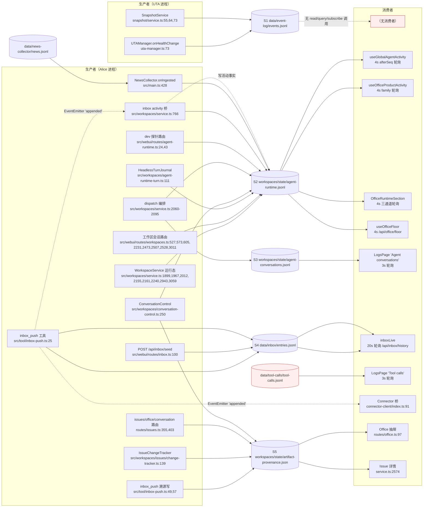

# 11 — Alice 自身的事件 / journal 流

> 只读调查产物。范围：Alice 进程（`src/`，含 `services/uta` 中复用 Alice `src/core` 的部分）
> 内所有事件/journal 类持久化流的物理文件、记录形状、append 纪律、生产者与消费者、
> 路由机制、回放语义、时间与因果，以及 `docs/event-system.md` 声明的退役边界在代码中的实际落点。
> 本文不评价实现优劣，只为 UTA 重构提供对照。
> 非目标：配置持久化（本目录另有独立报告负责），UTA 内部账本
> 与快照细节（见 [`05-staging-approval-ledger.md`](05-staging-approval-ledger.md)、
> [`06-snapshots-and-guards.md`](06-snapshots-and-guards.md)、
> [`09-persisted-state-tests-docs-issues.md`](09-persisted-state-tests-docs-issues.md)）。
> 所有结论来自静态阅读当前 `f0e37510d` 工作树，未运行任何进程或测试。

---

## 1. 概览与职责边界

Alice 进程里没有事件总线。`docs/event-system.md:1-3` 明确宣布 Alice 侧 event bus、
producer/listener topology、webhook task-ingest API 已退役；`120212f4f`
（`Retire the dormant Alice event system`）删除了 `src/core/{agent-event,event-bus,listener,
producer,listener-registry}.ts`、`src/webui/routes/{events,topology,webhook-auth}.ts`
与对应 UI（`ui/src/live/connectSSE.ts`、`ui/src/pages/AutomationFlowSection.tsx`、
`AutomationWebhookSection.tsx`）。代码中已无这些符号：`grep -rn "listenerRegistry\|event-bus\|eventBus" src/ ui/src/ packages/`
无命中，`data/config/webhook.json` 亦无任何读写代码。

取而代之的是 **五条彼此独立、机制各异的持久化流**，加上若干条由它们派生的进程内投影：

| # | 流 | 物理文件 | 核心机制 |
|---|---|---|---|
| S1 | UTA 事件日志 | `data/event-log/events.jsonl` | `EventLog`：seq + 环形缓冲 + 订阅 fan-out |
| S2 | 产品活动 journal | `workspaces/state/agent-runtime.jsonl` | `ProductActivityJournal`（内部包一个 `EventLog`）+ family 路由 |
| S3 | Agent 会话流 | `workspaces/state/agent-conversations.jsonl` | `AgentConversationLog`：无 seq、eventId + appendChain |
| S4 | Inbox 条目 | `data/inbox/entries.jsonl` + `read-state.json` | `InboxStore`：append-only + 原子重写删除 + EventEmitter |
| S5 | 工件溯源 | `workspaces/state/artifact-provenance.json` | `ArtifactProvenanceStore`：整体原子重写 + 指纹去重 |

另有两条与 S1–S5 同构但语义独立的"日志型"文件，本文一并覆盖，因为它们是同一批消费者读取的：
`data/tool-calls/tool-calls.jsonl`（`ToolCallLog`，EventLog 的同构复刻）与
`data/news-collector/news.jsonl`（`NewsCollectorStore`，注释自称 "Follows the EventLog pattern"）。

**职责边界的关键事实**：

1. **S1 的写者只有 UTA 进程**。整个 Alice 侧只有 `src/workspaces/agent-runtime-log.ts:10`
   与 `services/uta/src/main.ts:17` 两个 import 点；Alice 的 `src/main.ts`
   根本不创建 `EventLog`（`grep -n "createEventLog" src/main.ts` 无命中）。
   `services/uta/src/main.ts:63` 是 S1 唯一的生产者入口，
   它靠 Alice 的 `dataPath()`（`src/core/paths.ts:43-49`）解析到同一个 `OPENALICE_HOME`。
   `docs/event-system.md:20-24` 因此说它 "remains as a domain-neutral append-only JSONL journal utility"
   是准确的：类型确实中性，但**运行时归属是 UTA**。
2. **S1 在 UTA 侧只写不读**。UTA 对 `eventLog` 的全部使用是
   `append`（`uta-manager.ts:73`、`snapshot/service.ts:55,64,73`）与 `close`（`main.ts:188`）；
   没有任何 `read`/`query`/`recent`/`subscribe` 调用。S1 没有消费者。
3. **S2 是 Alice 自己的产品活动流**，与 S1 是两条不同的流（`docs/event-system.md:33-63`
   明确分开描述），尽管二者共用 `src/core/event-log.ts` 的实现和同样的
   `{seq, ts, type, payload, causedBy?}` 记录形状。
4. **S3、S5 是同义反复的"重写型"存储，不是 append-only 流**：S5 全量重写 JSON，
   S3 虽为 JSONL 但查询是内存全量 fold。把它们当 append-only 处理会误判其并发语义。
5. **没有任何流被两个进程共写**。Alice 通过
   `acquireOpenAliceRuntimeLocks`（`src/main.ts:482-493`）持有 `state/runtime.lock`
   以保证单写者；UTA 由 Guardian 单实例 spawn。两条流各自的物理文件不重叠（另见 §9.5）。

---

## 2. 功能清单

### 2.1 S1 — UTA 事件日志（`data/event-log/events.jsonl`）

**物理文件**：`data/event-log/events.jsonl`，一行一个 JSON 对象，默认 buffer 500
（`src/core/event-log.ts:111`、`:96`）。目录由 `mkdir(dirname(logPath), { recursive: true })`
在创建时保证（`src/core/event-log.ts:115`）。

**事件种类（4 种，全部由 UTA 定义，Alice 不可见）**：

| type | payload 语义 | 生产者 |
|---|---|---|
| `account.health` | `accountId` + 账户健康状态的展开字段（`health` 对象） | `services/uta/src/domain/trading/uta-manager.ts:73` |
| `snapshot.taken` | `accountId`、`trigger`、`timestamp` | `services/uta/src/domain/trading/snapshot/service.ts:64` |
| `snapshot.skipped` | `accountId`、`trigger`、`reason: 'no-data'` | `snapshot/service.ts:55` |
| `snapshot.error` | `accountId`、`trigger`、`error`（字符串化消息） | `snapshot/service.ts:73` |

注意 `account.health` 的 append **不 await**（`uta-manager.ts:73` 没有 `.catch`，
调用点 `onHealthChange` 是同步回调），另外两处的 `snapshot.*` 中
`skipped`/`error` 显式 `.catch(() => {})` 吞错（`snapshot/service.ts:58,73`），
`taken` 未吞（`:64`，位于 try 块内，抛错会被外层 catch 转成 `snapshot.error`）。

**记录形状**（字段语义）：`seq`（全局单调序号）、`ts`（`Date.now()` epoch ms）、
`type`（字符串，无枚举校验）、`payload`（任意 JSON 可序列化值）、可选 `causedBy`（父记录 seq）。
`append` 的 doc 注释即写明 "Domain validation belongs to the caller"（`src/core/event-log.ts:47`）。

**append 纪律**：
- seq 来源是**进程内自增计数器**，启动时用 `recoverState` 从文件最后一条有效记录恢复
  （`src/core/event-log.ts:130`、`:340-345`）。
- 顺序是 **disk-first 再 memory**（`src/core/event-log.ts:141-149`：`appendFile` → `buffer.push`
  → 环形截断 → fan-out）。
- **非原子、非串行**：`appendFile` 是单次 POSIX 追加，无 `tmp+rename`；
  没有写链（不像 `AgentConversationLog` 的 `appendChain` 或 `NewsCollectorStore` 的
  `writeChain`）。同一进程内两个并发 `append` 会各拿一个 seq 并各自 `appendFile`——
  Node 的 `fs.promises.appendFile` 对同一 fd 是 O_APPEND 语义，通常按行不交错，
  但代码本身不承担这个保证，也未做任何串行化。`[推断]` 在该文件的使用强度下（健康变更 +
  15 分钟快照）实际冲突概率低。
- **多进程写的处理：无**。文件路径写死（`dataPath('event-log', 'events.jsonl')`），
  没有 pid 后缀、没有 lock、没有 fcntl。若两个进程同时打开同一 home，
  两侧的 seq 都会从同一个 tail 恢复，之后各自递增，产生**重复 seq**
  （`09 §8` 的 C7/`:667-668` 已独立指出这一点）。

**内存侧**：`buffer` 是 `EventLogEntry[]`，超限时 `slice` 保留尾部
（`src/core/event-log.ts:146-148`）。这是**数组切片而非真正的环形缓冲**——
每次溢出都新建数组，注释里说的 "ring buffer" 是名义上的。

**消费 API**（`src/core/event-log.ts:243-291`）：`read`（磁盘，支持 `afterSeq`/`limit`/`type`）、
`query`（磁盘分页，`page 1` 为最新，实现是 `read` 全量后在内存切片，
`src/core/event-log.ts:200-219`）、`recent`（内存 buffer）、`lastSeq`、`subscribe`、`subscribeType`。

### 2.2 S2 — 产品活动 journal（`workspaces/state/agent-runtime.jsonl`）

**物理文件**：`<launcherRoot>/state/agent-runtime.jsonl`，`launcherRoot` 默认
`~/.openalice/workspaces`（`src/workspaces/config.ts:78-82`），路径在
`src/workspaces/service.ts:758-761` 组装。文件名的兼容性由 `docs/event-system.md:56-63` 明确：
物理名与 `/api/agent-runtime` 路由是"compatibility details"，契约是更宽的产品活动 journal。

**11 种事件、4 个 family**（`src/workspaces/agent-runtime-log.ts:17-28`）：

| family | types | 注册位置 |
|---|---|---|
| `agent` | `session.born`、`runtime.{started,spawn_failed,stopped,rejected}`、`runtime.turn.{text,tool,error}` | `agent-runtime-log.ts:168-170`（`open()` 内静态注册） |
| `dev` | `dev.sonner_test` | `agent-runtime-log.ts:171` |
| `inbox` | `inbox.received` | `src/workspaces/service.ts:762-765` |
| `news` | `news.ingested` | `src/main.ts:421-424`（仅当 `config.news.enabled` 且有活跃 feed） |

`family` 是 `string & {}` 的开放联合（`agent-runtime-log.ts:31`），可由产品自带
`registerFamily` 安装（`agent-runtime-log.ts:184-198`）。

设计意图（family 模型、兼容性边界、consumer pagination 的理由）记录在
`plans/product-activity-journal.md`，其中 "Journal contract" 一节与代码的逐条对照见 §5.4。

**记录形状**：与 S1 完全相同的 `{seq, ts, type, payload, causedBy?}`；
payload 是 §2.1 之外的另一族判别结构（`AgentRuntimePayload`，`agent-runtime-log.ts:92-133`），
以字段共存而非显式 tag 区分（例如 `status` 出现即 stopped，`toolName` 出现即 turn.tool）。

**append 纪律**：
- 内部 `createEventLog({ logPath: path, bufferSize: 2_000 })`（`agent-runtime-log.ts:166`）。
  即 **S2 复用 S1 的全部 append 实现**，包括相同的非原子性、非串行化、无跨进程保护。
- 上层 `record()` 先做 family 注册校验，未注册的 type **warn 后返回 null 而不写**
  （`agent-runtime-log.ts:226-231`）。
- `record()` 整体 try/catch，写失败 warn 并返回 `null`（`agent-runtime-log.ts:237-242`）——
  这是 `docs/event-system.md:40` 说的 "a journal failure never rolls back or starts domain work"
  的实际落点。**注意这意味着调用方拿不到失败信号**：所有 `await agentRuntimeLog.record(...)`
  都会静默成功返回。
- 有 `causedBy` 传参路径（`agent-runtime-log.ts:226`），但**全线只有一处实际使用**：
  `service.ts:2020` 把 `runtime.started` 挂到 `session.born` 的 seq 上。

### 2.3 S3 — Agent 会话流（`workspaces/state/agent-conversations.jsonl`）

**物理文件**：`<launcherRoot>/state/agent-conversations.jsonl`（`src/workspaces/service.ts:754-757`），
以 `mode: 0o600` 追加（`src/workspaces/agent-conversation-log.ts:254-256`），
`docs/data-locations.md:29-34` 把它标为敏感历史。

**2 种事件**：`conversation.dispatched`（含 `source`、`target`、`requestedTarget`、
`resolution`、`prompt.original`/`prompt.delivered`/`prompt.mode`、可选 `parentTaskId`/`subject`）
与 `conversation.completed`（含 `status`、`assistantText`、可选 `durationMs`/`error`）
（`agent-conversation-log.ts:53-95`）。两者都有 `schemaVersion: 1` 与 `eventId`（UUID）。

**与 S1/S2 的关键差异**：
- **没有 seq**。身份是 `eventId`（`agent-conversation-log.ts:158`），跨重启排序靠 `at` 时间戳。
- **有写链**：`appendChain`（`agent-conversation-log.ts:130`、`:251-268`），写入严格串行。
- **有内存缓存 + 修订号**：`cachedEvents` 与 `cacheRevision`（`agent-conversation-log.ts:131`、`:258-259`），
  `readEvents()` 在读前记录 revision，读完若变化则递归重读（`:295`）。
- **有逐行校验**：`isAgentConversationLogEvent`（`:315-353`）对每个字段做运行时判定，
  不合法行被丢弃而非抛出（`:287-292`）。
- `append` 失败只 warn（`agent-conversation-log.ts:260-265`），调用方同样拿不到失败。

S3 被 `docs/data-locations.md:33-34` 标为"project transfer 刻意排除"，
`packages/cli/src/project-transfer.ts:506` 把 `agent-conversations.jsonl` 与
`agent-runtime.jsonl` 一起归入 `session-plane` 排除类。

### 2.4 S4 — Inbox（`data/inbox/entries.jsonl`）

**物理文件**：`data/inbox/entries.jsonl`（`src/core/inbox-store.ts:98`）；
读状态单独放 `data/inbox/read-state.json`（`:99`）。这个拆分是刻意的：
条目不可变、读状态可变（`src/core/inbox-store.ts:1-2`）。

**记录形状**：`id`（UUID）、`ts`、`workspaceId`、可选 `workspaceLabel`、
`body`（发布时冻结的 Markdown）、可选 `fileRevisions`（路径 → 内容指纹）、
可选 `origin`（**服务端注入、agent 不可见**的溯源：`kind`/`runId`/`issueId`/
`issueWorkspaceId`/`sessionId`/`resumeId`/`agent`，`src/core/inbox-store.ts:26-42`）、
读取时合并出的可选 `readAt`（`:66-68`）。

**append 纪律**：
- `append` 是**纯追加**：`appendFile` 后同步 `emitter.emit('appended', entry)`
  （`src/core/inbox-store.ts:197-198`）；无 seq、无写链。
- **删除是原子重写**：`tmp` + `rename`（`src/core/inbox-store.ts:327-330`），
  并且解析失败的行被原样保留（`:317-320`），避免畸形行被用作清空文件的手段。
- **读状态有独立写链**：`withReadStateLock`（`src/core/inbox-store.ts:131-138`）串行化
  `read-state.json` 的读-改-写，写入同为 `tmp` + `rename`（`:160-163`）。
- 调用方是 `markRead`/`markUnread`，先 `entryExists`（全文件扫描，`:166-187`）再改状态。
  这两步之间没有锁——`[推断]` 并发 delete 与 markRead 可能让状态文件留下多余键。
- **迁移已覆盖该文件**：`0043_inbox_markdown_body`（`src/migrations/0043_inbox_markdown_body/index.ts:7`、
  `:48-53`）把历史 `docs`/`comments` 字段折叠进 Markdown `body`，写前全量解析、
  `tmp` + `rename` 落盘。这是本次调查中唯一对事件类流做过 shape 迁移的文件。

**EventEmitter 契约**：`onAppended`（`:341-346`）、`onRemoved`（`:348-353`），
`setMaxListeners(50)`（`:129`）。`attachInboxConnectorBridge`
（`src/services/connector-client/index.ts:87-95`）特别注明"listener 是同步的，
绝不把网络 promise 返回给 `InboxStore.append`"，并用 `queueMicrotask` 隔离。

### 2.5 S5 — 工件溯源（`workspaces/state/artifact-provenance.json`）

**物理文件**：`<launcherRoot>/state/artifact-provenance.json`（`src/workspaces/service.ts:750-753`），
`mode: 0o600`（`src/core/provenance-store.ts:202-204`）。

**记录形状**：`id`（UUID 或调用方提供）、`artifact`（判别联合：`inbox`/`issue`/`report`/
`trade-decision`）、`action`（`created|updated|commented|sent|decided|reconstructed`）、
`origin`（判别联合：`session`/`human`/`external`/`unknown`，`session` 变体带
`workspaceId`/`resumeId`/`agent` 与可选 `execution`）、`at`、可选 `fingerprint`、
可选 `mutation.fields[]`（字段级 before/after，单字段 ≤1000 字符、≤24 字段）。
全部由 zod schema 强制（`src/core/provenance-store.ts:25-83`）。

**append 纪律 —— 与其他四条流都不同**：
- **不是 append-only 文件**。`flushNow` 每次把 `this.records` **全量** `JSON.stringify`
  写入 `${path}.tmp` 再 `rename`（`src/core/provenance-store.ts:198-208`）。
  即"内存数组是真相、文件是快照"。
- **有写链**：`flushChain`（`:114`、`:193-195`），并且**失败被吞**——
  `flushNow` 的 catch 只 warn（`:206-207`），保持链继续。
- **读时宽松解析**：`read()` 对每条记录 `safeParse`，失败的**静默丢弃**，
  整个文件不可解析时直接置空数组（`:127-135`）。即一次损坏 = 全部溯源丢失，
  且没有任何告警。
- **指纹幂等**：若传入 `fingerprint` 且已存在同指纹记录，直接返回既有记录而不追加
  （`:144-147`）。这是 S1–S5 中唯一的幂等写入路径。
- **合并窗口**：`coalesceWithinMs` > 0 时，若上一条同 artifact 的记录 action 与 origin
  匹配且时间差在窗口内，则**原地改写**那条记录（合并 mutation、推进 `at`），不追加新记录
  （`:149-170`）。`ACTIVITY_UPDATE_COALESCE_MS = 15 * 60 * 1000`（`:86`）是唯一使用者
  （`src/tool/issue-tools.ts:205` 传入）。合并逻辑在 `mergeProvenanceMutation`（`:215-240`）：
  保留字段首次 `before`、取最后一次 `after`，净无变化则删掉该字段。

### 2.6 附：两条同构日志

`ToolCallLog`（`data/tool-calls/tool-calls.jsonl`，`src/core/tool-call-log.ts:84`）是
`EventLog` 的**逐行复刻**（同样的 seq、双写、环形数组、`subscribe`、`_resetForTest`），
差别只在两阶段记录：`start()` 只进内存 `pending` Map（`:114`），
`complete()` 才计算 duration 并落盘（`:120-147`）。**但它在生产代码中没有任何写入方**：
`start`/`complete`/`flushPending` 的调用者在 `src/`、`ui/src/`、`packages/`、`services/`
全树搜索为空，只有 `src/main.ts:99` 创建、`:465` 关闭、`src/webui/routes/agent-status.ts:13-23`
读。UI 侧 `ui/src/pages/LogsPage.tsx:74-95` 仍把它作为 "Tool calls" tab 渲染。
`[推断]` 这是 AgentCenter 退役（`src/main.ts:9-10` 注释）后遗留的空壳流。

`NewsCollectorStore`（`data/news-collector/news.jsonl`，`src/domain/news/store.ts:21`）
自带 seq（`:83-84`）、`writeChain` 串行（`:72-77`、`:190-193`）、
恢复时重建 dedup set 并按 `retentionDays`（默认 7 天）过滤内存 buffer（`:88-116`）。
它是 S2 中 `news.ingested` 事实的上游：`ingestRecord` 落盘成功后才
`await this.onIngested?.(record)`（`src/domain/news/collector/rss.ts:115-142`），
`onIngested` 由 `src/main.ts:428-441` 注入并转写为 journal 事实。

---

## 3. 数据与状态

### 3.1 记录的公共骨架与分歧

S1、S2 共享 `{seq, ts, type, payload, causedBy?}`（`src/core/event-log.ts:21-30`）。
S3、S4、S5 各有独立骨架；跨流不存在共同信封。三条流用 `ts`/`at` 表示时间但字段名不同
（S1/S2 = `ts`，S3 = `at`，S4 = `ts`，S5 = `at`），且**全部是 epoch ms 数字**，
无 ISO 字符串（`InboxEntry.ts`、`ProvenanceRecord.at`、S3 `at` 均为 number；
唯 `IssueRecord`/`comments.at` 是 ISO 字符串，属 issue 文件域而非本文关注的流）。

### 3.2 物化视图

每条流都有进程内派生状态，且**多数只在内存中，重启后靠回放重建**：

| 流 | 内存派生状态 | 重建方式 |
|---|---|---|
| S1 | `buffer`（尾部 ≤500/≤2000 条）、`seq` | `recoverState` 读全文件、取尾部入 buffer、取最后一条 seq（`event-log.ts:322-346`） |
| S2 | `latestBySession`、`recentByFamily`、`familyTotals`、`recentByType`、`typeTotals`、`total`、`first` | `open()` 里 `recoverProjection(await events.read())` —— **读全文件回放**（`agent-runtime-log.ts:174-175`、`:362-364`） |
| S3 | `cachedEvents`（全量）、`cacheRevision` | 首次 `query` 时惰性 `readEvents`（`agent-conversation-log.ts:272-296`） |
| S4 | 无（每次都读文件） | 不适用 |
| S5 | `records`（全量数组，是真相） | `load()` → `read()`（`provenance-store.ts:121-135`） |

**S2 的 `latestBySession` 是唯一的真正"物化视图"**：key 为
`${workspaceId}\u0000${resumeId}`，值为**每 Session 一条被 enrich 过的最新事件**
（若新事件缺 `surface` 而旧事件有，则从旧事件补上，`agent-runtime-log.ts:389-396`）。
它被 Office 的实时读取使用（见 §4.3），注释明确 "keeps one enriched event per Session,
not the full log"（`agent-runtime-log.ts:172-174`）。

### 3.3 冲回/撤销类记录

**不存在**。五条流都没有补偿记录、没有撤销事件、没有 tombstone。
S4 的删除是**物理移除**（重写文件，`inbox-store.ts:296-339`），
日志里不留痕迹，只发 `emitter.emit('removed', id)`。
S5 的 `mergeProvenanceMutation` 会把"改回原值"的字段从记录中**删除**
（`provenance-store.ts:234-239`），效果上是一次撤销，但代价是审计痕迹消失。
S2 的 `runtime.stopped` 用 `status`（`done|failed|interrupted|paused`）表达终止语义，
`Runtime.stopped` 不区分"正常结束"与"被中断后补记"，也没有"重新开始"事件。

### 3.4 与 UTA 账本的关系

S1 与 UTA 的 `data/trading/<id>/commit.json` 之间**没有一致性关系、没有跨写事务**
（`09 §2.1`、`00 §2.2` 的结论在本次阅读中复核成立）：`account.health` 与 `snapshot.*`
由 UTAManager/快照服务独立 append，账本由 `TradingGit.onCommit` 全量重写，
两者没有共同的 seq、没有共同的事务边界。S1 的 `accountId` 字段是唯一连接键。

---

## 4. 外部交互

### 4.1 生产者 → 流 → 消费者全景

### 4.2 逐条流的消费者清单

**S1（`data/event-log/events.jsonl`）**：**零消费者**。UTA 侧只有 `eventLog.close()`
（`services/uta/src/main.ts:188`）；Alice 侧不创建该对象。`subscribe`/`subscribeType`
的实现存在（`src/core/event-log.ts:252-268`）但生产代码中无任何调用方——
全树 `grep -rn "\.subscribe(" src/ services/ packages/` 仅命中 `event-log.spec.ts` 与
`tool-call-log.spec.ts` 的测试代码。`00 §2.2` 的"UTA 只写不读"在本次复核中精确成立。

**S2**：四个并发轮询消费者，全部是 HTTP + `afterSeq`/`page`：
1. `ui/src/hooks/useGlobalAgentActivity.ts:271-334` → `/api/agent-runtime`，
   `POLL_MS = 4_000`（`:8`），带 `cursorRef` 增量 + `EVENT_CACHE_LIMIT = 500` 上限；
2. `ui/src/office/useOfficeProductActivity.ts:162-330` → 三条并行 family 查询
   （`agent` 用 `types`，`inbox`/`news` 用 `family`），同样 4s（`:9`）；
3. `ui/src/pages/OfficeRuntimeSection.tsx:512-518` → 4s 三通道（overview/agent/inbox/news）；
4. `ui/src/hooks/useOfficeFloor.ts:36-44` → 4s（仅当 `asOfSeq == null`；回放模式不轮询）。
   服务端投影在 `src/webui/routes/office.ts:469-515`。

其中 (1) 与 (2)/(3) 通过 `window` 事件 `GLOBAL_ACTIVITY_REFRESH_EVENT`
（`ui/src/hooks/useGlobalAgentActivity.ts:15`）互相触发立即刷新，
该常量被 `useOfficeProductActivity`、`OfficeRuntimeSection` 与 `ActivityToasts` 监听——
这是**纯前端**的联动，服务端不参与。

**S3**：`ui/src/pages/LogsPage.tsx:356-387`，`GET /api/agent-conversations`
（`src/webui/routes/agent-conversations.ts:19-23`），3s 轮询（page 1 且未暂停时）。

**S4**：`ui/src/live/inbox.ts:52-60`（`inboxLive`，`POLL_INTERVAL_MS = 20_000`）
与 `ui/src/pages/InboxPage.tsx:99`（删除）。服务端 `src/webui/routes/inbox.ts:30-35`。
另有两条**进程内** EventEmitter 消费者：`src/workspaces/service.ts:766-780`
（把 inbox 追加转成 `inbox.received` 活动事实写入 S2）与
`src/services/connector-client/index.ts:91`（投递到外部 Connector Service）。
`inbox_read` 工具（`src/tool/inbox-read.ts:36-40`）让 agent 也能读。

**S5**：两个读消费者 + 若干写者。读：(a) `src/webui/routes/office.ts:97`
把 `provenanceStore.list({resumeId, limit: 24})` 投影成 Office 抽屉；
(b) `src/workspaces/service.ts:2574` 在 `issueDetail` 里 join 成 Issue 时间线；
(c) `src/workspaces/conversation-control.ts:171,178` 读最近的
`reconstructed`/`decided` 记录以决定是否重建溯源；
(d) `src/tool/provenance-show.ts:89` 供 agent 查询。

**ToolCallLog**：`ui/src/pages/LogsPage.tsx:74-121`，3s 轮询 `/api/agent-status`。如前所述，无写者。

### 4.3 消费方式归纳

| 方式 | 使用者 |
|---|---|
| HTTP 轮询（唯一的生产消费方式） | S2（4 个消费者，4s）、S3（3s）、S4（20s）、ToolCallLog（3s） |
| 内存订阅（EventEmitter） | S4 → S2 桥（`service.ts:766`）、S4 → Connector（`connector-client/index.ts:91`） |
| 内存订阅（回调集合） | S1 `subscribe`/`subscribeType`（**无调用方**）、ToolCallLog `subscribe`（**无调用方**） |
| 磁盘 tail | **无**。没有任何流被外部进程用 tail 方式跟随 |
| 启动时回放 | S2（`recoverProjection` 全量读）、S3（惰性全量读）、S5（全量读）、S1（只恢复 seq 与尾部 buffer） |

`ui/src/hooks/useSSE.ts`（`EventSource`，带指数退避重连）仍然存在，但在 `ui/src/`
全树中**没有任何 import**——唯一引用是它自己的定义处。`ui/src/live/createLiveStore.ts:15`
的文档注释仍然在讲 "SSE, WebSocket, Tauri `listen()`, Electron `ipcRenderer.on`"
作为可选传输，而实际的 `live/*` store 全部用 `setInterval` 轮询
（`account-health.ts:35` 5s、`inbox.ts:37` 20s、`entities.ts:28` 20s、
`trading-push.ts:27` 15s）。即**传输层已完全轮询化，SSE 是文档残留**。

`sseByChannel`（`src/webui/plugin.ts:90`）是通道级的 SSE 客户端注册表，
仅在 `src/webui/routes/channels.ts:113,175` 做生命周期增删，没有任何推送点。

---

---

## 5. 按事件种类路由到消费者的机制

### 5.1 有路由的流：S2（family 路由）

S2 是**唯一**按事件种类路由的流，路由由四个层级组成：

**(1) 注册层——声明式白名单。** `registerTypes(family, types)` 把 type 写入
`registeredFamilies: Map<string, ProductActivityFamily>`（`agent-runtime-log.ts:410-418`），
并在重复注册到不同 family 时**抛错**（`:413-415`）。`record()` 先查这张表，
未注册的 type **warn 后直接返回 null、不落盘**（`agent-runtime-log.ts:226-231`）。
即：**未被声明的种类根本不会进入流**——这是与 S1 最大的差别
（S1 的 `append` 接受任意字符串 type，`event-log.ts:46`）。

**(2) 查询层——服务端参数路由。** `GET /api/agent-runtime` 支持三种选择器
（`src/webui/routes/agent-runtime.ts:84-104`）：
- `type=<单type>`（必须通过 `isAgentRuntimeEventType` 白名单校验，否则静默忽略，`:84`）；
- `types=<逗号分隔>`（逐个过滤，`:99-102`）；
- `family=<family名>`（仅当 `type` 与 `types` 都未给出时才生效，`:104`）。

**(3) 缓存层——路由感知的独立窗口。**
`accept()` 为每个 family 维护独立的 `recentByFamily` 数组与 `familyTotals` 计数，
每个 type 维护 `recentByType` 与 `typeTotals`（`agent-runtime-log.ts:366-385`），
窗口上限 `FAMILY_BUFFER_SIZE = 500`（`:150`）。
`query()` 的分支逻辑（`:275-345`）刻意保证"稠密的 agent 流不会把稀疏的 inbox/news
从该 family 的第一页挤出去"——只要 `page * pageSize <= 500` 就**从对应家族窗口切片**，
不触碰磁盘；超出该窗口才 `await this.events.read()` 全量读盘过滤
（`:298-307`、`:324-334`）。`All`（既无 type 也无 family）在 page 1 时走
`this.events.recent()` 的**精确最新优先**切片（`:336-345`），与 family 页语义不同，
这正是 `docs/event-system.md:55-57` 描述的双语义。

**(4) 消费者声明关心的种类**：消费者在 **HTTP 请求参数**里声明，不在订阅模型里。
`useOfficeProductActivity.refresh`（`ui/src/office/useOfficeProductActivity.ts:277-291`）
用 `types: [...OFFICE_AGENT_REVIEW_TYPES]`、`family: 'inbox'`、`family: 'news'` 三次并行请求；
`useGlobalAgentActivity`（`ui/src/hooks/useGlobalAgentActivity.ts:279-285`）则完全不带选择器，
只按 `afterSeq`/`page` 拉全量最新页，**在自己内部**用 `globalActivityFilters`
（`:74-224`）做客户端过滤。即：**"按种类路由"有两种实现，一半在服务端、一半在前端**，
二者没有共同抽象。

### 5.2 无路由的流

- **S1**：有 `subscribeType` 机制（`event-log.ts:257-268`，`Map<type, Set<listener>>`），
  但**零调用方**（§4.2）。`read`/`query`/`recent` 都支持 `type` 过滤字符串，同样零调用方。
- **ToolCallLog**：`query`/`recent` 支持 `name` 过滤（`tool-call-log.ts:120-127`、`:255-262`），
  `subscribe` 不过滤。零写入方（§2.6）。
- **S3**：无任何过滤维度，`query` 只按 `page`/`pageSize` 分页，
  在内存里把 `dispatched`/`completed` 按 `taskId` fold 成记录
  （`agent-conversation-log.ts:207-249`）。前端自己按 tab 分。
- **S4**：`read` 支持 `workspaceId`/`unread`/`before`（`inbox-store.ts:240-250`），
  是**按业务维度**而非按种类（S4 只有一种记录）。
- **S5**：`list`/`latest` 支持 `artifact`/`action`/`resumeId`/`limit`
  （`provenance-store.ts:178-190`），其中 `artifact` 有
  "未指定 revision = 该路径的所有 revision" 语义（`:265-276`）。

### 5.3 未被消费的事件如何处理

**没有丢弃或过期机制**。区别只在"是否被读"：

| 情况 | 行为 | 依据 |
|---|---|---|
| type 未在 S2 注册即调用 `record` | warn + 返回 null，**不写盘** | `agent-runtime-log.ts:226-231` |
| family 的 `accepts` 判定拒绝 | warn + 返回 null，**不写盘** | `agent-runtime-log.ts:191-197` |
| S2 中已写入但无人查询的 type | **永久保留在文件里**，只受内存 family 窗口影响 | `agent-runtime-log.ts:150` |
| S1 的全部事件 | 永久保留，无消费者 | `event-log.ts:111` |
| S5 中 `list` 未命中的记录 | 永久保留在 `records` 与文件中，无大小上限 | `provenance-store.ts:173,202` |
| S4 条目被 `delete` | **物理移除**（重写文件），事件不保留 | `inbox-store.ts:296-339` |

即"是否被消费"不影响数据生命周期：唯一会缩短数据寿命的是 S4 的显式 delete
与 S5 的 mutation 合并（§3.3）。`docs/event-system.md:44-46` 声称的
"Office、Sonner、occupancy 是同一批有序事实上的独立读投影"在代码层成立，
但**没有任何投影的缺失会触发清理**。

注册层白名单有一个值得注意的副作用：`dev.sonner_test` 与 `news.ingested`
的注册位置不同步。前者在 `open()` 内静态注册（`agent-runtime-log.ts:171`），
后者只在 `config.news.enabled && feeds.length > 0` 时由 `src/main.ts:421-424` 注册。
dev 探针路由 `POST /api/agent-runtime/product-test` 自己先 `registerFamily` 再 record
（`src/webui/routes/agent-runtime.ts:61-72`），所以不会失败——
但这意味着**一个 HTTP 探针可以改变生产 journal 的注册表**。
`registerTypes` 对同一 family 重复注册是幂等的（`:412-416`），所以无副作用；
换成不同 family 就会抛错。

### 5.4 recorder 的家族作用域是编译期的，运行期不校验

`plans/product-activity-journal.md` 把 "scoped recorder" 写进契约
（"取得只允许该 family 写入的 recorder"），并在 work item 中勾选了
"增加主动 `registerFamily()` / scoped recorder"。

代码事实：`registerFamily` 返回的 `record` 只做两件事
（`agent-runtime-log.ts:188-197`）：
1. 若 `definition.accepts` 存在且判定失败 → warn 并返回 null；
2. 否则**直接转发**给 `this.record(type, payload, opts)`。

而 `this.record` 的准入条件是 `this.registeredFamilies.has(type)`
（`agent-runtime-log.ts:226-231`）——查的是**全局注册表**，
不比较 `type` 是否属于当前 `definition.family`。
即：**"只允许该 family 写入" 只由 TypeScript 的 `TType extends string`
泛型约束在编译期保证；运行期没有任何 family 归属校验**。`[推断]` 当前三个生产调用点（`service.ts:762` inbox、`src/main.ts:421` news、
`routes/agent-runtime.ts:45,61` dev 探针）各自只写自己的 type，
所以这个缺口目前不可达；但任何通过 `as` 断言或动态字符串绕过泛型的新调用方
都能跨 family 写入而不会被拒绝。

同一处的第二个事实：`accepts` 是**可选**的回调，
`ProductActivityFamilyDefinition.accepts`（`agent-runtime-log.ts:41`）
在三个生产调用点中**全部未提供**（见上列调用点，均只给 `family` 与 `types`）。
即 payload 形状在写入路径上完全没有校验，只有 `src/workspaces/agent-runtime-log.spec.ts:146-147`
的测试代码注册了 family 但同样未提供 `accepts`。
这与 `plans/product-activity-journal.md` 的
"payload 按事件类型验证，不把调试日志、凭证、完整 Prompt、工具参数或新闻正文写入 Journal"
存在落差：**该约束目前是调用方自律，不是代码强制**。

---

## 6. 回放 / 恢复语义

### 6.1 逐流恢复路径

| 流 | 重启后恢复什么 | 机制 | 物化视图还是纯 fold |
|---|---|---|---|
| S1 | seq 计数器 + 内存尾部 ≤500 条 | `recoverState` 全文件解析，取 `entries.slice(-bufferSize)` 与最后一条 seq（`event-log.ts:322-346`） | 无视图（S1 无消费者） |
| S2 | seq + 尾部 2000 条 buffer + **完整重建全部五张投影表** | `open()` → `recoverProjection(await events.read())`，逐个 `accept()`（`agent-runtime-log.ts:174-175`、`:362-364`） | **有物化视图**：`latestBySession`（§3.2） |
| S3 | 无（惰性） | 首次 `query` 时 `readEvents()` 全量读并按行校验（`agent-conversation-log.ts:272-296`） | 纯 fold：`query` 每次从事件数组重新 fold（`:207-249`） |
| S4 | 无内存状态，直接读文件 | 无 | 无 |
| S5 | `records` 数组 = 文件内容（内存是真相） | `load()` → `read()`（`provenance-store.ts:121-135`） | 无 fold |
| ToolCallLog | seq + 尾部 500 | `recoverState`（`tool-call-log.ts:283-291`） | 无 |

**S2 是唯一把"全量回放"作为启动路径的流**，代价是启动时间正比于文件大小（§9.2）。
`docs/event-system.md:42` 的"producer 只在自己的 durable domain write 成功后才记录"
保证了**回放的输入是已提交的事实**，但**不保证回放能重建出正确状态**——见 §6.3 与 §6.2。

### 6.2 回放的方向性与边界

- S2 的 `recoverProjection` 是**正序 fold**（`asAgentRuntimeEvents` 只做类型过滤不排序，
  `agent-runtime-log.ts:399-407`）。文件中若出现 seq 倒序（跨进程写、手工编辑），
  `latestBySession` 的 `previous.seq >= event.seq` 守卫（`:391-392`）
  会让**较新的事件被丢弃**——因为它是"fold 到当前为止最大 seq"的语义。
- `latestBySession` 的 key 是 `${workspaceId}\u0000${resumeId}`（`:388`），
  即**按会话而不是按 task**。一个 resumeId 的多次运行只保留最后一条事件——
  这正是 Office 实时视图想要的，但也意味着**历史会话状态无法从投影恢复**，
  必须走 `read({})` 全量读（`src/webui/routes/office.ts:474-477` 的 replay 分支）。
- `projectionEvents()` 返回 `[...latestBySession.values()].sort((a,b) => a.seq - b.seq)`
  （`:219-221`）：每次调用都是 O(n log n) 拷贝。
- 回放的"虚拟现在"由 `officeProjectionNow` 决定（`office-floor.ts:281-293`）：
  取切片内最后一条 `event.ts`；若 `asOfSeq >= lastSeq` 则退回真实 wall clock。

### 6.3 回放不能重建的部分

`docs/event-system.md:44-46` 说 Office/Sonner/occupancy 是"independent read projections
over the same ordered facts"。代码核对后有**三类状态不在回放范围内**：

1. **Office occupancy 的人员名单不在 S2 里**。`projectOfficeFloor` 的 roster 来自
   `svc.sessionDirectory(workspaceId, 200)`（`src/webui/routes/office.ts:53-56`），
   即 `ResumeRegistry` + `SessionRegistry` + `HeadlessTaskRegistry` 的**当前态**。
   S2 只提供 mood/bubble（`office-floor.ts:229-270`）。
   回放 `asOfSeq` 时 roster 仍是**当前名单**——`office.ts:479-503` 只把 events 切片，
   `sessionDirectory` 没有 as-of 版本。即**历史回放用今天的员工名单**。
2. **`runtime.stopped` 可能缺失**。`useGlobalAgentActivity.ts:11-13` 的注释明说
   "a hard process exit can omit the matching stopped event"，前端用
   `ACTIVE_STALE_MS = 24h` 兜底（`:14`）而非靠流自身闭合。
   `HeadlessTaskRegistry.reconcile()` 启动时把遗留 `running` 翻成 `interrupted`
   （`headless-task-registry.ts:189-202`），但**只改 `headless-tasks.json`，
   不向 S2 补写事件**——回放后那条运行永远没有结束事件。
3. **S3 的 `status` 在无完成事件时是推导值**：`query` 把没有对应
   `conversation.completed` 的 dispatched 记为 `'running'`（`agent-conversation-log.ts:225`），
   即使该运行早已随进程消失。纯 fold 的必然结果，没有 reconcile 步骤。

### 6.4 冲回 / 撤销（复核 §3.3）

五条流均无补偿记录。三点代码证据：
- S4 的 `emitter.emit('removed', id)`（`inbox-store.ts:337`）是唯一的删除通知，
  且只在当前进程内有效；重启后无任何流记录该条目曾经存在。
- S5 的 mutation 合并把净无变化的字段**从记录里删掉**
  （`provenance-store.ts:234-239`），"改回原值"在溯源上表现为"什么都没发生"。
- S2 没有 `runtime.restarted` 或等价续接事件。`session.born` 只在**首次创建**时写
  （`service.ts:1963-1970` 的 `if (productSession.created)`），
  后续 resume 只写 `runtime.started`（`service.ts:2012`）。

---

## 7. `docs/event-system.md` 退役边界的代码落点

`docs/event-system.md`（63 行，最后一次内容变更 `dbbb09a69`）声明了三块边界。逐条核对：

### 7.1 已完全退役（文档 `:3-6`、`:25-28`）

| 声明 | 代码状态 |
|---|---|
| "no longer has an Alice-side event bus" | `src/core/event-bus.ts` 已删；全树无 `eventBus` 符号 |
| "producer/listener topology" 已移除 | `src/core/{listener,producer,listener-registry}.ts` 已删；全树无 `listenerRegistry` 符号 |
| "webhook task-ingest API" 已移除 | `src/webui/routes/{events,topology,webhook-auth}.ts` 已删；`grep -rn "webhook.json" src/ packages/ scripts/` **无命中**，与文档 `:25-26` 的 "no longer reads, seeds, rotates, or deletes" 一致 |
| "History preserves ... Flow UI, topology, listener-registry" | `ui/src/pages/AutomationFlowSection.tsx`、`AutomationWebhookSection.tsx`、`ui/src/api/{events,topology}.ts`、`ui/src/demo/handlers/events.ts` 均已删 |
| "Do not recreate task dispatch on top of the journal" | 无违反：S1 与 S2 都没有任何 dispatch 路径 |

**残留痕迹（文档未提但代码存在）**：
- `ui/src/pages/AutomationApiSection.tsx:6` 的注释仍写
  "the retired event-bus webhook route is not part of the architecture"，
  `:127` 有 "a webhook bridge" 的说明性文字——**文档性引用，非代码**。
- `ui/src/hooks/useSSE.ts` 整文件存活但无人 import（§11 第 7 条）。
- `ui/src/live/createLiveStore.ts:12-17` 的架构注释仍以 SSE/WebSocket/IPC 为默认叙事。

### 7.2 部分存活（文档 `:20-24`）

文档说 `src/core/event-log.ts` "remains as a domain-neutral append-only JSONL journal
utility. UTA currently uses it for account-health and snapshot records."

| 声明 | 代码 | 结论 |
|---|---|---|
| 文件仍存在 | `src/core/event-log.ts`（349 行） | 是 |
| "domain-neutral" | `append<T>(type: string, payload: T)` 无类型校验（`:46`） | 是 |
| "append-only" | 只有 `appendFile`，无 update/delete（`:143`） | 是 |
| "UTA uses it for account-health" | `services/uta/src/domain/trading/uta-manager.ts:73` | 是 |
| "UTA uses it for snapshot records" | `services/uta/src/domain/trading/snapshot/service.ts:55,64,73` | 是 |
| "does not validate AgentWork event types" | 无任何 type 枚举 | 是 |
| "does not dispatch Alice task listeners" | 无 dispatch 代码 | 是 |
| "does not start Workspace agents" | 无 | 是 |
| "does not expose Alice automation routes" | Alice 侧无 `createEventLog`，无 `/api/event*` 路由 | 是 |

**文档未写出但代码成立的第二条用途**：`src/workspaces/agent-runtime-log.ts:10`
也 import 它——Alice 侧的 S2 复用同一实现。文档 `:33-63` 用独立段落描述产品活动 journal，
但**没有点明二者共用同一模块**。这不构成矛盾（`:20-24` 说的是"UTA 用它做 X"，
没说"只有 UTA 用它"），是文档与代码之间唯一的信息缺口。

**文档 `:20` 的路径缺失**：该段落没写文件路径。实际 S1 落地在
`data/event-log/events.jsonl`（`event-log.ts:111`），
`docs/project-structure.md:401` 给出了正确路径。

### 7.3 新契约（文档 `:33-63`）

| 声明 | 代码落点 |
|---|---|
| "one append-only product activity journal" | S2，`agent-runtime-log.ts:149-421` |
| "a producer records only after its own durable domain write succeeds" | `rss.ts:115-142`（News 先落盘再 `onIngested`）；`service.ts:1990-2020`（headless 先 `headlessTasks.create` 再 record） |
| "a journal failure never rolls back or starts domain work" | `record()` 的 catch 只 warn（`agent-runtime-log.ts:237-242`）；无写入方检查返回值 |
| "independent read projections" | 4 个前端消费者各自 fold（§4.2） |
| "only Agent lifecycle events participate in Office occupancy" | `office-floor.ts:124-163` 的 `applyEvent` 只处理 `session.born`/`runtime.*`；`accept()` 显式排除 `dev.sonner_test`（`agent-runtime-log.ts:383-384`） |
| "Product modules install themselves through a registered activity family and a scoped recorder" | `registerFamily`（`agent-runtime-log.ts:184-198`）；安装点：`service.ts:762`（inbox）、`src/main.ts:421`（news）、dev 探针 `routes/agent-runtime.ts:45,61` |
| "The journal core does not import or start News, Inbox, trading" | `agent-runtime-log.ts` 的 import 只有 `../core/event-log.js`（`:10-14`），无产品模块 |
| "family-aware pagination" | §5.1 的 (3) |
| "the physical file remains `state/agent-runtime.jsonl` and the read API remains `/api/agent-runtime`" | `service.ts:759`、`plugin.ts:306` |
| "A future physical rename requires the normal idempotent persisted-state migration" | 活跃链 `0039`–`0043` 中**没有**任何一条触及 `workspaces/state/`（`src/migrations/registry.ts:24-30`）；下一个可用号 44（`:22`） |

**结论**：退役边界在代码中**全部落地，无悬空声明**。唯一的文档缺口是 §7.2 末尾
指出的"未点明 S1 与 S2 共用 `event-log.ts`"。

---

## 8. 配置 / 默认值 / 环境变量

事件流本身没有独立的配置段，行为由以下常量与环境变量决定：

| 配置 | 默认 | 位置 |
|---|---|---|
| `OPENALICE_HOME` | `~/.openalice` | `src/core/paths.ts:37-39`；决定 `dataPath()` 与 `launcherRoot` 的根 |
| `AQ_LAUNCHER_ROOT` | `${OPENALICE_HOME}/workspaces` | `src/workspaces/config.ts:78-82`；S2/S3/S5 的目录根 |
| S1 buffer 大小 | 500 | `src/core/event-log.ts:96` |
| S2 内部 EventLog buffer | 2_000 | `src/workspaces/agent-runtime-log.ts:166` |
| S2 family/type 窗口 | 500 | `src/workspaces/agent-runtime-log.ts:150` |
| S2 查询上限 | `/api/agent-runtime` 的 `pageSize` ≤100、`limit` ≤500 | `src/webui/routes/agent-runtime.ts:87,92` |
| S5 合并窗口 | 15 分钟 | `src/core/provenance-store.ts:86` |
| S4 分页默认 | `limit = 100` | `src/core/inbox-store.ts:263` |
| News 内存窗口 | 2000 条 / 保留 7 天 | `src/domain/news/store.ts:22-23` |
| News 采集周期 | `config.news.intervalMinutes` | `src/main.ts:429` |
| Office 轮询（前端） | 4s | `ui/src/hooks/useGlobalAgentActivity.ts:8`、`useOfficeProductActivity.ts:9`、`useOfficeFloor.ts:42` |
| Inbox 轮询（前端） | 20s | `ui/src/live/inbox.ts:37` |
| UI 陈旧判定 | 15s（account-health）/ 60s（默认） | `ui/src/live/account-health.ts:44`、`createLiveStore.ts:88` |

`docs/data-locations.md:25-28` 明确 "Two writers must never share one home"，
由 `acquireOpenAliceRuntimeLocks`（`src/main.ts:482-493`）在启动时强制，
失败时进程 SIGTERM 自杀（`:489-492`）。这是 S2–S5 单写者的实际保证机制。

---

## 9. 不变量、时序与并发假设

### 9.1 seq 的语义边界

`seq` 是 **per-file、per-process 的单调计数器**，不是全局时钟：
- 同一文件内跨重启单调（`recoverState` 取最后一条的 seq，`event-log.ts:345`）；
- **不跨文件可比**。S2 的 seq 与 S1 的 seq 各自独立，尽管实现相同。
  UTA 用 `data/event-log/events.jsonl`、Alice 用 `workspaces/state/agent-runtime.jsonl`，
  两条文件的 seq 从 1 各自开始；
- **文件的 seq 是"最后一条有效记录"而非"最大 seq"**：`recoverState` 用
  `entries[entries.length - 1].seq`（`event-log.ts:345`），若发生倒序写入会取到较小的值；
- **损坏行会被跳过但推进序号**：`recoverState` 跳过无法解析的行
  （`event-log.ts:333-336`），seq 只由能解析的最后一行决定。

### 9.2 并发假设（逐流）

**S1/S2（共享 EventLog 实现）**：假设**单进程、低并发**。没有写链，没有文件锁。
`append` 的 disk-first 顺序保证了"写成功即 mem 可见"，但反之不成立：
`seq += 1` 发生在 `await appendFile` **之前**（`event-log.ts:130`），
若 `appendFile` 抛错，该 seq 已被消耗且不会回退 → **seq 空洞**。
下一次成功 append 会跳号。`[推断]` 这解释了为什么 `read`/`recent` 用 `afterSeq` 比较而非
"seq 连续"假设。

**S2 的额外假设**：投影重建依赖**全量回放能在合理时间内完成**。
`open()` 里 `await events.read()` 无 limit（`agent-runtime-log.ts:175`），
文件增长无上限（无轮转、无截断、无保留策略）→ 启动时间是文件大小的线性函数。

**S3**：假设**单进程内串行写**（`appendChain` 保证），且
**读缓存在 append 期间保持一致**（`cacheRevision` 检查）。跨进程无保护。

**S4**：假设**append 与 delete 不会并发命中同一 id**（先 `entryExists` 再改 read-state，
两步之间无锁）。`docs/data-locations.md:26-28` 的"两个写者绝不共享一个 home"是唯一防线。

**S5**：假设**内存数组是唯一真相**，`records` 单调增长且永不裁剪——
没有上限、没有归档、没有压缩。`list()` 每次都做全数组 filter + 排序 + 拷贝
（`provenance-store.ts:178-186`）。`flushNow` 每次全量序列化整个数组，
即**每次 append 的写成本是 O(n)**。

### 9.3 失败语义（横向对比）

| 流 | 写失败时调用方能看到吗 | 依据 |
|---|---|---|
| S1 | `append` 会抛（UTA 侧 `snapshot.skipped`/`error` 主动 `.catch(()=>{})` 吞掉；`account.health` 不 await，形成 unhandled rejection 风险） | `event-log.ts:143`；`uta-manager.ts:73`；`snapshot/service.ts:58,73` |
| S2 | **不能**。`record()` catch 后 warn 并返回 `null` | `agent-runtime-log.ts:237-242` |
| S3 | **不能**。`append` catch 后 warn | `agent-conversation-log.ts:260-265` |
| S4 | **能**。`append`/`delete` 的 `appendFile`/`writeFile` 直接抛给调用方（`inbox_push` 工具转成 `{ok:false,error}`，`src/tool/inbox-push.ts:71-76`） | `inbox-store.ts:197,330` |
| S5 | **不能**。`flushNow` catch 后 warn，`append` 已 `records.push` 并返回记录 | `provenance-store.ts:206-207` |

即：**S2/S3/S5 都是"内存成功即返回"**，磁盘失败对调用方不可见。
`docs/event-system.md:39-41` 把这条写成设计意图（"a journal failure never rolls back
or starts domain work"），但代码层面它同时意味着**持久化写入没有任何可观测的成功信号**。

### 9.4 时序：S2 的 session 生命周期

`session.born` → `runtime.started` → `runtime.turn.*` × N → `runtime.stopped`
是唯一有严格顺序的链（`office-floor.ts:124-163` 的 `applyEvent` 状态机按 type 分支）。
`causedBy` 只在 `runtime.started` → `session.born` 一处设置（`service.ts:2020`），
其余事件不携带因果链。`session.born` 只在 `productSession.created === true` 时写
（`service.ts:1963-1970`），即恢复既有会话时不重复 born。

**父/子关系走 payload 而非 causedBy**：`parentTaskId`（S3/S2）、`taskId`（S2）、
`trigger.kind === 'issue'`（S2 payload 的 `cause`，`agent-runtime-log.ts:56-57`）。
`AgentRuntimeCause` 是显式判别联合：`issue`/`conversation`/`ui`/`http`
（`agent-runtime-log.ts:55-66`），其中 `conversation` 变体还带 `from` 与
`resolution: 'exact'|'reconstructed'`。这是**唯一被正式建模的因果结构**，
但它只覆盖 `runtime.started`（`service.ts:2016`）与 `runtime.rejected`
（`conversation-control.ts:257-267`）。

### 9.5 跨进程假设

S1 的物理文件在 `data/event-log/`（UTA 写），S2–S5 在 `workspaces/state/` 或 `data/inbox/`（Alice 写）。
**两者目录不重叠**，因此不存在实际的双进程写冲突。
但 S1 的实现**没有任何机制阻止**第二进程打开同一文件——
如果 UTA 被重复 spawn（`purgeEphemeralUTAs` 之外的路径，
见 `01-process-lifecycle.md` 的启动宿主分析），两侧会各自从 tail 恢复 seq 并各自递增，
产生重复 seq 与交织行。`09 §8`（`:667-668`）独立指出了这一点，本次复核确认代码中没有防护。

### 9.6 时区 / 时钟

所有流的时间戳都是 `Date.now()`（单调性不保证——系统时钟回拨会让 `ts` 倒退）。
`OfficeDayStore` 是本模块唯一使用时区的地方（`src/core/office-day-store.ts:8` 的
`resolveScheduleTimezone`），但它存的是 `data/office/day.json`，不在本文五条流内。
跨流排序没有任何实现：`officeProjectionNow`（`src/workspaces/office-floor.ts:281-293`）
在回放模式下用 `asOfSeq` 对应的 `ts` 作为"虚拟现在"，这是**唯一的跨事件时间推理**。

---

## 10. 测试覆盖

| 流 | spec | 用例数 | 覆盖重点 |
|---|---|---|---|
| S1 | `src/core/event-log.spec.ts` | 35 | seq 恢复、环形缓冲、read 过滤、`subscribe`/`subscribeType` fan-out、订阅者抛错被吞、unsubscribe |
| S2 | `src/workspaces/agent-runtime-log.spec.ts` | 7 | born→started→stopped 链、`causedBy`、`afterSeq` 回放、family/types 分页 |
| S3 | `src/workspaces/agent-conversation-log.spec.ts` | 4 | dispatch/completion 顺序、`0o600` 权限、畸形行容忍 |
| S4 | `src/core/inbox-store.spec.ts` | 28 | append/read/get/markRead/markUnread/delete、原子重写、EventEmitter |
| S5 | `src/core/provenance-store.spec.ts` | 7 | 跨 revision 查询、指纹幂等、合并窗口、`sessionOriginFromInboxOrigin` |
| ToolCallLog | `src/core/tool-call-log.spec.ts` | 31 | 两阶段记录、环形缓冲、subscribe |
| News | `src/domain/news/store.spec.ts` | — | seq 恢复、dedup、保留期 |

补充：`services/uta/src/domain/trading/snapshot/snapshot.spec.ts:375-464` 覆盖 S1 的
`snapshot.taken`/`snapshot.skipped` 写入。Office 投影侧
（`office-floor`、`activity-beats`）与 UI hooks 各有 spec。

**未覆盖的**：S1/S2 的**跨进程并发写**；S2 的全量回放耗时（无规模测试）；
S5 的**文件损坏后静默清空**（`provenance-store.ts:133-135` 的 catch 分支无对应用例）；
S4 的 read-state 与 entry 删除并发；所有流的**磁盘写失败路径**
（S2/S3/S5 的 warn 分支均无测试）。

---

## 11. 观察到的问题与耦合

1. **S1 无消费者，是纯写死数据**。`events.jsonl` 只增不减、无轮转、无保留期，
   四个事件类型没有任何读取方（§4.2）。`docs/event-system.md:20-24` 声称它是
   "domain-neutral append-only JSONL journal utility"——这描述了实现，
   但运行时它是 UTA 的单向遥测落盘。`00 §2.2` 的"UTA 只写不读"成立。
2. **`docs/event-system.md:20-24` 没有写出 S1 的文件路径，也没有点明 S1 与 S2 共用实现**。
   该段落只说 `event-log.ts` "remains as a domain-neutral append-only JSONL journal utility"，
   而实际有两个互不相关的使用者：UTA 的 S1 落在 `data/event-log/events.jsonl`
   （`event-log.ts:111`），Alice 的 S2 落在 `workspaces/state/agent-runtime.jsonl`
   （`agent-runtime-log.ts:166`）。`docs/project-structure.md:401` 给出了 S1 的正确路径。
   这不构成矛盾，但读者容易把二者当成一条流。
3. **"环形缓冲"名不副实**。`buffer` 是普通数组 + `slice` 截断
   （`event-log.ts:146-148`、`tool-call-log.ts:143-145`），每次溢出 O(n) 复制。
   S2 在 2000 条窗口上每次 append 都可能触发。
4. **S5 的读路径会静默丢弃损坏数据**。`read()` 对单条失败 `safeParse` 丢弃、
   整体不可解析则置空（`provenance-store.ts:127-135`），catch 分支无告警无计数。
   一次部分损坏 = 部分溯源消失且用户不可知。
5. **S5 的写成本是 O(n)**。每次 append 全量序列化（`provenance-store.ts:202`），
   且 `records` 永不裁剪。函数式更新风格（`list()` 每次 `[...records].sort()`）在
   文件增长后是线性代价。
6. **`ToolCallLog` 是零写入方的空壳流**（§2.6）。UI 仍提供 "Tool calls" tab
   （`ui/src/pages/LogsPage.tsx:632-642`），读的是一个永远为空（或只有历史数据）的文件。
7. **SSE 传输层残留**。`ui/src/hooks/useSSE.ts` 无 import；
   `ui/src/live/createLiveStore.ts:12-17` 的注释仍以 SSE/WebSocket/IPC 为默认叙事，
   而所有 `live/*` store 实际用 `setInterval`。`src/webui/plugin.ts:90` 的
   `sseByChannel` 只增删不推送。
8. **写入失败对调用方不可见**（§9.3 的表）。S2 是本重构最相关的一条：
   Office 的实时状态、活动提醒、全局 toast 全部由 S2 驱动，
   而 S2 的 append 失败是静默的。
9. **`account.health` 的 append 不 await 也无 catch**（`uta-manager.ts:73`）。
   `onHealthChange` 是同步回调，返回的 Promise 被丢弃 → `appendFile` 失败会成为
   unhandled rejection。`[推断]` Node 默认对该情形打印警告并非致命；
   但这是在 S1 四类事件中唯一没有错误处理的写入点。
10. **五条流的信封各不相同**，没有共享类型：`ts` vs `at`、
    `seq` vs `eventId` vs `id`、`payload` vs 扁平字段。跨流 join 全靠业务键
    （`workspaceId`/`resumeId`/`taskId`/`inboxEntryId`/`issueId`），
    其中 S3 → S2 的关联靠 `taskId`（S3 在 `recordDispatch` 把 `taskId` 放顶层，
    S2 把它放 payload），S4 → S5 靠 `inboxEntryId`，
    S4 → S2 靠 EventEmitter 桥接（`service.ts:766`）而非 join。
11. **`registerFamily` 的 "scoped recorder" 只有编译期约束**（§5.4）。运行期
    `record` 只查全局 `registeredFamilies`，不校验 family 归属；`accepts` 校验回调
    在三个生产调用点全部未提供。`plans/product-activity-journal.md` 把它写成契约，
    代码只实现了一半。
12. **同一份「inbox 事实」被写两次到两个流**：S4 的 `entries.jsonl`（内容真相）
    与 S2 的 `inbox.received`（活动投影，含 240 字符摘要，
    `service.ts:767`）。两者没有一致性保证——桥接是 fire-and-forget
    （`void inboxActivity.record(...)`，`service.ts:768`）。

---

## 12. 未探索区域与开放问题

**未探索**：
- `services/connector/src/core/delivery-manager.ts:686` 的 `connector-io.jsonl`
  重放日志（`services/connector/src/main.ts:47`）只读了头尾与注释，
  未逐字段核对投递阶段语义。它是**独立进程**的流，不在 Alice 进程内。
- `ui/src/office/useOfficeInboxDuties.ts` 与 `office/duty-registry.ts` 的完整投影链
  只读了调用点，未展开状态机。
- `OfficeDayStore`（`data/office/day.json`）与 `RoutineFollowUpStore`
  （`data/inbox/routine-follow-ups.json`）是**修订号驱动的当前态存储**
  （`office-day-store.ts:111-119`、`:447-448`），与本文五条流形态不同，
  未纳入调查。
- `ResumeRegistry` / `SessionRegistry` / `HeadlessTaskRegistry` 的持久化
  （`state/resume-identities.json`、`state/sessions/<wsId>.json`、
  `state/headless-tasks.json`）是**当前态 JSON + tmp→rename**，
  属于"状态存储"而非事件流，仅在与 S2 的 `resumeId`/`taskId` 关联处引用。
- 未运行任何进程验证 S1 的跨进程 seq 冲突、S2 的全量回放耗时、S5 的 O(n) 写入成本。
  这些是静态推断，`[推断]` 标注已在文中给出。

**开放问题（供 UTA 重构决策）**：

1. **S1 是否应保留？** 它当前是 UTA 单写无读的落盘遥测。新设计中若 UTA 不再有独立进程，
   这四类事件的归属（谁写、谁读、放哪个 home 的哪个目录）需要明确。
2. **S2 的物理重命名是否值得？** `docs/event-system.md:56-63` 明确说文件名
   `agent-runtime.jsonl` 与 `/api/agent-runtime` 是兼容性细节，
   未来重命名"requires the normal idempotent persisted-state migration"。
   当前活跃迁移链 `0039`–`0043`（`src/migrations/registry.ts:24-30`）
   没有任何一条触及 `workspaces/state/`，下一个可用号是 44（`:22`）。
3. **`causedBy` 是否要成为一等因果链？** 现在 S2 只有一处使用（`service.ts:2020`），
   其余因果全在 payload 的 `cause`/`parentTaskId`/`taskId` 字段里。
   Office 的 `applyEvent` 状态机（`office-floor.ts:114-170`）完全按 `type` 分支，
   不用 `causedBy`。
4. **事件流是否需要一个统一的保留/轮转策略？** 五条流全部只增不减
   （S5 是唯一有合并机制的，但合并是"少写"不是"删除"）。
   S2 的启动回放是全量读，S1 无消费者却持续增长。
5. **S2 的 family 路由是否是目标形态？** 它已经具备"按种类路由"的雏形
   （`registerTypes`/`familyOf`/`familyTotals`，`agent-runtime-log.ts:410-418`、`:203-205`），
   但路由是**服务端查询参数**（`family`/`types`）而非订阅模型；
   前端仍是 4s 轮询全量页。
