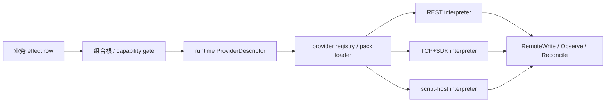

# 12 — Haskell 效应系统与 tagless-final 参考设计

> 摘要（≤10 行）
> 1. `polysemy`、`effectful`、`fused-effects` 与 `freer-simple` 都能用类型级 effect row 表达“程序需要哪些操作”，并把同一组操作交给不同 interpreter；新增一个独立效应通常不改核心。
> 2. `mtl`/tagless-final 与 `capability` 以 type class 表达能力，API 最像业务服务接口；但“后端只实现部分操作”通常只能由缺失 instance 或运行时 `Either` 表达，缺少 effect-row 的统一排放协议。
> 3. `free` 与 `operational` 最适合可审计 DSL、回放和挂起/恢复；它们本身不提供开放能力集合或后端能力矩阵。
> 4. effect row 只证明“有一个 handler 能处理该效应”，不证明远端 provider 真支持该操作；运行时配置的部分能力必须另有 `Unsupported`/`Rejected`/`Unknown` 结果类型。
> 5. `interpose`/`intercept`/carrier layering 可把审核、日志、策略和重试包在真实 IO 外；重试不可自动套在非幂等写入上。
> 6. 只读与读写应是不同的效应/能力：`Reader`/`HasSource` 不能替代一个同时暴露 `Get`/`Put` 的 `State`/`HasState`。
> 7. 对 UTA，最可借鉴的是 effectful 的动态 dispatch + `reinterpret`/`interpose`、polysemy 的高阶 effect，以及 capability 的命名读写能力；对账和“远端未写入”仍须由领域 ADT 与持久化协议负责。
> 8. 性能资料是相对且版本相关：effectful 的仓库基准中 static dispatch 接近 `ST`，dynamic dispatch 很快；`fused-effects` 约接近 `mtl`；`freer-simple`/`polysemy` 有表示层开销。

---

## 1. 范围与筛选标准

### 1.1 目标问题

本报告调查 Haskell 生态中两条相关路线：

- **开放效应集合（extensible effects）**：程序的类型含有一组可扩展的 effect，effect 的语法/操作与 interpreter 的实现分离；同一程序可以解释为真实 IO、内存模型、测试模型或另一组 effect。
- **tagless-final / capability style**：程序只要求一个或多个 `MonadX`/`HasX` 约束，具体后端通过 instance、newtype 或 dictionary 提供。

这里的“开放”不是说任意函数都能在运行时安全执行，而是指新增一个独立的效应接口时，既有业务核心不必变成一个新的总枚举或重写所有 provider。这个定义与 `freer-simple` 对 extensible effect 的描述，以及 `fused-effects` 对“effect type = syntax、carrier = semantics”的区分一致。[S4: `src/Control/Monad/Freer.hs:12-22,47-70`](https://hackage.haskell.org/package/freer-simple-1.2.1.2/docs/Control-Monad-Freer.html) [S3: `README.md:84-102`](https://github.com/fused-effects/fused-effects#algebraic-effects)

UTA 的现有约束使这个区分有实际意义：当前 `IBroker` 有 29 个成员，其中 10 个可选；不同 adapter 对 `getOpenOrders`、`getHistorical`、`expandContract`、`assetClassFor` 的支持不同，且 TP/SL 的拒绝/静默丢弃行为也不同。[UTA: `plans/uta-refactor/report/07-brokers-and-packs.md:52-88`](07-brokers-and-packs.md)

当前 UTA 还存在“远端写入已经发生，但本地 commit 没落下”的失败窗口：`getGitState()` 或 `onCommit` 失败可能使重试再次执行已成功的操作；`sync`、`reconcile`、`recordObservedOrders` 又绕过同一个写锁。[UTA: `plans/uta-refactor/report/05-staging-approval-ledger.md:108-153`](05-staging-approval-ledger.md)

因此，本报告把“类型层契约”拆成两个问题：

1. 编译时，业务程序是否只能使用它声明的操作，且 handler 是否必须被装配？
2. 运行时，provider 是否真的支持该操作、远端是否接受/写入、最终状态是否能与本地账本对账？

前者是 effect system 或 tagless-final 的强项；后者不能仅靠 effect row 解决。[P1](https://doi.org/10.1145/2503778.2503791) [P2](https://doi.org/10.1145/2804302.2804319) [UTA: `plans/uta-refactor/report/03-account-orders-positions.md:177-223`](03-account-orders-positions.md)

### 1.2 统一六维评价

每个库/模式都按下列相同维度讨论，以避免把“定义 effect”“实现 provider”“处理远端失败”混成一个抽象：

1. **开放的副作用/操作集合**：effect 如何定义；是 GADT、signature、type-level list 还是 class constraint；新增独立效应是否需要改核心。
2. **后端解释与部分不可用**：interpreter/carrier/instance 如何把操作映射到 IO、内存或 SDK；后端只实现一部分时，缺失是在编译时还是运行时表达。
3. **类型层契约一致性**：操作参数/返回类型、handler 消费 effect、私有效应是否由类型约束保护；哪些仍是文档或运行时约定。
4. **远端失败、不一致、未写入**：拒绝、传输异常、超时、结果不确定、远端状态漂移如何建模；是否有重试、回滚、transaction 或 reconcile 原语。
5. **只读与读写区分**：类型上能否把 query、append、mutation 分离；一个“只读 provider”是否会被误传成完整读写后端。
6. **可借鉴点与不适用点**：运行时开销、编译/instance/boilerplate 工程代价，以及对任意 gateway/REST/TCP+SDK/脚本宿主的适配价值。

“新增一个操作”与“新增一个独立效应”分开计分：开放 row 通常不需要改核心，但若把所有操作塞进既有 GADT/class，新增 constructor/method 仍会使全部 interpreter/instance 暴露缺口。[S1: `src/Polysemy.hs:43-75`](https://hackage.haskell.org/package/polysemy/docs/Polysemy.html) [S5: `Control/Monad/Error/Class.hs:99-113`](https://hackage.haskell.org/package/mtl/docs/Control-Monad-Error-Class.html)

### 1.3 证据方法与源码快照

只读浅克隆到 `/tmp/uta-haskell-effects/` 后阅读源码、README、Haddock 注释和仓库基准说明；没有通过 `gh`、GitHub API、raw URL 读取源码，也没有运行项目测试。以下 commit 是调查时的浅克隆 HEAD，行号指向该快照：

| 对象 | 包版本/HEAD | 主要源码路径 | 官方文档与源码入口 |
|---|---|---|---|
| `polysemy` | 1.9.2.0 / `cf2efec` | `/tmp/uta-haskell-effects/polysemy/src/Polysemy{,/Internal,/State,/Error,/Resource}.hs` | [Hackage](https://hackage.haskell.org/package/polysemy/docs/Polysemy.html) · [repo](https://github.com/polysemy-research/polysemy) |
| `effectful` | core 2.7.1.3 / `a8aa96a` | `/tmp/uta-haskell-effects/effectful/effectful-core/src/Effectful{,/Internal,/Dispatch,/State,/Error}` | [dynamic Haddock](https://hackage.haskell.org/package/effectful-core/docs/Effectful-Dispatch-Dynamic.html) · [static Haddock](https://hackage.haskell.org/package/effectful-core/docs/Effectful-Dispatch-Static.html) · [repo](https://github.com/haskell-effectful/effectful) |
| `fused-effects` | 1.1.2.7 / `3f2d942` | `/tmp/uta-haskell-effects/fused-effects/src/Control/{Algebra,Effect,Carrier}` | [Algebra Haddock](https://hackage.haskell.org/package/fused-effects/docs/Control-Algebra.html) · [repo](https://github.com/fused-effects/fused-effects) |
| `freer-simple` | 1.2.1.2 / `5304190` | `/tmp/uta-haskell-effects/freer-simple/src/{Control/Monad/Freer,Data}` | [Hackage](https://hackage.haskell.org/package/freer-simple-1.2.1.2/docs/Control-Monad-Freer.html) · [repo](https://github.com/lexi-lambda/freer-simple) |
| `mtl` / tagless-final | 2.3.2 / `22fdb9e` | `/tmp/uta-haskell-effects/mtl/Control/Monad/{Reader,State,Error}` | [README](https://github.com/haskell/mtl/blob/master/README.markdown) · [Hackage](https://hackage.haskell.org/package/mtl/docs) |
| `capability` | 0.5.0.1 / `b1bdebd` | `/tmp/uta-haskell-effects/capability/src/Capability{,/Reader,/State,/Error,/Reflection}` | [Hackage](https://hackage.haskell.org/package/capability/docs/Capability.html) · [Tweag](https://www.tweag.io/blog/2018-10-04-capability/) · [repo](https://github.com/tweag/capability) |
| `free` | 5.2 / `8cce810` | `/tmp/uta-haskell-effects/free/src/Control/Monad/{Free,Trans/Free}` | [Hackage](https://hackage.haskell.org/package/free/docs/Control-Monad-Free.html) · [repo](https://github.com/ekmett/free) |
| `operational` | 0.2.4.2 / `597a561` | `/tmp/uta-haskell-effects/operational/src/Control/Monad/Operational.hs` | [Hackage](https://hackage.haskell.org/package/operational-0.2.4.2/docs/Control-Monad-Operational.html) · [repo](https://github.com/HeinrichApfelmus/operational) |

论文依据也单列：`Extensible Effects` 解释 open union + handler 的模型，[P1](https://doi.org/10.1145/2503778.2503791)；`Freer Monads, More Extensible Effects` 解释 freer continuation 与 `FTCQueue`，[P2](https://okmij.org/ftp/Haskell/extensible/more.pdf)；`Finally Tagless, Partially Evaluated` 是 class/最终编码的理论参照，[P3](https://doi.org/10.1017/S0956796809007205)；`Fusion for Free` 与 carrier fusion 的效率模型相关，[P4](https://doi.org/10.1007/978-3-319-19797-5_15)。

---

## 2. 逐库 / 逐模式分析

### 2.1 `polysemy`

#### ① 开放的副作用/操作集合

`polysemy` 的 effect 是 kind `(* -> *) -> * -> *` 的 GADT；每个 constructor 是一个原语操作，`makeSem` 生成带 `Member` 约束的 smart constructor。`Sem r a` 的 `r` 是类型级 effect row，`Member e r` 只要求 `e` 出现在 row 任意位置，因此业务函数可以使用开放的超集，而不用固定 effect 顺序。[S1: `src/Polysemy.hs:43-75`; `src/Polysemy/Internal.hs:214-220,231-255`](https://hackage.haskell.org/package/polysemy/docs/Polysemy.html)

底层 `Union r m a` 持有 row 中某个 effect 的 membership proof 与 `Weaving`；这使 first-order 与 higher-order effect 都能统一表示。effect 自身使用 `m` 参数时可以携带子计算，例如 `Error.Catch` 和 `Resource.Bracket`。[S1: `src/Polysemy/Internal/Union.hs:63-107`; `src/Polysemy/Error.hs:43-54`; `src/Polysemy/Resource.hs:26-51`](https://github.com/polysemy-research/polysemy)

因此，新增一个**独立**效应只需新增 GADT、smart constructors 和 interpreter，不需要修改 `Sem`、`Union` 或核心组合器；README 也把“single-digit number of lines 定义新 effect”和“interpreter 只是函数 + pattern matching”作为特性。[S1: `README.md:48-54`](https://github.com/polysemy-research/polysemy#features)

但新增一个既有 effect 的 constructor 并非免费：所有对该 effect 做 pattern match 的 interpreter 都需要处理新 constructor。要保持真正开放，provider 操作应拆成 `ProviderRead`、`ProviderPlace`、`ProviderCancel` 等独立 effect，而不是一个不断膨胀的 `Provider` GADT。[S1: `src/Polysemy.hs:77-104`; `src/Polysemy/Internal/Combinators.hs:61-91`](https://hackage.haskell.org/package/polysemy/docs/Polysemy.html)

#### ② 后端解释与部分不可用

first-order interpreter 的核心签名是：

```haskell
interpret :: FirstOrder e "interpret" => (e (Sem r0) x -> Sem r x)
          -> Sem (e ': r) a -> Sem r a
```

`reinterpret` 把 `e` 重编码为一个或多个新 effect；`interpretH`/`reinterpretH` 则为包含子计算的 higher-order effect 提供 `Tactical`。这些组合器的结果类型明确删除或替换已处理效应。[S1: `src/Polysemy/Internal/Combinators.hs:61-91,173-206,215-243`](https://hackage.haskell.org/package/polysemy/docs/Polysemy.html)

解释器可以叠加为普通函数组合；`intercept`/`interceptH` 处理一个仍保留在 row 中的 effect，不消费它，适合在最终 IO interpreter 前加入审核、日志、指标、策略或重试包装。[S1: `src/Polysemy/Internal/Combinators.hs:280-312`](https://github.com/polysemy-research/polysemy/blob/master/src/Polysemy/Internal/Combinators.hs)

后端只实现部分**独立 effect**时，可以不导出对应 interpreter；调用方只有在 row 含该 effect 且组合根能排放它时才可编译。若一个 effect 内有多个 constructor，则 `Member` 只保证“这个 effect 存在”，不保证某个 provider 的 handler 对每个 constructor 都有真实能力；遗漏 pattern 会变成不完整匹配或由 handler 显式返回 `Unsupported`。这不是 `polysemy` 自动提供的能力矩阵。[S1: `src/Polysemy/Internal/Union.hs:196-206`; `src/Polysemy/Internal/Combinators.hs:64-72`](https://hackage.haskell.org/package/polysemy/docs/Polysemy.html)

`Embed IO`/`Final IO` 可接入 REST、TCP、SDK 或脚本进程；`Resource` 的 `resourceToIOFinal` 把 bracket 语义落到真实 `Control.Exception.bracket`，也可用纯 `runResource` 测试。[S1: `src/Polysemy/Embed.hs:18-29`; `src/Polysemy/Resource.hs:94-168`](https://hackage.haskell.org/package/polysemy/docs/Polysemy-Resource.html)

#### ③ 类型层契约一致性

GADT constructor 的结果类型直接写在操作上，例如 `Get :: State s m s`、`Put :: s -> State s m ()`；smart constructor 的 `Member` 约束把调用要求贯穿到 `Sem r a`。interpreter 消费 `Sem (e ': r) a` 后得到 `Sem r a`，因此未排放的 effect 不能被 `run :: Sem '[] a -> a` 静默丢掉。[S1: `src/Polysemy/State.hs:44-57,86-108`; `src/Polysemy/Internal.hs:633-645`](https://hackage.haskell.org/package/polysemy/docs/Polysemy-State.html)

`Error e` 把错误类型作为 effect 参数，`throw`/`catch` 的 handler 返回类型受 `e` 约束；`fromException` 明确要求 `Exception e`、`Error e` 和 `Embed IO`。[S1: `src/Polysemy/Error.hs:63-120`](https://hackage.haskell.org/package/polysemy/docs/Polysemy-Error.html)

契约边界仍不是语义证明：`Member (Embed IO) r` 允许任意 IO，handler 也可以把拒绝压成异常或错误字符串；类型系统不会证明远端 idempotency、订单状态映射、写入已持久化或 interpreter 遵守 UTA 的业务不变量。该缺口正对应当前 `IBroker` 可选成员与多 adapter 行为差异。[S1: `src/Polysemy/Internal.hs:214-220`; UTA: `plans/uta-refactor/report/07-brokers-and-packs.md:62-88`](07-brokers-and-packs.md)

#### ④ 远端失败、不一致、未写入

`Error` interpreter 可以将 SDK/HTTP 异常转成结构化 `Either`，`Resource` 可以保证清理动作在短路 effect 下执行；但这些都是本地控制流，不会判断远端是否“收到请求但未落库”。[S1: `src/Polysemy/Error.hs:123-153`; `src/Polysemy/Resource.hs:26-49,133-168`](https://hackage.haskell.org/package/polysemy/docs/Polysemy-Error.html)

推荐把 provider 写结果定义成业务 ADT，而不是只抛 `Error`：`Applied remoteId` 表示已获得明确成功，`Rejected reason` 表示远端明确拒绝，`NotWritten reason` 表示本地已知没有写入，`Unknown observationKey` 表示超时后无法判断。超时后的 `Reconcile` 应是另一种 effect/command，由同步器根据 observation key 查询远端并追加观测记录。[推论，依据 S1 的 `Error`/`Resource` 仅表达本地控制流，以及 UTA 失败窗口 UTA: `plans/uta-refactor/report/05-staging-approval-ledger.md:121-153`](05-staging-approval-ledger.md)]

重试可由 `intercept` 包在真实 provider effect 外，但应只包 transport/query 或携带幂等键的 mutation；把整个 `placeOrder` interpreter 无条件重试会把“未知”变成重复下单。`polysemy` 不会替应用决定这一点。[S1: `src/Polysemy/Internal/Combinators.hs:280-312`; UTA: `plans/uta-refactor/report/03-account-orders-positions.md:177-199`](03-account-orders-positions.md)

#### ⑤ 只读与读写区分

内置 `State s` 是完整的 `Get` + `Put`；文档明确它可被解释为本地状态、HTTP 请求或数据库访问，但 `Member (State s) r` 本身同时授权读取和更新。[S1: `src/Polysemy/State.hs:44-57`](https://hackage.haskell.org/package/polysemy/docs/Polysemy-State.html)

只读接口应使用 `Reader r` 或单独定义 `ProviderRead` GADT；写接口使用 `ProviderWrite`/`ProviderMutation`。不要用一个 `State ProviderState` 代表查询和写入，因为只读账户也会得到 `put` 的类型能力。当前 UTA 的 `keyless ⟹ readOnly` 与“stage 允许、push 拒绝”说明这是边界上的真实语义，而不是 UI 标签。[S1: `src/Polysemy/State.hs:44-50`; UTA: `plans/uta-refactor/report/00-overview.md:180-186`](00-overview.md)

#### ⑥ 可借鉴点与不适用点

可借鉴点是低 boilerplate 的开放 row、`reinterpret` 把 provider facade 降到 SDK/HTTP/进程 effect，以及 `intercept`/`Resource` 对横切逻辑和资源生命周期的表达。高阶 effect 还可以把“带子程序的 retry scope / audit scope / transaction scope”做成可解释的操作。[S1: `README.md:48-54`; `src/Polysemy/Resource.hs:26-51`](https://github.com/polysemy-research/polysemy)

不适用点是 `Sem`/`Union`/`Weaving` 与 higher-order tactics 增加 GHC 类型推导和解释器复杂度；要改善推导通常需 `polysemy-plugin`。effectful 仓库基准把 `polysemy` 归为 freer/free 表示，性能相近但初始开销更高；这只是该仓库在固定 GHC/CPU 上的基准，不是 UTA 的实测结果。[S1: `README.md:37-46`; S2: `/tmp/uta-haskell-effects/effectful/benchmarks/README.md:89-95`](https://github.com/haskell-effectful/effectful/blob/master/benchmarks/README.md)

### 2.2 `effectful`

#### ① 开放的副作用/操作集合

`effectful` 用 `Effect = (Type -> Type) -> Type -> Type` 描述 effect kind，`Eff es a` 的 `es` 是类型级列表；`e :> es` 是带位置证据的成员约束。`Eff` 本身实现为 `Env es -> IO a`，不是显式 free tree。[S2: `/tmp/uta-haskell-effects/effectful/effectful-core/src/Effectful/Internal/Effect.hs:24-58`; `/tmp/uta-haskell-effects/effectful/effectful-core/src/Effectful/Internal/Monad.hs:108-127`](https://hackage.haskell.org/package/effectful-core/docs/Effectful.html)

动态 effect 以 GADT constructor 表达操作，并给出 `type instance DispatchOf E = Dynamic`；`send` 把数据操作放入环境。静态 effect 则用 `DispatchOf E = Static ...` 和 `StaticRep E` 把具体数据/函数放在 `Eff` 环境。[S2: `/tmp/uta-haskell-effects/effectful/effectful-core/src/Effectful/Dispatch/Dynamic.hs:104-154`; `/tmp/uta-haskell-effects/effectful/effectful-core/src/Effectful/Dispatch/Static.hs:67-95`](https://hackage.haskell.org/package/effectful-core/docs/Effectful-Dispatch-Dynamic.html)

新增一个独立 effect 不需修改 `Eff` 或 `Env` 核心；新增 constructor 仍会要求每个 handler 更新 pattern match。`effectful` README 明确支持静态和动态 dispatch，并建议不确定时先用 dynamic。[S2: `README.md:11-32`; `README.md:58-92`](https://github.com/haskell-effectful/effectful#readme)

#### ② 后端解释与部分不可用

动态 handler 的核心是 `interpret :: EffectHandler e es -> Eff (e : es) a -> Eff es a`；`reinterpret` 先执行一个 setup，把被处理 effect 降成私有 `handlerEs`，然后对下游隐藏中间 effect。`interpose` 则替换/增强已有 handler，未处理操作可以通过 `passthrough` 回到旧 handler。[S2: `/tmp/uta-haskell-effects/effectful/effectful-core/src/Effectful/Dispatch/Dynamic.hs:441-513,529-563`](https://hackage.haskell.org/package/effectful-core/docs/Effectful-Dispatch-Dynamic.html)

官方 dynamic 文档正好给出任意后端的 FileSystem 例子：同一 `FileSystem` 可被解释为真实文件 IO，或 `reinterpret` 为私有的本地 `State`；真实版本把 IO 异常转成 `Error FsError`。[S2: `/tmp/uta-haskell-effects/effectful/effectful-core/src/Effectful/Dispatch/Dynamic.hs:104-218`](https://hackage-content.haskell.org/package/effectful-core-2.6.1.0/docs/Effectful-Dispatch-Dynamic.html)

静态 handler 把 effect 的具体实现固定在 `StaticRep`；文档说明 static interpretation 不能在运行时替换，并且带 `WithSideEffects` 的 static effect 需要 `IOE :> es`，否则不能通过 `runPureEff`。[S2: `/tmp/uta-haskell-effects/effectful/effectful-core/src/Effectful/Dispatch/Static.hs:49-62,77-146`; `/tmp/uta-haskell-effects/effectful/effectful-core/src/Effectful/Internal/Monad.hs:534-546`](https://hackage.haskell.org/package/effectful-core/docs/Effectful-Dispatch-Static.html)

后端只实现部分独立 effect 时，缺少 `e :> es` 会在编译时失败；`e :> '[]` 甚至定义了自定义 `TypeError` “There is no handler for ...”。但一个动态 GADT 内部的 `Op3` 仍可能被写成 `error "Op3 not implemented"`；仓库示例特意展示了这种可能性，生产 adapter 不应复制，应返回 typed `Unsupported`。[S2: `/tmp/uta-haskell-effects/effectful/effectful-core/src/Effectful/Internal/Effect.hs:27-58`; `src/Effectful/Dispatch/Dynamic.hs:529-563`](https://hackage.haskell.org/package/effectful-core/docs/Effectful.html)

#### ③ 类型层契约一致性

`:>` 约束把 effect 的存在与 `Eff es a` 绑定，`EffectHandler e es` 又要求 handler 将 `e` 降为剩余 row。`runEff` 只接受 `Eff '[IOE] a`，所以其它 effect 未解释时不能被当成 IO 结果抽取；`runPureEff` 只接受空 row。[S2: `/tmp/uta-haskell-effects/effectful/effectful-core/src/Effectful/Internal/Monad.hs:110-166,539-546`; `src/Effectful/Dispatch/Dynamic.hs:441-451`](https://hackage.haskell.org/package/effectful-core/docs/Effectful.html)

`StaticRep` 还把“静态 effect 是否有 IO 副作用”编码进 `DispatchOf` 的 `SideEffects` 标志；这是比文档约定更强的装配检查，但仍要求作者诚实声明，文档也明确说 GHC 不能阻止作者撒谎。[S2: `/tmp/uta-haskell-effects/effectful/effectful-core/src/Effectful/Dispatch/Static.hs:77-95,120-146`](https://hackage.haskell.org/package/effectful-core/docs/Effectful-Dispatch-Static.html)

`IOE` 是很宽的 escape hatch，官方源代码不建议应用代码直接依赖它，而应在细粒度 effect handler 内使用；这正适合作为 adapter 内部边界，不适合作为业务层的全部契约。[S2: `/tmp/uta-haskell-effects/effectful/effectful-core/src/Effectful/Internal/Monad.hs:527-546`](https://hackage.haskell.org/package/effectful-core/docs/Effectful.html)

#### ④ 远端失败、不一致、未写入

`Effectful.Error.Static` 把 checked `Error e` 与普通 runtime exception 明确分离；`runError` 返回 `Either (CallStack, e) a`，普通异常要用 `Effectful.Exception`。这使 provider 明确拒绝可以成为 domain error，而 transport exception 仍可保留异常语义。[S2: `/tmp/uta-haskell-effects/effectful/effectful-core/src/Effectful/Error/Static.hs:1-23,128-178`](https://hackage.haskell.org/package/effectful-core/docs/Effectful-Error-Static.html)

该库对本地 state 与异常的语义比传统 `ExceptT` 更稳定：文档示例说明 `State` 更新在 `Error` 之后仍保留，不随 handler 顺序而丢弃；这避免了 transformer order 造成的隐含 rollback。[S2: `/tmp/uta-haskell-effects/effectful/effectful-core/src/Effectful/Error/Static.hs:41-77`; `/tmp/uta-haskell-effects/effectful/effectful-core/src/Effectful/State/Static/Local.hs:1-25`](https://hackage.haskell.org/package/effectful-core/docs/Effectful-Error-Static.html)

但 `Error`、`Exception`、`bracket` 仍只处理本地计算。provider adapter 必须把 response status、远端 request id、超时不确定性和后续查询写进结果 ADT；`reinterpret` 适合把这一套内部拆为 transport + reconcile effects，库不替代 durable outbox/ledger。[推论，依据 S2 的 Error/Exception API，以及 UTA 的“已执行未记账”窗口 UTA: `plans/uta-refactor/report/05-staging-approval-ledger.md:121-153`](05-staging-approval-ledger.md)

#### ⑤ 只读与读写区分

`Effectful.State.Static.Local.State` 暴露完整 `get`/`put`/`modify`；一个 `State s :> es` 的调用者拥有读写能力。动态文档专门演示如何把大 State 拆成 `Get s` 与 `Put s` 两个独立 effect，并通过 `reinterpret` 在内部重新合并。[S2: `/tmp/uta-haskell-effects/effectful/effectful-core/src/Effectful/State/Static/Local.hs:51-121`; `/tmp/uta-haskell-effects/effectful/effectful-core/src/Effectful/Dispatch/Dynamic.hs:466-503`](https://hackage.haskell.org/package/effectful-core/docs/Effectful-Dispatch-Dynamic.html)

这对 UTA 是最直接的参考：`ProviderRead :> es` 的 query 代码不会获得 `ProviderWrite :> es`；`ProviderPlace`、`ProviderModify`、`ProviderCancel` 还可继续细分。provider 只实现行情或账户读取时，只导出 read handler，并在运行时 capability descriptor 中明确没有 mutation。[S2: `/tmp/uta-haskell-effects/effectful/effectful-core/src/Effectful/Dispatch/Dynamic.hs:473-503`; UTA: `plans/uta-refactor/report/00-overview.md:185-186`](00-overview.md)

#### ⑥ 可借鉴点与不适用点

对 UTA 最有价值的是 dynamic/static 双路线、`reinterpret` 的私有效应、`interpose` + `passthrough` 的横切包装，以及对 `MonadUnliftIO`/`resourcet`/现有 IO 生态的整合。[S2: `README.md:11-32,118-156`; `src/Effectful/Dispatch/Dynamic.hs:529-563`](https://github.com/haskell-effectful/effectful#readme)

不适用点是 `Eff` 最终锚定 `IO`，不能像纯 freer AST 一样天然做任意多次 resume；README 明确指出需要捕获/暂停 continuation 的 `NonDet`、`Coroutine` 不属于其目标能力。[S2: `README.md:94-116`](https://github.com/haskell-effectful/effectful#readme)

运行时方面，仓库 benchmark 在 GHC 9.2.4、Ryzen 9 5950X、1000 次迭代下报告 static dispatch 接近 `ST`、dynamic dispatch 也很快；基准故意用 deep row 与 `NOINLINE` 模拟跨模块场景。该结果可用于方向选择，不能替代以 UTA 的 REST/TCP/SDK 延迟和失败比率做实测。[S2: `/tmp/uta-haskell-effects/effectful/benchmarks/README.md:14-37,45-87`](https://github.com/haskell-effectful/effectful/blob/master/benchmarks/README.md)

### 2.3 `fused-effects`

#### ① 开放的副作用/操作集合

`fused-effects` 把 effect type 作为 syntax，把 carrier type 作为 semantics。effect 通常是带 `m`、continuation `k` 两个参数的 GADT/functor；业务函数通过 `send` 构造操作，`Has eff sig m` 表示 effect 在 signature `sig` 且 carrier `m` 能解释它。[S3: `README.md:84-89,111-139`; `docs/defining_effects.md:1-35`](https://github.com/fused-effects/fused-effects#defining-new-effects)

signature 以 `:+:` 组合，`Control.Effect.Sum.Member` 证明某 effect 在其中；因此新建独立 effect 只需定义 syntax 与至少一个 carrier，不修改 `Algebra` 核心。新增既有 effect 的 constructor 仍要求每个相关 carrier 处理该 constructor。[S3: `src/Control/Algebra.hs:71-99,124-140`; `docs/defining_effects.md:38-59`](https://hackage.haskell.org/package/fused-effects/docs/Control-Algebra.html)

它既支持 first-order algebraic effect，也支持 `local`/`catchError` 一类 higher-order effect；高阶 operation 的 `m` 参数保留 scoped subcomputation，而不必硬编码到唯一 interpreter。[S3: `README.md:91-96`](https://github.com/fused-effects/fused-effects#higher-order-effects)

#### ② 后端解释与部分不可用

carrier 是实现 `Algebra sig m` 的 monad newtype；例如 `StateC s m` 的 `Algebra (State s :+: sig) (StateC s m)` 在 `L Get`/`L Put` 分支处理 state，在 `R other` 分支用 `thread` 把 tail signature 交给下层 carrier。[S3: `src/Control/Carrier/State/Strict.hs:74-126`; `src/Control/Algebra.hs:100-112`](https://hackage.haskell.org/package/fused-effects/docs/Control-Algebra.html)

`runState`、`runReader` 等函数选择具体 carrier，handler 可以像函数一样叠加；README 的 `runReader "hello" . runState 0 $ program` 是组合多个 effect 的典型形态。`Control.Carrier.Lift`/`runM` 则把底层任意 Monad/IO 接入。[S3: `README.md:141-186`; `src/Control/Carrier/Lift.hs:27-36`](https://github.com/fused-effects/fused-effects#running-effects)

后端只实现部分独立 effect 时，业务函数的 `Has` 约束与 `Algebra sig m` 会在缺 carrier/缺 signature 时失败；但 carrier 可以对一个既有 GADT 的某个 constructor 写错误或不完整语义。若要表达明确不可用，应拆分 effect 或用 `Error Unsupported`/`Either` carrier，不能依赖 `error`。[S3: `src/Control/Algebra.hs:124-140`; `src/Control/Carrier/Error/Either.hs:40-49`](https://hackage.haskell.org/package/fused-effects/docs/Control-Carrier-Error-Either.html)

#### ③ 类型层契约一致性

`Has eff sig m = (Members eff sig, Algebra sig m)` 同时检查“effect 在 signature 中”和“carrier 能解释该 signature”；effect operation 的结果类型又由 GADT constructor 决定。`Algebra sig m | m -> sig` 的 functional dependency 保证一个 carrier 对应一个 signature，但也使复杂 carrier 组合有较强类型约束。[S3: `src/Control/Algebra.hs:71-99,124-140`](https://hackage.haskell.org/package/fused-effects/docs/Control-Algebra.html)

`Error e` 的预定义 `Either` carrier 把错误类型显式写进 `Either e a`；多个 `Error`/`Reader`/`State` 类型可共存，不像 `mtl` 的一个 `MonadState s m | m -> s` 那样只由 monad 推断一个状态类型。[S3: `src/Control/Effect/Error.hs:1-10`; `src/Control/Effect/State.hs:38-108`](https://github.com/fused-effects/fused-effects)

契约一致性仍依赖 carrier 作者：`Algebra` 类型不验证 remote protocol 的 success/reject 语义，也不强制 carrier 不能用底层 `Lift IO` 绕出细粒度效果。新 effect 的 carrier boilerplate 使代码 review 容易发现遗漏，但不是远端能力证明。[S3: `docs/defining_effects.md:38-59`; `src/Control/Algebra.hs:93-99`](https://github.com/fused-effects/fused-effects)

#### ④ 远端失败、不一致、未写入

`Control.Effect.Error` 明确提供 `Error`/`Throw`/`Catch`，预定义 `Either` carrier 可返回 `Left e`；`State` carrier 的语义由 `StateC s m a = s -> m (s,a)` 定义，适合表达本地 transaction，但不等同远端 transaction。[S3: `src/Control/Effect/Error.hs:1-10`; `src/Control/Carrier/Error/Either.hs:40-49`; `src/Control/Carrier/State/Strict.hs:74-126`](https://hackage.haskell.org/package/fused-effects/docs/Control-Effect-Error.html)

`fused-effects` 没有 provider reconciliation、outbox、幂等键或远端 read-after-write 协议。可把 `Submit` interpreter 降为 `Transport` + `Observe` effect，再由另一个 carrier 将 `Unknown` 放入 durable ledger；这属于应用层设计。[推论，依据 S3 的 effect/carrier 边界，以及 UTA 当前 `sync`/`reconcile` 不是 push 事务一部分 UTA: `plans/uta-refactor/report/03-account-orders-positions.md:191-223`](03-account-orders-positions.md)

#### ⑤ 只读与读写区分

官方 State 文档明确建议：只读 state 使用 `Reader`，append-only state 使用 `Writer`，只有需要读取并更新才使用 `State`。[S3: `src/Control/Effect/State.hs:1-15`](https://hackage.haskell.org/package/fused-effects/docs/Control-Effect-State.html)

因此它能在 effect syntax 层把 query 与 mutation 分离；不过 `Has (State Provider) sig m` 仍同时拥有 `get`/`put`。若 provider 读写能力是运行时配置，仍需拆成 `ProviderRead`/`ProviderWrite` effect，不能只依赖 carrier 名称。[S3: `src/Control/Effect/State.hs:38-108`; UTA: `plans/uta-refactor/report/00-overview.md:185-186`](00-overview.md)

#### ⑥ 可借鉴点与不适用点

可借鉴点是 carrier layering 的明确边界、higher-order scope、以及把中间 syntax 与最终实现分离；对于高吞吐的纯内部状态/日志 pipeline，carrier 也提供了比显式 free tree 更可预测的优化路径。[S3: `README.md:59-106`](https://github.com/fused-effects/fused-effects#overview)

代价是定义新 carrier 需要实现 `Algebra`、定义 carrier newtype、处理 `:+:` 分支和 tail threading；官方比较也承认新 effect 比 `polysemy` 写更多代码，且诊断信息不如 `freer-simple`/`polysemy` 友好。[S3: `README.md:301-340`](https://github.com/fused-effects/fused-effects#comparison-to-other-effect-libraries)

README 的 fusion 说明没有构造 free/freer 中间表示，carrier instance 可经 GHC inline，性能约与 `mtl` 相当；effectful 的跨库 benchmark 则观察到 `fused-effects` 与 `mtl` 相近。二者都是优化/版本/工作负载相关的相对结果。[S3: `README.md:98-106`; S2: `/tmp/uta-haskell-effects/effectful/benchmarks/README.md:89-95`](https://github.com/haskell-effectful/effectful/blob/master/benchmarks/README.md)

### 2.4 `freer-simple`

#### ① 开放的副作用/操作集合

`freer-simple` 用一个 `Eff effs a` monad 搭配类型级 effect list；effect 本身是 GADT，如 `FileSystem r` 的 `ReadFile :: FilePath -> FileSystem String`。`send` 要求 `Member eff effs`，`Members` 把多个成员约束展开为 conjunction，而且 effect 顺序对 `Member` 不重要。[S4: `src/Control/Monad/Freer.hs:12-22,103-167`; `src/Data/OpenUnion.hs:45-75`](https://hackage.haskell.org/package/freer-simple-1.2.1.2/docs/Control-Monad-Freer.html)

内部 `Eff` 是 `Val a | E (Union effs b) (Arrs effs b a)`，`Union` 是 open union，`Arrs` 使用 `FTCQueue` 保存 continuation。源码注释把 open union 的操作标为 constant-time；这正是 freer model 相比显式 transformer stack 的开放点。[S4: `src/Control/Monad/Freer/Internal.hs:82-121,164-177`; `src/Data/OpenUnion.hs:14-15`](https://github.com/lexi-lambda/freer-simple)

新增独立 effect 不需改核心 `Eff`/`Union`；但与其它 GADT 一样，新增 constructor 会影响所有解释它的 handler。README 建议优先把新 effect `reinterpret` 成已有基础 effect，从而避免重复实现底层语义。[S4: `src/Control/Monad/Freer.hs:64-101`](https://github.com/lexi-lambda/freer-simple#readme)

#### ② 后端解释与部分不可用

`interpret` 消费 `Eff (eff ': effs) a` 并返回 `Eff effs a`；`reinterpret` 把 `f` 编成 `g : effs`，`reinterpretN` 可编成多个 effect；`interpretM` 把 effect 映射到最终 `LastMember m effs` 的传统 monad。`interpose` 则处理 effect 但保持它存在。[S4: `src/Control/Monad/Freer.hs:262-347`](https://hackage.haskell.org/package/freer-simple-1.2.1.2/docs/Control-Monad-Freer.html)

README 的 FileSystem 例子同时给出真实 IO 与内存 `State` 两种 interpreter；这体现“同一 syntax 多个后端”，且 handler 可完全封装中间 state。[S4: `README.md:47-101`](https://github.com/lexi-lambda/freer-simple#code-example)

后端只实现部分独立 effect 时，缺少 `Member`/`LastMember` 会阻止调用或最终运行；一个 provider 对单个 GADT 的 constructor 子集则仍要由 handler 返回 typed `Error`/`Either`，不能把“未实现”留成 partial pattern 或 `error`。`runError` 的 handler 直接返回 `Either e a`，是可复用的失败出口。[S4: `src/Control/Monad/Freer/Error.hs:25-54`; `src/Control/Monad/Freer/Internal.hs:197-212`](https://hackage.haskell.org/package/freer-simple-1.2.1.2/docs/Control-Monad-Freer-Error.html)

#### ③ 类型层契约一致性

effect GADT 的 constructor result index 保证 `ReadFile` 得到 `String`、`WriteFile` 得到 `()`；interpreter 的输入/输出 row 保证已消费的 effect 不再是下游能力。`LastMember` 专门保证 `runM` 时基础 monad 位于 effect list 最后。[S4: `src/Control/Monad/Freer.hs:114-167,262-347`; `src/Data/OpenUnion.hs:64-75`](https://hackage.haskell.org/package/freer-simple-1.2.1.2/docs/Data-OpenUnion.html)

`Error e` 的 `throwError`、`catchError` 与 `runError` 把错误类型贯穿；`State` 还提供 `transactionState`，在本地 state 上先保存起点、运行临时 handler、成功后写回。[S4: `src/Control/Monad/Freer/Error.hs:25-54`; `src/Control/Monad/Freer/State.hs:84-105`](https://github.com/lexi-lambda/freer-simple)

与所有 row 系统一样，`Member ProviderWrite effs` 只证明程序有权发出写操作，不证明当前运行时选定的 provider 真的支持它；动态 provider 仍需 capability witness 和 typed result。[推论，依据 S4 的 `Member` 定义与 UTA 的可选 broker 能力 UTA: `plans/uta-refactor/report/07-brokers-and-packs.md:67-88`](07-brokers-and-packs.md)

#### ④ 远端失败、不一致、未写入

`runError` 在未捕获错误时返回 `Left`，并中断其它下游 handler；这是本地短路语义。`transactionState` 只对本地 state 提供成功后提交，不会让一个 REST/TCP provider 的远端写入回滚。[S4: `src/Control/Monad/Freer/Error.hs:33-37`; `src/Control/Monad/Freer/State.hs:84-105`](https://hackage.haskell.org/package/freer-simple-1.2.1.2/docs/Control-Monad-Freer-State.html)

远端 adapter 应将“不确定是否写入”作为值返回或记录为另一个 effect，再由 `Reconcile` interpreter 查询；不能把所有异常都映射成“未写入”。这点直接对应 UTA 当前 push 的失败窗口：broker 可能已成功而 commit 未落盘。[推论，依据 UTA: `plans/uta-refactor/report/05-staging-approval-ledger.md:121-153`](05-staging-approval-ledger.md)

#### ⑤ 只读与读写区分

`State` 源码注释建议 read-only 使用 `Reader`，append-only 使用 `Writer`；这与 `fused-effects` 的分类一致。独立的 `ProviderRead`/`ProviderWrite` effect 可将 provider 只读后端表达为缺失 write handler。[S4: `src/Control/Monad/Freer/State.hs:12-19,47-82`](https://hackage.haskell.org/package/freer-simple-1.2.1.2/docs/Control-Monad-Freer-State.html)

但一个业务函数只要拿到 `Member (State s) effs` 就能 `put`；只读约束不是由 state value 的不可变性自动提供。应将 UTA 的 quote/account/position 查询与 place/modify/cancel 分成不同 effect。[S4: `src/Control/Monad/Freer/State.hs:47-68`; UTA: `plans/uta-refactor/report/03-account-orders-positions.md:201-223`](03-account-orders-positions.md)

#### ⑥ 可借鉴点与不适用点

可借鉴点是简单的 open union、显式 continuation、`reinterpret`/`interpose`、真实/纯测试 interpreter 并存，以及 `FTCQueue` 避免连续 bind 的朴素左嵌套。[S4: `src/Control/Monad/Freer/Internal.hs:116-154,231-286`; P2](https://okmij.org/ftp/Haskell/extensible/more.pdf)

不适用点是当前 package 版本 1.2.1.2 的发布快照较旧，类型错误和生态整合不如 effectful；higher-order/coroutine 可表达，但 handler 需要理解显式 continuation。工程上还要自己决定 effect row 与 runtime provider registry 如何连接。[S4: `freer-simple.cabal:1-29`; `src/Control/Monad/Freer.hs:349-381`](https://github.com/lexi-lambda/freer-simple)

effectful 仓库的跨库 benchmark 报告 `freer-simple` 作为 free-based 方案表现“出乎意料地好”，但仍不同于无中间表示的 static carrier；这适合对账/回放型小 DSL，不代表每个高频报价路径都应选择它。[S2: `/tmp/uta-haskell-effects/effectful/benchmarks/README.md:58-95`](https://github.com/haskell-effectful/effectful/blob/master/benchmarks/README.md)

### 2.5 `mtl` 风格 tagless-final（`MonadX` class 按后端 instance）

#### ① 开放的副作用/操作集合

`mtl` 把 transformer 的操作定义成 class，把具体 `ReaderT`/`StateT`/`ExceptT` 等类型放在 transformer 层，并通过 instance 提供 class 方法；README 的结构说明就是“class define operations，data type implement transformers，`run...` 解包”。[S5: `README.markdown:3-23`](https://github.com/haskell/mtl#structure)

针对 provider，可写成一个最终编码式接口：

```haskell
class MonadProvider m where
  quote  :: Instrument -> m Quote
  submit :: Order -> m (RemoteWrite OrderId)
```

业务代码只调用 `quote`/`submit`，`IO`、测试内存 monad、REST adapter、TCP adapter 分别提供 instance。这是 tagless-final “同一个程序映射到不同语义”的直接工程化形式，理论参照是 `Finally Tagless, Partially Evaluated`。[P3](https://doi.org/10.1017/S0956796809007205) [S5: `README.markdown:9-23`](https://github.com/haskell/mtl#readme)

新增一个**新的 class**不需修改既有 class 或核心 monad；但新增既有 class 的 method 会使每个 instance 出现缺失方法。class 没有一个统一的 type-level effect row，因此“业务函数到底需要哪些 effect”分散在约束列表里。[S5: `Control/Monad/Reader/Class.hs:81-103`; `Control/Monad/State/Class.hs:59-76`](https://hackage.haskell.org/package/mtl/docs)

#### ② 后端解释与部分不可用

后端通常是 `newtype ProviderM a = ProviderM (ReaderT Env IO a)`，对每个 `MonadProvider ProviderM` 方法调用 SDK；测试后端则用 `ReaderT Env (State TestState)` 或纯 `Either`. transformer 的 `lift` 把底层 action 提升到外层。[S5: `README.markdown:26-49`; `Control/Monad/Trans.hs:13-26`](https://github.com/haskell/mtl#lifting)

后端只实现**完整的新 class 子集**时，缺失 instance 会在编译时拒绝调用；一个 class 内只实现 `quote` 而不实现 `submit` 则不能由 class 形状表达，必须拆成 `MonadProviderRead`/`MonadProviderWrite`，或令 `submit` 返回 `Either Unsupported ...`。`mtl` 没有类似 `interpose` 的通用 effect handler；包装通常依靠 transformer/newtype instance 或手写 decorator。[S5: `Control/Monad/Reader/Class.hs:81-116`; `Control/Monad/State/Class.hs:108-164`](https://hackage.haskell.org/package/mtl/docs/Control-Monad-Reader-Class.html)

这使 class 路线很适合稳定、少量、面向服务的 provider API，不适合一个不断加入任意操作并需要统一审计/记录的巨大接口；所有 backend instance 都是手工维护边界。[S5: `README.markdown:9-23`; UTA: `plans/uta-refactor/report/07-brokers-and-packs.md:54-88`](07-brokers-and-packs.md)

#### ③ 类型层契约一致性

`MonadReader r m | m -> r`、`MonadState s m | m -> s`、`MonadError e m | m -> e` 用 functional dependency 从 monad 推断关联类型；class 方法的参数/返回值由 Haskell 类型检查。标准 State class 直接把 `get`、`put`、`state` 放在同一个 class 中。[S5: `Control/Monad/Reader/Class.hs:81-103`; `Control/Monad/State/Class.hs:59-76`; `Control/Monad/Error/Class.hs:99-113`](https://hackage.haskell.org/package/mtl/docs/Control-Monad-State-Class.html)

但 FD 也限制同一个 monad 对同一个 class 关联一个类型；`mtl` 很难在相同 stack 中表达两个同类型、不同语义的 state，而 `polysemy`/`capability` 用 effect/tag 解决。[S1: `src/Polysemy/Internal.hs:192-208`; S5: `Control/Monad/State/Class.hs:59-60`; S6: `README.md:38-59`](https://github.com/tweag/capability#readme)

class 约束不能自动检查 instance 的远端语义、响应完整性或错误映射；`MonadProvider` 的 law 通常在注释、测试和 adapter review 中，而非 GHC 类型层。对 UTA 而言，`IBroker` 目前的可选成员与 provider-specific loud-refuse/静默丢弃正是不能只靠 class signature 解决的差异。[S5: `Control/Monad/Error/Class.hs:81-113`; UTA: `plans/uta-refactor/report/07-brokers-and-packs.md:543-549`](07-brokers-and-packs.md)

#### ④ 远端失败、不一致、未写入

`MonadError e m` 提供 `throwError`/`catchError`，`ExceptT`/`Either` 可以显式承载拒绝；`IO` instance 还把 `IOException` 映射为异常。[S5: `Control/Monad/Error/Class.hs:99-147`](https://hackage.haskell.org/package/mtl/docs/Control-Monad-Error-Class.html)

传统 transformer stack 的失败语义依赖层次：state 放在 error 内外会决定异常时 state 更新是否保留。effectful 的 Error 文档用对比示例明确展示这一点；因此 mtl 风格若用于 UTA，必须把 `RemoteWrite` 结果和 reconcile 状态显式放在领域类型，而不能靠 transformer 顺序暗示“已写/未写”。[S2: `/tmp/uta-haskell-effects/effectful/effectful-core/src/Effectful/Error/Static.hs:41-77`; S5: `Control/Monad/State/Class.hs:59-76`](https://hackage.haskell.org/package/effectful-core/docs/Effectful-Error-Static.html) [UTA: `plans/uta-refactor/report/05-staging-approval-ledger.md:129-153`](05-staging-approval-ledger.md)

#### ⑤ 只读与读写区分

标准 `MonadReader` 是只读环境（`ask`/`local`），标准 `MonadState` 是读写状态（`get`/`put`/`state`）；mtl README 也明确只读需求应选 Reader 而不是 State。[S5: `Control/Monad/Reader/Class.hs:23-40,81-103`; `README.markdown:100-118`](https://github.com/haskell/mtl#readme)

对 provider 应显式定义 `MonadProviderRead m` 与 `MonadProviderWrite m`；若只定义一个 `MonadProvider`，任何 read-only backend 都必须提供一个假的 mutation instance，或者运行时失败，二者都会削弱契约一致性。标准 class 能表达维度拆分，但不会替应用自动生成 provider capability matrix。[S5: `Control/Monad/State/Class.hs:59-76`; UTA: `plans/uta-refactor/report/00-overview.md:185-186`](00-overview.md)

#### ⑥ 可借鉴点与不适用点

可借鉴点是 API 低摩擦、现有 Haskell 生态兼容、具体 monad 上的 GHC specialization，以及业务函数看起来像普通服务接口；稳定的 `ReaderT Env IO` provider facade 维护成本低。[S5: `README.markdown:3-49`](https://github.com/haskell/mtl#readme)

不适用点是 open effect row、handler interpose、两个同类 effect、统一 effect 审计都需要额外约定/transformer；新增 class 还需要为每个 backend 新增 instance。effectful benchmark 的 deep stack 对 mtl 报告约 50 倍于 reference 的差距，原因是 polymorphic bind 与 transformer stack dictionary 逐层调用；具体业务仍应自行 benchmark。[S2: `/tmp/uta-haskell-effects/effectful/benchmarks/README.md:61-87`](https://github.com/haskell-effectful/effectful/blob/master/benchmarks/README.md)

### 2.6 `capability`

#### ① 开放的副作用/操作集合

`capability` 将 effect 定义为 type class constraint：`Capability = (Type -> Type) -> Constraint`；标准 capability 有 `HasReader tag r m`、`HasState tag s m`、`HasSource tag a m`、`HasSink tag a m`、`HasThrow`/`HasCatch` 等。它不构造 open union/AST，而是把函数可用的能力作为约束。[S6: `/tmp/uta-haskell-effects/capability/src/Capability/Constraints.hs:21-37`; `src/Capability.hs:1-12,77-104`](https://hackage.haskell.org/package/capability/docs/Capability.html)

tag 是显式名字，可以在一个 monad 中同时拥有两个同类型 state；README 的 `HasState "a" Int m, HasState "b" Int m` 示例展示了这种能力维度。[S6: `README.md:38-59`](https://github.com/tweag/capability#readme)

新增一个独立 capability class 不需改核心；新增既有 class 的 method 仍影响 instances。因为它是 capability/最终编码风格而不是初始 GADT，程序默认没有可枚举的操作 trace，审计必须通过 wrapper/newtype/dictionary 明确接入。[S6: `src/Capability/Reader/Internal/Class.hs:37-94`; `src/Capability/Reflection.hs:53-105`](https://github.com/tweag/capability)

#### ② 后端解释与部分不可用

后端通常用 `ReaderT` pattern + `DerivingVia` 提供 capabilities；`Field`/`Pos`/`Rename`/`ReaderIORef` 等 accessor 把 record field、IORef 或已有 transformer 映射成 `HasReader`/`HasState`。同一 `HasState` API 可由纯 state、IORef 或现有 `MonadState` 实现。[S6: `README.md:61-90`; `src/Capability/State/Internal/Strategies.hs:48-138`](https://github.com/tweag/capability#readme)

`Capability.Reflection.interpret_`/`interpret` 可在局部使用一个 `Reified` dictionary 提供 ad-hoc interpreter；这适合测试、局部替换和把一个 capability 拆为子能力。[S6: `src/Capability/Reflection.hs:16-31,53-105`](https://hackage.haskell.org/package/capability/docs/Capability-Reflection.html)

后端只实现部分 capability 时，缺失 class instance 会编译失败；更细的部分能力应拆成 `HasSource`、`HasSink` 或独立 tags。`HasState` 的 superclass 同时要求 `HasSource` 与 `HasSink`，所以完整 state 明确是读写；若 provider 只有 query，就不要伪造 `HasState`。[S6: `src/Capability/State/Internal/Class.hs:40-58`; `src/Capability/Source/Internal/Class.hs:44-60`; `src/Capability/Sink/Internal/Class.hs:30-46`](https://github.com/tweag/capability)

运行时 provider descriptor 若发现没有 mutation，capability library 不会自动产生 `Unsupported`；应用应在 boundary 返回 domain `Either`/ADT，或让只读 provider 根本不暴露 `HasProviderWrite`。[推论，依据 S6 的 class-only API 与 UTA keyless/read-only 语义 UTA: `plans/uta-refactor/report/00-overview.md:185-186`](00-overview.md)

#### ③ 类型层契约一致性

tag + functional dependency `tag m -> r` 把同一个 capability 名称关联到一个类型；`HasReader`、`HasState` 的 Haddock 还列出 law。命名能力比 mtl 以状态类型消歧更强，能避免两个相同类型的 state 误指向同一层。[S6: `src/Capability/Reader/Internal/Class.hs:37-52`; `src/Capability/State/Internal/Class.hs:40-58`](https://github.com/tweag/capability)

`All` type family 可以把一组 capability 约束打包；`derive` 能从一个 newtype 的 derived instances 提供局部 capability。`derive` 的实现使用 `unsafeCoerce` 转换 dictionary，但以 `Coercible`、`All derived` 和 `All ambient` 为前提；这是工程上必须审查的 trusted core。[S6: `src/Capability/Constraints.hs:21-37`; `src/Capability/Derive.hs:18-53`](https://hackage.haskell.org/package/capability/docs/Capability-Derive.html)

类型层能保证“此函数需要该能力”和“某个 backend instance 存在”，但不能证明 `HasProviderWrite` 的 instance 真会写远端、重试不会重复或 exception 后本地 state 与远端相同。capability 的契约 law 仍是 Haddock/property test 级别。[S6: `src/Capability/Reader/Internal/Class.hs:37-49`; `src/Capability/State/Internal/Class.hs:40-50`](https://github.com/tweag/capability)

#### ④ 远端失败、不一致、未写入

`HasThrow`/`HasCatch` 通过 tag 选择异常类型和捕获层；`MonadError`、`MonadThrow`、`MonadCatch`、`SafeExceptions`、`MonadUnliftIO` 是不同 backend strategy。文档特别提醒不同 tag 的 exception type 若重叠，catch 语义会交叉。[S6: `src/Capability/Error.hs:1-24,100-179`](https://hackage.haskell.org/package/capability/docs/Capability-Error.html)

`wrapError`/`derive` 能把子模块错误重包到应用错误，但不提供远端 reconcile。provider mutation 仍应把 `Rejected`、`Unknown`、`Observed` 建模为结果，异常只用于 transport/program failure；局部 capability dictionary 不能回滚已经发出的网络请求。[S6: `src/Capability/Error.hs:159-179`; `src/Capability/Reflection.hs:79-105`](https://github.com/tweag/capability) [UTA: `plans/uta-refactor/report/05-staging-approval-ledger.md:121-153`](05-staging-approval-ledger.md)

#### ⑤ 只读与读写区分

这是 capability 最强的参考点：`HasSource` 只有 `await`，`HasSink` 只有 `yield`；`HasReader` 是读环境，`HasState` 同时继承 source/sink，`HasWriter`/sink 可表达 append-only。[S6: `src/Capability/Source/Internal/Class.hs:44-70`; `src/Capability/Sink/Internal/Class.hs:30-46`; `src/Capability/State/Internal/Class.hs:40-58`](https://github.com/tweag/capability)

因此 UTA 可以仿照 `HasSource`/`HasSink` 的粒度定义 `HasProviderQuery`、`HasProviderMutation`，再以 tag 区分 `Quotes`、`Orders`、`Positions`。只读 adapter 只导出 query capability；真实写入由独立 tag/instance 保护。[S6: `Capability.hs:87-104`; UTA: `plans/uta-refactor/report/04-market-data-contracts-fx.md:157-160`](04-market-data-contracts-fx.md)

#### ⑥ 可借鉴点与不适用点

可借鉴点是把 capability 与 monad 构造解耦、命名 tags、`DerivingVia`/`generic-lens` 降低 ReaderT pattern boilerplate，以及把 read/write/sink/source 做成精确能力。[S6: `README.md:5-18,23-59`; `Capability.hs:36-52`](https://github.com/tweag/capability#readme)

不适用点是没有显式操作数据结构：若 UTA 要求统一记录每一个远端 intent、自动把操作改写成 audit/retry/reconcile pipeline，class dictionary 需要手写 wrapper，不能像 `interpose` 一样默认遍历所有 operation。`Reflection` 提供局部 dictionary，但能力组合/生命周期仍由 application newtype 维护。[S6: `src/Capability/Reflection.hs:53-105`; `src/Capability/Derive.hs:18-53`](https://github.com/tweag/capability)

运行时通常没有 free/freer AST；README 强调可使用高效 ReaderT pattern，但本调查未在仓库发现与 effectful benchmark 同规模的跨库数字，因此只能把它作为低表示开销的设计方向，不能报告未经测量的倍数。[S6: `README.md:5-18`; S2: `/tmp/uta-haskell-effects/effectful/benchmarks/README.md:30-37`](https://github.com/haskell-effectful/effectful/blob/master/benchmarks/README.md)

### 2.7 `free` monad

#### ① 开放的副作用/操作集合

`free` 的核心是 `Free f a = Pure a | Free (f (Free f a))`；`f` 是一个 `Functor`，每一层代表一组 DSL 原语。`liftF` 将操作放入 tree，`Free f a` 以数据形式保存完整程序。[S7: `/tmp/uta-haskell-effects/free/src/Control/Monad/Free.hs:104-117,162-209`](https://hackage.haskell.org/package/free/docs/Control-Monad-Free.html)

它不是 effect-row 系统：一个 `Free (ConsoleF :+: FileF) a` 的操作集合由一个具体 functor/sum 在类型上封闭；新增独立效应通常要扩充 sum 或重新定义 coproduct。可以用模块化 smart constructor 和 `FreeT`/自然变换隔离，但没有 `Member e row` 这种内置开放约束。[S7: `/tmp/uta-haskell-effects/free/src/Control/Monad/Free.hs:325-333`; `/tmp/uta-haskell-effects/free/src/Control/Monad/Trans/Free.hs:330-347`](https://github.com/ekmett/free)

若目标是“新增一种效应不改核心”，`Free` 的 `Free` 类型本身不需变；但使用它的总 DSL signature 和 interpreter 往往需要改。把每个 provider 操作设计成独立 functor，再由一个外层 open sum 组合，可减少中心耦合，代价是 sum 注入/投影 boilerplate。[S7: `README.markdown:6`; `src/Control/Monad/Free.hs:100-107`](https://github.com/ekmett/free)

#### ② 后端解释与部分不可用

`foldFree :: Monad m => (forall x. f x -> m x) -> Free f a -> m a` 和 `iterM :: (Monad m, Functor f) => (f (m a) -> m a) -> Free f a -> m a` 把一个操作层解释到 IO、State、Either 或测试 monad；`hoistFree` 可把一个 DSL functor 映射成另一个。[S7: `src/Control/Monad/Free.hs:310-333`](https://hackage.haskell.org/package/free/docs/Control-Monad-Free.html)

provider interpreter 通常是 `f (IO a) -> IO a` 的 pattern match；相同 DSL 可定义 real、mock、record/replay 三个 fold。`FreeT` 则把 base monad 也保留在 tree 层。[S7: `src/Control/Monad/Trans/Free.hs:149-158,308-347`; `examples/Teletype.lhs:50-73`](https://github.com/ekmett/free)

部分不可用没有单独类型级机制：如果 `f` 包含 `Write`, 只读 interpreter 必须返回 `Either Unsupported`、终止、或由类型设计让只读 DSL 根本不含 `Write`。不建议 `error "unsupported"`，因为 `foldFree` 的自然变换类型只保证返回类型，不保证每个 constructor 的业务支持。[S7: `src/Control/Monad/Free.hs:330-333`; `examples/Teletype.lhs:50-73`](https://github.com/ekmett/free)

#### ③ 类型层契约一致性

GADT 形式的 base functor 可精确区分每个 operation 的输入/返回类型；`foldFree` 还要求自然变换对所有 `x` 工作。tree 的 bind/interpret 结构可保证每个 continuation 得到对应 result，但不会保证后端实现了正确远端语义。[S7: `src/Control/Monad/Free.hs:92-107,310-333`](https://hackage.haskell.org/package/free/docs/Control-Monad-Free.html)

没有 effect row 时，`Free f a` 的 f 可能是一个庞大 sum；编译器不能直接报告“缺少某个 provider capability”，只能报告 functor/自然变换类型不匹配或运行时不支持。要强化契约，需要手工把 query/mutation 分成不同 `f`，或在 `f` 外层加 phantom capability index。[推论，依据 S7 的 `Free f` 形状]

#### ④ 远端失败、不一致、未写入

显式 tree 很适合保留 intent、序列化、审计、回放和在发出 IO 前做静态检查；interpreter 可以在每个 constructor 后读远端状态，或输出 `Unknown` 供后续 replay/reconcile。`Free` 本身不提供 retry、idempotency 或远端 transaction；这些必须加入 DSL constructor/解释器规则。[S7: `README.markdown:27-46`; `examples/Teletype.lhs:101-104`](https://github.com/ekmett/free)

`cutoff` 可对计算深度做有限执行，但它是解释深度/部分性工具，不是 provider 写入确认；把它当远端重试或 rollback 会混淆本地 tree 与外部状态。[S7: `src/Control/Monad/Free.hs:341-357`](https://hackage.haskell.org/package/free/docs/Control-Monad-Free.html) [UTA: `plans/uta-refactor/report/05-staging-approval-ledger.md:121-153`](05-staging-approval-ledger.md)

#### ⑤ 只读与读写区分

`free` 没有内建 Reader/State capability distinction；可定义 `ProviderQueryF` 与 `ProviderMutationF` 两个 functor，让 query program 的类型根本没有 mutation constructor。若采用一个 `ProviderF` GADT，则需通过 phantom mode、smart constructor module export 或 interpreter 返回 `Unsupported` 手工约束。[S7: `src/Control/Monad/Free.hs:104-117`; `examples/Teletype.lhs:13-43`](https://github.com/ekmett/free)

#### ⑥ 可借鉴点与不适用点

可借鉴点是最直观的“意图数据”：可在执行前持久化、展示、审计、重放和生成多种后端；`foldFree` 的 natural transformation 使解释器形状容易审查。[S7: `src/Control/Monad/Free.hs:92-107,310-333`; `examples/Teletype.lhs:89-104`](https://github.com/ekmett/free)

朴素 `Free` 的成本是 tree allocation 与 bind 重写；官方 `Church` 模块解释了每次 fmap/bind 可能遍历/分配旧 tree，朴素实现的 asymptotic runtime 可变成 quadratic。Church encoding `F f a` 把 bind right-associate，改善该问题。[S7: `src/Control/Monad/Free/Church.hs:20-45,84-97`](https://hackage.haskell.org/package/free/docs/Control-Monad-Free-Church.html)

因此它不应直接承载 UTA 的每个高频 quote poll；更适合 staging/audit/replay DSL 或在真正 provider IO 前构造可审查计划。若要开放 provider effect row 与横切 handler，`freer-simple`/`polysemy`/`effectful` 少写一层 sum machinery。[S7: `README.markdown:27-46`; S4: `src/Control/Monad/Freer.hs:64-101`](https://github.com/ekmett/free)

### 2.8 `operational` monad

#### ① 开放的副作用/操作集合

`operational` 把 primitive instructions 定义成 GADT `instr a`，然后 `type Program instr = ProgramT instr Identity`；`singleton` 将一个 instruction 放入程序。`Program` 是“原语序列”，不是 effect row；instruction type 决定集合。[S8: `/tmp/uta-haskell-effects/operational/src/Control/Monad/Operational.hs:51-84,121-140,200-223`](https://hackage.haskell.org/package/operational-0.2.4.2/docs/Control-Monad-Operational.html)

新增独立 instruction family 不需改 `ProgramT` 核心，但若想在同一 program 中组合多个 family，就要定义 GADT sum/统一 instruction，或用 `mapInstr` 做转换。与 `free` 相比它把“看下一条 instruction + continuation”作为一等 API；与 effect row 相比它没有 `Member`/`(:>)` 约束。[S8: `src/Control/Monad/Operational.hs:252-320`](https://github.com/HeinrichApfelmus/operational)

#### ② 后端解释与部分不可用

`view` 暴露 `Return a` 或 `instruction :>>= continuation`；`interpretWithMonad` 接受 `forall a. instr a -> m a` 并递归执行。自定义 interpreter 可以在看到 instruction 时暂停、保存 continuation、等待 HTTP 回调后恢复，正是该库的主要动机。[S8: `src/Control/Monad/Operational.hs:81-114,133-157`](https://hackage.haskell.org/package/operational-0.2.4.2/docs/Control-Monad-Operational.html)

`ProgramT instr m` 还可包含 base monad `Lift`，并提供 `viewT`/`interpretWithMonadT`；这允许把 SDK IO、数据库连接或脚本进程放在 instruction 之下。[S8: `src/Control/Monad/Operational.hs:187-219,252-296`](https://github.com/HeinrichApfelmus/operational)

部分不可用只能由 instruction type 分组、interpreter 返回 `Either Unsupported` 或 pattern match 不完整警告表达；没有类型级“此 backend 没有 Write”。如果 program type 暴露了写 instruction，read-only runner 仍必须决定失败形态。[S8: `src/Control/Monad/Operational.hs:121-157,225-237`](https://hackage.haskell.org/package/operational-0.2.4.2/docs/Control-Monad-Operational.html)

#### ③ 类型层契约一致性

GADT instruction 的 result index 保证 continuation 收到正确返回值，`ProgramT` 自动提供 Monad/lifting laws；README 强调 monad laws 与 transformer lifting laws 由库结构保证。[S8: `README.md:3-15`; `src/Control/Monad/Operational.hs:187-219`](https://github.com/HeinrichApfelmus/operational#readme)

这保证的是程序构造和控制流，不是 provider capability 或远端写语义。一个 `Submit :: Order -> Instr RemoteId` 仍可被 interpreter 错误地当成成功；要把“结果未确认”纳入契约，必须把 instruction 返回类型写成 `RemoteWrite outcome`。[推论，依据 S8 GADT result index 与 UTA remote failure 窗口 UTA: `plans/uta-refactor/report/05-staging-approval-ledger.md:121-153`](05-staging-approval-ledger.md)

#### ④ 远端失败、不一致、未写入

它最擅长把“执行到哪一条、下一步 continuation 是什么”显式暴露；官方例子说明可以等待用户、保存 continuation、在下一次 HTTP 请求后恢复，或记录输入做 replay。[S8: `src/Control/Monad/Operational.hs:51-114`](https://hackage.haskell.org/package/operational-0.2.4.2/docs/Control-Monad-Operational.html)

因此可把超时后的 `Unknown` instruction 放入 durable workflow，再由另一个程序以 observation key 查询 provider；但 retry、dedupe、补偿写入和 ledger CAS 都要在自定义 interpreter 中实现。它没有 open effect 的统一 `interpose`，横切 wrapper 需要 interpreter 递归地包住每条 instruction。[S8: `src/Control/Monad/Operational.hs:143-157,281-320`; UTA: `plans/uta-refactor/report/05-staging-approval-ledger.md:118-153`](05-staging-approval-ledger.md)

#### ⑤ 只读与读写区分

只读可以定义只有 `Observe`/`GetQuote` 的 `ReadInstruction`，写入则是另一个 `WriteInstruction`；这是靠不同的 GADT/program type 手工表达，库没有 `HasSource`/`HasSink` 等现成层次。[S8: `src/Control/Monad/Operational.hs:68-84,121-130`](https://github.com/HeinrichApfelmus/operational)

同一个 instruction type 若同时有 `Read`/`Write`，read-only 后端不能靠 `Program instr` 的类型自动拒绝 write；应在 API 模块层不导出写 smart constructors，或拆 program 类型并在组合边界显式转换。[推论，依据 S8 的 `Program instr` 只有一个 instruction 参数]

#### ⑥ 可借鉴点与不适用点

可借鉴点是任意 provider 交互的可挂起控制流：gateway callback、脚本宿主 stdin/stdout、TCP reconnect、人工审批和 replay 都能以 instruction + continuation 方式表达。对 UTA 的长事务/异步 reconcile workflow，这比把所有事情塞进普通 IO 更透明。[S8: `README.md:3-23`; `src/Control/Monad/Operational.hs:81-114`](https://github.com/HeinrichApfelmus/operational#readme)

不适用点是它不是开放 effect system：新增 effect 组合、部分 capability、横切 interpreter、统一类型级 row 都要自行设计；源文件还说明 `MonadCont`、`MonadError`、`MonadWriter` 等 mtl instance 被注释掉且不能直接实例化，生态整合窄于 `mtl`/effectful。[S8: `src/Control/Monad/Operational.hs:25-36`](https://github.com/HeinrichApfelmus/operational)

表示成本是显式 `ProgramT` 的 `Lift`/`Bind`/`Instr` 与 `viewT` 归一化；仓库没有与 effectful benchmark 同口径的数字。它应作为 workflow/replay 子系统的参考，而非所有 provider 查询的默认 effect runtime。[S8: `src/Control/Monad/Operational.hs:200-258`; `operational.cabal:1-67`](https://github.com/HeinrichApfelmus/operational)

---

## 3. 横向对比表

### 3.1 effect 定义、interpreter 与开放性

| 机制 | effect 定义 | interpreter / backend 定义 | 组合方式 | 新增独立效应是否改核心 | 部分不可用的默认形态 |
|---|---|---|---|---|---|
| `polysemy` | `data E m a` GADT；`Sem r a` + `Member` row | `interpret`/`reinterpret`/`interpretH` 函数；`Embed`/`Final` 接 IO | 函数组合；`intercept` 留效应；高阶 `Tactical` | **通常否**；新 GADT + interpreter 即可 | row 缺 `Member` 编译失败；同一 GADT 子操作需显式 `Unsupported`，不自动生成能力矩阵。[S1: `Internal/Combinators.hs:61-91,176-206,280-312`](https://hackage.haskell.org/package/polysemy/docs/Polysemy.html) |
| `effectful` | `data E :: Effect` GADT；`Eff es` + `e :> es`；`DispatchOf` static/dynamic | dynamic `interpret`/`reinterpret`/`interpose`；static `StaticRep`/`evalStaticRep` | 私有效应 setup；`interpose` + `passthrough`；static 环境 | **通常否**；新增 effect 注册 dispatch | `e :> '[]` `TypeError`；同一 GADT handler 可以 runtime `Unsupported`。[S2: `Internal/Effect.hs:24-58`; `Dispatch/Dynamic.hs:441-563`](https://hackage.haskell.org/package/effectful-core/docs/Effectful-Dispatch-Dynamic.html) |
| `fused-effects` | effect GADT/functor；`sig = E :+: ...`；`Has` | carrier newtype + `Algebra sig m`；`runX` 选择 carrier | carrier nesting + `thread`；fusion | **是/否之间**：核心不改，但每个相关 carrier 要写 `Algebra` 分支 | 缺 `Has`/`Algebra` 编译失败；carrier 对 constructor 子集需 `Either Unsupported`。[S3: `Control/Algebra.hs:71-140`; `docs/defining_effects.md:38-59`](https://hackage.haskell.org/package/fused-effects/docs/Control-Algebra.html) |
| `freer-simple` | `Eff effs a` + open `Union`；effect GADT；`Member` | `interpret`/`reinterpret`/`interpretM`/`handleRelay` | interpreter 函数组合；`interpose` 保留 effect；`FTCQueue` continuation | **通常否**；新 effect + handler | 缺 `Member`/`LastMember` 编译失败；handler 内子操作需 typed failure。[S4: `Control/Monad/Freer.hs:262-347`; `Data/OpenUnion.hs:45-75`](https://hackage.haskell.org/package/freer-simple-1.2.1.2/docs/Control-Monad-Freer.html) |
| `mtl` / tagless-final | `MonadX m` class；操作是 methods | 每个 backend/newtype 提供 class instance；transformer `runX` 解包 | transformer stack、newtype decorator、`lift` | 新 class 通常不改核心；新增既有 method 要改全部 instances | 缺 instance 编译失败；同 class 部分操作需拆 class 或 runtime `Either`。[S5: `README.markdown:3-23,26-49`](https://github.com/haskell/mtl#readme) |
| `capability` | `HasX tag a m` class constraint；`All` conjunction | `DerivingVia` strategy、ReaderT pattern、Reflection dictionary | accessor/newtype/`derive`/局部 `interpret` | 新 capability 通常不改核心；新增 method 要维护 instances | 缺 class instance 编译失败；`HasSource`/`HasSink` 可拆分，runtime 缺口仍是 ADT。[S6: `Capability.hs:1-12,77-117`; `Reflection.hs:53-105`](https://hackage.haskell.org/package/capability/docs/Capability.html) |
| `free` | `Free f a` tree；f 通常是 GADT functor/sum | `foldFree`/`iter`/`iterM`/`hoistFree` natural transformation | functor sum、`FreeT`、自然变换、Church encoding | `Free` 核心不改，但具体 sum/interpreter 常需改 | 无 capability row；runner 返回 `Either Unsupported` 或程序类型根本不含该 instruction。[S7: `Control/Monad/Free.hs:104-117,310-333`](https://hackage.haskell.org/package/free/docs/Control-Monad-Free.html) |
| `operational` | `Program instr a`；GADT instruction + continuation | `view`/`viewT`；`interpretWithMonad` 或自定义递归 | `ProgramT` base monad、`mapInstr`、手写 view loop | `ProgramT` 核心不改；instruction sum/runner 常需改 | 无 capability row；拆 instruction type，或 runner 返回 `Unsupported`。[S8: `Control/Monad/Operational.hs:121-157,200-320`](https://hackage.haskell.org/package/operational-0.2.4.2/docs/Control-Monad-Operational.html) |

### 3.2 失败、包装、读写与成本

| 机制 | 审核/日志/重试包裹真实 IO | 拒绝/未写入/漂移 | 只读与读写 | 运行时与工程代价 |
|---|---|---|---|---|
| `polysemy` | `intercept`/`interceptH` 留 effect；`Resource`/`Error` 可做 scope | 本地 `Error`/异常；远端状态需自定义 ADT/reconcile effect | `Reader` vs `State`；自定义 `Read`/`Write` 最清楚 | freer-like weaving；plugin/高阶 tactics；benchmark 报告初始开销较高。[S1; S2 benchmark] |
| `effectful` | dynamic `interpose` + `passthrough` 是直接的 decorator；`reinterpret` 可隐藏 policy effects | checked `Error` 与普通 exception 分离；state 异常语义较稳定；无远端对账 | 官方示例拆 `Get`/`Put`；`State` 本身仍完整读写 | concrete `Eff`；static 很快、dynamic 很快；`IOE`/unlift 语义需严格边界。[S2: `Dispatch/Dynamic.hs:466-563`; benchmark: `45-87`](https://github.com/haskell-effectful/effectful/blob/master/benchmarks/README.md) |
| `fused-effects` | carrier nesting / `Algebra`；可定义 policy carrier；无通用 passthrough API 同级便利 | `Error`/`Either`；本地 State carrier；远端 reconcile 自行定义 | 官方建议 Reader read-only、Writer append-only、State read/write | 无 free tree，约接近 mtl；新 carrier boilerplate 与 compile complexity 较高。[S3: `README.md:98-106,301-340`](https://github.com/fused-effects/fused-effects) |
| `freer-simple` | `interpose`/`reinterpret`；continuation handler 可包住每次操作 | `runError`/`transactionState`；远端失败与对账自定义 | Reader / Writer / State 分层建议；同一 State 仍读写 | open union + `FTCQueue`；benchmark 表现不错但有 representation/生态成本。[S4; S2 benchmark] |
| `mtl` | transformer/newtype decorator；没有通用 operation interception | `MonadError`/exceptions；transformer 顺序可能改变 rollback | `MonadReader` read-only，`MonadState` read/write；需拆 `MonadProviderRead/Write` | 最低 API 学习成本、生态好；deep polymorphic stack 可能昂贵。[S5; S2 benchmark] |
| `capability` | accessor/newtype/dictionary wrapper；反射可局部替换；没有默认 operation trace | `HasThrow`/`HasCatch`/wrapError；远端对账自定义 | `HasSource`/`HasSink`/`HasReader`/`HasState` 粒度最好 | ReaderT pattern、无 AST；`DerivingVia`/generic-lens/unsafe dictionary 工程复杂。[S6: `Source/Internal/Class.hs:44-70`; `Derive.hs:18-53`](https://github.com/tweag/capability) |
| `free` | interpreter 可在每个 tree node 周围加逻辑；没有通用 interpose | tree 可持久化/回放；远端 retry/reconcile 需 DSL constructor | 手工拆 functor/phantom mode | 朴素 Free tree 可能 quadratic；Church 版改善 bind，但仍是显式表示。[S7: `Free/Church.hs:20-45`](https://hackage.haskell.org/package/free/docs/Control-Monad-Free-Church.html) |
| `operational` | 手写 `view` interpreter 包裹 continuation；挂起/恢复最直观 | 保存 continuation + observation key 可做 workflow；其它全手写 | 拆 instruction/program type；无内建能力层次 | tiny API、控制流清晰；显式 Bind/Instr/View 和少量 mtl integration。[S8: `Control/Monad/Operational.hs:51-114,200-320`](https://github.com/HeinrichApfelmus/operational) |

### 3.3 针对目标约束的强弱排序

| 目标约束 | 最强参考 | 次强参考 | 需要补造的机制 |
|---|---|---|---|
| provider 形态任意且可投影 | `effectful` dynamic、`polysemy` `reinterpret`、`freer-simple` `reinterpret` | `free`/`operational` 的任意 natural transformation/view | SDK/进程生命周期、协议 adapter、取消/超时和版本 ABI 不会自动出现。[S1; S2; S4; S7; S8] |
| 新增独立效应不改核心 | 四个 effect-row 库 | 新 class/capability 也可不改核心，但需维护实例 | 同一“大 effect”新增 constructor 仍会改 handler；应按能力拆 effect。[S1; S2; S3; S4] |
| 后端只实现部分能力且类型可见 | effectful/polysemy/freer 的拆 row + 缺 handler 编译失败 | capability 的 `HasSource`/`HasSink`、mtl 的拆 class | runtime provider 选择无法被静态 row 知道；必须有 descriptor + typed `Unsupported`。[S2; S6; UTA] |
| 审核/日志/重试包真实 IO | effectful `interpose`、polysemy `intercept` | fused carrier、freer `interpose` | 非幂等重试、handler 顺序与持久化原子性需业务规则。[S1; S2; S3; S4] |
| 远端拒绝/未写入/漂移 | 没有库单独解决 | `Error`/`Either`/`transactionState` 可作本地构件 | `Applied/Rejected/NotWritten/Unknown`、idempotency key、reconcile/outbox、ledger CAS 必须属于目标域。[S1–S8; UTA] |
| 只读/读写 | capability 的 Source/Sink/State、effectful 的 Get/Put 拆分 | fused/freer/mtl 的 Reader/State | provider API 不能再暴露宽泛 `IOE`/完整 State 给 query 代码。[S2; S6; UTA] |
| 高频运行时开销 | effectful static/dynamic、fused carrier、capability ReaderT | mtl concrete stack | 先以真实 UTA workload benchmark；仓库 benchmark 不是产品 SLA。[S2 benchmark; S3 README] |
| 可挂起、人工审批、回放 | `operational`、`free`、freer continuation | polysemy higher-order | 需要 durable continuation、版本化 instruction、取消和重复恢复策略。[S8; S7; S1] |

---

## 4. 对目标系统的具体启发

### 4.1 首先固定的边界：effect row 不是 provider capability matrix

当前 UTA 既有“`readOnly`/keyless 禁止 venue write”，又有同一个 `IBroker` 上可选方法缺席；并且某些 read API 会追加 reconcile commit，导致“查询”也可能有本地写副作用。[UTA: `plans/uta-refactor/report/00-overview.md:180-189`; `plans/uta-refactor/report/03-account-orders-positions.md:201-223`](03-account-orders-positions.md)

建议把两个层次严格分开：

- **静态程序需求**：`ProviderRead`、`ProviderPlace`、`ProviderModify`、`ProviderCancel`、`ProviderObserve`、`ProviderReconcile` 等独立 effect/能力，业务函数通过 `:>`/`Member`/`HasX` 声明需要什么。
- **运行时 provider 能力**：配置加载后得到一个精确的 `ProviderCapabilities` ADT/descriptor，描述该实例能否 quote、historical、list open orders、place、modify、cancel、expand 等；它不能只是 `Set<string>` 或字符串 map。[S2: `Internal/Effect.hs:24-58`; S6: `Constraints.hs:21-37`; UTA: `plans/uta-refactor/report/07-brokers-and-packs.md:67-88`](07-brokers-and-packs.md)

一个 row 能保证“这段程序需要 `ProviderPlace`，组合根必须安装一个 handler”；descriptor 才能在 runtime config 选择了只读 provider 时拒绝创建/运行 mutation。不能把“存在 `ProviderPlace` effect”误读成“所有 provider 都能 place”。[S1: `Internal/Combinators.hs:61-72`; S2: `Dispatch/Dynamic.hs:441-451`; UTA: `plans/uta-refactor/report/00-overview.md:185-186`](00-overview.md)

### 4.2 哪个机制解决哪个约束

| UTA 约束 | 建议机制 | 机制如何解决 | 仍需补上的域契约 |
|---|---|---|---|
| gateway、REST、自造 TCP+SDK、脚本宿主都能接入 | effectful dynamic 或 polysemy `reinterpret` | provider facade 只是一组 typed operation；handler 可落到 `IOE`、socket、SDK、子进程；业务核心不依赖传输形态。[S1; S2] | 每个 adapter 自己管理 session、cancel、timeout、process exit、版本/ABI；这些不能由 effect library 猜。[UTA: `plans/uta-refactor/report/01-process-lifecycle.md:138-146`](01-process-lifecycle.md) |
| 新增 provider 不改核心 | 每 provider 一个 interpreter/adapter module | `interpret`/`reinterpret` 的输入输出 row 不改变 `Eff`/`Sem` 核心；同一 effect 可有 real/mock/replay interpreter。[S1: `Combinators.hs:61-72,194-206`; S2: `Dispatch/Dynamic.hs:441-513`] | adapter contract、pack API/version、capability descriptor、live-paper evidence；当前 Pack API/version 依赖文档和 wrapper。[UTA: `plans/uta-refactor/report/07-brokers-and-packs.md:515-525`](07-brokers-and-packs.md) |
| 新增副作用种类不改核心 | 新增独立 GADT effect，而非给总 effect 加 optional method | row/open union/carrier signature 都允许新 effect 与旧 effect 并列；已有业务不要求它就不受影响。[S1; S2; S3; S4] | 新 effect 的 interpreter、error/result semantics、持久化/审计策略；新增既有 constructor 仍需迁移 handlers。 |
| 后端部分不可用 | 按能力拆 effect；组合根只导出实际 handler | `ProviderRead :> es` 与 `ProviderWrite :> es` 分开；只读 provider 没有 write handler 时，使用 mutation 的代码无法完成排放。[S2: `Dispatch/Dynamic.hs:473-503`; S6: `Source/Internal/Class.hs:44-60`] | runtime config 仍需 descriptor；统一返回 `Unsupported Feature`，不能用缺 handler 与 provider 未支持混淆。 |
| 远端明确拒绝 | typed `Rejected` value + 可选 checked `Error` | provider response 不是异常黑洞；调用者必须处理/记录拒绝，`Error` 只承载适合短路的局部错误。[S2: `Error/Static.hs:128-178`; S3: `Carrier/Error/Either.hs:40-49`] | rejection code、raw request id、policy/guard reason、ledger result；现有 UTA per-op rejected 可作为形状参考。[UTA: `plans/uta-refactor/report/05-staging-approval-ledger.md:125-131`](05-staging-approval-ledger.md) |
| 远端可能未写入 | `Unknown observationKey` + reconcile effect | timeout/connection loss 不被错误地映射成“没写”；后续 query 以 idempotency/observation key 对账。[S7; S8; UTA] | durable outbox、dedupe、poll/observe 期限、人工仲裁；effect system 不提供 exactly-once。 |
| 远端状态漂移 | `Observe`/`Reconcile` 独立 effect，不伪装成 mutation success | 远端枚举、持仓、订单观察是事实输入；reconcile 结果可单独进入 ledger/journal。[S2; S4; UTA: `plans/uta-refactor/report/03-account-orders-positions.md:194-223`](03-account-orders-positions.md) | 版本/时间/源标识、冲突裁决、并发锁；现状 `sync`/`recordReconcile` 绕写锁是必须修正的域问题。[UTA: `plans/uta-refactor/report/05-staging-approval-ledger.md:5,181-192`](05-staging-approval-ledger.md) |
| 审核、日志、策略、重试包真实 IO | `interpose`/`intercept`/carrier layer | wrapper 观察或改写 operation，再 `passthrough`/递归交给真实 handler；不复制 provider SDK。[S1: `Combinators.hs:280-366`; S2: `Dispatch/Dynamic.hs:529-563`] | wrapper 顺序、幂等性、审计落盘失败、重试预算和 remote result 传播必须明定。 |
| query 与 mutation 的类型区分 | effectful 的 `Get`/`Put` 拆分 + capability 的 Source/Sink 思路 | query 函数没有 `ProviderWrite`/`HasSink` 约束，read-only adapter 能被类型识别。[S2: `Dispatch/Dynamic.hs:473-503`; S6: `Source/Internal/Class.hs:44-70`, `Sink/Internal/Class.hs:30-46`] | 观测 query 可能触发本地 reconcile write，应把“本地副作用”另外命名；当前 getPositions 的行为证明这一点。[UTA: `plans/uta-refactor/report/03-account-orders-positions.md:213-223`](03-account-orders-positions.md) |
| 高吞吐但可维护 | dynamic effect 做边界，static/ReaderT 做 primitive hot path | provider adapter 需要可替换 handler，底层 socket/SDK handle 可是 static rep；纯内部 pipeline 可使用 fused/carrier。[S2: `Dispatch/Static.hs:49-146`; S3: `README.md:98-106`] | 对 quote/order workload 做当前 GHC benchmark；不要直接套 effectful 仓库的旧 CPU 数字。 |

### 4.3 建议的操作 ADT 与结果契约

以下是结构示意，不是要求直接采用某个库的具体语法；代码故意保持短小，只展示必须存在的区分：

```haskell
data ProviderRead m a where
  GetQuote :: Contract -> ProviderRead m Quote
```

```haskell
data ProviderWrite m a where
  Place :: Order -> ProviderWrite m (RemoteWrite OrderId)
```

```haskell
data RemoteWrite id = Applied id | Rejected RejectReason
                    | NotWritten NoWriteReason | Unknown ObservationKey
```

关键点：

1. `ProviderRead` 与 `ProviderWrite` 是不同 effect；再按 `Place`/`Modify`/`Cancel`/`Close` 拆分，避免一个总 GADT 的 optional constructor 退化成当前 `IBroker` 的行为矩阵。[S1: `State.hs:44-57`; S2: `Dispatch/Dynamic.hs:473-503`; UTA: `plans/uta-refactor/report/07-brokers-and-packs.md:67-88`](07-brokers-and-packs.md)
2. `Rejected` 是远端明确决定，`NotWritten` 是已知没有产生写入，`Unknown` 是无法判断；三者不能用同一个 `Error String` 或 `null` 表达。[S2: `Error/Static.hs:128-178`; UTA: `plans/uta-refactor/report/05-staging-approval-ledger.md:129-153`](05-staging-approval-ledger.md)
3. 每个 mutation 携带 `IdempotencyKey`/client operation id；`Unknown` 后由 `Reconcile` 用该 key 查询，而不是盲目重发。这个语义不是任何被调查库自动提供的，必须成为目标协议的 ADT 和持久化字段。[P1](https://doi.org/10.1145/2503778.2503791) [UTA: `plans/uta-refactor/report/03-account-orders-positions.md:194-199`](03-account-orders-positions.md)
4. provider capability descriptor 用命名 variant 表示，例如 `HistoricalBars 'Supported`/`'Unsupported` 或领域 `CapabilityStatus`；不要把 interpreter 的存在当成 runtime provider 的能力证明。[S6: `Capability/Constraints.hs:21-37`; UTA: `plans/uta-refactor/report/07-brokers-and-packs.md:571-577`](07-brokers-and-packs.md)

### 4.4 解释器叠加的具体形状

横切 concern 应在真实 transport/SDK 之上，而不是复制每个 provider adapter：


这对应 `effectful.interpose` 的“替换特定 operation，其他 `passthrough`”，以及 `polysemy.intercept` 的“插入逻辑但不消费 effect”。[S2: `Dispatch/Dynamic.hs:529-563`](https://hackage.haskell.org/package/effectful-core/docs/Effectful-Dispatch-Dynamic.html) [S1: `Internal/Combinators.hs:280-366`](https://hackage.haskell.org/package/polysemy/docs/Polysemy.html)

建议把 concern 分层：

- **Audit** 记录 intent、provider、adapter version、idempotency key、输入摘要；记录失败也必须可见，不吞异常。
- **Policy/guard** 只读 effect state 并返回 allow/reject；它不应偷偷改写 order。当前 guard 只覆盖 push 的四种 order action，sync/reconcile/simulator 会绕过，重构时要把“受守护的 effect”显式化。[UTA: `plans/uta-refactor/report/06-snapshots-and-guards.md:297-309`](06-snapshots-and-guards.md)
- **Retry** 只处理 transport transient 或具有 provider idempotency key 的 mutation；对 `Unknown` 应转观察，不直接当 transient 再发一次。
- **Provider adapter** 负责把 domain operation 映射为 REST/TCP/SDK/script；它必须把远端 response/异常归一成 `RemoteWrite`、`ProviderError` 和 `ObservationKey`。
- **Reconcile** 是下游独立步骤，读取 remote state 与 local ledger 对比后写 `Observed`/`Reconciled` 记录；不把 query 结果偷偷当 mutation commit。[UTA: `plans/uta-refactor/report/03-account-orders-positions.md:194-223`](03-account-orders-positions.md)

handler 顺序不是纯性能细节：错误/状态/日志的边界会改变可观察语义。effectful 文档展示了传统 `ExceptT` 的 state rollback 会因层次改变；因此目标系统应在设计文档中固定 `Audit -> Retry -> Adapter -> Reconcile` 的结果传播规则，而不是让 provider pack 自由排列。[S2: `Error/Static.hs:41-77`](https://hackage.haskell.org/package/effectful-core/docs/Effectful-Error-Static.html)

### 4.5 与 Broker Pack / provider registry 的关系



当前 Pack 的 wrapper 是源码转发壳，`BROKER_PACK_API_VERSION` 两端各自硬编码，版本纪律主要靠文档；effect system 只能改善“业务 effect 与 adapter interpreter 的接口”，不能替代 Pack ABI/version contract。[UTA: `plans/uta-refactor/report/07-brokers-and-packs.md:515-525`](07-brokers-and-packs.md)

建议 registry 返回三类值，而不是只返回 `IBroker`/模块：

1. `ProviderDescriptor`：稳定、可序列化的 provider identity、支持/不支持的 capability variants、read/write tier、adapter version。
2. `ProviderInterpreter`：对所声明 effect 的真实 handler；其类型至少区分 read handler 与 mutation handler。
3. `ProviderLifecycle`：init/close/reconnect/health/transport status；脚本 host/TCP 的生命周期不应伪装成普通 HTTP client。[UTA: `plans/uta-refactor/report/01-process-lifecycle.md:138-146`; `plans/uta-refactor/report/07-brokers-and-packs.md:62-68`](07-brokers-and-packs.md)

### 4.6 只读、读写与本地副作用的切割

推荐三层，而不是一个布尔 `readOnly`：

| 层 | 示例 effect/capability | 能做什么 | 不能暗示什么 |
|---|---|---|---|
| remote query | `ProviderQuoteRead`、`ProviderAccountRead`、`ProviderOrderObserve` | quote、account、positions、open orders、status | 不代表可 place/modify/cancel；也不保证 query 无本地落盘副作用。 |
| remote mutation | `ProviderPlace`、`ProviderModify`、`ProviderCancel`、`ProviderClose` | 发出外部写请求，得到 `Applied/Rejected/NotWritten/Unknown` | 不代表本地 ledger 已 commit，也不代表最终 order state 已 settled。 |
| local reconciliation | `ReconcileLedger`、`RecordObserved`、`Snapshot` | 对比 remote observation 与本地投影、追加事实记录 | 不代表重新发出 remote mutation。 |

这种切割组合了 effectful 文档拆 `Get`/`Put` 的方法、capability 的 `Source`/`Sink` 层次，以及 UTA 已存在的 `sync`/`reconcile`/`snapshot` 语义。[S2: `Dispatch/Dynamic.hs:473-503`; S6: `Source/Internal/Class.hs:44-70`, `Sink/Internal/Class.hs:30-46`; UTA: `plans/uta-refactor/report/00-overview.md:179-189`](00-overview.md)

尤其要注意：当前 UTA 的 `getPositions()` 可能追加 `reconcileBalance` commit，说明“remote query”和“local persistence side effect”不能只靠 HTTP method 名称区分。可用一个独立 `LocalLedgerWrite` effect/能力把它暴露给调用方，或明确 query handler 会返回包含 reconciliation outcome 的结构。[UTA: `plans/uta-refactor/report/03-account-orders-positions.md:213-223`](03-account-orders-positions.md)

### 4.7 运行时与工程取舍

| 使用位置 | 首选参考 | 原因 | 不应做的事 |
|---|---|---|---|
| provider adapter 边界 | `effectful` dynamic 或 `polysemy` | handler 可替换、可测试、可重解释、可把中间 effects 隐藏 | 不让业务层直接依赖宽泛 `IOE`/`Embed IO`。 |
| 极高频、固定实现的底层 primitive | `effectful` static 或 ReaderT/capability strategy | concrete env/static rep，减少动态查找；实现固定时更好优化 | 不把 static effect 当 runtime 可替换 provider；官方 static 文档明确它不可运行时替换。[S2: `Dispatch/Static.hs:49-62`](https://hackage.haskell.org/package/effectful-core/docs/Effectful-Dispatch-Static.html) |
| 纯内部 algebraic pipeline | `fused-effects` | carrier fusion，避免 free tree；effect syntax/carrier 边界清晰 | 不为一次性 provider operation 承担过多 carrier boilerplate。 |
| 复杂 scope、错误、测试 interpreter | `polysemy`/`freer-simple` | 高阶 effect、reinterpret、explicit continuation | 不把 free-like 表示直接用于高频行情轮询而不 benchmark。 |
| 稳定、少量服务接口 | mtl/tagless-final/capability | 生态兼容、调用面清晰；capability tags 适合多个同类能力 | 不用一个总 class + optional method 伪装 capability matrix。 |
| 可挂起 workflow、审批、回放 | `operational` 或 `free`/Church | instruction/continuation/tree 可保存与重放 | 不期待库替你提供 durable dedupe、远端补偿和版本迁移。 |

effectful 仓库基准必须带 caveat：它测的是 GHC 9.2.4、特定 CPU、shallow/deep synthetic workload；其中 `mtl` deep 约慢 50 倍、`fused-effects` 相近、`polysemy` 初始开销更高、IO 场景差距缩小。目标系统应另测 quote、order、timeout、retry、reconcile 和 JSON/SDK decode 的完整路径。[S2: `/tmp/uta-haskell-effects/effectful/benchmarks/README.md:14-37,45-103`](https://github.com/haskell-effectful/effectful/blob/master/benchmarks/README.md)

### 4.8 推荐的最小设计决策

1. 选一个主 effect runtime（优先评估 `effectful` dynamic；`polysemy` 作为高阶/低 boilerplate 备选），不要在同一核心同时维护多套 row 语义。该建议依据 dynamic `reinterpret`/`interpose`、static/dynamic dispatch 和现有 IO 生态，而非库名偏好。[S2: `README.md:75-92`; `Dispatch/Dynamic.hs:441-563`](https://github.com/haskell-effectful/effectful)
2. 采纳 capability 的**粒度**而不是强行混用 capability library：把 query、mutation、observe、reconcile 分成命名 effect/tag，借鉴 `HasSource`/`HasSink` 的不可混淆能力。[S6: `Source/Internal/Class.hs:44-70`; `Sink/Internal/Class.hs:30-46`](https://github.com/tweag/capability)
3. 把 provider result 固定为 `Applied`/`Rejected`/`NotWritten`/`Unknown`，给 `Unknown` durable observation key；不要用 `void IO`、throw-only 或 `null` 代表远端状态。[推论，依据 UTA: `plans/uta-refactor/report/05-staging-approval-ledger.md:129-153`](05-staging-approval-ledger.md)
4. 把 audit/policy/retry/interpreter/reconcile 作为可观察的横切层，固定 handler 顺序并让每层保留 operation identity。[S1: `Internal/Combinators.hs:280-366`; S2: `Dispatch/Dynamic.hs:529-563`](https://github.com/haskell-effectful/effectful)
5. 对 `IBroker` 的每个现有 optional operation 做迁移：要么成为独立 effect + capability variant，要么明确删除；不要把缺失继续埋在 optional method/鸭子类型/静默空结果里。[UTA: `plans/uta-refactor/report/07-brokers-and-packs.md:67-88,571-577`](07-brokers-and-packs.md)
6. 用 operational/free 风格只承载需要回放/挂起的 workflow，避免把所有高频 adapter call 建成显式 AST；这同时保留业务 effect row 的运行时效率和审批/对账的可追踪性。[S7: `Free.hs:310-333`; S8: `Operational.hs:81-114`](https://github.com/HeinrichApfelmus/operational)

---

## 5. 未覆盖与开放问题

### 5.1 本调查没有证明的事项

1. **没有库保证 exactly-once remote mutation。** 所有库的 `Error`/`Either`/exception 都是本地控制流；网络超时后的“已写/未写”必须由 idempotency key、查询和 durable ledger 解决。[S1–S8; UTA: `plans/uta-refactor/report/05-staging-approval-ledger.md:121-153`](05-staging-approval-ledger.md)
2. **没有库从 runtime config 自动生成静态 effect row。** `Member`/`:>`/`Has` 只描述编译时程序需求；provider descriptor 与 existential/dynamic registry 的连接仍需目标系统设计。[S2: `Internal/Effect.hs:27-58`; S6: `Constraints.hs:21-37`](https://hackage.haskell.org/package/effectful-core/docs/Effectful.html)
3. **没有库自动验证 interpreter 的业务语义。** GADT 能保证返回值形状，不会证明 `modifyOrder` 返回的新 id 已替换旧 id、TP/SL 没被静默丢弃，或远端状态映射满足 UTA 规则。[S1: `Internal/Combinators.hs:61-91`; UTA: `plans/uta-refactor/report/07-brokers-and-packs.md:543-549`](07-brokers-and-packs.md)
4. **没有统一处理跨 effect 事务。** effectful 改善了本地 state/exception 语义，freer 有 local `transactionState`，但二者不覆盖网络写入与 commit.json 原子性。[S2: `Error/Static.hs:41-77`; S4: `Freer/State.hs:84-105`; UTA: `plans/uta-refactor/report/05-staging-approval-ledger.md:125-153`](05-staging-approval-ledger.md)
5. **没有用当前 UTA workload 做性能结论。** effectful benchmark 的 GHC/CPU/合成循环与真实 SDK decode、网络等待、retry/reconcile 不同；`capability`/`operational` 在本调查快照中也没有可比数字。[S2: `/tmp/uta-haskell-effects/effectful/benchmarks/README.md:24-37,101-103`](https://github.com/haskell-effectful/effectful/blob/master/benchmarks/README.md)

### 5.2 重构前必须裁决的问题

1. **主 effect runtime 选 `effectful` 还是 `polysemy`？** 若需要 `MonadUnliftIO`、静态 primitive、dynamic interpose 和较低 runtime overhead，effectful 更直接；若需要更自由的 higher-order effect 与低 boilerplate，polysemy 更直接。[S1: `README.md:16-54`; S2: `README.md:75-116`](https://github.com/haskell-effectful/effectful)
2. **运行时能力 descriptor 是静态生成还是动态校验？** 静态生成可让某个 pack 的 handler 类型精确，但配置选择仍需 existential/dynamic boundary；动态校验灵活，却不能让编译器替每个 provider 分支穷尽。[S2: `Dispatch/Dynamic.hs:104-218`; S6: `Reflection.hs:53-105`](https://github.com/tweag/capability)
3. **`Unknown` 的对账窗口和最终状态是什么？** 必须决定 query 频率、最长 pending、人工仲裁、重复 observation 去重、远端没有 id 时的 correlation key，以及 ledger 如何记录“观察到的事实”和“本地意图”。当前 UTA 的 external observation 会固定写 `submitted` 且缺少 fill 字段，不能直接当最终设计。[UTA: `plans/uta-refactor/report/03-account-orders-positions.md:194-199`](03-account-orders-positions.md)
4. **retry 包在哪个 effect 层？** transport retry、idempotent mutation retry、unknown-to-observe 三者应有不同类型/策略；若一个通用 wrapper 把所有 `ProviderWrite` 重试，非幂等 provider 会重复下单。[S1: `Internal/Combinators.hs:280-366`; S2: `Dispatch/Dynamic.hs:529-563`](https://hackage.haskell.org/package/effectful-core/docs/Effectful-Dispatch-Dynamic.html)
5. **查询导致的本地 reconcile 是否显式可见？** `getPositions` 当前可追加 `reconcileBalance` commit；若重构保留这一语义，应让调用方看到 `LocalLedgerWrite`/reconcile outcome，而不是把 API 名称标为纯 read。[UTA: `plans/uta-refactor/report/03-account-orders-positions.md:213-223`](03-account-orders-positions.md)
6. **Pack API 是否向 operation/effect contract 迁移？** 当前 `BROKER_PACK_API_VERSION` 与源代码 wrapper 的耦合度不匹配；新 ABI 至少应包含 effect/result schema、capability descriptor、lifecycle、version compatibility 和错误 variant。[UTA: `plans/uta-refactor/report/07-brokers-and-packs.md:515-525,563-573`](07-brokers-and-packs.md)
7. **是否需要 durable suspended workflow？** 若审批、TCP reconnect、脚本宿主会跨进程/重启恢复，`operational` 的 continuation 只能作为内存模型，必须另做可序列化 instruction、版本迁移、恢复去重和取消语义。[S8: `Operational.hs:81-114,200-320`; UTA: `plans/uta-refactor/report/01-process-lifecycle.md:138-146`](01-process-lifecycle.md)
8. **只读是否包括本地落盘？** UTA 的 `readOnly` 当前主要禁止 venue mutation，keyless 数据源也会进入 snapshot；重构必须分别声明 remote write、local ledger write、snapshot/journal write 的权限。[UTA: `plans/uta-refactor/report/00-overview.md:180-189`; `plans/uta-refactor/report/06-snapshots-and-guards.md:109-110`](06-snapshots-and-guards.md)
9. **handler 顺序的契约由谁拥有？** 如果 pack 能自由排列 audit、retry、state、error、reconcile，结果可能产生状态回滚/日志缺失差异；应由核心 composition root 固定顺序，adapter 只提供末端 interpreter。[S2: `Error/Static.hs:41-77`; S3: `README.md:141-176`](https://github.com/fused-effects/fused-effects#running-effects)
10. **是否允许宽泛 IO escape hatch？** `Embed IO`/`IOE` 对 adapter 很有用，对业务函数太宽；需要 lint/模块边界或类型别名禁止业务直接请求它。[S1: `Polysemy/Internal.hs:633-645`; S2: `Effectful/Internal/Monad.hs:527-546`](https://hackage.haskell.org/package/effectful-core/docs/Effectful.html)

### 5.3 来源索引（官方文档、论文、源码路径）

- **[S1 `polysemy`]** 官方仓库 <https://github.com/polysemy-research/polysemy>；Hackage <https://hackage.haskell.org/package/polysemy/docs/Polysemy.html>；本地快照 `/tmp/uta-haskell-effects/polysemy`，重点源码 `src/Polysemy.hs`、`src/Polysemy/Internal.hs`、`src/Polysemy/Internal/Union.hs`、`src/Polysemy/Internal/Combinators.hs`、`src/Polysemy/State.hs`、`src/Polysemy/Error.hs`、`src/Polysemy/Resource.hs`。
- **[S2 `effectful`]** 官方仓库 <https://github.com/haskell-effectful/effectful>；Hackage core <https://hackage.haskell.org/package/effectful-core/docs>；本地快照 `/tmp/uta-haskell-effects/effectful`，重点源码 `effectful-core/src/Effectful/Internal/Effect.hs`、`Internal/Monad.hs`、`Dispatch/Dynamic.hs`、`Dispatch/Static.hs`、`Error/Static.hs`、`State/Static/Local.hs`；性能说明 `benchmarks/README.md`。
- **[S3 `fused-effects`]** 官方仓库 <https://github.com/fused-effects/fused-effects>；Hackage <https://hackage.haskell.org/package/fused-effects/docs/Control-Algebra.html>；本地快照 `/tmp/uta-haskell-effects/fused-effects`，重点源码 `src/Control/Algebra.hs`、`src/Control/Effect/{State,Error}.hs`、`src/Control/Carrier/State/Strict.hs`、`src/Control/Carrier/Error/Either.hs`、`docs/defining_effects.md`、`README.md`。
- **[S4 `freer-simple`]** 官方仓库 <https://github.com/lexi-lambda/freer-simple>；Hackage <https://hackage.haskell.org/package/freer-simple-1.2.1.2/docs/Control-Monad-Freer.html>；本地快照 `/tmp/uta-haskell-effects/freer-simple`，重点源码 `src/Control/Monad/Freer.hs`、`Freer/Internal.hs`、`Freer/Error.hs`、`Freer/State.hs`、`src/Data/OpenUnion.hs`。
- **[S5 `mtl` / tagless-final]** 官方仓库 <https://github.com/haskell/mtl>；Hackage <https://hackage.haskell.org/package/mtl/docs>；本地快照 `/tmp/uta-haskell-effects/mtl`，重点源码 `README.markdown`、`Control/Monad/Reader/Class.hs`、`Control/Monad/State/Class.hs`、`Control/Monad/Error/Class.hs`、`Control/Monad/Trans.hs`；理论补充为 Carette, Kiselyov, Shan, *Finally Tagless, Partially Evaluated*, JFP 19(5), DOI <https://doi.org/10.1017/S0956796809007205>。
- **[S6 `capability`]** 官方仓库 <https://github.com/tweag/capability>；Hackage <https://hackage.haskell.org/package/capability/docs/Capability.html>；设计文章 <https://www.tweag.io/blog/2018-10-04-capability/>；本地快照 `/tmp/uta-haskell-effects/capability`，重点源码 `src/Capability.hs`、`Constraints.hs`、`Derive.hs`、`Reflection.hs`、`Reader/Internal/Class.hs`、`State/Internal/Class.hs`、`Source/Internal/Class.hs`、`Sink/Internal/Class.hs`、`Error.hs`。
- **[S7 `free`]** 官方仓库 <https://github.com/ekmett/free>；Hackage <https://hackage.haskell.org/package/free/docs/Control-Monad-Free.html>；本地快照 `/tmp/uta-haskell-effects/free`，重点源码 `src/Control/Monad/Free.hs`、`Free/Church.hs`、`Trans/Free.hs`，示例 `examples/Teletype.lhs`。
- **[S8 `operational`]** 官方仓库 <https://github.com/HeinrichApfelmus/operational>；Hackage <https://hackage.haskell.org/package/operational-0.2.4.2/docs/Control-Monad-Operational.html>；本地快照 `/tmp/uta-haskell-effects/operational`，重点源码 `src/Control/Monad/Operational.hs`、`Readme.md`、`operational.cabal`。
- **[P1]** Oleg Kiselyov, Amr Sabry, Cameron Swords, *Extensible Effects: An Alternative to Monad Transformers*, Haskell Symposium 2013, DOI <https://doi.org/10.1145/2503778.2503791>；开放 PDF <https://legacy.cs.indiana.edu/~sabry/papers/exteff.pdf>。
- **[P2]** Oleg Kiselyov, Hiromi Ishii, *Freer Monads, More Extensible Effects*, Haskell Symposium 2015, DOI <https://doi.org/10.1145/2804302.2804319>；作者 PDF <https://okmij.org/ftp/Haskell/extensible/more.pdf>。
- **[P3]** Jacques Carette, Oleg Kiselyov, Chung-chieh Shan, *Finally Tagless, Partially Evaluated: Tagless Staged Interpreters for Simpler Typed Languages*, JFP 2009, DOI <https://doi.org/10.1017/S0956796809007205>。
- **[P4]** Nicolas Wu, Tom Schrijvers, *Fusion for Free: Efficient Algebraic Effect Handlers*, MPC 2015, DOI <https://doi.org/10.1007/978-3-319-19797-5_15>；fused-effects README 的相关工作入口 <https://github.com/fused-effects/fused-effects#related-work>。
- **[UTA]** 目标系统当前只读调查：`plans/uta-refactor/report/00-overview.md`、`03-account-orders-positions.md`、`05-staging-approval-ledger.md`、`06-snapshots-and-guards.md`、`07-brokers-and-packs.md`；交叉引用均使用对应文件名与章节/行号。

