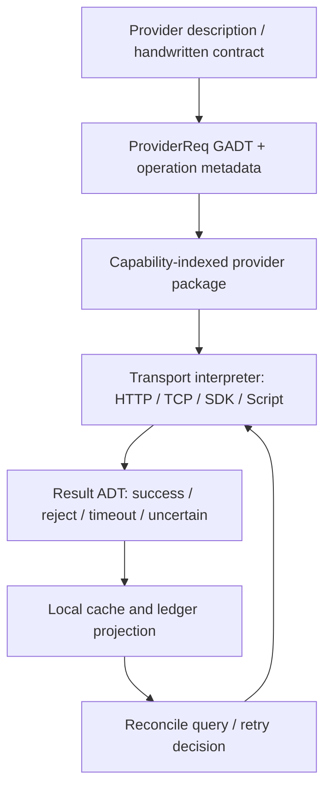

# 13 — Haskell Provider Adapter 参考设计（UTA 重构调查报告）

> 摘要（≤10 行）
> 本报告比较 `haxl`、`servant`/`servant-client`、`amazonka`、`beam`、`conduit` 与 `streaming` 六类 Haskell 设计。
> `haxl` 最适合把异构数据源请求建模为开放的 GADT 请求集合，并提供批处理、并发、缓存与逐请求失败；但写操作和缓存失效不是类型契约。
> `servant` 把 HTTP 路由、参数、状态码、内容类型编译进 API 类型，`servant-client-core` 允许新增执行后端而不改 API 解释器；它不描述任意非 HTTP 提供商的能力矩阵。
> `amazonka` 展示了“外部服务描述 → 生成请求/响应/分页适配器”的强契约路径，且有结构化错误、超时与重试；其生成模型仍受 AWS 协议族限制。
> `beam` 通过 backend type index、syntax type family 与 capability type class 表达数据库差异，`ViewEntity` 还能在类型上禁止写入视图；但事务、缓存、重试由底层驱动或应用负责。
> `conduit`/`streaming` 适合把 TCP、脚本宿主、分页 REST 等接入统一的流式数据边界，并保证资源释放；它们不是远端操作契约或对账框架。
> 对 UTA 最有价值的组合是：Haxl 的开放请求 GADT + Amazonka 的生成式 operation contract + Beam 的 capability constraints + Conduit 的资源/流边界，再显式加入 read/write 与 reconciliation ADT。

---

## 1. 范围与筛选标准

### 1.1 问题定义

目标系统需要为高度不可知的外部提供商建立强契约适配层。提供商可能是 HTTP gateway、REST API、自造 TCP 协议与 SDK，或者由脚本语言托管的进程；本层不能把“提供商等于 HTTP”当作前提。远端可能拒绝请求、只写入部分对象、超时后实际已写入，也可能返回与本地缓存不同的状态。因此，适配层必须同时表达：

1. 可扩展的操作/副作用集合；
2. 每个提供商实际支持的能力，以及明确的“不支持”；
3. 请求、成功响应、拒绝、传输失败和不确定提交状态之间的契约；
4. 查询和写操作之间的类型级区分；
5. 缓存、流式结果、批处理及对账的边界。

本报告只调查库的参考设计，不提出对仓库源码的直接修改。UTA 现有 broker 契约、能力矩阵和“远端状态与账本脱钩”问题，分别见 `07-brokers-and-packs.md`、`04-market-data-contracts-fx.md` 与 `05-staging-approval-ledger.md`。

### 1.2 筛选标准

每个库/模式统一回答六个问题：

| 维度 | 要回答的问题 |
|---|---|
| ① 开放操作集合 | 如何加入新的请求、操作或副作用；集合是封闭 ADT、开放 type class，还是由解释器组合？ |
| ② 后端与部分不可用 | 新增后端需要写什么；某提供商不支持某操作时，是否能在类型层拒绝；核心是否需要改动？ |
| ③ 契约一致性 | 请求参数、响应形状、编码、状态码、结果类型如何由类型保证；哪些仍是运行时约定？ |
| ④ 远端失败/不一致 | 超时、部分失败、拒绝、未写入、写入不确定与本地缓存漂移如何表达和传播？ |
| ⑤ 只读/读写区分 | 查询、变更、流式消费和副作用是否拥有不同类型；若没有，缺口是什么？ |
| ⑥ 对 UTA 的适用性 | 对“任意 provider、扩展不改核心、强契约、可对账”的可借鉴点与不适用点。 |

“类型层保证”在本文中指：编译器能够拒绝错误的操作组合、缺失的后端能力或错误的结果解析；不能把“远端一定接受”误称为类型保证。远端返回错误、网络丢包和提供商语义漂移仍需要运行时 ADT、重试策略和对账。

### 1.3 调查方法与版本证据

源码均先 shallow clone 到 `/tmp/haskell-provider-adapters/`，再用本地源码读取；没有通过 GitHub API、`gh`、raw URL 或远端 blob 读取源码。调查快照如下：

| 库 | 本地源码快照 | 官方文档 URL |
|---|---|---|
| `haxl` | `facebook/Haxl`, commit `b33c1c1` | <https://hackage.haskell.org/package/haxl/docs/Haxl-Core-DataSource.html>；<https://simonmar.github.io/bib/papers/haxl-icfp14.pdf> |
| `servant` / `servant-client-core` | `haskell-servant/servant`, commit `4f9e7c0` | <https://docs.servant.dev/>；<https://hackage.haskell.org/package/servant-client-core/docs/Servant-Client-Core-HasClient.html> |
| `amazonka` | `brendanhay/amazonka`, commit `b562aa3f` | <https://amazonka.brendanhay.nz/>；<https://hackage.haskell.org/package/amazonka/docs/Amazonka-Send.html> |
| `beam` | `tathougies/beam`, commit `77d0bca` | <https://haskell-beam.github.io/beam/user-guide/backends/>；<https://hackage.haskell.org/package/beam-core/docs/Database-Beam-Backend-SQL.html> |
| `conduit` / `resourcet` | `snoyberg/conduit`, commit `6b98f07` | <https://hackage.haskell.org/package/conduit/docs/Data-Conduit.html>；<https://hackage.haskell.org/package/resourcet/docs/Control-Monad-Trans-Resource.html> |
| `streaming` | `haskell-streaming/streaming`, commit `804f2ec` | <https://hackage.haskell.org/package/streaming/docs/Streaming.html> |

本文中的源码路径均相对于上述 shallow clone；路径与行号用于使结论可复核。官方 README 也明确了各库的设计范围：Haxl 面向远端数据访问（`Haxl/readme.md:7-35`）；servant 是 type-level web DSL（`servant/README.md:1-14`）；Amazonka 的服务包由 service description 自动生成（`amazonka/README.md:22-25,148-180`）；Beam 通过可插拔 backend 支持关系数据库（`beam/README.md:8-18,24-48`）；Conduit 以常量内存和确定性资源管理为目标（`conduit/README.md:1-9`）。

### 1.4 总体结构


该图对应的核心观察是：类型化请求只保证“本地调用合法”，不能单独保证远端副作用；因此，失败 ADT、幂等键、确认查询和对账必须位于解释器之后，而不是留给文档。

---

## 2. 逐库/逐模式分析

## 2.1 `haxl`：开放请求 GADT、自动批处理与逐请求结果

### 2.1.1 ① 如何表达开放的副作用/操作集合

Haxl 的基本单位是参数化请求类型 `req a`。库要求每个请求类型实现 `DataSource u req`，其中 `fetch` 接收一批存在类型（existential）的 `BlockedFetch req`，并把每项结果写入与请求结果类型匹配的 `ResultVar a`。`DataSource` 还可提供 `schedulerHint` 和 `classifyFailure`；默认调度倾向 `TryToBatch`（`Haxl/Core/DataSource.hs:94-116`）。

请求集合本身通常由提供商定义的 GADT 开放：例如官方 Facebook 示例把 `GetObject :: Id -> FacebookReq Object`、`GetUser :: UserId -> FacebookReq User` 和 `GetUserFriends :: UserId -> FacebookReq [Friend]` 放在同一个请求族（`example/facebook/FB/DataSource.hs:39-43`）。新增操作是新增构造器及其编码/执行分支，不需要修改 Haxl scheduler 或 `GenHaxl` 核心。

批次内部可包含不同结果类型，因为 `BlockedFetch` 把请求和相同 `a` 的 `ResultVar a` 一起封装（`Haxl/Core/DataSource.hs:170-187`）。`RequestStore` 以请求类型的 `TypeRep` 分桶，再把同一 `DataSource` 的请求交给一个 `BlockedFetches` 批次（`Haxl/Core/RequestStore.hs:53-64,73-99`）。

**来源：** `Haxl/Haxl/Core/DataSource.hs:94-187`、`Haxl/Haxl/Core/RequestStore.hs:53-99`、`Haxl/example/facebook/FB/DataSource.hs:39-68`；官方说明见 <https://github.com/facebook/Haxl> 与 Haxl 论文 <https://simonmar.github.io/bib/papers/haxl-icfp14.pdf>。

### 2.1.2 ② 为不同后端提供实现、允许部分不可用

新提供商需要定义请求 GADT、`Eq`/`Hashable`/`Typeable`/`ShowP`、`StateKey` 和一个 `DataSource` 实例；官方示例的真实网络实现只实现 `fetch = facebookFetch`，状态中保存凭据、HTTP manager 和并发信号量（`FB/DataSource.hs:45-83`）。Haxl 核心保持不变。

“部分不可用”通常在请求构造器或 `fetch` 的分支中表达：某个请求构造器可以由 `stubFetch` 统一返回错误，或者某一个 `BlockedFetch` 用 `setError`/`putFailure` 写失败，而同批其他请求继续成功（`Haxl/Core/DataSource.hs:252-255,241-243`）。这是一种运行时能力拒绝，而不是“提供商实例缺失某个方法”的编译期 capability check。

同一提供商也可以通过 `schedulerHint` 选择立即提交或尽量批处理；`PerformFetch` 有 `SyncFetch`、`AsyncFetch`、`BackgroundFetch` 三种执行形态（`Haxl/Core/DataSource.hs:138-168`）。因此 HTTP 批量端点、单请求 SDK、异步 TCP 连接均可复用同一调度接口。

**来源：** `Haxl/Haxl/Core/DataSource.hs:138-168,241-255`、`Haxl/example/facebook/FB/DataSource.hs:67-106`；官方 README 的数据源扩展说明见 <https://github.com/facebook/Haxl#readme>。

### 2.1.3 ③ 类型层如何保证契约一致

请求的结果类型写在 GADT 构造器上；当 `BlockedFetch (req a) (ResultVar a)` 被拆开时，编译器保证写入结果的类型与请求结果一致（`Haxl/Core/DataSource.hs:170-187`）。调用 `dataFetch` 还要求请求满足 `Eq`、`Hashable`、`Typeable`、`Show`，结果满足 `Show`（`Request` 约束，`DataSource.hs:128-136`）。

缓存使用请求的 `TypeRep` 选择子缓存，再以 `Eq`/`Hashable` 作为键；库通过 `DataCache` 的存在类型封装不同请求族（`Haxl/Core/DataCache.hs:42-60,132-145`）。这保证同一个请求键不会把另一请求族的结果当成自己的结果，但不会验证远端 schema、字段语义或版本。

`ResultVar` 的定义是 `Either SomeException a`，因此失败不会被错误地当成成功值（`DataSource.hs:193-220`）。这属于结果类型的一致性保证；异常内容本身仍是运行时值。

**来源：** `Haxl/Haxl/Core/DataSource.hs:128-136,170-220`、`Haxl/Haxl/Core/DataCache.hs:42-60`；论文对类型化 data fetch 与并发组合的动机见 <https://simonmar.github.io/bib/papers/haxl-icfp14.pdf>。

### 2.1.4 ④ 超时、部分失败、远端不一致与未写入

Haxl scheduler 会把 data source 抛出的异常捕获后，写入该批次每个 `ResultVar`（`wrapFetchInCatch`，`Haxl/Core/Fetch.hs:496-529`）。但这只说明“这一批等待的请求都失败”，并不自动提供批次的全有全无事务；一个提供商若逐项调用远端 API，可以自己对成功项调用 `putSuccess`、对失败项调用 `putFailure`，形成部分成功。

缓存记录成功值，也记录异常值；查找已完成缓存项时会返回 `Cached`，其中可以是成功或异常（`Haxl/Core/Fetch.hs:75-93,121-135`）。因此一次暂时性失败若进入缓存，后续相同请求可能继续看到缓存错误，除非应用显式过滤/清空缓存或走旁路。Haxl 提供 `dataCacheFetchFallback`，允许先查应用提供的 fallback，再发远端请求（`Fetch.hs:282-295`）；它不规定 TTL、版本、ETag 或“远端已写入但响应丢失”的确认流程。

`uncachedRequest` 明确被文档建议用于写操作，以避免写请求因缓存/重排破坏语义（`Haxl/Core/Fetch.hs:308-336`）。然而它只是缓存策略约定：函数仍返回同一个 `GenHaxl u w a`，没有 `Read`/`Write` 类型区分，也没有幂等键或 uncertain-commit 结果。

超时必须由 provider 的 HTTP/SDK 层实现并转成异常；Haxl 本身只承载 `SomeException`。因此“超时但远端是否写入未知”在 Haxl 类型中不可辨识。

**来源：** `Haxl/Haxl/Core/Fetch.hs:75-135,282-336,496-529`、`Haxl/Haxl/Core/DataCache.hs:169-214`；官方 README 对缓存和 data source 责任的说明见 <https://github.com/facebook/Haxl#readme>。

### 2.1.5 ⑤ 只读与读写在类型上的区分

没有内建的只读/读写类型级区别。官方推荐 `dataFetch` 用于可缓存读取，`uncachedRequest` 用于写入，但两者都接受满足同一 `Request req a` 约束的请求类型（`Haxl/Core/Fetch.hs:230-252,308-336`）。应用可以人为分出 `ReadReq a` 与 `WriteReq a` 两个 GADT，或让写请求的结果携带 `WriteReceipt`，但这属于应用设计，不是 Haxl 契约。

**来源：** `Haxl/Haxl/Core/Fetch.hs:308-336`；官方 Haxl 论文与 README 的缓存模型见 <https://simonmar.github.io/bib/papers/haxl-icfp14.pdf>。

### 2.1.6 ⑥ 对 UTA 的可借鉴点与不适用点

可借鉴：把外部 provider 的操作建模为 `ProviderReq a` GADT；用存在类型批量调度异构结果；把每项结果送入 `ResultVar`，天然支持 provider fan-out 的部分失败；把连接、限流器、SDK handle 放入 `StateKey` 状态；把缓存读取和网络读取分开，从而给 UTA 的市场数据读路径一个可插入的批处理边界。

不适用：Haxl 不表达操作 capability 的编译期集合，不知道“写入未确认”与“写入被拒绝”的差异，也不提供对账、幂等键、缓存新鲜度或写入后回读。直接把 `uncachedRequest` 当作 UTA 的 push 语义，会重复 `05-staging-approval-ledger.md` 已识别的“外部副作用与本地记账脱钩”问题。

**结论来源：** 上述 Haxl 源码；UTA 现有失败窗口见 `05-staging-approval-ledger.md`，Haxl 官方定位见 <https://github.com/facebook/Haxl>。

---

## 2.2 `servant` / `servant-client`：类型级 HTTP 契约与可替换执行后端

### 2.2.1 ① 如何表达开放的副作用/操作集合

Servant API 是组合子构成的类型：路径由 `:>` 组合，备选操作由 `:<|>` 组合，终点由 `Verb method status contentTypes result` 表达。`Verb` 把 HTTP method、状态码、可接受内容类型和返回类型作为类型参数（`servant/src/Servant/API/Verbs.hs:31-37`）；`Servant.API` 统一导出这些组合子以及流式 endpoint、SSE、认证和 `UVerb`（`servant/src/Servant/API.hs:1-88`）。

`UVerb`/`Union` 用类型级列表表示一个 endpoint 可能返回的多个带状态响应；`IsMember` 要求目标类型在列表中且 `Unique` 拒绝重复成员（`servant/src/Servant/API/UVerb/Union.hs:69-117,134-141`）。这使“开放操作集合”表现为 API 类型的组合，而非中心注册表。

新增 endpoint 通常只需扩展 API type alias 或 Generic record；`servant/src/Servant/API/Generic.hs:9-29,90-129` 说明如何从路由记录生成 `:<|>` API。核心解释器不需要知道具体业务操作。

**来源：** `servant/src/Servant/API/Verbs.hs:31-37`、`servant/src/Servant/API/UVerb/Union.hs:69-141`、`servant/src/Servant/API/Generic.hs:90-129`；官方文档见 <https://docs.servant.dev/>。

### 2.2.2 ② 为不同后端提供实现、允许部分不可用

`servant-client-core` 把 API 解释与具体传输拆开。`HasClient m api` 为每个 API 组合子决定生成何种 `Client m api`，而 `RunClient m` 只负责执行已经构造的 `Request`（`servant-client-core/src/Servant/Client/Core/HasClient.hs:166-183`；`RunClient.hs:26-35`）。因此新增 HTTP backend 主要实现一个 `RunClient` 实例；官方 README 的 backend-writer 清单还要求实现 `ClientLike` 并重新导出 `Servant.Client.Core.Reexport`（`servant-client-core/README.md:9-24`）。

如果新增的是自定义组合子，需要增加相应 `HasClient` instance；官方 README 明确将其列为 combinator-writer 责任（`servant-client-core/README.md:26-30`）。这保持了“添加 provider 不改核心”的边界，但自造 TCP/SDK provider 仍必须把自己映射到 Servant `Request`/`Response` 语义，或者另写组合子解释器。

某个后端“不支持”某 endpoint 的常见方式是该后端根本不提供对应 API 类型的实例，编译器报缺少 `HasClient`/`RunClient` constraint；但 Servant 没有一个通用的 provider capability kind，让同一个 API 在不同 provider 上以类型级“部分支持集合”自动生成子 API。`EmptyAPI` 可以表示 API 的空分支，但不是动态能力声明（`HasClient.hs:208-224`）。

**来源：** `servant-client-core/src/Servant/Client/Core/HasClient.hs:166-224`、`servant-client-core/src/Servant/Client/Core/RunClient.hs:26-39`、`servant-client-core/README.md:9-30`；官方文档见 <https://hackage.haskell.org/package/servant-client-core/docs/Servant-Client-Core-RunClient.html>。

### 2.2.3 ③ 类型层如何保证契约一致

`HasClient` 的关联类型 `Client m api` 从 API 计算调用函数：`Capture` 追加对应 Haskell 参数，`Verb` 生成 `m a`，`:<|>` 生成两个 client 分支（`HasClient.hs:185-206,226-261,301-328`）。因此路径参数类型、请求体类型、响应解码类型和 HTTP 状态码都被编译器贯通。

`Verb` 实例在客户端运行时调用 `runRequestAcceptStatus`，仅允许 API 声明的状态码并使用声明的 `MimeUnrender` 解码（`HasClient.hs:301-328`）。`ClientError` 把状态失败、解码失败、内容类型不支持、非法响应头和连接失败分为不同构造器（`servant-client-core/src/Servant/Client/Core/ClientError.hs:30-65`）。

`UVerb` 的 `Union` 让调用方必须通过 `matchUnion` 或 `foldMapUnion` 处理类型级列出的响应；错误或重复成员在编译期暴露（`UVerb/Union.hs:71-91,97-141`）。这比文档约定 HTTP status 更强，但仍不能验证第三方 API 的实际字段是否遵守宣称的 JSON schema。

**来源：** `servant-client-core/src/Servant/Client/Core/HasClient.hs:185-206,301-328`、`servant-client-core/src/Servant/Client/Core/ClientError.hs:30-65`、`servant/src/Servant/API/UVerb/Union.hs:71-141`；官方教程见 <https://docs.servant.dev/en/latest/tutorial/index.html>。

### 2.2.4 ④ 超时、部分失败、远端不一致与未写入

默认 `ClientM` 是 `ReaderT ClientEnv (ExceptT ClientError IO)`；HTTP 执行把非成功 status 转成 `FailureResponse`，网络异常转成 `ConnectionError`（`servant-client/src/Servant/Client/Internal/HttpClient.hs:110-149,151-182,294-297`）。

`ClientEnv.makeClientRequest` 被明确设计为可覆写单请求的运维语义，例如 `responseTimeout` 和 `redirectCount`；全局修改应通过 manager（`HttpClient.hs:37-55`）。因此超时可以在 backend 层设置，但 timeout 后“远端是否已经接受写入”仍然只会成为 `ConnectionError`，没有 `UncertainCommit` 构造器。

`ClientM` 的 `Alt` 实例可以在错误后尝试备选调用（`HttpClient.hs:137-139`），但这不是按对象聚合的部分失败协议。`:<|>` 是一棵 client 函数产品；如果调用方使用 `Applicative`/`concurrently` 批量执行，部分成功的记录、重试顺序和对账键都要由应用自己建模。Servant-client 没有缓存、批处理、ETag、写后读取或 reconciliation 机制。

**来源：** `servant-client/src/Servant/Client/Internal/HttpClient.hs:37-55,110-182,137-149,294-297`、`servant/src/Servant/API/Alternative.hs:17-28`；官方 API 文档见 <https://hackage.haskell.org/package/servant-client/docs/Servant-Client.html>。

### 2.2.5 ⑤ 只读与读写在类型上的区分

HTTP method 和状态码在类型上可区分：`Get`、`Post`、`Put`、`Delete` 是不同的 `Verb` 特化（`Verbs.hs:55-68`），所以错误的 method、返回状态或 content type 会导致类型不匹配。然而，`Get` 并不被标记为“纯查询”，`Post` 也不携带幂等性、事务或副作用强度；类型只表达 HTTP 语义，不表达 UTA 的“会不会改远端状态”。

可以在应用层定义 `ReadAPI` 与 `WriteAPI` 两个 API type，或给 `Verb` 外包一层 capability marker；Servant 原生没有禁止把一个看似 `Get` 的 endpoint 在服务器端实现为有副作用，也没有把写操作的 uncertain outcome 区分出来。

**来源：** `servant/src/Servant/API/Verbs.hs:31-68`、`servant-client-core/src/Servant/Client/Core/HasClient.hs:301-348`；官方文档见 <https://docs.servant.dev/>。

### 2.2.6 ⑥ 对 UTA 的可借鉴点与不适用点

可借鉴：把 provider 的公共请求/响应契约写为类型级 API；把传输执行抽成 `RunClient`，使 HTTP、测试解释器、Haxl backend 或自定义 runtime 可以替换；用 `UVerb`/`Union` 显式建模多个成功/拒绝响应；用 `ClientError` 区分状态错误、解码错误和连接错误；用 `hoistClient` 把生成客户端接入 UTA 的 effect monad。

不适用：Servant 的核心假设是可表达为 HTTP 路由的 API。对任意 TCP frame、SDK 回调、CLI 子进程，需要自定义 `RunClient` 的请求表示或另建 adapter DSL；把所有 provider 都强行投影成 HTTP `Request` 会丢失流式确认、双向消息和 SDK 特有错误。Servant 也不会替代 Haxl 的批处理、Beam 的 capability constraints 或 UTA 的对账状态机。

**结论来源：** `servant-client-core/README.md:5-30`、`HasClient.hs:166-183`、`RunClient.hs:26-39`、`ClientError.hs:30-65`；官方主页见 <https://docs.servant.dev/>。

---

## 2.3 `amazonka`：服务描述生成的请求/响应适配器、重试与错误建模

### 2.3.1 ① 如何表达开放的副作用/操作集合

Amazonka 的操作集合来自 AWS service descriptions。仓库 README 说明 service library 的代码由服务描述自动生成并随 AWS API 更新（`amazonka/README.md:22-25`）；生成器读取 model、service config、annex 和 retry definitions，重写为独立服务包（`gen/bin/gen.hs:41-90,160-208`）。

每个生成操作是独立 request data type，例如 `GetGroups` 携带 `nextToken`，并实现 `AWSRequest`；其关联类型 `AWSResponse GetGroups = GetGroupsResponse`，同时生成 path、query、headers、JSON response parser 和 `AWSPager`（`lib/services/amazonka-xray/gen/Amazonka/XRay/GetGroups.hs:53-111`）。新增 AWS service 不需要修改 `Amazonka.Send` 的发送核心，只需加入 service model/config 并生成包；特殊行为通过 operation plugins/config overrides 注入（`gen/src/Gen/Types/Config.hs:80-116`）。

这是一种“描述驱动的开放集合”：操作不是手写一个中心大 union，而是由每个服务包导出的独立类型组成；`send` 通过 `AWSRequest a` 约束接受任意已生成操作。

**来源：** `amazonka/README.md:22-25,148-180`、`amazonka/gen/bin/gen.hs:160-218`、`amazonka/lib/services/amazonka-xray/gen/Amazonka/XRay/GetGroups.hs:78-111`；官方文档见 <https://amazonka.brendanhay.nz/>。

### 2.3.2 ② 为不同后端提供实现、允许部分不可用

为 AWS 新服务，维护者需要 service model、`configs/services/<name>.json`、必要 annex/override，并运行 generator；例如 `configs/services/xray.json` 只声明 library name 与类型覆盖（`configs/services/xray.json:1-8`），生成器再从模型推导 operation/type/lens/waiter 模块。核心发送层保持不变。

生成器支持的协议是有限集合：`JSON`、`RestJSON`、`RestXML`、`Query`、`EC2`、`APIGateway`（`gen/src/Gen/Types/Service.hs:48-75`）。因此 Amazonka 的“新增 provider 不改核心”适用于符合这些服务描述协议的 HTTP/AWS 风格 provider；TCP 自造协议或脚本 CLI 必须另写 `AWSRequest` 实例与服务配置，且可能需要扩展 generator/core。

某个服务不支持 waiter/paginator 时，可以在配置中忽略相应名称（`Config` 的 `_ignoredWaiters`/`_ignoredPaginators`，`Gen/Types/Config.hs:80-116`）；但这是生成配置层的能力裁剪，不是对任意运行时 provider 的泛型 capability type。

**来源：** `amazonka/gen/src/Gen/Types/Service.hs:48-75`、`amazonka/gen/src/Gen/Types/Config.hs:80-116`、`amazonka/gen/bin/gen.hs:180-218`；官方生成器说明见 <https://github.com/brendanhay/amazonka#running-the-code-generator>。

### 2.3.3 ③ 类型层如何保证契约一致

`AWSRequest` 使用关联类型 `AWSResponse a`，要求请求和成功响应都 `Typeable`；`request` 负责把 operation 编码为 `Request a`，`response` 负责把服务响应解码为 `AWSResponse a`（`amazonka-core/src/Amazonka/Types.hs:660-678`）。生成操作的请求字段、响应 record、JSON/XML parser、HTTP path 和分页 token 因此保持同一 `a` 关联。

`Request a` 中保存 `Service`、HTTP method、路径、query、headers 和 body（`Types.hs:605-638`），`AWSRequest` 实例再用 `request` 构造这些字段。生成的响应 parser 把 HTTP status 放进 response record，并且对 JSON 字段使用类型化 shape（`GetGroups.hs:100-111,136-181`）。

错误也有结构化 ADT：`Error = TransportError | SerializeError | ServiceError`，服务错误带 service abbreviation、status、code、message 和 request id（`amazonka-core/src/Amazonka/Types.hs:289-347`）。这让调用方可按错误代码匹配，而不依赖解析字符串。

**来源：** `amazonka/lib/amazonka-core/src/Amazonka/Types.hs:289-347,605-678`、`amazonka/lib/services/amazonka-xray/gen/Amazonka/XRay/GetGroups.hs:100-181`；官方 Haddock 入口见 <https://amazonka.brendanhay.nz/>。

### 2.3.4 ④ 超时、部分失败、远端不一致与未写入

`Env' withAuth` 保存 region、HTTP manager、service overrides 与 `retryCheck`；`Env`/`EnvNoAuth` 用类型参数追踪是否有 credentials（`amazonka/lib/amazonka/src/Amazonka/Env.hs:57-80`）。服务 `Service` 带 timeout、成功 status 判定、错误解析函数和 `Retry` 策略（`amazonka-core/src/Amazonka/Types.hs:517-533`）。

`retryRequest` 对 transport error 与 service error 分别套用 `retryStream` 和 `retryService`，并在每次 retry 通过 hooks 记录；streaming body 默认禁止自动重试，避免不可重放请求（`amazonka/lib/amazonka/src/Amazonka/HTTP.hs:33-70,160-172`）。`retryConnectionFailure` 对连接超时、连接关闭、无响应等错误按次数判定（`Env.hs:187-201`）。`globalTimeout` 与 `once` 允许覆盖 timeout/重试（`Env.hs:220-237`）。

`sendEither` 返回 `Either Error (AWSResponse a)`，`send` 则把错误抛到 IO（`Amazonka/Send.hs:24-46`）。分页器在第一次错误时停止并返回 `Left Error`，已经 yield 的页不会回滚（`Send.hs:78-109`）；这清楚表达了流式“部分已产生、后续失败”，但不提供批量事务或自动补偿。

对“超时但远端可能已写入”，Amazonka 的重试机制只根据 transport/service retry policy 决定是否重发；它没有通用 idempotency key 或 `UncertainCommit` 类型。AWS 某些具体 operation 可能由服务模型提供 client token，但这不是 `AWSRequest` 核心约束。缓存、写后回读和本地对账仍需应用实现。

**来源：** `amazonka/lib/amazonka/src/Amazonka/HTTP.hs:33-70,104-172`、`amazonka/lib/amazonka/src/Amazonka/Env.hs:187-237`、`amazonka/lib/amazonka/src/Amazonka/Send.hs:78-109`、`amazonka/lib/amazonka-core/src/Amazonka/Types.hs:289-347,517-533`；官方发送 API 见 <https://hackage.haskell.org/package/amazonka/docs/Amazonka-Send.html>。

### 2.3.5 ⑤ 只读与读写在类型上的区分

生成 operation 的名字和 HTTP method 能提示 `Get`/`Put`/`Delete`，但 `AWSRequest a` 本身不携带 read-only/write-only kind；`send` 和 `sendEither` 都可接受任意 `AWSRequest a`（`Send.hs:24-46`）。因此类型层没有阻止把写操作交给只读执行上下文。

一个明确的类型区分是 `Env' withAuth`：`EnvNoAuth` 与 `Env` 防止在缺少 auth 时调用需要 credentials 的路径，且 `sendUnsigned` 专门要求 `Env' withAuth` 并把 auth 擦除为 `Proxy`（`Env.hs:57-80`；`Send.hs:48-76`）。这是“认证能力”而不是“副作用能力”。

**来源：** `amazonka/lib/amazonka/src/Amazonka/Send.hs:24-76`、`amazonka/lib/amazonka/src/Amazonka/Env.hs:57-80`、`amazonka/lib/amazonka-core/src/Amazonka/Types.hs:660-678`；官方文档见 <https://amazonka.brendanhay.nz/>。

### 2.3.6 ⑥ 对 UTA 的可借鉴点与不适用点

可借鉴：建立 provider 描述文件，把每个 operation 的请求、成功响应、错误、分页、timeout、retry 和编码从描述生成；使用 `Operation` 类型作为关联键，避免“请求类型与响应 parser”分叉；把 transport error、decode error、remote service error 分成不同 ADT；对 streaming body 默认禁用不可安全重放的 retry；让生成包作为独立 provider pack 被核心动态加载。

不适用：Amazonka 的 generator 不是任意协议的通用 IDL。它预设 AWS service shape、HTTP 协议集合和 service error 解析；对 TCP+SDK 或脚本 host，需定义新的描述语言、生命周期和异步确认语义。它也未解决 UTA 需要的本地 ledger、远端状态对账、写入 uncertain outcome 与只读强制隔离。

**结论来源：** `amazonka/README.md:148-180`、`gen/src/Gen/Types/Service.hs:48-75`、`Amazonka/HTTP.hs:33-70`、`Amazonka/Send.hs:78-109`；目标系统现有 Pack 边界见 `07-brokers-and-packs.md`。

---

## 2.4 `beam`：多后端数据库能力的 type index 与 capability constraints

### 2.4.1 ① 如何表达开放的副作用/操作集合

Beam 把数据库描述为参数化 schema：`DatabaseSettings be db` 中的 `be` 是 backend type index，`db` 是数据库实体 record；用户用 `TableEntity`、`ViewEntity` 等类型构造数据库模型（`beam-core/Database/Beam/Schema.hs:1-57`；官方数据库文档示例见 `docs/user-guide/databases.md:1-22`）。

SQL 操作集合由 `MonadBeam be m`、`BeamSqlBackend be` 与 SQL syntax type family 表达。`MonadBeam` 提供 `runReturningMany`、`runNoReturn`、`runReturningOne`、`runReturningList`；核心刻意覆盖通用查询/DML，复杂能力由后端扩展（`beam-core/Database/Beam/Backend/SQL.hs:86-153`）。

后端能力通过 type class constraint 组合，如 `BeamSql99ExpressionBackend`、`BeamSqlBackendSupportsOuterJoin`、`BeamSqlT621Backend`、`BeamSqlBackendSupportsDataType`（`Backend/SQL.hs:264-325`）。因此开放操作不是一个巨型枚举，而是可组合的语法能力字典。

**来源：** `beam-core/Database/Beam/Backend/SQL.hs:86-153,217-325`、`beam-core/Database/Beam/Schema.hs:1-57`；官方后端设计见 <https://haskell-beam.github.io/beam/user-guide/backends/>。

### 2.4.2 ② 为不同后端提供实现、允许部分不可用

Beam 官方说明 backend 通过类型索引区分，并允许各后端定义自己的 syntax；通用函数面向最低公分母，生产代码可使用 backend-specific API（`docs/user-guide/backends.md:1-25`）。新增数据库通常写独立 backend package，提供 `BeamBackend`/`BeamSqlBackend`、syntax AST/rendering、连接 runner 和必要的 `FromBackendRow`/serialization 实例；核心 `beam-core` 不改。

Postgres 后端在 `Database.Beam.Postgres` 中导出 `Postgres`、SQL syntax、COPY、JSON/JSONB、ARRAY、RANGE、MONEY 等专属能力（`beam-postgres/Database/Beam/Postgres.hs:1-18,37-112`）；SQLite 则定义自己的 syntax 和 `SqliteInsertValuesSyntax`（`beam-sqlite/Database/Beam/Sqlite/Syntax.hs:175-238`）。

当查询要求某 backend 未实现的 type class 时，约束无法满足，编译失败；这是强于运行时“unsupported”错误的能力表达。但 `customExpr_` 允许插入 backend 自己能理解的原始表达式，文档明确提醒 Beam 无法预测其类型，属于逃生舱（`docs/user-guide/extensibility.md:5-24`）。

**来源：** `beam/docs/user-guide/backends.md:1-25`、`beam/beam-postgres/Database/Beam/Postgres.hs:1-112`、`beam/beam-sqlite/Database/Beam/Sqlite/Syntax.hs:175-238`、`beam/docs/user-guide/extensibility.md:5-24`；官方 README 见 <https://github.com/tathougies/beam#readme>。

### 2.4.3 ③ 类型层如何保证契约一致

`BeamBackend` 的 associated type `BackendFromField be` 指定如何从特定 backend 解码字段（`beam-core/Database/Beam/Backend/Types.hs:12-16`）。`BeamSqlBackend` 要求 SQL92 sanity、值语法和表达式语法实例（`Backend/SQL.hs:219-256`），所以一个 query 既带 schema 类型，也带 backend syntax 类型。

数据库 schema 的参数化 `f` 同时表达“字段是值、表达式还是 nullable/可更新形态”；`DatabaseSettings be db` 把实体绑定到 backend。Beam 文档特别指出 `ViewEntity` 可让 `all_` 之外的读取方式工作，但类型系统会阻止用 view 构造 `INSERT`、`UPDATE`、`DELETE`（`docs/user-guide/databases.md:43-65`）。

Postgres row reader 将字段类型错误、列数不足、NULL 和 Haskell/SQL 类型不匹配转成 `BeamRowReadError`（`beam-postgres/Database/Beam/Postgres/Connection.hs:136-193`）。这把解码契约失败从普通字符串错误提升为结构化值。

**来源：** `beam-core/Database/Beam/Backend/Types.hs:12-16`、`beam-core/Database/Beam/Backend/SQL.hs:219-325`、`beam/docs/user-guide/databases.md:43-65`、`beam-postgres/Database/Beam/Postgres/Connection.hs:136-193`；官方兼容矩阵见 <https://haskell-beam.github.io/beam/about/compatibility/>。

### 2.4.4 ④ 超时、部分失败、远端不一致与未写入

Beam 是 query/DML DSL 与 backend runner，不是远端一致性框架。官方 README 明确说连接与 transaction management 不由 Beam 负责，而由 backend interface library 管理（`beam/README.md:35-48`）。因此超时、网络重试、事务隔离和 commit uncertainty 取决于 `postgresql-simple`、`sqlite-simple` 等底层库与应用策略。

`MonadBeam.runReturningMany` 可以逐行消费结果；Postgres runner 支持 cursor batching，若 row decode 中途失败，已经交给 consumer 的行不会回滚（`beam-core/Database/Beam/Backend/SQL.hs:102-113`；`beam-postgres/Connection.hs:221-238,282-313`）。这与 Conduit 流式部分结果相似，但 Beam 没有通用 `PartialFailure` 结果类型。

DML 的执行失败通常由底层 driver 抛异常；Beam runner 可以通过 `BeamRowReadError` 报 decode 失败，但不把“远端拒绝”“请求超时后已写入”“本地 schema 与远端状态漂移”统一建模。应用必须使用 transaction、幂等键、写后读取和 reconciliation。

**来源：** `beam/README.md:35-48`、`beam-core/Database/Beam/Backend/SQL.hs:102-153`、`beam-postgres/Database/Beam/Postgres/Connection.hs:221-238,282-313`；官方后端指南见 <https://haskell-beam.github.io/beam/user-guide/backends/>。

### 2.4.5 ⑤ 只读与读写在类型上的区分

这是六个参考方向中最明确的只读区分之一：`ViewEntity` 可用于读取，但其类型让 `INSERT`/`UPDATE`/`DELETE` 无法构造（`docs/user-guide/databases.md:56-65`）。同时，查询与 DML 具有不同的 syntax 类型：`SqlSelect`、`SqlInsert`、`SqlUpdate`、`SqlDelete` 经 `MonadBeam` 执行（`Backend/SQL.hs:98-153`）。

限制在于“可写 TableEntity”仍然由同一个 backend monad 执行，`SqlSelect` 本身没有 effect-row 表示“绝对纯读”；调用方若持有 table descriptor，就可以构造 DML。Beam 也不负责把 transaction 或权限写进 Haskell 类型。

**来源：** `beam/docs/user-guide/databases.md:43-65`、`beam-core/Database/Beam/Backend/SQL.hs:98-153`；官方文档见 <https://haskell-beam.github.io/beam/user-guide/databases/>。

### 2.4.6 ⑥ 对 UTA 的可借鉴点与不适用点

可借鉴：把每个 provider 的能力当作 type-level index/constraint；把公共最低公分母操作放在核心，把特殊操作放进独立 backend package；对 unsupported capability 让编译器缺 constraint，而不是运行时静默忽略；用只读 entity/command 类型防止写入；用结构化 row/codec error 让契约失败可分类。

不适用：Beam 假设关系数据库、SQL syntax 和可枚举 schema，不能直接代表任意 gateway、SDK callback 或脚本 host。Beam 也明确把连接、事务、重试和缓存留给外部；若直接仿照而不补充 UTA 的 remote receipt/reconciliation，将保留“本地类型正确但远端状态未知”的核心问题。

**结论来源：** `beam/README.md:8-48`、`beam-core/Database/Beam/Backend/SQL.hs:219-325`、`beam/docs/user-guide/databases.md:43-65`；UTA provider 差异现状见 `07-brokers-and-packs.md`。

---

## 2.5 `conduit`：资源安全的流式数据源/汇

### 2.5.1 ① 如何表达开放的副作用/操作集合

Conduit 的核心类型是 `ConduitT i o m r`：输入 `i`、输出 `o`、底层 effect monad `m`、最终结果 `r` 均为参数；内部由 `HaveOutput`、`NeedInput`、`Done`、`PipeM`、`Leftover` 五种状态组成（`conduit/src/Data/Conduit/Internal/Conduit.hs:116-141`；`conduit/src/Data/Conduit/Internal/Pipe.hs:65-103`）。

因此，TCP reader、分页 REST source、SDK callback queue 或脚本 stdout 都可以暴露为 `ConduitT () Item m r`，再与转换器、sink 组合；source/sink/conduit 只是类型同义词（`Conduit.hs:258-295`）。开放的“操作集合”不是远端 operation ADT，而是可组合的生产/转换/消费管线。

**来源：** `conduit/conduit/src/Data/Conduit/Internal/Conduit.hs:116-141,258-295`、`conduit/conduit/src/Data/Conduit/Internal/Pipe.hs:65-103`；官方 README 见 <https://github.com/snoyberg/conduit#readme>。

### 2.5.2 ② 为不同后端提供实现、允许部分不可用

新增提供商通常只需实现一个 source：在 `m` 中打开 SDK/连接，使用 `yield` 输出解码后的 domain item，或在错误时结束/抛异常；下游 conduit 不需改。库自带 `sourceFile`、`sourceHandle` 等 IO source，说明接入边界与传输来源解耦（`Data.Conduit.Combinators.hs:23-50`）。

某操作不支持可以不导出对应 source，或者让 source 的最终结果为 `Either Unsupported r`；然而 Conduit 不会在编译期检查某 provider 的操作 capability，因为 `ConduitT` 只知道流元素与底层 monad，不知道远端语义。若要获得 capability 类型，需要在 UTA 自己定义 `ProviderCaps` 或 indexed source wrapper。

**来源：** `conduit/conduit/src/Data/Conduit/Combinators.hs:23-50`、`conduit/conduit/src/Data/Conduit/Internal/Conduit.hs:258-295`；官方 Haddock 见 <https://hackage.haskell.org/package/conduit/docs/Data-Conduit.html>。

### 2.5.3 ③ 类型层如何保证契约一致

`ConduitT i o m r` 保证上游输出类型与下游输入类型可组合；`Sink i = ConduitT i Void m r` 通过 `Void` 禁止 sink 再产生输出（`Conduit.hs:273-295`）。`NeedInput`/`HaveOutput` 状态确保 conduit 只能消费声明的输入、产出声明的输出。

但 item 的内部 schema、远端操作名、成功/拒绝语义不由 Conduit 保证；这些必须进入 `o` 或 `r` 的命名 ADT。例如 `ConduitT () (RemoteEvent provider) m (Cursor provider)` 比 `ConduitT () ByteString m ()` 更适合作为 UTA 边界。

**来源：** `conduit/conduit/src/Data/Conduit/Internal/Conduit.hs:116-141,273-295`、`conduit/conduit/src/Data/Conduit/Internal/Pipe.hs:83-103`；官方文档见 <https://hackage.haskell.org/package/conduit/docs/Data-Conduit.html>。

### 2.5.4 ④ 超时、部分失败、远端不一致与未写入

Conduit 的异常来自底层 `m`。`catchC` 只捕获当前组件的异常，不会捕获其他 pipeline component 的异常；文档注释明确指出 source 抛错时 sink 的 `catchC` 不会拦截（`Conduit.hs:386-403`）。因此 provider 需要在 source 内部把可恢复单项错误编码为 `Either`/事件，或在外层用 `try` 终止整条流。

`ResourceT` 通过 `allocate`/`register` 注册释放动作，并由 `runResourceT` 在正常结束或异常时清理资源（`resourcet/Control/Monad/Trans/Resource.hs:73-108,178-203`）。Conduit 的 `bracketP` 复用 `MonadResource`，但释放可能延迟到 ResourceT block 结束（`Pipe.hs:304-324`）。这适合 TCP socket、HTTP body、SDK session 等有生命周期的 provider。

流式输出天然允许“先交付 N 项，随后超时/断线”；但 Conduit 不会自动记录 cursor、重试已消费项或对账远端写入。应用需把 cursor、batch id、ack/receipt 放入结果类型，并决定从哪一项恢复。

**来源：** `conduit/conduit/src/Data/Conduit/Internal/Conduit.hs:386-403`、`conduit/conduit/src/Data/Conduit/Internal/Pipe.hs:304-324`、`conduit/resourcet/Control/Monad/Trans/Resource.hs:73-108,178-203`；资源文档见 <https://hackage.haskell.org/package/resourcet/docs/Control-Monad-Trans-Resource.html>。

### 2.5.5 ⑤ 只读与读写在类型上的区分

`Source m o`/`Producer m o` 表示只产出数据，`Sink i m r` 表示只消费输入，方向上可分别映射为读与写，但这不是“远端副作用”语义。一个 source 可以轮询并触发远端副作用，一个 sink 也可以只是本地聚合；Conduit 没有 `ReadOnly`/`Write` kind。

要在 UTA 中强化区分，应把 stream shape 与 operation capability 叠加，例如 `ReadStream provider item cursor` 与 `WriteStream provider command receipt`，而不是把 `ConduitT () a m ()` 本身当成写入安全保证。

**来源：** `conduit/conduit/src/Data/Conduit/Internal/Conduit.hs:258-295`、`conduit/conduit/src/Data/Conduit/Internal/Pipe.hs:304-324`；官方说明见 <https://github.com/snoyberg/conduit#readme>。

### 2.5.6 ⑥ 对 UTA 的可借鉴点与不适用点

可借鉴：统一 TCP/REST/SDK/脚本 stdout 的流式读取边界；使用 `ResourceT`/`bracketP` 管理连接和响应 body；用 `ConduitT` 的 `i/o/r` 显式表达 cursor、ack 和结束原因；在 source 内部按事件粒度发出部分结果。

不适用：Conduit 不是 schema registry、capability registry、cache 或 reconciliation engine。若仅把 broker 的结果包成 stream，仍然不能说明某一步已写入、某一步被远端拒绝、超时是否可重试。它应作为 UTA adapter 的 transport/resource 层，而不是核心契约的唯一抽象。

**结论来源：** `conduit/src/Data/Conduit/Internal/Conduit.hs:116-141,386-403`、`resourcet/Control/Monad/Trans/Resource.hs:178-203`；官方主页见 <https://hackage.haskell.org/package/conduit>。

---

## 2.6 `streaming`：带最终结果的 effectful succession

### 2.6.1 ① 如何表达开放的副作用/操作集合

`streaming` 的基本类型 `Stream f m r` 由 `Step (f (Stream f m r))`、`Effect (m (Stream f m r))` 和 `Return r` 构成（`streaming/src/Streaming/Internal.hs:106-129`）。当 `f = Of a` 时，`Stream (Of a) m r` 是带 effect 的逐项 producer；官方 README 把它与 `conduit` 的 `ConduitM () o m r` 对应（`streaming/README.md:54-82`）。

新的 provider 可以把每个 TCP frame、SDK 回调或分页页面建模为 `Effect` 后 `yield` 一个 `Of item`，并以 `r` 携带最终 cursor、EOF、断线原因或 receipt。`Stream` 的高阶组合（`maps`、`chunksOf`、`zipsWith`、`concats`）允许在不修改核心库的前提下加入新的数据源形状（`streaming/src/Streaming.hs:105-137`）。

**来源：** `streaming/streaming/src/Streaming/Internal.hs:106-129`、`streaming/README.md:54-82`、`streaming/streaming/src/Streaming.hs:105-137`；官方文档见 <https://hackage.haskell.org/package/streaming/docs/Streaming.html>。

### 2.6.2 ② 为不同后端提供实现、允许部分不可用

不同 transport 只需提供 `m` 中的效果和 item 类型；核心 stream interpreter 不需修改。`Streaming.Prelude` 提供 `repeatM`、`fromHandle`、`readFile` 等 producer，表明“数据源只定义如何产生下一步”即可（`streaming/src/Streaming/Prelude.hs:56-91`）。

不支持操作通常表现为没有对应 producer 函数，或在 `m` 中抛错/返回 `Either`; `Stream` 本身没有 capability constraint。可以用 `newtype ReadProvider p m a`、`newtype WriteProvider p m a` 以及 type-level capability list 包住 Stream，但那是 UTA 外层设计。

**来源：** `streaming/streaming/src/Streaming/Prelude.hs:56-91`、`streaming/streaming/src/Streaming/Internal.hs:127-129`；官方 README 的 interoperation 说明见 <https://github.com/haskell-streaming/streaming#readme>。

### 2.6.3 ③ 类型层如何保证契约一致

`Stream f m r` 保证每一步的 functor shape 与最终结果类型一致；`Stream (Of a) m r` 的 `Of a r = !a :> r` 明确每次产出的 item 类型（`streaming/src/Streaming.hs:146-150`；`README.md:54-63`）。`next`/`uncons` 可以把“有下一项”和“结束并返回 r”分开。

但是，streaming 不知道 item 是 quote、order receipt 还是错误；远端契约必须由 `a` 与 `r` 自己建模。相比 Conduit，它给最终返回值和 stream-of-streams 更直接的类型表达，但同样不生成 provider schema 或 response decoder。

**来源：** `streaming/streaming/src/Streaming.hs:105-150`、`streaming/streaming/src/Streaming/Internal.hs:106-129`、`streaming/README.md:54-82`；官方 API 见 <https://hackage.haskell.org/package/streaming/docs/Streaming-Prelude.html>。

### 2.6.4 ④ 超时、部分失败、远端不一致与未写入

`Effect (m (Stream f m r))` 把每次 I/O 边界暴露给底层 monad；超时、取消、异常由 `m` 处理。已 yield 的 item 不会因为后续 effect 失败而自动撤回；`chunksOf`/`concats` 可把流分块，但没有“这个 chunk 已提交到远端”的内置语义（`streaming/README.md:40-52`）。

`splitAt` 返回剩余 stream，支持在消费一部分后暂停、恢复或交给另一消费者（`streaming/README.md:95-104,111-121`）。这适合把 provider cursor/checkpoint 放入 `r`，但恢复幂等性、重复项去重和远端状态对账必须由 adapter 定义。与 Conduit 相比，`streaming` 核心本身没有 `ResourceT`；资源应放在 `m`（例如 `ResourceT IO`）或使用另一个资源库。

**来源：** `streaming/streaming/src/Streaming/Internal.hs:127-129,347-362`、`streaming/README.md:40-52,95-121`；官方文档见 <https://hackage.haskell.org/package/streaming/docs/Streaming.html>。

### 2.6.5 ⑤ 只读与读写在类型上的区分

`Stream (Of a) m r` 表达生产者，但不表达“只读”。`Stream` 可以产生写命令、消费 ack，也可以只读；`Effect` 只说明有底层 effect，不说明 effect 的副作用等级。必须另加 `Read`/`Write` wrapper、capability parameter 或把写结果限制为 `WriteReceipt`。

**来源：** `streaming/streaming/src/Streaming/Internal.hs:106-129`、`streaming/README.md:65-82`；官方 API 见 <https://hackage.haskell.org/package/streaming/docs/Streaming.html>。

### 2.6.6 ⑥ 对 UTA 的可借鉴点与不适用点

可借鉴：用 `Stream (Of Event) (ResourceT IO) Cursor` 表达任意 provider 的分页/订阅数据源；用 `r` 携带 checkpoint、结束原因和恢复信息；用 `splitAt`/`chunksOf` 设计批量对账窗口；借助 `unfoldM`/`next` 与 Conduit/其他 streaming 库互操作（`streaming/README.md:206-223`）。

不适用：没有资源安全、超时策略、缓存、重试或 capability 语义；若 provider 的“写入”需要确认，不能仅依赖 stream 结束。它适合作为事件/分页 transport 的形状，不适合作为 UTA 的最终副作用契约。

**结论来源：** `streaming/README.md:95-121,206-223`、`streaming/src/Streaming/Internal.hs:106-129`；官方主页见 <https://github.com/haskell-streaming/streaming>。

---

## 3. 横向对比表

### 3.1 六维总表

| 参考设计 | ①开放操作集合 | ②新增后端/部分不可用 | ③类型契约强度 | ④失败/不一致 | ⑤只读/读写 | ⑥对 UTA 的主要价值与主要缺口 |
|---|---|---|---|---|---|---|
| `haxl` | provider 自定义 `req a` GADT；`DataSource` 解释器；存在 `BlockedFetch` 批量 | 新 GADT + state + `DataSource`；单项可 `putFailure`，但 capability 多为运行时 | 请求与 `ResultVar a` 结果一致；缓存键类型安全 | 逐项 `Either SomeException`；缓存错误；无 TTL、幂等和 reconciliation | `uncachedRequest` 只是约定，不是类型隔离 | 强在批处理/并发/缓存/部分失败；缺写语义与远端确认 |
| `servant` | API type combinator、`:<|>`、`UVerb`/type-level union | 后端实现 `RunClient`；新 combinator 需 `HasClient`；非支持 endpoint 是缺实例 | 路径、参数、status、content type、response decoder 编译期关联 | `ClientError` 分类连接/status/decode；timeout 可注入；无批处理/对账 | `Get`/`Post` 区分 HTTP method，但无副作用/幂等 kind | 强在 HTTP schema 与可替换 interpreter；不覆盖任意非 HTTP 语义 |
| `amazonka` | service description 生成 operation request types；`AWSRequest` 开放 | 新 service model/config/生成包；协议族有限；忽略 waiter/pager 可配置 | `AWSResponse a`、编码/解码/分页与 request 绑定；结构化 service error | transport/service/serialize error；retry/timeout；分页首错停止；无通用 uncertain commit | `sendUnsigned` 仅认证 capability；无 read/write kind | 强在描述驱动生成、重试、错误；受 AWS shape 限制 |
| `beam` | `MonadBeam` + backend syntax type family + capability classes | 独立 backend package；缺 constraint 编译失败；raw custom expression 是逃生舱 | schema/backend index、row codecs、`ViewEntity`；DML 类型化 | driver/transaction 负责 timeout/retry；流式读可能部分交付；无 reconciliation | View 只读；Table 可 DML；无全局 effect row | 最强 backend capability 与 read-only entity；只适用 SQL 数据库 |
| `conduit` | `ConduitT i o m r` pipeline；source/transform/sink 可组合 | 写 source/runner；不支持通常运行时 `Either`/exception；无 capability registry | 流输入/输出/最终结果和 `Void` sink | `ResourceT`/`bracketP` 资源安全；组件异常传播；无缓存/重试/对账 | source/sink 仅方向，不是副作用语义 | 最强 transport/resource/stream 边界；不能代替 operation contract |
| `streaming` | `Stream f m r`；`Step`/`Effect`/`Return`；stream-of-streams | 新 provider 只实现 producer effect；不支持由 `m`/ADT 表达 | item 与最终 cursor 类型安全；无 schema 生成 | 可暂停/分块/恢复；失败依赖 `m`；无内置 resource/retry | 无区分；需 wrapper/capability 参数 | 简洁的 cursor/分页/事件形状；副作用契约缺失 |

**表格依据：** `haxl`（`DataSource.hs:94-187`、`Fetch.hs:308-336`）、`servant`（`HasClient.hs:166-206`、`ClientError.hs:30-65`）、`amazonka`（`Types.hs:660-678`、`HTTP.hs:33-70`）、`beam`（`Backend/SQL.hs:98-153,219-325`、`databases.md:56-65`）、`conduit`（`Conduit.hs:116-141`、`Resource.hs:178-203`）、`streaming`（`Internal.hs:106-129`、`README.md:95-121`）。

### 3.2 新增 provider 要写什么、不需要改什么

| 设计 | provider 侧必写 | 核心不必改的部分 | 需要警惕的边界 |
|---|---|---|---|
| `haxl` | 请求 GADT、实例、状态、批处理/异步 fetch、错误映射 | scheduler、cache、request store、`GenHaxl` | `uncachedRequest` 不等于安全写；需补 capability/receipt |
| `servant-client-core` | `RunClient`/`ClientLike`；非标准组合子才写 `HasClient` | API combinator 解释器、生成 client shape | 只直接覆盖 HTTP Request/Response；自造协议需新表示 |
| `amazonka` | service description、配置、override、生成服务包 | `AWSRequest` dispatch、send/retry/error pipeline | generator 仅覆盖有限协议；生成结果不是对账状态机 |
| `beam` | backend type、syntax、runner、row codecs、专属 capability classes | `beam-core` SQL AST、公共 query/DML combinators | transaction/connection/retry 由 driver 负责 |
| `conduit` | source/sink/transform 和 ResourceT 生命周期 | pipeline composition、backpressure-like pull protocol | source 需定义 cursor、item error、ack 语义 |
| `streaming` | producer effect、item、final result/checkpoint | Stream combinators、split/concat/hoist | 资源和异常安全必须由底层 monad 提供 |

### 3.3 Capability、失败和一致性的对称比较

| 约束 | 最接近的现成机制 | 仍缺少的 UTA 语义 |
|---|---|---|
| 新增 provider 不改核心 | Haxl `DataSource`、Servant `RunClient`、Amazonka generated package、Beam independent backend | 需要统一 provider pack manifest、版本/能力发现和加载失败状态 |
| 某 operation 不支持 | Beam 缺 type class 编译失败；Servant 缺 `HasClient` 实例；Haxl/Conduit/streaming 多为运行时错误 | 需要把“能力不存在”与“远端暂时失败”区分为不同 ADT/类型 |
| 超时 | Amazonka `timeout` + retry policy；Servant `makeClientRequest`；其他库交给 `m`/driver | 需要 `Timeout` 与 `UncertainCommit` 的显式关联；不能对所有 timeout 自动重试写操作 |
| 单项/部分失败 | Haxl 每 `ResultVar`；Conduit/streaming 已 yield 项保留；Amazonka paginator 首错停止 | 需要 `BatchResult { succeeded, rejected, uncertain }`，并保存 provider request id/idempotency key |
| 缓存与远端漂移 | Haxl `DataCache` 与 fallback；Beam 可查 DB；流库可 checkpoint | 需要 freshness、source-of-truth、reconcile action；缓存命中不能伪装为远端确认 |
| 只读/读写 | Beam `ViewEntity` 与 `SqlSelect`/DML；其他库主要靠 method/方向或约定 | 需要跨 HTTP/TCP/SDK 统一的 `ReadOp`/`WriteOp` kind 与执行上下文 capability |

---

## 4. 对目标系统的具体启发

### 4.1 机制组合建议



推荐的核心并非照搬某一个库，而是把各库负责的边界拼接起来：

1. **开放操作集合：采用 Haxl 的 GADT 形状。** 定义 `ProviderReq p a`，其中每个构造器携带精确请求输入与成功结果类型；用存在包装批量执行不同结果类型。这样新增 provider 只增加其请求族和解释器，不修改调度核心。Haxl 的 `BlockedFetch`/`ResultVar` 已证明可在不牺牲结果类型的情况下批量异构请求（`Haxl/Core/DataSource.hs:170-187`）。
2. **生成契约：借鉴 Amazonka 的描述驱动。** 对 REST/gateway provider，用 JSON/OpenAPI-like service description 生成 operation record、编码器、解码器、错误码、分页器和 capability manifest；对 TCP/SDK/script provider，允许手写同一中间描述的 transport plugin。Amazonka 的 `AWSRequest` 关联 `AWSResponse` 是“请求与解码器同一类型键”的直接参考（`amazonka-core/src/Amazonka/Types.hs:660-678`）。
3. **后端替换：借鉴 Servant 的 interpreter split。** 把 domain request 与 transport interpreter 分开：HTTP interpreter、TCP interpreter、SDK interpreter 和 script interpreter 均实现统一 `RunProvider`；核心业务只消费 request/result，不依赖具体 SDK。Servant 的 `RunClient`/`HasClient` 分层表明，新增执行后端不必复制 API 组合逻辑（`servant-client-core/src/Servant/Client/Core/RunClient.hs:26-39`、`HasClient.hs:166-183`）。
4. **能力差异：借鉴 Beam 的 type-level capabilities，但不要复制 SQL 假设。** 用 `ProviderCaps p` 或 type-level capability list 表达 `CanQuote`、`CanPlace`、`CanCancel`、`CanStream`、`CanReconcile` 等；一个需要能力的函数要求相应 constraint。对动态加载的 provider，可用 existential package 保存 capability dictionary，并同时暴露运行时 capability report。Beam 的 `BeamSqlBackendSupports...` constraints 与缺实例编译失败提供了清晰参考（`beam-core/Database/Beam/Backend/SQL.hs:264-325`）。
5. **流式/资源边界：借鉴 Conduit。** 统一把分页、订阅、TCP frame、SDK event 转为 `ConduitT () Event (ResourceT m) (Cursor, EndReason)`；把 manager/socket/body 的释放放进 `ResourceT`/`bracketP`。这样脚本 host 异常或连接关闭时，资源释放和部分消费边界不会靠调用方记忆（`conduit/resourcet/Control/Monad/Trans/Resource.hs:178-203`、`conduit/src/Data/Conduit/Internal/Pipe.hs:304-324`）。
6. **checkpoint 形状：借鉴 streaming 的最终结果。** 对 long-running reads，使用 `Stream (Of Event) m Checkpoint` 或等价结构，把 cursor、最后确认的 provider sequence 和结束原因放在类型化结果中；不能只返回 `[Event]`，否则无法判断未写入/未消费的边界（`streaming/README.md:95-121`）。

### 4.2 哪个机制解决哪个约束

| UTA 约束 | 应采用的机制 | 直接来源 | 设计落点 |
|---|---|---|---|
| provider 形态不可知 | `ProviderReq` 与 transport interpreter 分离；stream adapter 只负责边界 | Haxl `DataSource`；Servant `RunClient`；Conduit `ConduitT` | 核心不 import HTTP/SDK；provider package 提供 interpreter |
| 新增 provider 不改核心 | provider 自带 request GADT、codec、capability dictionary、registry manifest | Haxl `DataSource`、Amazonka generated packages、Beam independent backend | 只新增 pack 与 manifest；核心只消费稳定 existential interface |
| 新增副作用种类不改核心 | operation kind 是开放 GADT/associated type，不是中心 `switch` | Haxl request family；Amazonka `AWSRequest a` | 新操作新增 `Req` 构造器、成功/失败 codec、effect metadata |
| 某操作不支持 | 编译期 capability constraint + 动态 `Unsupported` 分支 | Beam capability classes；Servant missing instance | 静态调用要求能力；配置/动态调用返回 `CapabilityUnavailable`，禁止静默 no-op |
| timeout 后写入未知 | 结构化 `UncertainCommit`，携带 idempotency key、request id、可查询 receipt | Amazonka transport/service error 分层；Servant `ConnectionError` 的缺口 | retry policy 按 Read/Write kind 分开；Write timeout 默认进入对账队列 |
| 部分成功 | 每操作 `BatchResult`/Haxl-like per-request slots；流式 checkpoint | Haxl `ResultVar`；Conduit/streaming 已产出语义 | 成功/拒绝/不确定三分，保留原始响应与 provider id |
| 远端状态与本地缓存不一致 | 缓存记录 freshness/source/etag，独立 reconcile query；cache 不代替 receipt | Haxl `DataCache`/fallback 只提供机械缓存 | `Observed`/`Confirmed`/`Stale`/`Unknown` 状态进入 domain ADT |
| 只读与写操作区分 | kind-indexed operation：`ReadOp p a`、`WriteOp p a`；执行函数要求 `ReadCapability`/`WriteCapability` | Beam `ViewEntity` 只读；Haxl `uncachedRequest` 的不足 | 只读 provider 无法构造 write interpreter；write 必须返回 receipt/uncertain |
| TCP/SDK/script 资源 | `ResourceT`/Conduit source 统一生命周期 | Conduit `allocate`/`bracketP` | 每个 adapter 明确 acquire/release、取消和 drain 行为 |

### 4.3 建议的失败 ADT（概念性，不是实现代码）

目标系统至少应区分以下运行时事实；这些事实不能由单一 `Error String` 代替：

- `CapabilityUnavailable operation provider`：provider 永不支持该操作；不应重试。
- `TransportFailure timeout|connection|decode`：是否发送/收到响应可进一步分型。
- `RemoteRejected code requestId`：远端明确拒绝；重试规则由错误码决定。
- `Accepted receipt`：远端返回了可追踪 receipt，但最终状态可能异步完成。
- `UncertainCommit idempotencyKey requestId?`：请求可能已写入，禁止盲重试；必须查 receipt/状态。
- `NotPersisted`：远端明确未写入或验证查询不存在；可按 operation policy 重试。
- `ObservedRemote state sourceTime`：对账读取到的远端事实，不等于本地 ledger 已确认。

Haxl 的 `Either SomeException a`、Servant 的 `ClientError`、Amazonka 的 `Error` 可作为 transport/error 层参考，但 UTA 需要在它们之上增加“副作用确定性”字段。Amazonka 的 `ServiceError` 已保留 code/request id，适合移植该信息维度（`amazonka-core/src/Amazonka/Types.hs:289-347`）。

### 4.4 只读/写操作的推荐类型边界

建议将操作类型至少分为两族，而不是只在命名上区分：

```haskell
data Operation p a where
  ReadOp  :: ReadRequest p a -> Operation p (ReadResult a)
  WriteOp :: WriteRequest p a -> Operation p (WriteResult a)
```

实际实现需要再用 capability-indexed wrapper 限制 interpreter：只读 provider 只能构造 `ReadInterpreter`；写 interpreter 的成功值必须包含 `Receipt` 或可证明的 `NotPersisted`，超时则只能构造 `UncertainCommit`。上例仅用于说明形状，未将其当作可直接编译的最终接口。

Beam 的 `ViewEntity` 证明“只读实体”可以有硬类型边界；Haxl 的 `uncachedRequest` 证明“写操作不应缓存”是必要但不充分的约定；Amazonka 的 `EnvNoAuth` 证明 capability 可通过类型参数追踪，但“有认证”不能等价于“允许写”（`beam/docs/user-guide/databases.md:56-65`、`Haxl/Core/Fetch.hs:308-336`、`amazonka/Env.hs:57-80`）。

### 4.5 与现有 UTA 调查的衔接

- `07-brokers-and-packs.md` 已记录可选 broker 方法与 silent-ignore 差异。Beam 风格的 capability constraint 可用于减少这类“接口有参数、适配器静默丢弃”的风险；运行时仍需 `CapabilityUnavailable`，不能只靠 optional method。
- `04-market-data-contracts-fx.md` 已记录 keyless source 是只读且不落盘。可将 keyless provider 的类型 package 限制为 `ReadCapability`，使其不能进入 write interpreter，而不是仅靠配置字段。
- `05-staging-approval-ledger.md` 已记录 broker 已执行但 ledger 写失败的窗口。Amazonka/Servant 的 transport error 还不够；必须使用 `UncertainCommit` + receipt query + reconciliation queue，避免把 timeout 当作“未执行”。
- `06-snapshots-and-guards.md` 已记录快照/guard 的运行时降级。Conduit/streaming 的 checkpoint 与 resource boundary 可用于把“观测到的远端状态”和“本地快照写入成功”分开记录。

---

## 5. 未覆盖与开放问题

### 5.1 未覆盖的库与模式

1. **`persistent` / `selda` 未作完整逐库分析。** 本报告选择 `beam`，因为其源码和文档直接展示了 backend type index、syntax capability classes 与 `ViewEntity` 只读约束，最贴合“后端能力差异如何进入类型层”。`persistent` 的 backend abstraction、migration 和 SQL/non-SQL 支持值得后续作为对照，但不影响本报告关于 capability type 的结论。
2. **未把 `servant-server` 当作独立库。** 目标重点是外部服务适配与 client backend；server interpreter 的路由/handler 约束与 client 的 `HasClient` 对称，但不会解决远端状态不一致。
3. **未调查专门的 effect system。** `polysemy`、`fused-effects`、`freer-simple` 等可以表达开放 effect row，但本报告优先选择直接面向数据源/后端/流的库。下一轮应比较 effect row 与 provider capability dictionary 的组合成本。
4. **未调查消息/工作流库。** Temporal、Kafka 或 event-sourcing 库对重试、幂等和对账可能更接近 UTA 写路径，但它们不属于 Haskell provider adapter 的同一抽象层。

### 5.2 仍未解决的设计问题

1. **开放 GADT 与插件加载如何同时保持类型安全？** 静态 Haskell package 可以让 `ProviderReq p a` 强类型，但动态 Broker Pack 只能在 existential boundary 擦除 provider type。需要决定 manifest 校验、ABI/API version、capability dictionary 与错误解包的位置。
2. **能力是静态还是动态？** Beam 风格 constraint 适合编译期已知 provider；UTA 的配置在运行时加载，必须同时支持 `SomeProvider` 的动态 capability 查询。需要避免 static constraint 与 runtime capability report 产生两套真相。
3. **批处理是否允许跨 operation kind？** Haxl 能把同一 request family 的异构结果批量调度，但写操作不能与读操作随意重排。需要定义 batch boundary、依赖图和写前/写后 barrier。
4. **写入不确定时的最小可验证协议是什么？** 仅有 provider request id 不足以证明写入；需要 provider 支持幂等键、状态查询、事件订阅中的至少一种，或将结果永久保持 `Unknown`。这应成为 provider pack manifest 的能力项。
5. **本地 cache 与远端 source of truth 如何建模？** Haxl cache 记录请求结果，但未提供 freshness/authority；UTA 应明确 cache value 的时间、版本、来源、确认等级，防止缓存命中伪装成 live confirmation。
6. **部分失败的账本粒度是什么？** Haxl 的 `ResultVar` 粒度是请求项；UTA push 的粒度可能是订单、订单 leg、批次或 provider transaction。需要选择能支持重试、撤销与对账的最小粒度。
7. **流式 adapter 如何定义 backpressure 与取消？** Conduit 提供 resource-safe pipeline，streaming 提供可暂停/恢复的 stream；TCP/SDK provider 还要明确 cancel 是否会关闭 socket、drain 未读 frame，及重复订阅如何去重。
8. **脚本语言宿主的失败边界是什么？** 子进程可能已执行命令但 stdout 丢失；应把 exit code、stdout receipt、stderr、进程终止和超时分别映射到 `RemoteRejected`、`Accepted` 或 `UncertainCommit`，不能只看 exit code。
9. **生成式描述语言是否值得统一？** Amazonka 证明 service description 可生成大量可靠代码，但其 AWS shape 很重。UTA 可能需要较小的 provider contract DSL：operation、wire codec、capabilities、retry/idempotency、reconcile query、stream cursor。
10. **错误策略是否应成为类型参数？** Amazonka 把 retry policy 放在 `Service`/`Env` 值中；Beam 把 backend capability 放在 constraint 中。UTA 需要判断哪些 policy 必须静态锁定，哪些可按账户配置而不破坏操作契约。

### 5.3 阶段性结论

证据支持的结论是：没有单一 Haskell 库同时覆盖任意协议、开放操作集合、强 capability 类型、只读/读写隔离、可恢复写入、缓存一致性和对账。最小可行的参考组合是：

- `haxl` 提供 request GADT、异构批处理和 per-request failure；
- `amazonka` 提供描述生成、request/response 关联、重试与结构化错误；
- `servant-client-core` 提供 transport interpreter 可替换的契约解释；
- `beam` 提供 backend capability constraint 与 read-only entity 的类型边界；
- `conduit`/`streaming` 提供 resource-safe、可 checkpoint 的流式 transport。

UTA 必须自己补上这些库共同缺少的部分：`ReadOp`/`WriteOp` kind、`CapabilityUnavailable`、`UncertainCommit`、receipt/idempotency contract、cache freshness/source-of-truth，以及 reconciliation 状态机。若只复制某一个库的表面接口，仍会重现 `07-brokers-and-packs.md` 的 silent unsupported 行为与 `05-staging-approval-ledger.md` 的已执行未记账窗口。

**最终来源：** 本节结论由各节源码证据综合推导；关键直接证据为 `Haxl/Core/DataSource.hs:94-187`、`servant-client-core/src/Servant/Client/Core/RunClient.hs:26-39`、`amazonka-core/src/Amazonka/Types.hs:289-347,660-678`、`beam-core/Database/Beam/Backend/SQL.hs:219-325`、`conduit/src/Data/Conduit/Internal/Conduit.hs:116-141`、`streaming/src/Streaming/Internal.hs:106-129`。
