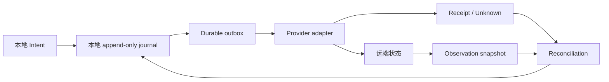
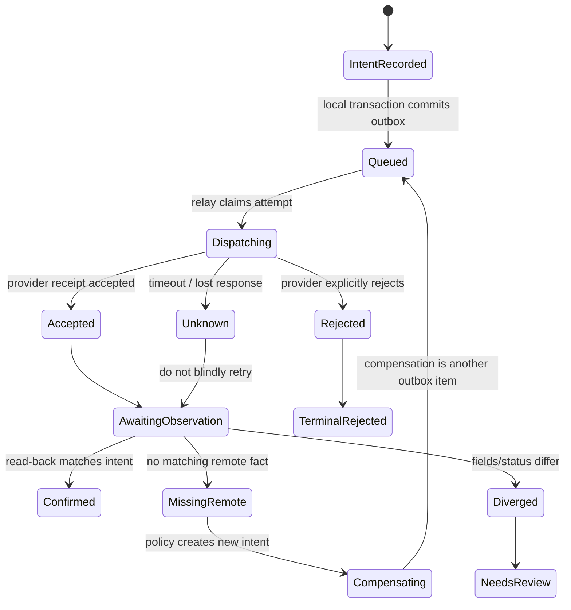

# 14 — Haskell 账本、事件溯源与远端一致性设计

> 调查性质：只读源码与官方文档调查；未修改仓库其他文件，未运行本项目测试。
>
> 结论范围：参考设计如何表达开放的操作/副作用集合、后端部分不可用、规则拒绝、远端未写入与对账，以及如何用类型把这些契约固定下来。
>
> 与本重构的仓库事实交叉引用：当前 UTA 账本与拒绝语义见 `05-staging-approval-ledger.md`；事件流与 journal 见 `11-alice-event-flow.md`；持久化和测试缺口见 `09-persisted-state-tests-docs-issues.md`。

## 摘要（≤10 行）

1. `cardano-ledger` 最值得借鉴的是 **STS + `EraRule`/`EraRuleFailure` + `Embed`**：规则、状态、信号和嵌套失败可以由类型关联，拒绝不会被压成字符串。
2. 它的 era 映射是“编译期可扩展”，不是运行时插件；`EraHasName` 仍然显式关闭了自定义 era 的世界，不能直接满足任意提供商热插拔。
3. `eventful` 把事件存储、期望版本 CAS、投影和 process manager 拆成可组合值；但 command-handler 冲突路径仍是 `error`，没有幂等收据或外部对账。
4. `crdt`/RON 证明了状态合并、操作身份、tombstone、Lamport/VV 可表达最终一致；它们不能把“远端拒绝/没有写入”自动变成成功事实。
5. `quickcheck-state-machine` 与 Hedgehog 能以同一模型检查本地账本、适配器、远端观察结果和并发线性化；模型仍需显式写出未知、拒绝和补偿。
6. Haskell 生态没有在本调查的候选中发现可直接使用的完整 Saga+transactional-outbox；应采用“本地事务事件/意图 + outbox relay + 幂等消费者 + reconciliation worker”的组合。
7. 目标系统宜采用 **按 provider 参数化的 effect/receipt/observation ADT**，同时以 `Read`/`Write` 能力和 provider-local 类型保留契约；未知回执必须独立于 rejected。

---

## 1. 范围与筛选标准

### 1.1 问题定义

目标系统不是单一交易协议的实现，而是一个“多提供商接入层”。提供商可能是 REST gateway、定制 TCP+SDK、脚本语言宿主，或只提供查询而不提供写入。因此调查不把“有一个统一 `placeOrder` 函数”视为成功，而考察以下六个一致维度：

| 维度 | 必须回答的问题 | 目标约束中的对应风险 |
|---|---|---|
| ① 开放操作集合 | 新增副作用/分录/事件种类是否不需修改核心分派器？ | 新 provider、新副作用不能不断扩大中央 `switch` |
| ② 部分可用后端 | provider 不支持该操作时如何表达？是否仍可实现其他操作？ | 只读账户、缺少改单/撤单能力、脚本宿主能力不完整 |
| ③ 契约一致 | 输入、结果、失败、状态转移、序列化是否由类型贯通？ | 不接受“文档约定某字段存在”的隐式契约 |
| ④ 失败与不一致 | 远端拒绝、超时、已执行但响应丢失、未写入如何建模？ | 本地 intent 与远端事实可能不同 |
| ⑤ 只读/读写 | 读和写是否在类型或能力层分离？ | 只读模式不能因调用路径错误而写入 |
| ⑥ 可借鉴边界 | 机制解决哪一个约束，又在哪些场景失效？ | 防止把账本、CRDT、测试工具误当成完整一致性协议 |

### 1.2 纳入对象

本报告选择能直接提供源码或官方 API 证据的对象：

| 对象 | 角色 | 为什么纳入 |
|---|---|---|
| `cardano-ledger` | era 化账本与 STS 规则系统 | 同时有开放 type family、嵌套规则、失败 ADT、事件和形式化规范 |
| `eventful` | 事件存储/CQRS 工具箱 | 有 stream、版本 CAS、投影、command handler、process manager、多个后端 |
| `eventsource-api` | 事件存储 API 对照 | 提供 stream、`ExpectedVersion`、订阅、读失败；展示类型化边界与异常边界的差别 |
| `crdt` | CmRDT/CvRDT 教科书式实现 | 明确区分 `Intent`、operation、payload，以及 semilattice 合并 |
| RON / `ron-rdt` | 较完整的 Haskell RDT 与存储 | 有 typed/untyped RDT、版本向量、tombstone、文件日志与类型标记校验 |
| `quickcheck-state-machine` | QuickCheck 模型状态机 | 能比较真实 backend 与 symbolic model，含并发线性化和异常结果 |
| Hedgehog state machine | Hedgehog 模型状态机 | 命令是 existential input/output，callback 将 Require/Update/Ensure 组合起来 |
| transactional outbox + Saga/process manager | 意图/回执/对账组合模式 | 连接本地事件日志与外部不可逆副作用；`eventful.ProcessManager` 提供 Haskell 侧部分参考 |

### 1.3 证据与版本

所有可读源码先以 `git clone --depth 1` 浅克隆到 `/tmp/`，再读取具体路径。调查快照如下：

| 仓库 | 浅克隆目录 | commit（调查快照） |
|---|---|---|
| `IntersectMBO/cardano-ledger` | `/tmp/cardano-ledger` | `88507e5` |
| `jdreaver/eventful` | `/tmp/eventful` | `3f0c604` |
| `YoEight/eventsource-api` | `/tmp/eventsource-api` | `ca2adb5` |
| `cblp/crdt` | `/tmp/crdt` | `175d7ee` |
| `ff-notes/ron` | `/tmp/ron` | `3031fd2` |
| `advancedtelematic/quickcheck-state-machine` | `/tmp/quickcheck-state-machine` | `644e3ac` |
| `hedgehogqa/haskell-hedgehog` | `/tmp/hedgehog` | `75e06fb` |

报告中的“源码路径”是上述快照的仓库相对路径；“官方 URL”见文末来源表。静态源码没有证明运行时部署语义的地方，明确标注为限制或推断，不把文档承诺当作实际远端事实。

### 1.4 目标边界

本报告不选择交易行业作为抽象中心；金额、订单、持仓只是说明不可逆远端副作用的例子。核心抽象应允许 provider 将任意本地意图投影为自己的 command/request/SDK 调用，并把 provider 回执与随后观察到的事实分开保存。



---

## 2. 逐库/逐模式分析

### 2.1 `cardano-ledger`：era 扩展、STS 和失败 ADT

#### 2.1.1 事实与核心机制

`cardano-ledger` 的 `Era` 是类型级参数。`PreviousEra`、协议版本上下界和 `EraName` 由 `Era` class 的 associated type 表达；Shelley、Allegra、Mary、Alonzo、Babbage、Conway、Dijkstra 各自提供实例。新 era 指南要求新增 era package、复制并泛化前一个 era 的测试，然后由类型检查器指导补齐 type family/type class 实例。[C1][C2]

规则名字使用 `Symbol` kind 的 `EraRule (rule :: Symbol) era` type family；失败和事件使用相应的 `EraRuleFailure`、`EraRuleEvent`。因此同一规则名在不同 era 中可以解析为不同 STS、失败和事件类型，而调用代码仍可写成 `STS (EraRule "UTXO" era)`。[C1][C3]

`STS` class 要求每个系统给出 `State`、`Signal`、`Environment`、`BaseM`、`Event` 和 `PredicateFailure`；`transitionRules` 列出规则，`applySTS` 返回 `Either (NonEmpty (PredicateFailure s)) (State s)`。`Embed` 负责把子规则失败和事件包进父规则。[C4][C5]

最小的类型关系可概括为（仅为说明签名，非可复制实现）：

```haskell
type family EraRule (rule :: Symbol) era
type family EraRuleFailure (rule :: Symbol) era
type family EraRuleEvent (rule :: Symbol) era
```

#### 2.1.2 六维评价

**① 开放的副作用/操作集合。**  
规则名字通过开放 type family 与每个 era 的 `type instance` 接入；Conway 可以新增 `GOV`、`RATIFY`、`ENACT` 等 rule，并把既有规则标为 `VoidEraRule`。因此“新增规则而不改变 STS 核心解释器”成立，新增代码主要位于新 era 的 `Era.hs`、`Rules/*.hs` 和失败转换实例。[C1][C6]

但是，这不是完全开放的运行时 effect registry。`EraHasName` 的 `EraFromName` 是带 injectivity 的 type family，内部注释明确说它实际上关闭了 era 世界；若要允许自定义 era，需要移除相关 injectivity。新 era 仍需修改仓库 package、映射和测试集合。对目标系统的含义是：它适合作为 provider-local 编译期扩展模板，不适合作为无需重编译即可安装任意 provider 的插件机制。[C2][C7]

**② 不同后端实现与部分不可用。**  
`Embed sub super` 让父规则选择性嵌入子规则；某一 era 对不再支持的规则可把 rule、failure、event 都映射为无构造器的 `VoidEraRule`。这等价于“该能力在此类型状态中不可能发生”，比运行时 `NotImplemented` 更强。[C1][C6]

但 `cardano-ledger` 的“后端”是不同 era 的规则实现，不是网络 provider。它没有一个 `Provider` 能力协议，也没有把 REST/TCP/脚本的连接错误建模为 rule capability。若用它启发目标系统，应把 `EraRule` 的“按索引选择实现”与 capability witness 分开，不能把 `VoidEraRule` 直接当作所有 provider 的 unavailable 分支。[C2][C5]

**③ 类型层的契约一致性。**  
这是该设计最强的部分。`Environment (EraRule "UTXO" era) ~ UtxoEnv era`、`State ... ~ UTxOState era`、`Signal ... ~ StAnnTx ...`、`PredicateFailure ... ~ ConwayUtxoPredFailure era` 这样的约束，使规则实现不能把错误的环境、状态或信号接在一起。Conway 的失败 ADT 还通过 `UtxosFailure`、`UtxoFailure` 等构造器保留嵌套层级。[C3][C6]

`InjectRuleFailure` 的约束是 `EraRuleFailure rule era ~ PredicateFailure (EraRule rule era)`；`injectFailure` 把子规则特定失败提升为当前 era 的失败。这样跨 era 兼容路径是显式函数，而不是把旧错误序列化为任意字符串。[C1][C8]

**④ 远端失败、不一致、未写入与拒绝/冲回。**  
规则验证使用 `Validation (NonEmpty failure)`，失败可以同时携带多个坏输入、金额 mismatch 或嵌套子规则失败；`applySTS` 的 `Left` 表示状态未作为成功转移返回。它非常适合表达“审核拒绝原因”和形成可重放的失败事实。[C4][C5]

然而 STS 只描述一个确定的状态转换，不知道 provider 是否已收到请求。超时、响应丢失、远端已经成交但本地没有 receipt、远端根本没有写入，都不是 `PredicateFailure` 的同义词。`PredicateFailure` 应保留为“规则拒绝”，而 `Unknown`、`NotObserved`、`Diverged` 应由目标系统的 dispatch/reconciliation 层另建 ADT。[C5][C9]

所谓“冲回”也不应从失败自动推导。`cardano-ledger` 的失败意味着本次规则没有提交成功状态；若业务需要反向操作，反向操作必须是一个新的 signal/intent，并有自己的规则和事件。把“用户拒绝”重命名成 rollback 会掩盖远端部分执行风险。[C3][C6]

**⑤ 只读与读写区分。**  
STS 没有通用的 read/write capability。`applySTS` 会执行 transition rule；即使某些验证标签可关闭，也只是 replay/validation policy，而不是类型上的只读凭证。`EventPolicyReturn` 只控制是否返回事件，不改变规则是否可写状态。[C4][C5]

目标系统不能仅复制 `STS`，还需另设 `Query` 与 `Command` 接口，或用 phantom capability 将读操作和写操作分离。否则一个只读 provider 仍可能被传给要求 mutation 的调用点。[C5][C10]

**⑥ 对目标系统的借鉴与不适用点。**  
借鉴点是“provider/版本参数化类型 + rule-specific failure + 嵌套 failure injection + explicit event policy”：可将 provider-specific command、receipt、observation 绑定在同一个类型参数上，并将规则拒绝保留结构化字段。[C1][C3]

不适用点是“era package 复制”和封闭 `EraHasName` 世界；任意 provider 形态、脚本宿主和运行时新增操作需要开放注册或 existential package，而不是在核心仓库维护所有 era 实例。[C2][C7]

#### 2.1.3 可移植的结论

`cardano-ledger` 解决的是**规则审核的一致性**，不是**跨系统写入的一致性**。目标层可以采用如下分层：`RuleResult` 负责本地可验证条件，`Receipt` 负责 provider 对请求的回答，`Observation` 负责之后读到的事实；三者不可互相替代。[C5][C9]

### 2.2 `eventful`：事件存储、投影与版本 CAS

#### 2.2.1 事实与核心机制

`eventful` 自称是构建 event-sourced application 的工具箱，而不是强迫具体架构的框架。它的核心 API 分离 `EventStoreReader` 和 `EventStoreWriter`；reader 按 `key`、`position` 查询，writer 以 `ExpectedPosition` 写入一批事件。[E1][E2]

`ExpectedPosition` 有 `AnyPosition`、`NoStream`、`StreamExists`、`ExactPosition position`；冲突返回 `EventStreamNotAtExpectedVersion position`。`transactionalExpectedWriteHelper` 明确要求底层 monad 具有事务性，因为“先读最新版本、再写入”需要在同一事务中完成。[E2]

`Projection state event` 是 seed 与 `state -> event -> state` handler；`latestProjection` fold 出当前状态，`allProjections` 返回每次事件后的状态序列。`StreamProjection` 额外保存 stream key、position、projection 和缓存状态。[E3]

`CommandHandler` 把 projection 与 `state -> command -> [event]` 组合；`applyCommandHandler` 读到最新 projection 后以 `ExactPosition` 写事件。`ProcessManager` 以 projection 维护跨 stream 状态，并从状态派生待发送 command/event；其 command 使用 existential `CommandHandler` 隐藏目标 state 类型。[E4]

#### 2.2.2 六维评价

**① 开放的副作用/操作集合。**  
事件类型是应用自己的 Haskell 类型，核心只接受参数化的 `event`；新增 `OrderFilled`、`ProviderRejected` 或 `BalanceObserved` 不需要改 event store。`EventStoreWriter` 的 `Contravariant` 实例和 `Serializer` 允许把多个局部 sum type 投影到存储类型。[E2][E5]

这种开放性是“参数化数据类型开放”，不是 runtime plugin。应用若把所有 provider 事件合并成一个 `AllEvents` sum，仍然要修改该 sum；`EventSumType` 用 `Dynamic` 按构造器试探反序列化，文档还警告源 sum 中不在目标 sum 的事件会使 serializer partial。[E5]

**② 不同后端实现与部分不可用。**  
同一 writer API 有 STM 内存实现、SQLite、PostgreSQL、DynamoDB 包；SQL 配置通过 `SqlEventStoreConfig` 注入实体、字段和序列化类型，允许为自有表结构提供 adapter。[E1][E6]

但 writer 能力本身没有“只支持 append、不支持订阅/全局序列”的类型标记。部分 provider 能力需由应用另加 `Capability`；`eventful` 的 backend availability 主要是存储 backend 可替换，不是远端副作用 capability。[E2][E6]

**③ 类型层的契约一致性。**  
stream key、position、event、monad 都是参数，`VersionedEventStoreWriter` 固定为 `UUID` + `EventVersion`，projection state 与 event 由类型相连。`ExpectedPosition` 使并发写的预期位置不是文档字段，而是 sum type。[E2][E3]

契约强度仍有边界：serialization 的 `deserialize` 返回 `Maybe`，serialized reader 用 `mapMaybe` 静默丢掉无法解码的事件；因此存储中的未知事件不会在类型层阻止读取，反而可能造成投影缺口。[E5][E2]

**④ 远端失败、不一致、未写入与拒绝/冲回。**  
对本地 stream 的 stale writer，`ExactPosition` 和 `EventWriteError` 可检测“写入前版本不一致”；PostgreSQL writer 还锁 events 表，以维持全局序列在并发事务下对 reader 的单调可见性。[E2][E6]

对外部 provider，库没有 receipt、idempotency key、remote observation 或 reconciliation worker。`applyCommandHandler` 遇到写冲突时直接 `error $ "TODO: Create CommandHandler restart logic"`，不是可恢复的结构化结果；这正是目标系统不能照搬的失败边界。[E4]

`synchronousEventBusWrapper` 先把事件写入 store，再同步调用 handlers；handler 若在写入后失败，已存事件仍然存在而 handler 的副作用可能未完成。它适合测试和简单 fan-out，不等价于 transactional outbox 或远端确认。[E7]

`ProcessManager` 逐个执行 pending command，再逐个写 pending event；源码没有持久化 pending queue、消费标记或重试策略。因此它可作为 saga 决策函数的参考，却不能独自证明跨 provider 的“已发送/已观察”。[E4]

**⑤ 只读与读写区分。**  
reader 和 writer 是两个 newtype，调用者可在类型上不给查询端 writer；这是 API 方向上的最小读写分离。可是 `Projection`、`CommandHandler` 和 `ProcessManager` 不表达领域操作是否会触碰远端，writer 也不区分可重试与不可重试写入。[E2][E4]

目标系统应保留这条经验，但把 provider mutation 单独放在 `WriteCapability` 中，并让 read-only provider 只能构造 `QueryCapability`。不能因为 store reader/writer 分离就认为外部副作用已经隔离。[E2]

**⑥ 对目标系统的借鉴与不适用点。**  
借鉴点是 append-only stream、expected-position CAS、global sequence、projection seed/fold，以及 reader/writer 分离；它们可承载本地意图、规则结果和观察快照的日志。[E2][E3]

不适用点是把 `ProcessManager` 当作可靠 outbox，把 serializer 的 `Maybe` 丢事件当作容错，以及把 handler 异常当作可自动重启。目标系统需要 durable attempt/receipt、显式 Unknown 和对账重放。[E4][E5][E7]

#### 2.2.3 对账启发

`eventful` 的 `EventVersion` 适合本地 ledger cursor：每条 stream 的 append 都带顺序和预期版本。它不回答 provider 的实际状态，因此应在同一 correlation key 下再记录 `Receipt` 与 `Observation`，而不是把 provider response 伪装成 event store 的成功 append。[E2][E3]

### 2.3 `eventsource-api`：stream、订阅与异常边界

#### 2.3.1 事实与核心机制

`eventsource-api` 的核心 `Store` class 提供 `appendEvents`、`readStream`、`subscribe`。append 以 `StreamName`、`ExpectedVersion`、事件列表为输入，并返回异步 `EventNumber`；read 通过 streaming API 返回 `ExceptT ReadFailure`。[ES1][ES2]

`ExpectedVersion` 有 `AnyVersion`、`NoStream`、`StreamExists`、`ExactVersion EventNumber`。与 `eventful` 不同，README 明确承认版本不匹配应抛异常，但当前 API 没有在类型系统中捕捉该情况；实现定义了 `ExpectedVersionException` 并令其成为 `Exception`。[ES1][ES2]

事件保存为 `SavedEvent { eventNumber, savedEvent, savedLinkEvent }`；事件自身含 `EventType`、`EventId`、`Data` 和可选 `Properties` metadata。读失败区分 `StreamNotFound`、`ReadError`、`AccessDenied`。[ES2]

#### 2.3.2 六维评价

**① 开放的副作用/操作集合。**  
`EncodeEvent a`/`DecodeEvent a` 让应用自定义事件种类，store 只保存通用 `Event`；stream 订阅也不要求核心知道事件构造器。`SomeStore` 用 existential 包住任意 `Store` 实例，适合把后端抽象交给运行时。[ES2]

但 existential 只隐藏具体 store，不会自动建立 provider effect 的开放注册；`EventType` 是 `Text`，如果应用把不兼容的 payload 当同一 event type，核心无法在编译期阻止。[ES2][ES3]

**② 不同后端实现与部分不可用。**  
`Store` class 的实现只需满足 append/read/subscribe；仓库同时提供测试用线程安全 STM stub 和 GetEventStore backend。不存在的 stream 可由 stub read 成空流，订阅也被允许先于 stream 创建。[ES1][ES4]

这个接口没有 capability algebra：某 backend 若不支持 link event、持久订阅或强一致 expected version，只能在实现内部降级或抛异常。部分不可用能力需在目标系统另建类型层。[ES1][ES4]

**③ 类型层的契约一致性。**  
`ExpectedVersion`、`ReadFailure`、`EventNumber`、`Subscription` 和 `SavedEvent` 都是命名类型；read 的 `ExceptT ReadFailure` 比直接返回空列表更能保留访问/读取失败。[ES2]

但是 append 的 expected-version 失败走 `IO Exception`，与 read 的 `ExceptT` 不对称；`Data` 可为 raw bytes 或 JSON，具体 payload 合约落在 `EncodeEvent`/`DecodeEvent` 实例而非 store API。[ES1][ES2]

**④ 远端失败、不一致、未写入与拒绝/冲回。**  
异步 append 返回 `Async EventNumber`，stub 在 STM 事务中检查版本并将事件写入 stream；因此同一 store 内的 optimistic concurrency 可被测试。`EventId` 可作为业务去重键的候选，但库没有按 EventId 去重的语义。[ES2][ES4]

read 失败有显式 `ReadFailure`；但 timeout、append 已被远端接收而本地等待失败、远端未写入均没有独立的 `Unknown`/`NotWritten` 构造器。`ExpectedVersionException` 只表示写入前版本条件不满足，不表示 provider 是否执行过业务副作用。[ES1][ES2]

**⑤ 只读与读写区分。**  
`Store` 将 append/read/subscribe 放在同一个 class，因此获得 `Store` 的值即拥有写能力；没有 `ReadStore`/`WriteStore` 两个 capability class。`readStream` 本身是读 API，但类型不会阻止拿同一 `store` 调 append。[ES2]

**⑥ 对目标系统的借鉴与不适用点。**  
借鉴点是 `EventId` + `EventNumber` + correlation stream + `ReadFailure` + pre-stream subscription；这些可对应 intent identity、ledger sequence、observation stream 和 provider read errors。[ES2][ES4]

不适用点是“expected version failure 用 exception”，以及把 raw `Data` 当作统一契约。目标系统应将可预期拒绝、未知回执和不支持能力作为显式 ADT/Result，并在序列化边界之后恢复精确 domain type。[ES1][ES2]

### 2.4 `crdt`：CmRDT/CvRDT、Intent 与半格

#### 2.4.1 事实与核心机制

该包 README 将自己定位为 CmRDT/CvRDT 定义及经典实现，并明确标注“仅供参考”；计划用于实际应用时建议查看 `ron`。Cabal 文件的 `base < 4.15` 上界也表明它不是现代运行时的直接依赖选择。[CR1][CR2]

`CvRDT` 被定义为 `Semilattice` 别名。`Data.Semilattice` 要求合并操作满足交换律和幂等律；`GCounter` 以 replica id 为键、用 `max` 合并各副本计数；`PNCounter` 组合两个 GCounter。[CR3][CR4]

`CmRDT` 明确区分三种类型：内部 payload、用户的 `Intent`、发送到其他副本的 operation。`makeOp` 依 payload 返回 `Maybe (m op)`，`apply` 在下游应用 operation；文档指出 CmRDT 需要并发 operation 可交换，但不要求幂等。[CR5]

#### 2.4.2 六维评价

**① 开放的副作用/操作集合。**  
每个 CRDT 类型通过自己的 `CmRDT` instance 定义 `Intent` associated type、operation constructors、payload 和 `apply`；新增一种 CRDT 不必改核心 class。`Cm.ORSet` 直接展示 `Intent = Add a | Remove a`、`OpAdd`/`OpRemove` 和带版本的 payload。[CR5][CR6]

这是一种强的类型参数化开放性，但不是跨 provider 的 effect registry。`CmRDT` 的 operation 是可合并的数据更新，不是“发给券商/脚本宿主的不可逆请求”；不能把网络写入误建模成一个可交换纯函数。[CR5]

**② 不同后端实现与部分不可用。**  
`makeOp` 的 `Maybe` 可以表达当前 payload 下 intent 不适用；`apply` 的文档要求下游无效更新被忽略。各 CRDT 可运行在不同 `Clock`/`MonadState` 中，体现了局部执行环境可替换。[CR5]

但是库没有 provider backend、网络 transport、能力声明或“只支持 query 不支持 update”的接口。`Nothing` 也没有结构化原因，不能区分“对象不存在”“操作已被远端拒绝”和“本地无法生成 timestamp”。[CR5][CR7]

**③ 类型层的契约一致性。**  
`Intent op`、`Payload op`、`apply :: op -> Payload op -> Payload op` 由同一个 `op` index 关联，避免把 A 类型 operation 施加到 B 类型 payload。CvRDT 的 semilattice instance 还把收敛所需的代数运算写进实例。[CR3][CR5]

契约只覆盖 CRDT 数学性质，不覆盖 provider schema、远端 response、业务金额或操作权限。`CausalOrd op` 是 class constraint，但库不自动证明实现满足其 laws；这仍需 law tests。[CR5][CR8]

**④ 远端失败、不一致、未写入与拒绝/冲回。**  
CvRDT 适合“消息延迟、重复合并、不同顺序到达仍收敛”的状态合并：只要副本最终拿到同一组更新，semilattice 的幂等/交换性质可消除重复和顺序差异。CmRDT 适合将 intent 先变成带 tag/clock 的 operation，再在下游 apply。[CR3][CR5][CR6]

它不保证 remote side effect 发生。远端拒绝的 operation 若永远不被 apply，CRDT 只会保留本地 intent 或未送达 op；没有 acknowledgement、outbox、retry、read-back 或 reconciliation。`CmRDT` 文档还明确说 idempotency 不必成立，因此重复投递必须由 operation identity 或 provider 规则另行处理。[CR5]

余额/持仓不应直接用 GCounter/PNCounter 代表 provider 事实：成交拒绝、部分成交、撤单和手续费不是简单的可交换增量。更安全的做法是将 CRDT 用在“已知 intent/观察记录/去重集合”元数据上，金额事实仍由 provider observation 与规则审核共同决定。[CR4][CR5]

**⑤ 只读与读写区分。**  
CRDT 同时提供 `query` 与 update/makeOp，但没有 read-only capability；调用方持有 payload 就可以尝试构造 operation。`makeOp` 的 `Maybe` 是可适用性，不是权限。[CR5]

**⑥ 对目标系统的借鉴与不适用点。**  
借鉴点是将 `Intent`、可发送 `Operation`、本地 `Payload`、operation identity 和时钟拆开；这直接对应目标的“意图—尝试—回执—观察”层。[CR5][CR6]

不适用点是把最终一致合并当成远端事实确认；provider 的拒绝和“未写入”必须是业务状态，不可由 `merge` 自动抹平。[CR3][CR5]

#### 2.4.3 适用范围

可将 `CmRDT` 的三元组改造成目标系统的 provider-local contract：`Intent` 是稳定用户请求，`Operation` 是带 idempotency key 的具体 wire/SDK 调用，`Payload` 是本地已知事实。不同 provider 允许拥有不同的 operation 与 payload，但它们需要以 existential package 进入统一队列，而不把 payload 擦成 `Map Text Value`。[CR5][CR9]

### 2.5 RON / `ron-rdt`：typed RDT、版本向量与持久日志

#### 2.5.1 事实与核心机制

RON 仓库是 Haskell 实现，拆出 `ron`、`ron-rdt`、`ron-schema`、`ron-storage` 等包；调查快照的 `ron-rdt` version 为 `0.12`，Cabal 允许现代 GHC 版本范围。与已标记 deprecated 的 `cblp/crdt` 不同，changelog 仍记录 2026 年 RGA 修复。[RN1][RN2]

`Reducible` 要求 `BoundedSemilattice a` 与 `Eq a`，并提供 `reducibleOpType`、`stateFromChunk`、`stateToChunk`、`applyPatches` 和 `reduceUnappliedPatches`。`Replicated` 的 `Encoding a` 提供 typed value 与 RON payload 的双向转换；`ReplicatedAsObject` 用 associated type `Rep a` 绑定无类型底层 representation。[RN3]

已提供的 reducer 包括 LWW、RGA、ORSet、VersionVector。`VersionVector` 以 replica 映射到最新 operation，合并用 `Map.unionWith latter`，并明确记录幂等、交换律和 `≼` 关系。[RN4]

#### 2.5.2 六维评价

**① 开放的副作用/操作集合。**  
在 RDT 类型内部，新增 `Replicated`/`Reducible` 类型可以复用 object state、patch reduction 和 typed payload API，不必改变已有 LWW/ORSet/RGA 的实现。`Rep a` 让类型化外观与底层 CRDT representation 保持关联。[RN3]

但当前 `RON.Data` 的 `reducers` 是一个中央 `Map UUID Reducer`，静态列出 `LwwRep`、`RgaRep`、`ORSetRep`、`VersionVector`。新增 reducer 若要被 wire-frame 全局 reducer 识别，仍需修改该 map；未知 wire type只保留原 chunk，未知 state type 则返回错误。这是目标系统必须警惕的“中央注册表瓶颈”。[RN5]

**② 不同后端实现与部分不可用。**  
`MonadStore` 只要求 `listObjects`、`appendPatch`、`loadWholeObjectLog`；`RON.Store.FS` 是文件系统 backend，`RON.Store.Sqlite` 提供 SQLite 路径。对象日志按 object UUID 分目录，patch 可以按 version vector 过滤。[RN6][RN7]

RDT reducer 缺失时 wire 层可以保留未应用 patch，形成部分可解读状态；但这不是 provider capability。若 provider 不支持某种副作用，仍需目标层显式返回 `Unsupported`，不能依赖 reducer 缺失来表示权限或连接不可用。[RN5][RN6]

**③ 类型层的契约一致性。**  
`ReplicatedAsObject` 的 `type Rep a` 将 typed object 与 untyped reducer 绑定；`stateFromWireChunk` 检查 `stateType == reducibleOpType @a`，错类型会构造带 expected/got 的 error，而不是把别的对象强制解码为当前类型。[RN3]

`LwwRep`、`ORSetRep` 和 `VersionVector` 的 Semilattice laws 写在源码注释和 instance 旁；这比普通 JSON merge 强。然而 wire payload 中 operation 的业务意义仍依赖 type UUID 和 reducer；目标 provider contract 仍须另有 versioned schema 与 decode failure。[RN4][RN5]

**④ 远端失败、不一致、未写入与拒绝/冲回。**  
版本向量提供“我已见到每个 replica 哪一个 op”的 cursor；`loadWholeObjectLog objectId version` 可以拉取高于已知 VV 的 patch。LWW 的 latter、ORSet 的 tombstone、RGA 的 vertex id 使重复/乱序 patch 能以确定方式归并。[RN4][RN6]

`RON.Store.FS` 的 `Handle` 用 process-wide `MVar` 串行 append，并用独占 `applock` 防止同一 data directory 多进程打开；写 patch 后再写 change channel。它解决本地日志并发，不产生远端 provider receipt，也不区分请求已执行但响应丢失与根本未写入。[RN6]

CRDT 删除是 tombstone 或 LWW 选择，不是业务冲回。若一个 provider 已部分成交，合并一个“删除 intent”不会自动产生反向订单；目标系统应把 compensation 作为新 intent，并把 observation 与本地 ledger 差异留给 reconciler。[RN4][RN6]

**⑤ 只读与读写区分。**  
`readObject`、`loadWholeObjectLog` 是读路径，`appendPatch`、`newObject` 和 modify APIs 是写路径；但 `MonadStore` 将 append 与 load 放在同一个 class，没有静态 read-only store。`Replicated` encoding 也不代表权限。[RN6][RN7]

**⑥ 对目标系统的借鉴与不适用点。**  
借鉴点是 version vector 作为“远端观察游标”、operation UUID 作为幂等 identity、tombstone 作为不可逆删除的明确记录、typed reducer 对 wire type 的检查。[RN3][RN4][RN5]

不适用点是中央 reducer map 仍需修改核心、FS patch channel 只是通知不是确认、CRDT merge 不能表示 provider 交易拒绝。RON 更适合作为 observation metadata 或 offline intent log 的参考，不是交易事实的最终来源。[RN5][RN6]

#### 2.5.3 对账启发

目标系统可采用类似 VV 的 provider cursor：每个 provider/账户保存 `lastObservedCursor`，reconciler 只请求之后的增量；若 provider 没有 cursor，则用 snapshot hash、时间窗口和 idempotency key 组合。缺少 provider read-back 时必须把状态留在 `Unknown`，不能将本地 append 推断为远端已写入。[RN4][RN6]

### 2.6 `quickcheck-state-machine`：模型、后置条件与并发线性化

#### 2.6.1 事实与核心机制

该库建立在 QuickCheck 之上，要求使用者提供 action datatype、model、pre/postconditions、transition、generator/shrinker 和 concrete semantics；库提供 sequential 与 parallel property combinators。README 将其定位为实验性状态机测试库。[Q1][Q2]

`StateMachine` record 的关键字段是 `initModel`、多态的 `transition`、`precondition`、`postcondition`、可选 `invariant`、`generator`、`shrinker`、`semantics`、`mock` 和 `cleanup`。`Command cmd resp` 保存 symbolic command、symbolic response 和新建变量。[Q3]

执行顺序是：检查 precondition，调用 concrete semantics，捕捉异常，检查 response 中引用数量，检查 postcondition/invariant，再以 symbolic mock response 和 concrete response 更新模型。`Reason` 区分 `Ok`、precondition/postcondition/invariant 失败、异常和 mock mismatch。[Q4]

并行测试先生成 prefix 和 parallel-safe suffixes，再同时执行，收集 invocation/response history，并寻找满足 postcondition 的合法 sequential interleaving；源码的 `parallelSafe` 会枚举 permutations。[Q5]

#### 2.6.2 六维评价

**① 开放的副作用/操作集合。**  
操作集合由应用定义的 `cmd r`/`resp r` datatype 决定；README 示例用 `Create`、`Read`、`Write`、`Increment` 表达四种动作，核心不需要知道它们的业务含义。新增 provider operation 只需在测试 specification 增加构造器及其模型逻辑。[Q1][Q3]

这属于“测试 specification 开放”，不是生产 effect registry。新增构造器仍需同步 generator、transition、postcondition、semantics、mock 和 shrinker；但它可避免核心测试器的中央业务 switch。[Q3][Q4]

**② 不同后端实现与部分不可用。**  
`semantics :: cmd Concrete -> m (resp Concrete)` 可调用内存对象、文件、HTTP server、数据库或 SDK；`generator` 返回 `Maybe (Gen command)`，可在当前 model 不适用时停止生成。README 还包含 Servant/Postgres CRUD 和带故障的外部系统示例。[Q1][Q2]

provider 部分不可用应显式成为 response error 或 generator 排除条件；若仅在 semantics 中抛异常，Reason 只能说 `ExceptionThrown`，不会告诉模型这是能力缺失、拒绝还是未知。能力矩阵需写进 model/spec。[Q3][Q4]

**③ 类型层的契约一致性。**  
`Symbolic`/`Concrete` phantom phase 和 `Reference a r` 使生成阶段只能持有 symbolic reference，执行阶段才能得到 concrete value；`Typeable` + environment reify 检查引用的运行时类型。transition 对 `r` 多态，避免只为 symbolic 或 concrete 写两份模型。[Q3][Q6]

类型层主要保证引用和阶段，不保证领域规则。`postcondition` 返回 runtime `Logic`，可以检查 provider receipt 的字段，但编译器不会保证每个命令都有对应错误、观察和 compensation 分支；`transition` 中不匹配的 command/response 甚至可用 `error`。[Q4][Q7]

**④ 远端失败、不一致、未写入与拒绝/冲回。**  
测试器会捕捉非异步异常并将其记录为 `ExceptionThrown`；response 通过 postcondition 比较实际结果与 model，parallel history 再以 interleaving 检查竞态。因此可把“调用返回 rejected”“调用超时”“读回状态不一致”设计成具体 response 并验证模型。[Q4][Q5]

库本身不重试、不发补偿、不持久化 outbox、不自动 read-back。若 semantics 在远端执行后进程崩溃，模型必须把这段窗口建成 `Unknown`，并追加 query/reconcile command；否则测试只会验证理想的请求-响应配对。[Q3][Q4]

**⑤ 只读与读写区分。**  
库没有内建 read/write capability；`Read`/`Write` 只是用户 command constructors。用户可以用 GADT 将查询和 mutation 分成不同类型，也可以在 model 中拒绝写操作，但这是 specification 自己的责任。[Q1][Q3]

**⑥ 对目标系统的借鉴与不适用点。**  
借鉴点是让同一测试模型同时驱动本地 ledger、provider adapter 和“观察远端”的命令；`Reason` 与最小 counterexample 可定位“远端拒绝后本地错误推进”的契约缺陷。[Q2][Q4]

不适用点是把测试 semantics 当成生产可靠性；它验证给定模型和故障注入覆盖的路径，不会凭空发现未建模的 timeout/partial execution。该仓库 README 仍称库 experimental，适合作为验证工具参考而非生产依赖。[Q2]

#### 2.6.3 针对 UTA 的测试模型

一个有用的 model 状态应至少包含 `LocalIntentState`、`PendingAttempt`、`KnownReceipt`、`ObservedRemoteState` 和 `ReconcileCursor`。command 集合至少含 `submitIntent`、`pollReceipt`、`queryRemote`、`reconcile`；每个 command 的 postcondition 明确接受 `Rejected`、`Unknown` 与 `NotWritten`，避免测试只覆盖成功。[Q3][Q4]

### 2.7 Hedgehog state machine：callback、typed references 与 shrink

#### 2.7.1 事实与核心机制

Hedgehog README 将 integrated shrinking、abstract state machine testing 和可带 monadic effects 的 generators 列为核心特性。状态机 API 的 `Command gen m state` 对 input/output 使用 existential quantification；command 包含 generator、concrete executor 和 callbacks。[H1][H2]

callback 有三种变体：`Require` 在生成/收缩时验证前置条件，`Update` 以 input/output 更新 symbolic 或 concrete model，`Ensure` 在执行后用 `Test ()` 验证 postcondition。`Symbolic`/`Concrete` 与 `Environment` 通过 `Typeable` 映射变量。[H2]

`executeSequential` 顺序执行所有 action，并在每个动作后 update/ensure；`executeParallel` 先执行 prefix，再并行运行两分支，最后检查至少一个 interleaving 能满足所有 ensure。示例 Registry 测试以 `spawn`、`register`、`unregister` 的 command 列表验证内存外部系统。[H2][H3]

#### 2.7.2 六维评价

**① 开放的副作用/操作集合。**  
业务通过多个独立 `Command` 值组成命令集合，核心状态机只处理 existential input/output 和 callback。新增一个 provider-specific query/write command 可以新增一个 `Command` 值，不必改执行器。[H2]

与一个中央大 sum 不同，Hedgehog command 可以局部定义 input/output 类型；因此对于高度不可知 provider，provider package 可拥有自己的 command specification，再通过测试 harness 组合它们。代价是 existential input/output 会隐藏跨命令的静态关系。[H2]

**② 不同后端实现与部分不可用。**  
`commandGen` 返回 `Maybe (gen (input Symbolic))`，可按 model 状态跳过不适用动作；`commandExecute :: input Concrete -> m output` 允许任意 monadic backend。`Require` 可以再次保护收缩后的 command。[H2]

不支持某 provider operation 可由 commandGen 不生成，或由 output 定义显式 `Unsupported`；库没有能力 class 或标准 unavailable error。要确保不同 provider 都实现同一最小契约，需在 provider-specific spec 另写 law。[H2][H3]

**③ 类型层的契约一致性。**  
每个 command 的 input/output 在 existential scope 内要求 `TraversableB`、`Show`、`Typeable`；`Var output v` 使 `Update` 同时适用于 symbolic/concrete。`reify` 对 symbolic variable 的名称和动态类型作检查，错误区分 not found/type error。[H2]

契约强度比任意 JSON 高，但 `Ensure` 最终是 runtime property；不同 command 的 output 类型不会自动组成 provider-level receipt ADT。若把所有 output 擦成 `Dynamic`，compile-time contract 会退化，因此应在边界保持命名 type。[H2]

**④ 远端失败、不一致、未写入与拒绝/冲回。**  
`Ensure` 可以检查返回的 remote receipt、随后读取的 observation 或状态 hash；parallel executor 通过实际并发与 interleaving 发现竞态。example 的外部 HashTable/IORef 说明 semantics 可以故意包含实现 bug，再由模型揭示。[H3]

Hedgehog 没有 durable retry/reconciliation。`commandExecute` 抛出的异常会让 property 失败；要模拟“已接收但响应丢失”，必须让 executor 返回 `Unknown` 并让后续 command 查询/对账。这里的 `Update` 也不应在未知状态下贸然推进已成交模型。[H2][H3]

**⑤ 只读与读写区分。**  
与 qsm 相同，read/write 是应用 command 的类型设计，不是 Hedgehog 的内建 capability。可以定义 `QueryInput` 与 `WriteInput`，并只把 `WriteInput` command 配给拥有写能力的 provider；该约束不会由 `executeParallel` 自动生成。[H2]

**⑥ 对目标系统的借鉴与不适用点。**  
借鉴点是 callback 分离 Require/Update/Ensure、integrated shrink 保持引用有效、并行 action 对未知与拒绝的模型可视化；它适合写 provider contract tests 和本地 ledger-vs-remote model tests。[H1][H2]

不适用点是把 property success 当作端到端交付保证；未连接真实 provider、未执行真实 query/reconcile 的测试只验证 mock semantics。并行 interleaving 也不是跨进程事务或 provider 的 exactly-once 保证。[H2][H3]

### 2.8 Intent / Receipt / Reconciliation：outbox + Saga/process manager 组合

#### 2.8.1 调查结论与事实边界

本调查没有在上述 Haskell 候选中发现一个同时提供 durable Saga、transactional outbox、provider receipt、幂等 relay 和对账 worker 的完整、可直接采用的库。`eventful.ProcessManager` 是最接近的 Haskell process-manager 抽象，但它从 projection 派生 pending commands/events 后逐个执行，并不持久化工作队列或消费状态。[E4]

transactional outbox 是独立于 Haskell 的持久化模式：本地业务状态和 outgoing message 在同一数据库事务中提交；relay 之后发送消息，发送成功前不标记完成。relay 崩溃可能重复发布，因此消费者必须幂等；这不是 exactly-once。[O1]

Saga 是多个 local transaction 通过消息串接的流程；某一步失败时以新的 compensating transaction 处理业务补偿，而不是撤销已发生的远端副作用。outbox 解决“本地提交与发消息的原子性”，Saga 解决“多步业务流程与补偿”，二者不可互相替代。[O2]

Haskell 可用 `hasql`/`hasql-transaction` 或 `persistent` 等数据库层实现本地事务，但这些包本身不是 provider-aware outbox。调查结论因此是“组合小型领域模块”，而不是再引入一层泛化框架。[O3]

#### 2.8.2 建议的状态划分

建议把四类记录分开：`Intent`（用户/策略要求做什么）、`Attempt`（某次具体 provider 调用）、`Receipt`（provider 对调用的回答）、`Observation`（之后从 provider 读到的事实）。`Reconciliation` 只比较 `Intent`/`Attempt` 与 `Observation`，不把 receipt 直接当事实。

可用很小的 ADT 表示结果（示意，不是完整代码）：

```haskell
data Delivery = Accepted | Rejected | Unknown | NotWritten
data Reconcile = Confirmed | MissingRemote | Diverged | NeedsReview
```

`Rejected` 代表 provider 明确拒绝；`NotWritten` 代表有证据显示请求没有落地；`Unknown` 代表没有足够证据，不能安全重试非幂等写入。把三者合为 `Failure Text` 会使对账 worker 采取错误动作。[O1][O2]

#### 2.8.3 六维评价

**① 开放的副作用/操作集合。**  
outbox row 的 envelope 可统一包含 correlation/idempotency/causation，但 payload 和 dispatch request 应由 provider package 自己定义。每个 provider 通过 `Intent -> ProviderOperation -> ProviderReceipt` 投影加入，不修改核心业务状态机；这借鉴 `crdt.CmRDT` 的 Intent/operation/payload 分离和 `eventful` 的参数化 event。[CR5][E2]

若核心把 operation 定义成一个不断扩大的 closed sum，新增 provider 又会回到中央修改。更合适的是 provider-local GADT 加 existential `SomeOperation` 包，外部核心只处理统一 envelope、生命周期和审计字段；具体 adapter 自己解释 operation。[CR5][E4]

**② 不同后端实现与部分不可用。**  
provider 描述应显式给出 capability：查询、创建、修改、撤销、流式事件、幂等键、read-back cursor 等。缺少 capability 时，adapter 在执行前返回 typed `Unsupported`，而不是构造一个看似成功的 no-op；这比 `crdt.makeOp :: Maybe` 的无原因 Nothing 更适合运维。[CR5][O1]

同一 provider 可以有 `ReadCapability` 与 `WriteCapability` 的不同值；写能力不存在不应阻止 observation/reconcile。这样 REST 只读 API、脚本宿主只提供 query 的情形仍能接入。[ES2][O3]

**③ 类型层的契约一致性。**  
每个 provider 应关联 `OperationOf p`、`ReceiptOf p`、`ObservationOf p` 和错误类型；adapter 的 dispatch 函数只接受其对应 operation，decode observation 只产出其对应 state。借鉴 `EraRule` 的 indexed family 与 `InjectRuleFailure`，把 provider-specific failure 提升为统一 envelope 时保留构造器和 correlation。[C1][C8]

核心不应以 `aeson.Value`/raw map 贯穿内部；JSON、TCP bytes、SDK dynamic value 只在 adapter 边界解析，内部使用命名 `Intent`、`Receipt`、`Observation`。`eventful.Serializer` 的 `Maybe` 丢事件和 `eventsource-api.Data` 的 raw payload 说明，仅依赖序列化函数不能自动保证契约。[E5][ES2]

**④ 远端失败、不一致、未写入与拒绝/冲回。**  
本地事务应原子提交 ledger intent、attempt/outbox row 和 idempotency key；relay 以 at-least-once 调 provider。收到明确 receipt 后再记录 receipt，但仍由 reconciliation worker 查询 remote observation；超时进入 `Unknown`，不能直接重发可能重复下单的 operation。[O1]

reconciler 应以 provider 承认的 remote id、client id、时间窗口和状态机版本匹配；匹配不到是 `MissingRemote`，字段/数量不同是 `Diverged`，不把“本地 journal 有事件”当作写入证明。若需要冲回，生成新 compensation intent 并走同样 outbox/receipt/observation 流程；不修改原 attempt 的历史。[O2][O4]

`eventful.EventBus` 的 store-then-handler 顺序证明只写本地 event 不能代替 relay；`ProcessManager` 逐个 command 也证明 pending work 必须 durable，否则进程崩溃会丢失需重试的动作。[E4][E7]

**⑤ 只读与读写区分。**  
推荐使用两个能力族：`QueryProvider p` 只允许 `query :: Query p -> m (Observation p)`；`WriteProvider p` 额外允许 `dispatch :: Operation p -> m (Receipt p)`。只拥有 query 的 provider 无法被类型检查器传入 dispatch。即使实现内部用同一 connection，API 仍应暴露两个 capability。[O3][ES2]

读回本身也要有结果 ADT：网络读失败与“返回空集合”不同；借鉴 `eventsource-api.ReadFailure`，不能在对账时把 access denied/timeout 吞成“无远端订单”。[ES2]

**⑥ 对目标系统的借鉴与不适用点。**  
借鉴点是 outbox 的本地事务边界、Saga 的显式 compensation、`crdt` 的 intent/operation 分离、`cardano-ledger` 的结构化 rule failure、以及 event-sourcing 的可重放历史。[C4][CR5][E2][O1][O2]

不适用点是追求跨本地数据库与任意 provider 的分布式事务或 exactly-once；HTTP/TCP/脚本宿主无法提供统一原子提交。系统应承认 at-least-once + idempotency + reconciliation，并为无法确认的窗口保留人工审核状态。[O1][O2]

#### 2.8.4 端到端状态图



### 2.9 统一模式的优缺点

`cardano-ledger` 偏向“封闭规则世界中的强类型审核”；`eventful`/`eventsource-api` 偏向“可重放的 stream 和 projection”；CRDT 偏向“无需中心协调的收敛”；qsm/Hedgehog 偏向“以模型验证真实实现”。目标系统不能选择其中一个来替代另外三个层面。[C1][E2][CR3][Q2]

可操作的组合是：用 rule ADT 审核本地 intent，用 event stream/outbox durable 保存 intent/attempt/receipt，用 provider-local adapter 访问任意 backend，用 observation/reconciliation 处理远端事实，用 qsm/Hedgehog 反复检查状态转移和并发窗口。[C4][E4][O1][Q4][H2]

---

## 3. 横向对比表

下表按六个统一维度压缩前文；“强/中/弱”只描述该对象原生提供的保证，不代表整体系统质量。

| 库/模式 | ① 开放操作集合 | ② 部分后端 | ③ 类型契约 | ④ 失败/不一致 | ⑤ 读写 | ⑥ 对目标系统的结论 |
|---|---|---|---|---|---|---|
| `cardano-ledger` | `EraRule` type family；编译期扩展，非插件 | `VoidEraRule`/`Embed` 表达 era 不支持规则；非 provider capability | 强；STS associated types、failure injection、嵌套 rule | 强于本地规则拒绝；不处理远端 receipt/timeout | 无通用 read/write | 借鉴规则与失败 ADT；不要复制封闭 era 世界 |
| `eventful` | event/stream 参数化；应用新增 event 不改 store | 多个存储 backend；部分领域能力需自建 | 中强；`ExpectedPosition`/typed projection；serializer 可静默丢事件 | 本地 CAS；无远端对账；handler/restart 边界弱 | reader/writer 分离，但非领域 capability | 借鉴 append stream、CAS、projection、global sequence |
| `eventsource-api` | `EncodeEvent` + `SomeStore`；event type 仍可为 Text | Stub/GetEventStore；能力缺失多由异常表达 | 中；`ReadFailure` typed，expected write exception | stream read failure；无 Unknown/idempotency/reconcile | 一个 `Store` 同时读写 | 借鉴 EventId、订阅、ReadFailure；改造异常为 Result |
| `crdt` Cm/Cv | 每个 CRDT instance 自定义 Intent/op/payload | `makeOp Maybe` 表达适用性；无 provider backend | 强关联 CRDT index；业务 schema/权限不保证 | 收敛不等于远端执行；无 ack/retry | query/update API，无能力分离 | 借鉴 Intent/operation 分离和代数 law |
| RON / `ron-rdt` | `Reducible` 可扩展；中央 reducer map 仍需编辑 | FS/SQLite store；VV 支持增量；非 provider capability | 强；`Rep a`、type UUID、wire type check | VV/tombstone/merge；无远端 receipt | store class 未分读写 | 借鉴 VV、operation identity、typed reducer |
| `quickcheck-state-machine` | 测试 command/model 由应用定义 | 任意 `semantics m`；generator `Maybe` | symbolic/concrete refs 强；postcondition runtime | 捕捉异常、模型 diff、parallel linearization；无持久重试 | command 自己定义 | 用来验证 adapter/ledger/reconcile 模型 |
| Hedgehog state machine | 独立 existential `Command` 值 | `commandGen Maybe` + 任意 executor | typed `Var`、Require/Update/Ensure；Ensure runtime | 并行 interleaving 和 shrink；无生产对账 | command 自己定义 | 用 callback 描述 provider contract 与未知窗口 |
| Outbox + Saga | provider-local operation + uniform envelope | capability witness + `Unsupported` | provider-specific Receipt/Observation family | at-least-once、idempotency、Unknown、read-back、compensation | Query/Write capability 分离 | 目标系统应落地的组合，不是单一 Haskell 包 |

### 3.1 强保证与未覆盖保证

| 保证 | 最接近的参考 | 仍需目标系统补齐的部分 |
|---|---|---|
| 规则失败不混淆 | `STS.PredicateFailure`、`NonEmpty` failure | provider rejection 与 rule rejection 的统一 envelope |
| 多版本/多实现契约 | `EraRule`、`Rep a` | provider plugin 不改核心的 existential/type registry |
| 本地并发写不覆盖 | `ExpectedPosition`、`ExactVersion` | 与 provider idempotency key 的跨进程关联 |
| 延迟/重复消息收敛 | `Semilattice`、VV、tombstone | provider side effect 不可交换、可能拒绝 |
| 真实状态与模型一致 | qsm/Hedgehog postcondition | 长时间 reconciliation、人工 review、恢复后重试 |
| 本地变更与 outgoing message 原子 | transactional outbox | 为当前 file-backed UTA 选择原子持久化实现 |

### 3.2 关键反例

1. 把 `Accepted` receipt 直接投影成 `Filled` observation：provider 可能只接受请求而未成交。[O1][O4]
2. 把 timeout 当 `Rejected`：请求可能已写入，盲目重试会重复副作用。[O1][Q4]
3. 把 CRDT merge 成功当 provider 写入成功：merge 只证明本地副本收敛。[CR3][CR5]
4. 把 `eventful` synchronous handler 完成当 outbox 发布完成：handler 抛错时事件已落库但下游未处理。[E7]
5. 把 qsm/Hedgehog property 通过当生产 exactly-once：测试只覆盖提供的 model/semantics。[Q2][H2]
6. 把 `VoidEraRule` 当通用 unavailable：它表示某 era 类型中不可能存在该 rule，不表示网络临时断开或权限不足。[C1][C2]

---

## 4. 对目标系统的具体启发
### 4.1 机制到约束的映射

| 目标约束 | 采用机制 | 设计落点 | 不能假设的内容 |
|---|---|---|---|
| 新 provider/新副作用不改核心 | `EraRule` 的 indexed family + provider-local GADT + existential package | 核心只处理 `SomeIntent`、envelope、lifecycle；adapter 拥有 operation/receipt | 不承诺无重编译插件；registry/schema 仍需 versioned |
| 新增规则不破坏旧规则 | STS associated types + `Embed` + `InjectRuleFailure` | 每个 rule 自带 state/signal/failure/event；父规则显式 wrap 子失败 | 嵌套规则不自动提供远端事务 |
| 审核拒绝可审计 | `PredicateFailure` + `Validation (NonEmpty e)` | 保存 rule name、structured reason、input fingerprint、policy version | rejected 不代表已冲回 |
| provider 可能部分不可用 | typed capability + `Unsupported` result | `QueryCapability p` 与 `WriteCapability p` 分离；operation preflight | unavailable 不应被编码为空成功 |
| 本地与远端事实不一致 | eventful stream/CAS + Observation + Reconciliation | 本地 append 记录 intent/attempt/receipt；观察单独 append | append 不是 remote confirmation |
| 远端已执行但 response 丢失 | outbox at-least-once + `Unknown` | correlation/idempotency key；先 query 再决定 retry/compensate | 任意 provider 不可能统一 exactly-once |
| 远端未写入 | provider read-back + `MissingRemote` | 以 remote id/client id/snapshot cursor 对账 | 无 read-back 时只能 `Unknown`/NeedsReview |
| 最终一致元数据 | CRDT semilattice/VV/tombstone | 追踪已见 operation、观察游标、去重集合 | 不用 CRDT 直接算余额/成交 |
| 不同 backend 的契约一致 | qsm/Hedgehog model | provider contract test 生成 command，检查 response/postcondition/invariant | 需把错误和未知窗口显式加入模型 |
| 只读账户安全 | reader/query capability | 编译期不暴露 dispatch；运行时再做 defense-in-depth | reader/writer 同 connection 不等于 capability |

### 4.2 建议的最小领域类型

下列类型仅示意关键边界，每个示例保持短小；实现应按现有 TypeScript/UTA 协议约定落地，而不是把 Haskell 语法直接搬入生产代码。

**Intent 与 provider-local operation。**  
稳定的 `Intent` 应包含 `intentId`、correlation、provider/account identity、业务 payload 和 idempotency key；具体 `Operation` 可以由 REST body、TCP frame 或脚本调用参数构成。

```haskell
data SomeIntent = forall p. Provider p => SomeIntent (Intent p)
data Operation p = Operation (Intent p) IdempotencyKey
```

**Receipt 与 Observation 分离。**  
receipt 描述 provider 对调用的回答；observation 描述之后 read-back 的事实。不要共享一个可选字段 record，因为 `accepted`、`remoteId`、`filledQty` 在不同阶段有效。

```haskell
data Receipt p = Accepted ReceiptId | Rejected ProviderError | Unknown TransportError
data Observation p = ObservationMissing | ObservationFound (RemoteState p)
```

**显式 reconciliation 结果。**  
对账结果需要区分“符合”“远端没有”“字段不同”“证据不足”；`Unknown` 与 `MissingRemote` 的策略不应相同。

```haskell
data Reconcile p = Confirmed | MissingRemote | Diverged Diff | NeedsReview Reason
```

**规则审核与补偿。**  
本地 rule 的拒绝和 provider 的拒绝都是审计事实，但来源不同；补偿是新的 intent。可将 `RuleFailure`、`ProviderRejected` 和 `CompensationRequested` 放在统一 ledger event envelope 的不同构造器中，而不压成字符串。

### 4.3 推荐的本地持久化关系

当前仓库是 file-backed，不能直接假定 PostgreSQL transaction；但 outbox 的语义仍可在文件层实现：在同一原子 rewrite/append protocol 中写入 intent 与 outbox item，并为每个 item 保存 attempt count、next retry time、last error、idempotency key 和 lifecycle state。对应持久化细节须与 `05-staging-approval-ledger.md`、`09-persisted-state-tests-docs-issues.md` 中的现状一起评估。

推荐记录的逻辑字段如下：

| 记录 | 必须字段 | 目的 |
|---|---|---|
| `IntentRecord` | intentId、provider、account、payload schema/version、correlationId、idempotencyKey | 不可变用户/策略要求 |
| `AttemptRecord` | attemptId、intentId、operation fingerprint、startedAt、transport result | 记录每次投影和调用窗口 |
| `ReceiptRecord` | attemptId、Accepted/Rejected/Unknown、provider request id、raw-safe diagnostics | 保留 provider 回答但不宣称事实 |
| `ObservationRecord` | provider cursor、remote id、canonical state、observedAt、source | 远端 read-back 事实 |
| `ReconciliationRecord` | intent/remote identity、Confirmed/Missing/Diverged/Review、policy version | 对账决策和后续动作 |
| `OutboxRecord` | attemptId、delivery status、lease、retry schedule、dedup key | crash recovery 与 at-least-once relay |

所有外部 payload 在边界处保存 schema version 和安全诊断；核心使用命名类型。若 provider 只返回 opaque bytes，opaque bytes 只能留在 evidence/diagnostic 层，不能直接进入 `RemoteState`。[E5][ES2]

### 4.4 Provider capability 形态

能力应以“是否能执行哪一类动作”表达，而不是一个 `readOnly: boolean` 加若干 optional function。可区分：

| 能力 | 说明 | 失败形态 |
|---|---|---|
| `QueryAccounts` | 读账户/余额 | `ReadFailure`/`AccessDenied`/`Unknown` |
| `QueryOrders` | 读订单及状态 | cursor/snapshot 或全量 read-back |
| `SubmitIntent` | 创建副作用 | typed receipt；可能 `Unsupported` |
| `AmendIntent` | 修改既有副作用 | 必须说明 remote id/client id 要求 |
| `CancelIntent` | 撤销/补偿请求 | 不是本地 rollback；结果仍需 observation |
| `IdempotentSubmit` | provider 接受客户端幂等键 | 若无此能力，Unknown 后默认人工审核 |
| `IncrementalObservation` | 有 cursor/version | 类似 RON VV，但语义由 provider 定义 |

`cardano-ledger` 的 type family 说明能力可以由类型 index 约束；`eventsource-api` 的单一 `Store` 说明若不拆 capability，调用方会默认拥有 append 权限。[C1][ES2]

### 4.5 规则与副作用的边界

建议将本地规则分成三类：

1. **Pure validation rule**：只读取本地 intent、配置和已确认 observation；失败对应结构化 `RuleFailure`。
2. **Admission rule**：决定是否允许进入 outbox，例如只读 provider、重复 pending intent、缺少 idempotency key。
3. **Reconciliation policy**：只读 receipt/observation，决定确认、重试、补偿或人工审核。

三类规则都可用 `cardano-ledger` 风格的 `Rule`/`PredicateFailure` 思想表达，但只有前两类能在 dispatch 前确定；第三类必须保留证据并允许状态随新 observation 改变。[C4][C5]

### 4.6 对账流程的确定性约束

对账函数应是纯转换：输入 immutable intent、receipt 集合、observation 集合和 policy version，输出 `Reconcile`。IO 只负责读取 provider、写入 observation 和追加 reconciliation event。这样可以用 `eventful.Projection`、qsm transition 或 Hedgehog Update 重放同一对账决策。[E3][Q3][H2]

重试策略必须由 `Delivery` variant 驱动：

| 状态 | 默认动作 | 原因 |
|---|---|---|
| `Accepted` + matching observation | `Confirmed`，关闭 outbox | 已有请求接受且事实匹配 |
| `Accepted` + no observation | poll/read-back，暂不重复写 | 接受不等于完成 |
| `Rejected` | terminal rejected 或新 intent | 明确拒绝，不应盲重试同一 request |
| `Unknown` | query by idempotency/remote key | 先取得证据，避免重复副作用 |
| `NotWritten` | 按 policy 重建新 attempt | 只有证据充分时才允许重发 |
| `Diverged` | reconcile/manual review/compensation | 本地与远端事实不同 |

该表是目标系统设计建议，不是任何被调查库的现成 API；它直接补上 `eventful`、`eventsource-api` 和 CRDT 没有覆盖的 remote boundary。[E4][ES2][CR5][O1]

### 4.7 测试矩阵

每个 provider adapter 至少应把下列 scenario 交给 qsm/Hedgehog 模型：

| Scenario | 预期模型检查 |
|---|---|
| query-only provider | 所有 write command 生成 `Unsupported`，read/reconcile 仍可用 |
| explicit provider rejection | local intent 保留，receipt 为 `Rejected`，不产生 `Confirmed` |
| timeout before send evidence | `Unknown`，不自动增加成交/余额 |
| accepted but read-back delayed | 进入 pending observation，不重复提交 |
| accepted then process crash | restart 从 outbox/attempt 继续 query |
| provider says no matching remote fact | `MissingRemote`，按 policy 新建 attempt 或 review |
| partial remote execution | observation 记录部分事实；compensation 是新 intent |
| stale local stream writer | expected position conflict，模型不丢历史 |
| duplicate relay delivery | idempotency key/consumer dedup 保证只产生一个远端事实 |
| concurrent amend/cancel | parallel state machine 检查可解释的 linearization 或明确冲突 |

qsm 的 `Reason`、Hedgehog 的 `Ensure` 和 parallel interleaving 只能指出违反 model 的路径；验收仍须使用真实 provider sandbox/paper surface，并检查最终观察状态。[Q4][Q5][H2][H3]

### 4.8 迁移至当前 UTA 语义

当前账本报告中已有 `pendingHash`、`push`、`reject`、`sync`、`recordReconcile` 和 `recordObservedOrders` 等概念，但拒绝/执行/观察窗口仍需在新模型中拆开。迁移时应把：

| 当前语义（交叉引用文件） | 建议目标层 |
|---|---|
| staging operation | provider-agnostic Intent |
| pending commit/hash | immutable Intent batch + approval evidence |
| push result | Attempt + Receipt（不是 confirmed fact） |
| user reject | local Rule/Approval Rejected event，不是 remote rollback |
| sync | Observation ingest + Reconciliation event |
| `recordReconcile` | policy result，须可追溯至 observation |
| `recordObservedOrders` | provider Observation stream |
| post-push snapshot | observation/ledger projection，注明来源和时间 |

详细现状仍以 `05-staging-approval-ledger.md` 和 `11-alice-event-flow.md` 为准；本报告只给 Haskell 机制到重构边界的映射，不重复仓库事实。[A1][A2]

---

## 5. 未覆盖与开放问题

### 5.1 未覆盖的库与原因

1. `eventsourcing-0.9.0`（`Database.CQRS`）在 Hackage 有 CQRS/ES 文档，但公开源码归属与可追踪浅克隆路径不如 `eventful`/`eventsource-api` 清晰；本报告不把未读取的 API 当作事实。应在需要 PostgreSQL aggregate API 时单独做版本固定调查。[ES5]
2. Haskell 生态没有成熟且统一的 Saga+outbox+reconciliation 标准包；本报告使用官方模式文档与 `eventful.ProcessManager` 的源码边界，未把非 Haskell 实现冒充 Haskell 依赖。[O1][O2][E4]
3. `cblp/crdt` 明确 deprecated/reference-only；RON 已提供更现代的 Haskell RDT，但仍不能代替 provider acknowledgment。[CR1][RN1]
4. 未调查各 provider 的真实 REST/TCP/SDK 协议，因为目标 provider 形态尚未限定；报告只规定 adapter contract，不假设任何供应商的 idempotency 或 read-back 语义。[O1][O4]

### 5.2 Provider capability 是否编译期固定

需要决定 capability 是：

- 完全 phantom/type-level：编译期保证强，但运行时发现 provider 不支持新操作时需要重新解析为不同 witness；
- 完全 value-level：插件加载方便，但错误可能退化为运行时 `Unsupported`；
- 两层结合：静态区分 Query/Write，动态列出 provider 的细粒度 operation matrix。

推荐第三种：只读/写入作为不可混淆的顶层能力，`Amend`、`Cancel`、`IncrementalObservation` 等细能力在 runtime descriptor 中返回结构化缺失原因。此建议受 `cardano-ledger` compile-time rule mapping 与 `eventsource-api` 单一 Store class 的对比启发，不是现成库 API。[C1][ES2]

### 5.3 Unknown 是否允许自动重试

需要由 provider 的幂等证据决定：

- provider 支持稳定 idempotency key 且 query 可按 key 查找：允许有限 retry；
- provider 返回 remote request id：先用该 id query；
- provider 只有非幂等 TCP/脚本调用且无 read-back：Unknown 进入 `NeedsReview`，不得自动重发；
- provider 明确返回 not accepted before execution：可标 `NotWritten`，但要保留 transport evidence。

不能把通用 exponential backoff 误当作一致性策略；重试解决可达性，不解决“请求是否已经产生远端事实”。[O1][O4]

### 5.4 Receipt 与 Observation 的最小 schema

开放问题包括：receipt 是否允许包含 provider-specific raw bytes、是否需要签名/校验和、observation 是否保存全量 snapshot 还是增量 event、多个 remote id 如何关联同一 intent、provider 时间与本地 monotonic time 如何排序。建议先定义 evidence retention 与敏感字段规则，再确定序列化。[ES2][RN5]

### 5.5 事件 schema evolution

`eventful.Serializer` 和 `eventsource-api.Data` 都允许自定义序列化，但无法自动保证长期演进：serializer decode failure 可能静默丢事件，raw payload 可能绕过 domain parser。目标系统需要：

1. immutable event type/version；
2. 明确 upcaster 或不可解码的 terminal error；
3. 不因未知 provider event 破坏其他 provider projection；
4. 将 raw evidence 与 typed event 分层保存；
5. 用 model replay 测试旧 schema 到新 schema 的投影一致性。[E5][ES2][Q4]

### 5.6 文件-backed outbox 的原子性

当前 UTA 是文件持久化；调查没有规定采用数据库。必须进一步决定 append-only JSONL、single-file atomic rewrite、目录级 rename、lock 或 WAL 的组合，并验证：

- crash 发生在 intent 写入前、outbox 写入前、relay claim 后、provider call 后、receipt 写入前各窗口；
- 同一 idempotency key 的重复 relay 是否能在 restart 后被识别；
- 多进程/多 workspace 是否共享 sequence；
- reconciliation worker 是否会读到半写入 record。

`eventful` 的“底层 monad 必须 transactional”和 RON FS 的 `MVar`/exclusive app lock 都说明：抽象接口不能替代实际持久化原子性。[E2][RN6]

### 5.7 CRDT 是否只用作辅助账本

仍需确认哪些字段可接受最终一致：

- intent 去重集合、已见 provider event id、observation cursor：适合 ORSet/VV/LWW 风格；
- 余额、成交数量、风险限额、可用现金：不能只依 CRDT merge，应由顺序化 provider observation 和本地规则投影；
- 审批状态：通常需要单写者/版本 CAS，不应让并发 LWW 覆盖审批决策；
- compensation 请求：需要显式业务顺序和新的 correlation，不是 tombstone。

该边界直接来自 CRDT 的 semilattice law 与 provider side effect 非交换性的差异。[CR3][CR4][CR5][RN4]

### 5.8 规则失败、provider rejection 与用户拒绝的分类

需要在协议上固定三种来源：

| 来源 | 是否触碰 provider | 是否允许同一 intent 重试 | 是否需要 compensation |
|---|---|---|---|
| local rule rejection | 否 | 修改 intent 后新版本 | 否 |
| provider explicit rejection | 可能已接收但声明未执行 | 由 provider policy 决定 | 通常否，除非已有部分执行 |
| user approval rejection | 否（若尚未 dispatch） | 新 approval/intention | 否 |
| unknown transport result | 未知 | 先 query/dedup | 若观察到部分事实则新 compensation |

`cardano-ledger` 只直接覆盖第一类；`eventful`/outbox 需要补后三类。[C4][O1]

### 5.9 只读/读写与权限的统一边界

需要同时考虑：

- provider capability；
- account `readOnly` 配置；
- human/agent approval；
- operation 是否是本地补偿还是远端写；
- reconciliation 是否有写入权限（默认应是只读）。

不能只在 HTTP 层检查 `readOnly`；SDK、CLI、connector、relay 和 reconciliation worker 都必须接收合适 capability。qsm/Hedgehog 的模型应覆盖每个入口，确保任何绕过路径都会失败。[Q1][Q3][H2]

### 5.10 测试与生产证据

本报告只做静态调查，没有运行 provider sandbox 或项目测试。后续实现必须进行真实 runtime 验证：

1. 真实 provider query；
2. 明确拒绝；
3. 网络超时/断连；
4. 重启后的 outbox resume；
5. remote read-back；
6. partial execution；
7. final reconciliation；
8. 只读 capability 的所有入口。

类型检查和 state-machine property 只能辅助，不能替代上述证据。qsm/Hedgehog 适合生成最小反例，但最终验收仍须观察 provider/文件/账本的下游结果。[Q4][Q5][H2][H3]

### 5.11 最终判断

在当前约束下，最稳妥的 Haskell-inspired 方案不是选择一个“万能 event-sourcing library”，而是组合四种明确边界：

1. `cardano-ledger` 式 indexed rule/failure 解决本地审核和契约一致；
2. `eventful` 式 stream/CAS/projection 解决本地可重放历史；
3. `crdt`/RON 式 operation identity、VV 和 merge 解决可收敛的辅助元数据；
4. outbox + Saga/process manager + qsm/Hedgehog 解决跨 provider 的投递、回执、观察、补偿和验证。

组合的关键不是把所有状态塞入一个 ADT，而是明确哪些是**意图**、哪些是**规则判断**、哪些是**传输回执**、哪些是**远端事实**。只有最后一类由 reconciliation 确认后，才能推进“已完成”的本地投影；其余记录都必须保留为可重放、可审计的中间事实。[C4][E3][O1][O2]

---

## 来源与源码路径

来源编号在正文中逐条引用；源码均先浅克隆到 `/tmp/` 后阅读。GitHub/GitLab 链接仅作为公开来源链接，调查没有通过 `gh`、GitHub API 或 raw URL 读取源码。

### Cardano ledger

- **[C1]** 官方 Haddock：`Cardano.Ledger.Core.Era`，包含 `EraRule`、`EraRuleFailure`、`EraRuleEvent`、`VoidEraRule`、`InjectRuleFailure`；源码路径 `libs/cardano-ledger-core/src/Cardano/Ledger/Core/Era.hs:71-134`（`cardano-ledger@88507e5`）。URL：<https://cardano-ledger.cardano.intersectmbo.org/cardano-ledger-core/Cardano-Ledger-Core.html>；<https://github.com/IntersectMBO/cardano-ledger/blob/88507e5/libs/cardano-ledger-core/src/Cardano/Ledger/Core/Era.hs>
- **[C2]** 新 era 指南；源码路径 `docs/NewEra.md:1-32`（`cardano-ledger@88507e5`）。URL：<https://github.com/IntersectMBO/cardano-ledger/blob/88507e5/docs/NewEra.md>
- **[C3]** Shelley 与 Conway 的 era rule 映射；源码路径 `eras/shelley/impl/src/Cardano/Ledger/Shelley/Era.hs:191-223`、`eras/conway/impl/src/Cardano/Ledger/Conway/Era.hs:71-243`。URL：<https://github.com/IntersectMBO/cardano-ledger/blob/88507e5/eras/shelley/impl/src/Cardano/Ledger/Shelley/Era.hs>；<https://github.com/IntersectMBO/cardano-ledger/blob/88507e5/eras/conway/impl/src/Cardano/Ledger/Conway/Era.hs>
- **[C4]** `STS` associated types、`Embed` 与 transition rules；源码路径 `libs/small-steps/src/Control/State/Transition/Extended.hs:208-280`。URL：<https://github.com/IntersectMBO/cardano-ledger/blob/88507e5/libs/small-steps/src/Control/State/Transition/Extended.hs>
- **[C5]** `STSResult`、`applySTSOptsEither`、`applySTS` 与 `NonEmpty (PredicateFailure s)`；源码路径 `libs/small-steps/src/Control/State/Transition/Extended.hs:543-622`。URL：<https://github.com/IntersectMBO/cardano-ledger/blob/88507e5/libs/small-steps/src/Control/State/Transition/Extended.hs>
- **[C6]** Shelley/Conway UTxO failure ADT、rule constraints 和 `InjectRuleFailure`；源码路径 `eras/shelley/impl/src/Cardano/Ledger/Shelley/Rules/Utxo.hs:146-247`、`eras/shelley/impl/src/Cardano/Ledger/Shelley/Rules/Utxo.hs:269-415`、`eras/conway/impl/src/Cardano/Ledger/Conway/Rules/Utxo.hs:76-175`、`eras/conway/impl/src/Cardano/Ledger/Conway/Rules/Utxo.hs:226-310`。URL：<https://github.com/IntersectMBO/cardano-ledger/blob/88507e5/eras/conway/impl/src/Cardano/Ledger/Conway/Rules/Utxo.hs>
- **[C7]** `Era`/`EraHasName`、`PreviousEra` 与 injective `EraFromName` 注释；源码路径 `libs/cardano-ledger-core/internal/Cardano/Ledger/Internal/Definition/Era.hs:35-184`。URL：<https://github.com/IntersectMBO/cardano-ledger/blob/88507e5/libs/cardano-ledger-core/internal/Cardano/Ledger/Internal/Definition/Era.hs>
- **[C8]** 子规则失败提升与嵌套失败构造器；源码路径 `eras/conway/impl/src/Cardano/Ledger/Conway/Rules/Utxo.hs:226-310`。URL：<https://github.com/IntersectMBO/cardano-ledger/blob/88507e5/eras/conway/impl/src/Cardano/Ledger/Conway/Rules/Utxo.hs>
- **[C9]** ledger events 的返回策略、`EPReturn` 和 block event ordering 限制；源码路径 `docs/LedgerEvents.md:3-9`。URL：<https://github.com/IntersectMBO/cardano-ledger/blob/88507e5/docs/LedgerEvents.md>
- **[C10]** validation mode、静态检查标签和 `validateTrans`；源码路径 `libs/cardano-ledger-core/src/Cardano/Ledger/Rules/ValidationMode.hs:61-178`。URL：<https://github.com/IntersectMBO/cardano-ledger/blob/88507e5/libs/cardano-ledger-core/src/Cardano/Ledger/Rules/ValidationMode.hs>

### `eventful`

- **[E1]** 官方介绍及可用 EventStore backend（memory、SQLite、PostgreSQL、DynamoDB）；源码路径 `doc/introduction.rst:36-64`（`eventful@3f0c604`）。URL：<https://eventful.readthedocs.io/en/latest/introduction.html>
- **[E2]** `EventStoreReader`、`EventStoreWriter`、`ExpectedPosition`、`EventWriteError`、transactional helper；源码路径 `eventful-core/src/Eventful/Store/Class.hs:45-124`、`eventful-core/src/Eventful/Store/Class.hs:183-198`。URL：<https://github.com/jdreaver/eventful/blob/3f0c604/eventful-core/src/Eventful/Store/Class.hs>
- **[E3]** `Projection`、`StreamProjection`、latest/all fold 与 stream position；源码路径 `eventful-core/src/Eventful/Projection.hs:27-137`。URL：<https://github.com/jdreaver/eventful/blob/3f0c604/eventful-core/src/Eventful/Projection.hs>
- **[E4]** `CommandHandler`、ExactPosition conflict branch 与 `ProcessManager` pending work；源码路径 `eventful-core/src/Eventful/CommandHandler.hs:20-76`、`eventful-core/src/Eventful/ProcessManager.hs:17-57`。URL：<https://github.com/jdreaver/eventful/blob/3f0c604/eventful-core/src/Eventful/CommandHandler.hs>；<https://github.com/jdreaver/eventful/blob/3f0c604/eventful-core/src/Eventful/ProcessManager.hs>
- **[E5]** serializer、`EventSumType`、`Dynamic` 和 `Maybe` decode path；源码路径 `eventful-core/src/Eventful/Serializer.hs:32-65`、`eventful-core/src/Eventful/Serializer.hs:113-177`。URL：<https://github.com/jdreaver/eventful/blob/3f0c604/eventful-core/src/Eventful/Serializer.hs>
- **[E6]** SQL operations、PostgreSQL global ordering/lock 实现；源码路径 `eventful-sql-common/src/Eventful/Store/Sql/Operations.hs:30-45`、`eventful-sql-common/src/Eventful/Store/Sql/Operations.hs:143-158`、`eventful-postgresql/src/Eventful/Store/Postgresql.hs:21-47`。URL：<https://github.com/jdreaver/eventful/blob/3f0c604/eventful-postgresql/src/Eventful/Store/Postgresql.hs>
- **[E7]** synchronous event bus 的 store-then-handler 顺序；源码路径 `eventful-core/src/Eventful/EventBus.hs:9-44`。URL：<https://github.com/jdreaver/eventful/blob/3f0c604/eventful-core/src/Eventful/EventBus.hs>

### `eventsource-api`

- **[ES1]** Store README 的 append/read/subscribe 和 expected-version 说明；源码路径 `api/README.md:1-60`（`eventsource-api@ca2adb5`）。URL：<https://github.com/YoEight/eventsource-api/blob/ca2adb5/api/README.md>；当前项目主页：<https://gitlab.com/YoEight/eventsource-api-hs>
- **[ES2]** `Store`、`ExpectedVersionException`、`Subscription`、`ReadFailure`、`SavedEvent` 和 `Event` 类型；源码路径 `api/library/EventSource/Store.hs:50-131`、`api/library/EventSource/Types.hs:157-251`、`api/library/EventSource/Types.hs:279-345`。URL：<https://github.com/YoEight/eventsource-api/blob/ca2adb5/api/library/EventSource/Store.hs>；<https://github.com/YoEight/eventsource-api/blob/ca2adb5/api/library/EventSource/Types.hs>
- **[ES3]** `EncodeEvent`/`DecodeEvent` 与 raw `Data`/JSON payload 边界；源码路径 `api/library/EventSource/Types.hs:157-251`。URL：<https://github.com/YoEight/eventsource-api/blob/ca2adb5/api/library/EventSource/Types.hs>
- **[ES4]** STM stub 的 expected-version 检查、空 stream read 和 subscription 行为；源码路径 `stub-store/library/EventSource/Store/Stub.hs:47-110`、`stub-store/library/EventSource/Store/Stub.hs:143-220`。URL：<https://github.com/YoEight/eventsource-api/blob/ca2adb5/stub-store/library/EventSource/Store/Stub.hs>
- **[ES5]** Hackage 上 `eventsourcing`/`Database.CQRS` 的版本文档入口；本报告未将未浅克隆的 API 当作事实。URL：<https://hackage.haskell.org/package/eventsourcing/docs>

### `crdt`

- **[CR1]** README 的 CmRDT/CvRDT 定位及 deprecated/reference-only 声明；源码路径 `README.md:1-8`（`crdt@175d7ee`）。URL：<https://github.com/cblp/crdt/blob/175d7ee/README.md>
- **[CR2]** 包版本和 `base < 4.15` 上界；源码路径 `crdt/crdt.cabal:1-64`。URL：<https://github.com/cblp/crdt/blob/175d7ee/crdt/crdt.cabal>
- **[CR3]** `Semilattice`、交换律/幂等律及 merge；源码路径 `crdt/lib/Data/Semilattice.hs:9-39`、`crdt/lib/CRDT/Cv.hs:9-19`。URL：<https://github.com/cblp/crdt/blob/175d7ee/crdt/lib/Data/Semilattice.hs>
- **[CR4]** `GCounter`/`PNCounter` 的 replica map 与 `max` 合并；源码路径 `crdt/lib/CRDT/Cv/GCounter.hs:13-39`、`crdt/lib/CRDT/Cv/PNCounter.hs:17-59`。URL：<https://github.com/cblp/crdt/blob/175d7ee/crdt/lib/CRDT/Cv/GCounter.hs>
- **[CR5]** `CmRDT` 的 `Intent`、`Payload`、operation、`makeOp`、`apply` 与 causal-order 约束；源码路径 `crdt/lib/CRDT/Cm.hs:21-106`。URL：<https://github.com/cblp/crdt/blob/175d7ee/crdt/lib/CRDT/Cm.hs>
- **[CR6]** OR-Set 的 Add/Remove intent、operation 和带版本 payload；源码路径 `crdt/lib/CRDT/Cm/ORSet.hs:21-64`。URL：<https://github.com/cblp/crdt/blob/175d7ee/crdt/lib/CRDT/Cm/ORSet.hs>
- **[CR7]** Lamport `Pid`、clock laws 和 IORef implementation；源码路径 `crdt/lib/CRDT/LamportClock.hs:30-102`。URL：<https://github.com/cblp/crdt/blob/175d7ee/crdt/lib/CRDT/LamportClock.hs>
- **[CR8]** CRDT law test helpers；源码路径 `crdt-test/lib/CRDT/Laws.hs`。URL：<https://github.com/cblp/crdt/blob/175d7ee/crdt-test/lib/CRDT/Laws.hs>
- **[CR9]** 参考实现与应用边界说明；源码路径 `README.md:1-8`。URL：<https://github.com/cblp/crdt/blob/175d7ee/README.md>

### RON / `ron-rdt`

- **[RN1]** RON README、包定位与 Hackage 入口；源码路径 `README.md:1-8`（`ron@3031fd2`）。URL：<https://github.com/ff-notes/ron/blob/3031fd2/README.md>
- **[RN2]** `ron-rdt` package version 与 2026 changelog；源码路径 `ron-rdt/ron-rdt.cabal:1-72`、`ron-rdt/CHANGELOG.md:8-19`。URL：<https://github.com/ff-notes/ron/blob/3031fd2/ron-rdt/ron-rdt.cabal>；<https://github.com/ff-notes/ron/blob/3031fd2/ron-rdt/CHANGELOG.md>
- **[RN3]** `Reducible`、`Replicated`、`Encoding`、`ReplicatedAsObject` 与 `Rep a`；源码路径 `ron-rdt/lib/RON/Data/Internal.hs:86-143`、`ron-rdt/lib/RON/Data/Internal.hs:170-228`、`ron-rdt/lib/RON/Data/Internal.hs:262-307`。URL：<https://github.com/ff-notes/ron/blob/3031fd2/ron-rdt/lib/RON/Data/Internal.hs>
- **[RN4]** VersionVector、LWW、ORSet 的 merge/law/tombstone；源码路径 `ron-rdt/lib/RON/Data/VersionVector.hs:69-107`、`ron-rdt/lib/RON/Data/LWW.hs:61-85`、`ron-rdt/lib/RON/Data/ORSet.hs:92-128`、`ron-rdt/lib/RON/Data/ORSet.hs:195-221`。URL：<https://github.com/ff-notes/ron/blob/3031fd2/ron-rdt/lib/RON/Data/VersionVector.hs>
- **[RN5]** 中央 reducer registry、unknown wire/state type 处理；源码路径 `ron-rdt/lib/RON/Data.hs:70-115`、`ron-rdt/lib/RON/Data.hs:185-210`。URL：<https://github.com/ff-notes/ron/blob/3031fd2/ron-rdt/lib/RON/Data.hs>
- **[RN6]** `MonadStore`、FS append/read、VV-filtered log、MVar/applock 与 change channel；源码路径 `ron-rdt/lib/RON/Store/Class.hs:1-27`、`ron-rdt/lib/RON/Store.hs:32-64`、`ron-rdt/lib/RON/Store/FS.hs:74-174`、`ron-rdt/lib/RON/Store/FS.hs:220-224`。URL：<https://github.com/ff-notes/ron/blob/3031fd2/ron-rdt/lib/RON/Store/FS.hs>
- **[RN7]** RON Event 的 replica clock、event UUID 与 causal identity；源码路径 `ron/lib/RON/Event.hs:169-253`。URL：<https://github.com/ff-notes/ron/blob/3031fd2/ron/lib/RON/Event.hs>

### `quickcheck-state-machine` 与 Hedgehog

- **[Q1]** qsm README 的状态机、CRUD/HTTP、fault 和 sequential/parallel API 说明；源码路径 `README.md:8-21`、`README.md:23-305`、`README.md:312-367`、`README.md:369-489`（`quickcheck-state-machine@644e3ac`）。URL：<https://github.com/advancedtelematic/quickcheck-state-machine/blob/644e3ac/README.md>
- **[Q2]** qsm 的 experimental 定位和应用定义 command/model/semantics；源码路径 `README.md:491-496`。URL：<https://github.com/advancedtelematic/quickcheck-state-machine/blob/644e3ac/README.md>
- **[Q3]** `StateMachine`、`Command`、`Reason` 和 model/transition/generator/shrinker 字段；源码路径 `src/Test/StateMachine/Types.hs:62-128`。URL：<https://github.com/advancedtelematic/quickcheck-state-machine/blob/644e3ac/src/Test/StateMachine/Types.hs>
- **[Q4]** sequential execution、exception capture、postcondition/invariant 与 `Reason`；源码路径 `src/Test/StateMachine/Sequential.hs:322-417`。URL：<https://github.com/advancedtelematic/quickcheck-state-machine/blob/644e3ac/src/Test/StateMachine/Sequential.hs>
- **[Q5]** parallel-safe generation、history 和 interleaving/linearization；源码路径 `src/Test/StateMachine/Parallel.hs:119-271`、`src/Test/StateMachine/Parallel.hs:497-520`。URL：<https://github.com/advancedtelematic/quickcheck-state-machine/blob/644e3ac/src/Test/StateMachine/Parallel.hs>
- **[Q6]** Symbolic/Concrete references、`Typeable` 和 `Reference`；源码路径 `src/Test/StateMachine/Types/References.hs:52-149`。URL：<https://github.com/advancedtelematic/quickcheck-state-machine/blob/644e3ac/src/Test/StateMachine/Types/References.hs>
- **[Q7]** response `Either Error Success`、transition 与 semantics 示例；源码路径 `test/ProcessRegistry.hs:229-338`。URL：<https://github.com/advancedtelematic/quickcheck-state-machine/blob/644e3ac/test/ProcessRegistry.hs>
- **[H1]** Hedgehog README 的 integrated shrinking、state machines 和 monadic generators；源码路径 `README.md:20-31`、`README.md:33-81`（`haskell-hedgehog@75e06fb`）。URL：<https://github.com/hedgehogqa/haskell-hedgehog/blob/75e06fb/README.md>
- **[H2]** Hedgehog `Command`、`Require`/`Update`/`Ensure`、symbolic/concrete reference 和 sequential/parallel execution；源码路径 `hedgehog/src/Hedgehog/Internal/State.hs:94-149`、`hedgehog/src/Hedgehog/Internal/State.hs:273-402`、`hedgehog/src/Hedgehog/Internal/State.hs:717-857`。URL：<https://github.com/hedgehogqa/haskell-hedgehog/blob/75e06fb/hedgehog/src/Hedgehog/Internal/State.hs>
- **[H3]** Registry 外部系统的 spawn/register/unregister model 与 parallel example；源码路径 `hedgehog-example/src/Test/Example/Registry.hs:48-207`、`hedgehog-example/src/Test/Example/Registry.hs:259-289`。URL：<https://github.com/hedgehogqa/haskell-hedgehog/blob/75e06fb/hedgehog-example/src/Test/Example/Registry.hs>

### Outbox、Saga 与补偿

- **[O1]** transactional outbox：业务状态和 outgoing message 同一事务、relay at-least-once、消费者幂等；官方模式文档：<https://microservices.io/patterns/data/transactional-outbox.html>
- **[O2]** Saga：local transactions、消息串接与 compensating transactions；官方模式文档：<https://microservices.io/patterns/data/saga.html>
- **[O3]** `hasql-transaction` 的本地数据库事务 API（不是 provider-aware outbox）；官方 Hackage 文档：<https://hackage.haskell.org/package/hasql-transaction/docs/Hasql-Transaction-Sessions.html>
- **[O4]** idempotent consumer 与重复消息处理；官方模式文章：<https://microservices.io/post/microservices/patterns/2020/10/16/idempotent-consumer.html>

### 背景论文与当前 UTA 交叉引用

- **[CR-PAPER]** Shapiro et al., *Conflict-free Replicated Data Types*，CRDT 的半格/操作语义背景论文：<https://hal.inria.fr/inria-00555588/document>
- **[A1]** 当前 UTA staging/approval ledger 事实：`plans/uta-refactor/report/05-staging-approval-ledger.md`。
- **[A2]** 当前 UTA Alice event flow/journal 事实：`plans/uta-refactor/report/11-alice-event-flow.md`。