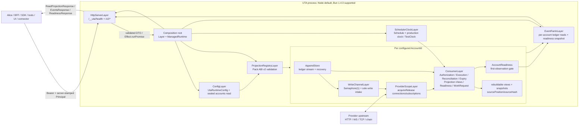
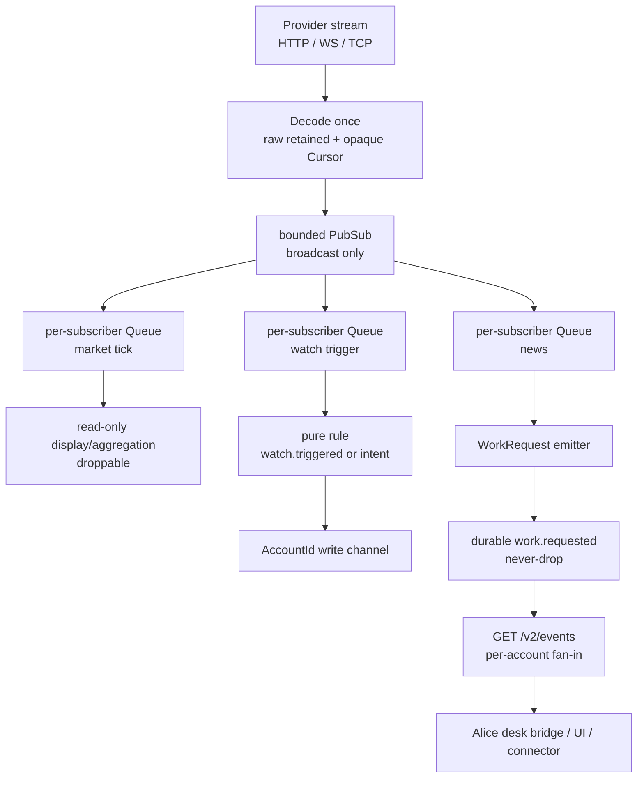
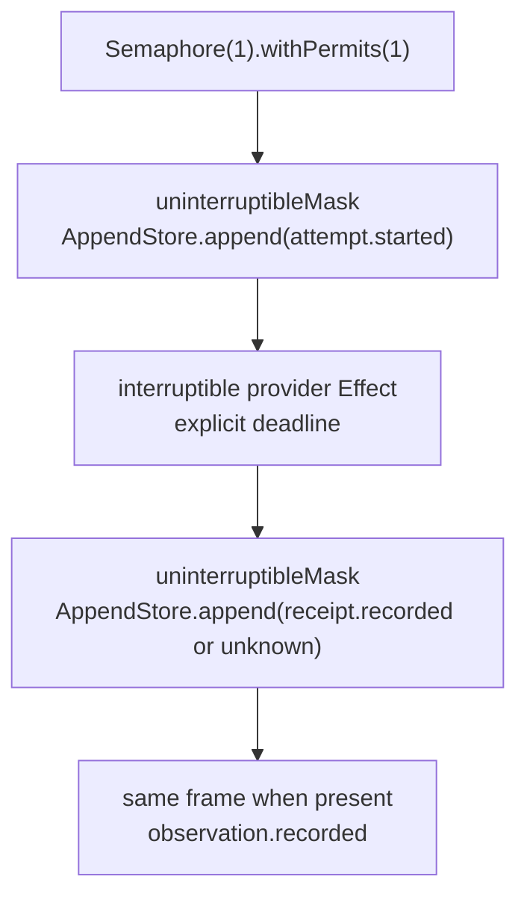

# 新 UTA — Runtime Architecture

**本文拥有：** 新 UTA 进程的运行时拓扑、`Layer` 组合根、Effect 约束边界、按 `kind` 路由的消费者、市场/新闻 fan-out、每个 `Account` 的唯一写入通道，以及启动和 drain 生命周期。本文不拥有分录字段的完整序列化、provider projection 的具体声明、wire endpoint 的完整清单、Issue desk bridge 的实现细节；这些内容分别由 `03-ledger-and-persistence.md`、`04-provider-projections.md`、`05-protocol-and-replacement.md`、`06-interaction-and-issues.md` 约束。

**本文展开的冻结决策：** D1–D12 中与运行时拓扑、边界、持久化交接、协议适配和 lifecycle 有关的部分，重点是 D2、D3、D4、D5、D7、D8、D9、D12。`00-decision-register.md` 的其余细节和 D13 仍对本文具有优先级；本文不得将架构图的语义箭头解释为第二条真相轴、第二个 durable event store 或 provider 事实来源。

**本文使用的类型：** `AccountId`、`ProviderId`、`ProjectionVersion`、`IntentId`、`ProposalId`、`DecisionId`、`AttemptNo`、`EntryId`、`LedgerPosition`、`EntryPosition`、`HeadPosition`、`IdempotencyKey`、`NativeKey`、`ProviderKey
`、`ProviderOrderRef
`、`ProviderEventId
`、`Instant`、`AsOf`、`Cursor`、`ConfigRevision`、`RequestId`、`OperationKind`；`DecimalString`、`Money`、`Qty`、`Duration`；`Principal`、`Origin`、`DecisionAction`；`ReadOnly<T>`、`ReadWrite<E, T>`；`UtaRuntimeConfig`、`AuthorizationPolicy`、`ConfigError`、`CapabilityStatus`；`ProviderDeclaration`、`ProjectionRegistry`、`ProviderEnvelope`、`OperationEnvelope`、`KeyEnvelope`、`ReceiptEnvelope`、`ObservationEnvelope`、`ConfigEnvelope`、`Operation
`、`Receipt
`、`Observation
`、`PlacementRecovery
`、`RecoveryResult
`；`PackModule<D>`、`LoaderValidationResult`、`Translation
`、`TransportPlugin`、`TransportRequest`、`TransportResult`、`WSExecutor`、`StreamChannel`、`ParseError`、`TransportCause`；`AppendStore`、`AppendResult`、`OpenResult`、`CloseResult`、`LedgerEntry`、`LedgerEntryWire`、`UnknownLedgerEntryWire`、`ReasonTree`、`intentOutcome`、`proposalOutcome`、`orderProjection`；`Consumer`、`RuleResult`、`checkpoint`；`ProcessState`、`AccountReadiness`、`ReadinessResponse`；`ErrorCode`、`ErrorEnvelope`、`CursorMap`、`EventsQuery`、`EventsResponse`、`EventItem`、`ReadProjectionResponse<T>`、`IntentProposalRequest`、`IntentProposalResponse`、`IntentListResponse`、`IntentDetailResponse`、`DecisionRequest`、`AuthorizationDecisionRequest`、`AuthorizationDecisionResponse`、`CommandResponse`、`WorkRequested`。这些类型只从其在 `spec/types/` 的所属模块进入实现，不用未登记的同义类型替代。

## 1. 运行时边界和拓扑

### 1.1 进程不变量

1. 新 UTA 必须是 TypeScript 进程；Node 是默认运行时，Bun `1.4.0` 通过 `--internal-role uta` 使用同一套源代码。不得为 Rust core、Node core、Bun core 维护两套业务实现。Wave-1 的 Node 26.8.1/Bun 1.4.0 合成测试在 100–200 个 WebSocket、5–10k requested msg/s 下没有序列缺口或解析错误，但该测试没有覆盖 provider 解码、重连风暴或 ledger 写入，不能被提升为容量 SLO（`local://w1-language-runtime.md:374-404`）。
2. 一个 `AccountId` 是一个 ledger stream、一个 `AppendStore` 和一个 write channel 的边界。跨账户读取可以并行；跨账户写入不得共享一个全局 Semaphore，也不得由一个全局 ledger `checkpoint` 代表。provider/channel 的 opaque `Cursor` 只属于对应 read stream。
3. `data/trading/<accountId>/ledger/` 是交易真相；ledger 是 stream。不得创建 outbox、第二个 durable event store 或 durable health journal；`data/event-log/events.jsonl` 不再承担任何 durable UTA 语义（D8；`00-decision-register.md:157-162`）。
4. `accounts.json` 仍是 Alice-owned sealed configuration，UTA 只读取；`data/config/uta-runtime.json` 由 Alice config routes 写入，UTA 通过 `ConfigLayer` hot-read。`configRevision` 永不持久化：先以不含 `updatedAt` 的 canonical semantic object 派生 `runtimeConfigDigest`，再以 canonical `{runtimeConfigDigest, accountConfigDigest, projectionVersion}` 派生每个 account 的 `ConfigRevision`，其中 `accountConfigDigest` 是 non-secret account row 的 digest。配置持久化、ledger、当前连接态、materialized view 各自有 owner 和生命周期，不能因为都落盘而合并（D5/A2；`00-decision-register.md:126,136`）。
5. 所有 `AccountId`、provider/resource id 必须先经 registry 解析，再进入文件系统或 provider。路径不得从裸 HTTP 字符串拼接；凭据以 injected values 进入 transport plugin，Pack 不得读取 `accounts.json`、`sealing.key` 或 sealed envelope（D1、D7）。
6. 图中的连线是 IO 和 ownership 的语义方向，不是额外进程、额外持久化流或额外 provider 真相。HTTP、fan-in、消费者和 scheduler 都消费同一 account ledger，而不是互相复制交易真相。

### 1.2 进程/模块图

当前 UTA 在 `services/uta/src/main.ts:41-128,147-193` 中由 `EventLog`、`ToolCenter`、`UTAManager`、snapshot work 和 order-sync poller 共同启动，账户初始化失败时只记录 warning 并继续；该做法不能作为新架构的隐式契约。新架构将每个失败映射为 account 级 `AccountReadiness` 或 global startup failure，绝不 warn-and-skip 后隐藏状态（D10；`00-decision-register.md:167-170`）。

## 2. Composition root 和 `Layer` 清单

### 2.1 组合原则

组合根是 UTA 内唯一允许把 `Layer` 组合成 `ManagedRuntime` 并调用 `Effect.runPromise` 的地方。所有 mandatory requirement 必须由显式 `Layer` 提供；不得用 `serviceOption`、optional handler、空实现或 `undefined` 把缺失能力降级为成功。Effect 的 `Context.Tag`/`Layer` 要求在组合根暴露缺失 service；动态 Pack 边界仍由 runtime validator 检查。该静态/动态两层边界由 D2 固定，且已经在 Effect sketch 中验证缺少 `Layer` 会产生 TS2345（`local://w1-effect-evaluation.md:26-38,53-158`）。

`ReadOnly` 与 `ReadWrite` 是通道方向的类型特化，不是 account 上的 `readOnly` boolean。只读 provider 不能构造 write handler；配置加载后 provider 的实际 `CapabilityStatus` 再决定该 account 的 kind 是否可用。所有 read-only reads 可被多个消费者使用，但所有 provider mutation 都只能进入对应 account 的 write channel。

下文以 `ConfigLayer`、`ProjectionRegistryLayer` 等命名组合根中的 Layer 绑定值；这些名称是实现模块标签，不是新增的 `spec/types` domain type。公开类型仍只使用本文件开头列出的注册词汇。

### 2.2 `Layer` 及资源边界

| Layer / 资源 | 数量与真实边界 | 拥有内容 | 必须提供/接受的契约 | 测试替换 |
|---|---:|---|---|---|
| `ConfigLayer` | 每个进程 1 个；Alice sealed `accounts.json` 与 Alice-written `data/config/uta-runtime.json` 是两个配置输入 | 解析环境、读取 sealed `accounts.json`、hot-read 并严格解析 `UtaRuntimeConfig`；不把凭据写入日志或 Pack | 输出已解析的 account config、`AuthorizationPolicy`、rule sets、projection activation、`runtimeConfigDigest` 和每个 account 的 `ConfigRevision`；`configRevision` 永不落盘；global config 解析失败阻止 boot，account config 失败进入 `AccountReadiness` | fixture config + malformed global/account cases；不可用时不得返回默认配置 |
| `ProjectionRegistryLayer` | 每个进程 1 个 registry；每个 configured account 解析一个 projection tuple | 读取 immutable active Pack release，验证 manifest、source digest、ABI v2、declaration、translation、transport；不安装包 | 输出 `ProjectionRegistry`、`ProviderDeclaration`、validated `PackModule<D>`；缺失/不安全能力显式 `CapabilityUnsupported`，声明冲突或 ABI invalid 按 account/global 失败规则处理 | in-memory registry + compiled file-URL Pack; loader failures must be observable |
| `AccountLedgerLayer` | 每个 `AccountId` 1 个 `AppendStore`、1 个 boot-time account lock | `data/trading/<accountId>/ledger/{head.json,segments/,quarantine/}`，replay、head、torn-tail/corruption result | 实现 `AppendStore.open`、`append(entries, expectedPosition)`、`replay(fromPosition)`、`head()`、`AppendStore.close(): Promise<CloseResult>`；只有该 layer 的 write channel 可调用 `append` | temporary ledger directory、torn tail、interior corruption、CAS conflict、durability failure、close |
| `AccountWriteChannelLayer` | 每个 `AccountId` 1 个 `Semaphore(1)` 和 1 个 logical intake | 排序 ledger append、provider mutation、consumer-generated intent；跨账户不共用 permit | 所有写请求均以同一 `IntentId`/`IdempotencyKey` 进入；第二个 intent 等待，不丢失；禁止任何 consumer 或 HTTP handler 直接调用 provider mutation/`AppendStore.append` | deterministic queue + `Semaphore(1)`; assert at most one provider mutation/account |
| `ProviderScopeLayer` | 每个 account/projection 的连接、session、subscription 各自有 `Scope` | provider HTTP executor、WS/TCP/chain session、heartbeat、stream `Cursor`；所有长生命周期资源用 `acquireRelease` | Promise-facing `TransportPlugin` 通过 adapter 进入 Effect；凭据为 injected values；deadline、close、cancel 成对 | fake transport with explicit release counter、disconnect and reconnect replay |
| `AccountConsumerLayer` | 每个 account 7 个 `Consumer` 逻辑边界；每个 consumer 自有 `checkpoint`、rule set、failure state | `Authorization`、`Execution`、`Reconciliation`、`Expiry`、`Projection/Views`、`Readiness`、`WorkRequest emitter` fibers | 按 `kind` 声明 subscription；按 ledger `position` 消费；`checkpoint: LedgerPosition` 只在其输出 durable 后推进；provider stream 另用 opaque `Cursor` | deterministic replay, checkpoint lag, unknown kind, rule pending/reject, restart |
| `ReadinessLayer` | 每个 account 1 个当前态计算；不是第二 durable stream | transport/readability/writability/capabilities/observation freshness/config 的当前 `AccountReadiness` | 输出 `ReadinessResponse` 所需 account data；不写 `account.health` durable journal，不把 process liveness 当 account writable | fake transport states + first-observation gate + stale observations |
| `EventFanInLayer` | 每个进程 1 个无状态 fan-in service；请求内按 account 读取 | 解析 `EventsQuery.cursors`，读取各 account ledger 后续项，附加一个当前 readiness snapshot | 输出 `EventsResponse`/`EventItem`/`CursorMap`；每个 account 保持 position order；跨 account 无隐含 global order；不写 ledger | multiple account stores, lagging positions, long-poll timeout, cursor invalid |
| `SchedulerClockLayer` | 每个进程 1 个 scheduler/clock；每个 schedule 由 consumer 声明 | `Schedule` for classified retries/reconciliation/expiry/polls；生产 clock 或 `TestClock` | 失败分类后才选择 schedule；TestClock 不自行前进；取消会停止 future work | `TestClock.adjust` + deterministic schedules; no wall-clock sleeps |
| `HttpServerLayer` | 每个进程 1 个 loopback server | Hono route、Bearer validation、business-route Principal stamping、Zod decode/encode、HTTP status/error adapter | `/__uta/health`、`/v2/readiness`、`/v2/openapi.json` 只需 bearer 且无 business Principal；其他 route 需 bearer + server-stamped `Principal`；`GET /__uta/health` 只表示 process liveness；`/v2/readiness` 表示 account readiness；`/v2/events` 只读 fan-in；所有 intent/decision 写入走唯一 channel | local server with real request path; no direct route-to-provider shortcut |

组合顺序必须是：`ConfigLayer` → `ProjectionRegistryLayer` → 每个 account 的 `AccountLedgerLayer`/`AccountWriteChannelLayer`/`ProviderScopeLayer`/`AccountConsumerLayer`/`ReadinessLayer` → `EventFanInLayer`/`SchedulerClockLayer` → `HttpServerLayer`。所有层都在根 `Scope` 下构造；根退出时先停止输入和 consumer，再关闭 provider scope 和 store。该顺序不是 provider 的自由排列；横切层顺序由组合根固定，provider 只提供末端 handler（D4；`plans/uta-refactor/design/01-detail-constraints.md:137-164`）。

`ConfigLayer` 与 `AccountLedgerLayer` 永远不共享 owner：Alice config routes 写入并 atomic-replace `data/config/uta-runtime.json`，UTA 只 hot-read；UTA 的 account write channel 只做 ledger append。`runtimeConfigDigest` 和每个 account 的 `ConfigRevision` 都是派生值，永不持久化。`AccountLedgerLayer` 的 on-disk lock 与进程内 `Semaphore` 是互补的：Semaphore 排序本进程任务，boot-time lock 和 expected-position CAS 防止 stale writer；不能把 Guardian 的全局 runtime lock 或 installer 的 `flock`/`lockf` 当成 ledger contract（`local://w1-ledger-persistence.md:79-86,94-110`）。

## 3. Effect containment points

Effect 只存在于 `services/uta` 的组合和 IO orchestration。`ledger/entries.ts`、`ledger/fold.ts`、`provider/indexed.ts`、`provider/recovery.ts`、`wire/v2.ts`、`issues.ts` 和 `AuthorizationPolicy` 是普通的 library-neutral records/sum types；`Effect`、`Layer`、`Scope`、`ManagedRuntime`、`Queue`、`PubSub`、`Semaphore`、`Cause`、`FiberFailure` 永不序列化。`Decimal` 也永不穿过 Pack ABI；money/quantity 跨边界只能是 canonical `DecimalString`（D2、D11）。

### 3.1 HTTP ingress containment

**入口：** Hono route 接收 `unknown` 的 method/path/query/body/headers；先验证 `Authorization: Bearer`。`/__uta/health`、`/v2/readiness`、`/v2/openapi.json` 是 bearer-only route，不要求 business `Principal`；其他 route 在 bearer 后必须取得 Alice server-stamped `Principal`。随后使用 `wire/v2.ts` 的 Zod schema decode 为 `EventsQuery`、`IntentProposalRequest`、`AuthorizationDecisionRequest` 或其他已命名 DTO。不得让 route 将裸 `string`/`number`直接传给 domain。

**进入 Effect：** business route 将已验证 DTO、`AccountId`/resource resolution、`Principal`（bearer-only route 则不带 business principal）和 request cancellation/deadline 交给 `runtime.runPromise`。BFF 只能使用 `x-uta-channel ∈ {read-only, read-write}`；lifecycle/simulator 分类必须另由 `x-uta-kind` 表达，不能借 channel 值猜测副作用。domain Effect 只返回已命名的 success record 或 expected error variant；HTTP route 不读取 provider class、ledger file 或 shared mutable account object。`intentId`、`proposalId`、`decisionId` 是 caller-generated stable identities，UTA 只验证并记录，永不分配。

**离开 Effect：** 一个且仅一个 HTTP adapter 将成功值编码为 `IntentProposalResponse`、`AuthorizationDecisionResponse`、`EventsResponse`、`ReadinessResponse` 或 `ReadProjectionResponse<T>`；将 expected error 映射为 `ErrorEnvelope` 和 HTTP status。`POST /v2/accounts/:id/intents` 的新 intent 为 201、同一 identity 的 duplicate 为 200；`POST /v2/intents/:id/decisions` 的新 decision 为 202、同一 `decisionId` 为 200。以下 mapping 是 `wire/v2.ts` 与 OpenAPI 的单一规范：

| `ErrorCode` / local result | HTTP status | 处理规则 |
|---|---:|---|
| `Unauthorized` | 401 | 缺失/错误 Bearer；business route 还缺少 server-stamped `Principal`；不得进入 domain。 |
| `InvalidRequest`、`CursorInvalid` | 400 | Zod/domain boundary decode 失败；不追加任何 ledger entry。 |
| `AccountNotFound` | 404 | registry 不认识 `AccountId`；不得触碰文件系统/provider。 |
| `LegacyRouteRemoved` | 410 | 旧 `GET /api/trading/uta/:id/quote/:symbol` 及其他 `/api/trading/*`、`/api/simulator/*` 路径只返回 `{code: LegacyRouteRemoved, replacement}`，不执行旧副作用。 |
| `CapabilityUnsupported` | 422 | account/provider 没有声明该 kind；这是 response，不是 `intent.proposed` entry；该 code 只用于 422。 |
| `ScopeMismatch`、`IntentExpired`、`IdempotencyConflict`、`DecisionConflict`、`ReversalTargetAlreadyExecuted` | 409 | domain 已知 scope/decision 冲突；保留原 ledger，不把冲突变成 provider outcome。 |
| `ProviderRejected` | 422 | provider 明确拒绝；保留 provider code/request id/raw 的结构化信息。 |
| `ProviderUnknown`、`ProviderTransportFailure` | 503 | 上游结果未知或 transport 暂时失败；调用方只能按 typed result 决定重试/对账，不能 blind retry。 |
| `ServiceDraining` | 503 | lifecycle 正在 draining；拒绝 non-durable queued commands，已经 durable 的 intents/decisions 保留供 restart。 |
| `ReadinessUnavailable` | 503 | readiness snapshot 不可用，或 `DurabilityFailure` 作为 HTTP-level error；structured diagnostics 必须同时出现在 readiness，不得重投 provider。 |
| `ProviderParseFailure` | 502 | provider payload 无法按 projection 翻译；保留 raw，不能返回成功 observation。 |
| `Timeout` | 504 | **仅** server overrun；provider-declared deadline、drain deadline 或 provider call timeout 均先成为 `ProviderUnknown`（503）并进入 witness/reconciliation。 |
| `InternalError` | 500 | unexpected defect 只返回安全 message；不得序列化 `Cause`/`FiberFailure`、secret 或 raw credential。 |

HTTP adapter 只映射这些 declared errors；decision failure 是 non-2xx `ErrorEnvelope`，绝不返回 `rejected` DTO。HTTP response 完成前，任何已经 durable 的 ledger entry 都不会回滚；response 不是 provider fact。

### 3.2 Pack loader ABI containment

**入口：** dynamic `import(fileURL)` 得到的 module namespace 先作为 `unknown`；`provider/abi.ts` 的 extended module-shape validator 必须验证 `PackModule<D extends ProviderDeclaration>` 的 API version、provider identity、declaration、按 `D` 的 supported write kind 映射出的 handler、translation、transport plugin(s)、stream manifest 和 serializable function result。验证结果只能是 `LoaderValidationResult`：`loaded{module}` 或 `invalid{code: ApiVersion|DeclarationInvalid|MissingHandler|NonSerializable|ProjectionIdentity, path}`；`supported` write row 没有可构造 witness 时必须在 load-time 以 `MissingHandler` 失败，不能延迟到 call-time。

**生成客户端边界：** vendor OAS/非 OAS source 只在 Pack build-time 生成并校验；generated OpenAPI clients 必须是 Effect-free，只能由 transport adapter 的 Promise wrapper 调用。generated-client value 不得进入 core serialization、ledger 或 wire；Pack loader 只接收经 validator 归一化的 records。

**业务值与 phantom：** Pack ABI 的业务参数和结果只能是 serializable records：validated config projection、injected credential values、`ProviderDeclaration`、`OperationEnvelope`、`KeyEnvelope`、`ReceiptEnvelope`、`ObservationEnvelope`、`ConfigEnvelope`、canonical decimal strings、stable IDs、tagged provider errors 和 raw payload/envelope。`ProviderEnvelope` 必须携带 `{providerId, projectionVersion, kind: OperationKind, payload}`；`P` 的 phantom 是 `(ProviderId, ProjectionVersion)`，从 `ProjectionRegistry` lookup 延续到 handler execution。in-memory `ProviderKey
`、`Receipt
`、`Observation
` 只能由 registry re-association 获得，不能以 `as` 猜 provider 或交换 role。

**控制值例外：** `TransportRequest` 可携带 `AbortSignal`、cancellation context 和 deadline；这些 control values 是 ABI 参数例外，不是 serializable business values，永远不得进入 ledger、wire 或任何持久化文件。Pack 不得 import `effect` 来满足 core 类型，也不得接收 `Layer`、`Scope` 或 `Semaphore`。

**归一化规则：** module 返回值先按 declaration 的 kind/channel parser 解码；module throw 的任意 `unknown` 值统一转换为 serializable provider error record，保留稳定 code、request identity、send-status 和 raw（若存在）。没有 declared handler 的 kind 变成 `CapabilityUnsupported`；不得把 missing method、empty list、`undefined` 或 swallowed throw 当成支持。所有 Promise rejection 必须在离开 ABI 前被归一化，core 不处理未标注的 `unknown`。

### 3.3 Provider transport adapter containment

transport adapter 是第三个且唯一把 Promise/SDK/network IO 放入 Effect 的点：以 `Effect.tryPromise` 包住 Promise-facing transport call，向 `TransportRequest` 注入 `AbortSignal`/cancellation control 和明确 deadline，并立即执行 error classification。transport call 仍须保持 interruptible；adapter 不得把 provider IO 或生成客户端对象藏进 core layer。

1. `TransportResult.responded{status, requestId?, rawBody, providerTime?, payload}`：先保留 `rawBody`，再由 `Translation` 产生 `Receipt
`；若 response 同时带真实 upstream state，产生关联的 `Observation
`。本地 append 是一个 frame，`receipt.recorded.receipt: ReceiptEnvelope` 与 `observation.recorded.observation: ObservationEnvelope` 必须同 frame durable。
2. provider 明确拒绝：转换为 `ProviderRejected`，保留 provider code、request id 和 raw；不能进入 `unknown` 或成功。`ReceiptEnvelope` 中 provenance 只对 `accepted` 有意义，`rejected`/`unknown` 均不携带 provenance。
3. `TransportResult.notSent{cause: ParseError|TransportCause}`：调用确认未发送；对同一 `IdempotencyKey` 的重投只能按 `ProviderDeclaration`/failure classification 决定，不能由通用 backoff 决定。
4. `TransportResult.unknown{cause, sendEvidence}`：timeout、disconnect、已发送但无 response，或 response 在 send evidence 之后到达但不可解码（`parseFailure`），都保留 attempt identity 并交给 `Reconciliation` 的 `PlacementRecovery
`；禁止 blind retry。进程重启不由 transport plugin 返回，而由启动/force-kill recovery 合成 `unknown{cause: processRestart}`；持久化时写 `receipt.recorded.receipt: ReceiptEnvelope` 的 `unknown{cause: timeout|disconnect|noResponse|processRestart|parseFailure}`。
5. 有 response 但在已发送证据之前或纯 read path 上无法按 projection 翻译时，转换为 `ProviderParseFailure`，保留 raw 供重解析；不得把 parse failure 填成空 observation。response 在 send evidence 之后无法解码的情形必须遵守上一项的 `unknown{cause: parseFailure}`，不能误报为确定的 parse failure。
6. active capability 缺席：转换为 `CapabilityUnsupported`；静态 write handler 不可构造，runtime declaration 也必须显式报告缺席。

provider call 本身保持 deadline-bounded 且 interruptible。`Effect.uninterruptibleMask` 只包下列 local durable append，不得包住 provider IO、网络读写、等待 Semaphore、Queue `offer/take`、HTTP ingress、scheduler sleep、response parsing、reconciliation read、backoff、view rebuild、`checkpoint` flush 或 scope close：

- `attempt.started` 在 provider call 前必须以 mask 内的一次 `AppendStore.append` durable；其 payload 的 `key` 必须是 `KeyEnvelope`。
- provider call 分类后，`receipt.recorded`（以及同 frame 的 `observation.recorded`）或 unknown 必须以同样方式 durable 后，才向调用者暴露结果。
- consumer 产生的 `intent.expired`、`recovery.resolved`、`reversal.appended`、`work.requested` 等 ledger append 也必须经过同一 local append mask，但该 mask 只覆盖 append call，不覆盖规则计算或 provider read。

因此 interruption 发生在 attempt 之后、receipt 之前时，进程不会伪造结果：ledger 保持 `attempt.started` without receipt，重启后由 `Reconciliation` 先追加 `receipt.recorded{unknown{cause:'processRestart'}}`，再运行 witness。local append 若 durability 失败，返回 `DurabilityFailure`/structured readiness failure；不能以成功 response 掩盖，也不能把 provider call 再执行一次。

## 4. Consumer contract 和 catalogue

### 4.1 所有 consumer 的共同契约

- 每个 `Consumer` 必须声明精确的 subscription kind set；路由只看 `kind`，不看 provider class、调用者路径或 payload 偶然字段。`work.requested` 是 `LedgerEntry` 的 kind，其 payload 是 `WorkRequested`，子 kind 由 `issues.ts` 的 discriminant 表达（D9；`TypesOwner` 已确认）。
- 每个 consumer 以 `(consumer, AccountId)` 拥有自己的 `checkpoint`，其持久化值是 `LedgerPosition` 对应的 `sourcePosition/sourceHash`；不得共用一个 mutable processed flag。`Cursor` 仅属于 provider/channel 的 opaque read stream，不能作为 consumer checkpoint 或全局账票游标；checkpoint 只按 ledger `position` 前进，不能按 `occurredAt`、到达顺序或墙钟时间排序。
- consumer 的纯 rule 是显式函数：所有 `LedgerEntry`、`intentOutcome`/`proposalOutcome`/`orderProjection`、`Observation
`、`AsOf`/freshness、`ProviderDeclaration`、`AuthorizationPolicy`、`UtaRuntimeConfig`、`ConfigRevision`、`Instant` 等输入都必须作为参数；规则不得读取 provider、当前时间、随机数、环境变量、文件或共享 mutable counter。结果必须是 `RuleResult`：allow、structured reject(`ReasonTree`) 或 pending(reason)。
- consumer output 先经过对应的 local handler；需要变更 ledger 时只能提交给该 account 的 `AccountWriteChannelLayer`。输出 durable 之前不能推进 `checkpoint`；view/output 持久化失败不能回滚 ledger，只能保持旧 `checkpoint`、标记失败并由 schedule 重试。
- 未知 kind、未订阅 kind 或 translation 尚未可用时必须保留原 entry 并报告 unconsumed/Unsupported；不得 `default` 到成功、跳过或空 payload。一个 consumer 的 reject/reversal 只阻止其自己的 side effect，不制造全局 upstream fact。

### 4.2 Catalogue

| Consumer | subscribed kinds / source | checkpoint ownership | pure rule inputs | outputs and side effects |
|---|---|---|---|---|
| **Authorization** | `intent.proposed`、`authorization.decided`、`intent.expired`；只消费 account ledger，不直接订阅 provider stream | `(Authorization, AccountId)` 的 `checkpoint: LedgerPosition`；decision idempotency/result 只能在自己的 view 中恢复，不能改写 ledger | `intentOutcome`、`proposalOutcome`、`AuthorizationPolicy`、intent scope/hash、`ConfigRevision`、显式相关 `Observation
`/freshness、判定 `Instant`、`Principal` | policy 可产生 `authorization.decided`；规则拒绝追加 `reversal.appended` + `ReasonTree`；manual request 经 `AuthorizationDecisionRequest` 进入同一入口；duplicate `DecisionId` 返回既有 result，不追加第二 entry；pending 保持 intent visible，由 WorkRequest emitter 产生 `intent.awaitingAuthorization`。不调用 provider mutation。 |
| **Execution** | `intent.proposed`、`authorization.decided`、`intent.expired`、`attempt.started`、`receipt.recorded`、`recovery.resolved`、`observation.recorded`、`reversal.appended`；用这些 entry 判断 intent 是否仍可执行 | `(Execution, AccountId)` 的 `checkpoint: LedgerPosition`；执行状态只由 ledger fold 恢复，不保存第二个交易真相 | `intentOutcome`、`ProviderDeclaration`/`CapabilityStatus`、operation kind/payload、attempt number、account `ConfigRevision`、first-observation `AccountReadiness`、显式 observation/freshness、deadline/判定 `Instant` | 通过唯一 write channel 按 position 顺序追加 `attempt.started`，其 `key` 必须是 `KeyEnvelope`；调用 provider transport；追加 `receipt.recorded`，其 `receipt` 必须是 `ReceiptEnvelope`，response 内含观察时同 frame 追加 `observation.recorded`，其 `observation` 必须是 `ObservationEnvelope`；明确 not-sent proof 可追加 `attempt.abandoned`；未尝试且 `expiresAt` 已过可追加 `intent.expired`；unknown cause 只能是 `timeout`、`disconnect`、`noResponse`、`processRestart` 或 `parseFailure`，只追加 unknown receipt，交给 Reconciliation，绝不 blind retry。 |
| **Reconciliation** | `intent.proposed`、`attempt.started`、`receipt.recorded`（尤其 unknown）、`recovery.resolved`、`observation.recorded`；provider keyed-read/observation stream 是显式 read-only source | `(Reconciliation, AccountId)` 的 ledger `checkpoint: LedgerPosition`，另持每个 provider/channel 的 opaque `Cursor`；两者不可合并成 global cursor | intent 的稳定 `IdempotencyKey`、attempt、unknown cause、`ProviderDeclaration`、`PlacementRecovery
`/`RecoveryResult
`、最新带 `AsOf` 的 observation、`maxUnknownDuration`、`Instant` | 查询 upstream（只读）；`found` 必须在一个 frame 追加 recovered `receipt.recorded`（`ReceiptEnvelope`）+ `observation.recorded`（`ObservationEnvelope`），随后追加的 `recovery.resolved.result.found` 只引用同 frame 的 `{receiptEntryId, observationEntryId}`；`confirmedAbsent` 追加 `recovery.resolved` 和合法 `attempt.abandoned`；`ambiguous`/预算耗尽的 `stillUnknown` 追加 `recovery.resolved` 并由 WorkRequest emitter 产生 review request；manual recovery 是 `manual` result，`resolution` 只能是 `abandon`、`continue` 或 `awaitingReview`，并携带 `principal`，与 `DecisionAction` 不同；discrepancy 可追加 `work.requested` 或新的 compensation `intent.proposed`，但永不直接重复 provider mutation。 |
| **Expiry** | `intent.proposed`、`authorization.decided`、`attempt.started`、`intent.expired`；不订阅普通 market/news | `(Expiry, AccountId)` 的 `checkpoint: LedgerPosition`；expiry output durable 后才推进 | `expiresAt`、`intentOutcome`、是否已有 `attempt.started`、policy threshold、显式 `Instant` | 在 `expiresAt` 到达且尚无 `attempt.started` 时追加 `intent.expired`；已经开始 attempt 的 intent 不得被 expiry 伪造为 expired；无 provider IO，无 reversal 删除。append conflict/durability failure 留在 checkpoint 之前并按 schedule 重试。 |
| **Projection/Views** | `intent.proposed`、`authorization.decided`、`intent.expired`、`attempt.started`、`attempt.abandoned`、`receipt.recorded`、`recovery.resolved`、`observation.recorded`、`reversal.appended`、`work.requested`；未知 kind 留在 unconsumed 集合 | `(Projection/Views, AccountId)` 的 `checkpoint: LedgerPosition`，文件保存 `sourcePosition/sourceHash`；view 可重建，失败不影响 ledger | position-ordered `LedgerEntry`、纯 `intentOutcome`/`proposalOutcome`/`orderProjection`、provider registry re-association、latest `AsOf` observation、明确 view schema version | 写 rebuildable materialized views、order/history/proposal projections 和 observation-derived snapshots；HTTP 只读返回对应的 `ReadProjectionResponse<T>`；视图失败只报告 stale/rebuild-required，不写 provider、不追加 upstream fact、不修改 ledger。legacy archive history 以 `source: legacy-archive` read-only projection 连续呈现，不转换成新 entries。 |
| **Readiness** | `observation.recorded`、`attempt.started`、`receipt.recorded`、`recovery.resolved`；并接收 provider transport lifecycle、config load、projection validation、consumer failure 等非-ledger runtime signals | `(Readiness, AccountId)` 的 `checkpoint: LedgerPosition` 用于按 ledger position 重建 freshness/context；current runtime state 不写 durable health journal | `ProcessState`、transport state、`AccountReadiness` inputs、`ProviderDeclaration`/`CapabilityStatus`、`UtaRuntimeConfig`/`ConfigRevision`、first-observation gate、latest `AsOf`/freshness、ledger fold、explicit `Instant` | 更新当前 `AccountReadiness`（transport/readable/writable/capabilities/observationFreshness/config），其 `writable` 必须是 tagged `ok` 或 `blocked{reason}`，供 `/v2/readiness` 和每次 `EventsResponse` 的一个 readiness snapshot 使用；process liveness 仍由 `/__uta/health`；配置错误保持 `ConfigError` 结构；不追加 `account.health`，不把 stale/healthy 计算写成 upstream fact。 |
| **WorkRequest emitter** | ledger triggers：`intent.proposed`、`authorization.decided`、`attempt.started`、`receipt.recorded`、`recovery.resolved`、`observation.recorded`、`reversal.appended`；另接 market/news bounded streams，不把 readiness change 当 ledger trigger | `(WorkRequest, AccountId)` 的 ledger `checkpoint: LedgerPosition`；market/news 各自保留 provider/channel `Cursor`；`requestId`/causal entry id 去重只在 ledger/write channel 内完成 | causal `LedgerEntry`/`EntryId`/position/why、`ReasonTree`、policy-derived `authority`、intent/proposal hashes、last relevant `AsOf`/freshness、provider identity/projection version、market/news observation、canonical Markdown `what`、`expiresAt`、`Instant` | 追加 `work.requested` + `WorkRequested`：`review.unknownOutcome`、`review.ambiguousRecovery`、`review.ruleRejection`、`reconcile.discrepancy`、`intent.awaitingAuthorization`、`watch.triggered`、`news.received`。`freshness.asOf` 必须嵌套且不得有 top-level `asOf`；`admissibleDecisions` 对 `review.*`、`reconcile.*`、`intent.awaitingAuthorization` 非空，对 `watch.triggered`/`news.received` 可为空；`review.ruleRejection` 还必须携带 `{consumer, ruleId, configRevision, reasonTree}`；由 `watch.triggered`/`news.received` 派生 intent 时，`Origin` 必须使用对应的 `watch{sourceEntryId, sourcePosition, cursor?, eventId?}`/`news{sourceEntryId, sourcePosition, cursor?, eventId?}` variant；entry 不带 authority to execute，不写 Alice Issue。Alice desk bridge 通过 `/v2/events` 读它；readiness notifications 只进入 fan-in snapshot。 |

### 4.3 关键 consumer 输出约束

- `Authorization`、`Execution`、`Reconciliation`、`Expiry` 和 `WorkRequest emitter` 是 ledger writers 的 logical producers，但不是独立 writer；它们提交给同一 account write channel。`Projection/Views` 和 `Readiness` 可写自己的 rebuildable/current-state store，但不可写 ledger 的第二副本。
- `Execution` 是七个 consumer 中唯一可以把已授权 operation 交给 provider write handler 的 consumer。market watch 只能通过纯函数产生 `intent.proposed`，news 只能通过 `WorkRequest emitter` 产生 `work.requested`；二者没有 emergency provider path。
- `Reconciliation` 只消费 upstream observations 来解释 attempt/intent；receipt 不是 fact。`confirmedAbsent` 是 constraint 文档 `MissingRemote` 的 canonical name；它只有在 declaration 的 read-by-key coverage/window verified 且 attempt 在 window 内才成立。duplicate-probe rejection 只能证明 presence，不能证明 absence（D3；`00-decision-register.md:69-77`）。
- `Readiness` 的 `writable` 只在 first-observation gate 成功、config/projection/readability/capability/rule 条件全部满足时为 `ok`；没有 observation 的 account 必须明确保持 `blocked{FirstObservationRequired}`，不能以旧 cache、默认余额、`1:1` FX 或 process `ok:true` 推断可写。
- D4 fold 没有 `recorded` status；`authorization.decided` 的 `withdraw` 若发生在 `attempt.started` 后仅是 audit entry，Execution outcome 不变。manual recovery 必须通过 `recovery.resolved{result: manual{resolution: abandon|continue|awaitingReview, principal}}` 表达，与 `DecisionAction` 不同。
- Alice 的 typed decision bridge 必须先处理 `DecisionRequest{decisionId, action, scopeHash}`，解析 scope 后再转发 `AuthorizationDecisionRequest{decisionId, action, scope, scopeHash}`；`AuthorizationPolicy.selfApprove` 不得包含 `system`，UTA 记录 Alice server-stamped `Principal`。
- `Readiness` 构造必须检查 `ProcessState=draining` 时 `writable` 为 `blocked{Draining}`、`config-invalid` 时为 `blocked{ConfigInvalid}`、unreadable/disconnected 时为 blocked；`capabilities` 必须为每个 declared kind 保留一行，`maxProviderConnections` 不得低于 100。

## 5. Market/news fan-out、backpressure 和 fan-in

### 5.1 三种不同的流

1. **Ledger fan-out：** 每个 account ledger 的 durable entry 可以被七个独立 consumer 读取；每个 consumer 有自己的 `checkpoint`，允许 lag。ledger append 完成后才发布通知；通知丢失只会使 consumer 从 `checkpoint` 对应的 `LedgerPosition` replay，不会丢掉 entry。
2. **Market/news stream fan-out：** provider connection 只 decode 一次，产生带 source/time 和 provider/channel opaque `Cursor` 的 immutable value，再通过 bounded `PubSub` 广播给独立 subscribers。`PubSub` 表示广播；每个 subscriber 的 bounded `Queue` 表示该 consumer 的竞争消费 mailbox，不能把一个 `Queue` 误当作广播或 durable stream。
3. **`GET /v2/events` fan-in：** `EventFanInLayer` 按 `EventsQuery.cursors?: CursorMap` 对多个 account 做只读 long-poll，`CursorMap` 的值是各 account 的 `LedgerPosition`，保留每个 account 的 position order，并附一个当前 `AccountReadiness` snapshot。`EventItem` 必须是 `{source, accountId, position, entry: LedgerEntryWire | UnknownLedgerEntryWire}`；entry 绝不能是 bare `ProviderEnvelope`，correlation 在 entry 内。`wait` 最大 25000 ms；到 deadline 返回 HTTP 200、空 `items` 和不变的 `nextCursors`；省略 cursor 从 head 开始，`limit` 默认 500、最大 2000。跨 account 不声明总序；此 endpoint 没有 SSE，不能 ack、append 或替 consumer 持有 cursor（D8）。

### 5.2 Queue class and full-queue policy

所有 queue/pubsub buffer 必须是 bounded，容量是 `UtaRuntimeConfig` 中可验证的 finite setting 或固定实现常量；不得使用无界数组掩盖消费者退化。每个 subscriber 独立计数、lag 和 failure state，不能让一个慢 UI subscriber 直接阻塞所有 account writes。

| 输入 class | 例子 | 是否允许 drop | 满载行为 | 事实/恢复要求 |
|---|---|---|---|---|
| **Display market ticks** | quote/tick/book delta 只用于 UI、聚合、非交易展示 | **允许** drop/coalesce；按 `(ProviderId, channel, NativeKey)` 保留最新值 | 不阻塞 provider reader；丢弃旧值并标记 freshness/gap | 允许丢的是瞬时 read value，不是 ledger entry。若 consumer 需要连续性，必须用 provider 声明的 opaque `Cursor` 做 snapshot/backfill；没有 replay/gap contract 时 readiness 显式 degraded，不能假装连续。 |
| **Ledger-relevant observations** | account/order/fill observations、provider event 供 `Reconciliation`/`Projection/Views` | **禁止** drop | `Queue.offer` backpressure；producer 等待或按 provider `Cursor` 恢复；不得用 drop-oldest | durable observation append/consumer output 完成前不推进 consumer `checkpoint`；source gap 必须显式报告，不能由本地状态补造。 |
| **Watch trigger / order-modify input** | market observation 经纯规则产生的 `watch.triggered` 或新 `intent.proposed` | **禁止** drop | 独立 bounded queue backpressure；写 channel 忙时等待，不另开 provider write；已产生的 intent 必须保留相同 `IdempotencyKey` | 触发事件必须有 source event/opaque provider `Cursor` causal identity。若 provider 无 pause 且无 replay，禁止启用 never-drop watch capability，返回/记录 `CapabilityUnsupported` 或 readiness failure，不静默丢弃。 |
| **News to Issue** | news observation 产生 `news.received` `WorkRequested` | **禁止** drop | 每 account/consumer 独立 bounded queue；backpressure 到 provider；WorkRequest entry durable 后才对 fan-in 可见 | Alice desk bridge 的 Issue/link delivery 在 UTA 外；UTA 只追加 `work.requested`，不写 Issue，不把 news body 伪装成 upstream trading fact。 |
| **Readiness current state** | transport/readable/writable/capability/freshness change | **允许 latest-only** | 新状态替换旧状态；`EventsResponse` 每次只附当前 snapshot | readiness 不进 ledger、不进 `data/event-log/events.jsonl`；任何交易决策仍需显式 observation/config inputs。 |

Effect `Queue` 满载时的 suspension、shutdown、`PubSub` subscription 生命周期必须在 scope 中可观察；consumer cancellation 不能导致 raw provider stream 永久泄漏。对 never-drop class，如果上游没有可暂停能力，也没有 `ObservationCursorContract` 的 replay/backfill，则“永不丢”无法实现，必须拒绝该 subscription，而不是扩大内存或声称 best effort 足够。

### 5.3 Fan-in 的 cursor 规则

- `/v2/events` 的输入是 `EventsQuery`，其中 `cursors` 是可省略的 `CursorMap`（`AccountId → LedgerPosition`）；每个值独立解析，无效值返回 `CursorInvalid`，不读取任何 path-derived account。provider stream 的 opaque `Cursor` 不得放入这个 map。
- 读取从各 account 的 requested `LedgerPosition` 之后开始；省略 cursor 表示从该 account 的 head 开始；同一 account 永远按 position 返回。等待只等待 durable ledger notification 或 bounded `wait ≤ 25000 ms` 到期；wait deadline 返回 HTTP 200、空 `items` 和 unchanged `nextCursors`，不产生 ledger entry。`Timeout` 只用于 server overrun。
- UI、Issue bridge、connector 各自保存自己的 `CursorMap`；bridge 只有在 Issue/link store 写入后才推进自己的外部 cursor，bridge wait 使用 `min(pollIntervalMs, 25000)`。UTA 不替 Alice 保存 desk cursor，且不因下游 lag 阻塞 account writer。
- 每个 `EventItem.entry` 都是 `LedgerEntryWire | UnknownLedgerEntryWire`，从 entry 内的 correlation 读取 intent/attempt/provider identity；readiness snapshot 是 response item，不是 durable event。`account.health`、重连、snapshot taken/skipped 等旧 event-log 记录不被复制进新 ledger；需要下游看到的交易关联必须通过 D4 的 declared entries 或 `work.requested` 表达。

## 6. 每个 account 的唯一 write channel

### 6.1 线性化边界

一个 account 只有一个 logical write intake，顺序如下：

1. ingress、policy、Expiry、Reconciliation、watch rule 或其他 producer 先产生已验证的 intent/decision command；它们不得调用 provider mutation。
2. `AccountWriteChannelLayer` 获取该 account 的 `Semaphore(1)`。等待 permit 是可 interruptible 的；不能为每个 caller 临时创建第二个 permit 或第二个 queue。
3. 在 permit 内，以当前 `AppendStore.head()` 和 expected position 执行必要 local append。ingress 的 `intent.proposed` 是立即 append 的，不是先放进一个可能丢失的 staging buffer；第二个 intent 只能等待，不能丢失。
4. `Execution` 在同一 permit 内先 durable `attempt.started`，再调用 provider；provider call 未完成时禁止另一 mutation 触达同一 account/provider endpoint。
5. provider result 经过 3.3 的 classification 后，以同一个 intent key/attempt identity durable `receipt.recorded` 或 `unknown`；embedded observation 和 receipt 必须同 frame。只有 append durable，才向 HTTP caller 或 downstream consumer 暴露结果。
6. `AppendResult.Conflict` 是 writer/migration/tooling conflict，不是 intent outcome；必须保留 expected/actual 并让 caller 重新读取/处理，不能覆盖、重排或把 Conflict 当 provider reject。`DurabilityFailure` 同样是 local persistence failure，不得重投 provider。

`Projection/Views`、`Readiness`、`EventFanInLayer` 可以并行读；它们绝不可绕过 write channel 写 ledger。cross-account `Promise.all` 只表示不同 account 的独立 channel 并行，不构成跨账户 atomicity；`proposalId` 也不提供 provider-level atomicity。

### 6.2 `uninterruptibleMask` 的最小范围

下面是唯一允许的形态：

- `uninterruptibleMask` 只覆盖一次 local `AppendStore.append` 及其必要的 local durability acknowledgement。不得覆盖 `Queue.take/offer`、Semaphore wait、provider HTTP/WS/TCP call、provider response parsing、reconciliation read、backoff、HTTP response、view rebuild 或 scope close。
- provider I/O 即使位于一次 write operation 中仍必须保持 deadline-bounded、interruptible。drain 不得因 socket 无响应永远卡在 uninterruptible region；deadline 后必须分类为 `ProviderUnknown` 并尝试 durable unknown append。
- 若进程在 `attempt.started` 后崩溃，或 unknown append 的 durability 尚未完成，restart 一律按“attempt without receipt”处理；Reconciliation 必须先在同一 write channel 追加 `receipt.recorded{unknown{cause:'processRestart'}}`，再运行 witness；不能用内存 response、HTTP timeout 或本地 view 推断 accepted/absent。
- 一个 multi-entry append（human one-shot 的 `intent.proposed` + `authorization.decided`，或 receipt + embedded observation）必须是 `AppendStore` 的一个 atomic frame；不能以多个 mask/多个通知拼出伪事务（D5；`00-decision-register.md:117-129`）。

## 7. Startup sequence

新进程在 HTTP ready 前必须完成下列有序阶段。任何阶段都不得以空配置、空 provider、默认 FX、旧 in-memory state 或 swallowed error 继续。

### 7.1 六步启动清单

1. **Config parse。**
   - 解析 `OPENALICE_HOME`、`OPENALICE_APP_HOME`、`OPENALICE_UTA_PORT`、bearer token、launcher mode 和 `UtaRuntimeConfig`；从 Alice-owned sealed `accounts.json` 读取 account declarations/credentials，但不把 secret 复制到日志、ledger 或 Pack release。`data/config/uta-runtime.json` 由 Alice config routes 写入，UTA 通过 `ConfigLayer` hot-read；写入是 strict-schema whole-replace atomic operation。
   - 先解析并校验 `AccountId`/resource ids，再建立任何 path。由 canonical semantic object（排除 `updatedAt`）派生 `runtimeConfigDigest`，再以 canonical `{runtimeConfigDigest, accountConfigDigest, projectionVersion}` 派生每个 account 的 `ConfigRevision`，其中 `accountConfigDigest` 只来自 non-secret account row；`configRevision` 永远不持久化。全局 config、port、token、runtime config schema 失败：记录 structured startup error，**不绑定 HTTP、退出非零、Guardian 保持 UTA offline**。
   - 单个 account config invalid：不得 warn-and-skip；以 `ConfigError{path, code, message}[]` 建立 `AccountReadiness.config-invalid`，其 `writable` 必须是 `blocked{ConfigInvalid}`，不构造 provider 或文件 path；其他 valid accounts 继续后续阶段。

2. **Migrations。**
   - 在 migration/config bootstrap lock 下运行 pending migrations，包含 registry migration `0044`；migration body 自己保证 per-account idempotency，并显式备份/归档 `data/trading/`，因为通用 config backup 不覆盖它。
   - 对每个 legacy `commit.json` 保留 `data/trading/<accountId>/legacy/commit.json` 与 digest，建立 fresh ledger；legacy history 只作为 `source: legacy-archive` read-only projection，不转换为 `LedgerEntry`，不携带 authorization/placement authority。`crypto.guards`/`securities.guards` sections 按 migration 删除并保留 backup；ephemeral account 的现有 wipe rule 是唯一明确的 retention exception。
   - global migration failure、archive/digest validation failure 或 partial migration 无法安全 resume：migration journal 不标记完成，**阻止整个 boot/HTTP ready**；保留原文件、partial marker 和 structured report，operator retry 只能幂等恢复，不能 dual-write 或重复转换。

3. **Projection load/validate。**
   - `ProjectionRegistryLayer` 读取 immutable active release，验证 API v2、manifest/checksum/realpath containment、`ProviderDeclaration`、capability table、translation、transport plugin 和 stream manifest；UTA 不运行 package manager。loader 的动态结果必须是 `LoaderValidationResult`，不能以空 handler 继续。
   - registry infrastructure/active pointer/schema/source validation failure：**global startup failure**，不暴露半成品 HTTP。选定 account 的 pack 缺失或不能构造：将该 account 的 readiness `config` 置为 `config-invalid`，用 `ConfigError{path, code, message}[]` 保留 loader failure 的 path/code，`writable` 必须为 `blocked{ConfigInvalid}`，不得构造 provider；provider credential probe 失败：`transport` 必须为 `disconnected`（带 `since`/`lastError`），`writable` 必须为 `blocked{TransportDisconnected}`；其他 account 可继续，且不得 silently fallback 到 Mock。
   - declaration 显式缺失的 kind 是正常 partial capability：读取 capability/status 可见，写入返回 `CapabilityUnsupported`；对于缺少 D3 `PlacementRecovery
` witness 的 write kind，account `writable` 必须是 `blocked{NoPlacementRecovery}`。

4. **Ledger open/recovery。**
   - **首先**验证该 account 的 migration `0044` completion marker、immutable legacy archive `data/trading/<accountId>/legacy/commit.json` 及其 recorded digest；marker 缺失/无效、archive 缺失或 digest mismatch 必须成为 structured recovery failure，禁止继续 fresh-ledger open，禁止把 archive 当作不存在，也禁止静默转换。只有 marker/archive 验证通过，才解析 path、取得 per-account lock、调用 `AppendStore.open()`。
   - `AppendStore.open()` 检查 `head.position`、record bytes、checksum/hash chain 和 contiguous valid prefix；frame 遵守 `<64-hex sha256><space><canonical JSON body>\n`，digest 只覆盖 canonical JSON body bytes（body 含 `prevHash` 和 `position`），prefix、space、LF 不计入 digest。`EntryPosition` 从 1 起，`HeadPosition` 可为 0；按 persisted position replay。
   - `Open`：建立每个 consumer 的 `checkpoint: LedgerPosition`，文件保存 `sourcePosition/sourceHash`，若 source hash 不匹配则从 ledger rebuild。`TornTail{quarantined}`：原始 bytes 和 structured report 必须保留；valid prefix 可供读取，但 account 至少保持 `writable: blocked{reason:{kind:'LedgerUnreadable',open:'TornTail',at?}}`，直到 recovery policy 明确分类；若无法保留 quarantine capacity，则使用 `writable: blocked{reason:{kind:'QuarantineCapacityExceeded',quarantined,capacity}}`；绝不把 tail 当不存在。`Corrupt{at}`/interior hash break：该 account `readable: {kind:'unavailable',open:'Corrupt',at}`、`writable: blocked{reason:{kind:'LedgerUnreadable',open:'Corrupt',at}}` 并报告 structured readiness failure，不能跳过损坏继续读后面的 entries。
   - replay 必须保留 unknown/unconsumed kinds 和 raw provider envelope；已知 kind 的 payload shape mismatch 是 `Corrupt`，不是 `UnknownLedgerEntryWire`。任何 view/checkpoint restore failure 只影响该 view/consumer，不改 ledger；checkpoint 从 safe source position rebuild。
   - 所有 account Ledger Layer、write channel、consumer scope 和 provider scope 在此阶段构造，但尚未解除 first-observation gate。没有 `attempt.started` 的 intent 可恢复为 pending；对每个 `attempt.started` without receipt，Reconciliation **先**通过同一 write channel 追加 `receipt.recorded{unknown{cause:'processRestart'}}`，再运行 witness，不能先 witness 或以旧 view 推断结果。

5. **First-observation gate。**
   - 每个 account 初始 `writable: blocked{FirstObservationRequired}`。在任何 provider mutation 前，以 read-only capability 完成一次成功 upstream observation pass；该 pass 的 `AsOf`、source、freshness 和 provider `Cursor` 是显式输入，不能用本地 cache/默认值替代。
   - gate 成功且 config、projection capability、transport/readability、consumer recovery 均满足时，更新 `AccountReadiness.writable{ok}`；gate 失败、transport offline、ledger recovery pending 或 capability incomplete 时保持对应 tagged `blocked{reason}`：transport offline 使用 `TransportDisconnected`，ledger recovery 使用 `LedgerUnreadable`（其 `open` 为 `TornTail`/`Corrupt`/`DurabilityFailure`），缺少 placement witness 使用 `NoPlacementRecovery`（携带非空 `OperationKind` 列表）；reason precedence 固定为 `Draining > ConfigInvalid > LedgerUnreadable > TransportDisconnected > FirstObservationRequired > QuarantineCapacityExceeded > NoPlacementRecovery`，记录 structured reason，并由 classified `Schedule` 安排 read-only retry。失败 account 不阻止其他 account，但状态必须在 `/v2/readiness` 可见。
   - initial pass 发现 attempt without receipt 时，必须先完成上一阶段的 restart-unknown append 和 Reconciliation witness，再允许 account writable；不得先开放写入后补 reconciliation。first-observation gate 的成功不是一笔交易确认，也不能把 process health 当 upstream observation。
   - scheduler/clock 在 gate 前建立，production 使用 real clock，测试注入 `TestClock`；Schedule 只能在 transport/parse/provider outcome 分类之后选择，不能对 unknown write 做 generic retry。

6. **HTTP ready。**
   - 只有 global config、migrations、registry/runtime Layer 和 HTTP route construction 成功，且每个 account 都已经有明确的 gate/readiness state（成功或 structured pending/unavailable），才 bind `127.0.0.1:OPENALICE_UTA_PORT` 并宣布 ready。offline account 不会无限阻塞整个 process，但不能被标成 writable。
   - `GET /__uta/health` 返回不变的 `{ok:true,startedAt,utas}`，`ok` 只表示 process listener/liveness；`/v2/readiness` 返回 `ProcessState` 和 `AccountReadiness[]`，其中 `writable` 只有 `ok | blocked{reason}`，区分 config、transport、readable、writable、capabilities、observationFreshness。所有三个 bearer-only routes `/__uta/health`、`/v2/readiness`、`/v2/openapi.json` 均不建立 business `Principal`；其他 routes 仍需 bearer + server-stamped `Principal`。
   - 本文的 `writable: blocked{X}` 是简写；实际 readiness record 必须含 `kind:'blocked'`、`reason.kind:'X'` 及 `secondary` 字段，reason 的 variant-specific fields 和 precedence 以 `readiness.ts` 为准，不能把 `secondary` 中的 reason 当成新的主状态。
   - `/v2/readiness` 是本地 snapshot，只响应 200 或 503，绝不响应 504；HTTP ready 之前不接受 intent/decision。ready 之后所有 write request 先检查 lifecycle，再经 Zod decode、registry resolution 和 account write channel。未知 legacy path 返回 410，不调用旧 handler。

### 7.2 Startup failure outcome matrix

| 阶段 | global failure | account-scoped failure | 可否 HTTP ready |
|---|---|---|---|
| Config parse | process exits; no listener; no partial runtime | account `config-invalid`, `ConfigError{path, code, message}[]`, `writable: blocked{ConfigInvalid}`, no provider/path | global no；account failure 可在其余全局条件满足后 ready |
| Migrations | journal unchanged/partial report retained; operator retry; no listener | `0044` cannot safely isolate a failed account, so migration body fails global and no listener | no |
| Projection validation | malformed active release/registry contract blocks root | selected account pack unavailable → `config: config-invalid`, `ConfigError{path, code, message}[]`, `writable: blocked{ConfigInvalid}`；credential probe fails → `transport: disconnected`, `writable: blocked{TransportDisconnected}` | global valid 时可 ready；该 account 不可写 |
| Ledger open/recovery | impossible root/store contract, marker/archive validation failure or lock owner ambiguity blocks root | `TornTail{quarantined}` explicit with `writable: blocked{reason:{kind:'LedgerUnreadable',open:'TornTail'}}` or `writable: blocked{reason:{kind:'QuarantineCapacityExceeded',quarantined,capacity}}`; interior `Corrupt{at}` has `readable: {kind:'unavailable',open:'Corrupt',at}` and `writable: blocked{reason:{kind:'LedgerUnreadable',open:'Corrupt',at}}` | global valid 时可 ready；受影响 account readiness visible |
| First-observation gate | required read-only infrastructure absent => root not ready | offline/timeout/old observation => account pending with tagged blocked reason and classified retry | yes only after every account has explicit state |
| HTTP construction/bind | no `/__uta/health` or `/v2` server; process exits | n/a | no |

## 8. Drain 和 force-kill recovery

### 8.1 正常 SIGTERM/SIGINT drain

1. **原子切换 lifecycle。** signal handler 将 `running → draining`；重复 signal 不重入第二个 drain。切换与 HTTP/write intake 共用一个 lifecycle state check，避免 signal race 中接受新 intent。
2. **拒绝非 durable queued commands。** 在原子切换的同一边界，尚未 durable append 的 `IntentProposalRequest`、`AuthorizationDecisionRequest` 及其他会产生 provider mutation 的 queued commands 必须以 `ServiceDraining`（HTTP 503）拒绝，不追加半成品 entry；已经 durable 的 intents/decisions 不删除，保留供 restart。
3. **停止新调度和 streams。** 取消 poll/expiry/reconcile retry fibers，停止接受新的 market/news fan-out；lossy display queues 可立即 shutdown，never-drop queue 先处理已接受值或以 provider `Cursor`/end reason 关闭。不得在 drain 开始后启动新 provider mutation。
4. **按 drain budget 完成 active attempt。** 每个 active attempt 的 effective deadline 必须是 `min(provider-declared deadline, drainBudget)`，其中 `drainBudget = launcherGrace − 1000 ms`；provider I/O 仍 interruptible，不能被 `uninterruptibleMask` 包住。deadline 内返回后按 classification 得到 receipt、rejected 或 `ProviderUnknown`；到 drain cap 仍 unresolved 时进程退出，durable `attempt.started` 在下一次启动按 `unknown{cause:'processRestart'}` 分类，不能声称 absent 或 blind retry。
5. **durable receipt/unknown。** 对在有效 deadline 内返回/分类的 active attempt，使用 `uninterruptibleMask` 仅包 local `AppendStore.append`，将 `receipt.recorded`/`unknown`（及 embedded `observation.recorded`）落盘。append 完成前不关闭该 account store、不暴露成功、不推进 Execution/Reconciliation 的 `checkpoint`。若 drain cap 触发退出，不伪造本步骤的 receipt。
6. **处理已接受但未启动的 durable work。** step 2 已拒绝的 non-durable queued command 不得被伪造为 `attempt.abandoned`；已 durable 的 intent/authorization 即使尚未取得 provider permit 也保留，restart 的 Execution 从 ledger position 继续。只有已有 `attempt.started` 且获得 not-sent 或 `confirmedAbsent` proof 才可追加 `attempt.abandoned`。
7. **flush consumer checkpoints 和 provider cursors。** 每个 consumer 先完成已处理 entry 的 durable view/work-request output，再 flush 自己的 `checkpoint: LedgerPosition` 及必要的 provider/channel opaque `Cursor`；flush 失败保持旧值并报告 structured failure，重启 replay，不篡改 ledger。Issue bridge 的 launcher-owned cursor 不由 UTA 代写。
8. **关闭 scopes 和 stores。** 停止 consumer fibers 和 event fan-in long-polls，释放 provider connections/subscriptions/heartbeat，再关闭 account stores/locks；`acquireRelease` finalizers 必须执行，即使 stream error/cancel。只有 queue 已确定为空时才调用 `AppendStore.close(): Promise<CloseResult>`；close 只等待这个 deterministic empty queue，不能把未知延迟的 provider/consumer work 无限挂住。
9. **关闭 HTTP 并结束。** 在 active attempts、durable append、checkpoint/cursor flush、scopes close 和 `AppendStore.close()` 完成后关闭 HttpServer，lifecycle 切换 `draining → stopped`，正常退出。drain 期间 health/readiness response 可以报告 `ProcessState=draining`，但 `writable` 必须是 `blocked{Draining}`；provider/drain deadline 产生 `ProviderUnknown`（503），不是 `Timeout`（504）。

### 8.2 Drain failure 和 force-kill 结果

- provider 或 effective drain deadline 后仍没有可判断结果：若进程仍能安全追加则写 `receipt.recorded{unknown{cause:'timeout'}}` 并由 Reconciliation witness；若已到 drain cap，进程退出并在 restart 将 durable `attempt.started` 分类为 `receipt.recorded{unknown{cause:'processRestart'}}`。不得为了让 drain 退出而写 `rejected` 或 `confirmedAbsent`。
- local append durability failure：保留 `attempt.started` without receipt 的 durable prefix（若 attempt append 本身已 durable），报告 `DurabilityFailure`，停止该 account scope；退出不得声称交易结果已知。下一次启动必须先 append `processRestart` unknown，再 witness，再解除 first-observation gate。
- checkpoint/view flush failure：ledger truth 保持；旧 `checkpoint` 使下一次启动 replay，可能重复执行 consumer 但必须以 entry/request identity 去重；不得重复 provider mutation。
- provider scope release failure：记录 structured runtime failure，继续关闭其他 scopes；若无法证明 account transport 已释放，account readiness 在下一次启动前保持 unavailable；不得把 release failure 写成交易 entry。
- hard kill、崩溃或 SIGKILL 在任何阶段都按 D4 crash matrix：没有 intent 无动作；intent 无 decision 可见；decision 无 attempt 由 Execution 恢复；`attempt.started` 无 receipt 由 Reconciliation 先 append `receipt.recorded{unknown{cause:'processRestart'}}` 再 witness；receipt 无 observation 继续 polling；torn tail 走 `OpenResult` recovery。Guardian crash policy **不改变**：不自动 respawn，仍由 flag/operator restart；这是一项明确的 non-change（D12；`00-decision-register.md:179-183`）。

## 9. Alice→UTA reverse imports 的切断位置

当前 `services/uta/tsconfig.json:14-17` 通过 `@/*` 把 UTA 编译到 Alice `src/`；surface map 识别出 20 个 static executable imports + 1 个 dynamic executable import，另有 1 个 compatibility comment 和 12 个 test-only imports（`local://w1-surface-map.md:130-159`）。新架构必须删除这些 reverse imports，而不是把 alias 改名继续依赖 Alice。以下表逐条给出 owner/boundary：

| # | 旧 reverse import / site | 旧能力（观察到） | 新 owner / replacement | 删除判据 |
|---:|---|---|---|---|
| 1 | `@/core/config.js` — `services/uta/src/main.ts:15` | boot 读取/清理 UTA/app config | `ConfigLayer` 读取 Alice-owned sealed `accounts.json` 与 Alice config routes 写入的 `data/config/uta-runtime.json`；UTA hot-read 并派生 `runtimeConfigDigest`/`ConfigRevision`，不持有配置写权限 | UTA main 不 import `src/core/config`，config invalid 进入 `ConfigError`/显式 readiness，runtime replacement 仍由 Alice route 原子写入 |
| 2 | `@/core/duration.js` — `services/uta/src/main.ts:16` | 解析 external-order cadence | `time.ts` 的 `Duration` parser + `SchedulerClockLayer`/`Schedule` | scheduler 不依赖 Alice duration helper，所有 cadence 从 validated config 进入 |
| 3 | `@/core/event-log.js` — `services/uta/src/main.ts:17` | 创建 UTA event journal | 删除；ledger stream、`Readiness` current state 和 runtime diagnostics 分离，D8 禁止复用 `events.jsonl` | UTA 无 event-log import；任何交易通知来自 ledger/fan-in |
| 4 | `@/core/tool-center.js` — `services/uta/src/main.ts:18` | 注册 CCXT provider tools | `ProjectionRegistryLayer` + Pack `TransportPlugin`；provider tool registration 不再依赖 Alice `ToolCenter` | Pack can load standalone and no global Alice tool registry required |
| 5 | `@/domain/market-data/client/typebb/index.js` — `services/uta/src/main.ts:29` | FX SDK executor/route map/client | FX read-only projection/transport adapter，使用 `Observation
`/`Money`/freshness；不导入 Alice market-data client | FX adapter 只收 injected values，未绑定 trading account write channel |
| 6 | `@/domain/market-data/client/types.js` — `services/uta/src/main.ts:30` | `CurrencyClientLike` | provider/transport boundary 的 serializable read-only function contract；`provider/abi.ts` 与 `provider/indexed.ts` 承载 | `main.ts` 不再引用 Alice client type，FX response 可独立解析 |
| 7 | `@/domain/market-data/credential-map.js` — `services/uta/src/main.ts:31` | 构造 FX provider-key credentials | `ConfigLayer` credential projection；transport plugin 接收 injected credentials | no credential-map import；secret 不进入 Pack module filesystem |
| 8 | `@/domain/market-data/client/types.js` — `services/uta/src/domain/trading/fx-service.ts:13` | FxService client interface | 与 #5/#6 同一 read-only provider boundary；FX 是 observation，不是交易写能力 | `fx-service.ts` 删除 Alice type dependency；FX stale/missing freshness 显式传播 |
| 9 | `@/core/paths.js` — `services/uta/src/domain/trading/git-persistence.ts:10` | `data/trading/<id>` git state path | `ledger/store.ts` 的 UTA-owned state-root/path seam；先解析 `AccountId` | old git-persistence and raw path helper absent; no raw id path traversal |
| 10 | `@/core/config.js` — `services/uta/src/domain/trading/keyless-data-sources.ts:1` | `UTAConfig` 与 keyless source synthesis | `ConfigLayer` + `provider/declaration.ts`/`channel.ts`：keyless is explicit read-only capability, not synthetic full account | no Alice `UTAConfig`; keyless account cannot construct write handler |
| 11 | `@/core/config.js` — `services/uta/src/domain/trading/uta-manager.ts:16` | `readUTAsConfig` / `UTAConfig` boot/reconnect | composition root consumes validated hot-read `UtaRuntimeConfig` from Alice-written runtime file and sealed accounts, then creates per-account Layers and derives non-persisted `ConfigRevision` | no manager config read; each account has explicit readiness/reconnect scope; invalid replacement returns structured `ConfigError` |
| 12 | `@/core/event-log.js` — `services/uta/src/domain/trading/uta-manager.ts:17` | health event sink | `ReadinessLayer` current state + `/v2/events` readiness snapshot; no durable health journal | no event-log health append; process liveness remains `/__uta/health` |
| 13 | `@/core/tool-center.js` — `services/uta/src/domain/trading/uta-manager.ts:18` | provider tool lifecycle | `ProjectionRegistryLayer`/Pack transport scope | no ToolCenter injection; provider handler is declaration-driven |
| 14 | `@/core/types.js` — `services/uta/src/domain/trading/uta-manager.ts:19` | Alice `ReconnectResult` shape | lifecycle `ProcessState`/`AccountReadiness` and `readiness.ts`; process restart contract remains D6/D12 | no Alice core result type; reconnect is scope/lifecycle command with structured wire result |
| 15 | `@/core/config.js` — `services/uta/src/domain/trading/brokers/factory.ts:18` | `UTAConfig` broker construction | validated config projection + `ProviderDeclaration`/`PackModule` in `provider/abi.ts` | factory accepts no Alice config object and no unparsed values |
| 16 | `@/core/broker-packs.js` — `services/uta/src/domain/trading/brokers/registry.ts:20` | pack API/version/installability/resolution | UTA `ProjectionRegistryLayer` reads active immutable release; Alice may still install/activate via its existing release transaction | UTA never package-manages; registry only loads/validates |
| 17 | `@/core/paths.js` — `services/uta/src/domain/trading/brokers/registry.ts:21` | app resource home for packs | injected `OPENALICE_APP_HOME`/physical release root resolved inside registry layer | registry has no Alice path import; realpath containment remains |
| 18 | `@/core/pump.js` — `services/uta/src/domain/trading/snapshot/scheduler.ts:17` | scheduled snapshot interval pump | `SchedulerClockLayer` + `Schedule`; snapshot consumer observes ledger/provider observations | no pump import; snapshots do not call hidden `sync()` from GET |
| 19 | `@/core/event-log.js` — `services/uta/src/domain/trading/snapshot/service.ts:12` | `snapshot.skipped` event sink | snapshot view store + structured runtime diagnostics; `/v2/events` only exposes ledger/readiness | no event-log append for snapshot health/activity |
| 20 | `@/core/paths.js` — `services/uta/src/domain/trading/snapshot/store.ts:20` | default snapshot storage root | UTA-owned account state-root resolution, separate observation-derived snapshot store with `sourcePosition/sourceHash` | no Alice paths; snapshot failure cannot change ledger |
| 21 | `@/core/config.js` — dynamic import in `services/uta/src/http/routes-trading.ts:203` | Alice `utaConfigSchema` for `/test-connection` body | `wire/v2.ts` Zod DTO + UTA config parser; test connection uses validated injected config through Pack boundary | no dynamic Alice schema import; parser failure maps `InvalidRequest`, no registration/persistence side effect |
| 22 | `@/domain/trading/brokers/index.js` — comment only, `services/uta/src/domain/trading/brokers/index.ts:20` | compatibility comment, no executable capability | delete/update comment; no compatibility import | source search finds neither comment promising old imports nor executable `@/` dependency |

The 12 test-only reverse imports listed by the surface map (`services/uta/src/__tests__/trading-tools.spec.ts:12-14`, `services/uta/src/domain/trading/__test__/e2e/uta-alpaca.e2e.spec.ts:14-15`, `uta-bybit.e2e.spec.ts:13-15` and the remaining mapped tests) must be migrated to `spec/types`/protocol/UTA test fixtures at the same cutover. Tests must not preserve a production reverse import merely because they are test-only.

## 10. Old component replacement/deletion table

| Old component | 当前 ownership/side effects（观察到） | 新 replacement | 明确删除或迁移规则 |
|---|---|---|---|
| `UTAManager` | 在 `uta-manager.ts:61-79,161-168` 读取 config、初始化账户、持有 health callback、触发 event-log；`main.ts:41-128` 由它串行建 account、snapshot/poller | composition root + `ConfigLayer` + `ProjectionRegistryLayer` + per-account Layers + `EventFanInLayer`/`ReadinessLayer` | 删除 central mutable manager as trading owner；list/readiness/fan-in 由各自 Layer 聚合，account failure 显式进入 `AccountReadiness`，不靠 manager warning |
| `UnifiedTradingAccount` | 一个对象包办 broker、health、read/write、sync、observation、snapshot hooks；`UnifiedTradingAccount.ts:793-915,955-977` 的 synthetic paths 可直接 append | per-account `ReadOnly`/`ReadWrite` channels、7 consumers、provider scope、`AccountReadiness` | 删除 god-object API；任何 provider mutation 只能来自 `Execution`，sync/observe/reconcile 只能由 `Reconciliation` + write channel/ledger rules 完成 |
| `TradingGit` | `TradingGit.ts:119-184` 先调用 broker 再写 commit；staging/pending hash/inflight 只在内存；synthetic writers 绕过 inflight lock（`local://w1-ledger-persistence.md:33-58`） | `ledger/entries.ts` D4 entry algebra + `ledger/store.ts` `AppendStore` + `ledger/fold.ts` + `AccountWriteChannelLayer` | 删除 Git commit/pending-hash authority；所有 intent/attempt/receipt/observation/reversal/work request 先按 D4 durable；旧 `commit.json` 仅 archive projection，禁止 dual-write |
| guards | 旧 guard dispatcher 只覆盖部分 `push` path；sync/reconcile/external observation 绕过 guards（`local://w1-interaction-audit.md:215-221`；`local://w1-trace-matrix.md:199-202`） | `policy.ts` 的 `AuthorizationPolicy` + 每个 consumer 的 pure rule set + `ReasonTree`/`RuleResult` | 删除 `allowAiTrading`/imperative guard bypass；未知 kind reject，rule reject 追加 `reversal.appended`；补偿是新 intent，非 provider rollback |
| snapshot pump | `main.ts:102-111`/snapshot scheduler 使用 interval；GET snapshots 只读，但 capture builder 会调用 `uta.sync()`，post-push hook fire-and-forget（`local://w1-interaction-audit.md:12-13`；`local://w1-ledger-persistence.md:57-68`） | `SchedulerClockLayer` + `Projection/Views` observation-derived snapshot store | 删除 GET→sync 隐式副作用；snapshot capture 只消费已明确的 observation/ledger input；snapshot failure 不回滚 ledger、不写 health journal |
| order-sync poller | `order-sync-poller.ts:53-91` 维护 slow external-order lane 与 10s pending lane；synthetic sync/observe 可绕写锁并 append（`local://w1-interaction-audit.md:185-221`） | `Reconciliation` consumer + `SchedulerClockLayer` classified schedules + provider observation cursor | 删除独立 poller/bypass；pending attempt、unknown、provider observation、late receipt 都走 D4 consumer/唯一 write channel；无 cursor/recovery capability 时显式 unavailable |
| `FxService` | `main.ts:90-100` 通过 Alice market-data client/credential map 构造；route 读取 FX 做 equity aggregation；旧行为会把 FX SDK/client 依赖带入 UTA（`local://w1-surface-map.md:136-143`） | read-only FX provider projection/transport；`Observation
` + `Money` + freshness，挂在 `ProviderScopeLayer` 的 read-only channel | 删除 Alice client/type/credential-map imports；FX 只能作为带 `asOf`/freshness 的 read observation。default/1:1 仅 display-only，不能喂 authorization/rule，也不构造 write channel |

旧组件的替换不等于把同名方法包装到新对象：`TradingGit` 的 staging/commit/push、`UnifiedTradingAccount` 的 hidden health/mutation、snapshot capture 的 implicit sync 和 poller 的 synthetic commit 都必须按上述 owner 重新落位。旧行为中存在的 import、full-file persistence、fire-and-forget hooks、guard bypass 和 event-log health append 都是迁移删除条件，而不是 compatibility shim。

## 11. Unverified facts and required proof

以下事实在 Wave-1 中是 **unverified**，因此本文只规定验证方法，不把它们写成已成立的运行时保证：

- Effect v3 与真实 compiled active Pack 在精确 pinned Bun `1.4.0`、Node 默认入口、Bun `--internal-role uta` 下的联合启动/关闭行为是 unverified；由 `08-verification.md` 的 file-URL Pack load、Node/Bun launch 和 full startup/drain scenario 验证。
- 100+ provider-like WebSocket/stream、真实 provider decode、重连 gap/replay、以及 market/news Queue 满载时的 drop/backpressure 行为是 unverified；由带 sequence、cursor、queue depth、gap、release counter 的持续 fan-out soak 验证。Wave-1 合成 benchmark 只覆盖 localhost 200-byte JSON 和轻量消费者（`local://w1-language-runtime.md:12-16,374-404`）。
- `AppendStore` 在真正 power loss、filesystem full、torn final frame、interior corruption、Windows directory durability 下的结果是 unverified；由 `OpenResult`/quarantine、hash-chain、`DurableWeak` 与多平台 kill/reopen fixture 验证。当前证据只在 Darwin Node 26.8.1 探测到 `FileHandle.sync`（`local://w1-ledger-persistence.md:79-86,136-145`）。
- 每个实际 provider/account 的 idempotency、read-by-key、observation replay/window 和 pause capability 是 unverified；由 `04-provider-projections.md` 的 per-provider fixture、sandbox/paper replay 和 unknown-outcome witness 验证。当前 adapter 尚未暴露这些能力（`local://w1-provider-capability.md:79-97,126-135`）。
未通过上述验证时，实现必须保留 `writable: blocked{reason}`、显式 `CapabilityUnsupported`/readiness failure 或 startup failure，不能以 fallback、默认值、吞错或“仅 model test 通过”替代证据。

## 12. Implementer handoff 和核验边界

- 一个新 `intent.proposed` 由哪个 account 的 write channel append、何时 durable、何时执行、何时返回 `IntentProposalResponse`；
- 一个 `attempt.started` 后没有 `receipt.recorded` 时由哪个 consumer 取得 `PlacementRecovery
`，何时追加 unknown/recovery/work request，何时解除 first-observation gate；
- 一个 rule reject 如何保留 `ReasonTree`、追加 `reversal.appended`，以及为什么不能声称 provider rollback；
- market tick drop 与 watch/news never-drop 的队列差异，slow consumer 如何 backpressure、cursor 如何恢复；
- `/v2/events` 为何是 ledger fan-in 而不是 outbox，为什么下游 cursor 可以 lag 而 account writer 不会被 Issue bridge 阻塞；
- SIGTERM 和 force-kill 后哪些 entries 已 durable、哪些 consumer cursor 需要 replay、为什么 active attempt 不能被盲重试。

对应的 runtime/acceptance proof 必须在 `08-verification.md` 具体列出：Node 与 pinned Bun 入口、compiled active Pack file-URL load、100+ provider-like streams、queue full/drop/backpressure、first-observation gate、torn-tail/recovery、attempt crash matrix、真实 `/v2/events` fan-in、SIGTERM drain 和 next-start witness。类型检查、build、model test 或单独 `/__uta/health` 探活都不能替代端到端结果。
