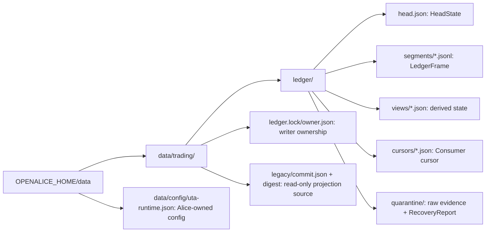
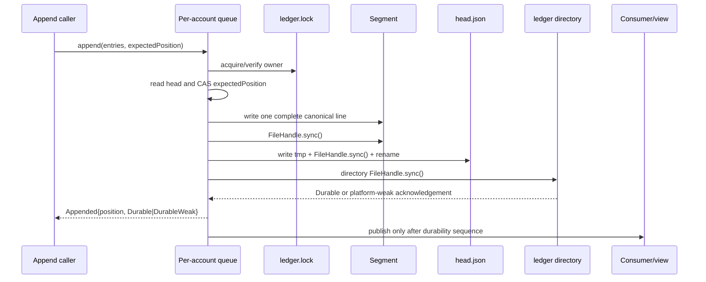
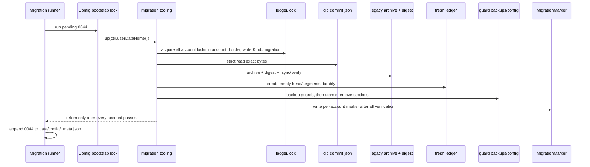

# 03 — Ledger 与持久化

> **本文拥有**：每个 `Account` 的 `AppendStore`、文件布局、frame/head 字节契约、恢复、锁、派生 view/cursor、容量边界、迁移 `0044` 以及 UTA-owned runtime config 的持久化语义。本文不拥有 provider 调用、业务 fold、HTTP DTO 或 Alice-owned secret/config 的语义。
>
> **本文展开的决策**：D5 全部持久化决策；D4 中 entry 先持久化、attempt/receipt/observation 的 crash/retry 边界、位置顺序和 view 回放；D11 中 `LedgerPosition`、`Instant`、`ConfigRevision`、精确十进制字符串和 source time 的持久化边界；R2 的 `mode` precedence 与 R6 的 `fx.maxAge` freshness 配置边界。
>
> **本文使用的类型**：`ids.ts` 的 `AccountId`、`EntryId`、`LedgerPosition`、`EntryPosition`、`HeadPosition`、`ConfigRevision`、`IdempotencyKey`；`money.ts` 的 `DecimalString`、`Money`、`Qty`；`time.ts` 的 `Instant`、`AsOf`、`Duration`；`principal.ts` 的 `Principal`；`provider/indexed.ts` 的 `ProviderEnvelope`、`OperationEnvelope`、`KeyEnvelope`、`ReceiptEnvelope`、`ObservationEnvelope`、`ProviderKey<P>`、`ProviderOrderRef<P>`、`ProjectionRegistry`；`ledger/entries.ts` 的 `LedgerEntry`、`UnknownLedgerEntry`、`EntryDraft`、`ReasonTree`；`ledger/store.ts` 的 `GENESIS_HASH`、`LedgerFrame`、`HeadState`、`RecoveryReport`、`ViewCheckpoint`、`MigrationMarker`、`AppendStore`、`AppendResult`、`CloseResult`、`OpenResult`、`Durable`、`DurableWeak`；`result.ts` 的 `ParseError`；`policy.ts` 的 `AuthorizationPolicy`、`RuleConfig`、`UtaRuntimeConfig`；以及 `Consumer<K, Context>`。

## 1. 范围、术语与归属

### 1.1 账票的唯一事实边界

`AppendStore` 是每个 `Account` 的交易账票持久化 seam。账票是交易 IO 的 `T`，只保留已经发生的意图、审批、尝试、provider 回执、上游观察、恢复解释和冲回；它不是 provider 当前态、heartbeat、配置、连接句柄或一般市场单读的替代物。这直接落实 A5/A8 以及 `plans/uta-refactor/design/00-core-contract.md` 的 §1、`plans/uta-refactor/design/01-detail-constraints.md` 的 §2、§7。

- 账票是 append-only：已经成为 committed prefix 的 frame 和 entry 永不编辑、覆盖、删除或重新编号；纠正只追加新的 `LedgerEntry`。
- `position` 是持久顺序，所有 replay、cursor 和 fold 都按 `LedgerPosition`；entry 的具体位置必须是 `EntryPosition`，head boundary 的具体位置必须是 `HeadPosition`，绝不按 `occurredAt`、`recordedAt`、文件名枚举顺序或消费者到达顺序排序。
- `occurredAt`/`asOf` 是业务或上游时间；`recordedAt` 是 UTA 写入时间；二者不得互相填补或覆盖。
- 金融数值必须是 `DecimalString`、`Money` 或 `Qty` 的十进制字符串编码。`NaN`、`Infinity`、provider sentinel、无效 scale 和 money 的 JSON number 均在 entry 边界拒绝。
- provider 相关值以 `ProviderEnvelope` 和 provider-indexed 类型保存。持久化不得把任何 provider 强行转换成 IBKR object graph；不能解析的 provider raw payload 仍须保留其可追溯表示。
- unknown `kind` 不是损坏：只要通用 entry envelope 合法且 payload 可保留，它必须照原样保留，并由相关 `Consumer` 报告为未消费。相反，已知 `kind` 的 payload/role envelope 不匹配属于 corruption（详见 §6.2），共同 envelope 不完整也属于 corruption。

当前实现不是此契约：当前 canonical 文件是 `data/trading/<accountId>/commit.json`，读取/解析异常会被吞掉并继续尝试 hard-coded legacy path（`services/uta/src/domain/trading/git-persistence.ts:14-39`）；写入是全文件 `writeFile(JSON.stringify(...))`，无临时文件、rename、`fsync`、锁或队列（`services/uta/src/domain/trading/git-persistence.ts:42-48`）。当前 `TradingGit` 的 `stagingArea`、`pendingMessage`、`pendingHash`、`inflightWrite` 也是内存字段，只有 `commits`/`head` 进入 `GitExportState`（`services/uta/src/domain/trading/git/TradingGit.ts:61-68`；`local://w1-ledger-persistence.md:33-40`）。这些事实说明迁移不能把旧全文件写入方式当作新契约。

### 1.2 谁可以写

对一个物理 `AccountId`，正常运行时只有一个 UTA `AppendStore` writer；其进程内通过一个 per-account queue/one-permit semaphore 排序，跨进程通过 `ledger.lock` 排他。`Consumer` 可以并发读和构建 view，但不得直接写 segment/head，也不得因为自己的 view 失败回写账票。

第二个**命名 writer** 是 migration tooling。它不是并发 writer：它使用同一个 `ledger.lock`，`writerKind` 为 `migration`，只在 UTA writer 未持有锁时运行。CAS 不能代替锁；它只防止持锁 writer 读取了过时的 `head.json` 后提交错误位置。正常 UTA writer 的 `writerKind` 为 `uta`。

Alice config routes 是 UTA runtime config 和 `accounts.json` 的唯一配置 writer。UTA 只读这两个配置边界（UTA runtime config 可 hot-reload），绝不由 UTA 为了 normalize、补默认值或记录运行时状态而写回配置。当前 `accounts.json` 的 sealing、owner-only mode 和唯一写入口见 `src/core/config.ts:704-718,785-788`；当前 UTA 在启动时读取并 purge ephemeral 数据见 `services/uta/src/main.ts:56-87`、`src/core/config.ts:790-821`。

## 2. 文件布局

`OPENALICE_HOME` 解析出的 `data/` 是用户持久数据根；不能以 cwd、原始 URL 参数或未经 registry 解析的 `accountId` 拼接路径。`dataPath` 将路径置于 `OPENALICE_HOME/data`（`src/core/paths.ts:34-45`），当前 UTA 的 trading state 也位于 `data/trading/<accountId>`（`services/uta/src/domain/trading/git-persistence.ts:14-16`）。新布局如下；目录与文件均必须处于该 account 的物理根内并拒绝 symlink 穿越。

| 路径 | 归属与内容 | 写者 | 是否账票事实 |
|---|---|---|---|
| `data/trading/<accountId>/ledger/head.json` | `HeadState`；唯一 committed boundary | UTA 或 migration tooling（持有 `ledger.lock`） | 否，提交索引 |
| `data/trading/<accountId>/ledger/segments/segment-000001.jsonl` | `LedgerFrame` 的物理行；编号为六位十进制，从 `000001` 开始 | UTA 或 migration tooling（仅通过 `AppendStore` seam） | 是 |
| `data/trading/<accountId>/ledger/views/<viewId>.json` | view state + `ViewCheckpoint`；可重建 | 对应 `Consumer` | 否，纯派生 |
| `data/trading/<accountId>/ledger/cursors/<consumerId>.json` | 该 `Consumer` 的独立 `sourcePosition/sourceHash` cursor | 对应 `Consumer` | 否，消费进度 |
| `data/trading/<accountId>/ledger/quarantine/` | raw tail、孤儿 segment、孤儿 head tmp 和 `RecoveryReport` | `AppendStore` recovery | 否，证据/诊断 |
| `data/trading/<accountId>/ledger.lock/owner.json` | boot lock owner metadata；不被 segment scanner 当作 ledger | 当前 writer | 否，运行时所有权 |
| `data/trading/<accountId>/legacy/commit.json` | migration `0044` 保存的旧 `commit.json` 原始 bytes | `0044` 一次；之后只读 | 否，历史 projection 输入 |
| `data/trading/<accountId>/legacy/commit.json.sha256` | 旧 archive 原始 bytes 的 64-lower-hex SHA-256 | `0044` 一次 | 否 |
| `data/trading/<accountId>/migration-0044.json` | `MigrationMarker`；每个非 ephemeral account 的完成标记 | migration `0044` | 否 |
| `data/config/uta-runtime.json` | `UtaRuntimeConfig`；Alice-owned 配置文件 | Alice config routes | 否 |
| `data/config/crypto.json.backup-pre-0044` | `crypto.json` 删除 `guards` 前的 exact bytes（若该 section 存在） | migration `0044` | 否 |
| `data/config/securities.json.backup-pre-0044` | `securities.json` 删除 `guards` 前的 exact bytes（若该 section 存在） | migration `0044` | 否 |

目录使用 owner-only 权限（Unix 上通常 `0700`），包含 provider raw payload 的文件使用 owner-only 权限（Unix 上通常 `0600`）；Windows 使用等价的最小 ACL。权限失败必须是可观察的持久化错误，不得把敏感 raw payload 写入日志。



`data/event-log/events.jsonl` 不得作为交易账票或 `/v2/events` 的第二事实源。当前 EventLog 在恢复时会跳过 malformed line，且两个实例并发 append 可产生两个 `seq:1`（`local://w1-ledger-persistence.md:60-67`）；新 ledger recovery 禁止继承该行为。snapshot 也保持独立：当前 snapshot 使用 `snapshots/index.json` 与每 chunk 50 行的 JSONL（`services/uta/src/domain/trading/snapshot/store.ts:1-24,63-86`），本文件不把它升级为 ledger。
本 release 的 `AppendStore` engine 固定为上述 files；SQLite 不得作为第二事实源或绕过该 seam。未来只有在存在不需要 native build、且同时覆盖 Node 22（prod/Docker）、Electron 39 的 Node ABI、pinned Bun 1.4.0、五种 launcher 与三种 platform 的 driver 时，才可另行提出 SQLite-behind-the-seam 迁移；在该条件满足并完成独立决策前，不能写 SQLite ledger。

## 3. 物理 frame 与 hash 链

### 3.1 一行的精确格式

每次 `AppendStore.append(entries, expectedPosition)` 接收非空 `EntryDraft[]`，由 writer 为 entries 赋予 positions/`recordedAt`，产生**恰好一条** append frame。多 entry append 不得产生多行，不得产生 `batch.commit` marker，不得让消费者看到部分 batch。一个包含 `receipt.recorded` 与 provider response 中真实 observation 的 append，必须把两个 `LedgerEntry` 放入同一 frame，按 receipt 再 observation 的顺序排列。

物理文件是一串 UTF-8 bytes，每个 frame line 的格式严格为：

```text
<64 个小写十六进制 sha256><一个 ASCII 空格><canonical JSON body><一个 LF (`0x0a`)>
```

具体字节规则：

1. `<canonical JSON body>` 的 bytes 是唯一 digest 输入；digest **不包含**前面的 64 个 hex、分隔空格或结尾 LF。实现必须使用 `Buffer.from(body, 'utf8')` 等价的 UTF-8 编码，不得写 BOM、CRLF 或额外空格。
2. `lineHash = lowercaseHex(SHA-256(bodyBytes))`，长度恒为 64；物理 line 为 `ASCII(lineHash) + 0x20 + bodyBytes + 0x0a`，没有 byte-length prefix 或其他前导字段。因此 digest 覆盖后续 JSON body 的 exact bytes，且不会有 hash 自引用。
3. writer 端 canonical JSON 的 object keys 递归按 Unicode/UTF-16 code-unit lexical order 排序，array 顺序保持不变，不输出 whitespace；字符串使用 JSON/JCS 等价 escaping；数值只能是有限 JSON number，禁止 `-0`、NaN、Infinity、BigInt、`undefined`、Date object 和 provider sentinel。`DecimalString`/money/quantity 一律是字符串。实现可采用 RFC 8785 JSON Canonicalization Scheme，但输出必须 byte-for-byte 等价。
4. canonical serialization 只在写入时执行。reader 必须按文件中已有的 body bytes 验证 SHA-256 和 JSON schema，并拒绝重复 JSON object key；**不得先 parse 后 re-stringify 再拿重编码 bytes 当原始 bytes**。非 canonical 但 digest 自洽的外部修改仍按原始 bytes 读取并保留，不得静默改写。生产 writer 因而始终只产生 canonical bytes。
5. line 除最后一个合法 LF 结束符外不得出现裸 LF/CR；字符串内的换行只能是 JSON escape。空白 line 不是 frame。文件开头的 BOM、缺少 LF 的最后 fragment、错误的 prefix 分隔符或 uppercase digest 都是 tail/interior validation failure，按 §5 分类。

### 3.2 `LedgerFrame` 的 body envelope

`LedgerFrame` 是 parser 在内存中表示的结构；`lineHash` 来自物理 prefix，**不写入 body**。body 的字段集合严格为下表，不得添加一个为“兼容”而吞掉未知字段的 default 分支：

| body field | 精确约束 |
|---|---|
| `schemaVersion` | 整数 `2`；其他版本不得猜测兼容 |
| `accountId` | 已通过 registry 解析的 `AccountId`，必须等于该目录 account |
| `position` | `EntryPosition` 的正整数，等于此 frame 最后一个 entry 的 `position` |
| `entries` | 非空 `(LedgerEntry | UnknownLedgerEntry)[]`；entry positions 连续，范围为 `position - entries.length + 1` 到 `position` |
| `prevHash` | 第一 frame 为 `GENESIS_HASH`（64 个 `0`）；其余为前一 committed frame 的 64-lower-hex `lineHash` |

解析后将物理 prefix 的 `lineHash`、物理 `segment` 和 `byteOffset` 作为 scanner metadata 与 `LedgerFrame` 关联；这些定位字段不进入 body。frame 的 `position` 是最后 entry position，不是数组下标。每个 entry 自己仍必须带 D4 的 `entryId, position, occurredAt, recordedAt, source, kind, idempotencyKey, why, causedBy?, correlation`；`kind` 是开放字符串命名空间。

entry envelope 的 `why` 是必需的结构化语义，不能用空字符串、generic log message 或异常 message 替代。`ProviderEnvelope` 的 provider id、projection version 和 opaque payload 必须保留；raw provider bytes 若不能作为 JSON value 表示，必须以明确的 base64/encoding record 保留，不能把它丢成 `{}` 或 null。对 unknown `kind` 只检查共同 envelope 和 payload 的可保留边界，不尝试猜 provider 字段。

D4 的 role-indexed persisted payload 必须保持不可互换：`attempt.started.key` 是 `KeyEnvelope`；`receipt.recorded.receipt` 是 `ReceiptEnvelope`，只有 `accepted` 携带 provenance，`rejected` 与 `unknown` 不携带 provenance；`observation.recorded.observation` 是 `ObservationEnvelope`。`recovery.resolved.result.found` 必须携带 `{receiptEntryId, observationEntryId}`，两者分别指向 `receipt.recorded{provenance: recovered}` 与同一 frame 中追加的 `observation.recorded`；fold 只读取这两种 entry。进程内的 `ProviderKey<P>`、`Receipt<P>`、`Observation<P>` 只能由 `ProjectionRegistry` 重新关联得到，禁止以 `as` 伪造关联。

### 3.3 Genesis、位置和 head

空账票没有 frame；`GENESIS_HASH = '0'.repeat(64)` 是空 head 的 hash，也是第一 frame 的 `prevHash`。genesis 状态为 `position=0`（`HeadPosition`）、`hash=GENESIS_HASH`、`segment='segment-000001.jsonl'`、`byteOffset=0`。初始化必须先 durable-create 空的 `segment-000001.jsonl`，再按 head 写入顺序提交 empty `HeadState`。第一 entry position 为 `1`（`EntryPosition`）。后续 frame 的第一 entry position 必须为当前 `head.position + 1`，body `position` 必须是最后 entry position，`prevHash` 必须等于当前 head 的 `hash`。

同一 frame 内 entry positions 连续，不能由调用者任意指定 gap/duplicate position；position 由持有 lock 的 writer 在 canonicalization 前分配。`recordedAt` 也由该 writer 在 entry 定型时写入，`occurredAt` 和 `asOf` 由业务/provider 边界提供。AppendStore 的 write side 只从 `EntryDraft[]` 构造 `LedgerEntry[]`，不接受 `UnknownLedgerEntry`；落盘后 parser/replay 的 read side 才以 `(LedgerEntry | UnknownLedgerEntry)[]` 表示 persisted frame。不得信任调用者提供的错误 position。

### 3.4 `HeadState` 与 committed boundary

`head.json` 是唯一提交索引，不是第二个 ledger frame。它是 strict JSON 文件，canonical JSON + 一个 LF，字段为：

| field | 精确约束 |
|---|---|
| `schemaVersion` | 整数 `2` |
| `accountId` | `AccountId`，必须等于父目录 |
| `position` | `HeadPosition`，`0` 或正整数 |
| `hash` | 空账票为 `GENESIS_HASH`，否则为最后 committed frame 的 64-lower-hex `lineHash` |
| `segment` | 始终为 `segment-NNNNNN.jsonl`；空账票初始化为 `segment-000001.jsonl`，不得带 `/`、`\\` 或 `..` |
| `byteOffset` | 非负整数；相对于 `segment` 的**exclusive end** byte offset，包含该 frame 的结尾 LF；空账票为 `0` |
| `updatedAt` | `Instant`；本地 head 更新时间，不参与 frame hash |

`position=0` 时 `hash=GENESIS_HASH, segment='segment-000001.jsonl', byteOffset=0` 必须同时成立；任何组合不一致都是 `Corrupt{at}`。非空 head 必须精确指向一个已验证 frame 的 end boundary：该 frame 的 `position/hash/segment/endOffset` 必须全部匹配。head 不允许指向 line 中间、prefix、JSON body 中间或 LF 之前。

head 的写入使用与 frame 相同的 UTF-8、无 BOM、LF 规则，但没有 hash prefix。临时文件必须在 `ledger/` 同目录、使用本次 owner token 加随机后缀（例如 `.head.<token>.<uuid>.tmp`），不能暴露在 `segments/`。写入顺序为 `write tmp → tmp FileHandle.sync() → rename(tmp, head.json) → ledger directory sync`；rename 前不能只依赖内存 buffer。孤儿 tmp 不得被当成 head，见 §5。

## 4. `AppendStore`、CAS 与 durability

### 4.1 `AppendStore` 可观察契约

`AppendStore` 只通过下列 seam 暴露 ledger IO：

- `open() → OpenResult`，其中结果必须是 `Open`、`TornTail{quarantined}` 或 `Corrupt{at}`。`UncommittedTail` 是 `RecoveryReport` 的恢复分类，不是第四个 `OpenResult` variant；当完整合法 frame 越过 `head.json` 时，`open()` 返回 `TornTail`，其中的 report `kind` 为 `UncommittedTail`。
- `append(entries, expectedPosition) → AppendResult`。成功返回 `Appended{position, durability}`，其中 `position` 是最后一个 `EntryPosition`，`durability` 是 `Durable | DurableWeak`；位置冲突返回 `Conflict{expected, actual}`，其中两者都是 `HeadPosition`；任何未完成约定 durability 的写失败返回 `DurabilityFailure{result}`。
- `replay(fromPosition)` 只读 committed prefix，按 `position` 顺序输出 `LedgerEntry | UnknownLedgerEntry`，绝不把 quarantined tail 当成功追加。
- `head() → HeadState` 只读当前 committed boundary。
- `close() → CloseResult`：先等待 per-account queue 清空，再停止 heartbeat 并释放 lock；结果为 `{kind:'Closed'}` 或 `{kind:'CloseFailure', reason:ParseError}`。close 完成后 `append` 必须返回 `AppendResult.closed`（`kind:'closed'`）的结构化关闭结果，不得写 orphan bytes。drain 的原子转移和 queued command 拒绝规则见 `07-security-operations.md`，因此 close 只面对确定为空的 append queue。

`append` 是本地账票写，不是 provider retry。expected-position conflict 是 writer conflict（尤其 migration tooling 与 UTA 的竞态），不是 intent outcome；它不追加 `reversal`、`receipt` 或 `unknown`。
migration tooling 在已经持有 `ledger.lock` 时调用同一 `AppendStore` seam；`open()`/`replay()`/`head()` 必须验证并复用当前 owner token，不得再次以 `writerKind:"uta"` 竞争同一 lock。migration 的 owner metadata 仍保持 `writerKind:"migration"`；若实例没有可复用的 held-lock context，则不得释放 lock 伪装成普通 UTA open。

### 4.2 expected-position CAS

每次 append 在 per-account queue 内、持有 `ledger.lock` 时重新读取/验证 `head.json`；不能只信调用者传入的 cached head。若传入的 `expectedPosition`（`HeadPosition`）!== 锁内读取的 `head.position`（`HeadPosition`）：

1. 不写 segment bytes、不创建 committed frame、不改 head；
2. 返回 `Conflict{expected, actual}`，其中 `expected` 和锁内观察到的 `actual` 都是 `HeadPosition`；
3. caller 必须重新读 head/replay，并决定继续，不得把 conflict 当 provider rejection 或自动生成新 intent。

expected position 相等后，writer 在锁内一次性分配连续 positions、生成 frame、落盘并推进 head。第二 writer migration tooling 也必须使用同一 CAS，即使它理论上已经持有 lock；这是检测错误 home、旧 marker 或意外外部 writer 的最后防线。

Durability failure 后 caller 的 retry 规则取决于 head，而不是异常字符串：若重新 `open/head` 显示 head 已到新 position，则原 append 已提交，不能再次 append；若 head 仍为原 position 且尾 bytes 已 quarantine，则可以使用相同 entries、相同 entry identities 和相同 expected position 重试；若无法读取 head，必须停在 `Corrupt`/unreadable，不得猜测。对于 provider 已发生但 receipt append 不确定的场景，按 §8 的 unknown/reconcile 规则处理，不能因为 local append retry 而重复 provider call。

### 4.3 精确 durability sequence

一次成功 append 的可见顺序固定如下。所有步骤都在一个 per-account writer permit 内，provider IO 不在此本地 commit region 内：

1. 读取并校验 current `HeadState`，进行 expected-position CAS。
2. 为 entries 分配连续 positions/`recordedAt`，构造 `LedgerFrame` body，canonicalize，计算 body bytes 的 `lineHash`，形成完整 line bytes。
3. 按 §4.4 选择 active segment；在文件 EOF 写入完整 line，确认写入字节数等于 line bytes 长度。不得让消费者读取半行。
4. 对 segment `FileHandle.sync()`；未成功不得继续 head 提交。
5. 构造新的 `HeadState`，写同目录 tmp，调用 tmp `FileHandle.sync()`，关闭 tmp，再 `rename` 为 `head.json`。
6. 对 `ledger/` 目录调用 directory `FileHandle.sync()`，使 segment/head rename 的目录项达到该平台能提供的约定。
7. 只有步骤 6 完成后才 resolve `Appended` 并向 consumers 发布新 `position`。view、cursor、snapshot、Issue、health/event-log 等下游副作用不得先于此通知。



各失败阶段的行为：

| 失败点/崩溃窗口 | 当前 committed head | restart 看到的 bytes | 返回/暴露 | 重试 |
|---|---|---|---|---|
| 写 line 前 | 未变 | 无新 bytes | `DurabilityFailure{result}`；无 consumer exposure | 重新读 head 后可用同一 expected position 重试 |
| line 部分写或完整写但 segment `sync` 失败 | 未变 | active segment 的 suffix 可能是 partial/完整 line | 不返回 `Appended`；进程继续运行时也不得 publish | 重启将 suffix quarantine；确认 head 后可重试，不能把 suffix 当 entry |
| segment sync 成功，head tmp 尚未写/写坏/未 sync | 未变 | 合法或不合法 suffix 越过 head；tmp 可能存在 | `DurabilityFailure{result}`；不 publish | 重启把 suffix 作为 `UncommittedTail`/`TornTail` quarantine；同 expected 可重试 |
| head tmp sync 成功，rename 前崩溃 | 未变 | head.json 仍旧；tmp 是孤儿 | `DurabilityFailure{result}`；不 publish | quarantine tmp 和 suffix，按旧 head retry |
| head rename 已成功，directory sync 前崩溃或返回真实 I/O error | 可能已变 | 以重启时存在且自洽的 head 为 authority；若 head 新则 frame 已 committed，否则 suffix 未提交 | 不可把 `DurabilityFailure` 当作“未提交”；返回 `DurabilityFailure{result}` 要求 caller 先 reopen/head | 先 reopen：head 新则不得重复；head 旧则 quarantine suffix 后同 expected 重试；无法判定则停在 recovery |
| directory sync 能力缺失/平台 durability 未验证，但 segment/head sequence 成功 | head 已变 | frame/head 可读，但目录持久性承诺较弱 | `Appended{position, DurableWeak{platform, reason}}`；仍在步骤 6 后才 publish | 不得因为 Weak 自动重复 append；按 head identity 去重 |
| directory sync 成功，append 返回前崩溃 | 已变 | frame/head 是 committed prefix | 重启 `Open` 并由 cursor replay；不重复 provider | consumer 从自己的 checkpoint 继续 |
| append 返回并 publish 后 view/cursor 写失败 | 已变 | ledger 完整，view/cursor 旧或损坏 | append 仍成功；view/cursor failure 单独 observable | rebuild view，不重试 provider/ledger append |

真实 directory sync 返回 EIO/ENOSPC 等 I/O 错误不是 `DurableWeak`：它是 `DurabilityFailure`，因为这次约定的写序列未完成。只有明确的 platform unsupported/unverified 分支可以产生 `DurableWeak`。任何 `DurabilityFailure` 都必须保留可诊断的 stage/result；禁止吞异常或把它映射为成功。

### 4.4 Segment rotation

单个 segment 的容量上限为 `16 * 1024 * 1024` bytes（16 MiB），按物理 UTF-8 line bytes（包括 prefix、space、body、结尾 LF）计算，不按字符数或 entry 数计算。

- append 前读取当前 segment 的 committed EOF。若当前 segment 非空且 `currentCommittedBytes + lineBytes.length > 16 MiB`，先完成当前 segment，再创建下一个连续编号的 `segment-NNNNNN.jsonl`，整条 frame 写入新 segment。rotation 本身不推进 `head`，只有完整 frame 的 durability sequence 推进 head。
- 一条 frame 不能被拆到两个 segment；若单条 frame 本身大于 16 MiB，仍完整写入一个新 segment，并允许该 segment 超过上限，同时在诊断中记录 oversize frame。不得截断 payload 或降低 raw retention 来适应上限。
- segment 编号必须无 gap、无重复、六位十进制递增；缺号、重复号、非规范文件名均为 `Corrupt{at}`，不能按目录排序后忽略。
- active segment 只有 append 和 §5 对未提交 suffix 的显式 truncate；committed prefix 不得 rewrite。正常运行不得因 rotation 重写旧 segment。
rotation 若在创建下一个 segment 后、写入第一条 frame 前崩溃，允许留下一个无 bytes 的 trailing segment；boot 在持有 lock 时必须验证其为空，并可安全复用或删除后 directory sync。空账票的 genesis `segment-000001.jsonl` 是唯一允许位于 committed boundary 的空 segment；除此之外，committed prefix 内的空 segment、多个无 bytes 的 trailing segment、或空 segment 之后又出现非空 segment，均不是可忽略的“方便文件”，应返回 `Corrupt{at}`。

### 4.5 `Durable` 与 `DurableWeak` 的 platform 报告

`Durable` 的含义是：本次 segment sync、head tmp sync、head rename、ledger-directory sync 全部完成，且当前运行时/platform adapter 已通过 durability capability gate；它不是 provider 已接受交易的证明。`DurableWeak` 的含义是：上述文件顺序完成，但 directory durability 无法被当前平台/运行时证明；它不是 silent success，必须携带 `platform` 和结构化 `reason`。

| platform/runtime | 报告规则 | 证据状态 |
|---|---|---|
| Darwin + 当前 Node `v26.8.1` | segment/file `FileHandle.sync`、`datasync` 存在；directory open/sync probe 返回 `directorySync:"ok"` 时可报告 `Durable`。若实际调用失败，按 `DurabilityFailure`。 | **已验证**：`local://w1-ledger-persistence.md:79-86` 的 scoped Node probe；repository 要求 Node `>=22.19.0`（`package.json:101-104`、`services/uta/package.json:32-34`），精确 Node 22 probe 尚未验证。 |
| Linux | 在未完成目标 Node 版本/文件系统 probe 前报告 `DurableWeak{platform:"linux", reason:"directory durability unverified"}`；未来只有经过同一 capability gate 才可升级 `Durable`。 | **未验证**：没有 Linux runtime 或 power-loss test；installer 的 `flock` 只证明 installer host binary，不证明 Node ledger lock（`local://w1-ledger-persistence.md:81-86`）。 |
| Windows | 即使某个 Node API 返回成功，也不得报告 `Durable`；本 release 报告 `DurableWeak{platform:"win32", reason:"directory durability untested"}`。真实 I/O error 仍是 `DurabilityFailure`。 | **未验证且 register 明确禁止 Durable**：没有 Windows directory-sync 或 power-loss test；仅有 lock-owner rename retry spec（`local://w1-ledger-persistence.md:81-86`）。 |
| 其他平台 | `DurableWeak{platform, reason:"platform durability unverified"}`，除非另有已审核 capability gate；不得假定 POSIX 语义。 | **未验证**。 |

`DurableWeak` 不得触发自动重复 append；caller 必须保留返回的 `position`/entry identities，并在恢复时以 `head`/`entryId` 读取确认。首次 observation gate 仍适用：每次 start 后 account 在 first successful upstream observation pass 前是 `writable: blocked{reason:'FirstObservationRequired'}`，即使 ledger 本身是 `Durable`（D5/D4；`00-decision-register.md:129-133`）。

## 5. 启动锁与 recovery

### 5.1 boot lock protocol

UTA 在打开一个 account 的 segment/head 前必须先取得 `data/trading/<accountId>/ledger.lock/`。lock 是目录 `mkdir` 的原子占有，不是 advisory byte-range lock；它不能被全局 Guardian lock 或 installer `flock` 替代。现有 cross-platform `mkdir` lock 已有 owner metadata、heartbeat、PID/start-time/token identity、stale reclamation 和 Windows rename retry precedent（`packages/guardian-runtime/src/runtime-lock.ts:183-231,323-430`；`local://w1-ledger-persistence.md:79-85`）。

`owner.json` 的 strict object 字段恰为：`schemaVersion:1`、`accountId`、`writerKind` (`uta|migration`)、`pid`、`hostname`、可选 `machineId`、随机 `token`、`launcher`、`acquiredAt`、`heartbeatAt`、`processStartedAt`；unknown fields、缺失 required fields 和错误 field domains 都拒绝。token 每次 boot 新建，不能复用 pending hash、account id 或 PID。

取得流程：

1. `mkdir` parent/lock directory；成功后立即以同目录 tmp+rename 写 `owner.json`，并在成功 acquire 前完成 owner file sync。
2. 若 `mkdir` 得到 `EEXIST`，读取并 strict-parse owner。owner 缺失/格式坏表示 `initializing|invalid`，不能直接删除；按 bounded poll 等待或返回锁不可用。
3. 若 owner 的 `pid`、`processStartedAt`、`machineId` 能证明仍是活的同一 process，则返回 already-owned structured error；不得 takeover。
4. 只有确认原 process 已退出且 owner identity 属于本机时，才可在 `reclaiming/` 中 `mkdir` claim，重新 stat lock directory identity，重读并比较 owner token，然后把整个 lock directory rename 到唯一 `.reaped-<uuid>` 名称，最后 bounded remove。任何检查改变、machineId 不同或 process identity 无法证明时 fail closed，要求 operator recovery；绝不按 stale heartbeat 单独 `rm`。
5. heartbeat 每 30 秒原子更新 `owner.json`；超过 90 秒只产生 stale candidate，不能单凭时间夺锁。实现应沿用 `packages/guardian-runtime/src/runtime-lock.ts:18-20,338-369` 的 identity/heartbeat discipline，并沿用 Windows `EPERM|EACCES|EBUSY` bounded rename retry（`packages/guardian-runtime/src/runtime-lock.ts:401-430`）。
6. UTA 持 lock 到 `AppendStore.close()` 完成；close 先 drain queue，停止 heartbeat，再以 token compare 后删除 lock。migration tooling 完全使用相同步骤但 `writerKind:"migration"`；UTA live 时 migration 必须失败而不是等待到两个 writer 并行。

boot lock 只保护 ledger writer；config bootstrap lock 保护 Alice 与 UTA 在启动时运行 migration/seed 的短 critical section（`src/core/config-bootstrap-lock.ts:29-79`），不是 ledger lock 的替代物。

### 5.2 `open()` recovery invariant

Recovery 只允许一个决定：`head.json` 定义 committed boundary；其后的 bytes 不能因为“看起来完整”而自动成为新事实。`open()` 先取得 lock，再按照 segment number 扫描 raw bytes；它不依赖目录 mtime、wall clock 或 in-memory array。

每一物理 line 的验证顺序固定为：

1. 找到下一个 LF；最后没有 LF 的非空 fragment 只能是 tail，不能 parse 成 entry。
2. 取前 64 bytes、一个空格和 body bytes；检查 prefix 是 lowercase hex。
3. 用 exact body bytes 算 SHA-256，与 prefix 比较；不先 canonicalize。
4. strict UTF-8 decode（拒绝 BOM/非法 sequence），parse JSON object，检查 envelope schemaVersion/accountId/entries/position/prevHash。
5. 检查 frame `prevHash` 与前一个 frame 的 `lineHash`、entries 连续 positions、entry common envelope 和 entry kind parser 边界。
6. 记录 segment、line start、exclusive end offset；把 valid prefix 与 `HeadState` 精确对齐。

伪代码（`UncommittedTail` 是 `RecoveryReport.kind`，不是 `OpenResult` variant）：
伪代码中的 `corruptReport` 必须构造完整 `RecoveryReport{kind:"Corrupt", accountId, segment, reason, headPosition, headHash, position}`；`headPosition` 的语义始终是 `HeadPosition`，解析出的 frame/entry `position` 的语义始终是 `EntryPosition`。扫描中没有可信 frame 时使用 genesis `HeadPosition=0`/`GENESIS_HASH`，并在 `reason` 中记录 invalid/missing head 的原始情况。这样 `Corrupt{at}` 始终符合 `RecoveryReport`，不会以裸路径字符串代替结构化报告。比较 head boundary 时，segment number 先按数值比较：小于 `head.segment` 的 segment 全部属于 committed prefix；等于它的 segment 以 `head.byteOffset` 划界；大于它的 segment 全部在 head 之后。

```text
open(accountId): OpenResult
  acquire or verify ledger.lock for current owner (writerKind="uta" for normal UTA; writerKind="migration" reuses its held owner)
  ensure ledger/{segments,views,cursors,quarantine} exists
  recoveryReports = quarantine exact bytes of orphan head tmp files as TornTail reports

  headBytes = read head.json
  if headBytes is missing:
    if no noncanonical segment files and every canonical segment file is empty/missing:
      durable-create empty segment-000001.jsonl if missing
      write empty HeadState durably
      if recoveryReports is not empty:
        return TornTail(quarantined=recoveryReports, head=empty)
      return Open(head=empty)
    raw = exact bytes of all remaining segment files, including noncanonical names
    report = quarantine(raw, kind="UncommittedTail", reason="head missing")
    clear the quarantined segment suffixes only after quarantine is durable
    durable-create empty segment-000001.jsonl if missing
    write empty HeadState durably
    return TornTail(quarantined=[...recoveryReports, report], head=empty)

  head = strictParseHead(headBytes)
  if head invalid, accountId mismatch, schemaVersion != 2,
     position/hash/segment/byteOffset combination inconsistent:
    write a diagnostic report beside the untouched bytes
    return Corrupt(at=corruptReport(segment="head.json", position=0, reason="invalid head"))
  if head.position == 0 and segment-000001.jsonl is missing:
    durable-create empty segment-000001.jsonl

  noncanonical = list segment-directory files whose names are not exact segment-NNNNNN.jsonl
  if noncanonical is not empty:
    preserve their exact bytes as diagnostic quarantine copies
    return Corrupt(at=corruptReport(segment=firstNoncanonical, position=0, reason="noncanonical segment filename"))
  segments = list exact segment-NNNNNN.jsonl, sorted by numeric NNNNNN
  if names have gaps/duplicates:
    write diagnostic report
    return Corrupt(at=corruptReport(segment=firstBadSegment, position=0, reason="noncanonical segment sequence"))
  validate empty-segment rule from §4.4; more than one trailing empty segment, an empty segment before the head boundary, or a nonempty segment after an empty segment returns Corrupt(at=corruptReport(segment=firstInvalidSegment, position=0, reason="empty-segment placement"))
  expectedHeadPosition: HeadPosition = 0
  expectedNextEntryPosition: EntryPosition = 1
  expectedHash = GENESIS_HASH
  committedBoundarySeen = (head.position == 0)
  tailStart = none
  for each segment in numeric order:
    for each raw line with [start,end):
      result = validateExactLine(raw line, expectedNextEntryPosition, expectedHash)
      if result is malformed/hash/schema/chain failure:
        if line lies at or before head boundary:
          report without changing bytes
          return Corrupt(at=corruptReport(segment=segment, position=expectedNextEntryPosition, reason="committed-line validation failure"))
        tailStart = (segment,start)
        break scan

      frame = result.frame
      if line starts before and ends after head boundary:
        return Corrupt(at=corruptReport(segment=segment, position=frame.position, reason="head boundary splits line"))
      if frame end is at or before head boundary:
        require segment == head.segment when it reaches head
        require frame.position == head.position and frame.lineHash == head.hash
          at exactly head.byteOffset; otherwise return Corrupt(at=corruptReport(segment=segment, position=frame.position, reason="head boundary mismatch"))
        advance expectedHeadPosition to this committed boundary
        derive expectedNextEntryPosition as the next EntryPosition after frame.position
        expectedHash = frame.lineHash
        committedBoundarySeen = true
      else:
        tailStart = (segment,start)
        break scan
    if tailStart is not none:
      break scan

  if head.position > 0 and not committedBoundarySeen:
    return Corrupt(at=corruptReport(segment=head.segment, position=head.position, reason="head boundary not present"))

  if tailStart is not none:
    suffix = readExactBytes(from=tailStart through EOF, including later segment files)
    suffixKind = classifySuffix(suffix, expectedNextEntryPosition, expectedHash)
    if suffixKind is Corrupt:
      return Corrupt(at=suffixKind.report)
    persist exact suffix under quarantine/<timestamp>-<suffixKind>-<segment>-<range>.bin
    report = persist RecoveryReport with kind=suffixKind, source segment/range,
      raw SHA-256, head.position/head.hash, quarantinePath, reason
    fsync quarantine file and quarantine directory
    truncate head.segment to head.byteOffset and FileHandle.sync()
    remove later orphan segments only after their exact bytes are quarantined
    if truncate/remove fails:
      return Corrupt(at=corruptReport(segment=head.segment, position=head.position, reason="tail quarantine cleanup"))
    recoveryReports += report
    return TornTail(quarantined=recoveryReports, head=head)

  if recoveryReports is not empty:
    return TornTail(quarantined=recoveryReports, head=head)
  return Open(head=head)
```
在 suffix 扫描中，全部为完整且 hash/chain 自洽 frame 才能分类 `UncommittedTail`；EOF 的无 LF fragment（即使前面已有完整未提交 frame）分类 `TornTail`，整段 suffix 一起 quarantine；带 LF 但 schema/hash/UTF-8 不合法的 line，或 malformed line 后仍有任何 bytes/frame，分类 `Corrupt`，不得只截取更早 prefix。

实现必须把上面两个 tail 类别区分清楚：

- **`Open`**：所有 committed bytes 连续、exactly reach `head.json`，没有可恢复 suffix；孤儿 tmp 若已被 quarantine，应返回带 recovery report 的 `TornTail`，不能静默丢掉。
- **`TornTail`**：head 之后的最后 fragment 缺 LF、JSON/UTF-8/trailer 不完整，或 orphan head tmp；raw bytes 先复制并 fsync 到 `ledger/quarantine/`，active segment 再 truncate 到 head boundary；成功清理后可以继续提供旧 committed prefix。
- **`UncommittedTail`**：一个或多个完整且 hash/chain 自洽的 frame 已经写入 segment，但 `head.json` 未推进，典型窗口是 segment `sync` 后 head rename 前崩溃。它是 `RecoveryReport.kind`，raw complete frame/suffix 也必须 quarantine，`open()` 以 `TornTail{quarantined}` 返回。下一次 append 从旧 `head.position/head.hash/head.byteOffset` 继续，不能把这些 frame promote 成 ledger entries。
- **`Corrupt`**：任何 committed boundary 内的损坏、head 指向不存在/越界位置、committed hash/chain 断裂、segment interior corruption、孤儿 suffix 后又出现后续有效 frame、未知 schemaVersion、entry common envelope 缺失。`open()` 不暴露任何新 entry、不 truncate committed bytes；只写一个诊断 `RecoveryReport`/raw offending copy 到 quarantine（若能安全复制），返回 `Corrupt{at}`，由 readiness 将 account 标成不可读，等待 operator repair/new migration。不得 skip forward。

以下特殊组合也必须确定：

| 组合 | 结果 |
|---|---|
| 无 `head.json` 且无 segment bytes | 创建并 durable-write empty `HeadState`，`Open` |
| 无 `head.json` 但有任意 segment bytes | 全部视为 head 之外，quarantine 为 `UncommittedTail`，返回 `TornTail`；不能猜最后 head |
| head 指向不存在的 segment、offset 落在 line 中间、offset 超过 EOF | `Corrupt{at}`；保留原 segment/head |
| head 正确，active segment 只有 head boundary 后 partial line | quarantine raw suffix，truncate，`TornTail` |
| head 正确，后面只有完整自洽 frames | quarantine complete suffix，report `UncommittedTail`，`TornTail` |
| tail corruption 后又有任何 bytes/frame | interior corruption，`Corrupt{at}`，不能只取前缀 |
| head position 0 但 segment 有 frames | `UncommittedTail` report + `TornTail` |
| 只有 orphan `.head.*.tmp`，main head/segments 自洽 | quarantine tmp，返回 `TornTail`；tmp 永不成为 head |
| head hash/position 与对应 frame 不一致 | `Corrupt{at}` |
| unknown `kind` 但通用 entry envelope 合法 | `Open`/`TornTail` 取决于物理 tail；entry 保留，由 consumer report unconsumed |

Quarantine 的 raw copy、report 和 truncate/removal 必须先后可恢复：若 raw copy 或其 fsync 失败，不能 truncate；若 truncate 失败，不能返回可读的 `TornTail`。在执行任何 quarantine 前必须按 §7 检查 `retention.quarantineMaxBytes`；若容量不足，`open()` 返回 `Corrupt{at}`（`RecoveryReport.reason` 为 `QuarantineCapacityExceeded`），保持原始 bytes 不变，readiness 暴露 `QuarantineCapacityExceeded` 且 `writable: blocked{reason:'QuarantineCapacityExceeded'}`，不得用删除旧 evidence 或 truncate 绕过上限。quarantine 不得覆盖同名文件，名称含 UTC、kind、source segment、byte range 和随机 suffix。quarantine 文件不自动删除、不参与 replay、不改变 `head.json`。

## 6. Replay、views、cursors 与 unknown kinds

### 6.1 replay 与 view checkpoint

`replay(fromPosition)` 只读通过 recovery 的 committed prefix，从 `fromPosition`（含）开始，按 frame 内 entry order 和跨 frame `position` 顺序返回。它不得访问 provider、当前时间、随机数、环境变量或可变 singleton；给定同一 prefix 与同一明确输入，fold 必须确定。

每个 `views/<viewId>.json` 至少包含 strict fields `schemaVersion:1`、`viewId`、view-specific validated `state`、`sourcePosition`、`sourceHash`、`updatedAt`；其中 `sourcePosition/sourceHash` 组成 `ViewCheckpoint`。`sourceHash` 必须是该 position 对应 frame 的 `lineHash`；空 prefix 使用 `sourcePosition:0, sourceHash:GENESIS_HASH`。view state 不是事实写者，也不能携带 provider mutation。

每个 `cursors/<consumerId>.json` 至少包含 `schemaVersion:1`、`consumerId`、`sourcePosition`、`sourceHash`、`updatedAt`；它是该 `Consumer` 的独立 checkpoint，不是全局 ack。cursor 只有在该 consumer 已经把本次 entry 的可观察处理结果写入自己的 durable sink/view 后才能前进；ledger append 与 cursor write 不组成跨文件 transaction。

写 view/cursor 的规则：

1. 先从 committed ledger 读取并校验 checkpoint 的 `(sourcePosition, sourceHash)`；不存在或 mismatch 时，不信任 state，从 position `1` 重建。
2. view/cursor 用同目录随机 tmp → tmp `FileHandle.sync()` → rename → containing directory sync；失败保留上一个完整文件，记录 view failure，绝不改 ledger。
3. 重建过程中若进程崩溃，旧 checkpoint 要么仍完整，要么下次从旧 checkpoint/position 重新 fold；不得让半个 view 被当作账票事实。
4. cursor 可以 lag；下次从 `sourcePosition+1` 继续。若 cursor 文件损坏，隔离该 cursor 并从 position `1` rebuild，不 quarantine ledger。
5. 只保留每个 `viewId`/`consumerId` 的当前版本；旧 view checkpoint 可安全替换，ledger frame 不得 compaction。

### 6.2 unknown kind 和未消费状态

`Consumer` 必须声明订阅的 `kind` 集合。路由按 `kind`，不按 provider class、payload 偶然字段或文件名。以下情况都不允许 silent drop：

- 未知 `kind`：保留完整 `LedgerEntry` 和 raw body；该 consumer 在自己的 view/state 中记录 `unconsumed` 项（至少 entryId、position、kind、原因），并返回/报告 `Unsupported` 语义。
- 已知 kind 但当前 consumer 没有订阅：ledger 保留；该 consumer 不产生贡献，其他 consumer 仍可处理。
- 已订阅但 provider payload 暂不能翻译：保留 raw payload 和 source/kind/correlation；该 consumer 记录 parse/unconsumed 状态，不把空对象或默认值送进 rule/fold。

已知 `kind` 但 payload 不能通过该 kind 的精确 parser，或 role-indexed envelope 与该 kind 不匹配时，即使共同 entry envelope 合法，也必须分类为 `Corrupt` 并让 `open()`/replay 暴露结构化 failure；不得降级成 `UnknownLedgerEntry`。只有未识别的 `kind`、且共同 envelope 与可保留的 `ProviderEnvelope` payload 均合法时，才构造 `UnknownLedgerEntry` 并保持 unconsumed。provider translator 在 envelope 已合法、但当前 projection 暂不能翻译 opaque payload 时，仍按上一 bullet 保留 raw payload 并报告 unconsumed，不把该 translator 缺口伪装成 ledger corruption。

记录了 unconsumed 状态后 consumer 可以前进自己的 cursor，避免永久阻塞整个 event stream；这不表示 entry 已被执行，也不表示 future consumer 失去它。新 consumer 仍从 ledger replay，任何 consumer 都不能通过删除 unconsumed view 来删除 ledger entry。禁止 `default: ignore`、空成功、空列表、自动 `reversal` 或“已消费”标记代替结构化原因。

## 7. Retention 与容量

1. committed ledger segments 永久保留于 normal account；没有时间/条数 retention，没有后台 compactor，没有 rewrite 压缩，没有“只保最近 N 条”。任何历史删除必须是另一个明确的 migration/产品决策，不能由 `AppendStore` 自动执行。
2. segment rotation 只按 §4.4 的 16 MiB bytes；segment 数可无限增长。磁盘接近满时由 operations 监控，不能以删除旧 segment 作为自动容量策略。
3. `ENOSPC`、权限失败、sync 失败和 rename 失败都返回 `DurabilityFailure` 或结构化 view/config failure；不得清理 committed ledger 以“腾空间”，不得把失败报告成 `Open`/成功。account 在不能 append 时保持不可写，read/replay 仍以可验证 prefix 为准。
4. `quarantine/` 是诊断和 recovery evidence，默认不自动 prune；operator 归档前必须确保 raw bytes、report 和 digest 已复制并可读取。`retention.quarantineMaxBytes` 是 fail-closed 上限：执行 quarantine 前必须计算现有 quarantine bytes 加本次 raw evidence bytes；若会超过上限，保留原始 segment/head/tmp 不删除、不截断，account readiness 暴露 `QuarantineCapacityExceeded` 且 `writable: blocked{reason:'QuarantineCapacityExceeded'}`，直到 operator 归档并重新验证。该阈值不是自动删除授权，quarantine 中的内容永不进入 replay。
5. view/cursor 每个 identity 只保留最新 checkpoint；它们失败可从 ledger 重建，因此不产生第二事实。重建 checkpoint 的历史不要求保留。
6. snapshot retention 仍由独立 snapshot store 决定；当前 50-record chunks/index 的文件形状和无 fsync 局限见 `services/uta/src/domain/trading/snapshot/store.ts:1-24,63-86`，不把 snapshots 当账票容量回收依据。
7. normal account DELETE 不得 wipe ledger；只有已声明 `ephemeral` 的 account 适用现有显式例外：startup purge/DELETE 递归删除 `data/trading/<id>/`（`src/core/config.ts:790-821`）。该例外不得推广到 normal account，也不得作为容量 compaction。

## 8. Migration `0044`

### 8.1 Framework contract

迁移新增 `src/migrations/0044_uta_ledger/index.ts`，不能复用已 retired id。`src/migrations/registry.ts:9-30` 规定 registry numeric order、`NEXT_MIGRATION_NUMBER = 44`，当前 active chain 是 `0039`–`0043`。migration object 必须满足 `Migration`：`id`、发布该 migration 的实际 `appVersion`、实际 `introducedAt`、`affects`、`summary`、可选 `rationale` 和 `up(ctx)`（`src/migrations/types.ts:30-47`）；不得留下 placeholder version/date。

`up(ctx)` 必须使用 `ctx.userDataHome()` 取得完整 home，自己 `resolve(home, 'data', ...)` 访问 trading/legacy；不得用 `ctx.writeJson` 写 ledger，因为该 helper 固定写 `data/config/`（`src/migrations/types.ts:15-28`、`src/migrations/runner.ts:48-75`）。`ctx.configDir()` 只用于 `crypto.json`/`securities.json` backup/removal。

迁移 runner 的既有时序是：default snapshot 只复制 `data/config/`（`src/migrations/runner.ts:102-113`）；`runMigrations` 逐个 snapshot → `m.up(ctx)`，只有 `up` 成功后才把 id append 到 `data/config/_meta.json`（`src/migrations/runner.ts:127-149`）；失败会记录 partial-state 错误并 rethrow，journal 不会更新（`src/migrations/runner.ts:153-158`）。`loadConfig()` 在 config bootstrap lock 内运行 pending migrations（`src/core/config.ts:540-550`；`src/core/config-bootstrap-lock.ts:29-79`）。因此 `0044` 自己必须备份 `data/trading`、使用 per-account marker、自身 idempotent；global migration journal 不是进度 marker。
`0044` 的任一 account archive/digest/ledger/marker、global guard、projection 或 final verification failure 都使 `up` fail；runner 不更新 global journal，`loadConfig()` 继续向启动边界抛出 failure，阻止本次 boot/HTTP ready。partial bytes、marker 和 `RecoveryReport` 必须保留，operator 只能按 §8.3 幂等重试，不得以局部 account ready 或空 ledger 掩盖 migration failure。

### 8.2 Migration outcome and legacy projection

`0044` 对每个 non-ephemeral configured account 执行下列步骤；所有步骤完成、验证后 `up` 才返回：
以下步骤按 deterministic `accountId` lexical order处理 account-local archive/ledger/marker；第 6 步针对全局 config files 只执行一次，不随 account loop 重复。migration 必须在任何 mutating step 前取得本次涉及的全部 non-ephemeral account `ledger.lock`，完成所有 marker 和最终验证后才释放，避免中途出现 UTA writer。

1. **停写并取得 account locks。** runner/config bootstrap lock 已持有；migration tooling 按 `accountId` lexical order 取得每个目标 account 的 `ledger.lock`（`writerKind:"migration"`）。若 UTA writer 活着、任一 owner identity 无法回收或任一 lock 不可用，`up` fail closed；不在两个 writer 并行时继续。
2. **枚举 account 与选择 legacy source。** 读取已验证的 account identities 和 physical `data/trading/<id>/` dirs，不初始化 provider。对于每个 account，source 优先为当前 canonical `data/trading/<id>/commit.json`；若缺失且该 id 有当前 legacy mapping，则按现有映射读取 `data/crypto-trading/commit.json` 或 `data/securities-trading/commit.json`（当前 fallback 见 `services/uta/src/domain/trading/git-persistence.ts:18-39`）。migration 可以直接读取/unseal `accounts.json` 的现有 envelope，但不得递归调用 `loadConfig`/`runMigrations`；缺失 account source 仍可产生 empty marker。
3. **严格读取与 archive。** source 存在时先读取 exact bytes，strict-parse/validate legacy `GitExportState`；malformed、非 object、非法 `commits/head` 或读取权限错误都 fail，保留 source，绝不沿用当前 loader 的 swallowed parse failure。将 exact bytes 写入 `data/trading/<id>/legacy/commit.json`，计算并写其 `commit.json.sha256`（64-lower-hex，digest 覆盖 archive exact bytes，不含额外换行）；archive bytes 与 digest file 都使用同目录 tmp、file sync、rename 和 directory sync，随后 re-read、digest verify。若 archive 已存在且 digest 相同，复用；若 digest 不同，fail 并保留 archive/source。account-local canonical source 在 archive 与 digest 验证后必须退出旧路径：先 durable unlink `data/trading/<id>/commit.json` 并 directory sync，archive 成为唯一 read-only source；unlink 失败则 fail closed 并保留 source。shared legacy fallback source 不得删除，因为可能被多个 legacy mapping 共享，保留为 ignored read-only source。
4. **建立 fresh ledger。** 创建 `ledger/segments`、`views`、`cursors`、`quarantine`，durable-create 空的 `segment-000001.jsonl`，并写 empty `HeadState`（position 0）通过 §4 sequence。`0044` 不把任何 legacy commit 转成 `LedgerEntry`，不伪造 `intent.proposed`/`attempt.started`/`receipt.recorded`/`observation.recorded`，不把 old hash 当 `EntryId`/`LedgerPosition`。若 migration 前已有新 ledger：严格 `AppendStore.open()`；只有 verified empty head 可继续，non-empty ledger 必须有独立、已验证的 migration completion evidence，否则 fail，避免把未知新写入覆盖或重复转换。
5. **登记 read-only legacy history projection。** archive 存在即为 projection source；该 projection 逐个读取 archived `commits` array 的原始数组顺序，作为连续 legacy history rows，标记 `source:"legacy-archive"`，并保留 old commit hash、message、operations/results/stateAfter/raw 等可展示历史。它可以与新 ledger history 在 UI 读取层连续呈现：legacy rows 先于 position 1 的新 ledger rows；但 legacy rows 没有 ledger authority、不能参与 `intentOutcome`/`proposalOutcome`/`orderProjection` fold、不能授权或触发 provider placement，不能被当作 `attempt.started`/receipt/observation。新 ledger 从 position 0 开始，后续真实 entries 只来自新 UTA。
6. **备份并移除 legacy guards（全局仅一次）。** 对存在的 `data/config/crypto.json` 和 `data/config/securities.json`，先读取 exact bytes 并写 deterministic backup `*.backup-pre-0044`；backup 已存在时必须 digest 相同，否则 fail。backup fsync、re-read、digest verify 后，strict-parse object，仅删除顶层 `guards` section，保留其他 fields 和 unknown fields；用 tmp+file sync+rename+config-directory sync whole-replace。文件缺失或本身 malformed 时按该 migration 的 config validation failure 处理，不能当空对象吞掉。若没有 `guards`，不重写该文件。
7. **写 per-account `MigrationMarker`。** 只有 archive digest 已验证，或确认没有 legacy source，guards step 成功且 archive/ledger re-read verified 后，才 atomic-write `data/trading/<id>/migration-0044.json`。有 archive 时 marker 必须是 `{kind:'archived', legacyDigest, archivedPath:'legacy/commit.json', completedAt}`；没有 source 时 marker 必须是 `{kind:'noLegacySource', completedAt}`。fresh ledger 的 `HeadState`（`position:0, hash:GENESIS_HASH, segment:'segment-000001.jsonl', byteOffset:0`）必须在写 marker 前单独验证；`MigrationMarker` 只记录 migration outcome，不内嵌 ledger head，也不是 ledger entry。
8. **最终验证并返回。** 重新读取每个 archive/digest/marker，调用 `AppendStore.open()` 确认 fresh ledger 为 `Open` position 0；确认 guard files 不再包含顶层 `guards`；确认所有 required account markers 均可解析。只有这些检查都通过，`up` 才返回，让 runner 写 global `_meta.json` journal。



### 8.3 Idempotent rerun matrix

`0044` 每个 account 的操作必须根据下表判断；任何 mismatch 都 fail and preserve bytes，而不是覆盖到“看似最新”的状态。

| rerun state | required action | forbidden action |
|---|---|---|
| source missing、archive missing、marker missing | 建立 empty ledger，写 `{kind:'noLegacySource', completedAt}` marker；legacy projection 为空 | 假造 legacy commit 或 entry |
| source valid、archive missing | exact archive + digest，verify 后继续 | 先删 source 或 parse 后重新 stringify archive |
| source valid、archive same digest | 复用 archive；若 source 是 account-local canonical，确认其已 retired；继续 ledger/marker | 产生第二 archive、第二转换 |
| archive same digest、source missing | 视为已完成 archive；继续验证 ledger/marker | 报“source missing”并覆盖 archive |
| archive exists 但 digest 不同 | fail，保留 archive 和 source，要求 operator | 覆盖 archive、选较新文件 |
| source malformed/不可读 | fail，保留 source；global journal 不更新 | 当作无 source、回退空 ledger |
| marker missing、archive/guards 已完成、ledger empty | 复用并 verify，补写 marker | 再转换 legacy、再写 frame |
| marker 存在且 `kind/legacyDigest/archivedPath`（或 `kind:'noLegacySource'`）与 archive/ledger 全部一致 | no-op（仍可 re-read verify） | 重写 marker 时间、追加 duplicate entry |
| marker 存在但 archive missing/digest different/source identity different | fail closed，保留所有 bytes | 从 source 猜测新 archive |
| marker 存在但 fresh `HeadState` 不是 position 0/genesis/segment-000001/offset 0，或 ledger non-empty | fail，保留 ledger；需要显式 repair/migration | truncate committed ledger 或重置 head |
| guard backup 存在且 exact digest 相同 | 复用 backup；若 guards 仍在则再次按 whole-replace 移除 | 覆盖 backup |
| guard backup digest 不同、guard JSON malformed | fail，保留 config 和 backup | 删除 guards 或写空 config |
| crash 在 archive/marker/journal 任一步之间 | 下一次按本表自检，继续缺失步骤 | 依赖 global journal 已写入这一事实 |

Ephemeral accounts 是唯一显式例外：migration 必须从已验证 account config 识别 `ephemeral:true`，不为其保存 normal-account history archive，也不要求 marker；让既有 startup purge 按现行规则删除其 `data/trading/<id>/`（`services/uta/src/main.ts:67-87`、`src/core/config.ts:790-821`）。这不是 silent failure，而是 D5 明确的 ephemeral retention exception；normal account 不得走此分支。

### 8.4 Migration 后启动基线

UTA 启动必须先读取 `MigrationMarker`/archive 状态，再打开 fresh ledger：

- ledger replay 的初始 state 只来自 position 0 的新账票；archive projection 只在 history read surface 组合显示，不进入 write/authorization/execution fold。
- archive projection 的 `source:"legacy-archive"` 是 provenance，不是 `Principal`，不生成 `idempotencyKey`、`AttemptNo` 或新的 `LedgerPosition`。
- 若 marker/archive mismatch、archive digest failure 或 legacy projection parse failure，account history/readiness 必须显式 failure；不能回退读取 old `commit.json` 并把它伪装成新 ledger。
- fresh ledger 的第一次真实 append 使用 position 1；provider 观察、意图、尝试、回执和 observation 均从新 entry 开始。旧 commit 中的 pending/staging 不能在启动后复活；当前旧实现也只持久化 commits/head 而不持久化 staging/pending（`local://w1-ledger-persistence.md:33-40`）。

## 9. UTA-owned runtime config

### 9.1 文件 schema 与 ownership

路径固定为 `data/config/uta-runtime.json`。它是 config persistence，不是 ledger；Alice config routes 是唯一 writer，UTA 是 reader。当前 Alice 配置 routes 负责校验/写 `accounts.json` 并触发 restart flag（`src/webui/routes/trading-config.ts:196-329`；`src/services/uta-supervisor/restart-trigger.ts:53-81`）；新 runtime config 必须沿用该 ownership discipline，但不能与 sealed `accounts.json` 合并。
首次启动读取缺失、非 object、schema/version、全局 `capacity`/`retention`/`fx` 或四表 account-set invariant 失败时，属于 global config failure：UTA 不绑定 HTTP listener、不以空 object/default 启动。仅在已有有效 snapshot 的运行期 hot reload 失败时，才保留旧 snapshot；account-local source/projection validation failure 另按 readiness 的 structured failure 表达。

`UtaRuntimeConfig` 文件是 strict JSON object，字段集合为：

| field | schema |
|---|---|
| `schemaVersion` | 整数 `1` |
| `policies` | 严格数组；每项恰好为 `{accountId, policy: AuthorizationPolicy}`，`accountId` 唯一；不得使用 accountId-keyed raw map |
| `rules` | 严格数组；每项恰好为 `{accountId, rules: RuleConfig[]}`，`accountId` 唯一。`RuleConfig` 只能是 `maxNotional{limit,currency}`、`allowedInstruments{instruments}` 或 `maxObservationAge{milliseconds}`；未知 kind/option、非法 numeric domain、重复 instrument 和空 string set 均拒绝 |
| `mode` | 可选 enum：`lite | readonly | pro`；若文件提供，它参与 strict schema 与 semantic digest；effective mode 按 `OPENALICE_UTA_MODE` env（若设置）> 文件 `mode` > `lite` 解析，且只在 startup 解析 |
| `fx` | 必填 strict object `{maxAge: Duration}`；无隐式 default，`fx.maxAge` 是正的 safe-integer milliseconds，用于 `fx.rates` freshness；只有 `fresh` rate 可进入 rule/authorization |
| `projections` | 严格数组；每项恰好为 `{accountId, providerId, projectionVersion, sourceDigest}`，`accountId` 唯一；`sourceDigest` 为 source artifact 的 64-lower-hex digest，且必须与 registry/pack manifest 对齐 |
| `recovery` | 严格数组；每项恰好为 `{accountId, maxUnknownDuration}`，`accountId` 唯一，`maxUnknownDuration` 为 positive safe-integer milliseconds |
| `capacity` | 严格 object `{maxProviderConnections, maxConcurrentReads, perAccountWriteQueueCapacity, fanoutQueueCapacity, ledgerSegmentMaxBytes}`；前四项为 positive safe integers，`ledgerSegmentMaxBytes` 在 schema v1 中必须固定为 `16777216`，不可配置 |
| `retention` | 严格 object `{snapshotMaxAge, snapshotMaxBytes, diagnosticLogMaxBytes, quarantineMaxBytes}`；值为 positive safe integers，`quarantineMaxBytes` 是超限后 fail-closed 的阈值，不是删除授权 |
| `updatedAt` | writer 的 `Instant`；是 metadata，不进入 semantic `ConfigRevision` preimage |

文件不得包含 `configRevision`、`runtimeConfigDigest` 或 `accountConfigDigest` 字段；strict schema 的 unknown top-level key 规则会拒绝它们。`runtimeConfigDigest` 与每个 account 的 `ConfigRevision` 都是派生值，不是文件内的递增 counter，也不是 UTA-owned mutable state。

四个 top-level per-account arrays 的 `accountId` 集合必须完全相同；每个 array 内每个 `accountId` 只出现一次，不存在未定义的 stable item id；canonical order 按 `accountId` 的稳定 lexical order 排列。每个 `AuthorizationPolicy.limits` 与 `rules[*].rules` 的 array order 是其语义顺序，canonicalization 不得因 map enumeration 重新排序；`projections`、`recovery` 每个 account 只有一行。schema 禁止 unknown top-level keys 和 unknown per-item keys；不认识的 kind/config 不是 warning-and-skip，而是结构化 config-invalid。`accounts.json` 中的 credential secret、sealing envelope、`sealing.key`、provider private keys、raw runtime token 都不得出现在该文件；projection 只保存 provider id/version/digest/activation metadata，不保存 secret。

`runtimeConfigDigest` 的唯一 preimage 是去除 metadata `updatedAt` 后、字段集合严格为 `{schemaVersion, mode?, fx, policies, rules, projections, recovery, capacity, retention}` 的 validated canonical JSON object；`mode?` 仅在文件提供时进入 preimage，`fx.maxAge` 始终进入 preimage；`runtimeConfigDigest = lowercaseHex(SHA-256(runtimeConfigPreimageBytes))`。每个 account 的 `accountConfigDigest` 是 Alice-owned account row 的 canonical JSON `{id, engine, preset, modeFlags}` 的 SHA-256；其中 `id` 是 account identity，`engine`/`preset` 是已解析的非 secret engine/preset identity，`modeFlags` 只含非 secret mode flags，credentials、sealing envelope、provider private key 和其他 secret 不进入该 preimage。最终 `ConfigRevision` 的唯一 preimage 是 canonical JSON `{runtimeConfigDigest, accountConfigDigest, projectionVersion}`，`ConfigRevision = lowercaseHex(SHA-256(configRevisionPreimageBytes))`；Alice writer 和 UTA reader 必须从同一三段输入得出同一值，UTA 不得写回任一 digest。D4 的 `intent.proposed`/`attempt.started` 把当时计算出的 per-account `ConfigRevision` 快照到 entry；account row、policy/rule 或 projection version 改变时，后续 attempt 使用新 revision，已 in-flight attempt 保持自己的 snapshot。该两级派生规则是 D11 `ConfigRevision` 的持久化约定（`00-decision-register.md:136`）。

### 9.2 atomic whole-replace 与 hot reload

Alice writer 必须先 strict-parse 完整 `UtaRuntimeConfig`、验证所有 account binding 和 `sourceDigest`，并按 §9.1 计算本次 `runtimeConfigDigest`；UTA 在 account activation/entry creation 时从已验证的 Alice account row 和 active `projectionVersion` 计算该 account 的 `accountConfigDigest` 与 `ConfigRevision`，再执行：

1. 在 `data/config/` 同目录以随机 owner/request suffix 写 UTF-8 canonical JSON + 一个 LF 的 tmp；
2. 对 tmp `FileHandle.sync()`，关闭 fd；
3. `rename(tmp, data/config/uta-runtime.json)`；
4. 对 `data/config/` directory `FileHandle.sync()`；若 platform 不提供，按 config writer 的 platform durability policy 报告 weakness，不暴露 half JSON；
5. 删除成功 tmp；rename 前失败只留下 tmp，不改变旧 config；rename 后目录 sync 失败必须让 caller 知道可能已提交，不能返回 unqualified success。

UTA reader 在启动和运行时都严格 parse whole file；禁止逐字段 merge、半文件读取和“坏文件当 `{}`”。reader 使用 `fs.watch` 触发 reload，并以 1 秒 poll fallback 检查 fingerprint；每次触发重新读取完整 file、验证 schema、account binding 与 `sourceDigest`、计算 `runtimeConfigDigest`，并在每个 account activation/entry creation 时从 account row 与 active `projectionVersion` 重新计算 `accountConfigDigest`/`ConfigRevision`，通过后一次性替换内存 snapshot。旧 snapshot 保持到新 snapshot 完整验证；若新文件 malformed、source digest mismatch、account row digest mismatch 或 permissions failure，UTA 保持旧 snapshot（若无有效 snapshot 则 `config-invalid`/`writable: blocked{reason:'ConfigInvalid'}`），并在 readiness 暴露 structured error，绝不写回修复。

`mode` 的 effective value 不参与运行期 hot reload：按 R2 在 startup 一次性选择 `OPENALICE_UTA_MODE` env（若设置）、文件 `mode`（若存在）或 `lite` default；文件 `mode` 改变必须通过 `data/control/restart-uta.flag` 触发 restart。`fx.maxAge` 属于 runtime config 的可 hot-reload semantic field，reader 每次接受新 snapshot 时重新应用它；缺失 `fx` 或 `maxAge`、非 `Duration` 或试图用 default 替代都使本次 config snapshot invalid。

policy/rule 改变只需上述 hot reload，不要求 UTA restart；projection activation 涉及 Broker Pack load，必须仍通过 `data/control/restart-uta.flag` 的现有 atomic flag protocol（`src/services/uta-supervisor/restart-trigger.ts:53-81`、`local://w1-lifecycle-topology.md:65-96`）。UTA 不写 `uta-runtime.json`，也不因为 reload 失败触发隐式 config mutation。derived `runtimeConfigDigest`/`ConfigRevision` 只用于 entry snapshot、readiness 和关联校验；config whole-replace 与 ledger append 没有 cross-store transaction，关联只靠这些 derived digests、source 和后续读取表达。

## 10. D4 全 crash matrix：durable point、restart、retry

下表是新实现必须实现的完整业务 crash contract。它补充 §4 的物理 append crash matrix；每行的 “durable point” 只指 ledger 中已进入 committed prefix 的 entry/frame。

| durable point at crash | 可能的 upstream effect | restart action | retry rule |
|---|---|---|---|
| No durable `intent.proposed` | 通过 UTA ledger writer 的 provider call 不得已开始；但 caller 自己是否在其他路径触达 provider 不能由 UTA 猜 | 不创建 intent；保留 caller 原始 `IdempotencyKey` 于 boundary；下一次 request 先走 single write entry | 只有 caller 能证明旧 request 未到 provider 才能创建新 intent；否则用同一 key 做 dedup/reconcile，不生成新 key |
| Durable `intent.proposed`，无 `authorization.decided` | 无 authorized attempt；provider mutation 不得开始；intent 必须仍可见为 `proposed` | replay 后保持 visible `proposed`；等待合法 `authorization.decided`，过 `expiresAt` 则追加 `intent.expired` | 不调用 provider；提交 decision 使用 caller `decisionId`，duplicate decision 返回同一结果、不追加 duplicate entry |
| Durable `authorization.decided`，无 `attempt.started` | 已批准但 provider 尚未投放 | Execution 从 position 顺序恢复，先检查 expiry/capability，再追加一个 `attempt.started` | 可以恢复该 intent；同一 intent/key，不得创建第二 intent；若过期追加 `intent.expired` |
| Durable `attempt.started`，无 `receipt.recorded` | provider 可能未收到、已收到并接受、已拒绝或已改变 upstream state；本地不能区分 | 启动时 Reconciliation 必须先 append `receipt.recorded{unknown{cause:'processRestart'}}`，再使用 projection 提供的 `PlacementRecovery<P>` witness/read-by-key；`found` 时另 append `receipt.recorded{provenance: recovered}` 与 `observation.recorded`，两者必须在 SAME frame，随后 append `recovery.resolved{result: found{receiptEntryId, observationEntryId}}` | 永不 blind retry。只有 declared idempotency + keyed read law 允许同一 key 的有限安全重投；否则保留 `unknown`（cause 只能是 `timeout | disconnect | noResponse | processRestart | parseFailure`），到 budget 后 `awaitingReview` |
| Provider response 只在 memory，`receipt.recorded` 不 durable | response 可能是 accepted/rejected/unknown；memory 不是 restart evidence | 与 “attempt 无 receipt” 完全相同：重启先 append `receipt.recorded{unknown{cause:'processRestart'}}`，再重新 witness/read-by-key；若当前进程已有 send evidence 但 response 无法 decode，则 append `receipt.recorded{unknown{cause:'parseFailure'}}`。不得信任 crash 前 log 或 return object | 永不按 memory response 重投；按 capability/recovery law；non-idempotent 进入 manual review |
| Durable `receipt.recorded`，无 `observation.recorded` | receipt 只证明 provider response，不证明当前 fill/position/balance | 保留 receipt；按 providerRef/key polling/stream 读取上游 observation；将 observation 单独 append | 不重复 placement；只重试 observation read，按 cursor/reconnect/end reason 处理 |
| receipt 与 embedded observation 在同一 durable frame | receipt 和该 response 携带的 observation 都已进入 committed prefix；后续 upstream state 仍可能变化 | replay 两个 distinct entries；fold receipt + observation；`recovery.resolved.result.found` 只能引用同一 frame 中的 `receipt.recorded{provenance: recovered}` 与 `observation.recorded`；继续正常 observation polling | 不重放 provider mutation；late observation 依 `asOf`/position fold，旧 observation 不回退新状态 |
| Durable `observation.recorded` | 已有带 source/`asOf` 的上游事实；不能推出未来状态 | replay/fold；若与 intent/attempt 不符，由 reconcile consumer 追加 explanation/新 intent | 不 replay remote side effect；补偿必须是新 `intent.proposed`，不能修改 observation |
| Durable `recovery.resolved` 但 view 未更新 | witness resolution 已是 ledger record；view 只是 stale | rebuild view/cursor from checkpoint or position 1；readiness 报 view stale 但 ledger readable | 不重试 provider；不追加 duplicate recovery |
| Durable ledger，view/checkpoint 写失败 | trading truth 已 committed；仅派生 view/cursor 不可用 | quarantine/隔离坏 view/cursor，verify source hash，纯 replay rebuild | 不重试 provider 或 ledger append；consumer side effect 按自身 durable cursor 决定 |
| Frame bytes partial / final LF missing | 只有 physical fragment，不得算 entry；若 provider receipt 是其中 payload 也不算 durable | `open()` quarantine raw suffix，返回 `TornTail`，从 old head replay | caller 先读 old head；local append 可重试；provider attempt 仍按 receipt absence/unknown witness |
| Complete frame after segment sync but before head update | frame 可 hash/chain 自洽但没有 committed head，分类 `UncommittedTail` | quarantine complete suffix，`open()` 返回 `TornTail{quarantined}`；head remains old | 不 promote、不 replay；old expected position 可重试；若 entries 描述 provider boundary，按无 durable receipt 处理 |
| `head.json` missing/invalid or points into line | 无法证明 committed boundary，不能猜 | empty-with-no-segment only 可初始化；有 bytes 或 invalid pointer → `Corrupt{at}`，保留 raw/head，account unreadable | 不 append、不 provider retry；operator repair/new migration 后再开 |
| Durable ledger, `TornTail` recovery report returned | committed prefix valid，suffix 已保存 evidence | consumers 只读 committed prefix；operations inspect report；下次 boot 再验证 clean head | 不把 recovery report 当 business entry；只在 head/entry identity 证明未提交时 retry |
| Partial migration `0044` before global journal | old archive/marker/guards/ledger 可能只完成一部分；global `_meta.json` 未记录 | 持 config bootstrap + per-account `ledger.lock`，按 §8.3 marker/archive/digest matrix resume；legacy projection remains read-only | 不 dual-write、不重复 archive/conversion；mismatch fail and preserve source；ephemeral 继续既有 wipe exception |

这张表的关键 invariant 是：任何一次 provider mutation 都先有 durable `intent.proposed`，每次 provider attempt 都先有 durable `attempt.started`；任何 `attempt.started` 在启动恢复时都先追加 `receipt.recorded{unknown{cause:'processRestart'}}`，再运行 witness；“response received but receipt not durable” 永远降级为 attempt-without-receipt，当前解码失败使用 `parseFailure`，不因 HTTP response、内存对象、snapshot 或 view 结果而改变。`found` 的 recovered receipt 与 observation 必须同 frame，并由 `recovery.resolved.result.found` 以两个 entry refs 关联。`TornTail`/`UncommittedTail` 只处理物理提交边界，不授权业务成功；`Corrupt` 不得通过 skip-forward 恢复。

## 11. Implementer checklist 与 verification boundary

### 11.1 `AppendStore` 实现必须可证明

实现提交前，至少要有 scoped runtime scenarios（不是只做 typecheck/mock）：

- append one entry 与 multi-entry，确认每次只有一 physical line，positions 连续、`prevHash`/head 对齐；receipt+observation 同 frame。
- exact bytes fixture：读取 segment raw bytes，按 `<digest> <body>\n` 重新算 digest；确认 hash 输入不含 prefix/space/LF，reader 不依赖 re-stringify。
- rotation fixture：16 MiB boundary、oversize frame、six-digit segment continuity、no split。
- crash simulation fixture：line partial、segment sync before head、head tmp/rename、directory sync、DurableWeak；每个都检查 head、quarantine raw bytes、`OpenResult` 和 retry identity。
- concurrent writer fixture：two `AppendStore`/migration tooling against one account；一方只能拿 lock，另一方 structured conflict/fail closed，不能产生 duplicate position。
- recovery fixture：missing/invalid head、head offset middle-of-line、interior corruption、complete UncommittedTail、unknown kind、orphan tmp/segment；分别观察 `Open`/`TornTail`/`RecoveryReport.kind="UncommittedTail"`/`Corrupt`。
- view/cursor fixture：view write failure后 ledger 不变；checkpoint sourceHash mismatch 从 position 1 rebuild；unknown kind 留在 ledger 且 unconsumed observable。

### 11.2 当前证据与未验证项

已观察的 current-code facts：旧 commit path/全文件写（`services/uta/src/domain/trading/git-persistence.ts:14-48`）；旧 push 在 provider loop 后才读取 state、内存 publish 后才 `onCommit`（`services/uta/src/domain/trading/git/TradingGit.ts:141-184`）；synthetic `sync/reconcile/observe` 可以绕过 `inflightWrite` 并并发写 full-file persistence（`local://w1-ledger-persistence.md:33-40,42-58`）；migration runner 只默认 backup config、up 后才 journal（`src/migrations/runner.ts:102-160`）；ephemeral wipe（`src/core/config.ts:790-821`）；snapshot/index 独立（`services/uta/src/domain/trading/snapshot/store.ts:1-24,63-86`）。新 spec 的 lock、hash frame、head CAS、recovery quarantine、legacy projection、config hot reload 都是 normative replacement，不是 current behavior claim。

Darwin 上 Node `v26.8.1` 的 `FileHandle.sync`/`datasync` 与 directory sync probe 已验证（`local://w1-ledger-persistence.md:79-86`）。以下仍是 **unverified**，实现/发布不得把它们误报为已证：Node 22 exact behavior、Linux directory sync and filesystem crash behavior、Windows directory sync/rename behavior、真实 power loss/kill-9/ENOSPC、provider live idempotency/read-by-key、以及完整 packaged Bun/Electron runtime 下的 AppendStore。验证不足时按 `DurableWeak`/structured failure 和本文件的 recovery policy 处理，不能通过日志措辞把假设提升为 durability。
