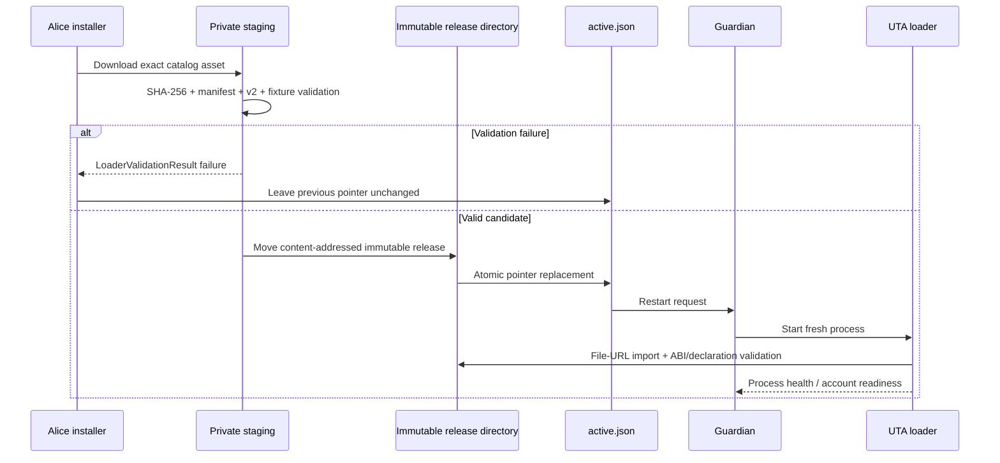

# Provider Projections 与 Broker Pack ABI v2

> **本文拥有：** provider projection 的运行时边界、声明、翻译、传输、恢复、构建和激活契约；不拥有帐票追加、HTTP `/v2/*` 路由、Issue bridge 或类型模块的实现。
>
> **本文展开的冻结决定：** D3（projection release = Broker Pack release、ABI v2、OpenAPI/stream build boundary、`PlacementRecovery<P>`）以及 D11 的 provider 部分（provider-indexed 类型、serializable boundary、decimal/time/cursor discipline）。与 `plans/uta-refactor/spec/00-decision-register.md` 不一致时，以 register 为准；本文件只能增加可检查的实现约束。
>
> **本文使用的类型：** `ProviderTypes`, `Serializable`, `ProviderDeclaration`, `CapabilityTable`, `CapabilityStatus`, `IdempotencyContract`, `ReadByKeyContract`, `WriteContract`, `VerifiedReadByKey`, `ObservationCursorContract`, `OperationKind`, `CoreOperationKind`, `Operation<P>`, `Receipt<P>`, `Observation<P>`, `ProviderKey<P>`, `ProviderOrderRef<P>`, `ProviderEventId<P>`, `ProviderEnvelope`, `OperationEnvelope`, `KeyEnvelope`, `ReceiptEnvelope`, `ObservationEnvelope`, `ConfigEnvelope`, `ProjectionRegistry`, `PlacementRecovery<P>`, `RecoveryAttempt`, `AbsenceProof`, `RecoveryResult<P>`, `RecoveryAction`, `ReceiptProvenance`, `PackModule<D>`, `Translation`, `TransportPlugin`, `TransportRequest`, `TransportResult`, `TransportCause`, `CredentialInput`, `HTTPExecutor`, `WSExecutor`, `CustomPlugin`, `StreamManifest`, `StreamChannel`, `StreamItem<P>`, `LoaderValidationResult`, `Result`, `ParseError`, `ErrorEnvelope`, `ErrorCode`, `DecimalString`, `Money`, `Duration`, `Instant`, `AsOf`, `Cursor`, `IdempotencyKey`, `ProviderId`, `ProjectionVersion`, `IntentId`, `AttemptNo`, `UtaRuntimeConfig`。

## 1. 边界、角色与发布单位

一个 projection 是一个 Broker Pack release，而不是 UTA 内部的 provider class。一个 release 同时提供三类互相独立的能力：

1. **Declaration：** 纯数据，说明 provider、projection 版本、source digest、venue-keyed capability table、传输家族及仅含名称/位置的认证方案。
2. **Translation：** 纯函数，把 `Operation<P>` 编成 provider 请求，把原始响应/事件解码为 `Receipt<P>` 或 `Observation<P>`；原始 payload 在边界保留。
3. **Transport plugin：** 执行 HTTP、WebSocket 或非 HTTP 的 TCP/链上交互；凭据由 composition root 注入。

UTA Core 只通过 `ProviderKey<P>`、`ProviderOrderRef<P>`、`Operation<P>`、`Receipt<P>`、`Observation<P>` 等 provider-indexed 类型工作；`P` 的 phantom 必须绑定 `(ProviderId, ProjectionVersion)`。持久化和 wire existential boundary 使用带 `kind: OperationKind` 的 `ProviderEnvelope{providerId, projectionVersion, kind, payload}`，并按角色使用 `OperationEnvelope`、`KeyEnvelope`、`ReceiptEnvelope`、`ObservationEnvelope`、`ConfigEnvelope`；role-indexed parser/API 不得互换这些 envelope。恢复 `P` 时必须经 `ProjectionRegistry`，禁止依靠 `as` 或类身份。下游调用者只能向一个 UTA read-write entry 投放意图，不能直接调用 pack 的 mutation executor。

[观察] 当前 registry 只检查 API/version、engine、`configSchema` 和 `createBroker`，尚不检查 capability、transport、cursor 或 raw-payload contract（`local://w1-provider-capability.md:86-97`）。[观察] 现有 release 已由 manifest、checksum、realpath containment 和 atomic `active.json` 管理（`local://w1-provider-capability.md:86-95`; `docs/broker-packs.md:79-121`）。下文是 ABI v2 的替换契约，不是对当前 loader 行为的描述。

```mermaid
flowchart LR
  S["Pinned vendor source / non-OAS source"] --> O["Deterministic x-uta overlay"]
  O --> V["Declaration + StreamManifest validation"]
  V --> G["Typed client/parser generator"]
  G --> P["Immutable Broker Pack release"]
  P --> A["Alice checksum + manifest + active.json atomic swap"]
  A --> L["UTA file-URL loader"]
  L --> C["Declaration / Translation / Transport composition"]
  C --> R["Provider IO and raw ProviderEnvelope"]
  R --> F["Receipt / Observation / PlacementRecovery"]
```



## 2. ABI v2 module contract

### 2.1 Module shape

`provider/abi.ts` 中 `PackModule<D extends ProviderDeclaration>` 是唯一 ABI v2 module shape。以下代码块是实现必须满足的结构摘要；`D` 的 mapped handler 约束、provider-local `P` 关联和 `Result` error union 以 `provider/abi.ts` 为单一来源：

```ts
export const BROKER_PACK_API_VERSION = 2
export const declaration: ProviderDeclaration
export const translation: Translation<ProviderTypes>
export const transports: readonly TransportPlugin[]
export const bindings: PackModule<ProviderDeclaration>['bindings']
export const recovery: PackModule<ProviderDeclaration>['recovery']

export type PackModule<D extends ProviderDeclaration> = {
  readonly BROKER_PACK_API_VERSION: 2
  readonly declaration: D
  readonly translation: Translation<ProviderTypes>
  readonly transports: readonly TransportPlugin[]
  readonly bindings: {
    readonly [venue in keyof D['venues']]: {
      readonly [kind in keyof D['venues'][venue] as
        D['venues'][venue][kind] extends {
          readonly direction: 'write'
          readonly status: { readonly kind: 'supported' }
        } ? (
          D['venues'][venue][kind] extends {
            readonly contract: {
              readonly idempotency: { readonly kind: 'none' }
              readonly readByKey: { readonly kind: 'none' }
            }
          } ? never : kind
        ) : never]: TransportPlugin
    }
  }
  readonly recovery: {
    readonly [venue in keyof D['venues']]: {
      readonly [kind in keyof D['venues'][venue] as
        D['venues'][venue][kind] extends {
          readonly direction: 'write'
          readonly status: { readonly kind: 'supported' }
        } ? (
          D['venues'][venue][kind] extends {
            readonly contract: {
              readonly idempotency: { readonly kind: 'none' }
              readonly readByKey: { readonly kind: 'none' }
            }
          } ? never : kind
        ) : never]: PlacementRecovery<ProviderTypes>
    }
  }
}
```

实现约束：

- release entry **MUST** export `BROKER_PACK_API_VERSION` 且值严格为 `2`；**MUST** export `declaration`、`translation`、`transports`、`bindings` 和 `recovery`。provider identity 从 `declaration.providerId` 读取；ABI v2 不再要求单独的 `BROKER_ENGINE` export。
- `PackModule<D>` 的 `bindings` 与 `recovery` 都由 `D` 的 venue-keyed rows 映射得到：只有 `direction:'write'` 且 `status.kind:'supported'`、且不是 `idempotency.kind:'none'` + `readByKey.kind:'none'` 的 kind 才出现对应的 keyed property。每个 keyed property 的 contract 必须与该 venue/kind row 完全一致；supported kind 缺 `bindings[venue][kind]` 或 `recovery[venue][kind]` 时 pack 自己的 typecheck 必须失败。loader 必须执行相同 runtime 检查，返回 `LoaderValidationResult` 的 `MissingHandler`，不能推迟到调用时。
- ABI v2 **MUST NOT** 以 `createBroker` 返回 `IBroker`；也 **MUST NOT** 用旧 `configSchema`/空 `close()`/可选方法矩阵代替 declaration、translation、transport binding 或 recovery。旧 v1 entry 在 load-time 失败，不得被静默适配成 v2。
- `declaration.providerId` 只能与 release manifest、请求的 provider/engine 和每个 configured venue 的 registry identity 一致；实际 venue/config 的能力必须从 `declaration.venues` 解析，不能从 engine 名称推断。
- `declaration` 是可序列化纯数据；`translation` 的确定性部分是纯函数；`transports`、`bindings` 和 `recovery` 是副作用边界。Effect `Layer`/`Cause`/`FiberFailure`/`Schema` 只存在于 `services/uta` composition root，不能进入 Pack ABI；generated OpenAPI client 必须 Effect-free，并只由 transport adapter 的 Promise wrapper 调用。
- `Translation` 必须提供 `encodeOperation(operation: Operation<P>): Result<Serializable, ParseError>`、`decodeOperation(input: Serializable): Result<Operation<P>, ParseError>`、`decodeReceipt(input: Serializable): Result<Receipt<P>, ParseError>` 和 `decodeObservation(input: Serializable): Result<Observation<P>, ParseError>`。`encodeOperation` 只能接收已完成 boundary parse 的 operation；若发现不可编码值，必须返回结构化 `ParseError`/`ErrorEnvelope`，不能返回空 request 或把失败当成 provider call。
- `transports` 中的插件必须声明自己的 transport discriminant；`bindings[venue][kind]` 必须把每个 `supported` write operation 绑定到正确 plugin，read operation/channel 则必须能从 declaration、generated client 和 `StreamManifest` 解析到相同 plugin。loader 必须检查这些 bindings 与 declaration/stream manifest 的对应关系。没有宣称的 transport 不得被 core 猜测或 fallback。
- 一个 pack 只能返回来自自己的 `ProviderId`/`ProjectionVersion` 的 role-indexed envelope；交叉 provider 的 envelope、缺少 `kind`/projection version 的 raw 值、裸 `number` 金融值和未解析的普通 map 都必须被拒绝。`AbortSignal`/cancellation context/deadline 是 ABI control values 的唯一例外，它们不属于 serializable business value 且永不持久化。

### 2.2 API version 与 product version

`BROKER_PACK_API_VERSION` 是 core 与 pack 的兼容闸门；`broker-pack.json#version` 仍表示产生该 release 的 OpenAlice product version，不能拿 product version equality 替代 API compatibility。API v2 的 module contract 发生不兼容改变时，必须递增 `BROKER_PACK_API_VERSION`；同一 API 下 source digest、projection version 或 product version 变化必须产生新的 immutable release。

[观察] 既有文档明确规定 compatibility 由 `BROKER_PACK_API_VERSION` 决定，product version 允许旧 pack 在替换下载期间继续服务（`docs/broker-packs.md:72-77`）。因此 loader **MUST** 先检查 API v2，再判断 projection/source/manifest 是否与目标 release 一致；不能因为 product version 相同就接受 ABI v1。

### 2.3 Load-time 验证顺序

`LoaderValidationResult<P>` 是 loader 的结构化结果。`provider/abi.ts` 的公开 union 只有 `loaded{module}` 和 `invalid{code,path}`；loader **MUST** 把所有内部检查归约到这两个结果，而不能把动态 import 的原始异常直接作为唯一信息：

1. **Resolve release：** 解析指定 engine 的 `active.json`，校验 active pointer、release directory、manifest、entry path 的 schema 与 realpath containment；路径穿越、symlink escape 或错误 engine/projection 映射到 `invalid{code:'ProjectionIdentity',path}`，缺少 entry 映射到 `invalid{code:'MissingHandler',path}`。
2. **Verify bytes：** 校验 release manifest 的 content identity、published SHA-256、package name/version、entry digest 和 source/projection metadata；digest 不匹配同样映射为 `ProjectionIdentity`，且不得 import。
3. **Import only by file URL：** 在受控 runtime 中动态 import 已验证 entry；UTA 不运行 package manager、不下载 vendor document、不解析运行时 OAS。import throw 必须被包装为 `invalid{code:'MissingHandler',path}`，不得把动态异常原样泄漏给 caller。
4. **Check module shape：** `BROKER_PACK_API_VERSION === 2` 且 `declaration`、`translation`、`transports`、`bindings`、`recovery` 存在并有正确 shape；v1、旧 `createBroker` 或缺 API version 映射到 `ApiVersion`/`MissingHandler`，不能隐式转换。
5. **Decode declaration：** 用 `ProviderDeclaration` boundary parser 校验 `ProviderId`、`ProjectionVersion`、source digest、venue-keyed table、`CapabilityStatus`、三种 contract 和 auth names/locations。错误 path 映射到 `DeclarationInvalid`；任何 capability presence boolean、空成功 handler 或重复 venue/kind identity 都失败。
6. **Check projection identity：** compiled declaration 的 provider/projection/source digest 必须与 manifest、`x-uta` build output 和 active release 一致；不一致映射到 `ProjectionIdentity`。source/overlay 只在 build 时验证，runtime 只读取编译后的 declaration。
7. **Check translation/recovery handlers：** 每个 declared kind 都必须有对应 translation handler；每个 `supported` write kind 都必须在 `recovery[venue][kind]` 有 `PlacementRecovery<P>`，并在 `bindings[venue][kind]` 有对应 transport plugin。缺项、kind mismatch 或 supported `none`/`none` 映射到 `MissingHandler`。
8. **Check transport linkage：** 每个 declared supported operation/channel 都必须对应 `HTTPExecutor`、`WSExecutor` 或 `CustomPlugin`；transport discriminant、auth scheme、venue/kind binding 和 stream channel mismatch 映射到 `MissingHandler`。
9. **Check serializable boundary：** declaration、translation probe、transport result 和 recovery output 只能有 `Serializable` records/role-indexed envelope；class/`Decimal`/SDK/Effect value、numeric money 或 secret 映射到 `NonSerializable`。
10. **Publish result：** 只有所有步骤成功才向 `ProjectionRegistry` 发布 `loaded{module}`；任何 `invalid` 都不得修改 `active.json`，不得以旧内存 promise、空对象或 silent fallback 掩盖失败。

因此 `LoaderValidationResult` 的五个稳定 failure codes 分工如下：`ApiVersion`（API/version 或 legacy module）、`DeclarationInvalid`（声明、overlay、contract、pointer）、`MissingHandler`（translation/transport binding/recovery 缺失，亦包括 supported write 的 `none`/`none`）、`NonSerializable`（边界值非法）和 `ProjectionIdentity`（release/source/projection identity 或 digest 不一致）。`path` 必须指出 export、venue/kind、manifest field 或 source pointer；它不是自由格式日志。错误 detail 可以由调用方依据 `path` 再读取安全的 parser report，但 loader **MUST NOT** 保留凭据。

### 2.4 Serializable-only boundary 与 class identity

ABI v2 的跨 pack business values 只能是 JSON-compatible records：`null`、有限标量、canonical decimal strings、branded identity 的 encoded string、数组、tagged records 和带 `kind` 的 role-indexed envelope。所有金额/数量必须是 `DecimalString`；`Decimal`、`Money` 内部对象、`Contract`/`Order` class、SDK response instance、socket handle、`Error` instance、Effect value 和 provider native object **MUST NOT** 跨 boundary。`AbortSignal`、cancellation context 和 deadline 仅作为 control values 传递，永不进入 business payload、raw 或 ledger。
`ProviderEnvelope` 是带 provider/projection/kind 的共同 wire base，不是可在所有位置通用的 alias；`OperationEnvelope`、`KeyEnvelope`、`ReceiptEnvelope`、`ObservationEnvelope`、`ConfigEnvelope` 由各自 role parser/constructor 产生，任何 API 或 ledger entry 都只接受其声明的 role。

这是必要的结构性规则，不是风格偏好。`docs/broker-packs.md:67-70` 指出 pack-local dependency copies 跨越 API boundary，core 不能依赖 pack dependency tree 的 class identity，必须用 structural checks（例如 `Decimal.isDecimal`）和 stable error codes，而不是跨 package `instanceof`。因此：

- pack 内部可以使用自己的 `Decimal`/SDK/class；在返回 core 前必须 encode 成 decimal strings、stable IDs、tagged errors 或 role-indexed raw envelopes。
- core 对输入先按 `unknown` 解析；不能用 `as`、非空断言或 `instanceof` 补造 provider capability。
- 这种 boundary 允许 Alpaca 的 bundled dependency、CCXT/Longbridge 的独立 dependency tree，以及未来 Rust/IPC/WASM implementation 使用相同的 records；它不让任何实现依赖 Node module identity。
- raw payload 也必须是可序列化 snapshot。若 provider runtime 对外暴露 class，translation 必须先转为 plain record，同时保留 provider 原始字段和来源。

## 3. ProviderDeclaration 与 capability table

### 3.1 Declaration 结构

`ProviderDeclaration` 是某个 projection release 的纯数据声明。`provider/declaration.ts` 的公开字段必须完整满足下表；不要在 declaration 中复制一份另行命名的 `capabilities` 或 `streams` 字段：

| 字段 | 规则 |
|---|---|
| `providerId` | 稳定 `ProviderId`，不得使用 class name 或临时 engine alias。 |
| `projectionVersion` | `ProjectionVersion`，独立于 vendor `info.version`、product version 和 API version。 |
| `sourceDigest` | source bytes 的 SHA-256 encoded string；build 和 loader 必须核对同一值。 |
| `venues` | `Readonly<Record<string, CapabilityTable>>`；第一层 key 必须是 configured venue key，第二层 key 必须是与 `Operation<P>.kind`/`scope.operationKind` 相同的 namespaced kind（当前 placement literal 为 `order.place`）。不得放一个 engine-wide capability row。 |
| `transportFamily` | `readonly ('http' | 'ws' | 'custom')[]`；每个 declared operation 的实际 transport family 必须在其中可查，不能由 provider 名称推断。 |
| `auth` | `readonly {name, location}` records；`location` 只能是 `header`、`query`、`body` 或 `session`。仅含 scheme names/locations，绝不包含 secret value。 |

`CapabilityTable` 是 kind-keyed table；每一行必须是以下两个方向之一：

```ts
type CapabilityTable = Readonly<Record<OperationKind,
  | { readonly direction: 'read'; readonly status: CapabilityStatus; readonly cursor: ObservationCursorContract }
  | { readonly direction: 'write'; readonly status: CapabilityStatus; readonly contract: WriteContract }
>>
```

`read` row 以 `cursor` 明确 observation 是否可恢复；`write` row 以 `contract` 携带 `IdempotencyContract` + `ReadByKeyContract`。write kind 的 `PlacementRecovery<P>` 不放进 row，而以 `PackModule<D>.recovery[venue][kind]` 与 row 的 `WriteContract` 对齐，`PackModule<D>.bindings[venue][kind]` 同样必须与该 row 对齐。`x-uta.capabilities` 在 build 时 materialize 为 `ProviderDeclaration.venues`；overlay 的 operation/pointer metadata 只用于生成与校验，不在 declaration 中复制成第二套字段。`StreamManifest` 是独立 build artifact；没有 stream 时，相关 read row 使用 `ObservationCursorContract{kind:'none'}` 或 `snapshotOnly`，不能从缺字段猜测。
`OperationKind` 必须先经 `parseOperationKind` 验证 namespaced dotted grammar；`CoreOperationKind` 只接受当前核心集合 `order.place`、`order.modify`、`order.cancel`、`position.close`。projection 可以声明其他 namespace，但必须保持 key、`Operation<P>.kind`、ledger `scope.operationKind` 和 `x-uta-kind` 字面完全相同，不得依赖 implicit alias。
`supported` write row **MUST NOT** 同时拥有 `idempotency.kind:'none'` 与 `readByKey.kind:'none'`；这是 `PackModule<D>` mapped `bindings`/`recovery` 的静态不可构造条件，dynamic loader 必须以 `MissingHandler` 为 runtime mirror。`unsupported`/`conditional` row 仍须显式携带两个 contract，不能因不可写而省略。

`CapabilityStatus` 是唯一的 capability availability 判别联合：

```ts
type CapabilityStatus =
  | { readonly kind: 'supported' }
  | { readonly kind: 'unsupported'; readonly reason: string }
  | { readonly kind: 'conditional'; readonly condition: string }
```

`unsupported` 表示该能力在当前声明下不可用；`conditional` 必须给出可以在 account config load 时检查的 condition（例如具体 `ccxt-custom` venue/version）；`supported` 只表示 declaration 有完整 handler 和验证过的 contract，不表示 provider 已接受某次 intent。三种 variant 必须穷尽处理；TypeScript 分派必须以 `assertNever` 让新增 variant 暴露 compiler error。

**禁止事项：** capability table 不得出现 `supportsWrite`、`hasReadByKey`、`isResumable`、`readOnly` 或任何以 presence boolean 表示能力的字段；不得用 optional method、空数组、`undefined`、空对象或 no-op `close()` 代替 `CapabilityStatus`。`reuseAfterTerminal: boolean | 'unverified'` 是 `uniqueKey` contract 内部对 provider 事实的精确值，不是 capability presence flag，仍须按 contract 的 `kind` 穷尽处理。

### 3.2 三个 contract 与 `unverified`

以下三类 contract 是 register 的精确 vocabulary；代码中采用 `kind` discriminator。`'unverified'` 表示 evidence 尚未证明该事实，不能被当作肯定或否定；它会阻断只能由 verified evidence 支持的恢复分支。

```ts
type IdempotencyContract =
  | {
      readonly kind: 'cachedReplay'
      readonly keyField: string
      readonly scope: string
      readonly retention: Duration
    }
  | {
      readonly kind: 'uniqueKey'
      readonly keyField: string
      readonly scope: string
      readonly window: Duration | 'untilTerminal' | 'unverified'
      readonly reuseAfterTerminal: boolean | 'unverified'
      readonly duplicateResponse:
        | 'rejectsWithCode'
        | 'returnsExisting'
        | 'unverified'
    }
  | { readonly kind: 'none' }

type ReadByKeyContract =
  | {
      readonly kind: 'byClientKey'
      readonly operation: string
      readonly coverage: 'openOnly' | 'openAndHistory' | 'unverified'
      readonly historyWindow: Duration | 'unverified'
      readonly ambiguity: 'unique' | 'latestMatch'
    }
  | {
      readonly kind: 'byProviderRef'
      readonly coverage: 'openOnly' | 'openAndHistory' | 'unverified'
      readonly historyWindow: Duration | 'unverified'
    }
  | { readonly kind: 'none' }

type ObservationCursorContract =
  | {
      readonly kind: 'resumable'
      readonly channel: string
      readonly encoding: string
      readonly replayWindow: Duration
    }
  | { readonly kind: 'snapshotOnly' }
  | { readonly kind: 'none' }
```

`VerifiedReadByKey` 是 `ReadByKeyContract` 的 refinement：其 `coverage` 和 `historyWindow` 没有 `'unverified'`，并且 provider read 的 absence semantics 已经由 fixture/纸面或 sandbox evidence 验证。只有 `VerifiedReadByKey` 才可以构造 `confirmedAbsent`。

对每一个 write kind：

- declaration **MUST** 同时给出 `IdempotencyContract` 和 `ReadByKeyContract`，即使值为 `none`；缺失是 declaration failure，不是 `unsupported` 的隐式默认。
- `supported` write **MUST** 给出 placement operation、translation、transport 和 `PlacementRecovery<P>`；其中任一项不可构造时，该 kind **MUST** 以 `unsupported`/`conditional` 表达，不得注册 writable handler。
- `ReadByKeyContract` 的 provider response 为空、404 或 duplicate rejection 只有在 `VerifiedReadByKey` 的 coverage/window 证明下才可能成为 absence proof。duplicate-probe rejection 永远首先证明 presence，不能直接生成 `confirmedAbsent`。

### 3.3 当前五家声明 literal

以下表是五个 worked flow 和 TypesOwner `README` 的共同 contract literal；README 章节为 `## 五家提供商声明与恢复可达性`。五个 evidence fixture 的 write row 当前均为 `unsupported/NoPlacementRecovery`，表中最后一列表示正确 witness wrapper 接入后允许的 `RecoveryResult`，不是当前 adapter 已注册的写 handler。`600000ms`、`86400000ms` 是 `Duration` 的文档记法，实际构造由 `time.ts` 提供。

| provider / venue | `IdempotencyContract` | `ReadByKeyContract` | `ObservationCursorContract` | witness 接入后可达恢复结果 |
|---|---|---|---|---|
| Alpaca / `alpaca` | `uniqueKey{keyField:'client_order_id',scope:'account',window:'unverified',reuseAfterTerminal:'unverified',duplicateResponse:'unverified'}` | `byClientKey{operation:'getOrderByClientOrderId',coverage:'unverified',historyWindow:'unverified',ambiguity:'unique'}` | `snapshotOnly` | `found`、`stillUnknown`；没有 `confirmedAbsent` |
| Longbridge / `longbridge` | `cachedReplay{keyField:'client_request_id',scope:'account',retention:600000ms}` | `byProviderRef{coverage:'unverified',historyWindow:'unverified'}` | `snapshotOnly` | `found`、`stillUnknown`；没有 `confirmedAbsent` |
| OKX / `okx` | `uniqueKey{keyField:'clOrdId',scope:'account',window:'untilTerminal',reuseAfterTerminal:true,duplicateResponse:'unverified'}` | `byClientKey{operation:'getOrder',coverage:'openAndHistory',historyWindow:'unverified',ambiguity:'latestMatch'}` | `snapshotOnly` | `found`、`ambiguous`、`stillUnknown`；没有 `confirmedAbsent` |
| IBKR Client Portal / `ibkr-cp` | `uniqueKey{keyField:'cOID',scope:'account',window:86400000ms,reuseAfterTerminal:'unverified',duplicateResponse:'unverified'}` | `byProviderRef{coverage:'unverified',historyWindow:'unverified'}` | `snapshotOnly` | `found`、`stillUnknown`；没有 `confirmedAbsent` |
| Bybit / `bybit` | `uniqueKey{keyField:'orderLinkId',scope:'account',window:'unverified',reuseAfterTerminal:'unverified',duplicateResponse:'rejectsWithCode'}` | `byClientKey{operation:'getOrder',coverage:'openOnly',historyWindow:'unverified',ambiguity:'unique'}` | `snapshotOnly` | `found`、`stillUnknown`；没有 `confirmedAbsent` |

[观察] Wave-1 provider evidence 同时指出现有 adapter 没有把这些 key、keyed read 或 cursor 暴露到 `IBroker`，所以当前 adapter 不能据此声称 A7 conforming（`local://w1-provider-capability.md:24-49`）。上表是新 pack declaration literal；它不是现有 adapter 的事实覆盖。

## 4. `x-uta` overlay

### 4.1 Namespace 与合并规则

`x-uta` 是唯一由 UTA 解释的 OpenAPI extension namespace。vendor 的其他 `x-*` 仍保持 opaque，generated client 不得擅自解释。overlay **MUST** 作为独立 immutable artifact 叠加在原始 OAS 上，不能改写 vendor source。

允许的 root vocabulary：

| key | 约束 |
|---|---|
| `x-uta.schemaVersion` | overlay schema 版本；与 OAS `openapi` 和 vendor `info.version` 独立。当前值为 `1`。 |
| `x-uta.provider` | 稳定 `ProviderId`；必须与 `ProviderDeclaration.providerId` 一致。 |
| `x-uta.projectionVersion` | projection 版本；必须与 declaration/release 一致。 |
| `x-uta.sourceDigest` | source bytes digest；必须与 build input 和 declaration 一致。 |
| `x-uta.capabilities` | venue-keyed → kind-keyed capability index；是 declaration 的 build-time source。 |
| `x-uta.auth` | scheme names/locations；不得有 secret value。 |
| `x-uta.streamManifest` | `StreamManifest` artifact identity/digest；stream semantics 不伪装成 REST path。 |

允许的 operation vocabulary：`x-uta-channel`（`read-only` 或 `read-write`）、`x-uta-kind`、`x-uta-idempotency-key`、`x-uta-read-by-key`、`x-uta-as-of` 和 `x-uta-observation-cursor`。这些 key 的值必须对应 declaration row；不一致时 reject，不得在 root/operation 两份值中任选一份。

`x-uta-idempotency-key` 必须说明 provider field location（`in` + JSON Pointer/header/query name）、provider field name、scope 和 UTA 是否必须注入；其中 `requiredByUta` 只表示请求字段的注入要求，绝不能被当作 capability presence boolean。`x-uta-read-by-key` 必须绑定一个 read operation 及 key mapping；`x-uta-as-of` 必须绑定 provider-reported timestamp/sequence pointer；`x-uta-observation-cursor` 必须绑定 encoding、replay/gap/backfill 和 stream end semantics。HTTP direction、kind、operation ID、JSON Pointer、security scheme 和 response status 每一项都必须能被 validator 定位。

合并过程固定为：parse vendor source → parse overlay → resolve `$ref` → validate root index → validate operation annotations → materialize declaration/manifest → generate. Overlay 不能改变 vendor schema 的含义而不留下新 digest；vendor `$ref`/union 解析失败、operation annotation 重复或 root/operation disagreement 都必须 build reject。

### 4.2 完整 Alpaca projection 示例

下面是一个可作为 pack evidence fixture 起点的完整最小投影：`vendor/trading-api.json` 是 pinned 的官方 Alpaca `trading-api.json` 全文，`components/schemas/CreateOrderRequest` 与 `Order` 通过显式 external `$ref` 解析；所有 `x-uta` 内容由 projection 自己拥有。由于 wave-1 未提供 source bytes 和 digest，fixture 中 digest 使用 `unverified`，不能直接发布；pack build MUST 在 pin/fetch 阶段计算并写入真实 SHA-256。OAS source 的两个 `operationId` 是 `postOrder` 与 `getOrderByClientOrderId`，其中 declaration 的 `order.place` write row 绑定 `postOrder`，`ReadByKeyContract.operation` 绑定 `getOrderByClientOrderId`；build 必须验证 namespaced `OperationKind` `order.place`/`order.observe`、root capability row、operation annotation 与 generated operation map 一一对应，不能让它们指向不同 operation。当前没有 witness，故此 fixture 的 write status 也明确为 `unsupported`，不是可执行写入承诺。

```yaml
openapi: 3.1.2
info:
  title: Alpaca Trading API (UTA projection)
  version: 2.0.1+uta.1
servers:
  - url: https://paper-api.alpaca.markets
x-uta:
  schemaVersion: 1
  provider: alpaca
  projectionVersion: 2.0.1+uta.1
  sourceDigest: unverified
  auth:
    schemes:
      - name: APCA-API-KEY-ID
        in: header
        field: APCA-API-KEY-ID
      - name: APCA-API-SECRET-KEY
        in: header
        field: APCA-API-SECRET-KEY
  streamManifest:
    path: streams/alpaca.yaml
    digest: unverified
  capabilities:
    alpaca:
      "order.place":
        direction: write
        status:
          kind: unsupported
          reason: NoPlacementRecovery
        operation: postOrder
        contract:
          idempotency:
            kind: uniqueKey
            keyField: client_order_id
            scope: account
            window: unverified
            reuseAfterTerminal: unverified
            duplicateResponse: unverified
          readByKey:
            kind: byClientKey
            operation: getOrderByClientOrderId
            coverage: unverified
            historyWindow: unverified
            ambiguity: unique
      "order.observe":
        direction: read
        status:
          kind: supported
        operation: getOrderByClientOrderId
        cursor:
          kind: snapshotOnly
paths:
  /v2/orders:
    post:
      operationId: postOrder
      x-uta-channel: read-write
      x-uta-kind: order.place
      x-uta-idempotency-key:
        in: body
        path: /client_order_id
        requiredByUta: true
        scope: account
      x-uta-read-by-key: getOrderByClientOrderId
      requestBody:
        required: true
        content:
          application/json:
            schema:
              $ref: '#/components/schemas/CreateOrderRequest'
      responses:
        '200':
          description: Provider response; UTA records receipt and any provider observation separately.
          content:
            application/json:
              schema:
                $ref: '#/components/schemas/Order'
  /v2/orders:by_client_order_id:
    get:
      operationId: getOrderByClientOrderId
      x-uta-channel: read-only
      x-uta-kind: order.observe
      x-uta-as-of:
        response: /updated_at
        semantic: provider-reported
      parameters:
        - in: query
          name: client_order_id
          required: true
          schema:
            type: string
            maxLength: 128
      responses:
        '200':
          description: Upstream order observation.
          content:
            application/json:
              schema:
                $ref: '#/components/schemas/Order'
components:
  schemas:
    CreateOrderRequest:
      $ref: './vendor/trading-api.json#/components/schemas/CreateOrderRequest'
    Order:
      $ref: './vendor/trading-api.json#/components/schemas/Order'
```

实现 Alpaca 时必须额外完成以下动作：

1. `Operation<P>` encode handler 为每个 placement 生成或接收稳定 `IdempotencyKey`，把其 canonical string 注入 `/client_order_id`，并在发送前校验 provider 的 128-character bound；upstream schema 中 optional 的 `client_order_id` 不能导致 UTA request optional。
2. HTTP response 首先构造 `ProviderEnvelope{providerId:'alpaca', projectionVersion, kind:'order.place', payload}`；再按 outcome 构造 `ReceiptEnvelope`，`Order` 的 typed subset 可成为 `ObservationEnvelope`/associated observation，但 `200` 本身只能产生 receipt，不得直接宣称 fill/position final truth。
3. `GET /v2/orders:by_client_order_id` 的 404/empty result 不能生成 `confirmedAbsent`，因为 declaration 的 coverage/historyWindow 仍为 `'unverified'`；只有 matching `client_order_id` 和 payload correlation 才能生成 `found`。
4. activity/event stream 的 cursor 与 trade-update WS cursor 分开声明。Wave-1 明确活动 SSE 可 replay historical→new，而 trade-update WS replay cursor 尚未 established；不能把 “Alpaca 有 WS” 当作 `resumable` proof（`local://w1-provider-capability.md:31,103`; `local://w1-provider-capability.md:132`）。

[观察] 官方 OAS 中存在 `POST /v2/orders`、client-key read、API-key headers 和 optional `client_order_id`；上例的 operation/schema names 与 source 一致，强制 UTA 注入 key 是 overlay rule（`local://w1-openapi-projection.md:44-58,116-187`）。[未验证] 没有 authenticated request、duplicate replay 或 sandbox recovery run；验证方法是 paper/sandbox fixture 依次执行 generated placement、keyed read、timeout/recovery 和 stream reconnect，不把文档字段当作 live guarantee。

### 4.3 `x-uta` build rejection list

build **MUST** reject（返回可定位的 `LoaderValidationResult`/build failure，而不是降级为 `unsupported`）以下情况：

- vendor OAS/YAML/JSON、overlay 或 `StreamManifest` malformed；OAS version、overlay schema version 或 AsyncAPI-shaped version 不被 parser 支持；
- source digest、overlay digest、declared projection version、vendor `info.version` 或 release manifest 不一致；
- `$ref` unresolved、circular reference 无 declared handling、schema pointer 不存在、pointer 指向错误类型、union/status/content-type 无法确定；
- duplicate `operationId`、duplicate generated operation key、duplicate venue/kind identity、同一 kind 同时绑定不同方向或不同 read-by-key operation；
- `x-uta-channel` 不是 `read-only|read-write`，kind 缺失，read-write operation 缺少 idempotency key/read-by-key，或者 operation 注释与 root `capabilities` disagreement；
- `x-uta-idempotency-key` 位置/name/pointer 不存在、无法写入 request、scope 缺失，或 required-by-UTA 的 provider field 仍无法由 generated handler 注入；
- `x-uta-read-by-key` 无对应 read operation、key mapping 不同、coverage/window/ambiguity 不属于 `ReadByKeyContract`，或者把 unverified evidence 声称为 `VerifiedReadByKey`；
- `x-uta-as-of` 指向本地 receive time、不可解析的 provider field，或把 response receipt 字段误标为 upstream fact；
- stream channel、message discriminant、event identity/order、cursor encoding、reconnect/gap/backfill 或 end reason 缺失；
- `CapabilityStatus{kind:'supported'}` 没有 translation/transport/witness，`none`/`none` 却导出 writable handler，或 `conditional` 缺少可检查 condition；
- generated fixture 丢失 `x-uta`、`$ref`、readOnly/writeOnly、union、multi-status/content-type/security 任一语义；
- module export、translation output、transport result 或 credentials path 包含 class instance、`Decimal`、SDK object、Effect value、secret、non-finite number、numeric money 或不可序列化 payload；
- build 试图把 vendor runtime document 放进 activation 依赖，或试图在 runtime 重新下载/解析 source。

显式 `CapabilityStatus{kind:'unsupported'}` 本身不是 build failure；它是合法 partial projection。真正的 failure 是“positive claim 与 artifact/witness 不一致”，不得为了安装成功把它改写成 unsupported。

## 5. `StreamManifest`：AsyncAPI-shaped stream contract

### 5.1 Schema

`StreamManifest` 是 UTA-owned、与 OAS 分开的 immutable artifact。输入可以是 AsyncAPI-shaped YAML/JSON；build 将其校验并 materialize 为 `provider/abi.ts` 的精确 serializable shape：

```ts
type StreamManifest = {
  readonly version: 1
  readonly channels: readonly StreamChannel[]
}

type StreamChannel = {
  readonly name: string
  readonly cursor: 'resumable' | 'snapshotOnly'
  readonly endReasons: readonly ('closedByProvider' | 'deadline' | 'drain' | 'authRevoked')[]
}
```

```ts
type StreamItem<P extends ProviderTypes> =
  | {
      readonly kind: 'event'
      readonly channel: string
      readonly eventId?: ProviderEventId<P>
      readonly asOf: AsOf
      readonly providerTime?: AsOf
      readonly cursor?: Cursor
      readonly payload: Serializable
    }
  | {
      readonly kind: 'gap'
      readonly channel: string
      readonly reason: 'cursorExpired' | 'resubscribed' | 'providerReset'
      readonly lastCursor?: Cursor
    }
  | {
      readonly kind: 'ended'
      readonly channel: string
      readonly reason: 'closedByProvider' | 'deadline' | 'drain' | 'authRevoked'
    }
```

Stream supervisor **MUST** construct `Observation<P>` only from `StreamItem{kind:'event'}`. `gap` MUST trigger the manifest-declared backfill/resnapshot rule and remain observable as a transport/reconciliation record; it is never an observation and never silently dropped. `ended` MUST enter reconnect classification using its exact reason (`closedByProvider`, `deadline`, `drain`, `authRevoked`); it is not an observation. The `channel` in every item must resolve to one `StreamManifest.channels` row.

AsyncAPI-shaped source **MUST** additionally describe servers/address、transport binding、auth scheme names、send/receive direction、message discriminants/payload schema、provider event identity/order/asOf、snapshot/delta relation、gap/backfill operation、reconnect input/output and rate/backpressure policy. These fields are validated at build and retained in source/manifest metadata; the ABI-normalized `StreamManifest` carries only the canonical `version`/`channels` records above. Every channel's lifecycle is owned by `WSExecutor.open`/returned `close` or `CustomPlugin.execute`/`close`; the UTA supervisor supplies the acquire/release/reconnect policy around those methods. The item stream is the tagged `StreamItem` union below, not an untyped `AsyncIterable<Serializable>`.

`ObservationCursorContract{kind:'resumable'}` 只有在 source manifest 同时给出 stable ordering/checkpoint、reconnect resume、gap/backfill semantics 和 verified finite `Duration` replay window 时才可声明；单页 token、OHLCV timestamp 或 request ID 不是 observation cursor。当前五家 literal 均为 `snapshotOnly`，直到 pack fixture 验证 provider 的 replay/resume 语义。`StreamChannel.endReasons` 只能使用 `closedByProvider|deadline|drain|authRevoked`；`disconnect`/`timeout` 是 transport failures，应归约为 `gap{reason:'providerReset'}` 或对应的 reconnect classification，不得写入 end reason。auth failure/gap requiring backfill 等 richer source causes 留在 transport/error record，不得扩展 ABI union 而不改 API version。

### 5.2 一个 manifest 示例

下面示例描述 Alpaca paper market WS 的最小接收 channel；它**故意**使用 `snapshotOnly`，因为本证据包未验证 trade-update WS 的 replay cursor。若 pack 另声明活动 SSE replay，必须使用独立 channel/manifest row，不得复用该 WS cursor。

```yaml
asyncapi: 3.0.0
info:
  title: Alpaca market stream (UTA manifest)
  version: 2.0.1+uta.1
servers:
  paper:
    host: stream.data.alpaca.markets
    pathname: /v2
    protocol: wss
    security:
      - apiKeyId: []
      - apiSecretKey: []
channels:
  marketData:
    address: /v2/iex
    messages:
      trade:
        $ref: '#/components/messages/Trade'
      quote:
        $ref: '#/components/messages/Quote'
operations:
  receiveMarketData:
    action: receive
    channel:
      $ref: '#/channels/marketData'
    messages:
      - $ref: '#/channels/marketData/messages/trade'
      - $ref: '#/channels/marketData/messages/quote'
x-uta:
  schemaVersion: 1
  provider: alpaca
  projectionVersion: 2.0.1+uta.1
  channel: marketData
  cursor:
    kind: snapshotOnly
  eventIdentity:
    field: t
    ordering: provider-reported
  reconnect:
    mode: resubscribe-from-snapshot
    gapAction: backfill-required
  endReasons:
    - closedByProvider
    - deadline
    - drain
    - authRevoked
components:
  messages:
    Trade:
      payload:
        $ref: '#/components/schemas/Trade'
    Quote:
      payload:
        $ref: '#/components/schemas/Quote'
  schemas:
    Trade:
      type: object
      required: [T, S, p, s, t]
      properties:
        T: { type: string }
        S: { type: string }
        p: { type: string }
        s: { type: string }
        t: { type: string }
    Quote:
      type: object
      required: [T, S, bp, bs, ap, as, t]
      properties:
        T: { type: string }
        S: { type: string }
        bp: { type: string }
        bs: { type: string }
        ap: { type: string }
        as: { type: string }
        t: { type: string }
```

`x-uta` fields in this example are manifest metadata, not a claim that `provider-event-id` is a durable replay cursor. The UTA supervisor's reconnect action must receive the last accepted `Cursor`; for `snapshotOnly`, it performs a fresh snapshot/resubscription and emits a new observation boundary. A gap or out-of-order event must never be silently dropped or assigned local receive time as `asOf`.

## 6. Translation、raw retention 与错误 taxonomy

### 6.1 Translation boundary

每一笔 provider bytes/JSON/event/callback 在进入 translation 时都必须先构造精确的带 operation `kind` 的 `ProviderEnvelope{providerId, projectionVersion, kind, payload}`，再由 role-indexed parser 构造 `OperationEnvelope`、`KeyEnvelope`、`ReceiptEnvelope` 或 `ObservationEnvelope`；二进制 bytes 必须先编码为确定性的 serializable string/record。`source`、channel identity、provider-reported time 等额外 provenance 必须编码在 `payload` 或随后构造的 `Observation<P>` 中，不能擅自扩展 envelope 的 ABI 字段。raw envelope **MUST** 先被保留，再尝试 typed decode；decode 成功与否都不能决定 raw 是否存在。

翻译规则：

1. `Operation<P>` → provider request 是 pure encode；`encodeOperation` 返回 `Result<Serializable, ParseError>`，`error` 分支必须在 send 前变成结构化 `notSent`/`ProviderTransportFailure`，不能伪造 request。它只能依据 operation、declaration 和注入凭据的 auth binding 形成 request，不得改变 intent ID、`IdempotencyKey`、payload hash 或 kind。
2. provider response → `Receipt<P>` 只表达 placement boundary（accepted/rejected/unknown）；持久化时必须使用 `ReceiptEnvelope`，且 provenance 只对 `accepted` 有意义。任何 fill、position、balance、updated order state 都必须另外形成 `Observation<P>`/`ObservationEnvelope`，即使同一 HTTP response 同时包含两者。
3. provider event/snapshot entering a stream executor → 必须先编码为 `StreamItem{kind:'event'}`；stream path 的 `Observation<P>` 只能由该 `event` 构造，并保留 `asOf`/provider event time、source/channel/cursor；local receive time 只能作为 `recordedAt`，不能冒充 upstream time。`gap`/`ended` 永远不构造 observation；HTTP response 的 associated observation 仍遵循上一条 response translation 规则。
4. 已知字段可局部 decode；未知字段继续留在 raw envelope。partial translation 必须明确“已翻译部分”和“untranslated/unsupported 部分”，禁止静默删除、默认值补齐、空列表成功或字符串化异常。
5. kind 没有 declaration、translation 或 transport 时，返回 `unsupported`；不要尝试 provider method name、不要用 `undefined`/empty implementation 猜能力。
6. decode 需要 `assertNever` 穷尽 provider message/status union；新增 provider variant 必须触发 fixture/compiler failure，不能 `default: ignore`。

### 6.2 五种错误变体

translation/transport 层必须保留以下互不替代的 tags；HTTP/SDK boundary 再映射到 `ErrorEnvelope` 的稳定 `ErrorCode`。同一失败可有“write outcome + cause”两层：例如已发送但 response JSON 解析失败，write outcome 是 `unknown{cause:'parseFailure'}`，cause 仍可由 raw/error record 审计。

| tag | 发生条件 | ledger/retry 语义 | wire `ErrorCode` |
|---|---|---|---|
| `notSent` | 能证明 provider call 未发出（encode/connection-before-send/local deadline）；不得声称 upstream 未写入。 | 不追加 provider receipt；若 policy 允许，可复用同一 key 重投；记录结构化 transport failure。 | `ProviderTransportFailure` |
| `unknown` | call 已发出或无法证明未发出，但无可确认 response（timeout/disconnect/lost response/process restart）；不能当 rejected。 | 追加 `receipt.recorded` unknown，运行 `PlacementRecovery<P>`；禁止 blind retry。 | `ProviderUnknown` |
| `rejected` | provider 返回明确拒绝，含 provider code/request ID/raw body。 | 追加 rejected receipt；同一 attempt 不自动重投；后续补偿必须是新 intent。 | `ProviderRejected` |
| `parseFailure` | 已收到 bytes/JSON，但 schema/union/decimal/time/cursor parser 失败。 | raw envelope 必须保留；read parse failure 不制造 observation；write 在已发送时进入 `unknown{cause:'parseFailure'}`。 | `ProviderParseFailure` |
| `unsupported` | declaration/status 没有能力、条件不满足或缺 handler；不调用 provider。 | 不创建 attempt/provider side effect；返回 capability rejection。 | `CapabilityUnsupported` |

`notSent` 与 `unknown` 的分界必须由 transport executor 提供 send evidence；“Promise reject”本身不等于 notSent。`TransportResult{kind:'responded'}` 即使 HTTP status 是 provider reject，也不等于 accepted。`rejected` 的 provider code/request ID/raw 必须可审计；`parseFailure` 不能被转成成功空对象；`unsupported` 不能被转成 404、空成功或通用异常。

### 6.3 Raw 与 ledger 的关系

raw source/projection metadata 属于 pack/config/runtime state；raw response/event、intent、attempt、receipt、unknown、observation 和 recovery result 按 `03-ledger-and-persistence.md` 的 ledger contract 持久化。raw `ProviderEnvelope` 不是事实本身：只有带 provider source/asOf 的 `ObservationEnvelope`/`Observation<P>` 才进入上游事实 projection。`receipt.recorded.receipt` 只能是 `ReceiptEnvelope`；provenance 仅在 `accepted` 有意义。recovery `found` 必须在同一 frame 追加 recovered `receipt.recorded` 与 `observation.recorded`，并由 `recovery.resolved.found{receiptEntryId,observationEntryId}` 引用它们；fold 只读这两个 entry kind。任何 raw retention failure 都必须让 translation/ledger consumer 看到 failure，不得为完成视图而丢原文。

## 7. Transport plugin interfaces 与 credential injection

### 7.1 Common plugin rules

`TransportPlugin` 是按 transport discriminant 组合的 plugin，而不是一个拥有 optional methods 的总对象；`provider/abi.ts` 的 exact union 为 `HTTPExecutor | WSExecutor | CustomPlugin`。每个 plugin **MUST** 对其声明的 operation/channel 给出可执行 handler；不支持的 operation 由 declaration 明确表示。ABI transport request/result 的 canonical shape 如下：

```ts
type CredentialInput =
  readonly { readonly name: string; readonly value: string }[]

type TransportRequest = {
  readonly kind: OperationKind
  readonly deadline: Duration
  readonly control: { readonly signal?: AbortSignal }
}

type TransportResult =
  | {
      readonly kind: 'responded'
      readonly status: number
      readonly requestId?: RequestId
      readonly rawBody: Serializable
      readonly providerTime?: AsOf
      readonly payload: Serializable
    }
  | { readonly kind: 'notSent'; readonly cause: ParseError | TransportCause }
  | {
      readonly kind: 'unknown'
      readonly cause: 'timeout' | 'disconnect' | 'noResponse' | 'processRestart' | 'parseFailure'
      readonly sendEvidence: Serializable
    }
```

`TransportResult{kind:'responded',status,requestId?,rawBody,providerTime?,payload}` 交给 translation 构造带相同 `kind` 的 `ProviderEnvelope` 与 role-indexed receipt/observation；`notSent`/`unknown` 再由 core 映射到 §6 的 error taxonomy。`control.signal` 和 `deadline` 只控制本次调用，不得落入 raw/ledger。`responded` 不把 provider `rejected`/parser `parseFailure` 假装成另一传输变体：前者来自 status/payload，后者来自 response decode；两者仍须保留 `rawBody`。

### 7.2 `HTTPExecutor`

`HTTPExecutor` 面向 generated OpenAPI client，canonical ABI signature 为：

```ts
interface HTTPExecutor {
  readonly kind: 'http'
  execute(
    request: TransportRequest,
    credentials: CredentialInput,
  ): Promise<TransportResult>
}
```

`request.kind` 必须与 declaration 的 namespaced operation kind 对齐；generated request body/query/path 由 adapter 从已成功的 `encodeOperation` result 形成，不能由 core 侧的 raw map 猜测。`request.deadline` 是 branded `Duration`，`request.control.signal` 是 interruptibility control；二者不能持久化。`credentials` 由 composition root 注入。executor 入口必须立即按 declaration/auth binding 验证 header/query/body/session mapping，不允许把宽类型继续传给 domain。`execute` 必须保留 HTTP status、request ID、raw body、send evidence 和 provider time；它不得在 2xx 下直接返回 final observation，也不得自动重试 write。

`WSExecutor` 的 canonical ABI 是 `open` + returned `close`；UTA supervisor 将它们解释为 acquire/release，并负责 reconnect/cursor policy。其 `events` 只能产出 `StreamItem`：

```ts
interface WSExecutor {
  readonly kind: 'ws'
  open(
    request: TransportRequest,
    credentials: CredentialInput,
  ): Promise<{
    readonly events: AsyncIterable<StreamItem<ProviderTypes>>
    close(): Promise<void>
  }>
}
```

因此 `open` 成功后必须注册 release finalizer；取消、异常、正常结束都必须调用返回的 `close()` 一次。每个 `event` 的 `asOf`/可选 `eventId`/optional `Cursor` 必须由 provider stream/parser 产生并按 `(provider, venue/account, channel)` scope 保存；不能由 local timestamp 替代。`gap` 与 `ended` 的 reason 必须按 §5.1 的 exact union 解释。

`reconnect` 是 supervisor 的显式动作：先对旧 handle 执行 `close`（release），再以 `TransportRequest{kind, deadline, control}` 重新 `open`，把最后确认的 serialized `Cursor` 或 fresh-snapshot directive 绑定到 adapter-local request context；不得在 plugin 外另造不可序列化 socket handle。`StreamItem{kind:'gap'}` 必须触发 manifest 的 backfill/resnapshot；`StreamItem{kind:'ended'}` 按 `closedByProvider|deadline|drain|authRevoked` 分类，不能跳过事件。若 declaration 为 `snapshotOnly`，重开必须标出 fresh snapshot boundary。100 个或更多并发 upstream sockets 的 supervisor 必须有 bounded queue/backpressure；stream fan-out 与 account write serializer 分离。当前 M4 的 100/200 socket synthetic probe 只证明 TypeScript/Bun 可行，不证明 provider rate limits 或 durable fan-out（`local://w1-language-runtime.md:1-16,181-185`）。

executor 不得在 `events` 消费中隐式 append ledger；消费端决定是否把 event observation 用于对账或新 intent。`close` error 必须可观察，但不得撤销已经交付的 observations。

### 7.4 `CustomPlugin`

`CustomPlugin` 的 canonical ABI 为：

```ts
interface CustomPlugin {
  readonly kind: 'custom'
  readonly protocol: string
  execute(request: TransportRequest, credentials: CredentialInput): Promise<TransportResult>
  close(): Promise<void>
}
```

它用于 TWS framed TCP、Longbridge protobuf/Rust context、LeverUp relayer/RPC、链上 event log 等无法诚实投影为 OpenAPI 的交互。对于有 session 的 custom transport，`execute` 内部必须 acquire/use/release；持续 stream 只能通过 `TransportResult{kind:'responded',payload}` 传递可序列化 snapshot/batch，core 不得接收 event source 或 session object；若必须提供 event-by-event stream，必须使用 `WSExecutor` 的 `events: AsyncIterable<StreamItem<ProviderTypes>>` contract，否则该 channel 只能声明 `snapshotOnly`。reconnect 必须由 supervisor 以新的 `TransportRequest{kind,deadline,control}` 携带 `Cursor`/fresh-snapshot directive，不得把内部 session object 交给 core。

Custom plugin 不得把其内部 socket、protobuf class、viem client、Rust context 或 process handle 交给 core。若某 provider 只有 snapshot/poll，使用 `snapshotOnly`；不能为了填满 `StreamManifest` 虚构 WS。

### 7.5 Credentials

凭据 ownership 在 Alice/configuration/secret store；`UtaRuntimeConfig` 经过 config boundary parse 后由 composition root 注入 executor。pack declaration 只能写 auth scheme names/locations/signing requirements，不含 API key、secret、private key、`accounts.json` 路径或 `sealing.key` 内容。

- pack 不得读取 `accounts.json`、`sealing.key`、`OPENALICE_HOME` 下的凭据文件，不得自行调用 secret store，不得把 secret 写入 declaration、source overlay、raw envelope、logs 或 ledger。
- credentials 只进入 `open`/`execute`/`reconnect` 的内存参数；transport 必须在 auth serialization 前做 boundary validation，缺凭据或认证失败映射到 `ErrorCode` `Unauthorized`，其他传输失败按 §6 映射。
- test fixtures 使用 sentinel credentials，并断言 generated release、logs、raw response 和 error detail 中不存在 sentinel；不在 spec、fixture artifact 或对话中写真实 secret。
- Alice/UTA 可在 process boundary 重新注入凭据；provider projection release 可跨机器复制，但 credential state 不随 pack release 复制。

## 8. `PlacementRecovery<P>` witness

### 8.1 Witness shape

write kind 只有在 declaration 提供 `PlacementRecovery<P>` 时才可构造。`RecoveryAttempt` 必须携带 `intentId`、`attemptNo`、provider-indexed `key`、可选 `providerRef`、`startedAt`、`unknownSince`、`maxUnknownDuration`、operation `payloadHash` 和 `terminal`（`knownNonterminal`、`terminal` 或 `unverified`）；`now` 必须是显式 `Instant`，不得从 ambient clock 偷读。原始 operation/raw evidence 由对应 ledger entries/envelope 关联，不偷偷扩大 `RecoveryAttempt` ABI。重启时，任何没有 receipt 的 `attempt.started` 必须先追加 `receipt.recorded{unknown{cause:'processRestart'}}`，再运行 witness；不能先 probe 或 blind retry。

持久化 D4 shape 必须保持 role 对齐：`attempt.started.key` 只能是 `KeyEnvelope`，`receipt.recorded.receipt` 只能是 `ReceiptEnvelope`，`observation.recorded.observation` 只能是 `ObservationEnvelope`；这些 wire values 经过 `ProjectionRegistry` 才能重新关联为带 `P` 的 `ProviderKey<P>`、`Receipt<P>`、`Observation<P>`，禁止以 `as` 互换 role。
`provider/recovery.ts` 的 canonical shape 如下；`PlacementRecovery<P>` 本身只有 `contract` 与 `recover`，而 `nextAction`、`recoveryProbe` 是同模块导出的纯 law functions：

```ts
type RecoveryAttempt<P extends ProviderTypes> = {
  readonly intentId: IntentId
  readonly attemptNo: AttemptNo
  readonly key: ProviderKey<P>
  readonly providerRef?: ProviderOrderRef<P>
  readonly startedAt: Instant
  readonly unknownSince: Instant
  readonly maxUnknownDuration: Duration
  readonly payloadHash: string
  readonly terminal: 'knownNonterminal' | 'terminal' | 'unverified'
}

type AbsenceProof = {
  readonly kind: 'keyedLookupMiss'
  readonly contract: VerifiedReadByKey
  readonly coverage: 'openAndHistory'
  readonly window: Duration
  readonly attemptTime: Instant
  readonly checkedAt: Instant
}

type RecoveryResult<P extends ProviderTypes> =
  | {
      readonly kind: 'found'
      readonly receipt: Extract<Receipt<P>, { readonly kind: 'accepted' }> & {
        readonly provenance: {
          readonly kind: 'recovered'
          readonly via: 'replay' | 'keyedRead' | 'providerRefRead'
        }
      }
      readonly observation: Observation<P>
      readonly correlation:
        | { readonly kind: 'payloadMatch'; readonly echoedKey: ProviderKey<P>; readonly payloadHash: string }
        | { readonly kind: 'unverified' }
    }
  | { readonly kind: 'confirmedAbsent'; readonly proof: AbsenceProof; readonly validUntil: Instant }
  | {
      readonly kind: 'ambiguous'
      readonly candidates: readonly {
        readonly providerRef: ProviderOrderRef<P>
        readonly observation: Observation<P>
      }[]
    }
  | { readonly kind: 'stillUnknown'; readonly nextCheckAfter: Instant; readonly reason: string }

type PlacementRecovery<P extends ProviderTypes> = {
  readonly contract: WriteContract & (
    | { readonly idempotency: Exclude<WriteContract['idempotency'], { readonly kind: 'none' }> }
    | { readonly readByKey: Exclude<ReadByKeyContract, { readonly kind: 'none' }> }
  )
  readonly recover: (attempt: RecoveryAttempt<P>, now: Instant) => Promise<RecoveryResult<P>>
}

type RecoveryAction<P extends ProviderTypes> =
  | { readonly kind: 'recordFound'; readonly result: Extract<RecoveryResult<P>, { readonly kind: 'found' }> }
  | { readonly kind: 'retrySameKey'; readonly key: ProviderKey<P>; readonly proof: AbsenceProof }
  | { readonly kind: 'replaySameKey'; readonly key: ProviderKey<P> }
  | { readonly kind: 'keyedLookup'; readonly key: ProviderKey<P> }
  | { readonly kind: 'providerRefLookup'; readonly providerRef: ProviderOrderRef<P> }
  | { readonly kind: 'scheduleRecheck'; readonly at: Instant }
  | { readonly kind: 'awaitingReview'; readonly reason: string }

function nextAction<P extends ProviderTypes>(
  declaration: WriteContract,
  result: RecoveryResult<P>,
  attempt: RecoveryAttempt<P>,
  now: Instant,
): RecoveryAction<P>
```

`nextAction` 的 switch **MUST** 用 `assertNever` 穷尽 `RecoveryResult` 和 `IdempotencyContract`；`PlacementRecovery` 不得自行排列或改写该 law。`RecoveryAttempt` 的 `key` 是 provider-indexed `ProviderKey<P>`（即同一 intent 的稳定 key），`providerRef` 缺省只表示当前没有可用 provider reference，不能被空字符串替代。`terminal` 必须由已观察事实或明确未知表达，不能以本地完成状态推算。
`recoveryProbe<P extends ProviderTypes>(declaration: WriteContract, attempt: RecoveryAttempt<P>, now: Instant): RecoveryAction<P>` 只是未知 placement 的查询/重放动作选择，**MUST NOT** 创建新的 placement attempt。它先以 `now - attempt.unknownSince >= attempt.maxUnknownDuration` 检查预算，超限返回 `awaitingReview{reason:'UnknownDurationExceeded'}`；`byClientKey` 直接返回 `keyedLookup{key}`，`byProviderRef` 只有 `attempt.providerRef` 存在时返回 `providerRefLookup{providerRef}`，否则继续检查 idempotency；`cachedReplay` 仅在 `now >= attempt.startedAt` 且 `now - attempt.startedAt < retention` 时返回 `replaySameKey{key}`，过期返回 `awaitingReview{reason:'ReplayWindowExpired'}`；`uniqueKey` 无可证明的 replay/read-back 时返回 `awaitingReview{reason:'NoKeyedLookup'}`；`none` 返回 `awaitingReview{reason:'NoPlacementRecovery'}`。所有 `stillUnknown.nextCheckAfter` 必须由 caller clamp 到严格 `(now, unknownSince + maxUnknownDuration]` 的区间；无法落入该区间时直接返回 `awaitingReview{reason:'UnknownDurationExceeded'}`，不得 schedule 已过期/当前时刻的 recheck。

上面的 `RecoveryResult` 与 `RecoveryAction` 遵循以下 law：

1. `found`：先在同一 append frame 追加 `receipt.recorded`（`ReceiptEnvelope` 的 `provenance` 为 `recovered` 且 `via` 为 `replay`/`keyedRead`/`providerRefRead`）和 associated `observation.recorded`（`ObservationEnvelope`），再追加/关联 `recovery.resolved.found{receiptEntryId,observationEntryId}` 并让 intent 继续；不得生成 fresh attempt，fold 只读取前两个 entry kind。
2. `confirmedAbsent` 是约束文档 `MissingRemote` 的 canonical 名称：只有 `VerifiedReadByKey` 的 coverage/window 已验证，且 attempt time 落在该 window 内，才可构造。duplicate-probe rejection 只证明 presence，永远不能单独构造此 variant。
3. `confirmedAbsent` 后重试同一 key 只在以下条件成立时允许：`cachedReplay` 且仍在 retention；或 `uniqueKey` 且 `duplicateResponse` 为 `rejectsWithCode`/`returnsExisting` 且仍在 declared window。否则 `nextAction = awaitingReview`。
4. `ambiguity:'latestMatch'` 若没有 provider echo 的 key + matching payload hash correlation proof，必须返回 `ambiguous`；不能选择“最新”候选当作 found。证据完整时才可 upgrade 为 `found`。
5. `stillUnknown` 必须以 `nextCheckAfter` schedule recheck，并 clamp 到严格 `(now, unknownSince + maxUnknownDuration]`；达到预算或无法 clamp 时 `nextAction = awaitingReview`，不再自动 blind retry。
6. `none`/`none` 永远不能构造 witness；该 kind 返回 `CapabilityStatus{kind:'unsupported', reason:'NoPlacementRecovery'}`，account 对该 write capability 是 non-writable。此语义不通过 capability presence boolean 表达。
7. 恢复 append、late receipt、observation 和 `recovery.resolved` 的顺序/持久化遵循 `03-ledger-and-persistence.md`；recovery 失败不能覆盖原 attempt/unknown。

### 8.2 Five worked recovery flows

下列五行必须与 TypesOwner `README`（其 `## 五家提供商声明与恢复可达性` 章节）和上表完全相同；当前 fixture 的五个 write row 都是 `status:{kind:'unsupported',reason:'NoPlacementRecovery'}`，因为 evidence 尚未交付可发布的 `PlacementRecovery<P>` witness。每一段 `recover()` 说明的是未来 witness 的可测试语义和结果边界，不表示当前 static composition 已注册 writable handler；升级为 `supported` 必须生成新的 projection release 并通过 §11 conformance。为了可实现，`recover()` 每一条都列出输入、provider lookup、reachable result、next action；“没有 `confirmedAbsent`”是当前 literal 的结果，不是把该 variant 从总 ADT 删除。

#### Alpaca

**Declaration literal（声明字面量）：**

```ts
// ProviderDeclaration.venues.alpaca[placeKind]；placeKind = unwrap(parseOperationKind('order.place'))；ms = (n:number) => unwrap(parseDuration(n))。
{
  direction: 'write',
  status: { kind: 'unsupported', reason: 'NoPlacementRecovery' },
  contract: {
    idempotency: {
      kind: 'uniqueKey', keyField: 'client_order_id', scope: 'account',
      window: 'unverified', reuseAfterTerminal: 'unverified', duplicateResponse: 'unverified',
    },
    readByKey: {
      kind: 'byClientKey', operation: 'getOrderByClientOrderId', coverage: 'unverified',
      historyWindow: 'unverified', ambiguity: 'unique',
    },
  },
}
```

**`recover()` 行为：** 保留 placement attempt/raw evidence，使用注入的 `client_order_id` 执行 `keyedLookup`，并要求返回订单回显该 key。provider response 回显该 key 且 payload hash 与 operation 相符时，返回 `found{receipt.provenance:{kind:'recovered',via:'keyedRead'},observation,correlation:{kind:'payloadMatch',echoedKey:key,payloadHash:attempt.payloadHash}}`。已收到但无法解析的 response 必须保留 raw，并返回 `stillUnknown`（`reason:'parseFailure'` 与有界的 `nextCheckAfter`）。干净的 no-match/404 不能证明 absence，因为 coverage/historyWindow 是 unverified；返回 `stillUnknown` 并安排下一次 keyed lookup。`ambiguity:'unique'` 下出现多条匹配必须视为 declaration-invalid/parse ambiguity，不能静默选择最新一条。

**可达结果与 next action：** `found` 后执行 `recordFound`；no-match 或 response-loss 产生 `stillUnknown`，再执行 `scheduleRecheck → keyedLookup`；达到 `maxUnknownDuration` 后执行 `awaitingReview`。当前 literal 不可达 `confirmedAbsent`。未来若以 `VerifiedReadByKey` refinement 补充证据，必须使用新的 projection version。

#### Longbridge

**Declaration literal（声明字面量）：**

```ts
// ProviderDeclaration.venues.longbridge[placeKind]；placeKind = unwrap(parseOperationKind('order.place'))。
{
  direction: 'write',
  status: { kind: 'unsupported', reason: 'NoPlacementRecovery' },
  contract: {
    idempotency: {
      kind: 'cachedReplay', keyField: 'client_request_id', scope: 'account', retention: ms(600000),
    },
    readByKey: {
      kind: 'byProviderRef', coverage: 'unverified', historyWindow: 'unverified',
    },
  },
}
```

**`recover()` 行为：** 如果 attempt 已有 durable provider ref，先执行 `providerRefLookup`；provider response 与该 ref、原始 `client_request_id` 和 payload hash 关联成功时，返回 `found{provenance:{kind:'recovered',via:'providerRefRead'},correlation:{kind:'payloadMatch',echoedKey:key,payloadHash:attempt.payloadHash}}`。没有 provider ref 时，且 attempt 仍在 600000ms retention 内，`recoveryProbe` 才返回 `replaySameKey`，以同一 `client_request_id` 调用 provider 的 cached-replay endpoint；provider contract 保证返回原 response 且不创建另一订单，因此匹配 response 返回 `found{provenance:{kind:'recovered',via:'replay'},correlation:{kind:'payloadMatch',echoedKey:key,payloadHash:attempt.payloadHash}}`，它是 recovery 而非 fresh attempt。replay 丢失或 retention 过期后，unverified byProviderRef 仍不能证明 absence，故返回 `stillUnknown`。

**可达结果与 next action：** 有 ref 时 `providerRefLookup → recordFound`（相关性成立）或 `scheduleRecheck → providerRefLookup`；无 ref 且仍在 retention 时 `replaySameKey → recordFound`，response-loss 则继续 `scheduleRecheck`；retention 过期且没有可证明的 read-back 时 `awaitingReview`。`confirmedAbsent` 不可达。pack 不得宣称永久 idempotency，也不得从本地 key→provider-ref map 臆造 client-request-ID read endpoint。

[观察] Longbridge provider 文档确认 10 分钟 cached same-key response；当前 adapter 的 `SubmitOrderOptions` 没有该 key，且没有 keyed read/cursor（`local://w1-provider-capability.md:39,46,106,122`）。

#### OKX

**Declaration literal（声明字面量）：**

```ts
// ProviderDeclaration.venues.okx[placeKind]；placeKind = unwrap(parseOperationKind('order.place'))。
{
  direction: 'write',
  status: { kind: 'unsupported', reason: 'NoPlacementRecovery' },
  contract: {
    idempotency: {
      kind: 'uniqueKey', keyField: 'clOrdId', scope: 'account',
      window: 'untilTerminal', reuseAfterTerminal: true, duplicateResponse: 'unverified',
    },
    readByKey: {
      kind: 'byClientKey', operation: 'getOrder', coverage: 'openAndHistory',
      historyWindow: 'unverified', ambiguity: 'latestMatch',
    },
  },
}
```

**`recover()` 行为：** 使用 `keyedLookup` 查询 `clOrdId`。response 回显 `clOrdId` 且 payload hash 与 operation 相符时，返回 `found{via:'keyedRead',correlation:{kind:'payloadMatch',echoedKey:key,payloadHash:attempt.payloadHash}}`。若 provider 返回多条历史匹配，或只返回 latest match 但没有 correlation proof，必须返回 `ambiguous{candidates}`，不能把最新结果当作本次 placement；no-match 因 historyWindow 为 unverified 仍返回 `stillUnknown`。duplicate response 不是 absence proof，且 duplicateResponse 为 unverified，不能产生 `retrySameKey`。

**可达结果与 next action：** 有 correlation 的匹配结果执行 `recordFound`；no-match 执行 `scheduleRecheck → keyedLookup`；没有 proof 的 latest-match 执行 `ambiguous → awaitingReview`；unknown budget 到期执行 `awaitingReview`。`confirmedAbsent` 不可达。`reuseAfterTerminal:true` 只表示 terminal `clOrdId` 可按 provider semantics 重用，不能让某次 latest-match lookup 永久唯一。

[观察] OKX 文档支持 `ordId`/`clOrdId` lookup、terminal key reuse 和 latest-match 行为；当前 CCXT adapter 不发送 `clOrdId`，按 provider ID 读取（`local://w1-provider-capability.md:34,71,133`）。

#### IBKR Client Portal Web API

**Declaration literal（声明字面量）：**

```ts
// ProviderDeclaration.venues['ibkr-cp'][placeKind]；placeKind = unwrap(parseOperationKind('order.place'))。
{
  direction: 'write',
  status: { kind: 'unsupported', reason: 'NoPlacementRecovery' },
  contract: {
    idempotency: {
      kind: 'uniqueKey', keyField: 'cOID', scope: 'account', window: ms(86400000),
      reuseAfterTerminal: 'unverified', duplicateResponse: 'unverified',
    },
    readByKey: {
      kind: 'byProviderRef', coverage: 'unverified', historyWindow: 'unverified',
    },
  },
}
```

**`recover()` 行为：** 这是 Client Portal/Web API projection，不是当前 TWS projection。attempt 有 provider order reference 时执行 `providerRefLookup`；provider response 与保存的 `cOID` 及 operation hash 关联成功时，返回 `found{via:'providerRefRead',correlation:{kind:'payloadMatch',echoedKey:key,payloadHash:attempt.payloadHash}}`。没有 provider ref 时，`byProviderRef` contract 不能证明 absence；返回 `stillUnknown`，仅在之后获得 ref 时安排有界 recheck，最终进入 `awaitingReview`。24 小时 `cOID` window 不能证明 duplicate replay 或按 cOID read，因为 duplicateResponse 和 byProviderRef coverage/historyWindow 均为 unverified。

**可达结果与 next action：** provider-ref 相关结果执行 `recordFound`；lookup timeout/no response 执行 `scheduleRecheck → providerRefLookup`；没有 ref 或 lookup 未解决时保持 `stillUnknown`，随后进入 `awaitingReview`。`confirmedAbsent` 不可达。CP `cOID` declaration 绝不能复制给当前 `ibkr` TWS。

[观察] CP Web API OAS 证据包含 `cOID` 和 order operations；当前 TWS 由 `bridge.getNextOrderId()` 分配 numeric order ID，且没有 `cOID`，产品边界见 `local://w1-provider-capability.md:38,48,64,120`。

#### Bybit

**Declaration literal（声明字面量）：**

```ts
// ProviderDeclaration.venues.bybit[placeKind]；placeKind = unwrap(parseOperationKind('order.place'))。
{
  direction: 'write',
  status: { kind: 'unsupported', reason: 'NoPlacementRecovery' },
  contract: {
    idempotency: {
      kind: 'uniqueKey', keyField: 'orderLinkId', scope: 'account',
      window: 'unverified', reuseAfterTerminal: 'unverified', duplicateResponse: 'rejectsWithCode',
    },
    readByKey: {
      kind: 'byClientKey', operation: 'getOrder', coverage: 'openOnly',
      historyWindow: 'unverified', ambiguity: 'unique',
    },
  },
}
```

**`recover()` 行为：** 使用 `keyedLookup` 查询 `orderLinkId`。唯一的 open-order response 回显该 key 且 payload hash 相符时，返回 `found{via:'keyedRead',correlation:{kind:'payloadMatch',echoedKey:key,payloadHash:attempt.payloadHash}}`。provider duplicate rejection 是 presence signal，需要先 lookup；它不是 `notSent`、不是 `confirmedAbsent`，也不允许自动 retry。open-only no-match 因 historyWindow 为 unverified 不能建立 absence，返回 `stillUnknown` 并安排 lookup/reconciliation。malformed response 必须保留 raw，并返回带 `parseFailure` cause 的 `stillUnknown`。

**可达结果与 next action：** matching response 执行 `recordFound`；duplicate rejection 先执行 `keyedLookup`，相关时再 `recordFound`，否则执行 `scheduleRecheck`；no-match/timeout 保持 `stillUnknown → keyedLookup`；budget 到期执行 `awaitingReview`。当前 literal 不可达 `confirmedAbsent`，duplicate code 也不能触发 automatic retry。

[观察] Bybit 文档支持 `orderLinkId` uniqueness/duplicate errors 和 open-order/execution lookup；当前 CCXT Bybit override 没有把 caller key 传入 `CcxtBroker.placeOrder`（`local://w1-provider-capability.md:33,47,64`）。

## 9. Legacy manual projections

CCXT-per-venue、IBKR TWS、LeverUp 和 Mock 都必须迁移为 ABI v2 manual projection：写出 `ProviderDeclaration`、局部 `Translation`、对应 transport plugin 和 capability status；不能把旧 `IBroker` method presence 当作 declaration proof。当前 evidence 明确所有现有 adapters 都没有 mandatory A7 pair exposed（`local://w1-provider-capability.md:3-15,24-41,79-84`）。因此在各自提供 `PlacementRecovery<P>` witness、fixture 和 raw/error/cursor proof 之前，任何 write kind 都必须保持 non-writable/`CapabilityStatus{kind:'unsupported',reason:'NoPlacementRecovery'}`。

| legacy projection | 今天必须声明的内容 | 今天必须禁止的正向声明 |
|---|---|---|
| **CCXT per venue：** Bybit、OKX、Bitget Classic、Hyperliquid、Binance，以及 `ccxt-custom` 的每个具体 venue/account family | 每个 configured venue 独立 declaration；venue/source/version、REST transport、实际读能力、每个 kind 的 `CapabilityStatus`、provider key field/lookup/cursor 的 `unverified` 或 `unsupported`。`ccxt-custom` 必须为 `conditional`，condition 包含 concrete exchange/version；不能在 engine 级合并。 | 当前 `CcxtBroker` 没有 common caller-key placement，`extraParams` 不是 typed capability，provider-ID lookup/cache 不是 client-key proof，OHLCV timestamp 不是 observation cursor；write 必须 unsupported（`local://w1-provider-capability.md:32-37,64,71,81-84`）。 |
| **IBKR TWS：** current `ibkr` | framed TCP `CustomPlugin`、numeric TWS order identity、account/open-order/read snapshots、current reconnect behavior；写 kind 逐项 status。必须把 TWS 的 numeric order ID 与 CP `cOID` 分开。 | 不得使用 CP Web API 的 `cOID`/24h declaration；TWS current adapter 没有 `PlacementRecovery<P>`、resumable cursor 或 durable keyed read，所有 writes unsupported（`local://w1-provider-capability.md:38,64,71,105,120`）。 |
| **LeverUp：** on-chain Diamond/gasless relay | `CustomPlugin` for EIP-712/relayer/RPC；MKT-only place 的实际 input/output、intent hash/provider ref、chain/network/auth；modify/cancel 明确 unsupported；status polling 的 process-local limitation 必须声明。 | relay intent hash 不是 caller-keyed idempotency，也不是 durable read-by-key；fresh salt/deadline、process-local `orderTracking` 和空 `close()` 不能构造 witness，writes unsupported（`local://w1-provider-capability.md:40,64-67,107,120,124`）。 |
| **Mock：** simulator/manual projection | synthetic account/quote/orders、simulator control 的 `CustomPlugin`/local transport、restart/retention boundary、snapshot-only/no upstream stream；所有 simulator mutation 与 live provider declaration 分开。 | generated `mock-ord-N`、process-local `_orders` map、deterministic bars 和 imperative simulator controls 不是 upstream idempotency/readback/cursor；没有 durable witness，writes unsupported（`local://w1-provider-capability.md:41,64-77,108`）。 |

Legacy projection 可以继续提供 read-only observations（若 translation/source/cursor semantics 已声明）；“现在没有 witness”不等于必须删除读取。它只意味着任何写入 capability 的 static composition 与 runtime readiness 都必须停在 `unsupported`/review，不得回退到旧 method bag。

## 10. Pack build pipeline、digest 与 activation reuse

### 10.1 Inputs 与 deterministic build

每个 pack build 的显式 inputs 是：

1. pinned vendor OAS（3.0/3.1）或声明的 non-OAS source；source URL/ref、完整 bytes、SHA-256 digest、vendor `info.version`；
2. immutable `x-uta` overlay，包含 declaration capability table、auth names/locations、operation pointers 和 source digest；
3. immutable `StreamManifest`（有 stream 时）及其 digest；没有 stream 也必须有显式 stream status；
4. pinned generator/parser versions、generator config、TypeScript/runtime target 和 package dependency lock；
5. provider-local translation/transport source、`ProviderDeclaration`/`PlacementRecovery<P>` implementation 和 fixtures；
6. conformance fixtures，包括 `$ref`、readOnly/writeOnly、unions、multiple statuses/content types/security、raw retention、unknown/duplicate/gap/recovery cases。

pipeline 必须是 deterministic：同样 input bytes、overlay、manifest、generator lock 和 source commit 产生同样 declaration digest、generated operation map 和 pack content ID。build 不得读取 operator secret、live account、当前时间来改变 projection output；build timestamp 若需要只能在 release metadata，不能进入 source/projection digest。

### 10.2 Stages 与 outputs

1. **Pin/fetch：** 只接受 exact source bytes/ref；离线 build 从已 pin 的 source 读取；SHA-256 mismatch 立即 reject。
2. **Parse/resolve：** parse OAS/non-OAS adapter 和 `StreamManifest`；resolve all `$ref`/pointers；规范化 operation/status/content type/security index。
3. **Overlay validate：** validate root/operation `x-uta`、venue-keyed table、three contracts、`CapabilityStatus`、asOf/cursor and auth linkage；reconcile root 与 operation metadata。
4. **Generator fixture gate：** 用选定 generator 跑 fixture，断言 x-uta/raw refs/unions/readOnly/writeOnly/multi-status/security 都能被取回；失败时不生成 release。
5. **Generate：** 生成 typed HTTP client、request/response parsers、stream parser（如有）、operation mapping 和 provider-local encoded types；运行 translation/transport/recovery fixtures。
6. **Assemble:** 产出 `dist/index.js`（ABI v2 entry）、`broker-pack.json`、declaration/manifest/source metadata、generated code/parsers、dependency closure 和 checksums；release 内不包含 workspace symlink、pnpm metadata、build-machine path 或 credential。
7. **Package verify：** extract archive in clean runtime；校验 catalog membership、size、SHA-256、package identity、entry containment、dependency roots、serializable boundary，再 file-URL import。

标准 outputs：

```text
OpenAlice-Broker-Packs-<version>-<platform>-<arch>.json
OpenAlice-Broker-<engine>-<version>-<platform>-<arch>.tgz
<release>/broker-pack.json
<release>/dist/index.js
<release>/dist/declaration.json
<release>/dist/stream-manifest.json       # 有 stream 时
<release>/dist/source/<pinned-source>     # 或等价 digest-addressed source
<release>/dist/generated/<client-and-parsers>
```

[观察] 现有 `pnpm broker-packs:build`、archive extraction、catalog membership、size/digest/package identity/entry containment/clean-process import 和 previous-release activation 已有 release checks（`docs/broker-packs.md:143-178`）。ABI v2 只增加 declaration/translation/transport/stream/recovery gate，不另造 distribution mechanism。

### 10.3 Release/activation reuse

Alice 继续拥有安装和 activation；UTA **MUST NOT** 运行 package manager。复用现有 transaction：

1. Alice 根据 product version/platform/arch catalog 选择 archive，private staging 下载并做 size limit；
2. 验证 archive SHA-256、manifest/API v2、projection/source digest、package identity 和 generated fixture receipt；
3. 把 verified payload 移入 `<OPENALICE_HOME>/runtime/broker-packs/<engine>/releases/<openalice-version>-<content-id>/`；
4. atomic replace `<engine>/active.json`，然后请求 Guardian restart；
5. UTA 启动时按 active pointer file-URL load，执行本文件 §2.3 loader validation；
6. matching content-addressed release 复用，不重复下载；corrupt release 用新的 `-repair-<repair-content-id>` immutable release，不覆盖正在使用的 directory；
7. pointer replacement 之前任何 failure 保持旧 active release；missing/malformed/repair 状态继续对 UI 可见，不能 silent fallback。

`BROKER_PACK_API_VERSION=2` 是 load compatibility；product version/update catalog 是 replacement policy。`OPENALICE_BROKER_PACK_AUTO_UPDATE=0` 可关闭自动 network reconciliation，但不能让不兼容/损坏的 active entry 通过 loader。source development/test 可显式允许 workspace pack，但 production 必须使用 activated downloaded release。上述行为复用既有 docs 的 active pointer、reinstall、repair 和 restart contract（`docs/broker-packs.md:94-123`）。



## 11. Pack conformance suite

每个 ABI v2 pack 在 publish 前必须通过以下 scenario；suite 只消费 serializable records，不能用 pack-local class identity 让测试“看起来通过”。

| 场景 | 必须观察到的结果 |
|---|---|
| C1 valid module | ABI v2 module 从 clean file URL import；`PackModule<D>` 的六项必需字段（`BROKER_PACK_API_VERSION`、declaration、translation、transports、bindings、recovery）都成功解析，且两个 mapped fields 仅含 D 的 supported write kinds。 |
| C2 old/malformed module | v1、缺 field、provider identity mismatch、legacy `createBroker`、malformed declaration 各自返回可定位 `LoaderValidationResult`；不改变 active pointer。 |
| C3 release integrity | active pointer、realpath containment、manifest、source/projection digest、archive checksum、package identity 和 entry containment 任一错误都在 import 前拒绝。 |
| C4 serializable boundary | fixture 尝试返回 `Decimal`、class、SDK object、Effect value、numeric money、non-finite number、secret；以 `NonSerializable` + field `path` 报告，secret 不出现在 error/raw/log。 |
| C5 venue selection | 同一 engine 的不同 venue/config 解析不同 `ProviderDeclaration.venues`/`CapabilityTable` row；`ccxt-custom` 没有 concrete venue/version 时只得到 conditional，不能继承 engine-wide writes。 |
| C6 status exhaustiveness | `supported`、`unsupported(reason)`、`conditional(condition)` 都能被 parser/registry/handler 穷尽处理；不存在 capability presence boolean 或 empty-success fallback。 |
| C7 contract variants | `IdempotencyContract`、`ReadByKeyContract` 的每个 variant（含 `'unverified'`）和 `ObservationCursorContract` 的每个 variant（不含 `'unverified'` cursor replay window）都能 parse；`VerifiedReadByKey` rejects unverified fields。 |
| C8 write gate | supported write 缺 key、缺 read-by-key、缺 translation/transport/witness、或 `idempotency:'none'` + `readByKey:'none'` 时，kind 不能构造 write handler并报告 `MissingHandler`/`NoPlacementRecovery`。 |
| C9 Alpaca overlay | 完整 §4.2 fixture 通过：OAS refs、client-key pointer、source operation mapping、auth names、asOf pointer、declaration literal 和 generated parsers 全一致。 |
| C10 overlay rejection | malformed OAS, unresolved ref, duplicate kind/operation, root/operation disagreement, invalid pointer, unsupported contract, missing write proof, generator x-uta loss 各自失败，不能自动降级。 |
| C11 stream manifest | §5.2 manifest parse；channel/message/direction/auth/event identity/order/end reasons/cursor/reconnect/gap-backfill 全可定位；`snapshotOnly` 不被当作 resumable。 |
| C12 stream lifecycle | real/synthetic `StreamItem` event→observation；gap(`cursorExpired|resubscribed|providerReset`) 触发 backfill/resnapshot；ended(`closedByProvider|deadline|drain|authRevoked`) 进入 reconnect classification；acquire→receive→cancel/disconnect→release；release exactly once；reconnect carries last `Cursor`。 |
| C13 translation raw retention | valid、partial、unknown-field、malformed response/event 均保留原 role-indexed `ProviderEnvelope`；typed subset 与 untranslated boundary 可观察；不填默认值。 |
| C14 error taxonomy | forced notSent/unknown/rejected/parseFailure/unsupported 分别产生对应 tagged result 与 `ProviderTransportFailure`/`ProviderUnknown`/`ProviderRejected`/`ProviderParseFailure`/`CapabilityUnsupported`；已发送 parse failure 仍进入 unknown outcome。 |
| C15 credential injection | executor 只收到 composition-root injected credentials；pack 不读 config/sealing files；sentinel secret 不进入 release/declaration/raw/log/error。 |
| C16 Alpaca recovery | witness fixture 生成 key、placement timeout、keyed read matching/no-match/malformed；observed result 分别是 found/stillUnknown，no-match 不得 confirmedAbsent；raw、`correlation` 和 payload hash 可审计；当前 declaration status 仍 unsupported。 |
| C17 Longbridge recovery | same `client_request_id` 在 600000ms 内 replay 只产生 one logical placement，found provenance 为 replay；过期/无 ref 不得 confirmedAbsent。 |
| C18 OKX recovery | matching `clOrdId` found；latest-match without correlation 是 ambiguous；no match stillUnknown；duplicate response 不触发 blind retry。 |
| C19 IBKR CP recovery | cOID/provider-ref correlated response found via providerRefRead；TWS numeric order fixture 不得使用 CP literal；无 ref/no match remains stillUnknown。 |
| C20 Bybit recovery | matching open order found；duplicate rejection first triggers keyed lookup；open-only miss not confirmedAbsent；no auto-retry from duplicate code。 |
| C21 recovery laws | synthetic verified read fixture can produce confirmedAbsent only inside coverage/window；same-key retry permission obeys idempotency variant；ambiguity and maxUnknownDuration laws hold；`nextCheckAfter` clamp holds；late receipt+observation are appended once。 |
| C22 legacy declarations | CCXT-per-venue、ibkr TWS、LeverUp、Mock load with honest read/unsupported/conditional rows；none receives write handler without witness；CP/TWS remain separate providers。 |
| C23 build determinism | same pinned inputs produce same declaration/source/manifest digest and generated operation map；changed source/overlay creates new content ID, never mutates old release。 |
| C24 activation reuse | existing matching release reuses；failed install leaves old active pointer；repair creates new immutable release；UTA never package-manages or runtime-fetches source。 |
| C25 compiled runtime | build archive is imported from clean Node/Bun file URL under supported launcher; no node_modules/workspace symlink assumptions; loader returns structured result。 |
| C26 provider-like integration | paper/sandbox or deterministic provider replay exercises generated HTTP/stream transport, ledger attempt→receipt/unknown→recovery, raw retention, and observation finality；no live claim is inferred from parser-only pass。 |
| C27 stream capacity | provider-like harness opens at least 100 concurrent upstream subscriptions, drives bounded fan-out/reconnect, and observes zero cursor gaps/parse drops under declared target; benchmark result is evidence, not an unearned product SLO。 |

[未验证事项] 本证据 wave 没有 authenticated provider trade、duplicate submission、真实 reconnect/gap、Windows pack import 或完整 compiled active-pack UTA run；这些必须由 C16–C27 的 paper/sandbox/clean-runtime scenario 验证。当前 adapter 的 SDK method matrix、empty-on-unsupported 行为和空 `close()` 只能作为迁移输入，不能作为 ABI v2 conformance evidence。

## 12. 实现者交付检查

一个新 pack author 在提交前必须能从本文件独立回答：

- source 和 overlay 的 digest/version 是什么，`ProviderDeclaration` 的 venue row 在哪里，为什么每个 write kind 有或没有 `PlacementRecovery<P>`；
- generated request 怎样注入 `IdempotencyKey`，response/event 怎样先留 raw 再翻译，receipt 与 observation 怎样分开；
- timeout、disconnect、provider reject、parse failure、unsupported 分别进入哪个 tagged result、哪个 `ErrorCode`、哪个 ledger/retry 分支；
- `HTTPExecutor`、`WSExecutor` 或 `CustomPlugin` 如何 acquire/release/reconnect/cursor，credentials 从哪里注入且如何不落 release；
- Alpaca §4.2 与 TypesOwner 五家 literal 表中的 operation/key/coverage/window 是否逐项一致；若 source operation ID 与 generated operation key 不同，mapping 是否由 build 检查；
- legacy projection 的哪些 reads 可用、哪些 writes 仍 unsupported，以及怎样通过 witness/conformance 才能升级 capability；
- build、clean import、active pointer reuse、repair 和 restart 在失败时如何保留旧 release。

若任一答案需要阅读旧 `IBroker` implementation 才能决定 capability、failure、lifecycle 或 ownership，pack specification 尚未达到 ABI v2 conformance bar。
