# UTA v2 协议与替换规范

> **本文拥有的边界**：拥有 UTA 对外 HTTP wire contract、`/v2/*` endpoint catalogue、event fan-in、readiness/liveness 投影、OpenAPI 发布规则、49 个旧端点的迁移去向、消费者迁移清单、同仓切换顺序和切换后的兼容性政策。本文不拥有 provider 能力的内部实现、帐票落盘实现、Issue 文件实现、Guardian 内部状态机或生产消费者代码。运行时 consumer topology 与每个 account 的唯一 write channel 以 `01-architecture.md` §4 Consumer contract 和 catalogue、§6 每个 account 的唯一 write channel 为准；Issue desk/link/decision 语义以 `06-interaction-and-issues.md` §6 UTA desk bridge、§7 D10 rules 和 consumer failure 为准。 |
>
> **本文展开的 register decisions**：D4 的 wire 入口与生命周期、D6 的原子同仓替换、D7 的 bearer/principal、D8 的帐票 fan-in、D9 的 `work.requested`/typed decision；同时落实 D3 的可序列化 Pack 边界、D11 的身份/数字/时间规则、D12 的 health/readiness/lifecycle，以及 D1、D2、D5、D10、D13 在 wire 上的约束。
>
> **本文使用的类型**：`ids.ts` 的 `OperationKind`、`CoreOperationKind`、`AccountId`、`ProviderId`、`ProjectionVersion`、`IntentId`、`ProposalId`、`DecisionId`、`AttemptNo`、`EntryId`、`IdempotencyKey`、`ProviderKey<P>`、`ProviderOrderRef<P>`、`AliceId`、`NativeKey`、`ConfigRevision`、`ScopeHash`、`IntentHash`、`Sha256`、`SourceDigest`、`RequestId`、`LedgerPosition`、`EntryPosition`、`HeadPosition`、`Instant`、`AsOf`、`Cursor`；`money.ts` 的 `DecimalString`、`Money`、`Qty`；`time.ts` 的 `Duration`、`Freshness`；`principal.ts` 的 `Principal`、`Origin`；`provider/declaration.ts` 的 `CapabilityTable`；`provider/indexed.ts` 的 `Serializable`、`Operation<P>`、`Receipt<P>`、`Observation<P>`、`ProviderEnvelope`、`OperationEnvelope`、`KeyEnvelope`、`ReceiptEnvelope`、`ObservationEnvelope`、`ConfigEnvelope`；`provider/recovery.ts` 的 `PlacementRecovery<P>`、`RecoveryResult<P>`；`ledger/entries.ts` 的 `LedgerEntry`、`ReasonTree`；`readiness.ts` 的 `ProcessState`、`ProcessHealth`、`TransportState`、`ReadableState`、`WritableState`、`WritableBlockedReason`、`AccountReadiness`、`ReadinessResponse`、`ConfigError`；`policy.ts` 的 `AuthorizationPolicy`、`UtaRuntimeConfig`；以及 `wire/v2.ts` 的 `ErrorCode`、`ErrorEnvelope`、`ReadProjectionResponse<T>`、`IntentProposalRequest`、`IntentProposalResponse`、`IntentListResponse`、`IntentDetailResponse`、`AuthorizationDecisionRequest`、`AuthorizationDecisionResponse`、`ProposalCreateRequest`、`ProposalCreateResponse`、`OneShotIntentRequest`、`ReconcileRequest`、`ReconnectRequest`、`CommandResponse`、`SnapshotQuery`、`SnapshotDeleteRequest`、`ContractSearchRequest`、`TestConnectionRequest`、`QuoteRequest`、`ResearchRequest`、`ContractExpansionRequest`、`HistoricalRequest`、`ContractDetailsRequest`、`PriceSimulationRequest`、`SimulatorActionRequest`、`CursorMap`、`EventsQuery`、`EventsResponse`、`EventItem`、`LedgerEntryWire`、`UnknownLedgerEntryWire`、`LedgerEntriesQuery`、`LedgerEntriesResponse`；`issues.ts` 的 `DecisionRequest`。
> **本文使用的路由 DTO 别名**：`wire/routes.ts` 的 `GetReadinessRequest/Response`、`ListEventsRequest/Response`、`GetOpenApiRequest/Response`、`ListUtasRequest/Response`、`GetEquityRequest/Response`、`SearchContractsRequest/Response`、`GetFxRatesRequest/Response`、`TestConnectionRequest/Response`、`ListSubaccountsRequest/Response`、`GetAccountRequest/Response`、`ListPositionsRequest/Response`、`ListOrdersRequest/Response`、`GetMarketClockRequest/Response`、`GetQuoteRequest/Response`、`ResearchOptionContractsRequest/Response`、`ResearchOptionChainRequest/Response`、`ResearchOrderBookRequest/Response`、`ExpandContractsRequest/Response`、`GetHistoricalRequest/Response`、`GetContractDetailsRequest/Response`、`ListLedgerEntriesRequest/Response`、`ListOrderHistoryRequest/Response`、`ListTradeHistoryRequest/Response`、`GetArchiveHistoryRequest/Response`、`ListIntentsRequest/Response`、`GetIntentRequest/Response`、`ListProposalsRequest/Response`、`CreateProposalRequest/Response`、`ProposeIntentRequest/Response`、`DecideIntentRequest/Response`、`ProposeAndDecideIntentRequest/Response`、`RequestReconciliationRequest/Response`、`ReconnectAccountRequest/Response`、`ListSimulatorUtasRequest/Response`、`GetSimulatorStateRequest/Response`、`SimulatePriceRequest/Response`、`ExecuteSimulatorActionRequest/Response`、`ListSnapshotsRequest/Response`、`DeleteSnapshotRequest/Response`、`GetEquityCurveRequest/Response`、`GetHealthRequest/Response`；其中 ledger/archive 的 canonical entry DTO 仍是 `LedgerEntriesQuery`/`LedgerEntriesResponse`。
> **本文使用的 Issues 类型**：`issues.ts` 的 `WorkRequested`、`UtaDeskSettings`、`DeskBridgeLink`、`DeskBridgeLinkStore`。
>
> 类型的唯一来源是 `plans/uta-refactor/spec/types/`；本文不复制任何 provider 或 UI DTO。新增或调整类型必须先由 `TypesOwner` 在 `wire/v2.ts` 或其登记模块中落地，再修改本文。

## 0. 规范级不变量与追踪

### 0.1 规范语言

- 下文的 `MUST`、`MUST NOT`、`SHOULD`、`SHOULD NOT`、`MAY` 是实现验收用语。
- “当前事实”只用于解释迁移原因，并带仓库 `path:line` 证据；它不覆盖冻结决策。新行为均以规范性用语表达。
- 所有 HTTP JSON 输入先作为 `unknown` 经过 `wire/v2.ts` 的 Zod schema，再构造成 branded/domain type。解析失败 MUST 返回 `ErrorEnvelope{code:InvalidRequest}`，不得把 `ParseError.InvalidInput` 直接作为公共 wire code。
- `ProviderEnvelope` 是跨 Pack、帐票和 wire 的 existential 边界：`providerId`、`projectionVersion`、`kind: OperationKind`、`payload` 均必须可 JSON 序列化；函数、`Effect`、`Cause`、`FiberFailure`、class instance、`Decimal` 实例和 transport handle MUST NOT 越过边界。它在 wire/storage 中按角色细分为 `OperationEnvelope`、`KeyEnvelope`、`ReceiptEnvelope`、`ObservationEnvelope`、`ConfigEnvelope`，这些角色不能互换。

### 0.2 D1–D13 追踪表

| 决策 | 本文落实位置 | 实现可检查的结果 |
|---|---|---|
| D1 | §1.4、§9 | Node 默认入口、Bun `--internal-role uta`、Electron/Docker/Guardian 只消费本 wire；不分叉语言边界。 |
| D2 | §1.5、§2、§9 | `Effect` 只在 UTA core；HTTP 只见 Promise/JSON DTO；无 `Effect` 值泄漏。 |
| D3 | §1.4、§5.1、§6.1 | Pack 只通过带 `kind: OperationKind` 的 `ProviderEnvelope` 与角色化 `OperationEnvelope`/`KeyEnvelope`/`ReceiptEnvelope`/`ObservationEnvelope`/`ConfigEnvelope` 跨边界；能力/翻译/transport 的声明不混成旧 `IBroker` 对象。 |
| D4 | §2.3、§3、§4、§6 | `intent.proposed`、`authorization.decided`、`receipt.recorded`/`observation.recorded`/`recovery.resolved` 的 wire 身份分离；startup `unknown`、withdraw-after-attempt 和 stage/commit/push authority 均显式表达。 |
| D5 | §3.1–§3.3、§5.4、§8 | 事件只来自 durable ledger position；append 冲突、重放、archive 和 view 失败不被 HTTP 静默吞掉。 |
| D6 | §7、§8、§9 | 同一发布单元迁移 49 个 UTA-served registrations 及所有消费者；Alice-owned `/api/trading/config/*` 保留原路径并新增 runtime config；不提供旧写路由 facade；旧 UTA 路由只产生 `410 LegacyRouteRemoved` tombstone。 |
| D7 | §1 | `/__uta/health`、`/v2/readiness`、`/v2/openapi.json` 是 bearer-only；其它 `/v2/*` 是 bearer + server-stamped `Principal`；调用者不能提交或覆盖 `Principal`。 |
| D8 | §3 | `GET /v2/events` 使用 `LedgerEntryWire | UnknownLedgerEntryWire`、per-account cursor map、bounded `limit`、long-poll `wait`；无 SSE/outbox/第二 durable event store。 |
| D9 | §4.1–§4.3、§6.2、§6.3 | `work.requested` 通过 events 到 Alice desk bridge；decision 只走 typed endpoint；Issue `done` 不代表执行完成。 |
| D10 | §1.2、§2、§6 | 规则拒绝、未知能力和配置无效均结构化；不能用空成功或字符串掩盖。 |
| D11 | §1.4、§2、§3、§5 | branded IDs、整数 `Instant`/`AsOf`/`Duration`、canonical decimal string、opaque cursor 全程保持。 |
| D12 | §2.1–§2.3、§5.4、§7.3、§9 | `/__uta/health` 形状不变；`/v2/readiness` 是 bearer-only local snapshot（200/503，无 504）并独立表达账户可写性；draining 的拒绝和 deadline 明确。 |
| D13 | §5、§6、§9 | Mock simulator 仍是独立 `/v2/simulator`；FX 仍为 read-only；不加入 Futu/OpenD、自动 crash respawn 或策略层。 |

### 0.3 当前边界证据

当前 UTA 只在 `127.0.0.1` 提供 `/api/trading`、`/api/simulator` 和 `/__uta/health`，且 route 层没有 request principal（`services/uta/src/main.ts:145-176`、`src/webui/routes/trading-proxy.ts:1-12`）。旧 SDK 15 秒超时、无 retry、无 response schema validation（`packages/uta-protocol/src/client/UTAClient.ts:48-102`），BFF 30 秒超时且只转发有限 headers（`src/webui/routes/trading-proxy.ts:115-187`）。这些是必须在同一切换中补齐/迁移的旧事实，不是新协议的授权依据。

## 1. 共用 HTTP wire contract

### 1.1 请求、响应和 correlation

1. UTA MUST 只监听 Guardian 提供的 loopback port。端口来自 `OPENALICE_UTA_PORT`；非 loopback 的 `OPENALICE_UTA_URL` 在 bearer-only transport 下 MUST 被拒绝。`OPENALICE_HOME` 与 `OPENALICE_APP_HOME` 的 split、Node `dist/uta.js`、Bun `--internal-role uta`、Electron `ELECTRON_RUN_AS_NODE` 和 Docker Guardian 均保持 D6 的启动契约。
2. `/v2/*` 的 HTTP correlation 分成三种身份，不得混用：
   - `RequestId` 是一次 HTTP ingress 的追踪身份；command DTO 中显式携带时由调用者生成并在错误/command response 中回显。可选的 `x-request-id` 只能作为 Alice 侧 transport correlation，不能替代 domain key。
   - `IdempotencyKey` 是一次 intent/command 的业务重试身份；同一操作的所有 attempt、unknown reconciliation 和 replay MUST 复用它。
   - `IntentId`、`ProposalId`、`DecisionId`、`EntryId` 分别标识业务 intent、proposal grouping、authorization decision 和 ledger entry；它们互不可替代。
3. Read-only endpoint 可以使用 HTTP `RequestId` 追踪，但没有业务 idempotency。重复 read MAY 重新读取上游；它不得追加 trading ledger entry，除非该 endpoint 明确列在 lifecycle/intent 表中。
4. 每个 write/command endpoint MUST 在 durable boundary 前完成 request schema、account registry、capability 和 policy 校验。请求被接受后，response 只表示已记录或已完成的本地边界；provider 最终事实必须从 `Receipt<P>`/`Observation<P>`/events 得到。
5. `accountId`、`aliceId`、`nativeKey`、`providerRef`、`intentId`、`proposalId`、`decisionId`、`entryId`、`requestId` 和 cursor 在进入 domain 前分别解析为对应 brand。任何 path selector MUST 先经过 registry/archive lookup，再进行 filesystem/provider 操作；不得把原始 path string 拼进文件路径。

### 1.2 Bearer、Principal 与 mode gate

`B` 是 bearer-only 集合：`/__uta/health`、`/v2/readiness`、`/v2/openapi.json`，只要求有效 bearer，不要求业务 `Principal`；`B+P` 表示所有其它 `/v2` endpoint 的 bearer + server-stamped `Principal`。下面的 Guardian probe 可使用 B，但不能以 caller header 冒充 `Principal`：

- Guardian 每次运行生成一个 cryptographically random bearer，覆盖外部传入的 `OPENALICE_UTA_TOKEN`，注入 Alice 与 UTA，并在 UTA respawn 间保持不变。UTA 缺 token MUST fail closed。
- 每个 `/v2/*` 请求 MUST 带 `Authorization: Bearer <OPENALICE_UTA_TOKEN>`。缺失、错误、过期或 bearer 与运行实例不匹配 MUST 返回 `401 ErrorEnvelope{code:Unauthorized}`。Bearer 值 MUST NOT 写入日志、ledger、Issue、snapshot 或错误 `message`。
- `Principal` 只能由已认证的 Alice/Guardian server context stamp，不能由浏览器、CLI 参数、MCP body、connector body 或任意 caller header 自报。B+P 的映射为：browser session → `human{sessionId}`；CLI/MCP 的 authoritative `x-openalice-run/session` → `agent{workspaceId,resumeId,runId}`；connector → `connector{connectorId,externalUserId?}`；scheduler → `schedule{workspaceId,issueId}`；policy → `policy{policyId}`；Alice internal → `system`。具体 stamp transport 由 `07-security-operations.md` §Principal stamping 负责；B+P account/action route MUST 拒绝缺失/未验证的 stamped context。UTA 写入 intent/decision 的 `Principal` 由 server 解析，任何 request body 都不能提供；`AuthorizationPolicy.selfApprove` MUST NOT 包含 `system`。
- UTA MUST 把 server-stamped `Principal` 写入 `intent.proposed` 与 `authorization.decided` 的 domain entry；该字段不出现在 `IntentProposalRequest` 或 `AuthorizationDecisionRequest` 中。
- 所有 mode gate MUST 从 published OpenAPI 的 operation metadata、`x-uta-channel` 和 request discriminant 生成；MUST NOT 对 path substring 做判断。BFF 的 30 秒 timeout 与 selected-header allowlist 仍适用，但 BFF MUST forward server-side principal context，而不把 browser cookie 当 UTA principal。
- `lite` 的 UTA/BFF trading API 请求统一为 `503 ReadinessUnavailable`；`readonly` 允许 observation、local intent proposal、reject/withdraw，但禁止会导致 provider mutation 的 approve、one-shot execution 和 simulator actions；Alice-owned `/api/trading/config/*` 不受 UTA mode gate 支配，仍须通过 Alice auth/config policy；`pro` 再受账户 readiness、policy 与 provider capability 限制。UTA 是最后一道 gate，BFF 不得成为唯一安全边界。

### 1.3 `ErrorEnvelope` 与 HTTP status

每个非 2xx `/v2` response MUST 是 `ErrorEnvelope`，至少有 `code: ErrorCode`、非空 `message`、`requestId: RequestId` 和结构化 `why: ReasonTree`。不得以旧 `{error:string}`、空 body、HTML 或 `throw` 让调用者猜测。`LegacyRouteRemoved` 额外带 `replacement`；`Timeout` 额外带 `phase: ingress | providerRead | drain`。

| `ErrorCode` | HTTP status | 规范语义与 retry 规则 |
|---|---|---|
| `Unauthorized` | 401 | bearer/principal 缺失或无效；修复认证前不得 retry。策略拒绝使用 `CapabilityUnsupported` 或 `DecisionConflict`，不伪装成认证失败。 |
| `InvalidRequest` | 400 | Zod、brand、decimal、时间范围、一般 path/body 不一致或 action shape 无效；`IntentProposalRequest.accountId` 与 path 的专门不一致使用 `ScopeMismatch`；修复输入后才可用新 `RequestId` 重试。 |
| `AccountNotFound` | 404 | registry 中不存在或 caller 无权 address 的账户；不得探测 filesystem。 |
| `CapabilityUnsupported` | 422 | provider/account 对指定 channel/kind 没有声明 `supported`；不得返回空成功、`undefined` 或空能力假象。 |
| `ReadinessUnavailable` | 503 | 账户/全局配置不可读、first-observation gate、transport 未就绪或派生 view 暂不可用；内部 `DurabilityFailure` MUST 映射为此 HTTP code，并把结构化 diagnostics 放入 readiness；`ReadinessUnavailable` 只是 HTTP-level code，不是 ledger/domain entry。 |
| `ServiceDraining` | 503 | UTA 已进入 `draining`，新 intent/decision/provider work 被拒绝；只允许已登记的 active attempt 完成 deadline。 |
| `IdempotencyConflict` | 409 | 同一 `(accountId, IdempotencyKey)` 或 command key 对应不同 payload，或已完成操作的 key 被错误复用。 |
| `ScopeMismatch` | 409 | `POST /v2/accounts/{accountId}/intents` 的 path `accountId` 与 body `IntentProposalRequest.accountId` 不一致（以及 nested `OneShotIntentRequest.intent.accountId` 的同类不一致）；这是 self-describing/hash binding 失败，MUST 在 durable append 前拒绝，不能改写、选择其一或把 body 当作另一个账户。 |
| `DecisionConflict` | 409 | `scopeHash`、path `intentId`、proposal membership、policy authority 或当前 decision CAS 不一致。 |
| `IntentExpired` | 409 | decision 到达时 intent 已过期；UTA 仍按 D4 追加可审计 rejected decision，HTTP body 表达该拒绝。 |
| `ReversalTargetAlreadyExecuted` | 409 | 试图对已有 `attempt.started` 的 target 做 reversal；调用者必须提出 compensation intent。 |
| `ProviderRejected` | 422 | provider 明确拒绝；write path 已记录 `receipt.recorded/rejected` 时最终结果走 detail/events，不把 rejection 当 transport failure。 |
| `ProviderTransportFailure` | 503 | read 未获得 provider response，或 write 在 attempt 之前可证明未发出；仅在该语义成立时可按声明 retry。 |
| `ProviderParseFailure` | 502 | raw provider response/event 不符合 projection parser；raw 必须保留，不能降级为成功 observation。 |
| `ProviderUnknown` | 503 | provider placement 的 response unknown；优先返回已记录的 typed command/result，禁止 blind retry；调用者必须通过 ledger/events/reconcile 取得后续结果。此 code 不表示 registry miss。 |
| `InternalError` | 500 | unexpected internal/program failure；response 只给 safe message 和结构化 `why`，不得泄漏 stack、secret、token 或 provider credential；不得按通用退避盲目 retry。 |
| `CursorInvalid` | 400 | cursor map、cursor 编码、account 位置或过期 checkpoint 无法解析；修复游标策略后显式选择新 cursor。 |
| `Timeout` | 504 | ingress、providerRead 或 drain deadline 超过；write 在 `attempt.started` 后超时不得用该 code 掩盖 unknown，必须通过 ledger/event 返回 `ProviderUnknown`。 |
| `LegacyRouteRemoved` | 410 | 旧路径已删除；只带 `replacement` 提示，不执行旧 handler、不重写旧 body、不写旧 ledger。 |

#### `Unauthorized`

#### `InvalidRequest`

#### `AccountNotFound`

#### `CapabilityUnsupported`

#### `ReadinessUnavailable`

#### `ServiceDraining`

#### `IdempotencyConflict`

#### `ScopeMismatch`

#### `DecisionConflict`

#### `IntentExpired`

#### `ReversalTargetAlreadyExecuted`

#### `ProviderRejected`

#### `ProviderTransportFailure`

#### `ProviderParseFailure`

#### `ProviderUnknown`

#### `InternalError`

#### `CursorInvalid`

#### `Timeout`

#### `LegacyRouteRemoved`

### 1.4 日期、数字、ID 和 provider envelope 的浏览器安全序列化

- `Instant`、`AsOf` 和 `Duration` 在 wire 中是 non-negative safe integer milliseconds（`wire/v2.ts:14-16`；`ids.ts:62-65`；`time.ts:5-8`），不是 JSON `Date` 对象、ISO object 或 `NaN`。浏览器 client MUST 以 number 接收后在边界构造 brand；超过 `Number.MAX_SAFE_INTEGER`、负数或非整数为 `InvalidRequest`。`occurredAt` 与 `recordedAt` 仍是两个不同 domain fields，不能互换。
- `DecimalString`、`Money`、`Qty` 的金额、数量、价格、百分比和 provider financial sentinel MUST 以 canonical decimal string 传输。numeric JSON money、`Infinity`、`NaN`、provider sentinel 和非法 scale MUST 被拒绝；wire parser 之外不得用 `Number` 做计算。
- Branded IDs 在 JSON 中编码为受限 string，但 domain 层 MUST 立即解析成对应 brand。`AccountId` 采用 path-safe pattern；其他 opaque IDs 不能含 whitespace/control 字符。把 `AccountId`、`ProviderOrderRef<P>`、`IdempotencyKey` 或 `Cursor` 当普通 string 交叉传递是类型/审核错误。
- `ProviderEnvelope` 的 shape 固定为 `{providerId, projectionVersion, kind: OperationKind, payload}`。`payload` 只能递归包含 `null | boolean | finite number | string | array | record`；provider-specific schema 在 `04-provider-projections.md` §Translation 解析。嵌套 envelope MUST 保留 provider identity/version/kind；不能把不同 provider payload 拼成一个全局 broker object，也不能把 class instance、function、`Decimal`、socket 或 secret 放进 payload。
- raw provider response/event 若是 JSON，保留为 JSON-safe payload；若 provider 是 binary，projection MUST 在自身 schema 中定义可重放的 JSON-safe编码。raw 不得被 error message 或日志替代。

### 1.5 读取、写入和 timeout 总则

| 类别 | 默认 deadline | 并发/顺序 |
|---|---|---|
| read-only provider observation/research | 15 s | 不同 account/channel MAY 并发；同一 provider stream 的 ordering 按 projection 声明；不跨账户伪称 transaction |
| intent/proposal/decision ingress | 5 s 内完成 parse、policy、ledger append | 一个 account 的 append 由 single writer/CAS 串行；后续 Execution consumer 按 ledger position 执行 |
| reconcile | 5 s 内记录 command；provider read 由 consumer 运行 | 与该 account 的 write channel 共享 order；同一 `IdempotencyKey` 去重 |
| lifecycle reconnect | 20 s account/process lifecycle budget | 同一 account 只允许一个 reconnect；重复 `RequestId` 返回同一 command state |
| events long-poll | `wait` 0–25,000 ms；HTTP 仍 MUST 在 30 s BFF budget 内返回 | per-account ledger position ascending；跨账户无 total order 承诺 |
| simulator action | 5 s | 一个 simulator account action 串行；同一 requestId 去重 |

#### read-only provider observation/research

#### intent/proposal/decision ingress

#### reconcile

#### lifecycle reconnect

#### events long-poll

#### simulator action

客户端 MUST NOT 对所有 `5xx` 作无条件 retry：先看 `ErrorCode`、attempt 是否 durable、provider capability 和 `IdempotencyKey`。服务器已返回 `IntentProposalResponse`/`CommandResponse` 后，调用者应 GET detail 或消费 events，不得以 HTTP 超时推断“未执行”。

## 2. Endpoint catalogue

下表每个 route 使用 `wire/routes.ts` 的 named request/response DTO；`ReadProjectionResponse<T>` 只作为这些 DTO 的内部 schema composition，不能出现在 route public contract 或 generated client。`B+P` 表示 §1.2 的 bearer + server-stamped `Principal`。

### 2.1 Process、events、OpenAPI 和全局 observations

| method/path | IO class | request DTO / response DTO |
|---|---|---|
| `GET /v2/readiness` | read-only observation | `GetReadinessRequest` → `GetReadinessResponse` |
| `GET /v2/events` | read-only observation / fan-in | `ListEventsRequest` → `ListEventsResponse` |
| `GET /v2/openapi.json` | read-only observation / config publication | `GetOpenApiRequest` → `GetOpenApiResponse`（generated OpenAPI 3.1 document, not `ReadProjectionResponse<T>`） |
| `GET /__uta/health` | process liveness | `GetHealthRequest` → `GetHealthResponse` |
| `GET /v2/utas` | read-only observation | `ListUtasRequest` → `ListUtasResponse`（`value.utas[]` uses `utaSummarySchema`; source `wire/routes.ts:77-83,264-269`），每项包含可解析的 `AccountId`、provider identity、tier/capability/readiness summary |
| `GET /v2/equity` | read-only observation | `GetEquityRequest` → `GetEquityResponse`（`equityValueSchema`; `value.accounts[]` uses `equityAccountSchema`; source `wire/routes.ts:85-93,271-281`） |
| `GET /v2/contracts/search` | read-only observation | `SearchContractsRequest` → `SearchContractsResponse`（`searchContractsValueSchema`; `value.results[]` uses `contractSearchHitSchema` and nested `contractSearchContractSchema`; source `wire/routes.ts:127-158,296-302`） |
| `GET /v2/fx-rates` | read-only observation | `GetFxRatesRequest` → `GetFxRatesResponse`（`fxRatesValueSchema`; `value.rates[]` uses `fxRateSchema`; response freshness uses `fxRateFreshnessSchema`; source `wire/routes.ts:159-172,304-314`） |
| `POST /v2/test-connection` | read-only observation / config probe | `TestConnectionRequest` → `TestConnectionResponse` |

#### `GET /v2/readiness`
- **类别**：read-only observation
- **DTO**：`GetReadinessRequest` → `GetReadinessResponse`
- **认证**：`B` bearer-only；Guardian probe 不需要业务 `Principal`
- **幂等与 correlation**：optional HTTP `RequestId`; no idempotency
- **错误与状态码**：`200`; `401 Unauthorized`; `503 ReadinessUnavailable`
- **顺序与超时**：1 s local snapshot budget；local readiness snapshot is not a cross-account transaction；`process` and each account `process` can be `running\|draining\|stopped`。

#### `GET /v2/events`
- **类别**：read-only observation / fan-in
- **DTO**：`ListEventsRequest` → `ListEventsResponse`
- **认证**：B+P；event visibility is checked per account
- **幂等与 correlation**：`cursors: CursorMap` is the read checkpoint, not idempotency；optional HTTP `RequestId`
- **错误与状态码**：`200`; `400 InvalidRequest/CursorInvalid`; `401 Unauthorized`; `404 AccountNotFound`; `500 InternalError`; `503 ReadinessUnavailable`; `504 Timeout` only if server exceeds its deadline
- **顺序与超时**：§3 normative fan-in；`wait` 0–25,000 ms；`limit` default 500/max 2,000；long-poll, no SSE。

#### `GET /v2/openapi.json`
- **类别**：read-only observation / config publication
- **DTO**：`GetOpenApiRequest` → `GetOpenApiResponse`（generated OpenAPI 3.1 document, not `ReadProjectionResponse<T>`）
- **认证**：`B` bearer-only；Guardian/build probe 不需要业务 `Principal`
- **幂等与 correlation**：optional `RequestId`; document digest may be HTTP ETag；no business idempotency
- **错误与状态码**：`200`; `401 Unauthorized`
- **顺序与超时**：local artifact read ≤1 s；document immutable for its `v2` revision；no ledger/provider call；artifact unavailable is a release/startup failure, not a runtime route response。

#### `GET /__uta/health`
- **类别**：process liveness
- **DTO**：`GetHealthRequest` → `GetHealthResponse`
- **认证**：`B` bearer-only
- **幂等与 correlation**：optional HTTP `RequestId`; no idempotency
- **错误与状态码**：`200`; `401 Unauthorized`
- **顺序与超时**：path and body stay exactly `{ok:true,startedAt,utas}`；local liveness read only；`utas` is registered-account count and never readiness。

#### `GET /v2/utas`
- **类别**：read-only observation
- **DTO**：`ListUtasRequest` → `ListUtasResponse`（`value.utas[]` uses `utaSummarySchema`; source `wire/routes.ts:77-83,264-269`），每项包含可解析的 `AccountId`、provider identity、tier/capability/readiness summary
- **认证**：B+P
- **幂等与 correlation**：optional `RequestId`; no idempotency
- **错误与状态码**：`200`; `401 Unauthorized`; `500 InternalError`; `503 ReadinessUnavailable`; `504 Timeout(providerRead)`
- **顺序与超时**：per-account reads MAY run concurrently；one account failure MUST remain a structured item/warning, never silently remove the account；15 s。

#### `GET /v2/equity`
- **类别**：read-only observation
- **DTO**：`GetEquityRequest` → `GetEquityResponse`（`equityValueSchema`; `value.accounts[]` uses `equityAccountSchema`; source `wire/routes.ts:85-93,271-281`）
- **认证**：B+P
- **幂等与 correlation**：optional `RequestId`; no idempotency
- **错误与状态码**：`200`; `400 InvalidRequest`; `401 Unauthorized`; `404 AccountNotFound`; `422 CapabilityUnsupported` for any unavailable declared read kind, including FX；`502 ProviderParseFailure`; `503 ReadinessUnavailable`; `504 Timeout(providerRead)`
- **顺序与超时**：account reads/FX reads MAY run concurrently；FX values MUST follow R6 `{base,quote,rate:DecimalString,asOf,source}` plus response `freshness: fresh\|stale{age}\|missing` against `fx.maxAge: Duration`；only `fresh` feeds rules/authorization；no separate warning levels；no ledger append；15 s（R4/R6）。

#### `GET /v2/contracts/search`
- **类别**：read-only observation
- **DTO**：`SearchContractsRequest` → `SearchContractsResponse`（`searchContractsValueSchema`; `value.results[]` uses `contractSearchHitSchema` and nested `contractSearchContractSchema`; source `wire/routes.ts:127-158,296-302`）
- **认证**：B+P
- **幂等与 correlation**：optional `RequestId`; no idempotency
- **错误与状态码**：`200`; `400 InvalidRequest`; `401 Unauthorized`; `404 AccountNotFound`; `422 CapabilityUnsupported`; `503 ReadinessUnavailable`; `502 ProviderParseFailure`; `504 Timeout(providerRead)`
- **顺序与超时**：`contract.search` MUST be a declared capability row；unsupported → `422 CapabilityUnsupported`；projection MUST NOT echo `pattern`/`query` as a fabricated result；dedup MUST use `aliceId`，`assetClass` is only a search/declaration qualifier；preserve `pattern\|query` and `source\|accountId` aliases with deterministic precedence (`pattern`/`source` win)；`assetClass` MUST be forwarded；result order is provider relevance then stable source/native key tie-break；15 s（R4/R7）。

#### `GET /v2/fx-rates`
- **类别**：read-only observation
- **DTO**：`GetFxRatesRequest` → `GetFxRatesResponse`（`fxRatesValueSchema`; `value.rates[]` uses `fxRateSchema`; response freshness uses `fxRateFreshnessSchema`; source `wire/routes.ts:159-172,304-314`）
- **认证**：B+P
- **幂等与 correlation**：optional `RequestId`; no idempotency
- **错误与状态码**：`200`; `400 InvalidRequest`; `401 Unauthorized`; `404 AccountNotFound`; `422 CapabilityUnsupported`; `502 ProviderParseFailure`; `503 ReadinessUnavailable`; `504 Timeout(providerRead)`
- **顺序与超时**：`fx.rates` is a declared read kind supplied by a provider or UTA FX service；each `value.rates[]` MUST be `{base,quote,rate:DecimalString,asOf,source}` and response `freshness` MUST be `fresh\|stale{age}\|missing` computed against runtime `fx.maxAge: Duration`；freshness variant is the only warning，only `fresh` may feed rules/authorization；unsupported pair/source → `422 CapabilityUnsupported`（R4/R6）；never synthesize `1:1` or echo input。

#### `POST /v2/test-connection`
- **类别**：read-only observation / config probe
- **DTO**：`TestConnectionRequest` → `TestConnectionResponse`
- **认证**：B+P；config caller principal recorded only in audit, never provider payload
- **幂等与 correlation**：`RequestId` header optional; no idempotency (operation is repeatable but each probe has a fresh transport trace)
- **错误与状态码**：`200`; `400 InvalidRequest`; `401 Unauthorized`; `404 AccountNotFound`; `422 ProviderRejected`; `502 ProviderParseFailure`; `503 ProviderTransportFailure/ReadinessUnavailable`; `504 Timeout(providerRead)`
- **顺序与超时**：MUST create/init/read/close an ephemeral provider instance in `finally`；MUST NOT register account, append ledger, or persist config；15 s。

`ReadinessResponse` 的 `accounts` 每项 MUST 至少按 `wire/v2.ts:53-56` 表达 `accountId`、`process: ProcessState`、`transport: TransportState`、`readable: ReadableState`、`writable: WritableState`、`capabilities`、`observationFreshness`、`config`。`readable` MUST 是 `ReadableState`：`ok{headPosition: HeadPosition}` 或 `unavailable{open:TornTail|Corrupt|DurabilityFailure,at?:EntryPosition}`。其中 `writable` 的 blocked reasons MUST 只能按 `WRITABLE_BLOCK_PRECEDENCE` 的七个 exact kinds（`Draining` > `ConfigInvalid` > `LedgerUnreadable` > `TransportDisconnected` > `FirstObservationRequired` > `QuarantineCapacityExceeded` > `NoPlacementRecovery`）；账户不可写不能被删出列表。`process:draining` MUST 对应 `writable:blocked{reason:Draining}`。`config-invalid` MUST expose `ConfigError{path,code,message}[]` details rather than a free-form string or an empty account。 |
按 R4（`00-decision-register.md:204`），§2.1 中每个 provider-backed read kind MUST 先检查 declaration 的 capability row；`unsupported` MUST 返回 `422 CapabilityUnsupported`。projection MUST NOT 从 request 合成 observation（包括 echo `pattern`/`query`），而 readiness 的 capability availability 必须与 transport health 分开表达。
按 R5（`00-decision-register.md:205`），effective capability tuple 无法由 declaration × account config 解析时，账户必须是 `config-invalid{UnresolvedVenue}`；provider-backed rows MUST 返回 `503 ReadinessUnavailable` 并携带对应 `ConfigError[]`，不能借空结果或缓存绕过该状态。
§2.1 的 equity/FX rows 按 R6（`00-decision-register.md:206`）解释：FX response 的 `freshness` variant 是唯一 warning；`stale`/`missing` 只能展示，不能参与 rules 或 authorization。

### 2.2 Account observations、research 和 history

| method/path | IO class | request DTO / response DTO |
|---|---|---|
| `GET /v2/accounts/{accountId}/subaccounts` | read-only observation | `ListSubaccountsRequest` → `ListSubaccountsResponse` |
| `GET /v2/accounts/{accountId}` | read-only observation | `GetAccountRequest` → `GetAccountResponse` |
| `GET /v2/accounts/{accountId}/positions` | read-only observation | `ListPositionsRequest` → `ListPositionsResponse` |
| `GET /v2/accounts/{accountId}/orders` | read-only observation | `ListOrdersRequest` → `ListOrdersResponse` |
| `GET /v2/accounts/{accountId}/market-clock` | read-only observation | `GetMarketClockRequest` → `GetMarketClockResponse` |
| `POST /v2/accounts/{accountId}/quote` | read-only observation | `GetQuoteRequest` → `GetQuoteResponse` |
| `POST /v2/accounts/{accountId}/research/option-contracts` | read-only observation | `ResearchOptionContractsRequest` → `ResearchOptionContractsResponse` |
| `POST /v2/accounts/{accountId}/research/option-chain` | read-only observation | `ResearchOptionChainRequest` → `ResearchOptionChainResponse` |
| `POST /v2/accounts/{accountId}/research/order-book` | read-only observation | `ResearchOrderBookRequest` → `ResearchOrderBookResponse` |
| `POST /v2/accounts/{accountId}/contracts/expand` | read-only observation | `ExpandContractsRequest` → `ExpandContractsResponse` |
| `POST /v2/accounts/{accountId}/historical` | read-only observation | `GetHistoricalRequest` → `GetHistoricalResponse` |
| `POST /v2/accounts/{accountId}/contracts/details` | read-only observation | `GetContractDetailsRequest` → `GetContractDetailsResponse` |
| `GET /v2/accounts/{accountId}/ledger/entries` | read-only observation | `ListLedgerEntriesRequest`（`LedgerEntriesQuery`） → `ListLedgerEntriesResponse`（`LedgerEntriesResponse`） |
| `GET /v2/accounts/{accountId}/history/orders` | read-only observation | `ListOrderHistoryRequest` → `ListOrderHistoryResponse` |
| `GET /v2/accounts/{accountId}/history/trades` | read-only observation | `ListTradeHistoryRequest` → `ListTradeHistoryResponse` |
| `GET /v2/accounts/{accountId}/history/archive/{selector}` | read-only observation | `GetArchiveHistoryRequest` → `GetArchiveHistoryResponse`（alias `LedgerEntriesResponse`；entries 为 `LedgerEntryWire \| UnknownLedgerEntryWire`） |

#### `GET /v2/accounts/{accountId}/subaccounts`
- **类别**：read-only observation
- **DTO**：`ListSubaccountsRequest` → `ListSubaccountsResponse`
- **认证**：B+P
- **幂等与 correlation**：path account selector；optional `RequestId`; no idempotency
- **错误与状态码**：`200`; `400 InvalidRequest`; `401 Unauthorized`; `404 AccountNotFound`; `422 CapabilityUnsupported`; `503 ReadinessUnavailable`; `502 ProviderParseFailure`; `504 Timeout(providerRead)`
- **顺序与超时**：account registry first；declared unsupported subaccount read → `CapabilityUnsupported`；known offline MAY trigger recovery nudge but MUST NOT append ledger；15 s。

#### `GET /v2/accounts/{accountId}`
- **类别**：read-only observation
- **DTO**：`GetAccountRequest` → `GetAccountResponse`
- **认证**：B+P
- **幂等与 correlation**：account + optional subaccount selector; no idempotency
- **错误与状态码**：`200`; `400 InvalidRequest`; `401 Unauthorized`; `404 AccountNotFound`; `422 CapabilityUnsupported`; `503 ReadinessUnavailable`; `502 ProviderParseFailure`; `504 Timeout(providerRead)`
- **顺序与超时**：provider account observation carries source/asOf/freshness；declared unsupported account read → `CapabilityUnsupported`；offline nudge remains operational only；15 s。

#### `GET /v2/accounts/{accountId}/positions`
- **类别**：read-only observation
- **DTO**：`ListPositionsRequest` → `ListPositionsResponse`
- **认证**：B+P
- **幂等与 correlation**：account/subaccount selector; no idempotency
- **错误与状态码**：`200`; `400 InvalidRequest`; `401 Unauthorized`; `404 AccountNotFound`; `422 CapabilityUnsupported`; `503 ReadinessUnavailable`; `502 ProviderParseFailure`; `504 Timeout(providerRead)`
- **顺序与超时**：positions are upstream observations；declared unsupported position read → `CapabilityUnsupported`；no local balance/position fabrication；15 s。

#### `GET /v2/accounts/{accountId}/orders`
- **类别**：read-only observation
- **DTO**：`ListOrdersRequest` → `ListOrdersResponse`
- **认证**：B+P
- **幂等与 correlation**：`ids` are selectors, not idempotency keys；omitted `ids` means active/open observation plus local pending projection
- **错误与状态码**：`200`; `400 InvalidRequest`; `401 Unauthorized`; `404 AccountNotFound`; `422 CapabilityUnsupported`; `503 ReadinessUnavailable`; `502 ProviderParseFailure`; `504 Timeout(providerRead)`
- **顺序与超时**：output carries provider ref and `asOf`; terminal status comes from observations/history, not absence from one page；15 s。

#### `GET /v2/accounts/{accountId}/market-clock`
- **类别**：read-only observation
- **DTO**：`GetMarketClockRequest` → `GetMarketClockResponse`
- **认证**：B+P
- **幂等与 correlation**：account selector; no idempotency
- **错误与状态码**：`200`; `400 InvalidRequest`; `401 Unauthorized`; `404 AccountNotFound`; `422 CapabilityUnsupported`; `502 ProviderParseFailure`; `503 ReadinessUnavailable`; `504 Timeout(providerRead)`
- **顺序与超时**：declared unsupported market-clock read → `CapabilityUnsupported`；no ledger write；15 s。

#### `POST /v2/accounts/{accountId}/quote`
- **类别**：read-only observation
- **DTO**：`GetQuoteRequest` → `GetQuoteResponse`
- **认证**：B+P
- **幂等与 correlation**：`aliceId`/contract identity in `GetQuoteRequest.contract` is selector, not idempotency
- **错误与状态码**：`200`; `400 InvalidRequest`; `401 Unauthorized`; `404 AccountNotFound`; `422 CapabilityUnsupported`; `503 ReadinessUnavailable`; `502 ProviderParseFailure`; `504 Timeout(providerRead)`
- **顺序与超时**：projection resolves `{source}\|{nativeKey}` before broker call；quote is observation with provider time, never order receipt；15 s。

#### `POST /v2/accounts/{accountId}/research/option-contracts`
- **类别**：read-only observation
- **DTO**：`ResearchOptionContractsRequest` → `ResearchOptionContractsResponse`
- **认证**：B+P
- **幂等与 correlation**：`cursor?` is provider page cursor, not idempotency；repeat with same filters MAY reread
- **错误与状态码**：`200`; `400 InvalidRequest/CursorInvalid`; `401 Unauthorized`; `404 AccountNotFound`; `422 CapabilityUnsupported`; `502 ProviderParseFailure`; `503 ProviderTransportFailure`; `504 Timeout(providerRead)`
- **顺序与超时**：page result keeps provider cursor and observation timestamps；15 s；no write/recovery append。

#### `POST /v2/accounts/{accountId}/research/option-chain`
- **类别**：read-only observation
- **DTO**：`ResearchOptionChainRequest` → `ResearchOptionChainResponse`
- **认证**：B+P
- **幂等与 correlation**：same as option-contracts
- **错误与状态码**：`200`; `400 InvalidRequest/CursorInvalid`; `401 Unauthorized`; `404 AccountNotFound`; `422 CapabilityUnsupported`; `502 ProviderParseFailure`; `503 ProviderTransportFailure`; `504 Timeout(providerRead)`
- **顺序与超时**：no options-trading capability implied by research result；15 s。

#### `POST /v2/accounts/{accountId}/research/order-book`
- **类别**：read-only observation
- **DTO**：`ResearchOrderBookRequest` → `ResearchOrderBookResponse`
- **认证**：B+P
- **幂等与 correlation**：page/provider cursor only；no idempotency
- **错误与状态码**：`200`; `400 InvalidRequest/CursorInvalid`; `401 Unauthorized`; `404 AccountNotFound`; `422 CapabilityUnsupported`; `502 ProviderParseFailure`; `503 ProviderTransportFailure`; `504 Timeout(providerRead)`
- **顺序与超时**：bids/asks remain provider-local decimal strings and carry observation time；15 s。

#### `POST /v2/accounts/{accountId}/contracts/expand`
- **类别**：read-only observation
- **DTO**：`ExpandContractsRequest` → `ExpandContractsResponse`
- **认证**：B+P
- **幂等与 correlation**：`aliceId` is selector; no idempotency
- **错误与状态码**：`200`; `400 InvalidRequest`; `401 Unauthorized`; `404 AccountNotFound`; `422 CapabilityUnsupported`; `503 ReadinessUnavailable`; `502 ProviderParseFailure`; `504 Timeout(providerRead)`
- **顺序与超时**：`aliceId` is the sole cross-provider contract identity；`NativeKey` remains provider-local；missing `aliceId` MUST be rejected, never coerced to `''`; symbol normalization occurs in projection translation；15 s（R4/R7）。

#### `POST /v2/accounts/{accountId}/historical`
- **类别**：read-only observation
- **DTO**：`GetHistoricalRequest` → `GetHistoricalResponse`
- **认证**：B+P
- **幂等与 correlation**：`(contract,startTime,endTime,interval)` is read selection, not idempotency
- **错误与状态码**：`200`; `400 InvalidRequest`; `401 Unauthorized`; `404 AccountNotFound`; `422 CapabilityUnsupported`; `502 ProviderParseFailure`; `503 ProviderTransportFailure`; `504 Timeout(providerRead)`
- **顺序与超时**：`startTime/endTime` are integer `Instant`; `endTime >= startTime`; internal provider pages MAY drain, but returned bars retain source/asOf and decimal strings；15 s。

#### `POST /v2/accounts/{accountId}/contracts/details`
- **类别**：read-only observation
- **DTO**：`GetContractDetailsRequest` → `GetContractDetailsResponse`
- **认证**：B+P
- **幂等与 correlation**：contract/aliceId selector; no idempotency
- **错误与状态码**：`200` with `value:null` for no matching contract; `400 InvalidRequest`; `401 Unauthorized`; `404 AccountNotFound`; `422 CapabilityUnsupported`; `502 ProviderParseFailure`; `503 ProviderTransportFailure/ReadinessUnavailable`; `504 Timeout(providerRead)`
- **顺序与超时**：`null` means a valid lookup with no match；unsupported capability uses `CapabilityUnsupported`，not null；15 s。

#### `GET /v2/accounts/{accountId}/ledger/entries`
- **类别**：read-only observation
- **DTO**：`ListLedgerEntriesRequest`（`LedgerEntriesQuery`） → `ListLedgerEntriesResponse`（`LedgerEntriesResponse`）
- **认证**：B+P
- **幂等与 correlation**：`fromPosition` is a `LedgerPosition` cursor; no idempotency
- **错误与状态码**：`200`; `400 InvalidRequest/CursorInvalid`; `401 Unauthorized`; `404 AccountNotFound`; `500 InternalError`; `503 ReadinessUnavailable`
- **顺序与超时**：response entries are `LedgerEntryWire \| UnknownLedgerEntryWire`；replay strictly by persisted position；view failure MUST not mutate ledger；`limit` is bounded and no entry is silently skipped。

#### `GET /v2/accounts/{accountId}/history/orders`
- **类别**：read-only observation
- **DTO**：`ListOrderHistoryRequest` → `ListOrderHistoryResponse`
- **认证**：B+P
- **幂等与 correlation**：limit selector only; no idempotency
- **错误与状态码**：`200`; `400 InvalidRequest`; `401 Unauthorized`; `404 AccountNotFound`; `500 InternalError`; `503 ReadinessUnavailable`
- **顺序与超时**：order lifecycle projection is derived from ledger + observations；`external`/`reconcile` provenance MUST remain visible；default limit 50。

#### `GET /v2/accounts/{accountId}/history/trades`
- **类别**：read-only observation
- **DTO**：`ListTradeHistoryRequest` → `ListTradeHistoryResponse`
- **认证**：B+P
- **幂等与 correlation**：limit selector only; no idempotency
- **错误与状态码**：`200`; `400 InvalidRequest`; `401 Unauthorized`; `404 AccountNotFound`; `500 InternalError`; `503 ReadinessUnavailable`
- **顺序与超时**：fill observations and balance-drift/reconcile rows MUST remain distinguishable；default limit 50。

#### `GET /v2/accounts/{accountId}/history/archive/{selector}`
- **类别**：read-only observation
- **DTO**：`GetArchiveHistoryRequest` → `GetArchiveHistoryResponse`（alias `LedgerEntriesResponse`；entries 为 `LedgerEntryWire \| UnknownLedgerEntryWire`）
- **认证**：B+P
- **幂等与 correlation**：selector is an opaque archive selector, not `EntryId` or idempotency；query cursor is `LedgerPosition` only
- **错误与状态码**：`200`; `400 InvalidRequest/CursorInvalid`; `401 Unauthorized`; `404 AccountNotFound`; `500 InternalError`; `503 ReadinessUnavailable`
- **顺序与超时**：read-only migration archive；`GetArchiveHistoryRequest` carries `LedgerEntriesQuery`; archive index resolves selector without filesystem concatenation；old commit hash is never converted into a trading `EntryId` or authority；archive output cannot authorize placement；15 s。

按 R4（`00-decision-register.md:204`），§2.2 的 provider-backed account/research/contract rows 必须把 `CapabilityUnsupported` 作为 declared read capability 的结果，绝不能把 request echo、空数组或默认值当作 observation。
按 R5（`00-decision-register.md:205`），account 的 effective routing 为 `config-invalid{UnresolvedVenue}` 时，provider-backed rows MUST 返回 `503 ReadinessUnavailable` 及其 `ConfigError[]`；ledger-local 的 `/ledger/entries`、history、archive、intents、proposals、intent detail 在 ledger 可读时仍可工作。
按 R7（`00-decision-register.md:207`），所有 contract search/quote/expand/detail/historical projection MUST 以 `aliceId` 作为唯一 cross-provider identity；`NativeKey` 只属于对应 provider，search 以 `aliceId` 去重，`assetClass` 只是 search filter 与 declaration capability qualifier，不得进入 identity；symbol normalization 只能在 projection translation 内完成。
所有 account read MUST preserve `source`、`asOf`、`Freshness`；旧 route 在已知 offline 状态会 nudge recovery 并返回 health-aware 503（`services/uta/src/http/routes-trading.ts:98-125`），新 route 可保留该 operational nudge，但不得把 nudge、cache 或 response receive time 写成上游事实。跨账户 aggregate 不拥有 transaction isolation；`Promise.allSettled` 式的 per-account degradation 必须在 `ReadProjectionResponse` 的 value 中可观察。

### 2.3 Intent、proposal、decision、reconcile 和 lifecycle

#### 2.3.1 Intent/proposal 状态契约

`POST /v2/accounts/{accountId}/intents` 是唯一普通 intent proposal ingress；`POST /v2/accounts/{accountId}/proposals` 只把已经 durable 的 intents 分组，不调用 provider；`POST /v2/intents/{intentId}/decisions` 是唯一 UTA decision ingress。Execution consumer 在 durable `authorization.decided(approve)` 后按 account position 串行运行，不由 HTTP handler 直接 bypass。

| method/path | IO class | request DTO / response DTO |
|---|---|---|
| `POST /v2/accounts/{accountId}/intents` | intent | `ProposeIntentRequest`（`IntentProposalRequest`）→ `ProposeIntentResponse`（`IntentProposalResponse`） |
| `GET /v2/accounts/{accountId}/intents` | read-only observation | `ListIntentsRequest` → `ListIntentsResponse` |
| `GET /v2/intents/{intentId}` | read-only observation | `GetIntentRequest` → `GetIntentResponse` |
| `GET /v2/accounts/{accountId}/proposals` | read-only observation | `ListProposalsRequest` → `ListProposalsResponse`（`proposalListValueSchema`; `value.proposals[]` uses `proposalOutcomeSchema`; source `wire/routes.ts:173-181,490-496`） |
| `POST /v2/accounts/{accountId}/proposals` | intent grouping | `CreateProposalRequest`（`ProposalCreateRequest`）→ `CreateProposalResponse`（`ProposalCreateResponse`） |
| `POST /v2/intents/{intentId}/decisions` | decision | `DecideIntentRequest`（`AuthorizationDecisionRequest`）→ `DecideIntentResponse`（`AuthorizationDecisionResponse`） |
| `POST /v2/accounts/{accountId}/intents/one-shot` | intent + decision | `ProposeAndDecideIntentRequest`（`OneShotIntentRequest`）→ `ProposeAndDecideIntentResponse`（`IntentProposalResponse`） |
| `POST /v2/accounts/{accountId}/reconciliations` | intent/observation command | `RequestReconciliationRequest`（`ReconcileRequest`）→ `RequestReconciliationResponse`（`CommandResponse`） |
| `POST /v2/accounts/{accountId}/lifecycle/reconnect` | lifecycle | `ReconnectAccountRequest`（`ReconnectRequest`）→ `ReconnectAccountResponse`（`CommandResponse`） |

#### `POST /v2/accounts/{accountId}/intents`
- **类别**：intent
- **DTO**：`ProposeIntentRequest`（`IntentProposalRequest`）→ `ProposeIntentResponse`（`IntentProposalResponse`）
- **认证**：B+P；principal server-stamped，不在 body
- **幂等与 correlation**：body `requestId` 是 ingress correlation；`idempotencyKey` 作用域为 account+kind；caller supplies branded `intentId`；body `accountId` 是 intentional self-describing/hash exception，MUST equal path `accountId`；不一致 → `ScopeMismatch` (409)；同 key+same canonical payload 返回原 entry，same key+different payload → conflict
- **错误与状态码**：new `201`; duplicate `200`; `400 InvalidRequest`; `401 Unauthorized`; `404 AccountNotFound`; `409 ScopeMismatch/IdempotencyConflict`; `422 CapabilityUnsupported`; `500 InternalError`; `503 ServiceDraining/ReadinessUnavailable`; `504 Timeout(ingress)`
- **顺序与超时**：MUST append `intent.proposed` before exposure；server computes `intentHash` and snapshots `configRevision`；无 provider call；5 s。

#### `GET /v2/accounts/{accountId}/intents`
- **类别**：read-only observation
- **DTO**：`ListIntentsRequest` → `ListIntentsResponse`
- **认证**：B+P
- **幂等与 correlation**：selectors only；no idempotency
- **错误与状态码**：`200`; `400 InvalidRequest`; `401 Unauthorized`; `404 AccountNotFound`; `500 InternalError`; `503 ReadinessUnavailable`
- **顺序与超时**：list is current fold over persisted position；state filter MUST NOT hide unknown/unconsumed entries from detail/event paths；15 s。

#### `GET /v2/intents/{intentId}`
- **类别**：read-only observation
- **DTO**：`GetIntentRequest` → `GetIntentResponse`
- **认证**：B+P
- **幂等与 correlation**：`IntentId` selector; no idempotency
- **错误与状态码**：`200`; `400 InvalidRequest`; `401 Unauthorized`; `404 AccountNotFound` if owning account cannot be addressed; `500 InternalError`; `503 ReadinessUnavailable`
- **顺序与超时**：outcome is fold status；`Receipt` is not observation/fill fact；15 s。

#### `GET /v2/accounts/{accountId}/proposals`
- **类别**：read-only observation
- **DTO**：`ListProposalsRequest` → `ListProposalsResponse`（`proposalListValueSchema`; `value.proposals[]` uses `proposalOutcomeSchema`; source `wire/routes.ts:173-181,490-496`）
- **认证**：B+P
- **幂等与 correlation**：proposal/state selectors only；no idempotency
- **错误与状态码**：`200`; `400 InvalidRequest`; `401 Unauthorized`; `404 AccountNotFound`; `500 InternalError`; `503 ReadinessUnavailable`
- **顺序与超时**：response contains `ProposalId`、member `IntentId[]` and `IntentDetailResponse`-level information；proposal is UI click unit only；partial approval is representable；不得宣称 provider atomicity；15 s。

#### `POST /v2/accounts/{accountId}/proposals`
- **类别**：intent grouping
- **DTO**：`CreateProposalRequest`（`ProposalCreateRequest`）→ `CreateProposalResponse`（`ProposalCreateResponse`）
- **认证**：B+P
- **幂等与 correlation**：`proposalId` is client-supplied stable grouping/idempotency identity；same id+same member set/why returns same result；different set → `IdempotencyConflict`; no separate request DTO key
- **错误与状态码**：new `201`; duplicate `200`; `400 InvalidRequest`; `401 Unauthorized`; `404 AccountNotFound`; `409 IdempotencyConflict/DecisionConflict`; `500 InternalError`; `503 ServiceDraining`; `504 Timeout(ingress)`
- **顺序与超时**：all `intentIds` MUST belong to account and be unexecuted; append grouping metadata atomically; no provider call；5 s。

#### `POST /v2/intents/{intentId}/decisions`
- **类别**：decision
- **DTO**：`DecideIntentRequest`（`AuthorizationDecisionRequest`）→ `DecideIntentResponse`（`AuthorizationDecisionResponse`）
- **认证**：B+P；Alice endpoint stamps actor before forwarding
- **幂等与 correlation**：`decisionId` is idempotency key；request `scope` MUST include path intent or a proposal containing it；`scopeHash` binds exact operation set；same decisionId returns same result
- **错误与状态码**：new `202`; duplicate `200`; `400 InvalidRequest`; `401 Unauthorized`; `404 AccountNotFound`; `409 DecisionConflict/IdempotencyConflict/IntentExpired`; `422 CapabilityUnsupported`; `500 InternalError`; `503 ServiceDraining`; `504 Timeout(ingress)`
- **顺序与超时**：append `authorization.decided` before response；`approve` only schedules Execution；`reject`/`withdraw` never call provider；`withdraw` before durable `attempt.started` changes local authorization；after `attempt.started` it appends an audit decision and leaves execution outcome unchanged；`reversal.appended` is separate and only legal before `attempt.started`；5 s。

#### `POST /v2/accounts/{accountId}/intents/one-shot`
- **类别**：intent + decision
- **DTO**：`ProposeAndDecideIntentRequest`（`OneShotIntentRequest`）→ `ProposeAndDecideIntentResponse`（`IntentProposalResponse`）
- **认证**：B+P；only server-stamped `human` may use automatic approve when policy `selfApprove` allows it
- **幂等与 correlation**：nested intent `requestId`/`idempotencyKey` and decision `decisionId` both required；scopeHash MUST cover nested intent；same pair dedupes
- **错误与状态码**：new `202`; duplicate `200`; `400 InvalidRequest`; `401 Unauthorized`; `404 AccountNotFound`; `409 DecisionConflict/IdempotencyConflict/IntentExpired`; `422 CapabilityUnsupported`; `500 InternalError`; `503 ServiceDraining`; `504 Timeout(ingress)`
- **顺序与超时**：intent + decision MUST be one ledger append frame；response never waits for provider；human one-shot is explicit asynchronous authorization, not a synchronous broker result。

#### `POST /v2/accounts/{accountId}/reconciliations`
- **类别**：intent/observation command
- **DTO**：`RequestReconciliationRequest`（`ReconcileRequest`）→ `RequestReconciliationResponse`（`CommandResponse`）
- **认证**：B+P；normally `system`/`schedule`/`agent`
- **幂等与 correlation**：body `requestId` correlation + `idempotencyKey` account-scoped; `scope` binds account/intents/proposal; duplicate same key returns original command
- **错误与状态码**：new `202` with `kind:recorded`; duplicate `200`; `400 InvalidRequest`; `401 Unauthorized`; `404 AccountNotFound`; `409 IdempotencyConflict`; `422 CapabilityUnsupported`; `500 InternalError`; `503 ServiceDraining/ReadinessUnavailable`; `504 Timeout(ingress)`
- **顺序与超时**：records a reconcile command; consumer performs upstream read and appends observations/`work.requested`; no direct second write path；5 s。

#### `POST /v2/accounts/{accountId}/lifecycle/reconnect`
- **类别**：lifecycle
- **DTO**：`ReconnectAccountRequest`（`ReconnectRequest`）→ `ReconnectAccountResponse`（`CommandResponse`）
- **认证**：B+P；`system`/`human`/`agent` allowed, policy may limit
- **幂等与 correlation**：body `requestId` is idempotency/correlation; duplicate while active returns same command state
- **错误与状态码**：`202` `recorded` if scheduled; `200` `completed` if finished; `400 InvalidRequest`; `401 Unauthorized`; `404 AccountNotFound`; `409 IdempotencyConflict`; `500 InternalError`; `503 ServiceDraining/ReadinessUnavailable`; `504 Timeout(drain)`
- **顺序与超时**：one account reconnect serialized；must acquire/release provider scope；does not rewrite config or ledger facts；config changes still use `data/control/restart-uta.flag` and Guardian whole-process restart；20 s。

`IntentProposalRequest` 的 `intentId`、`requestId`、`idempotencyKey`、`accountId`、`operationKind: OperationKind`、`operation: OperationEnvelope`、`why: ReasonTree` 和 `expiresAt: Instant` 都是 mandatory/registered fields；`accountId` intentionally remains in the body for self-describing/hash binding and MUST equal the path selector；mismatch returns `ScopeMismatch` (409) before any durable append。core operation kinds 是 `CoreOperationKind` 的 `order.place`、`order.modify`、`order.cancel`、`position.close`；其他符合 namespaced `OperationKind` 语法的 kind 只有在账户 `CapabilityTable` 明确声明后才可进入 durable intent，否则返回 `CapabilityUnsupported`。consumer 对已声明但自身不认识的 kind MUST 以 `ReasonTree{kind:UnknownKind,operationKind}` reject，不得静默跳过。`principal`、`intentHash: IntentHash`、`configRevision` 由 server/domain 填入 entry。`AuthorizationDecisionRequest` 的 `decisionId`、`action`、`scope`、`scopeHash: ScopeHash` 是 mandatory；`principal` 不可由 body 提供。`IntentProposalResponse` 只确认 `intent.proposed` 的 `entryId/position` 与 `status:proposed`；要知道 `authorized`、`attempting`、`accepted`、`unknown`、`awaitingReview` 或 fill outcome，必须使用 `IntentDetailResponse` 或 events。 |

#### 2.3.2 Alice typed decision bridge

D9 冻结的 Alice bridge 不是 UTA `/v2` listener，但它是 `/v2` decision 的唯一 browser/Issue-facing ingress：

`POST /api/uta/intents/{intentId}/decisions` 接收 Alice-owned `DecisionRequest{decisionId,action,scopeHash}`；Alice 从已认证的 human/session/agent context server-stamp `Principal`，验证 Issue/Session/Run linkage 并解析 exact `scope`，再以 bearer 转发 `AuthorizationDecisionRequest{decisionId,action,scope,scopeHash}` 到 `POST /v2/intents/{intentId}/decisions`。它 MUST 返回或转发 `AuthorizationDecisionResponse`/`ErrorEnvelope`，不得解析自由文本 `approve`、Issue `status`、Issue `done`、commit hash 或 Telegram message 作为 authorization。`done` 只关闭 Alice work item；执行结果必须等 `GET /v2/events` 的 ledger entries。
- Decision failure（认证、scope、过期、policy 或能力校验失败）MUST 返回 `ErrorEnvelope` 及对应 `ErrorCode`；wire 没有 `rejected` decision response DTO。只有 durable `authorization.decided` 成功时才返回 `AuthorizationDecisionResponse`，失败不得以 2xx 或伪造 response 表示。
#### 2.3.3 Command 行的共同验收规则

表中所有 `intent`、`intent grouping`、`decision`、`lifecycle`、`simulator` 和 `config/data lifecycle` command MUST 同时满足以下规则；`B+P` 按 §1.2 展开为 bearer 与 Alice/Guardian server-stamped `Principal`，各行额外列出的 `human`/`agent`/`system`/operator 限制是允许来源的穷尽集合：

1. command 的 immutable binding 必须可由 request identity 和 payload 重建：intent 使用 `IntentId` + account-scoped `IdempotencyKey` + canonical `operation`/`why`/`expiresAt`，并在 `intent.proposed` 固定 `intentHash`/`configRevision`；proposal 使用 `ProposalId` + exact member `IntentId[]`；decision 使用 `DecisionId` + path `IntentId`/proposal scope + `scopeHash`；reconcile 使用 `RequestId` + `IdempotencyKey` + `scope`；reconnect 使用 account path + `RequestId`；simulator action 使用 account path + discriminated action `requestId`；snapshot delete 使用 account path + `Instant` timestamp + `RequestId`。`IntentProposalRequest.accountId` MUST equal path `accountId` as its intentional self-describing/hash exception, and mismatch MUST return `ScopeMismatch` (409) before append. `OneShotIntentRequest.intent.accountId` MUST equal path `accountId` with the same pre-append rejection; nested `scopeHash` MUST cover the exact nested operation；任何同一 identity 的 canonical payload 漂移 MUST 是 `IdempotencyConflict` 或 `DecisionConflict`，不能覆盖旧记录。
2. `IntentProposalResponse`、`ProposalCreateResponse` 和 `AuthorizationDecisionResponse` 中的 `position` MUST 是对应 durable ledger append 的位置；`CommandResponse{kind:recorded}` 的 `position` MUST 是已记录 command 的 durable position，simulator 的 `CommandResponse{kind:completed}` 明确没有 durable ledger position。任何 no-ledger probe/read/price simulation MUST 使用 read projection 并明确没有 position，不能伪造位置。
3. 每个 command 的 status 与 `ErrorCode` 必须穷尽对应 §1.3；parse/brand/path mismatch → `InvalidRequest`，但 `IntentProposalRequest.accountId` 或 nested `OneShotIntentRequest.intent.accountId` 与 path 不一致时 → `ScopeMismatch`；registry miss → `AccountNotFound`，能力/模式拒绝 → `CapabilityUnsupported`，draining → `ServiceDraining`，scope/idempotency/expires 冲突按表返回结构化 code。response 已确认 durable 后，调用者 MUST 按 `IdempotencyKey`/`DecisionId` 重放或 GET detail/events，不能因 ingress timeout blind retry。
4. command deadline 使用 §1.5 的类别预算：intent/proposal/decision/reconcile/command ingress 5 s，lifecycle reconnect 20 s，simulator action 5 s；`Timeout.phase` 必须保留 `ingress`/`drain`，provider 等待另按 `providerRead`。`attempt.started` 已存在时任何 timeout/transport loss MUST 进入 `ProviderUnknown`/recovery，不得返回“未发生”。
5. `authorization.decided{action:withdraw}` before durable `attempt.started` may change local authorization；after `attempt.started`, it MUST append an audit decision and leave execution outcome unchanged. `reversal.appended` is separate：only legal before `attempt.started`；after `attempt.started` MUST fail with `ReversalTargetAlreadyExecuted` and require a new compensation intent. Neither path may claim remote rollback。 

## 3. Event fan-in contract

### 3.1 Wire shape

- `GET /v2/events` 的 query schema 是 `EventsQuery{cursors?: CursorMap, wait: 0..25000 default 0, limit: 1..2000 default 500}`（`wire/v2.ts:57-64`）。URI 中的 `cursors` 使用 URL-encoded map `accountId:position,...`；解析后才构造成 `CursorMap`。`CursorMap` 的 position 是 per-account ledger `LedgerPosition`，不是 provider cursor、wall-clock 或一个全局 seq。
- `EventsResponse` 固定为 `{items: EventItem[]; nextCursors: CursorMap; readiness: ReadinessResponse}`。`EventItem` 固定为 `{source, accountId, position, entry: LedgerEntryWire | UnknownLedgerEntryWire}`；`readiness` 是 response 独立字段，不伪装成 `EventItem`；entry 内部的 `correlation` 由 `LedgerEntryWire`/`UnknownLedgerEntryWire` 自带，不能在 `EventItem` 再造一份。
- `entry: LedgerEntryWire | UnknownLedgerEntryWire` MUST 保留 entry `kind`、`why`、`correlation`、`source`、position、原始可追溯 payload 以及 provider/projection identity（若该 entry role 有此字段）。已知 kind 但 payload 不匹配 MUST 保持 `Corrupt` 语义；未知 kind MUST 保持 `UnknownLedgerEntryWire` 的 unconsumed 语义。任何 item 缺 account/position/source 都是 `InvalidRequest`/内部 invariant failure，不能交给消费者猜。

### 3.2 Cursor、limit、wait 与 next cursor

1. `cursors` **省略**表示 `from head`：每个可见 account 不回放历史，只返回当前 `readiness` 和各 account 当前 head 的 `nextCursors`。这避免新 UI consumer 第一次打开就下载完整账本。
2. consumer 明确需要历史时，必须为目标 account 提交显式位置；`0` 表示从该 account 的 ledger 起点回放。未列入 map 的其它可见 account 仍按 `from head` 处理。
3. `limit` 是本次 response 的 total item cap，默认 500、最大 2,000。服务 MUST 在 cap 内返回每 account 的 contiguous position prefix；实现 MAY 交错 accounts，但同一 account item MUST 按 position 递增且不能跳洞。
4. `nextCursors[accountId]` 是该 account 本次实际返回的最后 position；若该 account 没有 item，则保持请求 cursor，或在该 account 是 omitted/from-head 时返回本次观察到的 head。调用者 MUST 循环请求直到 cursor map 不再前进；不能把 `limit` 截断当成丢失事件。
5. 只有 durable ledger append 完成后，item 才能暴露。UTA 不维护 outbox、第二 durable event store 或 `data/event-log/events.jsonl` 作为 trading stream；该文件不复用（D8）。
6. `wait=0` 立即返回；`wait>0` 在有至少一个新 durable item、readiness/head 变化可观察、或 deadline 到达时返回。deadline 到达的空 batch 是合法 `200`（items 空、readiness 当前、nextCursors 当前），不是 `Timeout`；server 超过 25 秒才是 `504 Timeout`。
7. account 不存在、无权 address、cursor malformed、position 超过可接受 head/已被 quarantine 的 cursor MUST 分别以 `AccountNotFound` 或 `CursorInvalid` 返回；不得从邻近位置自动猜测、回退 head 或 silent skip。
8. 交叉账户没有 total order 承诺。消费者只能以 `(accountId, position)` 去重和排序；不能用 HTTP 返回顺序、`recordedAt` 或各账户 position 比较来推断跨账户先后。
9. 每个下游 consumer（UI BFF relay、Issue desk bridge、connector、scheduler）拥有独立 persisted `CursorMap`。UTA 不替 consumer 持久化 cursor；cursor 写入必须 temp+rename，并且 consumer 只有在处理/投影 durable 后才推进自己的 map。
10. UTA 不使用 SSE，因此不使用 `Last-Event-ID`；`cursors: CursorMap` 是重连的等价机制。consumer 重新连接时 MUST 读取自己最后一次成功 temp+rename 的 `CursorMap` 再请求；在事件处理已完成但游标尚未落盘的崩溃窗口内，重复 `EventItem` 是允许的，consumer MUST 以 `(accountId,position)` 去重，不能把重复投递当成新副作用。
11. retention/quarantine 或 ledger compaction 若使旧位置不可再读，服务 MUST 返回 `400 CursorInvalid`，不得静默跳到 head、邻近位置或显式 `0`。consumer MUST 进入显式 resync/review 流程；UTA 不替它修改游标，也不因一个慢 consumer 改变其他 consumer 的可见顺序。
12. 慢 consumer 的游标可以独立落后；UTA MUST 继续按每账户 contiguous prefix 服务其他 consumer，不得为追赶而丢弃或重排 durable entries。超过 retention 窗口后，慢 consumer 只能按 `CursorInvalid` 的显式 resync/review 流程恢复，不能依赖隐式补发或 `Last-Event-ID`。

```mermaid
sequenceDiagram
    participant C as UI/Issue/Connector consumer
    participant A as Alice BFF or bridge
    participant U as UTA /v2/events
    participant L as per-account ledger
    participant R as readiness snapshot
    C->>A: GET /v2/events?cursors&wait&limit
    A->>U: bearer + server-stamped Principal
    U->>L: read durable entries after each CursorMap position
    L-->>U: per-account contiguous prefixes
    U->>R: read current ReadinessResponse
    alt item available before deadline
        U-->>A: EventsResponse(items, nextCursors, readiness)
    else long-poll deadline
        U-->>A: EventsResponse(items=[], nextCursors, readiness)
    end
    A-->>C: response
    C->>C: apply items; temp+rename CursorMap only after durable handling
```

### 3.3 Consumer obligations

- UI live stores MUST replace the seven independent polling intervals (health, approval, pending badge, mode, settings, portfolio/detail/snapshots) with one BFF relay that consumes this endpoint and fans out immutable `EventItem`s. Existing cadences are observed at `ui/src/live/account-health.ts:18-47`, `ui/src/components/PushApprovalPanel.tsx:397-400`, `ui/src/live/trading-mode.ts:74-81`, `ui/src/pages/PortfolioPage.tsx:231-238`, `ui/src/pages/UTADetailPage.tsx:138-172`; they are not new event ordering contracts。
- Connector and Issue desk bridge MUST tolerate lag: an older cursor is valid until retention/quarantine policy says otherwise, and consumer retry MUST reuse the same cursor. Cursor advancement occurs only after Issue file/comment/link store is durable and re-readable (D9)。
- Alice bridge long-poll 的 `wait` MUST 设为 `min(pollIntervalMs, 25000)`；连接器 transport TTL 不是 UTA `expiresAt`，也不能把 poll timeout 当成 intent expiry。
- `watch.triggered` and `news.received` are regular `work.requested` ledger entries delivered through `EventItem`; their callback delivery is not a droppable market tick path. A watch-to-modify effect MUST create a new intent correlated to source `entryId/position/why`; it cannot re-use unrelated human approval。
- event delivery failure MUST remain distinct from provider placement failure. A failed Issue comment/callback can be retried with its request identity without re-running a provider operation。

## 4. Work requests、Issues 与 typed decisions 的 wire projection

### 4.1 `work.requested` fan-in semantics

UTA MUST NOT write Alice Issue Markdown/sidecars。When a consumer needs human/agent work, it appends `work.requested` as the payload of a `LedgerEntryWire` carried by `EventItem` with one of the registered kinds: `review.unknownOutcome`、`review.ambiguousRecovery`、`review.ruleRejection`、`reconcile.discrepancy`、`intent.awaitingAuthorization`、`watch.triggered`、`news.received`。The kind-specific fields MUST be validated before append, and MUST contain:

- `requestId: RequestId`、`accountId: AccountId`、kind discriminant、causal `{entryId,position,why}`;
- `admissibleDecisions`：`review.*`、`reconcile.*` 和 `intent.awaitingAuthorization` MUST 为 non-empty；`watch.triggered`、`news.received` MAY 为空。每个 action 必须绑定所需的 `scopeHash`/`intentHash`，不能从 comment/status 文本推导。
- last relevant observation 的 `freshness` MUST 内含 `asOf`（不得在 `WorkRequested` 顶层重复放 `asOf`）；同时保留 `providerId`/`projectionVersion` 与 operation payload 的 decimal strings。`review.ruleRejection` additionally MUST carry `{consumer, ruleId, configRevision, reasonTree}`。
- canonical Markdown `what`、`expiresAt`。
- 由 `watch.triggered` 或 `news.received` 派生的 intent MUST 携带对应 `Origin`：`watch{sourceEntryId,sourcePosition,cursor?,eventId?}` 或 `news{sourceEntryId,sourcePosition,cursor?,eventId?}`；不得把事件来源降格为 comment/status 文本或重用无关 approval。

Positions、balances、health 和 secret credentials MUST remain addressable projections, not duplicated in the work request payload. `authority:recommendation` cannot authorize provider execution by itself；a later human `AuthorizationDecisionRequest` is required。

### 4.2 Alice desk bridge

Alice MUST run one long-lived desk Issue per configured account Workspace and a typed linkage store outside arbitrary Issue YAML. The bridge consumes `/v2/events` and applies this deterministic policy：

1. For `authority:binding` review/reconcile kinds, look up the linkage by `requestId` first. If absent, derive a charset-safe, length-capped per-request Issue id from account + request identity, call Issue `createIssue`, and treat a filename conflict as success-by-reference only after re-reading and validating the existing link.
2. For notifications/recommendations, append a desk comment with deterministic comment id derived from `requestId`/source event identity. It MUST NOT put execution authority in comment text。
3. Write the linkage/Issue/comment durably, re-read it, and only then advance the bridge `CursorMap`；crash before cursor flush MAY replay the same event, and deterministic ids MUST make replay safe。
4. Bridge errors become visible delivery state and retry independently from the UTA ledger. The bridge MUST NOT mutate ledger entries or call provider APIs directly。

The existing Issue schema has no safe arbitrary `uta:*` typed extension (current parser/mutator behavior: `src/workspaces/issues/declaration.ts:160-203,273-283`); therefore linkage MUST be in the typed store owned by `issues.ts`/Alice bridge, not frontmatter.

### 4.3 Decision return path

`POST /api/uta/intents/{intentId}/decisions` is the only Alice-facing decision operation. It MUST:

- verify the existing Issue/desk link and the exact `scopeHash`/`intentHash` before forwarding;
- derive `Principal` from authenticated human/session/agent context and never trust an actor field from the request body;
- pass `decisionId`, `action`, `scope`, `scopeHash` to UTA with bearer;
- return `AuthorizationDecisionResponse{kind:recorded,entryId,position,authority}` only after `authorization.decided` is durable;
- leave the intent pending when policy classifies the agent action as `recommendation`; only `binding` approval schedules execution;
- append outcome comments from later `EventItem`s. Issue `done`/comment delivery MUST NOT be interpreted as `accepted`/`filled`。

## 5. Simulator、snapshot、config and lifecycle management

### 5.1 Simulator endpoints
Simulator routes are intentionally separate from live provider intents. They use the canonical `SimulatorActionRequest` discriminated union and every mutation request has a `requestId`. `requestId` deduplicates exact replay; an intentional second simulation uses a new requestId. A simulator state action returns `CommandResponse{kind:completed,requestId}` without a ledger position; it MUST NOT be read as a live provider receipt or upstream fact。

| method/path | IO class | request DTO / response DTO | auth | idempotency / correlation | errors / statuses | ordering / timeout |
|---|---|---|---|---|---|---|
| `GET /v2/simulator/utas` | simulator observation | `ListSimulatorUtasRequest` → `ListSimulatorUtasResponse`（`value.utas[]` uses `simulatorUtaSchema`; source `wire/routes.ts:182-185,536-541`） | B+P | no business idempotency | `200`; `400 InvalidRequest`; `401 Unauthorized`; `404 AccountNotFound`; `500 InternalError`; `503 ReadinessUnavailable`; `504 Timeout(providerRead)` | Mock account list only；no live provider；5 s。 |
| `GET /v2/simulator/accounts/{accountId}/state` | simulator observation | `GetSimulatorStateRequest` → `GetSimulatorStateResponse` | B+P | account selector; no idempotency | `200`; `400 InvalidRequest`; `401 Unauthorized`; `404 AccountNotFound`; `500 InternalError`; `503 ReadinessUnavailable`; `504 Timeout(providerRead)` | state snapshot is in-memory simulator projection；5 s。 |
| `POST /v2/simulator/accounts/{accountId}/price-simulation` | simulator observation | `SimulatePriceRequest` → `SimulatePriceResponse` | B+P | `SimulatePriceRequest.requestId` is transport correlation only; no persistent idempotency because no mutation | `200`; `400 InvalidRequest`; `401 Unauthorized`; `404 AccountNotFound`; `422 CapabilityUnsupported`; `500 InternalError`; `504 Timeout(providerRead)` | pure dry-run；MUST NOT mutate Mock state or ledger；5 s。 |
| `POST /v2/simulator/accounts/{accountId}/actions` | simulator | `ExecuteSimulatorActionRequest` → `ExecuteSimulatorActionResponse`（`CommandResponse`） | B+P；readonly mode blocked | action `requestId` is idempotency key for `(accountId, action)`；same id+same payload returns `CommandResponse{kind:completed,requestId}`；different payload → `IdempotencyConflict` | new `202` `CommandResponse{kind:completed,requestId}`; duplicate `200` same completed response; `400 InvalidRequest`; `401 Unauthorized`; `404 AccountNotFound`; `409 IdempotencyConflict`; `422 CapabilityUnsupported` for mode/action block; `500 InternalError`; `503 ServiceDraining`; `504 Timeout(ingress)` | one account action serialized；variants exact：`mark{nativeKey,price}`、`tick{nativeKey,deltaPercent}`、`fill{providerRef,qty?,price?}`、`cancel{providerRef}`、`deposit{nativeKey,quantity,contract?}`、`withdraw{nativeKey,quantity}`、`trade{nativeKey,quantity,price,side:BUY|SELL,contract?}`。 |
旧 simulator 的 strict numeric string/action schemas和 mutation path 可见 `services/uta/src/http/routes-simulator.ts:28-77,103-221`；新 union 保留 native key、decimal strings、optional fill price/qty、contract envelope 和 `BUY|SELL`，但统一 ingress、auth、dedup 与 event/result contract。Simulator failure MUST NOT return `{ok:true}` for a failed mutation，也不能把 empty state 当作 unsupported witness。

### 5.2 Snapshot 与 equity curve

| method/path | IO class | request DTO / response DTO | auth | idempotency / correlation | errors / statuses | ordering / timeout |
|---|---|---|---|---|---|---|
| `GET /v2/accounts/{accountId}/snapshots` | read-only observation | `ListSnapshotsRequest` → `ListSnapshotsResponse`（`value.snapshots[]` uses `snapshotSchema` with nested `snapshotAccountSchema`/`snapshotPositionSchema`/`snapshotOpenOrderSchema`; source `wire/routes.ts:186-232,576-579`） | B+P | limit/start/end are selectors；no idempotency | `200`; `400 InvalidRequest`; `401 Unauthorized`; `404 AccountNotFound`; `422 CapabilityUnsupported`; `502 ProviderParseFailure`; `503 ReadinessUnavailable`; `504 Timeout(providerRead)` | MUST honor `startTime/endTime` when supplied；default limit follows snapshot policy；GET MUST NOT call `sync` or append ledger。 |
| `DELETE /v2/accounts/{accountId}/snapshots/{timestamp}` | config/data lifecycle | `DeleteSnapshotRequest` → `DeleteSnapshotResponse`（`CommandResponse`） | B+P；config/data operator principal | body `requestId` is idempotency key；same key returns same command；if the account exists but the snapshot row is already absent, a new key returns `CommandResponse{kind:completed}` as an idempotent no-op；storage unavailability returns `ReadinessUnavailable` | `200` `CommandResponse{kind:completed}` only；`400 InvalidRequest`; `401 Unauthorized`; `404 AccountNotFound`; `409 IdempotencyConflict`; `500 InternalError`; `503 ReadinessUnavailable`; `504 Timeout(ingress)` | synchronous derived-data delete；no new durable trading ledger position/provider fact；serialized per account snapshot store；5 s…
| `GET /v2/equity-curve` | read-only observation | `GetEquityCurveRequest` → `GetEquityCurveResponse`（`value.points[]` uses `equityCurvePointSchema`; source `wire/routes.ts:233-237,594-597`） | B+P | selectors only；no idempotency | `200`; `400 InvalidRequest`; `401 Unauthorized`; `404 AccountNotFound`; `422 CapabilityUnsupported`; `502 ProviderParseFailure`; `503 ReadinessUnavailable`; `504 Timeout(providerRead)` | honors time range and limit；forward-fill/grouping is derived view only；MUST NOT swallow storage errors into `{points:[]}`；15 s。 |

Snapshot capture is distinct from snapshot GET. Current GET only calls `getRecent → readRange` while capture may call `uta.sync()` (`services/uta/src/http/routes-trading.ts:639-651`; `services/uta/src/domain/trading/snapshot/builder.ts:20-31`). The new contract MUST keep this distinction: scheduled/post-push capture is an internal observation/command effect, while GET is read-only。

### 5.3 Alice-owned configuration boundary（不属于 UTA `/v2`）

`/api/trading/config/*` 是 Alice 的 configuration API，不是 UTA listener，也不进入 UTA `/v2/openapi.json`。当前 route mount 与 account/pack/probe handlers 位于 `src/webui/plugin.ts:253-262`、`src/webui/routes/trading-config.ts:80-364`；迁移后必须保留 Alice ownership，同时补上 `data/config/uta-runtime.json` 的 runtime sections：

- `GET /api/trading/config/broker-presets`、`GET /api/trading/config/broker-packs` 和 `POST /api/trading/config/broker-packs/{engine}/install` 仍由 Alice 负责 preset/catalog、active Pack status、manifest/checksum validation 和 install。它们不得成为 UTA package manager，也不得写 ledger。
- `GET /api/trading/config` 仍只返回 masked `accounts.json` account records；`POST /api/trading/config/uta`、`PUT /api/trading/config/uta/{id}`、`DELETE /api/trading/config/uta/{id}` 仍只做 account declaration 的 create/whole replacement/delete。它们的 account payload 不得被解释为 `UtaRuntimeConfig`，也不得由 UTA 直接写回。
- `POST /api/trading/config/test-connection` 仍是 Alice-owned probe boundary；它可以在 server side 调用 UTA `POST /v2/test-connection`，但不得把 probe 当成 account registration、runtime-config write、ledger entry 或 provider receipt。
- `GET /api/trading/config/runtime` 的 response body MUST 是完整已验证 `UtaRuntimeConfig` 的所有 fields，再附加一个由 semantic content 派生的 `configRevision: ConfigRevision`。该 derived field 不是 `UtaRuntimeConfig` 文件字段，也不得被写回 `data/config/uta-runtime.json`。
- `runtimeConfigDigest` MUST 是 `sha256(canonical semantic object excluding updatedAt)`；`accountConfigDigest` MUST 是 `sha256(canonical non-secret account row)`；每个 account 的 `ConfigRevision` MUST 是 `sha256(canonical {runtimeConfigDigest, accountConfigDigest, projectionVersion})`。这三个值都由 server/domain 从已验证配置解析，`configRevision` MUST NOT 是 `IntentProposalRequest`、`AuthorizationDecisionRequest` 或任何 caller input 字段，也不得信任 caller 提交的 revision。
- `PUT /api/trading/config/runtime` 的 request body MUST exactly match `UtaRuntimeConfig` whole-document schema（`schemaVersion`、`policies`、`rules`、`projections`、`recovery`、`capacity`、`retention`、`updatedAt`）；不得提供 partial `PATCH`。Alice 必须先使用同一 strict parser/`UtaRuntimeConfig` schema 校验完整 document、account bindings、`sourceDigest` 和 no-secret rule，再以 atomic whole-replace 写入 `data/config/uta-runtime.json`。校验失败 MUST 返回 `ErrorEnvelope{code:InvalidRequest}`，`why` 的 leaf message MUST 带 dot/bracket field path；旧文件、内存 snapshot 和 `configRevision` 不得被半写入。成功 response body 固定为 `{configRevision: ConfigRevision}`。

Alice config requests 使用 Alice authenticated session/authoritative server context；它们不接受 caller 自报的 `Principal`，也不要求 UTA `/v2` bearer。`accounts.json` 仍沿用 sealed owner-only write 和 `data/control/restart-uta.flag`（`src/core/config.ts:704-718`；`src/services/uta-supervisor/restart-trigger.ts:53-81`）。`uta-runtime.json` 的唯一 writer 是 Alice；UTA 只在启动和运行时完整读取、strict-parse、计算 `ConfigRevision`，并通过 atomic snapshot hot reload，绝不写回该文件。`policies`、`rules`、`recovery`、`capacity`、`retention` 的有效 whole-document replacement MAY hot-reload；`accounts.json` 变化和 `projections`/Pack activation MUST 使用现有 restart flag/Guardian whole-process restart。任何 malformed、permission 或 digest-invalid runtime file MUST 保留旧 snapshot（无有效 snapshot 时为 `config-invalid`），并在 readiness 暴露 structured error。

UTA 不提供 `/v2/config/*` write/read surface。UTA 对 effective runtime configuration 的唯一公开 revision projection 是 `GET /v2/readiness` 的 `accounts[*].config = {kind:valid,configRevision}`（或 `config-invalid` errors）；该 revision 绑定后续 `intent.proposed`/`attempt.started`，而不是另一个 config endpoint。具体 file bytes、fsync、hot-reload 和 restart ordering 由 `03-ledger-and-persistence.md` §9.1–§9.2 与 `07-security-operations.md` §7 负责。

### 5.4 Lifecycle and shutdown

- `running → draining → stopped` is the process lifecycle. On SIGTERM/SIGINT the transition to `draining` MUST be atomic: reject new non-durable queued intents/decisions/commands with `ServiceDraining`, retain durable intents/decisions for restart, and stop pollers/streams. For every active attempt, the effective deadline is `min(provider-declared deadline, drainBudget)` where `drainBudget = launcherGrace − 1000 ms`; an attempt unresolved at that cap exits with the process. `AppendStore.close()` MUST wait only after the append queue is deterministically empty, then scopes/cursors and notifications are flushed.
- On startup after drain timeout, force-kill or restart, every durable `attempt.started` lacking a receipt MUST first cause an appended `receipt.recorded{unknown{cause:'processRestart'}}` before the startup witness is emitted; the causes `timeout|disconnect|noResponse|processRestart|parseFailure` remain distinct. The account MUST invoke `PlacementRecovery<P>` and stay non-writable until the required first observation/recovery gate passes. A restart MUST NOT blind retry a non-idempotent write.
- Guardian crash policy remains unchanged: no automatic respawn. `data/control/restart-uta.flag` and operator/manual restart remain the control path, with the trade-off documented in `07-security-operations.md` §Guardian lifecycle。
- `/v2/accounts/{accountId}/lifecycle/reconnect` is an account command and MUST NOT be confused with config-triggered whole-process restart. A successful `/api/trading/config/runtime` policy/rule/recovery/capacity/retention replacement may hot-reload; `accounts.json` changes and `projections`/Pack activation use the restart flag. Callers observe the new `ConfigRevision` in the Alice response and `/v2/readiness`。

## 6. Provider projection 与 OpenAPI boundary

### 6.1 UTA-side provider envelope

`04-provider-projections.md` owns provider declaration, `Operation<P>`/`Receipt<P>`/`Observation<P>` translation and transport plugin details. This document freezes only the HTTP consequences：

- Provider identity is `(ProviderId, ProjectionVersion)` and MUST remain in every operation/read/receipt/event envelope。
- An HTTP read response MUST identify `source`, `asOf`, `freshness` and `value`; `value` can contain provider-local `ProviderEnvelope`s but cannot be treated as a global `AccountInfo`/`Order` truth type。
- A write response is intent/decision/command acknowledgement. Provider acceptance, rejection, unknown outcome and later fill/position/balance are separate ledger/event records。
- A provider declaration that lacks idempotent placement + verified read-by-key MUST expose `CapabilityUnsupported`/readiness blocked for writes. `ProviderUnknown` cannot be retried solely because a generic backoff exists。
- Provider error raw payloads and request IDs stay inside serializable `ProviderEnvelope`/structured `why`; credentials, signing headers and secrets are never serialized。

### 6.2 OpenAPI publication

1. `wire/v2.ts`（包含 `wire/routes.ts` 提供的 named route composition）Zod schemas are the sole source of truth for request/response/event/error schema. `services/uta` route-local Zod schemas MUST be removed or become imports of these schemas；a second hand-written route schema is a release failure。Current contradiction: `packages/uta-protocol/src/schemas/index.ts:1-10` is empty while `services/uta/src/http/routes-trading.ts:14-60` owns local schemas。
2. A pinned `zod-openapi` generator MUST produce OpenAPI 3.1 from the `wire/v2.ts` public schemas（including `wire/routes.ts` route metadata）and endpoint metadata。Generator version, schema digest and resulting `/v2/openapi.json` digest are build artifacts。The generator MUST preserve strict objects, discriminated unions, all statuses, `ErrorCode`, `x-uta-channel ∈ {read-only,read-write}`, `x-uta-kind`, operation kind/action metadata and security scheme。
3. `/v2/openapi.json` is served from the immutable UTA release and MUST describe `/v2/readiness`, `/v2/events`, every endpoint in §2, and the `ErrorEnvelope` status mapping. It MUST NOT include provider vendor OAS as if it were UTA domain schema。`/v2/openapi.json` itself is protected by bearer-only auth and returns the document directly, not an observation wrapper。
4. `x-uta-channel` MUST be exactly one of `read-only` or `read-write`; operation metadata MUST use `x-uta-kind` for `observation`、`intent`、`proposal`、`decision`、`lifecycle`、`simulator` and provider observation kinds. Alice-owned `/api/trading/config/*` is outside UTA `/v2/openapi.json`; BFF generated gates never infer config authority from UTA path strings。
5. Version policy：`/v2` is the major wire line. Within v2 only additive optional fields, new provider-local payload variants and new error details MAY be released after schema/generator regeneration；changing required fields, ID/time/decimal encoding, status/error meaning, cursor semantics, or decision authority requires `/v3`. `info.version` is semantic version of the UTA wire artifact; an immutable published revision has a digest and cannot be edited in place。
6. OpenAPI generated clients are the only client transport source after cutover. `openapi-typescript`/`openapi-fetch`-like type-only output is not validation by itself; generated client calls MUST use the `wire/v2.ts` parser-out at ingress/egress. Provider generated clients remain inside Pack and never become Alice/UI public DTOs。
7. Alice/UI generated client MUST 提供 Effect-free Promise adapter；`Effect` 只能留在 UTA core 的 runtime dependency 边界，不能出现在 generated client 的 public DTO、Promise result 或 JSON serialization。取消、`AbortSignal` 与 deadline 是 transport control values，不能持久化或进入 provider envelope。
8. A fixture MUST exercise `$ref`/unions/multiple statuses/security, `x-uta` metadata, decimal strings, integer dates, branded IDs, nested `ProviderEnvelope` and unknown provider payload. The fixture MUST prove that the selected `zod-openapi` version keeps the extension metadata; absence is a release blocker. This fixture is currently **unverified**; `08-verification.md` §OpenAPI fixture must run it。

### 6.3 Browser-safe projection rules

- Generated browser clients MUST deserialize `Instant`/`AsOf`/`Duration` as safe integer milliseconds and keep them distinct from local receive time。
- They MUST never parse financial values through `Number`; all `DecimalString` values remain string until an explicitly scoped decimal library at the consumer boundary。
- They MUST preserve unknown `ProviderEnvelope.payload` records and `projectionVersion` when forwarding an intent or rendering an observation；dropping unknown fields is a compatibility violation。
- Error rendering MUST switch on `ErrorCode` exhaustively. `ProviderRejected`、`ProviderUnknown`、`ProviderTransportFailure`、`ProviderParseFailure` are not one generic “broker error”；`Timeout.phase` controls whether retry can be considered。

## 7. Old → new endpoint disposition (all 49 registrations)

这张表是 migration mapping，不是 compatibility alias。实现必须迁移 caller 到 replacement；切换后命中旧 UTA carrier path（不含 Alice-owned `/api/trading/config/*`）时只返回 `410 ErrorEnvelope{code:LegacyRouteRemoved,replacement}`，不得执行旧 handler。唯一保留原 UTA path/shape 的是 `GET /__uta/health`，它不是 `/v2` 业务 endpoint。
### 7.0 Disposition summary

下表按旧 registration 计数；`distinct target count` 按发布后的 method/path 计数。T26 的 `/v2/events` 是共享 fan-in 的补充读取，不把同一个旧 registration 虚增为第二条替换 registration。

| disposition | old registration count | old IDs | distinct target count | target |
|---|---:|---|---:|---|
| replaced 1:1 | 31 | T01–T13、T15–T27、T37–T39、S01–S02 | 31 | 每行进入自己的 v2 method/path；T26 的主查询是 `GET /v2/accounts/{accountId}/intents?state=proposed`，事件刷新另消费共享 `GET /v2/events`。 |
| merged into one v2 route | 16 | T28–T36、S03–S09 | 4 | T28–T29 → `POST /v2/intents/{intentId}/decisions`；T30–T33 → `POST /v2/accounts/{accountId}/intents`；T34–T36 → `POST /v2/accounts/{accountId}/intents/one-shot`；S03–S09 → `POST /v2/simulator/accounts/{accountId}/actions`。 |
| removed with 410 | 1 | T14 | 0 | `GET /api/trading/uta/:id/quote/:symbol` 只返回 `410 LegacyRouteRemoved`；replacement hint 指向已有的 `POST /v2/accounts/{accountId}/quote`，不新增目标。 |
| preserved as-is | 1 | H01 | 1 | `GET /__uta/health` 保持原 path/body。 |

四类旧 registration 的总数是 `31 + 16 + 1 + 1 = 49`。发布目标的收敛计数是 `31` 个 1:1 targets + `4` 个 merged targets + `5` 个没有旧 registration 直接对应但由 v2 引入的 control/read targets（`GET /v2/readiness`、`GET /v2/events`、`GET /v2/openapi.json`、`GET /v2/intents/{intentId}`、`GET /v2/accounts/{accountId}/proposals`）= `40` 个 `/v2` method/path；再加保留的 H01 = `41` 个 distinct targets。因而 41 是明确的收敛结果，不是遗漏旧 registration。
本表计数固定为 **48 个 moved registrations + 1 个 preserved health registration = 49**：其中 39 个 `/api/trading/*` 与 9 个 `/api/simulator/*` 被替换，`GET /__uta/health` 保留原 path/shape；Alice-owned `/api/trading/config/*` 不属于这 49 个 UTA registrations。

### 7.1 39 trading registrations
| # | old method/path | disposition after cutover | semantic obligation carried by replacement |
|---:|---|---|---|
| T01 | `GET /api/trading/uta` | `GET /v2/utas` | account list、provider/tier/capability/readiness、per-account degradation。 |
| T02 | `GET /api/trading/equity` | `GET /v2/equity` | aggregate equity、FX read、base currency、freshness 和 warning；不能用 fallback 制造事实。 |
| T03 | `GET /api/trading/contracts/search` | `GET /v2/contracts/search` | `pattern|query`、`source|accountId` aliases、`assetClass`、results/count、source/tier filters。 |
| T04 | `GET /api/trading/fx-rates` | `GET /v2/fx-rates` | `rates` read-only projection、asOf/freshness、FX failure visibility。 |
| T05 | `POST /api/trading/test-connection` | `POST /v2/test-connection` | create/init/read/close ephemeral probe；无 registration、config write 或 ledger append。 |
| T06 | `POST /api/trading/uta/:id/reconnect` | `POST /v2/accounts/{accountId}/lifecycle/reconnect` | account lifecycle command、20 s budget、readiness/startup observation；不混同 whole-process config restart。 |
| T07 | `POST /api/trading/uta/:id/sync` | `POST /v2/accounts/{accountId}/reconciliations` | sync/reconcile 变为 typed command + ledger/observation path；`delayMs` 由 consumer schedule 表达；不绕过 writer。 |
| T08 | `POST /api/trading/uta/:id/simulate-price` | `POST /v2/simulator/accounts/{accountId}/price-simulation` | hypothetical PnL remains pure/read-only；malformed input MUST be InvalidRequest，不能悄悄变空成功。 |
| T09 | `GET /api/trading/uta/:id/subaccounts` | `GET /v2/accounts/{accountId}/subaccounts` | subaccount identity、offline/readability/freshness。 |
| T10 | `GET /api/trading/uta/:id/account` | `GET /v2/accounts/{accountId}` | provider-local account observation、subAccountId selector、decimal strings。 |
| T11 | `GET /api/trading/uta/:id/positions` | `GET /v2/accounts/{accountId}/positions` | positions/upstream asOf、source、per-account degradation。 |
| T12 | `GET /api/trading/uta/:id/orders` | `GET /v2/accounts/{accountId}/orders` | explicit IDs or active/open observation、absence not terminal、provider refs。 |
| T13 | `GET /api/trading/uta/:id/market-clock` | `GET /v2/accounts/{accountId}/market-clock` | market clock observation and freshness; no ledger side effect。 |
| T14 | `GET /api/trading/uta/:id/quote/:symbol` | `410 LegacyRouteRemoved`, replacement `POST /v2/accounts/{accountId}/quote` | dead legacy path has no repository caller (`local://w1-surface-map.md:37`); no synthesized symbol-only IBKR contract；callers must send `QuoteRequest`。 |
| T15 | `POST /api/trading/uta/:id/quote` | `POST /v2/accounts/{accountId}/quote` | `QuoteRequest` provider envelope、aliceId/nativeKey resolution、quote observation。 |
| T16 | `POST /api/trading/uta/:id/contract/option-contracts` | `POST /v2/accounts/{accountId}/research/option-contracts` | research page/cursor、observation date、no options-write implication。 |
| T17 | `POST /api/trading/uta/:id/contract/option-chain` | `POST /v2/accounts/{accountId}/research/option-chain` | option snapshots/IV/Greeks provider payload、cursor/freshness。 |
| T18 | `POST /api/trading/uta/:id/contract/order-book` | `POST /v2/accounts/{accountId}/research/order-book` | bid/ask decimal strings、observation timestamp、explicit unsupported。 |
| T19 | `POST /api/trading/uta/:id/contract/expand` | `POST /v2/accounts/{accountId}/contracts/expand` | aliceId required、hub→leaves expansion、no `''` coercion。 |
| T20 | `POST /api/trading/uta/:id/historical` | `POST /v2/accounts/{accountId}/historical` | contract/window/interval、integer dates、bar source/asOf、Bars gateway。 |
| T21 | `POST /api/trading/uta/:id/contracts/details` | `POST /v2/accounts/{accountId}/contracts/details` | valid no-match is `value:null`; unsupported is structured code。 |
| T22 | `GET /api/trading/uta/:id/wallet/log` | `GET /v2/accounts/{accountId}/ledger/entries` | append-only entry history、limit/cursor、why/source/kind/correlation、raw payload traceability。 |
| T23 | `GET /api/trading/uta/:id/order-history` | `GET /v2/accounts/{accountId}/history/orders` | lifecycle projection、external/reconcile provenance、default limit。 |
| T24 | `GET /api/trading/uta/:id/trade-history` | `GET /v2/accounts/{accountId}/history/trades` | fills 与 balance-drift/reconcile distinction、default limit。 |
| T25 | `GET /api/trading/uta/:id/wallet/show/:hash` | `GET /v2/accounts/{accountId}/history/archive/{selector}` | old hash only archive selector；`source:legacy-archive`、read-only、never EntryId/authority。 |
| T26 | `GET /api/trading/uta/:id/wallet/status` | `GET /v2/accounts/{accountId}/intents?state=proposed` plus `/v2/events` `work.requested{kind:intent.awaitingAuthorization}` | pending proposal listing、expiry/scope/intent identity；不再以 in-memory hash 作为 authority。 |
| T27 | `POST /api/trading/uta/:id/wallet/commit` | `POST /v2/accounts/{accountId}/proposals` | old commit → `ProposalCreateRequest` grouping；proposalId/why durable；不调用 provider。 |
| T28 | `POST /api/trading/uta/:id/wallet/reject` | `POST /v2/intents/{intentId}/decisions` with `action:reject` | expectedPendingHash → `scopeHash`/`intentId`/`decisionId`；server principal、typed rejection、no provider call。 |
| T29 | `POST /api/trading/uta/:id/wallet/push` | `POST /v2/intents/{intentId}/decisions` with `action:approve` | pending hash 不再是业务 idempotency；policy authority、scopeHash、attempt/receipt/unknown/reconcile。 |
| T30 | `POST /api/trading/uta/:id/wallet/stage-place-order` | `POST /v2/accounts/{accountId}/intents` with `operationKind:order.place` | stage → durable `intent.proposed`；`Operation<P>` envelope、stable IdempotencyKey、decimal strings。 |
| T31 | `POST /api/trading/uta/:id/wallet/stage-modify-order` | `POST /v2/accounts/{accountId}/intents` with `operationKind:order.modify` | stage → intent；provider capability/read-by-key gate before execution。 |
| T32 | `POST /api/trading/uta/:id/wallet/stage-close-position` | `POST /v2/accounts/{accountId}/intents` with `operationKind:position.close` | empty quantity/full-close meaning must be explicit in provider operation payload，不靠 missing field 猜。 |
| T33 | `POST /api/trading/uta/:id/wallet/stage-cancel-order` | `POST /v2/accounts/{accountId}/intents` with `operationKind:order.cancel` | orderId/providerRef branded、intent identity、no direct provider mutation。 |
| T34 | `POST /api/trading/uta/:id/wallet/place-order` | `POST /v2/accounts/{accountId}/intents/one-shot` | full human form → one frame intent + human decision only when `selfApprove` permits；response async，not phase string。 |
| T35 | `POST /api/trading/uta/:id/wallet/close-position` | `POST /v2/accounts/{accountId}/intents/one-shot` with `operationKind:position.close` | same one-shot policy、scopeHash、decimal/quantity semantics。 |
| T36 | `POST /api/trading/uta/:id/wallet/cancel-order` | `POST /v2/accounts/{accountId}/intents/one-shot` with `operationKind:order.cancel` | one-shot cancel uses typed intent + decision；no orderId-only mutation shortcut。 |
| T37 | `GET /api/trading/uta/:id/snapshots` | `GET /v2/accounts/{accountId}/snapshots` | read-only snapshot; limits/ranges are honored; GET never syncs。 |
| T38 | `DELETE /api/trading/uta/:id/snapshots/:timestamp` | `DELETE /v2/accounts/{accountId}/snapshots/{timestamp}` | derived-data deletion via `SnapshotDeleteRequest`/RequestId；no ledger/provider fact deletion。 |
| T39 | `GET /api/trading/snapshots/equity-curve` | `GET /v2/equity-curve` | time range/limit, derived grouping/forward-fill, storage errors visible。 |

### 7.2 9 simulator registrations

| # | old method/path | disposition after cutover | semantic obligation carried by replacement |
|---:|---|---|---|
| S01 | `GET /api/simulator/utas` | `GET /v2/simulator/utas` | Mock-only account discovery、mode gate、no live broker。 |
| S02 | `GET /api/simulator/uta/:id/state` | `GET /v2/simulator/accounts/{accountId}/state` | full Mock state read、account registry、no write。 |
| S03 | `POST /api/simulator/uta/:id/mark-price` | `POST /v2/simulator/accounts/{accountId}/actions` action `mark` | nativeKey + decimal price、automatic fills remain simulator side effect、requestId dedup。 |
| S04 | `POST /api/simulator/uta/:id/tick-price` | `POST /v2/simulator/accounts/{accountId}/actions` action `tick` | nativeKey + finite deltaPercent、relative move/fills、requestId dedup。 |
| S05 | `POST /api/simulator/uta/:id/orders/:orderId/fill` | `POST /v2/simulator/accounts/{accountId}/actions` action `fill` | providerRef、optional decimal qty/price、duplicate fill explicit error。 |
| S06 | `POST /api/simulator/uta/:id/orders/:orderId/cancel` | `POST /v2/simulator/accounts/{accountId}/actions` action `cancel` | providerRef、duplicate cancel explicit error。 |
| S07 | `POST /api/simulator/uta/:id/external-deposit` | `POST /v2/simulator/accounts/{accountId}/actions` action `deposit` | nativeKey/quantity/optional contract、position/cost-basis mutation、replay identity。 |
| S08 | `POST /api/simulator/uta/:id/external-withdraw` | `POST /v2/simulator/accounts/{accountId}/actions` action `withdraw` | nativeKey/quantity、decrement/remove semantics、replay identity。 |
| S09 | `POST /api/simulator/uta/:id/external-trade` | `POST /v2/simulator/accounts/{accountId}/actions` action `trade` | nativeKey、`BUY|SELL`、quantity/price/contract、wallet provenance。 |

### 7.3 Health registration

| # | old method/path | disposition after cutover | semantic obligation carried by replacement |
|---:|---|---|---|
| H01 | `GET /__uta/health` | **path and body unchanged**: `{ok:true,startedAt,utas}`；not moved under `/v2` | process liveness only；`utas` is registered account count, not healthy-account count；Guardian sends bearer after D7 migration；account readiness comes from `/v2/readiness`。 |

Current health shape is observed at `services/uta/src/main.ts:147-152` and strict supervisor decoding at `src/services/uta-supervisor/health.ts:29-39`. “Unchanged” means path, JSON keys, `ok` meaning and `startedAt` restart signal remain; it MUST NOT be redefined as aggregate account readiness. Requests without D7 bearer still fail `401 Unauthorized`; Guardian/supervisor callers must be migrated to inject the token and may use the internal `system` context without a business principal header。

## 8. Consumer-by-consumer migration checklist

### 8.1 SDK manager and account adapters

- [ ] `UTAManagerSDK` uses generated `/v2` client for list/resolve, readiness, equity, FX, contract search, events and lifecycle; remove route-specific assumptions such as id-prefix fallback and `startedAt`-only account health. Current affected surface: `src/services/uta-client/UTAManagerSDK.ts:83-227,241-247`。
- [ ] `UTAAccountSDK` maps account/subaccounts/positions/orders/clock/quote/research/expand/details/historical/history/ledger/snapshots to the named `wire/routes.ts` DTOs in §2, and preserves `source`, `asOf`, `freshness`, role-indexed `ProviderEnvelope`s and decimal strings. Current methods and five missing/no-op routes are listed at `src/services/uta-client/UTAAccountSDK.ts:127-362,372-388`; no missing method may survive as silent no-op。
- [ ] Account configuration writes remain Alice-owned: account CRUD uses `/api/trading/config/uta...`; runtime settings use `GET/PUT /api/trading/config/runtime` with the complete `UtaRuntimeConfig`, return/propagate `ConfigRevision`, and never call a nonexistent `/v2/config` route. UTA only consumes the resulting full snapshot and reports the effective revision in `/v2/readiness`。
- [ ] Stage methods send `IntentProposalRequest` with caller-generated `intentId`, `IdempotencyKey`, `RequestId`, `Operation<P>`, `why`, `expiresAt`；they return `IntentProposalResponse` and never provider mutation。
- [ ] Commit sends `ProposalCreateRequest` with durable `proposalId`/member intent IDs/why；it returns `ProposalCreateResponse` and never treats proposal as provider atomicity。
- [ ] Push/reject send `AuthorizationDecisionRequest` through the typed decision path with `decisionId` + `scopeHash`; old `expectedPendingHash` is compatibility input only during migration lookup and is not persisted as approval identity。
- [ ] SDK clients classify `ErrorCode` exhaustively; `ProviderUnknown` leads to detail/events/reconcile, not blind retry；15 s read and 30 s BFF budgets remain visible。

### 8.2 All 26 AI tools

Each tool keeps its `aliceId`/source/tier filters, decimal-string precision, per-account degradation and provenance, but changes the transport to generated v2. The current registry is `src/tool/trading.ts:209-931`; current `Promise.allSettled`/broker error mapping is `src/tool/trading.ts:68-82` and `:35-83`。

| tool | v2 migration and semantic obligation |
|---|---|
| `listUTAs` | `GET /v2/utas`; show provider/tier/capability/readiness；never hide configured but degraded accounts。 |
| `searchContracts` | `GET /v2/contracts/search`; preserve `pattern|query`/`source|accountId` aliases and `assetClass`；show unsupported per source。 |
| `getContractDetails` | `POST /v2/accounts/{accountId}/contracts/details`; preserve valid `null` no-match and provider envelope。 |
| `getAccount` | `GET /v2/accounts/{accountId}`; preserve `transient`, `CONNECTING`/readiness distinctions and decimal strings。 |
| `getPortfolio` | `GET /v2/accounts/{accountId}/positions` plus `/v2/equity`/`fx-rates`; keep healthy/degraded/connecting source labels；never collapse failed accounts into empty holdings。 |
| `getOrders` | `GET /v2/accounts/{accountId}/orders`; omitted IDs means active/open observation；provider refs and absence semantics remain explicit。 |
| `getOptionContracts` | research option-contracts endpoint；reuse provider page cursor and filters；no options trading implication。 |
| `getOptionChain` | research option-chain endpoint；preserve observation timestamps/indicative-feed warnings。 |
| `getOrderBook` | research order-book endpoint；preserve bid/ask decimal strings and provider freshness。 |
| `getQuote` | quote endpoint；resolve `aliceId` via `{source}|{nativeKey}` and never reconstruct a symbol-only contract。 |
| `expandContract` | contract expand endpoint；reject missing `aliceId` instead of `''`；preserve hub/leaf species。 |
| `getMarketClock` | market-clock endpoint；read-only, freshness-aware, no ledger write。 |
| `tradingLog` | ledger entries endpoint；render `kind/source/why/correlation` and unknown/unconsumed entries, not only old commit strings。 |
| `tradingShow` | archive selector endpoint；读取 `LedgerEntryWire`/`UnknownLedgerEntryWire` 的 `legacy-archive` projection；preserve read-only provenance and do not map hash to authority。 |
| `tradingStatus` | `GET /v2/accounts/{accountId}/intents?state=proposed` plus `/v2/events` `work.requested{kind:intent.awaitingAuthorization}`；show proposal expiry/scope/intent IDs, not a mutable pending hash。 |
| `simulatePriceChange` | `PriceSimulationRequest` → pure `/v2/simulator/.../price-simulation`; no mutation, no provider execution, malformed input explicit `InvalidRequest`。 |
| `placeOrder` | stage operation through `POST .../intents`; optional `commitMessage` becomes proposal `why`; it MUST stop before decision/provider call unless explicit one-shot human path is selected。 |
| `modifyOrder` | same intent path with `operationKind:order.modify`; provider key/read-by-key capability gate before any approval/execution。 |
| `closePosition` | same intent path with `operationKind:position.close`; full close is explicit payload semantics, never absent-field guess。 |
| `cancelOrder` | same intent path with `operationKind:order.cancel`; providerRef/order ID is selector inside operation, not idempotency key。 |
| `tradingCommit` | proposal grouping endpoint；returns `ProposalCreateResponse`; no provider side effect and no fake “commit means accepted”。 |
| `tradingPush` | default returns pending intent/proposal state and asks for typed decision; `allowAiTrading` is replaced by `AuthorizationPolicy.agentDecisionAuthority` and explicit principal/decision; no global boolean bypass。 |
| `tradingReject` | typed decision `action:reject`/`withdraw`; records actor/reason and leaves no provider call；does not delete intent；post-attempt `withdraw` is audit-only and leaves execution outcome unchanged。 |
| `orderHistory` | history/orders endpoint；preserve one-row lifecycle, external/reconcile provenance, source/tier filters and default limit。 |
| `tradeHistory` | history/trades endpoint；preserve fills vs balance drift/reconcile entries and decimal precision。 |
| `tradingSync` | reconcile command endpoint；returns `CommandResponse`, then consumes events/detail; `delayMs` becomes bounded consumer scheduling, not a hidden provider bypass。 |

Tool output compaction MUST preserve `ErrorCode`, `RequestId`/intent identity, provider raw/codes, `unknown`, `awaitingReview`, rejection reason and source. The existing compact result currently preserves only selected strings/fields (`src/tool/trading-compact.ts:145-171`); migration is incomplete if it drops structured nested `ReasonTree` or actor/correlation。

### 8.3 `alice-uta` CLI and MCP

- [ ] Keep binary `alice-uta`, command groups and user-visible names from `src/server/cli-commands.ts:212-269`: `account list/info/portfolio`; `contract search/details/quote/expand/option-contracts/option-chain/order-book`; `order list/history/trades/place/modify/cancel`; `position close`; `git status/log/show/commit/push/reject/sync`; `market clock`; `sim price-change`。
- [ ] Keep strict flag validation and workspace/run/session provenance at `src/server/cli.ts:285-375`, but have execution invoke generated v2 client; server resolves `Principal`/`Origin` from authoritative headers and never trusts CLI-provided principal。
- [ ] Keep stage/commit/push vocabulary as user-facing compatibility vocabulary with these meanings: **stage = propose intent**, **commit = group proposal**, **push = submit approve decision**, **reject = reject/withdraw decision**, **sync = reconcile command**. Help text MUST say `Issue done`/proposal recorded does not mean provider execution。
- [ ] Config-related CLI/MCP operations, if exposed, call Alice's `/api/trading/config/runtime` boundary with a complete `UtaRuntimeConfig` document and surface leaf-field `InvalidRequest`; they do not add a UTA `/v2/config` alias。
- [ ] Add visible `intent`, `proposal`, `decision`, `reconcile`, `readiness`, `events` status where the CLI needs a machine-readable replacement; no old HTTP path strings or direct provider calls remain。
- [ ] `sim price-change` uses pure price simulation; simulator mutations use action endpoint and requestId dedup. CLI output preserves decimal strings, source/tier and structured errors。

### 8.4 BFF proxy and generated gate table

BFF keeps the effective path/query/body/status passthrough and 30 s timeout (current behavior `src/webui/routes/trading-proxy.ts:115-187`), but its route table is generated from `/v2/openapi.json`. It MUST forward bearer and server-stamped principal context; it MUST NOT forward browser session as a caller-auth substitute。该 generated gate 只覆盖 UTA `/v2`；Alice-owned `/api/trading/config/*` 继续由 Alice auth/config policy 处理，不是 UTA OpenAPI operation。

| OpenAPI operation metadata | IO class | `lite` | `readonly` | `pro` | generated decision |
|---|---|---|---|---|---|
| `x-uta-channel: read-only`, `x-uta-kind: observation` | read-only observation | `503 ReadinessUnavailable` | forward | forward | no provider mutation；allow independent read consumers。 |
| `x-uta-channel: read-write`, `x-uta-kind: intent|proposal|reconcile` | intent | `503 ReadinessUnavailable` | forward (local ledger only) | forward | request schema says intent；UTA capability/policy still final。 |
| `x-uta-channel: read-write`, `x-uta-kind: decision`, action `reject|withdraw` | decision | `503 ReadinessUnavailable` | forward | forward | local rejection/withdrawal remains available to close pending work。 |
| `x-uta-channel: read-write`, `x-uta-kind: decision`, action `approve` | decision/provider effect | `503 ReadinessUnavailable` | block with `422 CapabilityUnsupported` | forward | gate reads decision action enum and operation metadata, not path substring；UTA rechecks readiness/policy/capability。 |
| `x-uta-channel: read-write`, `x-uta-kind: lifecycle` | lifecycle | `503 ReadinessUnavailable` | forward | forward | reconnect is not provider mutation but is unavailable while draining。 |
| `x-uta-channel: read-write`, `x-uta-kind: simulator` | simulator | `503 ReadinessUnavailable` | `422 CapabilityUnsupported` | forward | action union + requestId dedup；never live provider；response is `CommandResponse` without ledger position。 |

The BFF MUST preserve upstream `ErrorEnvelope` status/body for v2; mode gates use the same envelope and `requestId`. It MUST NOT reintroduce old `wallet/push` substring lists, silently turn 202 unknown into 200 success, or discard `Retry-After`/timeout phase metadata。
- [ ] Alice BFF config handlers retain their separate auth/policy path for account CRUD and full runtime-config GET/PUT; these operations are not emitted as UTA `x-uta-channel` gates, and generated UTA callers never target `/api/trading/config/*` as if it were `/v2`。

### 8.5 Connector `uta-review`

- [ ] Replace `/uta` list/status/push/reject calls at `src/services/connector-client/uta-review.ts:73-126,154-217,249-266` with `GET /v2/utas`, `GET /v2/accounts/{accountId}/intents?state=proposed` plus `/v2/events` `work.requested{kind:intent.awaitingAuthorization}`, and Alice typed decision bridge。
- [ ] The old pending `hash` is a CAS/display input only. Connector link storage MUST resolve it to `{intentId, scopeHash, proposalId?}` before deciding; each connector action `requestId` becomes `AuthorizationDecisionRequest.decisionId` (or a deterministic derived `DecisionId`), while `scopeHash` binds the exact operation set. Hash MUST NOT be reused as `decisionId` or provider idempotency key。
- [ ] Preserve connector queue claim/lease/release and 60-second transport TTL (`packages/connector-protocol/src/types.ts:282-310`), but proposal/authorization `expiresAt` is a UTA domain field. An expired connector action MUST NOT imply the intent expired unless `expiresAt` says so。
- [ ] Connector requests authenticate as `connector{connectorId,externalUserId?}` only after Alice validates the owner/human approval context. UTA never accepts Telegram text or arbitrary user id as a principal。
- [ ] Push becomes typed `action:approve`; reject becomes `action:reject`; withdrawal is explicit. A stale scope returns `DecisionConflict`, and a completed/replayed decision returns the same `AuthorizationDecisionResponse`。
- [ ] Connector consumes `/v2/events` with its own persisted cursor; after durable presentation/outcome it advances. Provider rejection/unknown and Issue delivery failure must remain separately visible。

### 8.6 Bars gateway

- [ ] `UtaBarGateway` migrates summary/search/details/historical calls to v2 generated client. Current dependencies are `aliceId` `{source}|{nativeKey}`, quality-by-secType, details/search and historical (`src/domain/market-data/bars/types.ts:149-165`; `src/domain/market-data/bars/bar-service.ts:263-307,310-434`).
- [ ] Preserve `aliceId` ownership and never route a contract to a different account/provider. Search result/provider envelope must include source/projection identity；details `null` means no match, not unsupported。
- [ ] Historical request uses `HistoricalRequest` integer `Instant` range and returns provider-local bar envelopes with decimal strings, source and observation freshness. Page/cursor semantics stay read-only and do not become trading idempotency。
- [ ] Capability/entitlement labels must consume `AccountReadiness.capabilities` and explicit `CapabilityUnsupported`; no empty bar list may stand in for missing capability. Transport/read timeout is surfaced to caller, not converted into no bars。

### 8.7 UI API layer、generated client 和 live stores

- [ ] Add the generated v2 client from `/v2/openapi.json` to UI build; remove `ui/src/api/types.ts` hand-copied broker/account/health/history/git/snapshot types. Current copies and drift are documented at `ui/src/api/types.ts:273-303,311-375,377-506,673-715`; UI currently has no protocol dependency (`ui/package.json:13-47`).
- [ ] `ui/src/api/trading.ts` and `ui/src/api/simulator.ts` use generated request/response types; no local `Wallet*` aliases, duplicate `AggregatedEquity`, `UTASnapshotSummary`, `EquityCurvePoint` or protocol mirror remain。`AccountInfo`/`Position`/history/git types come through provider/envelope or generated v2 contracts。
- [ ] UTA detail reads account/positions/orders/subaccounts/clock through read projections; order form creates `OneShotIntentRequest` only when human policy allows same-frame authorization, otherwise creates intent then waits for decision/event. UI MUST distinguish durable intent, authorization, receipt, observation, unknown and `awaitingReview`。
- [ ] Trading as Git panel replaces hash-only push/reject with `intentId`/`proposalId`/`scopeHash`/`decisionId`; it continues to show source/operation counts and stale decision conflict, but never labels a provider side effect complete before receipt/observation。
- [ ] Portfolio/equity/FX and snapshots preserve decimal strings/freshness, honor `startTime/endTime`, and expose storage/provider errors. The old UI sent snapshot range parameters that UTA ignored (`ui/src/api/trading.ts:262-280`; `services/uta/src/http/routes-trading.ts:642-666`); generated client MUST now either implement them as §5.2 or reject explicitly, never silently discard。
- [ ] Replace the seven independent live polling loops with one BFF event relay and per-store reducers keyed by `(accountId,position)`. Consumers MAY keep visibility/backoff policies, but they MUST NOT invent cross-stream ordering or mutate shared event ownership。
- [ ] Mode/readiness gates use `/v2/readiness`, not `/__uta/health` or optimistic SDK `health`. Existing UI fail-closed policy covers disabled/read-only/non-pro/connecting/recovering/unhealthy/unreadable/data tier (`ui/src/hooks/useBrokerPackReadiness.ts:75-108`) and must remain semantic。

### 8.8 Demo handlers、fixtures 和 protocol tests

- [ ] Demo handlers and spec fixtures use generated v2 schemas and `ErrorEnvelope`; no fixture may return empty success, legacy `{error,phase}`, `{ok:true}` on failed simulator mutation, or fake `ProviderEnvelope` with unparsed payload。
- [ ] Alice config fixtures cover account-document versus `UtaRuntimeConfig` ownership, complete runtime replacement, derived `ConfigRevision`, rejected partial/secret fields, and the absence of a UTA `/v2/config` route。
- [ ] Demo provider uses `ProviderEnvelope` and explicitly declares `CapabilityUnsupported` for absent capability. Demo observations include integer `asOf`/`Freshness`; money/quantity remain strings。
- [ ] Fixtures cover one read, one local intent, one approve/reject decision, one provider rejection, one unknown after attempt, one recovery event, one simulator action and one 410 legacy response. They assert consumer-visible behavior rather than copied implementation fields。
- [ ] Type fixtures under `spec/types/fixtures/` retain positive/negative guarantees for read-only unconstructibility, provider index, ID parsing, decimal/date parsing and exhaustive `ErrorCode`/event variants. Detailed commands belong to `08-verification.md`。

### 8.9 Supervisor、Guardian 和 health

- [ ] Guardian injects one bearer into Alice/UTA, including `/__uta/health` probes, and retains it over UTA respawns. Missing token makes UTA fail closed。
- [ ] Supervisor keeps strict `/__uta/health` `{ok,startedAt,utas}` decode and uses `startedAt` change as restart observation. It MUST query `/v2/readiness` separately for account readiness; `ok:true` never means all accounts writable。
- [ ] Alice config routes own both sealed `accounts.json` account records and strict `data/config/uta-runtime.json` `UtaRuntimeConfig`; `GET/PUT /api/trading/config/runtime` return/replace the complete runtime document, and PUT returns derived `ConfigRevision` while rejecting partial `PATCH`/secret fields. UTA is a reader with whole-file hot reload; it never writes either config file. Account changes and projection/Pack activation use `data/control/restart-uta.flag`; runtime policy/rules/recovery/capacity/retention replacements hot-reload. The effective revision is exposed by `/v2/readiness` `config` only, never a UTA config write route。
- [ ] On SIGTERM, supervisor waits the bounded drain contract; after force kill, next UTA startup marks attempts lacking receipts unknown and blocks writability until first successful observation。Guardian does not claim a receipt from process exit。
- [ ] Production, dev, Electron and Bun paths all use the same v2 artifact/health/auth contract: Node `dist/uta.js`, Bun `--internal-role uta`, Electron `ELECTRON_RUN_AS_NODE`, Docker Guardian. Current launch facts are `services/uta/package.json:7-12`、`scripts/guardian/dev.ts:265-283`、`scripts/guardian/prod.mjs:280-314,483-534`、`apps/desktop/src/main.ts:786-813`、`packages/cli/bin/openalice-bun.ts:34-55`。

## 9. Atomic cutover、release gate 和 post-cutover compatibility

### 9.1 Same-release cutover order

```mermaid
flowchart LR
    A[冻结 D1-D13 与类型 vocabulary] --> B[落地 wire/v2.ts Zod schemas]
    B --> C[生成 /v2/openapi.json 与 gate metadata]
    C --> D[实现 UTA auth readiness events ledger adapters]
    D --> E[迁移 SDK tools CLI BFF connector Bars UI demos supervisor]
    E --> F[0044 archive commit.json 建 fresh ledger]
    F --> G[运行全量 semantic/runtime release gate]
    G --> H[原子发布并删除旧 handlers]
    H --> I[仅保留 /__uta/health 与 410 legacy tombstone]
```



1. **Freeze**：锁定 register、TypesOwner 的 `wire/v2.ts` symbols、provider/ledger/issue cross-doc contracts 和 generated-client version。Any DTO/path/status drift blocks the release。
2. **Schema first**：合并 `wire/v2.ts` schemas、`ErrorCode`、OpenAPI metadata 和 generated client；移除 route-local duplicate schemas。No consumer may import old copied UI DTOs after this point。
3. **UTA edge**：实现 bearer/principal validation、registry-first ID resolution、`/v2/readiness`、`/v2/events`、all `/v2` routes and command/unknown semantics。`/v2/openapi.json` must describe the exact built routes。
4. **Consumer closure**：在同一 change set 迁移 SDK manager/account、26 tools、CLI/MCP、BFF/gates、connector `uta-review`、Bars、UI/API/live stores/types、demos/fixtures、supervisor/Guardian，并更新 Alice-owned `/api/trading/config/*` 的 runtime-config surfaces。No old UTA caller may remain to justify a facade。
5. **Data migration**：在 UTA ledger quiescence 下停止旧 stage/commit/push/sync ingress，逐 account strict-read old `commit.json` 并先冻结其 pending/staged/committed/in-flight 状态；完整 archive 到 `data/trading/<id>/legacy/commit.json` + digest。pending/staged/committed 只作为 `legacy-archive` read-only projection，用户若要继续必须以 fresh `IntentId`/`ProposalId`/`DecisionId` 重新 propose/decide；不得转成 `intent.proposed`、`authorization.decided` 或 provider action。可能已到 provider 的 in-flight 状态必须在新写入前保持 `RecoveryPending`，通过 `PlacementRecovery<P>` 的 witness/`RecoveryResult<P>` 语义显式解决，禁止 blind retry；完成每个账户的分类后才 initialize fresh ledger、写 completion marker 并 retain archive projection。Do not dual-write and preserve explicit ephemeral wipe exception。
6. **Gate**：run §9.2 release gate through `08-verification.md`; a typecheck/build pass alone is insufficient。Unverified provider, pack, Windows durability, Electron package or external-caller facts remain blockers。
7. **Publish**：activate immutable pack/release, perform Alice account/projection restart-flag or runtime hot-reload as applicable, verify health token, `/v2/readiness` effective `ConfigRevision` and OpenAPI digest, then atomically remove old UTA route registrations/SDK methods/aliases。No staggered “new first, old later” window；Alice `/api/trading/config/*` remains the sole config boundary。
8. **Tombstone**：old UTA carrier `/api/trading/*` (excluding Alice-owned `/api/trading/config/*`) and `/api/simulator/*` requests get `410 LegacyRouteRemoved` with replacement hint only; no redirect, old body coercion, old hash CAS, or provider call。
9. **Rollback**：在 completion marker 和新 ledger 首次 append 之前失败，必须撤销未发布的新 artifact 并保持旧 release/config 原样；之后失败只能沿用新 `/v2` artifact 对 fresh ledger 做 forward recovery 或恢复 Alice 的完整 `UtaRuntimeConfig` snapshot，绝不能重新启用旧 handlers、把 archive 转回 authority、双写两套 ledger 或同时提供旧/新协议。Rollback 不改变 `/__uta/health` 的保留契约。

### 9.2 Release gate

Release MUST NOT be called complete until all gates pass：

| gate | required evidence |
|---|---|
| Wire/type closure | `wire/v2.ts` schemas and all table DTOs compile; `ErrorCode` exhaustive; every route has method/path/auth/request/response/key/error/status/ordering metadata；no hand-copied `ui/src/api/types.ts` remains；Alice runtime config uses the separately typed complete `UtaRuntimeConfig` boundary。 |
| OpenAPI | generated `/v2/openapi.json` is reproducible, has `securitySchemes`/`x-uta-channel`, all statuses and 410 hints；fixture proves dates/decimals/IDs/nested envelopes and `x-uta` retention。 |
| Auth/principal | missing/wrong bearer → 401; browser/agent/connector/schedule/policy/system map to server-stamped Principal；caller-submitted principal is ignored/rejected；non-loopback URL rejected。 |
| Config boundary | Alice `GET/PUT /api/trading/config/runtime` replaces the complete `UtaRuntimeConfig`, derives and returns `ConfigRevision`, rejects partial/secret fields with leaf paths, keeps account config separate, and exposes the effective revision through `/v2/readiness`; no `/v2/config` route or generated UTA alias exists。 |
| Endpoint behavior | one real read, one provider rejection, one explicit unsupported, one intent idempotency replay/conflict, one decision scope conflict, one expired decision, one lifecycle drain, one simulator duplicate and one legacy 410 are observed end to end。 |
| Event fan-in / crash | `GET /v2/events` proves `EventItem.entry` is `LedgerEntryWire | UnknownLedgerEntryWire`; omitted cursor starts at head, explicit 0 replays, default/max limit 500/2000, wait 0–25000, partial per-account next cursors, empty long-poll 200, no SSE/outbox/event-log usage; reconnect uses persisted `CursorMap` rather than `Last-Event-ID`, duplicate delivery is deduped, cursor expiry/compaction returns `CursorInvalid`, slow consumers do not reorder or drop other consumers' entries. 0044 archive/fresh ledger, append CAS/torn-tail/replay/unknown-kind behavior and startup `receipt.recorded{unknown{cause:'processRestart'}}` **before** its witness are observed; no blind retry. |
| Migration/rollback | old pending/staged/committed/in-flight states are classified before `0044` completion; in-flight uncertainty remains `RecoveryPending` until witness/`RecoveryResult<P>`; fresh ledger/archive ownership is singular；pre-marker abort and post-marker forward-recovery paths prove no legacy handler reactivation or dual writer/source。 |
| Provider/Pack | at least one compiled active Pack crosses only serializable ABI; capability declaration/read-by-key/idempotency/parse/transport errors are distinct；provider sandbox/paper observation confirms receipt vs observation。 |
| Consumer matrix | SDK manager/account, every one of 26 tools, CLI commands, BFF generated gates, Alice config handlers, connector, Bars, UI/API/generated client/types removal, demo handlers and supervisor all execute the new paths；no old caller or reverse import remains in the executable set。 |
| Runtime/lifecycle | Node default, Bun 1.4.0, Electron, Docker/Guardian paths launch; health shape/start timestamp/token and readiness/drain behavior observed；no automatic crash respawn introduced。 |
| Capacity/stream | provider-like replay exercises at least 100 concurrent upstream connections, bounded fan-out and cursor delivery; benchmark result is recorded as runtime evidence, not inferred from localhost microprobe。 |

具体命令、fixtures 和 pass/fail artifacts 由 `08-verification.md` §Release gate owns；本表是 mandatory acceptance，不替代 runtime proof。当前 evidence 明确未执行 live provider trade、Issue delivery、pack-loaded full UTA、packaged Electron、Windows fsync 或 external caller inventory；这些项目在 gate 前必须验证。

### 9.3 Compatibility policy after cutover

- **Protocol**：UTA 只发布 `/v2/*`；v2 additive changes follow §6.2；breaking wire/encoding/status/authority/cursor changes require `/v3`。不提供 old UTA path alias、HTTP redirect、read-only facade 或 dual protocol；Alice-owned `/api/trading/config/*` 是独立的 config API，不属于 UTA `/v2`。
- **Legacy**：旧 UTA carrier path（不含 Alice-owned `/api/trading/config/*`）只得到 `410 LegacyRouteRemoved` + replacement hint；旧 `commit.json` 仅作为 `legacy-archive` read-only projection，不能形成 intent/decision/attempt，也不能 authorize placement。普通账户 history retained；ephemeral wipe is explicit exception。
- **Identity/precision**：`aliceId` ownership/source routing、server Principal、intent/decision IDs、stable IdempotencyKey、integer dates、decimal strings、provider envelope/version 和 structured ErrorCode 永久是 v2 compatibility obligations。
- **Lifecycle**：`/__uta/health` remains process liveness with exact `{ok,startedAt,utas}`；`/v2/readiness` owns account readiness；SIGTERM/SIGINT/drain/restart flag/Guardian no-auto-respawn remain unchanged。
- **Events**：ledger position is the only event cursor; no durable `data/event-log/events.jsonl` event bus, no SSE in this release, no global cursor and no cross-account ordering promise。Consumers retain their own cursor maps。
- **External callers**：current evidence found no repository caller for old legacy quote, but cannot prove absence of an out-of-repo caller because v1 lacked auth (`local://w1-surface-map.md:178-186`). If deployment inventory finds a staggered/external dependency before D7, release MUST stop and Main must reopen D6; the team MUST NOT silently add a facade。
- **Provider capability**：provider/account capability is partial and versioned；missing idempotency/read-by-key/observation cursor stays `CapabilityUnsupported`/readiness blocked。A provider OAS update creates a new immutable Pack/projection release；it never mutates active semantics in place。

## 10. Unverified items and verification ownership

以下是当前 evidence 尚未证明的事实；它们不是 endpoint contract 的未决项，而是 release gate 必须执行的 observations：

1. `zod-openapi` selected version 对 `$ref`、unions、multiple statuses 和 `x-uta` preservation 的实际结果未验证；由 `08-verification.md` §OpenAPI fixture 以 generated document + digest 验证。
2. Provider-specific duplicate placement、read-by-key coverage、stream replay/gap、sandbox rejection/unknown 行为未由 live authenticated call 证明；由 `04-provider-projections.md` §Capability proof 与 `08-verification.md` sandbox scenario 验证。
3. Windows directory fsync/rename、true power-loss/torn-tail、packaged Electron/Bun installed runtime 和 Docker restart deadline 未运行；由 `03-ledger-and-persistence.md` §Durability 与 `08-verification.md` launcher matrix 验证。
4. External caller absence 只能由 deployment inventory/release telemetry 验证；在该观察完成前，不得把 D6 的 no-facade 解释成允许 staggered rollout。
5. 当前 UI/BFF/connector 尚未实际消费新的 event cursor map；必须运行真实 Alice/UI/connector user path，确认 durable cursor advances only after downstream persistence。现状没有 UTA HTTP event consumer（`local://w1-interaction-audit.md:247-256`），不能把静态 route smoke 充作 fan-in proof。

这些未验证项不能被“类型检查通过”“OpenAPI 文件生成成功”“单接口 curl”替代。只有 §9.2 的端到端 runtime evidence 完成，协议替换才可称为完成。