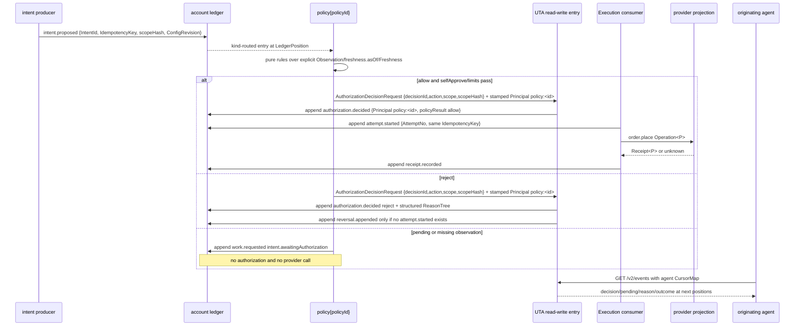

# UTA 交互、审批与 Issue 桥

## 0. 文档边界

本文拥有新 UTA 的交互、审批、消费者可见性、Alice Issue desk bridge 以及用户界面迁移契约。本文展开 `D4`（approval model）、`D8`（consumer side）、`D9`（Alice Issues pull direction）和 `D10`（rules/guards 的用户可见部分），并引用 `D5`、`D7`、`D11`、`D12` 的持久化、身份、数字、生命周期边界。本文不重新定义 ledger 文件格式、provider projection、Pack ABI、纯折叠算法或 Issue 全局 schema；HTTP route、OpenAPI replacement 与 atomic migration 由 `05-protocol-and-replacement.md` 负责；这些分别由 `03-ledger-and-persistence.md`、`04-provider-projections.md`、`01-architecture.md` 和 Alice 的 Issue owner guide 负责。

本文使用的类型来自注册表，且不另造跨模块类型：

- 身份与时间：`AccountId`、`ProviderId`、`ProjectionVersion`、`IntentId`、`ProposalId`、`DecisionId`、`AttemptNo`、`EntryId`、`LedgerPosition`、`IdempotencyKey`、`AliceId`、`Instant`、`AsOf`、`Cursor`、`ConfigRevision`、`RequestId`。
- 主体与提供商：`Principal`、`Origin`、`ProviderKey<P>`、`ProviderOrderRef<P>`、`ProviderEnvelope`、`Operation<P>`、`Receipt<P>`、`Observation<P>`。
- 分录、规则与策略：`LedgerEntry`、`ReasonTree`、`IntentOutcome`、`ProposalOutcome`、`OrderProjection`、`Consumer`、`RuleResult`、`AuthorizationPolicy`、`WorkRequested`。
- Issue desk 与 HTTP：`UtaDeskSettings`、`DeskBridgeLink`、`DeskBridgeLinkStore`、`DecisionRequest`、`DecisionResponse`、`AuthorizationDecisionRequest`、`AuthorizationDecisionResponse`、`IntentProposalRequest`、`IntentProposalResponse`、`IntentListResponse`、`IntentDetailResponse`、`EventsQuery`、`EventsResponse`、`EventItem`、`LedgerEntryWire`、`UnknownLedgerEntryWire`、`CursorMap`、`ReadinessResponse`、`AccountReadiness`、`ProcessState`、`ReadProjectionResponse<T>`、`ErrorCode`、`ErrorEnvelope`、`ConfigError`。

`UtaDeskSettings`、`DeskBridgeLink`、`DeskBridgeLinkStore` 和 decision DTO 的精确定义由 `plans/uta-refactor/spec/types/issues.ts` 负责；本文只规定其交互语义和持久化顺序。`issueId` 是 Alice Issue 文件的 filename stem，不是假设存在一个未注册的 `IssueId` brand；它必须在 Issue 边界按 `src/workspaces/issues/declaration.ts:66-74` 的规则验证。

本文所有新行为使用规范用语（`MUST`、`MUST NOT`、`SHOULD`、`MAY`）。引用现有实现时明确标为“现状”；现状不能覆盖本规范。

## 1. 现状、问题与切换原则

现有 UI 一次性下单把 `stage → commit → push` 放在一次请求中，完整表单被当作人工批准；该请求没有 actor、approval ID 或业务幂等键（现状：`local://w1-interaction-audit.md:29-64`）。AI 工具默认只提交待审核状态，Web UI 或 Telegram connector 再以 `expectedPendingHash` 执行 push/reject；当前 UTA 没有收到批准主体（现状：`local://w1-interaction-audit.md:66-110`）。`pendingHash` 在进程内存中，重启只恢复 commits/head，未恢复 staging 或 pending approval（现状：`local://w1-interaction-audit.md:149-182`；`local://w1-ledger-persistence.md:33-58`）。

Alice Issue 的现状是 `<workspace>/.alice/issues/<id>.md` 加 `.comments.json` sidecar；frontmatter 是封闭 schema，canonical What 是 frontmatter 后的 Markdown，comment 是普通协作输入而不是 typed approval（现状：`local://w1-issue-system.md:13-48,102-110`）。现有 `createIssue` 没有 idempotency 参数，重复创建返回 `conflict`；Issue 和 sidecar 的跨进程写入仍不是可靠的 temp+rename 契约（现状：`local://w1-issue-system.md:41-48,112-122`）。

因此切换必须满足以下不变量：

1. 交易业务身份由 caller-generated `IntentId`、`ProposalId`、`DecisionId`、`RequestId`、`IdempotencyKey` 和 Execution 的 `AttemptNo` 组成；UTA 对 caller-generated identities 只验证并记录，不分配 `IntentId`、`ProposalId`、`DecisionId`、`RequestId` 或 `IdempotencyKey`；Execution 分配 `AttemptNo`；`pendingHash` 不再是决策、幂等或 provider 事实。
2. 所有改变 provider 状态的调用都先形成 `intent.proposed`，再由唯一 read-write entry 追加 `authorization.decided`、`attempt.started`、`receipt.recorded` 等分录；任何 UI、tool、connector 或 Issue agent 都不能直接调用 provider mutation。
3. `Principal` 是 Alice 根据已认证边界 server-stamp 的主体；`Origin` 只描述因果来源。`Origin`、Issue status、Issue Markdown、comment author、connector response 和 `ProviderOrderRef<P>` 都不得替代 `Principal`。
4. 超时、断连、丢失 response 进入 `unknown`，不能映射成 reject、not-sent 或 success。只有 provider projection 的 `PlacementRecovery<P>` witness 可以推进恢复；不能 blind retry。
5. UTA 只追加 ledger；UTA MUST NOT 写 Alice Issue 文件。Alice bridge 通过 `/v2/events` 拉取并在 durable Issue/link/comment 成功后推进自己的 cursor。
6. Issue 的 `done` 只表示 Issue work lifecycle 已结束，永远不表示 provider 已执行、已成交、已观察或已结算。
7. `allowAiTrading` 不再是授权模型。新的唯一授权源是 `AuthorizationPolicy` 和其产生的 `authorization.decided` 分录。

## 2. 共同身份、幂等和可见性契约

### 2.1 `Principal` 与 `Origin` 分离

UTA 采用 `D7` 的 server-stamped `Principal`：

| 入口/主体 | UTA 记录的 `Principal` | 可携带的 `Origin` | 允许的意义 |
|---|---|---|---|
| 浏览器人类 | `human{sessionId}` | 可选 `issueId`、`resumeId`、`runId` | 提出 intent、在策略允许时作 decision、读取自己有权访问的 projection。 |
| tool-using agent | `agent{workspaceId,resumeId,runId}` | `issueId`、`resumeId`、`runId` | 提出 intent；当 `agentDecisionAuthority=binding` 且通过 limits 时作 binding decision；否则只能产生 recommendation。 |
| Issue-driven agent | 实际运行仍是 server-stamped `agent{workspaceId,resumeId,runId}` | 必须包含触发 Issue 的 `issueId`，并保留 `resumeId`、`runId` | schedule 触发只是运行来源，不把 Issue 状态或自然语言变成 authority；agent 仍受普通 agent policy。 |
| Telegram connector | `connector{connectorId,externalUserId?}` | `issueId`、connector action 的 `requestId`、必要时 `resumeId` | 仅作为 connector 身份提交 typed decision；connector 不得从 Telegram 文本推导 action 或 scope。 |
| `alice-uta` CLI/MCP | `agent{workspaceId,resumeId,runId}`，由 Alice 从 authoritative `x-openalice-run/session` 解析 | 同上 | CLI 是 transport，不是额外 authority；未知或伪造的 run/session 不得生成可信 `Origin`。 |
| schedule | `schedule{workspaceId,issueId}` | 同一 `issueId` 和调度 run context | 可以产生观察消费和 intent proposal；不得因 `when`、cadence 或 Issue status 自动获得 binding decision，除非 `AuthorizationPolicy` 明确允许该主体。 |
| policy consumer | `policy{policyId}` | 触发它的 `entryId`、`LedgerPosition`、`ConfigRevision` | 以纯规则结果作 `authorization.decided`；decision 的 `policyResult` 必须保留规则结果和 `ReasonTree`。 |
| UTA 内部生命周期/过期 | `system` | 被处理分录的 `causedBy` 和 `correlation` | 可追加 `intent.expired`、`observation.recorded`、恢复和运行错误；不得冒充人、agent 或 connector 作业务授权。 |

请求头中的主体字段若由 caller 自行填写，Alice MUST 忽略并以认证 session、authoritative run、connector registration 或 policy registry 重新 stamp。`Origin` 可为空，但一旦存在，所有字段必须来自 Alice 的可信上下文；originating agent 不能在 tool 参数里自行传 `resumeId` 来提高权限。

### 2.2 身份字段的作用域

| 字段 | 作用域与生成规则 | 重试/重复规则 | 不能证明的事实 |
|---|---|---|---|
| `RequestId` | 一次 ingress/work request 的 caller-generated identity；UI、tool、connector bridge 在第一次提交前生成并持久化。`WorkRequested.requestId` 是 bridge 的业务关联键。 | transport retry 复用原值；同一值与同一 canonical request 返回原结果/已有 link；同一值绑定不同 payload 返回 `IdempotencyConflict`。 | 不证明 provider 收到或执行。 |
| `IntentId` | intent producer（UI、tool、schedule 或其他已认证 caller）生成的 caller-generated immutable identity；UTA 只验证并记录。 | 同一语义 retry 复用原值，不创建第二个 intent。 | 不证明 provider 接受。 |
| `ProposalId` | caller-generated 的可选 grouping identity，用于一组 intents；UI 一次点击可以覆盖多个 intents。 | duplicate proposal 仍按每个 intent 的 `IntentId`/`IdempotencyKey` 收敛；proposal 不提供 provider atomicity。 | 不证明成员 intent 一起成功。 |
| `IdempotencyKey` | 一个 intent 的 caller-generated 稳定业务/投放键，由 intent producer 生成，UTA 校验作用域；provider projection 将其映射为 provider 要求的 key。 | 所有 `attempt.started`、recovery、replay、unknown review 复用原 key；同一 key 不得因 timeout 生成新 key。 | 不证明 provider 写入、订单状态、成交或余额。 |
| `DecisionId` | caller-generated 的 authorization command 稳定 idempotency key；UTA 只验证并记录。 | 相同 `DecisionId`、`action`、`scopeHash` 返回相同成功 response，且不追加新 decision；同 ID 不同内容返回 `DecisionConflict`。 | 不证明执行已经开始或完成。 |
| `intentHash` | canonical intent scope 的内容绑定。 | UTA 对同一个 `IntentId` 固定；payload 改变必须产生新 intent。 | 不替代 `IdempotencyKey`，不替代 `scopeHash`。 |
| `scopeHash` | decision 绑定的 account、intent/proposal member scope、intentHash 和 admissible scope 的 canonical hash。 | typed decision 必须匹配当前 scope；不匹配返回 `DecisionConflict`，不执行。 | 不代表批准主体；主体来自 `Principal`。 |
| `AttemptNo` | 一个 intent 的 provider placement 次数，按 ledger 顺序递增。 | recovery 只能追加新 attempt 或执行 witness，不能覆盖旧 attempt；同一 intent 的 attempts 共享 `IdempotencyKey`。 | 不代表 provider order number。 |
| `EntryId`、`LedgerPosition` | UTA append writer 分配的稳定 entry identity 和 account stream 顺序。 | consumer 只按 position 消费；position 已处理前不得推进 cursor。 | 不代表 wall-clock 发生时间；`occurredAt` 与 `recordedAt` 分离。 |
| `ProviderOrderRef<P>` | provider receipt/observation 返回的 provider identity。 | 必须与 `Receipt<P>`/`Observation<P>` 关联保存。 | 不代表 `IntentId`、`DecisionId` 或 Alice actor。 |
| `Cursor` | provider/channel 的 opaque observation checkpoint；`/v2/events` consumer cursor 是 account `LedgerPosition`。 | 每个 consumer 独立持有；bridge、UI、connector 不共享可变处理标志。 | 不授权写操作。 |

每一条 `LedgerEntry` MUST 具备 `entryId`、`position`、`occurredAt`、`recordedAt`、`source`、`kind`、`idempotencyKey`、`why`，以及适用的 `causedBy`、`correlation{intentId?,attemptNo?,providerRef?}`。金融值和 provider operation payload 跨 wire、Issue What、comments、日志摘要都使用 canonical decimal strings；`positions`、`balances`、`health` 不得复制进 `WorkRequested`，只通过 `AccountId`、`EntryId`、`LedgerPosition`、`AsOf` 和读取 projection address。

### 2.3 统一的 event cursor 学习方式

所有 originating consumers MUST 使用自己的 `CursorMap` 调用 `EventsQuery`，接收 `EventsResponse`。请求是 long-poll `GET /v2/events?cursors=<accountId:position,...>&wait=<ms>`，不得使用 SSE，不得为了知道自己的结果而轮询无关联的 order history、commit history、Issue 全表或 connector queue。每个 `EventItem` 精确包含 top-level `source`、`accountId`、`position` 和 `entry: LedgerEntryWire | UnknownLedgerEntryWire`；entry 内部携带 `correlation`，不得把 correlation 提升到 EventItem 顶层；response 带下一份 `CursorMap` 和当前 readiness snapshot。

- UI 通过 BFF relay 持有一个按 account 的 cursor；proposal、decision、attempt、receipt、observation、`work.requested` 和 readiness 在同一事件读取契约中可见。
- originating agent 为每个 account 保存自己的 cursor 和最后一次已知 `IntentId`/`RequestId`，按 `EventItem.entry.correlation` 关联结果；它只消费自己的 cursor，不扫描不相关历史。
- connector bridge 的 cursor 与 UI、agent、schedule cursor 独立，可以 lag，但不能跳过尚未完成的 side effect。
- bridge 的 cursor 不是 provider `Cursor`；provider observation 的 cursor 留在 `Observation<P>`/projection 内，经过正常 consumer append 为 `observation.recorded` 后才通过 UTA ledger position 广播。
- long-poll `wait` 的有效范围是 0–25,000 ms。达到本次 wait deadline 时，server MUST 返回 HTTP 200、空 `items` 和不变的 `nextCursors`；只有 server overrun 才返回 `Timeout`（504）。deadline response 不能改变任何 cursor，也不能制造 reject；下一次请求复用原 cursor。

## 3. 主体权限矩阵

“允许”一栏是可执行的入口；“只能观察”不授予写能力。所有写入都必须经过 UTA 唯一 read-write entry，并通过 `AuthorizationPolicy`、capability declaration、first-observation gate 和当前 `AccountReadiness`。

| Principal | propose `Intent` | binding `Decision` | recommendation | observe | Issue/comment/close | config/restart |
|---|---|---|---|---|---|---|
| `human` | UI、`alice-uta` attended command 或 Issue detail 触发 `IntentProposalRequest`。 | `approve|reject|withdraw`；human one-shot 只有 `selfApprove` 包含 `human` 时可在同一 append frame 产生 decision。对别人提出的 intent 仍需当前 policy 允许。 | 不需要以 recommendation 表示人类已批准；若 policy 不允许，endpoint 明确拒绝。 | 可读取授权范围内 `ReadProjectionResponse<T>`、`ReadinessResponse`、`EventsResponse`。 | 可编辑 What/status/comments，但自由文本、`done`、`connectorDesk` 以外的 metadata 都不授权。可关闭 Issue 作为 work lifecycle。 | Alice config route 是配置写者；修改后必须观察新的 `ConfigRevision` 和 first-observation gate。 |
| `agent` | tool 只能提出 intent，必须给 `why`、`IdempotencyKey` 和 `Origin`；不能直接调用 provider。 | 只有 `agentDecisionAuthority=binding` 且 limits、kind、freshness 全通过时，typed endpoint 的 `approve|reject|withdraw` 才改变有效授权。 | `agentDecisionAuthority=recommendation` 时记录 recommendation，intent 仍 pending human。 | 通过自己的 `CursorMap` 学到结果；不能从一个 `Promise` 返回值推断最终事实。 | Issue agent 可读 What、写报告 comment、更新 work status；不能以 comment/status 做 decision。 | 可提出配置变更建议；配置实际写入仍由 Alice authenticated surface 完成。 |
| Issue-driven `agent` | schedule 触发的 run 使用同一 agent 规则；`Issue` 是 prompt/context，不是 approval token。 | 同普通 `agent`，由 `Origin.issueId/resumeId/runId` 关联；不能因 `Issue.assignee` 自动 binding。 | 同普通 `agent`。 | 通过该 run 的 account cursor 和 typed result；必须在最终回复中保留 `IntentId`/`RequestId`。 | 可把结果写 Issue timeline；不能用 `done` 声明 remote completion。 | 不能通过 Issue What 修改 `UtaRuntimeConfig` 或 secret。 |
| `connector` | connector 可转发已存在的 `WorkRequested` 或创建受 schema 约束的 intent proposal；不得把 inbound natural language 作为 payload。 | typed `AuthorizationDecisionRequest`，主体由 Alice stamp 为 `connector{connectorId,externalUserId?}`；binding 仍由 policy 决定。 | policy 为 recommendation 时返回 recommendation，不执行。 | bridge/connector 以自己的 cursor 读取；present/fail 是 transport projection，不是 UTA outcome。 | 可 append deterministic desk comment；comment 永远无 authority；不可从评论中的 `approve` 字样执行。 | 不写 UTA config，不触发非授权 restart。 |
| `alice-uta` CLI/MCP | 与 agent tool 同一 `IntentProposalRequest`；CLI 名称按 `D6` 保留，但输出和描述使用新 vocabulary。 | 与 agent 同一 policy；CLI 不是额外 bypass。 | 同 agent。 | 自己持有 `Cursor`；命令不得隐含 history scan 来找结果。 | Issue CLI comment 是协作输入，不是 decision。 | 只能调用有权限的 Alice config command；restart completion 仍需 readiness/cursor evidence。 |
| `schedule` | 可消费 read-only feed、运行纯 rule 并提出 intent；`watch`/`news` 触发要保留 source cursor 和 causal position。 | 默认不得作 binding decision；只有 `AuthorizationPolicy.selfApprove` 明确包含该 `schedule` 且该 schedule 的 limits/freshness 满足时才可。`selfApprove` MUST NOT 包含 `system`。 | 可产生 recommendation/work request，不得把 scheduled comment 当 decision。 | 每个 schedule consumer 独立 cursor；cadence lag 不是成功。 | 可请求 bridge 通知；不直接写 Issue 文件。 | 不直接改配置；config change 由 Alice config writer 产生。 |
| `policy` | 纯 policy consumer 不凭空产生交易 intent；若规则定义了 deterministic follow-up，仍需新增 `intent.proposed`。 | 可以产生 `authorization.decided`，其 `principal=policy:<policyId>`，`policyResult` 必须是结构化规则结果。 | policy 的 decision 已是 binding policy result，不通过 desk comment。 | 读取 explicit observation/freshness；不暗读 provider，不拿本地快照当事实。 | 不写 Issue；bridge 根据 `WorkRequested` 投影人类可见结果。 | 只能读取已解析 `UtaRuntimeConfig`；不在审批路径临时修改策略。 |
| `system` | 不提出业务 intent；只能追加 lifecycle/recovery/observation 语义。 | MUST NOT 作人类/agent/connector business approval。 | 不产生 recommendation authority。 | 维护 readiness、expiry、consumer health；所有结果带 source。 | 可使 bridge 产生通知，但不写 Alice Issue。 | 负责 process lifecycle；SIGTERM/restart 不属于交易 ledger fact。 |

任何矩阵之外的 caller 必须得到 `Unauthorized` 或 `CapabilityUnsupported`，不能落成匿名 `system`。`read-only` 能力可被多个主体消费，但读取 permission、masking、audit 和 freshness 仍有效。

## 4. 交互状态和错误可见性

`IntentOutcome` 的状态由 position-ordered fold 产生，而不是由 UI button 的即时响应产生。UI、tool、connector 和 Issue detail MUST 同时显示：`IntentId`、`ProposalId?`、`RequestId?`、`IdempotencyKey` 的短可复制表示、`AccountId`、当前 status、最后一个 `LedgerPosition`、`ConfigRevision`、`AsOf`/freshness（适用时）、`Principal` 和下一步。

| 状态/错误 | 含义 | UI/agent/connector 处理 | 是否允许 retry |
|---|---|---|---|
| `proposed` / `intent.awaitingAuthorization` | intent durable，但没有有效 binding authorization。 | 显示“awaiting authorization”，提供 typed decision 入口；Issue/comment 只作 context。agent 通过 cursor 等待。 | 不创建第二个 intent；可重发同 `RequestId`/`IdempotencyKey` 读取原 intent。 |
| `authorized` | 有效 `authorization.decided(approve)`，尚未 `attempt.started`。 | 显示“authorized, not yet attempted”；Execution 会按 position 处理。 | 不由 caller 直接再次 push。 |
| `attempting` | `attempt.started` durable；provider call 可能在途。 | 按 account serializer 排队；timeout 仍未知。 | 仅由 recovery consumer 按 provider witness 决定。 |
| `accepted` / `rejectedByProvider` | provider 在 attempt 边界返回 receipt。 | 显示 receipt 和 `ProviderOrderRef<P>`，不把它写成 fill/balance fact。 | accepted 不 retry；rejected 不重复同一 attempt。 |
| `unknown` | timeout、disconnect、noResponse、processRestart 或 parseFailure；其中 `parseFailure` 表示已有 send evidence 且收到 response 但无法解码，provider 是否写入未知。 | UI 显示“unknown outcome — review”；tool 返回 `ProviderUnknown`；connector/desk 显示同样 wording。 | 只能走 `PlacementRecovery<P>`；无安全 witness 则 `awaitingReview`。 |
| `awaitingReview` | witness 到 `maxUnknownDuration` 或 ambiguity，需 binding/recommendation review。 | `authority=binding` 且 agent 可作 binding decision 时产生 per-request Issue；其他 binding 或 recommendation 只产生对应的 desk projection；所有 decision 都必须通过 typed endpoint 才有 authority。 | 只能使用原 intent/key；不得 blind retry 或新建同语义 key。 |
| `expired` | `expiresAt` 在 `attempt.started` 前已到，且追加了 `intent.expired`。 | UI、agent、Issue 都显示 expired；晚到 decision 返回 `IntentExpired`。 | 新意图必须有新 `IntentId`；原 key 不可被伪装成新语义。 |
| `IntentExpired` | typed decision 对已 expired intent。 | Alice/UTA 返回非 2xx `ErrorEnvelope{code:IntentExpired}`；UTA 可按 D4 追加 rejected authorization entry，但错误不可用一个与成功并列的 `rejected` DTO 表示。 | 不可 retry 原 decision；可提出新 intent。 |
| `DecisionConflict` | `DecisionId` 重复但内容不同，或 `scopeHash` 不匹配。 | 显示当前 authoritative scope/position；不泄露未授权账户内容。 | 重新读取自己的 event cursor 后生成新的 DecisionId；不重写旧 entry。 |
| `IdempotencyConflict` | 同 `RequestId`/`IdempotencyKey` 绑定了不同 canonical payload。 | 原始 intent/result 保留；caller 必须修正为新 semantic request。 | 不可覆盖；新语义生成新 key。 |
| `ReadinessUnavailable` / `ServiceDraining` | account/process 当前不能接受新的 intent。 | UI 禁用 write controls，tool/connector 得到结构化 code；已有 attempt 按 D12 drain 规则完成 receipt/unknown。 | readiness 恢复后，原未开始 intent 由 Execution resume，不由 caller duplicate。 |
| `CapabilityUnsupported` | account projection 没声明该 kind，或 provider 无 `PlacementRecovery`。 | 显示具体 provider/kind/reason；不追加伪成功 intent。 | 只能改用已声明 capability 的新 intent。 |

## 5. 交互序列

每个序列都必须同时满足：主体是 server-stamped `Principal`；`Origin` 只作因果；所有适用 ID 显式存在；同一语义重试复用 idempotency identity；durable append 先于 exposure；timeout/unknown 对每个 actor 可见；originating agent 通过自己的 `/v2/events` cursor 学习，不轮询无关 history。图中的箭头只表示语义数据流，不规定类、进程或具体模块拓扑。Wire 事件必须使用 `EventItem.entry: LedgerEntryWire | UnknownLedgerEntryWire`，entry 内的 kind-specific correlation 是唯一关联位置。

### 5.1 Human one-shot order via UI

**Principal / Origin。** 浏览器 Alice session 被 stamp 为 `human{sessionId}`；没有 Issue 时 `Origin` 可省略，若由 Issue detail 进入则带 `issueId`，但不提高权限。

**IDs / idempotency。** UI 在第一次点击前生成 caller-owned `RequestId`、`IntentId`、`IdempotencyKey`，并为 one-shot 生成 `DecisionId`、可选 `ProposalId`；同一表单 retry 复用原值。UTA 只验证并记录这些 identity；Execution 分配 `AttemptNo`。`scopeHash` 绑定显示给用户的 exact operation。UI 不再生成或发送 `pendingHash`。

**Durability / failure。** UTA 在一个 append frame 中先落 `intent.proposed`，仅当 policy 的 `selfApprove` 包含 `human` 且不包含 `system` 时再落 `authorization.decided(approve,human)`；之后由 Execution append `attempt.started` 后才调用 provider。请求超时不能返回 success；UI 以 cursor 观察 `unknown`、late receipt 和 observation。

```mermaid
sequenceDiagram
    actor Human as human{sessionId}
    participant UI as UTA detail UI
    participant Alice as Alice BFF
    participant UTA as UTA read-write entry
    participant Ledger as account ledger
    participant Exec as Execution consumer
    participant Provider as provider projection
    Human->>UI: submit proposal fields {RequestId, IntentId, ProposalId?, IdempotencyKey, operation, why} + one-shot DecisionId
    UI->>Alice: POST /v2/accounts/:accountId/intents (proposal + one-shot decision, authenticated session)
    Alice->>UTA: validated proposal + AuthorizationDecisionRequest + Principal human + Origin?
    UTA->>Ledger: append frame: intent.proposed + authorization.decided approve
    Ledger-->>UTA: EntryId/position for IntentId and DecisionId
    UTA-->>Alice: HTTP 201 new / 200 duplicate + IntentProposalResponse {intentId,entryId,position,status:proposed}
    Alice-->>UI: accepted locally; await event cursor
    Exec->>Ledger: append attempt.started {IntentId, AttemptNo, IdempotencyKey, ConfigRevision}
    Exec->>Provider: order.place Operation<P> with same IdempotencyKey
    alt provider receipt is durable
        Provider-->>Exec: Receipt<P> accepted or rejected
        Exec->>Ledger: append receipt.recorded {AttemptNo, receipt}
        Exec->>Ledger: append observation.recorded when upstream fact is present
        UI->>Alice: GET /v2/events with UI CursorMap
        Alice-->>UI: EventItem {source,accountId,position,entry: LedgerEntryWire|UnknownLedgerEntryWire; entry.correlation} + readiness + next CursorMap
        UI-->>Human: receipt status plus separate observation/freshness
    else timeout or disconnect
        Provider--xExec: no response
        Exec->>Ledger: append receipt.recorded unknown {cause: timeout|disconnect|noResponse}
        UI->>Alice: GET /v2/events with unchanged cursor
        Alice-->>UI: unknown / awaitingReview, no success claim
        UI-->>Human: unknown outcome — review
    end
```

**Originating human visibility。** UI 的结果 banner 只能说 local intent/receipt/unknown；最终 fill、position、balance 必须由 `observation.recorded` 的 upstream `asOf` 和 `Freshness` 更新。若 network retry 在 `IntentProposalRequest` 之前已经收到成功 response，重试同 `RequestId` 返回同一个 `IntentId`；若 response 丢失，UI 仍从自己的 cursor 找到该 intent，不能重新提交一个新 key。

### 5.2 Agent proposal + human decision in UI

**Principal / Origin。** agent proposal 由 Alice authoritative run stamp 为 `agent{workspaceId,resumeId,runId}`，`Origin` 至少带 `resumeId`、`runId`，Issue-driven agent 另带 `issueId`。人类批准由另一个 browser session stamp 为 `human{sessionId}`。

**IDs / idempotency。** agent caller 生成并持久化 `RequestId`、`IntentId`、`IdempotencyKey` 和可选 `ProposalId`；UI decision caller 生成新的 `DecisionId`，对同一 decision retry 复用。human 看到并确认 `scopeHash`；UI 不允许只按标题或当前列表位置批准。

**Failure / learning。** UI 只显示 UTA event cursor 的 authoritative state。agent 收到 `IntentProposalResponse` 后保存 account cursor；human approve/reject、provider receipt、unknown 和 late recovery 都由 agent 从同一 account cursor 学到。UI/agent 均不能把 `Issue done` 或 connector presentation 当执行。

```mermaid
sequenceDiagram
    actor Agent as agent{workspaceId,resumeId,runId}
    actor Human as human{sessionId}
    participant Tool as alice-uta tool
    participant Alice as Alice BFF
    participant UTA as UTA read-write entry
    participant UI as Proposals/Intents UI
    participant Ledger as account ledger
    participant Exec as Execution consumer
    participant Provider as provider projection
    Agent->>Tool: propose operation with RequestId/IntentId/ProposalId?/IdempotencyKey/Origin
    Tool->>Alice: IntentProposalRequest; body.accountId mismatch with path accountId -> non-2xx ErrorEnvelope {code: ScopeMismatch}
    Alice->>UTA: server-stamped Principal agent
    UTA->>Ledger: append intent.proposed {IntentId, ProposalId?, scopeHash, expiresAt}
    UTA-->>Alice: HTTP 201 new / 200 duplicate + IntentProposalResponse {intentId,entryId,position,status:proposed}
    Alice-->>Tool: proposed; no provider call
    Agent->>Alice: GET /v2/events with agent CursorMap
    Alice-->>Agent: intent.proposed + readiness snapshot
    UI->>Alice: GET /v2/events with separate UI CursorMap
    Alice-->>UI: pending proposal + exact scopeHash
    Human->>UI: click approve/reject after scope review
    UI->>Alice: DecisionRequest {decisionId,action,scopeHash}
    Alice->>UTA: AuthorizationDecisionRequest {decisionId,action,scope,scopeHash} + Principal human
    UTA->>Ledger: append authorization.decided
    UTA-->>Alice: AuthorizationDecisionResponse {kind:recorded,entryId,position,authority}
    Alice-->>UI: decision recorded; await execution event
    Exec->>Ledger: append attempt.started {AttemptNo, same IdempotencyKey}
    Exec->>Provider: Operation<P> order.place|order.modify|order.cancel|position.close with same IdempotencyKey
    alt accepted or rejected
        Provider-->>Exec: Receipt<P>
        Exec->>Ledger: append receipt.recorded
    else timeout or unknown
        Provider--xExec: no response
        Exec->>Ledger: append receipt.recorded unknown
        Exec->>Ledger: append work.requested review.unknownOutcome
    end
    Agent->>Alice: GET /v2/events with unchanged agent CursorMap
    Alice-->>Agent: decision + receipt/unknown/work.requested + next CursorMap
    UI->>Alice: GET /v2/events with unchanged UI CursorMap
    Alice-->>UI: same outcome, failure reason, and freshness
```

`agentDecisionAuthority=recommendation` 不改变这条流程的 human decision；agent 若自行调用 typed endpoint，会得到 `recorded{authority:recommendation}`，intent 仍 `proposed`，UI 仍显示待 human，不会进入 Execution。

### 5.3 Agent proposal + connector decision

**Principal / Origin。** agent proposal 与 5.2 相同；connector decision caller 先提交三字段 `DecisionRequest`，由 Alice 从 authenticated connector bridge stamp 为 `connector{connectorId,externalUserId?}` 并解析 scope。Telegram message author 不直接进入 UTA；只有 connector 适配器已经验证的 external identity 才能进入 `Principal`。

**IDs / idempotency。** bridge 将 `WorkRequested.requestId` 或 connector action 的稳定 `RequestId` 关联到 intent；connector action 持久化一个 `DecisionId` 并在 claim、lease、release、retry 中复用。`IdempotencyKey` 仍是 agent intent key，绝不由 connector 为每次 delivery 改写。connector 的 60 秒 transport TTL 不是 intent `expiresAt`；过期 action 只能显示 expired，不能使 UTA pending intent 自动执行。

**Failure / learning。** connector 的 `present`/`fail` 只影响 connector transport projection。binding decision 的结果必须先在 UTA ledger durable，再由 connector 以 event cursor 获取并呈现；originating agent 仍从自己的 cursor 学习，不依赖 connector reply 或 Telegram chat。

```mermaid
sequenceDiagram
    actor Agent as agent{workspaceId,resumeId,runId}
    actor TelegramUser as external connector user
    participant Tool as alice-uta tool
    participant Alice as Alice bridge
    participant Connector as Telegram connector
    participant UTA as UTA read-write entry
    participant Ledger as account ledger
    participant Exec as Execution consumer
    participant Provider as provider projection
    Agent->>Tool: propose intent {RequestId, IntentId, IdempotencyKey, Origin}
    Tool->>UTA: IntentProposalRequest through authenticated Alice path
    UTA->>Ledger: append intent.proposed {expiresAt, scopeHash}
    UTA-->>Tool: HTTP 201 new / 200 duplicate + IntentProposalResponse {intentId,entryId,position,status:proposed}
    Connector->>UTA: GET /v2/events with connector CursorMap
    UTA-->>Connector: intent/work request and readiness
    Connector-->>TelegramUser: structured review showing IntentId/scopeHash/expiry
    TelegramUser->>Connector: choose approve/reject/withdraw in typed control
    Connector->>Alice: DecisionRequest {decisionId,action,scopeHash}
    Alice->>UTA: AuthorizationDecisionRequest {decisionId,action,scope,scopeHash} + stamped Principal connector
    alt policy authority is binding
        UTA->>Ledger: append authorization.decided with authority binding
        UTA-->>Alice: AuthorizationDecisionResponse {kind:recorded,entryId,position,authority}
        Exec->>Ledger: append attempt.started with same IdempotencyKey
        Exec->>Provider: order.place Operation<P>
        Provider-->>Exec: Receipt<P> or timeout
        Exec->>Ledger: append receipt.recorded accepted/rejected/unknown
    else policy authority is recommendation
        UTA->>Ledger: append authorization.decided policyResult recommendation
        UTA-->>Alice: AuthorizationDecisionResponse {kind:recorded,entryId,position,authority:recommendation}
        Alice-->>Connector: recommendation recorded; no execution
    end
    Connector->>UTA: GET /v2/events with unchanged CursorMap
    UTA-->>Connector: durable decision/outcome or non-2xx ErrorEnvelope
    Agent->>UTA: GET /v2/events with independent agent CursorMap
    UTA-->>Agent: same decision/outcome; connector reply is not required
```

如果 connector action 在 TTL 内过期但 intent 未过期，bridge MUST 把 action 标为 expired 并保持 intent `proposed`；human UI 仍可通过新的 typed decision（新的 `DecisionId`）作决定。若 intent 已 `intent.expired`，endpoint 返回 `IntentExpired`，connector 显示该 code，并且不发送第二个 provider call。

### 5.4 Policy self-approval

**Principal / Origin。** policy consumer 使用 `policy{policyId}`。触发来源可以是 agent、schedule 或 connector，但 policy 不继承触发者的 authority；`causedBy` 和 `correlation` 保留原始 entry。

**IDs / idempotency。** policy consumer 作为已认证内部 caller 生成并持久化稳定 `DecisionId`；它可以用 `(policyId, IntentId, scopeHash, ConfigRevision)` 做 deterministic derivation，但 UTA 仍只验证并记录 caller identity。策略读取的 observation 必须带 `freshness.asOf`，规则以显式 `evaluationAt` 输入，不读取 ambient now；`AuthorizationPolicy.selfApprove` MUST NOT 包含 `system`。

**Failure / learning。** `allow` 且 self-approval/limits 满足时，UTA 追加 `authorization.decided(approve, principal=policy:<id>)`；`reject` 追加结构化 policy result；只有目标尚未有 `attempt.started` 时，consumer 才可追加引用该目标的 `reversal.appended`，不以空成功隐藏规则拒绝；`pending` 发出 `work.requested`，不执行。originating agent 和 UI 通过各自 cursor 看到 policy decision 和 `ReasonTree`。



`policy` 的批准不需要 UI click，但仍必须是一个可审计 `authorization.decided` entry；policy code、`ConfigRevision`、limits 和 input freshness 不能只存在日志。

### 5.5 Expiry

**Principal / Origin。** `Expiry` consumer 由 `system` 运行；它消费 `intent.proposed` 和 decisions，以 ledger position 判断是否已经有 `attempt.started`，而不是靠 UI 本地计时器推断。

**IDs / idempotency。** `intent.expired` 引用 `IntentId`，其 entry 使用确定性 `IdempotencyKey`（由 `IntentId` 和 expiry transition 派生）；同一 intent 的多次 expiry tick 只追加一次。`expiresAt` 来自 intent snapshot，决策和 provider retry 不得延长它。

**Failure / learning。** expiry 在 `attempt.started` 之前生效；若 attempt 已 durable，late expiry 不取消 provider call。UI、agent、bridge 都通过 cursor 看到 `intent.expired`。expiry 之后到达的 typed decision 返回非 2xx `ErrorEnvelope{code:IntentExpired}`，并可按 D4 记录 rejected authorization entry；所有 caller 都看到同一 code。

```mermaid
sequenceDiagram
    participant Clock as expiry consumer system
    participant Ledger as account ledger
    participant Agent as originating agent
    participant UI as Proposals/Intents UI
    participant Alice as Alice decision endpoint
    participant UTA as UTA read-write entry
    Clock->>Ledger: read ordered intents and decisions by Cursor
    alt expiresAt passed and no attempt.started
        Clock->>Ledger: append intent.expired {IntentId, causal position}
        Ledger-->>Agent: EventItem intent.expired via agent CursorMap
        Ledger-->>UI: EventItem expired via UI CursorMap
        Agent-->>Agent: stop waiting; do not create new key automatically
    else attempt.started already durable
        Clock-->>Ledger: no expiry transition; attempt owns its deadline
    end
    UI->>Alice: DecisionRequest {decisionId,action:approve,scopeHash}
    Alice->>UTA: AuthorizationDecisionRequest {decisionId,action,scope,scopeHash} + server-stamped Principal human
    UTA->>Ledger: append rejected authorization.decided {IntentExpired}
    UTA-->>Alice: non-2xx ErrorEnvelope {code:IntentExpired}
    Alice-->>UI: expired failure visible
    UTA-->>Agent: next EventItem {entry: authorization failure / IntentExpired} via existing cursor
```

expiry 不等于 provider reject，也不证明 provider 没有收到之前的 attempt；attempt deadline、provider unknown 和 intent `expiresAt` 是三个不同字段。

### 5.6 Unknown-outcome review via binding Issue

**Principal / Origin。** Execution 以 provider timeout/disconnect/noResponse/parseFailure 追加 `receipt.recorded unknown`，并由 UTA `system`/reconciliation consumer 追加 `work.requested`，其 `authority=binding` 来自 emit 时的 `AuthorizationPolicy`。若 startup 发现 `attempt.started` 没有 receipt，Reconciliation MUST 先追加 `receipt.recorded{unknown{cause:'processRestart'}}`，再运行 `PlacementRecovery<P>` witness。Issue bridge 的 filesystem writer 是 Alice bridge，而不是 UTA。该 binding work 的 per-request Issue 默认 dispatch 给 agent，assignee continuity 规则见 6.3；human 即使不接管 Issue，也可以在 Proposals/Intents UI 通过同一 typed decision endpoint 决定，二者都由 Alice server-stamp。

**IDs / idempotency。** `WorkRequested` 携带 `requestId`、`IntentId`、原始 `IdempotencyKey?`、causal `EntryId`/`LedgerPosition`、`scopeHash`/`intentHash`、provider/projection identity、last observation `freshness.asOf`/freshness variant、admissible decisions、`expiresAt` 和 canonical `what`。bridge 以 `accountId + requestId` 推导 Issue id；link、Issue creation、decision、outcome comment 都复用这组关联，但各有自己的 `DecisionId`/comment id。

**Binding 的含义。** per-request Issue 是人类可读的 review work item，不是 authority carrier。Issue agent 或 human 必须调用 typed decision endpoint；`approve` 只授权 `WorkRequested` 声明的、经 `PlacementRecovery<P>` 检查的 next action，不能授权 blind retry。recovery 的最终 `recovery.resolved` 必须使用 `ledger/entries.ts` 的严格 witness/manual resolution 变体；endpoint 不接受自由文本 resolution。

**Failure / learning。** bridge 必须先使 Issue 文件 durable、re-readable，再写 link store，再推进 cursor。Issue creation conflict 只有在确定性 id 对应内容通过完整 re-read 校验时才算 success-by-reference。Issue 写入失败、link 写入失败、decision scope mismatch、provider recovery ambiguity 都可见；originating agent 通过自己的 cursor 看到 decision、recovery 和最终 observation。

```mermaid
sequenceDiagram
    participant Exec as Execution consumer
    participant Ledger as account ledger
    participant Bridge as Alice UTA desk bridge
    participant Issue as per-request Issue
    actor Reviewer as binding agent (default Issue assignee)
    actor Human as human{sessionId}
    participant UI as Proposals/Intents UI
    participant Alice as Alice typed decision endpoint
    participant UTA as UTA read-write entry
    participant Recovery as reconciliation consumer
    participant Provider as provider keyed read
    participant Agent as originating agent
    alt provider call has timeout/disconnect/noResponse/parseFailure
        Exec->>Ledger: append receipt.recorded unknown {IntentId, AttemptNo, IdempotencyKey, cause: timeout|disconnect|noResponse|parseFailure}
    else startup finds attempt.started without receipt
        Recovery->>Ledger: append receipt.recorded unknown {IntentId, AttemptNo, IdempotencyKey, cause: processRestart}
    end
    Ledger->>Ledger: append work.requested review.unknownOutcome authority binding
    Bridge->>UTA: GET /v2/events with bridge CursorMap
    UTA-->>Bridge: EventItem {source,accountId,position,entry: LedgerEntryWire|UnknownLedgerEntryWire; entry.correlation} + next cursor candidate
    Bridge->>Bridge: re-read long-lived desk Issue assignee
    alt desk has exact validated @resumeId
        Bridge->>Issue: create deterministic Issue assignee=<exact @resumeId>
    end
    Issue-->>Bridge: durable file and re-readable canonical What
    Bridge->>Bridge: atomic DeskBridgeLinkStore write {requestId,workspaceId,issueId,sourcePosition}
    Bridge->>UTA: persist bridge cursor only after Issue/link success
    Reviewer->>Issue: read canonical What and evidence
    alt binding agent decides
        Reviewer->>Alice: typed DecisionRequest {decisionId,action,scopeHash}
    else human decides from Proposals/Intents page
        Human->>UI: review same IntentId and exact scope
        UI->>Alice: typed DecisionRequest {decisionId,action,scopeHash}
    end
    Alice->>UTA: AuthorizationDecisionRequest {decisionId,action,scope,scopeHash} + stamped Principal
    UTA->>Ledger: append authorization.decided
    alt recovery action is safe by PlacementRecovery<P>
        Recovery->>Provider: keyed read/replay using original IdempotencyKey
        Provider-->>Recovery: found/confirmedAbsent/ambiguous/stillUnknown witness
        Recovery->>Ledger: append recovery.resolved and receipt/observation as applicable
    else no safe witness
        Recovery->>Ledger: keep awaitingReview; no blind retry
    end
    Bridge->>UTA: GET /v2/events with bridge CursorMap
    UTA-->>Bridge: EventItem {source,accountId,position,entry: LedgerEntryWire|UnknownLedgerEntryWire; entry.correlation} decision/recovery/outcome
    Bridge->>Issue: append deterministic outcome comment; comment is non-authoritative
    Agent->>UTA: GET /v2/events with independent agent CursorMap
    UTA-->>Agent: unknown, decision, recovery, and observation positions
```

### 5.7 Unknown-outcome review via desk comment (recommendation)

**Principal / Origin。** Work request 的 `authority=recommendation` 由 UTA 在 emit 时根据 policy snapshot 冻结。bridge 将它投影到 configured desk Issue；comment author 是 Alice bridge/system projection，而不是借 comment author 模拟批准者。真正提出 recommendation 的 agent 仍由 `Origin` 和原 ledger entry 识别。

**IDs / idempotency。** comment id 必须是 `uta-comment-<sha256(accountId\0requestId\0kind)>` 的确定性 lower-case hex 形式；同一个 `WorkRequested` redelivery 使用同 id。`DeskBridgeLink.commentId` 记录这个 id，`sourcePosition` 记录来源 ledger position。human/agent 后续 typed decision 另外生成 `DecisionId`，不把 comment id 当 decision id。

**Failure / learning。** comment sidecar duplicate id 返回已有 comment；bridge 必须 re-read 并校验 markdown 完整相等后才写 link/cursor。desk comment 中即使包含“approve”“reject”或自然语言指令也 MUST NOT 触发 UTA。agent/human 若需要行动，先提交三字段 `DecisionRequest`，由 Alice 解析 scope 后转为 `AuthorizationDecisionRequest`；recommendation 的 agent decision 返回 `authority=recommendation`，intent 保持 pending，只有后续 binding human/policy decision 才能执行。originating agent 通过 cursor 得到 recommendation、binding decision 和 final receipt；绝不依赖 desk chat reply。

```mermaid
sequenceDiagram
    participant UTA as UTA ledger
    participant Bridge as Alice UTA desk bridge
    participant Desk as configured desk Issue
    actor Human as human{sessionId}
    actor Agent as agent{workspaceId,resumeId,runId}
    participant Alice as Alice typed decision endpoint
    participant Exec as Execution consumer
    UTA->>Bridge: EventItem {source,accountId,position,entry: LedgerEntryWire|UnknownLedgerEntryWire; entry.correlation} work.requested review.unknownOutcome authority recommendation
    Bridge->>Desk: append comment id=deterministic(accountId,RequestId,kind)
    Desk-->>Bridge: comment durable/re-readable or duplicate-by-id
    Bridge->>Bridge: atomic link write then advance bridge CursorMap
    Bridge-->>Human: desk timeline shows unknown recommendation and exact scopeHash
    Note over Desk,Human: freeform comment text has no authority
    Agent->>Alice: DecisionRequest {decisionId,action,scopeHash}
    Alice->>UTA: AuthorizationDecisionRequest {decisionId,action,scope,scopeHash} + stamped Principal agent
    alt agentDecisionAuthority is recommendation
        UTA->>UTA: append authorization.decided with policyResult recommendation
        UTA-->>Alice: AuthorizationDecisionResponse {kind:recorded,authority:recommendation}; intent remains proposed
        Human->>Alice: DecisionRequest {decisionId,action:approve,scopeHash}
        Alice->>UTA: AuthorizationDecisionRequest {decisionId,action,scope,scopeHash} + stamped Principal human
        UTA->>UTA: append binding authorization.decided approve
        Exec->>UTA: consume authorized intent and append attempt/receipt
    else human acts first
        Human->>Alice: DecisionRequest {decisionId,action,scopeHash}
        Alice->>UTA: AuthorizationDecisionRequest {decisionId,action,scope,scopeHash} + stamped Principal human
        UTA->>UTA: append binding authorization.decided
    end
    Agent->>UTA: GET /v2/events with agent CursorMap
    UTA-->>Agent: recommendation, binding decision, receipt/unknown positions
```

desk comment 是 notification/recommendation projection；它不改变 `scopeHash`、policy、ledger status，也不能被 Issue scheduler 当成 typed decision。

### 5.8 Watch → order-modify intent

**Principal / Origin。** 一个配置好的 watch consumer 以 `schedule{workspaceId,issueId}`（若是内置 consumer 则使用 `system`）运行。它消费 provider read-only stream，provider event identity/cursor 进入 `Observation<P>`，不直接进入 provider write。触发 intent 的 `Origin` 必须是 `watch{sourceEntryId,sourcePosition,cursor?,eventId?}` variant；agent 的 `Principal.resumeId` 仍由 Alice server-stamp，不添加到该 `Origin` variant。

**IDs / idempotency。** watch event 的 `(ProviderId,ProjectionVersion,Cursor,provider event identity,accountId,OperationKind)` 经过确定性 canonical encoding 生成 `IdempotencyKey`；同一 event redelivery 必须命中已有 intent。每个 `order.modify` 是新的 `IntentId`，但不得生成第二个 key 来掩盖同一 event。`RequestId` 由 watch consumer 为该 proposal 稳定生成，并在 `work.requested watch.triggered` 或后续 review 中复用。

**Failure / learning。** 纯 watch rule 只返回 `IntentProposalRequest` 或 no-intent；无 fresh observation、stream gap、cursor decode failure 时只更新 read consumer failure/freshness，不投放 `order.modify`。若 `order.modify` attempt timeout，结果是普通 `unknown` 和 recovery review；watch consumer、originating agent、UI 都用各自 ledger cursor 得到最终结果。

```mermaid
sequenceDiagram
    participant Stream as provider read-only stream
    participant Watch as watch consumer schedule{workspaceId,issueId}
    participant Ledger as account ledger
    participant UTA as UTA read-write entry
    participant Policy as policy consumer
    participant Exec as Execution consumer
    participant Provider as provider write projection
    participant Agent as watch-originating agent
    Stream-->>Watch: Observation<P> {Cursor, provider event identity, asOf}
    Watch->>Watch: pure rule: order.modify intent or no intent
    alt trigger condition false or observation stale
        Watch-->>Ledger: no business append; retain read failure/freshness locally
    else trigger condition true
        Watch->>UTA: IntentProposalRequest {RequestId, new IntentId, event-derived IdempotencyKey, Origin}
        UTA->>Ledger: append intent.proposed + work.requested watch.triggered if configured
        Policy->>Ledger: append authorization.decided or rule rejection
        Exec->>Ledger: append attempt.started {same IdempotencyKey}
        Exec->>Provider: order.modify Operation<P> using ProviderOrderRef<P>
        alt provider receipt known
            Provider-->>Exec: Receipt<P>
            Exec->>Ledger: append receipt.recorded
            Exec->>Ledger: append observation.recorded with later asOf
        else timeout/disconnect
            Provider--xExec: unknown placement
            Exec->>Ledger: append receipt.recorded unknown
            Exec->>Ledger: append work.requested review.unknownOutcome
        end
    end
    Agent->>UTA: GET /v2/events with agent CursorMap
    UTA-->>Agent: source trigger, authorization, receipt/unknown, observation
```

watch stream reconnect MUST resume from provider `Cursor` under the projection declaration and preserve gap/backfill semantics. A local timer firing again is not evidence of a new market event and cannot create a new idempotency key.

### 5.9 News → desk comment

**Principal / Origin。** news consumer 可以是 `schedule{workspaceId,issueId}` 或 `system`，读取 provider/news read-only channel。`news.received` 的 `WorkRequested` 以 `authority=recommendation` 为默认，因为它是 user-visible information，不是交易 authorization；若新闻进一步触发 intent，该 intent 的 `Origin` 必须是 `news{sourceEntryId,sourcePosition,cursor?,eventId?}` variant。源事件的 `Cursor`、provider identity、`freshness.asOf` 和 `ProjectionVersion` 必须保留。

**IDs / idempotency。** source event identity 与 source `Cursor` 生成稳定 `RequestId`；bridge desk comment id 为 `uta-comment-<sha256(accountId\0requestId\0news.received)>`。同一新闻 redelivery 不产生第二个 comment。若新闻触发交易 intent，那是另一个 caller-generated `IntentId`/`IdempotencyKey`，必须携带 `Origin.news{sourceEntryId,sourcePosition,cursor?,eventId?}` 并重新通过 proposal/policy/decision 路径。

**Failure / learning。** read timeout 或 parse failure 是 read-channel failure，不是 provider write `unknown`；不追加 `news.received`，source cursor 不前进，consumer 的 failure/freshness 保持可见。WorkRequested durable 后，bridge 只有在 desk comment re-readable 后推进 cursor。新闻 agent 通过自己的 ledger/read cursor 和 bridge delivery cursor 得知是否已投影，不轮询历史 Issue comments 猜测。

```mermaid
sequenceDiagram
    participant News as news read-only channel
    participant Consumer as news consumer schedule{workspaceId,issueId}
    participant Ledger as account ledger
    participant Bridge as Alice UTA desk bridge
    participant Desk as configured desk Issue
    participant Agent as originating agent
    News-->>Consumer: news observation {Cursor, source event identity, asOf}
    alt timeout or parse failure
        Consumer-->>Consumer: retain read failure/freshness; do not append news.received
        Consumer-->>Agent: next read result reports failure; source Cursor unchanged
    else valid news observation
        Consumer->>Ledger: append work.requested news.received authority recommendation
        Bridge->>Ledger: GET /v2/events with bridge CursorMap
        Ledger-->>Bridge: EventItem {source,accountId,position,entry: LedgerEntryWire|UnknownLedgerEntryWire; entry.correlation} news.received
        Bridge->>Desk: append deterministic desk comment with RequestId/freshness.asOf/source
        Desk-->>Bridge: durable/re-readable comment or duplicate-by-id
        Bridge->>Bridge: atomic link write, then advance bridge CursorMap
        Bridge-->>Agent: delivery state observable through consumer/bridge cursor
        Note over Desk: comment is notification only; no approval authority
    end
```

news comment 的正文可以包含 headline、source、`freshness.asOf`、freshness 和 canonical `what`，但不得伪造 position/balance/health，也不得包含一个自然语言“approved”让任何执行 consumer 误读。

### 5.10 Config change → restart → first-observation gate

**Principal / Origin。** Alice authenticated human/config caller 是 `human{sessionId}`；CLI config caller 是 server-stamped `agent{...}`；Guardian/UTA restart orchestration 使用 `system`。config mutation 自身的 `RequestId` 和 server-derived `ConfigRevision` 必须可在 Alice response、hot-reload/restart diagnostics、readiness snapshot 中关联。

`accounts.json` 仍由 Alice 持有和 sealed；`data/config/uta-runtime.json`（policy、rules、projection activation）由 Alice config routes 写入、由 UTA 读取并优先 hot reload。`runtimeConfigDigest`、`accountConfigDigest` 和 `ConfigRevision` 都是派生值，任何 `ConfigRevision` 都不得持久化为 config input；二者 config 文件都不是 ledger entries。

**IDs / idempotency。** config write 的 `RequestId` 在 Alice config boundary 去重；`runtimeConfigDigest = sha256(canonical semantic object excluding updatedAt)`，`accountConfigDigest = sha256(canonical non-secret account row)`，`ConfigRevision = sha256(canonical {runtimeConfigDigest, accountConfigDigest, projectionVersion})`，且这些 digest 由 server 从已验证内容解析。`restart-uta.flag` 不是业务 idempotency key，只是 hot-reload 不可用时的 cross-process control signal。已有 in-flight attempt 继续使用其 `attempt.started.configRevision`；新 attempt 必须读取新 revision。

**Failure / learning。** Alice 只有在 config whole-replace durable 后才通知 UTA。UTA MUST 先尝试对有效 `data/config/uta-runtime.json` hot reload；若当前进程报告该变更不能安全 hot reload，Alice 才使用既有 `restart-uta.flag` protocol。hot reload 成功不改变 process lifecycle，in-flight attempt 仍使用旧 snapshot，后续 attempt 使用新 `ConfigRevision`；restart fallback 则在新进程完成首次成功 upstream observation pass 前把 `AccountReadiness.writable` 保持为 `writable={kind:blocked,reason:FirstObservationRequired}`。`startedAt` 只证明新进程启动，不证明账户可写；首个 `observation.recorded`/readiness snapshot 带新 `ConfigRevision` 后才可接受新的 provider attempt。restart deadline 超时显示 `Timeout`，旧进程不得被当作新 revision；first-observation 失败显示 `writable={kind:blocked,reason:TransportDisconnected}` 和 structured readiness reason，不得静默放行。

```mermaid
sequenceDiagram
    actor Caller as human{sessionId} or agent{workspaceId,resumeId,runId}
    participant Alice as Alice config writer
    participant Config as accounts.json / data/config/uta-runtime.json
    participant UTA as current UTA process
    participant Flag as restart-uta.flag
    participant Guardian as Guardian system
    participant NewUTA as fresh UTA process
    participant Provider as provider read-only observation
    participant Ledger as account ledger
    participant AliceEvents as Alice /v2/events relay
    Caller->>Alice: config mutation {RequestId, accountId, desired values}
    Alice->>Config: strict parse and atomic whole-replace write
    Config-->>Alice: durable write + runtimeConfigDigest
    Alice->>UTA: authenticated hot-reload signal
    alt hot reload accepted
        UTA->>UTA: derive ConfigRevision from runtime/account/projection digests
        UTA-->>AliceEvents: readiness config valid + current tagged writable
        Alice-->>Caller: HTTP success + RequestId/ConfigRevision; no process restart
    else UTA reports restart required
        Alice->>Flag: atomic write control signal
        Alice-->>Caller: accepted config + RequestId/ConfigRevision; restart still observable
        Guardian->>Flag: observe/debounce
        Guardian->>UTA: SIGTERM old process
        Guardian->>NewUTA: spawn fresh process
        NewUTA->>Config: load sealed account config and runtime config
        NewUTA-->>AliceEvents: process readiness with new startedAt, writable={kind:blocked,reason:FirstObservationRequired}
        alt restart deadline exceeded
            AliceEvents-->>Caller: Timeout / old process may still be live; no new intent accepted for new revision
        else process started
            NewUTA->>Provider: first upstream observation pass under new ConfigRevision
            alt first observation succeeds
                Provider-->>NewUTA: Observation<P> with asOf
                NewUTA->>Ledger: append observation.recorded {ConfigRevision, source, asOf}
                NewUTA-->>AliceEvents: AccountReadiness writable={kind:ok} + observationFreshness
                AliceEvents-->>Caller: first-observation gate passed
            else observation fails or is stale
                NewUTA-->>AliceEvents: AccountReadiness writable={kind:blocked,reason:TransportDisconnected} + freshness
                AliceEvents-->>Caller: readable/config status visible; no provider write allowed
            end
        end
    end
```

现状配置 route 会在 restart/reconnect 完成前返回，且已有 pending proposal 会因内存状态丢失（现状：`local://w1-interaction-audit.md:149-182`）；新契约优先 hot reload，只有 UTA 明确报告不能安全 hot reload 时才走 restart fallback。caller 不能将 config response 当作 hot reload/restart 或 write readiness 证明。`/__uta/health` 继续只表示 process liveness（`D12`），`ReadinessResponse` 才表示 account `readable`、`writable:{kind:ok}|{kind:blocked,reason}`、capabilities、freshness 和 derived config revision。

## 6. UTA desk bridge

### 6.1 Ownership、settings 与 desk Issue

Alice 拥有 bridge 配置、Issue 文件、comment sidecar、link store 和 bridge cursor；UTA 只拥有 ledger、`WorkRequested` 以及 `/v2/events`。这符合 `D5` 的 config/ledger 分离：bridge settings 不是 `UtaRuntimeConfig`，不会改变 provider policy，也不能授予交易 authority。

Alice-owned bridge config 的 per-account map 使用以下字段：

```yaml
utaDesk:
  <AccountId>:
    workspaceId: <workspace id>
    deskIssueId: <long-lived desk issue id>
    pollIntervalMs: 3000
```

对应的 domain record 是 `UtaDeskSettings{workspaceId,deskIssueId,pollIntervalMs}`，map key 是 `AccountId`。`pollIntervalMs` MUST 是 1,000 到 300,000（含边界）的 safe integer；默认值是 3,000。config parser 在 write、Alice startup 和 bridge construction 三处都执行同一严格 parser；负数、零、非整数、超范围、未知 key、不存在的 Workspace 或不合法 Issue 都是 structured configuration failure，不得 warn-and-skip。该配置不含 credentials、provider endpoint、bearer、token 或 secret。

- `workspaceId` 必须解析到 Alice 当前已注册 Workspace；`deskIssueId` 必须在该 Workspace 中存在、可解析且属于该 desk account 的设置。
- desk Issue 是一个长期 timeline，bridge 不为每一条事件创建新的 desk Issue。它使用普通 Issue schema，不设置 `execution`、`labels` 或任何未声明 YAML extension；`connectorDesk` 只属于 connector phone desk，不用于 UTA desk。
- 启用路径负责创建或绑定 desk Issue，绑定与 settings write 必须按 Alice 的 atomic config seam 完成；移动 desk 是 disable old binding、创建/确认新 binding、再写新 settings，不能原地改写旧 Issue 的 identity。
- bridge 不因 desk Issue status `done`/`canceled` 自动重开，也不把 status 当交易 decision。若 settings 指向 terminal/malformed Issue，bridge readiness 报告 `ReadinessUnavailable`，cursor 停留，operator 必须通过 Alice Issue surface 修复 binding。
- desk Issue 不应使用 `when` 作为 UTA event poller；`pollIntervalMs` 是 bridge cursor cadence，Issue `when` 若被设置只属于普通 Issue scheduler，不能驱动交易或代替 bridge poll。

`UtaDeskSettings` 写入不改变 `AccountId` ledger，不删除旧 ledger，不改变 `ConfigRevision` 的 provider policy 组成；配置变更的传播由 Alice config owner 说明：先尝试 hot reload，仅在 UTA 报告不能安全 hot reload 时使用 restart fallback；bridge 本身可在 re-read 后应用新的 settings。

### 6.2 `WorkRequested` 的 emit contract

UTA 只能通过 ledger 追加 `work.requested`，不能写 Issue。允许的 kind 是 register D9 的有限集合：

- `review.unknownOutcome`
- `review.ambiguousRecovery`
- `review.ruleRejection`
- `reconcile.discrepancy`
- `intent.awaitingAuthorization`
- `watch.triggered`
- `news.received`

每个 `WorkRequested` MUST 携带下列字段，且由 UTA 在 append 前构造并验证：

| 字段 | 约束 |
|---|---|
| `requestId` | 一次 work request 的稳定 idempotency identity；同一 request 的所有 bridge retry 复用。 |
| `accountId` | 已经 registry-resolved 的 `AccountId`；不能由 Issue filename 推导。 |
| `kind` | 上述 discriminant；未知 kind 在 emit parser 和 consumer parser 都是 error。 |
| `causal` | 至少有 `entryId`、`position`、`why`；可由 `causedBy` 继续关联 intent/attempt。 |
| `intentId?`、`idempotencyKey?` | `review.*`、`reconcile.*`、`intent.awaitingAuthorization` MUST 携带；`watch.triggered`、`news.received` MAY 省略（若触发交易 intent 则必须携带）。 |
| `authority` | `binding` 或 `recommendation`，由 emit 时的 `AuthorizationPolicy` 冻结，不能由 bridge 或 Issue status 改变。 |
| `admissibleDecisions` | `review.*`、`reconcile.*`、`intent.awaitingAuthorization` MUST 是非空且属于 `approve|reject|withdraw` 的 kind-specific subset；`watch.triggered`、`news.received` MAY 为空。parser 必须按 kind 检查，bridge 不扩展集合。 |
| `scopeHash`、`intentHash` | decision/recovery 必须绑定的 canonical hash；缺失时不能生成可执行 decision。 |
| `freshness` | 必须是 `Freshness` variant；`fresh`/`stale` 携带嵌套 `freshness.asOf` 与 `maxAge`，`missing` 只携带结构化 reason；不得添加顶层 `asOf`。 |
| `kind=review.ruleRejection` | 还 MUST 携带 `consumer`、`ruleId`、`configRevision`、`reasonTree`；这些是结构化 rule evidence，不能改写成自由文本 `reason`。 |
| `providerId`、`projectionVersion` | provider identity 与 projection release，便于恢复和审计。 |
| operation payload | `ProviderEnvelope` / kind payload 以 decimal strings 和 opaque provider data 保留；不能嵌入 `Decimal`、SDK object 或 secret。 |
| `what` | UTA 生成的 canonical Markdown，bridge 原样写入 Issue What 或 comment；bridge 不通过自然语言补造语义。 |
| `expiresAt` | work request 的 review deadline；到期后 bridge 仍可投影“expired”，但不能产生 authority。 |

`WorkRequested.what` 的生成器必须包含人类可读的 `AccountId`、`RequestId`、适用的 `IntentId`、`scopeHash` 短值、source `LedgerPosition`、当前状态、`freshness.asOf`/freshness variant、允许的下一步和明确的“通过 typed decision endpoint 才有 authority”提示。它不得嵌入 positions、balances、health 的快照，也不得把 provider receipt 写成 final fact。bridge MUST 保持 What byte-for-byte 不变；Issue agent 编辑 What 后，bridge 的原始 `WorkRequested.what` 仍是 ledger truth，Issue 编辑不产生新的 authorization。

### 6.3 Per-request Issue frontmatter 与 canonical What

只有 `authority=binding` 且其 `AuthorizationPolicy`/`admissibleDecisions` 允许 agent 通过 typed decision endpoint 作 binding decision 的 review/reconcile `WorkRequested` 才产生一个 per-request Issue。`authority=recommendation` 或 policy 不允许 agent binding decision 的 request 只投影到 desk Issue/comment，不创建 per-request Issue。

- `title`：非空、确定性标题，例如 `[UTA] review.unknownOutcome <AccountId>`；标题不承担 identity。
- `status`：创建为 `todo`；后续 `in_progress`、`done`、`canceled` 是 work lifecycle。
- `priority`：按 UTA kind 的确定性 mapping 使用 `urgent|high|medium|low|none`；unknown outcome 默认 `urgent`；recommendation 或 agent 不可 binding decision 的 request 不创建 per-request Issue。
- `assignee`：binding per-request Issue MUST dispatch to an agent。bridge MUST 重新读取 configured long-lived desk Issue 的当前 assignee；若存在 exact、已验证的 `@resumeId`，原样复制该字符串以保持 context continuity；否则使用 `@new-then-resume`，由 Alice dispatch 一个新的 agent 并传递 resume context。`@human` MUST NOT 是默认值。Human 仍可在 Proposals/Intents page review 同一 `IntentId` 并提交 typed decision；Issue assignee 只是 routing，不是 authority。
- `when`：per-request review 默认省略；Issue status 不会成为 UTA expiry/Execution clock。
- `agent`、`credential`、`credentialSource`、`model`、`effort`、`timeout`、`commentPrompt`：仅在 Alice 的 Issue dispatch policy 明确需要时写入；bridge 不把 provider credential 或 UTA token 放进去。默认不写，以免 review Issue 自动获得执行权。
- `connectorDesk`、`telegramConnector`：默认省略；这些字段只由 connector Settings owner 管理，不能当作 UTA authority。
- `what`：新 Issue MUST 不在 frontmatter 写 `what`；canonical What 是 closing frontmatter fence 后的 `WorkRequested.what` 原文。旧 `what` frontmatter 仅是 Issue parser 的 compatibility read，不是 bridge output。
- `execution`、`labels` 以及 schema 之外的 `uta:*` keys：MUST NOT 写入。`execution` 是显式 forbidden；Issue schema 没有 labels，也没有可靠的 custom metadata extension。

Issue id 的推导必须是 charset-safe、length-capped 且跨重试稳定：

```text
issueId = "uta-" + lowerHex(sha256(AccountId + "\0" + RequestId)).slice(0, 48)
```

该值长度不超过 52，首字符为 `u`，其余只含小写 hex 和 `-`，满足 `src/workspaces/issues/declaration.ts:66-74` 的 `^[a-zA-Z0-9][a-zA-Z0-9_-]*$`。实现不得把未经编码的 title、provider symbol、Unicode、路径分隔符或 account input 直接拼进 filename；`AccountId` 和 `RequestId` 先经过 parser，path 访问再经过 registry resolution。

创建的 success condition 是：`createIssue` 返回成功，随后 bridge 重新读取该 file，严格解析 frontmatter，并逐字节比较 canonical What。若 `createIssue` 返回 `conflict`，bridge 只有在按同一 derived id 读取到相同 title/frontmatter/What 时才按 success-by-reference；内容不同或文件 malformed 则返回 `IdempotencyConflict`/structured bridge failure，cursor 不前进。bridge 不以“文件存在”本身作为成功。

### 6.4 `DeskBridgeLink` 与 atomic link store

每个 `AccountId` 有独立 `DeskBridgeLinkStore`。持久化 envelope 精确为：

```json
{
  "version": 1,
  "accountId": "<AccountId>",
  "links": [
    {
      "requestId": "<RequestId>",
      "workspaceId": "<workspace id>",
      "issueId": "<issue filename stem>",
      "commentId": "<deterministic comment id, when a desk comment exists>",
      "sourcePosition": 123
    }
  ]
}
```

`commentId` 没有 comment projection 时省略；`sourcePosition` 是触发该 link 的 account ledger `LedgerPosition`，不是 provider `Cursor`。`DeskBridgeLink` 的唯一键是 `(accountId,requestId)`，一个 request 只能有一个 canonical target；相同 request 不得被 link 到第二个 Workspace/Issue。

建议的 launcher-owned path（实现必须固定为一个等价且单写者的 path，不得散落到 Workspace arbitrary file）是：

```text
<OPENALICE_HOME>/state/uta-desk/<AccountId>/links.json
<OPENALICE_HOME>/state/uta-desk/<AccountId>/cursor.json
```

`links.json` 和 `cursor.json` 都由 Alice bridge 单写者拥有；Workspace Issue 文件和 comments sidecar 仍由 Alice Issue mutation seam 拥有。bridge 不能让 UTA 进程、Issue agent 或 connector 直接改 links/cursor。

link store 的 whole-file update MUST：

1. 读取并 strict-parse 当前 `DeskBridgeLinkStore`，校验 `version`、`accountId`、每个 link 的 IDs 和 monotonic `sourcePosition`。
2. 在同一 directory 写唯一 owner 的 temporary file，写完整 JSON；不得直接覆盖 `links.json`。
3. 对 temporary file 完成约定的 file durability，再用 atomic rename 替换 `links.json`；目录 durability 遵从 `D5` 的 platform result（不能把未验证 Windows directory sync 报作 `Durable`）。
4. 重新读取目标 path 并 strict-parse，确认本次 link 存在且字段相等；否则报告 `DurabilityFailure`/bridge failure，cursor 不前进。
5. 每个 account 只允许一个 bridge writer；进程内 queue 与跨进程 owner lock/CAS 同时生效。link store 冲突不得覆盖别人的较新 link。

link store 不是 second event store，也不存 provider outcome、decision authority 或可变 Issue status；它只是 `RequestId` 到人类投影位置的 durable index。Outcome 仍以 ledger entries 为准。

### 6.5 Cursor、create-then-advance 与冲突规则

每个 account 的 bridge cursor 文件是：

```json
{ "accountId": "<AccountId>", "position": 123 }
```

`position` 是该 account ledger `LedgerPosition`，初始值为 `0`。cursor 写入采用 temp+rename、文件与目录 durability、re-read 校验；cursor file 与 `links.json` 不做隐式跨文件 transaction。bridge 每轮执行以下 deterministic algorithm：

1. 读取 settings、link store 和 cursor；三者任一 invalid 都使 bridge account `ReadinessUnavailable`，不猜测默认 Workspace/Issue，不向前推进。
2. 用自己的 `CursorMap` 调用 `EventsQuery` long-poll；`wait = min(pollIntervalMs, 25000)`，并受 HTTP route timeout 限制。达到本次 wait deadline 时，server 返回 HTTP 200、空 `items` 和不变的 `nextCursors`；仅 server overrun 才返回 `Timeout`（504）。请求的 `cursors` 只包含 bridge 已 durable 的 position。
3. 对每个 account 的 EventItem 按 `position` 升序处理；position gap、cursor rewind、unknown source 或 account mismatch 返回 `CursorInvalid`，保留旧 cursor 并报警。
4. 普通无投影 entry（如 unrelated `observation.recorded`）在完成 schema validation 后可以直接 durable advance；含 WorkRequested 的 entry 必须先按下列规则完成 target side effect。
5. `authority=binding` 且 kind 为 review/reconcile、同时 policy 允许 agent 作 binding decision：先命中 link store；若没有 link，创建/命中 derived per-request Issue，re-read 校验，再 atomic write `DeskBridgeLink`，最后 atomic advance cursor。若 binding request 不允许 agent decision，则按 desk projection 处理，不创建 per-request Issue。
6. `authority=recommendation` 或通知 kind：先命中 link store；若没有 link，向 desk Issue append deterministic comment。`appendIssueComment` 返回 duplicate id 只有在 re-read markdown 完全一致时算 success-by-reference；之后 write link，再 advance cursor。
7. 任意 Issue file、comment sidecar、link store 或 cursor write 失败时，bridge MUST NOT advance past该 event。下一轮使用相同 `RequestId`、derived id、comment id 重试，不产生第二 Issue/comment/intent。
8. response 的 `nextCursors` 只能作为候选；bridge 只提交已经按 1–7 成功处理的最高 contiguous position。禁止直接采纳 server cursor 跳过失败 event。
9. 成功 advance 后，bridge 仍必须保留 `sourcePosition` link，便于重建 target 关系；不以 cursor 代替 link store。

crash windows 必须收敛：

- Issue durable、link 未写：重启后 conflict-by-derived-id 命中并验证 content，再写 link。
- comment durable、link 未写：重启后 deterministic comment duplicate 命中并验证 markdown，再写 link。
- link durable、cursor 未写：重启后 link/re-readable target 命中，直接 advance。
- cursor durable 后不得再需要前置 side effect；若读取到 cursor 之后的 target 不可读，bridge 报 structural corruption，不静默丢事件。
- bridge action 自己的 HTTP `Timeout` 不代表 Issue 没写；只能以 re-read/link/cursor durable 状态决定是否成功。

### 6.6 Desk comment 与 outcome comment template

所有 bridge comments 都必须通过 `appendIssueComment` 的 deterministic `id` 参数写入；不提供 id 的 random comment 不可用于 UTA WorkRequested/outcome projection。comment markdown 只承担可见性和导航，模板至少包括：

```markdown
[UTA] <kind>

- AccountId: `<AccountId>`
- RequestId: `<RequestId>`
- IntentId: `<IntentId>` (when present)
- LedgerPosition: `<sourcePosition>`
- Principal/authority: `<source Principal>` / `binding | recommendation`
- Scope: `<scopeHash>`
- Observation: `freshness.asOf=<AsOf>`; `freshness=<Freshness>`
- Provider: `<ProviderId>`; `ProjectionVersion=<ProjectionVersion>`

<WorkRequested.what or deterministic outcome summary>

This comment is a notification/projection. It is not an authorization. Use the typed decision endpoint for approve, reject, or withdraw.
```

request/recommendation comment id 为：

```text
uta-comment-<lowerHex(sha256(AccountId + "\0" + RequestId + "\0" + WorkRequested.kind)).slice(0, 48)>
```

outcome comment id 必须区分 ledger transition，使用：

```text
uta-outcome-<lowerHex(sha256(AccountId + "\0" + IntentId + "\0" + EntryId + "\0" + outcome kind)).slice(0, 48)>
```

同一 outcome EventItem 重放只命中原 comment。Outcome comments 必须说明 `status`、`EntryId`、`LedgerPosition`、`AttemptNo?`、`DecisionId?`、`ProviderOrderRef<P>?`、`freshness.asOf`/freshness variant 和 next action；不能把 `receipt.recorded.accepted` 叙述为 fill，也不能把 comment “approved” 写成 authorization。`unknown` outcome 必须原样显示 `unknown outcome — review` 及 `ProviderUnknown`/cause。

bridge 在 per-request Issue 和 desk Issue 上都可以追加 outcome comment，目标由 `DeskBridgeLink` 解析；link missing、target malformed 或 comment write failure 都会保持 bridge cursor，并在 bridge readiness/diagnostics 中显示。Issue comment sidecar 的 in-process mutation chain 不能被当作跨进程 lock；bridge 仍需要自己的 single-writer lock/CAS。

### 6.7 Typed decision endpoint 与 principal stamping

Alice 提供唯一 decision ingress：

```text
POST /api/uta/intents/:intentId/decisions
```

Alice ingress 的 caller body 是 `DecisionRequest`（三字段）；Alice 完成 `Principal` server-stamp 并根据 route `intentId` 解析 scope 后，构造四字段 `AuthorizationDecisionRequest`，转发至 UTA 唯一 read-write route `POST /v2/intents/:intentId/decisions`。caller 不得提交 server-owned `scope` 或 `Principal`。

```json
{
  "decisionId": "<DecisionId>",
  "action": "approve | reject | withdraw",
  "scopeHash": "<scopeHash>"
}
```
UTA 收到的 `AuthorizationDecisionRequest` 形状为：

```text
AuthorizationDecisionRequest {
  decisionId: <DecisionId>,
  action: approve | reject | withdraw,
  scope: proposal{proposalId} | intents{intentIds[]},
  scopeHash: <scopeHash>
}
```

Alice 解析后的 `scope` 必须包含 route path 的 `intentId`；UTA 再校验 `scopeHash` 与该 scope 的 canonical value 一致。caller body 不允许 `principal`、`origin`、`accountId`、`providerRef`、`resolution`、`reason` 或任意 freeform authority field；需要解释的 policy/review reason 来自已持久化 `WorkRequested`/`ReasonTree`，不是 caller 任意注入。

Alice route MUST：

1. 验证 bearer `Authorization`，无 token 返回 `Unauthorized`；UTA 不接受浏览器 session 作为 bearer 替代。
2. 从 authenticated browser session、authoritative CLI/MCP run、connector registration 或 internal policy context 解析并 server-stamp `Principal`；忽略 caller 自报主体。
3. 解析 `intentId` 到唯一 `AccountId`/ledger stream，再检查当前 `scopeHash`、`IntentOutcome`、`expiresAt`、`AuthorizationPolicy`、limits、first-observation/readiness 和 `WorkRequested.admissibleDecisions`。
4. 以 `DecisionId` 做 idempotency：完全相同的 command 返回原成功 body，不追加新 entry；同一 `DecisionId` 的不同 action/scope 返回非 2xx `ErrorEnvelope{code:DecisionConflict}`。
5. 将内部 expected errors 映射到 `ErrorCode`；不把 Effect `Cause`、provider SDK exception 或 arbitrary `Error.message` 直接泄露为 authority。
6. 将合法 command 转发给 UTA 唯一 read-write entry。UTA 再 append `authorization.decided`，并把 server-stamped `Principal`、`policyResult`、`scopeHash`、`DecisionId` 和 `why` 持久化。

成功的新 decision 返回 HTTP 202 与 `AuthorizationDecisionResponse`/`DecisionResponse` 的 `recorded{entryId,position,authority}`；相同 `DecisionId`、相同 canonical command 返回 HTTP 200 与相同 body。任何 decision failure 都返回非 2xx `ErrorEnvelope{requestId,message,why,code}`，绝不把失败编码为一个与成功并列的 `rejected` DTO；`code` 依据 `ErrorCode`，例如 `Unauthorized`、`IntentExpired`、`DecisionConflict`、`CapabilityUnsupported`、`ServiceDraining`、`ReadinessUnavailable`。`authority` 为 `binding` 时才使 `IntentOutcome` 变为 `authorized`；`recommendation` 只作为可见 decision entry，intent 继续 `proposed`/`awaitingReview`。

`approve` 对 review/recovery 只表示允许 WorkRequested 声明的下一步；UTA 必须再次执行 provider recovery witness。`reject`/`withdraw` 只改变本地 authorization/continuation，不能声称远端 rollback；`withdraw` 在已有 `attempt.started` 后只是 audit entry，不能改变 Execution outcome。需要 manual recovery 的结构化结果由 UTA 追加 `recovery.resolved{result:manual{resolution:abandon|continue|awaitingReview,principal}}`；它是独立的 review-flow action，不是 `DecisionAction`，且不通过 endpoint 接收自由文本 resolution。

### 6.8 Outcome comments 与 Issue closure

bridge 监听 ledger outcome，按 6.6 写 outcome comments。Outcome 的顺序以 `LedgerPosition` 为准，不能按 comment arrival 或 wall-clock 排序。相同 `asOf` 内容冲突显示 `observationConflict`；晚到较低 `asOf` 不回退 UI projection。

Issue closure 规则：

- per-request Issue 创建后保持 `todo`，开始处理可置 `in_progress`。
- `DecisionResponse.recorded` 的 decision comment durable 后，review work 可以置 `done`；这只表示“review decision 已记录”，不能表示“provider executed”。
- unknown outcome 在 recovery 未解决时 MUST 保持 Issue status 为 `in_progress`；UI 和 canonical What MUST 暴露 protocol literal `awaitingReview`（用户文案可写 “unknown outcome — review”）。不能因 agent 写了“done”或 human 关闭 Issue 而隐藏 unknown。
- provider `accepted` 也不能单独使 Issue `done`；至少要等待对应 outcome projection 的 comment，并在 UI 继续分开显示 receipt 与 observation。`filled`、`partiallyFilled` 等状态必须来自 `Observation<P>` fold。
- provider `rejected`、policy reject、expiry、withdraw 都可以使 review work 完成，但 Issue Activity 必须保留是哪一个 typed decision/ledger entry 结束了 review。
- desk Issue 是长期 timeline，不因单条 request terminal 自动 `done`；disable desk 时由 settings owner 明确取消/解绑，历史 comments 保留。
- Issue `canceled`/`done` 的 mutation 不得删除 ledger、link、cursor 或 outcome comments；reopen 也不得重放 provider side effect。

UI 和 agent guidance 必须把 Issue `done` 标签渲染为 `review complete`/`notification recorded`，不得渲染为 `executed`。ledger 是 execution truth；Issue 是 work projection。

## 7. D10 rules、guards 与 consumer failure

### 7.1 三个解析点

同一 strict kind-aware parser MUST 在以下三处使用：

1. Alice/Uta config write：解析 `AuthorizationPolicy`、rule config、`UtaDeskSettings`、projection activation；未知 key/kind、非法 finite numeric domain、空 string set 直接拒绝 atomic write。
2. UTA startup：解析完整 `UtaRuntimeConfig`；global invalid 阻止 startup，account invalid 使该 account `config-invalid` 且 `writable={kind:blocked,reason:ConfigInvalid}`，readiness 携带 structured `ConfigError`。
3. provider construction 前：再次解析 account+projection effective capability，确认 declared operation、idempotency、read-by-key、observation cursor 与实际 handler 配对；失败不得构造 provider。

解析 failure 不得 warn-and-skip、填默认 provider sentinel、返回空 capability 或把 unknown kind 归入 `default`。所有 parser 返回 named domain result/error；边界输入先是 `unknown`，通过 parser 后才进入 `Operation<P>`、`WorkRequested`、`AuthorizationPolicy` 或 readiness。

### 7.2 Consumer-local rules

每个 `Consumer` 声明订阅的 `kind` 集合、独立 cursor、规则输入和 failure sink。规则是纯函数，输入显式携带 ledger entry、relevant `Observation<P>`、`Freshness`（其 `asOf` 如适用）、`ConfigRevision` 和 evaluation time，输出只可能是：

- `allow`
- `reject(Reason)`
- `pending(Reason)`

`reject` MUST 先检查目标是否已有 `attempt.started`。`reversal.appended` 仅可在目标的 `attempt.started` 之前追加；一旦存在 `attempt.started`，追加该 reversal MUST 失败并报告 `ReversalTargetAlreadyExecuted`。`reject` 可同时生成适用的 `WorkRequested.review.ruleRejection`，且该 WorkRequested 必须携带 `consumer`、`ruleId`、`configRevision`、`reasonTree`。`pending` 不能当 reject 或 success；它必须以 `work.requested.intent.awaitingAuthorization`/相应 review 表示，或保留 consumer unconsumed state。consumer 不能修改原 entry、物化余额或 provider 状态。

`unknown kind` 在 consumer 是 `reject(UnknownKind)`，不是 no-op；`CapabilityUnsupported` 是 ingress/provider declaration response，不是伪造 `intent.proposed`。一个 consumer 的 reversal 只阻止它自己的 continuation；不能把 local rejection 变成 upstream rejection，也不能阻止其他合法 consumer 观察同一 entry。

### 7.3 Rules 对 UI/Issue 的最小可见性

每个 rule result 展示 rule identity、input freshness、`ReasonTree` constructors、causal `EntryId`/position、当前 `IntentOutcome` 和 next action。字符串 `error` 不能替代结构化 `ErrorCode`、`ReasonTree` 或 recovery state。

### 7.4 Failure and recovery visibility

Rule/consumer failure 的可见性不是把一个 exception message 写到 comments。失败必须同时保留：

- 触发它的 `EntryId`、`LedgerPosition`、`IntentId?`、`RequestId?`；
- consumer identity、rule identity、`ConfigRevision`；
- 输入 observation 的 `freshness.asOf`（若非 `missing`）和 `Freshness` variant；
- `ErrorCode` 或 `ReasonTree`；
- 当前 cursor 是否停留、是否可重试、下一步由哪个 consumer/Principal 负责。

`ProviderUnknown`、`ProviderTransportFailure`、`ProviderParseFailure`、`ProviderRejected`、`CapabilityUnsupported` 和 `ReadinessUnavailable` 不能压成同一个 `error` string。Issue bridge 可把它们投影成 Markdown，但投影必须保留 code 和 IDs；`ErrorCode` 本身不授予 decision authority。

对一个已经 `attempt.started` 的 intent，rule rejection 不得追加 `reversal.appended` 来声称 provider 已回滚；只能追加 local reversal、`recovery.resolved` 或新的 compensation `intent.proposed`。只有 upstream `Observation<P>` 能把 provider state 变成事实。未被任何 consumer 订阅的 ledger entry 保留并显示为 unconsumed，不得被 bridge 或 UI 删除。

## 8. Agent guidance 与 tools vocabulary

### 8.1 `docs/workspace-agent-guidance.md` 的精确更新内容

本文不修改 `docs/workspace-agent-guidance.md`；该文件由其 owner 在同一 cutover 中更新。更新后的 guidance 必须在 “Always-loaded contract” 和 “Live CLI contract” 两处表达下列可检查规则，不能只加一个泛化的“请注意审批”段落：

1. 交易请求先是 `Intent`，不是“已经下单”；agent 必须保存 `IntentId`、`RequestId`、`IdempotencyKey`、`AccountId`、`scopeHash` 和 `Origin`，并在报告中区分 `Receipt` 与 `Observation`。
2. agent 可以通过 `alice-uta` 提出或读取 intent，但不得直接调用 provider mutation、写 ledger 文件、写 Issue 文件或把 `Issue` status/comment 当作 authority。
3. 所有批准、否决和撤回都使用 typed `AuthorizationDecisionRequest`/`DecisionRequest`，action 只能是 `approve|reject|withdraw`，并且必须提交 exact `scopeHash`。自然语言 “approve”、Issue `done`、desk comment、connector reply 和 `allowAiTrading` 都不是决策。
4. `agentDecisionAuthority= binding` 才允许 agent 的 decision 改变 `IntentOutcome`；`recommendation` 只留在 ledger，必须等待 policy-allowed human/binding decision。
5. `unknown` 不等于 rejected、not sent 或 success。agent 必须停止 blind retry，读取自己的 account `Cursor`，等待 `PlacementRecovery<P>` 或 binding review；同一 intent 的 recovery 复用原 `IdempotencyKey`。
6. agent 使用 `/v2/events` 的 `EventsQuery`/`EventsResponse` 和自己的 `CursorMap` 学习结果，不轮询无关的 `order-history`、legacy git history、全部 Issue comments 或 connector queue。long-poll timeout 只重试相同 cursor。
7. 需要人类注意时，agent 依赖 `WorkRequested` 的 `authority` 和 `what`；不自行解析或发明 `uta:*` frontmatter；Issue What 是工作说明，不是执行命令。
8. 观察、余额、持仓、health 和新闻必须保留 `freshness.asOf`/`Freshness`（若为 `missing` 则保留结构化 reason）；缺少观察时报告缺失，不填默认值或把本地计算写成 upstream fact。

现有 guidance 已把 `alice-uta` 定为 broker reads、trading mutations 和 approval flow 的边界，并要求 agent 遵循 freshness、evidence 和 issue ownership（`docs/workspace-agent-guidance.md:20-28,63-81`）。新段落应直接替换其中仍把 Trading-as-Git、`stage`/`commit`/`push` 或 `allowAiTrading` 当作执行模型的文字；不要保留互相矛盾的新旧流程。指导文件的 copy/version 变更必须遵循其既有 template upgrade 规则（`docs/workspace-agent-guidance.md:90-102`），不能悄悄覆盖已有 Workspace 的用户编辑。

### 8.2 Tools 的新 vocabulary

`alice-uta` 的 CLI command names 按 `D6` 在本次 cutover 保留；变化是每个 command 的 schema、result、help 和 agent guidance 的语义。实现不得在新 API 中继续用 `Wallet*`/`pendingHash` 作为领域身份，也不得用一个兼容 alias 让两套 authority 同时存在。

| 旧说明/旧动作 | 新 vocabulary 与可检查语义 |
|---|---|
| `stage` | `IntentProposalRequest` / `intent.proposed`：写入 immutable intent；返回 `IntentProposalResponse`，不执行 provider。 |
| `commit` / commit hash | `ProposalId` grouping、`IntentId` 和 `intentHash`；proposal 只表示 grouping，不能表示 provider atomicity。 |
| `pendingHash` | `scopeHash` 是 decision binding；它不是 `IdempotencyKey`、不是 `IntentId`、不是 provider receipt。 |
| `push` | typed `DecisionRequest(action:approve)` 产生 authorization；Execution 之后产生 `Attempt`/`Receipt`。任何 tool 的“push”命令都必须落到这一入口，不能直接 provider call。 |
| `reject` | `DecisionRequest(action:reject)` 或 consumer-local `reversal.appended`（仅在目标没有 `attempt.started` 时）；两者必须保留 Principal、scope、reason 和 causal entry，且不声称 upstream rollback。 |
| `sync` / `reconcile` | `Observation`、`reconcile.discrepancy`、`recovery.resolved`；读到的事实与 action receipt 分开。 |
| `history` / `show` | `IntentListResponse`、`IntentDetailResponse`、`ReadProjectionResponse<T>` 和 account `EventsResponse`；按 `IntentId`/cursor 读取，不以 git commit hash 作 authority。 |
| `wallet` / `Trading as Git` | ledger/proposal/intent/decision surfaces；legacy history 只作为 `source: legacy-archive` read-only projection。 |
| `allowAiTrading` | `AuthorizationPolicy.selfApprove`、`agentDecisionAuthority`、limits 和 policy result。配置/帮助中不得把 global boolean 描述成完整授权。 |

Operation-specific helpers `placeOrder`、`modifyOrder`、`closePosition`、`cancelOrder` 可以继续作为 kind-specific convenience input，但它们必须编译/映射成同一 `IntentProposalRequest`，携带 caller-generated `IntentId`、`why`、`Origin`、`RequestId` 和 `IdempotencyKey`。返回值必须分离 `IntentProposalResponse{intentId,entryId,position,status:proposed}`、`AuthorizationDecisionResponse`、`Receipt<P>` 和 `Observation<P>`；不能为旧调用者重新包装一个“success=true 即已成交”的结果。

## 9. UI surfaces 与设计选择

### 9.1 Surface ownership 与页面变化

本节是 autonomous design choice，遵守 `AGENTS.md:43-55` 的 UI workflow；它记录交互模型、responsive behavior、accessibility 和 shared primitive ownership，**不表示 maintainer 已批准**。实现和后续 review 仍必须按项目 delivery authority 接受。

| Surface | 新的用户职责与数据来源 | 禁止的旧语义 |
|---|---|---|
| Trading as Git → **Proposals/Intents** | 页面按 `ProposalOutcome`/`IntentOutcome` 展示 proposal、intent、authorization、attempt、receipt、observation 和 `WorkRequested` attention。主操作是 review exact scope 或打开 typed decision；列表由 UI `CursorMap` 驱动。 | 不显示“push pending”作为唯一状态；不把 commit hash 当 decision identity；不按本地 staging 内存判断待执行。 |
| **Desk/Issue detail** | binding request 显示 canonical What、scope、IDs、freshness 和 typed decision action；recommendation desk comment 显示“notification only”。Outcome comments 由 bridge append。 | comment、What、status、`done` 或 “approved” 文本都没有 authority。 |

Legacy `WalletCommitLog`、`WalletOperation`、`WalletStatus`、`WalletPushResult`、`WalletRejectResult` 等 UI names MUST 直接退休，改用 `LedgerEntry`、`Intent*`、`AuthorizationDecision*`、`Receipt*`、`Observation*` 和 `ReadProjectionResponse<T>`。不保留 `Wallet*` re-export、双字段或 deprecated alias；旧 commit history 在 migration 后只经 read-only `legacy-archive` projection 展示。`D6` 的 HTTP atomic migration 要求 UI API、BFF、SDK、tools、connector、demo 一起切换，不能让 UI 继续消费一个隐式 v1 wallet surface。

### 9.2 Interaction model

采用“事件驱动的 proposals/inbox + detail review”模型：
即使 binding per-request Issue 默认派发给 agent，Proposals/Intents page 仍必须列出同一 `IntentId`；human 可从该页面 review exact scope 并提交 typed `DecisionRequest`。Alice typed endpoint 接受由 authenticated context server-stamp 的 `agent` 或 `human` 两类 `Principal`；Issue assignee/status 不得阻塞 human decision。

- 一个 proposal card 是 UI 的主要工作单元；展开后按 `IntentId` 显示成员和 partial approval。每张 card 只有一个当前主要 action：`Review`、`Approve`、`Reject`、`Withdraw` 或 `Review unknown outcome`，动作均提交 `scopeHash` 和 `DecisionId`。
- action confirmation 使用 shared `Dialog`/`AlertDialog`；确认文案同时显示 `AccountId`、operation kind、decimal payload、`IntentId`、`IdempotencyKey` 短值、expiry、last `freshness.asOf`/freshness、以及当前 `Principal`。无需确认的 read-only observation 不显示交易 action。
- `unknown` 使用 persistent warning/callout 和“review required”动作，不使用绿色 success 或把它折叠在 generic error 中。receipt、observation、recovery witness 以 timeline 顺序展示，顺序字段是 `LedgerPosition`。
- 事件 relay 接收到新 `EventItem` 后更新 domain hook/store；component 只接受 prop-driven projection。每个 hook 保存 account cursor 和 last durable position，浏览器重连继续该 cursor。
- 任何 server timeout 后，按钮进入 retryable/read-only 状态并保留 `RequestId`/`DecisionId`；重复点击不会生成第二 key。刷新页面不清除 pending/unknown，只重新消费 cursor。

### 9.3 Responsive behavior

- 桌面宽度使用 `PageTopBar`、紧凑的 intent table 和 detail side panel；identity、scopeHash、positions、times 使用 tabular numerals，长 IDs 提供 copy action。主要 action 固定在 detail header，不在每一行重复危险按钮。
- 小于 768px 时，Proposals/Intents table 变为按 position 排序的 stacked rows；detail panel 变为 full-width sheet，operation payload 和 failure reason 可折叠但不能隐藏 `IntentId`/status/action。确认 action 变为底部可见的 full-width controls，避免横向溢出。
- UTA detail order form 在窄屏按 account/readiness、instrument、operation payload、why、submit 分段单列布局；submit 后保留 result/unknown panel，不允许通过返回上一页丢失 request identity。
- Portfolio 的时间、source 和 freshness 与数值同一 observation row；图表不可作为唯一数据载体，列表/屏幕阅读器必须能读取相同 observation values。Desk/Issue comments 保持 Markdown renderer 的现有窄屏换行与横向表格 wrapper。

### 9.4 Accessibility 与 shared primitive ownership

- keyboard 用户可以从 proposal row 进入 detail、打开 confirmation、确认/取消，再回到原 row；focus 在 dialog/sheet 打开和关闭时由 shared primitive 管理。`Dialog`、`AlertDialog`、`Drawer`、`Tabs`、`Badge`、`Table` 和 tooltip/focus/dismissal 行为归 `ui/src/components/ui/` shared primitive owner；feature 组件不得手写 portal、focus trap、escape 或 outside-click。
- status、freshness、authority、timeout/unknown 不能只靠颜色或图标。每个 badge 有可读文本；`aria-live` 只播报新的 durable outcome/critical readiness transition，不播报每个 long-poll tick。`unknown outcome — review`、`ProviderUnknown`、`DecisionConflict` 和 next action 必须出现在可访问名称中。
- Approve/Reject/Withdraw controls 的 label 包含动作和 `IntentId` 短值；同一页面上的多个 intent 不得只有相同的“Approve” accessible name。disabled write control 必须提供原因（例如 `ReadinessUnavailable`、stale `Freshness`、`CapabilityUnsupported`），而不是静默 disabled。
- decimal values、timestamps、ledger positions 使用可读文本和 tabular numerals；provider payload 的 raw/opaque 部分以可展开的 code block 呈现，不在屏幕阅读器默认朗读大块 raw JSON。
- `prefers-reduced-motion: reduce` 时跳过 row entrance/disclosure animation，保留状态变化的文本和 focus movement。高对比度/键盘 focus 不依赖 semantic color。

共享 primitive 只负责视觉、layout、focus、keyboard 和 dismissal；`useIntentEvents`、`useReadiness`、`useDeskBridge` 等 domain hooks 负责 event cursor、error/empty/loading/freshness selection；页面负责 policy-driven action visibility。该拆分避免在 UI 层复制 `IntentOutcome`/`AccountReadiness` 的 parser，也避免 shared component 获得 provider write handler。

### 9.5 Readiness/freshness display contract

UI 读取 `ReadinessResponse` 的 per-account `AccountReadiness`，而不是把 `/__uta/health.ok` 当作交易可用。`/v2/readiness` 需要展示 `process`、`transport`、`readable`、`writable:{kind:ok}|{kind:blocked,reason}`、capabilities、`observationFreshness` 和 `config`；`ProcessState` 只代表 process lifecycle。

| Readiness/freshness | UI 显示 | 写 action |
|---|---|---|
| process stopped/draining | process unavailable/draining，显示 HTTP `ServiceDraining`（若适用）。 | `writable={kind:blocked,reason:Draining}`；hidden/disabled；已有 attempt 的 outcome 仍由 event cursor 更新。 |
| account config-invalid | configuration invalid + structured `ConfigError`。 | `writable={kind:blocked,reason:ConfigInvalid}`；disabled；不得用旧 account snapshot 放行。 |
| readable=false | account unavailable/unreadable + last known `freshness.asOf`（若有）。 | transport 断开时 `writable={kind:blocked,reason:TransportDisconnected}`；ledger 打开失败时 `writable={kind:blocked,reason:LedgerUnreadable}`；disabled。 |
| readable=true, first observation 未完成 | connecting / waiting for first observation。 | `writable={kind:blocked,reason:FirstObservationRequired}`；disabled；不能以旧 ledger 或旧 snapshot 越过 gate。 |
| writable={kind:ok}, fresh | ready，显示 observation `freshness.asOf`、source、freshness。 | 根据 policy/capability 显示 typed propose/decision。 |
| writable={kind:ok}, stale | stale since `freshness.asOf`，显示 refresh/review action。 | policy 可禁止新 intent；若 policy 明确允许 stale proposal，仍不能跳过 provider/first-observation gate。 |
| capability unsupported | `CapabilityUnsupported` + provider/kind/reason。 | 对该 kind disabled；若因缺少 recovery witness，readiness 使用 `writable={kind:blocked,reason:NoPlacementRecovery}`；不显示空 handler。 |
| bridge cursor/link failure | desk delivery degraded + source `LedgerPosition`/`RequestId` + retry status。 | 不影响已存在 ledger authority；bridge side effect retry，不重建 intent。 |
`writable` 的 blocked reason 只允许 readiness contract 的 `Draining`、`ConfigInvalid`、`LedgerUnreadable`、`TransportDisconnected`、`FirstObservationRequired`、`QuarantineCapacityExceeded`、`NoPlacementRecovery`；`ServiceDraining` 和 `ProviderTransportFailure` 仅是 HTTP `ErrorCode`，不能写入 `writable`。

Freshness 由 `Freshness` variant 提供，不能由 UI 的本地 fetch time 猜。last good observation 可以保留作为 stale display，但必须保留 `freshness.asOf`/source，不能在 stale 时显示绿色 current。UI event relay 每次 response 同时更新 readiness snapshot 和 ledger entries，避免 health badge、proposal row、portfolio 由不同 polling cadence 得出互相矛盾的年龄。`D8` 的七个独立 polling intervals 全部退休；long-poll `wait` 是 transport detail，不是多个 feature 自己设 interval。

## 10. Implementer verification contract

本节列出实施时必须运行的证据；本次 spec authoring 没有运行 production implementation，因此以下均标为“未验证”。每一个未验证项都有明确验证入口，不能以 typecheck、mock 或 review 代替。

### 10.1 Authority and event scenarios

在 `plans/uta-refactor/spec/types/fixtures/` 和 UTA model tests 中，逐条执行 5.1–5.10 的 scenario：

1. UI human one-shot 在 `selfApprove` 允许时产生同一 frame 的 `intent.proposed` + `authorization.decided`；禁止时返回 `DecisionConflict`/policy failure，不调用 provider。
2. agent proposal + human UI decision 记录两个 server-stamped `Principal`，同一 `IntentId`/`IdempotencyKey`，重复 `DecisionId` 不产生第二 entry；scope 改变返回 `DecisionConflict`。
3. connector decision 记录 `connector{connectorId,externalUserId?}`；connector TTL 过期不改变 UTA intent，recommendation 不执行。
4. policy self-approval 记录 `policy:<policyId>` 和 `policyResult`，拒绝保存 `ReasonTree`，pending 产生 WorkRequested 而不是 provider call。
5. expiry 在无 `attempt.started` 时追加一次 `intent.expired`；已开始 attempt 不被 expiry 撤销；late decision 返回 `IntentExpired`。
6. unknown attempt 先落 `receipt.recorded unknown`；如果 startup 发现缺失 receipt，Reconciliation 先追加 `receipt.recorded{unknown{cause:'processRestart'}}` 再运行 witness；witness `found`/`confirmedAbsent`/`ambiguous`/`stillUnknown` 只依 D3 law 收敛，禁止 blind retry。
7. UI、agent、connector 各用独立 cursor；相同 `EventsResponse` replay 不产生第二 decision/attempt/comment，且不读取 unrelated history。

### 10.2 Desk bridge crash/duplicate scenarios

使用一个临时 `OPENALICE_HOME` 和真实 Issue mutation seam，执行：

- binding WorkRequested：验证 derived id 通过 regex、重复 `createIssue` conflict 在 exact content match 时 success-by-reference；内容 mismatch 返回 `IdempotencyConflict`。
- recommendation/news：验证 deterministic comment id duplicate 返回已有 comment；markdown mismatch 不推进 cursor。
- 在 Issue durable/link missing、comment durable/link missing、link durable/cursor missing 三个点中断 bridge，重启后分别命中 derived Issue/comment/link 并只推进一次。
- 让 `links.json` 或 `cursor.json` temp write/rename/re-read 失败，观察 bridge 保持旧 cursor、报告结构化 failure、下次以原 `RequestId` 重试；不得生成第二 Issue 或 comment。
- 让 response `nextCursors` 高于实际成功处理 position，验证 bridge 不跳过失败 event；验证 gap/rewind/account mismatch 返回 `CursorInvalid`。
- 关闭或损坏 desk Issue，验证 `ReadinessUnavailable` 和停 cursor；修复后重试，不能自动改写 Issue status 或 authority。

### 10.3 UI and launcher scenarios

从真实 UI routes 运行 Proposals/Intents、UTA detail、Portfolio、Activity badge 和 Issue detail：

- 认证 human 完成 one-shot 和 agent proposal review，确认浏览器显示 IDs、scopeHash、Principal、receipt/observation 分离、unknown/recovery 文案和 restart/readiness transition；验证 Proposal response 精确为 `IntentProposalResponse{intentId,entryId,position,status:proposed}`，新 proposal HTTP 201、同 caller identity duplicate HTTP 200。
- 用两个浏览器/agent sessions 并发提交同一 `DecisionId`、不同 `scopeHash`，观察 deterministic duplicate 与 `DecisionConflict`；用刷新/网络 timeout 验证 cursor resume，而不是第二 request。
- 配置 change 写入后确认 Alice 返回 server-derived `ConfigRevision`；若 UTA 报告 hot reload 不安全，Guardian restart 改变 process `startedAt`，但 first observation 前 `writable={kind:blocked,reason:FirstObservationRequired}`；观察首个 `Observation<P>` 后才显示 write action。
- 在 ≤768px、键盘 only、screen reader accessibility tree 和 reduced-motion 环境检查 stacked rows、dialog focus、distinct accessible action names、aria-live、颜色之外的 status 文案。
- 运行 `alice-uta` real shim/manifest help，确认 command names preserved、help/result 使用 Intent/Decision/Receipt/Observation vocabulary，未知旧 flags 给出 self-correcting error，不恢复 `Wallet*` authority。

### 10.4 Unverified evidence and exact gates

以下事实在当前 Wave-1 仅是未验证边界，实施不能宣称完成：

- bridge 到真实 Alice Issue API 的跨进程 crash/restart、Issue create conflict race、Windows temp+rename/directory durability；验证路径是 `docs/workspace-issues-and-scheduling.md` 的 Issue owner tests 加 launcher integration run。
- provider authenticated timeout、duplicate placement、keyed recovery、stream gap/reconnect；验证路径是 `04-provider-projections.md` 和 `docs/uta-live-testing.md` 的 paper/demo account scenario，且必须留下 provider-side evidence，不得用 mock 成功代替。
- pinned Bun 1.4.0、Node 22、Electron 39、Docker 五 launcher 的 `/v2/events`、readiness、restart 和 Pack load；验证路径是 `08-verification.md` 与对应 launcher smoke。现有 runtime probe 只证明 Node 26/Bun 1.4.0 的局部能力（`local://w1-language-runtime.md:18-57`）。
- `/v2/events` long-poll fan-in 与 100+ upstream WebSocket fan-out 的 backpressure/latency；验证路径是 `08-verification.md` 的 soak test，不能以 current timer polling 或 `/__uta/health` 证明。

只完成 type fixtures、static review 或单一 HTTP smoke 时，状态是“已写 spec，runtime 未验证”，不是“UTA 交互完成”。