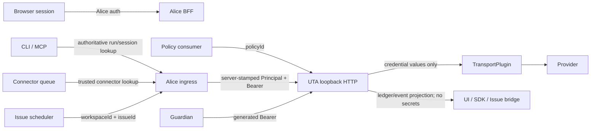
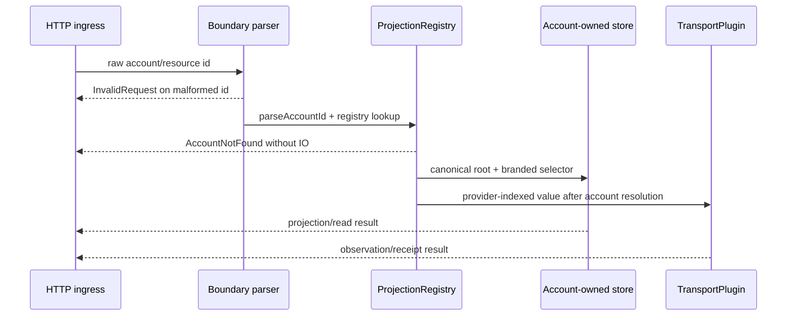
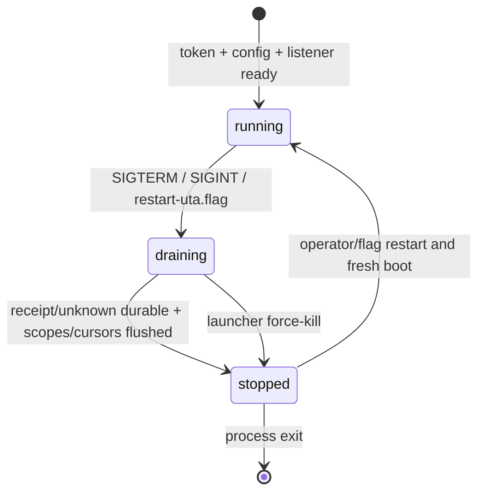

# UTA 安全与运行运维规范

> **本文拥有**：UTA 的进程认证、入口身份、资源解析、密钥边界、运行时配置、readiness、优雅停止、重启控制、运维观测、备份恢复及容量/保留策略。
>
> **本文展开的冻结决策**：D7（Security and principals）、D12（Operations），以及 D5 的配置归属/原子替换部分和 D10 的配置解析部分；同时落实 residual rulings R1（duplicate account ids）、R2（mode precedence）、R3（ephemeral accounts）、R5（unresolved venue/routing）和 R6（FX config）。本文不重新决定 D5 的 ledger 格式、D3 的 provider ABI 或 D9 的 Issue 设计；这些内容只在本文所需的边界处被引用。
>
> **本文使用的类型**：`Principal`、`Origin`、`AccountId`、`AliceId`、`NativeKey`、`ProviderId`、`ProjectionVersion`、`ConfigRevision`、`RequestId`、`Instant`、`Duration`、`AsOf`、`Cursor`、`EntryPosition`、`HeadPosition`、`OperationKind`、`ProviderKey<P>`、`ProviderOrderRef<P>`、`Operation<P>`、`Receipt<P>`、`Observation<P>`、`ProviderEnvelope`、`OperationEnvelope`、`KeyEnvelope`、`ReceiptEnvelope`、`ObservationEnvelope`、`PlacementRecovery<P>`、`RecoveryResult<P>`、`VerifiedReadByKey`、`AbsenceProof`、`ProviderDeclaration`、`CapabilityTable`、`CapabilityStatus`、`WriteContract`、`ReadByKeyContract`、`CredentialInput`、`TransportPlugin`、`ProjectionRegistry`、`LedgerEntry`、`LedgerEntryWire`、`UnknownLedgerEntryWire`、`ReasonTree`、`AppendStore`、`AppendResult`、`OpenResult`、`CloseResult`、`Durable`、`DurableWeak`、`WorkRequested`、`RuleConfig`、`AuthorizationPolicy`、`UtaRuntimeConfig`、`ProcessState`、`ProcessModeValue`、`ProcessModeSource`、`ProcessMode`、`ProcessSnapshot`、`ProcessHealth`、`TransportError`、`TransportState`、`ReadableState`、`WritableBlockedReason`、`WritableState`、`AccountReadiness`、`ReadinessResult`、`ReadinessViolation`、`ReadinessResponse`、`Freshness`、`ConfigError`、`EventItem`、`ErrorCode`、`ErrorEnvelope`。它们的定义以 `plans/uta-refactor/spec/types/` 为唯一准据；本文不新增领域类型。

本文的 `MUST`、`MUST NOT`、`SHOULD`、`MAY` 均为实现约束。当前实现事实用“当前事实”标示；当前事实不是新实现可以继承的安全保证。

## 1. 安全目标与边界

### 1.1 需要保护的资产

以下内容只允许在拥有者规定的边界内出现：

- Guardian 本次运行生成的 `OPENALICE_UTA_TOKEN`；
- `accounts.json` 中的 provider credential，以及 `<OPENALICE_HOME>/sealing.key`；
- provider transport 的认证头、签名材料、session、私钥、passphrase 和原始 credential payload；
- provider 返回的原始 body/frame 中可能重复出现的 credential；
- `Principal` 中的会话、Workspace、Session、connector、Issue 和 policy 标识。它们可用于审计，但不是 bearer secret。

UTA 的目标是防止浏览器、任意 loopback caller、错误的资源 id、日志/Issue 传播和意外的 child-env 继承越过这些边界。它不宣称能抵抗已经控制同一用户进程权限的 malware；现有 sealing 文档也明确说明同一用户下的 Alice 进程可以读取 key（`src/core/sealing.ts:10-17`）。

### 1.2 信任拓扑

当前 UTA 绑定 `127.0.0.1`，Alice 以 `OPENALICE_UTA_URL` 指向它（`services/uta/src/main.ts:1-10,172-177`；`src/services/uta-supervisor/url.ts:10-14`）；当前 BFF 只转发有限 header，且不转发 browser cookie/session（`src/webui/routes/trading-proxy.ts:1-12,27-34`）。新契约在此 loopback 边界上增加每次 Guardian 运行的 bearer，并把身份由 Alice 服务端重新盖章。



- UTA 的 bearer middleware 必须先于路由、资源解析和错误正文生成执行。
- Alice、Guardian 和 UTA 之间是本机受控的服务边界；浏览器永远不能取得 bearer，也不能直接调用 UTA。
- `OPENALICE_UTA_URL` 只能表示本机 loopback。远端 UTA 不复用该 token；远端 transport 必须另有冻结的认证和 owner 协议，本版本不实现。
- BFF 的 mutation gate MUST 来自发布 OpenAPI 的 `x-uta-channel` 元数据，而不是 URL substring；D7 的 BFF 约束与当前旧实现的 header allow-list 事实分别见 `plans/uta-refactor/spec/00-decision-register.md:147-152`、`src/webui/routes/trading-proxy.ts:27-34,115-187`。

## 2. Bearer contract 与 URL fail-closed

### 2.1 Token 形状和生命周期

1. 每个 Guardian process 在取得 runtime ownership 后、创建任何 Alice/UTA child 前，MUST 生成一次 `randomBytes(32).toString('base64url')` 等价的 256-bit cryptographic random token。它是该 Guardian run 的内存值；不得写文件、命令行、restart flag、URL、ledger、event、Issue 或日志。
2. Guardian MUST 忽略并覆盖其自身环境中已经存在的 `OPENALICE_UTA_TOKEN`。外部提供的值不得改变本次 token，也不得被转发给任意 child。
3. 同一个 Guardian run 的 token 在初次启动、`restart-uta.flag` 重启和 mode reconcile 中保持不变。新 Guardian run（新的 Guardian PID/ownership）才生成新 token。
4. UTA child 没有非空 `OPENALICE_UTA_TOKEN` 时 MUST 在绑定 HTTP listener 前失败并以非零状态退出；不得降级成 loopback-only 无认证模式。长度、字符集或解码失败同样按缺 token 处理。
5. 每个 UTA HTTP request（包括 `GET /__uta/health`、`GET /v2/readiness` 和 `GET /v2/openapi.json`）MUST 同时带有唯一的 `Authorization` header：

   ```text
   Authorization: Bearer <base64url-token>
   ```

   token 只能含 `[A-Za-z0-9_-]`，不得有空格、引号、换行、query 参数或 URI userinfo。缺失、重复、格式错误和不匹配均返回 `401`；body MUST 是带 server-generated `RequestId`、generic `ReasonTree` 和 `ErrorCode: Unauthorized` 的有效 `ErrorEnvelope`；响应不得说明是 token 缺失还是不匹配。

6. UTA 的 bearer middleware MUST 使用 constant-time 等价比较；验证失败不得进入 path/resource resolution，因此不能借 401/404 差异探测账户或文件。
7. UTA client、Guardian health probe、Alice BFF relay 和 Alice 直连 SDK 均由服务端注入 `Authorization`。浏览器、Issue Markdown、MCP caller 和 connector message 不得承载该 token。

### 2.2 `OPENALICE_UTA_URL` 的限制

当前 `src/services/uta-supervisor/url.ts:10-14` 接受任意 URL，而 Guardian spawn、same-home flag 和 kill 逻辑实际上假定 UTA 在本机（`local://w1-lifecycle-topology.md:138-143`）。新契约如下：

- 如果显式设置 `OPENALICE_UTA_URL`，Guardian 和 Alice MUST 解析 URL 并只接受 `http`、无 userinfo、无 credential query、literal loopback host（`127.0.0.0/8` 或 `::1`）及有效端口。DNS 名称 `localhost` 只有在解析并确认所有地址均为 loopback 时才可接受；无法解析必须拒绝。
- 非 loopback URL、`https`（本地 transport 未定义）、无端口、端口越界、userinfo、fragment、query 中的 credential MUST 在 child spawn 前失败；不得尝试连接远程地址。错误为本地启动错误，不能把 URL 原样写入日志。
- 未设置 URL 时，各 launcher 从它已分配的 `OPENALICE_UTA_PORT` 组成 `http://127.0.0.1:<port>`；不得从 cwd、用户输入的 path 或任意配置字符串推导 host。
- Docker 的 Alice 可以绑定 `0.0.0.0`（`Dockerfile:148-157`），这不改变 UTA 的 loopback-only 规则；容器内 UTA URL 仍由 Guardian 指向 `127.0.0.1`。

## 3. 五类 launcher 的 token 注入

### 3.1 共同注入算法

每个 launcher 的 Guardian composition root MUST 实现同一语义：

```text
runToken = cryptographicRandom256Bits()       # once, after Guardian ownership
inherited = process.env without OPENALICE_UTA_TOKEN
utaChildEnv = inherited + OPENALICE_UTA_TOKEN=runToken
aliceChildEnv = inherited + OPENALICE_UTA_TOKEN=runToken
otherChildEnv = inherited without OPENALICE_UTA_TOKEN
```

这里的伪代码不是新的公共 API。关键要求是：不能把 token 放进同时给 Vite、Connector 或任意 workspace child 使用的 broad `baseEnv`；不能依靠“继承 process.env 后希望别人不读取”；不能把 token 放进 `args`。Guardian 的 token 内存值可由用于 respawn 的 UTA `SpawnSpec`/闭包捕获，但不能出现在诊断对象、runtime status 或 process argv。

每一次对 UTA 的 health/readiness poll 都必须设置相同的 `Authorization` header。当前 Guardian health poll 只检查 HTTP status（`scripts/guardian/shared.ts:329-343`；`scripts/guardian/prod.mjs:388-398`），这是必须改成带 token 的调用约束；不能因 poll 是“内部请求”而跳过认证。

### 3.2 Dev Guardian (`scripts/guardian/dev.ts`)

**当前事实**：`baseEnv` 在 `scripts/guardian/dev.ts:249-263` 供多个 child 使用；UTA `SpawnSpec` 在 `:265-283` 只注入 `OPENALICE_UTA_PORT`，Alice child 在 `:321-337` 注入 `OPENALICE_UTA_URL`。UTA restart 复用 `OptionalServiceController`，其 SIGTERM/force-kill 路径在 `scripts/guardian/shared.ts:458-527`。

**实现步骤**：

1. Dev Guardian 在生成 `baseEnv` 前生成本 run token，但 MUST 从 broad `baseEnv` 排除所有 inherited `OPENALICE_UTA_TOKEN`。
2. `utaSpec.env`（`scripts/guardian/dev.ts:265-272`）显式加入 `OPENALICE_UTA_TOKEN=runToken`；`OPENALICE_HOME`、`AQ_LAUNCHER_ROOT`、`OPENALICE_LAUNCHER=dev`、Guardian identity 和 `OPENALICE_UTA_PORT` 继续按当前 seam 注入。
3. Alice 的 child env（`scripts/guardian/dev.ts:321-335`）显式加入同一个 token，并保留 `OPENALICE_UTA_URL=http://127.0.0.1:<utaPort>`。Vite、Connector 和其他 child 不得收到 token。
4. `waitForHttp(`${utaUrl}/__uta/health`)`（当前调用在 `scripts/guardian/dev.ts:274-283`）必须由带 bearer 的 probe 执行。
5. `OptionalServiceController.restart()` MUST 复用同一 `utaSpec.env` token；禁止在每次 restart 生成新 token。Dev 的 UTA restart graceful wait 为 8 秒，随后最多再等待 5 秒的 force-kill（`scripts/guardian/shared.ts:495-510`）。
6. Guardian shutdown 的通用 grace 为 5 秒（`scripts/guardian/shared.ts:345-396`）；UTA drain MUST 在该窗口内完成，详见 §9。

### 3.3 Production Guardian / local CLI (`scripts/guardian/prod.mjs`)

**当前事实**：非 Bun 进程由 `runtimeProcessSpec` 选择 `node services/uta/dist/uta.js`；`makeUTASpec` 的 env seam 在 `scripts/guardian/prod.mjs:280-301`，Alice seam 在 `:350-376`。UTA restart 在 `:483-535`，flag watcher 在 `:569-595`，Guardian shutdown 的 5 秒 force deadline 在 `:537-566`。UTA readiness poll 为 15 秒（`:388-398`）。

**实现步骤**：

1. `startGuardianRuntime()` 在 `initializeRuntimeState()` 和 child spawn 之间生成一个 run token；token 必须在 `makeUTASpec()` 的闭包/运行时状态中稳定保存。
2. `makeUTASpec()` 的 `env`（`:288-300`）从 inherited env 删除 `OPENALICE_UTA_TOKEN` 后显式加入 run token。`OPENALICE_UTA_PORT`、`OPENALICE_HOME`、`AQ_LAUNCHER_ROOT`、`OPENALICE_LAUNCHER` 和 Guardian identity 不变。
3. `spawnAlice()` 的 env（`:358-376`）以同一个 token 显式注入，供 Alice 的 BFF、SDK、CLI/MCP bridge 向 UTA 发请求。Connector env（`:324-337`）和 Guardian control endpoint 不得得到 token。
4. `waitForUTA()`（`:388-398`）的 `/__uta/health` poll 必须带 bearer；未通过认证的 HTTP 200 不得被视为 ready。
5. `restartUTA()`（`:483-535`）重用已有 run token。配置变化可以使 UTA 重启，但不能轮换 Guardian token；新的 Guardian process 才轮换。
6. 如果是 local CLI 启动，`packages/cli/src/local-start.mjs:153-191` 仍启动同一个 production Guardian；它不能另行生成第二个 token 或把 token 作为 CLI flag。

### 3.4 Electron desktop (`apps/desktop/src/main.ts`)

**当前事实**：Electron UTA 使用 `process.execPath`、`ELECTRON_RUN_AS_NODE=1` 和 `services/uta/dist/uta.js`（`apps/desktop/src/main.ts:786-813`）；UTA env seam 在 `:791-806`，Alice env seam 在 `:840-868`。桌面 UTA restart 通过 `reconcileUTA`，停止阶段 8 秒后 force-kill（`:1186-1237`）；全局 child shutdown 5 秒后 force-kill（`:1316-1344`）。

**实现步骤**：

1. Electron main 在 `spawnUTA()` 和 `spawnAlice()` 第一次调用之前生成一个 token，整个 Electron Guardian run 只保存一个值；不得在 `spawnUTA()` 函数每次被调用时生成。
2. `spawnUTA()` 的 env（`:791-805`）显式注入 token；保留 `ELECTRON_RUN_AS_NODE`、`OPENALICE_UTA_PORT`、`OPENALICE_HOME`、`OPENALICE_APP_HOME`、`AQ_LAUNCHER_ROOT` 和 runtime/proxy seams。
3. `spawnAlice()` 的 env（`:842-862`）显式注入同一个 token。Connector child (`:815-837`) 和 renderer/PTY child 不得收到 token；因此从 `process.env` 继承时必须先剥离。
4. Electron 的 UTA health poll（`:953-958`）必须带 bearer；只有认证成功的 health response 才能显示 UTA ready。
5. `reconcileUTA()` 每次 restart 复用 token，且在旧 UTA 退出和新 UTA ready 之间 token 不变。Electron `stopManagedProcess` 的 8 秒 graceful + force-kill 行为必须与 §9 的 drain budget 对齐。

### 3.5 Bun standalone (`packages/cli/bin/openalice-bun.ts` + `scripts/guardian/runtime-process-spec.mjs`)

**当前事实**：`runtimeProcessSpec()` 对 Bun 返回同一 executable 加 `--internal-role <role>`（`scripts/guardian/runtime-process-spec.mjs:8-24`）；Bun role dispatcher 将 `uta` role 导入 `startUTAService()`（`packages/cli/bin/openalice-bun.ts:34-55`）。

**实现步骤**：

1. Bun 的 Guardian role 按 §3.3 生成 run token，并把它作为 UTA/Alice child env；`runtimeProcessSpec` 的 argv 形状保持 `["--internal-role", "uta"]`，token MUST NOT 进入 argv。
2. Bun UTA role（`openalice-bun.ts:47-50`）只从 `process.env.OPENALICE_UTA_TOKEN` 接收 Guardian 已注入的值，再调用 `startUTAService()`；它不得自行生成 token、从 CLI 参数读 token 或读取 `accounts.json` 以外的 credential source。
3. 直接执行 compiled binary 的 UTA role 若没有 token，必须在 listener 前失败闭锁。直接 role invocation 不享有 Guardian 的“每 run 自动生成”能力。
4. Bun UTA respawn 仍由 production Guardian 使用同一个 token；Bun dispatcher 设置的 `__OPENALICE_INTERNAL_ROLE_DISPATCH__` 只防止重复 entrypoint，不构成认证（`openalice-bun.ts:8-13,34-50`）。

### 3.6 Docker

**当前事实**：Docker image 的固定 `ENV` 包含 `OPENALICE_HOME=/data`、`OPENALICE_APP_HOME=/app`、`OPENALICE_UTA_PORT=47333` 和 Alice 的 `OPENALICE_BIND_HOST=0.0.0.0`（`Dockerfile:143-157`）；`tini` 启动 `node scripts/guardian/prod.mjs`（`:167-170`）。Docker healthcheck 只检查 Alice `/api/version`（`:162-165`）。

**实现步骤**：

1. `Dockerfile`、Compose 文件、image layer 和 `/app` 内的默认配置 MUST NOT 包含 `OPENALICE_UTA_TOKEN`。不得为方便部署而写 `ENV OPENALICE_UTA_TOKEN=...`，不得让 operator 粘 token。
2. `tini` 下的 production Guardian 按 §3.3 在容器每次 Guardian run 生成 token，显式注入 UTA child 和 Alice child；不要让 token 进入 Connector child、`node` argv 或 Docker healthcheck 命令。
3. Docker 中 Alice 的外部 bind host 与 UTA 的 loopback bind 是两个不同边界：Alice 可以保持 `0.0.0.0`，UTA 仍只监听 `127.0.0.1:47333`，Compose 不得暴露 UTA port。
4. Docker healthcheck 不替代 UTA bearer probe；它证明的是 Alice HTTP surface。Guardian 的 `/__uta/health` poll 必须另带 token；当前两者语义不同的证据见 `local://w1-lifecycle-topology.md:45-49`。

## 4. Principal server stamping

### 4.1 Header grammar

所有进入 UTA 的 HTTP request（除 `/__uta/health`、`/v2/readiness` 和 `/v2/openapi.json` bearer-only probes；这三个 endpoint 不要求业务 `Principal`，其余 action/account-scoped ingress 必须带以下两个 header）必须有以下两个 header：

```text
Authorization: Bearer <base64url-token>
X-OpenAlice-Principal: v1 <base64url(canonical-utf8-json-Principal)>
```

- `X-OpenAlice-Principal` 的 `v1` 后只有一个 ASCII 空格和一个不带 `=` padding 的 base64url 值；总长度上限为 2048 bytes。解码后必须是 `Principal` 的一个已知 variant，JSON 不得有未知字段、重复字段、控制字符或第二个 principal。
- canonical JSON 使用稳定 key ordering 和 UTF-8；`externalUserId` 缺省时省略，不写 `null`。示例（示例中的 base64url 仅表示编码形式，不是固定值）：

  ```json
  {"kind":"human","sessionId":"session-opaque"}
  {"kind":"agent","workspaceId":"ws-opaque","resumeId":"resume-opaque","runId":"run-opaque"}
  {"kind":"connector","connectorId":"telegram","externalUserId":"user-opaque"}
  {"kind":"connector","connectorId":"telegram"}
  {"kind":"schedule","workspaceId":"ws-opaque","issueId":"issue-opaque"}
  {"kind":"policy","policyId":"risk-policy"}
  {"kind":"system"}
  ```

- 该 header 本身不是独立认证机制；只有与本次 Guardian bearer 同时验证成功才有意义。Alice MUST 删除 caller 提供的同名 header 后再写入自己的 header；UTA MUST 不信任 body/query 中名为 `principal` 的字段，也不接受任意 caller 直接设置的 header。
- Alice 的 access logger、BFF passthrough 和错误处理不得记录完整 header。UTA 只把解析后的 `Principal` 写入 `intent.proposed`/`authorization.decided` 的 ledger payload；普通诊断日志只记录 `Principal.kind`。
action/account-scoped request 的 header 缺失、无法从 Alice authoritative registry 解析、CLI run/session 互相矛盾、connector identity 未注册或 variant 不允许当前 ingress，均返回 `Unauthorized`，且不创建 ledger entry。三个 bearer-only endpoint 忽略 caller 提供的 Principal header（若存在），只依赖 bearer。

### 4.2 Ingress 映射表

| Ingress | server-side authoritative source | UTA header / domain principal | 禁止的 fallback |
|---|---|---|---|
| Browser BFF session | Alice auth middleware 的已验证 session；当前 middleware 建立 session context 见 `src/webui/middleware/auth.ts:75-117` | `Principal = {kind:'human', sessionId}` | 不得从 body、Origin、user-agent 或浏览器自带 `X-OpenAlice-Principal` 推断 |
| CLI / MCP | `x-openalice-run`、`x-openalice-session` 经 Alice Workspace/Session registry 解析；当前 lookup/provenance 在 `src/server/cli.ts:300-371` | `Principal = {kind:'agent', workspaceId, resumeId, runId}` | 缺 authoritative run/session 不得默认 `human` 或 `system` |
| Connector | Alice connector bridge 根据已注册 connector queue、claim 和 external owner 取得 identity；当前 action 只携带 connector/request/hash 的事实见 `packages/connector-protocol/src/types.ts:230-242,282-310`、`src/services/connector-client/uta-review.ts:150-217` | `Principal = {kind:'connector', connectorId, externalUserId?}` | 不得把 Telegram Markdown 的自由文本当成 human approval；不能把 connector 当 agent |
| Scheduler / Issue dispatch | Alice Issue scanner 的已验证 `{workspaceId, issueId}`；scanner 是 60 秒轮询并在 durable task accepted 后推进 marker（`src/workspaces/schedule/scanner.ts:52-86,345-387`） | `Principal = {kind:'schedule', workspaceId, issueId}` | 不得从 Issue title/What、文件名或 task prompt 猜 workspace/Issue |
| Policy consumer | UTA 已加载的 `AuthorizationPolicy` 与具体 policy binding | `Principal = {kind:'policy', policyId}` | `allowAiTrading` 旧全局开关不是 principal；当前它只在 tool path 被 live 读取（`src/core/config.ts:242-249`；`src/tool/trading.ts:807-845`） |
| Alice internal / Guardian / UTA internal scheduler | 已知的 Alice/Guardian control call site 或 UTA composition root | `Principal = {kind:'system'}` | 不得借用最近一次 human/agent principal；internal timer 没有 Issue scope 时只能是 `system` |

scheduler 与 UTA 内部 poller 要区分：Issue scheduler 有 `workspaceId`/`issueId`，必须使用 `schedule`；UTA 自己的 observation、cursor flush、startup recovery 和 provider callback 没有 Issue scope，使用 `system`，同时在 `source` 中保留 provider/transport 来源。

### 4.3 Principal 与授权记录

- `intent.proposed` 必须保存创建该 intent 的完整 `Principal` 与 `Origin`；后续 consumer 不得覆盖它。
- `authorization.decided` 必须保存作出 decision 的完整 `Principal`。因此 agent 提案后 human approval 形成两个可区分的身份；connector 审核不会伪装成 human，policy 自动批准不会伪装成 agent。
- `AuthorizationPolicy.agentDecisionAuthority` 的 `binding | recommendation` 只决定 policy/agent decision 的业务权威，不改变 header stamping。推荐性 decision 仍被记录，不能被静默丢弃。
- provider observation 的上游 `source`、`asOf` 与 `ProviderEnvelope` 继续由 `provider/indexed.ts` 表达；它没有一个凭空生成的外部 human principal。由 UTA 内部产生的 observation/repair ingress 使用 `system`，不能把 `system` 当作 provider 事实来源。

## 5. Registry-first resource resolution

### 5.1 不从 raw id 产生 path 或 provider call

D7 的安全规则是：`accountId` 和每一种 resource id 在任何 filesystem/provider use 前都必须经过 `ProjectionRegistry`。解析顺序固定为：

1. 从 HTTP path/query/body 得到 `unknown`，用对应 parser 构造 branded `AccountId`、`AliceId`、`NativeKey`、`ProviderOrderRef`、`RequestId` 或 `Instant`；parser 失败返回 `InvalidRequest`。
2. 通过 `ProjectionRegistry` 查到已加载的 account、provider declaration、projection version 和 transport handle；registry miss 返回 `AccountNotFound`，不触碰 filesystem，不实例化 provider。
3. 仅使用 registry 返回的 canonical storage root / provider-indexed value；禁止把 raw string 传给 `resolve()`、`join()`、动态 import、provider SDK 或 transport plugin。
4. 对 registry 返回的 path 再做 realpath containment：目标必须位于对应 `data/trading/<resolved AccountId>/` 或 immutable runtime root 内；symlink、绝对 path、`..`、路径分隔符和不符合文件名 grammar 的 index value 一律拒绝。

当前 `createSnapshotStore(accountId)` 直接执行 `resolve(baseDir, accountId, 'snapshots')`（`services/uta/src/domain/trading/snapshot/store.ts:24-38`），snapshot route 直接把 `c.req.param('id')` 传入 service（`services/uta/src/http/routes-trading.ts:642-660`），这是旧 snapshot traversal class；新实现不得保留这个 raw-id seam。`AccountId` parser 还必须拒绝 `/`、`\\`、`.`、`..` 和 path separator；仅“非空字符串”不足以成为 path safety。

### 5.2 Snapshot、ledger 和 provider selector 规则

| Selector | 解析和使用规则 |
|---|---|
| `accountId` | 先 `parseAccountId`，再 `ProjectionRegistry` lookup；snapshot/ledger store 只接收 registry-owned account handle。未知 account 为 `AccountNotFound`，绝不 fallback 到同名目录。 |
| snapshot `timestamp` | 先解析为 `Instant`/合法时间 selector；它只用于 store 查询。不得作为 filename 或 directory segment。 |
| snapshot `chunk.file` | 它来自持久化 index，仍是不可信输入；只接受实现定义的 basename grammar（例如 `chunk-<digits>.jsonl`），禁止 `/`、`\\`、absolute path、symlink escape，并以 realpath containment 复核。index malformed/corrupt 不能当作空 index。 |
| `aliceId` | 先 parse 账户部分，再 registry resolve 该 account；只有 resolve 后才能由该 provider 的 native-key resolver 重建 `Operation<P>`/read contract。跨 account 的 `aliceId` 返回 `AccountNotFound`/`InvalidRequest`，不得用当前 account 强行改写。 |
| provider order/reference | 先按 account/projection 取得 provider-specific parser；不能把 `ProviderOrderRef<P>` 当成另一个 provider 的 string 或文件名。 |
| wallet/commit/hash selector | 只作为 ledger projection 的 opaque validated selector；不得拼接到 filesystem path。查询通过 account-owned `AppendStore`/view 完成。 |
| `nativeKey`、symbol、Issue id | 只作为 registry/provider/Workspace lookup 的 key；任何 lookup miss 都是结构化错误，不得建立 skeleton provider object 或空成功。 |

聚合 snapshot route 也只能遍历 `ProjectionRegistry` 当前账户集合；不能用 query/body 提供的目录名替换 registry 集合。任何 `baseDir`/storage root override 只能由 composition root 在启动时解析，不能由 HTTP caller 提供。



## 6. Secret ownership、读取和注入

### 6.1 `accounts.json` 的 Alice-owned sealed read path

**当前事实**：Alice 的 `writeAccountsFile` 将 `accounts.json` 写为 owner-only sealed envelope（`src/core/config.ts:704-718`）；`readUTAsConfig()` 从 `data/config/accounts.json` 读取，识别 sealed envelope 并用 `sealing.key` unseal（`src/core/config.ts:719-747`）。`sealing.key` 是 `<OPENALICE_HOME>/sealing.key` 外置的随机 32-byte key，envelope 为 `$sealed=1`/`alg=aes-256-gcm`/`iv`/`tag`/`data`（`src/core/sealing.ts:1-20,32-38,49-68,92-133`）。UTA 当前经 `uta-manager.ts:16,61-77` 反向依赖 Alice config；新边界应改为窄的 config reader seam，不把 Alice module graph 带入 provider plugin。

新契约：

1. `accounts.json` 的唯一业务写者是 Alice config boundary；UTA 只读。UTA MUST NOT 让 `TransportPlugin`、provider projection 或 Issue bridge 读取/写入 `accounts.json` 或 `sealing.key`。
2. 正常读取路径是 `${OPENALICE_HOME}/data/config/accounts.json` → 严格 JSON/envelope parser → `${OPENALICE_HOME}/sealing.key` → unseal → account record parser。plaintext credential 不得越过该 boundary 进入未验证 domain。
3. 缺少 `accounts.json` 可以由 Alice-owned config bootstrap 原子创建空 sealed file；已有 sealed file 但 key 缺失、algorithm 不支持、认证失败、JSON 损坏或 envelope 字段不完整，属于 global config read failure，UTA MUST 不绑定服务并以结构化 startup failure 退出；不得像旧读取器那样 quarantine 后静默以空账户继续（旧 fallback 行为见 `src/core/config.ts:734-747`）。
4. 旧 plaintext array 只可在显式 migration mode 被读取；读取后必须由 Alice writer 立即 sealed rewrite。正常 UTA boot 不得把 plaintext 视为长期有效格式，也不得将 plaintext 写回。
5. `accounts.json` 的每次新写入仍必须完整校验、sealed、owner-only（`0600`），并使用 temp + fsync + rename + directory fsync；当前 `writeFile` 直接替换的实现（`src/core/config.ts:709-713`）是待切换的旧事实，不是新原子性保证。
6. ephemeral 的历史清理是唯一显式 data wipe exception：正常账户的 `data/trading/<id>` 不因 config reload 删除；ephemeral 账户按 D5 既定规则清除 trading directory，但 accounts config 删除仍经过 Alice-owned writer。当前 ephemeral 说明和启动清理事实见 `src/core/config.ts:458-463,790-821`。
7. (R1) Alice config route 对 `accounts.json` 中重复的 `accountId` MUST 返回 `409 DuplicateAccountId`，且不得写入重复文件。若 UTA 仍加载到重复文件，重复的每一个 source row 都必须保留为 account-local `config-invalid`，其 `ConfigError` 至少含 `code:'DuplicateAccountId'`；UTA MUST 不因该情形阻塞全局 startup，也不得静默选择某一 row。由于 `ReadinessResponse.accounts` 的 account id 必须唯一，registry MUST 将同一 id 的 row-level errors 聚合到一个该账户的 `config-invalid` readiness row，按 source row 写入安全 `path`，并保持其它账户可用。
8. (R3) 标记为 `ephemeral` 的 account MUST 绑定 `Mock` projection；任何其它 projection 都产生 account-local `config-invalid`，其 `ConfigError` 含 `code:'EphemeralRequiresMock'`，并令 `writable.reason.kind='ConfigInvalid'`。该校验不升级为 global startup block；现有 ephemeral wipe-on-start 例外仍按 D5 保留。

### 6.2 Credential 只以 injected value 到达 `TransportPlugin`

- account record 经过 config parser 和当前 `ProviderDeclaration` 的 auth scheme name/location 校验后，UTA composition root 将一份最小的 credential value record 按 `CredentialInput` 注入 `TransportPlugin`。`ProviderDeclaration.auth` 只能包含 scheme 名和位置，不能包含 secret；D3 明确要求如此（`plans/uta-refactor/spec/00-decision-register.md:51-59`），OpenAPI projection 的 auth metadata 也只保留 names/locations（`local://w1-openapi-projection.md:91-114`）。
- plugin 接口只能接收已验证的 credential values 和请求上下文；plugin MUST NOT import config/sealing modules，读取 `OPENALICE_HOME`、`accounts.json`、`sealing.key` 或自行查询 env。
- credential 只在连接/请求 scope 存活；scope release 时丢弃引用。TypeScript 不承诺可观察的 memory zeroization，因此不能把“已清零”写入日志或 readiness。
- Pack boundary 只能传 serializable records、decimal strings、tagged errors、`ProviderEnvelope` 和 raw payload；不能传 `Decimal`、SDK class、`Contract`、sealed envelope 或 key。当前 pack 的 class identity/serializable boundary 证据见 `local://w1-provider-capability.md:86-97`。
- provider response 如需保留 raw payload，必须先经过 credential scrubber；无法证明已移除 credential 的 raw payload 不得持久化为 ledger/event/Issue，也不得写 log。

## 7. UTA-owned runtime config
本节标题中的 “UTA-owned” 指 UTA 对该配置的读取、解析和运行时消费责任，不改变 D5/A2 规定的写入归属：`uta-runtime.json` 的唯一 writer 是 Alice config routes。

### 7.1 文件归属和 schema

`UtaRuntimeConfig` 的 canonical file 是：

```text
${OPENALICE_HOME}/data/config/uta-runtime.json
```

它和 Alice-owned `accounts.json` 是两个不同的 whole-replacement stores：

| Store | Owner | Content | UTA behavior |
|---|---|---|---|
| `accounts.json` | Alice config boundary | account identity、preset 和 sealed credential | UTA read-only；不把内容复制到 event/Issue |
| `uta-runtime.json` | Alice config routes | policy、rule、optional mode、required `fx.maxAge`、projection activation、recovery、capacity、retention | UTA read-only；除 mode 外通过 watcher hot reload；effective mode 由启动时优先级解析，不回写 `ConfigRevision` |
| `data/trading/<id>` | UTA ledger/snapshot writer | ledger、views、snapshots、quarantine、legacy archive | append-only/derived-store rules；不承载配置替换 |
| `data/control/restart-uta.flag` | Alice/Guardian control boundary | ISO timestamp control signal | 只触发 restart，不是 config 或 ledger entry |

`UtaRuntimeConfig` 的严格 JSON field structure 如下；尖括号是文档占位符，不是可写入的 literal：

```json
{
  "schemaVersion": 1,
  "mode": "lite",
  "policies": [
    {
      "accountId": "<AccountId>",
      "policy": {
        "selfApprove": ["human"],
        "agentDecisionAuthority": "recommendation",
        "limits": []
      }
    }
  ],
  "rules": [
    {
      "accountId": "<AccountId>",
      "rules": [
        {"kind": "maxObservationAge", "milliseconds": 60000}
      ]
    }
  ],
  "fx": {
    "maxAge": 60000
  },
  "projections": [
    {
      "accountId": "<AccountId>",
      "providerId": "<ProviderId>",
      "projectionVersion": "<ProjectionVersion>",
      "sourceDigest": "<sha256>"
    }
  ],
  "recovery": [
    { "accountId": "<AccountId>", "maxUnknownDuration": 1800000 }
  ],
  "capacity": {
    "maxProviderConnections": 128,
    "maxConcurrentReads": 64,
    "perAccountWriteQueueCapacity": 256,
    "fanoutQueueCapacity": 4096,
    "ledgerSegmentMaxBytes": 16777216
  },
  "retention": {
    "snapshotMaxAge": 2592000000,
    "snapshotMaxBytes": 1073741824,
    "diagnosticLogMaxBytes": 268435456,
    "quarantineMaxBytes": 268435456
  },
  "updatedAt": "<Instant>"
}
```

- `schemaVersion` 是 strict literal `1`；optional `mode` 只能是 `lite`、`readonly` 或 `pro`；`fx` 是必填 strict object 且 `fx.maxAge` 是正的 `Duration`，没有隐式默认值；unknown top-level/record fields、duplicate `accountId` in any section、missing required section、wrong primitive、non-finite number、numeric money、negative/zero `Duration` 和 invalid digest 都拒绝；`capacity.ledgerSegmentMaxBytes` 只能是 canonical literal `16777216`。
- `ConfigRevision` 不持久化在 `uta-runtime.json`；parser 对该字段按 unknown top-level field 拒绝。`runtimeConfigDigest = sha256(canonical semantic object excluding updatedAt)`，semantic object 含 `schemaVersion`、存在时的 `mode`、`policies`、`rules`、必填 `fx`、`projections`、`recovery`、`capacity` 和 `retention`；每个账户定义 `accountConfigDigest = sha256(canonical non-secret account row)`，并派生 `ConfigRevision = sha256(canonical {runtimeConfigDigest, accountConfigDigest, projectionVersion})`。该账户值写入 `intent.proposed`/`attempt.started`，并暴露在 readiness 的 `config.kind='valid'` 中；`updatedAt` 由 writer 产生并按 `Instant` parser 校验，但不参与任何 revision（D5/A2）。
- `policies`、`rules`、`projections`、`recovery` 是数组而不是无约束 raw map；四个数组的 `accountId` 集合 MUST 与 `policies` 集合完全相同且各自不得重复。`policy` 使用 `AuthorizationPolicy`；`rules` 只能使用 `policy.ts` 的 `RuleConfig[]` closed variants；`projections` 的三项先 parse branded ids，再由 `ProjectionRegistry` resolve，`sourceDigest` 必须是小写 64-hex digest；`recovery.maxUnknownDuration` 是正的毫秒值。未知 `kind`/rule 不得留在 `unknown` object 中。
- `UtaRuntimeConfig` MUST NOT 出现 credential、token、`Authorization`、cookie、raw provider body、private key、passphrase 或 sealed envelope。任何含这些字段的 write 直接返回 `InvalidRequest`，且旧文件不变。
- `capacity` 的五个字段和 `retention` 的四个字段都是必填的、无隐式默认值的 bounded settings；`fx.maxAge` 同样必填且必须通过正的 `Duration` parser，其中 `maxProviderConnections` MUST ≥ `MIN_PROVIDER_CONNECTIONS`（100），`ledgerSegmentMaxBytes` 是固定 literal `16777216`，不是可调默认值。示例值是经过设计选择的 baseline：`maxProviderConnections=128` 至少覆盖 100 upstream connection 目标；其它可调值必须由部署写入并在运行时验证，不能由缺失字段猜出。
(R2) effective mode 的唯一解析顺序是：`OPENALICE_UTA_MODE` env 若已设置，则取 env；否则取 `uta-runtime.json.mode`（若存在）；否则取 `lite`。env/config 值只能是 `lite`、`readonly` 或 `pro`，非法值在 startup 失败闭锁，不得 fallback。解析在 startup 完成一次，生成 `ProcessMode{value,source:'env'|'config'|'default'}`；watcher 绝不能 hot reload mode。任何 effective mode change（包括增加、删除或修改 `mode`）都必须先成功写 config，再通过 `data/control/restart-uta.flag` 触发 process rebuild；readiness 通过顶层 `ReadinessResponse.process.mode{value,source}` 暴露该 resolved value（R2）。
- 这些 knob 都是可观测的 bounded settings。ledger 历史没有 age/count deletion knob；`ledgerSegmentMaxBytes` 只触发新 segment，不删除已确认历史。snapshot 和 diagnostic log 可以按 §12/§13 规则清理；quarantine 不能静默清理。backup retention 是显式 operator/runbook 参数，不属于 `UtaRuntimeConfig`。

### 7.2 Atomic replace 和单写者
1. Alice config routes 是唯一 `uta-runtime.json` writer；UTA 只读并通过 watcher hot reload。并发 config write 在 Alice writer queue 串行化；UTA、ledger consumer 和 provider plugin MUST NOT 写该文件。
2. Alice writer 对整个 `UtaRuntimeConfig` 做 canonical serialization，写到同目录唯一性临时文件（含 PID/random suffix），对文件 `fsync`，以 owner-only mode 写入，rename 到最终 path，再对父目录 `fsync`。Windows directory durability 在本 evidence packet 中 unverified；实现验收 MUST 运行 Windows 上的 `AppendStore` durability probe，覆盖 segment `fsync`、`head` rename、directory `fsync` 及中断后旧/新完整文件可见性；不能证明时必须报告 `DurableWeak`，不得声称 `Durable`。
3. rename/validate/fsync 任一步失败，Alice writer 返回结构化 persistence error，旧完整文件继续可读；UTA watcher 若读取到不完整或 invalid file，保留上一份 validated snapshot，不得将失败内容应用到 provider 或 readiness。
4. UTA watcher 只在完整文件 reread 且 strict parser 成功后替换 runtime snapshot；有效 `UtaRuntimeConfig` 中除 `mode` 外的字段默认 hot reload，不触发 restart flag。`mode` 的增加、删除或修改都不 hot reload，必须由 Alice config route 完成成功 write 后按 §10 只触发一次 restart；若 projection release/transport composition 也需要 process rebuild，不能把 hot reload 和 in-process reconnect 混用。
5. config replacement 与 ledger append 不要求跨 store transaction。每次 intent/attempt 使用其账户派生的 `ConfigRevision` snapshot；in-flight attempt 继续使用自己的 revision，replacement 影响下一 attempt。
### 7.3 三个 validation points
D10 要求同一套 kind-aware strict parser 在三个边界执行，不能只在 UI 或某一条 route 执行：

| Point | MUST validate | Failure outcome |
|---|---|---|
| config write | `unknown` body → `UtaRuntimeConfig`；strict keys/version；optional `mode`；required `fx.maxAge`；all `AccountId`/`ProviderId`/`ProjectionVersion`/`Instant`/`Duration`；section uniqueness；rule kind/finite numeric domains/non-empty string sets；no secret fields；capacity/retention/recovery bounds including `ledgerSegmentMaxBytes=16777216` | `ErrorCode: InvalidRequest`；旧 config remains；不写 flag、不改 ledger、不产生 provider call |
| startup | temp/rename 选择出的完整 file；JSON integrity；schemaVersion；optional mode + env precedence resolved once；required `fx.maxAge`；all global capacity/retention/recovery invariants；四个 account section 的集合一致性；由 canonical semantic content 派生 runtime digest 并在 account activation 时构造 `ConfigRevision`（排除 `updatedAt`） | global invalid blocks UTA startup before HTTP listener；Guardian sees offline；不得 warn-and-skip 或以空 runtime config 启动 |
| pre-provider construction | account record + Alice-owned account config；policy/rule against account；optional mode / required `fx.maxAge`；projection registry/sourceDigest/version；`ProviderDeclaration` capability/transport/auth metadata；write kind handler、idempotency 和 read-by-key requirement | account-local invalid → `config.kind='config-invalid'`, `writable.kind='blocked', reason.kind='ConfigInvalid'`；不构造 plugin、不发 provider request。`EphemeralRequiresMock`、`UnresolvedVenue` 和其它 account-local `ConfigError` 都走此路径；显式 provider unsupported → `CapabilityStatus.unsupported` / `writable.reason.kind='NoPlacementRecovery'`，不是空成功 |

- 启动时 `uta-runtime.json` 缺失是 global config bootstrap error；只有 Alice/installer 已写入一份完整、严格合法的 version 1 file 后才能启动。UTA 不从缺失字段推导隐式默认值。
- `UtaRuntimeConfig` schema failure（unknown field、任一 section row malformed、四个 account section 集合不同或 duplicate）属于 global config write/startup failure。只有严格 parse 成功后，account-local 的 Alice account config、registry、provider capability 或 active projection mismatch 才进入 `config-invalid`，不阻止其他合法账户的 readiness。
- (R1) `accounts.json` 的 duplicate `accountId` 是 account-local invalid，不是 `UtaRuntimeConfig` 的 global schema failure：UTA 不因重复 row 阻塞 startup；每个重复 source row 的 `ConfigError.code` 都是 `DuplicateAccountId`，readiness 不选择其中一行。
- (R3) `ephemeral` account 的 active projection 不是 `Mock` 时，UTA 保持其它账户可用，并将该 row 置为 `config-invalid{EphemeralRequiresMock}`；ephemeral wipe-on-start 仍只作用于其 `data/trading/<id>`。
- (R5) 若 declaration × account config 无法解析 effective capability tuple（包括 unknown venue 或 account-level unknown mode），该账户必须是 `config-invalid{UnresolvedVenue}`；provider-backed reads 返回 `503 ReadinessUnavailable` 且带同一安全 `ConfigError[]`，ledger-local reads 继续工作。不得用 transport 状态、空 capability 或 request echo 代替该错误。
- 无法 parse `AccountId`、顶层 JSON 不是 object、全局 capacity/retention/recovery 违反约束或所有账户无法建立 registry，属于 global invalid，按 startup block 处理。
- pre-provider 失败不得由 `as`、default branch、空 handler、empty list 或 `undefined` 掩盖；所有 known variants 穷尽处理。

## 8. Readiness 和 health

### 8.1 两个 endpoint 的不可替代语义

`GET /__uta/health` 必须保持 D6 的 process-liveness shape (`ProcessHealth`)：

```json
{"ok":true,"startedAt":"<ISO-8601 timestamp>","utas":3}
```

- `ok:true` 只表示 UTA listener 正在处理经过 bearer 认证的 request；`startedAt` 在一个 process 内不变且保持 `ProcessHealth` 要求的 ISO-8601 string，不转换成 v2 `Instant` epoch-ms；`utas` 是已注册账户数，不是 healthy/writable 数。
- 由于 D7 的“每个 request bearer”规则，Guardian/Alice 的 health probe 也必须带 token；没有 bearer 的旧 probe 得到 401，不算 UTA down 的业务状态。
- `/__uta/health` 不包含 account health/readiness，延续当前事实（`services/uta/src/main.ts:147-152`；`src/services/uta-supervisor/health.ts:9-42`）。

`GET /v2/readiness` 返回 `ReadinessResponse`：

```json
{
  "process": {
    "state": "running",
    "mode": {"value":"lite","source":"default"}
  },
  "accounts": [
    {
      "accountId": "alpaca-paper",
      "process": "running",
      "transport": {"kind":"connected"},
      "readable": {"kind":"ok","headPosition":0},
      "writable": {
        "kind": "blocked",
        "reason": {"kind":"FirstObservationRequired"},
        "secondary": []
      },
      "capabilities": {
        "quote": {
          "direction": "read",
          "status": {"kind":"supported"},
          "cursor": {"kind":"none"}
        }
      },
      "observationFreshness": {"kind":"fresh","asOf":0,"maxAge":60000},
      "config": {"kind":"valid","configRevision":"<ConfigRevision>"}
    }
  ]
}
```
`readable` 的 `ok` variant MUST 带 `HeadPosition` 类型的 `headPosition`；不可读时 MUST 使用 `unavailable{open:'TornTail'|'Corrupt'|'DurabilityFailure', at?:EntryPosition}`，不得用自由字符串 reason。`transport` 的 `disconnected` variant MUST 带 `since: Instant` 和可选的 `lastError{code,message}`；这些字段不能被压成字符串。

字段和 variant 以 `readiness.ts` 的 `ProcessState`、`ProcessSnapshot`、`AccountReadiness` 和 `ReadinessResponse` 为准；上例的 `quote` capability 以及 account/id 值均为示例，实际 response MUST 返回已解析的完整 `CapabilityTable`，不得用 empty capability 作为“未知”。

### 8.2 七个维度

| Dimension | `AccountReadiness` 语义 | 不得表示的含义 |
| `process` | UTA process 当前 `running`、`draining` 或 `stopped`。HTTP 可见时通常是前两者；`stopped` 是 terminal state 记录，不要求 listener 继续存活。 | 不表示 provider accepted/fill；process running 不是 account writable。 |
| `transport` | provider plugin/session 当前是 `connected`、`connecting` 或 `disconnected{since:Instant,lastError?:{code,message}}`。认证失败、scope close、网络断开分别保留可解释字段。 | 不把 HTTP loopback listener 当 provider connection，也不把 structured `lastError` 压成 reason string。 |
| `readable` | ledger/read projection 可用时为 `ok{headPosition:HeadPosition}`；ledger open 结果为 `TornTail`、`Corrupt` 或 `DurabilityFailure` 时为 `unavailable{open,at?:EntryPosition}`。 | 不把 provider transport 的断开、旧 stale observation 或 query route 的 200 冒充为 ledger readable。 |
| `writable` | 只有 process=`running`、config valid、provider write handler + `PlacementRecovery` 可用、首次成功 observation 已完成、transport/readable 满足、账户的 active declaration 允许写入、无 quarantine 超限时 `ok`。`readonly`/keyless 配置必须使相关 write kind 不可用；若该账户仍有待评估的 write kind，则以 `NoPlacementRecovery{kinds:[...]}` 表示，不得新增 readiness reason。否则 `blocked` 的 `reason` 是 `WritableBlockedReason`，使用有限 kind：`Draining`、`ConfigInvalid`、`LedgerUnreadable`、`TransportDisconnected`、`FirstObservationRequired`、`QuarantineCapacityExceeded`、`NoPlacementRecovery`；blocked 必须带 `secondary`，并按 §8.4 排序。 | 不把 `CapabilityStatus` 存在、receipt accepted、本地 state snapshot 或 HTTP 200 当成 writable。 |
| `capabilities` | provider/venue/kind 的 `CapabilityTable`，每项为 `supported`、`unsupported{reason}` 或 `conditional{condition}`；写 capability 必须带 idempotency/read-by-key contract，并为每个已声明 kind 保留一行。 | 不以方法存在、empty table、`close()` no-op 或 legacy `IBroker` method bag 推断 capability。 |
| `observationFreshness` | 使用 `Freshness`：`fresh{asOf,maxAge}`、`stale{asOf,maxAge}` 或 `missing{reason}`。阈值来自 account rule/config，不由 wall-clock receive time 冒充 `asOf`。 | 不把 stale 变成 missing 或 success；不让 stale observation 自动授权新的 write。 |
| `config` | `valid{configRevision}` 或 `config-invalid{errors:ConfigError[]}`。每个 `ConfigError` 只能含 `path`、`code`、`message`，安全 code 包括 `DuplicateAccountId`、`EphemeralRequiresMock` 和 `UnresolvedVenue`；message 不含 credential/raw input。 | 不用 warning-and-skip；不在 account invalid 时创建 plugin。 |

`ReadinessResponse.process` 是 `ProcessSnapshot`：其 `state` 是全局 `ProcessState`，其 `mode` 是启动时解析的一次性 `ProcessMode`；每个 `AccountReadiness.process` 仍是账户级 `ProcessState`，用于与账户 dimensions 原子关联。`ReadinessResponse` 不增加 `generatedAt` 字段；observation `asOf` 仍是上游时间，不被 response metadata 替代。

### 8.3 HTTP status 和消费者规则

- bearer 失败：`401 Unauthorized`，在 readiness 计算之前返回；action/account-scoped request 的 Principal 失败同样返回 `401`。
- process.state `running` 或 `draining` 且能生成 snapshot：`GET /v2/readiness` 返回 `200`，即使某个账户 `config-invalid`、`disconnected` 或 `writable.blocked`。调用方必须读取每个 dimension 和 `process.mode`，不能只检查 HTTP 200。
- global config invalid、readiness snapshot 无法生成或持久化状态无法安全打开：返回 `503` 的 `ReadinessUnavailable`；若 listener 尚未启动则表现为连接失败。`/v2/readiness` 是 local snapshot，只允许 `200` 或 `503`，不得返回 `504`；`ReadinessUnavailable` 只作为 HTTP-level code，不作为 `writable` reason；不得返回全绿空数组。
- process=`draining` 时 readiness 仍可读，但所有账户 `writable` 至少为 `blocked{reason:{kind:'Draining',since:<Instant>},secondary:[]}`；若存在其他 blocker，它们按 §8.4 出现在 `secondary`，不能在 drain 中接受新 intent/decision/provider mutation。
- R5 的 provider-backed read 若因 `UnresolvedVenue`/effective capability tuple 无法解析，必须返回 `503 ReadinessUnavailable` 与安全 `ConfigError[]`；同一账户的 ledger-local read 不受该 provider routing error 阻断。该 route-level 503 不改变 `/v2/readiness` 在可生成 snapshot 时的 200 语义。
- process.state=`stopped` 后不要求继续提供 HTTP；restart 后 `startedAt` 必须变化，消费者必须按新的 `ProcessSnapshot` 重新读取 readiness。

### 8.4 Cross-field consistency 和 blocker precedence

UTA 的 account readiness builder MUST 先根据所有 dimension 和 account policy/registry 状态收集适用的 `WritableBlockedReason` objects，再调用 `makeAccountReadiness(input, declaredKinds)`；UTA 不得在 constructor 之外拼接可绕过一致性规则的 `AccountReadiness`。`declaredKinds` 的类型是 `ReadonlySet<OperationKind>`，来源必须是 registry 已解析的 `ProviderDeclaration`。`makeAccountReadiness` 返回 `ReadinessResult`：只有 `kind:'ok'` 的 value 可以进入 response；`kind:'inconsistent'`（包括 capability 缺失、cross-field mismatch 或排序错误）不得序列化为 200，而必须按 §8.3 映射为 `ReadinessUnavailable`。空表或“未知”占位表一律拒绝；wire schema 只负责再次校验非空和跨字段约束，不能以 schema parse 成功替代 constructor。

`WRITABLE_BLOCK_PRECEDENCE` 是以下固定顺序，不能按输入顺序、错误到达顺序或 UI 排序改变：

```text
Draining > ConfigInvalid > LedgerUnreadable > TransportDisconnected > FirstObservationRequired > QuarantineCapacityExceeded > NoPlacementRecovery
```

构造器流程先收集所有适用的 `WritableBlockedReason` objects，再按 `WRITABLE_BLOCK_PRECEDENCE` 选 primary。多个 blocker 时，wire value MUST 是 `writable:{kind:'blocked',reason:<WritableBlockedReason with highest kind>,secondary:[<remaining WritableBlockedReason objects in exact precedence order>]}`；每个 kind（包括 primary）最多出现一次，primary 不得重复进 `secondary`。单一 blocker 时 `secondary` 必须是空数组；没有 blocker 时只能是 `writable:{kind:'ok'}`，不得附带 `secondary`。因此同一账户同时 draining、config-invalid、transport disconnected 时，`reason.kind='Draining'`，`secondary` 依次保留 `ConfigInvalid`、`TransportDisconnected` objects。

以下 cross-field implications 是强制的，并且由上述排序决定 primary/secondary：

- `process:'draining'` 必须产生 `Draining{since:Instant}` blocker；
- `config.kind:'config-invalid'` 必须产生 `ConfigInvalid{errors:ConfigError[]}` blocker，且 errors 与 config 完全相同；
- `readable.kind:'unavailable'` 必须产生 `LedgerUnreadable{open,at?:EntryPosition}`，且 `open` 与可选 `at` 在两处完全相同；
- `transport.kind:'disconnected'` 必须产生 `TransportDisconnected{since:Instant,lastError?:{code,message}}`，且 `since` 与可选 `lastError` 在两处完全相同；
- first observation 尚未成功、quarantine 达到 `quarantineMaxBytes`、或 active declaration 没有可用 `PlacementRecovery`，分别产生 `FirstObservationRequired`、`QuarantineCapacityExceeded{quarantined,capacity}`、`NoPlacementRecovery{kinds:[OperationKind,...]}`。

`ConfigError` 必须是结构化 `{path,code,message}` 数组；`path` 只能是安全字段路径，`message` 不得含 credential、token、raw input。`TransportError.code`/`message` 同样不得泄露 credential、token 或 provider raw body。任何一个 implication 不成立、`secondary` 顺序不一致、`capabilities` 缺 declared kind，或 `readable`/`transport` 与对应 writable blocker 的字段不一致，都使 readiness snapshot 无效并按 `ReadinessUnavailable` 返回，而不是返回部分可信的 200。

## 9. Lifecycle、drain budget 和 force-kill recovery

### 9.1 状态机



### 9.2 `running → draining → stopped`

收到 SIGTERM/SIGINT 或 Guardian 因 flag 发出的预期停止后，UTA MUST 按以下顺序执行：

1. 以单个 atomic state transition 设置 `ProcessState='draining'`；draining transition 上未 durable 的 queued command（包括 intent、decision 和 provider mutation）返回 `ServiceDraining`，不追加半成品 entry；已经 durable 的 intent/decision 保留，供 restart 后继续消费。read-only projections 和 readiness 可以继续服务直到 listener close。
2. 停止新 poller tick、stream subscription 和 reconnect schedule；已经从 provider 收到的 observation 可以完成当前 durable append。新的 provider write 不得在 drain state 开始后启动。
3. 若有一个 active `attempt.started`：其 drain effective deadline 是 `min(provider-declared deadline, drainBudget)`，其中 provider-declared deadline 保留在 `attempt.started.deadline`；在该 deadline 前返回时，按结果 append typed receipt 或 `unknown`。若 effective deadline 到期仍无结果，停止等待、不追加合成 receipt，进程按 §9.3 退出，保留 durable `attempt.started`，由 fresh boot 按 §9.4 分类为 `unknown` 并运行 witness。任何路径都不得 blind retry。
4. 每个 receipt/`unknown` ledger append durable 后才向 consumer/event reader 发布；随后 flush consumer cursors、snapshot/view checkpoints 和 stream close scopes。`AppendStore.close()` 只等待现在已确定为空的 queue，并返回 `CloseResult`；health/event diagnostic sink 失败不得回滚已 durable ledger。
5. 关闭 `TransportPlugin` scopes、HTTP listener 和 per-account locks，标记 `stopped`，再退出。close 失败必须在 diagnostics 中可观察，但不得泄露 credential；不得为了 close 延长 launcher deadline。

### 9.3 与各 launcher deadline 的关系

现有五种部署最终都归入两个 grace class：Dev shared cascade 5 秒、UTA restart 8 秒后 force-kill 另等 5 秒（`scripts/guardian/shared.ts:345-396,495-510`）；production Guardian UTA restart 8 秒、Guardian shutdown 5 秒（`scripts/guardian/prod.mjs:483-566`）；Electron UTA restart 8 秒、全局 shutdown 5 秒（`apps/desktop/src/main.ts:1186-1237,1316-1344`）；Bun 和 Docker 使用 production Guardian 的相同 contract（`scripts/guardian/runtime-process-spec.mjs:15-24`；`Dockerfile:167-170`）。

为避免把 launcher 的 force deadline 误当成 provider contract，UTA MUST 使用以下预算语义：

- provider attempt 的 declared deadline 由 projection declaration-owned；`attempt.started.deadline` 保存该 provider-declared deadline。draining 时的 effective attempt deadline 仅按 `min(provider-declared deadline, drainBudget)` 计算，不改写 provider contract，也不因它超过 launcher grace 而在 config parser 中缩短、延长或拒绝。
- `launcherGrace` 是外层 launcher 对 UTA 的停止窗口；`drainBudget = launcherGrace − 1000 ms` 是 UTA 等待 active attempt 返回的上限。当前最紧的 Guardian shutdown window 为 5 秒，因此 `drainBudget=4000 ms`；UTA restart 的 8 秒窗口相应得到 7 秒。`drainBudget` 到期后 UTA MUST 停止等待 provider deadline 并继续退出流程。
- provider 在 `drainBudget` 内返回结果时，`AppendStore` 的 receipt/`unknown` durable append 必须在最多 1000 ms 内完成；append 未完成即遭 force-kill 时，重启按 `attempt.started` 无 receipt 的路径处理，不声称 receipt 已 durable。
- durable append 之后才开始 scope close、HTTP listener close、cursor/checkpoint flush 和 stopped 状态发布；close 阶段有最多 1000 ms 的实现预算，但不得为等待 close 而延长 launcher deadline。若 outer force deadline 先到，force-kill 是预期安全路径，重启按 §9.4 处理 unresolved attempt。
- provider deadline 短于 `drainBudget` 时，正常 timeout/disconnect/noResponse 仍按 §9.2 append `unknown`；provider deadline 长于 `drainBudget` 时，UTA 不继续等待，进程退出并保留 `attempt.started`，由 fresh boot 按 §9.4 append `receipt.recorded{unknown{cause:'processRestart'}}` 后运行 witness。这样不会改变慢 venue 的 provider contract，也不会把没有 response 的 shutdown 当作已知结果。

**Follow-up（out of scope，不是新 decision）**：另行评估把 Guardian 的 UTA grace 提升到 15 秒，使 declaration-owned provider deadline 在更多重启场景中有机会完成；本规范不改变现有 launcher grace。

### 9.4 Force-kill 和 unresolved attempt

- UTA 被 force-kill 前无法 append receipt 时，持久 ledger 中仍存在 `attempt.started`。fresh boot replay 对每一个无对应 receipt 的 `attempt.started` MUST 先 append `receipt.recorded{unknown{cause:'processRestart'}}`，再运行 `PlacementRecovery<P>` witness；这个重启分类不携带 provider provenance，运行中由 provider 返回的 `timeout`、`disconnect`、`noResponse` 或无法解码但已有 send evidence 的 `parseFailure` 仍保持各自 cause。持久字段必须使用 role-indexed envelope：`attempt.started.key: KeyEnvelope`、`receipt.recorded.receipt: ReceiptEnvelope`、`observation.recorded.observation: ObservationEnvelope`；`ReceiptEnvelope` 只有 `accepted` 结果可携带 provenance，`rejected` 和 `unknown` 不得携带 provenance。只有通过 `ProjectionRegistry` re-association 后才能得到 `ProviderKey<P>`、`Receipt<P>`、`Observation<P>`，不得用 `as`。
- witness 只能产生 `found`、`confirmedAbsent`、`ambiguous`、`stillUnknown`；`confirmedAbsent` 必须满足 `VerifiedReadByKey` 的完整 open+history coverage 和有效 window。duplicate probe rejection 不能证明 absence。
- 在 witness 结束、first successful observation pass 完成并且所有其他 readiness gate 通过前，`writable` MUST remain blocked；该阶段以 `FirstObservationRequired` 表示，不得因为 Guardian health 200 或 ledger replay 完成而开放写入。
- `found` 的 `recovery.resolved.result` MUST 携带 `{receiptEntryId, observationEntryId}`，两个 refs 必须指向同一 append frame 内的 recovered `receipt.recorded` 与 `observation.recorded`；前者的 `ReceiptEnvelope` 必须是 `accepted` 且 provenance 为 `{kind:'recovered',via:'replay'|'keyedRead'|'providerRefRead'}`，后者为同一 frame 的 `ObservationEnvelope`。fold 只读取这两个 entry kind。`ambiguous`/budget exhausted 进入 review；`stillUnknown` 只按 provider declaration schedule recheck。任何结果都不能在恢复期间盲目生成新的 idempotency key。

## 10. Restart flag、duplicate trigger 和 no-auto-respawn

### 10.1 Unchanged flag protocol

`data/control/restart-uta.flag` 仍是唯一 cross-process UTA restart signal。只有确实需要 process rebuild 的 projection release/transport composition change、effective mode change 或显式 restart 时，Alice writer 才 MUST 先完成 config write，再写同目录 temp file，内容为 ISO timestamp，rename 到 flag；Guardian 通过 watcher/既有 debounce 观察并 SIGTERM + respawn。普通有效 `UtaRuntimeConfig` replacement（mode 未改变）走 §7 hot reload，不写 flag。当前 helper 的 20 秒 caller wait、200 ms poll 和 temp+rename 事实见 `src/services/uta-supervisor/restart-trigger.ts:1-11,53-81`；生产 watcher 的 100 ms debounce 见 `scripts/guardian/prod.mjs:569-595`，Electron 同样为 100 ms（`apps/desktop/src/main.ts:1285-1314`）。

- flag body 仍是 timestamp；Guardian 以 file event/fingerprint 触发，不把 body 当 request identity，不往其中写 token/principal/credential。
- watcher 收到同一 mutation 的 create/change/rename 多事件时，必须在 debounce window 内合并为一次 transition；`restartingUTA`/pending mode gate 必须使 concurrent trigger 不会二次 kill/spawn。
- flag 是 control signal，不是 ledger entry、Issue、health journal 或 config content；restart 的 `Principal` 只在触发它的 Alice/Guardian control path 中记录诊断，不写 flag。

### 10.2 Duplicate-trigger cleanup

当前 POST/PUT UTA config route 在写 config 后既调用 `notifyUTAReload()`，又调用 `ctx.utaManager.reconnectUTA(id)`，而后者也会走 whole-process restart，形成两个触发路径（`src/webui/routes/trading-config.ts:196-249,264-303`；`src/services/uta-client/UTAManagerSDK.ts:174-200`）。新 cutover 必须：

1. 普通 `UtaRuntimeConfig` POST/PUT/DELETE（effective mode 未改变）只经 Alice config writer 做一次 whole-replace；UTA watcher 应用成功 parse 的新 snapshot 并 hot reload，不写 `restart-uta.flag`，同一请求不得调用 in-process `reconnectUTA`。mode 增加、删除或修改必须按 R2 走 flag。
2. 若 projection release、transport composition 或显式 mode change 确实需要 process rebuild，请先完成 config write，再只调用一次 `triggerUTARestart`；同一请求不得同时调用 `notifyUTAReload()`、`reconnectUTA` 或另一个 restart path。
3. 显式 operator reconnect 也只能通过同一个 trigger helper；helper 负责 single-flight/coalescing，caller 不得自己 touch flag 后再调用 helper。
4. `restart-uta.flag` watcher 的 duplicate filesystem events 只产生一次 UTA transition；同一 window 内的更新只保留最后一个 validated runtime snapshot/config revision，并在旧 UTA 已 draining 时不再次 kill。
5. `reconnect` 的 API 语义由 `05-protocol-and-replacement.md` 定义；无论 endpoint 名称如何，不能恢复第二个“隐式 in-process reconnect” writer，也不能自动 respawn crash。

### 10.3 Explicit non-change: no automatic crash respawn

本版本明确 **不** 添加 unexpected UTA exit 的 automatic respawn。当前 Guardian 把 UTA 视为 optional/non-critical：UTA 意外退出时交易 offline、Alice 保持运行，并不会自动 retry（`local://w1-lifecycle-topology.md:23-24,108-126`；`scripts/guardian/prod.mjs:304-314`；`scripts/guardian/dev.ts:367-410`）。新实现保留这一点：

- crash 后 `AccountReadiness`/Guardian runtime status 为 offline；只有 operator、需要 process rebuild 的 config replacement、或既有明确 restart command 产生的 `restart-uta.flag` 才能重新启动。
- 不得因 health poll failure、provider disconnect、Issue retry 或 readiness stale 自动生成 flag。
- trade-off 是 availability 较低：无人值守时 UTA 可能持续 offline，需要外部 operator/monitor 触发 restart；换来的安全性是不会在 unresolved provider mutation 上无审计地自动重放，也不会让 Alice 假定新进程已 ready。自动 respawn 若未来需要，必须另作决策，明确 owner、backoff、attempt identity、readiness 和幂等 recovery；本文件不预留隐式 fallback。

## 11. Structured observability 和 secret redaction

### 11.1 允许记录的结构

UTA stdout/stderr 和 launcher diagnostics MUST 使用 structured JSON record（开发 prefix 可由 Guardian 添加，但 payload 仍为结构化字段）。允许的字段为：

- `at` (`Instant`)、`level`、`event`、`launcher`、`process`、`pid`、`startedAt`；
- `accountId`、`providerId`、`projectionVersion`、`entryId`、`position`、`requestId`、`configRevision`；
- `principalKind`（只记录 variant kind）、`phase`、`code`（`ErrorCode`）、`transient`、`durationMs`、`queueDepth`、`cursorPosition`、`count`；
- lifecycle/readiness 的 variant 名和安全 reason，例如 `draining`、`LedgerUnreadable`、`TransportDisconnected`、`ConfigInvalid`、`ServiceDraining`。

写 log 前必须对所有 `unknown` 做 recursive redaction；不能直接 `JSON.stringify(error)`、`String(err)`、打印 request headers 或打印 provider SDK object。未知字段无法安全分类时按 redact 处理；redactor 自己失败则丢弃该 log/event/Issue，并将失败计数以不含输入值的固定诊断状态报告给 operator。

### 11.2 永不出现的位置

以下值在任何 log、structured event、`GET /v2/events` item、`WorkRequested`、Issue Markdown/comment/sidecar、`ErrorEnvelope.message/hint`、runtime status、restart flag、backup manifest 或 process argv 中都 MUST NOT 出现：

- `OPENALICE_UTA_TOKEN` 的值、完整 `Authorization` header、`X-OpenAlice-Principal` 的 raw encoded value、session cookie、CSRF token；
- `accounts.json` plaintext/sealed payload、`sealing.key`、provider API key/secret/private key/passphrase、签名原文、credential query/body/header；
- 未经 scrub 的 provider raw body/frame、SDK error object、HTTP request body、WS auth handshake、环境变量 dump 和带 credential 的 stack/message；
- operation/Issue `what` 中由 caller 自由携带的 credential-like fields。`WorkRequested.operation` 只能携带已验证的 `OperationEnvelope`；若 payload scrub 无法证明安全，request MUST 被拒绝，不得变成 Issue。

`Principal` 的完整身份需要在 `LedgerEntry` 审计语义中保存，但日志只记录 `principalKind`；如果运维确实需要关联 opaque principal，必须使用不可逆、固定 salt 的短 hash，且不得把 raw session/resume/external user id 打进日志。错误响应给 caller 的 message 只含 path-safe field、`ErrorCode` 和安全 hint。

### 11.3 Events/Issues 的传播规则

- D8 的 ledger 是事件真相；不创建第二个 durable health/event journal。`GET /v2/events` 输出的 `EventItem.entry` 必须经过同一 secret invariant；不存在“event API 可以比 log 更详细”的例外。
- UTA 产生 `work.requested` 时只写 `WorkRequested` 要求的 `requestId`、entry references、`ReasonTree`、freshness、provider/projection metadata 和 decimal-string operation；positions/health 通过 addressability 查询，不内嵌 credential。
- Alice desk bridge 写 Issue 前必须对 Markdown、comment metadata 和 link store 再做一次 redaction；Issue schema 没有安全的 arbitrary `uta:*` YAML extension（`local://w1-issue-system.md:13-48`），所以不能把 secret 或 linkage 借未知 frontmatter 藏进去。
- provider raw payload 为回放/解析保留时，只能在 provider-indexed durable boundary 以已 scrub 的 opaque value 保存；log/event/Issue 绝不能引用一个未 scrub 的副本。

## 12. `data/trading/<id>` backup/restore

### 12.1 Backup scope

backup 的对象是一个已由 `ProjectionRegistry` resolve 的账户目录：

```text
${OPENALICE_HOME}/data/trading/<resolved AccountId>/
```

包括该账户的 ledger segments/head/manifest、quarantine、materialized views/checkpoints、snapshots/index/chunks 和 D5 migration legacy archive（若存在）。backup MUST：

- 在 account writer lock 下执行，或在 UTA stopped 且无写者时执行；先 drain/flush ledger/view/snapshot cursors，再复制；
- 写到同一 user-data home 下的 operator backup staging root，逐文件计算 size/hash/realpath containment，写 backup manifest，fsync 文件和目录，最后 temp+rename 成完整 backup；
- 只复制 resolved account directory，不接受 raw path/baseDir；不跟随 symlink 离开该目录；不把 `accounts.json`、`sealing.key`、Broker Pack release、runtime token 或 Alice workspace secrets 放进 trading backup；
- backup 内容若含 provider raw envelope，也必须满足 §11 redaction invariant；任何 scrub failure 中止 backup，不产生“可恢复但含 secret”的半成品；
- backup retention 不属于 `UtaRuntimeConfig`；operator MUST 以 runbook 参数选择保留份数/总字节上限，只清理已验证、非当前、最旧的完整 backup。清理失败保留 backup 并报告，不能覆盖当前 backup。

migration runner 的默认 snapshot 只覆盖 `data/config`（`src/migrations/runner.ts:102-160`），所以 UTA trading backup 必须是独立明确的运维步骤，不能声称默认 migration backup 已覆盖 `data/trading`（`local://w1-ledger-persistence.md:70-77,129-134`）。

### 12.2 Restore safety

1. operator 先停止 UTA 或取得 account lock；restore 请求本身通过 bearer + server-stamped `Principal`，但 backup 文件名和 path 仍不能绕过 `ProjectionRegistry`。
2. 读取 backup manifest，严格验证 `AccountId`、schema version、每个文件的 hash/size、ledger contiguous positions/hash chain、snapshot index→chunk references 和 realpath containment。损坏、缺文件、foreign account 或 credential-bearing backup 返回 `InvalidRequest`；若本地 account store 无法安全打开则返回 `ReadinessUnavailable`；原目录保持不变。
3. 将验证后的内容写入同目录 temp account root，完成 fsync 后以目录 rename 原子替换；旧目录先转为 operator rollback backup，不直接删除。中断时 reader 只能看到旧完整目录或新完整目录。
4. restore 不调用 provider、不将本地 snapshot 当成上游事实、不自动执行未决 intent。重新启动后账户在 first observation 完成前 MUST 为 `writable: {kind:'blocked', reason:{kind:'FirstObservationRequired'}, secondary:[]}`；若发现 `attempt.started` 无 receipt，先按 §9.4 witness，并在 witness 完成前继续保持该 gate。
5. restore 不修改 `accounts.json` 或 `uta-runtime.json`。如果账户 config 不存在，先由 Alice config boundary 恢复并触发一次 flag，再由 UTA registry 接纳 trading backup；不得从 backup 反向生成 credential/config。
6. ephemeral 账户被删除时可以按 D5 wipe exception 删除其 `data/trading/<id>`；普通账户 restore/retention 不得物理删除 append-only ledger entry。

## 13. Capacity、retention 和 backpressure
- `maxProviderConnections` 是整个 UTA process 的 hard cap；配置值小于 `MIN_PROVIDER_CONNECTIONS`（100）或不是 positive safe integer 时在 config write/startup 被拒绝。provider stream connection acquire 超过 cap 时等待 bounded queue，不创建未登记连接。
- `maxConcurrentReads` 限制 provider read/observation work；写 channel 不借用 read permits。每账户 `perAccountWriteQueueCapacity` 满时对 intent ingress backpressure，不能 drop intent、attempt 或 ledger event；超时只能形成结构化 transport/unknown 结果。
- `fanoutQueueCapacity` 对每个 downstream consumer 有 bounded Queue；慢 consumer 只能落后自己的 cursor，不能阻塞 ledger durability，也不能让另一个 consumer 读取未授权 payload。ledger/event delivery 不可静默丢弃；read-only market stream 是否采样必须由该 consumer 明确声明并在 readiness/observability 中可见。
- `ledgerSegmentMaxBytes` 只控制 segment rollover；ledger 是 append-only，不能按 retention 删除正常账户历史。quarantine 超过 `quarantineMaxBytes` 时禁止继续覆盖/删除 quarantine，并将受影响账户置为 `writable: {kind:'blocked', reason:{kind:'QuarantineCapacityExceeded', quarantined:<bytes>, capacity:<bytes>}, secondary:[]}`，保留最早证据。
- `recovery[].maxUnknownDuration` 是每个账户 unknown recovery 的 hard budget；到期后只能进入 `awaitingReview`，不得生成新的 key 或自动 blind retry。
- snapshot retention 只作用于 observation-derived snapshot store：在 index/chunk 约束下按 `snapshotMaxAge`、`snapshotMaxBytes` 清理最旧完整记录，使用 writer queue + temp/rename，更新 index 后再发布；不能回写 ledger 或把 snapshot 删除当成 provider cancellation。
- diagnostic logs 按 `diagnosticLogMaxBytes` rotate/prune；诊断日志丢失不能影响 ledger、config、cursor 或 Issue link durability。所有 rotation/prune record 只含 count/bytes/path-safe ids。
- 可调的 capacity/retention/recovery 数值都必须用 `Duration`/safe integer parser，禁止 `NaN`、Infinity、负数、隐式 number coercion；`ledgerSegmentMaxBytes` 例外地必须严格等于 canonical literal `16777216`。runtime saturation 的结果必须是可观测 backpressure/stale/readiness，不得返回空成功。

## 14. Verification matrix

实现团队在称为完成前 MUST 运行真实 launcher/UTA path；类型检查、mock 或静态 review 不能替代下列 runtime evidence。当前 benchmark 仅证明 Node/Bun 在 synthetic 100/200 WebSocket、5–10k requested msg/s 可行，不是 capacity SLO（`local://w1-language-runtime.md:1-7,18-40`）。

| 场景 | 必须观察的结果 |
|---|---|
| Dev Guardian 初次启动 + UTA respawn | UTA/Alice env 含同一 generated token；Connector/Vite 不含；argv 无 token；respawn 前后 token 稳定；新 Guardian run token 改变。 |
| Production/local CLI、Electron、Bun、Docker 启动 | 各自真实 child path 成功：`tsx`、`node dist/uta.js`、Electron `ELECTRON_RUN_AS_NODE`、Bun `--internal-role uta`、Docker `tini → prod.mjs`；每条 `/__uta/health` probe 带 bearer。 |
| UTA 无 token/坏 token | process 在 bind 前非零退出，`/__uta/health`、`/v2/readiness` 和 `/v2/openapi.json` 不可用或 401；不生成 anonymous mode。 |
| supplied `OPENALICE_UTA_TOKEN` | Guardian 覆盖 supplied value；other child 不继承；日志、runtime status、flag、argv 无值。 |
| non-loopback `OPENALICE_UTA_URL` | Guardian/Alice spawn 前拒绝；不发起 remote request；loopback URL 正常。 |
| 六类 ingress | 每种 ingress 看到对应 `Principal`；缺/伪造/冲突 header 为 401；intent/decision ledger 保存正确 principal；自由 Issue comment 不产生 approval。 |
| Snapshot traversal | `../`、encoded slash、absolute path、foreign account、malformed chunk index 均在 registry/path containment 处拒绝；测试文件目录外没有 read/write；聚合只遍历 registry accounts。 |
| Secret fixture | 使用 sealed `accounts.json` 和 credential-bearing provider error/response 运行；stdout/stderr、`/v2/events`、`WorkRequested`、Issue files、ErrorEnvelope、backup manifest 均无 token/credential/raw auth。 |
| Config writes | valid `UtaRuntimeConfig` whole-replace 后 reread hash 相同；模拟中断只能看到旧/新完整 JSON；optional `mode` 按 env > config > default（`lite`）在 startup 解析且不 hot reload；required `fx.maxAge` 无隐式默认；持久 `configRevision` 字段被 strict parser 拒绝；`runtimeConfigDigest` 排除 `updatedAt` 且包含 optional mode/required fx；`accountConfigDigest` 使用 canonical non-secret account row，派生 `ConfigRevision` 使用 `{runtimeConfigDigest, accountConfigDigest, projectionVersion}`；R1 duplicate row → 409 `DuplicateAccountId`/account-local errors，R3 non-Mock ephemeral → `EphemeralRequiresMock`，R5 unresolved tuple → `UnresolvedVenue` + provider-backed 503/ledger-local success；write/startup/pre-provider 三处分别拒绝 strict-invalid；旧 config 不被破坏。 |
| Readiness dimensions | `ReadinessResponse.process` 为 `{state:ProcessState,mode:{value,source}}` 且 mode startup-only；transport 的 `disconnected` 带 structured `since`/`lastError`；readable 的 `ok` 带 `HeadPosition`，ledger open failure 映射 `unavailable{open,at?}`；account builder + `makeAccountReadiness` 为所有 declared kinds 生成并验证 capability rows，blocker 依 `WRITABLE_BLOCK_PRECEDENCE` 选 primary 并保留 ordered `secondary`；`DuplicateAccountId`、`EphemeralRequiresMock`、`UnresolvedVenue` 等 account-local errors 不阻塞全局 snapshot；mismatched open/at/since/lastError 为 `ReadinessUnavailable`；`/__uta/health` 仍只表示 process liveness，`startedAt` 仍为 ISO string。 |
| Graceful drain | provider deadline 仍由 projection declaration-owned；在 `drainBudget` 内返回的 active attempt 必须先完成最多 1000 ms 的 receipt/`unknown` durable append，再尝试 close/flush；若 `drainBudget` 内无结果（采用 5 秒 launcher grace 时为 4 秒），UTA 停止等待并继续退出，launcher 可 force-kill，fresh boot 将无 receipt 的 `attempt.started` 分类为 `unknown` 并运行 witness；poller/stream 停止且不得 blind retry。 |
| Force-kill recovery | 在 `attempt.started` 后 kill process；fresh boot append unknown、运行 `PlacementRecovery` witness，并在 witness + first observation 前保持 `writable: {kind:'blocked', reason:{kind:'FirstObservationRequired'}, secondary:[]}`；`found` refs 指向同一 frame 的 recovered receipt/observation；无 blind retry。 |
| Duplicate restart | 一次 config write 只产生一次 flag-triggered transition；重复 fs events、POST/PUT reconnect helper 和 mode change 不造成二次 spawn；unexpected crash 不自动 respawn。 |
| Backup/restore | backup 只含 `data/trading/<id>` 的已验证目录；restore 对损坏/foreign/symlink backup 原子拒绝；成功 restore 后 ledger/view 可 replay，provider 未被调用，first-observation gate 重新执行。 |
| Capacity/retention | 100+ provider-like streams 在 bounded queue 下不丢 ledger event；queue/cap reached 时 backpressure/readiness 可观察；snapshot/log 按 bounds rotate，正常 ledger 不被 retention 删除，backup 只按显式 operator policy 清理。 |

任何未完成上述 runtime evidence 的实现只能报告“已写入规范/已改代码，runtime verification 未完成”，不能报告完成。
