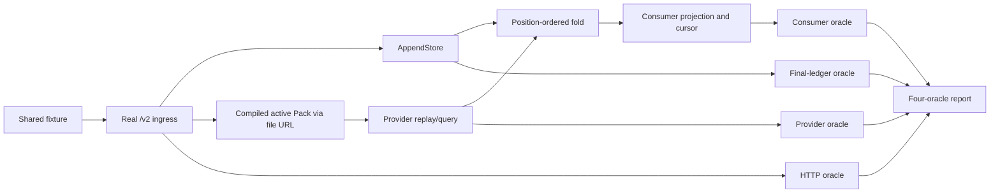

# 08 — 验证与验收

> **本文负责：** 定义新 UTA 何时被证伪、每一层如何运行、每个场景观察什么，以及交付时必须保存哪些证据；本文不实现生产代码、测试 fixture、migration、Pack loader、provider adapter、UI/demo handler 或 CI workflow。
>
> **展开的 register 决策：** D1（TypeScript、Node default、Bun `1.4.0`）、D2（UTA 内部 `Effect`）、D3（Broker Pack ABI v2 与 `PlacementRecovery<P>`）、D4（按 account 的 event algebra、crash matrix 与 A/B/C）、D5（`AppendStore`、文件帐票与 migration `0044`）、D6（原子 `/v2/*` cutover）、D7（bearer、`Principal` 与 registry resolution）、D8（帐票 fan-in event stream）、D9（Issues bridge 与 typed decisions）、D10（严格 rule parser）、D11（brands、decimal strings、时间）、D12（readiness、drain、restart）、D13（scope）。
>
> **使用的类型与模块：** `plans/uta-refactor/spec/types/ids.ts`、`money.ts`、`time.ts`、`principal.ts`、`provider/declaration.ts`、`provider/indexed.ts`、`provider/recovery.ts`、`provider/abi.ts`、`channel.ts`、`ledger/entries.ts`、`ledger/store.ts`、`ledger/fold.ts`、`consumer.ts`、`policy.ts`、`readiness.ts`、`wire/v2.ts`、`issues.ts` 及 `fixtures/`；验证文档直接使用 `OperationKind`、`ProviderDeclaration`、`CapabilityStatus`、`IdempotencyContract`、`ReadByKeyContract`、`ObservationCursorContract`、`Operation<P>`、`ProviderKey<P>`、`ProviderOrderRef<P>`、`Receipt<P>`、`Observation<P>`、`ProviderEnvelope`、`OperationEnvelope`、`KeyEnvelope`、`ReceiptEnvelope`、`ObservationEnvelope`、`ConfigEnvelope`、`PlacementRecovery<P>`、`RecoveryResult<P>`、`ReadOnly<T>`、`ReadWrite<E, T>`、`LedgerEntry`、`LedgerEntryWire`、`UnknownLedgerEntryWire`、`LedgerPosition`、`EntryPosition`、`HeadPosition`、`ReasonTree`、`AppendStore`、`AppendResult`、`CloseResult`、`IntentOutcome`、`ProposalOutcome`、`IntentProposalResponse`、`OrderProjection`、`Consumer`、`Cursor`、`LedgerEntriesQuery`、`LedgerEntriesResponse`、`RuleResult`、`AuthorizationPolicy`、`AccountReadiness`、`ReadinessResponse`、`WritableBlockedReason`、`ConfigError`、`CommandResponse`、`TransportResult`、`LoaderValidationResult`、`DecisionRequest`、`AuthorizationDecisionRequest`、`EventItem`、`WorkRequested` 与 `Origin`。

本文的“通过”只表示本文列出的 gate 全部通过；没有跑到的 lane 必须写作“未验证”并写出确切验证命令。类型检查、mock、schema snapshot、HTTP `200` 或首页探活均不能单独证明本契约。当前旧系统仍有 49 个 UTA HTTP endpoint、UI hand-copy 类型和 timer consumer（`local://w1-surface-map.md:1-18,20-72,89-105`），且当前 Pack loader 只校验 API/version/schema/factory（`local://w1-provider-capability.md:86-97`）；这些是迁移风险证据，不是新行为的默认值。

## 1. 证据等级与共同 oracle

### 1.1 四层证据

每条验收记录必须包含 `commit`、owner、lane、命令、fixture/scenario、runtime 版本、开始/结束时间、报告路径及四个 oracle。凭据、账户 secret、`sealing.key`、原始 credential payload 不得出现在记录中。

| 等级 | 适用内容 | 允许的副作用 | 通过条件 |
|---|---|---|---|
| `type` | `spec/types` 的编译保证 | 无生产状态；仅类型包自己的依赖 | 正例编译成功；负例只在指定位置报指定 diagnostic |
| `model` | provider 与 consumer 的共享状态机 | hermetic fixture、临时文件、test-owned process | 每个 command 的前置/后置条件、四个 oracle 和不变量均通过 |
| `integration`/`system` | UTA、Pack、文件、Guardian、Bun/Node、HTTP、UI demo | 由命名 lane 规定的本地 process/artifact | 真实入口完成完整路径；不能以零选中或 skip 代替通过 |
| `external-readonly` | 公共 provider read 或本地 TWS read | 网络读，不得发单 | 至少一个选中 scenario 实际运行并通过 |
| `live-paper` | provider mutation、取消、平仓与 venue-side truth | 仅已核验 demo/paper/sandbox | 成功和失败后都回到 pre-run positions/orders baseline |

`docs/testing.md:18-28,95-117` 定义上述 namespace 与 side-effect contract；`test:integration` 永不接触 public provider，external/live 全 skip 不是通过。`docs/uta-live-testing.md:15-32,86-109` 进一步要求 demo/paper 核验、baseline、venue-side 查询和失败后的 cleanup。

### 1.2 四个共同 oracle

所有 model scenario 和 provider conformance scenario 都必须返回结构化报告，不接受只打印一句成功：

1. **Final ledger：** 重新打开 `AppendStore`，按 `EntryPosition` 读取完整有效前缀，列出每个 `LedgerEntryWire` 的 `kind`、`entryId`、`idempotencyKey`、`why`、`occurredAt`/`recordedAt`、`configRevision` 与 entry 内的 `correlation`；同时报告 `TornTail`、`UncommittedTail`、`Corrupt`、未消费 kind 和 quarantine。已知 kind 的 payload 不匹配必须报告 `Corrupt`，不得包装成 `UnknownLedgerEntryWire`；只有真正未知 kind 才能进入 `UnknownLedgerEntryWire`/`unconsumed`，并保留原始 bytes。`HeadPosition` 从 `0` 起，`EntryPosition` 从 `1` 起。不得用物化视图代替帐票。
2. **Provider query result：** 记录真实/脚本 provider 收到的 `ProviderKey<P>`、调用次数、顺序、原始 response/event 与 query result，并记录 provider `Cursor` 和 `TransportResult`。写入恢复只能使用 `found`、`confirmedAbsent`、`ambiguous`、`stillUnknown` 等 `RecoveryResult<P>`；`confirmedAbsent` 必须带已验证的 `keyedLookupMiss` coverage/window。
3. **HTTP response：** 记录 method/path、status、响应 DTO 与 `ErrorEnvelope.code`。内部 `Effect`、`Cause`、`FiberFailure`、`Schema` 不得越过边界。失败必须保留 `ErrorCode`，不能只断言 status 或 message；没有响应时记录 `TransportResult` 的 `notSent`/`unknown`、connection close 与 send evidence；只有 server overrun 才能记录 `Timeout`。
4. **Consumer projection：** 记录 `IntentOutcome`、`ProposalOutcome`、`OrderProjection`、`AccountReadiness`/`ReadinessResponse`、每个 consumer 的 `checkpoint: LedgerPosition` 以及 Issues/connector link。`Cursor` 只用于 provider；receipt 不得替代 observation；lower `asOf` 不得回退 projection。

### 1.3 验证数据流


### 1.4 HTTP、wire 与 readiness oracle

验证报告必须检查边界的 DTO、status、auth 与 header，而不能只检查 HTTP 是否成功：

| 边界 | 必验契约 |
|---|---|
| 写入与决策 | `POST /v2/accounts/:id/intents` 新 identity 返回 `201`，重复 identity 返回 `200`；`POST /v2/intents/:id/decisions` 新 `decisionId` 返回 `202`，同一 `decisionId` 重放返回 `200`；`ProviderUnknown`/`ServiceDraining` 为 `503`，`InternalError` 为 `500`，`CapabilityUnsupported` 只允许为 `422`。 |
| durability failure | `DurabilityFailure` 映射为 `503` `ReadinessUnavailable`，readiness 同时提供结构化 diagnostics；不得把 durability failure 压成普通 `InternalError`。 |
| events | `/v2/events` 的 `wait` 必须在 `0..25000` ms；bridge 使用 `min(pollIntervalMs, 25000)`。到达 wait deadline 时返回 `200`、空 `items` 与不变的 `nextCursors`；只有 server overrun 才能返回 `Timeout`。`EventItem.entry` 必须是 `LedgerEntryWire | UnknownLedgerEntryWire`，`correlation` 位于 entry 内，不得使用 `ProviderEnvelope`。 |
| readiness 与认证 | bearer-only 仅为 `/__uta/health`、`/v2/readiness`、`/v2/openapi.json`；其他 route 必须同时有 bearer 与 server-stamped `Principal`。readiness 只能返回 `200` 或 `503`，不能用 `504` 表示 account 不可写。 |
| capability header | `x-uta-channel` 只接受 `read-only` 或 `read-write`；lifecycle 与 simulator 由 `x-uta-kind` 区分，不得用任意 header 字符串或 substring 判断能力。simulator state action 的成功 DTO 必须是 `CommandResponse{kind:'completed',requestId}`，不携带 ledger position。 |

## 2. Test namespace、owner 与可复现命令

### 2.1 TypesOwner 的 type-level gate

`plans/uta-refactor/spec/types/` 是 private 类型包；其 `tsconfig.json` 要求 strict、ES2023、`noEmit`、无 `Alice src/**` import，`effect` 只可作为 boundary fixture 的 dev dependency（register §Type vocabulary；`plans/uta-refactor/spec/types/tsconfig.json:1-8`）。以下命令必须在仓库根目录执行，顺序固定；任一命令不存在、改变了范围或静默成功都算 gate failure：

```bash
cd plans/uta-refactor/spec/types
pnpm install --ignore-workspace
pnpm typecheck
pnpm typecheck:negatives
pnpm test:fixtures
```

`pnpm typecheck` 的正例清单：

| 文件 | 必须证明 |
|---|---|
| `fixtures/positive/replay.ts` | A/B/C 历史、identity parsers、`PlacementRecovery<P>` replay 与纯 fold；重复 observation、late lower `asOf`、compensation 不能改变不变量 |
| `fixtures/positive/composition.ts` | 仅证明命名的 `Heartbeat` 可在 `ReadOnly<Heartbeat>`/`ReadWrite<E, T>` channel 中组合，且 capability 与 handler 成对；不引入 `Effect` |
| `fixtures/positive/providers.ts` | `ProviderDeclaration` 的 venue-keyed capability、provider-indexed `Operation<P>`/`Receipt<P>`/`Observation<P>`、role-indexed envelopes（含 `OperationEnvelope`、`KeyEnvelope`、`ReceiptEnvelope`、`ObservationEnvelope`）与 ABI v2 serializable boundary |
| `fixtures/positive/readiness.ts` | `makeAccountReadiness`/schema 维持 draining、config-invalid、unreadable/disconnected 与 non-empty capability 的 cross-field invariant |
| `fixtures/positive/routes-catalogue.ts` | 每个 published route 有 named response；每个 `read-write` route 有 request；generated route catalogue 不丢失 `x-uta-channel`/`x-uta-kind` |
| `fixtures/positive/supported-without-witness.ts` | runtime loader fixture 的输入样本；`supported` write row 缺 witness 时必须由 `LoaderValidationResult` 拒绝（完整运行见下） |

`pnpm typecheck:negatives` 必须检查以下文件与 diagnostic code，不得用更宽的 cast 或 catch-all 来使它们通过：

| 文件 | 必须失败的保证 | 预期 diagnostic |
|---|---|---|
| `fixtures/negative/read-only.ts` | read-only provider 无法构造写 handler | `TS2322` |
| `fixtures/negative/missing-handler.ts` | `Handlers<Spec>` 缺少已声明 capability 的 handler 不可构造 | `TS2741` |
| `fixtures/negative/missing-layer.ts`（唯一引入 `fixtures/effect-boundary.ts`） | composition root 缺少 mandatory Layer | `TS2345` |
| `fixtures/negative/no-recovery.ts` | `idempotency=none` 与 `readByKey=none` 无法构造 `PlacementRecovery<P>` | `TS2322` |
| `fixtures/negative/unverified-absence.ts` | 未验证 coverage/window 不能生成 `confirmedAbsent` | `TS2322` |
| `fixtures/negative/non-exhaustive.ts` | 新增 capability/receipt/ledger variant 必须暴露未处理分支 | `TS2345` |
| `fixtures/negative/provider-mismatch.ts` | 不同 provider 的 `ProviderKey<P>` 不可混用 | `TS2322` |
| `fixtures/negative/decimal-abi.ts` | `Decimal`/SDK class 不能跨 Pack ABI；边界只接受 serializable records/decimal strings | `TS2322` |
| `fixtures/negative/missing-decision-id.ts` | `AuthorizationDecisionRequest` 缺 `decisionId` 不可构造 | `TS2741` |
| `fixtures/negative/union-direction.ts` | `ReadOnly`/`ReadWrite` union 不能绕过 non-distributive `Handler` direction gate | `TS2322` |
| `fixtures/negative/declared-kind-missing-handler.ts` | `PackModule<D>` 对 `supported` write kind 缺 witness 时不可构造 | `TS2741` |
| `fixtures/negative/supported-none-none.ts` | `supported` write declaration 不能以 `none`/`none` 冒充可执行 capability | `TS2322` |
| `fixtures/negative/readiness-writable-boolean.ts` | `AccountReadiness.writable` 不能是 boolean，必须是 tagged `WritableState` | `TS2322` |

`pnpm test:fixtures` 还必须运行 `fixtures/positive/supported-without-witness.ts`：它加载一个声明为 `supported` 但缺少可构造 witness 的 Pack，必须得到 `LoaderValidationResult={kind:'invalid',code:'MissingHandler',path}`；合法的 `none`/`none` read-only declaration 则必须加载成功。该 runtime fixture 与上述 type-level negatives 都由 `test:fixtures` 收集，不能用未执行的静态样本代替。

`pnpm test:fixtures` 必须实际运行 `fixtures/positive/replay.ts`、`fixtures/positive/readiness.ts`、`fixtures/positive/routes-catalogue.ts` 与 `fixtures/positive/supported-without-witness.ts`，并断言 A/B/C replay result、parser、recovery、readiness、route catalogue 与 Pack loader assertions；只编译而不执行 replay/fixture 不算通过。TypesOwner 的最终 exported names 是唯一来源；若实现中出现本表之外的 domain type，必须先由 TypesOwner 增补本 register/package，再把它写入本 gate。
`plans/uta-refactor/spec/types/README.md` 必须记录本次四条命令的实际 exit code、完整 fixture 清单、每个 negative 文件头声明的 diagnostic，以及 A/B/C、readiness、route catalogue、loader 与 boundary assertions；不得以固定 negative 数量代表通过。这只封闭 type gate，不替代 §3–§8 的 model、Pack、provider、HTTP、文件、lifecycle、browser 与 live evidence。

### 2.2 owner/lane 命令

| 目标 | 命令 | 通过条件 |
|---|---|---|
| UTA hermetic owner | `pnpm test:owner:uta` | UTA service、protocol、broker package 的 hermetic inventory 全通过 |
| UTA model integration | `pnpm test:integration:uta` | model runner 使用 test-owned provider/ledger/HTTP/consumer，所有 scenario 均被收集 |
| 特定交集 | `pnpm test:select --owner uta --area uta --explain`；随后 `pnpm test:select --lane integration --area uta` | `--explain` 显示 owner/lane/side effects；零文件 fail closed，不可借 skip 伪装 |
| provider read-only | `pnpm test:external:readonly` 或 `pnpm test:select --lane external-readonly --area market-data` | 至少一个意图中的 external scenario 真运行；没有写操作 |
| Alpaca paper | `OPENALICE_UTA_LIVE_PAPER=1 pnpm test:live:alpaca-paper` | 只选已核验 paper account，成功/失败后 flat；详见 §6 |
| 全配置 paper sweep | `OPENALICE_UTA_LIVE_PAPER=1 pnpm test:live:uta-paper` | 仅在逐 projection 通过并明确选择 sweep 时使用；raw diagnostic 不得混入 |
| Guardian/system | `pnpm test:system:guardian` | test-owned process tree 启停、restart flag、SIGTERM/SIGINT 与 readiness 完整通过 |
| UI demo | `pnpm -F open-alice-ui dev:demo` | demo handlers 覆盖每个 `/v2` route，见 §7 |

选择维度沿用 `docs/testing.md:65-93`：同维度 OR、跨维度 AND；system inventory 不由 `test:select` 执行。UTA片、ledger、staging、sync 的 minimum gate 是 `pnpm test:integration:uta` 加 `docs/uta-live-testing.md` 的适用 targeted/live scenario（`AGENTS.md:139-153`）。

## 3. 共享 model/state-machine 测试

### 3.1 模型状态与 command

模型不是第二个生产实现，而是最小可执行 reference model。它必须显式保存以下五组状态，且不读取 ambient wall clock、provider、环境变量或共享可变 singleton：

- 每个 `IntentId` 的本地 `IntentOutcome`；其中 authorization 由 ledger `position` 决定，不能由到达顺序覆盖。proposal 使用 `OperationEnvelope`，`configRevision` 不来自请求，而由 server 根据 runtime/account/projection 配置解析。
- 当前未结束的 `attempt.started`，以 `AttemptNo` 和原始 `KeyEnvelope`/`IdempotencyKey` 关联；重试是新的 attempt，不是新的 intent。
- 每个 attempt 的持久形状是 `receipt.recorded.receipt: ReceiptEnvelope`，其内容经 `ProjectionRegistry` 重关联为内存 `Receipt<P>`；区分 `accepted`、`rejected`、`unknown`，且 `rejected`/`unknown` 不携带 provenance，不得把 receipt 当作远端事实。
- 每个 `observation.recorded.observation: ObservationEnvelope` 经 `ProjectionRegistry` 重关联为 `Observation<P>`；保存 provider identity、`asOf`、`source` 与 provider event identity。`OrderProjection` 只接受最新 `asOf`，相同 observation 去重，equal `asOf` 冲突保留 later `position` 并标记 `observationConflict`。所有重关联必须走 registry，禁止 `as`。
- provider 侧使用 provider/channel-scoped `Cursor`；每个 consumer 另保存 `checkpoint: LedgerPosition`，记录 observation/reconciliation 的位置和 end reason。不同 consumer 的 checkpoint 独立，不能共享一个 mutable consumed flag。

command 的名称与顺序必须固定为：

| Command | 前置条件 | 模型操作与必验不变量 |
|---|---|---|
| `propose` | HTTP 输入已经解析为 `IntentProposalRequest`；`AccountId`、`OperationEnvelope`、decimal strings、`expiresAt` 合法；`configRevision` 不得作为客户端字段 | 立即追加 `intent.proposed`；不等待 queue；不支持 kind 返回 `CapabilityUnsupported` 且不追加 entry |
| `decide` | caller 已生成稳定 `decisionId`；Alice 的 `DecisionRequest{decisionId,action,scopeHash}` 先解析 scope，再由 UTA 接受 `AuthorizationDecisionRequest{decisionId,action,scope,scopeHash}`；`Principal` 由 server stamp | 追加 `authorization.decided`；相同 `decisionId` 返回相同 `AuthorizationDecisionResponse` 且不追加第二条；过期后追加 rejected `IntentExpired` |
| `attempt` | `IntentOutcome=authorized`、account 可写、first-observation gate 已通过 | 先 durable append `attempt.started`（其 `key` 必须是 `KeyEnvelope`），再 provider call；同一 intent 的每次 attempt 复用同一 key；每 account write channel 同时只有一个 provider mutation |
| `poll receipt` | 存在无终态 receipt 的 attempt 或 accepted receipt 等待 readback | 只追加对应 `receipt.recorded`（其 `receipt` 必须是 `ReceiptEnvelope`）；明确 rejection 不重投；`timeout`/`disconnect`/`noResponse`/`parseFailure` 变为 `unknown`，不能变成 rejected 或 not-written |
| `observe` | provider 返回带 source 与 `asOf` 的上游事实 | 追加 `observation.recorded`（其 `observation` 必须是 `ObservationEnvelope`）；与 response 同帧的 observation 仍是独立语义；receipt 没有 observation 时 projection 不得宣称 fill/balance |
| `reconcile` | 存在 `unknown` 或等待 observation 的 attempt，且 provider declaration 已提供 witness | 只走 `PlacementRecovery<P>`：`found` 在同一 frame 追加 `receipt.recorded{provenance:recovered}` 与 `observation.recorded`，并由 `recovery.resolved.result.found{receiptEntryId,observationEntryId}` 只引用这两个 entry；verified miss 才能 `confirmedAbsent`；`ambiguous` 不得选 latest match；`stillUnknown` 按 `nextCheckAfter` 重排，超过 `maxUnknownDuration` 进入 `awaitingReview` |
| `crash` | 可注入 D4 任一 durability phase | 立即中止 process，不运行 finally 之外的业务补偿，不修改 provider script；保留磁盘真实前缀/尾部 |
| `restart` | 重新创建 UTA process、`AppendStore`、`ProjectionRegistry` 与 consumer | 启动时先处理 `TornTail`/`UncommittedTail`/`Corrupt`，然后对每个无 receipt 的 `attempt.started` durable append `receipt.recorded{unknown{cause:'processRestart'}}`，再运行 witness/observation；first successful observation pass 前 `writable={kind:'blocked',reason:'FirstObservationRequired'}` |

每条 command 都要把四个 oracle写入 scenario report；model pass 只能证明状态机规律，不能证明真实 provider 行为。`design/01-detail-constraints.md:301-305` 的 shared model 要求和 D4 的四分录 lifecycle 是本节的最低覆盖。

### 3.2 D4 crash matrix 与 required scenario catalogue

表中 `L` 是 restart 后重新打开 `AppendStore` 的 final ledger；`Q` 是 provider query/recovery；`H` 是最终可观察的 HTTP response（没有响应时也必须明确）；`C` 是 consumer projection。表格中的 `not-called` 表示测试通过 spy 证明没有 provider query/call，而非缺失断言。

| ID / 场景 | 注入 history / command | Final ledger `L` | Provider query `Q` | HTTP response `H` | Consumer projection `C` |
|---|---|---|---|---|---|
| `CR-0` 无 durable `intent.proposed` | `propose` 后、intent append 前 `crash` | `∅`；不得出现 `intent.proposed` | `not-called` | 无 HTTP body；调用者观察到 connection close；只有 ingress server overrun 才记录 `Timeout` | 无 `IntentOutcome`、无 Issue/consumer effect |
| `CR-1` intent 无 decision | `propose` → durable intent → `crash` → `restart` | `[intent.proposed]`，identity/hash/payload/why 完整 | `not-called` | 新 proposal 为 `HTTP 201 IntentProposalResponse{intentId,entryId,position,status:'proposed'}`；重启后再次读取同一 `IntentId` 仍可见 | `IntentOutcome=proposed`，不能自行变 `authorized` 或 `expired` |
| `CR-2` decision 无 attempt | `propose` → `decide(approve)` → `crash` → `restart`，不允许 attempt append 前 provider call | `[intent.proposed, authorization.decided]` | `not-called` 至 restart Execution 恢复前；恢复后才允许一次 query/call | `HTTP 202 AuthorizationDecisionResponse`；恢复查询为 `HTTP 200 IntentDetailResponse{outcome:authorized|attempting}` | `authorized`；Execution 按 position 继续，不丢 intent |
| `CR-3` attempt 无 receipt | `attempt.started` durable 后 provider call 任意位置 `crash` → `restart` | `[intent.proposed, authorization.decided, attempt.started, receipt.recorded{unknown{cause:'processRestart'}}]`；Reconciliation 必须先 durable append 此 unknown，再运行 witness，随后只按 witness 追加恢复 entry | unknown append 后才调用 witness；结果只能是 `found`/`confirmedAbsent`/`ambiguous`/`stillUnknown`，不得 blind retry | witness 已证明结果时 `HTTP 200 IntentDetailResponse`；仍未知时 `HTTP 503 ErrorEnvelope{code:ProviderUnknown}`；绝不把未知当 accepted | `found`→accepted/observation；`stillUnknown`→`unknown`/`awaitingReview`；无本地推测成交 |
| `CR-4` response 已在内存、receipt 未 durable | provider 已返回 accepted/rejected 后、`receipt.recorded` append 前 `crash` → `restart` | 与 `CR-3` 完全相同：进程记忆不入账，先追加 `receipt.recorded{unknown{cause:'processRestart'}}`，再 witness | 同样必须先写 processRestart unknown 再 witness；不能相信“response 已收到”的进程记忆 | witness 已证明拒绝时 `HTTP 200 IntentDetailResponse{outcome:rejectedByProvider}`；无法证明时 `HTTP 503 ErrorEnvelope{code:ProviderUnknown}` | processRestart unknown durable 前不能显示 provider final state；观察后才更新 |
| `CR-5` receipt 无 observation | `receipt.recorded(accepted)` durable → `crash/restart`，不写 observation | `[...attempt.started, receipt.recorded(accepted)]`，无 `observation.recorded` | poll/read-by-key 继续，返回 `Observation<P>` 或明确 read failure | receipt 查询 `HTTP 200 ReadProjectionResponse<T>`，仍标为 accepted/awaiting observation；读取失败使用 `ProviderTransportFailure` 或 `ProviderUnknown`，server overrun 才使用 `Timeout` | `IntentOutcome=accepted` 但不得是 `filled`，直到 observation |
| `CR-6` durable observation | receipt 或 observation append 后 `crash` → `restart` | `[...receipt.recorded, observation.recorded]`，position/asOf/source 保留 | 已有 observation 作为事实；无需重放 provider mutation | `HTTP 200 ReadProjectionResponse<T>`，状态来自 observation | `OrderProjection`/`IntentOutcome` 与 latest `asOf` 一致；replay 不产生副作用 |
| `CR-7` torn tail | 在 frame 写入或 manifest/head 更新窗口 `crash` → `restart` | 只暴露 contiguous valid prefix；原始尾部进入 quarantine，报告 `TornTail{quarantined}` 或 `UncommittedTail` | 未完成 boundary 的 attempt 不查询前不得被标成成功；随后按 witness 处理 | 在恢复完成前 `HTTP 503 ErrorEnvelope{code:ReadinessUnavailable}`；错误必须含结构化 quarantine 信息 | 有效前缀 projection 可见；尾部为 observable recovery/unconsumed，不能静默消失 |
| `H-A` walkthrough A | `attempt` → `crash` → `restart` → `reconcile(stillUnknown)` 直至 budget | `[intent.proposed, authorization.decided, attempt.started, receipt.recorded{unknown{cause:'processRestart'}}, work.requested{kind:review.unknownOutcome}]`；不得新建 blind attempt | 每次 `stillUnknown`，达到 `maxUnknownDuration` 后停止自动重投 | `HTTP 200 IntentDetailResponse{outcome:awaitingReview}`，包含 review addressability；transport unknown 另以 `HTTP 503 ErrorEnvelope{code:ProviderUnknown}` 暴露 | `IntentOutcome=awaitingReview`；UI 显示 `unknown outcome — review`；Issue bridge 发出 `review.unknownOutcome` |
| `H-B` walkthrough B | accepted；`observe(t1,0)` → `observe(t3,100)` → late `observe(t2,40)` → duplicate `observe(t3,100)` | 四个 observation entry 都按 append-only 保留；无 reversal/duplicate business entry | query/replay 返回四次事件；重复 event identity 被 dedupe | 每次 `HTTP 200 ReadProjectionResponse<T>`；late/lower `asOf` 不改当前值 | `OrderProjection=filled 100`；没有 regression、没有重复 effect |
| `H-C` walkthrough C | provider rejected → compensation `propose/decide/attempt` accepted → late reversal attempt | 原 rejected intent、compensation intent 全保留；late `reversal.appended` **不追加** | original=`rejected`；compensation=`accepted`；无原操作 replay | late reversal `HTTP 409 ErrorEnvelope{code:ReversalTargetAlreadyExecuted}` | original=`rejectedByProvider`；compensation 有独立 outcome；不得宣称 remote rollback |
| `M-1` duplicate decision delivery | 同一 `AuthorizationDecisionRequest.decisionId` 投递两次，间隔可含 `crash/restart` | 只有一条 `authorization.decided`；decisionId/index 可重放 | `not-called`（decision dedupe 不触达 provider） | 首次返回 `HTTP 202 AuthorizationDecisionResponse`；同一 `decisionId` 重放返回 byte-equivalent `HTTP 200 AuthorizationDecisionResponse`；冲突 scope 使用 `DecisionConflict` 的非 `2xx ErrorEnvelope` | `IntentOutcome` 只变化一次，Issue/connector 不重复 |
| `M-2a` expiry wins | `propose`；Expiry consumer 先 durable append `intent.expired`；再 `decide(approve)` | `[intent.proposed, intent.expired, authorization.decided(rejected)]`；decision 的 `why`/`IntentExpired` 保留 | `not-called` | `HTTP 409 ErrorEnvelope{code:IntentExpired}` | `IntentOutcome=expired|rejected`，不得 `authorized` |
| `M-2b` approval wins | `propose`；`decide(approve)` 先 durable；expiry race 后执行 | `[intent.proposed, authorization.decided(approve), attempt.started, receipt.recorded(...)]`；expiry 不得越过 `attempt.started` | provider 只被一次串行调用 | `HTTP 202 AuthorizationDecisionResponse` 后，读取为 `HTTP 200 IntentDetailResponse` | `authorized`→`attempting`/terminal；两次 interleaving 不得产生双执行 |
| `M-3` read-only provider | 对每个 declared write kind 运行 `propose`/attempt | `∅`；能力拒绝不是 ledger entry | `not-called` | `HTTP 422 ErrorEnvelope{code:CapabilityUnsupported}` | `AccountReadiness.writable={kind:'blocked',reason:'NoPlacementRecovery'}`；无 fake handler |
| `M-4` unsupported kind | writable account 收到未在 `ProviderDeclaration`/consumer rule 中声明的 kind | `∅`；D4 明确要求 response 而不是 `intent.proposed` | `not-called` | `HTTP 422 ErrorEnvelope{code:CapabilityUnsupported}` | consumer 报 `Unsupported`/unconsumed；不生成成功 projection |
| `M-5` NaN/empty rule config | config write、startup、provider construction 三处分别送 `NaN`、非有限 numeric、空 validated string set | config invalid 时 ledger 不变；已有 ledger 不被修写 | `not-called`；provider 不得被构造 | config write=`HTTP 400 ErrorEnvelope{code:InvalidRequest}`；global invalid 使 startup fail closed；account invalid readiness=`HTTP 200 ReadinessResponse` 且 `config={kind:'config-invalid',errors:ConfigError[]}` | `AccountReadiness.writable={kind:'blocked',reason:'ConfigInvalid'}`；保留结构化 parse failure，不 warn-and-skip |
| `M-6` hostile `accountId` | `../../outside`、绝对路径、分隔符编码、未知合法 id；运行所有 read/write entry | 对 malformed input ledger `∅` 且任何 account ledger 不被触碰 | `not-called`；filesystem spy 证明 registry resolution 先于 path/provider | malformed=`HTTP 400 ErrorEnvelope{code:InvalidRequest}`；未知合法 id=`HTTP 404 ErrorEnvelope{code:AccountNotFound}` | 无 account projection；不得泄露 path、secret 或其他 account |
| `M-7` config replacement during attempt | 从 `data/config/uta-runtime.json` 读到 R1 的 attempt 已 append；in-flight 时 Alice config route 整体替换为 R2 | `intent.proposed.configRevision=R1`、`attempt.started.configRevision=R1`；`configRevision` 从不作为 request input 或独立 ledger entry 持久化；结果 append 后下一 attempt 才用 R2 | 当前 call 使用 R1 snapshot；policy/rule hot reload 不重启且不切半份 config；projectionVersion 变化只有现有 restart flag 激活；next attempt 读 R2 | config route whole-replace `HTTP 200`；attempt read 为 `HTTP 200 IntentDetailResponse`，含 R1；后续 server-resolved proposal 含 R2 | 当前 outcome 按 R1；readiness 最终显示 R2；`runtimeConfigDigest`（去掉 `updatedAt`）与 account `ConfigRevision` 两级 derivation 可重算 |
| `M-8` two intents racing | 两个 intent 均 authorized，同时发 `attempt`；让 scheduler/HTTP arrival 顺序与 ledger position 不同 | 两条 intent/attempt/receipt 均保留，position 顺序稳定；没有覆盖或丢失第二 intent | 每 account write channel 一次一个 provider mutation；调用次序等于 Execution position | 两个 ingress 均为 `HTTP 202`；每个 detail 独立，writer CAS conflict 不伪装成 intent failure | 两个 `IntentOutcome` 可解释；proposal partial outcome 可见；无并发 provider side effect |
| `M-9` uncommitted tail | 造出 valid frame beyond durable `head.json`，重启 | valid prefix 对外可见；tail quarantine 并报告 `UncommittedTail`，不转成 entry | tail 中 attempt 不作为事实；按 recovery policy 决定是否 witness | `HTTP 503 ErrorEnvelope{code:ReadinessUnavailable}` 直到 tail 分类完成 | prefix projection 可读；uncommitted entry 不进入 consumer `checkpoint` |
| `M-10` corrupt ledger | 篡改 interior frame、checksum/hash chain 或 position，重启 | `AppendStore.open()=Corrupt{at}`；不得跳过后续记录或从空账启动 | `not-called`；provider mutation 停止 | `HTTP 503 ErrorEnvelope{code:ReadinessUnavailable}`，包含 `Corrupt.at` | account projection blocked；其他 account 独立继续，corrupt bytes 保留 |
| `M-11` migration `0044` rerun | legacy `commit.json`、partial marker、完成 marker 分别跑 migration 两次/中断后重跑 | `data/trading/<id>/legacy/commit.json` immutable archive + digest；fresh ledger 不导入 legacy entry；completion marker 每 account 只完成一次 | `not-called`；migration 不调用 provider | partial account readiness=`HTTP 503 ErrorEnvelope{code:ReadinessUnavailable}`；verified rerun=`HTTP 200 ReadProjectionResponse<T>` | history projection 连续且 `source:legacy-archive`；legacy records 无 authority、不能 authorize placement |
| `M-12` first-observation gate | start/restart 后在第一次 upstream observation 前送已授权 intent；再成功 `observe` | pre-observation 仅保留 intent/decision；不得有 `attempt.started`；observation 后才追加 attempt/receipt | pre-observation `not-called`；first pass 成功后 provider 可被调用 | pre-observation write `HTTP 503 ErrorEnvelope{code:ReadinessUnavailable}`；observation 后 detail `HTTP 200 IntentDetailResponse` | readiness `writable={kind:'blocked',reason:'FirstObservationRequired'}`→`{kind:'ok'}`；pending intent 可恢复，不被误判 abandoned |
| `M-13` event cursor/Issue duplicate delivery | 同一 `EventItem` 重复、乱序、bridge crash 在 Issue durable 前后各一次 | `work.requested`/causal entry 只保留一次；ledger stream position 不倒退 | provider `not-called`；bridge 只处理已 durable event | 每次 fan-in 为 `HTTP 200 EventsResponse`；wait deadline 返回空 items 与不变 nextCursors；`CursorMap` 只在 Issue file durable+re-readable 后推进；bad cursor=`CursorInvalid` | `EventItem.entry` 是 `LedgerEntryWire|UnknownLedgerEntryWire` 且 correlation 在 entry 内；每个 consumer `checkpoint` 不倒退；一个 Issue/comment/link；重复 event 不重复副作用；out-of-order 等待或显式报告 |

`M-2a`/`M-2b` 必须以两种真实 interleaving 各运行至少一次；结果由 ledger position 线性化，不由 wall-clock 解释。`M-5` 必须区分 per-account invalid（进程可服务其他 account）与 global invalid（startup fail）。`M-9` 与 `CR-7` 不得共用“把尾巴当不存在”的旧 event-log 行为；旧行为的证据见 `local://w1-ledger-persistence.md:60-68,136-145`。
### 3.3 Readiness cross-field scenario

`plans/uta-refactor/fixtures/readiness-cross-field.json` 是本场景的固定输入；实现必须把它纳入 `pnpm test:integration:uta` 的收集结果。该 fixture 至少包含 running/draining、valid/config-invalid、connected/disconnected、readable/unreadable、带 declared kinds 的 non-empty capability table 及无 capability row 的非法样本。每个样本必须检查完整 `ReadinessResponse`，不得只检查 `writable`。表格中的 `writable={kind:'blocked',reason:'X'}` 只是 `WritableState` 的可读标记；实际 wire value 必须携带 `reason: WritableBlockedReason` 的完整 tagged object 与 `secondary`，不能省略 required fields。`WritableBlockedReason.kind` 只允许 `Draining`、`ConfigInvalid`、`LedgerUnreadable`、`TransportDisconnected`、`FirstObservationRequired`、`QuarantineCapacityExceeded`、`NoPlacementRecovery` 七种，不能引入 `ReadonlyMode`、`TransportUnavailable` 或 `RecoveryPending`。

1. `process:'draining'` 必须同时得到 `writable={kind:'blocked',reason:{kind:'Draining',since:<Instant>},secondary:[]}`，即使 transport/readable 仍可服务；draining 新写入的 HTTP 结果另须是 `503 ServiceDraining`。
2. `config={kind:'config-invalid',errors:ConfigError[]}` 必须同时得到 `writable={kind:'blocked',reason:{kind:'ConfigInvalid',errors:ConfigError[]},secondary:[]}`；`errors` 每项只能有 `path`、`code`、`message`，不得泄漏 raw input/secret。
3. disconnected 必须得到 `reason:{kind:'TransportDisconnected',...}`，unreadable 必须得到 `reason:{kind:'LedgerUnreadable',...}`；readable unavailable 的值必须包含 `{open:TornTail|Corrupt|DurabilityFailure,at?:EntryPosition}`；`capabilities` 必须为每个 `ProviderDeclaration` declared kind 提供一行，空表或缺行均 fail。
4. per-account invalid 在 process running/draining 时仍返回 readiness `200`；global invalid、snapshot unsafe 或 `DurabilityFailure` 返回 readiness `503`。readiness 永不使用 `504`。

报告必须保存 fixture digest、每个输入与完整响应 DTO，且说明违反任一 implication 的样本。没有该 fixture 或 runner 未收集它时，`pnpm test:integration:uta` gate 失败，不得标为“未验证”。

## 4. Provider conformance suite

### 4.1 每个 projection 的执行边界

`ProjectionRegistry` 必须按 provider × venue × account config resolve effective `ProviderDeclaration`；`ccxt-custom` 不得以 engine 全局能力参加测试。每个 active Pack projection（五个现有 wrappers：`alpaca`、`ccxt` 的具体 venue、`ibkr` TWS、`leverup`、`longbridge`，以及 `mock` manual projection）对自己声明的每个 write kind 运行下表；没有完整 `IdempotencyContract` + verified `ReadByKeyContract` 的写 kind 必须先声明 `CapabilityStatus=unsupported`，而不是把 conformance skip 掉。

每条 conformance 都保存 declaration/source digest、translation input/output、原始 provider payload/event、transport call trace、四个 oracle；generated TypeScript types 不能代替 runtime parser。provider OAS/文档只证明 build input，不能证明账户 entitlement、当前错误 body 或重复投放行为。

| ID | Conformance | Final ledger | Provider query/transport | HTTP response | Consumer projection |
|---|---|---|---|---|---|
| `P-0` | projection build/overlay fixture | `∅`；build 阶段不得写 trading ledger | 不启动 provider；fixture 含 `$ref`、union、readOnly/writeOnly、multiple status/content、security 与 `x-uta`，并检查 source bytes/digest；`supported` write kind 缺 witness 必须由 loader 拒绝 | build command 成功才可 activation；malformed ref、非法 overlay 或 `supported` declaration 缺 handler 返回 `LoaderValidationResult{kind:'invalid',code:'MissingHandler',path}`，不得降级为 `CapabilityUnsupported`；合法 `none`/`none` read-only declaration 才能加载 | active `ProviderDeclaration` 保留 `x-uta`、source/projection digest、operation direction；generated types 不代替 parser |
| `P-1` | read-only 对所有 write kinds | capability gate 在 `propose` 前返回 `CapabilityUnsupported`，final ledger 为 `∅`，不产生 placement attempt 或 `attempt.started` | 所有 write handler `not-called`；read-only `ReadOnly<T>` 无可构造写 handler | `HTTP 422 ErrorEnvelope{code:CapabilityUnsupported}`；`AccountReadiness.writable={kind:'blocked',reason:'NoPlacementRecovery'}` | 无 write consumer effect；account readiness 显式 read-only，不能 fake handler |
| `P-2` | explicit provider rejection | `receipt.recorded(rejected{code,requestId,raw})`；无 accepted receipt、无“confirmed” observation | provider call 恰好一次；保留 provider code/request id/raw response | `HTTP 200 IntentDetailResponse` 显示 `rejectedByProvider`（若边界失败则 `ProviderRejected`） | `OrderProjection` 不可变成 accepted/filled |
| `P-3` | timeout/disconnect/no response | `attempt.started` 后追加 `receipt.recorded(unknown{cause})`；不得 `rejected`/`accepted` | transport trace 明确 sent/no-response；provider deadline、disconnect 或 no response 只进入 `ProviderUnknown`/`PlacementRecovery`，不得通用 retry | provider unknown=`HTTP 503 ErrorEnvelope{code:ProviderUnknown}`；只有 UTA server overrun 才为 `HTTP 504 ErrorEnvelope{code:Timeout}` | consumer 显示 `unknown`/review |
| `P-4` | accepted + delayed readback | receipt accepted 先落盘，observation later；不新增第二 intent/attempt | placement 恰好一次；read-by-key/stream poll 可以多次；same key 不再 place | placement receipt `HTTP 200`，最终 read `HTTP 200 ReadProjectionResponse<T>`；未 readback 前不显示 filled | `OrderProjection` 只有 observation 后才可成为 filled |
| `P-5` | crash after `attempt.started` | restart 不新增 blind attempt；witness outcome 决定 late receipt/observation 或 review | forced process kill 后由同一 key 的 replay/keyedRead/providerRefRead resume；call count 可核对 | 初始 connection close/`ProviderUnknown`；只有 server overrun 才为 `Timeout`；恢复后 `HTTP 200 IntentDetailResponse` 为 found/absent/unknown/review 之一 | outcome 与 final ledger 一致，不显示虚构成功 |
| `P-6` | keyed miss → per contract | verified coverage/window 且 attempt 在 window 内：`attempt.abandoned{reason:confirmedAbsent{proof:keyedLookupMiss}}`；其他条件不得伪造 absence | duplicate-probe rejection 只算 presence；unverified/out-of-window 返回 `stillUnknown`/`ambiguous`，不算 miss | verified miss 为 `HTTP 200 IntentDetailResponse{outcome:abandoned}`；不安全时 `HTTP 503 ErrorEnvelope{code:ProviderUnknown}` 并进入 review | `IntentOutcome=abandoned` 或 `awaitingReview`；不得 retry non-idempotent write |
| `P-7` | partial fill + compensation | partial observation、`IntentOutcome=partiallyFilled`；compensation 是新的 `intent.proposed`，有独立 decision/attempt/receipt | provider observation 保留 fill qty/price/source/asOf；补偿 call 走同一 write channel | original 与 compensation 均为 `HTTP 200 IntentDetailResponse` | consumer 显示 remaining qty 与 compensation outcome，不宣称 reversal=remote rollback |
| `P-8` | duplicate delivery dedupe | 相同 provider event/key 只形成一个 business effect；原始 duplicate 可在 trace 留痕 | replay duplicate event、same `idempotencyKey`、same provider ref；provider `Cursor` 与 consumer `checkpoint` 均不倒退 | repeated `HTTP 200 EventsResponse`/read projection 可返回同一 result | Issue/comment/callback 只有一个 durable delivery |
| `P-9` | concurrent modify/cancel | `attempt.started` 顺序等于 account write channel linearization；每个 result 可解释，未执行者有 rejected/conflict entry | provider mutation 不并发；provider call trace 给出 total order；若 provider 线性化冲突，保留 raw code | each request returns `HTTP 200 AuthorizationDecisionResponse`/detail；失败为 `HTTP 422 ErrorEnvelope{code:ProviderRejected}` 或 `HTTP 409 ErrorEnvelope{code:DecisionConflict}` | 两边不得都声称成功；最终 `OrderProjection` 与 provider query 一致 |

这些场景覆盖 `design/01-detail-constraints.md:303-305` 的所有 provider laws：Unsupported、Rejected、Unknown、delayed readback、crash witness、`MissingRemote`/verified miss、partial execution+compensation、dedupe、concurrent modify/cancel。对 `P-6`，`confirmedAbsent` 的构造只能来自 `VerifiedReadByKey`；`byClientKey.coverage='unverified'`、`historyWindow='unverified'` 或 `ambiguity='latestMatch'` 不能生成 absence。
### 4.2 Alpaca first paper/sandbox acceptance

Alpaca 是第一个 end-to-end projection，因为 evidence packet 观察到官方 Trading OAS、`client_order_id` keyed lookup、activity SSE 与 market/trade stream 资料，但当前 adapter 尚未将 client key、read-by-key、cursor 与 raw retention 接入（`local://w1-provider-capability.md:29-49,99-107`）。这仍是未验证的 provider runtime 行为；必须先完成 projection build/runtime conformance，再运行 paper。

**准备与命令：**

```bash
mise install bun@1.4.0
pnpm test:select --lane live-paper --area alpaca --explain
# 先核验所选 account 的 paper/demo/sandbox mode，并记录 positions/open orders；不得打印 credentials。
OPENALICE_UTA_LIVE_PAPER=1 pnpm test:live:alpaca-paper
```

运行只允许通过 `alice-uta` agent surface（`alice` 可用于 pre-trade read）；`wallet/push` over HTTP 只作为“human clicked approve”的测试 stand-in，tool-level direct push 不得绕过 approval wall。`docs/uta-live-testing.md:129-142,170-192` 是操作边界。

Alpaca paper run 必须实际完成并记录：

1. `ProviderDeclaration` 的 generated `client_order_id`、account scope、duplicate policy、`byClientKey` lookup 与 source/projection digest；未知 duplicate retention 必须显式为 `unverified`，不能写成永恒幂等。
2. 一个可取消的 paper order：proposal→decision→attempt→receipt；强制制造 timeout/断连或在 receipt 前重启，随后通过 client-key lookup/SSE 恢复；确认没有第二个 placement。
3. activity SSE `Cursor` checkpoint/reconnect/resubscribe、gap 检测与 REST backfill；保存 raw event 与 provider `asOf`，不能用 local receive time；UTA consumer 的 `checkpoint: LedgerPosition` 另行记录，不得把二者混成一个 cursor。
4. accepted delayed readback、provider rejection、partial fill+compensation、duplicate update、modify/cancel race（若账户/venue 不提供某能力，必须以 declaration `Unsupported` 和 HTTP `CapabilityUnsupported` 结束，而不是 skip）。
5. venue-side 查询每个 order id/client key，不能信 ledger；确认 `client_order_id`、fill、open/terminal state 与 UTA `OrderProjection` 一致。
6. 成功与失败均执行 cleanup：再次 query venue、cancel 新 open orders、只关闭本轮新建 positions、reject stray staging，并证明 positions/open orders 回到 pre-run baseline。不能证明 flat 时停止 lane，标为需要人工清理。

本环境没有跑过 authenticated Alpaca order、duplicate submission、reconnect、stream gap 或 sandbox trade（`local://w1-provider-capability.md:17-22,126-136`），因此在该命令实际通过前，Alpaca 支持状态必须写作“未验证”。
### 4.3 P-0 generator、loader 与 fixture digest gate

P-0 的唯一输入目录固定为：

```text
plans/uta-refactor/fixtures/provider/alpaca/vendor/trading-api.json
plans/uta-refactor/fixtures/provider/alpaca/overlay.yaml
plans/uta-refactor/fixtures/provider/alpaca/streams/alpaca.yaml
plans/uta-refactor/fixtures/provider/alpaca/fixture-digests.json
plans/uta-refactor/fixtures/provider/alpaca/generator.lock.json
plans/uta-refactor/fixtures/provider/alpaca/assertions.json
```

`fixture-digests.json` 必须以 64 位小写 SHA-256 记录前三个输入的原始 bytes；命令必须在读取前检查文件存在、digest 格式及匹配，缺失或不匹配即 fail。`generator.lock.json` 是 generator/parser 的 pinned version 与 generator config 的唯一来源；runner 必须打印并比较实际版本，不能使用未锁定的全局安装或“当前版本”。上述文件均不得含 credential。

实现后唯一的 P-0 gate 命令是：

```bash
pnpm exec tsx scripts/verify-uta-provider-fixture.ts \
  --source plans/uta-refactor/fixtures/provider/alpaca/vendor/trading-api.json \
  --overlay plans/uta-refactor/fixtures/provider/alpaca/overlay.yaml \
  --stream plans/uta-refactor/fixtures/provider/alpaca/streams/alpaca.yaml \
  --digest-file plans/uta-refactor/fixtures/provider/alpaca/fixture-digests.json \
  --generator-lock plans/uta-refactor/fixtures/provider/alpaca/generator.lock.json \
  --assertions plans/uta-refactor/fixtures/provider/alpaca/assertions.json \
  --report data/uta-provider-fixture/alpaca.json
```

命令不存在、不能读取 `generator.lock.json`、不能验证 digest，或没有输出结构化 report 均为 gate failure。`assertions.json` 必须逐项断言：`$ref` resolution；union、`readOnly`/`writeOnly`、multiple status/content types 与 security；root/operation `x-uta` retention；`x-uta-channel` 仅 `read-only`/`read-write`；`x-uta-kind` retention；decimal strings、integer dates 与 branded IDs；role-indexed `OperationEnvelope`/`KeyEnvelope`/`ReceiptEnvelope`/`ObservationEnvelope`/`ConfigEnvelope`；unknown provider payload/raw retention；namespaced `OperationKind` map；declaration/source/projection digest；无 runtime OAS/activation dependency；`Translation.encodeOperation` 返回 `Result<Serializable,ParseError>`；`TransportResult` 的 `responded`、`notSent`、`unknown` 均保留 send evidence。

P-0 lane 还必须运行 `plans/uta-refactor/spec/types/fixtures/positive/supported-without-witness.ts`（由 §2.1 的 `pnpm test:fixtures` 收集）：`PackModule<D>` 中 `supported` write row 缺 `recovery`/transport witness 时，运行时结果必须是上述 `LoaderValidationResult{kind:'invalid',code:'MissingHandler',path}`；`none`/`none` read-only row 不得误报。该场景的 loader result、declared kind、handler path 与 source/projection digest 必须写入 report。


## 5. D1/D2 runtime gates

### 5.1 Artifact、loader 与 runtime 前置检查

D1 要求 Node default、Bun `1.4.0` supported；D2 要求 `Effect` 只在 `services/uta` 内部，Pack ABI Promise-facing 且只过 serializable records。`AbortSignal`、cancellation context、deadline 等 control values 是 ABI 的控制例外：可以在调用边界传递，但不得作为 serializable business value 或任何 ledger/config/Issue 持久化字段。Generated OpenAPI clients 必须 Effect-free，只能由 transport adapter 包成 Promise 后被调用；generated client value 不得进入 core serialization。当前 Bun release build 已有 pinned version guard 和 compiled Pack smoke（`scripts/build-bun-release.ts:25-32,70-85`、`docs/broker-packs.md:258-286`），但这不等于完整 UTA acceptance。

每次 runtime gate 先执行：

```bash
mise install bun@1.4.0
test "$("$HOME/.local/share/mise/installs/bun/1.4.0/bin/bun" --version)" = "1.4.0"
pnpm -F @traderalice/uta-service build
pnpm broker-packs:build
pnpm exec tsx scripts/verify-broker-packs.ts --compiled
```

`verify-broker-packs.ts --compiled` 必须在 ABI v2 版本更新后验证 active release 的 manifest/checksum/realpath containment、compiled module import 和 construction；它当前源码仍写死 API v1（`scripts/verify-broker-packs.ts:40-68,91-139`），所以在迁移完成前该命令为已知 gate failure，不能把旧输出当通过。

完整 replay runner 是 runtime gate 的必要 artifact，命令接口固定如下；实现若未提供该 runner，gate 失败而不是“未验证”：

```bash
pnpm exec tsx scripts/uta-runtime-replay.ts \
  --runtime bun \
  --bun-version 1.4.0 \
  --pack active \
  --loader file-url \
  --connections 100,200 \
  --aggregate-rate 5000,10000 \
  --warmup 2m \
  --duration 10m \
  --reconnect-cycles 3 \
  --report data/uta-runtime-replay/bun-active-pack.json

pnpm exec tsx scripts/uta-runtime-replay.ts \
  --runtime node \
  --pack active \
  --loader file-url \
  --connections 100,200 \
  --aggregate-rate 5000,10000 \
  --warmup 2m \
  --duration 10m \
  --reconnect-cycles 3 \
  --report data/uta-runtime-replay/node-active-pack.json
```

runner 必须启动真正编译的 UTA entry，解析 `active.json` 指向的 immutable release，通过 `file-url` loader 加载 compiled active Pack，注入 synthetic credentials/fixture values，运行 provider-like HTTP/WS replay、真实 translation/parser、bounded fan-out、consumer callback、ledger event `checkpoint` 与 shutdown；不能只调用 local WebSocket echo server。它必须同时跑：

- 100 upstream WebSockets，aggregate 5,000 requested msg/s；
- 200 upstream WebSockets，aggregate 10,000 requested msg/s；
- 每 case warmup 2 分钟、measurement 10 分钟；
- 至少三次断线→reconnect→resubscribe，包含 replay/gap/backfill；
- 一次 SIGINT/SIGTERM interruption，以及一次 `attempt.started` 后 forced restart；
- compiled active Pack loader 的 API/version/source digest、raw envelope、credential non-leak、Effect identity/non-leak 与 control-value non-persistence 检查。

### 5.2 预先固定的 measurements 与 pass budgets

预算在首次运行前写入 runner report，运行后不可根据结果放宽。`frame-to-consumer` 从 frame callback entry 开始，经过 decode、所有 required fan-out handlers、queue submission 结束；不是网络 RTT。`event-loop lag` 用同一 process 的 timer delay histogram；CPU/RSS 用 process-level sampling，并报告 measurement window、host、runtime。

| Measurement | Target pass budget（100/200 WS cases） | 失败含义 |
|---|---|---|
| frame-to-consumer p50/p95/p99 | `p50 ≤ 50 µs`、`p95 ≤ 100 µs`、`p99 ≤ 250 µs` | 任何 percentile 超预算即该 case fail |
| RSS high-water | UTA process + active Pack `≤512 MiB` | 超预算或持续增长 fail；必须同时报告 Pack/artifact 分项 |
| CPU | measurement-window mean `≤70%`，1-second max `≤90%` | 超预算 fail；不得只报告 warmup 平均 |
| event-loop lag | p99 `≤20 ms`，max `≤100 ms` | timer starvation/backpressure fail |
| queue high-water/slope | high-water `≤2,000` messages；最后 5 分钟 slope `≤500 messages/s` 且不持续增长 | unbounded queue/backpressure fail |
| drop/dup/out-of-order | 三者均为 `0`；允许的 provider replay window 内也必须逐项计数 | 任一非零 fail，除非 declaration 明确且 report 可追溯为允许的 droppable market tick；intent/callback 不得 drop |
| reconnect/resubscribe | 每次断线到 subscription active `≤5 s`；gap 必须被检测并 backfill，不能静默跳过 | 超时、重复 subscription 或 gap 未补齐 fail |
| clean release on interruption | SIGINT/SIGTERM 后 `≤5 s` 释放全部 provider connection/subscription、queue/fiber/scope；ledger durable append 先完成 | 泄漏、挂起或 drain 超时 fail |
| cold start | process exec→`GET /__uta/health` ≤`15 s`；exec→所有 test account first successful `/v2/readiness` ≤`30 s` | 只 health 绿而 account 不可读不算成功 |
| artifact size | compiled UTA role `≤100 MiB`；active Pack release archive `≤50 MiB`；分别记录 bytes | 超预算 fail，并检查是否由 Effect closure 或错误依赖引入 |

上述 target 是本验证计划的 normative budgets，不是把 Wave-1 synthetic 数值冒充产品 SLO。Wave-1 只在 localhost、无 TLS/proxy、无 provider decoding/ledger write 下测得 100/200 sockets 和 p99 约 `10–12.5 µs`（`local://w1-language-runtime.md:10-16,374-404`），且没有产品 CPU/RSS/p99 SLO（`local://w1-language-runtime.md:468-476`）。

另设 D1 falsifier stress gate：若产品 representative provider replay 需要 `≥25,000 processed msg/s`，必须再运行 100–200 WS、10 分钟、p99 `≤5 µs`、zero sequence/parse loss、bounded non-growing intent/callback queue；失败即按 D1 的 falsifier 报告 TypeScript decision 未通过，不得以 5–10k target case 掩盖。该压力门槛来自 register D1，而非自动升级为所有部署的容量 SLO。

### 5.3 Runtime 观察项

runner report 必须能从日志/metrics 重算上表：每 frame 的 source sequence、consumer receive/complete timestamp、queue depth samples、drop/duplicate/out-of-order counters、event-loop lag histogram、provider connection state、provider `Cursor` before/after reconnect、每个 consumer `checkpoint: LedgerPosition`、released resource ids（不可含 secret）、cold start timestamps、RSS/CPU samples、artifact `stat` 与 source/projection digest。运行中触发的 `ServiceDraining`、`ProviderUnknown`、`ReadinessUnavailable` 必须仍经 `ErrorEnvelope`/ledger/consumer 四 oracle 可读。
### 5.4 D1 representative 25k falsifier

当产品 representative provider replay 需要 `≥25,000 processed msg/s` 时，D1 不能用 §5.1 的 5–10k cases 代替。固定 synthetic trace 与 digest 为：

```text
plans/uta-refactor/fixtures/runtime/d1-25k.trace.json
plans/uta-refactor/fixtures/runtime/d1-25k.trace.json.sha256
```

sidecar 必须是该 trace 原始 bytes 的 64 位小写 SHA-256；runner 在读取 trace 前验证 sidecar，缺失、格式错误或 mismatch 均 gate failure。固定 Node 命令如下（需要同时验证 Bun 时，将唯一的 `--runtime node` 改为 `--runtime bun --bun-version 1.4.0`，并写入不同 report）：

```bash
pnpm exec tsx scripts/uta-runtime-replay.ts \
  --runtime node \
  --fixture plans/uta-refactor/fixtures/runtime/d1-25k.trace.json \
  --fixture-sha256-file plans/uta-refactor/fixtures/runtime/d1-25k.trace.json.sha256 \
  --connections 200 \
  --per-connection-rate 125 \
  --aggregate-rate 25000 \
  --warmup 2m \
  --duration 10m \
  --p99-budget-us 5 \
  --queue-high-water 2000 \
  --queue-final-slope-max 0 \
  --require-zero-sequence-loss \
  --require-zero-parse-loss \
  --report data/uta-runtime-replay/d1-25k-node.json
```

runner 必须实际建立 200 个 upstream WebSocket，每条持续处理 125 msg/s，且 measurement window 的 observed `processedMessagesPerSecond` 不得低于 25,000；warmup 不计入 p99。10 分钟窗口的 frame-to-consumer p99 必须 `≤5 µs`，sequence loss、parse loss、drop、duplicate、out-of-order 必须为零；queue high-water 必须 `≤2,000` 且最后 5 分钟 slope `≤0`、无持续增长。report 必须包含 trace digest、Node/Bun version、connection/rate 计数、p99 window、queue samples 与四个 oracle。未提供 runner/fixture/digest、处理速率不足或任一阈值失败，均按 D1 falsifier 记录为 TypeScript decision 未通过，不得写“未验证”或用低负载结果覆盖。

### 5.5 D2 compiled Pack boundary 与 duplicate-Effect identity probe

D2 使用一个命名的 compiled active Pack artifact，而不是仅以 source build 代替：

```text
plans/uta-refactor/fixtures/runtime/d2-active-pack/active.json
plans/uta-refactor/fixtures/runtime/d2-active-pack/active-pack.sha256
plans/uta-refactor/fixtures/runtime/d2-active-pack/effect-identity.json
plans/uta-refactor/fixtures/runtime/d2-active-pack/effect-identity.json.sha256
```

`active.json` 必须指向 `<OPENALICE_HOME>/runtime/broker-packs/<engine>/<version>-<content-id>/dist/index.js` 的 immutable release；`active-pack.sha256` 覆盖 manifest/source digest，两个 sidecar 均要求 64 位小写 SHA-256 并在 probe 前校验。`effect-identity.json` 是 probe 的预期结果记录，不得包含 credential。

精确命令为：

```bash
pnpm exec tsx scripts/verify-uta-pack-boundary.ts \
  --active-json plans/uta-refactor/fixtures/runtime/d2-active-pack/active.json \
  --pack-digest-file plans/uta-refactor/fixtures/runtime/d2-active-pack/active-pack.sha256 \
  --effect-probe plans/uta-refactor/fixtures/runtime/d2-active-pack/effect-identity.json \
  --effect-probe-sha256-file plans/uta-refactor/fixtures/runtime/d2-active-pack/effect-identity.json.sha256 \
  --runtime bun \
  --bun-version 1.4.0 \
  --loader file-url \
  --probe-effect-identity \
  --startup-budget-ms 15000 \
  --rss-budget-mib 512 \
  --report data/uta-runtime-replay/d2-pack-boundary.json
```

probe 必须在 pinned Bun `1.4.0` 下通过 `file-url` 加载该 compiled Pack，并从两个独立 import/evaluation identity 运行 boundary probe：递归检查 Pack handler、transport adapter、generated client Promise wrapper 的返回值及 core 入参，确认不存在 `Effect`/`Layer`/`Scope` value、generated client value 或 SDK/`Decimal` class 进入 serializable business value；比较两次加载的 module identity，任何 duplicate-Effect identity crossing the boundary 均 fail。`AbortSignal`/cancellation/deadline 只允许出现在 control position，且必须证明不写入 `attempt.started`、receipt、observation、config 或 report payload。probe 还必须验证 startup `≤15,000 ms`、UTA+active Pack RSS high-water `≤512 MiB`，并报告 artifact bytes。脚本、active artifact、digest 或 probe 缺失/不匹配时是 gate failure，不是“未验证”。

## 6. Persistence、migration 与 lifecycle 的 system evidence

这部分不替代 §3 model；model 对 crash phase 做穷举，system gate 要在真实文件 seam 上观察 bytes、fsync/rename、lock、restart 与 process signal。

1. 用 test-owned `OPENALICE_HOME` 和每个 account 的 `ledger.lock` 运行 open seam；**第一子步骤**先验证 `data/trading/<id>/migration-0044.json`（若存在则 strict-parse `MigrationMarker`）与 `legacy/commit.json`、`legacy/commit.json.sha256` 的存在关系、原始 bytes digest 和 archive path，再调用 `AppendStore.open()`。故意注入 torn final frame、valid-beyond-head uncommitted frame、interior checksum/hash corruption、expected-position CAS conflict、`DurabilityFailure`。确认 quarantine/`Corrupt` 结果可查询，view/checkpoint failure 只触发 rebuild，不改 ledger。已知 kind 的 payload/role mismatch 必须是 `Corrupt`；真正未知 kind 才返回 `UnknownLedgerEntryWire`/`unconsumed` 并保留 raw bytes。
2. 对 frame seam 写入含 `prevHash` 与 `position` 的 canonical JSON body，验证物理行严格为 `<64-hex sha256><space><canonical JSON body>\n`；SHA-256 只覆盖 body bytes，不覆盖 prefix、space 或 LF。确认 `EntryPosition≥1`、`HeadPosition≥0`，position/hash/segment/endOffset 和 head boundary 一致；不得用 parse 后 re-stringify 的 bytes 验证原始 line。
3. 以两个 test-owned writer/process 同时 append，确认 per-account lock + expected position 只产生一个 total order，冲突返回 `Conflict`，不覆盖、不重排、不把冲突当 intent outcome。drain 后调用 `AppendStore.close(): Promise<CloseResult>`，确认它只等待已确定为空的 queue；close 完成后 append 只返回 `AppendResult.closed`，不写 orphan bytes。
4. migration `0044` 运行于旧 `commit.json` fixture、partial marker 和已完成 marker；验证 `data/trading/<id>/legacy/commit.json` exact archive、同目录 `.sha256`、`data/trading/<id>/migration-0044.json`、fresh ledger、`source:legacy-archive` history、无 authority/placement，以及 rerun 不重复转换。默认 migration backup 只覆盖 `data/config/`，因此必须单独检查 `data/trading/` backup；`local://w1-ledger-persistence.md:70-77,129-145` 记录了这个边界。
5. 真实 `SIGTERM`/`SIGINT`：以一个 atomic transition 从 `running` 到 `draining`；非 durable queued command 返回 `HTTP 503 ErrorEnvelope{code:ServiceDraining}`，已 durable intent/decision 保留，停止新 poller/stream/provider mutation。active attempt 的 effective deadline 必须是 `min(provider-declared deadline, drainBudget)`，`drainBudget=launcherGrace−1000 ms`；到 cap 仍 unresolved 时进程退出，保留 `attempt.started`，fresh boot 先追加 `receipt.recorded{unknown{cause:'processRestart'}}` 再 witness。只有确定为空的 queue 才能 close，随后 flush consumer `checkpoint`。Guardian 不得因本次实现自动 respawn；`data/control/restart-uta.flag` 仍是 operator/flag restart seam，`/__uta/health` 只证明 liveness，`/v2/readiness` 才证明 account dimensions。
`data/config/uta-runtime.json` 的 whole-replace 只能由 Alice config route 写入，UTA 只读并 hot-reload；policy/rule 变化不重启，projection activation 只有既有 restart flag 才能生效。验证时从 semantic object 去掉 `updatedAt` 重算 `runtimeConfigDigest`，再以 canonical `{runtimeConfigDigest, accountConfigDigest, projectionVersion}` 重算每 account 的 `ConfigRevision`；二者都不能作为独立 ledger/configRevision entry 持久化，也不能由 request 覆盖。

## 7. UI、browser 与 demo acceptance

按照 `AGENTS.md:139-150`，UI change 不能只跑 typecheck/API smoke；必须从真实用户 route walk，并使用 `agent-browser`。在启动 browser 前按已安装版本加载 workflow：

```bash
agent-browser skills get core --full
```

### 7.1 Real route walk

使用 test-owned/真实 dev stack 与 Alice authenticated session，执行并记录 accessibility snapshot、关键 network response、页面状态和 error recovery；禁止用 curl、Playwright 或单接口调用代替：
route walk 的每个 request 都必须按 auth matrix 验证：`/__uta/health`、`/v2/readiness`、`/v2/openapi.json` 只需 bearer；其余 route 同时需要 bearer 与 server-stamped `Principal`。对每个 operation 记录 published OpenAPI 的 `x-uta-channel`（且只允许 `read-only`/`read-write`）与 `x-uta-kind`；不能以 URL substring、浏览器 session 或 caller-supplied principal 绕过 gate。

1. 进入 Trading settings，读取 `ReadinessResponse`，区分 process liveness、transport、readable、writable、capabilities、observation freshness、config；验证从 Alice config route 对 `data/config/uta-runtime.json` whole-replace 后 policy/rule hot reload 不重启，projection activation 只有现有 restart flag 传播；按 A2 重算 server-derived `ConfigRevision`，不得从页面提交它。
2. 进入 `/trading-as-git`，从 proposal 列表选择一个 `IntentId`，查看 `ProposalOutcome`、actor、scope、`expiresAt`；approve、reject、重复 click、stale decision、unknown/reconcile 各走一次，确认 receipt、observation、review 文案不混淆。
3. 进入 `/settings/uta/:id`，读取 account/positions/orders/clock，发起一个 paper/demo-safe proposal；确认 `aliceId`、decimal strings、provider ref 与 `OrderProjection`，不能把 receipt 显示为 fill truth。
4. 进入 `/portfolio`，检查 observation-derived snapshots/equity/FX freshness；stale/error 不得静默变为 zero；snapshot GET 不得偷偷触发交易 mutation。
5. 进入 Dev → Simulator，确认 `/v2/simulator` 只使用 Mock projection/in-memory test state，不会触达 live provider；演示 fill/cancel/external observation 后重新读取 projection，state action 成功 DTO 必须为 `CommandResponse{kind:'completed',requestId}`，不携带 ledger position。
6. 触发 `ServiceDraining`、`CapabilityUnsupported`、`ProviderUnknown`、`InternalError`、`DurabilityFailure`、`IntentExpired` 与 `AccountNotFound`，确认页面显示 actionable `ErrorEnvelope.code` 及 readiness diagnostics，不能只显示 HTTP status 或吞掉 body。

真实 route walk 需要留 evidence（命令、URL、snapshot/response artifact、时间）；本文件写作时没有执行 browser 或 live route，以上均为“未验证”。

### 7.2 Demo route walk

UI API/contract 或 demo 变化必须同步 `ui/src/demo/` handlers，然后运行：

```bash
pnpm -F open-alice-ui dev:demo
```

用 `agent-browser` 从与 real route 相同的 navigation walk 验证 `/v2` 的 `LedgerEntryWire | UnknownLedgerEntryWire` event/ledger DTO、`LedgerEntriesQuery`、`checkpoint` 续读、`CommandResponse` simulator action 及所有 error paths；不得把 `ProviderEnvelope` 当 `EventItem.entry`。每个 `/v2` request 都要有 demo response；demo 不得用 `{}`、`[]`、`undefined` 或 fake success 填补未实现 capability。`AGENTS.md:141-145` 的 demo handler gate 与真实浏览器 gate 都是必需项。

## 8. Cutover acceptance by consumer

D6 要求 39 个 `/api/trading/*` registration、9 个 `/api/simulator/*` registration 与 `/__uta/health`（合计 49 个 rows）在同一 release cutover；不能以 facade 或只迁移 UTA route 宣称完成。每一行都要有 consumer-specific command、真实路径和四-oracle/side-effect evidence；ownership 与 checklist 的详细分工在 `05-protocol-and-replacement.md` 对应 section。

| Consumer | Cutover acceptance |
|---|---|
| `@traderalice/uta-protocol`、generated clients | `/v2/*` 的 Zod source-of-truth、`wire/v2.ts`、`LedgerEntryWire`/`UnknownLedgerEntryWire`、`LedgerEntriesQuery`/`LedgerEntriesResponse`、`ErrorCode`/`ErrorEnvelope`、OpenAPI 3.1 与 client generation 一致；generated client Effect-free，只经 Promise transport adapter 调用，不把 generated client value 放入 core serialization；不再从旧 route-local schema 复制；所有 decimal/money 保持 canonical strings |
| `UTAAccountSDK` / `UTAManagerSDK` | list/resolve/readiness/read projections、proposal/decision/reconcile、`EventsQuery`/`EventsResponse` 全走 published `/v2/*`；preserve `aliceId`、provider/account scope、structured failures 与 per-consumer `checkpoint: LedgerPosition`；无 dead method 或 silently empty fallback |
| 26 AI tools 与 `alice-uta` CLI/MCP | command names、strict flags、`Principal`/`Origin`、proposal→decision→receipt/observation、`unknown`/reconcile、per-account degradation 与 decimal strings 端到端；tool default 不绕过 approval，只有 policy-recorded authority 可 direct execute |
| UI API/pages/hooks/live stores | 手抄 broker/ledger/readiness types 改为 generated contract；`/v2/events` relay 取代七组独立 polling，`EventItem.entry` 只接受 `LedgerEntryWire | UnknownLedgerEntryWire`；real route + demo route walk 通过；receipt/observation/unknown/expiry actor 都可见 |
| BFF / Alice auth/config | BFF 按 OpenAPI `x-uta-channel ∈ {read-only,read-write}` gate，不 substring；lifecycle/simulator 按 `x-uta-kind`；bearer/principal server-stamped；Alice 仍 owns sealed `accounts.json`，UTA 只读；`data/config/uta-runtime.json` whole-replace atomic + hot reload；mode `lite|readonly|pro` 行为可观察 |
| Connector `uta-review` / desk bridge | `EventsResponse` 的 provider `Cursor` 与 consumer `checkpoint: LedgerPosition` 分开并以 temp+rename 持久化；`work.requested` 按 `requestId`/`intentId`/`scopeHash` 建 link；duplicate Issue create conflict by reference；decision endpoint stamps principal；Issue `done` 不得等于 executed |
| Issue-driven agent / `WorkRequested` | `review.unknownOutcome`、`review.ambiguousRecovery`、`review.ruleRejection`、`reconcile.discrepancy`、`intent.awaitingAuthorization`、`watch.triggered`、`news.received` 各能 address causal ledger entry；Issue callback delivery 有 durable receipt/cursor，失败可重试且不重复写 provider |
| Bars / market-data gateway | `aliceId` 按 `{source}|{nativeKey}` resolution；历史/quote/details 是 read-only observations，source/asOf/freshness 显式；FX 不能用 default/1:1 fallback 参与 rule/authorization |
| Simulator | `/v2/simulator` 由 Mock manual projection 提供，隔离 live projection；state/fill/cancel/external deposit/trade 的 demo handlers、UI 与 CLI 均走真实 route，state action 只返回 `CommandResponse{kind:'completed',requestId}`，不返回 ledger position |
| Guardian / supervisor / Electron / Docker | Node `dist/uta.js`、`tsx` dev、Bun `--internal-role uta`、Electron `ELECTRON_RUN_AS_NODE`、Docker Guardian 均启动同一 TypeScript service；loopback + `OPENALICE_UTA_PORT`、health shape、restart flag、SIGTERM/SIGINT、D12 no-auto-respawn 有 system evidence |
| Broker Packs / `ProjectionRegistry` | 五个 wrappers 以 `BROKER_PACK_API_VERSION=2`、immutable release、`active.json` atomic swap、manifest/checksum/realpath validation 发布；`PackModule<D>` 的 declaration/translation/transport 三件套与 `LoaderValidationResult` 通过；file-URL compiled loader 无 runtime package management |
| Ledger / snapshots / migration | `AppendStore` 是唯一 trading truth；views/cursors/checkpoints separate and rebuildable；`data/trading/<id>/legacy/commit.json` + `.sha256` 只作为 `legacy-archive`，`MigrationMarker` 只作为 migration completion；无 dual-write、无 imported authority；ephemeral wipe 是唯一显式 retention exception |

每个 consumer 的 acceptance 若只验证编译或 route `200`，状态为“未验证”。旧 legacy route `GET /api/trading/uta/:id/quote/:symbol` 在 atomic cutover 后必须返回 `HTTP 410 ErrorEnvelope{code:LegacyRouteRemoved,replacement}`；若 deployment evidence 发现 external/staggered caller，则 D6 falsifier 触发，不能用 read-only facade 掩盖旧 write surface。

## 9. Register falsifier trace map

下表把每个 D1–D13 的 falsifier 或决定性边界映射到本文件的 gate。编号不是新 type；它们是验收报告的稳定 section ids。

| Decision | Falsifier / boundary | 本文 gate |
|---|---|---|
| D1 | representative provider replay 需要 `≥25,000 processed msg/s` 时，200 WS × 125 msg/s、10 分钟 measurement、p99 `≤5 µs`、zero sequence/parse loss 或 bounded queue 任一失败 | §5.4 的 `plans/uta-refactor/fixtures/runtime/d1-25k.trace.json` + `.sha256` 与精确 `scripts/uta-runtime-replay.ts --runtime node --fixture ... --connections 200 --per-connection-rate 125 --aggregate-rate 25000 --duration 10m` 命令；失败即 TypeScript decision 未通过 |
| D2 | real compiled Pack under pinned Bun forces `Effect`/`Layer`/`Scope`、generated client value 或 duplicate-Effect identity across Pack boundary，或 startup/RSS 超预算 | §2.1 的 `composition.ts`（plain channel，无 Effect）、`missing-layer.ts`/`effect-boundary.ts`（唯一 boundary fixture）与 `decimal-abi.ts`；§5.5 的命名 `active.json`、`active-pack.sha256`、`effect-identity.json`/digest 与 `verify-uta-pack-boundary.ts --probe-effect-identity --startup-budget-ms 15000 --rss-budget-mib 512` 精确命令 |
| D3 | `$ref`/union fixture 无法 preserve/validate `x-uta`，或 vendor terms 要 activation-time document，或 loader 对 supported 缺 witness 未返回 `MissingHandler` | §4.3 的 `vendor/trading-api.json`、`overlay.yaml`、`streams/alpaca.yaml`、`fixture-digests.json`、`generator.lock.json`、`assertions.json` 与 `verify-uta-provider-fixture.ts` 精确命令；P-0 loader scenario |
| D4 | event algebra、crash matrix、A/B/C、serial writes、late observation/reversal 任一 oracle 不符合 | CR-0..CR-7、H-A..H-C、M-1..M-13（§3.2）；H-A 必须含 `receipt.recorded{unknown{cause:'processRestart'}}` 在 witness 前；每项均须执行四个 oracle |
| D5 | append/replay 在 torn/uncommitted/corrupt/CAS/migration rerun 上静默丢 bytes、乱序或重写 authority，或 frame hash 覆盖错误 bytes | §6 第一子步骤的 `MigrationMarker`/archive-before-open、A1 exact line `<64-hex sha256><space><canonical JSON body>\n`、body-only digest、`EntryPosition`/`HeadPosition`、`CloseResult`/`AppendResult.closed` 与 CR-7、M-9..M-11 |
| D6 | deployment evidence 存在 staggered release 或 external caller | §8 39 trading + 9 simulator + `/__uta/health` 的 49-row all-consumer cutover、legacy `410 LegacyRouteRemoved`、deployment inventory；发现 caller 即阻断 no-facade claim |
| D7 | missing/wrong bearer、forged principal、raw/hostile `accountId` 能触达 filesystem/provider | M-6（§3.2）、§7 auth route walk、BFF OpenAPI gate；HTTP `Unauthorized`/`AccountNotFound` evidence，并验证 bearer-only 三 routes |
| D8 | ledger fan-in `checkpoint`/provider `Cursor`、next cursor、readiness snapshot、duplicate/out-of-order consumer delivery 不可恢复 | M-13（§3.2）、§8 UI/Connector event cutover、`LedgerEntriesQuery`/`LedgerEntriesResponse` replay；`EventItem.entry` 必须是 `LedgerEntryWire | UnknownLedgerEntryWire` 且 wait deadline 为 200 empty unchanged |
| D9 | UTA writes Issue、freeform comment becomes authority、decision lacks actor/scope/idempotency or duplicate delivery duplicates Issue | M-1/M-13（§3.2）、§8 Connector/Issue row、`DecisionRequest` → `AuthorizationDecisionRequest` mapping 与 caller-generated identity evidence |
| D10 | `NaN`/empty/unknown rule config warn-and-skip、unknown kind fake success、ReasonTree lost 或 readiness cross-field implication 失败 | M-4/M-5（§3.2）、§3.3 的 `readiness-cross-field.json` + `pnpm test:integration:uta`、rule parser three-point gate |
| D11 | raw strings/numbers/Decimal cross boundary，non-finite money、lower `asOf` regression、unparsed opaque payload enters rule | `fixtures/negative/decimal-abi.ts`、`fixtures/positive/replay.ts`、H-B（§3.2）、§4.3 assertions 与 §5.5 serializable/Effect probe |
| D12 | health accepted as readiness、drain drops active attempt/cursor、force-kill blind retries、first observation omitted，或 queued durable/non-durable commands classification 错误 | M-12（§3.2）、§6 lifecycle signal gate（effective deadline `min(provider deadline, launcherGrace−1000ms)`）、§5.2 cold start/release metrics、`ServiceDraining` response |
| D13 | scope expands to Futu/OpenD、new venue claims、Alice-wide Issue redesign、strategy/auto-respawn、or FX/Mock/snapshot semantics leave declared boundary | §8 consumer/scope inventory、§10 explicit non-proven list；任何超出项需另立 decision/issue，不能在本 gate 以“暂时实现”通过 |

## 10. Explicitly not proven by this plan

1. `model`/property test 不能证明任一真实 provider 的 idempotency、read-by-key coverage、rate limit、duplicate response、partial fill、modify/cancel race、SSE/WS replay 或账户 entitlement；只有实际 provider conformance 与 `live-paper`/`external-readonly` evidence 能证明相应 claim。
2. Wave-1 localhost synthetic benchmark 不能证明 TLS/proxy、provider decoding、ledger fsync、Issue callback、reconnect storm、multi-host capacity 或跨平台 CPU/RSS；runtime runner 未通过前不称 D1/D2 完成。
3. `pnpm test:integration:uta`、`pnpm test:owner:uta`、type-level pass 不证明 UI/browser route、Electron/Docker packaging、Guardian ownership、code signing/notarization、Windows directory durability 或 remote UTA transport。
4. `/__uta/health` 的 `ok` 只证明 process liveness；它不证明 account readable/writable、capability、observation freshness、provider truth 或 first-observation gate。
5. ledger receipt、local `accepted`、Issue `done`、snapshot、balance cache 或 materialized view 都不证明上游成交/撤销；上游事实只能由带 `source`/`asOf` 的 observation 与 venue-side query 证明。
6. 本计划不证明 Futu/OpenD、portfolio strategy、Alice-wide Issue redesign、Rust core、自动 crash respawn、非 loopback authenticated deployment，或未在 `ProviderDeclaration` 中明确声明的新增 venue/kind。
7. `live-paper` command 缺少 verified demo/paper account、network、credentials、TWS 或 venue availability 时是 residual risk，不是 skip pass；必须报告“未验证”及重跑命令。任何运行不能证明 cleanup baseline 时必须停止并进行人工清理。
8. 本文件没有执行 browser、paper order、full UTA compiled replay 或真实 migration/crash power-loss；这些 evidence 在实现落地后必须由上述 commands 生成并附在对应 owner/PR 记录中。
