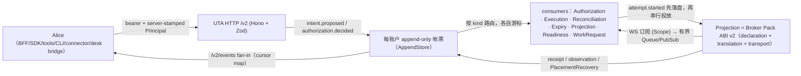

# 新 UTA 实施规范（spec）

本目录是新 UTA 的实施规范。上层设计公理在 [[plans/uta-refactor/design/00-core-contract.md]] 与 [[plans/uta-refactor/design/01-detail-constraints.md]]，调查证据在 `plans/uta-refactor/report/`。本目录回答“怎么落地”，公理层回答“什么不能变”。

## 阅读顺序与归属

| 文件 | 归属 | 读者 |
|---|---|---|
| [00-decision-register.md](00-decision-register.md) | **绑定决定 D1–D13** 与类型词汇/模块布局；已按验收评审修订（A1–A11）。其他文件只能细化，不能与之矛盾。（英文，标识符密集） | 所有人先读 |
| [types/](types/README.md) | **可类型检查的规范包**：brands/parser、provider 声明与恢复代数、帐票分录与折叠、AppendStore、wire DTO、正/负编译夹具、A/B/C 回放。类型即规范的一部分。 | 实施者、Pack 作者 |
| [01-architecture.md](01-architecture.md) | 进程内结构：composition root/Layer、三处 Effect 收容点、七类 consumer、fan-out/backpressure、每账户单写通道、启动/排空、旧组件与反向 import 的去向 | 核心实施者 |
| [03-ledger-and-persistence.md](03-ledger-and-persistence.md) | 帐票文件格式、hash 链、`head.json`、耐久性/恢复/隔离、boot lock、视图与游标、迁移 0044、`uta-runtime.json` 与 `ConfigRevision`、崩溃矩阵 | 核心实施者、迁移作者 |
| [04-provider-projections.md](04-provider-projections.md) | Broker Pack ABI v2、声明/翻译/传输、`x-uta` overlay 与流清单、`PlacementRecovery<P>` 规律、五家 provider 工作流、legacy 手工投影、构建/激活、一致性套件 | Pack/投影作者 |
| [05-protocol-and-replacement.md](05-protocol-and-replacement.md) | `/v2/*` 目录、`/v2/events` fan-in、OpenAPI 发布、49 条旧路由映射、逐消费方迁移清单、原子切换与发布闸门 | Alice 侧与 UI 实施者 |
| [06-interaction-and-issues.md](06-interaction-and-issues.md) | 角色矩阵、十条交互序列、UTA desk bridge（Issue 集成）、typed decision、agent guidance/工具词汇、UI 面变化 | 产品/前端/Issue 集成 |
| [07-security-operations.md](07-security-operations.md) | bearer 注入（五类 launcher）、Principal 加盖、资源解析、密钥归属、运行时配置校验、readiness、排空与 force-kill、观测/脱敏、备份 | 运维、安全 |
| [08-verification.md](08-verification.md) | 类型闸门、模型/状态机场景目录、provider 一致性、运行时预算、浏览器/切换验收、明确未证明项 | 全体（验收口径） |
| [09-traceability.md](09-traceability.md) | 公理/约束/不变量/开放问题/消费面/存储 → 决定/章节/类型/场景 的追溯矩阵 | 审阅者 |
| [REVIEW-SHEET.md](REVIEW-SHEET.md) | 维护者审阅文档：每个决定 D1–D13 / R1–R7 按"现状（出处）→ 问题 → 备选方案 → 谁讨论了什么、Main 为何这样裁 → 决定与类型 → 评审挑战与修订 → 代价风险 → 请你判断"展开，末尾留裁决/意见列；含 18 行未证明边界与需授权事项 | 维护者 |
| [evidence/](evidence/) | 审阅文档引用的一手材料逐字导出：Wave-1 调查报告 `w1-*.md`、register 冻结前草稿、评审后裁决 `fix-directive.md`、两轮讨论者最终产出 `discussion-*.md`、三份验收评审 `review-*.md` | 审阅者回查 |

`02` 编号保留给 `types/`（模块布局见其 README）。

## 一句话架构



- 真相只来自上游观察；帐票记录意图、决定、尝试、回执、观察、冲回，回放是纯折叠。
- 每账户一条流、一个写者、一个串行写通道；`attempt.started` 落盘先于任何 provider 调用；`unknown` 只能经 `PlacementRecovery<P>` 收敛，永不盲重试。
- Effect 只在进程内承担运行时纪律；wire、帐票格式、Pack ABI、UI 与 SDK 与 Effect 无关。
- 提供商以 OpenAPI 投影为构建输入、以 Broker Pack 发布，能力声明是语义变体而非布尔。
- Alice 通过 `/v2/events` 拉取 `work.requested`，用 Issue desk 让 agent 消费；决定只经 typed endpoint 回流，authority 由账户策略决定。

## 可复现检查

```bash
cd plans/uta-refactor/spec/types
pnpm install --ignore-workspace   # 独立 lockfile，不进入 root workspace
pnpm typecheck                    # tsc --noEmit，0 diagnostics
pnpm typecheck:negatives          # 16 个负例各自以预期 TS 错误码失败（// Expected TSxxxx 约定）
pnpm test:fixtures                # 6 个正例：composition、providers、readiness、A/B/C 回放、41 条路由目录、loader 运行时校验
```

实施阶段的运行时验收（Bun 1.4.0 + 已编译 Pack 经 file-URL 加载、100–200 WS 回放预算、Alpaca paper、浏览器真实路径）在 `08-verification.md`，本目录不声称已完成它们。

## 维护规则

- 改变跨文档契约先改 `00-decision-register.md`，再改 `types/`，最后改文档；`09-traceability.md` 同步。
- 文档与 `types/` 不一致时以 `types/` 为准并修文档；`types/` 与 register 不一致时以 register 为准并修类型。
- 不在本目录写生产代码；实施进入 `services/uta/`、`packages/uta-protocol/`、`packages/uta-broker-*/` 时按 `05` 的切换顺序建 plan 条目。
