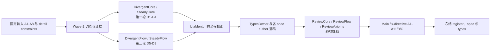
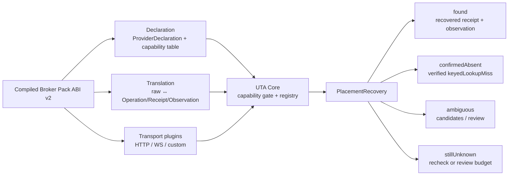
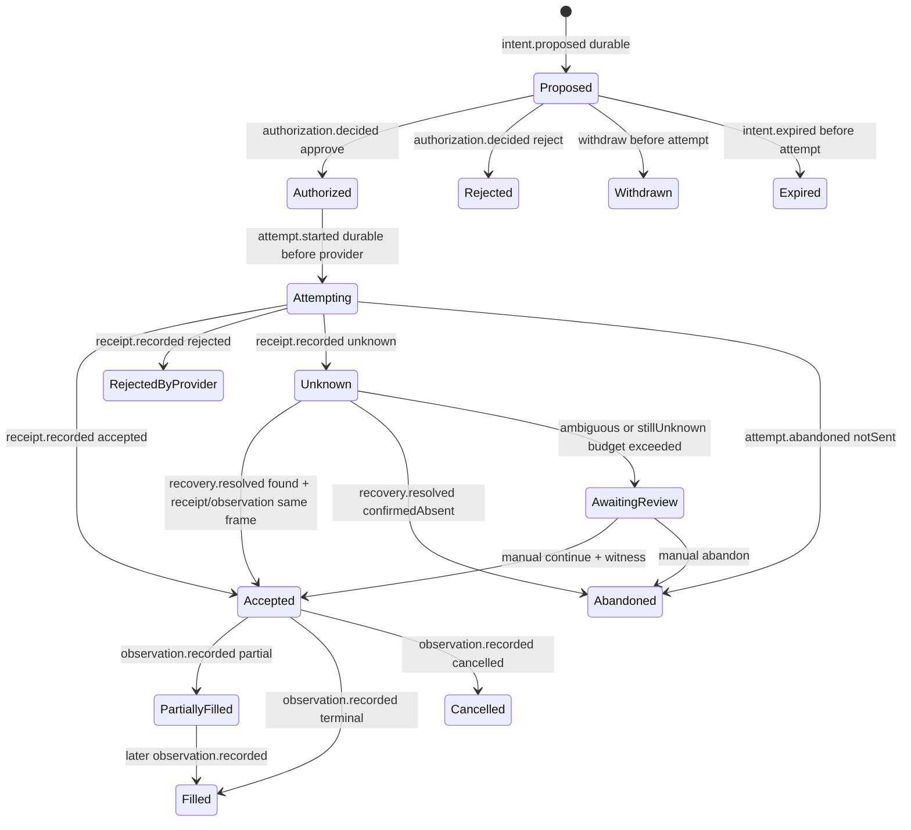
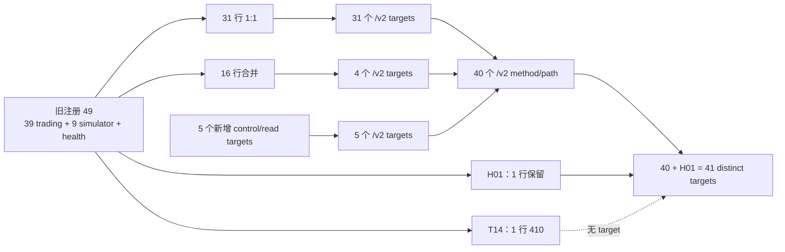
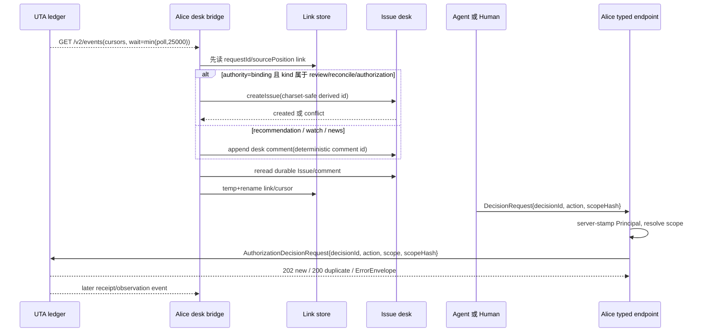

# 新 UTA 设计 — 维护者审阅文档

**这份文档是干什么的。** 它把 `plans/uta-refactor/spec/` 里的每一个绑定决定（D1–D13）、评审后的残余裁决（R1–R7）和本轮设计明确未证明的边界，按同一结构摊开：**现状（附代码/报告出处）→ 问题 → 备选方案 → 谁在讨论里说了什么、Main 为什么这样裁 → 最终决定与对应类型 → 验收评审挑了什么刺、改了什么 → 代价与风险 → 请你判断**。每个决定末尾有一张表，`裁决` 列填 `接受 / 修改 / 拒绝 / 待议`，`意见` 列随便写。你填完后我按行改 register → types → 文档，并重跑 `types/` 三道闸门和追溯矩阵引用核对。

**出处约定。** `path:line` 指向仓库文件；`evidence/w1-*.md` 是本次 Wave-1 调查报告（会话本地产物，我可按需导出到 `plans/uta-refactor/report/`）；`history://<Agent>` 是该 agent 的对话记录原文；`evidence/review-ReviewCore.md|ReviewFlow|ReviewAxioms` 是三份验收评审的最终结构化 findings（它们的对话记录已被压缩，只有最终产出可逐字回查）。凡是写"未找到记录"或"由 Main 直接裁定"的地方，就是没有独立讨论、是我单方面拍的板——这些地方请你重点看。

**规范正文在哪。** 决定原文：`00-decision-register.md`；类型：`types/`（`pnpm typecheck` 0 diagnostics、16 个负例、6 个正例）；追溯：`09-traceability.md`（273 行，resolved 229 / out-of-scope 26 / blocked 18）。

## 目录

| 部分 | 内容 |
|---|---|
| 背景 | 为什么要做新 UTA；公理 A1–A8 从哪来；这次设计是怎么组织的（调查 → 讨论 → 起草 → 评审 → 修订） |
| D1–D2 | 语言/运行时；Effect-ts 边界 |
| D3–D4 | Provider 投影 = Broker Pack ABI v2；命令生命周期事件代数 |
| D5–D8 | 帐票持久化；原子替换与 49→41 路由收敛；bearer + Principal；帐票即事件流 |
| D9–D13 | Issue 桥接与 typed decision；严格解析；brand/decimal/时间；readiness/排空；范围 |
| R1–R7 | 追溯矩阵暴露的七个未决点，由 Main 直接裁定 |
| 未证明边界 | 18 行只能在实现/切换阶段拿到证据的项 |
| 需你授权 | `PLANS.md` 条目；D3 带来的"上线初期写操作静态只读"的实施顺序 |

---

## 背景：为什么需要这份审阅单

本文的前身只有结论表格和一张概览图，没有说明旧系统为何不够、谁讨论了什么、为何从备选方案中选出当前结论，因此不能支持维护者区分“已由证据证明的约束”和“仍待实现验证的选择”。本次重写把背景、反例、讨论和验收挑战放回每个决定，而不是把历史留给读者自行猜测。

旧 UTA 的反例不是抽象担忧：旧交易写入先调用 broker，再 `getGitState`、写 commit；失败窗口会形成“已下单未记账”，重试还可能重复下单；`stage`、`pendingHash`、FX / Mock health / cooldown 只在内存中，重启即丢失；锁只覆盖部分动作，`sync`、`reconcile`、`observed` 可以绕过；同时存在 reverse import 和协议/类型漂移（`plans/uta-refactor/report/00-overview.md:10-21,136-149,246-270`）。这些事实迫使新设计先解决“谁是真相、什么可以写、什么可回放”，而不是先挑一个运行库。

冻结输入明确说，`00-core-contract.md` 是架构不变量，不是实现方案；旧报告只提供反例，细节不得改写公理（`plans/uta-refactor/design/00-core-contract.md:1-5`）。A1 要求上游是真相来源，下游只能投放 intent 或取得 observation；A2 要求以运行时交换的 IO 为抽象锚点；A3 要求能力由可组合类型与 handler 表达；A4 分离 read / read-write；A5 以 append-only ledger 记录 intent 及后续作用并纯回放；A6 按 entry kind 路由，拒绝用结构化 reversal 表达；A7 区分静态需求与 provider 的运行时 capability；A8 将 persistence IO 的归属说清，并把配置与 ledger 分开（`plans/uta-refactor/design/00-core-contract.md:9-83`）。TypeScript 必须承担这些可检查的区别，但核心契约并不预选某个 effect library（`plans/uta-refactor/design/00-core-contract.md:105-115`）。

证据链分成几层。Wave-1 先由调查工作确认 surface / interaction / ledger persistence / provider capability / adapter method pack / official venue docs / Effect evaluation / language runtime / OpenAPI projection、tooling、venues / Issue system / lifecycle topology / trace matrix；当前 register 明确把这些调查和两轮 discussant 作为证据来源，并要求每个决定写出 falsifier（`plans/uta-refactor/spec/00-decision-register.md:3-5`）。随后第一轮由 `DivergentCore`、`SteadyCore` 讨论 D1–D4，第二轮由 `DivergentFlow`、`SteadyFlow` 讨论 D5–D9；`UtaMentor` 贯穿指导；各 spec 与 `types/` 的 owner 再把裁决落为文档和类型。验收阶段由 `ReviewCore`、`ReviewFlow`、`ReviewAxioms` 挑战缺口，Main 以 `evidence/fix-directive.md` 的 A1–A11、B、C 条目统一回裁，之后 register 标为“amended after acceptance review”（`plans/uta-refactor/spec/00-decision-register.md:1-5`；`evidence/fix-directive.md:1-17,19-40`）。

---

## D1 语言与运行时：TypeScript；Node default，Bun 1.4.0 supported；No Rust core

### 1. 现状

旧 UTA 在开发、生产、Electron、Bun 和 Docker 中已经有五种启动路径：开发 Guardian 用 `tsx`，生产用 `node dist/uta.js`，Electron 用 `ELECTRON_RUN_AS_NODE`，Bun 用同一编译产物加 `--internal-role uta`，Docker 用 Node 22 / `tini`；`dist/uta.js`、ASAR assertion、Docker dependency closure、签名与 release matrix 都依赖这套形状（`evidence/w1-lifecycle-topology.md:1-15,28-38,51-63`）。因此“换 Rust”不是替换一个函数，而是改变 launcher、artifact、packaging 和 JS Broker Pack 装载边界；调查也记录 Rust executable 不能在不改 argv / artifact / package 约定的情况下 drop-in（`evidence/w1-lifecycle-topology.md:28-38,51-63`）。

Wave-1 的 runtime probe 在一台 M4 上用 Node 26.8.1、Bun 1.4.0，100/200 upstream WebSockets、5k/10k requested msg/s、约 200-byte JSON 和三个同步 consumer，得到零 sequence gap、零 parse error、平均 CPU 不超过 10%、p99 约 10–12.5µs；队列增长只在约 22k processed msg/s 的压力附近出现（`evidence/w1-language-runtime.md:374-404`）。但该 probe 是 localhost 两进程 synthetic 测量，不含 TLS、proxy、provider decode、reconnect storm、ledger write，也没有产品 CPU/RSS/p99 SLO（`evidence/w1-language-runtime.md:466-476`）。所以 register 的现状不是“TypeScript 已被证明永远胜过 Rust”，而是 target load 在已测 envelope 内，Node 为 default、Bun 1.4.0 为 supported，并把完整 compiled Pack replay 留作 acceptance gate（`plans/uta-refactor/spec/00-decision-register.md:25-35`）。

跨 runtime 的 seam 被限制为 serializable records / decimal strings / tagged errors / raw envelopes，credentials 由调用方注入；transport plugin 不得读取 `accounts.json`、`sealing.key` 或 sealed envelope（`plans/uta-refactor/spec/00-decision-register.md:31-33`）。这在类型上对应 `TransportRequest`、`TransportResult` 和 `TransportPlugin`；`TransportRequest.control.signal` 是控制值而非业务持久化值，`HTTPExecutor` / `WSExecutor` / `CustomPlugin` 都只接收 `CredentialInput`（`plans/uta-refactor/spec/types/provider/abi.ts:15-25,39-53`）。

### 2. 问题

若仅因“Rust 可能更快”就迁移，实际风险是把一个 target-load 尚可的 runtime 问题扩大为五个 launcher、Electron ASAR、macOS/Windows signing、release matrix、JS Pack loading 和跨平台分发问题；调查明确指出 Pingora 是 inbound proxy 框架，不是 outbound provider subscription primitive，且没有可直接对应 ZIO 的稳定 Rust effect system（`evidence/w1-language-runtime.md:406-418,440-462`）。同时，若把 localhost p99 直接写成产品 SLO，也会掩盖 provider decode、TLS、ledger fsync、reconnect 和 backpressure 的真实成本。

更具体的故障风险是吞吐账目被误读：在 25k requested 的 sweep 中，Node / Bun 实际处理约 22.8k–22.9k，队列斜率约 +2.8k–2.9k，而不是“25k 稳定处理”；现有报告还说明单台 M4、单 runtime 版本、无生产 trace，不能推出跨主机或跨平台结论（`evidence/w1-language-runtime.md:387-404,464-476`）。反过来，如果不保留 falsifier，又会把“TypeScript first”变成不可证伪的偏好。

### 3. 备选方案

| 方案 | 具体做法 | 代价与未解决风险 |
|---|---|---|
| A：TypeScript first（采纳） | 保留当前五种 launcher；Node 为 default、Bun 1.4.0 supported；把 provider seam 做成 serializable values + injected credentials，并用 compiled active Pack replay 验收。 | 仍需承担 JS event loop、provider decode、reconnect、ledger 与 queue 的真实压力；当前 synthetic 只证明 feasibility，不证明生产 capacity。 |
| B：Rust core / sidecar | 把高吞吐或 provider loop 移到 Rust，通过 IPC / sidecar 与 TS UTA 交互。 | 改五种启动和 artifact 约定，增加 IPC、凭据、故障恢复与 release/signing 面；Pingora 不直接解决 outbound subscriptions，当前没有 Rust 实现或基准证明收益。 |
| C：先保留 TS、同时建立 Rust PoC | 不立即改变生产路径，但另写 Rust provider/runtime benchmark，与 TS 做同一 replay 对比。 | 能降低迁移猜测，却会扩大当前范围；在没有产品 SLO、真实 provider trace 和跨平台环境前，PoC 结果仍可能不能裁决是否值得切换。 |

### 4. 讨论过程

`DivergentCore` 对 D1 的 verdict 是 **amend**，不是拒绝 TypeScript。它的 strongest objection 是：“The escape-hatch sentence makes an unfalsifiable claim ("can later be attached ... without touching the domain") that is `[inferred]` in the packet, not evidenced, and it omits the only real precondition: credentials.” 证据还指出 sealed `accounts.json` 与外置 `sealing.key` 的边界，sidecar 不能取得 ambient config（`evidence/discussion-DivergentCore.md`）。它给出的 amendment 要点是：transport executor seam 只能过 serializable records、decimal strings、tagged errors、raw envelopes，并以 **injected value** 接收 credentials；transport plugin 不读 `accounts.json`、`sealing.key` 或 sealed envelope；sidecar 是否存在 out of scope。Main 采纳了 seam、注入凭据和 falsifier，驳回了 draft 的“sidecar 可在以后接入且不触及 domain”承诺，也驳回把“Rust prototype meeting that while TS fails”塞入 D1 falsifier：这些都没有当前证据，且会把边界 invariant 误写成迁移路线。可对照 draft 的 D1 行 `evidence/decision-register-draft.md:7-12` 与现行 register 的 boundary invariant / falsifier（`plans/uta-refactor/spec/00-decision-register.md:25-35`）。

`SteadyCore` 对 D1 的 verdict 也是 **amend**，其 strongest objection 是：“The conclusion (TypeScript first) is sound, but the register overstates its benchmark.” 它具体指出 200-connection Node baseline 的 10.417% mean client CPU、25.3% maximum，以及 localhost JSON harness 没有 provider decoding、TLS/proxy、reconnect、ledger、Issue callback（`evidence/discussion-SteadyCore.md`）。它的 amendment 要点是：保留 TypeScript、Node default、Bun 1.4.0，但把 probe 限定为 target-load feasibility；D1 关闭前必须用 compiled active Pack、file-URL loader、provider-like replay/fan-out 做 startup/RSS/CPU、持续时长和队列检查；serializable Pack ABI 是 boundary invariant，不是 Rust sidecar 承诺。Main 采纳了 limits、full replay gate 和 ≥25k/10m/p99≤5µs 的 falsifier，驳回将 synthetic benchmark 当 capacity/SLO 的 draft 说法（`evidence/decision-register-draft.md:7-12`）；现行对应为 D1 why、limits 和 falsifier（`plans/uta-refactor/spec/00-decision-register.md:29-35`；`plans/uta-refactor/spec/08-verification.md:327-355`）。

两位讨论者共同把“选 TypeScript”从性能偏好收窄为可证伪的工程决定：`UtaMentor` 的原则是“if TS satisfies stated latency/resource/correctness budgets with substantial headroom at expected load, performance is not a reason to pay Rust integration cost”（`history://UtaMentor`）；`LanguageRuntime.LanguagePlanMentor` 也说 benchmark 只能回答当前 workload 是否足够，不能证明 Rust 更快或值得集成（`history://LanguageRuntime.LanguagePlanMentor`）。因此 Main 采纳的是 TypeScript first + 明确证伪门槛，而非永久排除 Rust（`plans/uta-refactor/spec/00-decision-register.md:25-35`）。

验收评审的 `ReviewAxioms` M27 还指出 D1 falsifier 原先没有可执行的 ≥25k stress command/fixture；该 finding 的 claim、sideA、sideB 与 resolution 见 `evidence/review-ReviewAxioms.md` M27。Main 通过 `evidence/fix-directive.md` 和 08 的 D1 gate 把它固化为 named replay fixture / command；所以验收部分不再把“有 falsifier 文字”误当“falsifier 已运行”（`plans/uta-refactor/spec/08-verification.md:353-355,487-494`）。

### 5. 决定

Main 最终采纳 D1：新 UTA 使用 TypeScript，按现有五种 launcher 启动；Node 是 default，Bun `1.4.0` supported，不建立 Rust core。该裁决位于 register 的 D1 决定、why、limits、boundary invariant 与 falsifier 段落（`plans/uta-refactor/spec/00-decision-register.md:25-35`）。它不是对 Rust 的永久否定，而是以当前证据选择迁移成本更低的实现，并给出可推翻条件。

D1 没有另设一个“runtime selector”领域类型；对应的 `types/` seam 是 `CredentialInput`、`TransportRequest`、`TransportResult`、`HTTPExecutor`、`WSExecutor`、`CustomPlugin`、`TransportPlugin` 和 `PackModule`（`plans/uta-refactor/spec/types/provider/abi.ts:15-25,39-53`）。这些类型把 runtime 选择放在部署事实，把 provider 交互约束在 serializable boundary。

### 6. 评审中的挑战与修订

验收评审实际逼出的不是“把 D1 改成 Rust”，而是把“基准很好”改成“基准只证明有限 envelope，并必须可运行地证伪”。`fix-directive` 要求 08 文档固定 Node/Bun、compiled active Pack、file-URL loader、100/200 WS、5k/10k、warmup / duration / reconnect、SIGINT 与 forced restart，并明确 generated client、control-value non-persistence 和 Effect identity 检查（`evidence/fix-directive.md:31-40`；`plans/uta-refactor/spec/08-verification.md:286-355`）。

因此 register 保留 D1 的 TypeScript / Node / Bun 结论，但加入三项修订：其一，将 Wave-1 数字明确标为 synthetic feasibility 而非产品 SLO；其二，把 ≥25k processed msg/s、10 分钟、p99 ≤5µs、zero loss、bounded queue 写成 falsifier；其三，把 credentials injection 与不得读取本地 secret 的 seam 写成独立 invariant。`ReviewAxioms` M27 的 claim 是：“D1's falsifier requires a reproducible representative replay at >=25k processed messages/s for 10 minutes with p99 <=5µs, but the verification runner only defines 5k/10k cases and gives no executable >=25k command or fixture.” sideA 为 `plans/uta-refactor/spec/00-decision-register.md:25-35`，sideB 为 `plans/uta-refactor/spec/08-verification.md:239-294`，resolution 是：“Add the exact >=25k stress command/fixture and pass/fail output, or explicitly mark the falsifier as an unverified conditional rather than implying the current benchmark covers it.”（`evidence/review-ReviewAxioms.md`，M27）。Main 采纳前一个 resolution，现行 08 的 D1 gate 已把它固化为 named replay fixture / command（`plans/uta-refactor/spec/08-verification.md:353-355,487-494`）。

### 7. 代价与风险

维护者接受 TypeScript first，就接受未来仍须实现真实 replay runner、compiled Pack、provider-like HTTP/WS replay、translation/parser、bounded fan-out、ledger checkpoint、reconnect / gap / backfill 和 shutdown 检查；仅跑 echo server 或 localhost smoke 不算通过（`plans/uta-refactor/spec/08-verification.md:300-334`）。D1 的运行预算包括 frame-to-consumer p99 ≤250µs、RSS ≤512MiB、CPU mean ≤70% / max ≤90%、queue high-water ≤2,000 且最后五分钟斜率 ≤500/s、无 drop/dup/out-of-order、断线后 ≤5s 恢复和 ≤5s clean release（`plans/uta-refactor/spec/08-verification.md:336-351`）。

D1 会在以下条件被证伪：representative provider replay 确实需要 ≥25k processed msg/s，而 200 WS × 125 msg/s 持续 10 分钟无法满足 p99 ≤5µs、zero sequence/parse loss 或 bounded queue；此时应报告 TypeScript decision 未通过，而不是以 5–10k target case 掩盖失败（`plans/uta-refactor/spec/08-verification.md:353-355,487-494`）。尚未证明 Rust core、完整 UTA replay、production provider trace、TLS/proxy、multi-host capacity 或跨平台 CPU/RSS；这些明确是 residual risk，不得写成已验证（`plans/uta-refactor/spec/08-verification.md:507-516`）。

### 8. 请你判断

1. 在当前没有产品 capacity SLO、生产 provider trace 和跨平台 replay 的前提下，是否接受 TypeScript first，而不把 Rust PoC 作为本次实现的前置条件？
2. 是否接受将 Node 作为 default、Bun `1.4.0` 作为 supported，并把五种 launcher 的一致行为作为同一验收范围，而不是只验 Node？
3. 是否接受 ≥25k processed msg/s、10 分钟、p99 ≤5µs、zero loss、bounded queue 作为 D1 的 falsifier，而不将 Wave-1 localhost 数字当产品 SLO？
4. 是否接受 `TransportRequest` / `TransportResult` 只传 serializable values、由调用方注入 credentials，且 transport plugin 不得读取本地 secret 文件？

| # | 问题 | 裁决（接受/修改/拒绝/待议） | 意见 |
|---:|---|---|---|
| 1 | 在当前证据边界内接受 TypeScript first？ |  |  |
| 2 | 接受 Node default、Bun 1.4.0 supported 和五 launcher 同验收？ |  |  |
| 3 | 接受 D1 falsifier 与其非 SLO 限定？ |  |  |
| 4 | 接受 serializable transport seam 与 injected credentials？ |  |  |

---

## D2 Effect-ts：只在 UTA process 内采用（Option B）

### 1. 现状

固定公理要求静态 capability composition、read / read-write 区分、持久化 IO 归属和外部边界解析，但 `00-core-contract.md` 明确不选择 effect library（`plans/uta-refactor/design/00-core-contract.md:105-115`）。Effect 调查比较了三条路线：A 不引入 Effect；B 只在 UTA core 使用 Effect；C 把 Effect Schema / `@effect/platform` HttpApi 也纳入公共协议和生成链。实测 Effect v3.22.2 及平台包可完成 Layer、Queue、Semaphore、TestClock 等 sketch，但会增加依赖和 bundle；因此推荐 B，保留 Zod、Promise Pack ABI 和现有 OpenAPI 生成路线（`evidence/w1-effect-evaluation.md:1-11,40-51,173-224`）。

当前边界已有三类不同消费者：protocol 用 Zod 4，Pack 通过动态 file URL 加载并做 module-shape / schema 检查，SDK / generated clients 面向 Promise；调查还明确没有 OpenAPI importer 可把既有文档反向变成 Effect HttpApi（`evidence/w1-effect-evaluation.md:15-24,160-171`）。因此 D2 不是“全仓库改成 Effect”，而是让 `services/uta` 的 composition root 管 Layer / ManagedRuntime、Scope、bounded Queue / PubSub、per-account Semaphore、classified Schedule、TestClock 和 local durable append 的不可中断区，同时 provider IO 仍 deadline-bounded、interruptible（`plans/uta-refactor/spec/00-decision-register.md:37-45`）。

类型上，`ReadOnly<T>` 只能有 `read`、`ReadWrite<E,T>` 才有 `write`，`Handler` / `Handlers` / `WriteHandler` 通过 non-distributive conditional types 保持 read-only provider 不可构造 write handler（`plans/uta-refactor/spec/types/channel.ts:3-8`）。这部分是普通 TypeScript 的 A3/A4 proof，不等于把 Effect value 暴露给业务边界。Effect Layer 的 Requirements 则在 composition root 对缺失服务给出 TS2345；dynamic Pack 的 declared capability 仍只能由 loader 在运行时验证，不能把静态 typecheck 当成外部模块的证明（`plans/uta-refactor/spec/00-decision-register.md:43-47`）。

### 2. 问题

如果完全不采用 Effect，Scope / release、bounded fan-out、per-account serial writes、failure-classified retry、TestClock 和 shutdown 的正确性会分散到自定义状态机，难以让缺失 handler 或资源归属在组合根暴露。反过来，如果把 Effect Schema、HttpApi、Fiber/Cause 或 generated-client value 推入 protocol、ledger 或 Pack ABI，就会破坏 A1/A2/A7 的边界：公共 wire 不再是 Zod 既有契约，Pack 不能由普通 Promise consumer 使用，业务记录可能携带不可序列化 runtime identity。

调查给出具体成本：新增 Effect 依赖后约 32 个包、约 33MB effect / 21MB platform 安装体量；对最小 bundle 的实测约增加 118.5KiB，executable 约增加 0.252MiB；Bun shell 版本为 1.4.1，而 repo pinned 是 1.4.0，不能把该实验当 pinned runtime acceptance（`evidence/w1-effect-evaluation.md:40-51,227-235`）。另一个风险是只验证“正向 typecheck”会漏掉边界泄漏：缺 Layer 的 TS2345、只读 provider 的 TS2322、普通 Promise Pack 无 Effect value / identity，三者必须分别证明（`evidence/w1-effect-evaluation.md:53-158`）。

### 3. 备选方案

| 方案 | 具体做法 | 代价与未解决风险 |
|---|---|---|
| A：不用 Effect | 继续用 Promise / 自定义 resource、queue、retry、clock、shutdown 组合；只用普通 TypeScript channel types。 | 依赖最少、边界最干净，但资源释放、背压、并发和时间测试容易各自实现；缺失 runtime service 不会自然集中在 composition root。 |
| B：UTA core only（采纳） | `effect` 只作为 `services/uta` runtime dependency；Layer / ManagedRuntime / Scope / Queue / PubSub / Semaphore / Schedule / TestClock 只在内部；protocol、ledger、Pack ABI、UI、SDK、generated clients 保持 Zod / Promise / serializable。 | 增加 Effect closure、学习和 bundle/RSS 成本；必须维护 HTTP ingress、Pack loader、provider transport 三个 containment point，并做 compiled Pack identity probe。 |
| C：全链路 Effect | 同时采用 Effect Schema、`@effect/platform` HttpApi、Effect-generated client 或让 Pack 暴露 Effect。 | 统一抽象的表面收益大，但与既有 Zod/OpenAPI 生成链和 Promise Pack ABI 冲突；公共协议、SDK、UI、第三方 Pack 全部耦合，迁移面显著扩大。 |

### 4. 讨论过程

`DivergentCore` 对 D2 的 verdict 是 **amend**。它的 strongest objection 有两层，关键原句是：“The static claim is over-credited: what `/tmp/w1-effect-eval` proves is (i) a read-only `WriteHandler
` is unconstructible via conditional types alone, and (ii) dropping `LedgerLive` at `runPromise` yields TS2345 on the Requirements channel.” 它进一步指出：“at the pack boundary that can only ever be runtime.” Amendment 要点是：把 Effect 限定为 runtime disciplines；把 read-only writability 留给普通 conditional types，把 Layer `Requirements` 限于 in-process composition；dynamic Pack boundary 永久由 extended module-shape validator 做 runtime check。Main 采纳了这三个层次和“dynamic boundary 永远 runtime”，驳回把 TS read-only proof 归功于 Effect 的 draft parenthetical；可对照 draft D2 行 `evidence/decision-register-draft.md:14-19` 与现行 `plans/uta-refactor/spec/00-decision-register.md:39-49`。

`SteadyCore` 对 D2 的 verdict 也是 **amend**。其 strongest objection 是：“Exactly two seams” omits the independently trusted dynamic Pack loader；`loadBrokerEngine` 只验证 API/version/schema/factory shape，而 Promise-facing signature 不能保证 downloaded module 的真实 return（`evidence/discussion-SteadyCore.md`）。它的 amendment 要点是增列第三个 containment point（Pack loader ABI），以 Promise-only Pack ABI + 一个 normalization wrapper 把返回值和 thrown errors 正规化；Effect 只在 core orchestration，local durable append 才可进入不可中断区，provider I/O 仍 deadline/cancellation-bounded。Main 采纳第三点、normalization、Promise-facing ABI、generated-client non-leak 与 control-value 例外；驳回 draft 的“两处 seam”和把 attempt→provider→receipt 整段都放进不可中断区（`evidence/decision-register-draft.md:14-19`）。现行 register 对应“三 containment points”、local durable appends、provider interruptibility、runtime Pack validator 和开放 falsifier（`plans/uta-refactor/spec/00-decision-register.md:39-49`）。

`EffectEvaluation.EffectPlanMentor` 将上述 amendment 收束为“双向实验”：“treat the option-B sketch as a two-sided experiment, not merely a successful typecheck.” Main 因而保留 positive composition、missing Layer、read-only negative 和 compiled Pack identity probe；`UtaMentor` 的接受条件是 Effect 不能泄漏到 public contracts，否则拒绝 Option B（`history://EffectEvaluation.EffectPlanMentor`；`history://UtaMentor`）。这就是 D2 最终写成 Option B、而不是 draft 的全链路 Effect 的原因（`plans/uta-refactor/spec/00-decision-register.md:37-49`）。

验收评审 `ReviewAxioms` 的 M25 和 M17 把上述边界要求落到了实际 fixture 与 wire parser。M25 的 claim、sideA、sideB、resolution 原文，以及 Main 依据它补 positive fixture 的裁决，见本单 D2 §6（`evidence/review-ReviewAxioms.md`，M25；`evidence/fix-directive.md:29`）；M17 则要求 wire 的 encoded JSON 与 core 的 branded domain values 分离（`evidence/review-ReviewAxioms.md`，M17；`evidence/fix-directive.md:21-24`）。因此讨论过程的结论不是“Effect 能替代所有 TypeScript proof”，而是静态 proof、dynamic Pack validation、wire→domain parser 各自停在明确边界。

### 5. 决定

Main 最终采纳 D2 Option B：`effect`（v3，pinned）只作为 `services/uta` 的 runtime dependency。它负责 UTA 内部的 runtime discipline，不负责 wire schema、ledger format、Pack ABI、UI、Alice SDK/tools 或 generated clients。`Cause`、`FiberFailure`、`Layer`、`Schema` 等 Effect values 不得 serialize；AbortSignal / cancellation / deadline 只作为控制参数跨 ABI，不进入 ledger/config/Issue（`plans/uta-refactor/spec/00-decision-register.md:37-49`；`plans/uta-refactor/spec/08-verification.md:282-298`）。

对应 `types/` 的领域类型不是 `Effect` 本身，而是 `ReadOnly<T>`、`ReadWrite<E,T>`、`Handler<C>`、`Handlers<Spec>`、`WriteHandler<C>`（`plans/uta-refactor/spec/types/channel.ts:3-8`），以及 ABI 中的 `PackModule`、`LoaderValidationResult`、`TransportRequest`、`TransportResult`（`plans/uta-refactor/spec/types/provider/abi.ts:18-25,47-53`）。`effect` 在 private types package 只作 dev-only fixture dependency；其存在用于验证 composition / missing service，不把 Effect API 变成公共 domain vocabulary（`evidence/fix-directive.md:14,19-29`）。

### 6. 评审中的挑战与修订

验收阶段的 `ReviewAxioms` 给出两条与 D2 边界直接相关、且必须进入裁决的 finding。M25 的原文 claim 是：“The composition acceptance claim says the fixture proves the Effect/static capability-handler composition, but the positive fixture only uses plain functions and Handlers; the only Effect import is a deliberately negative-only fixture.” 它的 sideA 为 `plans/uta-refactor/spec/08-verification.md:75-78; plans/uta-refactor/spec/00-decision-register.md:39-45`，sideB 为 `plans/uta-refactor/spec/types/fixtures/positive/composition.ts:1-12; plans/uta-refactor/spec/types/fixtures/effect-boundary.ts:1-5`，resolution 是：“Either narrow the acceptance claim to the plain TypeScript handler proof or add a positive Effect composition fixture that exercises the declared residual-requirement guarantee.”（`evidence/review-ReviewAxioms.md`，M25）。Main 在 `evidence/fix-directive.md:29` 采纳后一个方案：补 `fixtures/positive/effect-composition.ts`，并保留 negative convention，而不是继续把 plain `Handlers` fixture 说成 Effect composition proof。

同一评审的 M17 还指出穿过 D2 公共边界的品牌丢失。原文 claim 是：“Wire DTO schemas erase the domain brands and use plain numbers for positions/instants/asOf/durations, contrary to D11's requirement that brands survive the boundary and be parsed immediately into domain types.” sideA 为 `plans/uta-refactor/spec/00-decision-register.md:169-177; plans/uta-refactor/spec/05-protocol-and-replacement.md:90-96`，sideB 为 `plans/uta-refactor/spec/types/wire/v2.ts:11-16,34-64,74-80,97-118`，resolution 是：“Keep encoded JSON strings/numbers at the external schema but expose parser outputs as named branded domain values (or provide explicit decode functions immediately after schema validation); do not treat inferred plain DTOs as domain types.”（`evidence/review-ReviewAxioms.md`，M17）。这不是把 Effect 引入 wire 的理由，恰好相反：外部 JSON 可以保持编码形状，进入 core 前必须在边界解析成品牌 domain values；对应修订落在 `evidence/fix-directive.md:21-24` 的 B1/B4。

Main 的绑定裁决是 A8：`effect` 只属于 `services/uta`；generated OpenAPI clients 必须 Effect-free，只能由 transport adapter 的 Promise wrapper 调用；generated-client value 不得进入 core serialization；`AbortSignal` / cancellation / deadline 只是 ABI control values 且永不持久化（`evidence/fix-directive.md:14`）。B9 又要求 Fixture A 的 `processRestart` unknown receipt 顺序、补 positive Effect composition fixture，负向 fixture 使用 `Expected TSxxxx` 而非 `@ts-expect-error`（`evidence/fix-directive.md:29`）。A8 处理的是运行时/ABI containment，B9 处理的是可运行的正负 proof；二者共同把 M25 的“只做了 plain TypeScript proof”改成可验收的 Effect residual-requirement proof，同时把 M17 的品牌解析留在 wire→domain boundary，而不是让 Effect 类型穿过边界（`evidence/review-ReviewAxioms.md`，M17/M25；`plans/uta-refactor/spec/00-decision-register.md:41-49`）。

`ReviewCore` 的最终产出还直接挑战了 D2 的 generated-client wording（M25）和依赖归属（M27）。M25 的 claim 是：“D2 says Effect never touches generated clients, while the architecture puts Promise-facing TransportPlugin calls through an Effect adapter and the provider contract says HTTPExecutor faces generated OpenAPI clients.” sideA 为 `plans/uta-refactor/spec/00-decision-register.md:41-43; plans/uta-refactor/spec/01-architecture.md:87,129-131; plans/uta-refactor/spec/04-provider-projections.md:542-556`，resolution 是：generated client source/types 保持 Effect-free；唯一允许的调用是在 provider transport adapter 的 opaque Promise-facing wrapper；generated client 或 SDK value 不进入 core serialization（`evidence/review-ReviewCore.md`，M25）。M27 的 claim 是：“D2 says effect is a dependency of services/uta only, while the binding type-package clause and package manifest permit effect as a dev dependency for boundary fixtures.” sideA 为 `plans/uta-refactor/spec/00-decision-register.md:39,193; plans/uta-refactor/spec/types/README.md:187; plans/uta-refactor/spec/types/package.json:10`，resolution 是：Effect 是 `services/uta` 的 runtime dependency，private types package 只允许 pinned dev-only fixture dependency，不得有 production import（`evidence/review-ReviewCore.md`，M27）。Main 采纳两项 resolution，写入 A8 并同步 D2 现行 register；`ReviewFlow` 的最终 findings 未覆盖 D1/D2，故没有对这两项再增加独立修订（`evidence/review-ReviewFlow.md`；`evidence/fix-directive.md:14`）。

### 7. 代价与风险

接受 D2 要维护两套边界纪律：内部可用 Effect 的 resource / queue / schedule / clock，但所有外部值在 ingress、Pack loader、transport adapter 处必须转换成已验证的 serializable domain records。要为每个 provider connection/subscription 建立 Scope / acquireRelease，为每个 account write channel 建立 one-permit Semaphore，并保证 local durable append 不被 interruption 打断、provider I/O 又不会让 drain 无限挂起（`plans/uta-refactor/spec/00-decision-register.md:37-43`）。这会增加学习、依赖 closure、startup/RSS 和 adapter code 代价；当前 Effect probe 的 bundle 数字也只是在 Bun 1.4.1 shell 上得到，不能替代 pinned Bun 1.4.0 gate（`evidence/w1-effect-evaluation.md:40-51,227-235`）。

D2 会在以下条件被证伪：真实 compiled Pack 在 pinned Bun 1.4.0 下迫使 Effect / Layer / Scope 或 generated client value 穿过 Pack boundary；两次独立加载出现 duplicate-Effect identity crossing；或 startup / RSS 超预算（`plans/uta-refactor/spec/00-decision-register.md:49`；`plans/uta-refactor/spec/08-verification.md:421,487-494`）。另一个风险是只通过 type-level fixtures，却没有动态 Pack、credential non-leak、AbortSignal non-persistence 和 generated client identity 检查；因此完整 replay 未通过前，不能称 D1/D2 已完成，且不应把现有 localhost 或单纯 `tsc` 输出当 end-to-end 证据（`plans/uta-refactor/spec/08-verification.md:507-516`）。

### 8. 请你判断

1. 是否接受 `effect` 只进入 `services/uta`，而 protocol、ledger、Pack ABI、UI、SDK 和 generated clients 保持 Effect-free？
2. 是否接受 `ReadOnly` / `ReadWrite` 的读写静态约束由普通 TypeScript 承担，而 Effect Layer 的 TS2345 只证明内部 composition root 缺失 service？
3. 是否接受 HTTP ingress、Pack loader ABI、provider transport adapter 三个 containment point，而不是只保留两个 seam？
4. 是否接受 generated clients 只能通过 Promise wrapper 被调用，`AbortSignal` / deadline 只能作为 control values 且永不持久化？
5. 是否接受 compiled active Pack + pinned Bun 1.4.0 + duplicate-Effect identity / startup / RSS probe 作为 D2 的验收门槛？

| # | 问题 | 裁决（接受/修改/拒绝/待议） | 意见 |
|---:|---|---|---|
| 1 | 接受 Effect 只在 `services/uta` 内部？ |  |  |
| 2 | 接受普通 TypeScript channel proof 与内部 Layer proof 的分工？ |  |  |
| 3 | 接受三处 containment point？ |  |  |
| 4 | 接受 Promise generated-client boundary 与 control-value 例外？ |  |  |
| 5 | 接受 compiled Pack / identity / startup / RSS runtime gate？ |  |  |

---

> 本补充只覆盖 D3（Provider projection / Broker Pack ABI v2）和 D4（按 account 的 command lifecycle event algebra）。`现状`引用的是旧实现或 Wave-1 调查；`决定`引用的是现行 register。调查中“六个 adapter”包含五个可安装 wrapper 加 `Mock` 手工 projection，正好解释了 register 中“五个 wrappers”的口径差异。

## D3 — Provider projection release = Broker Pack release（ABI v2）

### 1. 现状

旧入口是 `IBroker` 方法袋：`placeOrder(contract, order, tpsl?)` 没有 caller-supplied idempotency key，`getOrder` 按 provider order ID 读，也没有可恢复 observation cursor（`evidence/w1-provider-capability.md:5-8`；`evidence/w1-adapter-method-pack.md:53-82`）。六个实际实现的行为并不构成一个共同能力：

| 实现 | 当前 placement / read-by-key 行为 | 可回查证据 |
|---|---|---|
| Alpaca | request 不注入 `client_order_id`；`getOrder` 按 provider ID。官方却另有 `client_order_id` 与 keyed GET，说明“provider 有字段”不等于“adapter 暴露能力”。 | `evidence/w1-adapter-method-pack.md:55-66`；`evidence/w1-official-venue-docs.md:26-35` |
| CCXT | 无共同 client key；读取依赖 `orderSymbolCache`/`symbolHint`。Binance、Bybit、OKX、Bitget、Hyperliquid 的 key、覆盖范围和复用期各不相同，不能以 engine 名称概括。 | `evidence/w1-provider-capability.md:31-37,47`；`evidence/w1-adapter-method-pack.md:57,67` |
| IBKR TWS | 由 TWS `getNextOrderId()` 分配 numeric ID；Client Portal 的 `cOID` 证据属于另一产品，不能移植给 TWS。 | `evidence/w1-provider-capability.md:38,48`；`evidence/w1-official-venue-docs.md:48-57` |
| Longbridge | `SubmitOrderOptions` 没有 caller key，`orderDetail` 只按 provider ID；官方 `client_request_id` 的 10 分钟缓存尚未接入 adapter。 | `evidence/w1-provider-capability.md:39,46`；`evidence/w1-official-venue-docs.md:37-46` |
| LeverUp | 每次生成新的 `salt`/deadline，状态依赖 process-local `orderTracking` 和 relayer `inputHash`，不能作为持久化 caller key。 | `evidence/w1-provider-capability.md:40,49`；`evidence/w1-adapter-method-pack.md:60,70-71` |
| Mock | 生成 `mock-ord-N`，订单和读取都在进程内 map，重启后没有 provider-side identity。 | `evidence/w1-provider-capability.md:41`；`evidence/w1-adapter-method-pack.md:61,72` |

因此“没有 adapter 暴露 idempotency contract”是调查结论，而不是推测；同一报告明确写着六个 adapter 都没有 caller-keyed placement，且没有 adapter 暴露 A7 的完整 pair（`evidence/w1-provider-capability.md:5-8,24-28`）。现行 Pack 的生命周期本身已经存在：Alice 构建/安装，写入 immutable release，校验 manifest/checksum/realpath，原子替换 `active.json`，UTA 只从 active release 加载，重启使 registry cache 生效（`plans/uta-refactor/report/07-brokers-and-packs.md:181-209`）。

OpenAPI 证据也是不均匀的：Alpaca OAS 3.1.2、IBKR Web API OAS 3.1.0 可直接读取；Longbridge、OKX、Bybit、Bitget、Hyperliquid、LeverUp 多数只有官方 prose，CCXT 是 SDK 而非 venue OAS（`evidence/w1-official-venue-docs.md:10-24`）。生成工具可以产生 client，但 `openapi-typescript` 只给 runtime-free types，`typed-openapi` 的 parser/validation 也没有替 UTA 表达 partial capability；没有审查过的工具声明会保留任意 `x-uta` 或生成 WS/AsyncAPI（`evidence/w1-openapi-tooling.md:15-25,62-80`）。

### 2. 问题

旧方法袋把“方法存在”“provider 有一个相似字段”和“这次未知投放可以安全恢复”混成一件事。若 provider call 已发出但 response 丢失，只有 provider key、读取覆盖范围、时间窗口和 duplicate 行为都已证明，才可决定 replay、keyed read、`confirmedAbsent` 或人工复核；六个 adapter 都无法从当前接口给出这组 witness。最危险的实例是：Longbridge 的十分钟 replay 只在官方协议层成立，adapter 却没有把 `client_request_id` 传入；LeverUp 的 intent hash 也不等于 caller idempotency key（`evidence/w1-provider-capability.md:43-49,79-84`）。

这直接造成 D3 的初始业务后果：声明为 `supported` 的 write 如果没有 `PlacementRecovery
`，不能注册写 handler；现行 register 因而要求所有账户在 Pack 补齐 witness 前对写操作静态只读（`plans/uta-refactor/spec/00-decision-register.md:65-82`）。这是 fail-closed 的安全状态，不是“暂时把错误改成 503”：`propose` 前就应得到 `CapabilityUnsupported`，没有 `attempt.started`、provider call 或伪造成功（`plans/uta-refactor/spec/08-verification.md:211-218`）。同理，OAS 只能在构建期证明 HTTP schema；它不能证明 WS replay、gap/backfill、账户 entitlement 或当前 adapter 的字段暴露，必须拆成 OAS + UTA-owned stream manifest（`evidence/w1-openapi-projection.md:14-21,60-79`）。

### 3. 备选方案

| 方案 | 做法 | 代价与可证伪点 | 结论 |
|---|---|---|---|
| A：复用 Pack lifecycle，切 ABI v2 | 仍用 immutable release、`active.json`、manifest/checksum；把 `createBroker → IBroker` 换成 `Declaration + Translation + TransportPlugin`，并由 `PackModule<D>` 映射 `supported` write kind 的 handler。OAS/非 OAS source 与 `x-uta` 在 build 固化，WS 另有 stream manifest。 | 要迁移五个可安装 wrapper，并为每个 venue 补 capability/recovery fixture；若 vendor 只能 activation-time 提供文档则 build-time 假设被证伪。 | **采纳**；不新增分发机制，减少第二套安装/更新语义。 |
| B：另做 projection 分发，UTA 运行时解析 OAS | 安装 projection document，启动时再 parse vendor OAS、overlay 和 generator metadata。 | 重复 installer/activation/cache；启动依赖文档可得性和 generator 版本，运行时 drift 可能改变能力；OAS 仍不能表达 WS recovery。 | **拒绝**；build-time 解析、runtime 只加载 compiled declaration。 |
| C：保留 `IBroker`，新增 `supportsWrite`/`hasReadByKey` 布尔矩阵 | 以方法存在或 boolean 宣称能力，未知时走 generic retry/empty result。 | 无法表达 10 分钟 cache、24 小时 unique key、terminal reuse、`latestMatch`、`unverified`；会把 unknown 当安全重试或把空数组当成功。 | **拒绝**；违反 A7 及 `evidence/w1-provider-capability.md:110-124` 的语义证据。 |

### 4. 讨论过程

`DivergentCore` 对 D3 的最终 verdict 是 **amend**（模型正确，但 framing 隐藏了迁移）。它的 strongest objection 原句是：“**‘Projection = declaration + codec’ is the same thing as today's Broker Pack with an `x-uta` manifest.**”（出处：`evidence/discussion-DivergentCore.md`，D3）。它据此指出旧 draft 把现有 Broker Pack 生命周期误说成新分发机制：旧包已经有 immutable release、`active.json`、checksum/containment；真正变化是 `createBroker → IBroker` 的 ABI，以及 capability declaration 的校验。另一个具体反对点是 `ccxt-custom` 的 capability 不是 release 固定值，而是 **venue × config** 的函数；如果不写清楚，`unknown → none/unsupported` 会让所有这类账户不可重试。

该 agent 的 amendment 原文要点是：不新增 distribution mechanism，projection release **就是** Broker Pack release；保留 release directory、active swap、manifest/checksum/containment；`BROKER_PACK_API_VERSION` 递增、五个 wrapper 一次迁移；manifest 可携带 venue-keyed capability table，effective tuple 在 account config load 时解析；`x-uta` 在 pack build 生成/校验，release 携 compiled code + capability manifest，runtime 不解析 vendor document。Main 采纳了这些修订：现行 register `:53-61` 明写 ABI v2、三个 exports、venue-keyed table、build-time OAS/overlay 和 runtime 不解析文档；与冻结前 draft `evidence/decision-register-draft.md:21-28` 对照，新增了 ABI 迁移边界、effective tuple、loader codes 和 stream manifest。Main 驳回的是“另造 projection installer”、运行时下载/解析 OAS、把一个 capability tuple 绑定整个 release；这些旧口径在现行 register `:53,61,65-71` 已被替换。

`evidence/discussion-SteadyCore.md` 的最终 JSON 只列 D1、D2、D5、D11、D12，没有 D3 条目；因此没有可回查的 SteadyCore D3 verdict、strongest objection 或 amendment，不能用其 history 或推测补写。独立讨论的补充仍来自 `UtaMentor`：它把 D3 定位为“**provider write/recovery capability algebra**”，要求 provider-indexed `PlacementRecovery
` witness 而非两个 loose flags（出处：`history://UtaMentor`）；Main 将其落到现行 register `:65-82` 的 semantic variants、verified read-by-key 和 `NoPlacementRecovery`。`ProviderCapability.CapabilityPlanMentor` 要求 concrete-engine body matrix 和 exact endpoint/field semantics（出处：`history://ProviderCapability.CapabilityPlanMentor`），Main 以 register `:65-73` 的逐能力声明与 verification gate 承接；`OpenApiProjection.ProjectionPlanMentor` 提醒“**the decisive question is not whether every venue ‘must expose’ those fields**”（出处：`history://OpenApiProjection.ProjectionPlanMentor`），Main 因而采纳 OAS/non-OAS pinned source + UTA-owned stream manifest，而不是强迫所有 venue 具备同一字段（register `:61,71`）。

### 5. 决定

现行 register D3 的裁决是：同一 Broker Pack release，ABI version 升至 2；三个边界是 `Declaration`、`Translation`、`Transport plugin(s)`；OpenAPI/overlay 在构建期完成，运行时不解析 vendor document；能力用语义 variant，write 必须有 recovery witness（`plans/uta-refactor/spec/00-decision-register.md:51-84`）。对应类型由 `plans/uta-refactor/spec/types/provider/declaration.ts` 的 `ProviderDeclaration`、`CapabilityStatus`、`IdempotencyContract`、`ReadByKeyContract`、`ObservationCursorContract` 承载，由 `provider/abi.ts` 的 `PackModule<D>`、`Translation`、`TransportPlugin`、`LoaderValidationResult` 承载，由 `provider/recovery.ts` 的 `PlacementRecovery
`/`RecoveryResult
` 承载（register 类型映射：`plans/uta-refactor/spec/00-decision-register.md:222-225`）。

“上线之初所有账户写操作静态只读”的机制必须看深一层：当前六个 adapter 都不能提供 caller key + 可核验 keyed read；若仍把 write row 标为 `supported`，执行会在未知 response 后只能 blind retry，违反 A1/A7。新类型把 `none/none` 的 write row 排除在 `PackModule<D>` 的 mapped `bindings`/`recovery` 之外，loader 同样返回 `MissingHandler`；因此账户 readiness 会是 `blocked{NoPlacementRecovery}`，读能力仍可用，写请求在 provider 之前返回 `CapabilityUnsupported`。实施顺序不是猜测：先让 Mock 和 Alpaca paper/sandbox 形成完整 fixture；`08-verification.md` 已把 Alpaca 作为第一个 end-to-end projection，要求生成 key、client-key read、unknown/reconnect、raw event 与 gap handling，且明确当前 adapter 尚未接入这些能力（`plans/uta-refactor/spec/08-verification.md:224-248`）。随后再按 venue 补 witness；IBKR CP 与 TWS 分开，CCXT 按具体 venue 分开，不能因其中一个通过而放开整个 engine。

### 6. 评审中的挑战与修订

| 评审挑战 | Main 的裁决与修订 | register / directive 变化 |
|---|---|---|
| `ReviewAxioms` M4：`Record<string, PlacementRecovery
>` 与 declaration 脱钩，不能证明每个 `supported` kind 有 witness（结构化 finding：`evidence/review-ReviewAxioms.md`，M4）。 | 采用 declaration-derived mapped handlers；保留 dynamic loader 的运行时镜像。 | A9：`PackModule<D extends ProviderDeclaration>`，handlers 按 `supported` write kinds 映射；`evidence/fix-directive.md:15`；register `:59`。 |
| M5：`supported + none/none` 可构造，但 recovery 不可构造（`evidence/review-ReviewAxioms.md`，M5）。 | 类型级禁止，loader 以 `MissingHandler` 拒绝；只有 `unsupported/conditional` 可表达无安全 recovery。 | A9/O5/O6；register `:73-80`，`plans/uta-refactor/spec/types/provider/declaration.ts:21-29`。 |
| M8/M9：`encode` 只返回 `Serializable`，`TransportResult` 丢 status/request ID/raw/send evidence（`evidence/review-ReviewAxioms.md`，M8–M9）。 | `encodeOperation → Result<Serializable, ParseError>`；TransportResult 分为 `responded`、`notSent`、`unknown`，保留发送证据。 | B4；`evidence/fix-directive.md:24`；`types/provider/abi.ts:18-25`。 |
| M10：WS 只有 payload/cursor，无法证明 event identity、gap、provider time 或 end（`evidence/review-ReviewAxioms.md`，M10）。 | Main 与 `ProviderDoc` 统一 `StreamItem` union；`event` 才能生成 observation，`gap`/`ended` 不生成事实；manifest end reason 只保留 `closedByProvider|deadline|drain|authRevoked`，disconnect/timeout 走 transport/gap。 | B4 与 register `:61-63`；修订过程可回查 `history://ProviderDoc`。 |
| M11、`ReviewCore` blocker、`ReviewFlow` #23：P 没绑定 provider+projection version，且 persisted key 在 `ProviderKey` 与 envelope 间冲突（分别见 `evidence/review-ReviewAxioms.md` M11、`evidence/review-ReviewCore.md` finding 2、`evidence/review-ReviewFlow.md` finding 23）。 | P phantom 固定为 `(ProviderId, ProjectionVersion)`；存储/wire 使用 role-indexed envelope，经 `ProjectionRegistry` re-associate，禁止 `as`。 | A3/B3；`evidence/fix-directive.md:9,23-24`；register `:84`。 |

因此 register 不再把旧 `createBroker`/method bag 视作 ABI v2，也不把 OAS 运行时解析或布尔能力表留作隐式 fallback；这些修改均由 `evidence/fix-directive.md:15,23-25` 绑定。

### 7. 代价与风险

维护代价是五个可安装 wrapper 一次迁移、每个 projection 维护 source/overlay/stream digest、generator lock 和 provider-specific parser；没有 OAS 的 venue 仍需手写 declaration/translation，`x-uta` 也不能靠 generator 默认保留。所有 write 账户初始只读会推迟业务投放，但换来未知结果不被重复下单。尚未证明的边界包括真实 provider duplicate/retention、paper account entitlement、WS replay/gap，以及 generator 是否能保留 `$ref`/union 旁的 `x-uta`。D3 的明确证伪条件是：fixture 无法保留/校验 `x-uta`，vendor 条款要求 activation-time 文档，或 `supported` 缺 witness 时 loader 没返回 `MissingHandler`（`plans/uta-refactor/spec/08-verification.md:249-279,487-496`）。这些不是“已有支持”的默认值；在真实 conformance 前应标为未验证（`plans/uta-refactor/spec/08-verification.md:204-218,222-248`）。

### 8. 请你判断

1. 你是否接受“无完整 `PlacementRecovery
` 就静态只读”，即便 provider 文档声称有 client key？
2. 你是否接受五个可安装 wrapper 与 `Mock` 手工 projection 共用 ABI v2，但每个 CCXT venue/IBKR CP-TWS 仍分别声明？
3. 若 vendor 没有可再分发 OAS，是否接受 pinned prose + 手写 declaration，而不是运行时下载文档？
4. Alpaca paper/sandbox 是否应作为第一个允许 `supported` write 的 release gate？

| # | 问题 | 裁决（接受/修改/拒绝/待议） | 意见 |
|---|---|---|---|
| 1 | 无完整 `PlacementRecovery
` 是否保持静态只读？ |  |  |
| 2 | 六个实现是否共用 ABI v2、按 venue 独立声明？ |  |  |
| 3 | 无 OAS venue 是否采用 pinned prose + 手写 projection？ |  |  |
| 4 | 是否先以 Alpaca paper/sandbox 放开 write？ |  |  |

## D4 — 按 account 的 command lifecycle event algebra

### 1. 现状

旧系统把交易写入做成 `stage → commit → push/reject → sync`：`stagingArea`、`pendingMessage`、`pendingHash`、`inflightWrite` 都在 per-account `TradingGit` 内存里，磁盘 `commit.json` 只保存 `{commits, head}`（`plans/uta-refactor/report/05-staging-approval-ledger.md:1-5,48-62,245-259`；`evidence/w1-ledger-persistence.md:14-24,33-40`）。UI 一次下单直接在同一请求执行这三步；AI 先 stage/commit，UI 或 connector 再用 `expectedPendingHash` push/reject（`evidence/w1-interaction-audit.md:5-10,55-63,101-110`）。

`pendingHash` 是以 message、operations、timestamp、parent hash 派生的乐观并发/CAS token，不是 caller business idempotency key；`GitCommit` 没有 actor、approver、request ID 或 TTL（`evidence/w1-interaction-audit.md:19-27`）。push 的顺序是先逐个调用 provider，再读 state、更新内存 commit/head、写盘，最后才清空 pending；`getGitState` 或 `onCommit` 失败会保留可重投的 staging，导致重复 provider effect（`plans/uta-refactor/report/05-staging-approval-ledger.md:108-135`；`evidence/w1-ledger-persistence.md:42-58`）。

### 2. 问题

四个具体故障把线性流程击穿：

* **重启丢 pending。** stage 或 commit 只写内存；重启只恢复 `commits/head`，未恢复 `stagingArea/pendingHash/inflightWrite`，所以 UI 看到的待审 proposal 没有可继续的 durable identity（`evidence/w1-ledger-persistence.md:5-8,48-50`）。
* **没有 actor。** Web UI 的人、Telegram connector 和 AI proposal 都可能最终调用同一个 `push`；connector request 只识别 request/connector，不识别批准它的 Telegram human，账票无法回答“谁批准了这笔 exact intent”（`evidence/w1-interaction-audit.md:19-27,101-110`）。
* **AI push 无记录。** `allowAiTrading=true` 时 `tradingPush` 对每个 account 用 `Promise.all` 直接 push；仍使用 pending hash，没有 caller key、decision entry 或稳定 actor，跨账户还可能部分成功（`evidence/w1-interaction-audit.md:140-146`）。
* **崩溃无法判断是否已发送。** provider loop 可能已经改变远端，随后进程在 `getGitState`、persistence 或 response/receipt 窗口崩溃；当前异常既没有 `unknown` 语义，也没有 provider keyed recovery，重试会把“可能已下单”当“未下单”（`evidence/w1-ledger-persistence.md:46-58,113-127`）。

### 3. 备选方案

| 方案 | 做法 | 代价与风险 | 结论 |
|---|---|---|---|
| A：修补线性 `pendingHash` 机 | 持久化 pending batch，补 actor、TTL、approval ID 和 CAS；仍把一次 batch 当一次 push/reject。 | 改动小，但一个人只能批准整批；不能表达 proposal 内部分批准、每个 intent 的 `AttemptNo`/receipt/observation，也不能把 provider unknown 与本地 reject 分开。 | 只适合极小范围保守修复；**不采纳为 D4 主模型**。 |
| B：`intent → decision → attempt → receipt → observation` event algebra | 每个 account 一条 append-only stream，所有 ID/actor/correlation durable；fold 纯函数，recovery 和 compensation 追加新 entry。 | 需要迁移 UI、tools、connector 和所有消费者；实现 per-account serializer、dedupe、expiry、unknown review，且不提供 provider-level transaction。 | **采纳**；它保留事实与审计，能穷举 crash/replay。 |
| C：外置 workflow/outbox engine 代替 ledger | 将 approval、retry、callback 交给工作流或第二个 outbox，再把结果写回 UTA。 | 引入第二个 authority、跨文件/进程 cursor 和重复投放问题；A5/A8 明确要求交易 IO 以可回放帐票为 T，不把 outbox 当第二事实源。 | **拒绝**；复杂度不能解决“provider 是否已发送”的 witness 问题。 |

### 4. 讨论过程

`evidence/discussion-SteadyCore.md` 的最终 JSON 只覆盖 D1、D2、D5、D11、D12，没有 D4 条目；因此没有可回查的 SteadyCore D4 verdict、strongest objection 或 amendment，不能用其 history 或推测补写。

`SteadyFlow` 对 D4 的最终 verdict 是 **amend**。strongest objection 原句是：“**the draft names the entry kinds and a coarse crash matrix, but does not give a unique transition for authorization deduplication, partial/embedded fills, expiry-vs-approval races, capability-specific `unknown`, config-version binding, or same-account races.**”（出处：`evidence/discussion-SteadyFlow.md`，D4）。其 amendment 原文要点是增加 normative transition table（preconditions、append order、CAS/idempotency scope、crash recovery、terminal outcome、capability branch），并补上 durable `decisionId` dedupe、intent/attempt 的 `configRevision` snapshot、expiry linearization、explicit `Unsupported`/read-only outcome、per-account queue/CAS conflict，以及 accepted response 含 fill 时“receipt + separately source-tagged, correlated observation”，不能从 receipt 推断 fill。Main 采纳这些约束，register `:92-120` 已逐项写入；驳回的是 workflow engine/new orchestration abstraction，采用 one-account serializer + expected-position CAS 的 boring alternative。与 draft `evidence/decision-register-draft.md:30-44` 对照，现行文本新增 `intent.expired`、`attempt.abandoned`、`recovery.resolved`、decision dedupe、same-frame receipt/observation、`processRestart` unknown、`configRevision` 和 `proposalOutcome`。

`SteadyFlow` 附带的 scenario table 逐项暴露了 Main 需要收口的分支；下表将其原始 verdict 与现行 register 的承接位置对齐。`NaN guard config` 明确属于 D10，不把它伪称为 D4 已解决：

| SteadyFlow 场景 | 原始判断 | Main 最终承接或保留缺口 |
|---|---|---|
| Immediate fill | Partial | `accepted` 仍只是 receipt；有 fill 才在同一 frame 另 append `observation.recorded`（register `:101,103`）。 |
| Partial fill | No | `partiallyFilled`/`filled`/`cancelled` 与按 `asOf` 折叠写入 `:108-110`。 |
| Provider rejection | Partial | `rejected` receipt 与 `rejectedByProvider` terminal outcome 写入 `:101,108`。 |
| Timeout after possible acceptance | Partial | `unknown{timeout\|disconnect\|noResponse}` 与 D3 witness/review 分支写入 `:101,118-120`。 |
| Crash before attempt append | Yes, conditionally | `attempt.started` 必须在 provider call 前 durable，见 `:99`。 |
| Crash after attempt append, before provider response | No | restart 先写 `unknown{processRestart}`，再走 witness，见 `:101,118`。 |
| Crash after response, before receipt append | Partial | 按“attempt without receipt”处理，仍是 unknown/reconciliation，不把 response 当事实，见 `:118`。 |
| Duplicate approval delivery | No | `decisionId` 去重且重复返回同结果、不新增 entry，见 `:97`。 |
| Stale/expired approval | No | `intent.expired` 与 expired-after-decision 规则见 `:97-98`。 |
| Read-only provider | No | capability 不支持是 response 而非 entry，见 D3 `:71,80` 与 D4 `:96`。 |
| NaN guard config | No | 这是 D10 的 parser/guard 缺口，不由 D4 register 冒充解决。 |
| Config replacement during in-flight attempt | No | `configRevision` 在 proposal 与 attempt 各 snapshot，替换影响下一次 attempt，见 `:114`。 |
| Two intents racing on one account | Partial | 每 account write channel 单飞、按 position 排序，后者等待而不丢失，见 `:112`。 |

`DivergentFlow` 的最终 verdict 也是 **amend**；它对旧批次的 strongest objection 是：“**Cut is right; the unit of approval is wrong.**”（出处：`evidence/discussion-DivergentFlow.md`，D4）。其证据是旧 `commit()` 把 N 个 operation 冻成一个 `pendingHash`，但 push loop 逐项继续、可混合成功/拒绝，所以旧批次没有真正的 provider atomicity。amendment 原文要点为：`intent.proposed` 增加 optional `proposalId`，同一用户动作的 intents 共享它并保存有序成员；`authorization.decided` 改用 `scope{proposalId?, intentIds[]}` + `scopeHash`；定义两个 fold（每 intent 的 `intentOutcome` 与 proposal 级 `proposalOutcome`）；`attempt.started` 仍严格一 intent/一 key/一次 provider placement；proposal 明确不提供 provider-level atomicity，多订单原子性只能在单一 operation payload 或 declared batch capability 内；one-shot route 应返回 intentId/proposalId。Main 采纳前五项，驳回“继续 single pending batch”替代：现行 register `:96-109` 对照 draft `evidence/decision-register-draft.md:34-39` 已加入 `proposalId?`、scope、双 fold 和“proposal 无 provider atomicity”，而 `:99` 保持一次 attempt 只处理一个 intent。one-shot HTTP response 的 intentId/proposalId 细节不在 D4 register `:90-120`，故这里只能标为交由 interaction/protocol 规范承接，不能声称已由 register 完成。

`UtaMentor` 进一步要求逐条折叠三种历史：“**(a) attempt appended, crash, lookup remains unknown; (b) receipt says accepted, then partial/terminal observations arrive out of order or duplicate; (c) rejection/reversal followed by compensation**”（出处：`history://UtaMentor`）。Main 将其落为 register `:118-120` 的 A/B/C walkthrough：restart 先 `processRestart` unknown，迟到 observation 按 `asOf` 不回退，attempt 后不做 reversal 而走 compensation。

### 5. 决定

D4 register 采用按 account 的 append-only event algebra，不再把 `stage → commit → push` 作为事实边界；十种 entry 是 `intent.proposed`、`authorization.decided`、`intent.expired`、`attempt.started`、`attempt.abandoned`、`receipt.recorded`、`recovery.resolved`、`observation.recorded`、`reversal.appended`、`work.requested`（`plans/uta-refactor/spec/00-decision-register.md:90-105`）。对应类型是 `types/ledger/entries.ts` 的 `LedgerEntry`/`LedgerPayloads`/`ReasonTree`，`types/ledger/fold.ts` 的纯 fold，`types/ledger/store.ts` 的 `AppendStore`，并通过 `provider/indexed.ts` 的 role-indexed envelopes 保存 provider 数据（类型归属：`plans/uta-refactor/spec/00-decision-register.md:227-229`）。`IntentOutcome` 不含 `recorded`；post-attempt withdraw 只是 audit；manual recovery 是 `recovery.resolved.manual`，不是 `DecisionAction`；未知原因固定为 `timeout|disconnect|noResponse|processRestart|parseFailure`（`plans/uta-refactor/spec/00-decision-register.md:101-108`）。

每条箭头的含义都必须由 durable entry 驱动：`intent.proposed` 先保存 exact `IntentId`/scope；approve/reject/withdraw 由 `authorization.decided` 和 caller `decisionId` 去重，approve 后才可能 `attempt.started`；该 entry 必须在 provider call 之前落盘。provider 明确回执写 `receipt.recorded{accepted|rejected}`，但 fill、balance、最终订单状态只能由带 `source/asOf` 的 `observation.recorded` 推导。timeout、disconnect、noResponse、processRestart、parseFailure 一律 `unknown`；它不能转成 rejected、not-sent 或成功。`found` 必须同帧追加 recovered receipt 与 observation，再由 `recovery.resolved` 只引用二者；`confirmedAbsent` 需要 verified keyed lookup，`ambiguous` 和超预算 `stillUnknown` 进入 review；manual `continue` 仍须沿 witness，`abandon` 不声称远端不存在。`reversal.appended` 只能发生在 `attempt.started` 前，之后的补救是新的 compensation intent。accepted 后的迟到/重复 observation 按 `asOf` 和 event identity fold，不能回退或重复副作用。

### 6. 评审中的挑战与修订

| 评审挑战 | Main 的裁决与修订 | register / directive 变化 |
|---|---|---|
| `ReviewCore` finding 10：D4 曾说 post-attempt withdraw 得到 `recorded`，但 `IntentOutcome` 没有该 variant（`evidence/review-ReviewCore.md`，finding 10）。 | 删除 `recorded`；withdraw 在 attempt 后只追加审计，execution outcome 不变。 | A5；`evidence/fix-directive.md:11`；register `:108`。 |
| `ReviewCore` finding 11：manual recovery 被误写成 `DecisionAction`（`evidence/review-ReviewCore.md`，finding 11）。 | 改为 `recovery.resolved{manual{resolution: abandon|continue|awaitingReview, principal}}`，与 approve/reject/withdraw 分离。 | A5；register `:102`。 |
| `ReviewCore` finding 12：unknown cause 缺 `parseFailure`；`ReviewFlow` finding 9 还指出 `ProviderUnknown` 的 HTTP 映射冲突（`evidence/review-ReviewCore.md` finding 12；`evidence/review-ReviewFlow.md` finding 9）。 | `parseFailure` 表示已有 send evidence 但 response 不可解码；ProviderUnknown 固定为 503，202 只作 acknowledgement。 | A4/A11；`evidence/fix-directive.md:10,17`。 |
| `ReviewFlow` finding 23 / `ReviewCore` finding 2：`attempt.started.key`、receipt、observation 的 persisted shape 与 in-memory 泛型混淆（`evidence/review-ReviewFlow.md` finding 23；`evidence/review-ReviewCore.md` finding 2）。 | key/receipt/observation 使用 `KeyEnvelope`/`ReceiptEnvelope`/`ObservationEnvelope`；仅经 `ProjectionRegistry` 恢复 `ProviderKey
`/`Receipt
`/`Observation
`。 | A3/B3；`evidence/fix-directive.md:9,23-24`。 |
| `ReviewAxioms` M3/M24：found 只嵌套 receipt+observation，A replay 又直接从 attempt 到 `work.requested`，缺少同帧两条 entry 和 processRestart unknown（结构化 findings：`evidence/review-ReviewAxioms.md`，M3、M24）。 | found 必须引用同帧 `receipt.recorded{provenance: recovered}` + `observation.recorded`；每个无 receipt 的 attempt 在 witness 前先追加 `receipt.recorded{unknown{processRestart}}`。 | A3/A4/B9；`evidence/fix-directive.md:9-10,29`；register `:101-102,118-120`。 |
| `ReviewFlow` findings 30、14：reject 被一处文字写成无条件 reversal；drain deadline 不唯一（`evidence/review-ReviewFlow.md`，findings 30、14）。 | attempt 前才允许 reversal；之后用 compensation/recovery；drain 使用 `min(provider deadline, drainBudget)`，到 cap 分类 unknown。 | A5/A7；`evidence/fix-directive.md:11,13`；register `:104,118`。 |

### 7. 代价与风险

采用 event algebra 后，维护者要同步改 UI、26 个 tools、SDK、connector bridge、Issue projection、fold、consumer checkpoint 和所有错误文案；每个 caller 还必须生成并持久化稳定 `IntentId`、`RequestId`、`IdempotencyKey`、`DecisionId`。proposal 只保留审批分组，**不**提供 provider-level atomicity；若产品后来证明“OCA/保护腿必须全有全无”，就需要另一个 declared batch-placement capability，而不能偷偷把 proposal 当事务。未知结果会增加人工 review 和 provider query 成本，但这是有意的安全代价。

D4 的 falsifier 是可执行的：CR-0..CR-7、H-A..H-C、M-1..M-13 中任一 final-ledger、provider-query、HTTP 或 consumer oracle 不符合，或 serial write、late observation/reversal、A/B/C 任一历史不能重放，即 D4 不成立（`plans/uta-refactor/spec/08-verification.md:158-190,487-496`）。特别是 CR-3/CR-4 必须在 witness 前写 `processRestart` unknown，H-A 必须最终进入 `awaitingReview`，H-B 不能因 lower `asOf` regression，H-C 不能伪造 remote rollback。当前没有真实 crash/power-loss、paper provider 或 browser evidence；这些必须如实标为未验证，不能用类型检查或单接口 200 代替（`plans/uta-refactor/spec/08-verification.md:9,202-223,507-516`）。

### 8. 请你判断

1. 你是否接受一条 account stream 同时保存 intent、授权、attempt、receipt、observation，而不是继续维护 pendingHash？
2. 人类 one-shot 的 `intent.proposed + authorization.decided` 同帧是否足够，且不应被解释为 provider transaction？
3. 对 `attempt.started` 后的 process restart，是否接受先 durable 写 `unknown{processRestart}`、再由 witness 决定，而不是盲重试？
4. 你是否接受 post-attempt withdraw 只作审计、reversal 只在 attempt 前合法，之后必须走 compensation？
5. `recovery.resolved.found` 是否接受只引用同帧 receipt/observation 两个 entry？

| # | 问题 | 裁决（接受/修改/拒绝/待议） | 意见 |
|---|---|---|---|
| 1 | event algebra 是否替代 pendingHash 线性机？ |  |  |
| 2 | one-shot 同帧是否不提供 provider atomicity？ |  |  |
| 3 | processRestart unknown 是否必须先于 witness？ |  |  |
| 4 | post-attempt withdraw/reversal 语义是否接受？ |  |  |
| 5 | found 是否必须引用同帧两个 entry？ |  |  |

---

本部分只覆盖持久化、替换收敛、安全身份和事件流。数字、路径和类型名按现行 register/spec/types；调查报告是“当前事实”，讨论记录是“讨论原话”，二者不混用。评审历史缺少完整原话的地方明确标注，不能用后来的规范正文倒填某位 agent 的立场。

---

## D5 — Persistence：contract first，files behind one seam

### 1. 现状

旧 UTA 把每个账户写成 `data/trading/<accountId>/commit.json`，顶层是未版本化的 `GitExportState={commits,head}`；读取或 JSON 解析失败会被吞掉，再尝试几个 hard-coded legacy path，最后可能得到 `undefined`。写入则是 `writeFile(filePath, JSON.stringify(state,null,2))` 的整文件覆盖，没有临时文件、`rename`、`fsync`、锁或 writer queue。`stagingArea`、`pendingMessage`、`pendingHash`、`inflightWrite` 也只在内存中，重启只恢复 `commits` 与 `head`（`evidence/w1-ledger-persistence.md:5-10,16-25,35-40`；现行规范归纳见 `plans/uta-refactor/spec/03-ledger-and-persistence.md:22`）。更危险的是 `push` 先顺序调用 provider，再读状态、发布内存 commit、最后才持久化；`sync`/reconcile/observed 路径还绕过 `inflightWrite`（`evidence/w1-ledger-persistence.md:35-40,44-58`）。

### 2. 问题

这不是“文件格式不够漂亮”，而是远端效果和本地权威记录可能分离。若 provider 已接受第一笔操作后进程在第二笔或 `getGitState` 前退出，磁盘没有 `attempt.started`/receipt，重启无法知道应查询、放弃还是重试；盲重试可能重复下单。若进程活着但 `onCommit` 写坏，内存 head 已前进、磁盘仍是旧 head，随后重试又可能重复 provider call。并行的 `sync`/reconcile 全文件写还可能以旧快照覆盖新快照。旧 `data/event-log/events.jsonl` 也不能补救：它跳过 malformed tail，两个实例并写同一路径可各自产生 `seq:1`（`evidence/w1-ledger-persistence.md:60-68`）。

### 3. 备选方案

| 方案 | 能解决什么 | 代价、反例与未决风险 |
|---|---|---|
| 保留 `commit.json`，只在原写入前后补锁/重试 | 改动小，旧 history projection 基本不动 | provider call 仍先于 durable attempt；整文件覆盖仍有 torn write，不能表达 `Unknown`、CAS 和可验证 recovery，因此不能满足 A1/A5/A8。 |
| `AppendStore` 后采用 SQLite/WAL | 事务、单写者和 crash recovery 由成熟引擎提供 | 本仓没有既定 SQLite 轴；要同时过 Node 22 prod/Docker、Electron 39 ABI、pinned Bun 1.4.0、5 类 launcher、3 平台的 native-build 约束，还会引入新的发布/打包故障面。 |
| 选定的文件 `AppendStore`：单账户单 writer、连续 position、hash-chain、CAS、segment/head durability，旧文件只读归档 | 不新增二进制依赖；ledger、view、cursor 的 ownership 可分开，torn/corrupt/unknown 都有显式结果 | 实现和验证工作量最大；Windows directory durability、真实 power-loss、ENOSPC、migration rerun 仍必须实测，不能把 `DurableWeak` 当 `Durable`。 |
| 把旧 commit 转成 `legacy.*` ledger entries（冻结草稿曾如此写） | history 可表现为同一条 ledger | 会把旧 projection 误看成新的交易事实，甚至带来授权效力；现行裁决改为 archive-only，不做转换。 |

### 4. 讨论过程

`DivergentCore` 的最终产出把 D5 判为 **amend**，最强反对意见原话是：“D5 presents one implementation as the contract and never argues against the obvious alternative.”（`evidence/discussion-DivergentCore.md`，并对照冻结草稿 `evidence/decision-register-draft.md:46-52`）。它的 amendment 要点是先写六项不可变 contract，再把 “Storage is an implementation choice behind a single `AppendStore` seam” 写成边界；多 entry 直接是 one frame、不要另造 batch marker，去掉 byte-length prefix，锁只因有明确并发 writer 才保留，并把 SQLite 定为满足五 launcher/三平台无 native-build criterion 后的候选。它还提醒 D5 与草稿 D8 的 per-home cursor 有潜在冲突，必须说明 ledger 是 per-account 还是另有 home sequence。`SteadyCore` 的最终产出同样是 **amend**，其 strongest objection 更具体：“The design has a crash-visibility gap: D4 requires `intent.proposed` + `authorization.decided` in one append batch, while D5 specifies individual framed lines but no durable batch boundary.”（`evidence/discussion-SteadyCore.md` D5；对照 `evidence/decision-register-draft.md:34-38,48-50`）；同时指出只实测了 Darwin，Windows ledger durability 仍未证明。它的 amendment 要点是精确定义 UTF-8 byte-length/hash/canonicalization，以 durable batch marker 或单业务 entry保证原子性，并为 Windows 明确 `Durable`/弱确认策略、迁移 marker 和 archive/conversion 条件。Main 采纳两者共同的 contract-first、单一 `AppendStore`、crash 可见性和跨平台证据要求；对照 draft `:48-51` 到现行 register `plans/uta-refactor/spec/00-decision-register.md:124-138`，最终删掉 `len` prefix，固定 body-only hash、one frame/no separate marker、`EntryPosition`/`HeadPosition` 分离，文件引擎只在 SQLite criterion 未满足时使用，并把 `DurableWeak` 写成不可冒充 `Durable` 的结果。Main 没采纳 DivergentCore/SteadyCore 提议的“有 fixture 才 conditional conversion”作为本 release 默认，而按现行 `plans/uta-refactor/spec/00-decision-register.md:134` 选 `0044` archive-only：当前没有真实 legacy commit 样本，转换会把旧 projection 误授予交易 authority；若后续 falsifier 证明 archive-only 会误判未完成远端订单，再另开迁移决定。D8 的 per-account cursor 也按 `plans/uta-refactor/spec/00-decision-register.md:163-166` 收敛，拒绝草稿的 per-home/SSE 混合形态。换言之，Main 采纳了“先裁定 contract、再以 criterion 选机制”的立场，驳回的是在未完成 crash/Windows/legacy 证据前把 SQLite 或 legacy conversion 写成既定实现。
两份最终产出给出的 falsifier/alternative 也决定了本稿不把实现细节写成永恒真理：`DivergentCore` 的 falsifier 是 Windows crash matrix 暴露出 manifest 已 durable 但 segment directory 未 durable、recovery 无法区分的状态；其较便宜 alternative 是保留文件但去掉 lease，或在满足无 native-build 条件时切到 SQLite（`evidence/discussion-DivergentCore.md` D5）。`SteadyCore` 的 falsifier 是带 outstanding/pending provider order 的真实 legacy fixture 证明 archive-only 会误分类/重复，而 strict conversion 能保留 reconciliation；在该证据出现前，它的 boring alternative 是 immutable archive + fresh ledger，并在 reconciliation 前阻止新写入（`evidence/discussion-SteadyCore.md` D5）。因此 Main 把这些作为可证伪门槛，而不是把“files 已选”宣称为已完成验证。

### 5. 决定

现行 register 的 **D5（`plans/uta-refactor/spec/00-decision-register.md:122-138`）**：按账户 append-only、单 writer 总序、`append(entries, expectedPosition)` 返回 `Appended | Conflict | DurabilityFailure`；多 entry 是一个 frame；durability 完成后才暴露；坏帧/未提交帧可见而非静默消失；选 files，拒绝当前 SQLite；`0044` 将 `commit.json` 保存为 `legacy/commit.json` + digest，开新 ledger，不转换成有权威的 entries；view/cursor 可重建。评审后的 A1/A2 还把 body-only hash 及 `uta-runtime.json` 的 Alice 写/UTA 读热加载语义定死（`evidence/fix-directive.md:7-8`）。对应类型为 `AppendStore`、`LedgerFrame`、`HeadState`、`RecoveryReport`、`OpenResult`、`AppendResult`、`CloseResult`、`MigrationMarker`（`plans/uta-refactor/spec/types/ledger/store.ts:7-31`），并以 `LedgerEntry`、`UnknownLedgerEntry`、`LedgerPosition`、`EntryPosition`、`HeadPosition` 表示 domain/replay 边界。

### 6. 评审中的挑战与修订

`ReviewCore` 的最终 findings 补上了多条可回查的 D5 质疑。其 blocker 1 原话是：“The binding register describes integrity as SHA-256 of the exact line bytes plus in-body prevHash, while the persistence contract defines lineHash as SHA-256 of canonical JSON bodyBytes only, explicitly excluding the prefix, space, and LF.”（`evidence/review-ReviewCore.md` finding 1；对照 `plans/uta-refactor/spec/00-decision-register.md:123` 与 `plans/uta-refactor/spec/03-ledger-and-persistence.md:79,84-85`）。Main 采纳其“全局只留一个 hash rule”的 resolution，以 A1 固定 body-only hash，而不是保留两种解释，因为否则 frame、prevHash、HeadState 和 quarantine 会各自算出不同权威。ReviewCore blocker 5 又指出：“the canonical AppendStore interface has only open, append, replay, and head, and AppendResult has no closed variant.”（`evidence/review-ReviewCore.md` finding 5；`plans/uta-refactor/spec/01-architecture.md:94,318`、`plans/uta-refactor/spec/03-ledger-and-persistence.md:140`、`plans/uta-refactor/spec/types/ledger/store.ts:13-18`）；Main 采纳为 B5/C 的 `AppendStore.close(): Promise<CloseResult>` 与 `AppendResult.closed`。ReviewFlow blocker 1 的 claim 是：“Runtime-config ownership is internally contradictory even within the binding register.”（`evidence/review-ReviewFlow.md` finding 1；`plans/uta-refactor/spec/00-decision-register.md:133,139`、`plans/uta-refactor/spec/03-ledger-and-persistence.md:30,501`、`plans/uta-refactor/spec/05-protocol-and-replacement.md:308,527`、`plans/uta-refactor/spec/06-interaction-and-issues.md:528`、`plans/uta-refactor/spec/07-security-operations.md:284,347`），其 resolution 是 Alice writer/UTA reader；Main 按 A2/C/05-07 采纳这个 ownership。ReviewFlow finding 28 又指出：“Config change flow says both conditional hot reload and unconditional restart.”（`evidence/review-ReviewFlow.md` finding 28；`plans/uta-refactor/spec/03-ledger-and-persistence.md:535`、`plans/uta-refactor/spec/05-protocol-and-replacement.md:317,527` 对 `plans/uta-refactor/spec/06-interaction-and-issues.md:524-532`），Main 保留条件式 hot reload，而不是无条件重启。最后，ReviewAxioms M13 原话是：“The persistence type accepts LedgerPosition 0 for every EntryEnvelope and frame entry ... only the empty head may be 0.”（`evidence/review-ReviewAxioms.md` M13；`plans/uta-refactor/spec/03-ledger-and-persistence.md:97-110,119-126` 对 `plans/uta-refactor/spec/types/ids.ts:48-65`、`plans/uta-refactor/spec/types/ledger/entries.ts:21-24`、`plans/uta-refactor/spec/types/ledger/store.ts:9-16`）；Main 采纳 B1/B5 分离 `EntryPosition≥1` 与 `HeadPosition≥0`。这些修订都服务同一理由：让落盘 authority、关闭生命周期、配置 ownership 和空头状态不再依赖实现者自行补语义；未采纳的只是把旧模糊规则保留为兼容解释。

### 7. 代价与风险

维护者必须维护 per-account lock、queue、segment rotation、head CAS、quarantine、hash verification、view rebuild 和每账户 `0044` marker；旧 history 仍可读，却不能再 authorize placement。最直接的证伪条件来自 `08-verification.md §9`：D5 在 `:497` 要求 CR-7、M-9–M-11 能证明 torn/uncommitted/corrupt/CAS/migration rerun 不丢 bytes、不乱序、不重写 authority，且 hash 覆盖正确的 bytes；任何静默丢尾、错误重试或旧 archive 取得权威都否决 D5。仍明确未验证的是 Node 22 精确行为、Linux/Windows directory sync、真实 kill/power-loss/ENOSPC、完整 Bun/Electron 下的 `AppendStore`（`plans/uta-refactor/spec/03-ledger-and-persistence.md:223-228,589`；`evidence/w1-ledger-persistence.md:138-142`）。

### 8. 请你判断

1. 单 writer + CAS + file durability 的复杂度，是否值得换取 provider effect 与 ledger authority 不再分离？
2. `0044` archive-only（不把旧 commit 转成 ledger entry）是否满足“历史连续”而又不授予旧记录交易权威？
3. Windows 只能报告 `DurableWeak`、未完成真实 crash test 前不承诺 `Durable`，是否可接受？
4. `configRevision` 不落盘、由 Alice 写完整 runtime config 且 UTA hot reload，是否应作为 D5 的必要边界？

| # | 问题 | 裁决（接受/修改/拒绝/待议） | 意见 |
|---|---|---|---|
| 1 | 单 writer/CAS/durability 是否值得其实现成本？ |  |  |
| 2 | `0044` 是否应坚持 archive-only、不转换旧 commit？ |  |  |
| 3 | Windows/未测平台是否只能报告 `DurableWeak`？ |  |  |
| 4 | `configRevision` 是否保持派生、不持久化？ |  |  |

---

## D6 — Replacement envelope：atomic in-repo migration，无 HTTP facade

### 1. 现状

当前 UTA 暴露 49 个 mounted registrations：39 个 `/api/trading/*`、9 个 `/api/simulator/*` 和 `/__uta/health`；旧 route 层没有统一 OpenAPI/response schema，BFF 只做 path/body/header 转发，SDK 15 秒超时但不校验 response schema，UI 又维护一套 hand-copy 类型（`evidence/w1-surface-map.md:5-9,13-18`）。其中 `GET /api/trading/uta/:id/quote/:symbol` 没有 repository caller，但因旧 UTA 无认证，调查不能证明仓外 caller 不存在（`evidence/w1-surface-map.md:5-6,174-186`）。因此不能只改 UTA handler；SDK、26 tools、BFF、connector、bars、UI、demo 和 CLI 必须按同一发布单元迁移。

### 2. 问题

继续做 facade 会把旧的 pending-hash/CAS、route-local `{error:string}`、模式 gate 和新 intent/decision 语义同时维护，旧写入口还可能绕过新 ledger。现实例子是 UI 传 `startTime/endTime`，旧 UTA snapshot handler 只读取 `limit`，参数被静默丢掉；SDK 也把非 JSON 错误当字符串，导致各消费者对同一失败各自解释（`evidence/w1-surface-map.md:13-18`）。若先发布 `/v2`、稍后迁移消费者，旧写调用和新 authority 会形成双轨；若直接删旧 route 而漏掉 CLI/tool/connector，则用户可见批准路径会断。

### 3. 备选方案

| 方案 | 好处 | 代价与否决理由 |
|---|---|---|
| 一版兼容 facade：旧路径继续转译到 `/v2` | 可分批迁移，短期降低部署协调 | 旧表面含写操作，不能只读 facade；须长期复刻 hash/CAS、body coercion、错误状态和 mode/trust side effects，容易形成双协议/双真相。 |
| 分阶段双轨：旧 route 与 `/v2` 同时服务，按 caller 逐步切换 | 可按 consumer 单独回滚 | 旧无 auth，无法证明所有 caller 已迁移；双写或两套语义使 ledger authority、错误和事件 cursor 难以线性化。 |
| 选定的同仓原子切换：全部 consumer 同 release，旧 UTA path 返回 410，health 保留 | 一份 published OpenAPI 与一份 authority；D7 bearer 让仓外旧 caller 不再是默认契约 | 发布协调和回归面很大；必须有逐 consumer checklist、deployment inventory 和 410 evidence，任何 staggered/external caller 都触发重新决策。 |

### 4. 讨论过程

`SteadyFlow` 的最终产出将 D6 判为 **amend**，并把最强反对意见写成：“‘all consumers are in this monorepo’ is not proof that no staggered or external caller exists.”（`evidence/discussion-SteadyFlow.md` D6；调查证据是 `evidence/w1-surface-map.md:1-5,176-186`）。它逐项点名 UI hand-copy（`ui/src/api/types.ts:273-715`）、SDK/26 tools（`src/services/uta-client/UTAAccountSDK.ts:127-362`、`src/tool/trading.ts:209-931`）、CLI、connector 的 hash/409、Bars、simulator/demo、BFF/config/health/restart 等迁移断点，而不是把“同仓”当作部署事实。其 amendment 原文要点是：“Allow no facade only after a release gate inventories deployment versions and proves all old callers are upgraded or blocked ... If an external or staggered caller exists, use a full one-release compatibility adapter; a read-only facade is insufficient because old surfaces include wallet writes, one-shot writes, and simulator mutations.”（同上；`evidence/w1-surface-map.md:176-186`）。Main 采纳 release gate、逐 consumer semantic checklist 和 external/staggered falsifier：现行 `plans/uta-refactor/spec/05-protocol-and-replacement.md:445-455,461-489` 保留每个 SDK/tool 的路径、precision、status、side-effect、provenance 验收，register `plans/uta-refactor/spec/00-decision-register.md:144-150` 明确在发现外部/分批 caller 时必须重开并使用 full adapter。Main 驳回“只读 facade 足够”的便宜替代，因为旧表面确实含写入、simulator mutation 和 one-shot；也没有把 release gate 偷换成无证据的“同仓即安全”。对照冻结草稿 `evidence/decision-register-draft.md:54-58`，现行文本补上 39 trading + 9 simulator + health 的行级 accounting、完整 mounted legacy quote path、D7 bearer 使旧 caller 不能继续成为默认契约，以及 410/adapter 的 falsifier；这就是从“同仓所以删掉 facade”改成“先过 deployment gate，再决定是否能删 facade”。
`SteadyFlow` 的 falsifier 是 deployment telemetry 证明没有 external/staggered caller，或唯一外部 caller 只是 read-only legacy quote；此时 atomic migration（最多一个小的 read-only alias）比 full adapter 更便宜。它的 cheaper alternative 也很明确：若确有外部 caller，暂保留 temporary full adapter，而非误称 read-only facade 足够（`evidence/discussion-SteadyFlow.md` D6）。Main 将这两个条件落在 register 的 falsifier `plans/uta-refactor/spec/00-decision-register.md:150` 和本节的 release gate：先取得 caller/deployment 证据，再决定删除 facade；没有把 SteadyFlow 的“同仓不等于无外部”简化成路径 grep 结论。

### 5. 决定

现行 register 的 **D6（`plans/uta-refactor/spec/00-decision-register.md:140-150`）**：保留进程、health、launcher、`alice-uta`、`aliceId`、decimal-string、mode 等契约；所有 UTA registrations 和消费者同一变更迁移到 `/v2`；`GET /api/trading/uta/:id/quote/:symbol` 删除并返回 410；Alice-owned `/api/trading/config/*` 不属于 UTA 49 行，继续由 Alice 持有；不提供 facade。类型层用 `RouteChannel`、`RouteKind`、`RoutePrincipal`、`RouteDefinition` 与 `ROUTES` 记录方法、路径、channel、kind、principal、DTO 和 status（`plans/uta-refactor/spec/types/wire/routes.ts:612-627,657-699`）。

#### 5.1 49 → 41 的可复算口径

不能把 41 写成“49 减掉 8”而不解释去向。现行 disposition 表逐项给出：31 行 1:1 替换；16 行合并为 4 条 `/v2` command route；1 行 T14 以 410 删除且不产生 target；1 行 H01 health 原样保留；另外新增 5 条没有旧 ancestor 的 control/read route。因而旧 registration 是 `31+16+1+1=49`，目标是 `31+4+5=40` 条 `/v2` method/path，再加 H01 得 41（`plans/uta-refactor/spec/05-protocol-and-replacement.md:363-378`）。

### 6. 评审中的挑战与修订

`ReviewFlow` 的最终 findings 现在提供了 D6 的具体验收证据，而不只是压缩后的 history 摘要。finding 10 原话是：“x-uta-channel has a closed two-value vocabulary but generated route rows use two other values.”（`evidence/review-ReviewFlow.md` finding 10；`plans/uta-refactor/spec/04-provider-projections.md:232,366`、`plans/uta-refactor/spec/05-protocol-and-replacement.md:336` 对 `plans/uta-refactor/spec/05-protocol-and-replacement.md:479-484`）；Main 采纳其 resolution，在 A11/C/05 继续把 `x-uta-channel` 限为 read-only/read-write，把 lifecycle/simulator 放到 `x-uta-kind`/operation metadata，拒绝用第三种 channel 值掩盖路由分类。finding 26 直接指出：“The 49-registration count does not match the listed route families.”（同上 finding 26；`plans/uta-refactor/spec/00-decision-register.md:139`、`plans/uta-refactor/spec/05-protocol-and-replacement.md:348,352,395,409-415`）；Main 按 A6/C 改成 48 个 `/api/trading|simulator` 行加独立 H01 health，共 49，并保留本文的 `31+16+1+1` 对账。finding 27 说 legacy quote route “is written with and without its mounted prefix”（`evidence/review-ReviewFlow.md` finding 27；`plans/uta-refactor/spec/00-decision-register.md:139`、`plans/uta-refactor/spec/05-protocol-and-replacement.md:368`、`plans/uta-refactor/spec/08-verification.md:360` 与 `services/uta/src/main.ts:163-170`、`services/uta/src/http/routes-trading.ts:303-307`），Main 采纳完整外部路径 `/api/trading/uta/:id/quote/:symbol`，不留短 alias。finding 24 还发现 simulator state action 被错误映射到需要 `intentId/entryId/position` 的 `IntentProposalResponse`；Main 按 A11/C/05 改为无 ledger position 的 `CommandResponse{kind:'completed',requestId}`，避免把“不写 ledger”与“必须有 ledger position”同时交给实现者。ReviewAxioms M26 另指出公共 read catalogue 需要 strict/generated response schemas，却有 generic `ReadProjectionResponse<Serializable>`（`evidence/review-ReviewAxioms.md` M26；`plans/uta-refactor/spec/05-protocol-and-replacement.md:9,113-149,333-339` 对 `plans/uta-refactor/spec/types/wire/v2.ts:74-78`）；Main 以 B8/C/05 要求每条 route 有命名 DTO。上述采纳是把目标 `/v2` 契约收窄到可逐行审计；Main 没有因此恢复兼容 facade，因为那会重新引入旧 route 的双协议与双 authority，仍与 D6 register `plans/uta-refactor/spec/00-decision-register.md:144-148` 相冲突。

### 7. 代价与风险

代价是一次发布要同步改所有 listed consumers，且要维护 old route 410 tombstone、OpenAPI digest、demo handlers 和 deployment inventory；不能用“编译通过”证明切换完成。`08-verification.md §9` 的 D6 反证是 `:498`：只要 deployment evidence 发现 staggered release 或 external caller，49-row all-consumer cutover/no-facade claim 就阻断；`05-protocol-and-replacement.md:468,485` 还要求每行有真实路径和四-oracle/side-effect evidence。当前不能证明仓外没有 caller，因此 external inventory 是风险，不是“无命中就等于不存在”。

### 8. 请你判断

1. 是否接受 49 行以 `31+16+1+1` 对账、再以 `31+4+5+1` 得到 41 个 distinct targets？
2. 是否接受 `/__uta/health` 保留原 path/body，而其他旧 UTA carrier path 统一 410，不提供 facade？
3. 是否将 Alice-owned `/api/trading/config/*` 明确排除在 UTA 的 49 行之外？
4. 若 deployment inventory 找到仓外或分批 caller，是否立即重开 D6 而不是临时加 alias？

| # | 问题 | 裁决（接受/修改/拒绝/待议） | 意见 |
|---|---|---|---|
| 1 | 49→41 的分类与算术是否可复算？ |  |  |
| 2 | health 保留、旧 UTA carrier 410、无 facade 是否成立？ |  |  |
| 3 | Alice-owned config 是否不计入 49 行？ |  |  |
| 4 | 发现外部/staggered caller 是否重开 D6？ |  |  |

---

## D7 — Security and principals：bearer + server stamping + registry-first

### 1. 现状

旧 UTA 虽绑定 `127.0.0.1`，route 层没有 request-auth principal；Alice BFF 只转发有限 header，不转发 browser cookie/session，也不提供可验证 actor，loopback 本身就是信任边界（`evidence/w1-surface-map.md:11-18`；`evidence/w1-interaction-audit.md:19-27`）。旧 push/reject 只收 `expectedPendingHash`，不收 actor、decision identity 或业务 idempotency key；`allowAiTrading` 路径还可由 tool 直连 UTA，绕过 BFF gate（`evidence/w1-interaction-audit.md:7-12,21-27`）。此外，旧 snapshot store 直接把 raw `accountId` 拼到 `resolve(baseDir, accountId, 'snapshots')`，这是实际 traversal seam（`plans/uta-refactor/spec/07-security-operations.md:206-213`）。

### 2. 问题

“来自本机”不等于“来自被授权的 Alice context”：同一用户下的任意 loopback caller 可以尝试读别的账户、伪造审批或探测 404/文件路径；旧 ledger 也无法区分 human、agent、connector 与 system。具体安全矛盾有三类：第一，Telegram 自由文本/旧 hash 可能被误当批准，却没有 server-stamped actor；第二，`../../outside` 或 encoded separator 若先触达 filesystem，会把账户 selector 变成路径能力；第三，直接 tool push 没有稳定 caller-generated decision identity，重放和审计均不完整。

### 3. 备选方案

| 方案 | 好处 | 代价、限制 |
|---|---|---|
| 继续 loopback-only，信任 host，不引入 Principal | 最小改动，不需五类 launcher 注入 | 任意 loopback caller 共享权限；无法证明审批者、Issue/connector owner 或 policy binding；不能关闭 traversal/forged identity。 |
| 远程 UTA + mTLS/HMAC 或 Unix-socket owner protocol | 可支持独立主机、强 service identity | 当前 Guardian、same-home flag、env 注入和 kill 逻辑都假定本机；`OPENALICE_UTA_URL` 虽接受任意 URL，却没有远程 owner/control 契约，远程方案需另立决定（`evidence/w1-lifecycle-topology.md:138-142`）。 |
| 选定：Guardian run bearer + Alice server-stamped `Principal` + registry-first resource resolution | 把 service authentication、业务 actor、account/path authorization 分层；浏览器永不取得 bearer；所有 resource selector 先 parse/registry 再 IO | 五类 launcher、restart、BFF、CLI/MCP、connector、scheduler 都要正确注入/转换；token/header 不能进日志、Issue、ledger 或 argv；需要验证 constant-time、scope 和所有错误路径。 |

### 4. 讨论过程

`SteadyFlow` 的最终产出将 D7 判为 **amend**。其 strongest objection 原话是：“every launcher has an environment injection seam, but none currently generates or transmits the bearer: dev (`scripts/guardian/dev.ts:249-272`), prod (`scripts/guardian/prod.mjs:280-323`), Electron (`apps/desktop/src/main.ts:786-807,845-903`), Bun role dispatch (`packages/cli/bin/openalice-bun.ts:34-55`, `scripts/guardian/runtime-process-spec.mjs:1-24`), and Docker’s Guardian-only entry (`Dockerfile:107-170`).”同时它指出 client 只发送 JSON headers、BFF 会剥掉 `Authorization`/`Principal`（`packages/uta-protocol/src/client/UTAClient.ts:13-74`、`src/webui/routes/trading-proxy.ts:27-34`），所以“加一个 header”不是完成认证。SteadyFlow 的 amendment 要点是：“generate one cryptographically random token per Guardian run ... keep it stable across UTA respawns”；“UTA client/BFF attach `Authorization: Bearer <run-token>`; UTA accepts a `Principal` only as an Alice-authenticated, server-stamped assertion ... Reject non-loopback `OPENALICE_UTA_URL` before constructing/sending a local bearer.”（`evidence/discussion-SteadyFlow.md` D7；对应 `evidence/w1-lifecycle-topology.md:138-140` 与 `src/services/uta-supervisor/url.ts:10-14`）。Main 采纳五 launcher 注入清单、run 内稳定 token、Alice server stamping、registry-first 和 non-loopback fail-closed；对照草稿 `evidence/decision-register-draft.md:60-64`，现行 register `plans/uta-refactor/spec/00-decision-register.md:154-158` 进一步固定 bearer-only 的三个 probe、其余 route 的 bearer+Principal、远程 transport 另立决定、caller-generated IDs 及 `x-uta-channel` 两值。Main 没采纳把远程 mTLS/HMAC 当本 release 的隐含 fallback；它只作为 SteadyFlow 的 falsifier，当前仍按 `plans/uta-refactor/spec/00-decision-register.md:156` 拒绝非 loopback URL。这里的采纳理由有现成规范依据：`plans/uta-refactor/spec/07-security-operations.md:158-180` 明确三个 probe 不要求业务 Principal，其他 ingress 要求 Alice authoritative mapping；因此 D7 从草稿的“loopback + bearer 概述”变成可逐 launcher、逐 header、逐资源边界验收的契约。
`SteadyFlow` 的 falsifier 是未来出现由 Guardian 控制的 mTLS 或等价 authenticated principal-binding remote deployment；那时可用明确的 remote transport contract 替代 non-loopback rejection。它给出的 boring alternative 是本 release 只做 loopback-only + 一个 Guardian token，并让 Alice 成为唯一 Principal authority，不新增 generic remote support（`evidence/discussion-SteadyFlow.md` D7）。Main 采纳后者作为当前边界，把前者保留为另一个决定的触发条件；这也解释了为什么草稿 `evidence/decision-register-draft.md:60-64` 的概述不能直接当远程兼容承诺。

### 5. 决定

现行 register 的 **D7（`plans/uta-refactor/spec/00-decision-register.md:152-159`）**：Guardian 每次 run 生成并稳定复用 bearer，UTA 缺 token 失败闭锁；三个 probe（`/__uta/health`、`/v2/readiness`、`/v2/openapi.json`）为 bearer-only，其余 route 需要 bearer + server-stamped `Principal`；`Principal` 按 browser/CLI/connector/scheduler/policy/system 映射；非 loopback URL 拒绝；所有 resource id 经 registry；`intentId`/`proposalId`/`decisionId` 由 caller 生成；BFF gate 来自 OpenAPI `x-uta-channel`，kind 不塞进 channel。对应类型是 `Principal`、`PrincipalKind`、`Origin`（`plans/uta-refactor/spec/types/principal.ts:5-18`），以及 route 元数据的 `RoutePrincipal`/`RouteChannel`（`plans/uta-refactor/spec/types/wire/routes.ts:612-627`）。具体 header grammar、六类 ingress 映射和 fail-closed registry 顺序在 `plans/uta-refactor/spec/07-security-operations.md:154-213`。

### 6. 评审中的挑战与修订

三份最终评审产出补足了 D7 的可回查挑战。ReviewFlow finding 15 概括为：“The authentication exception for OpenAPI/readiness/health differs by document.”（`evidence/review-ReviewFlow.md` finding 15；`plans/uta-refactor/spec/05-protocol-and-replacement.md:57,119-121`、`plans/uta-refactor/spec/07-security-operations.md:158,180`），其 conservative resolution 是只让 health/readiness bearer-only、让 OpenAPI 要 Principal；但 Main 没有采纳这项收窄，而按 D7 register 与 A11/C/05 保留三个 probe（health、readiness、openapi）bearer-only，其余 route 才要求 bearer+Principal，依据 `plans/uta-refactor/spec/07-security-operations.md:158-180` 对“三个 endpoint 不要求业务 Principal”的明确例外。ReviewFlow finding 29 原话是：“Policy schema permits system self-approval while the role matrix forbids system business approval.”（`evidence/review-ReviewFlow.md` finding 29；`plans/uta-refactor/spec/types/policy.ts:12` 对 `plans/uta-refactor/spec/00-decision-register.md:111`、`plans/uta-refactor/spec/05-protocol-and-replacement.md:167`、`plans/uta-refactor/spec/06-interaction-and-issues.md:94`）；Main 采纳 A10，禁止 `selfApprove` 含 `system`，但仍允许 system 作为 lifecycle principal。ReviewFlow findings 2–4 还分别指出 `intentId`、`proposalId`、`decisionId` 在 caller/server allocation 之间矛盾（`evidence/review-ReviewFlow.md` findings 2-4；`plans/uta-refactor/spec/05-protocol-and-replacement.md:161-171,424-426` 对 `plans/uta-refactor/spec/06-interaction-and-issues.md:58,61,125`）；Main 采纳 A10，三者由 caller 生成并复用，UTA 只验证、记录，避免把认证后的 actor 与业务幂等身份混成 server 随机值。ReviewAxioms M18 的关键句是：“Readiness is modeled as independently combinable dimensions and permits contradictory states such as process=draining with writable=ok”（`evidence/review-ReviewAxioms.md` M18；`plans/uta-refactor/spec/07-security-operations.md:411-428` 对 `plans/uta-refactor/spec/types/readiness.ts:4-7`、`plans/uta-refactor/spec/types/wire/v2.ts:53-56`），M20 则指出 config-invalid 只有 `string[]` 而安全契约要求结构化 path/code/safe-message（`evidence/review-ReviewAxioms.md` M20；`plans/uta-refactor/spec/07-security-operations.md:414-418`）。Main 采纳 B7/C/07 的 `makeAccountReadiness` cross-field invariant 与 `ConfigError` structured；没有用“loopback 已可信”驳回这些边界问题。因而 D7 的最终形状是三层闭环：run bearer 证明 Guardian，server-stamped `Principal` 证明业务身份，registry-first 证明资源可达范围。

### 7. 代价与风险

维护者要在 dev/prod/Electron/Bun/Docker 的 Guardian composition root 复制同一 token 注入语义，并确保 UTA respawn 不换 token；还要维护 Alice 对每类 ingress 的 authoritative lookup、header canonicalization、错误泛化和 registry containment。`08-verification.md §9` 的 D7 反证是 `:499`：missing/wrong bearer、forged Principal 或 hostile raw `accountId` 仍能触达 filesystem/provider，即决定失败；需同时跑 M-6、§7 auth route walk 和 BFF OpenAPI gate。远程部署仍是残余风险：调查明确说没有 remote detached UTA topology，不能把本地 token 推到远程。`08:511-516` 还说明类型/单接口 200 不能证明 Electron/Docker/Guardian/Windows 行为。

### 8. 请你判断

1. 是否接受“bearer 只证明 Guardian run，Principal 必须由 Alice 服务端加盖”这一双层边界？
2. 三个 probe bearer-only、其余 `/v2` route bearer+Principal 的划分是否正确？
3. 是否坚持所有 raw `accountId`/resource id 先 parse + `ProjectionRegistry`，不保留 raw path fallback？
4. 远程 UTA 是否应在本决定中明确拒绝，另立 authenticated transport 决定？

| # | 问题 | 裁决（接受/修改/拒绝/待议） | 意见 |
|---|---|---|---|
| 1 | bearer 与 server-stamped `Principal` 是否双层都必须？ |  |  |
| 2 | bearer-only 三 probe、其他 route bearer+Principal 是否成立？ |  |  |
| 3 | resource selector 是否一律 registry-first、fail closed？ |  |  |
| 4 | 远程 UTA 是否另立 transport 决定？ |  |  |

---

## D8 — Event stream：the ledger is the stream

### 1. 现状

旧系统没有可供 Alice/UI 消费的统一 UTA event bus。UTA 写 `data/event-log/events.jsonl` 中的 `account.health`、`snapshot.taken/skipped/error`，但只写不读；该 EventLog 没有 domain validation，恢复会跳过 malformed line，多个实例并写会重复 sequence（`plans/uta-refactor/report/11-alice-event-flow.md:41-50,64-102`；`evidence/w1-ledger-persistence.md:60-68`）。它不是交易真相。UI、审批面板、mode、portfolio/detail/snapshot 等各自轮询，最紧的人工审批 cadence 是 3 秒，健康等还有 5 秒及更慢的定时器（`evidence/w1-interaction-audit.md:11-13`；`plans/uta-refactor/spec/05-protocol-and-replacement.md:244-250`）。

### 2. 问题

一方面，交易 ledger 的 unknown/receipt/observation 不进入任何可回放的下游 stream，provider effect 可能已经发生而 Issue/UI 仍只看到旧 polling snapshot；另一方面，把 health/readiness 和 ledger 记录混进同一 `events.jsonl` 会把诊断状态、交易事实和不同 durability 需求伪装成同一种事件。旧 polling 还可能重复请求、保留 last-good 假象或错过短暂状态；EventLog 的 duplicate `seq` 证明它不能作为跨 consumer cursor authority。

### 3. 备选方案

| 方案 | 好处 | 代价与否决理由 |
|---|---|---|
| 新增 outbox/第二 durable event store + global seq，必要时 SSE | 投递可与 ledger 解耦，事件消费者容易订阅 | 同一交易事实有两个 durable source；必须解决 ledger→outbox 原子性、双写恢复、global seq 和 health 混义，正是 A8/D5 想避免的第二 authority。 |
| 选定：ledger 本身按账户 position 提供 fan-in，readiness 作为当前快照，long-poll ≤25 s | 只有一个交易真相；per-account cursor 可重放、可独立 lag；不复用坏的 `events.jsonl` | consumer 要自己 temp+rename cursor、去重和处理 retention；本 release 无 SSE，实时性取决于 long-poll。 |
| 不做 stream，只设一个约 2 秒全量 polling endpoint | 最简单，能替代七组 interval | 仍缺 durable cursor、连续 prefix 和重复投递语义；负载与 stale window 增大，且无法让 Issue/connector/UI 共享同一因果来源。 |

### 4. 讨论过程

`DivergentFlow` 的最终产出将 D8 判为 **amend**。它的 strongest objection 原话是：“D8 enumerates a stream over 'ledger appends, observations, health and readiness' — but observations ARE ledger entries ... while health/readiness are exactly what A8 and `plans/uta-refactor/design/01-detail-constraints.md` §7.2 forbid putting in the ledger.”（`evidence/discussion-DivergentFlow.md` D8；并对照 `evidence/decision-register-draft.md:66-68`）。它进一步指出草稿的 “derived from ledger appends” 会暗示 outbox，且旧 `data/event-log/events.jsonl` 已出现 duplicate sequence 与 malformed recovery（`evidence/w1-ledger-persistence.md:60-68`）。amendment 原文的核心句是：“the trading ledger IS the durable event stream; per account the cursor is `position`; no second durable store is created for ledger-derived events.”其余要点是 `/v2/events` 做 per-account ledger cursor fan-in 加 current readiness read，每项带 `{source,accountId,position}`，SSE 若存在也只能是 lossy notification，health/readiness 不建 durable journal，绝不复用旧 EventLog（`evidence/discussion-DivergentFlow.md` D8）。Main 基本采纳这条方向：对照 draft `evidence/decision-register-draft.md:66-68` 到现行 `plans/uta-refactor/spec/00-decision-register.md:161-166`，删除 per-home 混合 stream、health journal 暗示和 SSE，改为 per-account position、`LedgerEntryWire|UnknownLedgerEntryWire`、current readiness snapshot、long-poll deadline 200 empty unchanged、独立 consumer cursors，且明确 `events.jsonl` 不再作为 durable source。Main 没采纳 DivergentFlow 的更便宜“无 SSE 也无 long-poll、约 2 秒单一 polling endpoint”替代：它能减少机制，却没有 durable cursor/连续 prefix，不能满足 Issue/UI/connector 共同 replay；因此保留 long-poll，同时按 A11 把 SSE 从本 release 排除。DivergentFlow 还给出 D8 falsifier（需要 health history 或 ephemeral consumer 不能丢事件时必须另立 journal/retention），这与现行 `plans/uta-refactor/spec/08-verification.md:500` 的 checkpoint/provider Cursor、duplicate/out-of-order 反证一致。Main 采纳的是“ledger-as-stream + 明确 cursor/DTO”，驳回的是第二 durable store、把 readiness 当账票事件以及只凭轮询 cadence 代替可回放因果链。

### 5. 决定

现行 register 的 **D8（`plans/uta-refactor/spec/00-decision-register.md:161-166`）**：无 outbox、第二 durable event store 或 durable health journal；每账户 cursor 是 ledger `position`；`GET /v2/events?cursors=...&wait=...` 只做 ledger fan-in + current readiness snapshot；item 是 `{source,accountId,position,entry:LedgerEntryWire|UnknownLedgerEntryWire}`，long-poll，`wait≤25000`，到期限返回 200 空 items 与不变 next cursors，no SSE。对应类型是 `EventsQuery`、`CursorMap`、`EventItem`、`EventsResponse`、`LedgerEntryWire`、`UnknownLedgerEntryWire`、`LedgerEntriesQuery`、`LedgerEntriesResponse`（`plans/uta-refactor/spec/types/wire/projection.ts:36-51`）。

### 6. 评审中的挑战与修订

最终评审产出把 D8 的 wire、cursor、deadline 和 readiness 风险具体化。ReviewCore blocker 4 原话是：“The event and ledger/archive routes are described as returning ledger entries, but their canonical wire shape is entry:ProviderEnvelope...” （`evidence/review-ReviewCore.md` finding 4；`plans/uta-refactor/spec/00-decision-register.md:156`、`plans/uta-refactor/spec/05-protocol-and-replacement.md:146,149,191-193`、`plans/uta-refactor/spec/types/wire/v2.ts:61,77`），其 resolution 要求 `LedgerEntryWire/UnknownLedgerEntryWire` 和专用 query/response；Main 采纳 A11/B8，禁止用 provider envelope 伪装 `intent.proposed` 等非-provider ledger entries。ReviewCore blocker 6 与 ReviewFlow finding 9 都指出 `ProviderUnknown` 在 503 与 202 间冲突（`evidence/review-ReviewCore.md` finding 6、`evidence/review-ReviewFlow.md` finding 9；`plans/uta-refactor/spec/01-architecture.md:119`、`plans/uta-refactor/spec/05-protocol-and-replacement.md:83-87`、`plans/uta-refactor/spec/08-verification.md:185`）；Main 采纳 A11 的 503 ErrorEnvelope，保留 202 作为显式 acknowledgement，避免 consumer 把未知交易误当成功。ReviewFlow finding 17 原话是：“Long-poll timeout behavior is contradictory.”（`evidence/review-ReviewFlow.md` finding 17；`plans/uta-refactor/spec/06-interaction-and-issues.md:79` 对 `plans/uta-refactor/spec/05-protocol-and-replacement.md:120,202`、`plans/uta-refactor/spec/01-architecture.md:222`），Main 采纳 A11/C/05-06：到 wait deadline 返回 200、空 items、不变 cursors；只有 server overrun 才是 Timeout。ReviewFlow finding 19 又要求 correlation 放在 `EventItem.entry` 而非顶层（`evidence/review-ReviewFlow.md` finding 19；`plans/uta-refactor/spec/06-interaction-and-issues.md:76` 对 `plans/uta-refactor/spec/05-protocol-and-replacement.md:192-193`、`plans/uta-refactor/spec/types/wire/v2.ts:61-64`），Main 同样采纳，保持严格 wire shape。ReviewAxioms M10 指出 WSExecutor 仅有 payload/可选 Cursor，缺 event identity、order/time、gap/reconnect semantics（`evidence/review-ReviewAxioms.md` M10；`plans/uta-refactor/spec/04-provider-projections.md:397-429,490-496` 对 `plans/uta-refactor/spec/types/provider/abi.ts:10-15`），Main 以 B4 增加 typed stream evidence，再由 D8 的 ledger position 负责交易事件 cursor；没有把 provider Cursor 与 ledger checkpoint 合并。ReviewCore finding 16 的 unknown handler 缺口也按 B5 加入 `Consumer.onUnknown`，使 malformed/未知事件能被保留而非静默丢失。换言之，Main 采纳了评审要求的显式 DTO、状态与证据，驳回的是用第二 outbox、202 unknown 或顶层自由字段“方便实现”的替代路径。

### 7. 代价与风险

UI relay、Issue desk bridge、connector 和 scheduler 要各自持久化 `CursorMap`，只在处理副作用 durable 且可重读后推进；UTA 要维护 per-account contiguous prefix、retention/quarantine 的 `CursorInvalid`，并保证 provider `Cursor` 不与 ledger `checkpoint` 混用。`08-verification.md §9` 的 D8 反证是 `:500`：fan-in checkpoint/provider Cursor、next cursor、readiness snapshot、duplicate/out-of-order delivery 任一不可恢复就失败；M-13 和 `:596` 要求 wait deadline 200 empty unchanged、重复 delivery 去重、慢 consumer 不影响其他账户。未来若产品需要 health history（而不只是当前 readiness），或必须保证无法持久化 cursor 的 ephemeral consumer 不丢事件，就会触发另一个设计（`history://DivergentFlow:110`）。

### 8. 请你判断

1. ledger position 是否足以作为唯一交易 event cursor，而 readiness 只作为 response snapshot？
2. `wait` 到期返回 200 + 空 items + 不变 next cursors，是否比 504 更适合作为正常 long-poll 结果？
3. 是否接受本 release 不做 SSE、不复用 `data/event-log/events.jsonl`、不建 outbox？
4. `EventItem.entry` 只允许 `LedgerEntryWire | UnknownLedgerEntryWire`、correlation 留在 entry 内，是否足以支持 UI/Issue/connector？

| # | 问题 | 裁决（接受/修改/拒绝/待议） | 意见 |
|---|---|---|---|
| 1 | ledger position 是否是唯一交易 event cursor？ |  |  |
| 2 | long-poll deadline 是否返回 200 空 batch？ |  |  |
| 3 | 无 SSE/outbox/第二 durable event store 是否成立？ |  |  |
| 4 | `EventItem.entry` 的 union 与 correlation 位置是否正确？ |  |  |

---

## 本部分明确找不到的出处

- `D5`：早期 `history://DivergentCore`、`history://SteadyCore` 被 compaction，无法从 history 逐字恢复第一轮最终原话；但两个最终 verdict/amendment 已分别保存在 `evidence/discussion-DivergentCore.md`、`evidence/discussion-SteadyCore.md`，并已在第 4 节引用。没有把 history 任务题目冒充立场。
- `D6`：`DivergentFlow` 的任务范围不含 D6，但 `evidence/discussion-SteadyFlow.md` 有完整 D6 verdict/strongest objection/amendment/falsifier/alternative；早期独立设计讨论原话未找到，已在第 4 节如实改用 SteadyFlow 最终产出，而非写成 Main 无依据裁定。
- `D7`：没有找到专门 security/principal 的早期讨论成稿；但 `evidence/discussion-SteadyFlow.md` 有完整 D7 产出，已覆盖五 launcher、Guardian token、server-stamped `Principal` 与 non-loopback falsifier。`history://` 中只保留压缩摘要，不能扩写成早期设计原话。
- `D5/D6/D7/D8` 的验收评审结构化 findings 已在 `evidence/review-ReviewCore.md`、`evidence/review-ReviewFlow.md`、`evidence/review-ReviewAxioms.md` 保存；最初讨论 history 的逐字版本不完整，但 final agent outputs 已提供本稿所需的 verdict、objection、amendment 和 falsifier，因此两类证据没有混写。
- `D8`：`history://ReviewAxioms:11-15` 的 ProviderUnknown blocker 原句仍在句中截断；完整 claim/sideA/sideB/resolution 可回查 `evidence/review-ReviewAxioms.md` finding 9（以及 `evidence/review-ReviewCore.md` finding 6、`evidence/review-ReviewFlow.md` finding 9），所以正文没有依赖截断片段作唯一证据。

---

> 本稿只覆盖 D9–D13、残余裁决 R1–R7、18 条仍 blocked 的运行时证据，以及两项需要维护者明确授权的事项。每个决定都按“现状→问题→备选→讨论→决定→评审后的修订→代价与风险→请你判断”展开。`path:line` 是静态证据；`history://` 是讨论记录。没有找到的独立立场会明确写出，不以推测补齐。

## D9：UTA 只写 `work.requested`，Alice bridge 拉取并回流 typed decision

### 1. 现状
旧 UTA 的审批入口仍是 loopback `/api/trading`：BFF 转发交易请求时没有内部 actor，`push/reject` 依赖 `expectedPendingHash`，UTA 没有 Issue request 或 typed decision endpoint（`evidence/w1-issue-system.md:88-110`）。Issue 文件是 `.alice/issues/<id>.md`，评论是独立 `.comments.json` sidecar；评论有确定性 id，但 generic comment 没有 typed approval payload，且进程间没有锁（`evidence/w1-issue-system.md:34-48,102-110`）。`createIssue` 会在已有 id 时返回 `conflict`，没有 idempotency key；存在性检查与普通 `writeFile` 之间也不是一个原子写入（`evidence/w1-issue-system.md:41-47`）。

新方案把 UTA 的输出收窄为 ledger 中的 `work.requested`，由 Alice bridge 通过 `GET /v2/events` 消费。`authority=binding` 且属于 review/reconcile/`intent.awaitingAuthorization` 才建立 per-request Issue；通知、recommendation、watch/news 进入每账户 desk Issue 评论。评论或 Issue 的状态永远不能直接授权，决定必须经 Alice typed endpoint 回到 UTA（`plans/uta-refactor/spec/06-interaction-and-issues.md:244-247,252-279`）。

### 2. 问题
这里有一个可实际复现的丢单窗口：bridge 先创建 Issue，再推进 cursor；若在二者之间崩溃，重试会因 `createIssue` 的同 id `conflict` 失败，而不是返回原结果，导致请求既已写入 Issue 又无法被 cursor 正常确认。反过来先推进 cursor，则 Issue 写失败或文件损坏时请求永久丢失。`evidence/w1-issue-system.md:43-47` 还显示 Issue 文件与 link store 都缺少跨进程原子协议，因此“确定性 id 等于幂等”并不成立。最后，若把自由评论当作 `approve`，评论作者、scope、decision id 和过期语义都无法被 UTA 验证；当前评论明确是协作输入而不是 typed approval（`evidence/w1-issue-system.md:102-110`）。

### D9 bridge sequence（维护者应逐步检查）

图中最关键的顺序不是“先有 Issue 再有 cursor”，而是“link/read → Issue side effect → durable reread → link/cursor commit”。任何一步失败都必须让 bridge 保留可重试状态；Issue 的 `done` 不得被当成 provider outcome。

### 3. 备选方案

| 方案 | 做法 | 代价与失败面 |
|---|---|---|
| A：UTA push Alice | UTA 主动调用 Alice Issue API，自己持有 durable outbox 和重试状态 | UTA 需要知道 Alice 地址、认证和可用性；要重新发明 reliable outbox，与 A5/A8 的单一 ledger 归属冲突；两进程任一方宕机都扩大交付协议。 |
| B：Alice pull + link store（本决定） | UTA 只追加 `work.requested`；bridge 先读 link store，创建/评论成功且可重读后才推进 cursor；`conflict` 通过 link store 解析为成功引用 | 实现者必须维护 cursor、link store 和 Issue 文件的 crash ordering；Issue `done` 仍不是交易执行结果，维护者必须接受“工作项”和“ledger outcome”分离。 |
| C：每账户单 desk Issue，全部请求只发评论 | 复用现有评论的确定性 id 和重放能力，不建 per-request Issue | 评论无 typed payload、不可表达 assignee/status/deliverable；分钟级 reconciliation 会受 desk cadence 约束；所有账户混在一个流中，agent 不能按账户收窄上下文。 |

### 4. 讨论过程
**DivergentFlow 的 verdict 是 amend；方向上明确接受 Main 的 pull。**最终产出写的是“**accept Main's pull (Alice-side desk bridge pulls UTA events) over IssueSystemMap recommendation A**”，理由不是偏好，而是 UTA optional：Alice down 只造成 cursor lag，UTA down 只造成 no-new-events；push 会把 Alice endpoint、重试和 durable outbox 重新塞回 UTA，违背单一交付归属（`evidence/discussion-DivergentFlow.md`，D9 `direction_verdict`/`objection`；对应背景 `evidence/w1-lifecycle-topology.md` §1）。
**strongest objection 的三处原话/证据：**第一，DivergentFlow 说“**deterministic id -> idempotent is false as implemented**”：`createIssue` 已有 id 返回 `conflict` 而不是原结果，create 后 cursor 前崩溃会让重试失败；第二，顺序必须是“**create-then-advance is mandatory; advance-first loses requests**”，因为普通 `writeFile` 非 temp+rename，torn Issue 会在 cursor 已推进后被 scanner 隔离；第三，`uta-<accountId>-<requestId>` 还可能违反 Issue id 的 `^[a-zA-Z0-9][a-zA-Z0-9_-]*$` 约束（`evidence/discussion-DivergentFlow.md` D9 `objection`，证据为 `src/workspaces/issues/mutate.ts:83-120,128-146`、`src/workspaces/file-service.ts:117-142`、`src/workspaces/issues/declaration.ts:66-74,403-412`）。他对第三种形态的 strongest objection 也很明确：desk Issue “**genuinely better as a NOTIFICATION TIMELINE and worse as a DECISION SURFACE**”；自由评论没有 typed payload，不能成为 authority。
**amendment 原文要点：**(a) bridge 先读自己的 link store，`createIssue` conflict 按 success-by-reference；(b) link store temp+rename，Issue durable 且 re-readable 后才推进 cursor；(c) bridge 自己做 charset-safe、length-capped id；(d) typed decision endpoint 要求 caller-supplied idempotency key；(e) 明确 desk alternative 并选择 timeline/typed decision/per-request deliverable 的组合（`evidence/discussion-DivergentFlow.md` D9 `amendment`）。Main 采纳了 pull、per-account desk、link-first、conflict-as-reference、create-then-advance、可重读门槛、charset-safe cap 和 desk 不能授权；采纳 caller-owned stable `decisionId` 作为实际 dedup identity，但**没有**把一个额外名为 `idempotencyKey` 的字段原样塞进 D9 endpoint。Main 驳回 UTA push、deterministic id 自动幂等、desk-only freeform comment；也没有把“per Project desk”或泛化 workflow 引入。
**草稿→现行 register 的可核对改动：**草稿 `evidence/decision-register-draft.md:70-75` 只有 hyphenated kind、`what`/`expiresAt`、“deterministic id → idempotent”、per account/home 以及模糊的 `:id` decision route；现行 `plans/uta-refactor/spec/00-decision-register.md:168-173` 改为 canonical camelCase kinds、causal/authority/admissible/scopeHash/freshness/provider identity、per-account desk 与 binding-only per-request Issue、link-store-first + conflict success-by-reference + durable/re-readable cursor、三字段 Alice `DecisionRequest`→四字段 UTA request、server-stamped `Principal`、`wait=min(pollIntervalMs,25000)`，并加入 `watch/news` `Origin`。这就是 Main 对该讨论者建议逐项采纳与未采纳的最终落点。
**DivergentFlow 的 falsifier/cheaper alternative 也保留：**若 link store 无法与 Issue creation 建立 crash-safe ordering，create-then-advance 无法做到无损，desk comment（已有 idempotent append）反而更安全；最便宜替代是完全不建 per-request Issue、只向每账户 desk Issue 发评论，但代价是失去 assignee/status/per-request done 的 addressability（`evidence/discussion-DivergentFlow.md` D9 `falsifier`/`cheaper_alternative`）。

### 5. 决定
register 的 D9 段落冻结为：UTA 仅追加 `work.requested`；Alice 每账户维护 long-lived desk Issue，并按 `authority`/`kind` 为必要请求建立 per-request Issue；bridge 先读 link store、`createIssue` 冲突按已存在引用处理、Issue 文件和 link store durable 且可重读后才推进 cursor；Alice 接收 `DecisionRequest{decisionId,action,scopeHash}`，服务端加盖 `Principal`，再转发 UTA 的 `AuthorizationDecisionRequest{decisionId,action,scope,scopeHash}`，Issue `done` 不等于执行（`plans/uta-refactor/spec/00-decision-register.md:168-173`）。

对应类型是 `plans/uta-refactor/spec/types/issues.ts` 的 `WorkRequested`、`UtaDeskSettings`、`DeskBridgeLink`、`DeskBridgeLinkStore`、`DecisionRequest` 和 `DecisionResponse`；其字段和 kind-specific 约束见 `types/issues.ts:6-30`。`WorkRequested` 以 causal entry、authority、scope/hash、freshness、provider/projection identity 和 operation 保持地址可达，而不是把 stale 的 positions/balances 副本嵌入 Issue。

### 6. 评审中的挑战与修订
ReviewFlow 的最终结构化 finding #5 给出了本决定最直接的挑战：**“Alice's decision DTO and UTA's decision DTO are conflated”**，其 resolution 要求保留三字段 Alice bridge DTO，由 Alice 解析 authoritative scope 后构造四字段 UTA DTO；finding #4 又裁定 `DecisionId` 由 caller 生成，#8 裁定首次 decision 为 202、重放为 200，#22 裁定失败统一走 `ErrorEnvelope`（`evidence/review-ReviewFlow.md`，findings 4、5、8、22）。ReviewCore 的 M21–M23 分别指出 Issue/link 类型缺少边界 brand、`WorkRequested` 缺 cursor/source-event 因果、`admissibleDecisions` 允许空/重复/非法组合；ReviewAxioms 的 finding #4 还指出 event/ledger/archive 没有与 `ProviderEnvelope` 区分开的 canonical ledger wire DTO（`evidence/review-ReviewCore.md` findings M21–M23；`evidence/review-ReviewAxioms.md` finding 4）。这些挑战没有推翻 pull 方向，却迫使 Main 以 `evidence/fix-directive.md:16-17` 将 caller-owned IDs、三/四字段 DTO、kind-specific decisions、nested freshness、事件 200 空批次和非 2xx `ErrorEnvelope` 一起写入 register；因此 register 的 D9 已不是草稿中的“稳定 id + Issue 回写”，而是含 typed scope、principal stamping、cursor durability 和错误映射的最终决定。原可见 history 仍只保留 ReviewFlow 的检查动作，故本段的逐条 review 证据以 compaction 后的 `agent://` 结构化 findings 为准。

### 7. 代价与风险
维护者要接受两套可见状态：Issue 只能表示待办/评论，真正结果必须回到 ledger 的 receipt/observation，再由 bridge 作 outcome comment。`08-verification.md` §9 把 D9 的证伪条件列为：UTA 写 Issue、自由评论成为 authority、decision 缺 actor/scope/idempotency，或重复投递重复建 Issue（`plans/uta-refactor/spec/08-verification.md:487-505`）。这些仍需要 M-1/M-13 和 consumer cutover 的 runtime evidence；`08-verification.md:513-516` 也明确 Issue `done`、local accepted 或 snapshot 都不证明上游成交。若 link store 与 Issue 目录不能建立 crash-safe ordering，DivergentFlow 给出的 falsifier 会触发：应重新评估 C，而不能声称 B 已无损。

### 8. 请你判断
1. bridge 是否必须把 link store 的 `requestId` 去重和 Issue 文件的可重读检查作为同一提交协议，而不是把确定性 id 当作幂等保证？
2. 只有 `authority=binding` 的 review/reconcile/`intent.awaitingAuthorization` 才建立 per-request Issue，是否覆盖维护者希望长期跟踪的工作项？
3. 是否接受 Issue `done` 仅表示 Alice 工作项关闭，执行事实必须从 ledger event 读取？

| # | 问题 | 裁决（接受/修改/拒绝/待议） | 意见 |
|---|---|---|---|
| 1 | bridge 是否采用 link-first、create-then-advance、可重读后推进 cursor？ |  |  |
| 2 | per-request Issue 的 authority/kind 范围是否合适？ |  |  |
| 3 | typed decision 是否是唯一 authorization ingress？ |  |  |

## D10：写入、启动、provider 构造三处严格解析

### 1. 现状
当前 guard registry 只有三个内置类型；未注册类型会 `console.warn(..., skipped)` 并继续创建账户，形成静默降级（`plans/uta-refactor/report/06-snapshots-and-guards.md:247-253`）。数值选项经 `Number()` 后不检查 `NaN`：非法 cooldown 参数会永久放行，`max-position-size` 的 `NaN` 也会永久放行；空的 `symbol-whitelist` 则在账户初始化时抛错（`plans/uta-refactor/report/06-snapshots-and-guards.md:257-295`）。这说明旧系统把“配置无效”“规则拒绝”“初始化异常”混成了不同且不可预测的路径。

### 2. 问题
例如 UI 写入一个后端不存在的 `max-leverage`，旧 registry 会 warn+skip，账户表面可用但保护根本不存在；输入 `NaN` 不被拒绝则风险规则永远不命中；输入空 whitelist 又会让整个账户初始化炸掉。这些不是用户能从 `HTTP 200` 或普通 rejected message 判断的差异，而是配置已被接受、规则却消失了。

### 3. 备选方案

| 方案 | 做法 | 代价 |
|---|---|---|
| A：保留 warn-and-skip | 未知 kind 记录 warning，继续运行 | 保护可静默消失；既无法证明配置生效，也无法让 readiness 表达原因。 |
| B：所有错误全局阻止 | 任一账户/规则错误都阻止 UTA 启动 | 一个账户的坏配置拖垮所有账户；不符合 per-account degradation。 |
| C：三处 strict parser + 分层失败（本决定） | config write/startup 解析全局结构；provider 构造前解析账户级 policy/rule/capability；全局 invalid 阻止启动，账户 invalid 进入 `config-invalid`，rule 返回 `reject(ReasonTree)` | 解析器必须在三个边界复用；维护者要维护结构化 `ConfigError`、`ReasonTree` 和 exhaustive kind。 |

### 4. 讨论过程
**SteadyFlow 的 verdict 是 amend。**其 strongest objection 原文是：“**D10 promises fail-closed parsing only at config write**”，但当前 schemas 接受 arbitrary guard options，runtime 又出现“**unknown kinds warn-and-skip**”“**NaN numeric options allow forever**”和“**empty whitelist throws**”；per-account init 还会 catch 后 silently omit account（`evidence/discussion-SteadyFlow.md` D10 `strongest_objection`，证据为 `src/core/config.ts:259-323,419-488`、`services/uta/src/domain/trading/guards/registry.ts:23-31`、`cooldown.ts:8-32`、`max-position-size.ts:8-48`、`symbol-whitelist.ts:7-13`、`services/uta/src/main.ts:76-87`）。他同时给出 on-disk 边界结论：“**no invalid active guard value was observed**”：能看到的 `crypto.json`/`securities.json` 与 backup 都是 `guards: []`，sealed `accounts.json` 无法凭密文判断账户 guards，因此不能把“磁盘已有 invalid legacy config”当成已证实事实（`evidence/discussion-SteadyFlow.md` D10 `On-disk check`）。
**amendment 原文要点：**在 config write、startup、provider construction 三点复用一个 strict、kind-aware parser；规则 numeric domain 有限、whitelist 非空且已验证、kind 必须注册；invalid persisted account config 要 preserve/quarantine，暴露为 structured error 的 `config-invalid`/non-writable，绝不 warn-and-skip；global invalid 阻止 startup；未消费的 legacy `crypto.guards`/`securities.guards` 要显式迁移、backup，空数组按 no-op（`evidence/discussion-SteadyFlow.md` D10 `amendment`）。Main 采纳了三处 parser、unknown kind error、global/account-local 分层、structured `ConfigError`/`ReasonTree` 和“never warn-and-skip”；没有把“磁盘已存在 invalid active guard”写成事实。Main 没有把 legacy guards backup/remove migration 逐字写入 register D10，而是保留为落地迁移的待核实工作；也没有采纳 permissive compatibility registry 或隐式忽略。
**草稿→现行 register 的可核对改动：**草稿只在 `evidence/decision-register-draft.md:77-80` 说“load 时 fail-closed”、拒绝 `NaN/empty whitelist`，并以 `unknown intent kind → reject` 收口；现行 `plans/uta-refactor/spec/00-decision-register.md:175-178` 明确三个 validation points、finite numeric/non-empty string sets、unknown kinds error、account `config-invalid` + `writable: blocked{ConfigInvalid}` + structured `ConfigError[]`、global invalid startup block、`allow | reject(ReasonTree) | pending(Reason)` 和 consumer unknown-kind rejection。Main 驳回的是 warn-and-skip/全局拖垮所有账户两端极端，采纳的是 SteadyFlow 的 strict parser 与分层失败，而非把 on-disk 检查扩大成未经证实的迁移结论。
**SteadyFlow 的 falsifier/cheaper alternative：**若 migration proof 证明 legacy guard sections 是 dead metadata 且没有账户 guards，backup/remove migration 即足够、无需 global startup block；更保守的便宜实现是 strict account schema + 一次性 backup/remove，不引入 compatibility guard registry 或 permissive fallback（`evidence/discussion-SteadyFlow.md` D10 `falsifier`/`cheaper_alternative`）。

### 5. 决定
D10 register 段落要求 config write、startup、pre-provider construction 三个验证点：未知字段、未知 rule kind、重复账户集合、非法数字、secret 字段等 strict reject；global schema invalid 在 listener 前阻止启动；account-local invalid 只阻止该账户；规则是纯函数，结果为 `allow/reject(ReasonTree)/pending`，未知 kind 不得 fake success（`plans/uta-refactor/spec/00-decision-register.md:175-178`）。对应类型为 `types/policy.ts` 的 `RuleConfig`、`AuthorizationPolicy`、`UtaRuntimeConfig`，`types/readiness.ts` 的 `ConfigError`、`ConfigState`、`AccountReadiness`，以及 ledger `ReasonTree`。

### 6. 评审中的挑战与修订
验收评审的结构化 finding 使 D10 不再只是“多写一个 schema parser”。ReviewCore M18 指出 readiness 维度可构造互相矛盾的状态，M19 指出 capability table 可为空，M20 指出 `ConfigError` 被压成 `string[]`；其 resolution 分别要求 refined constructor/状态机、完整非空 capability 覆盖和结构化 redacted config issue（`evidence/review-ReviewCore.md` findings M18–M20）。ReviewFlow finding #12 还指出 `ReadinessUnavailable` 被写进未定义的 account blocker，#31 指出 readiness 的 structured path/code/safe-message 与类型 `string[]` 矛盾（`evidence/review-ReviewFlow.md` findings 12、31）。Main 因而通过 `evidence/fix-directive.md:16-17,27-29` 把 `review.ruleRejection` 的 `consumer/ruleId/configRevision/reasonTree`、`freshness.asOf` 嵌套、readiness constructor/superRefine、非空 capability 和 A11 的 error mapping 一起收口，驳回“只补 parser”这一过窄修订。ReviewAxioms 的可见结构化 findings 没有一条专属 D10 alternative；其 configRevision/maxNotional 边界意见归入 D11/R6，不被冒充为 D10 立场。

### 7. 代价与风险
代价是配置错误会更早暴露，且一个账户可能长期 `config-invalid`；实现不能以默认值、空 handler 或 warning 隐藏错误。D10 falsifier 是 `NaN`、empty、unknown rule 配置仍 warn-and-skip、unknown kind fake success、ReasonTree 丢失或 readiness cross-field implication 失败（`plans/uta-refactor/spec/08-verification.md:501-503`）。§10 还提醒 typecheck/mock 不能证明真实 provider entitlement 或 UI route（`plans/uta-refactor/spec/08-verification.md:507-516`），因此“parser 通过”不等于业务规则已经在真实入口运行。

### 8. 请你判断
1. global invalid 与 account-local invalid 的边界是否足以避免“一账户坏配置拖垮全部账户”？
2. `reject(ReasonTree)` 是否比自由文本足以支撑 UI、Issue 和 audit？
3. 是否接受未知 capability/rule 不得以 warning 继续运行？

| # | 问题 | 裁决（接受/修改/拒绝/待议） | 意见 |
|---|---|---|---|
| 1 | 三处 strict parser 的边界是否完整？ |  |  |
| 2 | account-local `config-invalid` 的隔离是否足够？ |  |  |
| 3 | ReasonTree 是否需要另加维护者可读的摘要层？ |  |  |

## D11：brand、decimal string、时间分离与 FX 只读观察

### 1. 现状
旧合约同时使用 numeric sentinel、裸 string 和 number：`Contract` 的 `strike` 是 number，`multiplier` 是 string，`aliceId` 可选，`UNSET_*` 通过约定解释；未知 `secType` 甚至可被降为 `''`（`plans/uta-refactor/report/04-market-data-contracts-fx.md:232-254`）。现有 FX `getRate` 有六级 fallback，远端失败永不 reject，来源只有 `live|cached|default`；工具和 UI 缺汇率时还可能按 `1.0` 显示（`plans/uta-refactor/report/04-market-data-contracts-fx.md:175-191,405-407`）。这使“看到了一个值”与“该值是可用于规则的上游事实”无法区分。

### 2. 问题
例如缺 JPY rate 时按 1:1 计算 USD equity，页面能显示一个看似正常的数字；过期但格式合法的 hub response 也会覆盖缓存。`occurredAt`、`recordedAt` 若被同一 receive time 替代，维护者无法判断事件发生时间和系统记账时间。裸 number 还可能在 browser/JSON 边界丢精度。

### 3. 备选方案

| 方案 | 做法 | 代价 |
|---|---|---|
| A：保留 fallback | 缺率时 default/1:1，靠 warning 提醒 | 可继续显示，但 stale/missing/default 可能进入 rule、authorization 或错误的资产总值。 |
| B：全部 FX 错误即阻断 | 任意 FX 不可得都让账户不可用 | 读路径失去“可展示但不可交易”的分层；不必要地扩大故障半径。 |
| C：typed observation + freshness（本决定） | `DecimalString`、`Instant/AsOf`、`occurredAt/recordedAt` 分离；FX 返回 `{base,quote,rate,asOf,source}` 和 `fresh|stale{age}|missing`，只有 fresh 进入规则/授权 | consumers 必须理解 freshness；显示 stale 可见但不能假装交易事实，规则需要明确 gate。 |

### 4. 讨论过程
**SteadyCore 的 verdict 是 amend。**其 strongest objection 原话是：“**Brands are erased at runtime and the register does not state constructors/parsers at every boundary**.” 这不是形式类型洁癖：冻结约束要求 `unknown` 先变成 validated domain value、禁止用 cast 证明 capability/shape；现有 Pack 依赖可能带来不同 `Decimal` class，旧 FX 仍有 `number`、client-receive timestamp、default rate 和 unknown-currency 1:1 fallback（`evidence/discussion-SteadyCore.md` D11 `strongest_objection`，证据为 `plans/uta-refactor/design/01-detail-constraints.md:276-293`、`docs/broker-packs.md:67-77`、`services/uta/src/domain/trading/fx-service.ts:1-17,145-221`、`evidence/w1-ledger-persistence.md:26-30`）。
**amendment 原文要点：**保留 nominal brands，但在 HTTP、file/ledger、environment、Pack 四个边界各设一个 runtime parser/constructor；金融值只以 canonical decimal string 跨边界，拒绝 non-finite/sentinel/invalid scale-range/ambiguous numeric JSON，定义 rounding/quantization；`Money` 带 currency、`Qty` 带 unit，provider/native/order ref 按 account/provider 作用域；`Cursor` provider/channel-scoped opaque；`Instant`/`AsOf` 使用 source-time 语义，`recordedAt` 是本地 append time，replay 只按 position；FX 必须带 decimal rate、source/freshness，default/1:1 只能 display-only，不能 authorize/guard write（`evidence/discussion-SteadyCore.md` D11 `amendment`）。Main 采纳了 parser-at-every-boundary、扩大 brand 集合、decimal-only wire 与 non-finite/sentinel/scale/number JSON 拒绝、currency/unit、opaque Cursor、双时间/position replay、fresh-only FX gate；没有把 rounding/quantization 或 shared parser module 的实现细节逐字写进 register，但未以相反规则驳回，留在 types/实现验收边界。
**草稿→现行 register 的可核对改动：**草稿 `evidence/decision-register-draft.md:81-83` 只有一组较短的 brand 名单、wire decimal + in-process `Decimal`、双时间和 FX staleness；现行 `plans/uta-refactor/spec/00-decision-register.md:180-185` 增加 `ProposalId/DecisionId/ConfigRevision/RequestId` 等 brand，明定每个 boundary parser、numeric JSON/非 finite/sentinel/scale 拒绝、`Decimal` 不越 Pack ABI、`Money` currency/`Qty` unit、Cursor 作用域与 replay position，并将 default/1:1 fallback 限制为 display-only。Main 驳回旧 FX fallback 可参与 rule/authorization 的隐含语义；SteadyCore 的 falsifier（active Pack + malformed-input fixture 与 FX display-only audit）转化为后续验证门，不被冒充为已经通过的 runtime 证据。
**SteadyCore 的 falsifier/alternative：**若 active Pack + malformed-input fixture 证明 raw number/class/invalid time 永不进 domain，且 code-path audit 证明 FX 永不进入 guard/authorization/trading，则可不再增加 runtime policy；便宜实现是一个小 shared brand/parser module，`Decimal` 只留 process-local，绝不穿过 dynamic Pack ABI（`evidence/discussion-SteadyCore.md` D11 `falsifier`/`alternative`）。

### 5. 决定
D11 冻结为：所有 id/time/position 使用 brand；金额、数量、价格和百分比在 wire 上是 canonical decimal strings；`occurredAt` 与 `recordedAt` 不混用；FX 是 read-only observation，且 freshness 明示（`plans/uta-refactor/spec/00-decision-register.md:180-186`）。对应类型为 `types/money.ts:4-25` 的 `DecimalString`、`Money`、`Qty`，`types/time.ts:5-15` 的 `Instant`、`AsOf`、`Duration`、`Freshness`，`types/wire/routes.ts:159-172,305-314` 的 `FxRate`、`FxRateFreshness`、`GetFxRatesResponse`。

### 6. 评审中的挑战与修订
验收评审把 D11 从原则性“数字应严格”推进到可执行的边界契约。ReviewCore M12 指出 source/provider/ref/digest 等仍是裸 string/number，M14 指出 `maxNotional` 仍用浮点 number，M17 指出 wire DTO 会抹掉 domain brands；ReviewFlow finding #20 要求 `freshness.asOf` 只保留嵌套形状，#26 要求把 `awaiting-review`/`review.unknown-outcome` 等机器 token 统一为 canonical camelCase（`evidence/review-ReviewCore.md` findings M12、M14、M17；`evidence/review-ReviewFlow.md` findings 20、26）。ReviewAxioms finding #7 指出 ConfigRevision 的规范 preimage 与详细推导不一致，#8 指出 parser 接受任意非空字符串，#9 再次指出 `maxNotional` 违反 decimal-string 规则（`evidence/review-ReviewAxioms.md` findings 7–9）。这些是对 D11 的具体反证，不是另一个金融策略；`evidence/fix-directive.md:21-24` 因此要求 wire transform 立即构造 branded domain values、`DecimalString`/`Duration`/`AsOf` parser 在边界执行，A10 要求 `freshness.asOf` 嵌套，A11 要求 FX unsupported 走 422。Main 拒绝“保留 fallback 但加 warning”，register R6 随后把 fresh-only gate、stale/missing 展示和 required `fx.maxAge` 固定为唯一可审计路径。

### 7. 代价与风险
代价是所有 consumers 要处理 tagged freshness，且不能再把缺值方便地转 0/1；brand 会增加 adapter 的转换代码。D11 falsifier 是 raw string/number/Decimal 越过边界、non-finite money、`asOf` 回退或 opaque payload 进入 rule（`plans/uta-refactor/spec/08-verification.md:503`）。§10 说明真实 provider 的 rate limit、entitlement、partial fill 和 replay 仍需 conformance/live evidence，类型和 mock 不能证明它们（`plans/uta-refactor/spec/08-verification.md:507-515`）。

### 8. 请你判断
1. stale/missing FX 是否应继续允许展示，但绝对禁止参与 rule/authorization？
2. `DecimalString` 是否应在所有 browser/client DTO 上保持 string，而不提供隐式 number helper？
3. `occurredAt` 与 `recordedAt` 的双时间字段是否足以支撑审计？

| # | 问题 | 裁决（接受/修改/拒绝/待议） | 意见 |
|---|---|---|---|
| 1 | FX freshness 的三态和 fresh-only gate 是否接受？ |  |  |
| 2 | 全部金融值使用 `DecimalString` 是否接受？ |  |  |
| 3 | 是否需要额外的显示层四舍五入规范？ |  |  |

## D12：readiness、bounded drain 与明确不自动 respawn

### 1. 现状
旧系统的 process health 很浅：当前 UTA 写 event log 时甚至不 await/catch append，shutdown 关闭 server 也不是完整可等待的 lifecycle seam（`evidence/w1-lifecycle-topology.md:100-104`）。现有 Guardian 以 loopback health 判断进程可见，账户真实状态另在 trading route；调查明确要求不要把 health 改成所有 broker account healthy（`evidence/w1-lifecycle-topology.md:110-116`）。崩溃行为是 offline-on-crash，恢复靠 flag/operator，不自动 retry；没有当前证据证明 100 upstream WebSocket 或 fan-out 能力（`evidence/w1-lifecycle-topology.md:124-144`）。

### 2. 问题
如果 `ok:true` 被解释成 writable，账户可能在 ledger unreadable、transport disconnected 或 first observation 尚未完成时收到写请求。若 drain 无限等 provider，Guardian 的 5/8 秒 grace 会 force-kill，active attempt 可能没有明确 unknown receipt；若强行自动 respawn，则会改变现行 optional UTA 进程语义并可能 blind retry 非幂等写。

### 3. 备选方案

| 方案 | 做法 | 代价 |
|---|---|---|
| A：health 即 readiness | 一个 endpoint 返回 ok 就表示账户可交易 | 最简单，但隐藏 per-account blocker，无法表达 capability/freshness，也会让 caller 把 liveness 当上游事实。 |
| B：无限 drain + 自动 respawn | 等 provider 完成，失败后 Guardian 自动重启 | 超过 launcher grace 会被 force-kill；自动 retry 可能重复写，且改变兼容性与运维责任。 |
| C：health/readiness 分离 + bounded drain（本决定） | `/__uta/health` 只证明 process liveness；`/v2/readiness` 返回七维 snapshot；`running→draining→stopped`，effective deadline 为 `min(provider deadline, launcherGrace−1000ms)`，不自动 respawn | 维护者必须处理 503、unknown recovery 和人工/flag restart；消费者不能只看 HTTP 200。 |
### 4. 讨论过程
**SteadyCore 的 verdict 是 amend。**它先保留 no-auto-resubmit 的方向，但 strongest objection 原话是：“**The no-auto-resubmit policy remains defensible, but the proposed drain is not operationally specified**.” 证据是旧 shutdown 只 close server/managers 后退出，没有 active request/attempt tracking；draft D2 又提出跨 provider I/O 的 uninterruptible region，而 Guardian 在 grace window 后会 force-kill，durable attempt 只能支持 reconciliation，不能证明 blind retry 或 indefinite outage safe（`evidence/discussion-SteadyCore.md` D12 `strongest_objection`，证据为 `services/uta/src/main.ts:179-189`、`evidence/decision-register-draft.md:16,87`、`scripts/guardian/prod.mjs:291-300,483-534`、`evidence/w1-lifecycle-topology.md:24`、`evidence/w1-ledger-persistence.md:121-123`）。
**amendment 原文要点：**保留 health=liveness 与 no automatic provider re-submit；定义 `running → draining → stopped`，原子拒绝新 intent 为 `ServiceDraining`，停止 pollers/streams，让 active attempt 在 bounded provider deadline 内完成并 durable append receipt/unknown，再关闭 scopes/cursors；deadline/kill 后，restart 把无 receipt 的 `attempt.started` 归为 `unknown`，先按声明的 read-by-key reconcile 再允许任何 write；readiness 暴露 `writable=false`、结构化 drain/offline reason、freshness/capability variants；no-respawn 明示为 availability trade-off（`evidence/discussion-SteadyCore.md` D12 `amendment`）。Main 采纳了 health/readiness 分离、原子 draining、`ServiceDraining`、bounded effective deadline、durable intent/decision 保留、restart `processRestart` unknown、readiness blocker/precedence、显式 no-respawn；驳回无限 drain、Guardian 自动 retry/respawn 和未定义的 provider uninterruptible wait。SteadyCore 的 alternative（继续 offline-on-crash/no-respawn，只先做 drain/readiness/reconciliation）与 Main 的最终方向一致。
**草稿→现行 register 的可核对改动：**草稿 `evidence/decision-register-draft.md:85-87` 只写 `/__uta/health`、七维 readiness 的简表，以及 SIGTERM 停止 intake、完成 uninterruptible attempt、close scopes/flush cursors 和 no-auto-retry；现行 `plans/uta-refactor/spec/00-decision-register.md:187-191` 增加本地 snapshot 的 200/503 语义、`transport/readable/writable` 的 tagged variants、完整 blocker precedence、non-durable queue 的 `ServiceDraining`、durable intent/decision 保留、`min(provider deadline, launcherGrace−1000ms)`、restart `unknown{processRestart}`、AppendStore close 顺序和 no-auto-respawn。Main 没把 SteadyCore 所说“外部 supervisor 可靠重启且 startup reconciliation 后才 writable”变成当前 release 的新政策，而是保留 operator/flag restart；SteadyCore 的 bounded reconciliation 要求成为 D12 的 falsifier/runtime gate。
**SteadyCore 的 falsifier/alternative：**若外部 supervisor 能可靠重启 UTA，且 startup reconciliation 在 writable readiness 前完成，Guardian 不需 respawn 即足够；便宜路径是继续 offline-on-crash/no-respawn，只先做 drain gate、readiness 和 durable-attempt reconciliation，再考虑 backoff loop（`evidence/discussion-SteadyCore.md` D12 `falsifier`/`alternative`）。

### 5. 决定
D12 register 固定 `/__uta/health` unchanged，`/v2/readiness` 按 account 暴露 `process/transport/readable/writable/capabilities/observationFreshness/config`；writable blocker 的优先级是 `Draining > ConfigInvalid > LedgerUnreadable > TransportDisconnected > FirstObservationRequired > QuarantineCapacityExceeded > NoPlacementRecovery`；drain 时拒绝 non-durable queued command、保留 durable intent/decision、对未决 attempt 以 `processRestart` unknown 分类；Guardian 不自动 respawn（`plans/uta-refactor/spec/00-decision-register.md:187-191`）。类型对应 `types/readiness.ts:32-52,109-173,234-296` 的 `ProcessSnapshot`、`ProcessMode`、`ConfigError`、`WritableBlockedReason`、`WRITABLE_BLOCK_PRECEDENCE`、`AccountReadiness` 和 `makeAccountReadiness`。

### 6. 评审中的挑战与修订
三组验收 findings 对 D12 的挑战比当前说明更具体。ReviewAxioms #5 指出 canonical `AppendStore` 没有 `close()`/closed result，#23 指出 drain 中 durable queue、非 durable queue 的移除/拒绝以及 close 完成条件未定义；ReviewFlow #14 指出 provider deadline 与 4/7 秒 `drainBudget` 相冲突，#16 指出 readiness 一处写成 provider-read timeout、另一处却要求 local snapshot，#17 指出 long-poll deadline 的空批次与 Timeout 语义冲突；ReviewCore M18–M20 又要求 readiness cross-field invariant、完整 capability table 和结构化 config issue（`evidence/review-ReviewAxioms.md` findings 5、23；`evidence/review-ReviewFlow.md` findings 14、16、17；`evidence/review-ReviewCore.md` findings M18–M20）。Main 在 `evidence/fix-directive.md:13,27-29` 中选择并写回 register 的可执行边界：effective deadline 为 `min(provider deadline, launcherGrace−1000ms)`，非 durable queue 返回 `ServiceDraining`，durable intent/decision 保留，restart 先追加 `receipt.recorded{unknown{processRestart}}`，`makeAccountReadiness` 强制 blocker 与 writable 一致，capabilities 每个 declared kind 一行。故评审不是泛泛要求“加强 readiness”，而是把 D12 的时间、队列、构造和 wire 断裂逐项裁成当前 register。

### 7. 代价与风险
维护者必须运维显式 restart flag，接受 UTA 意外退出后交易 offline；排空期间要区分 durable/non-durable，且 force-kill 后需要 recovery witness。D12 falsifier 是 health 被当 readiness、drain 丢 active attempt/cursor、force-kill blind retry、first observation omitted 或队列分类错误（`plans/uta-refactor/spec/08-verification.md:504`）。§10 明确 health 的 `ok` 只证明 liveness，不证明 account readable/writable、capability、freshness 或 provider truth（`plans/uta-refactor/spec/08-verification.md:512`）；因此 runtime signal、real launcher 和 crash evidence 仍不可省略。

### 8. 请你判断
1. 是否接受 liveness 与 account readiness 必须由两个 endpoint 表达？
2. 七种 writable blocker 的固定 precedence 是否应成为维护者可见的稳定 API？
3. 不自动 respawn 是否仍是本 release 的兼容性要求，还是要另立 decision？

| # | 问题 | 裁决（接受/修改/拒绝/待议） | 意见 |
|---|---|---|---|
| 1 | health/readiness 分离是否接受？ |  |  |
| 2 | drain budget 和 processRestart unknown 顺序是否接受？ |  |  |
| 3 | no-auto-respawn 是否接受？ |  |  |

## D13：明确产品边界，不把范围外实现冒充完成

### 1. 现状
Wave-1 总览显示当前 UTA 包含多家 broker/SDK、49 条 trading/simulator/health route、snapshot、FX、MockBroker 和多个 Alice consumers；同时旧系统存在独立进程、旧 commit 文件、UI/SDK 多套 schema 和大量 legacy surfaces（`plans/uta-refactor/report/00-overview.md:10-21,53-79`）。生命周期调查也明确说 Futu/OpenD、remote UTA、watch→order-modify、news→Issue callback 和 100 WS 目前没有证据（`evidence/w1-lifecycle-topology.md:128-144`）。

### 2. 问题
若为“完整重构”而顺手加入 Futu/OpenD、Alice-wide Issue redesign、portfolio strategy 或自动 crash respawn，维护者无法知道这些是否已经有 ABI、权限、恢复、路由和 runtime evidence。更危险的是 FX default 或 Mock state 可能被误当成 provider truth，snapshot 可能被当成交付事实；范围膨胀会把可验收的 D9–D12 变成无法收口的工程。

### 3. 备选方案

| 方案 | 做法 | 代价 |
|---|---|---|
| A：一次性纳入所有 provider/产品能力 | 把 Futu/OpenD、策略、Issue redesign、auto-respawn 与当前切换同 release | 依赖、权限、恢复和验证面无限扩大；任何一项未完都会阻塞整个 cutover。 |
| B：先做最小边界（本决定） | Mock manual projection、`/v2/simulator`、FX read-only、observation-derived snapshots；其余另立 decision/issue | 某些用户期待的 venue/策略不会在本 release 出现；需要维护清晰的 out-of-scope 清单。 |
| C：只写声明不实现 | 文档承诺未来能力但不提供 route/type | 容易让 capability table 误报 supported，违反 D3/A7 的 honest declaration。 |

### 4. 讨论过程
没有找到一份独立 agent 对 D13 提出完整替代方案的最终讨论。SteadyFlow 确实检索了 simulator、MockBroker、旧 route 和 guard 事实，但历史在事实读取后结束（`history://SteadyFlow:1-22`）；因此这里明确写作“无独立讨论，由 Main 依据 `evidence/w1-lifecycle-topology.md:128-144` 和 A1/A7/A8 直接裁定”。Main 的裁定不是把范围外能力标记为暂时实现，而是把缺证据的能力放进 `08-verification.md §10` 与后续 issue；这与 lifecycle 报告对“不要 claim crash recovery unless implemented and observed”的原话一致（`evidence/w1-lifecycle-topology.md:124-126`）。

### 5. 决定
D13 只纳入 Mock manual projection、`/v2/simulator`、FX read-only 和保留 snapshot 及其 index invariants；明确排除 Futu/OpenD、Alice-wide Issue redesign、portfolio strategy、新 venue（除非 honest declaration）和 automatic crash respawn（`plans/uta-refactor/spec/00-decision-register.md:193-195`）。对应类型为 `types/wire/routes.ts:556-567` 的 `ExecuteSimulatorActionRequest/Response`，`types/wire/routes.ts:159-172,305-314` 的 `FxRate`/`GetFxRatesResponse`，以及 `ListSnapshotsRequest/Response`（`types/wire/routes.ts:569-579`）。

### 6. 评审中的挑战与修订
验收结构化 findings 直接触及 D13 的 simulator 边界：ReviewFlow finding #24 指出 `SimulatorActionRequest` 被错误映射到需要 `intentId/entryId/position` 的 `IntentProposalResponse`，同时又要求 simulator 不写 ledger；ReviewCore M15 还指出 simulator `deltaPercent` 的 wire schema 接受 unconstrained numeric，违反 D11 的 decimal-string 规则（`evidence/review-ReviewFlow.md` finding 24；`evidence/review-ReviewCore.md` finding M15）。ReviewAxioms 的最终 structured findings 没有 D13 专属 simulator alternative，不能把别的 startup/ledger finding冒充为 simulator 立场。Main 按 `evidence/fix-directive.md:17,33-40` 采纳“CommandResponse、无 ledger position、不得伪造 provider receipt”的修订，并把 D13 scope inventory 与 §10 未证明清单写回 05/08。评审的具体矛盾收敛到“范围内能力必须诚实可表示”，没有一条支持把 Futu/OpenD、strategy 或 auto-respawn 偷塞进本 release；因此 scope 扩大即 D13 失败，而不是用“暂时实现”掩盖。

### 7. 代价与风险
维护者要接受产品边界内暂时没有 Futu/OpenD、策略和自动 respawn；未来需求必须新增 decision/issue、类型和 runtime gate。D13 falsifier 是 scope 扩大或 FX/Mock/snapshot semantics 离开声明边界（`plans/uta-refactor/spec/08-verification.md:505`）；§10 还明确当前计划不证明这些能力、非 loopback authenticated deployment 或新 venue（`plans/uta-refactor/spec/08-verification.md:514-516`）。

### 8. 请你判断
1. Mock simulator、FX read-only、snapshot retention 的边界是否足以支撑第一版维护？
2. Futu/OpenD、portfolio strategy、Alice-wide Issue redesign 是否应另立 issue/decision，而非进入本 release？
3. 是否接受“未声明能力不得以 empty/fake success 通过”的硬门槛？

| # | 问题 | 裁决（接受/修改/拒绝/待议） | 意见 |
|---|---|---|---|
| 1 | D13 的 in/out 范围是否接受？ |  |  |
| 2 | simulator 是否只返回 `CommandResponse` 而不返回 ledger position？ |  |  |
| 3 | 范围外事项是否必须另立 decision/issue？ |  |  |

## 残余裁决 R1–R7：矩阵发现的七个小但必须统一的答案

这些不是重新打开 D1–D13，而是为了让实现和 traceability matrix 不再各自猜测。每项保留原矩阵 row id、旧现状、替代方案、讨论记录和最终 type/doc 落点。

## R1：重复 `accountId` 的局部 invalid，而不是静默选一行

### 1. 现状
`accounts.json` 是 Alice-owned sealed store，UTA 读取并解析；旧证据说明其读写边界、sealed envelope 和 ephemeral 清理，但没有一个可回查的 duplicate-row 处理契约（`plans/uta-refactor/spec/07-security-operations.md:248-259`）。因此矩阵原行 `INV-7.1-5` 的“每个 manager 内唯一”还没有说明遇到坏文件时是阻止全局启动、选首行，还是保留坏状态。

### 2. 问题
若重复 id 直接选第一行，两个 source row 的 credential/preset 可能指向不同 provider；若全局阻止，单账户错误会令所有合法账户 offline；若去重后继续，维护者无法从 readiness 发现数据已经被丢弃。

### 3. 备选方案

| 方案 | 代价 |
|---|---|
| 全局 startup block | 安全但扩大 blast radius，所有账户同时不可用。 |
| 首行/末行 wins | 启动可继续，但静默丢弃配置，无法证明所选行的权威性。 |
| Alice 409 + UTA 每行 `config-invalid`（本决定） | 需要 account-local error aggregation 和唯一 readiness row；其它账户仍可读，但重复账户不能写。 |

### 4. 讨论过程
TraceMatrix-2 记录 OpsDoc 的具体文档锚点：“**R1→§7.1『文件归属和 schema』及 §7.3『三个 validation points』**”，并要求以 05 的 readiness/error 说明配套（`history://TraceMatrix-2:57`）。除此之外没有找到 ReviewCore/ReviewFlow 对 R1 的独立 alternative；**无独立讨论，由 Main 依据 `INV-7.1-5` 的数据损坏风险直接裁定**。

### 5. 决定
register R1 规定 Alice config route 对重复 `accountId` 返回 409 `DuplicateAccountId`；若 UTA 仍读到重复，所有同名 source row 保留为 `config-invalid{DuplicateAccountId}`、`writable` 为 `blocked{ConfigInvalid}`，不阻塞 global startup、不静默选择（`plans/uta-refactor/spec/00-decision-register.md:197-202`）。对应类型是 `types/readiness.ts` 的 `ConfigError`、`ConfigState`、`AccountReadiness` 与 `WritableBlockedReason`；文档锚点为 05 §2.1/§5.3 和 07 §6.1/§7.3。

### 6. 评审中的挑战与修订
ReviewCore M18–M20 从验收角度补充了 R1 的关键前提：`config-invalid`、writable blocker、capability completeness 和 config issue shape 必须由同一 readiness constructor 约束；ReviewFlow finding #31 也指出 config-invalid 的 structured error prose 与 `string[]` 类型不一致（`evidence/review-ReviewCore.md` findings M18–M20；`evidence/review-ReviewFlow.md` finding 31）。三份结构化 findings 没有提出“重复账户自动选一行”或“全局阻止”的可接受替代；`evidence/fix-directive.md:27-28` 遂要求 `ConfigError` 结构化、constructor 强制 config-invalid→`ConfigInvalid`，OpsDoc 更新 07，矩阵 `INV-7.1-5` 转 resolved（`plans/uta-refactor/spec/09-traceability.md:169-171`）。评审没有授权任何“自动修复重复文件”的隐式行为。

### 7. 代价与风险
维护者要处理一个可运行但不可写的 account row，并在 Alice config route 修复 duplicate。R1 的风险属于 D10/D12 的 readiness correctness；08 §9 的 D10/D12 falsifier 仍适用（`plans/uta-refactor/spec/08-verification.md:502-504`）。若 runtime 仍选一行或把重复账户删出 `ReadinessResponse.accounts`，即使 typecheck 通过也应判失败。

### 8. 请你判断
1. 重复 row 是否应全部保留为可诊断但不可写的单一 readiness row？
2. Alice 409 是否足以阻止新坏文件写入？

| # | 问题 | 裁决（接受/修改/拒绝/待议） | 意见 |
|---|---|---|---|
| 1 | DuplicateAccountId 的 account-local 处理是否接受？ |  |  |
| 2 | 是否需要额外的 repair command？ |  |  |

## R2：mode 启动一次，env > config > default

### 1. 现状
当前 lifecycle 依靠 config/restart flag 和多种 launcher；调查记录 config/restart sequence 与同 home flag，但没有“mode 是否热加载、env 与 config 冲突谁胜”的统一运行时输出（`evidence/w1-lifecycle-topology.md:73-94,128-144`）。

### 2. 问题
若 watcher 热加载 mode，一次进程中的 provider capability、readiness 和 authorization policy 可能在同一 ledger position 前后改变；若 config/env precedence 不固定，Guardian、Alice 和 UTA 对“当前 mode”会产生不同判断。

### 3. 备选方案

| 方案 | 代价 |
|---|---|
| config 优先并热加载 | 文件可控但 env override 不可信；运行中变更会改变进程语义。 |
| env 优先并热加载 | 运维方便，但环境变动难审计，且无法保证 provider rebuild。 |
| env > config > `lite`，startup-only（本决定） | 需要 restart flag 才切换 mode；readiness 必须暴露 source。 |

### 4. 讨论过程
ReadinessTypes 记录了 Main 批准的精确形状：`**ProcessSnapshot{state:ProcessState,mode:{value:'lite'|'readonly'|'pro',source:'env'|'config'|'default'}}**`（`history://ReadinessTypes:217-223`）。该 agent 的记录是 type/doc 落点，不是另一套优先级方案；**无独立讨论，由 Main 依据 mode gate 与 lifecycle restart 证据直接裁定**。

### 5. 决定
R2 为 `OPENALICE_UTA_MODE` env 若设置则取 env，否则 runtime config.mode，否则 `lite`；仅 startup 解析，mode 改变需 restart flag；readiness 暴露 `process.mode{value,source}`（`plans/uta-refactor/spec/00-decision-register.md:202`）。对应类型是 `types/policy.ts:21-36` 的 `utaModeSchema`/`UtaRuntimeConfig`，以及 `types/readiness.ts:32-52` 的 `ProcessMode`/`ProcessSnapshot`；文档锚点为 05 §1.2/§2.1/§5.4、07 §7.1/§10.1。

### 6. 评审中的挑战与修订
ReviewCore M18 把 process/config/transport 与 writable 的 cross-field contradiction 作为 major，ReviewFlow finding #13 要求 examples 使用 tagged writable representation；两者支持 R2 将 mode/state 结构化而不是裸 string，但三份最终结构化 findings 中没有 R2 专属的 env/config precedence alternative（`evidence/review-ReviewCore.md` finding M18；`evidence/review-ReviewFlow.md` finding 13）。因此这不是把评审意见冒充为 mode 方案：Main 仍以 `history://ReadinessTypes:217-223` 的 `ProcessSnapshot` 绑定和 `evidence/fix-directive.md:27-29` 的 constructor 方向，裁定 env precedence 与 startup-only，`INV-7.7-5` 转 resolved（`plans/uta-refactor/spec/09-traceability.md:222-224`）。

### 7. 代价与风险
启动时 env 覆盖 config 可能使文件审阅者看不到真实 effective mode；因此日志/readiness 必须带 source，但不得泄露 secrets。若实现热加载 mode，旧 consumer 可能看到同一 process 的不一致 capability；该行为应按 D12/R2 falsifier 拒绝，而不是作为便利 fallback。

### 8. 请你判断
1. mode 是否必须 startup-only？
2. readiness 的 `source` 是否足够让运维发现 env 覆盖？

| # | 问题 | 裁决（接受/修改/拒绝/待议） | 意见 |
|---|---|---|---|
| 1 | env > config > lite 是否接受？ |  |  |
| 2 | mode change 是否必须 restart flag？ |  |  |

## R3：ephemeral 账户只能绑定 Mock

### 1. 现状
旧 config 允许 ephemeral 账户在启动时清理 `data/trading/<id>`；正常账户 history 保留，且 Alice config writer 与 UTA purge 在同一数据边界上（`plans/uta-refactor/spec/07-security-operations.md:248-261`；`plans/uta-refactor/report/00-overview.md:73-79`）。旧事实说明 wipe-on-start，但没有把“ephemeral + live projection”作为独立 invalid combination。

### 2. 问题
如果 ephemeral 绑定真实 provider，重启会按测试语义删除 trading data，却仍允许对真实 venue 产生副作用；若全局阻止，正常账户也会被连带停机。若只把它映射成 readonly，维护者无法区分配置错误与用户主动选择的只读账户。

### 3. 备选方案

| 方案 | 代价 |
|---|---|
| 允许任意 projection | 数据 wipe 与真实 provider side effect 冲突，风险最高。 |
| 全局 startup block | 安全但扩大影响范围，违背账户级降级。 |
| 非 Mock 行置 `config-invalid{EphemeralRequiresMock}`（本决定） | 该账户不可写/不可构造 provider，其他账户继续服务；仍要保留 wipe-on-start 证据。 |

### 4. 讨论过程
OpsDoc 的锚点消息把 R3 与 R1 一起放在 07 的文件 schema、validation points 和 readiness blocker 中（`history://TraceMatrix-2:57`；更新结果 `history://OpsDoc:57`）。没有找到 agent 提出“ephemeral 可接 live provider”的独立论证；**无独立讨论，由 Main 依据 D5 wipe 语义和 D13 Mock 边界直接裁定**。

### 5. 决定
R3 规定 ephemeral account 必须绑定 Mock；否则该 row 为 `config-invalid{EphemeralRequiresMock}`，`writable.reason.kind=ConfigInvalid`，并保留 wipe-on-start（`plans/uta-refactor/spec/00-decision-register.md:203`）。对应类型是 `ConfigError`、`ConfigState`、`AccountReadiness`、`WritableBlockedReason`；文档锚点是 05 §5.1/§2.1、07 §6.1/§7.3。

### 6. 评审中的挑战与修订
三份验收评审的最终结构化 findings 均未提出 R3 专属的 ephemeral/live projection alternative；ReviewCore M18 和 ReviewFlow #12 只涉及相邻 readiness/blocker 表达，不能被改写成“允许 ephemeral 绑定 live”的立场（`evidence/review-ReviewCore.md` finding M18；`evidence/review-ReviewFlow.md` finding 12）。因此仍由 Main 依据 D5 的 wipe 语义、D13 Mock 边界和 `evidence/fix-directive.md:27` 直接裁定：constructor 强制 `EphemeralRequiresMock` 为 account-local `ConfigInvalid`，不自动把 live projection 改成 Mock；`INV-7.8-10` 转 resolved，并引用 R3、D12、05、07（`plans/uta-refactor/spec/09-traceability.md:233-235`）。没有评审证据支持隐式配置修复。

### 7. 代价与风险
测试账户在错误配置下不会启动 provider，也不会提供写能力；维护者必须在 Alice config 中修正 projection。若 runtime 允许 live ephemeral 写入或 wipe 正常账户，既违反 R3，也会触发 D13 scope/retention 风险；08 §10 的数据清理要求未完成时必须人工清理而不能标记 pass（`plans/uta-refactor/spec/08-verification.md:514-516`）。

### 8. 请你判断
1. ephemeral 是否唯一允许 Mock projection？
2. 是否接受错误只影响该 row，不阻塞全局 startup？

| # | 问题 | 裁决（接受/修改/拒绝/待议） | 意见 |
|---|---|---|---|
| 1 | EphemeralRequiresMock 是否接受？ |  |  |
| 2 | wipe-on-start 是否继续保留？ |  |  |

## R4：所有 provider-backed read 都由 capability 声明，禁止 echo fallback

### 1. 现状
Alpaca catalog 未加载时会回显一条大写 symbol，Longbridge 没有模糊端点时也直接把 pattern 构造为一条猜测契约，Mock 则忽略 pattern 恒返回 AAPL 桩（`plans/uta-refactor/report/04-market-data-contracts-fx.md:109-114`；`plans/uta-refactor/report/07-brokers-and-packs.md:165-170`）。旧行为让“搜索路由返回 200”看起来像 observation，即使 provider 根本没有提供该 read capability。

### 2. 问题
用户查询 `ZZZZ` 时得到一条由 request 合成的 contract，后续 quote/detail/authorization 可能把猜测当作 venue truth；空数组、默认值和 unsupported 也无法区分。FX 与 account read 若排除 capability gate，会产生同样的假成功。

### 3. 备选方案

| 方案 | 代价 |
|---|---|
| 继续 echo/default | 兼容旧 UI，但伪造 observation，错误会沉淀到后续决策。 |
| 所有 unsupported 都 503 | 能表达不可用，但把声明层缺能力误当 transport/readiness。 |
| declaration row + 422 `CapabilityUnsupported`（本决定） | 每个 read kind 都要在 readiness 有一行；consumer 要处理 422，与 503 routing/readiness 分开。 |

### 4. 讨论过程
ProtocolDoc 在 fix wave 中给出明确语义：“**R4 requires unsupported declared read kinds → 422 CapabilityUnsupported**”并要求 05 status arrays 一致（`history://ProtocolDoc:353-357`）。这解决了 echo 与 transport error 的分类，但不是另一套 fallback 方案；**无独立讨论，由 Main 依据 provider capability report 和 D3 declaration 直接裁定**。Traceability row `INV-7.6-10` 也明确把旧 Alpaca echo 归入 R4（`plans/uta-refactor/spec/09-traceability.md:217-219`）。

### 5. 决定
R4 规定 contract search 及每个 provider-backed read kind 都是 declaration capability row；unsupported 返回 422 `CapabilityUnsupported`，projection 不得从 pattern/query 合成 observation，readiness capability 与 transport health 分开（`plans/uta-refactor/spec/00-decision-register.md:204`）。对应类型为 `types/provider/declaration.ts:4-34` 的 `CapabilityStatus`、`CapabilityTable`、`ProviderDeclaration`，`types/wire/projection.ts` 的 `ErrorCode/ErrorEnvelope`，以及 `types/readiness.ts` 的 `AccountReadiness`。05 §2.1/§2.2 已把 422 同时放在 search、FX、account/research/contract rows（`plans/uta-refactor/spec/05-protocol-and-replacement.md:127-161`）。

### 6. 评审中的挑战与修订
ReviewCore M19 具体指出 readiness capability table 是 unconstrained record、可为空，而 R4 要求每个 declared read kind 都有完整 row；M5 又指出 supported write 与 recovery witness 可能不一致（`evidence/review-ReviewCore.md` findings M5、M19）。ReviewAxioms 的可见 findings 没有 R4 专属的 echo/fallback alternative，ReviewFlow 也没有提出把 echo 继续保留的 resolution。Main 依据 `evidence/fix-directive.md:17,35-37` 将 `CapabilityUnsupported=422`、`ProviderUnknown=503`、`ReadinessUnavailable=503` 固定，并由 ProtocolDoc 把 FX/account read status 同步到 05；因此 R4 驳回“空成功/echo/default 兼容旧 UI”，`INV-7.6-10` 转 resolved（`plans/uta-refactor/spec/09-traceability.md:217-219`）。

### 7. 代价与风险
维护者要补齐各 provider declaration；某个 capability row 缺失会令 route 返回 422，而不是“帮用户猜一个结果”。D10/D3 falsifier 包括 supported/unsupported 与 loader declaration 不一致；08 §9 明确 `NaN/unknown kind/echo` 仍是 failure（`plans/uta-refactor/spec/08-verification.md:501-503`）。

### 8. 请你判断
1. 是否所有 provider-backed read（包括 `fx.rates`）都必须经过 capability row？
2. 422 是否足以区分 unsupported 与 503 readiness/transport failure？

| # | 问题 | 裁决（接受/修改/拒绝/待议） | 意见 |
|---|---|---|---|
| 1 | R4 全 read-kind capability gate 是否接受？ |  |  |
| 2 | echo/default fallback 是否全部拒绝？ |  |  |

## R5：解析不出 effective capability tuple 时 `UnresolvedVenue`

### 1. 现状
Wave-1 provider capability 表中存在 unknown provider/venue 与没有 read-by-key/idempotency 结论的组合；例如某些 ccxt preset 的官方资料不可读、adapter 也未提供统一 client-key（`evidence/w1-provider-capability.md:32-36,60-69`）。旧 UTA 的 account/projection 配置没有一个可观察的统一 `UnresolvedVenue` 状态，容易把“没有路由”混成 offline、空 capability 或空结果。

### 2. 问题
若 venue/mode tuple 解析失败仍构造 plugin，provider-backed read 可能打到错误的 endpoint；若返回空列表，consumer 会误认为账户没有余额/合同。反之，ledger-local history/entries 明明可读，却会因 provider routing error 被整体阻断。

### 3. 备选方案

| 方案 | 代价 |
|---|---|
| fallback 到 default provider | 最危险，可能读写错误账户。 |
| 所有 route 都 503 | 容易实现，但丢失 ledger-local 可用性。 |
| account-local `config-invalid{UnresolvedVenue}` + provider read 503、ledger local 继续（本决定） | readiness 与 route 要携带安全 `ConfigError[]`；consumer 必须分辨 provider 与 ledger surface。 |

### 4. 讨论过程
ProtocolDoc 的锚点回复明确把 R5 放到 05 §2.1+§2.2，并要求 provider-backed read 在 unresolved tuple 时携带 readiness diagnostics（`history://TraceMatrix-2:175-191`）。没有找到 ReviewFlow/ReviewCore 对 fallback 的独立支持；**无独立讨论，由 Main 依据 provider-capability unknown evidence 和 D3/D7 直接裁定**。

### 5. 决定
R5 规定 declaration × account config 无法解析 effective capability tuple（unknown venue/mode）时，账户为 `config-invalid{UnresolvedVenue}`；provider-backed read 返回 503 `ReadinessUnavailable` 并带同一 `ConfigError[]`；ledger-local reads 继续工作（`plans/uta-refactor/spec/00-decision-register.md:205`）。对应类型为 `types/readiness.ts` 的 `ConfigError`/`AccountReadiness`，`types/provider/declaration.ts` 的 `ProviderDeclaration`/`CapabilityTable`，以及 `types/wire/projection.ts` 的 `ErrorEnvelope`。05 §2.1/§2.2 和 07 §7.3/§8.3 是文档锚点（`plans/uta-refactor/spec/05-protocol-and-replacement.md:134-136,159-162`）。

### 6. 评审中的挑战与修订
ProviderUnknown 的 status conflict 是三份验收输出共同明确的 R5 边界。ReviewCore 的 `closed_adjudication` 把“architecture=503、protocol=202”的冲突裁为 **ProviderUnknown=503**；ReviewFlow finding #9 与 ReviewAxioms finding #6 都同样指出 202/503 会让客户端采取相反的 retry/completion 语义，并 resolution 为 503 `ErrorEnvelope`（`evidence/review-ReviewCore.md` closed_adjudication；`evidence/review-ReviewFlow.md` finding 9；`evidence/review-ReviewAxioms.md` finding 6）。这不改变 R5 的 `UnresolvedVenue` account-local 语义，却要求把 unresolved provider-backed read 与 declared unsupported 的 422 清楚分开；Main 通过 `evidence/fix-directive.md:17,35-37` 和 05 `:134-136,159-160` 固定该边界，`INV-7.9-5` 转 resolved（`plans/uta-refactor/spec/09-traceability.md:239-241`）。评审没有支持“空结果兼容旧 UI”。

### 7. 代价与风险
未知 venue 会使该账户不可 provider-read，但不会自动污染 ledger；维护者必须修正 projection/account config，且 route 的 503 不能被 UI 显示成余额为零。D12 falsifier 要求 readiness dimensions、provider read failure 和 ledger-local behavior 同时可观察（`plans/uta-refactor/spec/08-verification.md:504`）。

### 8. 请你判断
1. UnresolvedVenue 是否应成为 account-local config error，而不是 process-global block？
2. ledger-local history/entries 在 provider routing 失败时继续可读是否安全？

| # | 问题 | 裁决（接受/修改/拒绝/待议） | 意见 |
|---|---|---|---|
| 1 | R5 的 503 + ConfigError[] 是否接受？ |  |  |
| 2 | ledger-local reads 是否继续服务？ |  |  |

## R6：FX `fresh|stale|missing` 与必填 `fx.maxAge`

### 1. 现状
旧 FX service 对远端失败永不 reject，使用 live/cached/default 六级链；工具/UI 还存在缺 rate 按 1.0 的 fallback（`plans/uta-refactor/report/04-market-data-contracts-fx.md:175-191,405-407,532-536`）。旧配置没有统一的 required freshness budget，hub 只做浅层 shape/finiteness 检查，不能区分“新鲜真实值”和“格式合法但陈旧值”。

### 2. 问题
将 default 或 stale rate 用于 rules/authorization 会把未知汇率当成已知事实；warning 文本还无法区分过期真实值、完全缺失和 1:1 猜测。若 FX route 把所有问题都吞成 200，consumer 不能决定继续展示、重新报价或停止授权。

### 3. 备选方案

| 方案 | 代价 |
|---|---|
| default/1:1 继续参与计算 | 用户体验表面连续，但交易和权益可能错误。 |
| 任意非 fresh 都让账户不可用 | 安全但过度阻断纯展示与 ledger-local paths。 |
| response freshness 三态，只有 fresh 可进规则/授权（本决定） | 必须在 config 写入 `fx.maxAge`，每个 FX source 都要声明 source/asOf；consumer 增加分支。 |

### 4. 讨论过程
ProtocolDoc 在修订中给出关键 shape：“**R6 now binds FX rate shape `{base, quote, rate: DecimalString, asOf, source}` + freshness `fresh|st…`**”（`history://ProtocolDoc:357-379`）。LedgerDoc 收到 Main 的 binding：“**uta-runtime.json now has a required fx: {maxAge: Duration} field**”（`history://LedgerDoc:170-176`），并把它落入 policy/runtime config。没有找到 ReviewFlow 对 FX 的独立替代方案；Main 依据旧 fallback 的实测和 D11 直接裁定。

### 5. 决定
R6 规定 `fx.rates` 是 provider 或 UTA FX service 的 read kind；每条 rate 为 `{base,quote,rate:DecimalString,asOf,source}`；freshness 对 required `fx.maxAge: Duration` 计算，只有 fresh 可进入 rules/authorization，stale/missing 仅展示且显式带 variant；parser 拒绝 non-decimal/non-positive/pairless（`plans/uta-refactor/spec/00-decision-register.md:206`）。对应类型为 `types/policy.ts:22-35` 的 `UtaRuntimeConfig.fx.maxAge`，`types/time.ts:14-15` 的 `Freshness`，`types/wire/routes.ts:159-172,305-314` 的 `FxRate`、`FxRateFreshness`、`GetFxRatesResponse`；文档锚点 05 §2.1/§2.2、07 §5.2/§7.1。

### 6. 评审中的挑战与修订
ReviewCore M14/M17 与 ReviewAxioms #9 都从类型边界反证了 R6 的必要性：金融配置/DTO 不能使用浮点或 plain numeric；ReviewFlow #20 又确认 `freshness.asOf` 只能嵌套，不能复制成另一个顶层时间字段（`evidence/review-ReviewCore.md` findings M14、M17；`evidence/review-ReviewAxioms.md` finding 9；`evidence/review-ReviewFlow.md` finding 20）。三份 final findings 没有提出另一个 `fresh|stale|missing` freshness policy，也没有证据支持 default/1:1 fallback；因此 Main 仍以 D11 和旧 FX fallback report 直接裁定 shape、fresh-only gate、required `fx.maxAge`，并经 `history://ProtocolDoc:353-379`、`history://LedgerDoc:170-217` 写回 register/policy/routes。R6 的评审挑战是“边界类型和 freshness 是否真的贯通”，不是重新选择 stale policy。

### 7. 代价与风险
部署必须提供正的 `fx.maxAge`，旧 config 缺字段不能猜默认；stale/missing 仍能展示，所以 UI 不能把它渲染为 0 或假装 fresh。D11/R6 falsifier 是 freshness 逆序、raw number、非 positive rate 或 stale 参与 authorization（`plans/uta-refactor/spec/08-verification.md:503`）。§10 还明确真实 FX source、provider entitlement 和 remote freshness 仍需外部/read-only runtime evidence（`plans/uta-refactor/spec/08-verification.md:509-515`）。

### 8. 请你判断
1. `fx.maxAge` 作为 required runtime config 是否接受？
2. stale/missing 是否只展示、禁止规则和授权？
3. FX unsupported 走 422 是否与其他 provider-backed read 一致？

| # | 问题 | 裁决（接受/修改/拒绝/待议） | 意见 |
|---|---|---|---|
| 1 | required `fx.maxAge` 是否接受？ |  |  |
| 2 | fresh-only rule/authorization gate 是否接受？ |  |  |
| 3 | FX 的 422 capability boundary 是否接受？ |  |  |

## R7：`aliceId` 是唯一跨 provider 合约身份

### 1. 现状
旧 `Contract` 同时保留 `conId/symbol/localSymbol/tradingClass` 等 provider-native 字段，`aliceId` 可选且形状是 `{utaId}|{nativeKey}`；`localSymbol` 各 broker 自定语义，nativeKey 空间会随 engine 改变（`plans/uta-refactor/report/04-market-data-contracts-fx.md:232-252`；`plans/uta-refactor/report/07-brokers-and-packs.md:420-421`）。因此 UI/SDK/搜索结果可能把 symbol、asset class 或 native key 当成跨 provider join key。

### 2. 问题
同一 symbol 在不同 provider、venue 或 asset class 可能指向不同合约；直接以 NativeKey join 会把一个 provider 的 order/quote 接到另一个 provider。若把 `assetClass` 放进 identity，筛选条件变化会生成新 identity；若由 Alice 做 symbol normalization，provider-specific translation 规则会被跨边界泄露。

### 3. 备选方案

| 方案 | 代价 |
|---|---|
| symbol/NativeKey 直接 join | 代码简单，但跨 provider collision 和 engine swap 会破坏历史引用。 |
| `{source,NativeKey,assetClass}` 全部作为 global identity | 可减少 collision，但把筛选/能力条件固化进 identity，provider translation 仍无归属。 |
| `aliceId` global identity，NativeKey provider-scoped（本决定） | projection 必须负责 normalization/translation，search 必须按 aliceId 去重；迁移旧合约需要映射表。 |

### 4. 讨论过程
TraceMatrix-2 记录 Main 把 OQ-13 明确标为 R7 并要求引用 residual register 与 05 §2.1（`history://TraceMatrix-2:29-35`）；ProtocolDoc 随后确认 R7 的 05 锚点包括 account/contract/search/details/historical rows（`history://TraceMatrix-2:175-191`）。没有找到一个 agent 主张把 `NativeKey` 作为跨 provider join key；**无独立讨论，由 Main 依据旧 Contract 字段证据和 D7/D11 直接裁定**。

### 5. 决定
R7 规定 `aliceId` 是唯一 cross-provider contract identity；`NativeKey` 仅属于各 provider，不能 cross-provider join；search 按 `aliceId` 去重；`assetClass` 只作 search filter 与 declaration capability qualifier；symbol normalization 在 projection translation 内完成，不在 Alice（`plans/uta-refactor/spec/00-decision-register.md:207`）。对应类型为 `types/ids.ts:47-52` 的 `AliceId`/`NativeKey`，`types/provider/indexed.ts:9-13,44-60` 的 `ProviderKey
`/`ProviderOrderRef
`/`Observation
` 与 role-indexed envelopes，及 `types/wire/routes.ts` 的 contract request/response DTO；文档锚点 05 §2.1/§2.2、07 §5.2。

### 6. 评审中的挑战与修订
ReviewCore M11 指出 provider/projection-version pair 在 existential boundary 之后没有贯通到 `ProviderKey`、`Receipt`、`Observation`，可能发生 cross-version association；M12 又要求 provider identity/source/ref 使用 named brands。ReviewFlow #19 指出 correlation 放在 `EventItem` 顶层还是 entry payload 不一致，ReviewAxioms #15 指出 `Cursor` 同时被当 provider token 与 ledger checkpoint（`evidence/review-ReviewCore.md` findings M11、M12；`evidence/review-ReviewFlow.md` finding 19；`evidence/review-ReviewAxioms.md` finding 15）。这些 findings 没有给出一个替代 `aliceId` 语义，但说明 R7 不能只写 selector 文案；Main 通过 `evidence/fix-directive.md:17` 和 05 `:147,151-161` 将 `aliceId` 作为唯一跨-provider identity、NativeKey 限定 provider-local、normalization 放 translation，且缺失 aliceId reject；`OQ-13` 因此落入 R7 的可审阅边界。

### 7. 代价与风险
维护者要在每个 projection 中维持稳定 aliceId/nativeKey mapping，engine swap 不能偷偷重写历史 identity；search/quote/details/historical consumers 也要传播 source/projection identity。D11/D13 的风险是旧 raw contract 或 symbol normalization 穿过 wire，或 snapshot/observation 把 provider-local ref 当 global truth；08 §10 明确真实 provider conformance 和 venue-side query 仍未由静态类型证明（`plans/uta-refactor/spec/08-verification.md:509-515`）。

### 8. 请你判断
1. `aliceId` 是否足以成为所有跨 provider search/quote/details/historical 的 join key？
2. `assetClass` 是否应永远保持 filter/capability qualifier，而非 identity 字段？
3. 是否接受 normalization 只能发生在 projection translation？

| # | 问题 | 裁决（接受/修改/拒绝/待议） | 意见 |
|---|---|---|---|
| 1 | aliceId-only cross-provider identity 是否接受？ |  |  |
| 2 | NativeKey 是否严格 provider-local？ |  |  |
| 3 | normalization ownership 是否接受？ |  |  |

## 仍未证明的 18 条：只能由 runtime/外部交付关闭

`plans/uta-refactor/spec/09-traceability.md` 当前明确 resolved 229、out-of-scope 26、blocked 18（`plans/uta-refactor/spec/09-traceability.md:1-9`）。这 18 条不是等待维护者重新决定的设计问题；在取得下表所列证据前，不能在 PR 或发布说明中写“完成”。

| 类别 | Matrix row | 当前未证明的事实 | 必须取得的证据 |
|---|---|---|---|
| live-paper / venue | `INV-7.9-1` | 未执行 demo/paper runtime | `08 §4.2` 的 Alpaca paper/sandbox acceptance；`live-paper` |
| live-paper / agent | `INV-7.9-2` | 真实 agent-surface/approval-stand-in 未执行 | `live-paper`；真实 approval click/stand-in |
| live-paper / venue read | `INV-7.9-3` | venue-side query 与 UTA projection runtime 未交叉验证 | `P-4；live-paper` |
| live-paper / UI | `INV-7.9-6` | venue UI cross-check 未执行 | `live-paper`，并保留 UI evidence |
| live-paper / cleanup | `INV-7.9-7` | close-out baseline/flat cleanup 未执行 | `live-paper`，平仓/无 pending baseline |
| live-paper / pretrade | `INV-7.9-8` | fresh quote/venue band pre-trade runtime 未执行 | `live-paper`，fresh quote + venue band |
| delivery discipline | `INV-7.9-9` | 无可核查 bug→issue/regression-spec 交付记录 | `08 §8 Cutover acceptance by consumer`；记录 issue/spec |
| consumer cutover | `SF-ui` | browser/route walk 未执行 | `08 §7.1 Real route walk`、§7.2 Demo route walk，必须真实用户路径 |
| consumer cutover | `SF-bff` | BFF OpenAPI gate/server-stamped principal runtime 未执行 | `08 §7.1 Real route walk`，bearer/principal matrix |
| consumer cutover | `SF-sdk` | generated v2 client consumer cutover 未执行 | `08 §8 Cutover acceptance by consumer` |
| consumer cutover | `SF-aitools` | 26 tools proposal→decision→outcome 未执行 | §8，真实 tool path 与 ledger outcome |
| consumer cutover | `SF-cli` | CLI/MCP agent-surface E2E 未执行 | §8，真实 CLI/MCP path |
| consumer cutover | `SF-telegram` | connector/Telegram cursor/link/decision 未执行 | `M-13` + §8，durable cursor/link/typed decision |
| consumer cutover | `SF-bars` | Bars generated v2/read-only route walk 未执行 | §8，generated client + source/asOf/freshness |
| consumer cutover | `SF-issues` | Issue callback/bridge 跨进程 durable side effect 未执行 | `M-13`，Issue/link/cursor durable evidence |
| capacity | `NF-WS100` | full compiled UTA replay/soak 未执行 | `08 §5.4`：200 WS × 125 msg/s × 10 min、p99 ≤5µs、zero loss、bounded queue |
| authentication | `NF-AUTH` | bearer/principal 真实 route walk 未执行 | `M-6；08 §7.1 Real route walk` |
| replacement | `NF-REPLACE` | same-release full consumer cutover + legacy 410 未执行 | `08 §8`，49 registrations/cutover 与 legacy 410 |

上表逐项对应 traceability 原文 `plans/uta-refactor/spec/09-traceability.md:287-308`。维护者应特别区分：`typecheck`、mock、单接口 200 和静态 OpenAPI 生成只证明模型层；不能关闭真实浏览器、paper、soak、auth、cross-process durability 或 same-release cutover。`08-verification.md:442-485` 要求真实 Alice-authenticated route walk，且明确本文件写作时尚未执行 browser/paper/full replay/migration/crash evidence；`08-verification.md:507-516` 列出模型测试不能证明的 provider、TLS/proxy、fsync、packaging、health/readiness 和上游成交边界。

## 需要明确授权的事项

## A1：`PLANS.md` 与 `plans/uta-refactor.md` 的 scope

`PLANS.md` 条目**未写**：本轮任务约束为"设计阶段只写 `plans/uta-refactor/spec/` 下的文件"，Main 因此没有触碰根目录 `PLANS.md` 或创建 `plans/uta-refactor.md`。建议的 Active bullet 文本：`- [[plans/uta-refactor.md]] — New UTA: TypeScript + Effect (in-process only), Broker Pack ABI v2 as provider projection, per-account append-only event ledger, atomic /v2 cutover with Guardian bearer + server-stamped Principal, Issue-desk bridge for AI review. Design spec frozen under plans/uta-refactor/spec/; implementation increments not started.`

这不是隐含授权：维护者需明确“授权我写 / 你自己写 / 暂不”。本文不改根目录 `PLANS.md` 或 `plans/uta-refactor.md`。

## A2：D3 初期静态只读与后续放权顺序

D3 的证据显示当前 adapter 尚不能构造 `PlacementRecovery
` witness；register 明确写出“直到 Pack 提供 witness 前，所有账户对写操作静态只读”（`plans/uta-refactor/spec/00-decision-register.md:65-80`）。建议先完成 Mock 与 Alpaca paper 两个 Pack 的 declaration/idempotency/read-by-key/recovery witness，再按 provider conformance 逐步放权；不得仅因 route 已有 `placeOrder` 就把 capability 标为 supported。维护者需裁决是否接受该上线顺序，或指定不同的 provider/verification gate；本文不替 Main 改 D3。

## A3：Main 在评审后直接写入的跨切面裁决

评审后 Main 直接把状态码/协议（P 类）、帐票/配置（S 类）、readiness/排空/ABI（O 类）、Issue 回流（I 类）与 R1–R7 写入 register/规范，没有再开一轮讨论者复核。`evidence/fix-directive.md:5-17` 是这一轮 binding reconciliation；它解决了状态码、DTO、cursor、freshness、drain、capability 等矛盾，但不是维护者投票记录。维护者应逐行在上面各决定的"请你判断"表中接受、修改、拒绝或待议；凡标注"由 Main 直接裁定"的行，是没有任何独立讨论者背书的裁决，请重点看。

## 引用缺口清单（诚实边界）

- `evidence/review-ReviewCore.md`、`evidence/review-ReviewFlow.md`、`evidence/review-ReviewAxioms.md` 的最终产出是结构化 findings（含 `claim/sideA/sideB/resolution`）；本文已按 finding 编号引用其中与 D9–D13/R1–R7 直接相关的条目。它们不是新的投票记录，未命中某决定的 finding 仍明确写作“未找到专属 alternative”。
- `history://SteadyFlow` 的可见记录止于事实检索，没有 D9/D13 的最终立场；D10 的最终产出位于 `evidence/discussion-SteadyFlow.md`，已在 D10 §4 引用。`evidence/discussion-SteadyCore.md` 的 D11/D12 最终产出也已在相应 §4 引用。`history://ReviewFlow`、`history://ReviewCore` 的可见 history 被 compaction，故 history 里只保留检查动作或 blockers/majors 入口，不能伪造逐字对话；评审事实以 `agent://` 结构化产出为准。
- 没有找到 R2 precedence、R3 ephemeral、R6 freshness policy 等条目的独立反向方案；这些段落仍明确写出 Main 直接裁定，不能把相邻 finding 当作该决定的另一个方案。
- 本稿未声称 18 条 blocked 已完成；它们仍需按 `09-traceability.md` 和 `08-verification.md` 取得真实 runtime/外部证据。
