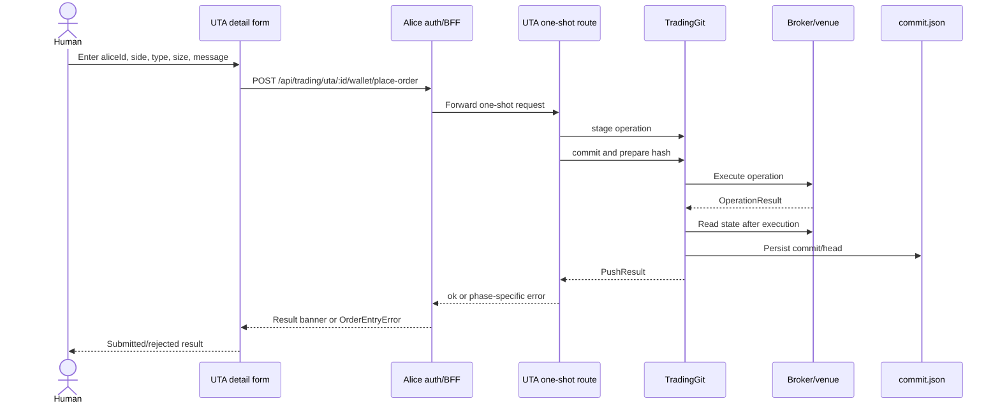
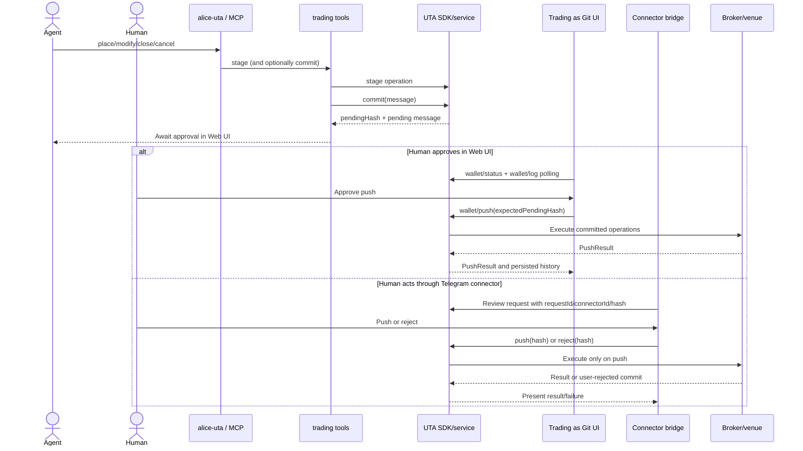
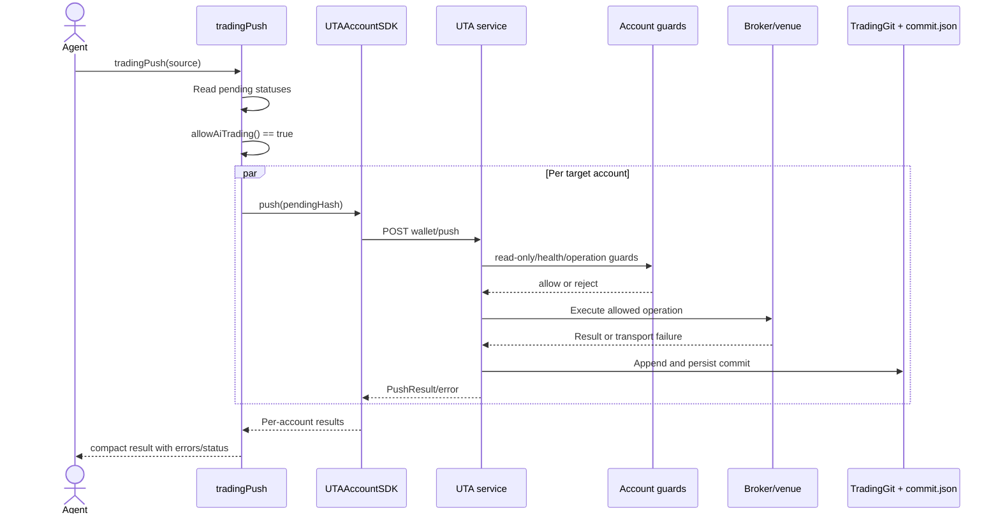
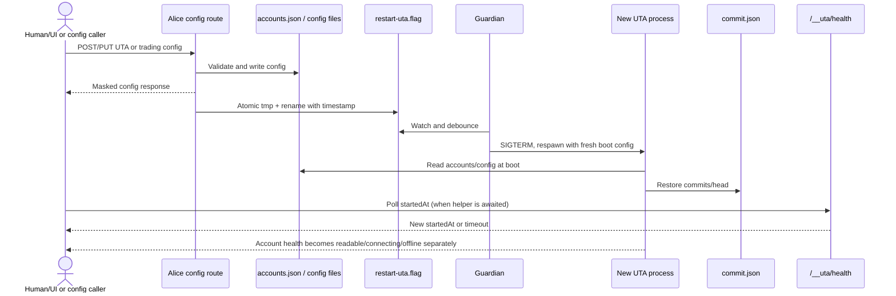
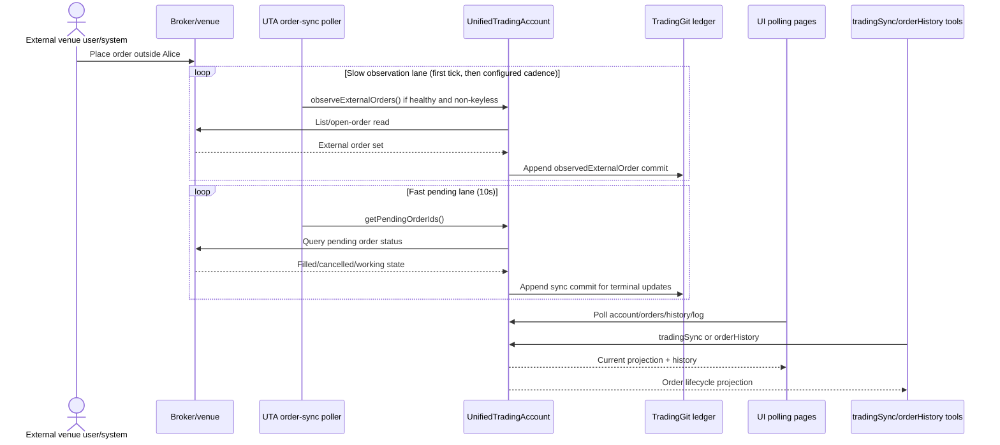

# W1 interaction audit — current UTA consumers

## Decision questions answered

| Decision question | Answer | Evidence |
|---|---|---|
| (a) How does a human place an order in the UI? | **observed:** The UTA detail form sends a one-shot request that performs `stage → commit → push`; the venue write occurs in that request. The form is treated as the human approval, independently of `allowAiTrading`. | `ui/src/components/uta/OrderEntryDialog.tsx:141-193`; `ui/src/api/trading.ts:169-185`; `services/uta/src/domain/trading/order-entry.ts:19-23`; `services/uta/src/http/routes-trading.ts:588-606` |
| (b) How does an AI propose and a human approve? | **observed:** AI stage/commit produces an in-memory pending proposal and hash. The Web UI polls it and pushes/rejects with an expected-hash CAS; the connector bridge can also push/reject after a Telegram-side request. Neither path records the approving human in the UTA ledger. | `src/tool/trading.ts:779-870`; `ui/src/components/PushApprovalPanel.tsx:397-450`; `src/services/connector-client/uta-review.ts:150-217`; `services/uta/src/domain/trading/git/TradingGit.ts:61-68,241-249` |
| (c) What changes when `allowAiTrading` is true? | **observed:** `tradingPush` sends committed operations directly through the UTA SDK, per account in parallel, without Web UI approval. It still encounters the SDK read-only gate and UTA account mutation/health guards, but it bypasses the Alice BFF path gate because the tool uses the direct UTA client. | `src/tool/trading.ts:821-845`; `src/main.ts:144-160,248-255`; `src/services/uta-client/UTAAccountSDK.ts:285-303,398-401`; `services/uta/src/domain/trading/UnifiedTradingAccount.ts:793-803` |
| (d) What does config change → reconnect mean? | **observed:** Alice writes configuration, touches an atomic restart flag, and asks Guardian to respawn UTA. Several config routes return before reconnect completion; `startedAt` polling is available only to callers that await the restart helper. The new UTA restores committed history, not pending staging. | `src/services/uta-supervisor/restart-trigger.ts:1-11,53-81`; `src/webui/routes/trading-config.ts:243-249,286-300`; `services/uta/src/domain/trading/uta-manager.ts:61-79`; `services/uta/src/domain/trading/git-persistence.ts:27-48`; `services/uta/src/domain/trading/git/TradingGit.ts:61-68` |
| (e) What happens to an order placed outside Alice? | **observed:** A UTA-owned poller skips keyless/unhealthy accounts, observes external orders in a slow lane (first tick and then configured cadence), and syncs known pending order IDs in a 10-second fast lane. Observation and sync append synthetic commits; UI and agents discover them by polling projections. | `services/uta/src/main.ts:116-128`; `services/uta/src/domain/trading/order-sync-poller.ts:53-91`; `plans/uta-refactor/report/03-account-orders-positions.md:169-181,194-223`; `ui/src/pages/UTADetailPage.tsx:99-156` |
| (f) How does degraded health reach UI/agent consumers? | **observed:** UTA emits account-health journal entries and exposes health in the account-summary route, while `/__uta/health` reports process liveness only. UI polls summaries every 5 seconds and retains the last good snapshot on failure; the SDK account object itself reports optimistic healthy state. Agent reads get structured broker errors when the HTTP route is reached, but transport timeouts remain generic errors. | `services/uta/src/domain/trading/uta-manager.ts:161-168`; `services/uta/src/main.ts:147-152`; `ui/src/live/account-health.ts:8-47`; `src/services/uta-client/UTAAccountSDK.ts:88-125,241-247`; `services/uta/src/http/routes-trading.ts:98-125`; `packages/uta-protocol/src/client/UTAClient.ts:63-87` |
| Does a snapshot **GET** trigger sync? | **observed:** No. The GET route calls `getRecent → store.readRange` only. **observed:** Snapshot capture itself calls best-effort `uta.sync()`, so scheduled/post-push/post-reject capture can mutate Git history. This is a naming/interaction contradiction to resolve in the new contract. | GET: `services/uta/src/http/routes-trading.ts:639-651`; service: `services/uta/src/domain/trading/snapshot/service.ts:104-106`; capture: `services/uta/src/domain/trading/snapshot/builder.ts:20-31`; report: `plans/uta-refactor/report/06-snapshots-and-guards.md:89-105,222-224` |

The six diagrams below are compact renderings of the observed paths; recommendations are intentionally separated later.

## Observed facts

### Trust, identity, and transport baseline

- **observed:** Browser/API authentication is an Alice concern. The middleware validates a session cookie (or carefully constrained loopback trust) and checks a supplied Origin for mutating requests, then places the session on Alice's context. `src/webui/middleware/auth.ts:75-117`.
- **observed:** The trading BFF forwards only a small header allow-list (`accept`, content headers, user agent, cache headers, and `x-request-id`). It does not forward the browser cookie/session or a principal header; UTA v1 trusts the loopback host rather than request authentication. `src/webui/routes/trading-proxy.ts:1-12,29-34,138-148`.
- **observed:** Alice's CLI gateway can resolve `x-openalice-run` / `x-openalice-session` to an authoritative workspace origin, but this is provenance on the Alice side. It appends a `trade-decision` record only for a successful Workspace CLI/MCP invocation that contains a UTA commit hash. `src/server/cli.ts:300-371`; `src/server/trade-provenance.ts:41-63`.
- **observed:** The protocol `GitCommit` contains hash, parent, message, operations, results, stateAfter, timestamp, and optional round, while `TradingGit` stores staging operations, pending message/hash, inflight state, commits, and HEAD. There is no actor, approver, request ID, TTL, or consumer origin in that state. `packages/uta-protocol/src/types/git.ts:91-102,133-139`; `services/uta/src/domain/trading/git/TradingGit.ts:61-68`.
- **observed:** Push/reject have an expected-pending-hash compare-and-set and an inflight flag, but the hash is generated from message, operations, timestamp, and parent hash; no caller-supplied business idempotency key is accepted. `services/uta/src/domain/trading/git/TradingGit.ts:94-117,119-126,241-249`.
- **observed:** The low-level SDK times out requests after 15 seconds and turns non-2xx responses into `UTAHttpError`; an abort has no explicit `unknown` result. `packages/uta-protocol/src/client/UTAClient.ts:37-45,48-87`.
- **observed:** Query routes translate `BrokerError` into `{error, code, transient}` with 503 for non-permanent errors and 500 for permanent errors, but one-shot push failures are reduced to `{ok:false, phase:'push', error:string}`. `services/uta/src/http/routes-trading.ts:98-125`; `services/uta/src/domain/trading/order-entry.ts:29-33,44-73`.

### (a) Human UI order



- **observed:** The UI requires a contract, order size, and commit message; it sends decimal-like values as strings and calls the one-shot `placeOrder` API. `ui/src/components/uta/OrderEntryDialog.tsx:141-181`.
- **observed:** The server validates the body, stages the operation, commits it, and pushes it. A stage/commit/push failure is returned with phase information; a successful result is the full `PushResult`. `services/uta/src/http/routes-trading.ts:594-606`; `services/uta/src/domain/trading/order-entry.ts:29-73`.
- **observed:** UI readiness is stricter than the endpoint: `canTrade` checks account enabled/read-only state, broker-pack readiness, trading mode, current health, reachability, tier, and connection/recovery flags. `ui/src/hooks/useBrokerPackReadiness.ts:64-109`.
- **observed:** The BFF's read-only gate recognizes `/wallet/place-order` as a venue mutation and returns 403 in readonly mode; UTA additionally refuses read-only, disabled, keyless, or offline mutation. `src/webui/routes/trading-proxy.ts:115-129,193-205`; `services/uta/src/domain/trading/UnifiedTradingAccount.ts:549-569,693-706,793-800`.
- **observed:** The one-shot domain function explicitly treats a complete user form as manual approval and does not consult the AI approval gate. `services/uta/src/domain/trading/order-entry.ts:19-23`.
- **observed:** The browser has an authenticated Alice session when required, but the downstream UTA request has host trust only; the form body has no actor, approval ID, or idempotency key. `src/webui/middleware/auth.ts:87-117`; `src/webui/routes/trading-proxy.ts:29-34`; `ui/src/components/uta/OrderEntryDialog.tsx:167-180`.
- **inferred:** Retrying a timed-out one-shot request cannot be assumed safe: each call stages/commits a new timestamp-derived hash and can reach the venue again; the current contract has no remote read-by-id reconciliation step for an ambiguous push.
- **observed:** `TradingGit` reads broker state after all operations and only then appends/persists the commit. A broker write or successful commit followed by a `getGitState`/persistence failure can separate venue side effect from local history. `services/uta/src/domain/trading/git/TradingGit.ts:141-179`; `plans/uta-refactor/report/05-staging-approval-ledger.md:108-135`.
- **observed:** One-shot executes the three phases sequentially in one request, while `TradingGit` rejects overlapping push/reject writes with its `inflightWrite` guard; there is no caller-visible transaction or idempotency boundary around the whole HTTP request. `services/uta/src/domain/trading/order-entry.ts:44-73`; `services/uta/src/domain/trading/git/TradingGit.ts:119-126,241-249`.


### (b) AI proposal plus human approval (Web UI or Telegram connector)



- **observed:** `tradingPush` defaults to a non-executing response that tells the agent to ask for Web UI approval; `tradingCommit` is explicitly non-executing. `src/tool/trading.ts:779-803,821-831`.
- **observed:** The approval panel polls every 3 seconds, captures the currently displayed `pendingHash`, and sends it on push or reject. Its result banner shows counts and rejected entry error strings, but no actor, approval timestamp, or structured authorization receipt. `ui/src/components/PushApprovalPanel.tsx:397-450,887-905,1088-1105`.
- **observed:** Push/reject routes reject missing or changed expected hashes with 409 codes, then delegate to UTA. A repeat after the pending state is cleared becomes “Nothing to push/reject.” `services/uta/src/http/routes-trading.ts:475-526`; `services/uta/src/domain/trading/git/TradingGit.ts:187-238,241-249`.
- **observed:** Connector action requests carry `requestId`, `connectorId`, `createdAt`, action, and optional UTA/hash; push/reject require both UTA ID and hash. The connector request TTL is 60 seconds and is checked against `createdAt`. `packages/connector-protocol/src/types.ts:230-242,282-310`.
- **observed:** The connector bridge runs on a 1.5-second loop, uses 5-second claim/ack/release calls and 15-second presentation calls, and `uta-review` checks expiry, mode, pending state, operation count, readonly policy, then calls `uta.push` or `uta.reject`. `src/services/connector-client/action-bridge.ts:46-92`; `src/services/connector-client/uta-review.ts:150-217`.
- **observed:** The connector contract identifies the request and connector, not the Telegram human who approved it; `uta-review` calls `push` with only the pending hash. `packages/connector-protocol/src/types.ts:294-310`; `src/services/connector-client/uta-review.ts:190-207`.
- **observed:** AI provenance can identify the Workspace Session that created a commit when the CLI headers are present, but that provenance is an Alice-side `trade-decision` artifact; the UTA commit itself still has no actor or approver. `src/server/cli.ts:300-371`; `src/server/trade-provenance.ts:41-63`; `services/uta/src/domain/trading/git/TradingGit.ts:61-68`.
- **inferred:** The 60-second connector TTL protects transport work, not the pending proposal: a proposal can remain in UTA memory after the connector request expires, and the Web UI can approve it later. There is no pending proposal `expiresAt` in the UTA state.
- **observed:** A successful push persists a commit after venue execution, and post-push snapshot work is fire-and-forget. `services/uta/src/domain/trading/git/TradingGit.ts:157-184`; `services/uta/src/domain/trading/UnifiedTradingAccount.ts:793-803`.
- **inferred:** An AI that staged a proposal does not receive a durable callback when a separate human later pushes or rejects it; it must poll order history/log/status. The current connector `presentUta` result goes to the connector, not to the originating AI Session.

### (c) `allowAiTrading` direct push



- **observed:** The tool performs a status pass, finds committed pending operations, checks the live `allowAiTrading` getter, and then pushes each pending account with `Promise.all`; each account failure is returned separately. `src/tool/trading.ts:807-845`.
- **observed:** The setting defaults false, is described as a master switch for AI-initiated execution, and is read live without an Alice restart. `src/core/config.ts:242-249`; `src/main.ts:248-255`.
- **observed:** The tool path is direct SDK-to-UTA: Alice constructs `createUTAClient({baseUrl})` and injects a dynamic readonly reason into `UTAManagerSDK`. The BFF's browser-only path gate is not on this call path. `src/main.ts:143-160`; `src/services/uta-client/UTAManagerSDK.ts:32-49`; `src/services/uta-client/UTAAccountSDK.ts:285-303,398-401`.
- **observed:** UTA still blocks read-only/keyless/disabled/offline venue mutation and applies the operation guard dispatcher before broker calls. `services/uta/src/domain/trading/UnifiedTradingAccount.ts:180-203,549-569,793-800`.
- **observed:** Compaction preserves operation status, order IDs, fill data, `error`, reject reason, and warning when present. `src/tool/trading-compact.ts:145-171`; `src/tool/trading.ts:833-845`.
- **inferred:** `allowAiTrading` removes only the human-approval stop; it is not a complete authorization record. The result has no stable actor/intent ID, and UTA cannot distinguish an AI-authorized push from a connector or UI push once they reach the same `wallet/push` method.
- **observed:** Direct AI push has no caller-supplied idempotency key and uses the same pending hash CAS as human push. Per-account parallelism can therefore produce partial success across accounts, while a retry has no provider read-by-key contract. `src/tool/trading.ts:833-845`; `services/uta/src/domain/trading/git/TradingGit.ts:241-249`; `plans/uta-refactor/report/05-staging-approval-ledger.md:209-219`.
- **inferred:** A guard refusal can be visible as an error string in a direct push result, but the default AI path returns only “manual approval” plus pending operations and has no later callback carrying the human execution result. Therefore the originating agent cannot reliably learn why a human-approved push was refused without an additional read.

### (d) Config change → restart flag → reconnect



- **observed:** The restart helper reads old `startedAt`, writes the flag through `.tmp` plus rename, waits up to 20 seconds, and considers readiness established only when `startedAt` changes. `src/services/uta-supervisor/restart-trigger.ts:1-11,53-81`.
- **observed:** POST/PUT UTA config writes `accounts.json`, calls `notifyUTAReload()`, and invokes `ctx.utaManager.reconnectUTA(id).catch(() => {})` without awaiting the result. PUT also removes/reconnects on enabled changes. `src/webui/routes/trading-config.ts:196-249,264-303`.
- **observed:** The SDK's `reconnectUTA(id)` cannot reconnect only that account over HTTP; it triggers a whole UTA-process restart and waits for the restart helper result. `src/services/uta-client/UTAManagerSDK.ts:174-200`.
- **observed:** UTA boot initializes each configured account, loads Git state, and persists subsequent commits through `commit.json`; the staging area, pending message/hash, and inflight flag are fields on the new in-memory `TradingGit` instance. `services/uta/src/domain/trading/uta-manager.ts:61-79`; `services/uta/src/domain/trading/git-persistence.ts:27-48`; `services/uta/src/domain/trading/git/TradingGit.ts:61-68`.
- **inferred:** A staged-but-uncommitted proposal is lost across process restart, and a committed-but-unpushed pending proposal is also not restored because persistence contains commits/head rather than pending staging state. This makes config edits and reconnects a proposal lifecycle event even though the config response does not say so.
- **observed:** The process health endpoint always returns `ok:true`, `startedAt`, and a count of registered accounts; it does not include account health/readiness. `services/uta/src/main.ts:147-152`.
- **inferred:** The config route's fire-and-forget restart calls can expose “saved” while the old UTA is still serving, and `notifyUTAReload` plus `reconnectUTA` create two trigger paths whose coalescing is not expressed at this boundary. `src/webui/routes/trading-config.ts:243-249,286-300`; `src/services/uta-supervisor/restart-trigger.ts:53-81`.
- **observed:** The config request is authenticated at Alice's outer middleware when required, but the restart flag contains only an ISO timestamp and the UTA process receives no browser session, actor, or request identity. `src/webui/middleware/auth.ts:87-117`; `src/webui/routes/trading-proxy.ts:29-34`; `src/services/uta-supervisor/restart-trigger.ts:63-70`.
- **observed:** The UTA process receives fresh configuration only at boot; the Guardian watches the flag and performs the process restart, rather than an in-process account reconnect. `services/uta/src/main.ts:67-88`; `scripts/guardian/prod.mjs:483-535,569-593`.


### (e) External venue order → sync → UI/agent projection



- **observed:** The poller uses a re-entrancy guard, iterates healthy non-keyless accounts, runs the slow observation pass on the first eligible tick and configured cadence, then skips the fast lane when no pending IDs exist. Errors are logged and do not stop other accounts. `services/uta/src/domain/trading/order-sync-poller.ts:53-91`.
- **observed:** Production starts the poller with a 10-second pending lane and `trading.observeExternalOrdersEvery` (default 15 minutes, or off). The returned poller handle is not retained by `main.ts`. `services/uta/src/main.ts:116-128`; `plans/uta-refactor/report/01-process-lifecycle.md:403-405`.
- **observed:** `sync()` queries pending IDs, obtains broker statuses, reads state, and appends a `[sync]` commit. External observation similarly records synthetic history. `services/uta/src/domain/trading/UnifiedTradingAccount.ts:843-915,955-977`; `plans/uta-refactor/report/03-account-orders-positions.md:169-181,194-223`.
- **observed:** Synthetic sync/reconcile/observation paths do not go through `TradingGit.executeOperation`'s normal guard dispatcher or the push approval phase. `plans/uta-refactor/report/06-snapshots-and-guards.md:301-309`; `services/uta/src/domain/trading/git/TradingGit.ts:260-270`.
- **observed:** The UTA detail page polls live account/positions/orders every 15 seconds and snapshots every 60 seconds; the UI API exposes order-history and trade-history as GET projections. `ui/src/pages/UTADetailPage.tsx:99-156`; `services/uta/src/http/routes-trading.ts:421-437`.
- **observed:** The external venue actor is not part of the observed-order request or Git commit shape. The projection can label an order as external, but the current UTA ledger has no authenticated venue principal or originating request identity. `src/tool/trading.ts:872-889`; `services/uta/src/domain/trading/git/TradingGit.ts:61-68`.
- **inferred:** Repeated polling is an approximate dedupe mechanism based on known provider/order IDs and local history, not a declared provider idempotency key. An observation gap or a timeout has no durable “unknown observation” state for an agent to reconcile.

### (f) Health degradation → UI/agent visibility

```mermaid
sequenceDiagram
    participant Venue as Broker/venue
    participant UTA as UnifiedTradingAccount
    participant Journal as Alice/UTA event log
    participant Process as /__uta/health
    participant Summary as /api/trading/uta summaries
    participant UI as UI health/policy stores
    participant Agent as UTA SDK + trading tools
    Venue--xUTA: Read/write failure
    UTA->>Journal: account.health with status/reach/recovery fields
    UTA-->>Summary: Account summary health
    UTA-->>Process: Process still reports ok:true if alive
    UI->>Summary: Poll every 5s
    Summary-->>UI: Current health or transport failure
    UI->>UI: Preserve last good snapshot; derive canTrade=false when unhealthy
    Agent->>UTA: Read account/positions/orders
    UTA-->>Agent: 503 structured BrokerError or generic timeout
    Agent->>UTA: Push attempt
    UTA-->>Agent: Health/read-only/config refusal before venue mutation
```

- **observed:** UTA health transitions and settled health snapshots are emitted as `account.health` event-log entries, while `UTAManager.listUTAs()` includes `getHealthInfo()` in account summaries. `services/uta/src/domain/trading/uta-manager.ts:61-77,161-168`; `services/uta/src/domain/trading/UnifiedTradingAccount.ts:330-366`.
- **observed:** `/__uta/health` is unconditional process liveness (`ok`, `startedAt`, registered count); Alice BFF status therefore can report `available:true` while an individual broker account is degraded/offline. `services/uta/src/main.ts:147-152`; `src/webui/routes/trading-proxy.ts:78-112`.
- **observed:** The shared UI account-health store polls summaries every 5 seconds, marks data stale after 15 seconds, and intentionally preserves the prior map on a transient fetch failure. `ui/src/live/account-health.ts:18-47`.
- **observed:** UI account policy fails closed for disabled, read-only, non-pro, connecting, recovering, unhealthy, unreadable, or data-tier accounts. `ui/src/hooks/useBrokerPackReadiness.ts:75-108`.
- **observed:** `UTAAccountSDK.health` always returns `'healthy'`, `disabled` always returns false, `getHealthInfo()` returns a minimal healthy/readable/trading shape, and `UTAManagerSDK.accountFromSummary()` discards the summary health when constructing an account object. `src/services/uta-client/UTAAccountSDK.ts:88-125`; `src/services/uta-client/UTAManagerSDK.ts:241-247`.
- **observed:** Account query routes return a health-aware 503 for known offline state and structured `{error,code,transient}` for broker failures. The AI tool layer maps broker errors into `{source,error,code,transient,hint}` and separates CONNECTING markers. `services/uta/src/http/routes-trading.ts:98-125`; `src/tool/trading.ts:35-83`.
- **observed:** A known offline account query calls `nudgeRecovery()` before returning 503, but a transport timeout at the Alice SDK boundary is only an aborted request and does not become a durable health/unknown event. `services/uta/src/http/routes-trading.ts:104-125`; `packages/uta-protocol/src/client/UTAClient.ts:63-87`.
- **inferred:** Health information has two incompatible freshness/authority paths: the UI account summary is authoritative enough to gate a button, while the SDK account object presented to tools is optimistic. An agent can therefore receive stale/healthy metadata before a subsequent operation reports a failure.
- **observed:** There is no UTA HTTP/protocol event stream or SDK subscription in the scoped consumer paths. A scoped search found no `WebSocket`/`SSE`/`EventSource` implementation in the UTA HTTP/protocol or Alice UTA-client paths; the only UTA-side match was a Longbridge broker comment about an internal WebSocket pool, not a downstream consumer API. Current UI, connector, and poller consumers use timers instead. `ui/src/live/account-health.ts:39-47`; `src/services/connector-client/action-bridge.ts:46-92`; `services/uta/src/domain/trading/order-sync-poller.ts:98-104`.
- **observed:** The UI has independent timers rather than one account/event freshness source: account health 5s, approval panel 3s, pending badge 15s, mode 15s, Trading settings service status 15s/equity 60s, Portfolio 30s, and UTA-detail live/snapshot/clock 15s/60s/60s. `ui/src/live/account-health.ts:39-47`; `ui/src/components/PushApprovalPanel.tsx:397-400`; `ui/src/live/trading-push.ts:66-73`; `ui/src/live/trading-mode.ts:74-81`; `ui/src/pages/TradingPage.tsx:352-402`; `ui/src/pages/PortfolioPage.tsx:231-238`; `ui/src/pages/UTADetailPage.tsx:138-172`.


## Defect table

| ID | Behavioral defect (observed) | Evidence (observed) | Consequence (inferred) |
|---|---|---|---|
| D1 | No UTA actor/approver/request identity | `GitCommit` has no actor/approval fields (`packages/uta-protocol/src/types/git.ts:91-102`), `TradingGit` stores only staging/pending/commits/head (`services/uta/src/domain/trading/git/TradingGit.ts:61-68`), and the BFF strips session identity (`src/webui/routes/trading-proxy.ts:29-34`). | UI, Telegram, AI direct push, and external venue actions are not attributable in one ledger. |
| D2 | Hash CAS is not business idempotency; ambiguous writes have no `unknown` state | Hash uses timestamp (`TradingGit.ts:94-117`); SDK timeout is generic abort (`packages/uta-protocol/src/client/UTAClient.ts:63-87`); push persists after venue call (`TradingGit.ts:141-179`). | Blind retry can duplicate a venue mutation; agents cannot choose reconcile versus retry from a typed result. |
| D3 | Approval expiry is transport-only | Connector request TTL is 60 seconds (`packages/connector-protocol/src/types.ts:282-310`), but pending UTA state is only message/hash in memory (`TradingGit.ts:61-68`). | Expired Telegram work can leave a live proposal; later UI approval has no shared authorization expiry. |
| D4 | Human one-shot bypasses the AI policy without an explicit authorization artifact | One-shot calls push because the full form is treated as approval (`services/uta/src/domain/trading/order-entry.ts:19-23`); `allowAiTrading` is checked only in the AI tool (`src/tool/trading.ts:821-845`). | Route semantics cannot distinguish “human authorized this exact intent” from a generic execution call at the UTA boundary. |
| D5 | Process liveness is exposed as trading availability | `/__uta/health` always returns `ok:true` and account count (`services/uta/src/main.ts:147-152`); BFF maps that to `available:true` (`src/webui/routes/trading-proxy.ts:78-98`). | UI/agent can see a green service while the target account is offline or read-only. |
| D6 | SDK account health/capability methods are optimistic/no-op | `UTAAccountSDK` hardcodes healthy and empty capabilities (`src/services/uta-client/UTAAccountSDK.ts:88-125`); manager drops summary health (`UTAManagerSDK.ts:241-247`). | Consumers cannot make a reliable account-level readiness decision from the typed SDK object. |
| D7 | Rejection reason is not a durable, typed callback to the originating agent | Direct compaction preserves only string error/reject fields (`src/tool/trading-compact.ts:145-171`); UI banner renders counts/string errors (`PushApprovalPanel.tsx:1088-1105`); default AI path returns manual-approval text (`trading.ts:821-831`). | An agent that proposed work cannot learn a later human push's guard/provider reason without polling unrelated history. |
| D14 | UI freshness is split across independent polling cadences | The observed timers span 3s, 5s, 15s, 30s, and 60s across health, approval, badge, mode, settings, portfolio, detail, and snapshot consumers (`account-health.ts:39-47`; `PushApprovalPanel.tsx:397-400`; `TradingPage.tsx:352-402`; `PortfolioPage.tsx:231-238`; `UTADetailPage.tsx:138-172`). | The same proposal/account can appear at different ages; there is no shared backoff, cursor, or visibility-aware subscription contract. |
| D8 | Config routes acknowledge before restart/readiness and pending proposals are lost on restart | Config routes call reload/reconnect with `.catch(() => {})` (`src/webui/routes/trading-config.ts:243-249,286-300`); restart helper has a 20-second wait (`restart-trigger.ts:53-81`); persisted state loads commits/head only (`git-persistence.ts:27-48`). | A user sees saved config while old connections remain; an outstanding proposal can disappear during reconnect. |
| D9 | Synthetic observation/sync bypasses normal guard/write path | Guard coverage table excludes sync, reconcile, and external observation (`plans/uta-refactor/report/06-snapshots-and-guards.md:301-309`); synthetic methods append commits directly (`UnifiedTradingAccount.ts:843-915,955-977`). | Local rules and write serialization do not uniformly cover state changes caused by venue observations. |
| D10 | Polling is the only consumer notification path | No UTA HTTP/protocol event-stream or Alice UTA-client subscription implementation was found; the only UTA-side WebSocket match is a Longbridge internal-pool comment, while UI health/push/detail stores and connector bridge use intervals (`account-health.ts:39-47`; `PushApprovalPanel.tsx:397-400`; `action-bridge.ts:46-92`). | Watch-to-modify and news-to-Issue fan-out cannot consume a durable event/cursor stream today. |
| D11 | Snapshot naming conflates read projection and capture side effects | GET uses `getRecent → readRange` (`routes-trading.ts:642-651`), but builder calls `uta.sync()` (`snapshot/builder.ts:20-31`). | A contract that calls “snapshot GET” a sync operation would cause consumers to mistake a read for a ledger mutation. |
| D12 | Snapshot/post-push capture is asynchronous and can be absent at boot | Manager captures hooks at account construction (`uta-manager.ts:61-77`), while `main.ts` sets hooks after account init (`main.ts:76-108`); push hook is fire-and-forget (`UnifiedTradingAccount.ts:801-803`). | UI/history may not show the expected post-push evidence, and consumers cannot treat the push response as snapshot-complete. |
| D13 | Documentation/comments disagree with reachable execution paths | Route comment says “only humans can push” (`services/uta/src/http/routes-trading.ts:502-503`), while AI direct push and connector push are implemented (`src/tool/trading.ts:821-845`; `src/services/connector-client/uta-review.ts:190-207`). | Static agent guidance cannot express the actual authority matrix. |

### What an agent cannot reliably get today

- **inferred need:** A single typed principal/origin record spanning Alice Session/Run, human UI session, Telegram connector user, scheduled worker, and external venue identity. Current evidence: D1 and CLI-only provenance (`src/server/cli.ts:341-363`).
- **inferred need:** An intent/proposal ID plus provider idempotency key, and a read-by-key reconciliation capability. Current evidence: timestamp-derived hash and generic timeout (`TradingGit.ts:94-117`; `UTAClient.ts:63-87`).
- **inferred need:** Distinct `validated`, `awaiting-authorization`, `authorized`, `submitted/receipt`, `rejected`, `unknown`, and `observed/final` statuses with stable error codes and retry authority. Current evidence: one-shot phase/string errors and mixed route bodies (`order-entry.ts:29-33`; `routes-trading.ts:98-125`).
- **inferred need:** Pending proposal metadata: creator, creation time, expiration, exact scope, expected account/version, required approver role, and a durable list endpoint. Current evidence: status has pending message/hash only (`TradingGit.ts:61-68`; `routes-trading.ts:447-450`).
- **inferred need:** A completion callback/event correlated to the originating Issue/Session after a different consumer approves/rejects. Current evidence: Web UI and connector present results to themselves; no UTA event stream was found (`PushApprovalPanel.tsx:412-450`; `uta-review.ts:190-217`).
- **inferred need:** Freshness and authority metadata (`asOf`, provider observation time, cursor) on account/order/health projections. Current evidence: timer consumers use local cadence/staleness while SDK reads return bare domain shapes (`account-health.ts:39-47`; `UTAAccountSDK.ts:88-125`).
- **inferred need:** Capability-specific authorization for watch-to-order-modify and news-to-Issue callbacks, including whether a downstream effect may execute, propose, or only notify. Current evidence: no UTA subscription/event routes were found and current write endpoints converge on `wallet/push`.

### Current UI and adjacent consumer surfaces

| Surface | Caller and visible behavior | Cadence / mutation | Evidence |
|---|---|---|---|
| Trading settings (`category:'trading'`) | **observed:** Account/config CRUD, mode, external-order observation setting, health badges, reconnect/edit controls. | **observed:** Status about every 15 seconds; config save can trigger restart asynchronously. | `ui/src/tabs/registry.tsx:286-325`; `ui/src/pages/TradingPage.tsx:332-411,499-547`; `src/webui/routes/trading-config.ts:243-300` |
| Portfolio (`/portfolio`) | **observed:** Aggregates live account/positions/wallet history and equity curve; snapshot point click loads a snapshot. | **observed:** Main refresh every 30 seconds; no venue write. | `ui/src/tabs/registry.tsx:119-138`; `ui/src/pages/PortfolioPage.tsx:199-238,258-268` |
| Trading as Git (`/trading-as-git`) | **observed:** Lists staged/pending/history items and exposes approve-push/reject actions. | **observed:** Panel polls every 3 seconds; push/reject use expected hash. | `ui/src/tabs/registry.tsx:119-138`; `ui/src/components/PushApprovalPanel.tsx:397-450,926-965` |
| UTA detail (`/settings/uta/:id`) | **observed:** Reads account/positions/orders, opens order entry, and supports close/cancel actions. | **observed:** Live account data every 15 seconds; snapshots and market clock every 60 seconds; order form is one-shot venue mutation. | `ui/src/tabs/registry.tsx:327-335`; `ui/src/pages/UTADetailPage.tsx:99-185,243-411`; `ui/src/components/uta/OrderEntryDialog.tsx:163-193` |
| Activity bar / portfolio sidebar | **observed:** Shows a pending-push attention badge and links to Trading as Git/UTA details. | **observed:** Shared push count polls every 15 seconds. | `ui/src/components/ActivityBar.tsx:202-212`; `ui/src/components/PortfolioSidebar.tsx:14-17,33-90`; `ui/src/live/trading-push.ts:8-24,66-73` |
| Dev → Simulator | **observed:** Manual MockBroker control console for marks, positions, pending orders, fills, and event log; not a live venue surface. | **observed:** Simulator page is reachable under Dev and uses in-memory state. | `ui/src/pages/DevPage.tsx:49-67`; `ui/src/pages/SimulatorPage.tsx:1-19,34-75` |
| Telegram connector | **observed:** Review/push/reject request bridge with bounded account/operation counts and a 60-second request TTL. | **observed:** Alice bridge polls connector actions every 1.5 seconds; UTA result is presented back to connector. | `src/services/connector-client/action-bridge.ts:46-92`; `src/services/connector-client/uta-review.ts:150-217`; `packages/connector-protocol/src/types.ts:282-310` |
| `alice-uta` CLI / MCP | **observed:** Global account, order, position, git, sync, and simulator command groups map to the same trading tools. | **observed:** Stage/commit/push semantics are exposed; CLI provenance is conditional on workspace run/session headers. | `src/server/cli-commands.ts:212-270`; `src/server/cli.ts:300-371` |

## Recommendations

The following are recommendations for the new UTA contract, not claims that the current implementation already provides them.

### Target interaction model

- **recommendation (inferred):** Make the durable lifecycle explicit: `proposal → authorization → execution attempt → provider receipt → provider observation → consumer projection`. A query must not hide a local ledger write; a receipt must not be presented as final fill truth.
- **recommendation (inferred):** Give every interaction a typed `Principal` (who may authorize), `Origin` (Issue/Session/Run/connector/UI), `IntentId`, `ProposalId`, `AuthorizationId`, `IdempotencyKey`, and `ConsumerId`. Persist these with append-only intent/attempt/receipt/observation entries.
- **recommendation (inferred):** Keep one serialized write entry per UTA. Reads remain separate and explicitly read-only; reconciliation/sync writes are typed ledger effects routed through the same writer rather than direct synthetic append methods.
- **recommendation (inferred):** Return `Unknown` after an ambiguous provider timeout. Require a provider-declared read-by-key or observation capability before retrying; never reinterpret a network timeout as “safe to execute again.”
- **recommendation (inferred):** Model account readiness as separate dimensions: process liveness, transport connected, account readable, account writable, capability available, and observation freshness. Expose the same typed snapshot to UI, agent, connector, and scheduler consumers.
- **recommendation (inferred):** Replace hash-only approval with a versioned authorization scope containing proposal ID, account, operations, actor, expiry, and policy decision. Retain expected-hash as a compatibility concurrency token, not as the identity of the approval.
- **recommendation (inferred):** Add a durable event/outbox stream with per-consumer cursors and replay. WebSocket/SSE is a delivery optimization; the durable cursor and event identity are the contract. Use it for health/order observations, proposal state, execution receipts, and downstream callback requests.
- **recommendation (inferred):** Treat watch-to-order-modify as a new proposal or explicitly policy-authorized effect, correlated to the watch event and source observation. It must not silently reuse an unrelated human approval.
- **recommendation (inferred):** Treat news-subscription-to-Issue as an outbox delivery with Issue/Session origin and delivery receipt. A callback failure should be observable and retryable independently of a broker write.

### Role matrix for a seamless replacement

| Consumer/role | Keep | Replace or add |
|---|---|---|
| Human UI | Keep existing navigation, UTA detail, Trading as Git, portfolio projections, and decimal/string request discipline. | Replace direct one-shot venue execution with create-proposal then explicit authorize/execute; show actor, expiry, receipt vs observation, unknown/reconcile, and guard/provider codes. |
| Tool-using AI | Keep `alice-uta` names, `aliceId`, contract search, stage/commit vocabulary, and per-account result aggregation. | Default to proposal creation and status; make `allowAiTrading` a typed policy/role grant that records principal and scope rather than a global boolean; return durable completion events. |
| Issue-driven agent | Keep Issue/Session provenance and `inbox_push`/Issue APIs. | Correlate proposal, authorization request, receipt, and observation to `issueId`, `runId`, and Session; receive replayable callback events rather than polling unrelated history. |
| Telegram connector | Keep bounded review/push/reject transport and connector request IDs as compatibility inputs. | Authenticate/record the human approver, move expiry to the authorization/proposal contract, and return a durable authorization receipt to UTA and originating Session. |
| CLI | Keep `alice-uta` command groups and live manifest discovery. | Add explicit proposal/status/authorize/reconcile commands; make actor and origin server-resolved and require an explicit authorization capability for direct execution. |
| Scheduled workers | Keep scheduled monitoring and external-order observation intent. | Default to read/reconcile/propose only; authorize only under an explicit schedule policy, with an audit principal and bounded capability. |
| UTA core | Keep provider-indexed `aliceId`, upstream truth, account capability declarations, and Guardian lifecycle integration. | Own serialized write effects, intent/attempt/receipt/observation ledger, provider idempotency/read-by-key declarations, readiness, event cursors, and config-vs-ledger separation. |

### Minimum contract cuts for implementation-guiding types

- **recommendation (inferred):** Define separate read-only records for `AccountReadiness`, `ProposalView`, `AuthorizationView`, `ExecutionReceipt`, `ObservationView`, and `DeliveryReceipt`; do not overload `PushResult` to mean all of them.
- **recommendation (inferred):** Define exhaustive error variants for validation, policy/guard rejection, provider rejection, transport failure, unknown outcome, stale proposal, expired authorization, unavailable capability, and delivery failure. Preserve provider error extensions without reducing the stable code to a string.
- **recommendation (inferred):** Define capability declarations as type-plus-handler pairs: `Place`, `Modify`, `Cancel`, `ReadByIdempotencyKey`, `ObserveOrders`, `SubscribeMarket`, `EmitCallback`, and so on. A consumer must be able to see “unsupported” rather than infer it from an empty array or optimistic SDK method.
- **recommendation (inferred):** Make provider and account scope explicit in every write/read key. A provider-specific OpenAPI projection may extend the shared base, but event/receipt identity must remain provider-indexed and stable across retries.
- **recommendation (inferred):** Preserve compatibility adapters for current HTTP/CLI routes during migration, but have them translate into the new lifecycle. The one-shot route should produce a proposal plus immediate human authorization only when the caller supplies a human principal; it should not remain an unclassified universal push primitive.

## Unavailable / contradictions

- **observed limitation:** The repository contains the Alice-side connector bridge/review consumer and connector request schema, but not the external Telegram producer or its human-authentication binding. The report therefore cannot identify the real Telegram approver principal. `src/services/connector-client/uta-review.ts:129-217`; `packages/connector-protocol/src/types.ts:294-310`.
- **observed limitation:** A scoped search found no UTA HTTP/protocol WebSocket/SSE subscription surface. Existing broker internals may use WebSocket-like transports, but their provider connection is not a downstream UTA consumer event contract. No conclusion about provider-specific streaming support is made here.
- **observed contradiction:** The route comment says “only humans can push,” while `allowAiTrading` directly pushes and the connector calls the same UTA push method. Treat the comment as stale guidance, not an authority rule. `services/uta/src/http/routes-trading.ts:502-503`; `src/tool/trading.ts:821-845`; `src/services/connector-client/uta-review.ts:190-207`.
- **observed contradiction:** `docs/uta-live-testing.md:129-137` describes HTTP push as standing in for a user click and AI tool push as deliberate refusal, while current configuration explicitly enables direct AI push. The effective runtime rule is the code path plus live `allowAiTrading`, not the older prose.
- **observed contradiction:** “Snapshot GET triggers sync” is false for the current GET route; snapshot **capture** calls sync. Any new API must name these as separate read and capture effects. `services/uta/src/http/routes-trading.ts:642-651`; `services/uta/src/domain/trading/snapshot/builder.ts:20-31`.
- **observed limitation:** This wave did not run browser automation, a live broker order, Telegram delivery, or a restart against production data. The report is source- and scoped-report evidence; runtime confirmation of provider-specific latency, duplicate side effects, and external callback delivery remains unavailable.
- **observed limitation:** The report does not decide TypeScript/Effect versus Rust/tokio/Pingora, provider OpenAPI projection rules, ledger storage engine, or market WebSocket multiplexing. Those are separate design questions; this report supplies the consumer identity, lifecycle, and event requirements they must satisfy.
