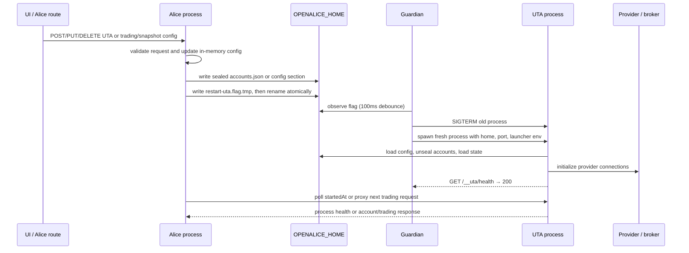

# W1 — UTA lifecycle, build/package, and configuration topology

## Decision questions answered

1. **Where does one UTA process run, and who owns it?**  
   **Observed — `docs/project-structure.md:20-58`, `scripts/guardian/dev.ts:134-151,265-287`, `scripts/guardian/prod.mjs:597-696`, `apps/desktop/src/main.ts:750-765,897-986`.** There is at most one UTA child per AliceProject/`OPENALICE_HOME` (none in lite/Nano mode). The dev Guardian launches a source `tsx` child; the production Guardian launches the built service (or a provider-specific role); Electron launches the built service in Electron's Node mode; Docker launches the production Guardian under `tini`; Bun re-enters one compiled executable under the private `uta` role. Alice is a separate HTTP client/BFF and is not the UTA process owner.

2. **What is the process-level drop-in contract?**  
   **Observed — `services/uta/src/main.ts:38-39,143-177`, `src/services/uta-supervisor/health.ts:9-42`, `src/services/uta-supervisor/restart-trigger.ts:1-11`.** The externally consumed process contract is a loopback HTTP service at the Guardian-injected UTA port, `GET /__uta/health` with `{ok, startedAt, utas}`, and the existing `/api/trading/*` plus `/api/simulator/*` HTTP routes. Config changes are not an in-process reload: Alice atomically writes `data/control/restart-uta.flag`, Guardian terminates and respawns UTA, and Alice observes a changed `startedAt`. Signals are `SIGTERM`/`SIGINT`; host supervisors supply bounded force-kill deadlines.

3. **What is the current build and packaging contract?**  
   **Observed — `services/uta/package.json:1-34`, `services/uta/tsup.config.ts:3-20`, `services/uta/tsconfig.json:2-20`, `pnpm-lock.yaml:503-547`.** The current artifact is an ESM `dist/uta.js`, built by tsup for ES2023 with source maps and no code splitting. Development uses `tsx`; production uses Node 22-compatible artifacts. The UTA bundle leaves `node_modules` and workspace packages external and uses the `openalice-source` condition. Electron and Docker explicitly package/copy this artifact; Bun uses a different self-role entry path.

4. **Who owns configuration and secrets, and how do edits reach UTA?**  
   **Observed — `src/core/config.ts:704-787`, `src/core/sealing.ts:1-20,63-136`, `src/core/paths.ts:4-18,34-57`, `src/webui/routes/trading-config.ts:196-329`, `src/services/uta-supervisor/restart-trigger.ts:53-81`.** Alice configuration routes are the normal account writer. `accounts.json` is validated and sealed as AES-256-GCM with an owner-only `sealing.key` beside (not inside) the portable `data/` tree. UTA reads the sealed account config at boot; Guardian also reads it to infer automatic mode. A POST/PUT/DELETE or trading/snapshot config update writes disk, then schedules the flag protocol. **Observed exception:** UTA boot purges ephemeral entries and rewrites `accounts.json` (`src/core/config.ts:811-821`), so the file is not literally single-writer today.

5. **What does “healthy” mean at each layer?**  
   **Observed — `services/uta/src/main.ts:147-152`, `scripts/guardian/prod.mjs:388-414,658-689`, `packages/guardian-runtime/src/runtime-status.ts:21-44`, `services/uta/src/domain/trading/UnifiedTradingAccount.ts:233-282`.** UTA process health means its HTTP route is live; Guardian health means the child/readiness probe state; account health means broker reachability and recovery state. `/__uta/health` does not aggregate account health. Docker’s image healthcheck probes Alice `/api/version`, not UTA (`Dockerfile:162-170`).

6. **Does the current event log provide a downstream event stream for Alice or UI?**  
   **Observed — `src/core/event-log.ts:1-10,19-30,48-88,106-162`, `services/uta/src/domain/trading/uta-manager.ts:61-77`, `services/uta/src/domain/trading/snapshot/service.ts:53-74`; scoped grep over `src`, `ui/src`, `services`, `packages`, `scripts`, and `docs`.** UTA appends `account.health`, `snapshot.skipped`, `snapshot.taken`, and `snapshot.error` records to its append-only JSONL event log. The scoped search found the event literals in UTA production code and event-log/snapshot tests, but no production Alice/UI reader or subscriber for the UTA `events.jsonl` stream. Thus news/order side-effect fan-out is a new design requirement, not an existing UTA event-consumer contract.

7. **What lifecycle choice is currently unresolved?**  
   **Observed — `scripts/guardian/dev.ts:367-410,425-454`, `scripts/guardian/prod.mjs:304-314,483-535`, `apps/desktop/src/main.ts:807-810,1197-1237`.** UTA is optional and non-critical. An unexpected UTA exit marks trading offline and leaves Alice running; none of the three hosts automatically retries a crashed UTA. A flag-triggered restart is supported, with host-specific watcher and grace-period differences. Whether the new service should add crash restart, aggregate account health into process readiness, or preserve whole-process versus account-level reconnect is a design decision, not an observed current guarantee.

## Observed facts

### 1. Host × spawn topology

| Host / launcher | UTA executable and argv | CWD, environment, and resources | Skip and readiness | Restart, crash, and shutdown | Evidence |
|---|---|---|---|---|---|
| **Dev Guardian (`pnpm dev`)** | **Observed — `package.json:13-16`, `scripts/guardian/dev.ts:265-283`.** Spawn command is `tsx`; args are `watch --clear-screen=false`, `--include services/uta/src`, `--include packages`, configured excludes, then `services/uta/src/main.ts` (or only the entry when hot reload is disabled). | **Observed — `scripts/guardian/dev.ts:249-272`, `scripts/guardian/shared.ts:229-265`.** Child inherits Guardian env, receives `OPENALICE_HOME`, `AQ_LAUNCHER_ROOT`, `OPENALICE_LAUNCHER=dev`, Guardian identity, `NODE_OPTIONS` with `--conditions=openalice-source`, and `OPENALICE_UTA_PORT`; logs are prefixed. **Inferred — `scripts/guardian/shared.ts:243-258`.** No child `cwd` is supplied, so it inherits the Guardian cwd; root `pnpm dev` normally starts that Guardian from the checkout root. | **Observed — `scripts/guardian/dev.ts:134-151,274-283`.** Nano product or resolved `lite` mode skips UTA. Otherwise Guardian probes `/__uta/health` for 15s and marks `ready` or `offline`; UTA is non-critical. | **Observed — `scripts/guardian/shared.ts:495-523`, `scripts/guardian/dev.ts:367-410,425-454`.** Flag restart uses SIGTERM, waits 8s, then SIGKILL and waits up to 5s, respawns the same spec, and probes for 15s. **Observed — `scripts/guardian/shared.ts:376-417`.** Unexpected non-critical exit does not cascade or auto-restart UTA. Global cascade sends SIGTERM and force-kills after the default 5s. | Current source |
| **Production Guardian / local CLI** | **Observed — `packages/cli/src/local-start.mjs:183-191`, `scripts/guardian/prod.mjs:280-301`, `scripts/guardian/runtime-process-spec.mjs:8-24`.** Local CLI starts `nodeBinary scripts/guardian/prod.mjs`; non-Bun UTA spec is `nodeBinary services/uta/dist/uta.js`. `runtimeProcessSpec` chooses the executable plus `--internal-role uta` only for Bun. | **Observed — `packages/cli/src/local-start.mjs:153-189`, `scripts/guardian/prod.mjs:53-76,288-300`.** Local Guardian cwd is `appDir`; its children have no separate cwd and therefore inherit it. UTA receives inherited/project env plus `OPENALICE_UTA_PORT`, `OPENALICE_HOME`, `AQ_LAUNCHER_ROOT`, launcher and Guardian identity. Built runtime resources are resolved from the selected app root. | **Observed — `scripts/guardian/prod.mjs:158-165,597-666`.** Mode is env > persisted config > account-presence auto; Nano/lite skips UTA. Otherwise it probes `/__uta/health` for 15s while Alice has its own 60s readiness gate. | **Observed — `scripts/guardian/prod.mjs:304-314,483-535,537-566,569-595`.** Unexpected UTA exit only sets `offline`; no retry/backoff. Flag restart is `fs.watch` with 100ms debounce, SIGTERM/8s then SIGKILL, respawn, and one 15s readiness attempt. Global Guardian shutdown gives children 5s before SIGKILL. **Observed — `scripts/guardian/prod.mjs:569-595`.** This watcher has no shared polling fallback. | Current source |
| **Electron desktop** | **Observed — `apps/desktop/src/main.ts:587-595,786-807`.** UTA is `process.execPath` with argv `[utaEntry]`; `ELECTRON_RUN_AS_NODE=1` turns the Electron executable into a Node child. `utaEntry` is `services/uta/dist/uta.js`. | **Observed — `apps/desktop/src/main.ts:597-708,791-806`.** Packaged `OPENALICE_APP_HOME` is `process.resourcesPath/runtime`; development app home is the repo root; `OPENALICE_HOME` is the selected user home. UTA inherits the Electron main process environment plus home/runtime/proxy variables, port and launcher/Guardian identity. **Inferred — `apps/desktop/src/main.ts:791-807`.** No child cwd is supplied, so the child inherits Electron main’s cwd; packaged cwd was not runtime-verified here. | **Observed — `apps/desktop/src/main.ts:750-768,897-959`.** Lite mode skips UTA. Otherwise desktop starts UTA before Alice and probes `/__uta/health` for 15s; failure leaves the desktop/Alice surface up with trading offline. | **Observed — `apps/desktop/src/main.ts:807-810,1197-1237,1285-1345`.** Unexpected exit logs offline and does not retry. Flag/mode reconciliation can start, stop, or restart; restart uses SIGTERM then SIGKILL after the 8s UTA restart grace and probes once. Flag watcher is `fs.watch` with 100ms debounce and no polling fallback. Desktop shutdown gives children 5s before force-kill. | Current source |
| **Bun standalone** | **Observed — `packages/cli/src/bun-standalone.mjs:40-45`, `scripts/guardian/runtime-process-spec.mjs:15-19`, `packages/cli/bin/openalice-bun.ts:34-55`.** Guardian and UTA are separate OS processes that re-enter the same compiled executable. UTA argv is `--internal-role uta`; dispatcher sets `__OPENALICE_INTERNAL_ROLE_DISPATCH__`, imports `services/uta/src/main.js`, and awaits `startUTAService()`. | **Observed — `packages/cli/src/bun-standalone.mjs:9-14,54-87`, `scripts/build-bun-runtime-feasibility.ts:398-425`.** Resources default beside the executable at `share/openalice`; runtime env carries the executable path, selected home, loopback ports, provider `bun`, and system Git/Bash discovery. External Broker Packs remain physical files with their own `package.json`/`node_modules`. | **Observed — `scripts/guardian/prod.mjs:84-88,597-666`, `scripts/build-bun-runtime-feasibility.ts:111-123`.** The same production Guardian mode/skip and 15s UTA probe apply. The feasibility harness requires Alice, UTA, and Connector readiness before exercising lifecycle. | **Observed — `scripts/build-bun-runtime-feasibility.ts:148-165`, `scripts/guardian/prod.mjs:304-314,483-535`.** Current Bun smoke proves UTA SIGKILL → Guardian `offline` → flag write → replacement PID `ready`; it does not prove crash auto-retry. Guardian shutdown/restart semantics are those of production Guardian. | Current source and scoped feasibility harness |
| **Docker** | **Observed — `Dockerfile:107-141,167-170`.** Two-stage image copies `services/uta/dist`, UTA dependency closure, Alice/Connector artifacts, and `scripts`; `tini` launches `node scripts/guardian/prod.mjs`. The Guardian then uses the production UTA spec. | **Observed — `Dockerfile:68-80,143-157`.** Runtime is Node 22 slim, `WORKDIR /app`, `OPENALICE_APP_HOME=/app`, `OPENALICE_HOME=/data`, `HOME=/data/home`, UTA port 47333, and bind host `0.0.0.0` for Alice. **Observed — `services/uta/src/main.ts:172-177`, `docker-compose.yml:20-27`.** UTA itself still binds `127.0.0.1`; Compose publishes only Alice 47331, not UTA. | **Observed — `scripts/guardian/prod.mjs:597-666`, `Dockerfile:162-165`.** Guardian applies the normal mode/15s UTA readiness; the container healthcheck probes Alice `/api/version`, so container health is not a UTA-account health signal. | **Observed — `docker-compose.yml:20-21`, `scripts/guardian/prod.mjs:537-566`.** Compose requests `restart: unless-stopped` and a 30s stop grace; within the container Guardian gives children 5s before SIGKILL. UTA crashes remain offline until flag or outer-runtime restart. | Current source |

**Observed cross-host invariant — `services/uta/src/main.ts:4-10,172-177`, `src/services/uta-supervisor/url.ts:10-14`.** The UTA listener is loopback-only and Alice resolves an explicit `OPENALICE_UTA_URL` first, otherwise `http://127.0.0.1:${OPENALICE_UTA_PORT || '47333'}`. **Inferred — `scripts/guardian/prod.mjs:280-301`, `apps/desktop/src/main.ts:791-806`.** A Rust executable is not a drop-in child for the current production/Electron process specs without changing the artifact path/argv and packaging rules.

### 2. UTA startup, process health, and account health

| Surface | Observed semantic behavior | Caller / trust / identity / concurrency / retry / translation / side effect / persistence |
|---|---|---|
| UTA bootstrap | **Observed — `services/uta/src/main.ts:41-128`.** Startup loads config, creates EventLog/ToolCenter/UTAManager, purges ephemeral accounts, adds keyless data UTAs, initializes enabled accounts (one init failure is warned and does not abort the loop), installs FX/snapshot/order-sync/catalog work, then creates HTTP routes. | **Observed — `services/uta/src/main.ts:76-87`.** Guardian is the local process caller; no inter-process auth is used. Account identity is config `id`; per-account init is sequential at the bootstrap loop. One account’s construction failure translates to a warning; config/FX/snapshot bootstrap failures reject the process. Side effects are broker construction, state reads, timers and event-log creation; account/trading state is under `data/`. |
| `/__uta/health` | **Observed — `services/uta/src/main.ts:147-152`.** Response is always shaped as `{ok:true, startedAt, utas}` once the route is serving; `utas` is the manager count, not healthy-account count. | **Observed — `scripts/guardian/shared.ts:324-343`, `scripts/guardian/prod.mjs:388-398`, `src/services/uta-supervisor/health.ts:24-42`.** Guardian/Alice callers use HTTP polling; loopback is the trust boundary. The request carries no account or request identity. Retry is bounded polling; translation is any HTTP `ok` for Guardian/shared probes, strict JSON decoding for Alice/BFF. No persistence side effect. |
| Account health | **Observed — `services/uta/src/domain/trading/UnifiedTradingAccount.ts:233-282`.** `keyless → data`, funded read-only → `account`, writable → `trading`; target reach is connected/readable respectively. `down`/disabled/6 failures → offline; below target or 3 failures → degraded; otherwise healthy. | **Observed — `UnifiedTradingAccount.ts:334-352,354-393,409-437,474-505`.** Broker calls are the caller-side trigger; account ID is the identity. Initial connect has a 1.5s grace for reads; recovery retries at 5s × 2^attempt capped at 60s. Broker errors become structured `BrokerError` values; UTA routes translate them to JSON plus 503/500 (`services/uta/src/http/routes-trading.ts:104-124`). Health transitions append `account.health` events (`uta-manager.ts:61-74`). |
| Alice BFF status/proxy | **Observed — `src/webui/routes/trading-proxy.ts:51-112,115-129`.** Lite returns structured unavailable; otherwise `/status` probes UTA for 1s and returns process-level availability, `startedAt`, and `utas`. All trading proxy requests fail 503 when lite/unconfigured; readonly blocks venue mutations with 403. | **Observed — `src/webui/routes/trading-proxy.ts:4-12,27-34`.** Browser/agent callers trust Alice’s single origin; UTA trusts loopback rather than an auth principal. `x-request-id` is among forwarded headers, but no UTA event/ledger correlation consumer was found. Proxy concurrency is one request per HTTP call; total proxy timeout is 30s. Error translation is UTA Response passthrough except policy/unavailable errors. |
| Runtime status / Supervisor | **Observed — `packages/guardian-runtime/src/runtime-status.ts:21-44`, `scripts/guardian/prod.mjs:245-266`, `scripts/guardian/dev.ts:202-244`.** Guardian publishes `components.uta` and `componentDetail.uta` with state, optional PID, and `required:false`; the envelope also reports provider, owner and endpoints. | **Observed — `packages/cli/src/supervisor-connection-chronicle.ts:280-323`.** CLI renders component strings (ready/running/healthy as ready; failed/error as failed; disabled/stopped/off as off). It does not inspect `utas[].health`, broker reach or account recovery. |
| Container health | **Observed — `Dockerfile:162-170`.** Docker polls Alice `/api/version` every 30s after a 30s start period. | **Inferred — `Dockerfile:162-165`, `services/uta/src/main.ts:147-177`.** A green container healthcheck proves Alice’s HTTP surface only; it cannot prove UTA process or account health. |

### 3. Build, package, and runtime facts

| Concern | Observed fact | Evidence |
|---|---|---|
| UTA package entrypoints | Package is ESM, `build=tsup`, `dev=tsx watch src/main.ts`, `start=node dist/uta.js`, `typecheck=tsc --noEmit`, and requires Node `>=22.19.0`. | `services/uta/package.json:1-34` |
| UTA bundling | Entry `{ uta: 'src/main.ts' }`; ESM; ES2023 target; source map; clean output; no splitting; node_modules and workspace packages external; `openalice-source` esbuild condition. | `services/uta/tsup.config.ts:3-20` |
| TypeScript boundary | Strict ESNext/bundler compilation; `@/*` maps to `../../src/*`; `customConditions` includes `openalice-source`; no declarations emitted by the service tsconfig. | `services/uta/tsconfig.json:2-20` |
| Declared versus resolved toolchain | **Observed — `services/uta/package.json:23-30`, `pnpm-lock.yaml:539-547`.** UTA declares tsup `^8.4.0`, tsx `^4.19.3`, TypeScript `^5.7.3`; the lock resolves tsup 8.5.1, tsx 4.21.0, TypeScript 5.9.3. **Observed — `package.json:101-104`.** Root requires Node `>=22.19.0` and pnpm 11.7.0. | Current manifests and lockfile |
| Bun release | **Observed — `.bun-version:1`, `scripts/build-bun-release.ts:25-31,70-85`.** Bun is pinned to 1.4.0; release builds are currently gated to macOS/Linux and compile `packages/cli/bin/openalice-bun.ts`. **Observed — `scripts/bun-compile-options.ts:1-7`.** Bun disables bunfig/dotenv autoload and keeps package.json loading for external Broker Packs. | Current build scripts |
| Electron package | **Observed — `package.json:133-165`, `apps/desktop/package.json:7-22`.** Root packaging uses Electron 39.8.10, ASAR, hardened macOS runtime/notarization settings, and includes `services/uta/dist/**` plus its manifest. Desktop TypeScript emits `dist/electron`; desktop package runs Electron’s main entry. | Current manifests |
| Electron package assertions | **Observed — `scripts/assert-desktop-package.mjs:20-49`, `scripts/desktop-after-pack.mjs:5-13`.** ASAR must contain `services/uta/dist/uta.js`; extra resources are placed under `runtime`; afterPack materializes a minimal runtime `package.json` there. | Current pack scripts |
| Docker package | **Observed — `Dockerfile:12-49,68-141`.** Build uses Node 22 and pnpm 11.7.0, runs workspace build plus Alice tsup, and copies UTA dist plus its production dependency closure into `/app`. | Current Dockerfile |
| Shared source coupling | **Observed — `services/uta/tsup.config.ts:11-16`, `services/uta/tsconfig.json:14-17`.** The current UTA artifact compiles against main-repository `src/` aliases and conditionally resolves workspace package source. This is process independence without full source/package independence. | Current build configuration |

### 4. Configuration ownership and propagation

**Observed roots and secret placement — `src/core/paths.ts:4-18,34-57`, `docs/data-locations.md:8-27`.** `OPENALICE_HOME` is the complete user-state root (`data/`, workspaces, runtime, state, provider keys, and `sealing.key`); `OPENALICE_APP_HOME` is the immutable app/resource root. Guardians inject the selected home into children instead of relying on cwd. A separate complete home is required for concurrent AliceProjects.

**Observed account persistence — `src/core/config.ts:704-787`, `src/core/sealing.ts:1-20,63-136`.** `writeUTAsConfig` validates through `utaConfigSchema`, writes `data/config/accounts.json` as an AES-256-GCM envelope, and applies mode `0600`. The key is a random 32-byte base64 value at `<OPENALICE_HOME>/sealing.key`, also mode `0600`; it is intentionally outside portable `data/`. Missing accounts seed a sealed empty file; unreadable sealed accounts are quarantined and replaced with sealed empty config; plaintext arrays remain readable for recovery/migration.

**Observed mode resolution — `packages/guardian-runtime/src/trading-mode.ts:5-34`, `scripts/guardian/prod.mjs:107-165`, `src/services/trading-mode.ts:24-60`.** Valid `OPENALICE_TRADING_MODE` (`lite|readonly|pro`) wins. Otherwise lite aliases (`OPENALICE_LITE_MODE`/`OPENALICE_UTA_DISABLED`) produce lite, then persisted `trading.json` wins, then account presence auto-selects pro or lite. Readonly still starts UTA for account analysis but Alice blocks venue-mutating writes; per-account `readOnly` determines the account tier inside UTA.

**Observed restart propagation — `src/webui/routes/trading-config.ts:25-38,196-329`, `src/webui/routes/config.ts:400-427`, `src/services/uta-supervisor/restart-trigger.ts:53-81`.** The flag body is an ISO timestamp but Guardian uses file events/fingerprint, not the body. Alice waits up to 20s at 200ms intervals for a changed `startedAt`; config route responses do not wait for the background reload. POST/PUT account routes also call the Alice-side `UTAManagerSDK.reconnectUTA`, which itself triggers the same whole-process flag protocol (`src/services/uta-client/UTAManagerSDK.ts:174-200`), so those paths currently have duplicate restart triggers. Generic `trading` and `snapshot` section writes trigger the flag; market-data section writes are lazy and do not.

### 5. Event and side-effect topology

| Record / side effect | Producer | Persistence and consumers |
|---|---|---|
| `account.health` | **Observed — `services/uta/src/domain/trading/uta-manager.ts:61-74`.** Health callback calls `eventLog.append` without awaiting or catching its Promise. | **Observed — `src/core/event-log.ts:106-162`.** Disk-first JSONL append at `data/event-log/events.jsonl`, then ring buffer/subscribers. **Observed scoped grep.** No production Alice/UI reader of this UTA log was found; tests and the EventLog implementation are the observed readers/subscribers. |
| `snapshot.skipped` / `snapshot.taken` / `snapshot.error` | **Observed — `services/uta/src/domain/trading/snapshot/service.ts:53-74`.** Snapshot service records no-data, success, and caught-error outcomes. | **Observed — `src/core/event-log.ts:19-30,48-88,106-162`.** Records have monotonic `seq`, timestamp, type, JSON payload and optional `causedBy`; the UTA process closes its log during shutdown (`services/uta/src/main.ts:179-189`). No production downstream consumer was found by the scoped search. |
| Broker/config side effects | **Observed — `services/uta/src/domain/trading/uta-manager.ts:61-79`, `src/core/config.ts:811-821`.** Boot creates broker/account objects and can purge ephemeral account state; config routes persist the account list. | **Observed — `src/core/config.ts:790-821`.** Real account trading history is retained on delete; ephemeral `data/trading/<id>/` is removed. **Inferred — route writes and UTA purge share the same file without an inspected cross-process writer lock.** This is a concurrency concern for a replacement, not a proven corruption event. |

## Recommendations

### Hard drop-in constraints for a replacement UTA

1. **Preserve the host process contract or change every launcher together.** A no-launcher-change drop-in must accept the current non-Bun artifact invocation (`node <UTA artifact>`) and Bun’s `--internal-role uta` role, and must keep the direct-entry/role-dispatch distinction. A Rust binary cannot satisfy the current Electron path, Docker `CMD`/Guardian spec, ASAR assertion, and Bun dispatcher merely by replacing service internals; update all of those artifacts in one cutover.

2. **Keep the loopback and port contract explicit.** Bind only the Guardian-provided port on `127.0.0.1`, accept `OPENALICE_UTA_PORT`, and expose no public UTA listener. The current UTA uses permissive `Number(...)` parsing (`services/uta/src/main.ts:38`), while production Guardian validates 1..65535 (`scripts/guardian/prod-ports.mjs:19-26`); a replacement should choose and document strict parsing rather than inherit the direct-entry ambiguity.

3. **Keep readiness and liveness distinguishable.** For compatibility, `GET /__uta/health` must return `ok`, process `startedAt`, and a numeric `utas` field. Do not silently redefine `ok` to mean all broker accounts are healthy: current Guardian/Alice consumers use it as process readiness, while account health is consumed from `/api/trading/uta`. If an aggregate health signal is needed, add a versioned field/endpoint and migrate consumers deliberately.

4. **Preserve the restart protocol.** Support SIGTERM/SIGINT, bounded graceful shutdown, atomic flag replacement, and a fresh boot reading configuration. The flag is a same-home control signal, not a request body/API call; current hosts differ in polling fallback and force-kill timing, so the replacement must be tested against each launcher’s deadlines.

5. **Preserve the data-root/resource-root split.** Read user state from `OPENALICE_HOME` and immutable templates/runtime resources from `OPENALICE_APP_HOME`; do not derive either from an incidental cwd. Keep external Broker Pack/OpenAPI projection resources resolvable from their physical runtime location, including Bun’s `share/openalice` and Docker `/app` layouts.

6. **Define a deliberate secret migration before changing language/runtime.** Existing users have sealed `accounts.json` plus a machine-bound `sealing.key` with the envelope fields `$sealed`, `alg=aes-256-gcm`, `iv`, `tag`, and `data` (`src/core/sealing.ts:32-38`). A Rust service must either read this format exactly or ship an explicit migration/dual-reader period; it must not ask operators to paste broker secrets or move them into launch environment variables.

7. **Keep HTTP error and identity behavior compatible.** Alice’s BFF forwards request bodies and selected headers including `x-request-id` and passes UTA responses through (`src/webui/routes/trading-proxy.ts:27-34`). Preserve current `/api/trading/*` and `/api/simulator/*` protocol shapes for existing SDK/tools, and decide separately how a new request identity becomes an intent/attempt/receipt identity; no such ledger correlation is currently emitted by the process boundary.

8. **Treat 100 concurrent upstream WebSockets as a new capacity requirement.** The scoped search found only Longbridge SDK WebSocket-pool comments/types and no current UTA-level connection/fan-out contract. The replacement needs a runtime load/soak proof for at least 100 concurrent upstream subscriptions, bounded reconnect behavior, and side-effect delivery to consumers; this evidence cannot be inferred from the current HTTP health endpoint or package manifest.

9. **Do not claim crash recovery unless it is implemented and observed.** Current behavior is offline-on-crash plus flag-triggered recovery. If the new design adds automatic retry, specify owner, backoff, attempt identity, readiness criterion, and interaction with Alice’s 20s flag wait; otherwise preserve the current no-auto-retry behavior as the compatibility baseline.

### Design decisions that remain explicit

- **Provider boundary:** Current package/build facts are SDK-oriented (`@traderalice/ibkr`, CCXT, Longbridge, Alpaca, and external Broker Packs: `services/uta/package.json:14-30`), whereas the new input says providers will mostly be consumed through provider OpenAPI or pre-built OpenAPI projections. Treat this as an intentional replacement boundary, not as an assumption that current SDK dependencies remain.
- **Language/effect choice:** TypeScript/Node/Bun and Rust/tokio can both meet the process contract if the launcher/package changes are coordinated. No current evidence establishes a need for ZIO-like effects or proves that Effect v3 is suitable for the final concurrency/fan-out workload; benchmark the chosen implementation rather than making the process contract depend on an effect library.
- **Process versus account reconnect:** Current Alice-side reconnect is whole-process, while UTA’s internal route can reconnect one account (`src/services/uta-client/UTAManagerSDK.ts:174-200`, `services/uta/src/domain/trading/uta-manager.ts:82-123`). Preserve the distinction or rename/version it before a new caller relies on one-account semantics.
- **Event delivery:** Since scoped search found no production UTA event consumer, a new watch → order-modify or news → Issue callback path needs an explicit downstream-owned interface, delivery/retry policy, idempotency key, and durable receipt/observation model rather than treating the existing JSONL append as a message bus.

## Unavailable / contradictions

- **No new packaged-Electron runtime was executed in this wave.** Source and package assertions establish the intended ASAR paths, but actual packaged cwd, process spawn, code-signing/notarization interaction, and UTA readiness after installation remain unavailable here.
- **No new Bun installed-runtime run was executed in this wave.** The role dispatch, pinned version, resource layout, and existing feasibility harness are observed statically; an installed-release run is still needed before treating the Bun path as production evidence.
- **No remote detached UTA topology is evidenced.** `OPENALICE_UTA_URL` accepts an arbitrary URL (`src/services/uta-supervisor/url.ts:10-14`), but Guardian spawn, same-home flag watching, environment injection, and kill logic assume UTA is local. A separately hosted UTA would require a different owner/control protocol.
- **Direct UTA entry and lite mode are not self-consistent.** Guardians skip UTA for lite/Nano, but `services/uta/src/main.ts:195-200` only checks the private role-dispatch global and does not itself inspect `OPENALICE_LITE_MODE`/`OPENALICE_UTA_DISABLED`. Directly launching the artifact therefore does not have the same skip behavior as a Guardian launch; the replacement must document or correct this boundary intentionally.
- **Readiness signals are intentionally shallow but named “health.”** Guardian/shared probes accept any HTTP `ok` response (`scripts/guardian/shared.ts:324-343`, `scripts/guardian/prod.mjs:388-398`), whereas Alice validates the JSON shape (`src/services/uta-supervisor/health.ts:24-29`). No observed consumer treats `utas` as a healthy-account count.
- **Watcher semantics differ by host.** Dev’s shared watcher fingerprints the file and polls every second as a POSIX backstop (`scripts/guardian/shared.ts:558-627`); production and Electron rely on `fs.watch` only (`scripts/guardian/prod.mjs:569-595`, `apps/desktop/src/main.ts:1285-1314`). Filesystem/provider behavior outside the local development platform was not runtime-verified.
- **Writer concurrency is not settled.** Alice writes account config and UTA’s ephemeral purge also writes it (`src/webui/routes/trading-config.ts:243-287`, `src/core/config.ts:811-821`). The inspected writer methods show no shared cross-process account-write lock; a replacement should not assume serialized writers without a deliberate ownership protocol.
- **Capacity and fan-out are not current guarantees.** No evidence in the current UTA surface proves 100 concurrent upstream WebSockets, watch-to-order-modify propagation, news subscription delivery, or an Alice Issue callback. These are new acceptance criteria requiring runtime/integration evidence.
