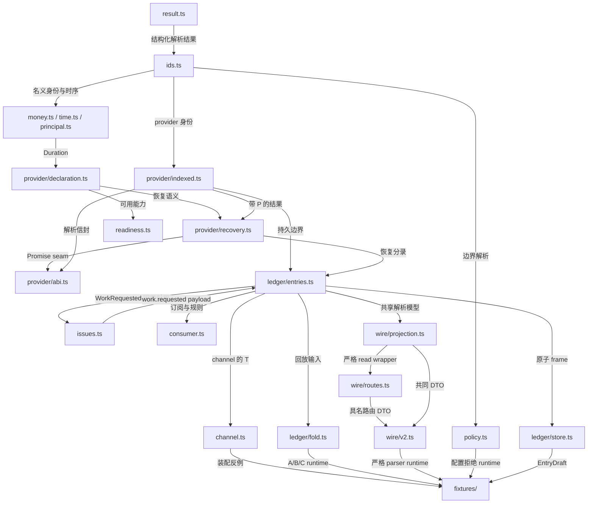

# UTA 类型契约包

负责：D2–D5、D7、D9–D12 的 canonical 类型、边界 parser、静态反例和纯回放参考模型；本包不是生产 UTA 服务。
细化决定：以 `../00-decision-register.md` 的冻结决定及 Main 确认的 namespaced `OperationKind`、配置与持久化 refinements 为准。
使用类型：下表所列模块导出；同一概念 MUST 从其 owning module 导入，不另建别名副本。

## 实施计划与范围

决定性问题：冻结的恢复与帐票规律能否由无生产依赖、无能力断言的类型与实际回放共同证明？
已按顺序执行：解析边界与 brands；provider-indexed recovery；帐票、ABI 与 wire；逐文件负例编译；A/B/C 和边界函数 runtime。
最廉价的裁决是本目录三条检查命令的实际结果，不是全仓库 build。计划已由 `UtaMentor` 单轮确认。
Main 已明确裁决：`ReadByKeyContract` 两类 coverage 均允许 `unverified`；下面包含所点名的全部五家 provider。
范围外：网络 provider 实现、文件引擎、HTTP server、UI、生产发布。本包不证明这些外部行为已实现；其实际验收见 `../08-verification.md`。

## 模块图与名称归属

图中的边表示类型/值的使用关系；`issues.ts` 与 `ledger/entries.ts` 的 schema 回边由 `z.lazy` 延迟到解析时求值，不在模块初始化时读取尚未初始化的构造。



| 模块 | canonical 导出与责任 |
|---|---|
| `result.ts` | `Result<T,E>`、`ParseError`、`assertNever`、`unwrap`；预期失败为 `error`，`unwrap` 仅在固定 fixture 输入断言成功时使用 |
| `ids.ts` | 身份与 hash 品牌、`Source`、`ProviderErrorCode`、`SourceDigest`、`ByteOffset`、`EntryPosition`/`HeadPosition`、`parseX`/对应 schema、`deriveConfigRevision`、`OperationKind`/`CoreOperationKind` |
| `money.ts` | `DecimalString`、`Money`、`Qty` 及各 parser；不使用浮点数规范化金融值 |
| `time.ts` | `Duration`、`Freshness`；重导出 `Instant`、`AsOf` 及 parser |
| `principal.ts` | `Principal`、`PrincipalKind`、`Origin`；stamp 的 IO owner 是 Alice，不是请求 body |
| `provider/declaration.ts` | `ProviderDeclaration`、`CapabilityTable`、`CapabilityStatus`、`WriteContract`、D3 三类 contract |
| `provider/indexed.ts` | `ProviderTypes`、`Operation<P>`、`Receipt<P>`、`Observation<P>`、provider-indexed key/ref 与 parser、`ReceiptProvenance`、`ProviderEnvelope`、`ProjectionRegistry`、`OrderState`、`Serializable` |
| `provider/recovery.ts` | `PlacementRecovery<P>`、`RecoveryResult<P>`、`RecoveryAttempt<P>`、`RecoveryAction<P>`、`VerifiedReadByKey`、`AbsenceProof`、`verifyReadByKey`、`nextAction`、`recoveryProbe` |
| `provider/abi.ts` | `PackModule<D>`、`Translation<P>`、transport Promise seams、`StreamItem<P>`、`StreamManifest`/`StreamChannel`、`LoaderValidationResult`、`PackLoader`、可执行 `validatePackModule` |
| `channel.ts` | `ReadOnly<T>`、`ReadWrite<E,T>`、non-distributive `Handler`/`WriteHandler`、`Handlers<Spec>`、具名 `Heartbeat` |
| `ledger/entries.ts` | `LedgerPayloads`、`EntryEnvelope`、`EntryOf`、`LedgerEntry`、`UnknownLedgerEntry`、`ReasonTree`、`DecisionScope`、`PolicyResult` |
| `ledger/store.ts` | `AppendStore`、`EntryDraft`、`AppendResult`、`CloseResult`、`OpenResult`、durability ADT、`LedgerFrame`/parser、`HeadState`、`RecoveryReport`、`ViewCheckpoint`、`MigrationMarker`、`GENESIS_HASH` |
| `ledger/fold.ts` | `IntentOutcome`、`OrderProjection`、`ProposalOutcome`、`intentOutcome`、`orderProjection`、`proposalOutcome`、`validateReversal`；均为纯函数/派生值 |
| `consumer.ts` | `Consumer<K,Context>`、`RuleResult`；`checkpoint:LedgerPosition` 与必需 `onUnknown` |
| `policy.ts` | `RuleConfig`、`AuthorizationPolicy`、`UtaRuntimeConfig` 的严格 schemas/parser；`deriveRuntimeConfigDigest` |
| `readiness.ts` | `AccountReadiness`、`WritableBlockedReason`、`ReadableState`、`makeAccountReadiness`、`ProcessHealth`；不写入交易帐票 |
| `wire/projection.ts` / `wire/routes.ts` / `wire/v2.ts` | shared schemas、每条 route 的具名 request/response、统一公开 barrel；`LedgerEntryWire`、`UnknownLedgerEntryWire` 复用持久模型 |
| `issues.ts` | `WorkRequested`、`DecisionAction`、Alice 入口 `DecisionRequest`/`DecisionResponse`、`UtaDeskSettings`、`DeskBridgeLink`、`DeskBridgeLinkStore` |
| `fixtures/` | 正向装配、五家声明、纯回放；独立负例和唯一 Effect 导入文件 |

## 边界与品牌规则

- `OperationKind` MUST 保持开放的 branded `` `${string}.${string}` `` 类型。parser 接受小写、非空、点分 namespace（每段允许数字、`_`、`-`），拒绝裸 `place`。`CoreOperationKind` 仅含 `order.place | order.modify | order.cancel | position.close`，不是全部 provider 操作的中央枚举。`coreOperationKind` 对扩展返回 `UnknownKind`，`fixtures/positive/composition.ts` 演示 consumer 转为 `reject(UnknownKind)` 和对核心子集的穷尽 switch。
- `CapabilityTable` 的 key、`Operation.kind` 和 intent 的 `scope.operationKind` MUST 是同一已解析名字；禁止隐式 `place`/`order.place` alias。读示例使用 `order.observe`，不会因此获得 write handler。
- 身份 MUST 经 `parseX(unknown)` 才进入领域。`AccountId` 另须通过 registry 解析；字符串 parser 的 path-safe 正则不代替 registry 权限/存在性检查。
- `Instant`、`AsOf` 为各自品牌的非负 safe-integer epoch milliseconds；`Duration` 为正 safe-integer milliseconds；`AttemptNo >= 1`，`LedgerPosition >= 0`。`EntryPosition >= 1` 与 `HeadPosition >= 0` 是不同品牌，head 的 0 不能作为分录 position。`ScopeHash`、`IntentHash`、`Sha256`、`ConfigRevision`、`SourceDigest` 均只接受 64 位 lowercase hex。保留 `/__uta/health` 的 `ProcessHealth.startedAt` 为 ISO-8601 string（`services/uta/src/main.ts:42,148-151`）；这不是 v2 `Instant`。
- `DecimalString` 接受无指数、无多余前导零、无末尾小数零的有限十进制文本；`-0`、numeric JSON、`NaN`、超出 maxScale（缺省 18）均拒绝。provider sentinel MUST 在 kind-specific translator 中先拒绝；通用 parser 不猜某个有限数字是否是 vendor sentinel。`Money.currency`、`Qty.unit` MUST 保留数值语境。
- `Cursor` 的品牌载荷为 `{providerId,channel,value}`，不是 ledger position；`CursorMap` 是 wire 上独立的 account-position map。
- 本包没有生产 `src/**` import。除 `as const` literal preservation 外，类型断言仅允许出现在标注 `PARSER BOUNDARY` 的品牌构造位置；不得用断言补造 provider index、handler、恢复证据或 required DTO 字段。

## 恢复与 existential 边界

`ProviderTypes` 是每个 projection 局部定义的参数族，不是全局 declaration-merge 方法表。phantom identity MUST 同时保留 `ProviderId` 与 `ProjectionVersion`。`ProviderEnvelope` 是 `OperationEnvelope | KeyEnvelope | ReceiptEnvelope | ObservationEnvelope | ConfigEnvelope`；每种均有固定 `role`、`providerId`、`projectionVersion`、`kind:OperationKind` 与角色专属 payload。`ProjectionRegistry.reassociate` 的 rank-2 callback 约束完整 `decodeOperation/decodeReceipt/decodeObservation/recoveryFor`，不提供 cast 型恢复 API；registry 的 IO 实现仍在生产实施范围。

`PackModule<D extends ProviderDeclaration>` 的 `recovery[venue][supportedKind]` 和 `bindings[venue][supportedKind]` 由 declaration 映射，漏掉任一 supported write 的 witness 必须编译失败。supported write 的 contract MUST 排除 none/none。`validatePackModule` 实际验证 ABI version、declaration、expected identity、runtime callable exports、对应 witness/contract/binding；返回 `loaded{module}` 或 `invalid{code:ApiVersion|DeclarationInvalid|MissingHandler|NonSerializable|ProjectionIdentity,path}`。load 成功后的 wrapper 继续解析每次返回结果，不能把第一次校验当作永久信任。

`TransportRequest` 的 business payload MUST 为 `Serializable`；`deadline:Duration` 与 `control.signal?:AbortSignal` 是不持久化的控制值。`TransportResult` 仅为 `responded | notSent | unknown`，unknown 必需 send evidence。`WSExecutor` MUST 绑定 manifest 声明的 channel，流值只能是 `StreamItem<P>.event | gap | ended`；只有 event 可参与 Observation 构造。gap/ended 禁止携带伪观察 payload/asOf。

`Serializable` 是唯一未解释 raw payload seam，不得代替交易 domain model。`serializableSchema` 在每层拒绝非 plain-object prototype、非有限 number、undefined 等，包括真实 Decimal、嵌套 Date。`readProjectionResponseSchema` 的静态输出约束拒绝 Date/function/bigint/required-undefined/undefined 数组；仅含数据字段的 class 无法靠 TypeScript 结构类型区别于 plain object，仍 MUST 由 runtime prototype 检查拒绝。Zod optional-property 输出中的 undefined 仅按可省略属性处理，实际值仍须通过 runtime JSON 检查。生产网络输入的字节/深度预算、循环图、模块沙箱与成品 digest 复核仍须按 `../04-provider-projections.md`、`../08-verification.md` 实施，本包不声称覆盖这些 hostile-module 环境。

`nextAction(declaration,result,attempt,now)` 与 `recoveryProbe` 均不执行 IO：

| 输入/条件 | 确定性输出 |
|---|---|
| 合法 `found` | `recordFound`；调用方 MUST 同帧追加 recovered receipt、observation 与引用其 entryId 的 recovery.resolved；found 本身不能产生上游事实 |
| `latestMatch` 的 `found.correlation` 未匹配 echoed key + payload hash | `awaitingReview`/`AmbiguousRecovery`，不把最近一单当成本次 placement；Pack 正常化层 MUST 把这种候选产出为 `ambiguous` |
| verified `confirmedAbsent` + 同一契约/时间窗口 + 安全幂等语义 | `retrySameKey`，仅返回原 `ProviderKey<P>` |
| `confirmedAbsent` 过期、契约不匹配或 idempotency/window 未证实 | `awaitingReview`；不生成新 key |
| `ambiguous` | `awaitingReview` |
| `stillUnknown` 且未满 `maxUnknownDuration` | `scheduleRecheck.at` clamp 到 `(now, unknownSince + maxUnknownDuration]`，禁止过期即忙循环或越过预算 |
| `stillUnknown` 恰好到达/超过预算 | `awaitingReview`/`UnknownDurationExceeded` |
| `recoveryProbe` 有 client lookup | `keyedLookup` |
| 已有已关联 provider ref | `providerRefLookup` |
| 仅 cachedReplay 且仍在 retention 内 | `replaySameKey`，不是 `attempt.started` |
| 无安全 lookup/replay | `awaitingReview`，unique-key duplicate rejection 不能代替 lookup |

`VerifiedReadByKey` 是 **契约 refinement** 而非“某次查找肯定成功”：仅 `byClientKey + openAndHistory + finite historyWindow + unique` 可构造。`openOnly` 不覆盖已经终结的原单，`byProviderRef` 在丢失引用的 crash window 中不能证明原单不存在，因此本模型不从这两类 miss 产出 absence。`AbsenceProof` 还记录 attempt/check 时间；`nextAction` 校验当前 declaration、proof window 和 validUntil。`untilTerminal` 的重投须另有 `knownNonterminal`，`unverified` 不能视为未终结。

## 帐票、配置与 wire 约束

- `LedgerEntry` 含 D4 全部九类及 D9 的 `work.requested`。后者的七个 sub-kind 位于 `WorkRequested.kind`；不要改为七个并列的 ledger envelope kind。
- `EntryDraft` 没有 `position/recordedAt`；writer 分配连续 `EntryPosition`。`parseLedgerEntry` 对已知 kind 的 payload/角色/correlation 错误 MUST 返回 `Corrupt`，不得降级为 Unknown。未知 kind 经完整通用 envelope 校验后保留 `unconsumed`。`LedgerFrame` parser 校验 account、连续位置、最终位置，以及 found 引用的同帧 receipt/observation 的 intent/attempt/provider/version/ref 一致。`AppendStore.append` 只接受已知 draft；`replay` 可包含未知分录；`close()` 返回 `CloseResult`，已关闭 append 返回 `closed`。
- `GENESIS_HASH` 为 64 个 `0`；空 head 的 position 为 0、segment 为 `segment-000001.jsonl`、byteOffset 为 0。line hash 不在 `LedgerFrame` body 自引用；物理编码见 `../03-ledger-and-persistence.md`。
- `DurableWeak` 不可伪装成 `Durable`；本包只定义 seam，不声称已在 Windows 验证 directory fsync。
- fold 输入 MUST 是同一 account、按 position 排序且已校验的 replay。它们不排序墙钟、不触发 provider IO。`orderProjection` 对关联该订单却不能解析 state 的观察返回 `unconsumed{reason:ParseError}`，禁止静默跳过；成功输出保留完整 `ObservationEnvelope`。state 全部字段参与相等性比较，属性顺序不同不冲突；相同观察不推进，较低 asOf 不回退，同 asOf 冲突保留较后 position 并 flag。receipt/fill 事实只能从 `receipt.recorded`/`observation.recorded` 派生，`recovery.resolved.found` 的 refs 不重复授权。
- `intentOutcome` 的授权 fold 仅执行 binding policyResult；recommendation 不授予执行权，过期后 decision 不恢复授权，attempt 后 withdraw 不回滚 provider。reversal 的 legality 由 `validateReversal` 在 append 前检查；其后必须提出新的 compensation intent。
- `UtaRuntimeConfig` 是 Alice 写、UTA 读的 strict whole-replace schema，无 persisted `configRevision`。`deriveRuntimeConfigDigest` 对去掉 updatedAt 的 canonical semantic object 求 SHA-256；`deriveConfigRevision` 再对 canonical `{accountConfigDigest,projectionVersion,runtimeConfigDigest}` 求 SHA-256。account digest 来源 MUST 为不含 secret 的 account row。四个 per-account 表同集合且不重复，`maxProviderConnections >= 100`，schema v1 segment bytes 固定 16777216；其余容量/保留值为正 safe integer。`selfApprove` 排除 `system`。
- `UtaRuntimeConfig.mode?` 只接受 `lite | readonly | pro`。effective mode MUST 在启动时按 env、config、default(lite) 的顺序解析，不热重载；`ReadinessResponse.process:ProcessSnapshot` 为 `{state,mode:{value,source:env|config|default}}`，accounts 内的 process 仍为 `ProcessState`。`fx.maxAge:Duration` 是必填配置，且与显式 mode 一样参与 semantic digest。FX fresh 可用于规则/授权，stale/missing 仅供显示；不得从缺失值猜 freshness。
- `MigrationMarker` 仅为 `archived{legacyDigest,archivedPath,completedAt} | noLegacySource{completedAt}`；无 `ledgerHead`，不得为不存在的旧 archive 生成假 digest。
- `intentId`、`proposalId`、`decisionId` MUST 由调用方生成。Alice `DecisionRequest` 恰为 `{decisionId,action,scopeHash}`；Alice 解析 scope 后转 UTA 四字段 `AuthorizationDecisionRequest`，不从 body 接收 Principal。成功 response 只有 `recorded`；失败是非 2xx `ErrorEnvelope`。intent route 的 body.accountId 是自描述例外，path/body 不同返回 409 `ScopeMismatch`。
- `EventsQuery`：省略 account cursor 从该 account 当前 head 开始；显式 0 才完整回放。`wait` 缺省 0、上限 25000；`limit` 缺省 500、上限 2000。schema 保留“未提供 cursor”与“提供 0”的区别；fan-in 顺序/分页算法由服务实现。
- `EventsResponse` 固定 `{items,nextCursors,readiness}`；每项 top-level `{source,accountId,position,entry}`，readiness 为当前快照，不能伪造 position 后写入帐票。
- `ErrorEnvelope` MUST 携带 `requestId/message/why:ReasonTree`。`LegacyRouteRemoved` 另带 replacement，`Timeout` 另带 phase。`ProviderUnknown`/`ServiceDraining` 为 503，`InternalError` 为 500 安全消息，`CapabilityUnsupported` 仅 422。readiness 的 blocked reason 精确为 `Draining`、`ConfigInvalid`、`LedgerUnreadable`、`TransportDisconnected`、`FirstObservationRequired`、`QuarantineCapacityExceeded`、`NoPlacementRecovery`，按此优先级取主 reason，剩余放 secondary；constructor 实际验证跨字段一致性。
- simulator 的 tick 保留 `{nativeKey,deltaPercent:DecimalString}` 相对价格语义；金融值坚持 decimal strings。纯假设变化用 `SimulatePriceRequest`，不冒充 simulator mutation。

## 五家提供商声明与恢复可达性

下面是**证据声明 fixture**，不是可激活 release。`sourceDigest` 是 fixture 文本种子的真实 SHA-256，既非占位 hash，也不冒充 vendor/Pack 成品 digest；`auth:[]` 不声明生产认证方案。生产激活 MUST 验证独立成品 digest/auth 证据，不能直接部署这些 fixture。写 status 全部为 `unsupported/NoPlacementRecovery`：现有 adapter 不暴露 caller-keyed placement/recovery（`packages/uta-protocol/src/types/broker.ts:528-531,569-577`；`services/uta/src/domain/trading/brokers/registry.ts:118-128`）。下面恢复可达性指完成正确 wrapper 与证据解析之后，不能推翻当前 unsupported。

| Provider | D3 已知 idempotency/read 语义 | wrapper 正确接入后可达的 `RecoveryResult` | 当前材料不可达 |
|---|---|---|---|
| Alpaca | `client_order_id`；window/reuse/duplicate/coverage/history 未验证；client lookup | `found`（keyedRead）；读失败/未证实 miss 为 `stillUnknown` | `confirmedAbsent`；按未知 duplicate 行为重试 |
| Longbridge | `client_request_id` 缓存 600000ms；只知 provider-ref lookup | retention 内 `found`（replay）；已有 ref 可 `found`（providerRefRead）；否则 `stillUnknown` | 无 ref 且缓存过期后的 absence；缓存过期自动 resubmit |
| OKX | `clOrdId` pending 唯一、terminal 可复用；lookup latestMatch | `ambiguous`；有 echo + matching payload hash 才 `found`；`stillUnknown` | 缺历史窗口证明的 `confirmedAbsent`；把 latestMatch 直接当成本次单 |
| IBKR CP | `cOID` 86400000ms 唯一；terminal reuse/duplicate 未验证；provider-ref read | 有 ref 可 `found`（providerRefRead）；无 ref 为 `stillUnknown` | `confirmedAbsent`、直接借 TWS 能力构造本声明 |
| Bybit | `orderLinkId` duplicate rejectsWithCode；window 未验证；lookup openOnly | `found`（keyedRead）；未返回匹配时 `stillUnknown` | `confirmedAbsent`；以 duplicate rejection 证明 absence |

所有 provider 都可能遭遇运行时数据不一致，故 API 仍保留 `ambiguous`；表只列当前具体契约已建立的路径。snapshotOnly 仅说明这些示例未宣称 resumable order stream，不否认 vendor 的其他独立 feed。
当前 adapter 证据分别为 `services/uta/src/domain/trading/brokers/alpaca/AlpacaBroker.ts:304-318`、`services/uta/src/domain/trading/brokers/longbridge/LongbridgeBroker.ts:271-304`、`services/uta/src/domain/trading/brokers/ccxt/CcxtBroker.ts:524-530,1127-1145`、`services/uta/src/domain/trading/brokers/ibkr/IbkrBroker.ts:491-502`。IBKR CP 的 cOID 材料 MUST NOT 归到现有 TWS adapter。官方材料与未验证项详见 `../04-provider-projections.md`。

以下代码与 `fixtures/positive/providers.ts` **逐字相同**；import 路径相对于该 fixture 文件。它实际参加 `pnpm typecheck`，不是仅排版的伪代码。

```typescript
import { parseProviderId, parseProjectionVersion, parseOperationKind, parseSourceDigest, sha256 } from '../../ids.ts';
import { parseDuration } from '../../time.ts';
import { unwrap } from '../../result.ts';
import type { ProviderDeclaration } from '../../provider/declaration.ts';
import { providerDeclarationSchema } from '../../provider/declaration.ts';
const ms = (n:number)=>unwrap(parseDuration(n));
const version = unwrap(parseProjectionVersion('evidence-2026-09-14'));
const placeKind = unwrap(parseOperationKind('order.place'));
const observeKind = unwrap(parseOperationKind('order.observe'));
const sourceDigest = unwrap(parseSourceDigest(await sha256('UTA provider declaration evidence fixture')));
// These are evidence fixtures, not production release digests or writable Pack declarations.
export const alpaca:ProviderDeclaration = {
 providerId:unwrap(parseProviderId('alpaca')),projectionVersion:version,sourceDigest,transportFamily:['http'],auth:[],
 venues:{alpaca:{[placeKind]:{direction:'write',status:{kind:'unsupported',reason:'NoPlacementRecovery'},contract:{idempotency:{kind:'uniqueKey',keyField:'client_order_id',scope:'account',window:'unverified',reuseAfterTerminal:'unverified',duplicateResponse:'unverified'},readByKey:{kind:'byClientKey',operation:'getOrderByClientOrderId',coverage:'unverified',historyWindow:'unverified',ambiguity:'unique'}}},[observeKind]:{direction:'read',status:{kind:'supported'},cursor:{kind:'snapshotOnly'}}}}
};
export const longbridge:ProviderDeclaration = {
 providerId:unwrap(parseProviderId('longbridge')),projectionVersion:version,sourceDigest,transportFamily:['http'],auth:[],
 venues:{longbridge:{[placeKind]:{direction:'write',status:{kind:'unsupported',reason:'NoPlacementRecovery'},contract:{idempotency:{kind:'cachedReplay',keyField:'client_request_id',scope:'account',retention:ms(600000)},readByKey:{kind:'byProviderRef',coverage:'unverified',historyWindow:'unverified'}}},[observeKind]:{direction:'read',status:{kind:'supported'},cursor:{kind:'snapshotOnly'}}}}
};
export const okx:ProviderDeclaration = {
 providerId:unwrap(parseProviderId('okx')),projectionVersion:version,sourceDigest,transportFamily:['http'],auth:[],
 venues:{okx:{[placeKind]:{direction:'write',status:{kind:'unsupported',reason:'NoPlacementRecovery'},contract:{idempotency:{kind:'uniqueKey',keyField:'clOrdId',scope:'account',window:'untilTerminal',reuseAfterTerminal:true,duplicateResponse:'unverified'},readByKey:{kind:'byClientKey',operation:'getOrder',coverage:'openAndHistory',historyWindow:'unverified',ambiguity:'latestMatch'}}},[observeKind]:{direction:'read',status:{kind:'supported'},cursor:{kind:'snapshotOnly'}}}}
};
export const ibkrCP:ProviderDeclaration = {
 providerId:unwrap(parseProviderId('ibkr-cp')),projectionVersion:version,sourceDigest,transportFamily:['http'],auth:[],
 venues:{'ibkr-cp':{[placeKind]:{direction:'write',status:{kind:'unsupported',reason:'NoPlacementRecovery'},contract:{idempotency:{kind:'uniqueKey',keyField:'cOID',scope:'account',window:ms(86400000),reuseAfterTerminal:'unverified',duplicateResponse:'unverified'},readByKey:{kind:'byProviderRef',coverage:'unverified',historyWindow:'unverified'}}},[observeKind]:{direction:'read',status:{kind:'supported'},cursor:{kind:'snapshotOnly'}}}}
};
export const bybit:ProviderDeclaration = {
 providerId:unwrap(parseProviderId('bybit')),projectionVersion:version,sourceDigest,transportFamily:['http'],auth:[],
 venues:{bybit:{[placeKind]:{direction:'write',status:{kind:'unsupported',reason:'NoPlacementRecovery'},contract:{idempotency:{kind:'uniqueKey',keyField:'orderLinkId',scope:'account',window:'unverified',reuseAfterTerminal:'unverified',duplicateResponse:'rejectsWithCode'},readByKey:{kind:'byClientKey',operation:'getOrder',coverage:'openOnly',historyWindow:'unverified',ambiguity:'unique'}}},[observeKind]:{direction:'read',status:{kind:'supported'},cursor:{kind:'snapshotOnly'}}}}
};
for(const declaration of [alpaca,longbridge,okx,ibkrCP,bybit])providerDeclarationSchema.parse(declaration);
console.log('PASS providers: five non-activatable evidence declarations with synthetic source digest');
```

## 静态反例与 runtime 证明

负例不使用 `@ts-expect-error` 压制诊断；每个文件的 `// Expected TSxxxx:` 是 runner 合约。runner MUST 逐文件启动 TypeScript 5.9.3，验证非零退出、至少一个诊断且所有诊断均为指定错误码；意外编译成功或不相关依赖错误使整个命令失败。

| 文件（位于 `fixtures/negative/`） | 预期诊断 | 所保护的边界 |
|---|---|---|
| `read-only.ts` | TS2322 | read-only write handler 为 never |
| `union-direction.ts` | TS2322 | 未决 read/write union 不产生 write handler |
| `missing-handler.ts` | TS2741 | `Handlers<Spec>` 不允许漏掉成员 |
| `declared-kind-missing-handler.ts` | TS2741 | Pack 自身声明的 supported write 缺 witness |
| `missing-layer.ts` | TS2345 | Effect 的 residual Writer requirement 非 never |
| `no-recovery.ts` | TS2322 | none/none 无法构造 PlacementRecovery |
| `supported-none-none.ts` | TS2322 | supported write row 在声明层拒绝 none/none |
| `unverified-absence.ts` | TS2322 | confirmedAbsent 不能携带未知 coverage/window |
| `non-exhaustive.ts` | TS2345 | 漏消费 work.requested 无法通过 assertNever；只证明这一项遗漏，不声称覆盖所有新增 variant |
| `provider-mismatch.ts` | TS2322 | provider 或 projectionVersion 不同的 key 不可混用 |
| `decimal-abi.ts` | TS2322 | 真实 Decimal instance 不能成为 transport payload |
| `missing-decision-id.ts` | TS2741 | caller-owned decisionId 必须存在 |
| `readiness-writable-boolean.ts` | TS2322 | writable 是 tagged state，不是 boolean |
| `projection-date.ts` | TS2345 | 嵌套 Date 不能成为 JSON projection output |
| `projection-required-undefined.ts` | TS2345 | required undefined 不能当作可省略属性 |
| `projection-array-undefined.ts` | TS2345 | undefined 数组项不能悄悄编码成 null |

`fixtures/effect-boundary.ts` 是唯一导入 Effect 的文件，故意仅由 negative runner 编译。它从实际 `Effect.provide` 的结果提取 `Effect.Effect.Context`，向要求 `never` 的 closed-root 检查传入 residual Writer，得到 TS2345。本包不提供正向 Effect runtime composition 证明，不把 negative 文件内其他表达式当作已运行服务。

`test:fixtures` MUST 使用 `fixtures/positive/*.ts` glob，新增正例自动进入运行。`replay.ts` 从明确持久历史执行 A/B/C：A 先追加 processRestart unknown receipt 再恢复；B 乱序/重复/冲突观察；C rejection、独立 compensation 与 late reversal。其余断言检查恢复许可、strict boundary、配置派生和坏输入，不把 fixture pass 外推到文件引擎或 provider 网络。

`supported-without-witness.ts` 执行本包真实 `validatePackModule`：缺 witness 与 none/none 拒绝、合法模块 load 后调用 HTTP wrapper、identity 校验、WS manifest 强制匹配、event/gap/ended 迭代及 session close。输入 transport 是本地合成 ABI fixture，不是 vendor sandbox 证明。`readiness.ts` 执行跨字段拒绝与 reason precedence；`routes-catalogue.ts` 执行具名路由/schema 合约；`providers.ts` 与 `composition.ts` 也参加 glob。

## 可复现命令与实际输出

运行位置 MUST 是本目录；不接入 root workspace，不改 root lockfile。固定 TypeScript 5.9.3（根 `pnpm-lock.yaml:5235`），Effect 3.22.2；Zod 使用 ^4 且本地 lock 固定 4.6.2；Decimal 仅作为拒绝 fixture 的 dev dependency，固定 10.6.0（根 `pnpm-lock.yaml:2786`）。验证环境为 Node 26.8.1、pnpm 11.25.0；Node 22/Bun 的完整 UTA/Pack 启动矩阵仍 unverified，按 `../08-verification.md` 实跑。

```sh
cd plans/uta-refactor/spec/types
pnpm install --ignore-workspace
pnpm typecheck
pnpm typecheck:negatives
pnpm test:fixtures
```

以下为本次三条 scoped gate 的实际输出摘要，均 exit 0；runtime 使用上面的完整 glob 命令，未使用 extension-remap 或编译替身：

```text
$ tsc --noEmit
$ node scripts/check-negatives.mjs
PASS decimal-abi.ts: TS2322 (1 diagnostic)
PASS declared-kind-missing-handler.ts: TS2741 (1 diagnostic)
PASS missing-decision-id.ts: TS2741 (1 diagnostic)
PASS missing-handler.ts: TS2741 (1 diagnostic)
PASS missing-layer.ts: TS2345 (1 diagnostic)
PASS no-recovery.ts: TS2322 (1 diagnostic)
PASS non-exhaustive.ts: TS2345 (1 diagnostic)
PASS projection-array-undefined.ts: TS2345 (1 diagnostic)
PASS projection-date.ts: TS2345 (1 diagnostic)
PASS projection-required-undefined.ts: TS2345 (1 diagnostic)
PASS provider-mismatch.ts: TS2322 (2 diagnostics)
PASS read-only.ts: TS2322 (1 diagnostic)
PASS readiness-writable-boolean.ts: TS2322 (1 diagnostic)
PASS supported-none-none.ts: TS2322 (1 diagnostic)
PASS union-direction.ts: TS2322 (1 diagnostic)
PASS unverified-absence.ts: TS2322 (2 diagnostics)
PASS 16 negative fixtures
$ node --test --test-reporter=tap --experimental-strip-types fixtures/positive/*.ts
ok 1 - fixtures/positive/composition.ts
ok 2 - fixtures/positive/providers.ts
ok 3 - fixtures/positive/readiness.ts
# PASS A: crash, processRestart unknown, bounded stillUnknown, review.unknownOutcome, awaitingReview
# PASS B: t1/t3/t2/t3 replay = filled 100; equal-asOf conflict flagged
# PASS C: rejectedByProvider; compensation accepted; late reversal refused
# PASS boundaries: recovery permissions, provider evidence, strict config, decimals, IDs, wire, reason trees
ok 4 - fixtures/positive/replay.ts
ok 5 - fixtures/positive/routes-catalogue.ts
# PASS loader: supported witness, none/none mirror, identity, transport and stream boundaries
ok 6 - fixtures/positive/supported-without-witness.ts
1..6
# tests 6
# pass 6
# fail 0
```

未运行 formatter、linter、project-wide build/test。上述 runtime 证明覆盖本包实际 parser、loader wrapper、纯 fold；文件 fsync、HTTP ingress、真实 Pack 成品导入与 vendor sandbox、UI/Issue bridge 仍是实施验收，明确为 unverified，须在 `../08-verification.md` 指定真实环境运行，不能用本包通过替代。
